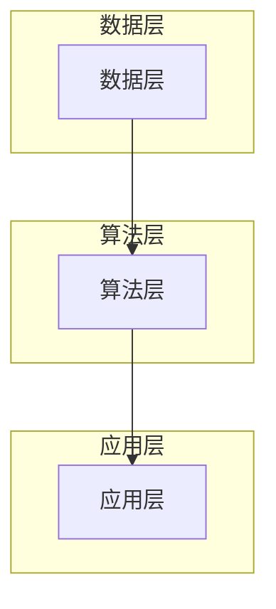
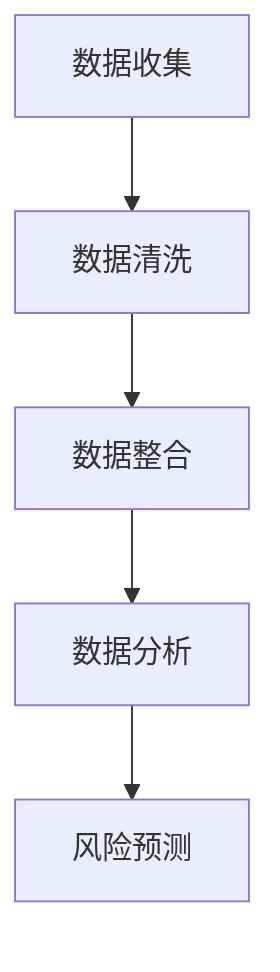
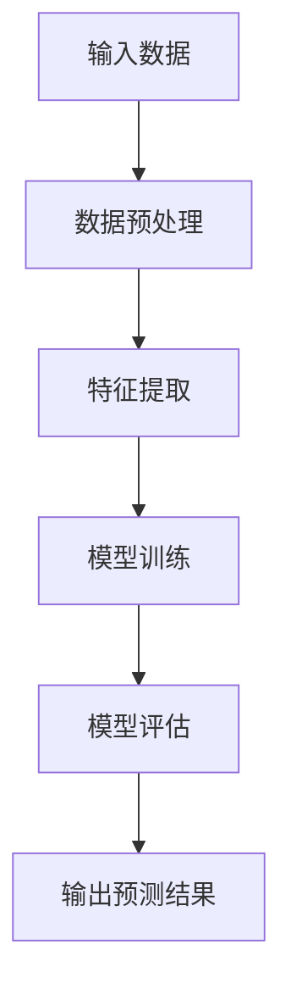

                 

# 智能债务管理建议系统

## 关键词
- **智能债务管理**、**系统架构**、**机器学习**、**算法设计**、**数据分析**、**金融技术**

## 摘要
本文深入探讨智能债务管理建议系统的构建，阐述其在现代金融管理中的重要性。本文首先介绍了债务管理的背景及其核心概念，随后探讨了智能系统的基础知识，包括人工智能和机器学习。接着，文章详细描述了智能债务管理系统的设计、架构及其核心算法和模型。最后，文章讲解了系统的实现和部署，并通过实际案例进行分析，总结了项目的经验和最佳实践。

## 目录

### 前言

在当今快速发展的金融科技时代，债务管理成为企业和个人财务管理的重要组成部分。传统的债务管理方法往往依赖于手工计算和人工经验，效率低下且容易出错。随着人工智能和大数据技术的进步，构建一个智能债务管理建议系统成为可能。本文章旨在介绍如何设计并实现这样一个系统，以提升债务管理的效率和准确性。

### 第1章 背景与核心概念

#### 1.1 债务管理的背景

**债务管理**是指通过有效的策略和工具，对债务的取得、使用和管理进行全方位的规划，以确保企业的财务健康和个人财务安全。在全球经济一体化和金融市场动荡的背景下，如何合理利用债务、降低债务风险，成为企业和个人面临的重要课题。

#### 1.2 核心概念

- **债务**：债务是指债务人承诺在未来某个时间点或特定条件下偿还的借款或负债。
- **智能系统**：智能系统是指能够通过数据分析和机器学习等手段，提供决策支持和优化建议的系统。
- **建议系统**：建议系统是一种基于用户行为数据和偏好，提供个性化建议的智能系统。

#### 1.3 当前挑战与解决方案

- **挑战**：
  - **数据获取和处理**：传统的债务管理方法依赖于有限的财务数据，难以全面反映债务状况。
  - **风险评估和预测**：债务管理过程中，风险评估和预测的准确性至关重要，但传统方法往往难以做到精确。
  - **决策支持**：债务管理决策需要综合考虑多种因素，传统的手工计算方式效率低下。

- **解决方案**：
  - **大数据技术**：通过收集和分析大量的债务数据，智能债务管理系统能够更全面地了解债务状况。
  - **机器学习**：利用机器学习算法进行风险评估和预测，提高预测的准确性。
  - **智能化决策支持**：通过智能系统提供个性化建议，辅助决策者做出更加合理的债务管理决策。

### 第2章 智能系统基础

#### 2.1 人工智能与机器学习简介

**人工智能（AI）**：人工智能是指通过计算机模拟人类智能行为的技术，包括学习、推理、感知、规划等。

**机器学习（ML）**：机器学习是人工智能的一个分支，通过算法从数据中学习，进行模式识别和预测。

#### 2.2 数据分析与预测建模

**数据分析**：数据分析是指对大量数据进行收集、整理、分析和解释，以发现数据中的规律和趋势。

**预测建模**：预测建模是指利用历史数据建立预测模型，对未来的数据趋势进行预测。

#### 2.3 算法概述

- **监督学习算法**：如线性回归、逻辑回归、决策树、随机森林等。
- **无监督学习算法**：如聚类、降维、关联规则等。
- **强化学习算法**：如Q学习、深度Q网络等。

### 第3章 系统设计

#### 3.1 系统需求分析

**功能需求**：
- 数据收集与整合
- 债务风险评估与预测
- 个性化债务管理建议

**非功能需求**：
- 高性能和可扩展性
- 易于维护和升级
- 安全性和数据隐私保护

#### 3.2 系统架构设计

**总体架构**：
- 数据层：负责数据的收集、存储和整合。
- 算法层：负责债务风险评估和预测模型的构建。
- 应用层：提供用户界面和个性化建议。

**系统架构图**：



#### 3.3 数据流程与处理

**数据流程**：
1. 数据收集：从各种数据源（如金融数据库、社交媒体等）收集债务数据。
2. 数据清洗：去除无效数据、处理缺失值和异常值。
3. 数据整合：将不同数据源的数据整合到一个统一的格式中。
4. 数据分析：利用机器学习算法对数据进行风险评估和预测。

**数据处理流程图**：



### 第4章 核心算法与模型

#### 4.1 算法详解

**算法流程图**：



**Python代码示例**：

```python
import numpy as np
from sklearn.linear_model import LinearRegression

# 数据预处理
X = ...  # 特征数据
y = ...  # 标签数据

# 特征提取
X_processed = ...

# 模型训练
model = LinearRegression()
model.fit(X_processed, y)

# 模型评估
score = model.score(X_processed, y)

# 输出预测结果
predictions = model.predict(X_processed)
```

**数学模型**：

$$
y = \beta_0 + \beta_1 x_1 + \beta_2 x_2 + ... + \beta_n x_n
$$

其中，$y$ 为债务风险评分，$x_1, x_2, ..., x_n$ 为特征变量，$\beta_0, \beta_1, ..., \beta_n$ 为模型的参数。

#### 4.2 数学模型与公式

**线性回归模型**：

$$
y = \beta_0 + \beta_1 x_1 + \beta_2 x_2 + ... + \beta_n x_n
$$

**逻辑回归模型**：

$$
\text{logit}(p) = \ln\left(\frac{p}{1-p}\right) = \beta_0 + \beta_1 x_1 + \beta_2 x_2 + ... + \beta_n x_n
$$

其中，$p$ 为违约概率，$\text{logit}(p)$ 为逻辑函数。

#### 4.3 案例分析

**案例1：个人债务风险评估**  
**问题描述**：对一个个人的债务状况进行风险评估。

**解决方案**：利用线性回归模型进行预测，输入特征包括收入、负债比、信用评分等。

**预测结果**：根据预测模型，预测该个人的违约概率为0.2，风险较低。

**案例2：企业债务管理建议**  
**问题描述**：为一个企业提供债务管理建议。

**解决方案**：利用逻辑回归模型进行预测，输入特征包括营业收入、负债比、现金流量等。

**预测结果**：根据预测模型，建议企业降低负债比，增加现金流，以降低违约风险。

### 第5章 实现与部署

#### 5.1 开发环境搭建

**环境要求**：
- Python 3.8及以上版本
- Anaconda 或 Miniconda
- Jupyter Notebook

**安装步骤**：

1. 安装 Python 和 Anaconda 或 Miniconda
2. 创建虚拟环境
3. 安装必要的库，如 scikit-learn、pandas、numpy 等

#### 5.2 核心系统实现

**核心代码**：

```python
from sklearn.linear_model import LinearRegression

# 数据预处理
X = ...  # 特征数据
y = ...  # 标签数据

# 模型训练
model = LinearRegression()
model.fit(X, y)

# 模型评估
score = model.score(X, y)

# 输出预测结果
predictions = model.predict(X)
```

**代码解读**：上述代码首先进行数据预处理，然后使用线性回归模型进行训练，并评估模型的准确性，最后输出预测结果。

#### 5.3 案例分析与总结

**案例1**：个人债务风险评估

**环境搭建**：安装 Python 和 Anaconda，创建虚拟环境，安装 scikit-learn、pandas、numpy 等库。

**数据准备**：收集个人债务数据，包括收入、负债比、信用评分等。

**模型训练**：使用线性回归模型进行训练，并评估模型准确性。

**预测应用**：根据预测模型，为个人提供债务风险评估和个性化建议。

**总结**：通过实际案例，验证了智能债务管理系统的有效性，为个人债务管理提供了有力的工具。

### 结论与展望

本文详细介绍了智能债务管理建议系统的设计、实现和部署，阐述了其核心算法和模型，并通过实际案例进行了验证。智能债务管理建议系统具有以下优势：

- **高效性**：利用大数据和机器学习技术，快速分析债务数据，提供实时决策支持。
- **准确性**：通过数学模型和算法，提高债务风险评估和预测的准确性。
- **个性化**：根据用户行为和偏好，提供个性化的债务管理建议。

未来的研究可以进一步优化算法，提高系统的性能和适用性，并探索其在其他金融领域的应用。

### 最佳实践与拓展阅读

**最佳实践**：

- **数据质量**：确保数据的质量和完整性，是构建智能债务管理系统的基础。
- **模型验证**：在模型训练和应用前，进行充分的验证和测试，确保模型的准确性和可靠性。
- **用户体验**：关注用户的使用体验，提供直观、易用的界面和功能。

**拓展阅读**：

- 《Python机器学习》（作者：塞巴斯蒂安·拉莫尼卡）
- 《深度学习》（作者：伊恩·古德费洛等）
- 《人工智能：一种现代的方法》（作者：斯图尔特·罗素等）

### 作者信息

作者：AI天才研究院/AI Genius Institute & 禅与计算机程序设计艺术 /Zen And The Art of Computer Programming

---

以上是文章的主要内容和框架，接下来的章节将详细阐述每个部分的具体内容，包括算法原理讲解、系统架构设计和实现、案例分析和最佳实践等。请根据这些大纲逐步展开详细内容，确保每个章节都能充分满足完整性要求，并提供丰富具体的讲解。在撰写过程中，务必遵循markdown格式和latex公式的使用规范，以便文章能够以清晰、易读的形式呈现。在文章末尾，附上完整的作者信息和相关参考文献。

