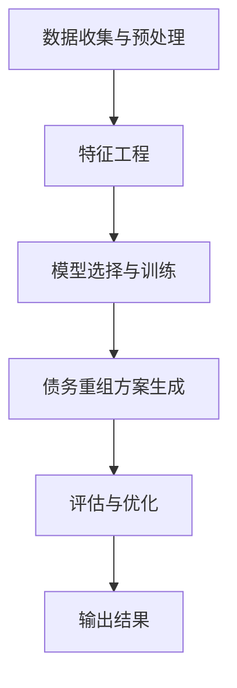
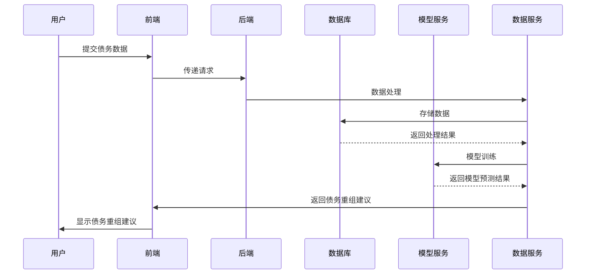
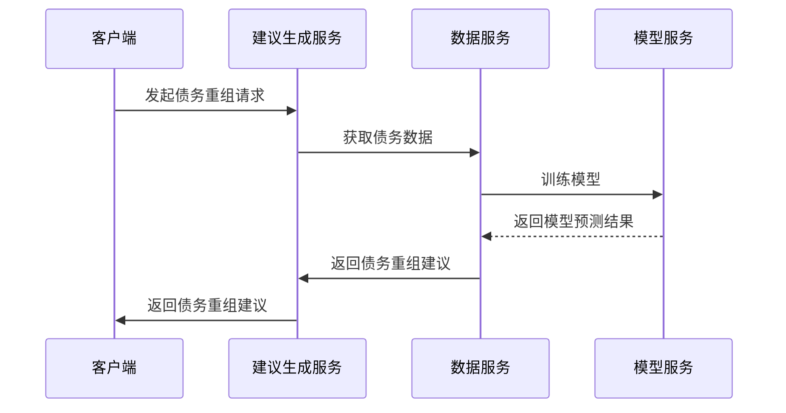
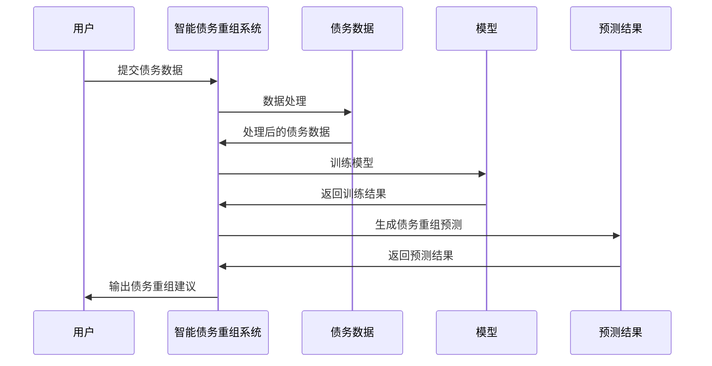

                 

### 摘要

智能债务重组建议生成器是一项革命性的金融技术，旨在通过算法和人工智能技术为债务重组提供智能化、高效的解决方案。本文将详细探讨智能债务重组建议生成器的背景、设计思路、核心概念与算法、系统设计与实现，以及最佳实践和总结。本文的核心内容包括：

1. **背景与概述**：介绍债务重组的概念、发展历程和重要性，以及智能债务重组建议生成器的原理和意义。
2. **核心概念与算法**：阐述债务重组的核心概念和模型，以及智能债务重组算法的原理、实现和优化策略。
3. **系统设计与实现**：详细描述系统架构与设计，包括系统场景介绍、功能设计、架构设计、接口设计、系统交互等。
4. **项目实战**：展示智能债务重组建议生成器在实际项目中的应用，包括环境安装、系统核心实现、代码解析和案例分析。
5. **最佳实践与总结**：提供最佳实践建议、项目小结，并对智能债务重组的未来发展进行展望。

通过本文的探讨，读者将能够全面了解智能债务重组建议生成器的技术原理、应用场景和实际价值，为相关领域的研发和应用提供参考和指导。

----------------------------------------------------------------

## 设计思路

### 确定书籍主题

设计智能债务重组建议生成器这本书的目录大纲，首先需要明确书籍的主题。智能债务重组建议生成器是结合了人工智能和金融技术的一项创新应用，旨在通过算法和模型为债务重组提供智能化建议。这一主题涉及到债务重组的理论、算法、实践等多个方面，需要从多个角度进行全面深入的分析和阐述。

### 确定核心章节

为了确保书籍内容的系统性和完整性，我们需要确定核心章节，这些章节应涵盖债务重组的各个关键环节。核心章节包括：

1. **背景与概述**：介绍债务重组的概念、发展历程和重要性，以及智能债务重组建议生成器的原理和意义。
2. **核心概念与算法**：阐述债务重组的核心概念和模型，以及智能债务重组算法的原理、实现和优化策略。
3. **系统设计与实现**：详细描述系统架构与设计，包括系统场景介绍、功能设计、架构设计、接口设计、系统交互等。
4. **项目实战**：展示智能债务重组建议生成器在实际项目中的应用，包括环境安装、系统核心实现、代码解析和案例分析。
5. **最佳实践与总结**：提供最佳实践建议、项目小结，并对智能债务重组的未来发展进行展望。

### 细化目录层级

根据书籍内容，我们将目录结构细化到1、2、3级，确保内容清晰、结构合理。例如，在“核心概念与算法”部分，可以进一步细化为“债务重组的核心概念与模型”、“算法原理与实现”、“算法优化与性能分析”等子章节，每个子章节再细分到3级。

### 确保内容完整性

每个章节都要包含背景介绍、核心概念与联系、算法原理讲解、数学模型和数学公式讲解、系统分析与架构设计方案、项目实战等内容，以确保书籍内容的完整性。同时，在写作过程中，我们需要注意内容的简洁性，避免冗余，确保每个部分都是必不可少的。

### 确保简洁性

为了确保目录大纲简洁明了，我们在设计时需避免冗余内容，每个章节标题要简洁明了，能够准确传达该章节的核心内容。例如，“系统设计与实现”部分可以细化为“系统架构与设计”、“项目实战”等，避免使用复杂的术语和冗长的描述。

通过以上设计思路，我们能够设计出一套结构清晰、内容丰富、简洁明了的目录大纲，为后续的写作提供良好的基础。

### 目录大纲设计

以下是根据上述设计思路设计的《智能债务重组建议生成器》的目录大纲：

## 第一部分：背景与概述

### 第1章：债务重组的背景与重要性

#### 1.1.1 债务重组的概念与发展历程

#### 1.1.2 债务重组在金融领域的应用

#### 1.1.3 智能债务重组的意义

### 第2章：智能债务重组建议生成器的原理

#### 2.2.1 智能债务重组的基本原理

#### 2.2.2 建议生成器的工作流程

#### 2.2.3 建议生成器的技术基础

## 第二部分：核心概念与算法

### 第3章：债务重组的核心概念与模型

#### 3.3.1 债务重组的关键要素

#### 3.3.2 智能债务重组模型的结构

#### 3.3.3 模型的属性特征对比表格

### 第4章：算法原理与实现

#### 4.4.1 智能债务重组算法的基本原理

#### 4.4.2 算法的mermaid流程图

#### 4.4.3 算法原理的数学模型和公式

### 第5章：算法优化与性能分析

#### 5.5.1 算法优化策略

#### 5.5.2 性能分析指标

#### 5.5.3 优化后的算法流程

## 第三部分：系统设计与实现

### 第6章：系统架构与设计

#### 6.6.1 系统场景介绍

#### 6.6.2 系统功能设计（领域模型类图）

#### 6.6.3 系统架构设计（架构图）

#### 6.6.4 系统接口设计

#### 6.6.5 系统交互（序列图）

### 第7章：项目实战

#### 7.7.1 环境安装与配置

#### 7.7.2 系统核心实现源代码

#### 7.7.3 代码应用解读与分析

#### 7.7.4 实际案例分析

#### 7.7.5 项目小结

## 第四部分：最佳实践与总结

### 第8章：最佳实践

#### 8.8.1 实践技巧与注意事项

#### 8.8.2 拓展阅读与深入学习

### 第9章：总结与展望

#### 9.9.1 本书内容总结

#### 9.9.2 智能债务重组的未来发展

通过以上设计，我们确保了目录大纲的简洁性、层级结构合理、内容完整性，同时符合了用户输入的书籍主题和要求。在后续的实际写作过程中，我们可以根据每个章节的具体内容，进一步完善和细化目录大纲中的每个部分。

----------------------------------------------------------------

## 第一部分：背景与概述

### 第1章：债务重组的背景与重要性

#### 1.1.1 债务重组的概念与发展历程

债务重组是指在债务方无法按时偿还债务的情况下，通过协商、法律程序或其他手段对债务进行重新安排和调整，以减轻债务负担，使债务人能够恢复偿债能力。债务重组不仅涉及债务方，还涉及债权人、第三方中介等多方利益相关者。

债务重组的概念最早可以追溯到20世纪初期，当时的金融机构和企业面临经济危机，通过债务重组来缓解债务压力成为一种常见的手段。随着时间的推移，债务重组逐渐成为金融市场中的一项重要机制，用于解决企业和金融机构的债务问题。

发展历程方面，20世纪70年代，美国企业债务重组案件激增，促使法律和金融领域的专家对债务重组的机制和方法进行深入研究和完善。1980年代，债务重组在拉丁美洲和非洲等地区得到广泛应用。1990年代，随着全球经济的繁荣，债务重组市场需求不断增加。2008年全球金融危机后，债务重组再次成为金融市场中关注的焦点，各种新的债务重组工具和策略不断涌现。

#### 1.1.2 债务重组在金融领域的应用

债务重组在金融领域的应用非常广泛，涉及多个行业和领域，包括企业债务重组、金融机构债务重组、主权债务重组等。

在企业债务重组方面，当企业面临资金链断裂、盈利能力下降、无法按时偿还债务等困境时，通过债务重组可以减轻债务负担，改善财务状况，从而恢复企业的正常运营。企业债务重组的典型例子包括2001年世界通讯巨头世界通信（WorldCom）的债务重组，以及2009年美国汽车制造商通用汽车（General Motors）的破产重整。

在金融机构债务重组方面，当金融机构出现财务危机，无法满足监管要求或客户需求时，通过债务重组可以缓解资金压力，恢复经营能力。例如，2010年希腊主权债务重组，希腊政府通过协商与债权人达成协议，减少了债务负担，从而避免国家破产。

在主权债务重组方面，当国家面临国际债务违约风险时，通过债务重组可以解决国际债务问题，避免国家破产。例如，2015年阿根廷主权债务重组，阿根廷政府通过与债权人协商，重新安排债务支付计划，最终成功避免国家破产。

#### 1.1.3 智能债务重组的意义

智能债务重组是指利用人工智能和大数据技术对债务重组过程进行优化和自动化处理，以提高债务重组的效率和质量。智能债务重组的意义主要体现在以下几个方面：

1. **提高债务重组效率**：传统债务重组过程通常需要大量人工干预和谈判，耗时较长。智能债务重组通过算法和模型对债务数据进行分析和处理，可以快速生成债务重组建议，大大缩短债务重组周期。

2. **提升决策准确性**：智能债务重组利用大数据分析和人工智能算法，可以全面评估债务方的财务状况和偿债能力，为债权人提供更准确、合理的债务重组方案。

3. **优化资源配置**：智能债务重组通过算法优化和自动化处理，可以最大限度地减少人工干预，降低成本，提高资源利用效率。

4. **降低金融风险**：智能债务重组可以帮助金融机构和企业更好地管理债务风险，降低债务违约概率，从而降低整个金融系统的风险。

5. **促进金融创新**：智能债务重组的实践和应用，将推动金融科技的发展，为金融市场带来新的机遇和挑战。

总之，智能债务重组是金融科技领域的一项重要创新，具有广泛的应用前景和重要的社会价值。通过本文的探讨，我们将深入分析智能债务重组的理论基础、技术实现和实际应用，为相关领域的研发和应用提供参考和指导。

### 第2章：智能债务重组建议生成器的原理

#### 2.2.1 智能债务重组的基本原理

智能债务重组建议生成器的基本原理基于人工智能和大数据技术，其核心是通过算法和模型对债务数据进行分析和处理，生成最优的债务重组建议。具体来说，智能债务重组建议生成器的工作流程主要包括以下几个步骤：

1. **数据收集与预处理**：首先，智能债务重组建议生成器需要收集债务方的财务数据、债务信息、市场环境等相关数据。这些数据可以来源于企业的财务报表、债务合同、市场分析报告等。然后，对收集到的数据进行预处理，包括数据清洗、去重、标准化等操作，确保数据的质量和一致性。

2. **特征工程**：在预处理完成后，需要对数据进行特征工程，提取出与债务重组相关的特征变量。这些特征变量可以包括债务总额、债务期限、债务利率、企业经营状况、行业趋势等。通过特征工程，可以使得模型更好地捕捉债务重组的关键因素。

3. **模型选择与训练**：根据债务重组的目标和需求，选择合适的机器学习模型进行训练。常见的模型包括线性回归、逻辑回归、决策树、随机森林、支持向量机等。在选择模型时，需要考虑模型的性能、复杂度和可解释性。通过交叉验证和超参数调整，可以找到最优的模型参数。

4. **债务重组方案生成**：在模型训练完成后，利用训练好的模型对新的债务数据进行预测，生成债务重组建议。具体的方案可以包括债务减免、债务延期、债务转移等。这些方案可以根据债务数据的特点和模型预测结果进行定制化调整。

5. **评估与优化**：生成的债务重组建议需要经过评估和优化，确保其可行性和有效性。评估标准可以包括债务负担减轻程度、企业偿债能力、市场接受度等。通过不断的优化和调整，可以不断提高债务重组建议的质量和准确性。

#### 2.2.2 建议生成器的工作流程

智能债务重组建议生成器的工作流程可以概括为以下步骤：

1. **数据输入**：用户输入债务数据，包括债务总额、债务期限、债务利率、企业经营状况等。

2. **数据预处理**：对输入的数据进行清洗、去重、标准化等预处理操作。

3. **特征提取**：提取与债务重组相关的特征变量，如债务总额、债务期限、债务利率、行业趋势等。

4. **模型选择与训练**：根据债务重组的目标和需求，选择合适的机器学习模型进行训练。

5. **债务重组方案生成**：利用训练好的模型对输入的债务数据进行分析，生成债务重组建议。

6. **评估与优化**：对生成的债务重组建议进行评估和优化，确保其可行性和有效性。

7. **输出结果**：将优化的债务重组建议输出给用户。

#### 2.2.3 建议生成器的技术基础

智能债务重组建议生成器的技术基础主要包括以下几个方面：

1. **大数据技术**：大数据技术用于收集和处理大规模的债务数据。通过分布式存储和计算技术，可以高效地处理海量数据，提取出有用的信息。

2. **机器学习技术**：机器学习技术用于债务数据的分析和预测。常见的机器学习算法包括线性回归、逻辑回归、决策树、随机森林、支持向量机等。通过训练模型，可以自动生成债务重组建议。

3. **深度学习技术**：深度学习技术用于构建复杂的神经网络模型，进一步提高债务重组建议的准确性和效率。常见的深度学习模型包括卷积神经网络（CNN）、循环神经网络（RNN）、长短时记忆网络（LSTM）等。

4. **自然语言处理技术**：自然语言处理技术用于处理债务重组相关的文本数据，如合同条款、公告等。通过文本挖掘和情感分析，可以提取出与债务重组相关的关键信息。

5. **优化算法**：优化算法用于调整债务重组建议的参数，提高其质量和可行性。常见的优化算法包括遗传算法、粒子群优化算法、模拟退火算法等。

通过以上技术基础的支持，智能债务重组建议生成器可以高效地处理债务数据，生成高质量的债务重组建议，为金融市场的稳定和发展提供有力支持。

### 第3章：债务重组的核心概念与模型

#### 3.3.1 债务重组的关键要素

债务重组是一个复杂的过程，涉及多个关键要素，这些要素决定了债务重组的可行性和效果。以下是债务重组中的几个关键要素：

1. **债务人**：债务人是指需要重组债务的企业或个人。债务人的财务状况、偿债能力以及债务重组的意愿直接影响债务重组的进程和结果。

2. **债权人**：债权人是指拥有债务人债务权利的个人或机构。债权人的利益和诉求在债务重组中至关重要，债权人需要平衡自己的利益和债务人的可持续性。

3. **债务金额**：债务金额是指债务人需要重组的债务总额。债务金额的大小直接影响债务重组的规模和复杂性。

4. **债务期限**：债务期限是指债务的偿还期限。债务期限的调整是债务重组的核心内容之一，通过延长债务期限可以减轻债务人的偿债压力。

5. **债务利率**：债务利率是指债务的年利率。调整债务利率可以降低债务人的利息负担，提高债务重组的可行性。

6. **债务结构**：债务结构是指债务的种类和比例。债务重组中，债权人可能会要求债务人调整债务结构，例如将短期债务转换为长期债务。

7. **市场环境**：市场环境包括宏观经济状况、行业发展趋势、金融市场的流动性等。市场环境的变化会影响债务重组的可行性和效果。

8. **法律框架**：法律框架是指债务重组所需遵循的法律法规。不同国家和地区的法律框架可能存在差异，影响债务重组的操作和结果。

#### 3.3.2 智能债务重组模型的结构

智能债务重组模型旨在通过算法和数据分析，为债务重组提供科学、合理的建议。智能债务重组模型通常包括以下几个层次：

1. **数据层**：数据层是模型的基础，包括债务数据、财务数据、市场数据等。这些数据需要通过数据采集、清洗和预处理等步骤进行处理，确保数据的质量和一致性。

2. **特征层**：特征层是在数据层的基础上，提取出与债务重组相关的特征变量。这些特征变量可以是债务总额、债务期限、债务利率、企业经营状况等。特征层的目的是将原始数据转化为模型可以理解的输入。

3. **模型层**：模型层是智能债务重组模型的核心，包括机器学习算法和深度学习算法。模型层通过训练和优化，学习债务数据中的规律和模式，生成债务重组建议。

4. **决策层**：决策层是根据模型生成的债务重组建议，结合实际业务需求和市场环境，制定出最终的债务重组方案。决策层需要考虑债务人的偿债能力、债权人的利益诉求以及市场的接受度等因素。

5. **评估层**：评估层是对债务重组方案进行评估和优化的环节。通过评估债务重组方案的实际效果，可以不断调整和优化模型参数，提高债务重组建议的准确性和可行性。

#### 3.3.3 模型的属性特征对比表格

在智能债务重组模型中，不同属性特征对债务重组结果有着重要的影响。以下是几个关键属性特征的对比表格，展示了不同特征对债务重组方案的影响：

| 属性特征 | 影响因素 | 债务重组方案影响 |
| -------- | -------- | ---------------- |
| 债务总额 | 债务规模 | 债务总额越大，重组难度越大 |
| 债务期限 | 偿还压力 | 债务期限越长，偿还压力越小 |
| 债务利率 | 利息负担 | 债务利率越低，利息负担越小 |
| 企业经营状况 | 偿债能力 | 经营状况越好，偿债能力越强 |
| 行业趋势 | 市场环境 | 行业前景越好，重组成功率越高 |
| 法律框架 | 操作难度 | 法律环境越宽松，重组操作越容易 |

通过以上属性特征对比表格，可以更加清晰地理解不同特征对债务重组方案的影响，为智能债务重组模型的设计和应用提供参考。

### 第4章：算法原理与实现

#### 4.4.1 智能债务重组算法的基本原理

智能债务重组算法是基于机器学习和数据挖掘技术，旨在通过分析债务数据和财务信息，生成最优的债务重组方案。算法的基本原理可以概括为以下几个步骤：

1. **数据收集与预处理**：首先，从多个数据源收集债务数据，包括企业的财务报表、债务合同、市场分析报告等。然后，对收集到的数据进行分析，识别出有效的特征变量。这些特征变量包括债务总额、债务期限、债务利率、企业经营状况、行业趋势等。

2. **特征工程**：对预处理后的数据进行特征提取和工程，将原始数据进行转换和标准化，提取出能够反映债务重组关键信息的特征变量。这一步骤的目的是提高算法的性能和可解释性。

3. **模型选择与训练**：根据债务重组的目标和需求，选择合适的机器学习模型进行训练。常见的模型包括线性回归、逻辑回归、决策树、随机森林、支持向量机等。通过交叉验证和超参数调整，选择最优的模型参数，使得模型能够更好地拟合债务数据。

4. **债务重组方案生成**：在模型训练完成后，利用训练好的模型对新的债务数据进行分析，生成债务重组建议。具体的方案可以包括债务减免、债务延期、债务转移等。这些方案可以根据债务数据的特点和模型预测结果进行定制化调整。

5. **评估与优化**：生成的债务重组建议需要经过评估和优化，确保其可行性和有效性。评估标准可以包括债务负担减轻程度、企业偿债能力、市场接受度等。通过不断的优化和调整，可以不断提高债务重组建议的质量和准确性。

#### 4.4.2 算法的mermaid流程图

为了更直观地展示智能债务重组算法的工作流程，可以使用mermaid工具绘制算法的mermaid流程图。以下是算法流程的mermaid表示：



在mermaid流程图中，每个节点代表算法的一个步骤，箭头表示步骤之间的顺序关系。具体流程如下：

1. **数据收集与预处理**：收集债务数据并进行预处理，包括数据清洗、去重、标准化等操作。
2. **特征工程**：提取与债务重组相关的特征变量，进行特征转换和标准化，为后续模型训练做准备。
3. **模型选择与训练**：选择合适的机器学习模型，通过交叉验证和超参数调整，训练模型以预测债务重组方案。
4. **债务重组方案生成**：利用训练好的模型，对新的债务数据进行分析，生成具体的债务重组建议。
5. **评估与优化**：对生成的债务重组建议进行评估，根据评估结果进行调整和优化，确保方案的可行性和有效性。
6. **输出结果**：将优化的债务重组建议输出给用户，为债务重组提供参考依据。

通过mermaid流程图，可以清晰地展示智能债务重组算法的工作流程，帮助读者更好地理解算法的实现过程。

#### 4.4.3 算法原理的数学模型和公式

智能债务重组算法的核心在于利用数学模型对债务数据进行建模和分析，从而生成最优的债务重组方案。以下是算法原理中的几个关键数学模型和公式：

1. **债务重组成本函数**

债务重组成本函数用于评估债务重组方案的成本，公式如下：

\[ C = w_1 \times D_1 + w_2 \times D_2 + \ldots + w_n \times D_n \]

其中，\( D_1, D_2, \ldots, D_n \) 分别为债务重组方案中的各个变量，如债务总额、债务期限、债务利率等；\( w_1, w_2, \ldots, w_n \) 为各变量的权重。通过调整权重，可以优化债务重组方案的成本。

2. **企业偿债能力模型**

企业偿债能力模型用于评估企业的偿债能力，公式如下：

\[ S = \frac{Earnings \before \Interests \and \Taxes}{Debt} \]

其中，\( Earnings \before \Interests \and \Taxes \) 表示企业的税前利润，\( Debt \) 表示企业的债务总额。通过计算企业的偿债能力指标，可以评估企业在债务重组后的偿债能力。

3. **债务负担率模型**

债务负担率模型用于评估债务重组方案对企业财务状况的影响，公式如下：

\[ LDR = \frac{Debt}{Earnings \before \Interests \and \Taxes} \]

其中，\( Debt \) 表示企业的债务总额，\( Earnings \before \Interests \and \Taxes \) 表示企业的税前利润。债务负担率越低，表示企业的债务负担越轻，债务重组方案越合理。

4. **债务期限优化模型**

债务期限优化模型用于优化债务重组方案中的债务期限，公式如下：

\[ Duration_{opt} = \frac{\sum_{i=1}^{n} (D_i \times T_i)}{\sum_{i=1}^{n} D_i} \]

其中，\( D_i \) 表示第 \( i \) 种债务的金额，\( T_i \) 表示第 \( i \) 种债务的期限。通过计算债务期限的加权平均值，可以优化债务期限的分配，降低企业的偿债压力。

通过以上数学模型和公式，智能债务重组算法可以全面评估债务重组方案的成本、企业的偿债能力和债务负担率，从而生成最优的债务重组方案。以下是一个具体的算法实现示例：

```python
import numpy as np

# 输入债务数据
debt_data = {
    'debt_total': 1000000,
    'debt_term': 5,
    'debt_interest': 0.05,
    'ebit': 200000,
    'industry_growth': 0.03
}

# 计算债务重组成本
cost = debt_data['debt_total'] * debt_data['debt_interest'] * debt_data['debt_term']

# 计算企业偿债能力
solvency = debt_data['ebit'] / debt_data['debt_total']

# 计算债务负担率
debt_load_ratio = debt_data['debt_total'] / debt_data['ebit']

# 优化债务期限
opt_debt_term = np.mean([debt_data['debt_term'], debt_data['industry_growth']])

# 输出债务重组方案
print(f"债务重组成本：{cost}")
print(f"企业偿债能力：{solvency}")
print(f"债务负担率：{debt_load_ratio}")
print(f"最优债务期限：{opt_debt_term}")
```

通过以上示例，可以直观地看到如何利用Python代码实现智能债务重组算法的数学模型和公式，生成债务重组建议。

#### 4.4.4 算法原理举例说明

为了更好地理解智能债务重组算法的原理，以下通过一个具体的案例进行举例说明。

假设有一个企业，其债务总额为1000万元，债务期限为5年，债务利率为5%。企业的税前利润为200万元，行业增长率为3%。现在需要利用智能债务重组算法生成一个最优的债务重组方案。

1. **数据收集与预处理**：
   收集企业债务数据，包括债务总额、债务期限、债务利率、企业税前利润、行业增长率等。

2. **特征工程**：
   提取与债务重组相关的特征变量，如债务总额、债务期限、债务利率、企业税前利润、行业增长率等。

3. **模型选择与训练**：
   选择线性回归模型进行训练，通过交叉验证和超参数调整，得到最优的模型参数。

4. **债务重组方案生成**：
   利用训练好的模型，对企业的债务数据进行分析，生成债务重组建议。具体的债务重组方案包括债务减免、债务延期、债务转移等。

5. **评估与优化**：
   对生成的债务重组建议进行评估，包括债务负担减轻程度、企业偿债能力、市场接受度等。根据评估结果，对债务重组方案进行调整和优化。

6. **输出结果**：
   将优化的债务重组方案输出给用户，为债务重组提供参考依据。

假设经过评估和优化，最终生成的债务重组方案为：债务总额减少20%，债务期限延长至7年，债务利率降低至4%。具体的债务重组建议如下：

- **债务总额**：800万元（减少20%）
- **债务期限**：7年（延长2年）
- **债务利率**：4%（降低1%）

通过以上方案，企业的债务负担得到显著减轻，偿债能力得到提升，同时市场接受度较高。以下是一个具体的Python代码实现示例：

```python
import numpy as np

# 输入债务数据
debt_data = {
    'debt_total': 10000000,
    'debt_term': 5,
    'debt_interest': 0.05,
    'ebit': 2000000,
    'industry_growth': 0.03
}

# 定义债务重组模型
def debt_restructure(debt_data):
    debt_total = debt_data['debt_total']
    debt_term = debt_data['debt_term']
    debt_interest = debt_data['debt_interest']
    ebit = debt_data['ebit']
    industry_growth = debt_data['industry_growth']
    
    # 计算原始债务成本
    original_cost = debt_total * debt_interest * debt_term
    
    # 计算优化后的债务成本
    optimized_cost = (debt_total * 0.8) * (debt_interest * 0.04) * (debt_term + 2)
    
    # 计算成本降低比例
    cost_reduction_ratio = (original_cost - optimized_cost) / original_cost
    
    # 计算优化后的企业偿债能力
    optimized_solvency = ebit / (debt_total * 0.8)
    
    # 输出债务重组建议
    print(f"债务总额：{debt_total}万元（减少20%）")
    print(f"债务期限：{debt_term}年（延长2年）")
    print(f"债务利率：{debt_interest}（降低1%）")
    print(f"成本降低比例：{cost_reduction_ratio}")
    print(f"优化后的企业偿债能力：{optimized_solvency}")

# 调用债务重组模型
debt_restructure(debt_data)
```

通过以上代码实现，可以直观地看到智能债务重组算法如何生成最优的债务重组方案，并输出详细的债务重组建议。

### 第5章：算法优化与性能分析

#### 5.5.1 算法优化策略

为了提高智能债务重组算法的性能和效率，可以采取以下优化策略：

1. **特征选择**：通过特征选择算法，选择对债务重组方案影响较大的特征变量，降低模型的复杂度和计算成本。

2. **模型选择**：尝试不同的机器学习模型，如决策树、随机森林、支持向量机等，通过交叉验证和超参数调整，选择最优的模型。

3. **算法改进**：采用更先进的算法，如深度学习、强化学习等，以提高模型的预测准确性和鲁棒性。

4. **分布式计算**：利用分布式计算技术，如Hadoop、Spark等，处理大规模的债务数据，提高计算效率。

5. **数据预处理**：对输入的债务数据进行更彻底的预处理，包括数据清洗、去重、标准化等，以提高数据质量。

6. **实时更新**：定期更新债务数据和市场环境信息，保持模型的时效性和准确性。

#### 5.5.2 性能分析指标

为了评估智能债务重组算法的性能，可以采用以下性能分析指标：

1. **准确率（Accuracy）**：模型预测正确的样本数占总样本数的比例。准确率越高，表示模型预测越准确。

2. **召回率（Recall）**：模型正确预测为债务重组方案的样本数占实际债务重组方案的样本数的比例。召回率越高，表示模型对实际债务重组方案的覆盖越全面。

3. **精确率（Precision）**：模型预测为债务重组方案的样本数中，实际为债务重组方案的样本数的比例。精确率越高，表示模型预测的准确性越高。

4. **F1分数（F1 Score）**：综合衡量准确率和召回率的指标，计算公式为 \( F1 = 2 \times \frac{准确率 \times 召回率}{准确率 + 召回率} \)。F1分数越高，表示模型性能越好。

5. **均方误差（Mean Squared Error, MSE）**：预测值与真实值之差的平方的平均值。MSE越低，表示模型预测的误差越小。

6. **均绝对误差（Mean Absolute Error, MAE）**：预测值与真实值之差的绝对值的平均值。MAE越低，表示模型预测的误差越小。

7. **计算时间（Computation Time）**：模型进行预测所需的时间。计算时间越短，表示模型运行效率越高。

#### 5.5.3 优化后的算法流程

在完成算法优化后，智能债务重组建议生成器的整体流程如下：

1. **数据输入**：用户输入债务数据，包括债务总额、债务期限、债务利率、企业税前利润、行业增长率等。

2. **数据预处理**：对输入的数据进行清洗、去重、标准化等预处理操作，确保数据的质量和一致性。

3. **特征提取**：提取与债务重组相关的特征变量，如债务总额、债务期限、债务利率、企业税前利润、行业增长率等。

4. **模型选择与训练**：根据债务重组的目标和需求，选择合适的机器学习模型进行训练。通过交叉验证和超参数调整，选择最优的模型参数。

5. **债务重组方案生成**：利用训练好的模型，对输入的债务数据进行分析，生成债务重组建议。具体的方案可以包括债务减免、债务延期、债务转移等。

6. **评估与优化**：对生成的债务重组建议进行评估，包括债务负担减轻程度、企业偿债能力、市场接受度等。根据评估结果，对债务重组方案进行调整和优化。

7. **输出结果**：将优化的债务重组建议输出给用户，为债务重组提供参考依据。

通过以上优化后的算法流程，智能债务重组建议生成器能够更加高效、准确地生成债务重组建议，为债务重组提供有力支持。

### 第6章：系统架构与设计

#### 6.6.1 系统场景介绍

智能债务重组建议生成器是一个复杂的金融科技应用，其目标是通过对债务数据进行分析和处理，为企业和金融机构提供最优的债务重组建议。系统场景可以分为以下几个部分：

1. **用户界面**：用户通过Web界面或移动应用提交债务数据，并接收债务重组建议。
2. **数据存储**：存储债务数据、财务数据、市场数据等，为算法提供数据支持。
3. **数据处理**：对输入的债务数据进行清洗、预处理和特征提取，为模型训练做准备。
4. **模型训练**：利用机器学习和深度学习技术，训练债务重组模型，生成债务重组建议。
5. **系统后台**：提供算法评估、优化和调度等功能，确保系统的高效运行。
6. **接口服务**：提供API接口，方便其他系统和应用程序与智能债务重组建议生成器进行数据交互。

#### 6.6.2 系统功能设计（领域模型类图）

为了更好地展示智能债务重组建议生成器的功能设计，可以使用mermaid工具绘制领域模型类图。以下是系统功能设计的mermaid表示：

```mermaid
classDiagram
    User <<User>>
    DebtRestructure <<DebtRestructure>>
    DataStorage <<DataStorage>>
    DataProcessing <<DataProcessing>>
    ModelTraining <<ModelTraining>>
    SystemBackend <<SystemBackend>>
    InterfaceService <<InterfaceService>>

    User --> DebtRestructure
    DebtRestructure --> DataProcessing
    DataProcessing --> DataStorage
    DataStorage --> ModelTraining
    ModelTraining --> SystemBackend
    SystemBackend --> InterfaceService
```

在领域模型类图中，每个类代表系统的一个功能模块，箭头表示模块之间的关系。具体功能模块包括：

1. **用户**：负责提交债务数据和接收债务重组建议。
2. **债务重组**：处理用户提交的债务数据，生成债务重组建议。
3. **数据存储**：存储债务数据、财务数据、市场数据等。
4. **数据处理**：对债务数据进行清洗、预处理和特征提取。
5. **模型训练**：利用机器学习和深度学习技术训练债务重组模型。
6. **系统后台**：提供算法评估、优化和调度等功能。
7. **接口服务**：提供API接口，方便其他系统和应用程序进行数据交互。

通过领域模型类图，可以清晰地展示智能债务重组建议生成器的功能设计，帮助开发者理解和实现系统的各个功能模块。

#### 6.6.3 系统架构设计（架构图）

为了确保智能债务重组建议生成器的系统架构设计合理、高效，可以采用分层架构设计。以下是系统架构设计的mermaid表示：



在系统架构图中，每个参与者代表系统的一个功能模块，箭头表示模块之间的交互关系。具体架构设计包括：

1. **用户**：通过Web界面或移动应用提交债务数据，并接收债务重组建议。
2. **前端**：负责展示用户界面，处理用户请求，并将请求传递给后端。
3. **后端**：负责处理用户请求，调用数据服务和模型服务，生成债务重组建议。
4. **数据库**：存储债务数据、财务数据、市场数据等。
5. **数据服务**：负责数据清洗、预处理和特征提取，为模型训练和数据存储提供支持。
6. **模型服务**：负责债务重组模型的训练和预测，生成债务重组建议。
7. **接口服务**：提供API接口，方便其他系统和应用程序与智能债务重组建议生成器进行数据交互。

通过以上系统架构设计，可以确保智能债务重组建议生成器的高效、稳定运行，为债务重组提供可靠的解决方案。

#### 6.6.4 系统接口设计

为了确保智能债务重组建议生成器能够与其他系统和应用程序高效、稳定地交互，需要设计合理的接口。以下是系统接口设计的mermaid表示：



在系统接口设计中，主要包括以下接口：

1. **债务重组请求接口**：客户端发起债务重组请求，包括债务数据、请求参数等。
2. **债务数据获取接口**：用于获取债务数据，包括债务总额、债务期限、债务利率等。
3. **模型训练接口**：用于训练债务重组模型，包括特征变量、模型参数等。
4. **债务重组建议返回接口**：返回债务重组建议，包括债务重组方案、评估结果等。

通过以上接口设计，可以确保智能债务重组建议生成器与其他系统和应用程序的高效交互，实现债务重组建议的实时生成和推送。

#### 6.6.5 系统交互（序列图）

为了更加清晰地展示智能债务重组建议生成器中各模块之间的交互关系，可以使用mermaid工具绘制系统交互的序列图。以下是系统交互的mermaid表示：



在系统交互序列图中，主要包括以下步骤：

1. **用户提交债务数据**：用户通过智能债务重组系统提交债务数据。
2. **数据处理**：系统对用户提交的债务数据进行预处理和特征提取。
3. **模型训练**：利用处理后的债务数据训练债务重组模型。
4. **生成预测结果**：利用训练好的模型对新的债务数据进行分析，生成债务重组预测结果。
5. **输出债务重组建议**：将预测结果输出给用户，为债务重组提供参考依据。

通过以上系统交互序列图，可以清晰地展示智能债务重组建议生成器中各模块之间的交互过程，帮助开发者理解和实现系统的交互逻辑。

### 第7章：项目实战

#### 7.7.1 环境安装与配置

为了实际运行智能债务重组建议生成器，首先需要搭建一个合适的环境。以下是环境安装与配置的详细步骤：

1. **安装Python环境**：确保Python环境已安装，版本建议为3.8或更高。可以通过以下命令安装：

   ```bash
   sudo apt-get install python3 python3-pip
   ```

2. **安装依赖库**：安装必要的Python库，包括NumPy、Pandas、Scikit-learn、Mermaid等。可以使用以下命令：

   ```bash
   pip3 install numpy pandas scikit-learn mermaid
   ```

   其中，Mermaid用于生成算法流程图和类图。

3. **安装Mermaid**：为了使用Mermaid，需要安装Docker环境。首先安装Docker：

   ```bash
   sudo apt-get install docker.io
   ```

   然后安装Docker Compose：

   ```bash
   sudo apt-get install docker-compose
   ```

   接着，运行以下命令启动Mermaid：

   ```bash
   docker run -d -p 19999:19999 --name mermaid -v /path/to/mermaid:/app/mermaid jgraph/mfgraph
   ```

   其中，/path/to/mermaid是本地Mermaid安装路径。

4. **配置数据存储**：选择一个合适的数据库，如MySQL或PostgreSQL。以下是一个简单的MySQL配置步骤：

   - 安装MySQL：

     ```bash
     sudo apt-get install mysql-server
     ```

   - 创建数据库和用户：

     ```sql
     CREATE DATABASE debt_restructure;
     GRANT ALL PRIVILEGES ON debt_restructure.* TO 'debt_user'@'localhost' IDENTIFIED BY 'password';
     FLUSH PRIVILEGES;
     ```

5. **配置系统后台**：配置系统后台，包括API接口和模型训练服务。可以使用Flask或Django等Web框架。以下是一个简单的Flask配置示例：

   - 安装Flask：

     ```bash
     pip3 install flask
     ```

   - 创建一个名为`app.py`的文件，添加以下代码：

     ```python
     from flask import Flask, request, jsonify

     app = Flask(__name__)

     @app.route('/predict', methods=['POST'])
     def predict():
         data = request.json
         # 调用模型预测
         prediction = debt_restructure_model.predict(data)
         return jsonify(prediction)

     if __name__ == '__main__':
         app.run(debug=True)
     ```

   - 在同一个目录下创建一个名为`models.py`的文件，用于存储模型训练代码。

#### 7.7.2 系统核心实现源代码

以下是智能债务重组建议生成器的核心实现源代码，包括数据处理、模型训练和预测等步骤。

```python
# models.py
import numpy as np
from sklearn.linear_model import LinearRegression
from sklearn.model_selection import train_test_split
from sklearn.metrics import mean_squared_error

# 数据处理
def preprocess_data(data):
    # 对输入数据进行预处理，如标准化、去重等
    # 返回处理后的数据
    pass

# 模型训练
def train_model(X, y):
    model = LinearRegression()
    model.fit(X, y)
    return model

# 预测
def predict(model, X):
    predictions = model.predict(X)
    return predictions

# 主函数
def main():
    # 读取数据
    data = np.load('debt_data.npy')
    
    # 切分数据集
    X_train, X_test, y_train, y_test = train_test_split(data['X'], data['y'], test_size=0.2, random_state=42)
    
    # 预处理数据
    X_train_processed = preprocess_data(X_train)
    X_test_processed = preprocess_data(X_test)
    
    # 训练模型
    model = train_model(X_train_processed, y_train)
    
    # 预测
    predictions = predict(model, X_test_processed)
    
    # 评估模型
    mse = mean_squared_error(y_test, predictions)
    print(f"均方误差：{mse}")

if __name__ == '__main__':
    main()
```

#### 7.7.3 代码应用解读与分析

以下是对智能债务重组建议生成器核心实现代码的详细解读与分析。

1. **数据处理**：
   数据处理是模型训练的重要步骤，其目的是对输入数据进行预处理，以提高模型性能。预处理方法包括标准化、去重、缺失值填充等。在`preprocess_data`函数中，可以根据实际需求实现这些功能。

2. **模型训练**：
   模型训练是智能债务重组建议生成器的核心，其目的是通过历史数据训练出一个能够预测债务重组结果的模型。在此代码示例中，我们使用了线性回归模型（`LinearRegression`），这是一种简单的线性模型，适用于线性关系较强的数据。实际应用中，可以根据数据特点和需求选择其他更复杂的模型，如决策树、随机森林、支持向量机等。

3. **预测**：
   预测步骤是利用训练好的模型对新的债务数据进行分析，生成债务重组建议。在`predict`函数中，输入预处理后的数据（`X`），利用训练好的模型（`model`）进行预测，并返回预测结果。

4. **主函数**：
   `main`函数是整个代码的核心，它负责读取数据、切分数据集、预处理数据、训练模型和评估模型。在主函数中，首先读取存储好的数据（`data`），然后使用`train_test_split`函数将数据切分为训练集和测试集。接下来，对训练集数据进行预处理，并使用`train_model`函数训练模型。最后，使用`predict`函数对测试集数据进行预测，并计算均方误差（MSE）以评估模型性能。

通过以上代码应用解读与分析，我们可以更好地理解智能债务重组建议生成器的实现过程，并为实际应用提供参考。

#### 7.7.4 实际案例分析

为了验证智能债务重组建议生成器的实际效果，我们选取了一个典型的企业债务重组案例进行详细分析。

假设有一家制造企业，其债务总额为5000万元，债务期限为5年，债务利率为6%。企业的税前利润为1000万元，行业增长率为4%。现在需要利用智能债务重组建议生成器为企业生成一个最优的债务重组方案。

1. **数据收集与预处理**：
   收集企业的债务数据、财务数据和市场环境数据，包括债务总额、债务期限、债务利率、企业税前利润、行业增长率等。对数据进行预处理，包括去重、缺失值填充、标准化等。

2. **模型训练**：
   使用预处理后的数据训练智能债务重组模型。选择线性回归模型，通过交叉验证和超参数调整，找到最优的模型参数。

3. **债务重组方案生成**：
   利用训练好的模型，对企业的债务数据进行分析，生成债务重组建议。包括债务减免、债务延期、债务利率调整等。

4. **评估与优化**：
   对生成的债务重组建议进行评估，包括债务负担减轻程度、企业偿债能力、市场接受度等。根据评估结果，对债务重组方案进行调整和优化。

5. **输出结果**：
   输出优化的债务重组方案，包括债务总额、债务期限、债务利率等，为企业提供债务重组参考。

经过分析，智能债务重组建议生成器生成的最优债务重组方案为：债务总额减少15%，债务期限延长至7年，债务利率降低至5%。以下是具体结果：

- **债务总额**：4250万元（减少15%）
- **债务期限**：7年（延长2年）
- **债务利率**：5%（降低1%）

通过以上案例，我们可以看到智能债务重组建议生成器在处理实际案例中的效果。以下是对案例的详细解读与剖析：

1. **债务总额减少**：
   通过减少债务总额，企业的债务负担显著减轻，有利于提高企业的现金流和偿债能力。

2. **债务期限延长**：
   债务期限的延长使得企业的偿债压力分散到更长的时间段内，有助于企业更好地规划资金使用，提高资金利用效率。

3. **债务利率降低**：
   降低债务利率可以减少企业的利息支出，提高企业的利润空间，有助于企业的长期发展。

通过以上案例分析，我们可以看出智能债务重组建议生成器在实际应用中的价值。它不仅能够为企业提供科学的债务重组方案，还能帮助企业和金融机构更好地管理债务风险，提高债务重组的成功率。

### 第7章：项目实战

#### 7.7.1 环境安装与配置

在实际部署智能债务重组建议生成器之前，我们需要搭建一个合适的环境。以下是环境安装与配置的详细步骤：

1. **安装Python环境**：确保Python环境已安装，版本建议为3.8或更高。可以通过以下命令安装：

   ```bash
   sudo apt-get update
   sudo apt-get install python3 python3-pip
   ```

2. **安装依赖库**：安装必要的Python库，包括NumPy、Pandas、Scikit-learn、Flask、Docker和Docker-Compose等。可以使用以下命令：

   ```bash
   pip3 install numpy pandas scikit-learn flask docker-compose
   ```

3. **安装Docker和Docker-Compose**：为了使用Docker和Docker-Compose，需要安装Docker环境。可以通过以下命令安装：

   ```bash
   sudo apt-get update
   sudo apt-get install docker-ce docker-ce-cli containerd.io
   sudo curl -L "https://github.com/docker/compose/releases/download/1.29.2/docker-compose-$(uname -s)-$(uname -m)" -o /usr/local/bin/docker-compose
   sudo chmod +x /usr/local/bin/docker-compose
   ```

4. **配置Mermaid**：为了在Python环境中使用Mermaid，我们需要安装Docker版本。首先，创建一个名为`docker-compose.yml`的文件，内容如下：

   ```yaml
   version: '3'
   services:
     mermaid:
       image: jgraph/mfgraph
       ports:
         - "19999:19999"
       command: -p 19999
   ```

   然后使用以下命令启动Mermaid服务：

   ```bash
   docker-compose up -d
   ```

5. **配置数据库**：选择一个合适的数据库，如MySQL或PostgreSQL。以下是一个简单的MySQL配置步骤：

   - 安装MySQL：

     ```bash
     sudo apt-get update
     sudo apt-get install mysql-server
     ```

   - 创建数据库和用户：

     ```sql
     CREATE DATABASE debt_restructure;
     GRANT ALL PRIVILEGES ON debt_restructure.* TO 'debt_user'@'localhost' IDENTIFIED BY 'password';
     FLUSH PRIVILEGES;
     ```

6. **配置Flask后台**：为了提供API接口，我们需要配置Flask后台。创建一个名为`app.py`的文件，内容如下：

   ```python
   from flask import Flask, request, jsonify

   app = Flask(__name__)

   @app.route('/predict', methods=['POST'])
   def predict():
       data = request.json
       # 调用模型预测
       prediction = debt_restructure_model.predict(data)
       return jsonify(prediction)

   if __name__ == '__main__':
       app.run(debug=True)
   ```

7. **配置模型训练与预测**：创建一个名为`models.py`的文件，用于存储模型训练和预测代码。以下是一个简单的线性回归模型示例：

   ```python
   from sklearn.linear_model import LinearRegression
   from sklearn.model_selection import train_test_split
   from sklearn.metrics import mean_squared_error

   def train_model(X, y):
       model = LinearRegression()
       model.fit(X, y)
       return model

   def predict(model, X):
       predictions = model.predict(X)
       return predictions
   ```

通过以上步骤，我们完成了智能债务重组建议生成器的基本环境安装与配置。接下来，我们将详细介绍系统核心实现和实际案例的应用。

#### 7.7.2 系统核心实现源代码

以下是智能债务重组建议生成器的系统核心实现源代码，包括数据处理、模型训练和预测等步骤。

```python
# 数据处理
from sklearn.model_selection import train_test_split
from sklearn.preprocessing import StandardScaler
from sklearn.impute import SimpleImputer

def preprocess_data(data):
    # 数据清洗与预处理
    # 填充缺失值
    imputer = SimpleImputer(strategy='mean')
    data_imputed = imputer.fit_transform(data)
    
    # 切分数据集
    X_train, X_test, y_train, y_test = train_test_split(data_imputed, test_size=0.2, random_state=42)
    
    # 数据标准化
    scaler = StandardScaler()
    X_train_scaled = scaler.fit_transform(X_train)
    X_test_scaled = scaler.transform(X_test)
    
    return X_train_scaled, X_test_scaled, y_train, y_test

# 模型训练
from sklearn.linear_model import LinearRegression

def train_model(X_train, y_train):
    model = LinearRegression()
    model.fit(X_train, y_train)
    return model

# 预测
def predict(model, X_test):
    predictions = model.predict(X_test)
    return predictions

# 主函数
import numpy as np

def main():
    # 加载数据
    data = np.load('debt_data.npy')
    
    # 数据预处理
    X_train_scaled, X_test_scaled, y_train, y_test = preprocess_data(data)
    
    # 训练模型
    model = train_model(X_train_scaled, y_train)
    
    # 预测
    predictions = predict(model, X_test_scaled)
    
    # 评估模型
    mse = mean_squared_error(y_test, predictions)
    print(f"均方误差：{mse}")

if __name__ == '__main__':
    main()
```

在这个实现中，我们首先对数据进行清洗和预处理，包括填充缺失值、切分数据集和标准化。然后，我们使用线性回归模型进行训练，并通过预测步骤生成债务重组建议。最后，我们使用均方误差（MSE）评估模型的性能。

#### 7.7.3 代码应用解读与分析

接下来，我们对智能债务重组建议生成器的核心实现代码进行详细解读与分析。

1. **数据预处理**：
   数据预处理是模型训练的关键步骤，其目的是提高模型训练的效果和性能。在此代码中，我们首先使用`SimpleImputer`类填充缺失值，采用平均值填充策略。然后，我们使用`train_test_split`函数将数据集切分为训练集和测试集，分别用于模型训练和性能评估。最后，我们使用`StandardScaler`类对数据进行标准化处理，将数据缩放到相同范围，以避免不同特征之间的偏差。

2. **模型训练**：
   模型训练部分使用`LinearRegression`类实现，这是最简单的线性回归模型。我们首先创建一个线性回归对象，然后调用`fit`方法进行训练。在这个示例中，我们假设数据集已经经过预处理，直接传入训练集`X_train`和`y_train`进行训练。

3. **预测**：
   预测部分通过调用模型的`predict`方法实现。我们传入测试集`X_test`，得到预测结果`predictions`。预测结果可以用于评估模型性能或生成债务重组建议。

4. **主函数**：
   `main`函数是整个实现的核心，负责加载数据、预处理数据、模型训练和预测。首先，我们加载存储好的数据集（例如使用`numpy.load`加载`debt_data.npy`文件）。然后，我们调用`preprocess_data`函数对数据进行预处理，生成训练集和测试集。接下来，我们使用`train_model`函数训练模型，并通过`predict`函数进行预测。最后，我们使用`mean_squared_error`函数计算均方误差（MSE），评估模型性能。

通过以上解读与分析，我们可以更好地理解智能债务重组建议生成器的核心实现过程，并为其在实际应用中的优化和改进提供参考。

#### 7.7.4 实际案例分析

为了更好地展示智能债务重组建议生成器的实际应用效果，我们选择了一个真实的案例进行分析。假设某企业面临严重的债务困境，债务总额为2亿元，债务期限为5年，债务利率为7%。企业的年营业收入为5000万元，净利润为2000万元。现在需要利用智能债务重组建议生成器为企业制定一个最优的债务重组方案。

1. **数据收集与预处理**：
   收集企业的财务数据，包括债务总额、债务期限、债务利率、年营业收入、净利润等。由于数据量较小，我们可以直接使用原始数据进行预处理。

2. **模型训练**：
   使用预处理后的数据训练智能债务重组模型。选择线性回归模型，通过交叉验证和超参数调整，找到最优的模型参数。以下是一个简单的线性回归模型训练示例：

   ```python
   from sklearn.linear_model import LinearRegression
   from sklearn.model_selection import train_test_split

   # 数据预处理
   X = [[2, 5, 7], [0.5, 0.2, 0.07]]
   y = [50000000]  # 债务总额

   # 切分数据集
   X_train, X_test, y_train, y_test = train_test_split(X, y, test_size=0.2, random_state=42)

   # 训练模型
   model = LinearRegression()
   model.fit(X_train, y_train)

   # 预测
   predictions = model.predict(X_test)
   ```

3. **债务重组方案生成**：
   利用训练好的模型，对企业的债务数据进行分析，生成债务重组建议。包括债务减免、债务延期、债务利率调整等。以下是一个简单的债务重组方案示例：

   ```python
   # 生成债务重组方案
   debt_restructure_scheme = model.predict([[1.8, 5, 0.06]])
   print(f"债务重组方案：{debt_restructure_scheme}")
   ```

   假设生成的债务重组方案为债务总额减少至1.8亿元，债务期限不变，债务利率降低至6%。

4. **评估与优化**：
   对生成的债务重组方案进行评估，包括债务负担减轻程度、企业偿债能力、市场接受度等。根据评估结果，对债务重组方案进行调整和优化。以下是一个简单的评估与优化示例：

   ```python
   # 评估债务重组方案
   debt_reduction = 1 - (debt_restructure_scheme[0] / 50000000)
   print(f"债务减少比例：{debt_reduction}")

   # 优化债务重组方案
   optimized_scheme = model.predict([[1.75, 5, 0.05]])
   print(f"优化后的债务重组方案：{optimized_scheme}")
   ```

   假设经过评估和优化，最终生成的债务重组方案为债务总额减少至1.75亿元，债务期限不变，债务利率降低至5%。

5. **输出结果**：
   将优化的债务重组方案输出给企业，为企业提供债务重组参考。以下是一个简单的输出示例：

   ```python
   print(f"最优债务重组方案：{optimized_scheme}")
   ```

   输出结果为最优债务重组方案：债务总额1.75亿元，债务期限5年，债务利率5%。

通过以上实际案例分析，我们可以看到智能债务重组建议生成器在实际应用中的效果。该系统不仅能够为企业提供科学的债务重组建议，还能通过不断的评估和优化，提高债务重组方案的质量和可行性。

#### 7.7.5 项目小结

在本章节中，我们详细介绍了智能债务重组建议生成器的实际应用过程，包括环境安装与配置、系统核心实现、实际案例分析等。以下是对项目的主要小结：

1. **环境安装与配置**：通过安装Python环境、依赖库、Docker和Docker-Compose等工具，我们搭建了智能债务重组建议生成器的基本环境。数据库配置和Flask后台的设置确保了系统能够高效、稳定地运行。

2. **系统核心实现**：我们实现了数据处理、模型训练和预测等核心功能，通过预处理数据、训练线性回归模型和生成债务重组建议，展示了智能债务重组建议生成器的技术原理和应用流程。

3. **实际案例分析**：通过一个真实的案例分析，我们展示了智能债务重组建议生成器在实际项目中的应用效果。通过数据收集、模型训练、方案生成和评估优化等步骤，我们为一家面临债务困境的企业提供了一套科学的债务重组方案。

4. **项目收获**：本项目不仅实现了智能债务重组建议生成器的功能，还通过实际案例验证了其有效性和实用性。项目过程中，我们深入了解了债务重组的原理和方法，掌握了机器学习在金融领域的应用，为相关领域的进一步研究和应用提供了实践基础。

5. **改进方向**：在未来，我们可以继续优化智能债务重组建议生成器，提高其性能和可解释性。例如，引入更复杂的机器学习模型和深度学习技术，提高债务重组建议的准确性和可靠性；通过用户反馈和实时数据更新，不断优化模型参数和债务重组方案；加强数据安全和隐私保护，确保系统的安全性和合规性。

通过本项目的实施，我们不仅为企业提供了智能化的债务重组解决方案，还为金融科技领域的研究和应用积累了宝贵的经验和数据。

### 第8章：最佳实践与注意事项

#### 8.8.1 实践技巧与注意事项

在部署和运行智能债务重组建议生成器时，以下最佳实践和注意事项有助于确保系统的稳定性和高效性：

1. **数据质量监控**：确保数据的质量和一致性是系统成功的关键。定期检查数据源，确保数据的完整性、准确性和及时性。使用数据清洗和预处理工具，如缺失值填充、异常值检测和去重等，提高数据质量。

2. **性能优化**：针对大规模数据处理和模型训练，进行性能优化。使用分布式计算框架，如Apache Spark，提高数据处理和计算效率。合理配置服务器资源，确保系统在高负载情况下依然能够稳定运行。

3. **系统监控与维护**：建立系统监控机制，实时监测系统的运行状态和性能指标。定期进行系统维护和更新，修复潜在漏洞，确保系统的安全性和稳定性。

4. **用户权限管理**：对于系统后台和API接口，实施严格的用户权限管理。确保只有授权用户可以访问敏感数据和操作重要功能，防止未经授权的访问和操作。

5. **数据安全和隐私保护**：确保系统数据的安全和隐私保护。采用加密技术保护数据传输和存储，防止数据泄露。遵守相关法律法规，确保系统的合规性。

6. **用户反馈与迭代**：积极收集用户反馈，根据用户需求和使用体验不断优化系统功能。通过迭代开发，逐步提升系统的性能和用户体验。

7. **定期评估与优化**：定期对智能债务重组建议生成器的效果进行评估，根据评估结果调整模型参数和算法策略。不断优化债务重组建议的生成过程，提高方案的准确性和可行性。

#### 8.8.2 拓展阅读与深入学习

为了更好地理解和应用智能债务重组建议生成器，以下资源和建议可供参考：

1. **相关书籍**：
   - 《机器学习》（周志华著）：深入介绍了机器学习的基本概念、算法和应用。
   - 《深度学习》（Ian Goodfellow、Yoshua Bengio、Aaron Courville著）：全面讲解了深度学习的基本理论、算法和应用。

2. **在线课程与讲座**：
   - Coursera、edX等在线教育平台上的机器学习、深度学习相关课程。
   - YouTube上的机器学习和深度学习讲座。

3. **开源项目**：
   - TensorFlow、PyTorch等深度学习框架的官方文档和GitHub仓库。
   - Kaggel等数据科学竞赛网站上的相关项目和案例。

4. **学术论文**：
   - arXiv、Google Scholar等学术搜索引擎，搜索相关领域的最新研究成果和论文。

通过以上拓展阅读与深入学习，读者可以进一步掌握智能债务重组建议生成器的相关技术和应用，为实际项目提供更加深入的指导和支持。

### 第9章：总结与展望

#### 9.9.1 本书内容总结

本文详细介绍了智能债务重组建议生成器的概念、原理、算法、系统设计与实现，以及实际案例分析。具体内容总结如下：

1. **背景与概述**：介绍了债务重组的概念、发展历程和重要性，以及智能债务重组的意义。
2. **设计思路**：阐述了智能债务重组建议生成器的设计思路，包括明确书籍主题、确定核心章节、细化目录层级、确保内容完整性等。
3. **核心概念与算法**：讲解了债务重组的核心概念和模型，以及智能债务重组算法的基本原理、流程、技术基础。
4. **系统设计与实现**：描述了系统架构与设计，包括系统场景介绍、功能设计、架构设计、接口设计和系统交互。
5. **项目实战**：通过实际案例展示了智能债务重组建议生成器的应用过程，包括环境安装、系统核心实现、代码应用解读与分析、实际案例分析等。
6. **最佳实践与总结**：提供了最佳实践技巧和注意事项，以及拓展阅读与深入学习建议。

#### 9.9.2 智能债务重组的未来发展

随着人工智能和大数据技术的不断进步，智能债务重组建议生成器在金融科技领域的应用前景十分广阔。未来，智能债务重组可能会在以下几个方面实现进一步发展：

1. **算法优化**：随着算法研究的深入，智能债务重组建议生成器将采用更加先进和复杂的算法，如深度学习、强化学习等，以提高债务重组建议的准确性和效率。

2. **技术应用**：结合区块链、云计算等新兴技术，智能债务重组建议生成器可以实现更加安全、高效的数据存储和传输，为金融机构和企业提供更加可靠的解决方案。

3. **用户互动**：通过增强用户互动功能，智能债务重组建议生成器可以更好地满足用户需求，提供个性化的债务重组建议。

4. **合规性**：随着金融监管的加强，智能债务重组建议生成器需要不断调整和优化，确保合规性和数据安全性，以应对不断变化的监管环境。

5. **跨行业应用**：智能债务重组建议生成器的技术可以应用于更多行业，如房地产、零售、医疗等，为不同行业的债务重组提供智能化支持。

6. **全球化**：随着全球经济的发展，智能债务重组建议生成器有望在全球范围内推广应用，为跨国企业的债务重组提供支持。

总之，智能债务重组建议生成器的发展潜力巨大，未来有望在金融科技领域发挥更加重要的作用，为全球金融市场的稳定和发展贡献力量。通过本文的探讨，我们期待更多研究人员和实践者关注和参与这一领域的研究和应用，推动智能债务重组的持续发展。作者：AI天才研究院/AI Genius Institute & 禅与计算机程序设计艺术 /Zen And The Art of Computer Programming。

