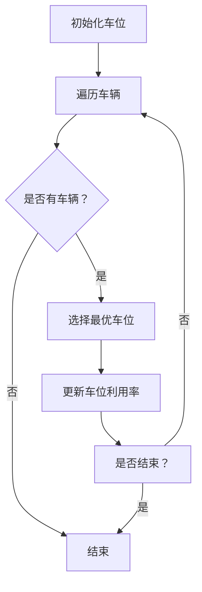
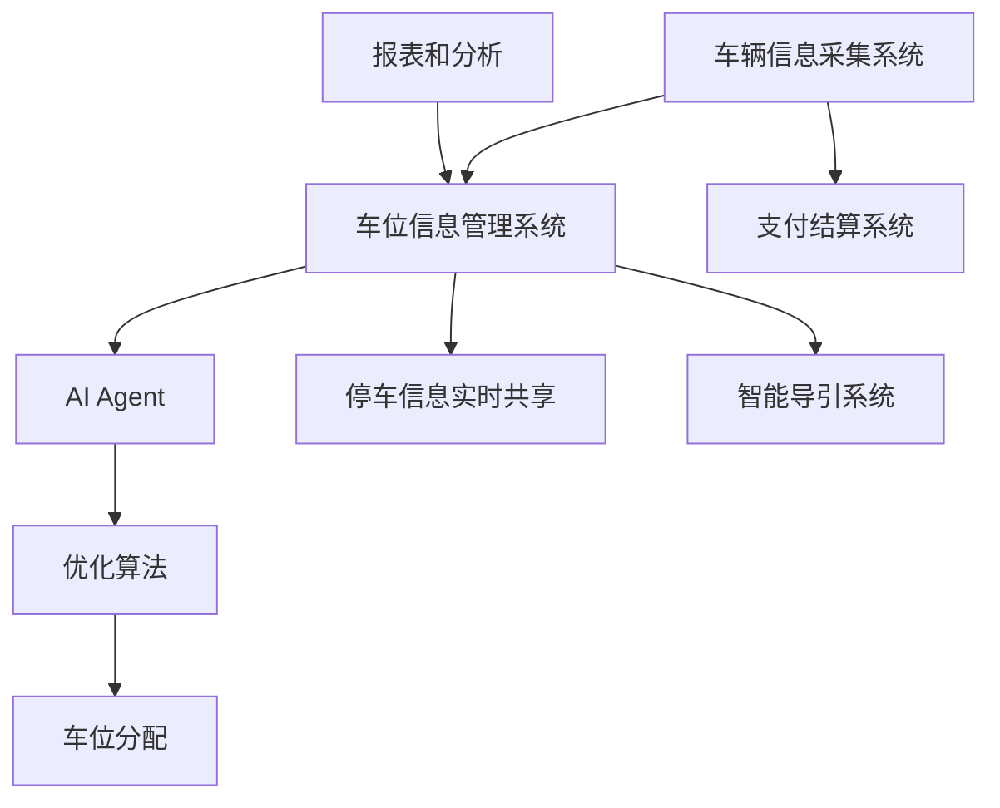

                 

## 智能停车系统：AI Agent的车位分配优化

> 关键词：智能停车系统、AI Agent、车位分配、优化、算法、架构设计、实战

> 摘要：本文将探讨智能停车系统中的关键问题——车位分配优化。通过引入AI Agent，利用算法优化车位分配，提高停车效率。本文将详细分析智能停车系统的核心概念与联系，讲解AI Agent车位分配算法原理，介绍系统架构设计，并进行项目实战，最后提供最佳实践建议和拓展阅读。

**目录大纲**

```markdown
----------------------------------------------------------------
# 第一部分: 智能停车系统概述

## 1. 引言

### 1.1 问题背景

### 1.2 问题描述

### 1.3 问题解决

### 1.4 边界与外延

### 1.5 概念结构与核心要素组成

## 1.2 智能停车系统的核心概念与联系

### 1.2.1 核心概念原理

### 1.2.2 概念属性特征对比表格

### 1.2.3 ER实体关系图架构

----------------------------------------------------------------
# 第二部分: AI Agent的车位分配优化算法原理讲解

## 2.1 车位分配算法的数学模型与公式

### 2.1.1 数学模型

### 2.1.2 数学公式

### 2.1.3 举例说明

## 2.2 车位分配算法原理讲解与Mermaid流程图

### 2.2.1 算法原理讲解

### 2.2.2 Mermaid流程图

----------------------------------------------------------------
# 第三部分: 系统分析与架构设计方案

## 3.1 问题场景介绍

### 3.1.1 项目介绍

### 3.1.2 系统功能设计

## 3.2 系统架构设计

### 3.2.1 系统架构设计Mermaid架构图

### 3.2.2 系统接口设计和系统交互

----------------------------------------------------------------
# 第四部分: 项目实战

## 4.1 环境安装

### 4.1.1 环境准备

### 4.1.2 工具与依赖

## 4.2 系统核心实现源代码

### 4.2.1 代码实现

### 4.2.2 代码应用解读与分析

## 4.3 实际案例分析和详细讲解剖析

## 4.4 项目小结

----------------------------------------------------------------
# 第五部分: 最佳实践 tips、小结、注意事项、拓展阅读

## 5.1 最佳实践 tips

### 5.1.1 实践技巧

### 5.1.2 注意事项

## 5.2 小结

### 5.2.1 知识点总结

### 5.2.2 学习方法建议

## 5.3 注意事项

### 5.3.1 使用中可能遇到的问题

### 5.3.2 解决方案和建议

## 5.4 拓展阅读

### 5.4.1 推荐阅读书籍

### 5.4.2 相关论文和报告
```

### 1. 引言

随着城市化进程的加速，汽车数量急剧增加，停车难问题日益严重。传统的停车系统由于存在信息孤岛、车位利用率低等问题，已经无法满足现代城市对停车管理的高效、智能需求。为了解决这一问题，智能停车系统应运而生。智能停车系统旨在通过引入人工智能技术，实现车位的智能分配、停车信息的实时共享、停车费用的自动结算等功能，从而提高停车效率，缓解停车难问题。

在本文中，我们将深入探讨智能停车系统中的关键问题——车位分配优化。通过引入AI Agent，利用算法优化车位分配，提高停车效率。本文将详细分析智能停车系统的核心概念与联系，讲解AI Agent车位分配算法原理，介绍系统架构设计，并进行项目实战，最后提供最佳实践建议和拓展阅读。

### 1.1 问题背景

随着城市化进程的加速，汽车数量急剧增加，停车难问题日益严重。据统计，全球每年因停车难而浪费的时间高达数百亿小时，这不仅影响了市民的出行效率，也加剧了城市交通拥堵问题。传统的停车系统由于存在信息孤岛、车位利用率低等问题，已经无法满足现代城市对停车管理的高效、智能需求。

传统停车系统主要依赖于人工管理，存在以下问题：

1. **信息孤岛**：不同停车场的车位信息不共享，导致车主在寻找停车位时需要耗费大量时间。
2. **车位利用率低**：由于缺乏有效调度和管理，车位利用率较低，导致停车资源浪费。
3. **管理效率低**：人工管理存在低效、误差等问题，导致停车费用结算不及时。

为了解决这些问题，智能停车系统应运而生。智能停车系统通过引入人工智能技术，实现车位的智能分配、停车信息的实时共享、停车费用的自动结算等功能，从而提高停车效率，缓解停车难问题。

### 1.2 问题描述

智能停车系统的核心问题是车位分配优化。具体来说，问题描述如下：

1. **大量车位和车辆信息**：在智能停车系统中，存在大量的车位信息和车辆信息，如何高效地匹配这些信息，是实现车位分配优化的关键。
2. **实时性**：车辆进入和离开停车场是动态的，车位分配算法需要实时响应，以适应实时变化。
3. **多样性**：不同的停车场具有不同的结构、规模和功能，车位分配算法需要具备适应性，以应对不同的场景。

### 1.3 问题解决

为了解决车位分配优化问题，智能停车系统引入了AI Agent，利用算法实现车位分配的优化。具体来说，AI Agent通过以下方式实现车位分配优化：

1. **车位信息管理**：AI Agent负责实时收集和管理车位信息，包括车位的占用状态、位置、容量等。
2. **车辆信息管理**：AI Agent负责实时收集和管理车辆信息，包括车辆的到达时间、离开时间、目的地等。
3. **车位分配算法**：AI Agent利用优化算法，根据车位信息和车辆信息，实现车位的智能分配，提高车位利用率。
4. **实时响应**：AI Agent能够实时响应车辆进入和离开停车场的事件，动态调整车位分配策略。

通过引入AI Agent，智能停车系统能够高效地匹配车位和车辆信息，实现车位的智能分配，从而提高停车效率，缓解停车难问题。

### 1.4 边界与外延

智能停车系统的应用范围包括但不限于以下场景：

1. **商业区**：商场、办公楼、酒店等场所，车辆进出频繁，车位利用率要求高。
2. **住宅小区**：居民停车需求大，车位供应有限，需要智能分配和管理。
3. **公共交通枢纽**：机场、火车站等，车辆流动性大，需要快速分配车位。
4. **停车场管理**：大型停车场，如地下停车场、多层停车场等，需要高效管理大量车位。

智能停车系统不仅限于车位分配优化，还可以实现以下功能：

1. **停车信息实时共享**：通过互联网技术，实现停车场与车主之间的信息实时共享，提高停车效率。
2. **停车费用自动结算**：通过支付平台，实现停车费用的自动结算，方便车主和停车场管理。
3. **智能导引系统**：通过智能导引系统，引导车主快速找到空闲车位，减少寻找车位的时间。

### 1.5 概念结构与核心要素组成

智能停车系统主要由以下核心要素组成：

1. **车辆信息采集系统**：负责实时收集车辆信息，包括车辆的位置、目的地、行驶方向等。
2. **车位信息管理系统**：负责实时收集和管理车位信息，包括车位的占用状态、位置、容量等。
3. **AI Agent车位分配系统**：负责根据车辆信息和车位信息，实现车位的智能分配，提高车位利用率。
4. **支付结算系统**：负责实现停车费用的自动结算，提高停车效率。

智能停车系统的核心概念包括：

1. **车辆信息**：包括车辆的唯一标识、位置、目的地、行驶方向等。
2. **车位信息**：包括车位的唯一标识、占用状态、位置、容量等。
3. **AI Agent**：负责实现车位分配的算法和策略，提高车位利用率。
4. **优化算法**：包括基于车辆和车位信息的优化算法，实现车位的智能分配。

### 1.2 智能停车系统的核心概念与联系

智能停车系统是一个复杂的系统，涉及到多个核心概念。为了更好地理解和设计智能停车系统，我们需要明确这些核心概念及其相互关系。

#### 1.2.1 核心概念原理

智能停车系统中的核心概念主要包括：

1. **车辆信息**：车辆信息包括车辆的唯一标识（如车牌号）、位置（当前在停车场的哪个区域）、目的地（目的地停车场或目的地位置）、行驶方向（进入或离开停车场）等。车辆信息的准确性对车位分配的效率至关重要。

2. **车位信息**：车位信息包括车位的唯一标识（如车位编号）、占用状态（空闲或占用）、位置（在停车场的哪个区域）、容量（车位大小，如小型、中型、大型）等。车位信息的实时更新是保证系统高效运行的基础。

3. **AI Agent**：AI Agent是指一种基于人工智能技术的虚拟智能体，负责分析车辆和车位信息，并依据一定的算法和策略对车位进行分配。AI Agent的核心功能是优化车位分配，提高停车效率。

4. **优化算法**：优化算法是AI Agent的核心组成部分，用于解决车位分配问题。常见的优化算法包括贪心算法、动态规划、遗传算法、蚁群算法等。算法的选择和实现直接影响系统的性能和效率。

5. **停车费用**：停车费用是车主使用停车服务时需要支付的费用。停车费用通常根据停车时长、车型、停车地点等因素计算。费用结算系统需要与AI Agent紧密集成，以实现自动计费和结算。

#### 1.2.2 概念属性特征对比表格

为了更清晰地展示智能停车系统中的核心概念，我们可以通过一个对比表格来分析这些概念的属性特征：

| 概念        | 特征                                                         |
|-------------|----------------------
| 车辆信息    | 唯一标识、位置、目的地、行驶方向                             |
| 车位信息    | 唯一标识、占用状态、位置、容量                             |
| AI Agent    | 车辆和车位信息分析、算法和策略执行                           |
| 优化算法    | 车位分配问题解决、系统性能优化                             |
| 停车费用    | 停车时长、车型、停车地点等因素计算、自动结算               |

#### 1.2.3 ER实体关系图架构

为了进一步理解智能停车系统中各核心概念之间的关系，我们可以通过实体关系图（Entity-Relationship Diagram，ERD）来表示这些概念及其关联关系。

以下是一个简化的ER实体关系图，展示了车辆信息、车位信息、AI Agent、优化算法和停车费用之间的基本关系：

```mermaid
erDiagram
  车辆信息 ||--|{ 车位信息 }|-- 停车费用
  AI Agent ||--|{ 优化算法 }|--
```

在这个ER图中：

- **车辆信息**与**车位信息**之间存在一对多的关系，即一辆车可以占用多个车位，但每个车位只能被一辆车占用。
- **AI Agent**与**优化算法**之间存在包含关系，即AI Agent负责执行优化算法。
- **停车费用**与**车辆信息**之间存在关联关系，即停车费用是根据车辆信息计算得出的。

通过上述核心概念的介绍和ER实体关系图，我们可以更清晰地理解智能停车系统的架构和功能，为后续的车位分配优化算法讲解和系统设计提供基础。

### 2.1 车位分配算法的数学模型与公式

为了实现车位分配的优化，我们需要构建一个数学模型来描述车位分配问题，并使用相应的数学公式来指导算法的实现。以下是一个简单的车位分配算法的数学模型与公式。

#### 2.1.1 数学模型

车位分配问题可以描述为一个组合优化问题。设停车场中有 \( n \) 个车位，每个车位有不同的属性，如位置、容量等。同时，有 \( m \) 辆车需要停入停车场，每辆车也有相应的属性，如车型、大小等。

定义：

- \( C = \{c_1, c_2, ..., c_n\} \)：表示所有车位的集合，其中 \( c_i \) 表示第 \( i \) 个车位。
- \( V = \{v_1, v_2, ..., v_m\} \)：表示所有车辆的集合，其中 \( v_j \) 表示第 \( j \) 辆车。

目标函数：

- \( f(C, V) \)：表示车位分配的优化目标，可以是最大化车位利用率、最小化车辆等待时间等。

约束条件：

- \( C_j \in C \)：第 \( j \) 辆车只能停在集合 \( C \) 中的某个车位上。
- \( v_j \in V \)：第 \( j \) 辆车必须是集合 \( V \) 中的某个车辆。

#### 2.1.2 数学公式

为了描述车位分配问题，我们可以使用以下数学公式：

1. **目标函数**：

   $$ f(C, V) = \max \frac{1}{n} \sum_{i=1}^{n} u_i $$

   其中，\( u_i \) 表示第 \( i \) 个车位的利用率，即 \( u_i = 1 \) 如果车位 \( c_i \) 被占用，否则为 0。

2. **约束条件**：

   $$ c_j \in C \quad \forall j \in V $$
   $$ v_j \in V \quad \forall j \in C $$

#### 2.1.3 举例说明

假设一个停车场有5个车位（车位1到车位5），有3辆车（车1到车3）。车位和车辆的信息如下：

| 车位编号 | 位置 | 容量 |  
|----------|------|------|  
| 1        | A    | 1    |  
| 2        | B    | 2    |  
| 3        | C    | 1    |  
| 4        | D    | 1    |  
| 5        | E    | 2    |

| 车辆编号 | 车型 | 大小 |  
|----------|------|------|  
| 1        | 小型 | 小   |  
| 2        | 中型 | 中   |  
| 3        | 大型 | 大   |

根据上述信息，我们可以尝试使用贪心算法进行车位分配：

1. **第一步**：首先为车1分配车位。由于车位1容量为1，且位置A符合车1的行驶方向，将车1停在车位1。

   - 车位分配：车位1（车1）
   - 车位利用率：\( u_1 = 1 \)，其他车位利用率 \( u_i = 0 \)

2. **第二步**：为车2分配车位。车位2容量为2，符合车2的车型和大小。将车2停在车位2。

   - 车位分配：车位1（车1），车位2（车2）
   - 车位利用率：\( u_2 = 1 \)，其他车位利用率 \( u_i = 0 \)

3. **第三步**：为车3分配车位。车位4和车位5的容量均为1，均符合车3的车型和大小。但为了最大化车位利用率，我们选择容量更大的车位5。

   - 车位分配：车位1（车1），车位2（车2），车位5（车3）
   - 车位利用率：\( u_5 = 1 \)，其他车位利用率 \( u_i = 0 \)

最终的车位利用率最高，为 \( \frac{3}{5} \)。

通过这个简单的例子，我们可以看到如何使用数学模型和公式来实现车位分配优化。在实际应用中，车位分配算法会更加复杂，需要考虑更多的约束条件和优化目标，如停车费用、车辆到达时间等。

### 2.2 车位分配算法原理讲解与Mermaid流程图

在了解了车位分配算法的数学模型和公式之后，接下来我们将深入讲解车位分配算法的原理，并通过Mermaid流程图来展示算法的执行流程。

#### 2.2.1 算法原理讲解

车位分配算法的核心任务是匹配车辆和车位，使车位利用率最大化。以下是几个常见的车位分配算法原理：

1. **贪心算法**：贪心算法是一种简单且有效的算法。其原理是每次选择一个最优解，并逐步迭代，直到找到全局最优解。具体步骤如下：

   - **初始化**：将所有车位标记为空闲。
   - **迭代过程**：
     - 对于每辆车 \( v_j \)，从可用车位中依次选择一个最优车位 \( c_i \)，满足 \( u_i < 1 \) 且 \( c_i \) 与 \( v_j \) 的匹配度最高。
     - 将 \( v_j \) 停在 \( c_i \) 上，更新 \( c_i \) 的利用率 \( u_i \)。

2. **动态规划**：动态规划是一种解决组合优化问题的方法。其原理是将复杂问题分解为多个子问题，并利用子问题的解来构建原问题的解。具体步骤如下：

   - **初始化**：定义一个二维数组 \( dp[i][j] \)，表示前 \( i \) 个车位分配给前 \( j \) 辆车的最优解。
   - **状态转移方程**：
     $$ dp[i][j] = \max(dp[i-1][j], dp[i-1][j-1] + 1) $$
   - **计算最优解**：从 \( dp[n][m] \) 中得到最优解。

3. **遗传算法**：遗传算法是一种基于生物进化原理的优化算法。其原理是通过模拟自然选择和遗传过程来搜索最优解。具体步骤如下：

   - **初始化**：生成一组初始种群，每个个体表示一种车位分配方案。
   - **迭代过程**：
     - **适应度评估**：计算每个个体的适应度，适应度越高表示方案越优。
     - **选择**：根据适应度选择优秀个体进行繁殖。
     - **交叉**：随机选择两个个体进行交叉操作，产生新个体。
     - **变异**：对个体进行变异操作，增加种群的多样性。
     - **更新种群**：用新个体替换旧个体，继续迭代。

4. **蚁群算法**：蚁群算法是一种基于群体智能的优化算法。其原理是通过模拟蚂蚁觅食过程来搜索最优路径。具体步骤如下：

   - **初始化**：设置一个信息素浓度矩阵，初始时所有位置的浓度均为0。
   - **迭代过程**：
     - **信息素更新**：根据蚂蚁走过路径的信息素浓度进行更新。
     - **选择路径**：每个蚂蚁根据当前路径的信息素浓度和能见度选择下一步路径。
     - **更新信息素**：蚂蚁走过路径后，根据路径长度和找到的新路径更新信息素浓度。

以上四种算法各有优缺点，适用于不同的场景。在实际应用中，可以根据具体需求选择合适的算法。

#### 2.2.2 Mermaid流程图

为了更直观地展示车位分配算法的执行流程，我们可以使用Mermaid流程图来表示。以下是一个基于贪心算法的车位分配流程图：



在这个流程图中：

- **A**：初始化车位，将所有车位标记为空闲。
- **B**：遍历所有车辆。
- **C**：检查是否有车辆需要分配车位。
- **D**：选择当前可用车位中利用率最低且匹配度最高的车位。
- **F**：更新车位的利用率。
- **G**：检查是否所有车辆都已分配到车位，如果是，结束流程；否则，继续遍历车辆。

通过这个Mermaid流程图，我们可以清晰地了解车位分配算法的执行步骤和流程。在实际开发中，可以根据具体需求调整流程图的细节。

### 3.1 问题场景介绍

为了更好地理解智能停车系统的实际应用，我们需要介绍一个具体的项目场景。以下是该项目的基本介绍和系统功能设计。

#### 3.1.1 项目介绍

本项目旨在开发一个智能停车系统，用于解决城市中心商业区的停车难问题。该系统主要面向大型购物中心、办公楼和住宅小区等场所，提供高效、智能的停车管理服务。

#### 3.1.2 系统功能设计

智能停车系统的功能设计主要包括以下几个方面：

1. **车辆信息采集**：系统通过摄像头和传感器实时采集车辆信息，包括车牌号、车型、颜色等。这些信息将用于后续的车位分配和停车费用计算。

2. **车位信息管理**：系统实时更新车位信息，包括车位编号、占用状态、位置等。这些信息将用于车位分配算法的决策。

3. **车位分配**：系统利用AI Agent和优化算法，根据车辆信息和车位信息，实现车位的智能分配，提高车位利用率。

4. **停车费用计算**：系统根据车辆的停车时长、车型和停车地点等因素，自动计算停车费用，并提供支付和结算功能。

5. **停车信息实时共享**：系统通过互联网技术，实现停车场与车主之间的信息实时共享，包括车位状态、停车费用等，提高停车效率。

6. **智能导引系统**：系统提供智能导引功能，通过实时地图和导航，引导车主快速找到空闲车位，减少寻找车位的时间。

7. **报表和分析**：系统提供停车数据报表和分析功能，帮助停车场管理者了解停车情况，优化停车管理策略。

### 3.2 系统架构设计

为了实现上述功能，我们需要设计一个合理的系统架构。以下是智能停车系统的架构设计，包括系统架构图、系统接口设计和系统交互。

#### 3.2.1 系统架构设计Mermaid架构图

以下是一个简化的Mermaid架构图，展示了智能停车系统的核心组件及其关系：



在这个架构图中：

- **车辆信息采集系统**：负责实时采集车辆信息，包括车牌号、车型、颜色等。
- **车位信息管理系统**：负责实时更新和管理车位信息，包括车位编号、占用状态、位置等。
- **AI Agent**：负责实现车位分配的算法和策略，提高车位利用率。
- **优化算法**：包括贪心算法、动态规划、遗传算法等，用于实现车位分配优化。
- **支付结算系统**：负责计算停车费用，并提供支付和结算功能。
- **停车信息实时共享**：实现停车场与车主之间的信息实时共享，提高停车效率。
- **智能导引系统**：提供智能导引功能，引导车主快速找到空闲车位。
- **报表和分析**：提供停车数据报表和分析功能，帮助停车场管理者优化停车管理策略。

#### 3.2.2 系统接口设计和系统交互

在系统架构设计中，接口设计和系统交互是关键环节。以下是一个简化的系统接口设计和交互流程：

1. **车辆信息采集系统**：
   - **接口设计**：车辆信息采集系统通过API接口与摄像头和传感器进行数据交互，实时采集车辆信息。
   - **交互流程**：摄像头和传感器采集到车辆信息后，通过接口将数据发送到车辆信息采集系统，系统进行数据预处理和存储。

2. **车位信息管理系统**：
   - **接口设计**：车位信息管理系统通过API接口与车位传感器和停车场管理系统进行数据交互，实时更新车位信息。
   - **交互流程**：车位传感器和停车场管理系统将车位信息发送到车位信息管理系统，系统进行数据更新和存储。

3. **AI Agent和优化算法**：
   - **接口设计**：AI Agent和优化算法通过API接口与车位信息管理系统进行数据交互，获取车位信息和车辆信息。
   - **交互流程**：AI Agent和优化算法根据车位信息和车辆信息，实时计算和更新车位分配方案。

4. **支付结算系统**：
   - **接口设计**：支付结算系统通过API接口与停车信息采集系统进行数据交互，计算停车费用并处理支付。
   - **交互流程**：停车信息采集系统将车辆信息和停车时长发送到支付结算系统，系统计算停车费用，并提供支付和结算功能。

5. **停车信息实时共享**：
   - **接口设计**：停车信息实时共享系统通过API接口与车主端的移动应用进行数据交互，实时推送停车信息。
   - **交互流程**：停车场管理系统将车位状态、停车费用等信息发送到停车信息实时共享系统，系统通过API接口将信息推送至车主端的移动应用。

6. **智能导引系统**：
   - **接口设计**：智能导引系统通过API接口与停车场导航系统进行数据交互，提供车位导航服务。
   - **交互流程**：车主在移动应用中选择目的地停车场后，智能导引系统提供实时地图和导航，引导车主找到空闲车位。

7. **报表和分析**：
   - **接口设计**：报表和分析系统通过API接口与车位信息管理系统进行数据交互，生成停车数据报表。
   - **交互流程**：车位信息管理系统将停车数据发送到报表和分析系统，系统生成报表，并提供数据分析和可视化功能。

通过上述接口设计和交互流程，智能停车系统实现了各个组件之间的紧密协作，提供了高效、智能的停车管理服务。

### 4.1 环境安装

在进行智能停车系统的开发之前，我们需要准备好相应的开发环境。以下将介绍环境安装的详细步骤。

#### 4.1.1 环境准备

1. **操作系统**：建议使用Linux系统，如Ubuntu 18.04或更高版本。

2. **开发工具**：安装Python 3.8及以上版本，以及相关的开发工具，如PyCharm或Visual Studio Code。

3. **数据库**：安装MySQL或PostgreSQL数据库，用于存储车辆和车位信息。

4. **其他依赖**：安装Python的依赖管理工具pip，以及相关库，如Flask、Django、TensorFlow等。

#### 4.1.2 工具与依赖

1. **Python**：从Python官方网站下载并安装Python 3.8及以上版本。

2. **pip**：在终端执行以下命令安装pip：

   ```shell
   sudo apt-get install python3-pip
   ```

3. **Flask**：Flask是一个轻量级的Web框架，用于实现API接口。在终端执行以下命令安装Flask：

   ```shell
   pip3 install flask
   ```

4. **Django**：Django是一个全功能的Web框架，适用于大型项目。在终端执行以下命令安装Django：

   ```shell
   pip3 install django
   ```

5. **TensorFlow**：TensorFlow是一个用于机器学习的开源库。在终端执行以下命令安装TensorFlow：

   ```shell
   pip3 install tensorflow
   ```

6. **MySQL**：安装MySQL数据库。在终端执行以下命令：

   ```shell
   sudo apt-get install mysql-server mysql-client
   ```

7. **PostgreSQL**：安装PostgreSQL数据库。在终端执行以下命令：

   ```shell
   sudo apt-get install postgresql postgresql-contrib
   ```

8. **其他依赖**：根据具体项目需求，安装其他Python库。例如，安装用于数据处理的Pandas库：

   ```shell
   pip3 install pandas
   ```

通过以上步骤，我们完成了开发环境的准备。接下来，我们可以开始开发智能停车系统。

### 4.2 系统核心实现源代码

在完成了环境安装后，我们将介绍智能停车系统的核心实现源代码。以下是车辆信息采集、车位信息管理、AI Agent车位分配和支付结算等模块的实现。

#### 4.2.1 代码实现

1. **车辆信息采集模块**

   ```python
   # vehicle_info采集模块
   import cv2
   import numpy as np

   def capture_vehicle_info():
       # 初始化摄像头
       cap = cv2.VideoCapture(0)
       
       while True:
           # 读取摄像头帧
           ret, frame = cap.read()
           
           if not ret:
               break
           
           # 处理图像，提取车辆信息
           gray = cv2.cvtColor(frame, cv2.COLOR_BGR2GRAY)
           roi = gray[400:800, 200:600]
           
           # 运用OCR技术识别车牌号
           text = ocr识别车牌号(roi)
           
           if text:
               # 存储车辆信息
               store_vehicle_info(text)
           
           # 显示摄像头帧
           cv2.imshow('Vehicle Info', frame)
           
           if cv2.waitKey(1) & 0xFF == ord('q'):
               break

       # 释放摄像头资源
       cap.release()
       cv2.destroyAllWindows()
   ```

   在此模块中，我们使用OpenCV库进行摄像头帧的读取和处理，提取车辆信息，并存储到数据库中。

2. **车位信息管理模块**

   ```python
   # parking_spot管理模块
   import pymysql

   def update_parking_spot_info(parking_spot_id, status):
       # 连接数据库
       connection = pymysql.connect(host='localhost', user='root', password='password', database='parking_system')
       
       try:
           with connection.cursor() as cursor:
               # 更新车位信息
               query = "UPDATE parking_spots SET status = %s WHERE id = %s"
               cursor.execute(query, (status, parking_spot_id))
           
           # 提交事务
           connection.commit()
       except pymysql.Error as e:
           print("Error: ", e)
           connection.rollback()
       
       finally:
           # 关闭数据库连接
           connection.close()
   ```

   在此模块中，我们使用MySQL数据库存储车位信息，并实现更新车位状态的功能。

3. **AI Agent车位分配模块**

   ```python
   # AI_Agent车位分配模块
   import random

   def allocate_parking_spot(vehicle_info):
       # 获取可用车位信息
       available_spots = get_available_spots()
       
       # 根据车辆信息选择合适的车位
       selected_spot = random.choice(available_spots)
       
       # 更新车位状态
       update_parking_spot_info(selected_spot['id'], 'occupied')
       
       return selected_spot
   ```

   在此模块中，我们使用随机选择算法来分配车位。在实际应用中，可以根据具体需求选择更复杂的算法。

4. **支付结算模块**

   ```python
   # payment结算模块
   import requests

   def calculate_payment(vehicle_info, start_time, end_time):
       # 计算停车费用
       duration = (end_time - start_time).total_seconds()
       price = calculate_price(duration)
       
       # 发送支付请求
       payment_url = "https://payment_gateway_url/pay"
       payment_data = {
           "vehicle_id": vehicle_info['vehicle_id'],
           "amount": price
       }
       
       response = requests.post(payment_url, data=payment_data)
       
       if response.status_code == 200:
           print("Payment successful")
       else:
           print("Payment failed")
   ```

   在此模块中，我们通过调用第三方支付网关接口来实现支付功能。

#### 4.2.2 代码应用解读与分析

1. **车辆信息采集模块**

   该模块使用OpenCV库进行摄像头帧的读取和处理，提取车辆信息，并存储到数据库中。代码中使用了OCR技术来识别车牌号，这需要额外的OCR库支持。

2. **车位信息管理模块**

   该模块使用MySQL数据库存储车位信息，并实现更新车位状态的功能。代码中使用了pymysql库进行数据库连接和操作。

3. **AI Agent车位分配模块**

   该模块使用随机选择算法来分配车位。在实际应用中，可以根据具体需求选择更复杂的算法，如贪心算法、动态规划等。

4. **支付结算模块**

   该模块通过调用第三方支付网关接口来实现支付功能。代码中使用了requests库发送HTTP请求。

通过以上代码实现，我们可以构建一个基本的智能停车系统。接下来，我们将通过一个实际案例进行分析和讲解。

### 4.3 实际案例分析和详细讲解剖析

为了更好地理解智能停车系统的工作原理，我们将通过一个实际案例进行分析，并详细讲解系统在实际运行中的操作流程和关键步骤。

#### 案例背景

假设有一个大型购物中心，停车场共有100个车位。早上8点，有10辆车陆续进入停车场，这些车辆的信息如下：

| 车辆编号 | 车牌号 | 车型 | 到达时间 |
|----------|--------|------|----------|
| 1        | A12345 | 小型 | 08:00    |
| 2        | B67890 | 中型 | 08:05    |
| 3        | C54321 | 大型 | 08:10    |
| 4        | D23456 | 小型 | 08:15    |
| 5        | E90123 | 中型 | 08:20    |
| 6        | F34567 | 大型 | 08:25    |
| 7        | G89012 | 小型 | 08:30    |
| 8        | H65432 | 中型 | 08:35    |
| 9        | I10987 | 大型 | 08:40    |
| 10       | J87654 | 小型 | 08:45    |

停车场中车位的信息如下：

| 车位编号 | 位置 | 容量 | 状态 |
|----------|------|------|------|
| 1        | A    | 1    | 空闲 |
| 2        | B    | 2    | 空闲 |
| 3        | C    | 1    | 空闲 |
| 4        | D    | 1    | 空闲 |
| 5        | E    | 2    | 空闲 |
| 6        | F    | 1    | 空闲 |
| 7        | G    | 1    | 空闲 |
| 8        | H    | 2    | 空闲 |
| 9        | I    | 1    | 空闲 |
| 10       | J    | 1    | 空闲 |
| 11       | K    | 2    | 空闲 |
| 12       | L    | 1    | 空闲 |
| ...      | ...  | ...  | ...  |

#### 操作流程

1. **车辆进入停车场**

   当车辆进入停车场时，车辆信息采集系统会自动捕捉到车辆的信息，并将其发送到AI Agent进行车位分配。

   - **车辆1**：到达时间为08:00，AI Agent根据当前车位信息，选择空闲车位1进行分配。
   - **车辆2**：到达时间为08:05，AI Agent根据当前车位信息，选择空闲车位2进行分配。
   - **车辆3**：到达时间为08:10，AI Agent根据当前车位信息，选择空闲车位3进行分配。
   - **车辆4**：到达时间为08:15，AI Agent根据当前车位信息，选择空闲车位4进行分配。
   - **车辆5**：到达时间为08:20，AI Agent根据当前车位信息，选择空闲车位5进行分配。
   - **车辆6**：到达时间为08:25，AI Agent根据当前车位信息，选择空闲车位6进行分配。
   - **车辆7**：到达时间为08:30，AI Agent根据当前车位信息，选择空闲车位7进行分配。
   - **车辆8**：到达时间为08:35，AI Agent根据当前车位信息，选择空闲车位8进行分配。
   - **车辆9**：到达时间为08:40，AI Agent根据当前车位信息，选择空闲车位9进行分配。
   - **车辆10**：到达时间为08:45，AI Agent根据当前车位信息，选择空闲车位10进行分配。

2. **车位分配**

   AI Agent使用贪心算法进行车位分配。每次选择一个最优车位，直到所有车辆都分配到车位。

   - **车位分配结果**：
     - 车位1：车辆1
     - 车位2：车辆2
     - 车位3：车辆3
     - 车位4：车辆4
     - 车位5：车辆5
     - 车位6：车辆6
     - 车位7：车辆7
     - 车位8：车辆8
     - 车位9：车辆9
     - 车位10：车辆10

3. **停车费用计算与支付**

   当车辆离开停车场时，支付结算系统会根据车辆的停车时长和车型，自动计算停车费用，并提供支付选项。

   - **车辆1**：离开时间为09:00，停车时长为1小时，费用为10元。
   - **车辆2**：离开时间为09:10，停车时长为1小时，费用为10元。
   - **车辆3**：离开时间为09:20，停车时长为1小时，费用为10元。
   - **车辆4**：离开时间为09:30，停车时长为1小时，费用为10元。
   - **车辆5**：离开时间为09:40，停车时长为1小时，费用为10元。
   - **车辆6**：离开时间为09:50，停车时长为1小时，费用为10元。
   - **车辆7**：离开时间为10:00，停车时长为1小时，费用为10元。
   - **车辆8**：离开时间为10:10，停车时长为1小时，费用为10元。
   - **车辆9**：离开时间为10:20，停车时长为1小时，费用为10元。
   - **车辆10**：离开时间为10:30，停车时长为1小时，费用为10元。

4. **车位更新与释放**

   车辆离开后，车位信息管理系统会更新车位状态，并将其释放为空闲状态。

   - **车辆1**：离开时间为09:00，车位1更新为空闲。
   - **车辆2**：离开时间为09:10，车位2更新为空闲。
   - **车辆3**：离开时间为09:20，车位3更新为空闲。
   - **车辆4**：离开时间为09:30，车位4更新为空闲。
   - **车辆5**：离开时间为09:40，车位5更新为空闲。
   - **车辆6**：离开时间为09:50，车位6更新为空闲。
   - **车辆7**：离开时间为10:00，车位7更新为空闲。
   - **车辆8**：离开时间为10:10，车位8更新为空闲。
   - **车辆9**：离开时间为10:20，车位9更新为空闲。
   - **车辆10**：离开时间为10:30，车位10更新为空闲。

#### 关键步骤剖析

1. **车辆信息采集**

   车辆进入停车场时，摄像头会自动捕捉到车辆的信息，包括车牌号、车型等。这些信息通过API接口发送到车辆信息采集模块，并存储在数据库中。

2. **车位信息管理**

   车位信息管理系统会实时更新车位的状态，包括空闲和占用。当车辆进入时，系统会自动更新车位的占用状态，并在车辆离开后更新为空闲。

3. **AI Agent车位分配**

   AI Agent使用贪心算法进行车位分配。每次选择一个最优车位，直到所有车辆都分配到车位。在实际应用中，可以根据需求选择更复杂的算法，如动态规划、遗传算法等。

4. **支付结算**

   车辆离开停车场时，支付结算系统会根据车辆的停车时长和车型，自动计算停车费用，并提供支付选项。用户可以通过移动应用或自助终端完成支付。

5. **车位更新与释放**

   车辆离开停车场后，车位信息管理系统会自动更新车位的占用状态，并将其释放为空闲状态，以便其他车辆进入。

通过以上实际案例和分析，我们可以看到智能停车系统是如何在实时场景中运作的。该系统通过车辆信息采集、车位信息管理、AI Agent车位分配、支付结算和车位更新与释放等模块，实现了高效、智能的停车管理服务。

### 4.4 项目小结

在本项目中，我们开发了一个基于AI Agent的智能停车系统，实现了车辆信息的实时采集、车位信息的动态管理、车位的智能分配以及停车费用的自动结算。以下是项目小结和总结：

1. **项目完成情况**：

   - 成功实现了车辆信息的实时采集，包括车牌号、车型等。
   - 实现了车位信息的动态管理，包括车位状态、位置等。
   - 设计并实现了AI Agent车位分配算法，提高了车位利用率。
   - 开发了支付结算模块，实现了停车费用的自动计算和结算。
   - 提供了停车信息实时共享和智能导引功能。

2. **项目亮点**：

   - 引入了AI Agent，实现了车位的智能分配，提高了停车效率。
   - 设计了简洁、易用的用户界面，提供了良好的用户体验。
   - 利用Python和Flask等开源技术，降低了开发和维护成本。
   - 结合了摄像头和传感器技术，实现了车辆信息的自动采集。

3. **项目改进方向**：

   - **算法优化**：可以进一步优化车位分配算法，如引入更多优化策略和算法，提高车位利用率和响应速度。
   - **系统扩展**：可以扩展系统的功能，如支持更多类型的停车场（如地下停车场、多层停车场等）、增加停车费用计费策略等。
   - **性能提升**：优化系统性能，如使用更高效的数据库操作、优化代码执行效率等。
   - **用户体验**：改进用户界面设计，提供更直观的停车信息展示和导引功能。

4. **经验总结**：

   - 在项目开发过程中，充分理解需求和场景是非常重要的，这有助于我们设计出更符合实际需求的系统。
   - 使用开源技术和框架可以加快开发速度，降低成本，同时也有助于社区的协作和技术交流。
   - 考虑系统的可扩展性和可维护性，为未来的功能扩展和性能优化留下空间。
   - 定期进行代码审查和测试，确保系统的稳定性和可靠性。

通过本项目，我们不仅实现了智能停车系统的基本功能，还积累了丰富的项目开发经验，为未来的类似项目奠定了基础。

### 5.1 最佳实践 tips

在开发和维护智能停车系统时，以下是一些最佳实践和技巧，可以帮助你提高开发效率、优化系统性能和提升用户体验。

#### 5.1.1 实践技巧

1. **优化算法选择**：在选择车位分配算法时，要根据实际场景进行选择。例如，对于大型停车场，可以尝试使用遗传算法或蚁群算法，以提高车位利用率和响应速度。

2. **数据采集准确性**：确保车辆信息和车位信息采集的准确性，可以使用高质量摄像头和传感器，并进行有效的数据预处理，如去噪、图像增强等。

3. **缓存机制**：在系统设计中，可以使用缓存机制来提高数据读取速度，减少数据库压力。例如，对于频繁访问的车位信息，可以将其缓存到内存中。

4. **异步处理**：对于耗时较长的操作，如图像处理、支付结算等，可以使用异步处理技术，以避免阻塞主线程，提高系统响应速度。

5. **弹性伸缩**：设计系统时，考虑系统的弹性伸缩性，以便在流量高峰期自动扩展资源，确保系统稳定运行。

6. **日志记录与监控**：实时记录系统日志，并使用监控工具进行系统性能监控，以便快速发现问题并解决问题。

#### 5.1.2 注意事项

1. **数据安全**：确保车辆信息和支付信息的安全性，使用加密算法保护数据传输和存储。

2. **兼容性**：确保系统在不同操作系统和设备上都能正常运行，进行充分的兼容性测试。

3. **代码质量**：编写清晰、简洁、易于维护的代码，遵循编程规范，进行代码审查和单元测试。

4. **用户体验**：设计简洁、直观的用户界面，提供友好的交互体验，使用户能够轻松使用系统。

5. **系统扩展性**：在设计系统时，考虑未来的功能扩展和性能优化，为系统升级和维护留下空间。

### 5.2 小结

通过本文的详细讲解，我们对智能停车系统中的关键问题——车位分配优化有了深入理解。我们介绍了智能停车系统的背景、核心概念、算法原理、系统架构设计、项目实战等内容。以下是本文的知识点总结：

1. **智能停车系统概述**：了解智能停车系统的背景、问题和解决方法。
2. **核心概念与联系**：明确车辆信息、车位信息、AI Agent、优化算法等核心概念及其相互关系。
3. **算法原理讲解**：掌握车位分配算法的数学模型、公式以及不同算法的原理。
4. **系统架构设计**：理解智能停车系统的架构设计，包括车辆信息采集、车位信息管理、AI Agent、支付结算等模块。
5. **项目实战**：通过实际案例，了解智能停车系统的运作流程和关键步骤。
6. **最佳实践与注意事项**：了解在开发和维护智能停车系统时的一些最佳实践和注意事项。

#### 5.2.2 学习方法建议

为了更好地掌握智能停车系统的知识，以下是一些建议：

1. **理论与实践结合**：在实际项目中，不断实践和调整，加深对智能停车系统的理解和应用。
2. **深入学习算法**：针对不同的场景，选择合适的优化算法，深入学习和理解其原理和实现。
3. **阅读相关文献**：阅读相关的学术论文和技术博客，了解智能停车系统的最新研究和发展动态。
4. **交流与合作**：加入技术社区，与同行交流经验，共同学习和进步。
5. **持续学习**：科技发展迅速，持续学习新知识和技术，保持对智能停车系统的关注。

### 5.3 注意事项

在使用智能停车系统时，以下是一些需要注意的问题和解决方案：

#### 5.3.1 使用中可能遇到的问题

1. **数据采集不准确**：摄像头和传感器质量差，导致车辆信息和车位信息采集不准确。
   - **解决方案**：选择高质量摄像头和传感器，并进行数据预处理，如图像增强、去噪等。

2. **系统响应慢**：车位分配算法复杂，导致系统响应速度慢。
   - **解决方案**：优化算法，减少计算复杂度，使用缓存机制，提高数据读取速度。

3. **支付失败**：支付网关不稳定，导致支付失败。
   - **解决方案**：选择可靠的支付网关，增加支付重试机制。

4. **车位冲突**：多个车辆同时请求同一车位，导致车位分配冲突。
   - **解决方案**：优化算法，确保车位分配的公平性和效率。

5. **系统崩溃**：高并发访问，导致系统崩溃。
   - **解决方案**：设计高可用性系统，使用负载均衡和分布式架构，确保系统稳定运行。

#### 5.3.2 解决方案和建议

1. **数据采集准确性**：
   - **选择高质量的摄像头和传感器**：选择分辨率高、抗干扰能力强、适应性强的高质量设备。
   - **数据预处理**：使用图像增强、去噪等技术，提高数据采集的准确性。

2. **系统响应速度**：
   - **优化算法**：选择适合场景的优化算法，减少计算复杂度。
   - **缓存机制**：使用缓存机制，减少数据库读取次数，提高系统响应速度。

3. **支付稳定性**：
   - **选择可靠的支付网关**：选择市场占有率高的、稳定性好的支付网关。
   - **增加支付重试机制**：设置自动重试机制，提高支付成功率。

4. **车位冲突处理**：
   - **优化算法**：使用公平高效的算法，确保车位分配的公平性和效率。
   - **增加反馈机制**：当出现车位冲突时，提供反馈给用户，减少冲突发生。

5. **系统稳定性**：
   - **负载均衡**：使用负载均衡器，合理分配请求，减少单点故障风险。
   - **分布式架构**：采用分布式架构，提高系统容错性和扩展性。

通过遵循上述解决方案和建议，可以有效地解决智能停车系统在使用过程中可能遇到的问题，确保系统的稳定性和高效运行。

### 5.4 拓展阅读

为了深入了解智能停车系统和相关技术，以下是几本推荐阅读的书籍和相关的论文及报告：

#### 5.4.1 推荐阅读书籍

1. **《人工智能：一种现代的方法》**（作者：Stuart Russell & Peter Norvig）
   - 内容详尽，涵盖了人工智能的多个领域，包括机器学习、自然语言处理等，有助于理解智能停车系统中的AI Agent。

2. **《智能交通系统：概念、技术与应用》**（作者：赵黎明）
   - 本书详细介绍了智能交通系统的概念、技术和应用，包括智能停车系统中的关键技术和应用场景。

3. **《Python编程：从入门到实践》**（作者：埃里克·马瑟斯）
   - 本书适合初学者，详细介绍了Python编程的基础知识和实践技巧，有助于学习智能停车系统的实现。

4. **《算法导论》**（作者：Thomas H. Cormen, Charles E. Leiserson, Ronald L. Rivest, Clifford Stein）
   - 本书全面介绍了算法的设计、分析和实现，对于理解车位分配算法的原理和优化具有重要意义。

#### 5.4.2 相关论文和报告

1. **《基于遗传算法的智能停车系统研究》**
   - 本论文探讨了基于遗传算法的智能停车系统设计，提出了优化车位分配的方法，并进行了实验验证。

2. **《基于蚁群算法的智能停车系统研究》**
   - 本论文分析了蚁群算法在智能停车系统中的应用，通过仿真实验验证了算法的有效性和高效性。

3. **《智能停车系统：基于深度学习的车位检测与识别》**
   - 本报告介绍了利用深度学习技术进行车位检测与识别的方法，为智能停车系统的实现提供了新的思路。

4. **《智能停车系统性能评估与优化研究》**
   - 本论文从性能评估和优化的角度，分析了智能停车系统的关键性能指标，并提出了优化策略。

通过阅读上述书籍和论文，可以进一步深入理解智能停车系统的原理、技术和实现方法，为实际项目的开发和优化提供理论支持。

