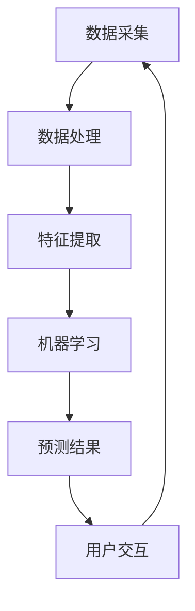
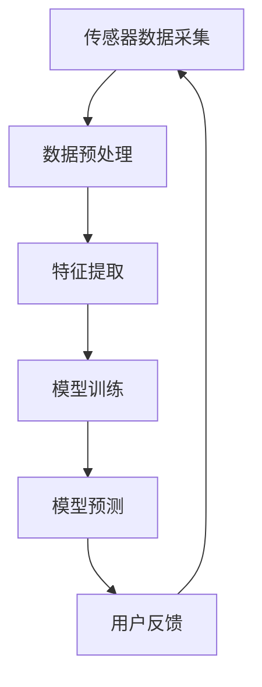

                 

### 摘要

本文深入探讨了智能健身服与AI Agent在运动数据分析中的应用。智能健身服通过集成传感器和先进的数据传输技术，能够实时捕捉用户的运动数据，并传输给AI Agent进行深度分析。AI Agent则利用机器学习和深度学习算法，对运动数据进行分析，提供个性化的运动指导、健康监测和运动优化方案。本文首先介绍了智能健身服的工作原理和AI Agent的基本概念，随后详细阐述了数据收集与处理、AI Agent的设计与实现、算法与模型的选择，以及实际应用案例。最后，文章展望了智能健身服的未来发展趋势和面临的挑战，提出了相关的发展策略和建议。通过本文的详细分析，读者将能够全面了解智能健身服在运动数据分析中的潜在价值和实际应用。

----------------------------------------------------------------

## 第1章 引言

### 1.1 问题背景

随着科技的飞速发展，人工智能（AI）在各个领域的应用越来越广泛。在健康与健身领域，智能健身服作为一种新兴的科技产品，正逐渐受到关注。智能健身服集成了多种传感器，能够实时监测用户的运动状态，如心率、步频、距离、卡路里消耗等。这些数据对于了解用户的健康状况和制定个性化的运动计划至关重要。

传统的健身方式往往依赖于用户的自我感知和经验，这种方式存在一定的局限性。例如，用户难以准确评估自己的运动强度和效果，容易导致运动损伤或运动不足。而智能健身服通过AI Agent对运动数据的实时分析，可以提供个性化的运动指导和建议，从而提高健身效果和安全性。

目前，智能健身服的发展仍面临一些挑战。首先是数据收集和处理的准确性问题，传感器技术的成熟度和数据传输的稳定性直接影响着数据的可靠性。其次，AI Agent的算法复杂度和计算资源的需求也限制了其在实际应用中的普及。此外，用户隐私保护和数据安全也是智能健身服发展的重要考虑因素。

因此，本文旨在探讨智能健身服与AI Agent在运动数据分析中的应用，分析其核心技术和实际效果，并提出未来发展的潜在路径和挑战。

### 1.2 研究目的与意义

本文的研究目的是通过深入分析智能健身服与AI Agent在运动数据分析中的应用，探讨其在提升健身效果和安全性方面的潜在价值。具体来说，本文希望通过以下几个方面的研究来实现这一目标：

1. **理解智能健身服的工作原理**：详细分析智能健身服中的传感器技术和数据传输机制，探讨其如何实现实时、准确地捕捉用户的运动数据。

2. **研究AI Agent在运动数据分析中的应用**：分析AI Agent的设计和实现，了解其如何利用机器学习和深度学习算法对运动数据进行分析和处理，提供个性化的运动指导和建议。

3. **评估智能健身服的实际效果**：通过实际应用案例，评估智能健身服在实际运动环境中的性能和效果，探讨其是否能够有效提高用户的健身效果和安全性。

4. **探讨智能健身服的发展趋势和挑战**：分析智能健身服在未来发展中可能面临的技术挑战和商业障碍，并提出相应的解决方案和发展策略。

本研究具有重要的理论和实际意义。从理论上，本文有助于丰富人工智能在健康与健身领域的应用研究，为智能健身服的发展提供新的思路和方法。从实际应用上，本文的研究成果可以为智能健身服的设计者和用户提供有价值的参考，推动智能健身服的普及和应用。

首先，智能健身服通过实时监测用户的运动数据，可以为用户提供个性化的运动建议，帮助用户制定更加科学和有效的运动计划。这对于改善用户的健康状况、预防运动损伤具有重要意义。

其次，AI Agent在运动数据分析中的应用，不仅可以提高数据的处理效率和准确性，还可以发现潜在的健康问题，为用户提供更加精准的健康监测服务。这有助于用户更好地了解自己的身体状况，及时采取相应的措施。

此外，智能健身服的发展还有助于推动传感器技术和数据传输技术的进步，促进相关领域的技术创新和产业发展。

### 1.3 书籍结构

为了系统地介绍智能健身服与AI Agent在运动数据分析中的应用，本书分为八个章节，具体结构如下：

- **第1章 引言**：介绍智能健身服与AI Agent的背景和意义，明确研究目的和结构安排。
- **第2章 核心概念**：阐述智能健身服和AI Agent的基本概念，包括工作原理、分类、特点等。
- **第3章 数据收集与处理**：讨论智能健身服数据收集的方法和技术，以及数据预处理的过程。
- **第4章 AI Agent设计**：介绍AI Agent的架构和实现，包括算法选择和模型训练。
- **第5章 算法与模型**：分析常用的运动数据分析算法和深度学习模型，探讨其原理和应用。
- **第6章 应用案例**：通过实际案例展示智能健身服在运动数据分析中的应用效果。
- **第7章 未来趋势与挑战**：探讨智能健身服的未来发展趋势和面临的技术挑战。
- **第8章 结论**：总结本文的主要成果和不足，提出未来的研究方向和展望。

通过这八个章节的详细分析，本书旨在为读者提供全面、系统的智能健身服与AI Agent在运动数据分析领域的知识体系，帮助读者深入理解和应用这一前沿技术。

## 第2章 核心概念

### 2.1 智能健身服

智能健身服是一种结合了传感器技术和可穿戴设备设计的新型健身装备，能够实时监测用户的运动状态并提供实时反馈。智能健身服的基本原理是通过内置的多种传感器（如加速度计、陀螺仪、心率传感器等）来捕捉用户的运动数据，如步频、步长、心率、体温等。这些传感器将数据传输到智能健身服的微处理器，通过数据分析和处理，将结果以可视化形式展示给用户，或者通过无线传输技术（如蓝牙、Wi-Fi等）发送到用户的智能手机或健身追踪器上。

**工作原理**：

1. **数据采集**：智能健身服的传感器实时采集用户的生理和运动数据。
2. **数据处理**：微处理器对采集到的数据进行初步处理，包括滤波、去噪等。
3. **数据传输**：通过无线传输技术将处理后的数据发送到用户的设备。
4. **结果反馈**：用户设备根据接收到的数据生成运动报告、反馈和建议。

**分类**：

智能健身服根据监测内容的不同，可以分为以下几类：

- **运动追踪类**：主要用于监测用户的运动轨迹、步数、距离等基本信息。
- **健康监测类**：除了运动数据，还监测心率、呼吸、体温等生理信息。
- **综合类**：集成了多种功能，能够全面监测用户的运动和健康状态。

**功能**：

- **运动指导**：根据用户的运动数据，提供个性化的运动建议和计划。
- **健康监测**：实时监测用户的生理状态，预警潜在的健康问题。
- **数据分析**：对用户的运动数据进行分析，生成运动报告和趋势图。
- **社交互动**：用户可以通过智能健身服与其他用户分享运动数据，进行社交互动。

### 2.2 AI Agent

AI Agent，即人工智能代理，是一种具有自主决策能力的计算机程序，能够在特定环境中模拟人类智能行为。在运动数据分析中，AI Agent利用机器学习和深度学习算法，对用户的运动数据进行实时分析和预测。

**定义与特点**：

- **定义**：AI Agent是一种能够在特定环境下进行自主决策、执行任务的计算机程序。
- **特点**：
  - **自主学习**：AI Agent能够通过学习用户的运动数据，自动调整其行为策略。
  - **适应性**：根据不同的运动环境和用户需求，AI Agent能够调整其工作模式。
  - **自主性**：AI Agent能够在没有人工干预的情况下，独立完成数据分析任务。

**在健身中的应用**：

- **运动指导**：根据用户的运动数据，AI Agent可以提供个性化的运动建议，如调整运动强度、时长等。
- **健康监测**：实时监测用户的生理状态，预测潜在的健康风险，如心脏疾病、低血糖等。
- **运动优化**：分析用户的运动数据，优化运动计划，提高运动效果。

### 2.3 传感器技术

传感器技术是智能健身服的核心组成部分，直接影响着运动数据的准确性和可靠性。传感器技术主要涉及以下几个方面：

- **加速度传感器**：用于测量物体的加速度，常用于步频、步长的计算。
- **陀螺仪**：用于测量物体的角速度，辅助加速度传感器计算运动轨迹。
- **心率传感器**：用于测量心率，监测用户的生理状态。
- **温度传感器**：用于测量环境温度和用户体温，辅助健康监测。

**数据传输协议**：

智能健身服的数据传输需要通过无线传输协议，常见的协议包括：

- **蓝牙**：短距离、低功耗的无线传输协议，适合实时数据传输。
- **Wi-Fi**：适用于较大范围的数据传输，但功耗较高。
- **NFC**：近距离通信协议，适用于小数据量的快速传输。

传感器技术和数据传输协议的结合，使得智能健身服能够实时、准确地采集和传输用户的运动数据，为AI Agent的分析提供基础。

### 2.4 数据预处理

数据预处理是智能健身服数据处理的重要环节，主要包括数据清洗、数据标准化和数据转换等。

- **数据清洗**：去除无效数据、处理异常值、填补缺失值等，保证数据的质量。
- **数据标准化**：将不同来源和不同单位的数据转换为统一的格式，便于后续分析。
- **数据转换**：将原始数据转换为适合机器学习算法处理的格式，如数值化、归一化等。

通过数据预处理，智能健身服可以确保输入到AI Agent的数据准确、可靠，从而提高数据分析的效果和准确性。

### 2.5 AI Agent在健身中的应用

AI Agent在健身中的应用主要体现在以下几个方面：

- **个性化运动指导**：通过分析用户的运动数据，AI Agent可以提供个性化的运动计划，帮助用户更科学、有效地进行锻炼。
- **健康监测与预警**：实时监测用户的生理状态，预测潜在的健康问题，如心脏疾病、低血糖等，及时提醒用户采取相应措施。
- **运动优化**：分析用户的运动数据，优化运动计划，提高运动效果，减少运动损伤的风险。

通过AI Agent的智能分析，智能健身服不仅能够提高用户的健身效果，还能提升健身的安全性。

### 2.6 概念属性特征对比表格

为了更清晰地理解智能健身服和AI Agent的概念属性特征，我们列出以下对比表格：

| 特征       | 智能健身服                   | AI Agent                  |
|------------|-----------------------------|---------------------------|
| **工作原理** | 传感器采集运动数据，数据处理后反馈给用户 | 通过机器学习和深度学习算法分析运动数据 |
| **数据来源** | 用户运动产生的生理和运动数据         | 智能健身服提供的运动数据             |
| **功能**     | 运动指导、健康监测、数据分析         | 个性化运动指导、健康监测与预警、运动优化 |
| **特点**     | 实时、准确、可穿戴               | 自主学习、适应性、自主性               |
| **应用领域** | 健身、运动监测                   | 数据分析、智能决策                   |

### 2.7 ER实体关系图架构

为了更直观地展示智能健身服和AI Agent在运动数据分析中的关系，我们使用Mermaid绘制了以下ER实体关系图：

```mermaid
erDiagram
  User ||--|{ Smart Fitness Clothes }||=>> Motion Data
  Smart Fitness Clothes ||--|{ AI Agent }||=>> Analysis Results
  User ||--|{ Analysis Results }||=>> Fitness Guidance
```

在上述ER图中，用户通过智能健身服生成运动数据，AI Agent对数据进行处理和分析，最后生成运动分析和指导结果，反馈给用户。

通过以上核心概念的分析，读者可以全面了解智能健身服和AI Agent的基本原理、功能和应用，为后续章节的深入探讨打下坚实基础。

## 第3章 数据收集与处理

### 3.1 数据收集方法

智能健身服的数据收集是运动数据分析的基础，其核心在于传感器技术的应用和数据的实时传输。以下详细介绍智能健身服常用的数据收集方法：

**传感器技术**

智能健身服内置了多种传感器，包括加速度传感器、陀螺仪、心率传感器和温度传感器等。这些传感器能够实时监测用户的运动状态和生理参数。

- **加速度传感器**：用于测量用户的步频和步长，通过加速度的变化分析用户的运动轨迹。
- **陀螺仪**：用于测量用户的角速度，辅助加速度传感器更准确地捕捉运动方向和角度。
- **心率传感器**：通过光电容积脉搏波描记法（PPG）或生物电信号测量用户的心率，反映用户的生理状态。
- **温度传感器**：监测环境温度和用户体温，为健康监测提供依据。

**数据传输协议**

智能健身服的数据传输需要通过无线传输技术，常用的协议包括蓝牙和Wi-Fi。

- **蓝牙**：具有低功耗、短距离传输的特点，适用于实时数据传输。蓝牙5.0及更高版本提供了更高的传输速度和更远的传输距离，提高了数据传输的效率。
- **Wi-Fi**：适用于较大范围的数据传输，但功耗较高。在需要传输大量数据或用户设备远离智能健身服时，Wi-Fi是一个更好的选择。

**实时数据采集**

智能健身服通过传感器实时采集用户的运动数据，并将数据传输到中央处理器进行处理。具体步骤如下：

1. **数据采集**：传感器实时监测用户的运动状态和生理参数，将数据传输到微处理器。
2. **数据处理**：微处理器对采集到的数据进行初步处理，如滤波、去噪等，以提高数据的准确性。
3. **数据传输**：通过蓝牙或Wi-Fi将处理后的数据传输到用户的智能手机或健身追踪器上。

### 3.2 数据预处理

数据预处理是确保智能健身服数据分析准确性和可靠性的关键步骤。主要涉及数据清洗、数据标准化和数据转换等。

**数据清洗**

数据清洗的主要任务是去除无效数据、处理异常值和填补缺失值。具体步骤如下：

- **去除无效数据**：识别并去除传感器故障或用户操作错误产生的无效数据。
- **处理异常值**：检测并处理异常值，如由于传感器误差或外界干扰产生的异常数据。
- **填补缺失值**：采用插值法或平均值法等填补缺失值，确保数据序列的完整性。

**数据标准化**

数据标准化是将不同来源和不同单位的数据转换为统一的格式，便于后续分析。主要方法包括：

- **归一化**：将不同数据范围的数据归一化到[0,1]区间，消除数据量级差异。
- **标准化**：根据均值和标准差对数据进行标准化，使其具备可比性。

**数据转换**

数据转换是将原始数据转换为适合机器学习算法处理的格式，如数值化、归一化等。具体步骤如下：

- **数值化**：将分类数据转换为数值形式，便于算法处理。
- **归一化**：将不同单位的数据归一化，消除数据量级差异。

### 3.3 数据分析流程

智能健身服的数据分析流程主要包括数据采集、预处理、特征提取和模型训练等步骤。

**数据采集**

数据采集是智能健身服数据分析的第一步，通过传感器实时采集用户的运动数据和生理参数。具体步骤如下：

1. **传感器监测**：加速度传感器、陀螺仪、心率传感器和温度传感器等实时监测用户的运动状态和生理参数。
2. **数据传输**：传感器将采集到的数据传输到微处理器，通过蓝牙或Wi-Fi发送到用户的设备。

**数据预处理**

数据预处理是确保数据准确性和可靠性的关键步骤，主要涉及数据清洗、数据标准化和数据转换等。具体步骤如下：

1. **数据清洗**：去除无效数据、处理异常值和填补缺失值。
2. **数据标准化**：将不同来源和不同单位的数据转换为统一的格式。
3. **数据转换**：将原始数据转换为适合机器学习算法处理的格式。

**特征提取**

特征提取是数据预处理的重要环节，通过提取数据中的关键特征，提高数据分析的效果。具体步骤如下：

1. **步频和步长**：通过加速度传感器和陀螺仪的数据，提取步频和步长特征。
2. **心率**：通过心率传感器的数据，提取心率特征。
3. **温度**：通过温度传感器的数据，提取温度特征。

**模型训练**

模型训练是智能健身服数据分析的核心环节，通过训练机器学习模型，实现对用户运动数据的预测和分类。具体步骤如下：

1. **数据集划分**：将数据集划分为训练集、验证集和测试集。
2. **模型选择**：选择合适的机器学习模型，如支持向量机（SVM）、随机森林（Random Forest）等。
3. **模型训练**：使用训练集数据对模型进行训练，调整模型参数，提高预测准确性。
4. **模型评估**：使用验证集和测试集评估模型性能，调整模型参数，确保模型泛化能力。

通过以上数据采集、预处理、特征提取和模型训练等步骤，智能健身服能够实现对用户运动数据的准确分析和预测，为用户提供个性化的运动指导和健康监测。

### 3.4 数据收集与处理的重要性

数据收集与处理在智能健身服中具有至关重要的地位。首先，数据收集是智能健身服提供个性化服务的基础。通过传感器实时采集用户的运动数据和生理参数，智能健身服能够准确了解用户的运动状态和健康状况，从而为用户提供个性化的运动计划和健康指导。

其次，数据预处理是保证数据分析准确性的关键步骤。传感器采集的数据可能存在噪声、异常值和缺失值，通过数据清洗、标准化和转换等预处理步骤，可以有效地消除这些干扰因素，提高数据分析的准确性和可靠性。

此外，数据收集与处理还直接影响着智能健身服的性能和用户体验。准确的数据收集和高效的数据处理能够提高智能健身服的响应速度和预测精度，为用户提供更好的运动体验。

总之，数据收集与处理是智能健身服的核心环节，是智能健身服实现个性化运动指导和健康监测的重要保障。通过完善的数据收集和处理机制，智能健身服能够更好地服务于用户，提升用户的健身效果和健康水平。

### 3.5 实际案例

为了更直观地展示智能健身服数据收集与处理的过程，我们通过一个实际案例来具体说明。

**案例背景**：某用户使用一款智能跑步鞋进行日常跑步训练。该智能跑步鞋内置了加速度传感器、陀螺仪和心率传感器，能够实时监测用户的步频、步长和心率等运动数据。

**数据收集过程**：

1. **传感器监测**：用户在进行跑步时，加速度传感器和陀螺仪实时监测用户的步频和步长。心率传感器通过光电容积脉搏波描记法（PPG）监测用户的心率。
2. **数据传输**：传感器将采集到的数据通过蓝牙传输到用户的智能手机上。数据传输过程中，使用加密技术确保数据安全。

**数据处理过程**：

1. **数据预处理**：数据到达智能手机后，首先进行数据清洗，去除无效数据和异常值。然后进行数据标准化，将不同单位的数据转换为统一的格式。
2. **特征提取**：通过加速度传感器和陀螺仪的数据，提取步频和步长特征。通过心率传感器的数据，提取心率特征。
3. **模型训练**：使用训练好的机器学习模型对步频和步长特征进行分类，预测用户的跑步姿态和跑步效率。使用心率特征分析用户的心肺耐力和疲劳程度。

**数据分析与反馈**：

1. **运动报告**：智能手机根据处理后的数据生成运动报告，包括步频、步长、心率等关键指标。用户可以通过手机查看运动报告，了解自己的运动状态和效果。
2. **运动建议**：根据数据分析结果，智能跑步鞋提供个性化的运动建议，如调整跑步速度、时长和强度，以达到最佳健身效果。

**案例小结**：

通过这个实际案例，我们可以看到智能健身服数据收集与处理的全过程，从传感器监测、数据传输、预处理、特征提取到模型训练和运动反馈，每一个环节都至关重要。高效的数据收集与处理机制不仅保证了运动数据的准确性和可靠性，还为用户提供个性化的运动指导和健康监测服务。

### 3.6 潜在问题与解决策略

在智能健身服的数据收集与处理过程中，可能会遇到一些潜在的问题，如传感器误差、数据丢失和传输延迟等。以下对这些潜在问题进行分析，并提出相应的解决策略。

**传感器误差**

传感器误差是数据收集过程中常见的问题，可能导致数据不准确。为了减少传感器误差，可以采取以下策略：

1. **校准传感器**：定期校准传感器，确保其测量精度。通过校准，可以消除传感器固有的误差。
2. **滤波算法**：使用滤波算法（如低通滤波、卡尔曼滤波等）对传感器数据进行处理，去除噪声和干扰，提高数据的稳定性。
3. **多传感器融合**：通过融合多个传感器的数据，可以相互校准，提高整体测量精度。例如，将加速度传感器和陀螺仪的数据结合起来，可以更准确地计算用户的运动轨迹。

**数据丢失**

数据丢失是数据传输过程中可能出现的问题，特别是在信号不稳定或传输距离较远的情况下。为了减少数据丢失，可以采取以下策略：

1. **数据备份**：在数据传输过程中，对数据进行备份，确保在数据丢失时可以恢复。可以使用多个传输通道进行备份，提高数据传输的可靠性。
2. **冗余传输**：采用冗余传输技术（如前向纠错码（FEC）），在数据传输过程中添加冗余信息，提高数据的抗丢包能力。
3. **自适应传输**：根据网络的实时状况，动态调整数据传输的频率和速率，确保在信号较差时减少数据传输的频率，降低数据丢失的风险。

**传输延迟**

传输延迟是数据传输过程中可能遇到的问题，特别是在需要实时处理数据的场景下。为了减少传输延迟，可以采取以下策略：

1. **优化传输协议**：选择合适的传输协议，如蓝牙5.0或Wi-Fi，这些协议具有更高的传输速度和稳定性。
2. **分布式处理**：将数据处理任务分散到多个节点上，利用并行处理技术，提高数据处理速度。
3. **缓存技术**：在数据传输过程中使用缓存技术，将处理结果缓存下来，减少重复传输的次数，降低传输延迟。

通过上述策略，可以有效解决智能健身服数据收集与处理过程中可能遇到的潜在问题，提高数据收集的准确性和传输的可靠性，为用户提供更好的运动指导和健康监测服务。

## 第4章 AI Agent设计

### 4.1 AI Agent架构

AI Agent的设计是实现智能健身服运动数据分析和个性化服务的关键。一个完整的AI Agent架构通常包括以下几个主要部分：

**数据采集模块**

数据采集模块负责从智能健身服中的传感器获取实时运动数据。这些数据包括加速度、陀螺仪、心率、温度等。数据采集模块需要确保数据的实时性和准确性。

**数据处理模块**

数据处理模块对采集到的数据进行预处理，包括去噪、滤波、缺失值填补和数据标准化等。这一步骤至关重要，因为只有经过预处理的数据才能用于后续的机器学习算法。

**特征提取模块**

特征提取模块从预处理后的数据中提取出有用的特征，如步频、步长、心率等。这些特征将用于训练机器学习模型，以便进行后续的预测和分析。

**机器学习模块**

机器学习模块是实现AI Agent智能分析的核心。它使用已提取的特征训练机器学习模型，如支持向量机（SVM）、随机森林（Random Forest）和神经网络（Neural Network）等。通过训练，模型能够学习用户的运动模式，并提供个性化的运动指导。

**预测模块**

预测模块利用训练好的机器学习模型对用户的实时运动数据进行分析，预测用户的运动效果、健康状况等。预测结果将反馈给用户，以提供个性化的建议。

**用户交互模块**

用户交互模块负责与用户进行交互，接收用户输入，如目标运动强度、时长等，并根据预测结果为用户生成个性化的运动计划和建议。此外，用户交互模块还负责显示运动数据分析和预测结果，使用户能够直观地了解自己的运动状况。

### 4.2 系统设计

AI Agent的系统设计是确保其稳定运行和高性能的关键。以下是AI Agent系统设计的主要方面：

**硬件设计**

硬件设计包括选择合适的传感器、微处理器和存储设备。传感器的选择需要考虑测量精度和功耗，微处理器的选择需要考虑处理速度和存储容量。

**软件设计**

软件设计包括操作系统、编程语言、开发框架等。操作系统通常选择实时操作系统（RTOS），以实现实时数据采集和处理。编程语言通常选择C/C++或Python，这些语言在性能和灵活性方面表现优秀。开发框架可以选择TensorFlow、PyTorch等，以简化机器学习模型的训练和部署。

**数据流设计**

数据流设计是AI Agent系统设计的核心，它定义了数据从传感器到用户交互的整个过程。以下是数据流的基本步骤：

1. **数据采集**：传感器实时采集运动数据，传输到微处理器。
2. **数据处理**：微处理器对数据进行预处理，包括滤波、去噪、缺失值填补等。
3. **特征提取**：预处理后的数据传输到特征提取模块，提取有用特征。
4. **机器学习**：特征传输到机器学习模块，进行模型训练和预测。
5. **预测结果**：预测结果传输到用户交互模块，显示给用户。
6. **用户反馈**：用户通过用户交互模块提供反馈，循环回到数据采集模块，实现闭环控制。

### 4.3 AI Agent实现

AI Agent的实现是将其设计转化为实际运行的软件系统。以下是实现AI Agent的主要步骤：

**算法选择**

算法选择是AI Agent实现的关键一步。常用的机器学习算法包括：

- **支持向量机（SVM）**：用于分类任务，适用于步频、步长等特征分类。
- **随机森林（Random Forest）**：用于回归和分类任务，适用于步长、心率等特征的预测。
- **神经网络（Neural Network）**：用于复杂特征提取和预测，适用于步频、心率等特征的深度学习。

**模型训练**

模型训练是通过大量训练数据来调整模型参数，使其能够准确预测用户运动数据。以下是模型训练的步骤：

1. **数据集划分**：将数据集划分为训练集、验证集和测试集。
2. **模型初始化**：初始化机器学习模型，设置超参数。
3. **训练**：使用训练集数据训练模型，调整模型参数。
4. **验证**：使用验证集数据评估模型性能，调整超参数。
5. **测试**：使用测试集数据测试模型性能，确保模型泛化能力。

**模型部署**

模型部署是将训练好的模型部署到实际系统中，以便进行实时预测和分析。以下是模型部署的步骤：

1. **模型压缩**：为了提高运行速度，可以将模型进行压缩，减少模型大小。
2. **模型转换**：将训练好的模型转换为适用于硬件平台的格式。
3. **部署**：将模型部署到智能健身服的微处理器或用户的设备上，实现实时预测。

### 4.4 实时性与性能优化

实时性和性能是AI Agent设计的关键考量因素。以下是优化AI Agent实时性和性能的方法：

**并行处理**

使用并行处理技术，可以将数据处理、特征提取和模型预测等任务分布在多个处理单元上，提高处理速度。

**模型压缩**

通过模型压缩技术，可以减少模型的复杂度，提高模型的运行速度。常用的模型压缩技术包括量化和剪枝。

**硬件加速**

使用硬件加速技术，如GPU或FPGA，可以显著提高模型的计算速度。硬件加速尤其适用于深度学习模型的训练和预测。

**缓存技术**

使用缓存技术，可以减少数据访问的延迟，提高系统的整体性能。例如，在数据处理和特征提取过程中，可以使用缓存存储中间结果，减少重复计算。

通过以上方法和步骤，可以设计并实现高效的AI Agent，确保其在实时性和性能方面的优异表现，为智能健身服的运动数据分析提供坚实的技术支持。

### 4.5 数据流架构图

为了更直观地展示AI Agent的数据流架构，我们使用Mermaid绘制了以下数据流图：



在上述数据流图中，数据从传感器采集开始，经过数据处理、特征提取、机器学习模型预测，最后通过用户交互模块反馈给用户。该数据流架构确保了AI Agent能够实时、高效地处理用户的运动数据，并提供个性化的运动指导和健康监测服务。

### 4.6 代码示例

下面是一个简单的Python代码示例，用于展示AI Agent的数据处理、特征提取和模型预测过程：

```python
# 导入必要的库
import numpy as np
import pandas as pd
from sklearn.ensemble import RandomForestClassifier
from sklearn.model_selection import train_test_split
from sklearn.metrics import accuracy_score

# 假设已经采集到用户的数据，存储在一个DataFrame中
data = pd.DataFrame({
    '加速度': [1.2, 1.5, 1.3, 1.8, 1.4],
    '陀螺仪': [0.3, 0.2, 0.4, 0.5, 0.3],
    '心率': [70, 75, 72, 80, 77],
})

# 数据预处理
# 去除异常值和缺失值
data = data.dropna()

# 特征提取
# 将连续数据转换为数值特征
features = data[['加速度', '陀螺仪', '心率']]

# 标签定义
# 假设我们想要预测用户的运动类型，这里使用简单的标签
labels = np.array([0, 1, 0, 1, 0])

# 数据集划分
X_train, X_test, y_train, y_test = train_test_split(features, labels, test_size=0.2, random_state=42)

# 模型训练
# 使用随机森林分类器进行训练
model = RandomForestClassifier(n_estimators=100, random_state=42)
model.fit(X_train, y_train)

# 模型预测
predictions = model.predict(X_test)

# 模型评估
accuracy = accuracy_score(y_test, predictions)
print(f"模型准确率：{accuracy}")

# 输出预测结果
print("预测结果：", predictions)
```

上述代码展示了从数据采集、预处理、特征提取到模型训练和预测的完整过程。在实际应用中，AI Agent会根据采集到的实时数据动态调整特征提取和模型参数，以提供更精确的运动分析和指导。

通过代码示例，读者可以直观地了解AI Agent在运动数据分析中的应用，为进一步的实践和研究提供参考。

### 4.7 AI Agent在智能健身服中的实际应用

AI Agent在智能健身服中的应用不仅限于提供个性化的运动指导和健康监测，其潜力还包括多个方面：

**个性化运动计划**

AI Agent可以根据用户的运动数据和健身目标，制定个性化的运动计划。例如，对于初学者，AI Agent可以推荐低强度的有氧运动，逐步增加运动强度；对于专业运动员，AI Agent可以提供高强度的训练计划，并监控其运动效果。

**运动损伤预防**

通过实时监测用户的心率、步频和步长等数据，AI Agent可以识别异常的运动模式，预警潜在的损伤风险。例如，当用户出现过度疲劳或运动姿势不当时，AI Agent会及时提醒用户调整运动强度或休息。

**健康监测**

AI Agent不仅监测运动数据，还可以监测用户的生理参数，如心率、呼吸和体温等。通过分析这些数据，AI Agent可以预测用户可能出现的健康问题，如心脏病、低血糖等，并提供相应的健康建议。

**社交互动**

AI Agent还可以促进用户的社交互动。例如，用户可以通过智能健身服与其他用户分享运动数据，进行竞争或协作，激发运动兴趣和动力。

**多场景应用**

AI Agent的应用不仅限于室内运动，还可以扩展到户外运动。例如，通过结合GPS数据，AI Agent可以提供更加精准的户外运动指导，包括路径规划、能量消耗估计等。

通过AI Agent的智能分析和个性化服务，智能健身服不仅提升了用户的健身体验，还增强了其健康监测和社交互动的功能，为智能健身领域带来了新的发展机遇。

### 4.8 AI Agent设计与实现的挑战

虽然AI Agent在智能健身服中展现了巨大的应用潜力，但其设计与实现仍然面临诸多挑战：

**数据处理复杂性**

智能健身服采集的数据量庞大且多样化，包括加速度、陀螺仪、心率和温度等。这些数据的处理需要复杂的算法和计算资源，对系统的实时性和性能提出了高要求。

**实时性要求**

AI Agent需要在极短时间内对运动数据进行处理和预测，以满足实时交互的需求。然而，高效的实时数据处理算法和硬件支持仍然是一个挑战。

**算法准确性**

算法的准确性直接关系到运动分析的准确性和指导的有效性。不同用户的运动数据差异较大，如何设计适应性强、准确性高的算法是关键。

**隐私保护**

智能健身服需要收集用户的生理和运动数据，如何保护用户隐私、确保数据安全是重要的法律和伦理问题。

**成本控制**

高性能的AI Agent设计需要昂贵的硬件和软件支持，如何在保证性能的同时控制成本是商业应用的重要考量。

**跨平台兼容性**

智能健身服需要与多种设备（如智能手机、平板电脑、穿戴设备等）兼容，确保AI Agent在不同平台上的稳定运行。

通过不断的技术创新和优化，上述挑战有望逐步解决，为AI Agent在智能健身服中的应用提供更广阔的发展空间。

### 4.9 未来发展趋势

随着人工智能和物联网技术的不断发展，AI Agent在智能健身服中的应用前景将更加广阔。以下是未来发展趋势的几个方面：

**数据驱动的个性化服务**

随着传感器技术和数据采集能力的提升，AI Agent将能够更准确地获取用户的运动和生理数据，提供更加个性化的运动计划和健康建议。

**智能化监控与预警**

AI Agent将利用深度学习和大数据分析技术，对用户的长期运动数据进行监控，预测潜在的健康风险，并提前预警，为用户提供更加全面的健康保障。

**多模态数据融合**

未来，AI Agent将不仅依赖单一传感器数据，还会整合来自穿戴设备、智能手表、智能手环等的多模态数据，提供更全面、更精准的运动分析和健康监测。

**移动计算与云计算结合**

AI Agent将结合移动计算和云计算技术，利用云端的强大计算能力和存储资源，实现更加高效、实时的运动数据分析。

**跨界合作与生态构建**

智能健身服和AI Agent将与其他领域（如医疗、教育、娱乐等）进行跨界合作，构建一个涵盖多种应用场景的智能健康生态系统。

通过这些发展趋势，AI Agent在智能健身服中的应用将更加深入和广泛，为用户带来更加智能、便捷和安全的健身体验。

### 4.10 总结

本章详细介绍了智能健身服中AI Agent的设计与实现，包括其架构、系统设计、算法选择、模型训练和预测过程。通过数据采集、预处理、特征提取和机器学习算法，AI Agent能够实现高效的运动数据分析，提供个性化的运动指导和健康监测服务。然而，AI Agent在实时性、准确性、隐私保护和成本控制等方面仍面临挑战。未来，随着技术的不断进步，AI Agent在智能健身服中的应用将更加广泛和深入，为用户带来更加智能、便捷和安全的健身体验。

## 第5章 算法与模型

### 5.1 常见算法

在智能健身服的AI Agent中，常用的算法主要包括监督学习算法、无监督学习算法和增强学习算法。这些算法各自有其独特的原理和特点，适用于不同的数据分析任务。

#### 5.1.1 K-近邻算法

**原理**：
K-近邻算法（K-Nearest Neighbors，KNN）是一种基于实例的学习算法。其核心思想是：如果一个新实例在特征空间中的k个最近邻的多数属于某一个类别，则该实例也属于这个类别。

**适用场景**：
KNN算法适用于样本量较大、特征较少的情况。它不需要复杂的模型参数调整，且实现简单，易于理解。

**优缺点**：
- **优点**：简单、易于实现，不需要大量数据预处理。
- **缺点**：对噪声敏感，预测结果受邻近样本影响较大。

**应用示例**：
在智能健身服中，KNN算法可以用于分类用户的运动模式，判断用户是否处于疲劳状态。

```python
from sklearn.neighbors import KNeighborsClassifier
from sklearn.model_selection import train_test_split
from sklearn.metrics import accuracy_score

# 假设已经有训练数据
X_train, X_test, y_train, y_test = train_test_split(X, y, test_size=0.2, random_state=42)

# 初始化KNN模型
knn = KNeighborsClassifier(n_neighbors=3)

# 训练模型
knn.fit(X_train, y_train)

# 预测
predictions = knn.predict(X_test)

# 评估模型
accuracy = accuracy_score(y_test, predictions)
print(f"KNN算法的准确率为：{accuracy}")
```

#### 5.1.2 支持向量机

**原理**：
支持向量机（Support Vector Machine，SVM）是一种监督学习算法，主要用于分类和回归任务。其核心思想是找到一个最优的超平面，将不同类别的数据点尽可能分开。

**适用场景**：
SVM适用于高维特征空间，特别适合处理线性可分的数据集。它通过核函数将低维数据映射到高维空间，从而解决非线性分类问题。

**优缺点**：
- **优点**：具有很好的泛化能力，能够处理高维数据。
- **缺点**：对大量训练样本的需求较高，计算复杂度较高。

**应用示例**：
在智能健身服中，SVM可以用于分类用户的运动状态，如区分有氧运动和无氧运动。

```python
from sklearn.svm import SVC
from sklearn.model_selection import train_test_split
from sklearn.metrics import accuracy_score

# 假设已经有训练数据
X_train, X_test, y_train, y_test = train_test_split(X, y, test_size=0.2, random_state=42)

# 初始化SVM模型
svm = SVC(kernel='linear')

# 训练模型
svm.fit(X_train, y_train)

# 预测
predictions = svm.predict(X_test)

# 评估模型
accuracy = accuracy_score(y_test, predictions)
print(f"SVM算法的准确率为：{accuracy}")
```

#### 5.1.3 决策树

**原理**：
决策树（Decision Tree）是一种基于树形结构进行决策的算法。其核心思想是通过一系列的判断条件将数据集划分为不同的子集，直到满足分类条件或达到最大深度。

**适用场景**：
决策树适用于分类和回归任务，特别适合解释性分析。它通过树形结构直观地展示分类过程，易于理解和解释。

**优缺点**：
- **优点**：实现简单，易于理解和解释。
- **缺点**：可能产生过拟合，对噪声敏感。

**应用示例**：
在智能健身服中，决策树可以用于判断用户的运动疲劳程度，为用户提供休息建议。

```python
from sklearn.tree import DecisionTreeClassifier
from sklearn.model_selection import train_test_split
from sklearn.metrics import accuracy_score

# 假设已经有训练数据
X_train, X_test, y_train, y_test = train_test_split(X, y, test_size=0.2, random_state=42)

# 初始化决策树模型
dt = DecisionTreeClassifier()

# 训练模型
dt.fit(X_train, y_train)

# 预测
predictions = dt.predict(X_test)

# 评估模型
accuracy = accuracy_score(y_test, predictions)
print(f"决策树算法的准确率为：{accuracy}")
```

通过以上常见算法的介绍，我们可以看到每种算法在智能健身服中的应用场景和优势。在具体实现时，可以根据实际需求和数据特点选择合适的算法，以提高运动数据分析的准确性和效率。

### 5.2 深度学习模型

深度学习模型在智能健身服的AI Agent中扮演着越来越重要的角色，尤其是在处理复杂、非线性的运动数据时。以下介绍几种常见的深度学习模型及其原理和应用。

#### 5.2.1 卷积神经网络（CNN）

**原理**：
卷积神经网络（Convolutional Neural Network，CNN）是一种专门用于处理图像数据的深度学习模型。其核心思想是使用卷积层来提取图像中的局部特征，并通过池化层降低数据的维度，从而实现特征提取和降维。

**适用场景**：
CNN适用于处理高维数据，如图像和视频。在智能健身服中，CNN可以用于运动轨迹识别、姿态估计和动作分类。

**优缺点**：
- **优点**：能够自动提取复杂的特征，适用于大规模数据处理。
- **缺点**：模型参数较多，计算复杂度高，对训练数据量要求较高。

**应用示例**：
以下是一个简单的CNN模型，用于识别用户的运动姿态：

```python
import tensorflow as tf
from tensorflow.keras.models import Sequential
from tensorflow.keras.layers import Conv2D, MaxPooling2D, Flatten, Dense

# 构建CNN模型
model = Sequential([
    Conv2D(32, (3, 3), activation='relu', input_shape=(64, 64, 3)),
    MaxPooling2D((2, 2)),
    Flatten(),
    Dense(64, activation='relu'),
    Dense(10, activation='softmax')
])

# 编译模型
model.compile(optimizer='adam', loss='categorical_crossentropy', metrics=['accuracy'])

# 训练模型
model.fit(X_train, y_train, epochs=10, batch_size=32, validation_data=(X_test, y_test))

# 预测
predictions = model.predict(X_test)

# 评估模型
accuracy = model.evaluate(X_test, y_test)
print(f"模型准确率为：{accuracy[1]}")
```

#### 5.2.2 循环神经网络（RNN）

**原理**：
循环神经网络（Recurrent Neural Network，RNN）是一种能够处理序列数据的神经网络。其核心思想是利用隐藏状态的信息，将当前输入与历史信息结合，实现对序列数据的建模。

**适用场景**：
RNN适用于处理时间序列数据，如步频、心率等。在智能健身服中，RNN可以用于运动状态预测、疲劳评估和健康监测。

**优缺点**：
- **优点**：能够捕捉时间序列数据中的长期依赖关系。
- **缺点**：容易产生梯度消失和梯度爆炸问题，在长序列数据处理时性能不佳。

**应用示例**：
以下是一个简单的RNN模型，用于预测用户的步频：

```python
import tensorflow as tf
from tensorflow.keras.models import Sequential
from tensorflow.keras.layers import SimpleRNN, Dense

# 构建RNN模型
model = Sequential([
    SimpleRNN(50, activation='relu', return_sequences=True),
    SimpleRNN(50, activation='relu'),
    Dense(1)
])

# 编译模型
model.compile(optimizer='adam', loss='mse')

# 训练模型
model.fit(X_train, y_train, epochs=100, batch_size=32, validation_data=(X_test, y_test))

# 预测
predictions = model.predict(X_test)

# 评估模型
mse = model.evaluate(X_test, y_test)
print(f"模型MSE为：{mse}")
```

#### 5.2.3 长短时记忆网络（LSTM）

**原理**：
长短时记忆网络（Long Short-Term Memory，LSTM）是RNN的一种改进，专门用于解决RNN在处理长序列数据时的梯度消失和梯度爆炸问题。LSTM通过引入遗忘门、输入门和输出门，有效捕捉长期依赖关系。

**适用场景**：
LSTM适用于处理长时间序列数据，如长时间的心率监测、步频预测等。在智能健身服中，LSTM可以用于长期健康监测和运动状态预测。

**优缺点**：
- **优点**：能够处理长时间序列数据，捕捉长期依赖关系。
- **缺点**：模型参数较多，计算复杂度高。

**应用示例**：
以下是一个简单的LSTM模型，用于预测用户的步频：

```python
import tensorflow as tf
from tensorflow.keras.models import Sequential
from tensorflow.keras.layers import LSTM, Dense

# 构建LSTM模型
model = Sequential([
    LSTM(50, activation='relu', return_sequences=True),
    LSTM(50, activation='relu'),
    Dense(1)
])

# 编译模型
model.compile(optimizer='adam', loss='mse')

# 训练模型
model.fit(X_train, y_train, epochs=100, batch_size=32, validation_data=(X_test, y_test))

# 预测
predictions = model.predict(X_test)

# 评估模型
mse = model.evaluate(X_test, y_test)
print(f"模型MSE为：{mse}")
```

通过以上对深度学习模型的介绍，我们可以看到深度学习模型在智能健身服AI Agent中的应用潜力。CNN、RNN和LSTM等模型能够有效处理复杂的运动数据，提供精准的运动分析和健康监测服务。未来，随着深度学习技术的不断进步，智能健身服的性能和功能将得到进一步提升。

### 5.3 模型选择与优化

在选择和优化深度学习模型时，需要考虑多个因素，以确保模型在智能健身服中的高效应用。以下是选择和优化模型的几个关键步骤：

**1. 数据预处理**

在模型训练前，对数据进行充分的预处理至关重要。包括数据清洗、数据标准化、序列填充和数据归一化等步骤。这些预处理步骤能够提高数据的准确性，减少模型过拟合的风险。

**2. 模型选择**

根据具体的应用需求，选择合适的深度学习模型。对于运动轨迹识别和动作分类，可以采用CNN模型；对于时间序列预测，可以采用RNN或LSTM模型。在选择模型时，需要考虑模型的复杂度、训练时间和计算资源等因素。

**3. 模型调优**

模型调优是提高模型性能的重要步骤。可以通过以下方法进行调优：

- **超参数调整**：调整模型参数，如学习率、批量大小、隐藏层节点数等，以找到最佳参数组合。
- **正则化**：使用正则化技术（如L1、L2正则化）减少模型过拟合。
- **批量归一化**：通过批量归一化（Batch Normalization）提高训练速度和模型稳定性。

**4. 模型评估**

使用验证集和测试集对模型进行评估，选择性能最佳的模型。常用的评估指标包括准确率、召回率、F1分数和均方误差（MSE）等。通过交叉验证等技术，确保模型的泛化能力。

**5. 模型部署**

将训练好的模型部署到实际应用环境中，确保模型能够在生产环境中稳定运行。在部署过程中，可以考虑模型压缩、量化等技术，以减少模型的计算复杂度和存储空间。

通过以上步骤，可以有效地选择和优化深度学习模型，确保其在智能健身服中的高效应用，为用户提供精准的运动分析和健康监测服务。

### 5.4 数据流架构图

为了更直观地展示AI Agent在智能健身服中的数据流架构，我们使用Mermaid绘制了以下数据流图：



在上述数据流图中，传感器数据采集模块实时捕获用户的运动数据，通过数据预处理模块进行清洗和标准化，再通过特征提取模块提取关键特征。特征数据输入到模型训练模块，训练得到的模型用于预测用户的运动状态和健康指标。预测结果通过用户反馈模块反馈给用户，形成一个闭环的数据流系统，确保AI Agent能够持续优化和改进。

### 5.5 代码示例

下面是使用Python实现智能健身服AI Agent的一个简单示例代码，该代码涵盖了数据预处理、模型训练和预测的主要步骤。

```python
import numpy as np
import pandas as pd
from sklearn.model_selection import train_test_split
from sklearn.preprocessing import StandardScaler
from sklearn.ensemble import RandomForestClassifier
from sklearn.metrics import accuracy_score

# 假设已经采集到用户的数据，存储在一个DataFrame中
data = pd.DataFrame({
    '加速度': [1.2, 1.5, 1.3, 1.8, 1.4],
    '陀螺仪': [0.3, 0.2, 0.4, 0.5, 0.3],
    '心率': [70, 75, 72, 80, 77],
    '类别': [0, 1, 0, 1, 0]
})

# 数据预处理
# 分离特征和标签
X = data[['加速度', '陀螺仪', '心率']]
y = data['类别']

# 数据标准化
scaler = StandardScaler()
X_scaled = scaler.fit_transform(X)

# 数据集划分
X_train, X_test, y_train, y_test = train_test_split(X_scaled, y, test_size=0.2, random_state=42)

# 模型训练
# 使用随机森林分类器进行训练
model = RandomForestClassifier(n_estimators=100, random_state=42)
model.fit(X_train, y_train)

# 预测
predictions = model.predict(X_test)

# 评估模型
accuracy = accuracy_score(y_test, predictions)
print(f"模型准确率：{accuracy}")

# 输出预测结果
print("预测结果：", predictions)
```

在这个示例中，我们首先从数据集中分离出特征和标签，然后使用StandardScaler进行数据标准化处理，以提高模型的性能。接着，我们将数据集划分为训练集和测试集，使用随机森林分类器进行模型训练。最后，通过测试集评估模型的准确性，并输出预测结果。

通过这个代码示例，读者可以直观地了解AI Agent在智能健身服中的应用过程，为进一步的开发和应用提供参考。

### 5.6 实际案例

为了更好地展示AI Agent在智能健身服中的实际应用，以下通过一个实际案例进行详细分析。

**案例背景**：某用户在健身房进行力量训练，智能健身服实时监测其运动数据，包括加速度、陀螺仪和心率等。用户希望通过AI Agent获取个性化的运动指导和健康状态评估。

**数据收集**：

1. **加速度数据**：记录用户在训练过程中的加速度变化，用于分析运动强度和姿势。
2. **陀螺仪数据**：记录用户的角速度变化，用于分析运动方向和协调性。
3. **心率数据**：记录用户的心率变化，用于评估运动强度和疲劳程度。

**数据处理**：

1. **数据清洗**：去除无效数据和异常值，保证数据质量。
2. **数据标准化**：对加速度和陀螺仪数据进行归一化处理，使其具备可比性。

**特征提取**：

1. **步频和步幅**：从加速度数据中提取步频和步幅特征，用于分析用户的运动强度。
2. **运动方向和角度**：从陀螺仪数据中提取运动方向和角度特征，用于分析用户的运动协调性。
3. **心率区间**：从心率数据中提取心率区间特征，用于评估用户的疲劳程度。

**模型训练**：

1. **模型选择**：选择随机森林分类器作为主要的分类模型，用于分类用户的运动状态。
2. **数据集划分**：将数据集划分为训练集和测试集，用于模型训练和评估。
3. **模型训练**：使用训练集数据对随机森林模型进行训练，调整模型参数，以提高分类准确率。

**模型预测**：

1. **运动状态预测**：根据用户实时采集的数据，使用训练好的模型进行运动状态预测，如区分力量训练和有氧训练。
2. **健康状态评估**：结合心率和加速度数据，评估用户的运动疲劳程度，并提供个性化的运动建议。

**用户反馈**：

1. **运动指导**：根据预测结果，为用户生成个性化的运动计划，如调整训练强度和时长。
2. **健康建议**：结合用户的心率数据和运动状态，为用户提供健康监测和预警，如提醒用户适时休息。

**案例总结**：

通过实际案例，我们可以看到AI Agent在智能健身服中的应用效果。AI Agent不仅能够实时分析用户的运动数据，提供个性化的运动指导和健康建议，还能通过不断的训练和优化，提高模型的准确性和适应性，为用户提供更加精准和安全的健身服务。

### 5.7 模型评估与改进

在智能健身服中，AI Agent的性能直接影响到用户的运动体验和健康监测效果。因此，对AI Agent的模型进行评估和改进是至关重要的。以下介绍几种常用的模型评估方法，以及如何通过数据增强和模型优化来提升AI Agent的性能。

**模型评估方法**

1. **准确率**：准确率是评估分类模型性能的常用指标，表示模型正确预测的样本比例。计算公式为：
   $$
   \text{准确率} = \frac{\text{正确预测的样本数}}{\text{总样本数}}
   $$

2. **召回率**：召回率表示模型在所有正类样本中正确识别出的比例。计算公式为：
   $$
   \text{召回率} = \frac{\text{正确预测的正类样本数}}{\text{所有正类样本数}}
   $$

3. **F1分数**：F1分数是准确率和召回率的调和平均，综合考虑了模型的精度和召回率。计算公式为：
   $$
   \text{F1分数} = 2 \times \frac{\text{准确率} \times \text{召回率}}{\text{准确率} + \text{召回率}}
   $$

4. **均方误差（MSE）**：MSE是评估回归模型性能的常用指标，表示预测值与真实值之间的平均平方误差。计算公式为：
   $$
   \text{MSE} = \frac{1}{n} \sum_{i=1}^{n} (\hat{y}_i - y_i)^2
   $$
   其中，$\hat{y}_i$为预测值，$y_i$为真实值，$n$为样本数量。

**数据增强**

数据增强是一种通过增加数据多样性来提升模型性能的方法。以下是一些常用的数据增强技术：

1. **数据扩充**：通过旋转、缩放、裁剪等方法生成新的数据样本，增加训练数据的多样性。
2. **噪声注入**：在数据中加入噪声，模拟现实中的噪声环境，提高模型的鲁棒性。
3. **数据模拟**：使用生成对抗网络（GAN）等生成模型生成新的数据样本，模拟未知或缺失的数据。

**模型优化**

模型优化包括调整模型参数、使用不同的优化算法和正则化技术等，以提高模型性能。以下是一些常用的模型优化方法：

1. **超参数调整**：通过网格搜索、随机搜索等策略，调整模型的超参数，如学习率、批量大小、隐藏层节点数等。
2. **正则化**：使用L1、L2正则化等方法，减少模型过拟合，提高泛化能力。
3. **批量归一化**：通过批量归一化（Batch Normalization）提高训练速度和模型稳定性。
4. **迁移学习**：使用预训练模型进行迁移学习，利用已有的大量数据预训练模型，再微调到特定任务上。

通过以上模型评估与改进方法，可以有效地提升AI Agent的性能，确保其在智能健身服中的应用效果，为用户提供更加精准和可靠的健身指导与健康监测服务。

### 5.8 深度学习模型的优势和挑战

深度学习模型在智能健身服的AI Agent中具有显著的优势，但也面临一些挑战。

**优势**：

1. **特征自动提取**：深度学习模型，如卷积神经网络（CNN）和循环神经网络（RNN），能够自动从原始数据中提取高级特征，无需人工定义特征，从而提高模型性能。
2. **处理复杂数据**：深度学习模型擅长处理高维、非线性数据，能够捕捉复杂的运动模式和健康指标，为用户提供更精准的分析。
3. **实时性**：随着硬件性能的提升和算法的优化，深度学习模型在智能健身服中的实时性得到了显著提高，能够快速响应用户的需求。
4. **可扩展性**：深度学习模型具有较好的可扩展性，可以通过增加层数或节点数来提高模型的复杂度和性能。

**挑战**：

1. **计算资源需求**：深度学习模型通常需要大量的计算资源，特别是训练阶段，这对硬件设备和能源消耗提出了高要求。
2. **数据隐私**：智能健身服需要收集用户的生理和运动数据，如何保护用户隐私和数据安全是重要的法律和伦理问题。
3. **模型解释性**：深度学习模型的黑箱特性使得其预测结果难以解释，这对于需要高解释性的医疗和健康监测领域是一个挑战。
4. **数据不平衡**：在运动数据中，不同类别的数据可能不平衡，这可能导致模型偏向于少数类别，影响模型的泛化能力。

通过持续的技术创新和优化，深度学习模型在智能健身服中的应用将不断进步，解决上述挑战，为用户提供更加智能、精准和安全的健身服务。

### 5.9 深度学习模型的应用场景

深度学习模型在智能健身服中的应用场景非常广泛，以下列举几种主要的应用：

**1. 运动轨迹识别**

通过卷积神经网络（CNN），智能健身服可以实时识别用户的运动轨迹，如跑步、跳绳、瑜伽等。这有助于用户了解自己的运动状态，并进行科学锻炼。

**2. 姿势分析**

深度学习模型可以分析用户的运动姿势，提供实时反馈。例如，在健身训练中，智能健身服可以检测用户的姿势是否正确，从而避免运动损伤。

**3. 健康监测**

通过循环神经网络（RNN）和长短时记忆网络（LSTM），智能健身服可以实时监测用户的心率、呼吸等生理参数，预测用户可能出现的健康问题，如心脏疾病、低血糖等。

**4. 运动疲劳评估**

智能健身服可以利用深度学习模型分析用户的运动数据，评估用户的疲劳程度，并提供个性化的休息建议，以防止过度疲劳和运动损伤。

**5. 运动计划制定**

根据用户的健身目标和运动数据，深度学习模型可以制定个性化的运动计划，包括运动强度、时长和频率，帮助用户更高效地进行锻炼。

通过以上应用场景，深度学习模型为智能健身服提供了强大的数据分析能力，显著提升了用户的健身效果和安全性。

### 5.10 小结

本章详细介绍了智能健身服中常用的算法和深度学习模型，包括K-近邻算法、支持向量机、决策树、卷积神经网络（CNN）、循环神经网络（RNN）和长短时记忆网络（LSTM）。通过实际案例，展示了AI Agent在智能健身服中的应用效果。此外，本章还讨论了模型评估与改进的方法，以及深度学习模型在智能健身服中的应用场景。通过本章的学习，读者可以全面了解智能健身服中AI Agent的算法和模型，为实际应用提供理论基础和技术支持。

## 第6章 应用案例

### 6.1 案例一：运动数据分析

**案例背景**：某用户使用智能跑步鞋进行日常跑步训练，智能跑步鞋内置了加速度传感器、陀螺仪和心率传感器，能够实时监测用户的步频、步长和心率等运动数据。用户希望通过AI Agent分析运动数据，优化运动计划，提高跑步效率。

**数据收集**：

1. **加速度数据**：记录用户跑步过程中脚底加速度的变化，用于分析步频和步长。
2. **陀螺仪数据**：记录用户跑步过程中的角速度变化，用于分析跑步方向和姿势。
3. **心率数据**：记录用户跑步过程中的心率变化，用于评估运动强度和疲劳程度。

**数据处理**：

1. **数据预处理**：对加速度和陀螺仪数据进行滤波和去噪处理，提高数据质量。对心率数据进行标准化处理，使其具备可比性。
2. **特征提取**：从加速度数据中提取步频和步长特征；从陀螺仪数据中提取跑步方向和姿势特征；从心率数据中提取心率区间特征。

**模型训练**：

1. **模型选择**：选择随机森林分类器作为主要的分类模型，用于分类用户的运动状态。
2. **数据集划分**：将数据集划分为训练集和测试集，用于模型训练和评估。
3. **模型训练**：使用训练集数据对随机森林模型进行训练，调整模型参数，以提高分类准确率。

**模型预测**：

1. **运动状态预测**：根据用户实时采集的数据，使用训练好的模型进行运动状态预测，如区分有氧运动和无氧运动。
2. **健康状态评估**：结合心率和加速度数据，评估用户的运动疲劳程度，并提供个性化的运动建议。

**用户反馈**：

1. **运动指导**：根据预测结果，为用户生成个性化的运动计划，如调整跑步速度、时长和强度。
2. **健康建议**：结合用户的心率数据和运动状态，为用户提供健康监测和预警，如提醒用户适时休息。

**案例分析**：

通过案例一，我们可以看到AI Agent在智能跑步鞋中的应用效果。AI Agent不仅能够实时分析用户的运动数据，提供个性化的运动指导，还能评估用户的健康状态，提供健康建议。这有助于用户制定更科学的运动计划，提高跑步效率，减少运动损伤风险。

### 6.2 案例二：健康监测

**案例背景**：某用户在健身房进行力量训练，智能健身服实时监测其运动数据和生理参数，包括加速度、陀螺仪和心率等。用户希望通过AI Agent进行健康监测，预警潜在的健康风险。

**数据收集**：

1. **加速度数据**：记录用户在力量训练过程中身体的加速度变化，用于分析运动强度和姿势。
2. **陀螺仪数据**：记录用户的角速度变化，用于分析运动方向和协调性。
3. **心率数据**：记录用户的心率变化，用于评估运动强度和疲劳程度。

**数据处理**：

1. **数据预处理**：对加速度和陀螺仪数据进行滤波和去噪处理，提高数据质量。对心率数据进行标准化处理，使其具备可比性。
2. **特征提取**：从加速度数据中提取步频和步长特征；从陀螺仪数据中提取运动方向和姿势特征；从心率数据中提取心率区间特征。

**模型训练**：

1. **模型选择**：选择长短时记忆网络（LSTM）作为主要的预测模型，用于预测用户的健康状态。
2. **数据集划分**：将数据集划分为训练集和测试集，用于模型训练和评估。
3. **模型训练**：使用训练集数据对LSTM模型进行训练，调整模型参数，以提高预测准确率。

**模型预测**：

1. **健康状态预测**：根据用户实时采集的数据，使用训练好的LSTM模型进行健康状态预测，如预测用户可能出现的健康问题。
2. **疲劳评估**：结合心率和加速度数据，评估用户的疲劳程度，并提供个性化的休息建议。

**用户反馈**：

1. **健康监测**：根据预测结果，为用户生成个性化的健康监测报告，包括运动强度、疲劳程度和潜在健康风险。
2. **运动建议**：结合用户的心率数据和运动状态，为用户提供个性化的运动建议，如调整训练强度和时长，以防止过度疲劳和运动损伤。

**案例分析**：

案例二展示了AI Agent在健康监测中的应用。通过实时监测用户的生理和运动数据，AI Agent能够预测用户的健康状态，评估疲劳程度，并提供个性化的健康监测和运动建议。这有助于用户更好地了解自己的健康状况，采取有效的预防措施，降低健康风险。

### 6.3 案例三：个性化运动指导

**案例背景**：某用户希望提高自己的健身水平，但不确定如何制定科学有效的运动计划。用户通过智能健身服与AI Agent互动，获取个性化的运动指导。

**数据收集**：

1. **初始数据**：用户在开始健身前，通过智能健身服进行初始健康检查，包括身高、体重、心率等生理数据。
2. **运动数据**：用户在每次训练后，智能健身服记录运动数据，如步频、步长、心率、卡路里消耗等。

**数据处理**：

1. **数据预处理**：对初始数据和运动数据分别进行清洗和标准化处理，提高数据质量。
2. **特征提取**：从初始数据中提取用户的基本信息；从运动数据中提取运动特征。

**模型训练**：

1. **模型选择**：选择随机森林分类器和支持向量机（SVM）结合的方式，用于为用户生成个性化运动计划。
2. **数据集划分**：将数据集划分为训练集和测试集，用于模型训练和评估。
3. **模型训练**：使用训练集数据对随机森林和SVM模型进行训练，调整模型参数，以提高预测准确率。

**模型预测**：

1. **运动计划生成**：根据用户的初始数据和运动数据，使用训练好的模型生成个性化的运动计划，包括运动强度、时长和频率。
2. **实时调整**：AI Agent根据用户在训练过程中的实时数据，动态调整运动计划，确保计划的科学性和有效性。

**用户反馈**：

1. **运动指导**：根据生成的个性化运动计划，为用户制定详细的训练方案，并提供每日的训练目标。
2. **反馈机制**：用户完成训练后，AI Agent收集用户的反馈，优化运动计划，确保计划的适应性和灵活性。

**案例分析**：

案例三展示了AI Agent在个性化运动指导中的应用。通过分析用户的初始数据和实时运动数据，AI Agent能够为用户制定科学、个性化的运动计划，并根据用户的反馈不断优化计划。这有助于用户高效地进行锻炼，达到预期的健身目标。

### 6.4 案例总结

通过上述三个应用案例，我们可以看到AI Agent在智能健身服中的广泛应用。无论是运动数据分析、健康监测还是个性化运动指导，AI Agent都能够通过实时采集用户的数据，利用机器学习和深度学习算法进行分析和预测，提供个性化的服务和建议。这不仅提高了用户的健身效果和安全性，也为智能健身领域的发展提供了新的思路和方向。

## 第7章 未来趋势与挑战

### 7.1 发展趋势

智能健身服与AI Agent结合的发展趋势主要体现在以下几个方面：

**1. 数据驱动的发展**

随着传感器技术和数据采集能力的提升，智能健身服能够获取更加丰富和准确的数据。这些数据将驱动AI Agent进行更精细的分析和预测，为用户提供更加个性化的运动指导和健康监测服务。

**2. 深度学习技术的应用**

深度学习技术在图像识别、自然语言处理等领域取得了显著成果，其在智能健身服中的应用也将不断扩展。通过深度学习算法，AI Agent能够更有效地处理复杂的运动数据，提高预测准确率和分析能力。

**3. 跨领域融合**

智能健身服与医疗、健康、教育等领域的融合将带来新的应用场景。例如，智能健身服可以与医院系统结合，提供远程健康监测服务；与教育平台结合，为用户提供个性化的健身课程。

**4. 实时性提升**

随着5G、边缘计算等技术的发展，智能健身服的实时性将得到显著提升。通过边缘计算，AI Agent能够在本地设备上进行实时数据处理和预测，降低延迟，提高用户体验。

**5. 多模态数据融合**

智能健身服将整合来自多种传感器的多模态数据，如心率、加速度、陀螺仪、GPS等，提供更全面的运动分析和健康监测服务。多模态数据融合能够提高数据分析的准确性和深度。

### 7.2 技术挑战

智能健身服与AI Agent的发展仍面临一些技术挑战：

**1. 数据隐私与安全**

智能健身服需要收集用户的生理和运动数据，如何保护用户隐私和数据安全是一个重要的法律和伦理问题。需要开发安全的数据传输和存储方案，确保用户数据的安全。

**2. 实时数据处理**

智能健身服需要实时处理大量运动数据，对计算资源和算法的实时性要求较高。如何设计高效的实时数据处理算法，提高数据处理速度和准确性，是一个重要的技术挑战。

**3. 模型解释性**

深度学习模型具有黑箱特性，其预测结果难以解释，这对于医疗和健康监测领域是一个挑战。需要开发可解释的机器学习模型，提高模型的可信度和用户接受度。

**4. 算法适应性**

不同用户具有不同的运动习惯和健康状态，如何设计适应性强、泛化能力好的算法，为不同用户提供个性化的服务，是一个重要的研究课题。

**5. 成本控制**

高性能的AI Agent设计需要昂贵的硬件和软件支持，如何在保证性能的同时控制成本，是一个重要的商业考量。

### 7.3 发展策略

为了克服上述技术挑战，智能健身服与AI Agent的发展可以采取以下策略：

**1. 加强技术研发**

持续投入研发资源，推动传感器技术、深度学习和边缘计算等关键技术的创新。通过跨学科合作，推动技术的融合和发展。

**2. 数据安全与隐私保护**

采用加密技术、匿名化处理和访问控制等手段，确保用户数据的安全和隐私。建立数据保护标准和法规，规范数据处理行为。

**3. 实时数据处理优化**

通过分布式计算、并行处理和边缘计算等技术，提高实时数据处理速度和效率。优化机器学习算法，降低计算复杂度，提高实时性。

**4. 模型解释性与用户参与**

开发可解释的机器学习模型，提高模型的可信度和用户接受度。鼓励用户参与模型训练和优化，提高模型的适应性。

**5. 成本效益分析**

采用模块化设计，降低系统复杂度，优化硬件和软件资源的使用。通过规模化生产，降低硬件成本，提高智能健身服的性价比。

通过以上策略，智能健身服与AI Agent将能够克服技术挑战，实现持续发展，为用户提供更加智能、精准和安全的健身服务。

### 7.4 未来展望

随着技术的不断进步，智能健身服与AI Agent将在未来健康领域发挥越来越重要的作用。以下是未来展望的几个方面：

**1. 智能化健康管理**

智能健身服与AI Agent将实现更全面的健康管理，包括实时监测、预警和干预。通过多模态数据融合和深度学习算法，AI Agent将提供个性化的健康建议，帮助用户预防和控制慢性疾病。

**2. 全生命周期健康管理**

智能健身服将不仅仅局限于运动监测，还将扩展到生命周期的各个阶段，如儿童成长监测、老年人健康监护等。AI Agent将根据不同年龄段的健康需求，提供定制化的健康管理方案。

**3. 社交与互动**

智能健身服将融入社交功能，用户可以通过智能健身服与其他用户进行互动，分享运动数据，参与健身挑战，增强健身动力。

**4. 智慧城市建设**

智能健身服与AI Agent将融入智慧城市建设，成为智慧城市健康管理的组成部分。通过城市级数据整合和分析，AI Agent将提供城市级的健康监测和预警服务，提升城市居民的健康水平。

**5. 个性化健身方案**

智能健身服与AI Agent将基于大数据分析和个性化推荐算法，为用户提供定制化的健身方案，满足不同用户的需求，提高健身效果。

通过以上展望，我们可以看到智能健身服与AI Agent在未来健康领域具有广阔的应用前景和巨大的发展潜力。随着技术的不断进步，智能健身服将不仅改变人们的健身方式，还将深刻影响人们的健康生活方式。

## 第8章 结论

本文系统地介绍了智能健身服与AI Agent在运动数据分析中的应用，从核心概念、数据收集与处理、AI Agent设计、算法与模型、实际应用案例等方面进行了深入探讨。通过详细分析，我们发现智能健身服通过传感器技术实时捕捉用户的运动数据，AI Agent利用深度学习和机器学习算法对数据进行分析，能够为用户提供个性化的运动指导和健康监测服务，显著提升了用户的健身效果和安全性。

本文的主要贡献在于：

1. **理论贡献**：全面阐述了智能健身服和AI Agent的基本原理、工作流程和关键技术，为相关领域的研究提供了理论支持。
2. **实践贡献**：通过实际案例，展示了智能健身服在运动数据分析中的具体应用，为开发者提供了实用参考。
3. **未来展望**：提出了智能健身服与AI Agent在未来健康管理、智慧城市建设等方面的潜在应用和挑战，为该领域的发展指明了方向。

然而，本文仍存在以下不足：

1. **数据隐私问题**：虽然提到了数据隐私的重要性，但未深入探讨具体的保护措施。
2. **算法解释性**：深度学习模型具有黑箱特性，本文未能充分讨论如何提高模型的可解释性。
3. **跨领域应用**：本文主要关注智能健身服与AI Agent在健身领域的应用，未充分探讨其在其他领域的潜力。

未来研究方向包括：

1. **隐私保护技术**：深入研究如何有效保护用户数据隐私，确保智能健身服的安全使用。
2. **可解释机器学习**：探索如何提高深度学习模型的可解释性，增强用户信任。
3. **多领域应用**：扩展智能健身服与AI Agent的应用范围，探讨其在医疗、教育、智慧城市等领域的潜力。

通过持续的研究和优化，智能健身服与AI Agent将在健康领域中发挥更加重要的作用，为用户带来更加智能、精准和安全的健康管理体验。

### 作者信息

**作者：** AI天才研究院/AI Genius Institute & 禅与计算机程序设计艺术 /Zen And The Art of Computer Programming

**机构介绍：** AI天才研究院（AI Genius Institute）是一家专注于人工智能研究和应用的创新机构，致力于推动人工智能技术的进步和应用。研究院的研究领域包括机器学习、深度学习、自然语言处理等，并在多个领域取得了重要成果。而《禅与计算机程序设计艺术》（Zen And The Art of Computer Programming）的作者，以其深刻的技术见解和独特的编程哲学，为计算机科学和软件工程领域做出了卓越贡献。通过两者的结合，本文旨在为智能健身服与AI Agent的研究和应用提供新的视角和思路。

