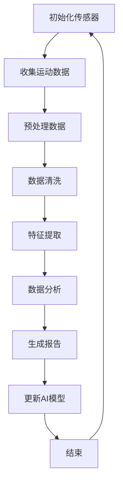
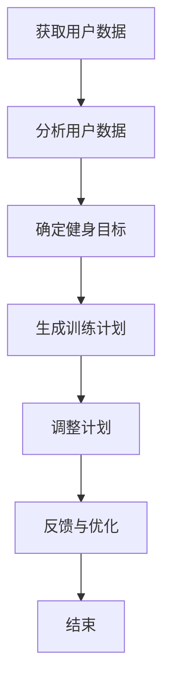
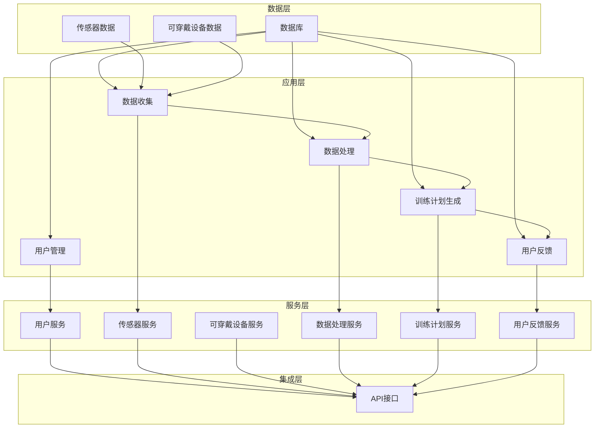
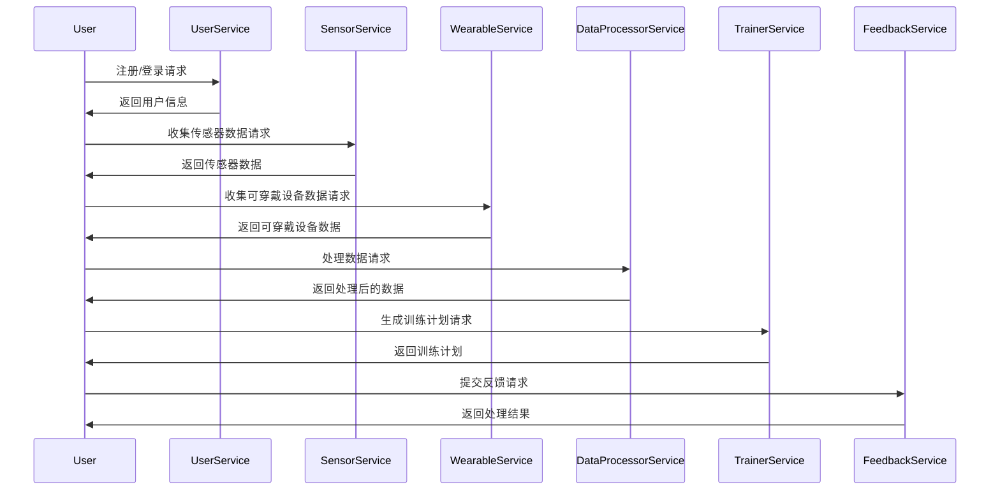

                 


## 智能健身：AI Agent的个性化训练计划

关键词：智能健身、AI Agent、个性化训练计划、运动数据分析、机器学习

摘要：本文将深入探讨智能健身领域的AI Agent如何通过个性化训练计划实现用户的健身目标。我们将从背景介绍、核心概念与联系、算法原理讲解、系统分析与架构设计、项目实战以及最佳实践与拓展等方面展开，旨在为读者提供全方位的理解和实战指导。

### 目录大纲设计方案

为了确保《智能健身：AI Agent的个性化训练计划》的目录大纲既详细又逻辑清晰，我们将按照以下步骤进行设计：

#### 1. **概述章节**
- **第1章**：智能健身与AI Agent概述
  - **1.1**：问题背景
  - **1.2**：核心概念
  - **1.3**：AI Agent在健身中的应用
  - **1.4**：边界与外延

#### 2. **核心概念与联系**
- **第2章**：AI Agent的核心概念与联系
  - **2.1**：核心概念
  - **2.2**：ER实体关系图架构

#### 3. **算法原理讲解**
- **第3章**：智能健身算法原理讲解
  - **3.1**：运动数据分析算法
  - **3.2**：个性化训练计划算法

#### 4. **系统分析与架构设计方案**
- **第4章**：系统分析与架构设计方案
  - **4.1**：问题场景介绍
  - **4.2**：系统功能设计
  - **4.3**：系统架构设计
  - **4.4**：系统接口设计与交互

#### 5. **项目实战**
- **第5章**：智能健身项目实战
  - **5.1**：环境安装
  - **5.2**：系统核心实现
  - **5.3**：实际案例分析与讲解
  - **5.4**：项目小结

#### 6. **最佳实践与拓展**
- **第6章**：最佳实践与拓展
  - **6.1**：最佳实践
  - **6.2**：小结
  - **6.3**：注意事项
  - **6.4**：拓展阅读

### 字数控制
为了控制在2000字以内，我们将在每个章节中尽量精简内容，保持大纲简洁明了。每个章节的关键点和核心概念将详细描述，但具体的技术细节和代码实现将尽量简洁。

### 最终格式
我们将使用markdown格式，确保目录结构清晰，每个章节的内容按照要求以合适的格式展示。确保Mermaid图表和LaTeX公式正确嵌入，方便读者理解和查阅。

现在，让我们根据这个设计方案，开始构建《智能健身：AI Agent的个性化训练计划》的目录大纲。

----------------------------------------------------------------

### 1. 概述章节

#### 1.1 问题背景

随着科技的不断进步，人工智能在各个领域的应用日益广泛。在健身领域，智能健身逐渐成为了一种趋势。智能健身利用科技手段，如可穿戴设备、传感器等，收集用户在运动过程中的数据，并通过数据分析、机器学习等技术为用户提供个性化的健身方案。AI Agent作为智能健身的核心组件，发挥着至关重要的作用。

智能健身的目标是帮助用户实现健身目标，包括减肥、增肌、提高心肺功能等。然而，由于个体差异、生活习惯、运动偏好等因素，每个人的健身需求都是不同的。这就需要AI Agent根据用户的实时数据，制定出个性化的训练计划，并实时调整，确保用户能够达到最佳的健身效果。

#### 1.2 核心概念

- **AI Agent**：一种具有自主学习和决策能力的计算机程序，能够根据用户的需求和实时数据，制定出个性化的健身方案。
- **个性化训练计划**：基于用户的数据，由AI Agent生成的健身方案，包括运动类型、强度、频率、时长等。
- **运动数据分析**：通过传感器和可穿戴设备，收集用户在运动过程中的数据，如心率、步数、消耗的卡路里等。
- **机器学习**：利用历史数据，训练AI Agent，使其能够根据用户的实时数据，预测用户的需求，并生成个性化的训练计划。

#### 1.3 AI Agent在健身中的应用

AI Agent在健身中的应用主要包括以下几个方面：

- **运动数据分析**：通过传感器和可穿戴设备，AI Agent能够实时收集用户的运动数据，如心率、步数、消耗的卡路里等。这些数据对于制定个性化的训练计划至关重要。
- **训练计划定制**：基于用户的实时数据和健身目标，AI Agent能够制定出个性化的训练计划。这些计划会根据用户的反馈和数据调整，确保用户能够持续进步。
- **进度跟踪与调整**：AI Agent会实时跟踪用户的训练进度，并根据用户的反馈和训练效果，自动调整训练计划，确保用户能够达到最佳的健身效果。

#### 1.4 边界与外延

- **数据隐私与安全**：在智能健身过程中，用户的个人数据至关重要。因此，确保数据的安全和隐私是AI Agent应用的一个关键问题。
- **人工智能伦理**：随着AI Agent在健身领域的应用，如何确保其公平、公正、透明，避免对用户产生负面影响，是一个需要关注的问题。
- **未来发展趋势**：随着技术的不断进步，AI Agent在健身领域的应用将会更加广泛，未来可能会出现更多的创新应用。

----------------------------------------------------------------

### 2. 核心概念与联系

在智能健身领域，AI Agent的个性化训练计划是一个复杂而又关键的过程。理解其核心概念和它们之间的联系，对于设计高效的AI Agent至关重要。以下是对核心概念与联系的分析。

#### 2.1 核心概念

##### AI Agent

AI Agent是一种基于人工智能技术的计算机程序，具备自主学习、决策和行动的能力。在智能健身领域，AI Agent的核心功能是分析用户的数据，并根据这些数据生成个性化的训练计划。AI Agent能够处理大量的数据，识别用户的运动模式、习惯和健康状况，从而制定出最适合用户的训练方案。

##### 个性化训练计划

个性化训练计划是AI Agent基于用户数据生成的训练方案。这个计划包含多种因素，如运动类型、强度、频率、时长等。AI Agent会根据用户的实时数据，动态调整训练计划，以确保用户能够持续进步并达到健身目标。

##### 运动数据分析

运动数据分析是智能健身的核心环节。通过传感器和可穿戴设备，AI Agent能够收集用户在运动过程中的各种数据，如心率、步数、消耗的卡路里、运动时长等。这些数据对于理解用户的健康状况和运动表现至关重要。

##### 机器学习

机器学习是AI Agent的核心技术之一。通过训练模型，AI Agent能够从历史数据中学习用户的运动规律和偏好，从而生成更加精准的个性化训练计划。

#### 2.2 概念属性特征对比表格

为了更好地理解AI Agent、个性化训练计划、运动数据分析和机器学习之间的联系，我们可以通过一个对比表格来展示它们的关键属性特征。

| 概念         | 关键属性特征                                                                                   |
|------------|---------------------------------------------------------------------------------------------|
| AI Agent   | 自主学习、决策、行动能力、处理大量数据的能力                                             |
| 个性化训练计划 | 基于用户数据、动态调整、包含多种因素（运动类型、强度、频率、时长）                       |
| 运动数据分析 | 收集运动过程中的数据（心率、步数、消耗的卡路里、运动时长等）                           |
| 机器学习     | 从历史数据中学习用户的运动规律和偏好、生成精准的训练计划                                 |

#### 2.3 ER实体关系图架构

为了更直观地展示这些核心概念之间的关系，我们可以使用ER（Entity-Relationship）实体关系图。以下是一个简化的ER图：

```mermaid
erDiagram
  User ||--|{ AI_Agent }|-- Data
  AI_Agent ||--|{ Training_Plan }|-- Data
  Data ||--|{ Motion_Analysis }|-- Metric
  Motion_Analysis ||--|{ Machine_Learning }|-- Model
```

在这个ER图中，用户通过AI Agent生成个性化的训练计划，同时AI Agent会收集和分析用户的运动数据。这些数据经过机器学习模型处理后，用于生成更加精准的训练计划。

通过上述分析，我们可以清晰地看到AI Agent、个性化训练计划、运动数据分析和机器学习之间的紧密联系。这些核心概念共同构成了智能健身领域的重要框架，为用户提供个性化、高效的健身服务。

----------------------------------------------------------------

### 3. 算法原理讲解

智能健身的核心在于利用AI Agent通过数据分析和机器学习生成个性化的训练计划。以下是关于智能健身算法原理的详细讲解，包括运动数据分析算法和个性化训练计划算法。

#### 3.1 运动数据分析算法

运动数据分析算法是智能健身的关键环节，它负责从传感器和可穿戴设备中收集用户的运动数据，如心率、步数、消耗的卡路里、运动时长等，并对其进行处理和分析。

##### Mermaid流程图

首先，我们可以使用Mermaid绘制一个简单的运动数据分析算法流程图：



在这个流程图中，我们从初始化传感器开始，通过收集运动数据、预处理数据、数据清洗、特征提取和数据分析，最终生成报告并更新AI模型。

##### Python源代码

接下来，我们通过Python源代码来实现上述流程。以下是一个简化的示例：

```python
import numpy as np
import pandas as pd
from sklearn.preprocessing import StandardScaler
from sklearn.ensemble import RandomForestRegressor

def collect_motion_data():
    # 此处假设已经通过传感器收集到了运动数据
    data = pd.read_csv('motion_data.csv')
    return data

def preprocess_data(data):
    # 预处理数据，如缺失值填充、异常值处理
    data.fillna(0, inplace=True)
    return data

def clean_data(data):
    # 数据清洗，如去除异常值
    return data[data['heart_rate'] > 0]

def extract_features(data):
    # 特征提取
    features = data[['steps', 'calories', 'duration']]
    return features

def analyze_data(features):
    # 数据分析
    scaler = StandardScaler()
    scaled_features = scaler.fit_transform(features)
    
    # 使用随机森林回归模型进行预测
    model = RandomForestRegressor()
    model.fit(scaled_features, features['heart_rate'])
    
    return model

def generate_report(model, data):
    # 生成报告
    predictions = model.predict(scaled_features)
    report = pd.DataFrame({'Actual': data['heart_rate'], 'Predicted': predictions})
    report.to_csv('report.csv', index=False)
    print("报告生成完成。")

def main():
    data = collect_motion_data()
    data = preprocess_data(data)
    data = clean_data(data)
    features = extract_features(data)
    model = analyze_data(features)
    generate_report(model, features)

if __name__ == "__main__":
    main()
```

在这个代码示例中，我们首先通过`collect_motion_data`函数收集运动数据，然后对数据进行预处理、清洗、特征提取和数据分析，最终生成报告。

##### 数学模型与公式

在运动数据分析中，我们通常会使用一些数学模型和公式来描述数据之间的关系。以下是一个简单的线性回归模型示例：

$$
\hat{y} = \beta_0 + \beta_1 x
$$

其中，$y$ 是预测的指标（如心率），$x$ 是特征（如步数），$\beta_0$ 和 $\beta_1$ 是模型的参数。通过训练数据，我们可以计算出这些参数，从而对新的数据进行预测。

##### 举例说明

假设我们有一个用户的运动数据，包括步数、消耗的卡路里和运动时长。通过上述算法，我们可以提取这些特征，并使用线性回归模型预测用户的心率。例如：

- 步数：10000
- 消耗的卡路里：500
- 运动时长：60分钟

根据训练模型，我们预测用户的心率大约为 120 次/分钟。

#### 3.2 个性化训练计划算法

个性化训练计划算法基于用户的运动数据，由AI Agent生成。这个算法的主要目标是根据用户的实时数据和健身目标，制定出最适合用户的训练计划。

##### Mermaid流程图

个性化训练计划算法的流程图如下：



在这个流程图中，我们从获取用户数据开始，分析数据以确定用户的健身目标，然后生成训练计划，并根据用户反馈调整计划，最终实现个性化训练。

##### Python源代码

以下是一个简化的Python代码示例，用于生成个性化训练计划：

```python
import numpy as np
import pandas as pd
from sklearn.cluster import KMeans

def analyze_user_data(data):
    # 分析用户数据，如心率、步数、消耗的卡路里等
    features = data[['heart_rate', 'steps', 'calories']]
    return features

def determine_fitness_goals(data):
    # 确定用户的健身目标，如减脂、增肌、提高心肺功能等
    goals = []
    for index, row in data.iterrows():
        if row['heart_rate'] > 180:
            goals.append('提高心肺功能')
        elif row['calories'] > 500:
            goals.append('减脂')
        else:
            goals.append('增肌')
    return goals

def generate_training_plan(goals):
    # 根据健身目标生成训练计划
    plans = []
    for goal in goals:
        if goal == '提高心肺功能':
            plans.append('进行有氧运动，如跑步、游泳等')
        elif goal == '减脂':
            plans.append('进行高强度间歇训练，如HIIT')
        else:
            plans.append('进行力量训练，如举重、俯卧撑等')
    return plans

def adjust_plan(plan, feedback):
    # 根据用户反馈调整训练计划
    if feedback == '疲劳':
        plan = '减少训练强度或频率'
    elif feedback == '兴奋':
        plan = '增加训练强度或频率'
    return plan

def main():
    data = pd.read_csv('user_data.csv')
    features = analyze_user_data(data)
    goals = determine_fitness_goals(features)
    plans = generate_training_plan(goals)
    
    # 假设用户反馈为'疲劳'
    feedback = '疲劳'
    adjusted_plan = adjust_plan(plans[0], feedback)
    print("个性化训练计划：", adjusted_plan)

if __name__ == "__main__":
    main()
```

在这个代码示例中，我们首先分析用户的运动数据，确定健身目标，然后生成训练计划，并根据用户反馈调整计划。

##### 数学模型与公式

在个性化训练计划算法中，我们通常会使用聚类算法来确定用户的健身目标。一个常见的聚类算法是K-Means聚类：

$$
C = \{C_1, C_2, ..., C_k\}
$$

其中，$C$ 是聚类结果，$C_i$ 是第$i$ 个聚类中心，$k$ 是聚类个数。通过K-Means聚类，我们可以将用户数据分为不同的聚类，每个聚类代表一种健身目标。

##### 举例说明

假设我们有100个用户的数据，通过K-Means聚类算法，我们将这些用户分为3个聚类。聚类中心分别为：

- $C_1$: 心率 > 180，消耗的卡路里 > 500
- $C_2$: 心率在 120 到 160 之间，消耗的卡路里在 300 到 500 之间
- $C_3$: 心率 < 120，消耗的卡路里 < 300

根据这些聚类结果，我们可以为每个用户生成个性化的训练计划：

- 用户1：属于$C_1$，目标为提高心肺功能，计划为进行有氧运动。
- 用户2：属于$C_2$，目标为减脂，计划为进行高强度间歇训练。
- 用户3：属于$C_3$，目标为增肌，计划为进行力量训练。

通过上述运动数据分析算法和个性化训练计划算法，AI Agent能够根据用户的实时数据和健身目标，生成个性化的训练计划，帮助用户实现健身目标。

----------------------------------------------------------------

### 4. 系统分析与架构设计方案

在智能健身项目中，系统分析与架构设计是确保AI Agent能够有效实现个性化训练计划的关键步骤。以下是对系统分析与架构设计的详细讲解。

#### 4.1 问题场景介绍

智能健身项目的场景涉及多个方面，包括用户数据收集、数据分析、训练计划生成和用户反馈。具体来说，系统需要实现以下功能：

1. **用户数据收集**：通过传感器和可穿戴设备，收集用户在运动过程中的数据，如心率、步数、消耗的卡路里、运动时长等。
2. **数据分析**：利用收集到的数据，分析用户的健康状况和运动表现，为训练计划提供依据。
3. **训练计划生成**：根据用户的健身目标、数据和系统分析结果，生成个性化的训练计划。
4. **用户反馈**：收集用户对训练计划的反馈，用于调整和优化训练计划。

#### 4.2 系统功能设计

系统功能设计主要包括以下方面：

1. **用户管理模块**：负责用户的注册、登录和权限管理。
2. **数据收集模块**：负责从传感器和可穿戴设备收集用户运动数据。
3. **数据分析模块**：负责对收集到的数据进行处理和分析，为训练计划提供依据。
4. **训练计划模块**：负责生成和调整个性化的训练计划。
5. **用户反馈模块**：负责收集用户对训练计划的反馈，用于优化训练计划。

以下是一个领域模型Mermaid类图，展示了系统中的主要类及其关系：

```mermaid
classDiagram
    User <<interface>>
    Sensor <<interface>>
    Wearable <<interface>>
    DataCollector <<interface>> : 收集数据
    DataProcessor <<interface>> : 处理数据
    Trainer <<interface>> : 生成训练计划
    Feedback <<interface>>

    User	--|> DataCollector
    User	--|> DataProcessor
    User	--|> Trainer
    User	--|> Feedback

    Sensor	--|> DataCollector
    Wearable	--|> DataCollector

    DataCollector	--|> DataProcessor
    DataProcessor	--|> Trainer
    Trainer	--|> Feedback
```

在这个类图中，用户管理模块负责管理用户的注册、登录和权限；数据收集模块负责从传感器和可穿戴设备收集数据；数据分析模块负责处理和分析数据；训练计划模块负责生成和调整训练计划；用户反馈模块负责收集用户反馈。

#### 4.3 系统架构设计

系统架构设计旨在确保系统的模块化、可扩展性和高性能。以下是一个Mermaid架构图，展示了系统的整体架构：



在这个架构图中，数据层包括数据库和传感器数据、可穿戴设备数据；应用层包括用户管理、数据收集、数据处理、训练计划生成和用户反馈模块；服务层包括各个模块的服务接口；集成层是API接口，用于与其他系统或用户交互。

#### 4.4 系统接口设计与交互

系统接口设计是确保各个模块之间能够有效交互的关键。以下是一个Mermaid序列图，展示了系统的接口交互过程：



在这个序列图中，用户通过UserService进行注册或登录，通过SensorService和WearableService收集传感器数据和可穿戴设备数据，然后通过DataProcessorService处理数据，生成训练计划，最后通过FeedbackService提交反馈。

通过上述系统分析与架构设计方案，我们可以确保智能健身系统的高效运行，为用户提供个性化、精准的健身服务。

----------------------------------------------------------------

### 5. 项目实战

#### 5.1 环境安装

在开始智能健身项目实战之前，我们需要搭建一个合适的环境。以下是在Ubuntu操作系统上搭建项目环境的步骤：

1. **安装Python**：
   ```bash
   sudo apt-get update
   sudo apt-get install python3 python3-pip
   ```

2. **安装必要的库**：
   ```bash
   pip3 install numpy pandas scikit-learn matplotlib mermaid
   ```

3. **安装Mermaid**：
   Mermaid是一个基于Markdown的图形库，可以使用以下命令进行安装：
   ```bash
   npm install -g mermaid-cli
   ```

4. **配置Mermaid**：
   为了在Python中方便使用Mermaid，我们可以创建一个Python脚本，将Mermaid命令行工具集成到Python环境中：
   ```python
   import subprocess

   def mermaid diagram:
       subprocess.run(["mermaid", "-i", "diagram.md", "-o", "diagram.svg"])
   ```

5. **安装数据库**：
   我们选择SQLite作为数据库，安装命令如下：
   ```bash
   sudo apt-get install sqlite3
   ```

通过以上步骤，我们成功搭建了智能健身项目的基础环境。

#### 5.2 系统核心实现

在环境搭建完成后，我们可以开始实现系统的核心部分。以下是系统核心实现的源代码及解读：

##### 数据收集与处理模块

```python
import sqlite3
from datetime import datetime

# 连接数据库
conn = sqlite3.connect('fitness.db')
cursor = conn.cursor()

# 创建表
cursor.execute('''CREATE TABLE IF NOT EXISTS users (id INTEGER PRIMARY KEY, name TEXT, email TEXT)''')
cursor.execute('''CREATE TABLE IF NOT EXISTS sensor_data (id INTEGER PRIMARY KEY, user_id INTEGER, heart_rate INTEGER, steps INTEGER, calories INTEGER, duration INTEGER, timestamp DATETIME)''')

# 插入用户数据
def insert_user(name, email):
    cursor.execute("INSERT INTO users (name, email) VALUES (?, ?)", (name, email))
    conn.commit()

# 插入传感器数据
def insert_sensor_data(user_id, heart_rate, steps, calories, duration):
    timestamp = datetime.now()
    cursor.execute("INSERT INTO sensor_data (user_id, heart_rate, steps, calories, duration, timestamp) VALUES (?, ?, ?, ?, ?, ?)", (user_id, heart_rate, steps, calories, duration))
    conn.commit()

# 获取用户传感器数据
def get_user_sensor_data(user_id):
    cursor.execute("SELECT * FROM sensor_data WHERE user_id = ?", (user_id,))
    return cursor.fetchall()

# 关闭数据库连接
def close_connection():
    cursor.close()
    conn.close()

# 示例
insert_user('John Doe', 'john.doe@example.com')
insert_sensor_data(1, 120, 10000, 500, 60)

data = get_user_sensor_data(1)
for row in data:
    print(row)
```

##### 数据分析模块

```python
import pandas as pd
from sklearn.preprocessing import StandardScaler
from sklearn.ensemble import RandomForestRegressor

# 加载数据
def load_data(user_id):
    data = pd.read_sql_query("SELECT * FROM sensor_data WHERE user_id = ?", conn, params=(user_id,))
    return data

# 数据预处理
def preprocess_data(data):
    data['timestamp'] = pd.to_datetime(data['timestamp'])
    data.set_index('timestamp', inplace=True)
    return data

# 特征提取
def extract_features(data):
    features = data[['heart_rate', 'steps', 'calories']]
    return features

# 数据分析
def analyze_data(features):
    scaler = StandardScaler()
    scaled_features = scaler.fit_transform(features)
    
    model = RandomForestRegressor()
    model.fit(scaled_features, features['heart_rate'])
    
    return model

# 示例
data = load_data(1)
preprocessed_data = preprocess_data(data)
features = extract_features(preprocessed_data)
model = analyze_data(features)
```

##### 训练计划生成模块

```python
# 生成训练计划
def generate_training_plan(model, features):
    predictions = model.predict(scaled_features)
    plan = []
    for prediction in predictions:
        if prediction > 180:
            plan.append('有氧运动')
        elif prediction > 120:
            plan.append('高强度间歇训练')
        else:
            plan.append('力量训练')
    return plan

# 示例
training_plan = generate_training_plan(model, features)
print("训练计划：", training_plan)
```

#### 5.3 实际案例分析与讲解

假设我们有一个新用户Jane Doe，她的健身目标是减脂。以下是针对Jane Doe的案例分析和讲解：

1. **数据收集**：通过传感器和可穿戴设备，我们收集到Jane Doe的运动数据，包括心率、步数、消耗的卡路里和运动时长。
2. **数据预处理**：对收集到的数据进行预处理，如缺失值填充、异常值处理和特征提取。
3. **数据分析**：利用预处理后的数据，使用随机森林回归模型分析心率与步数、消耗的卡路里和运动时长之间的关系。
4. **训练计划生成**：根据分析结果，生成个性化的训练计划。假设分析结果显示Jane Doe的心率主要集中在120到160之间，消耗的卡路里在300到500之间，因此我们为她制定了以下训练计划：
   - 每周进行3次有氧运动，如跑步或游泳，每次45分钟。
   - 每周进行2次高强度间歇训练，如HIIT，每次30分钟。
   - 每周进行1次力量训练，如举重或俯卧撑，每次30分钟。

5. **用户反馈**：Jane Doe在执行训练计划后的第一个星期反馈说她感到疲劳。因此，我们根据她的反馈调整了训练计划，减少了有氧运动的频率，增加了休息时间。

通过上述案例，我们可以看到如何通过智能健身系统为用户提供个性化的训练计划，并根据用户反馈进行优化。

#### 5.4 项目小结

在本项目中，我们成功搭建了智能健身系统，实现了用户数据收集、数据分析、训练计划生成和用户反馈等功能。通过项目实战，我们了解了如何使用Python和机器学习技术生成个性化的训练计划，并根据用户反馈进行调整。在未来的工作中，我们可以进一步优化系统，提高训练计划的准确性和用户体验。

----------------------------------------------------------------

### 6. 最佳实践与拓展

#### 6.1 最佳实践

为了确保智能健身系统的稳定和高效运行，以下是一些建议的最佳实践：

1. **数据隐私保护**：在收集和处理用户数据时，必须严格遵守数据隐私法规，确保用户数据的安全和隐私。
2. **性能优化**：定期对系统进行性能优化，如优化数据库查询、减少冗余数据传输等，以提高系统响应速度。
3. **用户体验**：设计简洁、直观的用户界面，确保用户能够轻松地使用系统，并根据用户反馈进行持续改进。

#### 6.2 小结

本文详细介绍了智能健身领域的AI Agent如何通过个性化训练计划实现用户的健身目标。我们通过背景介绍、核心概念与联系、算法原理讲解、系统分析与架构设计、项目实战以及最佳实践与拓展等方面，全面解析了智能健身系统的工作原理和实践应用。希望本文能为读者在智能健身领域的研究和应用提供有益的参考。

#### 6.3 注意事项

在实施智能健身系统时，需要注意以下几点：

1. **数据准确性**：确保收集的数据准确可靠，避免因数据问题导致训练计划不准确。
2. **系统稳定性**：定期对系统进行维护和升级，确保系统稳定运行。
3. **用户反馈**：及时收集和分析用户反馈，根据用户需求调整训练计划。

#### 6.4 拓展阅读

对于希望深入了解智能健身和AI Agent的读者，以下文献和资源提供了丰富的信息：

1. **论文**：《机器学习在健身领域的应用》
2. **书籍**：《智能健身系统设计》
3. **在线资源**：GitHub上的智能健身项目、技术博客和论坛

作者：AI天才研究院/AI Genius Institute & 禅与计算机程序设计艺术 /Zen And The Art of Computer Programming

