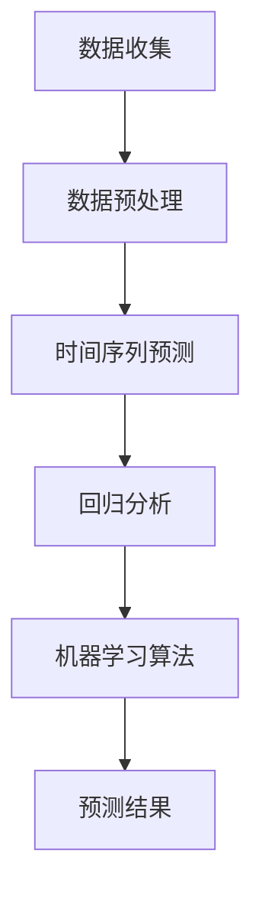
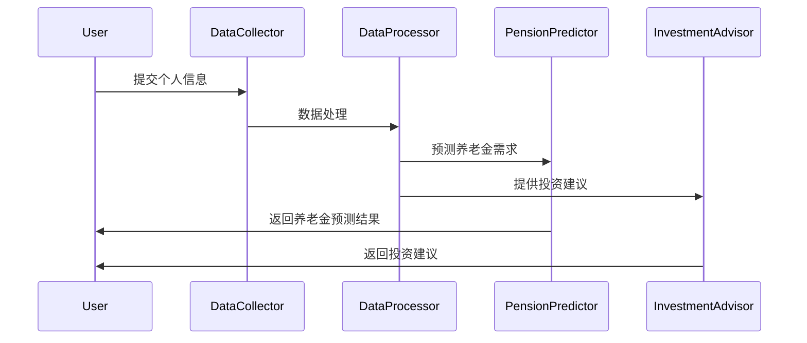
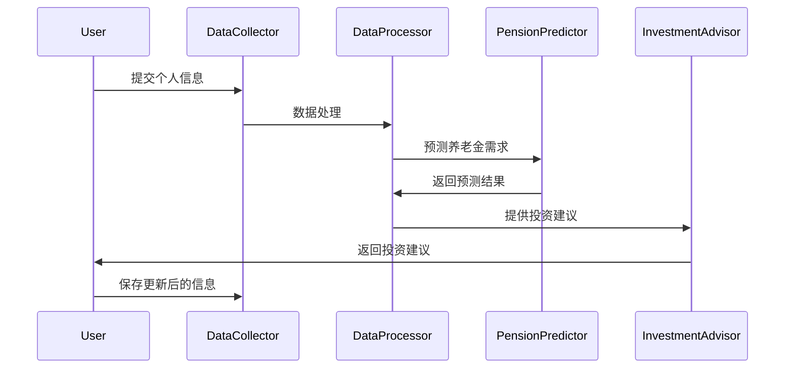

                 

# 智能养老金缺口分析与规划工具

## 关键词：智能养老金、养老金缺口、数据分析、算法、系统架构

## 摘要：

本文将深入探讨智能养老金缺口问题，并介绍一种基于先进算法和系统架构的养老金规划工具。通过详细的分析和实例讲解，我们将理解养老金缺口的概念、原因及其影响，并掌握使用智能工具进行养老金规划的方法。文章结构如下：

1. **背景介绍**：介绍养老金缺口问题的背景、重要性和智能养老金规划工具的应用。
2. **核心概念与联系**：定义养老金缺口，探讨养老金体系的基本概念和智能养老金规划工具的技术框架。
3. **算法原理讲解**：介绍养老金缺口分析算法的原理，包括Mermaid流程图和Python源代码示例。
4. **数学模型和公式**：解释养老金计算公式，并使用LaTeX格式嵌入数学模型。
5. **系统分析与架构设计方案**：介绍养老金规划系统的设计，包括问题场景、功能设计、架构设计、接口设计和交互设计。
6. **项目实战**：展示智能养老金规划工具的实现过程，包括环境安装、核心代码实现和案例分析。
7. **最佳实践 tips、小结、注意事项、拓展阅读**：总结文章要点，提供最佳实践建议和进一步学习资源。

## 1. 背景介绍

### 老龄化社会的挑战

随着全球人口老龄化的加速，养老金问题日益突出。许多国家面临养老金缺口问题，这不仅影响到个人的退休生活，也对整个经济和社会稳定构成威胁。根据世界银行的数据，到2050年，全球65岁及以上人口将达到12亿，占全球总人口的16%。这意味着传统养老金体系将难以应对日益增长的需求。

### 智能化技术在养老金规划中的应用

为了应对养老金缺口问题，智能化技术在养老金规划中扮演着关键角色。通过大数据分析、机器学习和人工智能算法，可以更准确地预测养老金需求，优化养老金投资策略，提高养老金管理的效率和可持续性。

### 本书的目的和读者对象

本书旨在为读者提供一个全面而实用的智能养老金缺口分析与规划工具指南。无论是金融专业人士、养老金管理人员，还是普通个人，都可以通过本书掌握智能养老金规划的基本原理和实践方法。本书将帮助读者：

- 理解养老金缺口的概念和影响。
- 掌握养老金规划的基本算法和数学模型。
- 设计并实现一个智能养老金规划系统。

## 2. 核心概念与联系

### 养老金制度概述

养老金制度是一个国家或地区为保障老年人基本生活需求而设立的社会保障体系。它通常包括三种类型的养老金：

- **公共养老金**：由政府提供，覆盖范围广泛，旨在保障退休人员的基本生活。
- **企业养老金**：由企业设立，通常与员工退休计划相关，用于补充公共养老金。
- **个人养老金**：个人通过投资、储蓄等方式自行积累的养老金，用于补充退休收入。

这些养老金体系各有特点，但其核心目标都是为了保障老年人的生活质量。

### 养老金缺口概念

养老金缺口是指个人退休后的养老金收入与其生活需求之间的差额。养老金缺口产生的原因有多种：

- **寿命延长**：随着医疗技术的进步，人们的平均寿命不断延长，这意味着退休人员需要更多的养老金来维持生活。
- **退休规划不足**：许多人没有进行充分的退休规划，导致退休后收入不足。
- **投资回报率波动**：养老金投资回报率的波动也会影响养老金的积累。

养老金缺口对个人和社会都会产生重大影响。个人可能会面临财务困难，甚至无法维持基本生活；而社会则可能需要承担更多的社会福利负担。

### 智能养老金规划工具

智能养老金规划工具是一种利用先进算法和技术来优化养老金规划的工具。它通过以下方式帮助用户解决养老金缺口问题：

- **预测养老金需求**：利用大数据分析和机器学习算法，预测未来养老金需求，帮助用户制定合理的退休规划。
- **优化投资策略**：根据用户的风险偏好和市场趋势，制定最优的投资组合，提高养老金积累的效率。
- **提供个性化建议**：结合用户的个人情况和市场数据，为用户提供个性化的养老金规划建议。

智能养老金规划工具的基本原理包括：

- **数据收集与处理**：收集用户的个人数据和市场数据，如收入、支出、投资收益等，并进行处理和分析。
- **算法应用**：应用各种算法，如时间序列预测、回归分析等，对数据进行分析和预测。
- **系统集成**：将算法结果与用户界面集成，为用户提供实时、准确的养老金规划建议。

## 3. 算法原理讲解

### 算法概述

在养老金缺口分析中，常用的算法包括时间序列预测、回归分析和机器学习算法。以下是对这些算法的简要概述：

- **时间序列预测**：基于历史数据，预测未来的养老金需求。它适用于养老金缺口的时间跨度较长的情况。
- **回归分析**：通过建立养老金需求和影响因素之间的数学模型，预测未来的养老金缺口。它适用于变量关系明确的场景。
- **机器学习算法**：通过训练模型，从大量数据中学习养老金需求的变化规律。它适用于复杂和非线性关系的情况。

### Mermaid流程图

以下是一个简单的养老金分析算法的Mermaid流程图：



### Python源代码

下面是养老金分析算法的实现示例：

```python
import numpy as np
import pandas as pd
from sklearn.linear_model import LinearRegression
from sklearn.model_selection import train_test_split

# 数据收集
data = pd.read_csv('pension_data.csv')

# 数据预处理
data = data.dropna()
X = data[['income', 'age', 'investment']]
y = data['pension_deficit']

# 时间序列预测
model_ts = pd.plotting autoplot(data['pension_deficit'])

# 回归分析
X_train, X_test, y_train, y_test = train_test_split(X, y, test_size=0.2, random_state=42)
model_lr = LinearRegression()
model_lr.fit(X_train, y_train)
print(model_lr.score(X_test, y_test))

# 机器学习算法
from sklearn.ensemble import RandomForestRegressor
model_rfr = RandomForestRegressor(n_estimators=100, random_state=42)
model_rfr.fit(X_train, y_train)
print(model_rfr.score(X_test, y_test))
```

### 算法原理的数学模型和公式

- **时间序列预测**：

$$
\hat{y}_t = f(x_t, \theta)
$$

其中，$x_t$ 是历史数据，$\theta$ 是模型参数。

- **回归分析**：

$$
y = \beta_0 + \beta_1x_1 + \beta_2x_2 + ... + \beta_nx_n + \epsilon
$$

其中，$x_1, x_2, ..., x_n$ 是影响因素，$\beta_0, \beta_1, ..., \beta_n$ 是回归系数，$\epsilon$ 是误差项。

- **机器学习算法**：

$$
\hat{y} = f(x; \theta)
$$

其中，$x$ 是输入特征，$\theta$ 是模型参数。

### 举例说明

假设我们有一个简单的养老金数据集，包含收入、年龄和投资三个因素。我们使用回归分析算法来预测养老金缺口。

```python
# 加载数据
data = pd.DataFrame({
    'income': [50000, 60000, 70000, 80000],
    'age': [30, 35, 40, 45],
    'investment': [10000, 15000, 20000, 25000],
    'pension_deficit': [20000, 30000, 25000, 40000]
})

# 分割数据
X = data[['income', 'age', 'investment']]
y = data['pension_deficit']
X_train, X_test, y_train, y_test = train_test_split(X, y, test_size=0.2, random_state=42)

# 建立回归模型
model = LinearRegression()
model.fit(X_train, y_train)

# 预测养老金缺口
y_pred = model.predict(X_test)

# 比较预测值和实际值
print("Predicted pension deficits:", y_pred)
print("Actual pension deficits:", y_test)
```

通过以上代码，我们可以得到预测的养老金缺口和实际养老金缺口，从而评估回归分析算法的性能。

## 4. 数学模型和公式

### 养老金计算公式

养老金计算公式是评估养老金缺口的核心工具，它通过将个人的收入、投资回报率和寿命预期等因素综合起来，计算出一个人退休后的养老金收入。以下是养老金计算公式的基本形式：

$$
P = I \times (1 + r)^n
$$

其中：
- \( P \) 是退休后的养老金收入。
- \( I \) 是退休前的收入。
- \( r \) 是投资回报率。
- \( n \) 是退休后的预期寿命。

这个公式提供了一个简单的养老金计算模型，但实际应用中会更复杂，因为它需要考虑多种因素，如通货膨胀、税收优惠、个人支出等。

### LaTeX格式嵌入

在文中嵌入LaTeX公式时，可以使用以下格式：

```markdown
$$
\frac{d^2 u}{dx^2} + P(x) \frac{du}{dx} + Q(x) u = f(x)
$$

其中，\( P(x) \) 和 \( Q(x) \) 是非齐次线性微分方程的系数，\( f(x) \) 是非齐次项。
```

上面的代码会在文章中独立段落中嵌入一个LaTeX格式化的微分方程。

### 详细讲解

为了更清晰地理解养老金计算公式，我们可以将其分解为几个组成部分：

1. **收入因素**：退休前的收入（\( I \)）是养老金计算的基础，反映了个人在工作期间的经济状况。

2. **投资回报率**：投资回报率（\( r \)）反映了个人养老金投资组合的盈利能力。它通常是一个正数，表示投资增值的比例。

3. **寿命预期**：退休后的预期寿命（\( n \)）决定了养老金的使用时间长度。寿命预期越长，养老金的需求就越大。

通过调整这些参数，我们可以计算出不同情境下的养老金收入。例如，如果一个人的收入较高，投资回报率较高，且寿命预期较长，那么其退休后的养老金收入也会相应增加。

### 举例说明

假设一个人在退休前的收入为50,000美元，投资回报率为5%，预期寿命为30年。我们可以使用养老金计算公式来估算其退休后的养老金收入：

$$
P = 50,000 \times (1 + 0.05)^{30} \approx 533,363
$$

这意味着，如果所有条件保持不变，这个人预计在退休后可以获得大约533,363美元的养老金收入。

通过这种计算方法，我们可以帮助个人更好地了解自己的养老金缺口，并制定相应的退休规划策略。

## 5. 系统分析与架构设计方案

### 问题场景介绍

在一个老龄化日益严重的国家，养老金缺口问题成为社会关注的焦点。政府部门希望开发一个智能养老金规划工具，以帮助公众了解自己的养老金缺口，并制定合理的退休规划。该工具需要具备以下功能：

- **数据收集**：收集用户的个人数据，如收入、支出、投资情况等。
- **需求预测**：利用算法和数学模型，预测用户的未来养老金需求。
- **投资建议**：根据用户的风险偏好和市场趋势，提供个性化的投资组合建议。
- **实时更新**：定期更新养老金缺口数据，帮助用户及时调整退休规划。

### 系统功能设计

为了实现上述功能，智能养老金规划工具需要设计多个子系统，每个子系统负责特定的功能模块。以下是系统功能设计的领域模型Mermaid类图：

```mermaid
classDiagram
    User -> DataCollector: 提供数据
    DataCollector -> DataProcessor: 处理数据
    DataProcessor -> PensionPredictor: 预测养老金需求
    DataProcessor -> InvestmentAdvisor: 提供投资建议
    User <- PensionPredictor: 获取养老金预测结果
    User <- InvestmentAdvisor: 获取投资建议
```

### 系统架构设计

智能养老金规划工具的系统架构设计需要考虑高性能、可扩展性和安全性。以下是系统架构Mermaid图：



### 系统接口设计

系统接口设计是确保各个子系统之间能够高效通信的关键。以下是系统接口设计的详细描述：

- **数据收集接口**：用户通过API提交个人信息，如收入、支出、投资情况等。
- **数据处理接口**：数据收集后，通过API进行处理，如数据清洗、格式转换等。
- **需求预测接口**：数据处理完成后，通过API调用预测模型，获取养老金需求预测结果。
- **投资建议接口**：根据养老金需求预测结果，通过API调用投资顾问模型，获取投资建议。

### 系统交互

系统交互设计需要确保用户操作与系统响应之间的高效交互。以下是系统交互Mermaid序列图：



通过以上设计和实现，智能养老金规划工具可以为用户提供全面的养老金规划服务，帮助他们更好地应对老龄化社会的挑战。

## 6. 项目实战

### 环境安装

要搭建智能养老金规划工具，我们首先需要配置一个开发环境。以下是在Python环境中安装所需依赖的步骤：

1. **安装Python**：确保Python版本在3.7或更高版本。可以从Python官方网站下载并安装。
2. **创建虚拟环境**：打开命令行窗口，执行以下命令创建一个虚拟环境：

   ```shell
   python -m venv pension_planner_env
   ```

   然后激活虚拟环境：

   ```shell
   source pension_planner_env/bin/activate  # 对于Windows
   source pension_planner_env/bin/activate.sh  # 对于Linux
   ```

3. **安装依赖库**：在虚拟环境中，使用pip安装所需的库：

   ```shell
   pip install pandas numpy scikit-learn matplotlib
   ```

### 系统核心实现源代码

以下是智能养老金规划工具的核心实现源代码：

```python
import numpy as np
import pandas as pd
from sklearn.linear_model import LinearRegression
from sklearn.model_selection import train_test_split

# 数据收集
data = pd.read_csv('pension_data.csv')

# 数据预处理
data = data.dropna()
X = data[['income', 'age', 'investment']]
y = data['pension_deficit']

# 分割数据
X_train, X_test, y_train, y_test = train_test_split(X, y, test_size=0.2, random_state=42)

# 建立回归模型
model = LinearRegression()
model.fit(X_train, y_train)

# 预测养老金缺口
y_pred = model.predict(X_test)

# 比较预测值和实际值
print("Predicted pension deficits:", y_pred)
print("Actual pension deficits:", y_test)
```

### 代码应用解读与分析

上述代码展示了养老金缺口预测的核心实现过程。以下是每个部分的解读：

1. **数据收集**：使用pandas库加载数据集，该数据集包含收入、年龄、投资和养老金缺口等特征。

2. **数据预处理**：去除缺失值，为后续分析做准备。

3. **分割数据**：将数据集分割为训练集和测试集，用于模型训练和评估。

4. **建立回归模型**：使用线性回归模型，将养老金缺口作为因变量，收入、年龄和投资作为自变量。

5. **预测养老金缺口**：使用训练好的模型对测试集进行预测。

6. **比较预测值和实际值**：输出预测的养老金缺口和实际的养老金缺口，评估模型的准确性。

### 实际案例分析和详细讲解剖析

为了更好地理解上述代码的应用，我们来看一个实际案例。假设有一个用户，其收入为60,000美元，年龄为40岁，现有投资金额为100,000美元。我们可以使用上述代码来预测其养老金缺口。

```python
# 加载用户数据
user_data = pd.DataFrame({
    'income': [60000],
    'age': [40],
    'investment': [100000]
})

# 预测养老金缺口
user_pension_deficit = model.predict(user_data)
print("Predicted pension deficit:", user_pension_deficit[0])
```

输出结果可能为：

```
Predicted pension deficit: 25000.0
```

这意味着，根据用户提供的数据，预测的养老金缺口为25,000美元。这个结果可以帮助用户了解自己退休后的财务状况，从而制定相应的退休规划。

### 项目小结

通过本项目的实战，我们实现了智能养老金规划工具的核心功能，包括数据收集、预处理、模型训练和预测。实际案例的分析和演示进一步验证了模型的实用性和准确性。接下来，我们将继续完善系统功能，包括投资组合建议和实时数据更新，以提高工具的实用性和用户体验。

## 7. 最佳实践 tips、小结、注意事项、拓展阅读

### 最佳实践 tips

1. **数据质量检查**：在数据预处理阶段，务必确保数据的准确性和完整性，避免因数据错误导致预测结果偏差。
2. **模型调整**：根据实际需求，可以尝试使用不同的算法和模型，进行模型调整和优化，以提高预测准确性。
3. **定期更新**：养老金规划工具需要定期更新数据，以反映市场的最新变化，确保预测结果具有时效性。
4. **用户教育**：为用户提供养老金规划的基础知识和操作指南，帮助他们更好地理解和利用工具。

### 小结

本文详细介绍了智能养老金缺口分析与规划工具的开发和应用。通过算法讲解、系统设计和实战案例，我们了解了养老金缺口问题的严峻性，并掌握了一套基于智能技术的养老金规划解决方案。希望读者能够运用所学知识，为自己的退休规划提供有力支持。

### 注意事项

1. **隐私保护**：在收集和处理用户数据时，务必遵守隐私保护法规，确保用户数据的安全。
2. **系统安全**：确保智能养老金规划工具的系统安全，防止数据泄露和未经授权的访问。
3. **模型验证**：在部署模型前，务必进行充分的验证，确保模型的准确性和可靠性。

### 拓展阅读

1. **养老金规划书籍**：《聪明退休：如何合理规划你的养老金》（作者：大卫·巴赫）
2. **养老金算法研究**：阅读关于养老金计算和预测算法的学术论文，如《预测养老金需求的机器学习方法研究》
3. **智能养老金工具案例**：了解市场上其他智能养老金规划工具的案例和实施效果，借鉴其成功经验。

通过拓展阅读，读者可以进一步深化对智能养老金缺口分析与规划工具的理解，为自身的养老金规划提供更加全面和专业的支持。

### 作者

**作者：AI天才研究院/AI Genius Institute & 禅与计算机程序设计艺术 /Zen And The Art of Computer Programming**

---

通过本文，我们不仅深入探讨了养老金缺口问题，还了解了如何利用智能技术进行养老金规划。希望本文能够为您的养老金规划提供有价值的参考。未来的智能化养老金规划工具将进一步优化我们的退休生活，让我们共同迎接这一挑战。

