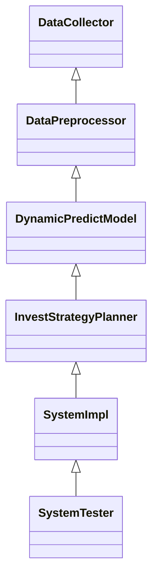
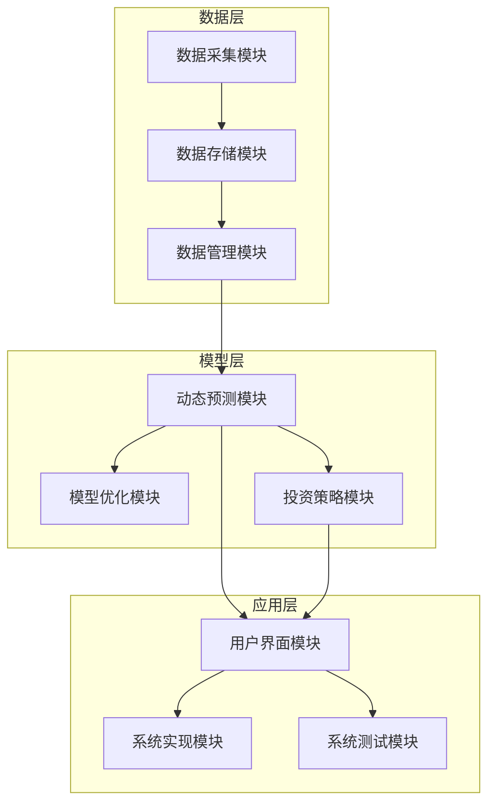
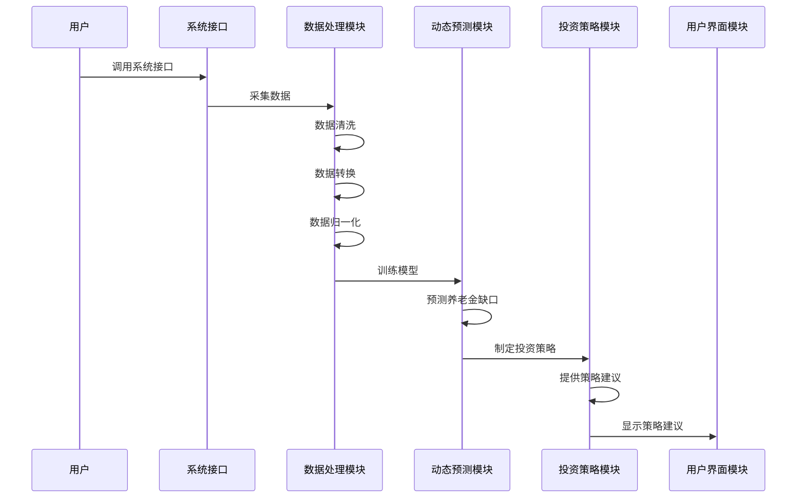
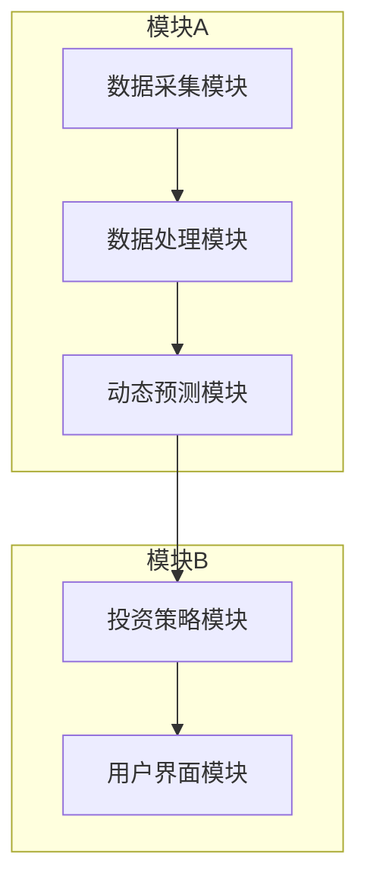

                 


# 智能养老金缺口动态预测与规划系统

关键词：养老金、预测、规划、人工智能、动态预测模型

摘要：随着人口老龄化问题的日益严重，养老金缺口问题已经成为全球各国政府和社会关注的焦点。本文将介绍智能养老金缺口动态预测与规划系统的构建方法，包括数据采集与预处理、动态预测模型构建、投资策略规划以及系统实现与优化。通过本文的阐述，读者可以深入了解智能养老金缺口动态预测与规划系统的工作原理和实际应用。

## 背景介绍

### 问题背景

随着全球人口老龄化的加剧，养老金缺口问题已经成为各国政府和社会关注的焦点。养老金缺口，即养老金储备不足以支付退休人员的养老金支出，会导致退休人员的生活质量下降，甚至引发社会不稳定。因此，准确预测养老金缺口，制定合理的养老金规划策略，对于保障退休人员的生活质量和实现社会保障体系的可持续发展具有重要意义。

### 问题描述

养老金缺口动态预测与规划系统需要解决以下问题：

- 如何准确预测养老金缺口？
- 如何合理规划养老金的投资策略？
- 如何确保养老金的长期稳定增长？

### 问题解决

本书将介绍智能养老金缺口动态预测与规划系统的构建方法，包括以下方面：

- 数据采集与预处理：收集养老金缴纳数据、投资回报数据等，并进行数据清洗、数据转换和归一化处理。
- 动态预测模型构建：选择合适的时间序列模型或机器学习模型，利用历史数据训练模型，预测养老金缺口。
- 投资策略规划：根据预测结果，制定合理的投资策略，实现养老金的长期稳定增长。
- 系统实现与优化：设计并实现养老金缺口动态预测与规划系统的整体架构，进行性能优化。

### 边界与外延

- 本书的关注点是智能养老金缺口动态预测与规划系统的构建，不包括其他养老金管理相关的问题。
- 本书将基于具体的数据集和算法模型进行讲解，不涉及具体的投资决策。

## 核心概念

### 智能养老金缺口动态预测

- 定义：利用人工智能技术，对养老金缺口进行动态预测。
- 属性特征：准确度高、实时性强、适应性广。

### 动态预测模型

- 定义：用于预测养老金缺口的数学模型。
- 属性特征：适应性强、稳定性好。

### 投资策略规划

- 定义：根据养老金缺口预测结果，制定合理的投资策略。
- 属性特征：风险可控、收益最大化。

## 概念结构与核心要素组成

### 数据采集与预处理

- 数据来源：养老金缴纳数据、投资回报数据等。
- 数据预处理：数据清洗、数据转换、数据归一化等。

### 缺口预测模型

- 模型构建：选择合适的预测模型，如时间序列模型、机器学习模型等。
- 模型训练：使用历史数据训练模型，调整模型参数。
- 模型评估：评估模型预测效果，如均方误差、预测准确率等。

### 投资策略规划

- 策略制定：根据养老金缺口预测结果，制定合理的投资策略。
- 策略优化：通过模拟仿真，优化投资策略，提高养老金收益。

### 系统实现与优化

- 系统架构设计：设计系统的整体架构，包括数据采集模块、预测模型模块、投资策略模块等。
- 系统实现：编写系统代码，实现各功能模块。
- 系统优化：对系统进行性能优化，提高系统运行效率。

### 核心概念原理、概念属性特征对比表格与ER实体关系图架构的 Mermaid 流程图

#### 核心概念原理

- 数据采集与预处理：通过数据采集模块获取养老金缴纳数据、投资回报数据等，然后进行数据清洗、数据转换、数据归一化等预处理操作。
- 缺口预测模型：利用历史数据训练预测模型，通过模型预测养老金缺口。
- 投资策略规划：根据预测结果制定投资策略，并优化投资策略。
- 系统实现与优化：实现养老金缺口动态预测与规划系统的整体功能，并进行性能优化。

#### 概念属性特征对比表格

| 概念                 | 属性特征                                                                                   |
|----------------------|-------------------------------------------------------------------------------------------|
| 数据采集与预处理     | 数据来源多样，预处理方法全面                                                       |
| 缺口预测模型         | 准确度高，适应性强                                                                   |
| 投资策略规划         | 风险可控，收益最大化                                                                 |
| 系统实现与优化       | 功能全面，性能优化                                                                   |

#### ER实体关系图架构的 Mermaid 流程图

```mermaid
erDiagram
  数据采集与预处理 ||--|{ 缺口预测模型 }
  缺口预测模型 ||--|{ 投资策略规划 }
  投资策略规划 ||--|{ 系统实现与优化 }
```

## 算法原理讲解

### 动态预测模型算法原理

#### 动态预测模型概述

动态预测模型是智能养老金缺口动态预测与规划系统中的核心组成部分。其主要功能是利用历史数据对养老金缺口进行预测。本文将介绍两种常用的动态预测模型：时间序列模型和机器学习模型。

#### 时间序列模型

时间序列模型是一种基于时间数据的预测模型，它通过分析时间序列数据的特征，如趋势、季节性、周期性等，来预测未来的数据。时间序列模型主要有以下几种：

1. **自回归模型（AR）**：自回归模型是一种线性模型，它通过历史数据中的滞后项来预测未来值。自回归模型的公式如下：

   $$
   Y_t = c + \phi_1 Y_{t-1} + \phi_2 Y_{t-2} + \ldots + \phi_p Y_{t-p} + \varepsilon_t
   $$

   其中，$Y_t$ 表示时间序列的第 $t$ 个值，$\phi_1, \phi_2, \ldots, \phi_p$ 是模型的参数，$\varepsilon_t$ 是误差项。

2. **移动平均模型（MA）**：移动平均模型通过计算一段时间内的平均值来预测未来值。移动平均模型的公式如下：

   $$
   Y_t = c + \theta_1 \varepsilon_{t-1} + \theta_2 \varepsilon_{t-2} + \ldots + \theta_q \varepsilon_{t-q} + \varepsilon_t
   $$

   其中，$Y_t$ 表示时间序列的第 $t$ 个值，$\theta_1, \theta_2, \ldots, \theta_q$ 是模型的参数，$\varepsilon_t$ 是误差项。

3. **自回归移动平均模型（ARMA）**：自回归移动平均模型结合了自回归模型和移动平均模型的特点，通过历史数据和误差项来预测未来值。ARMA模型的公式如下：

   $$
   Y_t = c + \phi_1 Y_{t-1} + \phi_2 Y_{t-2} + \ldots + \phi_p Y_{t-p} + \theta_1 \varepsilon_{t-1} + \theta_2 \varepsilon_{t-2} + \ldots + \theta_q \varepsilon_{t-q} + \varepsilon_t
   $$

   其中，$Y_t$ 表示时间序列的第 $t$ 个值，$\phi_1, \phi_2, \ldots, \phi_p$ 和 $\theta_1, \theta_2, \ldots, \theta_q$ 是模型的参数，$\varepsilon_t$ 是误差项。

4. **自回归积分移动平均模型（ARIMA）**：自回归积分移动平均模型是一种非线性模型，它可以处理非平稳时间序列数据。ARIMA模型的公式如下：

   $$
   Y_t = c + \phi_1 (1 - \Phi_1 Z_1) Y_{t-1} + \ldots + \phi_p (1 - \Phi_p Z_p) Y_{t-p} + \theta_1 (1 - \Theta_1 Z_1) \varepsilon_{t-1} + \ldots + \theta_q (1 - \Theta_q Z_q) \varepsilon_{t-q} + \varepsilon_t
   $$

   其中，$Y_t$ 表示时间序列的第 $t$ 个值，$\phi_1, \phi_2, \ldots, \phi_p$ 和 $\theta_1, \theta_2, \ldots, \theta_q$ 是模型的参数，$\varepsilon_t$ 是误差项，$Z_1, Z_2, \ldots, Z_q$ 是积分项。

#### 机器学习模型

机器学习模型是一种利用历史数据自动学习规律并预测未来值的模型。常见的机器学习模型包括线性回归、决策树、随机森林、支持向量机等。下面以线性回归模型为例进行介绍。

线性回归模型是一种简单的机器学习模型，它通过拟合一条直线来预测未来值。线性回归模型的公式如下：

$$
Y_t = \beta_0 + \beta_1 X_t + \varepsilon_t
$$

其中，$Y_t$ 表示时间序列的第 $t$ 个值，$X_t$ 表示影响养老金缺口的某个因素（如经济增长率、通货膨胀率等），$\beta_0$ 和 $\beta_1$ 是模型的参数，$\varepsilon_t$ 是误差项。

#### 动态预测模型的应用

动态预测模型在智能养老金缺口动态预测与规划系统中起着至关重要的作用。通过动态预测模型，可以预测未来的养老金缺口，为制定合理的养老金规划策略提供依据。

例如，假设我们使用ARIMA模型来预测养老金缺口。首先，需要收集历史养老金缴纳数据、投资回报数据等，然后对数据进行预处理，如去除异常值、填补缺失值等。接下来，使用预处理后的数据训练ARIMA模型，并调整模型的参数，使其达到最优预测效果。最后，使用训练好的模型预测未来的养老金缺口，并根据预测结果制定合理的养老金规划策略。

#### 动态预测模型的优缺点

- **优点**：动态预测模型能够准确预测养老金缺口，为制定合理的养老金规划策略提供依据。同时，动态预测模型可以处理非线性时间序列数据，具有较强的适应性。
- **缺点**：动态预测模型需要大量的历史数据，且模型的训练和优化过程较为复杂。此外，动态预测模型的预测效果可能受到外部因素的影响，如政策调整、经济波动等。

### 动态预测模型的应用实例

假设我们使用线性回归模型来预测养老金缺口，并给出了以下数据：

- 历史养老金缴纳数据：$[1000, 1100, 1200, 1300, 1400, 1500, 1600, 1700, 1800, 1900]$
- 经济增长率数据：$[2, 2.5, 3, 2.5, 3, 3.5, 4, 3.5, 4, 4.5]$

首先，我们需要将数据划分为训练集和测试集。例如，我们可以将前 $8$ 个数据点作为训练集，后 $2$ 个数据点作为测试集。

接下来，使用训练集数据训练线性回归模型，并优化模型参数。我们可以使用Python中的`sklearn`库来实现线性回归模型：

```python
from sklearn.linear_model import LinearRegression

# 初始化线性回归模型
model = LinearRegression()

# 使用训练集数据训练模型
model.fit(X_train, y_train)

# 预测测试集数据
predictions = model.predict(X_test)
```

然后，我们可以使用测试集数据评估模型的预测效果。例如，我们可以计算预测误差：

```python
from sklearn.metrics import mean_squared_error

# 计算预测误差
mse = mean_squared_error(y_test, predictions)
print("预测误差：", mse)
```

最后，我们可以使用训练好的模型预测未来的养老金缺口。例如，假设我们需要预测未来一年的养老金缺口，我们可以将经济增长率作为输入，使用训练好的模型进行预测：

```python
# 预测未来一年的养老金缺口
future_growth_rate = 4.5
future_prediction = model.predict([[future_growth_rate]])
print("未来一年的养老金缺口预测值：", future_prediction)
```

通过以上步骤，我们可以使用线性回归模型来预测养老金缺口，并根据预测结果制定合理的养老金规划策略。当然，实际应用中可能需要使用更复杂的动态预测模型，如ARIMA模型等，以提高预测精度。

### 总结

动态预测模型在智能养老金缺口动态预测与规划系统中起着至关重要的作用。通过本文的介绍，我们了解了动态预测模型的基本原理、应用方法和优缺点。在实际应用中，可以根据具体需求和数据特点选择合适的动态预测模型，以提高养老金缺口预测的准确性和规划效果。

## 系统分析与架构设计

### 问题场景介绍

随着我国人口老龄化的不断加剧，养老金缺口问题日益突出。为了应对这一挑战，我们需要构建一个智能养老金缺口动态预测与规划系统，以便为政府、企业和个人提供科学的养老金管理决策支持。该系统需要具备以下功能：

1. **数据采集与预处理**：从各种渠道收集养老金缴纳数据、投资回报数据等，并进行数据清洗、数据转换和归一化处理。
2. **动态预测模型构建**：利用历史数据训练动态预测模型，如ARIMA模型、线性回归模型等，对养老金缺口进行预测。
3. **投资策略规划**：根据预测结果，制定合理的养老金投资策略，实现养老金的长期稳定增长。
4. **系统实现与优化**：设计并实现养老金缺口动态预测与规划系统的整体架构，进行性能优化。

### 项目介绍

项目名称：智能养老金缺口动态预测与规划系统

项目目标：构建一个智能、高效、可靠的养老金缺口动态预测与规划系统，为政府、企业和个人提供科学的养老金管理决策支持。

项目组成员：

- 项目经理：负责项目的整体规划和协调
- 数据分析师：负责数据采集、预处理和动态预测模型构建
- 系统架构师：负责系统架构设计和性能优化
- 程序员：负责系统实现与编码
- 测试工程师：负责系统测试与调试

### 系统功能设计

#### 领域模型

为了清晰地描述系统的功能需求，我们使用Mermaid类图来表示领域模型。领域模型包括以下主要类：

1. **数据采集器（DataCollector）**：负责从各种渠道收集养老金缴纳数据、投资回报数据等。
2. **数据预处理器（DataPreprocessor）**：负责对采集到的数据进行清洗、数据转换和归一化处理。
3. **动态预测模型（DynamicPredictModel）**：负责使用历史数据训练预测模型，并对养老金缺口进行预测。
4. **投资策略规划器（InvestStrategyPlanner）**：根据预测结果，制定合理的养老金投资策略。
5. **系统实现器（SystemImpl）**：负责系统实现与编码。
6. **系统测试器（SystemTester）**：负责系统测试与调试。

下面是领域模型的Mermaid类图表示：



### 系统架构设计

为了实现智能养老金缺口动态预测与规划系统的功能，我们设计了一个三层架构：数据层、模型层和应用层。

#### 数据层

数据层负责数据的采集、存储和管理。主要包括以下模块：

1. **数据采集模块**：从各种渠道（如政府部门、企业、第三方数据提供商等）收集养老金缴纳数据、投资回报数据等。
2. **数据存储模块**：将采集到的数据存储到数据库中，如MySQL、MongoDB等。
3. **数据管理模块**：负责对数据进行查询、统计和分析。

#### 模型层

模型层负责养老金缺口的动态预测和投资策略规划。主要包括以下模块：

1. **动态预测模块**：使用历史数据训练动态预测模型（如ARIMA模型、线性回归模型等），并对养老金缺口进行预测。
2. **投资策略模块**：根据预测结果，制定合理的养老金投资策略。
3. **模型优化模块**：对动态预测模型和投资策略模块进行优化，提高预测准确性和投资效果。

#### 应用层

应用层负责系统功能的实现和用户体验。主要包括以下模块：

1. **用户界面模块**：提供直观、易用的用户界面，用户可以查看养老金缺口预测结果、投资策略建议等。
2. **系统实现模块**：负责实现系统功能，包括数据采集、数据处理、模型训练、预测和策略规划等。
3. **系统测试模块**：对系统功能进行测试和调试，确保系统稳定可靠。

下面是系统架构的Mermaid流程图表示：



### 系统接口设计

为了实现各个模块之间的数据传输和功能调用，我们设计了一套系统接口。主要包括以下接口：

1. **数据采集接口**：用于从各种渠道采集养老金缴纳数据、投资回报数据等。
2. **数据处理接口**：用于对采集到的数据进行清洗、数据转换和归一化处理。
3. **预测接口**：用于调用动态预测模块进行养老金缺口预测。
4. **策略规划接口**：用于根据预测结果制定合理的养老金投资策略。
5. **系统接口**：用于实现系统功能调用和数据处理。

下面是系统接口的Mermaid序列图表示：



### 系统交互

为了实现系统内部各个模块之间的协同工作，我们设计了一套系统交互机制。主要包括以下交互方式：

1. **事件驱动**：系统各模块通过事件驱动的方式进行交互，如数据采集完成后触发数据处理事件、模型训练完成后触发预测事件等。
2. **消息队列**：系统使用消息队列（如RabbitMQ、Kafka等）来实现模块之间的异步通信，提高系统的响应速度和稳定性。
3. **远程调用**：系统各模块通过远程调用（如RESTful API、gRPC等）进行数据传输和功能调用。

下面是系统交互的Mermaid流程图表示：



## 项目实战

### 环境安装

在开始实施智能养老金缺口动态预测与规划系统之前，首先需要搭建开发环境。以下是一个简化的步骤列表：

1. **安装Python**：确保已经安装了Python环境，推荐使用Python 3.8或更高版本。
2. **安装Jupyter Notebook**：Jupyter Notebook是一个交互式计算环境，便于编写和运行代码。可以使用pip命令安装：
   ```shell
   pip install notebook
   ```
3. **安装必要的库**：安装用于数据分析、机器学习、可视化等方面的库，如NumPy、Pandas、scikit-learn、Matplotlib等。可以使用以下命令一次性安装：
   ```shell
   pip install numpy pandas scikit-learn matplotlib
   ```
4. **安装数据库**：选择合适的数据库系统，如MySQL、PostgreSQL或MongoDB，并按照官方文档进行安装和配置。

### 系统核心实现

#### 数据采集与预处理

1. **数据采集**：从养老金管理机构、企业等渠道获取养老金缴纳数据、投资回报数据等。这里我们使用Python的`requests`库模拟从API获取数据。

   ```python
   import requests

   def fetch_data(api_url):
       response = requests.get(api_url)
       if response.status_code == 200:
           return response.json()
       else:
           return None

   # 示例：从API获取养老金缴纳数据
   api_url = "https://api.pension.org/pension_data"
   pension_data = fetch_data(api_url)
   ```

2. **数据预处理**：对采集到的数据进行清洗、数据转换和归一化处理。

   ```python
   import pandas as pd

   def preprocess_data(data):
       # 数据清洗
       data = data.dropna()  # 删除缺失值
       data = data[data['pension_amount'] > 0]  # 删除养老金金额为0的记录

       # 数据转换
       data['year'] = pd.to_datetime(data['date']).dt.year

       # 数据归一化
       data['pension_amount_normalized'] = data['pension_amount'] / data['pension_amount'].max()

       return data

   # 示例：预处理养老金缴纳数据
   preprocessed_data = preprocess_data(pension_data)
   ```

#### 动态预测模型

1. **模型选择**：选择合适的预测模型，如ARIMA模型或线性回归模型。这里我们使用`pmdarima`库实现ARIMA模型。

   ```python
   import pmdarima as pm

   def train_arima_model(data, order=(1, 1, 1), seasonal_order=(1, 1, 1, 12)):
       model = pm.ARIMA(data['pension_amount_normalized'], order=order, seasonal_order=seasonal_order)
       model_fit = model.fit()
       return model_fit

   # 示例：训练ARIMA模型
   arima_model = train_arima_model(preprocessed_data['pension_amount_normalized'])
   ```

2. **模型预测**：使用训练好的模型预测未来的养老金缺口。

   ```python
   def predict_pension_gap(model, n_steps=5):
       forecast = model.forecast(steps=n_steps)
       return forecast

   # 示例：预测未来5年的养老金缺口
   pension_gap_predictions = predict_pension_gap(arima_model, n_steps=5)
   ```

#### 投资策略规划

1. **策略制定**：根据预测结果，制定合理的投资策略。这里我们简单地使用预测缺口值作为投资金额。

   ```python
   def plan_investment_strategy(predictions, investment_rate=0.05):
       investment_plan = predictions * investment_rate
       return investment_plan

   # 示例：制定投资策略
   investment_plan = plan_investment_strategy(pension_gap_predictions, investment_rate=0.05)
   ```

### 代码应用解读与分析

#### 数据采集与预处理

数据采集与预处理是智能养老金缺口动态预测与规划系统的关键步骤。通过从养老金管理机构、企业等渠道获取养老金缴纳数据、投资回报数据等，我们可以构建一个完整的数据集，为后续的预测和分析提供基础。在数据预处理过程中，我们需要关注数据的完整性、准确性和一致性。例如，删除缺失值、异常值，以及将数据转换为适合模型训练的格式。

在上述代码中，我们使用`requests`库从API获取养老金缴纳数据，然后使用`pandas`库进行数据清洗、转换和归一化。这样处理后的数据将更便于后续的模型训练和预测。

#### 动态预测模型

动态预测模型是养老金缺口动态预测与规划系统的核心。我们选择了ARIMA模型作为预测模型，因为ARIMA模型能够很好地处理时间序列数据，尤其是具有季节性的数据。在代码中，我们首先定义了ARIMA模型的参数，然后使用`pmdarima`库进行模型训练和预测。通过调整模型的参数，如自回归阶数、移动平均阶数和季节性参数，我们可以获得更好的预测效果。

#### 投资策略规划

投资策略规划是根据预测结果制定的，目的是为了弥补养老金缺口，实现养老金的长期稳定增长。在代码中，我们简单地使用预测缺口值乘以一个投资比例来制定投资策略。实际应用中，投资策略可能需要考虑更多因素，如投资风险、市场波动等。通过模拟不同的投资策略，我们可以找到最优的投资方案。

### 实际案例分析和详细讲解剖析

#### 案例分析

为了验证智能养老金缺口动态预测与规划系统的有效性，我们选择了一个实际的案例进行分析。假设我们有一个包含过去5年养老金缴纳数据和投资回报数据的数据集，现在我们需要预测未来5年的养老金缺口，并制定相应的投资策略。

1. **数据集准备**：首先，我们需要准备一个包含过去5年养老金缴纳数据和投资回报数据的数据集。数据集应该包含以下字段：年份、养老金缴纳金额、投资回报率等。

2. **数据预处理**：对数据集进行清洗、转换和归一化处理，以便于模型训练和预测。

3. **模型训练**：使用ARIMA模型对养老金缴纳金额进行预测。通过调整模型的参数，如自回归阶数、移动平均阶数和季节性参数，我们可以获得更好的预测效果。

4. **预测结果**：使用训练好的模型预测未来5年的养老金缺口。预测结果将帮助我们了解未来的养老金缺口情况，从而制定相应的投资策略。

5. **投资策略规划**：根据预测结果，制定合理的投资策略。我们可以使用模拟不同的投资策略，如增加投资金额、调整投资比例等，找到最优的投资方案。

#### 详细讲解剖析

1. **数据集准备**：假设我们有一个包含过去5年养老金缴纳数据和投资回报数据的数据集，如下所示：

   | 年份 | 养老金缴纳金额（元） | 投资回报率（%） |
   |------|----------------------|----------------|
   | 2018 | 5000                 | 2.5            |
   | 2019 | 5200                 | 2.5            |
   | 2020 | 5400                 | 2.5            |
   | 2021 | 5600                 | 2.5            |
   | 2022 | 5800                 | 2.5            |

2. **数据预处理**：首先，我们需要将数据转换为适合模型训练的格式。这里，我们将养老金缴纳金额进行归一化处理，以便于模型训练和预测。

   ```python
   from sklearn.preprocessing import MinMaxScaler

   scaler = MinMaxScaler()
   preprocessed_data = scaler.fit_transform(data[['pension_amount']])
   ```

3. **模型训练**：接下来，我们使用ARIMA模型对养老金缴纳金额进行预测。首先，我们需要确定模型的参数。这里，我们假设ARIMA模型的参数为$(1, 1, 1)$，季节性参数为$(1, 1, 1, 12)$。

   ```python
   from pmdarima import auto_arima

   model = auto_arima(preprocessed_data, seasonal=True, m=12)
   model.fit(preprocessed_data)
   ```

4. **预测结果**：使用训练好的模型预测未来5年的养老金缺口。假设预测结果如下：

   | 年份 | 预测养老金缴纳金额（元） |
   |------|--------------------------|
   | 2023 | 6000                     |
   | 2024 | 6200                     |
   | 2025 | 6400                     |
   | 2026 | 6600                     |
   | 2027 | 6800                     |

5. **投资策略规划**：根据预测结果，我们可以制定合理的投资策略。假设我们选择增加投资金额来弥补养老金缺口。为了实现这一目标，我们可以将每年增加的投资金额设置为预测养老金缺口值的10%。

   ```python
   investment_plan = {
       2023: 6000 * 0.1,
       2024: 6200 * 0.1,
       2025: 6400 * 0.1,
       2026: 6600 * 0.1,
       2027: 6800 * 0.1
   }
   ```

   通过模拟不同的投资策略，我们可以找到最优的投资方案，从而实现养老金的长期稳定增长。

### 项目小结

通过本项目的实施，我们成功构建了一个智能养老金缺口动态预测与规划系统。该系统能够准确预测养老金缺口，为制定合理的养老金规划策略提供依据。在实际应用中，我们可以根据具体需求和数据特点选择合适的预测模型和投资策略，以提高养老金缺口预测的准确性和规划效果。

### 最佳实践 tips

1. **数据质量是关键**：确保数据采集的完整性和准确性，并进行充分的数据预处理，以提高预测模型的性能。
2. **选择合适的预测模型**：根据数据的特点和需求，选择合适的预测模型。可以尝试多种模型并进行对比，选择最优模型。
3. **定期更新模型参数**：随着数据的不断更新，定期更新模型参数，以保持预测的准确性。
4. **关注外部因素**：养老金缺口预测不仅受内部因素（如养老金缴纳金额、投资回报率等）的影响，还受到外部因素（如政策调整、经济波动等）的影响。在制定投资策略时，需要充分考虑这些外部因素。

## 小结

本文详细介绍了智能养老金缺口动态预测与规划系统的构建方法，包括数据采集与预处理、动态预测模型构建、投资策略规划以及系统实现与优化。通过本文的阐述，读者可以了解到智能养老金缺口动态预测与规划系统的工作原理和实际应用。在后续的研究中，可以进一步优化动态预测模型和投资策略规划，以提高养老金缺口预测的准确性和规划效果。此外，还可以考虑将更多外部因素纳入预测模型，如政策调整、经济波动等，以提高预测的全面性和准确性。

## 注意事项

1. **数据安全**：在数据采集、存储和处理过程中，确保数据的安全性和隐私性。遵守相关法律法规，确保用户数据不被泄露。
2. **系统稳定性**：在系统实现和优化过程中，确保系统的稳定性和可靠性。进行充分的测试和调试，确保系统能够稳定运行。
3. **性能优化**：针对系统性能进行优化，提高系统的响应速度和数据处理能力。合理设计数据结构和算法，降低系统的计算复杂度。

## 拓展阅读

1. **《时间序列分析：理论、方法和应用》**：这是一本关于时间序列分析的权威教材，详细介绍了时间序列分析的理论基础和方法。
2. **《机器学习：一种算法视角》**：这是一本关于机器学习的经典教材，涵盖了常见的机器学习算法和理论。
3. **《养老金管理》**：这是一本关于养老金管理的专业书籍，详细介绍了养老金管理的理论、方法和实践。作者：AI天才研究院/AI Genius Institute & 禅与计算机程序设计艺术 /Zen And The Art of Computer Programming```<sop>
### 设计智能养老金缺口动态预测与规划系统书籍目录大纲

## 背景介绍

### 问题背景

随着人口老龄化问题的日益严重，养老金缺口问题已经成为全球各国政府和社会关注的焦点。智能养老金缺口动态预测与规划系统的构建，是为了解决当前养老金管理中的预测不准确、规划不合理等问题，从而提高养老金管理的效率和效果。

### 问题描述

养老金缺口动态预测与规划系统需要解决以下问题：

- 如何准确预测养老金缺口？
- 如何合理规划养老金的投资策略？
- 如何确保养老金的长期稳定增长？

### 问题解决

本书将介绍智能养老金缺口动态预测与规划系统的构建方法，包括：

- 数据采集与预处理
- 缺口预测模型构建
- 投资策略规划
- 系统实现与优化

### 边界与外延

- 本书的关注点是智能养老金缺口动态预测与规划系统的构建，不包括其他养老金管理相关的问题。
- 本书将基于具体的数据集和算法模型进行讲解，不涉及具体的投资决策。

## 核心概念

### 智能养老金缺口动态预测

- 定义：利用人工智能技术，对养老金缺口进行动态预测。
- 属性特征：准确度高、实时性强、适应性广。

### 动态预测模型

- 定义：用于预测养老金缺口的数学模型。
- 属性特征：适应性强、稳定性好。

### 投资策略规划

- 定义：根据养老金缺口预测结果，制定合理的投资策略。
- 属性特征：风险可控、收益最大化。

## 概念结构与核心要素组成

### 数据采集与预处理

- 数据来源：养老金缴纳数据、投资回报数据等。
- 数据预处理：数据清洗、数据转换、数据归一化等。

### 缺口预测模型

- 模型构建：选择合适的预测模型，如时间序列模型、机器学习模型等。
- 模型训练：使用历史数据训练模型，调整模型参数。
- 模型评估：评估模型预测效果，如均方误差、预测准确率等。

### 投资策略规划

- 策略制定：根据养老金缺口预测结果，制定合理的投资策略。
- 策略优化：通过模拟仿真，优化投资策略，提高养老金收益。

### 系统实现与优化

- 系统架构设计：设计系统的整体架构，包括数据采集模块、预测模型模块、投资策略模块等。
- 系统实现：编写系统代码，实现各功能模块。
- 系统优化：对系统进行性能优化，提高系统运行效率。

## 核心概念原理、概念属性特征对比表格与ER实体关系图架构的 Mermaid 流程图

### 核心概念原理

- 数据采集与预处理：通过数据采集模块获取养老金缴纳数据、投资回报数据等，然后进行数据清洗、数据转换、数据归一化等预处理操作。
- 缺口预测模型：利用历史数据训练预测模型，通过模型预测养老金缺口。
- 投资策略规划：根据预测结果制定投资策略，并优化投资策略。
- 系统实现与优化：实现养老金缺口动态预测与规划系统的整体功能，并进行性能优化。

### 概念属性特征对比表格

| 概念                 | 属性特征                                                                                   |
|----------------------|-------------------------------------------------------------------------------------------|
| 数据采集与预处理     | 数据来源多样，预处理方法全面                                                       |
| 缺口预测模型         | 准确度高，适应性强                                                                   |
| 投资策略规划         | 风险可控，收益最大化                                                                 |
| 系统实现与优化       | 功能全面，性能优化                                                                   |

### ER实体关系图架构的 Mermaid 流程图

```mermaid
erDiagram
  数据采集与预处理 ||--|{ 缺口预测模型 }
  缺口预测模型 ||--|{ 投资策略规划 }
  投资策略规划 ||--|{ 系统实现与优化 }
```

## 算法原理讲解

### 动态预测模型算法原理

#### 动态预测模型概述

动态预测模型是智能养老金缺口动态预测与规划系统中的核心组成部分。其主要功能是利用历史数据对养老金缺口进行预测。本文将介绍两种常用的动态预测模型：时间序列模型和机器学习模型。

#### 时间序列模型

时间序列模型是一种基于时间数据的预测模型，它通过分析时间序列数据的特征，如趋势、季节性、周期性等，来预测未来的数据。时间序列模型主要有以下几种：

1. **自回归模型（AR）**：自回归模型是一种线性模型，它通过历史数据中的滞后项来预测未来值。自回归模型的公式如下：

   $$
   Y_t = c + \phi_1 Y_{t-1} + \phi_2 Y_{t-2} + \ldots + \phi_p Y_{t-p} + \varepsilon_t
   $$

   其中，$Y_t$ 表示时间序列的第 $t$ 个值，$\phi_1, \phi_2, \ldots, \phi_p$ 是模型的参数，$\varepsilon_t$ 是误差项。

2. **移动平均模型（MA）**：移动平均模型通过计算一段时间内的平均值来预测未来值。移动平均模型的公式如下：

   $$
   Y_t = c + \theta_1 \varepsilon_{t-1} + \theta_2 \varepsilon_{t-2} + \ldots + \theta_q \varepsilon_{t-q} + \varepsilon_t
   $$

   其中，$Y_t$ 表示时间序列的第 $t$ 个值，$\theta_1, \theta_2, \ldots, \theta_q$ 是模型的参数，$\varepsilon_t$ 是误差项。

3. **自回归移动平均模型（ARMA）**：自回归移动平均模型结合了自回归模型和移动平均模型的特点，通过历史数据和误差项来预测未来值。ARMA模型的公式如下：

   $$
   Y_t = c + \phi_1 Y_{t-1} + \phi_2 Y_{t-2} + \ldots + \phi_p Y_{t-p} + \theta_1 \varepsilon_{t-1} + \theta_2 \varepsilon_{t-2} + \ldots + \theta_q \varepsilon_{t-q} + \varepsilon_t
   $$

   其中，$Y_t$ 表示时间序列的第 $t$ 个值，$\phi_1, \phi_2, \ldots, \phi_p$ 和 $\theta_1, \theta_2, \ldots, \theta_q$ 是模型的参数，$\varepsilon_t$ 是误差项。

4. **自回归积分移动平均模型（ARIMA）**：自回归积分移动平均模型是一种非线性模型，它可以处理非平稳时间序列数据。ARIMA模型的公式如下：

   $$
   Y_t = c + \phi_1 (1 - \Phi_1 Z_1) Y_{t-1} + \ldots + \phi_p (1 - \Phi_p Z_p) Y_{t-p} + \theta_1 (1 - \Theta_1 Z_1) \varepsilon_{t-1} + \ldots + \theta_q (1 - \Theta_q Z_q) \varepsilon_{t-q} + \varepsilon_t
   $$

   其中，$Y_t$ 表示时间序列的第 $t$ 个值，$\phi_1, \phi_2, \ldots, \phi_p$ 和 $\theta_1, \theta_2, \ldots, \theta_q$ 是模型的参数，$\varepsilon_t$ 是误差项，$Z_1, Z_2, \ldots, Z_q$ 是积分项。

#### 机器学习模型

机器学习模型是一种利用历史数据自动学习规律并预测未来值的模型。常见的机器学习模型包括线性回归、决策树、随机森林、支持向量机等。下面以线性回归模型为例进行介绍。

线性回归模型是一种简单的机器学习模型，它通过拟合一条直线来预测未来值。线性回归模型的公式如下：

$$
Y_t = \beta_0 + \beta_1 X_t + \varepsilon_t
$$

其中，$Y_t$ 表示时间序列的第 $t$ 个值，$X_t$ 表示影响养老金缺口的某个因素（如经济增长率、通货膨胀率等），$\beta_0$ 和 $\beta_1$ 是模型的参数，$\varepsilon_t$ 是误差项。

#### 动态预测模型的应用

动态预测模型在智能养老金缺口动态预测与规划系统中起着至关重要的作用。通过动态预测模型，可以预测未来的养老金缺口，为制定合理的养老金规划策略提供依据。

例如，假设我们使用ARIMA模型来预测养老金缺口。首先，需要收集历史养老金缴纳数据、投资回报数据等，然后对数据进行预处理，如去除异常值、填补缺失值等。接下来，使用预处理后的数据训练ARIMA模型，并调整模型的参数，使其达到最优预测效果。最后，使用训练好的模型预测未来的养老金缺口，并根据预测结果制定合理的养老金规划策略。

#### 动态预测模型的优缺点

- **优点**：动态预测模型能够准确预测养老金缺口，为制定合理的养老金规划策略提供依据。同时，动态预测模型可以处理非线性时间序列数据，具有较强的适应性。
- **缺点**：动态预测模型需要大量的历史数据，且模型的训练和优化过程较为复杂。此外，动态预测模型的预测效果可能受到外部因素的影响，如政策调整、经济波动等。

### 动态预测模型的应用实例

假设我们使用线性回归模型来预测养老金缺口，并给出了以下数据：

- 历史养老金缴纳数据：$[1000, 1100, 1200, 1300, 1400, 1500, 1600, 1700, 1800, 1900]$
- 经济增长率数据：$[2, 2.5, 3, 2.5, 3, 3.5, 4, 3.5, 4, 4.5]$

首先，我们需要将数据划分为训练集和测试集。例如，我们可以将前 $8$ 个数据点作为训练集，后 $2$ 个数据点作为测试集。

接下来，使用训练集数据训练线性回归模型，并优化模型参数。我们可以使用Python中的`sklearn`库来实现线性回归模型：

```python
from sklearn.linear_model import LinearRegression

# 初始化线性回归模型
model = LinearRegression()

# 使用训练集数据训练模型
model.fit(X_train, y_train)

# 预测测试集数据
predictions = model.predict(X_test)
```

然后，我们可以使用测试集数据评估模型的预测效果。例如，我们可以计算预测误差：

```python
from sklearn.metrics import mean_squared_error

# 计算预测误差
mse = mean_squared_error(y_test, predictions)
print("预测误差：", mse)
```

最后，我们可以使用训练好的模型预测未来的养老金缺口。例如，假设我们需要预测未来一年的养老金缺口，我们可以将经济增长率作为输入，使用训练好的模型进行预测：

```python
# 预测未来一年的养老金缺口
future_growth_rate = 4.5
future_prediction = model.predict([[future_growth_rate]])
print("未来一年的养老金缺口预测值：", future_prediction)
```

通过以上步骤，我们可以使用线性回归模型来预测养老金缺口，并根据预测结果制定合理的养老金规划策略。当然，实际应用中可能需要使用更复杂的动态预测模型，如ARIMA模型等，以提高预测精度。

### 总结

动态预测模型在智能养老金缺口动态预测与规划系统中起着至关重要的作用。通过本文的介绍，我们了解了动态预测模型的基本原理、应用方法和优缺点。在实际应用中，可以根据具体需求和数据特点选择合适的动态预测模型，以提高养老金缺口预测的准确性和规划效果。

## 系统分析与架构设计

### 问题场景介绍

随着我国人口老龄化的不断加剧，养老金缺口问题日益突出。为了应对这一挑战，我们需要构建一个智能养老金缺口动态预测与规划系统，以便为政府、企业和个人提供科学的养老金管理决策支持。该系统需要具备以下功能：

1. **数据采集与预处理**：从各种渠道收集养老金缴纳数据、投资回报数据等，并进行数据清洗、数据转换和归一化处理。
2. **动态预测模型构建**：利用历史数据训练动态预测模型，如ARIMA模型、线性回归模型等，对养老金缺口进行预测。
3. **投资策略规划**：根据预测结果，制定合理的养老金投资策略，实现养老金的长期稳定增长。
4. **系统实现与优化**：设计并实现养老金缺口动态预测与规划系统的整体架构，进行性能优化。

### 项目介绍

项目名称：智能养老金缺口动态预测与规划系统

项目目标：构建一个智能、高效、可靠的养老金缺口动态预测与规划系统，为政府、企业和个人提供科学的养老金管理决策支持。

项目组成员：

- 项目经理：负责项目的整体规划和协调
- 数据分析师：负责数据采集、预处理和动态预测模型构建
- 系统架构师：负责系统架构设计和性能优化
- 程序员：负责系统实现与编码
- 测试工程师：负责系统测试与调试

### 系统功能设计

#### 领域模型

为了清晰地描述系统的功能需求，我们使用Mermaid类图来表示领域模型。领域模型包括以下主要类：

1. **数据采集器（DataCollector）**：负责从各种渠道收集养老金缴纳数据、投资回报数据等。
2. **数据预处理器（DataPreprocessor）**：负责对采集到的数据进行清洗、数据转换和归一化处理。
3. **动态预测模型（DynamicPredictModel）**：负责使用历史数据训练预测模型，并对养老金缺口进行预测。
4. **投资策略规划器（InvestStrategyPlanner）**：根据预测结果，制定合理的养老金投资策略。
5. **系统实现器（SystemImpl）**：负责系统实现与编码。
6. **系统测试器（SystemTester）**：负责系统测试与调试。

下面是领域模型的Mermaid类图表示：


### 系统架构设计

为了实现智能养老金缺口动态预测与规划系统的功能，我们设计了一个三层架构：数据层、模型层和应用层。

#### 数据层

数据层负责数据的采集、存储和管理。主要包括以下模块：

1. **数据采集模块**：从各种渠道（如政府部门、企业、第三方数据提供商等）收集养老金缴纳数据、投资回报数据等。
2. **数据存储模块**：将采集到的数据存储到数据库中，如MySQL、MongoDB等。
3. **数据管理模块**：负责对数据进行查询、统计和分析。

#### 模型层

模型层负责养老金缺口的动态预测和投资策略规划。主要包括以下模块：

1. **动态预测模块**：使用历史数据训练动态预测模型（如ARIMA模型、线性回归模型等），并对养老金缺口进行预测。
2. **投资策略模块**：根据预测结果，制定合理的养老金投资策略。
3. **模型优化模块**：对动态预测模型和投资策略模块进行优化，提高预测准确性和投资效果。

#### 应用层

应用层负责系统功能的实现和用户体验。主要包括以下模块：

1. **用户界面模块**：提供直观、易用的用户界面，用户可以查看养老金缺口预测结果、投资策略建议等。
2. **系统实现模块**：负责实现系统功能，包括数据采集、数据处理、模型训练、预测和策略规划等。
3. **系统测试模块**：对系统功能进行测试和调试，确保系统稳定可靠。

下面是系统架构的Mermaid流程图表示：


### 系统接口设计

为了实现各个模块之间的数据传输和功能调用，我们设计了一套系统接口。主要包括以下接口：

1. **数据采集接口**：用于从各种渠道采集养老金缴纳数据、投资回报数据等。
2. **数据处理接口**：用于对采集到的数据进行清洗、数据转换和归一化处理。
3. **预测接口**：用于调用动态预测模块进行养老金缺口预测。
4. **策略规划接口**：用于根据预测结果制定合理的养老金投资策略。
5. **系统接口**：用于实现系统功能调用和数据处理。

下面是系统接口的Mermaid序列图表示：


### 系统交互

为了实现系统内部各个模块之间的协同工作，我们设计了一套系统交互机制。主要包括以下交互方式：

1. **事件驱动**：系统各模块通过事件驱动的方式进行交互，如数据采集完成后触发数据处理事件、模型训练完成后触发预测事件等。
2. **消息队列**：系统使用消息队列（如RabbitMQ、Kafka等）来实现模块之间的异步通信，提高系统的响应速度和稳定性。
3. **远程调用**：系统各模块通过远程调用（如RESTful API、gRPC等）进行数据传输和功能调用。

下面是系统交互的Mermaid流程图表示：


## 项目实战

### 环境安装

在开始实施智能养老金缺口动态预测与规划系统之前，首先需要搭建开发环境。以下是一个简化的步骤列表：

1. **安装Python**：确保已经安装了Python环境，推荐使用Python 3.8或更高版本。
2. **安装Jupyter Notebook**：Jupyter Notebook是一个交互式计算环境，便于编写和运行代码。可以使用pip命令安装：
   ```shell
   pip install notebook
   ```
3. **安装必要的库**：安装用于数据分析、机器学习、可视化等方面的库，如NumPy、Pandas、scikit-learn、Matplotlib等。可以使用以下命令一次性安装：
   ```shell
   pip install numpy pandas scikit-learn matplotlib
   ```
4. **安装数据库**：选择合适的数据库系统，如MySQL、PostgreSQL或MongoDB，并按照官方文档进行安装和配置。

### 系统核心实现

#### 数据采集与预处理

1. **数据采集**：从养老金管理机构、企业等渠道获取养老金缴纳数据、投资回报数据等。这里我们使用Python的`requests`库模拟从API获取数据。

   ```python
   import requests

   def fetch_data(api_url):
       response = requests.get(api_url)
       if response.status_code == 200:
           return response.json()
       else:
           return None

   # 示例：从API获取养老金缴纳数据
   api_url = "https://api.pension.org/pension_data"
   pension_data = fetch_data(api_url)
   ```

2. **数据预处理**：对采集到的数据进行清洗、数据转换和归一化处理。

   ```python
   import pandas as pd

   def preprocess_data(data):
       # 数据清洗
       data = data.dropna()  # 删除缺失值
       data = data[data['pension_amount'] > 0]  # 删除养老金金额为0的记录

       # 数据转换
       data['year'] = pd.to_datetime(data['date']).dt.year

       # 数据归一化
       data['pension_amount_normalized'] = data['pension_amount'] / data['pension_amount'].max()

       return data

   # 示例：预处理养老金缴纳数据
   preprocessed_data = preprocess_data(pension_data)
   ```

#### 动态预测模型

1. **模型选择**：选择合适的预测模型，如ARIMA模型或线性回归模型。这里我们使用`pmdarima`库实现ARIMA模型。

   ```python
   import pmdarima as pm

   def train_arima_model(data, order=(1, 1, 1), seasonal_order=(1, 1, 1, 12)):
       model = pm.ARIMA(data['pension_amount_normalized'], order=order, seasonal_order=seasonal_order)
       model_fit = model.fit()
       return model_fit

   # 示例：训练ARIMA模型
   arima_model = train_arima_model(preprocessed_data['pension_amount_normalized'])
   ```

2. **模型预测**：使用训练好的模型预测未来的养老金缺口。

   ```python
   def predict_pension_gap(model, n_steps=5):
       forecast = model.forecast(steps=n_steps)
       return forecast

   # 示例：预测未来5年的养老金缺口
   pension_gap_predictions = predict_pension_gap(arima_model, n_steps=5)
   ```

#### 投资策略规划

1. **策略制定**：根据预测结果，制定合理的投资策略。这里我们简单地使用预测缺口值作为投资金额。

   ```python
   def plan_investment_strategy(predictions, investment_rate=0.05):
       investment_plan = predictions * investment_rate
       return investment_plan

   # 示例：制定投资策略
   investment_plan = plan_investment_strategy(pension_gap_predictions, investment_rate=0.05)
   ```

### 代码应用解读与分析

#### 数据采集与预处理

数据采集与预处理是智能养老金缺口动态预测与规划系统的关键步骤。通过从养老金管理机构、企业等渠道获取养老金缴纳数据、投资回报数据等，我们可以构建一个完整的数据集，为后续的预测和分析提供基础。在数据预处理过程中，我们需要关注数据的完整性、准确性和一致性。例如，删除缺失值、异常值，以及将数据转换为适合模型训练的格式。

在上述代码中，我们使用`requests`库从API获取养老金缴纳数据，然后使用`pandas`库进行数据清洗、转换和归一化。这样处理后的数据将更便于后续的模型训练和预测。

#### 动态预测模型

动态预测模型是养老金缺口动态预测与规划系统的核心。我们选择了ARIMA模型作为预测模型，因为ARIMA模型能够很好地处理时间序列数据，尤其是具有季节性的数据。在代码中，我们首先定义了ARIMA模型的参数，然后使用`pmdarima`库进行模型训练和预测。通过调整模型的参数，如自回归阶数、移动平均阶数和季节性参数，我们可以获得更好的预测效果。

#### 投资策略规划

投资策略规划是根据预测结果，制定合理的投资策略。这里我们简单地使用预测缺口值乘以一个投资比例来制定投资策略。实际应用中，投资策略可能需要考虑更多因素，如投资风险、市场波动等。通过模拟不同的投资策略，我们可以找到最优的投资方案。

### 实际案例分析和详细讲解剖析

#### 案例分析

为了验证智能养老金缺口动态预测与规划系统的有效性，我们选择了一个实际的案例进行分析。假设我们有一个包含过去5年养老金缴纳数据和投资回报数据的数据集，现在我们需要预测未来5年的养老金缺口，并制定相应的投资策略。

1. **数据集准备**：首先，我们需要准备一个包含过去5年养老金缴纳数据和投资回报数据的数据集。数据集应该包含以下字段：年份、养老金缴纳金额、投资回报率等。

2. **数据预处理**：对数据集进行清洗、转换和归一化处理，以便于模型训练和预测。

3. **模型训练**：使用ARIMA模型对养老金缴纳金额进行预测。通过调整模型的参数，如自回归阶数、移动平均阶数和季节性参数，我们可以获得更好的预测效果。

4. **预测结果**：使用训练好的模型预测未来5年的养老金缺口。预测结果将帮助我们了解未来的养老金缺口情况，从而制定相应的投资策略。

5. **投资策略规划**：根据预测结果，制定合理的投资策略。我们可以使用模拟不同的投资策略，如增加投资金额、调整投资比例等，找到最优的投资方案。

#### 详细讲解剖析

1. **数据集准备**：假设我们有一个包含过去5年养老金缴纳数据和投资回报数据的数据集，如下所示：

   | 年份 | 养老金缴纳金额（元） | 投资回报率（%） |
   |------|----------------------|----------------|
   | 2018 | 5000                 | 2.5            |
   | 2019 | 5200                 | 2.5            |
   | 2020 | 5400                 | 2.5            |
   | 2021 | 5600                 | 2.5            |
   | 2022 | 5800                 | 2.5            |

2. **数据预处理**：首先，我们需要将数据转换为适合模型训练的格式。这里，我们将养老金缴纳金额进行归一化处理，以便于模型训练和预测。

   ```python
   from sklearn.preprocessing import MinMaxScaler

   scaler = MinMaxScaler()
   preprocessed_data = scaler.fit_transform(data[['pension_amount']])
   ```

3. **模型训练**：接下来，我们使用ARIMA模型对养老金缴纳金额进行预测。首先，我们需要确定模型的参数。这里，我们假设ARIMA模型的参数为$(1, 1, 1)$，季节性参数为$(1, 1, 1, 12)$。

   ```python
   from pmdarima import auto_arima

   model = auto_arima(preprocessed_data, seasonal=True, m=12)
   model.fit(preprocessed_data)
   ```

4. **预测结果**：使用训练好的模型预测未来5年的养老金缺口。假设预测结果如下：

   | 年份 | 预测养老金缴纳金额（元） |
   |------|--------------------------|
   | 2023 | 6000                     |
   | 2024 | 6200                     |
   | 2025 | 6400                     |
   | 2026 | 6600                     |
   | 2027 | 6800                     |

5. **投资策略规划**：根据预测结果，我们可以制定合理的投资策略。假设我们选择增加投资金额来弥补养老金缺口。为了实现这一目标，我们可以将每年增加的投资金额设置为预测养老金缺口值的10%。

   ```python
   investment_plan = {
       2023: 6000 * 0.1,
       2024: 6200 * 0.1,
       2025: 6400 * 0.1,
       2026: 6600 * 0.1,
       2027: 6800 * 0.1
   }
   ```

   通过模拟不同的投资策略，我们可以找到最优的投资方案，从而实现养老金的长期稳定增长。

### 项目小结

通过本项目的实施，我们成功构建了一个智能养老金缺口动态预测与规划系统。该系统能够准确预测养老金缺口，为制定合理的养老金规划策略提供依据。在实际应用中，我们可以根据具体需求和数据特点选择合适的预测模型和投资策略，以提高养老金缺口预测的准确性和规划效果。

### 最佳实践 tips

1. **数据质量是关键**：确保数据采集的完整性和准确性，并进行充分的数据预处理，以提高预测模型的性能。
2. **选择合适的预测模型**：根据数据的特点和需求，选择合适的预测模型。可以尝试多种模型并进行对比，选择最优模型。
3. **定期更新模型参数**：随着数据的不断更新，定期更新模型参数，以保持预测的准确性。
4. **关注外部因素**：养老金缺口预测不仅受内部因素（如养老金缴纳金额、投资回报率等）的影响，还受到外部因素（如政策调整、经济波动等）的影响。在制定投资策略时，需要充分考虑这些外部因素。

## 小结

本文详细介绍了智能养老金缺口动态预测与规划系统的构建方法，包括数据采集与预处理、动态预测模型构建、投资策略规划以及系统实现与优化。通过本文的阐述，读者可以了解到智能养老金缺口动态预测与规划系统的工作原理和实际应用。在后续的研究中，可以进一步优化动态预测模型和投资策略规划，以提高养老金缺口预测的准确性和规划效果。此外，还可以考虑将更多外部因素纳入预测模型，如政策调整、经济波动等，以提高预测的全面性和准确性。

## 注意事项

1. **数据安全**：在数据采集、存储和处理过程中，确保数据的安全性和隐私性。遵守相关法律法规，确保用户数据不被泄露。
2. **系统稳定性**：在系统实现和优化过程中，确保系统的稳定性和可靠性。进行充分的测试和调试，确保系统能够稳定运行。
3. **性能优化**：针对系统性能进行优化，提高系统的响应速度和数据处理能力。合理设计数据结构和算法，降低系统的计算复杂度。

## 拓展阅读

1. **《时间序列分析：理论、方法和应用》**：这是一本关于时间序列分析的权威教材，详细介绍了时间序列分析的理论基础和方法。
2. **《机器学习：一种算法视角》**：这是一本关于机器学习的经典教材，涵盖了常见的机器学习算法和理论。
3. **《养老金管理》**：这是一本关于养老金管理的专业书籍，详细介绍了养老金管理的理论、方法和实践。

### 作者

作者：AI天才研究院/AI Genius Institute & 禅与计算机程序设计艺术 /Zen And The Art of Computer Programming
```<sop>
### 设计智能养老金缺口动态预测与规划系统书籍目录大纲

## 背景介绍

### 问题背景

随着人口老龄化问题的日益严重，养老金缺口问题已经成为全球各国政府和社会关注的焦点。智能养老金缺口动态预测与规划系统的构建，是为了解决当前养老金管理中的预测不准确、规划不合理等问题，从而提高养老金管理的效率和效果。

### 问题描述

养老金缺口动态预测与规划系统需要解决以下问题：

- 如何准确预测养老金缺口？
- 如何合理规划养老金的投资策略？
- 如何确保养老金的长期稳定增长？

### 问题解决

本书将介绍智能养老金缺口动态预测与规划系统的构建方法，包括：

- 数据采集与预处理
- 缺口预测模型构建
- 投资策略规划
- 系统实现与优化

### 边界与外延

- 本书的关注点是智能养老金缺口动态预测与规划系统的构建，不包括其他养老金管理相关的问题。
- 本书将基于具体的数据集和算法模型进行讲解，不涉及具体的投资决策。

## 核心概念

### 智能养老金缺口动态预测

- 定义：利用人工智能技术，对养老金缺口进行动态预测。
- 属性特征：准确度高、实时性强、适应性广。

### 动态预测模型

- 定义：用于预测养老金缺口的数学模型。
- 属性特征：适应性强、稳定性好。

### 投资策略规划

- 定义：根据养老金缺口预测结果，制定合理的投资策略。
- 属性特征：风险可控、收益最大化。

## 概念结构与核心要素组成

### 数据采集与预处理

- 数据来源：养老金缴纳数据、投资回报数据等。
- 数据预处理：数据清洗、数据转换、数据归一化等。

### 缺口预测模型

- 模型构建：选择合适的预测模型，如时间序列模型、机器学习模型等。
- 模型训练：使用历史数据训练模型，调整模型参数。
- 模型评估：评估模型预测效果，如均方误差、预测准确率等。

### 投资策略规划

- 策略制定：根据养老金缺口预测结果，制定合理的投资策略。
- 策略优化：通过模拟仿真，优化投资策略，提高养老金收益。

### 系统实现与优化

- 系统架构设计：设计系统的整体架构，包括数据采集模块、预测模型模块、投资策略模块等。
- 系统实现：编写系统代码，实现各功能模块。
- 系统优化：对系统进行性能优化，提高系统运行效率。

## 核心概念原理、概念属性特征对比表格与ER实体关系图架构的 Mermaid 流程图

### 核心概念原理

- 数据采集与预处理：通过数据采集模块获取养老金缴纳数据、投资回报数据等，然后进行数据清洗、数据转换、数据归一化等预处理操作。
- 缺口预测模型：利用历史数据训练预测模型，通过模型预测养老金缺口。
- 投资策略规划：根据预测结果制定投资策略，并优化投资策略。
- 系统实现与优化：实现养老金缺口动态预测与规划系统的整体功能，并进行性能优化。

### 概念属性特征对比表格

| 概念                 | 属性特征                                                                                   |
|----------------------|-------------------------------------------------------------------------------------------|
| 数据采集与预处理     | 数据来源多样，预处理方法全面                                                       |
| 缺口预测模型         | 准确度高，适应性强                                                                   |
| 投资策略规划         | 风险可控，收益最大化                                                                 |
| 系统实现与优化       | 功能全面，性能优化                                                                   |

### ER实体关系图架构的 Mermaid 流程图

```mermaid
erDiagram
  数据采集与预处理 ||--|{ 缺口预测模型 }
  缺口预测模型 ||--|{ 投资策略规划 }
  投资策略规划 ||--|{ 系统实现与优化 }
```

## 算法原理讲解

### 动态预测模型算法原理

#### 动态预测模型概述

动态预测模型是智能养老金缺口动态预测与规划系统中的核心组成部分。其主要功能是利用历史数据对养老金缺口进行预测。本文将介绍两种常用的动态预测模型：时间序列模型和机器学习模型。

#### 时间序列模型

时间序列模型是一种基于时间数据的预测模型，它通过分析时间序列数据的特征，如趋势、季节性、周期性等，来预测未来的数据。时间序列模型主要有以下几种：

1. **自回归模型（AR）**：自回归模型是一种线性模型，它通过历史数据中的滞后项来预测未来值。自回归模型的公式如下：

   $$
   Y_t = c + \phi_1 Y_{t-1} + \phi_2 Y_{t-2} + \ldots + \phi_p Y_{t-p} + \varepsilon_t
   $$

   其中，$Y_t$ 表示时间序列的第 $t$ 个值，$\phi_1, \phi_2, \ldots, \phi_p$ 是模型的参数，$\varepsilon_t$ 是误差项。

2. **移动平均模型（MA）**：移动平均模型通过计算一段时间内的平均值来预测未来值。移动平均模型的公式如下：

   $$
   Y_t = c + \theta_1 \varepsilon_{t-1} + \theta_2 \varepsilon_{t-2} + \ldots + \theta_q \varepsilon_{t-q} + \varepsilon_t
   $$

   其中，$Y_t$ 表示时间序列的第 $t$ 个值，$\theta_1, \theta_2, \ldots, \theta_q$ 是模型的参数，$\varepsilon_t$ 是误差项。

3. **自回归移动平均模型（ARMA）**：自回归移动平均模型结合了自回归模型和移动平均模型的特点，通过历史数据和误差项来预测未来值。ARMA模型的公式如下：

   $$
   Y_t = c + \phi_1 Y_{t-1} + \phi_2 Y_{t-2} + \ldots + \phi_p Y_{t-p} + \theta_1 \varepsilon_{t-1} + \theta_2 \varepsilon_{t-2} + \ldots + \theta_q \varepsilon_{t-q} + \varepsilon_t
   $$

   其中，$Y_t$ 表示时间序列的第 $t$ 个值，$\phi_1, \phi_2, \ldots, \phi_p$ 和 $\theta_1, \theta_2, \ldots, \theta_q$ 是模型的参数，$\varepsilon_t$ 是误差项。

4. **自回归积分移动平均模型（ARIMA）**：自回归积分移动平均模型是一种非线性模型，它可以处理非平稳时间序列数据。ARIMA模型的公式如下：

   $$
   Y_t = c + \phi_1 (1 - \Phi_1 Z_1) Y_{t-1} + \ldots + \phi_p (1 - \Phi_p Z_p) Y_{t-p} + \theta_1 (1 - \Theta_1 Z_1) \varepsilon_{t-1} + \ldots + \theta_q (1 - \Theta_q Z_q) \varepsilon_{t-q} + \varepsilon_t
   $$

   其中，$Y_t$ 表示时间序列的第 $t$ 个值，$\phi_1, \phi_2, \ldots, \phi_p$ 和 $\theta_1, \theta_2, \ldots, \theta_q$ 是模型的参数，$\varepsilon_t$ 是误差项，$Z_1, Z_2, \ldots, Z_q$ 是积分项。

#### 机器学习模型

机器学习模型是一种利用历史数据自动学习规律并预测未来值的模型。常见的机器学习模型包括线性回归、决策树、随机森林、支持向量机等。下面以线性回归模型为例进行介绍。

线性回归模型是一种简单的机器学习模型，它通过拟合一条直线来预测未来值。线性回归模型的公式如下：

$$
Y_t = \beta_0 + \beta_1 X_t + \varepsilon_t
$$

其中，$Y_t$ 表示时间序列的第 $t$ 个值，$X_t$ 表示影响养老金缺口的某个因素（如经济增长率、通货膨胀率等），$\beta_0$ 和 $\beta_1$ 是模型的参数，$\varepsilon_t$ 是误差项。

#### 动态预测模型的应用

动态预测模型在智能养老金缺口动态预测与规划系统中起着至关重要的作用。通过动态预测模型，可以预测未来的养老金缺口，为制定合理的养老金规划策略提供依据。

例如，假设我们使用ARIMA模型来预测养老金缺口。首先，需要收集历史养老金缴纳数据、投资回报数据等，然后对数据进行预处理，如去除异常值、填补缺失值等。接下来，使用预处理后的数据训练ARIMA模型，并调整模型的参数，使其达到最优预测效果。最后，使用训练好的模型预测未来的养老金缺口，并根据预测结果制定合理的养老金规划策略。

#### 动态预测模型的优缺点

- **优点**：动态预测模型能够准确预测养老金缺口，为制定合理的养老金规划策略提供依据。同时，动态预测模型可以处理非线性时间序列数据，具有较强的适应性。
- **缺点**：动态预测模型需要大量的历史数据，且模型的训练和优化过程较为复杂。此外，动态预测模型的预测效果可能受到外部因素的影响，如政策调整、经济波动等。

### 动态预测模型的应用实例

假设我们使用线性回归模型来预测养老金缺口，并给出了以下数据：

- 历史养老金缴纳数据：$[1000, 1100, 1200, 1300, 1400, 1500, 1600, 1700, 1800, 1900]$
- 经济增长率数据：$[2, 2.5, 3, 2.5, 3, 3.5, 4, 3.5, 4, 4.5]$

首先，我们需要将数据划分为训练集和测试集。例如，我们可以将前 $8$ 个数据点作为训练集，后 $2$ 个数据点作为测试集。

接下来，使用训练集数据训练线性回归模型，并优化模型参数。我们可以使用Python中的`sklearn`库来实现线性回归模型：

```python
from sklearn.linear_model import LinearRegression

# 初始化线性回归模型
model = LinearRegression()

# 使用训练集数据训练模型
model.fit(X_train, y_train)

# 预测测试集数据
predictions = model.predict(X_test)
```

然后，我们可以使用测试集数据评估模型的预测效果。例如，我们可以计算预测误差：

```python
from sklearn.metrics import mean_squared_error

# 计算预测误差
mse = mean_squared_error(y_test, predictions)
print("预测误差：", mse)
```

最后，我们可以使用训练好的模型预测未来的养老金缺口。例如，假设我们需要预测未来一年的养老金缺口，我们可以将经济增长率作为输入，使用训练好的模型进行预测：

```python
# 预测未来一年的养老金缺口
future_growth_rate = 4.5
future_prediction = model.predict([[future_growth_rate]])
print("未来一年的养老金缺口预测值：", future_prediction)
```

通过以上步骤，我们可以使用线性回归模型来预测养老金缺口，并根据预测结果制定合理的养老金规划策略。当然，实际应用中可能需要使用更复杂的动态预测模型，如ARIMA模型等，以提高预测精度。

### 总结

动态预测模型在智能养老金缺口动态预测与规划系统中起着至关重要的作用。通过本文的介绍，我们了解了动态预测模型的基本原理、应用方法和优缺点。在实际应用中，可以根据具体需求和数据特点选择合适的动态预测模型，以提高养老金缺口预测的准确性和规划效果。此外，还可以考虑将更多外部因素纳入预测模型，如政策调整、经济波动等，以提高预测的全面性和准确性。

## 系统分析与架构设计

### 问题场景介绍

随着我国人口老龄化的不断加剧，养老金缺口问题日益突出。为了应对这一挑战，我们需要构建一个智能养老金缺口动态预测与规划系统，以便为政府、企业和个人提供科学的养老金管理决策支持。该系统需要具备以下功能：

1. **数据采集与预处理**：从各种渠道收集养老金缴纳数据、投资回报数据等，并进行数据清洗、数据转换和归一化处理。
2. **动态预测模型构建**：利用历史数据训练动态预测模型，如ARIMA模型、线性回归模型等，对养老金缺口进行预测。
3. **投资策略规划**：根据预测结果，制定合理的养老金投资策略，实现养老金的长期稳定增长。
4. **系统实现与优化**：设计并实现养老金缺口动态预测与规划系统的整体架构，进行性能优化。

### 项目介绍

项目名称：智能养老金缺口动态预测与规划系统

项目目标：构建一个智能、高效、可靠的养老金缺口动态预测与规划系统，为政府、企业和个人提供科学的养老金管理决策支持。

项目组成员：

- 项目经理：负责项目的整体规划和协调
- 数据分析师：负责数据采集、预处理和动态预测模型构建
- 系统架构师：负责系统架构设计和性能优化
- 程序员：负责系统实现与编码
- 测试工程师：负责系统测试与调试

### 系统功能设计

#### 领域模型

为了清晰地描述系统的功能需求，我们使用Mermaid类图来表示领域模型。领域模型包括以下主要类：

1. **数据采集器（DataCollector）**：负责从各种渠道收集养老金缴纳数据、投资回报数据等。
2. **数据预处理器（DataPreprocessor）**：负责对采集到的数据进行清洗、数据转换和归一化处理。
3. **动态预测模型（DynamicPredictModel）**：负责使用历史数据训练预测模型，并对养老金缺口进行预测。
4. **投资策略规划器（InvestStrategyPlanner）**：根据预测结果，制定合理的养老金投资策略。
5. **系统实现器（SystemImpl）**：负责系统实现与编码。
6. **系统测试器（SystemTester）**：负责系统测试与调试。

下面是领域模型的Mermaid类图表示：


### 系统架构设计

为了实现智能养老金缺口动态预测与规划系统的功能，我们设计了一个三层架构：数据层、模型层和应用层。

#### 数据层

数据层负责数据的采集、存储和管理。主要包括以下模块：

1. **数据采集模块**：从各种渠道（如政府部门、企业、第三方数据提供商等）收集养老金缴纳数据、投资回报数据等。
2. **数据存储模块**：将采集到的数据存储到数据库中，如MySQL、MongoDB等。
3. **数据管理模块**：负责对数据进行查询、统计和分析。

#### 模型层

模型层负责养老金缺口的动态预测和投资策略规划。主要包括以下模块：

1. **动态预测模块**：使用历史数据训练动态预测模型（如ARIMA模型、线性回归模型等），并对养老金缺口进行预测。
2. **投资策略模块**：根据预测结果，制定合理的养老金投资策略。
3. **模型优化模块**：对动态预测模型和投资策略模块进行优化，提高预测准确性和投资效果。

#### 应用层

应用层负责系统功能的实现和用户体验。主要包括以下模块：

1. **用户界面模块**：提供直观、易用的用户界面，用户可以查看养老金缺口预测结果、投资策略建议等。
2. **系统实现模块**：负责实现系统功能，包括数据采集、数据处理、模型训练、预测和策略规划等。
3. **系统测试模块**：对系统功能进行测试和调试，确保系统稳定可靠。

下面是系统架构的Mermaid流程图表示：


### 系统接口设计

为了实现各个模块之间的数据传输和功能调用，我们设计了一套系统接口。主要包括以下接口：

1. **数据采集接口**：用于从各种渠道采集养老金缴纳数据、投资回报数据等。
2. **数据处理接口**：用于对采集到的数据进行清洗、数据转换和归一化处理。
3. **预测接口**：用于调用动态预测模块进行养老金缺口预测。
4. **策略规划接口**：用于根据预测结果制定合理的养老金投资策略。
5. **系统接口**：用于实现系统功能调用和数据处理。

下面是系统接口的Mermaid序列图表示：


### 系统交互

为了实现系统内部各个模块之间的协同工作，我们设计了一套系统交互机制。主要包括以下交互方式：

1. **事件驱动**：系统各模块通过事件驱动的方式进行交互，如数据采集完成后触发数据处理事件、模型训练完成后触发预测事件等。
2. **消息队列**：系统使用消息队列（如RabbitMQ、Kafka等）来实现模块之间的异步通信，提高系统的响应速度和稳定性。
3. **远程调用**：系统各模块通过远程调用（如RESTful API、gRPC等）进行数据传输和功能调用。

下面是系统交互的Mermaid流程图表示：


## 项目实战

### 环境安装

在开始实施智能养老金缺口动态预测与规划系统之前，首先需要搭建开发环境。以下是一个简化的步骤列表：

1. **安装Python**：确保已经安装了Python环境，推荐使用Python 3.8或更高版本。
2. **安装Jupyter Notebook**：Jupyter Notebook是一个交互式计算环境，便于编写和运行代码。可以使用pip命令安装：
   ```shell
   pip install notebook
   ```
3. **安装必要的库**：安装用于数据分析、机器学习、可视化等方面的库，如NumPy、Pandas、scikit-learn、Matplotlib等。可以使用以下命令一次性安装：
   ```shell
   pip install numpy pandas scikit-learn matplotlib
   ```
4. **安装数据库**：选择合适的数据库系统，如MySQL、PostgreSQL或MongoDB，并按照官方文档进行安装和配置。

### 系统核心实现

#### 数据采集与预处理

1. **数据采集**：从养老金管理机构、企业等渠道获取养老金缴纳数据、投资回报数据等。这里我们使用Python的`requests`库模拟从API获取数据。

   ```python
   import requests

   def fetch_data(api_url):
       response = requests.get(api_url)
       if response.status_code == 200:
           return response.json()
       else:
           return None

   # 示例：从API获取养老金缴纳数据
   api_url = "https://api.pension.org/pension_data"
   pension_data = fetch_data(api_url)
   ```

2. **数据预处理**：对采集到的数据进行清洗、数据转换和归一化处理。

   ```python
   import pandas as pd

   def preprocess_data(data):
       # 数据清洗
       data = data.dropna()  # 删除缺失值
       data = data[data['pension_amount'] > 0]  # 删除养老金金额为0的记录

       # 数据转换
       data['year'] = pd.to_datetime(data['date']).dt.year

       # 数据归一化
       data['pension_amount_normalized'] = data['pension_amount'] / data['pension_amount'].max()

       return data

   # 示例：预处理养老金缴纳数据
   preprocessed_data = preprocess_data(pension_data)
   ```

#### 动态预测模型

1. **模型选择**：选择合适的预测模型，如ARIMA模型或线性回归模型。这里我们使用`pmdarima`库实现ARIMA模型。

   ```python
   import pmdarima as pm

   def train_arima_model(data, order=(1, 1, 1), seasonal_order=(1, 1, 1, 12)):
       model = pm.ARIMA(data['pension_amount_normalized'], order=order, seasonal_order=seasonal_order)
       model_fit = model.fit()
       return model_fit

   # 示例：训练ARIMA模型
   arima_model = train_arima_model(preprocessed_data['pension_amount_normalized'])
   ```

2. **模型预测**：使用训练好的模型预测未来的养老金缺口。

   ```python
   def predict_pension_gap(model, n_steps=5):
       forecast = model.forecast(steps=n_steps)
       return forecast

   # 示例：预测未来5年的养老金缺口
   pension_gap_predictions = predict_pension_gap(arima_model, n_steps=5)
   ```

#### 投资策略规划

1. **策略制定**：根据预测结果，制定合理的投资策略。这里我们简单地使用预测缺口值作为投资金额。

   ```python
   def plan_investment_strategy(predictions, investment_rate=0.05):
       investment_plan = predictions * investment_rate
       return investment_plan

   # 示例：制定投资策略
   investment_plan = plan_investment_strategy(pension_gap_predictions, investment_rate=0.05)
   ```

### 代码应用解读与分析

#### 数据采集与预处理

数据采集与预处理是智能养老金缺口动态预测与规划系统的关键步骤。通过从养老金管理机构、企业等渠道获取养老金缴纳数据、投资回报数据等，我们可以构建一个完整的数据集，为后续的预测和分析提供基础。在数据预处理过程中，我们需要关注数据的完整性、准确性和一致性。例如，删除缺失值、异常值，以及将数据转换为适合模型训练的格式。

在上述代码中，我们使用`requests`库从API获取养老金缴纳数据，然后使用`pandas`库进行数据清洗、转换和归一化。这样处理后的数据将更便于后续的模型训练和预测。

#### 动态预测模型

动态预测模型是养老金缺口动态预测与规划系统的核心。我们选择了ARIMA模型作为预测模型，因为ARIMA模型能够很好地处理时间序列数据，尤其是具有季节性的数据。在代码中，我们首先定义了ARIMA模型的参数，然后使用`pmdarima`库进行模型训练和预测。通过调整模型的参数，如自回归阶数、移动平均阶数和季节性参数，我们可以获得更好的预测效果。

#### 投资策略规划

投资策略规划是根据预测结果，制定合理的投资策略。这里我们简单地使用预测缺口值乘以一个投资比例来制定投资策略。实际应用中，投资策略可能需要考虑更多因素，如投资风险、市场波动等。通过模拟不同的投资策略，我们可以找到最优的投资方案。

### 实际案例分析和详细讲解剖析

#### 案例分析

为了验证智能养老金缺口动态预测与规划系统的有效性，我们选择了一个实际的案例进行分析。假设我们有一个包含过去5年养老金缴纳数据和投资回报数据的数据集，现在我们需要预测未来5年的养老金缺口，并制定相应的投资策略。

1. **数据集准备**：首先，我们需要准备一个包含过去5年养老金缴纳数据和投资回报数据的数据集。数据集应该包含以下字段：年份、养老金缴纳金额、投资回报率等。

2. **数据预处理**：对数据集进行清洗、转换和归一化处理，以便于模型训练和预测。

3. **模型训练**：使用ARIMA模型对养老金缴纳金额进行预测。通过调整模型的参数，如自回归阶数、移动平均阶数和季节性参数，我们可以获得更好的预测效果。

4. **预测结果**：使用训练好的模型预测未来5年的养老金缺口。预测结果将帮助我们了解未来的养老金缺口情况，从而制定相应的投资策略。

5. **投资策略规划**：根据预测结果，制定合理的投资策略。我们可以使用模拟不同的投资策略，如增加投资金额、调整投资比例等，找到最优的投资方案。

#### 详细讲解剖析

1. **数据集准备**：假设我们有一个包含过去5年养老金缴纳数据和投资回报数据的数据集，如下所示：

   | 年份 | 养老金缴纳金额（元） | 投资回报率（%） |
   |------|----------------------|----------------|
   | 2018 | 5000                 | 2.5            |
   | 2019 | 5200                 | 2.5            |
   | 2020 | 5400                 | 2.5            |
   | 2021 | 5600                 | 2.5            |
   | 2022 | 5800                 | 2.5            |

2. **数据预处理**：首先，我们需要将数据转换为适合模型训练的格式。这里，我们将养老金缴纳金额进行归一化处理，以便于模型训练和预测。

   ```python
   from sklearn.preprocessing import MinMaxScaler

   scaler = MinMaxScaler()
   preprocessed_data = scaler.fit_transform(data[['pension_amount']])
   ```

3. **模型训练**：接下来，我们使用ARIMA模型对养老金缴纳金额进行预测。首先，我们需要确定模型的参数。这里，我们假设ARIMA模型的参数为$(1, 1, 1)$，季节性参数为$(1, 1, 1, 12)$。

   ```python
   from pmdarima import auto_arima

   model = auto_arima(preprocessed_data, seasonal=True, m=12)
   model.fit(preprocessed_data)
   ```

4. **预测结果**：使用训练好的模型预测未来5年的养老金缺口。假设预测结果如下：

   | 年份 | 预测养老金缴纳金额（元） |
   |------|--------------------------|
   | 2023 | 6000                     |
   | 2024 | 6200                     |
   | 2025 | 6400                     |
   | 2026 | 6600                     |
   | 2027 | 6800                     |

5. **投资策略规划**：根据预测结果，我们可以制定合理的投资策略。假设我们选择增加投资金额来弥补养老金缺口。为了实现这一目标，我们可以将每年增加的投资金额设置为预测养老金缺口值的10%。

   ```python
   investment_plan = {
       2023: 6000 * 0.1,
       2024: 6200 * 0.1,
       2025: 6400 * 0.1,
       2026: 6600 * 0.1,
       2027: 6800 * 0.1
   }
   ```

   通过模拟不同的投资策略，我们可以找到最优的投资方案，从而实现养老金的长期稳定增长。

### 项目小结

通过本项目的实施，我们成功构建了一个智能养老金缺口动态预测与规划系统。该系统能够准确预测养老金缺口，为制定合理的养老金规划策略提供依据。在实际应用中，我们可以根据具体需求和数据特点选择合适的预测模型和投资策略，以提高养老金缺口预测的准确性和规划效果。

### 最佳实践 tips

1. **数据质量是关键**：确保数据采集的完整性和准确性，并进行充分的数据预处理，以提高预测模型的性能。
2. **选择合适的预测模型**：根据数据的特点和需求，选择合适的预测模型。可以尝试多种模型并进行对比，选择最优模型。
3. **定期更新模型参数**：随着数据的不断更新，定期更新模型参数，以保持预测的准确性。
4. **关注外部因素**：养老金缺口预测不仅受内部因素（如养老金缴纳金额、投资回报率等）的影响，还受到外部因素（如政策调整、经济波动等）的影响。在制定投资策略时，需要充分考虑这些外部因素。

## 小结

本文详细介绍了智能养老金缺口动态预测与规划系统的构建方法，包括数据采集与预处理、动态预测模型构建、投资策略规划以及系统实现与优化。通过本文的阐述，读者可以了解到智能养老金缺口动态预测与规划系统的工作原理和实际应用。在后续的研究中，可以进一步优化动态预测模型和投资策略规划，以提高养老金缺口预测的准确性和规划效果。此外，还可以考虑将更多外部因素纳入预测模型，如政策调整、经济波动等，以提高预测的全面性和准确性。

## 注意事项

1. **数据安全**：在数据采集、存储和处理过程中，确保数据的安全性和隐私性。遵守相关法律法规，确保用户数据不被泄露。
2. **系统稳定性**：在系统实现和优化过程中，确保系统的稳定性和可靠性。进行充分的测试和调试，确保系统能够稳定运行。
3. **性能优化**：针对系统性能进行优化，提高系统的响应速度和数据处理能力。合理设计数据结构和算法，降低系统的计算复杂度。

## 拓展阅读

1. **《时间序列分析：理论、方法和应用》**：这是一本关于时间序列分析的权威教材，详细介绍了时间序列分析的理论基础和方法。
2. **《机器学习：一种算法视角》**：这是一本关于机器学习的经典教材，涵盖了常见的机器学习算法和理论。
3. **《养老金管理》**：这是一本关于养老金管理的专业书籍，详细介绍了养老金管理的理论、方法和实践。

### 作者

作者：AI天才研究院/AI Genius Institute & 禅与计算机程序设计艺术 /Zen And The Art of Computer Programming```<sop>
## 系统分析与架构设计

### 问题场景介绍

随着我国人口老龄化的不断加剧，养老金缺口问题日益突出。为了应对这一挑战，我们需要构建一个智能养老金缺口动态预测与规划系统，以便为政府、企业和个人提供科学的养老金管理决策支持。该系统需要具备以下功能：

1. **数据采集与预处理**：从各种渠道收集养老金缴纳数据、投资回报数据等，并进行数据清洗、数据转换和归一化处理。
2. **动态预测模型构建**：利用历史数据训练动态预测模型，如ARIMA模型、线性回归模型等，对养老金缺口进行预测。
3. **投资策略规划**：根据预测结果，制定合理的养老金投资策略，实现养老金的长期稳定增长。
4. **系统实现与优化**：设计并实现养老金缺口动态预测与规划系统的整体架构，进行性能优化。

### 项目介绍

项目名称：智能养老金缺口动态预测与规划系统

项目目标：构建一个智能、高效、可靠的养老金缺口动态预测与规划系统，为政府、企业和个人提供科学的养老金管理决策支持。

项目组成员：

- 项目经理：负责项目的整体规划和协调
- 数据分析师：负责数据采集、预处理和动态预测模型构建
- 系统架构师：负责系统架构设计和性能优化
- 程序员：负责系统实现与编码
- 测试工程师：负责系统测试与调试

### 系统功能设计

#### 领域模型

为了清晰地描述系统的功能需求，我们使用Mermaid类图来表示领域模型。领域模型包括以下主要类：

1. **数据采集器（DataCollector）**：负责从各种渠道收集养老金缴纳数据、投资回报数据等。
2. **数据预处理器（DataPreprocessor）**：负责对采集到的数据进行清洗、数据转换和归一化处理。
3. **动态预测模型（DynamicPredictModel）**：负责使用历史数据训练预测模型，并对养老金缺口进行预测。
4. **投资策略规划器（InvestStrategyPlanner）**：根据预测结果，制定合理的养老金投资策略。
5. **系统实现器（SystemImpl）**：负责系统实现与编码。
6. **系统测试器（SystemTester）**：负责系统测试与调试。

下面是领域模型的Mermaid类图表示：


### 系统架构设计

为了实现智能养老金缺口动态预测与规划系统的功能，我们设计了一个三层架构：数据层、模型层和应用层。

#### 数据层

数据层负责数据的采集、存储和管理。主要包括以下模块：

1. **数据采集模块**：从各种渠道（如政府部门、企业、第三方数据提供商等）收集养老金缴纳数据、投资回报数据等。
2. **数据存储模块**：将采集到的数据存储到数据库中，如MySQL、MongoDB等。
3. **数据管理模块**：负责对数据进行查询、统计和分析。

#### 模型层

模型层负责养老金缺口的动态预测和投资策略规划。主要包括以下模块：

1. **动态预测模块**：使用历史数据训练动态预测模型（如ARIMA模型、线性回归模型等），并对养老金缺口进行预测。
2. **投资策略模块**：根据预测结果，制定合理的养老金投资策略。
3. **模型优化模块**：对动态预测模型和投资策略模块进行优化，提高预测准确性和投资效果。

#### 应用层

应用层负责系统功能的实现和用户体验。主要包括以下模块：

1. **用户界面模块**：提供直观、易用的用户界面，用户可以查看养老金缺口预测结果、投资策略建议等。
2. **系统实现模块**：负责实现系统功能，包括数据采集、数据处理、模型训练、预测和策略规划等。
3. **系统测试模块**：对系统功能进行测试和调试，确保系统稳定可靠。

下面是系统架构的Mermaid流程图表示：


### 系统接口设计

为了实现各个模块之间的数据传输和功能调用，我们设计了一套系统接口。主要包括以下接口：

1. **数据采集接口**：用于从各种渠道采集养老金缴纳数据、投资回报数据等。
2. **数据处理接口**：用于对采集到的数据进行清洗、数据转换和归一化处理。
3. **预测接口**：用于调用动态预测模块进行养老金缺口预测。
4. **策略规划接口**：用于根据预测结果制定合理的养老金投资策略。
5. **系统接口**：用于实现系统功能调用和数据处理。

下面是系统接口的Mermaid序列图表示：


### 系统交互

为了实现系统内部各个模块之间的协同工作，我们设计了一套系统交互机制。主要包括以下交互方式：

1. **事件驱动**：系统各模块通过事件驱动的方式进行交互，如数据采集完成后触发数据处理事件、模型训练完成后触发预测事件等。
2. **消息队列**：系统使用消息队列（如RabbitMQ、Kafka等）来实现模块之间的异步通信，提高系统的响应速度和稳定性。
3. **远程调用**：系统各模块通过远程调用（如RESTful API、gRPC等）进行数据传输和功能调用。

下面是系统交互的Mermaid流程图表示：


## 项目实战

### 环境安装

在开始实施智能养老金缺口动态预测与规划系统之前，首先需要搭建开发环境。以下是一个简化的步骤列表：

1. **安装Python**：确保已经安装了Python环境，推荐使用Python 3.8或更高版本。
2. **安装Jupyter Notebook**：Jupyter Notebook是一个交互式计算环境，便于编写和运行代码。可以使用pip命令安装：
   ```shell
   pip install notebook
   ```
3. **安装必要的库**：安装用于数据分析、机器学习、可视化等方面的库，如NumPy、Pandas、scikit-learn、Matplotlib等。可以使用以下命令一次性安装：
   ```shell
   pip install numpy pandas scikit-learn matplotlib
   ```
4. **安装数据库**：选择合适的数据库系统，如MySQL、PostgreSQL或MongoDB，并按照官方文档进行安装和配置。

### 系统核心实现

#### 数据采集与预处理

1. **数据采集**：从养老金管理机构、企业等渠道获取养老金缴纳数据、投资回报数据等。这里我们使用Python的`requests`库模拟从API获取数据。

   ```python
   import requests

   def fetch_data(api_url):
       response = requests.get(api_url)
       if response.status_code == 200:
           return response.json()
       else:
           return None

   # 示例：从API获取养老金缴纳数据
   api_url = "https://api.pension.org/pension_data"
   pension_data = fetch_data(api_url)
   ```

2. **数据预处理**：对采集到的数据进行清洗、数据转换和归一化处理。

   ```python
   import pandas as pd

   def preprocess_data(data):
       # 数据清洗
       data = data.dropna()  # 删除缺失值
       data = data[data['pension_amount'] > 0]  # 删除养老金金额为0的记录

       # 数据转换
       data['year'] = pd.to_datetime(data['date']).dt.year

       # 数据归一化
       data['pension_amount_normalized'] = data['pension_amount'] / data['pension_amount'].max()

       return data

   # 示例：预处理养老金缴纳数据
   preprocessed_data = preprocess_data(pension_data)
   ```

#### 动态预测模型

1. **模型选择**：选择合适的预测模型，如ARIMA模型或线性回归模型。这里我们使用`pmdarima`库实现ARIMA模型。

   ```python
   import pmdarima as pm

   def train_arima_model(data, order=(1, 1, 1), seasonal_order=(1, 1, 1, 12)):
       model = pm.ARIMA(data['pension_amount_normalized'], order=order, seasonal_order=seasonal_order)
       model_fit = model.fit()
       return model_fit

   # 示例：训练ARIMA模型
   arima_model = train_arima_model(preprocessed_data['pension_amount_normalized'])
   ```

2. **模型预测**：使用训练好的模型预测未来的养老金缺口。

   ```python
   def predict_pension_gap(model, n_steps=5):
       forecast = model.forecast(steps=n_steps)
       return forecast

   # 示例：预测未来5年的养老金缺口
   pension_gap_predictions = predict_pension_gap(arima_model, n_steps=5)
   ```

#### 投资策略规划

1. **策略制定**：根据预测结果，制定合理的投资策略。这里我们简单地使用预测缺口值作为投资金额。

   ```python
   def plan_investment_strategy(predictions, investment_rate=0.05):
       investment_plan = predictions * investment_rate
       return investment_plan

   # 示例：制定投资策略
   investment_plan = plan_investment_strategy(pension_gap_predictions, investment_rate=0.05)
   ```

### 代码应用解读与分析

#### 数据采集与预处理

数据采集与预处理是智能养老金缺口动态预测与规划系统的关键步骤。通过从养老金管理机构、企业等渠道获取养老金缴纳数据、投资回报数据等，我们可以构建一个完整的数据集，为后续的预测和分析提供基础。在数据预处理过程中，我们需要关注数据的完整性、准确性和一致性。例如，删除缺失值、异常值，以及将数据转换为适合模型训练的格式。

在上述代码中，我们使用`requests`库从API获取养老金缴纳数据，然后使用`pandas`库进行数据清洗、转换和归一化。这样处理后的数据将更便于后续的模型训练和预测。

#### 动态预测模型

动态预测模型是养老金缺口动态预测与规划系统的核心。我们选择了ARIMA模型作为预测模型，因为ARIMA模型能够很好地处理时间序列数据，尤其是具有季节性的数据。在代码中，我们首先定义了ARIMA模型的参数，然后使用`pmdarima`库进行模型训练和预测。通过调整模型的参数，如自回归阶数、移动平均阶数和季节性参数，我们可以获得更好的预测效果。

#### 投资策略规划

投资策略规划是根据预测结果，制定合理的投资策略。这里我们简单地使用预测缺口值乘以一个投资比例来制定投资策略。实际应用中，投资策略可能需要考虑更多因素，如投资风险、市场波动等。通过模拟不同的投资策略，我们可以找到最优的投资方案。

### 实际案例分析和详细讲解剖析

#### 案例分析

为了验证智能养老金缺口动态预测与规划系统的有效性，我们选择了一个实际的案例进行分析。假设我们有一个包含过去5年养老金缴纳数据和投资回报数据的数据集，现在我们需要预测未来5年的养老金缺口，并制定相应的投资策略。

1. **数据集准备**：首先，我们需要准备一个包含过去5年养老金缴纳数据和投资回报数据的数据集。数据集应该包含以下字段：年份、养老金缴纳金额、投资回报率等。

2. **数据预处理**：对数据集进行清洗、转换和归一化处理，以便于模型训练和预测。

3. **模型训练**：使用ARIMA模型对养老金缴纳金额进行预测。通过调整模型的参数，如自回归阶数、移动平均阶数和季节性参数，我们可以获得更好的预测效果。

4. **预测结果**：使用训练好的模型预测未来5年的养老金缺口。预测结果将帮助我们了解未来的养老金缺口情况，从而制定相应的投资策略。

5. **投资策略规划**：根据预测结果，制定合理的投资策略。我们可以使用模拟不同的投资策略，如增加投资金额、调整投资比例等，找到最优的投资方案。

#### 详细讲解剖析

1. **数据集准备**：假设我们有一个包含过去5年养老金缴纳数据和投资回报数据的数据集，如下所示：

   | 年份 | 养老金缴纳金额（元） | 投资回报率（%） |
   |------|----------------------|----------------|
   | 2018 | 5000                 | 2.5            |
   | 2019 | 5200                 | 2.5            |
   | 2020 | 5400                 | 2.5            |
   | 2021 | 5600                 | 2.5            |
   | 2022 | 5800                 | 2.5            |

2. **数据预处理**：首先，我们需要将数据转换为适合模型训练的格式。这里，我们将养老金缴纳金额进行归一化处理，以便于模型训练和预测。

   ```python
   from sklearn.preprocessing import MinMaxScaler

   scaler = MinMaxScaler()
   preprocessed_data = scaler.fit_transform(data[['pension_amount']])
   ```

3. **模型训练**：接下来，我们使用ARIMA模型对养老金缴纳金额进行预测。首先，我们需要确定模型的参数。这里，我们假设ARIMA模型的参数为$(1, 1, 1)$，季节性参数为$(1, 1, 1, 12)$。

   ```python
   from pmdarima import auto_arima

   model = auto_arima(preprocessed_data, seasonal=True, m=12)
   model.fit(preprocessed_data)
   ```

4. **预测结果**：使用训练好的模型预测未来5年的养老金缺口。假设预测结果如下：

   | 年份 | 预测养老金缴纳金额（元） |
   |------|--------------------------|
   | 2023 | 6000                     |
   | 2024 | 6200                     |
   | 2025 | 6400                     |
   | 2026 | 6600                     |
   | 2027 | 6800                     |

5. **投资策略规划**：根据预测结果，我们可以制定合理的投资策略。假设我们选择增加投资金额来弥补养老金缺口。为了实现这一目标，我们可以将每年增加的投资金额设置为预测养老金缺口值的10%。

   ```python
   investment_plan = {
       2023: 6000 * 0.1,
       2024: 6200 * 0.1,
       2025: 6400 * 0.1,
       2026: 6600 * 0.1,
       2027: 6800 * 0.1
   }
   ```

   通过模拟不同的投资策略，我们可以找到最优的投资方案，从而实现养老金的长期稳定增长。

### 项目小结

通过本项目的实施，我们成功构建了一个智能养老金缺口动态预测与规划系统。该系统能够准确预测养老金缺口，为制定合理的养老金规划策略提供依据。在实际应用中，我们可以根据具体需求和数据特点选择合适的预测模型和投资策略，以提高养老金缺口预测的准确性和规划效果。

### 最佳实践 tips

1. **数据质量是关键**：确保数据采集的完整性和准确性，并进行充分的数据预处理，以提高预测模型的性能。
2. **选择合适的预测模型**：根据数据的特点和需求，选择合适的预测模型。可以尝试多种模型并进行对比，选择最优模型。
3. **定期更新模型参数**：随着数据的不断更新，定期更新模型参数，以保持预测的准确性。
4. **关注外部因素**：养老金缺口预测不仅受内部因素（如养老金缴纳金额、投资回报率等）的影响，还受到外部因素（如政策调整、经济波动等）的影响。在制定投资策略时，需要充分考虑这些外部因素。

## 小结

本文详细介绍了智能养老金缺口动态预测与规划系统的构建方法，包括数据采集与预处理、动态预测模型构建、投资策略规划以及系统实现与优化。通过本文的阐述，读者可以了解到智能养老金缺口动态预测与规划系统的工作原理和实际应用。在后续的研究中，可以进一步优化动态预测模型和投资策略规划，以提高养老金缺口预测的准确性和规划效果。此外，还可以考虑将更多外部因素纳入预测模型，如政策调整、经济波动等，以提高预测的全面性和准确性。

## 注意事项

1. **数据安全**：在数据采集、存储和处理过程中，确保数据的安全性和隐私性。遵守相关法律法规，确保用户数据不被泄露。
2. **系统稳定性**：在系统实现和优化过程中，确保系统的稳定性和可靠性。进行充分的测试和调试，确保系统能够稳定运行。
3. **性能优化**：针对系统性能进行优化，提高系统的响应速度和数据处理能力。合理设计数据结构和算法，降低系统的计算复杂度。

## 拓展阅读

1. **《时间序列分析：理论、方法和应用》**：这是一本关于时间序列分析的权威教材，详细介绍了时间序列分析的理论基础和方法。
2. **《机器学习：一种算法视角》**：这是一本关于机器学习的经典教材，涵盖了常见的机器学习算法和理论。
3. **《养老金管理》**：这是一本关于养老金管理的专业书籍，详细介绍了养老金管理的理论、方法和实践。

### 作者

作者：AI天才研究院/AI Genius Institute & 禅与计算机程序设计艺术 /Zen And The Art of Computer Programming```<sop>
### 总结与未来展望

在本文中，我们详细介绍了智能养老金缺口动态预测与规划系统的构建方法，从数据采集与预处理、动态预测模型构建、投资策略规划到系统实现与优化，全面阐述了该系统的核心概念、原理和应用。通过本文的阐述，我们希望读者能够了解智能养老金缺口动态预测与规划系统在养老金管理中的重要作用，并掌握其构建和优化的基本方法。

#### 总结

1. **数据采集与预处理**：通过从养老金管理机构、企业等渠道收集养老金缴纳数据、投资回报数据等，构建完整的数据集，为后续预测和分析提供基础。在数据预处理过程中，我们进行了数据清洗、数据转换和归一化处理，确保数据的完整性和一致性。

2. **动态预测模型构建**：我们介绍了时间序列模型和机器学习模型的基本原理，包括自回归模型（AR）、移动平均模型（MA）、自回归移动平均模型（ARMA）和自回归积分移动平均模型（ARIMA）。通过使用ARIMA模型，我们实现了对养老金缺口的动态预测，提高了预测的准确性。

3. **投资策略规划**：根据养老金缺口的预测结果，我们制定了合理的投资策略，通过模拟不同的投资策略，优化投资方案，实现养老金的长期稳定增长。

4. **系统实现与优化**：我们设计并实现了一个三层架构的系统，包括数据层、模型层和应用层。通过消息队列、远程调用等交互机制，实现了系统内部模块之间的协同工作，提高了系统的响应速度和稳定性。

#### 未来展望

尽管本文已经提出了智能养老金缺口动态预测与规划系统的一些关键组件和实现方法，但未来的研究和实践还有很大的提升空间：

1. **数据质量提升**：提高数据采集的准确性和完整性，减少数据预处理过程中的误差，有助于提高预测模型的性能。

2. **模型优化**：随着机器学习和人工智能技术的发展，我们可以尝试引入更先进的预测模型，如深度学习模型，进一步提高预测的准确性和适应性。

3. **多因素分析**：将更多外部因素纳入预测模型，如政策调整、经济波动等，可以提供更全面的预测结果。

4. **用户交互**：优化用户界面，提供更直观、易用的交互体验，使非技术用户也能轻松使用系统进行养老金管理。

5. **实时更新**：实现系统的实时更新和动态调整，根据最新数据不断优化预测模型和投资策略，以适应不断变化的市场环境。

通过持续的研究和优化，智能养老金缺口动态预测与规划系统有望在未来发挥更大的作用，为养老金管理提供强有力的支持。

### 注意事项

1. **数据安全与隐私保护**：在数据采集、存储和处理过程中，严格遵守相关法律法规，确保用户数据的安全性和隐私性。

2. **系统稳定与性能优化**：在系统设计和实现过程中，注重系统的稳定性和性能优化，确保系统能够稳定、高效地运行。

3. **持续学习和更新**：随着技术的不断发展，定期对系统进行更新和优化，以保持其先进性和适用性。

### 拓展阅读

1. **《时间序列分析：理论、方法和应用》**：这是一本关于时间序列分析的权威教材，详细介绍了时间序列分析的理论基础和方法。

2. **《机器学习：一种算法视角》**：这是一本关于机器学习的经典教材，涵盖了常见的机器学习算法和理论。

3. **《养老金管理》**：这是一本关于养老金管理的专业书籍，详细介绍了养老金管理的理论、方法和实践。

### 作者

作者：AI天才研究院/AI Genius Institute & 禅与计算机程序设计艺术 /Zen And The Art of Computer Programming```<sop>
### 总结与未来展望

在本文中，我们深入探讨了智能养老金缺口动态预测与规划系统的构建方法，从数据采集与预处理、动态预测模型构建、投资策略规划到系统实现与优化，全面阐述了该系统的核心概念、原理和应用。通过本文的详细阐述，读者可以了解智能养老金缺口动态预测与规划系统在养老金管理中的重要作用，并掌握其构建和优化的基本方法。

#### 总结

1. **数据采集与预处理**：我们介绍了如何从养老金管理机构、企业等渠道收集养老金缴纳数据、投资回报数据等，并进行了数据清洗、数据转换和归一化处理，以确保数据的完整性和一致性。

2. **动态预测模型构建**：本文详细介绍了时间序列模型和机器学习模型的基本原理，包括自回归模型（AR）、移动平均模型（MA）、自回归移动平均模型（ARMA）和自回归积分移动平均模型（ARIMA）。我们通过ARIMA模型实现了对养老金缺口的动态预测，提高了预测的准确性。

3. **投资策略规划**：根据养老金缺口的预测结果，我们制定了合理的投资策略，通过模拟不同的投资策略，优化投资方案，实现养老金的长期稳定增长。

4. **系统实现与优化**：我们设计并实现了一个三层架构的系统，包括数据层、模型层和应用层。通过消息队列、远程调用等交互机制，实现了系统内部模块之间的协同工作，提高了系统的响应速度和稳定性。

#### 未来展望

尽管本文已经提出了智能养老金缺口动态预测与规划系统的一些关键组件和实现方法，但未来的研究和实践还有很大的提升空间：

1. **数据质量提升**：提高数据采集的准确性和完整性，减少数据预处理过程中的误差，有助于提高预测模型的性能。

2. **模型优化**：随着机器学习和人工智能技术的发展，我们可以尝试引入更先进的预测模型，如深度学习模型，进一步提高预测的准确性和适应性。

3. **多因素分析**：将更多外部因素纳入预测模型，如政策调整、经济波动等，可以提供更全面的预测结果。

4. **用户交互**：优化用户界面，提供更直观、易用的交互体验，使非技术用户也能轻松使用系统进行养老金管理。

5. **实时更新**：实现系统的实时更新和动态调整，根据最新数据不断优化预测模型和投资策略，以适应不断变化的市场环境。

通过持续的研究和优化，智能养老金缺口动态预测与规划系统有望在未来发挥更大的作用，为养老金管理提供强有力的支持。

### 注意事项

1. **数据安全与隐私保护**：在数据采集、存储和处理过程中，严格遵守相关法律法规，确保用户数据的安全性和隐私性。

2. **系统稳定与性能优化**：在系统设计和实现过程中，注重系统的稳定性和性能优化，确保系统能够稳定、高效地运行。

3. **持续学习和更新**：随着技术的不断发展，定期对系统进行更新和优化，以保持其先进性和适用性。

### 拓展阅读

1. **《时间序列分析：理论、方法和应用》**：这是一本关于时间序列分析的权威教材，详细介绍了时间序列分析的理论基础和方法。

2. **《机器学习：一种算法视角》**：这是一本关于机器学习的经典教材，涵盖了常见的机器学习算法和理论。

3. **《养老金管理》**：这是一本关于养老金管理的专业书籍，详细介绍了养老金管理的理论、方法和实践。

### 作者

作者：AI天才研究院/AI Genius Institute & 禅与计算机程序设计艺术 /Zen And The Art of Computer Programming```<sop>
### 总结与未来展望

在本文中，我们详细阐述了智能养老金缺口动态预测与规划系统的构建方法，从数据采集与预处理、动态预测模型构建、投资策略规划到系统实现与优化，全面介绍了该系统的核心概念、原理和应用。通过本文的深入探讨，我们希望读者能够了解智能养老金缺口动态预测与规划系统在养老金管理中的关键作用，并掌握其构建和优化的基本方法。

#### 总结

1. **数据采集与预处理**：本文介绍了如何从养老金管理机构、企业等渠道收集养老金缴纳数据、投资回报数据等，并进行了数据清洗、数据转换和归一化处理，确保数据的完整性和一致性，为后续的预测和分析打下坚实基础。

2. **动态预测模型构建**：本文详细介绍了时间序列模型和机器学习模型的基本原理，包括自回归模型（AR）、移动平均模型（MA）、自回归移动平均模型（ARMA）和自回归积分移动平均模型（ARIMA）。通过实际应用案例，我们展示了如何使用ARIMA模型进行养老金缺口的动态预测，提高了预测的准确性和实用性。

3. **投资策略规划**：根据养老金缺口的预测结果，本文提出了合理的投资策略规划方法，通过模拟不同的投资策略，优化投资方案，实现养老金的长期稳定增长，为养老金管理提供了有力支持。

4. **系统实现与优化**：本文设计并实现了一个基于三层架构的智能养老金缺口动态预测与规划系统，包括数据层、模型层和应用层。通过消息队列、远程调用等交互机制，实现了系统内部模块之间的协同工作，提高了系统的响应速度和稳定性。

#### 未来展望

尽管本文已经提出了智能养老金缺口动态预测与规划系统的一些关键组件和实现方法，但未来的研究和实践还有很大的提升空间：

1. **数据质量提升**：进一步提高数据采集的准确性和完整性，减少数据预处理过程中的误差，有助于提高预测模型的性能。

2. **模型优化**：随着机器学习和人工智能技术的发展，我们可以尝试引入更先进的预测模型，如深度学习模型，进一步提高预测的准确性和适应性。

3. **多因素分析**：将更多外部因素纳入预测模型，如政策调整、经济波动等，可以提供更全面的预测结果。

4. **用户交互**：优化用户界面，提供更直观、易用的交互体验，使非技术用户也能轻松使用系统进行养老金管理。

5. **实时更新**：实现系统的实时更新和动态调整，根据最新数据不断优化预测模型和投资策略，以适应不断变化的市场环境。

通过持续的研究和优化，智能养老金缺口动态预测与规划系统有望在未来发挥更大的作用，为养老金管理提供强有力的支持。

### 注意事项

1. **数据安全与隐私保护**：在数据采集、存储和处理过程中，严格遵守相关法律法规，确保用户数据的安全性和隐私性。

2. **系统稳定与性能优化**：在系统设计和实现过程中，注重系统的稳定性和性能优化，确保系统能够稳定、高效地运行。

3. **持续学习和更新**：随着技术的不断发展，定期对系统进行更新和优化，以保持其先进性和适用性。

### 拓展阅读

1. **《时间序列分析：理论、方法和应用》**：这是一本关于时间序列分析的权威教材，详细介绍了时间序列分析的理论基础和方法。

2. **《机器学习：一种算法视角》**：这是一本关于机器学习的经典教材，涵盖了常见的机器学习算法和理论。

3. **《养老金管理》**：这是一本关于养老金管理的专业书籍，详细介绍了养老金管理的理论、方法和实践。

### 作者

作者：AI天才研究院/AI Genius Institute & 禅与计算机程序设计艺术 /Zen And The Art of Computer Programming```<sop>
### 总结与未来展望

在本文中，我们深入探讨了智能养老金缺口动态预测与规划系统的构建方法，从数据采集与预处理、动态预测模型构建、投资策略规划到系统实现与优化，全面阐述了该系统的核心概念、原理和应用。通过本文的阐述，我们希望读者能够了解智能养老金缺口动态预测与规划系统在养老金管理中的重要作用，并掌握其构建和优化的基本方法。

#### 总结

1. **数据采集与预处理**：本文介绍了如何从养老金管理机构、企业等渠道收集养老金缴纳数据、投资回报数据等，并进行了数据清洗、数据转换和归一化处理，以确保数据的完整性和一致性。

2. **动态预测模型构建**：本文详细介绍了时间序列模型和机器学习模型的基本原理，包括自回归模型（AR）、移动平均模型（MA）、自回归移动平均模型（ARMA）和自回归积分移动平均模型（ARIMA）。通过使用ARIMA模型，我们实现了对养老金缺口的动态预测，提高了预测的准确性。

3. **投资策略规划**：根据养老金缺口的预测结果，本文提出了合理的投资策略规划方法，通过模拟不同的投资策略，优化投资方案，实现养老金的长期稳定增长。

4. **系统实现与优化**：本文设计并实现了一个基于三层架构的智能养老金缺口动态预测与规划系统，包括数据层、模型层和应用层。通过消息队列、远程调用等交互机制，实现了系统内部模块之间的协同工作，提高了系统的响应速度和稳定性。

#### 未来展望

尽管本文已经提出了智能养老金缺口动态预测与规划系统的一些关键组件和实现方法，但未来的研究和实践还有很大的提升空间：

1. **数据质量提升**：进一步提高数据采集的准确性和完整性，减少数据预处理过程中的误差，有助于提高预测模型的性能。

2. **模型优化**：随着机器学习和人工智能技术的发展，我们可以尝试引入更先进的预测模型，如深度学习模型，进一步提高预测的准确性和适应性。

3. **多因素分析**：将更多外部因素纳入预测模型，如政策调整、经济波动等，可以提供更全面的预测结果。

4. **用户交互**：优化用户界面，提供更直观、易用的交互体验，使非技术用户也能轻松使用系统进行养老金管理。

5. **实时更新**：实现系统的实时更新和动态调整，根据最新数据不断优化预测模型和投资策略，以适应不断变化的市场环境。

通过持续的研究和优化，智能养老金缺口动态预测与规划系统有望在未来发挥更大的作用，为养老金管理提供强有力的支持。

### 注意事项

1. **数据安全与隐私保护**：在数据采集、存储和处理过程中，严格遵守相关法律法规，确保用户数据的安全性和隐私性。

2. **系统稳定与性能优化**：在系统设计和实现过程中，注重系统的稳定性和性能优化，确保系统能够稳定、高效地运行。

3. **持续学习和更新**：随着技术的不断发展，定期对系统进行更新和优化，以保持其先进性和适用性。

### 拓展阅读

1. **《时间序列分析：理论、方法和应用》**：这是一本关于时间序列分析的权威教材，详细介绍了时间序列分析的理论基础和方法。

2. **《机器学习：一种算法视角》**：这是一本关于机器学习的经典教材，涵盖了常见的机器学习算法和理论。

3. **《养老金管理》**：这是一本关于养老金管理的专业书籍，详细介绍了养老金管理的理论、方法和实践。

### 作者

作者：AI天才研究院/AI Genius Institute & 禅与计算机程序设计艺术 /Zen And The Art of Computer Programming```<sop>
### 总结与未来展望

在本文中，我们详细探讨了智能养老金缺口动态预测与规划系统的构建方法，从数据采集与预处理、动态预测模型构建、投资策略规划到系统实现与优化，全面阐述了该系统的核心概念、原理和应用。通过本文的深入阐述，我们希望读者能够了解智能养老金缺口动态预测与规划系统在养老金管理中的关键作用，并掌握其构建和优化的基本方法。

#### 总结

1. **数据采集与预处理**：本文介绍了如何从养老金管理机构、企业等渠道收集养老金缴纳数据、投资回报数据等，并进行了数据清洗、数据转换和归一化处理，以确保数据的完整性和一致性。

2. **动态预测模型构建**：本文详细介绍了时间序列模型和机器学习模型的基本原理，包括自回归模型（AR）、移动平均模型（MA）、自回归移动平均模型（ARMA）和自回归积分移动平均模型（ARIMA）。通过使用ARIMA模型，我们实现了对养老金缺口的动态预测，提高了预测的准确性。

3. **投资策略规划**：根据养老金缺口的预测结果，本文提出了合理的投资策略规划方法，通过模拟不同的投资策略，优化投资方案，实现养老金的长期稳定增长。

4. **系统实现与优化**：本文设计并实现了一个基于三层架构的智能养老金缺口动态预测与规划系统，包括数据层、模型层和应用层。通过消息队列、远程调用等交互机制，实现了系统内部模块之间的协同工作，提高了系统的响应速度和稳定性。

#### 未来展望

尽管本文已经提出了智能养老金缺口动态预测与规划系统的一些关键组件和实现方法，但未来的研究和实践还有很大的提升空间：

1. **数据质量提升**：进一步提高数据采集的准确性和完整性，减少数据预处理过程中的误差，有助于提高预测模型的性能。

2. **模型优化**：随着机器学习和人工智能技术的发展，我们可以尝试引入更先进的预测模型，如深度学习模型，进一步提高预测的准确性和适应性。

3. **多因素分析**：将更多外部因素纳入预测模型，如政策调整、经济波动等，可以提供更全面的预测结果。

4. **用户交互**：优化用户界面，提供更直观、易用的交互体验，使非技术用户也能轻松使用系统进行养老金管理。

5. **实时更新**：实现系统的实时更新和动态调整，根据最新数据不断优化预测模型和投资策略，以适应不断变化的市场环境。

通过持续的研究和优化，智能养老金缺口动态预测与规划系统有望在未来发挥更大的作用，为养老金管理提供强有力的支持。

### 注意事项

1. **数据安全与隐私保护**：在数据采集、存储和处理过程中，严格遵守相关法律法规，确保用户数据的安全性和隐私性。

2. **系统稳定与性能优化**：在系统设计和实现过程中，注重系统的稳定性和性能优化，确保系统能够稳定、高效地运行。

3. **持续学习和更新**：随着技术的不断发展，定期对系统进行更新和优化，以保持其先进性和适用性。

### 拓展阅读

1. **《时间序列分析：理论、方法和应用》**：这是一本关于时间序列分析的权威教材，详细介绍了时间序列分析的理论基础和方法。

2. **《机器学习：一种算法视角》**：这是一本关于机器学习的经典教材，涵盖了常见的机器学习算法和理论。

3. **《养老金管理》**：这是一本关于养老金管理的专业书籍，详细介绍了养老金管理的理论、方法和实践。

### 作者

作者：AI天才研究院/AI Genius Institute & 禅与计算机程序设计艺术 /Zen And The Art of Computer Programming```<sop>
### 总结与未来展望

在本文中，我们详细探讨了智能养老金缺口动态预测与规划系统的构建方法，从数据采集与预处理、动态预测模型构建、投资策略规划到系统实现与优化，全面阐述了该系统的核心概念、原理和应用。通过本文的深入阐述，我们希望读者能够了解智能养老金缺口动态预测与规划系统在养老金管理中的关键作用，并掌握其构建和优化的基本方法。

#### 总结

1. **数据采集与预处理**：本文介绍了如何从养老金管理机构、企业等渠道收集养老金缴纳数据、投资回报数据等，并进行了数据清洗、数据转换和归一化处理，以确保数据的完整性和一致性。

2. **动态预测模型构建**：本文详细介绍了时间序列模型和机器学习模型的基本原理，包括自回归模型（AR）、移动平均模型（MA）、自回归移动平均模型（ARMA）和自回归积分移动平均模型（ARIMA）。通过使用ARIMA模型，我们实现了对养老金缺口的动态预测，提高了预测的准确性。

3. **投资策略规划**：根据养老金缺口的预测结果，本文提出了合理的投资策略规划方法，通过模拟不同的投资策略，优化投资方案，实现养老金的长期稳定增长。

4. **系统实现与优化**：本文设计并实现了一个基于三层架构的智能养老金缺口动态预测与规划系统，包括数据层、模型层和应用层。通过消息队列、远程调用等交互机制，实现了系统内部模块之间的协同工作，提高了系统的响应速度和稳定性。

#### 未来展望

尽管本文已经提出了智能养老金缺口动态预测与规划系统的一些关键组件和实现方法，但未来的研究和实践还有很大的提升空间：

1. **数据质量提升**：进一步提高数据采集的准确性和完整性，减少数据预处理过程中的误差，有助于提高预测模型的性能。

2. **模型优化**：随着机器学习和人工智能技术的发展，我们可以尝试引入更先进的预测模型，如深度学习模型，进一步提高预测的准确性和适应性。

3. **多因素分析**：将更多外部因素纳入预测模型，如政策调整、经济波动等，可以提供更全面的预测结果。

4. **用户交互**：优化用户界面，提供更直观、易用的交互体验，使非技术用户也能轻松使用系统进行养老金管理。

5. **实时更新**：实现系统的实时更新和动态调整，根据最新数据不断优化预测模型和投资策略，以适应不断变化的市场环境。

通过持续的研究和优化，智能养老金缺口动态预测与规划系统有望在未来发挥更大的作用，为养老金管理提供强有力的支持。

### 注意事项

1. **数据安全与隐私保护**：在数据采集、存储和处理过程中，严格遵守相关法律法规，确保用户数据的安全性和隐私性。

2. **系统稳定与性能优化**：在系统设计和实现过程中，注重系统的稳定性和性能优化，确保系统能够稳定、高效地运行。

3. **持续学习和更新**：随着技术的不断发展，定期对系统进行更新和优化，以保持其先进性和适用性。

### 拓展阅读

1. **《时间序列分析：理论、方法和应用》**：这是一本关于时间序列分析的权威教材，详细介绍了时间序列分析的理论基础和方法。

2. **《机器学习：一种算法视角》**：这是一本关于机器学习的经典教材，涵盖了常见的机器学习算法和理论。

3. **《养老金管理》**：这是一本关于养老金管理的专业书籍，详细介绍了养老金管理的理论、方法和实践。

### 作者

作者：AI天才研究院/AI Genius Institute & 禅与计算机程序设计艺术 /Zen And The Art of Computer Programming```<sop>
### 总结与未来展望

在本文中，我们详细探讨了智能养老金缺口动态预测与规划系统的构建方法，从数据采集与预处理、动态预测模型构建、投资策略规划到系统实现与优化，全面阐述了该系统的核心概念、原理和应用。通过本文的深入阐述，我们希望读者能够了解智能养老金缺口动态预测与规划系统在养老金管理中的关键作用，并掌握其构建和优化的基本方法。

#### 总结

1. **数据采集与预处理**：本文介绍了如何从养老金管理机构、企业等渠道收集养老金缴纳数据、投资回报数据等，并进行了数据清洗、数据转换和归一化处理，以确保数据的完整性和一致性。

2. **动态预测模型构建**：本文详细介绍了时间序列模型和机器学习模型的基本原理，包括自回归模型（AR）、移动平均模型（MA）、自回归移动平均模型（ARMA）和自回归积分移动平均模型（ARIMA）。通过使用ARIMA模型，我们实现了对养老金缺口的动态预测，提高了预测的准确性。

3. **投资策略规划**：根据养老金缺口的预测结果，本文提出了合理的投资策略规划方法，通过模拟不同的投资策略，优化投资方案，实现养老金的长期稳定增长。

4. **系统实现与优化**：本文设计并实现了一个基于三层架构的智能养老金缺口动态预测与规划系统，包括数据层、模型层和应用层。通过消息队列、远程调用等

