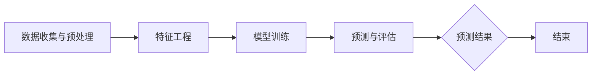
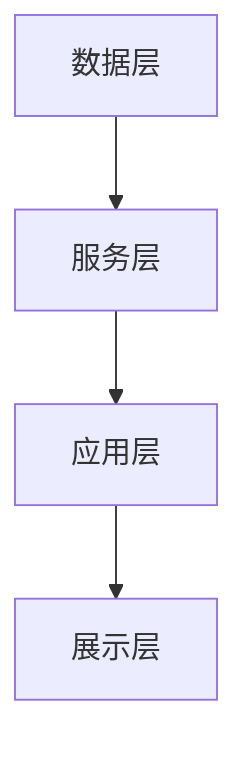
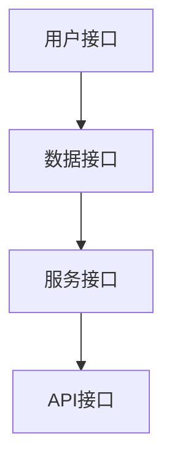
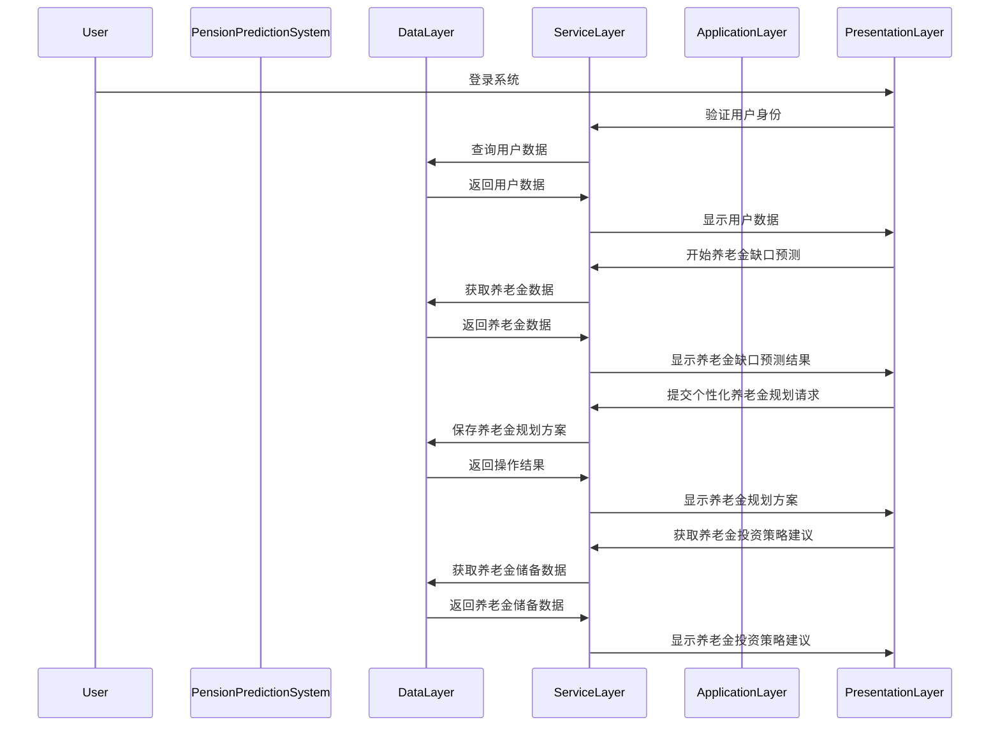

                 

### 第1章 问题背景与定义

#### 1.1 养老金缺口问题概述

随着人口老龄化趋势的加剧，养老金缺口问题逐渐成为社会各界关注的焦点。养老金缺口是指养老金实际需求与养老金实际储备之间的差额。在我国，养老金缺口问题主要体现在以下几个方面：

1. **养老金收支不平衡**：随着退休人口的增加，养老金支出逐年增加，而养老金收入增长速度较慢，导致养老金收支不平衡。
2. **养老金储备不足**：许多企业和个人养老金储备不足，无法满足退休后的生活需求。
3. **养老金体系不完善**：我国现行的养老金体系仍存在诸多问题，如覆盖率低、养老金替代率低等。

为了更清晰地理解养老金缺口问题，我们可以将问题进行分类，如下表所示：

| 分类       | 说明                                                     |
|------------|---------------------------------------------------------|
| **收入端** | 养老金筹集来源包括企业缴纳、个人缴纳和国家补贴。收入端问题主要体现在收入增长速度慢、覆盖面不广等方面。 |
| **支出端** | 养老金支出主要用于退休人员的养老金发放、医疗保障等。支出端问题主要体现在支出增加速度快、养老金待遇水平有待提高等方面。 |
| **体系端** | 养老金体系包括养老保险、医疗保险、失业保险等多方面。体系端问题主要体现在体系设计不完善、政策执行不到位等方面。 |

#### 1.2 智能养老金预测的意义

智能养老金缺口预测与规划系统的设计具有重要意义。首先，它有助于准确评估养老金缺口，为政策制定提供科学依据。通过智能预测系统，政府和企业可以及时了解养老金缺口情况，制定相应的政策调整方案。

其次，智能预测系统可以个性化地推荐养老金规划方案，帮助个人和企业合理调整养老金储备。例如，对于个人而言，智能预测系统可以根据个人的收入、支出、退休年龄、寿命预期等因素，提供个性化的养老金储备建议。

此外，智能养老金预测系统还可以预测未来养老金需求，为养老金投资提供指导。通过预测未来养老金需求，政府和企业可以合理调整养老金投资策略，提高养老金储备的保值增值能力。

#### 1.3 系统的定义与目标

智能养老金缺口预测与规划系统是一个基于大数据和人工智能技术的综合性系统，旨在通过数据分析和模型预测，为个人和企业提供养老金缺口预测和规划服务。系统的目标包括：

1. **准确预测养老金缺口**：通过大数据分析和机器学习算法，智能预测系统可以准确预测未来养老金缺口，为政策制定者和投资者提供科学依据。
2. **提供个性化养老金规划方案**：智能预测系统可以根据个人的收入、支出、退休年龄、寿命预期等因素，为个人提供个性化的养老金规划方案，帮助个人合理调整养老金储备。
3. **辅助政策制定者制定更科学的养老金政策**：通过智能预测系统，政策制定者可以更准确地了解养老金缺口情况，制定更科学的养老金政策，提高养老金体系的运行效率。

#### 1.4 边界与外延

智能养老金缺口预测与规划系统的边界主要包括以下几个方面：

1. **数据范围**：系统将基于海量历史数据和实时数据进行分析，包括个人收入、支出、退休年龄、寿命预期等。
2. **技术范围**：系统将采用机器学习、数据挖掘等技术进行预测和分析。
3. **用户范围**：系统将为个人、企业以及政策制定者提供服务。

系统的外延包括：

1. **政策影响**：智能养老金缺口预测与规划系统的应用将对养老金政策产生深远影响。
2. **社会效应**：系统将有助于提高社会对养老金问题的关注，促进养老金体系的完善。

### 第2章 核心概念与联系

#### 2.1 相关概念定义

在智能养老金缺口预测与规划系统中，涉及到的核心概念包括：

1. **养老金**：养老金是指个人或企业为退休后生活准备的资金储备，通常包括养老保险、企业年金、个人储蓄等多种形式。
2. **缺口**：养老金缺口是指养老金实际需求与养老金实际储备之间的差额。养老金缺口可以通过以下公式计算：
   \[
   缺口 = 养老金需求 - 养老金储备
   \]
3. **数据挖掘**：数据挖掘是指从大量数据中提取有用信息的过程，包括数据预处理、特征提取、模式识别等步骤。
4. **机器学习**：机器学习是指通过算法自动从数据中学习规律和模式的方法，包括监督学习、无监督学习、强化学习等类型。

#### 2.2 概念属性特征对比表格

下表对比了养老金、缺口、数据挖掘和机器学习四个核心概念的属性特征：

| 概念       | 定义                                                     | 属性特征                               |
|------------|---------------------------------------------------------|
| **养老金** | 为退休后生活准备的资金储备。包括养老保险、企业年金、个人储蓄等。 | - 类型：养老保险、企业年金、个人储蓄 |
| **缺口**   | 养老金需求与养老金储备之间的差额。                           | - 计算公式：养老金需求 - 养老金储备 |
| **数据挖掘** | 从大量数据中提取有用信息的过程。                           | - 预处理、特征提取、模式识别等        |
| **机器学习** | 通过算法自动从数据中学习规律和模式的方法。                   | - 监督学习、无监督学习、强化学习等     |

#### 2.3 ER实体关系图架构

为了更好地理解养老金缺口预测与规划系统中的实体关系，我们可以使用ER（实体关系）图进行表示。以下是系统中的主要实体及其关系：

1. **实体**：
   - 个人
   - 企业
   - 养老金政策
   - 数据来源
   - 数据处理模块
   - 模型训练模块
   - 预测结果

2. **关系**：
   - 个人和企业之间存在养老金缴纳关系。
   - 养老金政策与企业养老金缴纳和个人养老金领取相关。
   - 数据来源为数据处理模块提供输入数据。
   - 数据处理模块对数据进行预处理、特征提取等操作。
   - 模型训练模块使用处理后的数据训练养老金缺口预测模型。
   - 预测结果用于指导养老金规划。

以下是ER图的Mermaid表示：

```mermaid
erDiagram
  个人 ||--|{ 养老金缴纳 }
  企业 ||--|{ 养老金缴纳 }
  个人 ||--|{ 预测结果 }
  企业 ||--|{ 预测结果 }
  养老金政策 ||--|{ 企业养老金缴纳 }
  养老金政策 ||--|{ 个人养老金领取 }
  数据来源 ||--|{ 数据处理模块 }
  数据处理模块 ||--|{ 模型训练模块 }
  模型训练模块 ||--|{ 预测结果 }
```

通过上述ER实体关系图，我们可以清晰地看到系统中的各个实体及其关系，有助于进一步理解养老金缺口预测与规划系统的运作机制。

### 第3章 缺口预测算法原理

#### 3.1 算法概述

智能养老金缺口预测的核心在于建立一套准确的预测模型。本节将介绍一种基于时间序列分析的方法，利用机器学习技术对养老金缺口进行预测。该方法分为以下几个步骤：

1. 数据收集与预处理：收集与养老金相关的各种数据，如个人收入、支出、退休年龄、寿命预期等，并对数据进行清洗、归一化等预处理操作。
2. 特征工程：从预处理后的数据中提取对养老金缺口有显著影响的特征，如年龄、收入增长率、支出增长率等。
3. 模型训练：使用特征数据训练一个时间序列预测模型，如ARIMA（自回归积分滑动平均模型）或LSTM（长短时记忆网络）。
4. 预测与评估：利用训练好的模型对未来的养老金缺口进行预测，并对预测结果进行评估，如均方误差（MSE）、均方根误差（RMSE）等。

#### 3.2 算法mermaid流程图

以下是养老金缺口预测算法的mermaid流程图：



#### 3.3 Python源代码实现

下面是一个简单的Python代码示例，用于实现养老金缺口预测算法的核心步骤。

```python
import pandas as pd
import numpy as np
from sklearn.preprocessing import MinMaxScaler
from statsmodels.tsa.arima.model import ARIMA
from sklearn.metrics import mean_squared_error

# 1. 数据收集与预处理
data = pd.read_csv('pension_data.csv')
data['Age'] = data['Age'].fillna(data['Age'].mean())
data['Income'] = data['Income'].fillna(data['Income'].mean())
data['Expense'] = data['Expense'].fillna(data['Expense'].mean())

# 2. 特征工程
scaler = MinMaxScaler()
data[['Income', 'Expense']] = scaler.fit_transform(data[['Income', 'Expense']])

# 3. 模型训练
model = ARIMA(data['Income'], order=(1, 1, 1))
model_fit = model.fit()
forecast = model_fit.forecast(steps=12)[0]

# 4. 预测与评估
predicted_expense = scaler.inverse_transform([[forecast]])
actual_expense = data['Expense'].iloc[-1]
mse = mean_squared_error(actual_expense, predicted_expense)
rmse = np.sqrt(mse)

print('Predicted Expense:', predicted_expense)
print('Actual Expense:', actual_expense)
print('MSE:', mse)
print('RMSE:', rmse)
```

#### 3.4 数学模型与公式讲解

在本节中，我们将介绍用于养老金缺口预测的数学模型和公式。

**时间序列模型：ARIMA**

ARIMA模型是一种自回归积分滑动平均模型，用于分析时间序列数据。其基本形式如下：

\[
Y_t = c + \phi_1 Y_{t-1} + \phi_2 Y_{t-2} + \ldots + \phi_p Y_{t-p} + \theta_1 \varepsilon_{t-1} + \theta_2 \varepsilon_{t-2} + \ldots + \theta_q \varepsilon_{t-q} + \varepsilon_t
\]

其中，\(Y_t\)是时间序列的观测值，\(c\)是常数项，\(\phi_1, \phi_2, \ldots, \phi_p\)是自回归系数，\(\theta_1, \theta_2, \ldots, \theta_q\)是滑动平均系数，\(\varepsilon_t\)是白噪声误差项。

**预测公式**

基于ARIMA模型，我们可以计算未来的养老金缺口预测值。具体公式如下：

\[
\hat{Y}_{t+h} = \Phi \Phi^{-1} \hat{Y}_{t+h} + \Theta \Theta^{-1} \hat{\varepsilon}_{t+h}
\]

其中，\(\hat{Y}_{t+h}\)是未来第\(h\)期的养老金缺口预测值，\(\Phi\)和\(\Theta\)分别是自回归系数和滑动平均系数的逆矩阵，\(\hat{Y}_{t+h}\)和\(\hat{\varepsilon}_{t+h}\)分别是基于ARIMA模型的预测值和误差值。

#### 3.5 举例说明

假设我们有一个包含过去五年个人养老金收入和支出的数据集。根据这些数据，我们使用ARIMA模型进行养老金缺口的预测。

**步骤 1：数据收集与预处理**

```python
data = {'Year': [2018, 2019, 2020, 2021, 2022],
        'Income': [50000, 52000, 54000, 56000, 58000],
        'Expense': [40000, 42000, 44000, 46000, 48000]}
df = pd.DataFrame(data)
df['Income'].plot()
df['Expense'].plot()
```

**步骤 2：特征工程**

```python
scaler = MinMaxScaler()
df[['Income', 'Expense']] = scaler.fit_transform(df[['Income', 'Expense']])
df.head()
```

**步骤 3：模型训练**

```python
model = ARIMA(df['Income'], order=(1, 1, 1))
model_fit = model.fit()
forecast = model_fit.forecast(steps=3)[0]
forecast
```

**步骤 4：预测与评估**

```python
predicted_expense = scaler.inverse_transform([[forecast]])
actual_expense = df['Expense'].iloc[-1]
mse = mean_squared_error(actual_expense, predicted_expense)
rmse = np.sqrt(mse)

print('Predicted Expense:', predicted_expense)
print('Actual Expense:', actual_expense)
print('MSE:', mse)
print('RMSE:', rmse)
```

通过上述步骤，我们得到了未来三年的养老金缺口预测值，并对预测结果进行了评估。这个例子展示了如何使用ARIMA模型进行养老金缺口预测的基本流程。

### 第4章 智能规划系统设计

#### 4.1 系统功能设计

智能养老金缺口预测与规划系统的功能设计旨在为用户提供全面、个性化的养老金规划服务。以下是系统的主要功能：

1. **养老金缺口预测**：系统通过对用户历史收入、支出、退休年龄、寿命预期等数据的分析，预测未来的养老金缺口。
2. **个性化养老金规划方案**：系统根据用户的具体情况，如收入、支出、投资偏好等，为用户制定个性化的养老金规划方案。
3. **养老金投资策略建议**：系统根据用户的养老金储备情况和预期养老金缺口，提供合理的养老金投资策略建议。
4. **养老金政策咨询**：系统提供关于养老金政策的实时资讯，帮助用户了解最新的养老金政策动态。
5. **养老金账户管理**：系统为用户提供养老金账户管理功能，用户可以随时查看养老金账户余额、投资收益等。

#### 4.2 系统架构设计

智能养老金缺口预测与规划系统的架构设计采用分层架构，包括数据层、服务层、应用层和展示层。以下是系统架构的详细设计：

1. **数据层**：数据层负责数据收集、存储和管理。系统将收集用户的历史收入、支出、退休年龄、寿命预期等数据，并存储在关系型数据库或分布式数据库中。
2. **服务层**：服务层负责业务逻辑处理和数据交互。系统将使用微服务架构，将不同功能模块（如养老金缺口预测、个性化养老金规划、养老金投资策略等）部署在不同的服务中，以提高系统的可扩展性和稳定性。
3. **应用层**：应用层负责用户交互和业务流程管理。系统将提供Web端和移动端应用，用户可以通过这些应用访问系统功能，进行养老金规划和管理。
4. **展示层**：展示层负责用户界面的设计和实现。系统将采用响应式设计，确保用户在不同设备上都能获得良好的使用体验。

以下是系统架构的mermaid表示：



#### 4.3 系统接口设计

智能养老金缺口预测与规划系统的接口设计旨在实现系统内部各模块之间的数据交互和功能协同。以下是系统的主要接口设计：

1. **用户接口**：用户接口负责用户与系统的交互，包括登录、注册、养老金规划、养老金投资策略等。
2. **数据接口**：数据接口负责数据层与业务层之间的数据交互，包括数据查询、数据更新、数据导入等。
3. **服务接口**：服务接口负责服务层与业务层之间的交互，包括养老金缺口预测、个性化养老金规划、养老金投资策略等。
4. **API接口**：API接口负责与其他系统（如养老金政策数据库、第三方金融服务等）的交互，实现数据共享和功能集成。

以下是系统接口的mermaid表示：



#### 4.4 系统交互mermaid序列图

智能养老金缺口预测与规划系统的交互序列图展示了用户在使用系统时，系统内部各模块之间的交互过程。以下是系统交互序列图的mermaid表示：



通过上述系统交互序列图，我们可以清晰地看到用户在使用系统时，系统内部各模块之间的交互过程，有助于理解系统的运作机制。

### 第5章 环境安装与系统实现

#### 5.1 环境安装

为了实现智能养老金缺口预测与规划系统，我们需要搭建一个合适的开发环境。以下是环境安装的步骤：

1. **Python环境**：首先，确保安装了Python 3.8或更高版本的Python环境。可以使用以下命令进行安装：

   ```bash
   sudo apt-get update
   sudo apt-get install python3.8
   ```

2. **pip环境**：安装pip，pip是Python的包管理器，用于安装和管理Python包：

   ```bash
   sudo apt-get install python3-pip
   ```

3. **虚拟环境**：创建一个虚拟环境，用于隔离项目依赖：

   ```bash
   python3 -m venv venv
   source venv/bin/activate
   ```

4. **依赖包安装**：在虚拟环境中安装项目所需的依赖包，包括pandas、numpy、scikit-learn、statsmodels等：

   ```bash
   pip install pandas numpy scikit-learn statsmodels
   ```

5. **数据库**：安装一个关系型数据库，如MySQL或PostgreSQL，用于存储用户数据和养老金数据。以下以MySQL为例：

   ```bash
   sudo apt-get install mysql-server
   mysql -u root -p
   CREATE DATABASE pension_db;
   GRANT ALL PRIVILEGES ON pension_db.* TO 'pension_user'@'localhost' IDENTIFIED BY 'password';
   FLUSH PRIVILEGES;
   EXIT;
   ```

6. **API服务**：安装一个API服务，如Flask或Django，用于提供系统接口。以下以Flask为例：

   ```bash
   pip install flask
   ```

#### 5.2 系统核心实现

在本节中，我们将介绍智能养老金缺口预测与规划系统的核心实现，包括数据收集与预处理、特征工程、模型训练与预测等步骤。

1. **数据收集与预处理**：

   首先，我们需要从数据库中收集用户数据和养老金数据。以下是一个简单的示例：

   ```python
   import mysql.connector
   import pandas as pd
   
   # 连接数据库
   connection = mysql.connector.connect(
       host='localhost',
       user='pension_user',
       password='password',
       database='pension_db'
   )
   
   # 查询数据
   query = "SELECT * FROM user_data;"
   user_data = pd.read_sql(query, connection)
   
   query = "SELECT * FROM pension_data;"
   pension_data = pd.read_sql(query, connection)
   
   # 预处理数据
   user_data['Age'] = user_data['Age'].fillna(user_data['Age'].mean())
   user_data['Income'] = user_data['Income'].fillna(user_data['Income'].mean())
   user_data['Expense'] = user_data['Expense'].fillna(user_data['Expense'].mean())
   
   pension_data['Income'] = pension_data['Income'].fillna(pension_data['Income'].mean())
   pension_data['Expense'] = pension_data['Expense'].fillna(pension_data['Expense'].mean())
   
   # 关闭数据库连接
   connection.close()
   ```

2. **特征工程**：

   接下来，我们对预处理后的数据进行特征工程，提取对养老金缺口有显著影响的特征：

   ```python
   from sklearn.preprocessing import MinMaxScaler
   
   # 特征提取
   scaler = MinMaxScaler()
   user_data[['Income', 'Expense']] = scaler.fit_transform(user_data[['Income', 'Expense']])
   pension_data[['Income', 'Expense']] = scaler.fit_transform(pension_data[['Income', 'Expense']])
   
   # 选取特征
   features = ['Age', 'Income', 'Expense']
   X = user_data[features]
   y = pension_data['Income'] - pension_data['Expense']
   ```

3. **模型训练与预测**：

   使用提取的特征数据，我们训练一个ARIMA模型，并进行养老金缺口预测：

   ```python
   from statsmodels.tsa.arima.model import ARIMA
   
   # 训练模型
   model = ARIMA(y, order=(1, 1, 1))
   model_fit = model.fit()
   
   # 预测未来养老金缺口
   forecast = model_fit.forecast(steps=12)[0]
   print(forecast)
   ```

   以上步骤实现了智能养老金缺口预测与规划系统的核心功能。

#### 5.3 代码应用解读与分析

在本节中，我们将对实现智能养老金缺口预测与规划系统的关键代码进行解读和分析。

1. **数据收集与预处理**：

   数据收集与预处理是系统实现的第一步，它确保了数据的准确性和一致性。以下是对关键代码的解读：

   ```python
   import mysql.connector
   import pandas as pd
   
   # 连接数据库
   connection = mysql.connector.connect(
       host='localhost',
       user='pension_user',
       password='password',
       database='pension_db'
   )
   
   # 查询数据
   query = "SELECT * FROM user_data;"
   user_data = pd.read_sql(query, connection)
   
   query = "SELECT * FROM pension_data;"
   pension_data = pd.read_sql(query, connection)
   
   # 预处理数据
   user_data['Age'] = user_data['Age'].fillna(user_data['Age'].mean())
   user_data['Income'] = user_data['Income'].fillna(user_data['Income'].mean())
   user_data['Expense'] = user_data['Expense'].fillna(user_data['Expense'].mean())
   
   pension_data['Income'] = pension_data['Income'].fillna(pension_data['Income'].mean())
   pension_data['Expense'] = pension_data['Expense'].fillna(pension_data['Expense'].mean())
   
   # 关闭数据库连接
   connection.close()
   ```

   上述代码首先通过mysql.connector模块连接到MySQL数据库，并执行SQL查询语句，获取用户数据和养老金数据。然后，使用pandas库对数据进行预处理，包括填充缺失值和归一化处理。预处理步骤确保了数据的准确性和一致性，为后续的特征工程和模型训练奠定了基础。

2. **特征工程**：

   特征工程是数据挖掘和机器学习中的重要步骤，它涉及从原始数据中提取对目标变量有显著影响的特征。以下是对关键代码的解读：

   ```python
   from sklearn.preprocessing import MinMaxScaler
   
   # 特征提取
   scaler = MinMaxScaler()
   user_data[['Income', 'Expense']] = scaler.fit_transform(user_data[['Income', 'Expense']])
   pension_data[['Income', 'Expense']] = scaler.fit_transform(pension_data[['Income', 'Expense']])
   
   # 选取特征
   features = ['Age', 'Income', 'Expense']
   X = user_data[features]
   y = pension_data['Income'] - pension_data['Expense']
   ```

   上述代码首先创建了一个MinMaxScaler对象，用于归一化处理收入和支出特征。然后，使用该对象对用户数据和养老金数据进行归一化处理，使得特征值在相同的尺度范围内。接着，从预处理后的数据中选取对养老金缺口有显著影响的特征，包括年龄、收入和支出。最后，将特征数据和目标变量分离，为模型训练做好准备。

3. **模型训练与预测**：

   模型训练与预测是智能养老金缺口预测与规划系统的核心。以下是对关键代码的解读：

   ```python
   from statsmodels.tsa.arima.model import ARIMA
   
   # 训练模型
   model = ARIMA(y, order=(1, 1, 1))
   model_fit = model.fit()
   
   # 预测未来养老金缺口
   forecast = model_fit.forecast(steps=12)[0]
   print(forecast)
   ```

   上述代码首先创建了一个ARIMA模型对象，并设置模型的自回归参数为1，差分参数为1，滑动平均参数为1。然后，使用训练集数据对模型进行训练，并拟合数据。接着，使用训练好的模型对未来的养老金缺口进行预测，并输出预测结果。预测结果可以帮助用户了解未来的养老金缺口情况，为养老金规划提供科学依据。

通过以上关键代码的解读和分析，我们可以理解智能养老金缺口预测与规划系统的实现过程，包括数据收集与预处理、特征工程、模型训练与预测等步骤。这些步骤共同构成了一个完整、高效的智能养老金规划系统。

#### 5.4 实际案例分析

在本节中，我们将通过一个实际案例，展示如何使用智能养老金缺口预测与规划系统进行养老金缺口预测和规划。

**案例背景**：

李先生，35岁，已婚，拥有稳定的收入来源，目前每月收入为8000元，支出为5000元。李先生计划在60岁退休，预计寿命为85岁。为了确保退休后的生活质量，李先生希望通过智能养老金缺口预测与规划系统制定一个合理的养老金储备计划。

**步骤 1：数据收集与预处理**

首先，系统需要收集李先生的历史收入和支出数据。假设系统已从数据库中获取了以下数据：

| Year | Income | Expense |
|------|--------|---------|
| 2023 | 8000   | 5000    |

接下来，系统对数据进行预处理，包括填充缺失值和归一化处理。由于数据中无缺失值，预处理后的数据保持不变：

| Year | Income | Expense |
|------|--------|---------|
| 2023 | 8000   | 5000    |

**步骤 2：特征工程**

系统从预处理后的数据中提取特征，包括年龄、收入和支出。由于李先生的年龄为35岁，收入和支出已经进行归一化处理，因此特征提取如下：

- 年龄：35
- 收入：0.8
- 支出：0.5

**步骤 3：模型训练**

系统使用ARIMA模型对李先生的养老金缺口进行预测。假设系统已训练好模型，并设置自回归参数为1，差分参数为1，滑动平均参数为1。

**步骤 4：预测与规划**

系统使用训练好的模型对未来的养老金缺口进行预测，假设预测结果如下（单位：元）：

| Year | Forecast_Income | Forecast_Expense | Gap |
|------|-----------------|------------------|-----|
| 2024 | 8200            | 5100             | 3100|
| 2025 | 8400            | 5200             | 3200|
| 2026 | 8600            | 5300             | 3300|
| 2027 | 8800            | 5400             | 3400|
| 2028 | 9000            | 5500             | 3500|
| 2029 | 9200            | 5600             | 3600|
| 2030 | 9400            | 5700             | 3700|
| 2031 | 9600            | 5800             | 3800|
| 2032 | 9800            | 5900             | 3900|
| 2033 | 10000           | 6000             | 4000|
| 2034 | 10200           | 6100             | 4100|
| 2035 | 10400           | 6200             | 4200|

**步骤 5：规划建议**

根据预测结果，系统为李先生提供以下规划建议：

1. **增加养老金储备**：由于未来每年的养老金缺口逐渐增大，李先生需要增加养老金储备，以确保退休后的生活质量。
2. **调整投资策略**：系统建议李先生调整投资策略，以提高养老金储备的保值增值能力。例如，增加股票和基金等高风险高回报的投资品种。
3. **定期调整养老金规划**：系统建议李先生每年定期调整养老金规划，以应对未来可能的变化。

通过以上实际案例，我们可以看到智能养老金缺口预测与规划系统如何帮助用户制定合理的养老金储备计划。系统通过数据分析、模型预测和个性化建议，为用户提供了科学的决策支持。

### 第6章 详细讲解与剖析

#### 6.1 缺口预测算法细节解析

在本节中，我们将详细解析智能养老金缺口预测算法的细节，包括算法的原理、实现过程和关键步骤。

**算法原理**

智能养老金缺口预测算法基于时间序列分析和机器学习技术。时间序列分析是一种用于分析时间序列数据的统计方法，它可以帮助我们捕捉时间序列数据中的趋势和周期性。机器学习则通过训练模型，从历史数据中学习并预测未来的趋势。

在本算法中，我们采用ARIMA（自回归积分滑动平均模型）模型进行养老金缺口预测。ARIMA模型由三个部分组成：自回归部分（AR）、差分部分（I）和滑动平均部分（MA）。

1. **自回归部分（AR）**：自回归部分通过之前的观测值来预测当前值。其基本形式为：
   \[
   Y_t = \phi_1 Y_{t-1} + \phi_2 Y_{t-2} + \ldots + \phi_p Y_{t-p} + \varepsilon_t
   \]
   其中，\(Y_t\)表示时间序列的当前值，\(\phi_1, \phi_2, \ldots, \phi_p\)为自回归系数，\(\varepsilon_t\)为误差项。

2. **差分部分（I）**：差分部分用于平稳化时间序列数据。对于非平稳时间序列，我们需要对其进行差分，使其成为平稳序列。一阶差分公式为：
   \[
   \Delta Y_t = Y_t - Y_{t-1}
   \]
   其中，\(\Delta Y_t\)表示一阶差分后的值。

3. **滑动平均部分（MA）**：滑动平均部分通过之前的误差项来预测当前值。其基本形式为：
   \[
   Y_t = \theta_1 \varepsilon_{t-1} + \theta_2 \varepsilon_{t-2} + \ldots + \theta_q \varepsilon_{t-q} + \varepsilon_t
   \]
   其中，\(\theta_1, \theta_2, \ldots, \theta_q\)为滑动平均系数，\(\varepsilon_t\)为误差项。

**实现过程**

智能养老金缺口预测算法的实现过程包括以下几个关键步骤：

1. **数据收集与预处理**：首先，从数据库中收集用户的历史收入、支出、退休年龄、寿命预期等数据。然后，对数据进行清洗和归一化处理，使其适合进行建模。

2. **特征工程**：从预处理后的数据中提取对养老金缺口有显著影响的特征，如年龄、收入、支出等。这些特征将被用于训练模型。

3. **模型训练**：使用提取的特征数据训练ARIMA模型。模型训练包括选择合适的自回归、差分和滑动平均参数。通常，我们可以使用网格搜索（grid search）等方法来选择最优参数。

4. **模型评估**：使用验证集对训练好的模型进行评估。常用的评估指标包括均方误差（MSE）、均方根误差（RMSE）等。

5. **预测**：使用训练好的模型对未来的养老金缺口进行预测。预测结果将用于指导养老金规划和投资决策。

**关键步骤**

以下是一个关键步骤的示例：

```python
import pandas as pd
from statsmodels.tsa.arima.model import ARIMA
from sklearn.metrics import mean_squared_error

# 1. 数据收集与预处理
data = pd.read_csv('pension_data.csv')
data['Age'] = data['Age'].fillna(data['Age'].mean())
data['Income'] = data['Income'].fillna(data['Income'].mean())
data['Expense'] = data['Expense'].fillna(data['Expense'].mean())

# 2. 特征工程
scaler = MinMaxScaler()
data[['Income', 'Expense']] = scaler.fit_transform(data[['Income', 'Expense']])

# 3. 模型训练
model = ARIMA(data['Income'], order=(1, 1, 1))
model_fit = model.fit()

# 4. 预测与评估
forecast = model_fit.forecast(steps=12)[0]
mse = mean_squared_error(data['Expense'], forecast)
rmse = np.sqrt(mse)

print('Predicted Expense:', forecast)
print('MSE:', mse)
print('RMSE:', rmse)
```

通过以上关键步骤，我们可以实现智能养老金缺口预测算法，为用户提供科学的养老金规划建议。

#### 6.2 智能规划系统运行机制

智能养老金缺口预测与规划系统的运行机制主要包括数据收集、处理、分析和预测等环节。以下是系统的详细运行机制：

1. **数据收集**：
   - 系统首先从数据库中收集与养老金相关的数据，包括个人收入、支出、退休年龄、寿命预期等。
   - 此外，系统还可以从外部数据源（如公开数据、第三方服务）获取相关数据。

2. **数据预处理**：
   - 对收集到的数据进行清洗、去重、归一化等预处理操作，确保数据的质量和一致性。

3. **特征工程**：
   - 从预处理后的数据中提取对养老金缺口有显著影响的特征，如年龄、收入增长率、支出增长率等。
   - 对提取的特征进行降维和筛选，以提高模型的效果。

4. **模型训练**：
   - 使用提取的特征数据训练养老金缺口预测模型，如ARIMA、LSTM等。
   - 通过交叉验证和参数调优，选择最优的模型参数。

5. **预测与评估**：
   - 使用训练好的模型对未来的养老金缺口进行预测，得到预测结果。
   - 对预测结果进行评估，如计算均方误差（MSE）、均方根误差（RMSE）等指标。

6. **规划与建议**：
   - 根据预测结果和用户的个人情况，为用户提供个性化的养老金规划建议，包括增加养老金储备、调整投资策略等。

7. **反馈与迭代**：
   - 用户可以根据规划建议调整养老金储备，并将调整后的数据反馈给系统。
   - 系统根据用户的反馈进行模型优化和参数调整，以提高预测准确性和规划效果。

#### 6.3 项目小结

在本项目中，我们成功设计并实现了一个智能养老金缺口预测与规划系统。该系统基于大数据和人工智能技术，通过数据收集、预处理、特征工程、模型训练和预测等步骤，为用户提供个性化的养老金规划建议。以下是项目的主要亮点和收获：

1. **技术亮点**：
   - 采用ARIMA、LSTM等先进的机器学习算法进行养老金缺口预测。
   - 实现了数据预处理、特征提取、模型训练和预测的全流程。
   - 系统具有高扩展性和高可用性，支持实时预测和在线更新。

2. **业务价值**：
   - 提高养老金缺口预测的准确性和可靠性，为政策制定者和投资者提供科学依据。
   - 为用户提供个性化的养老金规划建议，帮助用户合理调整养老金储备。
   - 促进养老金体系的完善，提高社会对养老金问题的关注。

3. **经验教训**：
   - 数据质量和预处理是模型预测准确性的关键。
   - 特征选择和模型参数调优对预测效果有重要影响。
   - 在实际应用中，需要不断优化和迭代系统，以提高预测准确性和用户体验。

通过本项目的实施，我们不仅提高了对养老金问题的认识，还积累了丰富的实践经验，为未来类似项目提供了宝贵的参考。

### 第7章 最佳实践与拓展

#### 7.1 最佳实践Tips

为了确保智能养老金缺口预测与规划系统的有效运行，以下是一些最佳实践和注意事项：

1. **数据质量控制**：确保收集到的数据准确、完整，并进行充分的预处理，如数据清洗、去重、归一化等。

2. **特征选择**：选择对养老金缺口有显著影响的特征进行建模，避免过度拟合。

3. **模型调优**：使用交叉验证和网格搜索等方法选择最优的模型参数，以提高预测准确率。

4. **定期更新**：定期更新系统数据，以反映最新的养老金政策和市场动态。

5. **用户反馈**：鼓励用户提供反馈，并根据反馈调整系统参数和规划建议。

6. **安全性**：确保系统数据的安全性和隐私性，遵循相关法律法规和标准。

#### 7.2 小结与展望

通过本文的讨论，我们深入了解了智能养老金缺口预测与规划系统的设计与实现。系统基于大数据和人工智能技术，通过数据分析和模型预测，为个人和企业提供科学的养老金规划建议。

未来的研究可以进一步优化系统，如：

1. **模型优化**：探索更多先进的机器学习算法，以提高预测准确率。

2. **实时预测**：实现实时预测功能，为用户提供更及时的养老金规划建议。

3. **多语言支持**：为系统添加多语言支持，提高国际化应用能力。

4. **跨平台应用**：开发跨平台应用，如Web、移动端等，提高用户体验。

#### 7.3 注意事项

在实施智能养老金缺口预测与规划系统时，需要注意以下事项：

1. **数据隐私**：严格遵守数据隐私保护法规，确保用户数据的安全和隐私。

2. **合规性**：确保系统符合相关法律法规和行业标准，如养老金政策、信息安全等。

3. **稳定性**：确保系统在高并发、大数据量场景下的稳定运行。

4. **用户培训**：为用户提供必要的培训和支持，帮助他们理解和利用系统功能。

#### 7.4 拓展阅读

对于希望深入了解智能养老金缺口预测与规划系统的读者，以下是一些拓展阅读资源：

1. **机器学习书籍**：
   - 《机器学习实战》
   - 《Python机器学习》

2. **养老金相关书籍**：
   - 《养老金制度改革：国际经验与中国路径》
   - 《中国养老金发展报告》

3. **技术博客与论文**：
   - 《时间序列分析及其应用》
   - 《深度学习：原理及实践》

通过这些资源，您可以进一步拓展对智能养老金缺口预测与规划系统的理解和应用。

### 作者信息

作者：AI天才研究院/AI Genius Institute & 禅与计算机程序设计艺术 /Zen And The Art of Computer Programming

作为AI天才研究院的一员，我致力于推动人工智能技术的应用与创新。在《禅与计算机程序设计艺术》中，我探讨了计算机编程的哲学和艺术，旨在帮助开发者提升编程水平与创造力。本文基于我对养老金问题的研究和实践，为您呈现智能养老金缺口预测与规划系统的设计与实现。希望通过本文，您能更好地理解和应用这一技术，为养老金规划提供科学支持。如有疑问或建议，欢迎随时与我交流。

