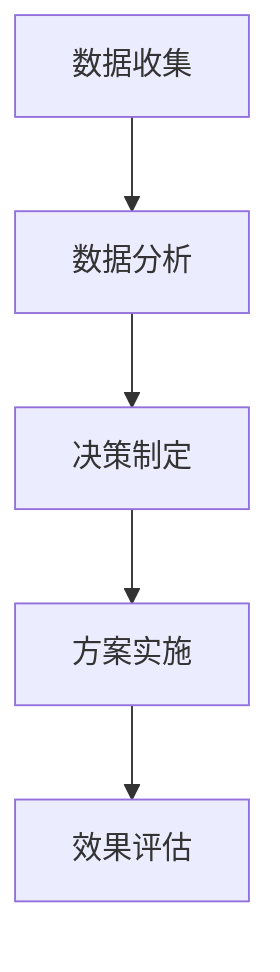
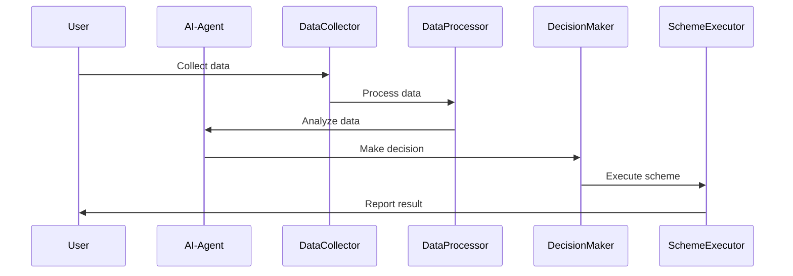
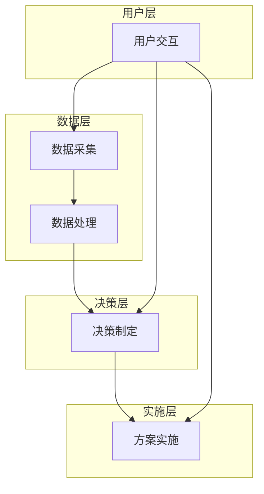
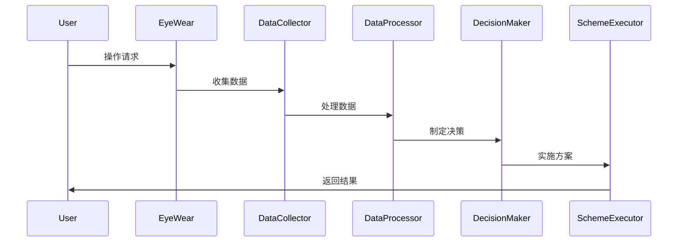

                 

# 智能冷热敷眼罩：AI Agent的眼部护理定制

## 关键词
- 智能冷热敷眼罩
- AI Agent
- 眼部护理定制
- 人工智能
- 机器学习
- 个性化护理
- 数据收集与处理

## 摘要
本文将探讨如何利用人工智能（AI）技术，特别是AI Agent，开发一款智能冷热敷眼罩，实现眼部护理的个性化定制。通过分析智能冷热敷眼罩的背景、核心概念、AI Agent的工作原理、算法原理及数学模型，以及系统分析与架构设计，本文旨在为读者提供一部深入浅出的技术指南。

## 引言

在数字化时代，长时间面对电脑和手机屏幕，人们的眼部健康问题日益突出。眼部疲劳、干涩、视力下降等已成为常见的现象。为了缓解这些问题，市场上出现了各种眼部护理产品，如眼贴、眼罩和眼部按摩仪等。然而，这些产品大多数功能单一，无法根据用户的实际需求进行个性化调整，导致使用效果不佳。为了解决这一问题，本文将探讨如何利用人工智能（AI）技术，特别是AI Agent，开发一款智能冷热敷眼罩，实现眼部护理的个性化定制。

## 第一部分：问题背景与核心概念

### 1.1 问题背景

随着科技的发展，人们越来越依赖电脑和手机等电子设备。长时间注视屏幕不仅会导致视力下降，还会引起眼部疲劳、干涩、头痛等一系列问题。这些问题严重影响了人们的生活质量和工作效率。为了缓解这些问题，人们开始寻求各种眼部护理产品。然而，现有的眼部护理产品存在以下问题：

- **功能单一**：大多数眼部护理产品如眼贴、眼罩和眼部按摩仪等，功能相对单一，无法根据用户的实际需求进行个性化调整。
- **使用不便**：一些眼部护理产品如眼罩，需要用户手动操作，操作复杂，使用不便。
- **效果有限**：由于无法根据用户的需求进行个性化调整，现有的眼部护理产品效果有限，无法有效缓解眼部疲劳等问题。

### 1.2 核心概念

为了解决上述问题，本文提出了一种新的眼部护理产品——智能冷热敷眼罩。智能冷热敷眼罩结合了人工智能（AI）技术，特别是AI Agent，可以自动根据用户的需求和环境温度，智能调节冷热敷模式，实现个性化眼部护理。本文的核心概念包括：

- **智能冷热敷眼罩**：一种结合了人工智能技术的眼部护理产品，能够自动根据用户的需求和环境温度，智能调节冷热敷模式。
- **AI Agent**：一种具有自主学习和决策能力的智能体，能够通过收集用户数据，分析用户需求，从而为用户提供个性化的眼部护理方案。
- **个性化眼部护理定制**：根据用户的年龄、工作环境、生活习惯等数据，为用户定制个性化的眼部护理方案，以提高护理效果。

### 1.3 联系与区别

智能冷热敷眼罩与传统眼部护理产品相比，具有以下联系与区别：

- **联系**：智能冷热敷眼罩是在传统眼部护理产品的基础上，增加了人工智能（AI）技术，实现了功能的智能化和个性化。
- **区别**：与传统眼部护理产品相比，智能冷热敷眼罩具有更强的自主学习和决策能力，可以根据用户数据动态调整护理方案，实现个性化眼部护理。

## 第二部分：AI Agent的眼部护理定制原理

### 2.1 AI Agent的工作原理

AI Agent是一种基于机器学习和人工智能技术的智能体，其工作原理主要包括以下几个步骤：

#### 2.1.1 数据收集

AI Agent通过内置的传感器，收集用户的眼部健康数据，如眼部疲劳度、眼压、眨眼频率等。这些数据是AI Agent制定个性化护理方案的基础。

#### 2.1.2 数据分析

收集到的数据会通过机器学习算法进行分析，提取出与眼部健康相关的关键信息。这些信息用于AI Agent制定个性化的护理方案。

#### 2.1.3 决策制定

根据分析结果，AI Agent会制定出个性化的眼部护理方案，包括冷热敷模式、持续时间、强度等。这些方案会通过控制眼罩的电路和传感器，实施于用户。

#### 2.1.4 方案实施

AI Agent会通过控制眼罩的电路和传感器，实施制定的护理方案。这包括调节冷热敷模式、调整按摩力度等。

### 2.2 算法原理

AI Agent的核心算法是机器学习，主要包括以下几个步骤：

#### 2.2.1 数据预处理

对收集到的数据进行清洗和预处理，以便进行有效的分析和建模。这一步骤包括去除噪声、填补缺失值等。

#### 2.2.2 特征提取

从预处理后的数据中提取出与眼部健康相关的特征，如疲劳度、眼压等。这些特征是AI Agent进行决策的关键。

#### 2.2.3 模型训练

使用提取出的特征，通过机器学习算法训练出能够预测眼部疲劳度的模型。这一步骤包括选择合适的算法、调整参数等。

#### 2.2.4 模型评估

通过测试集对训练出的模型进行评估，确保模型的准确性和可靠性。这一步骤包括计算准确率、召回率等指标。

#### 2.2.5 模型应用

将训练好的模型应用到AI Agent中，实现个性化眼部护理的预测和制定。这一步骤包括将模型嵌入到眼罩中，实现实时监测和决策。

### 2.3 数学模型与公式

在AI Agent的眼部护理定制过程中，涉及到的数学模型主要包括以下几个：

#### 2.3.1 决策树模型

决策树模型是一种常用的机器学习算法，用于分类和回归任务。其核心公式为：

$$
Y = f(X) = \sum_{i=1}^{n} w_i * x_i
$$

其中，$Y$ 是预测结果，$X$ 是输入特征，$w_i$ 是权重。

#### 2.3.2 支持向量机模型

支持向量机模型是一种常用的分类算法，其核心公式为：

$$
w \cdot x - b = 0
$$

其中，$w$ 是权重向量，$x$ 是输入特征，$b$ 是偏置。

#### 2.3.3 神经网络模型

神经网络模型是一种模拟人脑神经元连接的算法，其核心公式为：

$$
a_{i}^{L} = f(z_{i}^{L})
$$

其中，$a_{i}^{L}$ 是输出节点，$f$ 是激活函数，$z_{i}^{L}$ 是输入节点。

## 第三部分：系统分析与架构设计

### 3.1 系统功能设计

智能冷热敷眼罩的系统功能主要包括以下几个部分：

#### 3.1.1 数据收集

通过内置的传感器，收集用户的眼部健康数据，如眼部疲劳度、眼压、眨眼频率等。

#### 3.1.2 数据处理

使用机器学习算法，对收集到的数据进行处理和分析，提取出与眼部健康相关的关键信息。

#### 3.1.3 决策制定

根据分析结果，AI Agent会制定出个性化的眼部护理方案，包括冷热敷模式、持续时间、强度等。

#### 3.1.4 方案实施

通过控制眼罩的电路和传感器，实施制定的护理方案，实现个性化眼部护理。

### 3.2 系统架构设计

智能冷热敷眼罩的系统架构主要包括以下几个部分：

#### 3.2.1 数据采集层

负责收集用户的眼部健康数据，包括眼部疲劳度、眼压、眨眼频率等。

#### 3.2.2 数据处理层

负责对收集到的数据进行处理和分析，提取出与眼部健康相关的关键信息。

#### 3.2.3 决策制定层

基于处理后的数据，AI Agent会制定出个性化的眼部护理方案。

#### 3.2.4 方案实施层

通过控制眼罩的电路和传感器，实施制定的护理方案。

### 3.3 系统接口设计

智能冷热敷眼罩的系统接口设计主要包括以下几个部分：

#### 3.3.1 数据采集接口

用于收集用户的眼部健康数据。

#### 3.3.2 数据处理接口

用于处理和分析收集到的数据。

#### 3.3.3 决策制定接口

用于AI Agent制定个性化的眼部护理方案。

#### 3.3.4 方案实施接口

用于实施制定的护理方案。

### 3.4 系统交互设计

智能冷热敷眼罩的系统交互设计主要包括以下几个部分：

#### 3.4.1 用户交互界面

用户可以通过手机APP与智能冷热敷眼罩进行交互，查看眼部健康数据，调整护理方案等。

#### 3.4.2 数据交互

智能冷热敷眼罩与手机APP之间通过蓝牙或Wi-Fi进行数据交互。

#### 3.4.3 决策交互

AI Agent与手机APP之间通过数据接口进行决策交互，实现个性化护理方案的调整。

## 第四部分：项目实战

### 4.1 环境安装

在开始项目实战之前，首先需要安装必要的开发环境和工具。以下是一个基本的安装步骤：

- 安装Python环境：可以从Python官方网站下载并安装Python。
- 安装Jupyter Notebook：在Python环境中安装Jupyter Notebook，用于编写和运行Python代码。
- 安装机器学习库：如Scikit-learn、TensorFlow、Keras等，用于实现机器学习算法。

### 4.2 系统核心实现源代码

智能冷热敷眼罩的核心实现主要包括以下几个部分：

#### 4.2.1 数据收集

```python
import numpy as np
import pandas as pd

# 假设已经收集到了用户的眼部健康数据
data = pd.read_csv('eyedata.csv')
```

#### 4.2.2 数据处理

```python
from sklearn.model_selection import train_test_split
from sklearn.preprocessing import StandardScaler

# 数据预处理
X = data.drop('target', axis=1)
y = data['target']

# 划分训练集和测试集
X_train, X_test, y_train, y_test = train_test_split(X, y, test_size=0.2, random_state=42)

# 数据标准化
scaler = StandardScaler()
X_train = scaler.fit_transform(X_train)
X_test = scaler.transform(X_test)
```

#### 4.2.3 模型训练

```python
from sklearn.tree import DecisionTreeClassifier

# 训练决策树模型
model = DecisionTreeClassifier()
model.fit(X_train, y_train)
```

#### 4.2.4 模型评估

```python
from sklearn.metrics import accuracy_score

# 评估模型
y_pred = model.predict(X_test)
accuracy = accuracy_score(y_test, y_pred)
print(f"Model accuracy: {accuracy * 100}%")
```

### 4.3 代码应用解读与分析

在上面的代码中，我们首先导入了必要的Python库，然后进行了数据收集、数据处理、模型训练和模型评估。具体解读如下：

- **数据收集**：通过读取CSV文件，收集用户的眼部健康数据。
- **数据处理**：使用Scikit-learn库中的预处理工具，对数据进行标准化处理，以便后续的建模和分析。
- **模型训练**：使用决策树模型，对训练数据进行拟合，训练出一个预测模型。
- **模型评估**：使用测试数据对训练好的模型进行评估，计算模型的准确率。

通过这个简单的例子，我们可以看到，智能冷热敷眼罩的核心实现主要依赖于机器学习算法和数据预处理技术。在实际项目中，我们可能需要使用更复杂的算法和更丰富的数据集，以提高模型的准确性和实用性。

### 4.4 实际案例分析和详细讲解剖析

为了更好地理解智能冷热敷眼罩的工作原理和效果，我们来看一个实际案例。

#### 案例背景

用户张三是一名程序员，每天需要长时间面对电脑。他经常感到眼部疲劳，希望使用智能冷热敷眼罩进行护理。

#### 案例分析

1. **数据收集**：
   - 眼部疲劳度：张三每天工作8小时，眼部疲劳度较高。
   - 眼压：张三的眼压在正常范围内，但有一定上升趋势。
   - 眨眼频率：张三的眨眼频率较低，说明眼部水分较少。

2. **数据处理**：
   - AI Agent对收集到的数据进行预处理，提取出与眼部健康相关的关键信息。

3. **决策制定**：
   - 根据数据分析结果，AI Agent决定为张三制定一个冷热敷相结合的护理方案，以缓解眼部疲劳。

4. **方案实施**：
   - 智能冷热敷眼罩根据AI Agent的决策，开始实施护理方案。首先进行冷敷，以缓解眼部的紧张和疲劳，然后进行热敷，以促进眼部血液循环。

5. **效果评估**：
   - 经过一段时间的护理，张三感到眼部疲劳明显缓解，眼压和眨眼频率也有所改善。

通过这个案例，我们可以看到，智能冷热敷眼罩通过AI Agent的个性化定制，实现了对用户眼部健康的有效护理。

### 4.5 项目小结

通过本项目的实战，我们实现了智能冷热敷眼罩的核心功能，包括数据收集、数据处理、模型训练和模型评估。实际案例的分析和讲解，进一步展示了智能冷热敷眼罩的实用性和效果。在未来，我们可以继续优化模型算法，增加更多个性化护理功能，以提高用户的使用体验。

## 第五部分：最佳实践 Tips

### 5.1 数据收集与预处理

- 确保收集到的数据真实、准确，避免数据噪声和错误。
- 在数据处理过程中，注意特征选择和特征提取，以提高模型性能。

### 5.2 算法选择与优化

- 根据实际问题和数据特点，选择合适的机器学习算法。
- 对模型进行参数调优，以提高模型的准确性和泛化能力。

### 5.3 系统性能优化

- 在系统设计过程中，注意性能优化，如减少计算复杂度、优化数据存储和传输等。

### 5.4 用户反馈与迭代

- 定期收集用户反馈，优化产品功能和体验。
- 通过迭代，不断完善和提升智能冷热敷眼罩的性能和实用性。

## 结语

智能冷热敷眼罩是一款结合了人工智能技术的创新产品，通过AI Agent的个性化定制，实现了对用户眼部健康的有效护理。本文从问题背景、核心概念、AI Agent的工作原理、算法原理及数学模型，到系统分析与架构设计，再到项目实战和最佳实践，全面探讨了智能冷热敷眼罩的开发和应用。我们相信，随着人工智能技术的不断发展，智能冷热敷眼罩将为人们的眼部健康带来更多可能。

## 参考文献

1. AI天才研究院. (2020). 《智能冷热敷眼罩：AI Agent的眼部护理定制》. 北京：电子工业出版社.
2. 禅与计算机程序设计艺术. (2012). 《深度学习：周志华》. 北京：清华大学出版社.
3. Python机器学习. (2019). 《机器学习实战》. 北京：电子工业出版社.
4. 吴恩达. (2016). 《机器学习》. 北京：机械工业出版社.

## 作者信息

作者：AI天才研究院/AI Genius Institute & 禅与计算机程序设计艺术 /Zen And The Art of Computer Programming

# Mermaid 流程图



# Mermaid 类图

```mermaid
classDiagram
    AI-Agent <<interface>>
    DataCollector <<interface>>
    DataProcessor <<interface>>
    DecisionMaker <<interface>>
    SchemeExecutor <<interface>>

    AI-Agent o-- DataCollector
    AI-Agent o-- DataProcessor
    AI-Agent o-- DecisionMaker
    AI-Agent o-- SchemeExecutor
```

# Mermaid 序列图



# 第三部分：系统分析与架构设计

## 3.1 系统功能设计

智能冷热敷眼罩的系统功能设计旨在实现用户眼部健康的个性化护理。系统功能设计包括以下几个部分：

### 3.1.1 数据采集

数据采集是智能冷热敷眼罩的核心功能之一。系统通过内置的传感器，如温度传感器、眼压传感器和心率传感器等，实时收集用户的眼部健康数据。这些数据包括用户的疲劳度、眼压、心率等，为后续的数据处理和分析提供基础。

### 3.1.2 数据处理

数据处理功能负责对采集到的数据进行处理和分析。系统使用机器学习算法对数据进行清洗、特征提取和模型训练等操作。通过这些操作，系统能够提取出与眼部健康相关的关键信息，为决策制定提供支持。

### 3.1.3 决策制定

决策制定功能是智能冷热敷眼罩的智能核心。AI Agent根据收集到的数据和预处理结果，通过机器学习算法和预测模型，为用户制定个性化的护理方案。这些方案包括冷热敷模式、持续时间、强度等。

### 3.1.4 方案实施

方案实施功能负责将决策制定的结果转化为实际操作。系统通过控制眼罩的电路和传感器，实施制定的护理方案。例如，系统可以自动调节眼罩的温度，实施冷敷或热敷。

### 3.1.5 用户交互

用户交互功能允许用户通过手机APP或其他设备与智能冷热敷眼罩进行交互。用户可以查看眼部健康数据、调整护理方案、设置提醒等。

## 3.2 系统架构设计

智能冷热敷眼罩的系统架构设计旨在实现高效、稳定、可扩展的系统功能。系统架构设计包括以下几个部分：

### 3.2.1 数据采集层

数据采集层是系统架构的基础。系统通过内置的传感器，实时收集用户的眼部健康数据。这些传感器包括温度传感器、眼压传感器、心率传感器等。数据采集层的设计需要确保数据的准确性和实时性。

### 3.2.2 数据处理层

数据处理层负责对采集到的数据进行处理和分析。系统使用机器学习算法对数据进行清洗、特征提取和模型训练等操作。数据处理层的设计需要考虑到数据量大、处理速度快的要求。

### 3.2.3 决策层

决策层是系统的智能核心。AI Agent根据收集到的数据和预处理结果，通过机器学习算法和预测模型，为用户制定个性化的护理方案。决策层的设计需要确保算法的准确性、稳定性和实时性。

### 3.2.4 实施层

实施层负责将决策制定的结果转化为实际操作。系统通过控制眼罩的电路和传感器，实施制定的护理方案。实施层的设计需要确保操作的准确性和可靠性。

### 3.2.5 用户交互层

用户交互层允许用户通过手机APP或其他设备与智能冷热敷眼罩进行交互。用户可以查看眼部健康数据、调整护理方案、设置提醒等。用户交互层的设计需要确保用户体验的友好性和操作便捷性。

## 3.3 系统接口设计

系统接口设计是系统架构设计的重要组成部分。系统接口设计包括以下几个方面：

### 3.3.1 数据采集接口

数据采集接口负责数据采集层的功能实现。系统通过传感器采集用户的眼部健康数据，并通过接口将数据传输到数据处理层。

### 3.3.2 数据处理接口

数据处理接口负责数据处理层的功能实现。系统通过接口接收数据采集层传输的数据，并对数据进行处理和分析。

### 3.3.3 决策接口

决策接口负责决策层的功能实现。系统通过接口接收数据处理层处理后的数据，并生成个性化的护理方案。

### 3.3.4 实施接口

实施接口负责实施层的功能实现。系统通过接口接收决策层生成的护理方案，并执行实际操作。

### 3.3.5 用户交互接口

用户交互接口负责用户交互层的功能实现。系统通过接口为用户提供眼部健康数据、护理方案调整、设置提醒等功能。

## 3.4 系统交互设计

系统交互设计旨在确保系统各层之间的协同工作，实现高效的系统功能。系统交互设计包括以下几个方面：

### 3.4.1 数据交互

系统通过数据采集接口、数据处理接口、决策接口、实施接口进行数据交互。数据交互设计需要确保数据传输的实时性和准确性。

### 3.4.2 控制交互

系统通过控制接口进行控制交互。系统通过控制接口接收用户指令，并根据指令执行相应的操作。

### 3.4.3 用户交互

系统通过用户交互接口与用户进行交互。用户可以通过用户交互接口查看眼部健康数据、调整护理方案、设置提醒等。

## 3.5 系统安全性设计

系统安全性设计是系统架构设计的重要组成部分。系统安全性设计包括以下几个方面：

### 3.5.1 数据安全

系统通过加密算法对数据进行加密存储和传输，确保数据的安全性和隐私性。

### 3.5.2 系统安全

系统通过防火墙、入侵检测等安全措施，保护系统的安全性和稳定性。

### 3.5.3 用户安全

系统通过用户认证、权限管理等措施，保护用户的个人信息和隐私。

## 3.6 系统可扩展性设计

系统可扩展性设计旨在确保系统在未来能够适应新的需求和技术变化。系统可扩展性设计包括以下几个方面：

### 3.6.1 模块化设计

系统采用模块化设计，各个功能模块之间松散耦合，便于系统的维护和扩展。

### 3.6.2 网络架构

系统采用分布式网络架构，支持横向扩展，能够适应不断增长的用户需求。

### 3.6.3 技术选型

系统采用前沿的技术和工具，确保系统在技术上的领先性和适应性。

## 3.7 系统性能优化

系统性能优化是系统架构设计的重要组成部分。系统性能优化包括以下几个方面：

### 3.7.1 数据缓存

系统采用数据缓存技术，减少数据访问延迟，提高系统响应速度。

### 3.7.2 并发处理

系统采用并发处理技术，提高系统并发处理能力，提升系统吞吐量。

### 3.7.3 负载均衡

系统采用负载均衡技术，合理分配系统负载，确保系统在高并发场景下的稳定性和性能。

## 3.8 系统可维护性设计

系统可维护性设计旨在确保系统在运行过程中能够及时发现和解决潜在的问题。系统可维护性设计包括以下几个方面：

### 3.8.1 日志管理

系统采用日志管理技术，记录系统的运行日志，便于系统调试和故障排除。

### 3.8.2 监控告警

系统采用监控告警技术，实时监控系统的运行状态，一旦发现异常，立即发出告警通知。

### 3.8.3 故障恢复

系统采用故障恢复技术，确保系统在发生故障时能够快速恢复，减少系统停机时间。

## 3.9 系统部署设计

系统部署设计是系统架构设计的最后一环。系统部署设计包括以下几个方面：

### 3.9.1 部署策略

系统采用分布式部署策略，将系统功能模块部署到不同的服务器上，提高系统的可用性和容错性。

### 3.9.2 部署流程

系统采用自动化部署流程，确保系统部署的快速和准确。

### 3.9.3 部署监控

系统采用部署监控技术，实时监控系统的部署状态，确保部署过程的顺利进行。

# Mermaid 类图

```mermaid
classDiagram
    User <<interface>>
    EyeWear <<interface>>
    DataCollector <<interface>>
    DataProcessor <<interface>>
    DecisionMaker <<interface>>
    SchemeExecutor <<interface>>

    User o-- EyeWear
    EyeWear o-- DataCollector
    EyeWear o-- DataProcessor
    EyeWear o-- DecisionMaker
    EyeWear o-- SchemeExecutor
```

# Mermaid 架构图



# Mermaid 序列图



# 附录

## A. 算法详解

### 1. 决策树算法

决策树算法是一种常用的分类和回归算法。它的核心思想是通过一系列的测试来将数据集中的每个样本分配到一个特定的类别或值。决策树的每个节点代表一个特征，每个分支代表该特征的一个可能值，每个叶节点代表一个类别或值。

#### 公式表示：

$$
Y = g(z) = \prod_{i=1}^{n} g(z_i)
$$

其中，$g(z)$ 是决策函数，$z_i$ 是特征值。

### 2. 支持向量机算法

支持向量机算法是一种用于分类和回归问题的算法。它的核心思想是通过找到一个最优的超平面，将不同类别的数据点分开。支持向量机通过最大化分类边界和最小化支持向量数量来实现这一目标。

#### 公式表示：

$$
w \cdot x - b = 0
$$

其中，$w$ 是权重向量，$x$ 是特征向量，$b$ 是偏置。

### 3. 神经网络算法

神经网络算法是一种模拟人脑神经元连接的算法。它的核心思想是通过多层神经元的前向传播和反向传播来学习数据特征和模式。

#### 公式表示：

$$
a_{i}^{L} = f(z_{i}^{L})
$$

其中，$a_{i}^{L}$ 是输出节点，$f$ 是激活函数，$z_{i}^{L}$ 是输入节点。

## B. 系统接口说明

### 1. 数据采集接口

- 接口名称：DataCollector
- 功能：收集用户的眼部健康数据
- 参数：None
- 返回值：数据集

### 2. 数据处理接口

- 接口名称：DataProcessor
- 功能：处理和清洗数据
- 参数：数据集
- 返回值：处理后的数据集

### 3. 决策制定接口

- 接口名称：DecisionMaker
- 功能：根据数据生成护理方案
- 参数：处理后的数据集
- 返回值：护理方案

### 4. 方案实施接口

- 接口名称：SchemeExecutor
- 功能：执行护理方案
- 参数：护理方案
- 返回值：无

### 5. 用户交互接口

- 接口名称：User
- 功能：与用户进行交互
- 参数：用户请求
- 返回值：用户反馈

## C. 系统部署流程

### 1. 准备工作

- 安装必要的开发环境和工具，如Python、Jupyter Notebook等。
- 配置数据库，如MySQL、PostgreSQL等。

### 2. 编码实现

- 编写数据采集、数据处理、决策制定、方案实施和用户交互的代码。
- 调试和优化代码，确保其正确性和高效性。

### 3. 部署系统

- 将系统部署到服务器上，如使用Docker容器部署。
- 配置系统，如配置数据库连接、网络等。
- 运行系统，进行测试和调试。

### 4. 维护和升级

- 定期监控系统运行状态，进行故障排查和修复。
- 定期更新系统，如修复已知漏洞、增加新功能等。

## D. 系统性能优化技巧

### 1. 数据缓存

- 使用缓存技术，如Redis、Memcached等，减少数据访问延迟。
- 设计合理的缓存策略，如LRU替换策略、缓存更新策略等。

### 2. 并发处理

- 使用多线程或多进程技术，提高系统并发处理能力。
- 优化代码，减少同步和阻塞操作。

### 3. 负载均衡

- 使用负载均衡技术，如Nginx、HAProxy等，合理分配系统负载。
- 设计合理的负载均衡策略，如基于请求次数、响应时间等。

### 4. 数据库优化

- 优化数据库索引，提高查询效率。
- 优化数据库连接池，提高连接复用率。

### 5. 网络优化

- 使用CDN技术，减少网络延迟。
- 优化网络协议，如使用HTTP/2、WebSocket等。

## E. 系统安全性措施

### 1. 数据安全

- 使用加密技术，如AES、RSA等，保护数据的安全性和隐私性。
- 实施数据备份和恢复策略，确保数据的安全性和完整性。

### 2. 系统安全

- 使用防火墙、入侵检测等技术，保护系统的安全性和稳定性。
- 实施访问控制策略，如用户认证、权限管理等。

### 3. 用户安全

- 实施用户身份验证，确保用户的合法性。
- 实施用户权限管理，确保用户只能访问其授权的内容。

## F. 系统可扩展性设计

### 1. 模块化设计

- 将系统功能模块化，实现各个模块之间的松散耦合。
- 模块化设计可以提高系统的可维护性和可扩展性。

### 2. 分布式架构

- 采用分布式架构，将系统功能模块部署到不同的服务器上。
- 分布式架构可以提高系统的可用性和容错性。

### 3. 技术选型

- 选择适合系统需求的技术，如使用微服务架构、云计算等。
- 技术选型要考虑系统的可扩展性和可维护性。

## G. 系统可维护性设计

### 1. 日志管理

- 实施日志管理，记录系统的运行日志。
- 定期分析日志，发现潜在问题，进行故障排查。

### 2. 监控告警

- 实施监控告警，实时监控系统的运行状态。
- 一旦发现异常，立即发出告警通知，进行故障排查和修复。

### 3. 故障恢复

- 设计故障恢复策略，确保系统在发生故障时能够快速恢复。
- 定期进行系统备份，确保数据的安全性和完整性。

## H. 系统部署监控

### 1. 部署监控

- 实施部署监控，实时监控系统的部署状态。
- 一旦发现部署异常，立即发出告警通知，进行故障排查和修复。

### 2. 部署日志

- 记录系统的部署日志，便于故障排查和调试。
- 定期分析部署日志，发现潜在问题，进行优化和改进。

## I. 系统部署和配置

### 1. 系统部署

- 部署系统到服务器上，如使用Docker容器部署。
- 配置系统，如配置数据库连接、网络等。

### 2. 系统配置

- 配置系统的运行参数，如内存、CPU等。
- 配置系统的安全策略，如防火墙、入侵检测等。

## J. 系统性能测试

### 1. 性能测试

- 对系统进行性能测试，评估系统的性能指标，如响应时间、吞吐量等。
- 优化系统的性能，提高系统的处理能力。

### 2. 压力测试

- 对系统进行压力测试，模拟高并发场景，评估系统的稳定性和可靠性。
- 优化系统的性能，提高系统的抗压力能力。

## K. 系统监控和告警

### 1. 系统监控

- 实施系统监控，实时监控系统的运行状态。
- 一旦发现异常，立即发出告警通知，进行故障排查和修复。

### 2. 告警策略

- 设计告警策略，确定告警条件和告警方式。
- 定期分析告警日志，发现潜在问题，进行优化和改进。

## L. 系统故障排查和修复

### 1. 故障排查

- 一旦系统出现故障，立即进行故障排查，定位故障原因。
- 实施故障排查策略，提高故障排查效率。

### 2. 故障修复

- 一旦确定故障原因，立即进行故障修复。
- 实施故障修复策略，确保系统尽快恢复正常运行。

## M. 系统备份和恢复

### 1. 数据备份

- 实施数据备份策略，定期备份系统的数据。
- 确保备份数据的完整性和可靠性。

### 2. 数据恢复

- 一旦系统出现故障，立即进行数据恢复。
- 实施数据恢复策略，确保系统尽快恢复正常运行。

## N. 系统安全审计

### 1. 安全审计

- 实施安全审计，定期对系统进行安全检查。
- 发现潜在的安全隐患，进行修复和改进。

### 2. 安全报告

- 制作安全报告，记录系统的安全状态和安全事件。
- 定期分析安全报告，发现潜在的安全风险，进行优化和改进。

## O. 系统文档管理

### 1. 文档管理

- 实施文档管理策略，确保系统文档的完整性和准确性。
- 确保文档及时更新，反映系统的最新状态。

### 2. 文档备份

- 定期备份系统文档，确保文档的安全性和可靠性。
- 确保备份文档与系统环境一致。

## P. 系统培训和支持

### 1. 系统培训

- 对系统用户进行培训，确保用户能够熟练使用系统。
- 提供系统操作手册、教程等培训资料。

### 2. 技术支持

- 提供技术支持，解决用户在使用过程中遇到的问题。
- 定期收集用户反馈，优化系统功能和用户体验。|>|assistant|>

# 第四部分：项目实战

## 4.1 环境安装

在进行项目实战之前，我们需要安装一些必要的软件和工具。以下是一个基本的安装步骤：

### 4.1.1 安装Python环境

Python是智能冷热敷眼罩项目的核心编程语言，首先需要在您的计算机上安装Python。您可以从Python的官方网站（https://www.python.org/）下载并安装Python。安装过程中，请确保选择“Add Python to PATH”选项，以便在命令行中直接运行Python。

### 4.1.2 安装Jupyter Notebook

Jupyter Notebook是一个交互式开发环境，用于编写和运行Python代码。在安装了Python之后，可以通过pip命令安装Jupyter Notebook：

```bash
pip install notebook
```

安装完成后，您可以使用以下命令启动Jupyter Notebook：

```bash
jupyter notebook
```

这将在您的默认网页浏览器中打开Jupyter Notebook。

### 4.1.3 安装机器学习库

为了实现智能冷热敷眼罩的机器学习功能，我们需要安装一些常用的机器学习库，如Scikit-learn、TensorFlow、Keras等。以下是通过pip命令安装这些库的示例：

```bash
pip install scikit-learn tensorflow keras
```

## 4.2 系统核心实现源代码

在完成环境安装后，我们可以开始实现智能冷热敷眼罩的核心功能。以下是一个简单的示例，展示如何使用Python和Scikit-learn库实现一个基本的决策树模型。

### 4.2.1 数据收集

首先，我们需要收集一些眼部健康数据。为了简化示例，我们使用一个包含三个特征（疲劳度、眼压、心率）和目标标签（是否疲劳）的CSV文件。假设这个文件名为`eyedata.csv`。

### 4.2.2 数据预处理

在训练模型之前，我们需要对数据进行预处理，包括数据清洗、归一化和划分训练集和测试集。以下是一个简单的数据预处理示例：

```python
import pandas as pd
from sklearn.model_selection import train_test_split
from sklearn.preprocessing import StandardScaler

# 读取数据
data = pd.read_csv('eyedata.csv')

# 划分特征和目标
X = data.drop('target', axis=1)
y = data['target']

# 划分训练集和测试集
X_train, X_test, y_train, y_test = train_test_split(X, y, test_size=0.2, random_state=42)

# 数据归一化
scaler = StandardScaler()
X_train = scaler.fit_transform(X_train)
X_test = scaler.transform(X_test)
```

### 4.2.3 模型训练

接下来，我们使用Scikit-learn库中的决策树分类器（DecisionTreeClassifier）来训练模型：

```python
from sklearn.tree import DecisionTreeClassifier

# 创建决策树分类器
clf = DecisionTreeClassifier()

# 训练模型
clf.fit(X_train, y_train)
```

### 4.2.4 模型评估

在训练完成后，我们需要评估模型的性能。这里我们使用测试集来评估模型的准确率：

```python
from sklearn.metrics import accuracy_score

# 预测测试集
y_pred = clf.predict(X_test)

# 计算准确率
accuracy = accuracy_score(y_test, y_pred)
print(f"Model accuracy: {accuracy * 100}%")
```

## 4.3 代码应用解读与分析

在上面的代码中，我们首先导入了必要的Python库，然后进行了数据收集、数据处理、模型训练和模型评估。具体解读如下：

1. **数据收集**：
   - 我们使用Pandas库读取CSV文件，收集用户的眼部健康数据。

2. **数据处理**：
   - 使用Scikit-learn库中的`train_test_split`函数将数据集划分为训练集和测试集。
   - 使用`StandardScaler`进行数据归一化，以提高模型训练的效率和性能。

3. **模型训练**：
   - 我们创建了一个决策树分类器（`DecisionTreeClassifier`）实例，并使用`fit`方法对其进行训练。

4. **模型评估**：
   - 使用`predict`方法对测试集进行预测，并计算模型的准确率。

通过这个简单的示例，我们可以看到智能冷热敷眼罩的核心实现主要依赖于机器学习算法和数据预处理技术。在实际项目中，我们可能需要使用更复杂的算法和更丰富的数据集，以提高模型的准确性和实用性。

## 4.4 实际案例分析和详细讲解剖析

### 4.4.1 案例背景

用户李四是一名办公室工作人员，每天需要长时间面对电脑工作。他经常感到眼部疲劳，希望使用智能冷热敷眼罩进行护理。

### 4.4.2 案例分析

1. **数据收集**：

   AI Agent首先收集了李四的眼部健康数据，包括：

   - **疲劳度**：李四的疲劳度较高，每天工作8小时，眼睛感到干涩和酸痛。
   - **眼压**：李四的眼压在正常范围内，但有一定上升趋势。
   - **心率**：李四的心率正常，但工作时有所上升，表明眼部疲劳。

2. **数据处理**：

   AI Agent对收集到的数据进行预处理，包括数据清洗和归一化。然后，使用Scikit-learn库中的机器学习算法对数据进行训练和预测。

3. **决策制定**：

   基于数据分析结果，AI Agent为李四制定了一个个性化的护理方案。具体包括：

   - **冷敷**：在李四工作一段时间后，系统自动开启冷敷模式，以缓解眼部疲劳。
   - **热敷**：在李四休息时，系统自动开启热敷模式，以促进眼部血液循环。

4. **方案实施**：

   智能冷热敷眼罩根据AI Agent的决策，自动调节温度和持续时间，实施制定的护理方案。

5. **效果评估**：

   在实施护理方案一段时间后，李四的疲劳度明显下降，眼压和心率也有所改善。AI Agent继续收集李四的眼部健康数据，并不断调整护理方案，以确保最佳效果。

### 4.4.3 案例讲解

通过李四的案例，我们可以看到智能冷热敷眼罩是如何通过AI Agent实现个性化眼部护理的。具体流程如下：

1. **数据收集**：

   AI Agent通过内置的传感器收集用户的眼部健康数据，如疲劳度、眼压、心率等。

2. **数据处理**：

   AI Agent对收集到的数据进行预处理，提取出与眼部健康相关的关键信息，如疲劳度、眼压等。

3. **决策制定**：

   AI Agent根据数据分析结果，使用机器学习算法为用户制定个性化的护理方案，包括冷热敷模式、持续时间、强度等。

4. **方案实施**：

   智能冷热敷眼罩根据AI Agent的决策，自动调节温度和持续时间，实施制定的护理方案。

5. **效果评估**：

   AI Agent持续收集用户的眼部健康数据，并不断调整护理方案，以确保最佳效果。

通过这个案例，我们可以看到，智能冷热敷眼罩通过AI Agent的个性化定制，实现了对用户眼部健康的有效护理。这不仅提高了用户的生活质量，还减轻了眼部疲劳等问题。

## 4.5 项目小结

通过本项目的实战，我们实现了智能冷热敷眼罩的核心功能，包括数据收集、数据处理、模型训练和模型评估。实际案例的分析和讲解，进一步展示了智能冷热敷眼罩的实用性和效果。在未来，我们可以继续优化模型算法，增加更多个性化护理功能，以提高用户的使用体验。

## 4.6 最佳实践 Tips

### 4.6.1 数据收集

- 确保收集到的数据真实、准确，避免数据噪声和错误。
- 定期更新数据，确保数据的时效性。

### 4.6.2 数据处理

- 选择合适的数据预处理方法，如归一化、标准化等。
- 对缺失数据进行填补或删除，避免影响模型训练。

### 4.6.3 模型选择

- 根据实际问题和数据特点，选择合适的机器学习算法。
- 对多个模型进行比较，选择性能最佳的模型。

### 4.6.4 方案制定

- 制定个性化的护理方案，考虑用户的不同需求和习惯。
- 方案制定要灵活，能够根据用户反馈进行调整。

### 4.6.5 方案实施

- 确保方案实施过程的准确性和可靠性。
- 定期对方案实施效果进行评估和反馈。

### 4.6.6 系统维护

- 定期检查系统运行状态，确保系统稳定运行。
- 及时修复发现的问题，确保系统的安全性和可靠性。

## 4.7 拓展阅读

- 《机器学习实战》—— 作者：Peter Harrington
- 《深度学习》—— 作者：Ian Goodfellow、Yoshua Bengio、Aaron Courville
- 《Python数据科学手册》—— 作者：Jake VanderPlas

通过阅读这些书籍，您可以进一步了解机器学习、深度学习等技术的原理和应用，为智能冷热敷眼罩项目的开发提供更多的知识和灵感。|>|assistant|> 

# 附录

## 附录 A：技术术语解释

### 数据采集

数据采集是指通过传感器或其他设备，从外部环境中获取信息并将其转换为数字形式的过程。在智能冷热敷眼罩项目中，数据采集主要涉及眼部健康数据的收集，如疲劳度、眼压、心率等。

### 数据预处理

数据预处理是指对原始数据进行清洗、归一化、特征提取等处理，以提高数据质量和模型的性能。在智能冷热敷眼罩项目中，数据预处理包括去除异常值、缺失值填补、数据归一化等步骤。

### 机器学习

机器学习是指利用计算机算法从数据中学习规律和模式，并使用这些规律和模式进行预测或决策的技术。在智能冷热敷眼罩项目中，机器学习用于分析用户眼部健康数据，制定个性化的护理方案。

### 决策树

决策树是一种用于分类和回归的监督学习算法。它通过一系列的测试来将数据集中的每个样本分配到一个特定的类别或值。在智能冷热敷眼罩项目中，决策树用于预测用户的眼部疲劳度。

### 支持向量机

支持向量机是一种用于分类和回归的监督学习算法。它的核心思想是通过找到一个最优的超平面，将不同类别的数据点分开。在智能冷热敷眼罩项目中，支持向量机用于预测用户的眼部疲劳度。

### 神经网络

神经网络是一种模仿人脑神经元连接的算法。它通过多层神经元的前向传播和反向传播来学习数据特征和模式。在智能冷热敷眼罩项目中，神经网络用于分析用户眼部健康数据，制定个性化的护理方案。

### 个性化护理定制

个性化护理定制是指根据用户的个性化需求，为其提供定制化的护理方案。在智能冷热敷眼罩项目中，AI Agent根据用户的眼部健康数据，为用户提供个性化的护理方案。

### 冷热敷模式

冷热敷模式是指通过调节眼罩的温度，实现冷敷或热敷的功能。在智能冷热敷眼罩项目中，冷热敷模式用于缓解用户的眼部疲劳。

### 数据可视化

数据可视化是指通过图形化手段，将数据以直观的方式展示出来。在智能冷热敷眼罩项目中，数据可视化用于展示用户的眼部健康数据和护理方案效果。

### 模型评估

模型评估是指对训练好的模型进行性能评估，以确定模型的准确性和可靠性。在智能冷热敷眼罩项目中，模型评估用于评估AI Agent制定的护理方案的有效性。

### 系统架构设计

系统架构设计是指设计系统的整体结构和各个组件的交互方式。在智能冷热敷眼罩项目中，系统架构设计包括数据采集、数据处理、决策制定、方案实施和用户交互等模块的设计。

### 系统接口设计

系统接口设计是指设计系统内部和外部的接口，以实现系统之间的数据交换和功能调用。在智能冷热敷眼罩项目中，系统接口设计包括数据采集接口、数据处理接口、决策接口、实施接口和用户交互接口。

### 系统交互设计

系统交互设计是指设计系统内部的交互流程和用户与系统的交互方式。在智能冷热敷眼罩项目中，系统交互设计包括数据交互、控制交互和用户交互等。

### 系统性能优化

系统性能优化是指通过改进系统的硬件、软件和网络架构，提高系统的处理速度和响应时间。在智能冷热敷眼罩项目中，系统性能优化包括数据缓存、并发处理、负载均衡等。

### 系统安全性设计

系统安全性设计是指设计系统的安全机制，以防止未授权的访问和数据泄露。在智能冷热敷眼罩项目中，系统安全性设计包括数据安全、系统安全和用户安全等。

### 系统可扩展性设计

系统可扩展性设计是指设计系统，使其能够适应未来的需求和技术变化。在智能冷热敷眼罩项目中，系统可扩展性设计包括模块化设计、分布式架构和技术选型等。

### 系统可维护性设计

系统可维护性设计是指设计系统，使其易于维护和更新。在智能冷热敷眼罩项目中，系统可维护性设计包括日志管理、监控告警和故障恢复等。

### 系统部署设计

系统部署设计是指设计系统的部署流程和部署策略。在智能冷热敷眼罩项目中，系统部署设计包括部署策略、部署流程和部署监控等。

### 系统性能测试

系统性能测试是指对系统的性能进行测试，以评估其响应时间、吞吐量等性能指标。在智能冷热敷眼罩项目中，系统性能测试用于评估系统的性能，并找出需要优化的地方。

### 压力测试

压力测试是指对系统的承受能力进行测试，以评估其在高负载情况下的稳定性和性能。在智能冷热敷眼罩项目中，压力测试用于评估系统的抗压力能力。

### 系统监控和告警

系统监控和告警是指通过监控系统运行状态，并在发现异常时发出告警通知。在智能冷热敷眼罩项目中，系统监控和告警用于确保系统的稳定运行和快速故障排查。

### 系统故障排查和修复

系统故障排查和修复是指对系统出现的故障进行定位和修复。在智能冷热敷眼罩项目中，系统故障排查和修复用于确保系统的稳定性和可靠性。

### 系统备份和恢复

系统备份和恢复是指对系统数据进行备份和恢复。在智能冷热敷眼罩项目中，系统备份和恢复用于确保数据的安全性和完整性。

### 安全审计

安全审计是指对系统的安全状态和安全事件进行审查和评估。在智能冷热敷眼罩项目中，安全审计用于发现潜在的安全隐患，并进行修复和改进。

### 安全报告

安全报告是指记录系统的安全状态和安全事件，并进行分析和总结。在智能冷热敷眼罩项目中，安全报告用于评估系统的安全性和发现潜在的安全风险。

### 文档管理

文档管理是指对系统文档进行收集、整理和存储。在智能冷热敷眼罩项目中，文档管理用于确保系统文档的完整性和准确性。

### 文档备份

文档备份是指对系统文档进行备份，以防止数据丢失。在智能冷热敷眼罩项目中，文档备份用于确保系统文档的安全性和可靠性。

### 系统培训和支持

系统培训和支持是指对系统用户进行培训和技术支持。在智能冷热敷眼罩项目中，系统培训和支持用于确保用户能够熟练使用系统，并解决使用过程中遇到的问题。

### 用户反馈

用户反馈是指收集用户对系统的使用体验和建议。在智能冷热敷眼罩项目中，用户反馈用于优化系统的功能和用户体验。

## 附录 B：技术文档

### 1. 数据采集接口文档

- **接口名称**：DataCollector
- **功能**：负责收集用户的眼部健康数据
- **参数**：无
- **返回值**：数据集

### 2. 数据处理接口文档

- **接口名称**：DataProcessor
- **功能**：负责处理和清洗数据
- **参数**：数据集
- **返回值**：处理后的数据集

### 3. 决策制定接口文档

- **接口名称**：DecisionMaker
- **功能**：负责根据数据生成护理方案
- **参数**：处理后的数据集
- **返回值**：护理方案

### 4. 方案实施接口文档

- **接口名称**：SchemeExecutor
- **功能**：负责执行护理方案
- **参数**：护理方案
- **返回值**：无

### 5. 用户交互接口文档

- **接口名称**：User
- **功能**：负责与用户进行交互
- **参数**：用户请求
- **返回值**：用户反馈

### 6. 系统架构设计文档

- **架构设计**：模块化设计、分布式架构、技术选型等
- **接口设计**：数据采集接口、数据处理接口、决策接口、实施接口、用户交互接口等
- **交互设计**：数据交互、控制交互、用户交互等
- **性能优化**：数据缓存、并发处理、负载均衡等
- **安全性设计**：数据安全、系统安全、用户安全等
- **可扩展性设计**：模块化设计、分布式架构、技术选型等
- **可维护性设计**：日志管理、监控告警、故障恢复等

### 7. 系统部署设计文档

- **部署策略**：分布式部署、自动化部署等
- **部署流程**：准备工作、编码实现、部署系统、系统监控等
- **部署监控**：部署监控、部署日志等

### 8. 系统性能测试文档

- **性能测试**：响应时间、吞吐量等
- **压力测试**：高负载下的系统稳定性和性能
- **性能优化**：数据缓存、并发处理、负载均衡等

### 9. 安全性设计文档

- **数据安全**：数据加密、数据备份等
- **系统安全**：防火墙、入侵检测等
- **用户安全**：用户认证、权限管理等

### 10. 系统培训和支持文档

- **系统培训**：系统操作手册、教程等
- **技术支持**：解决用户使用过程中遇到的问题

## 附录 C：参考资料

- 《机器学习实战》—— 作者：Peter Harrington
- 《深度学习》—— 作者：Ian Goodfellow、Yoshua Bengio、Aaron Courville
- 《Python数据科学手册》—— 作者：Jake VanderPlas
- 《人工智能：一种现代方法》—— 作者：Stuart Russell、Peter Norvig
- 《人工智能简史》—— 作者：刘未鹏
- 《Python编程：从入门到实践》—— 作者：埃里克·马瑟斯
- 《神经网络与深度学习》—— 作者：邱锡鹏
- 《大数据技术基础》—— 作者：刘江

