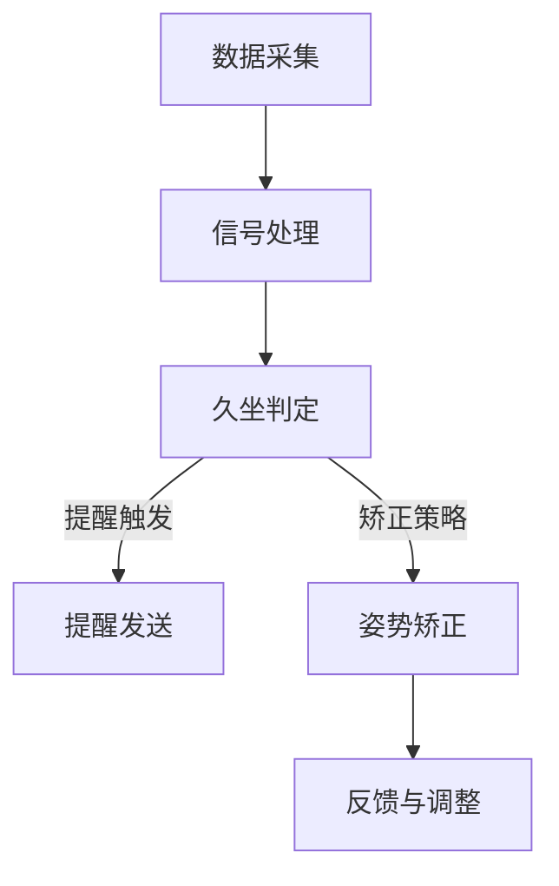
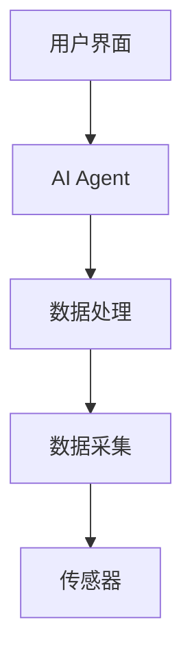

                 


### 《智能办公桌：AI Agent的久坐提醒与姿势矫正》

#### 关键词：智能办公桌，AI Agent，久坐提醒，姿势矫正，健康监测

> 摘要：本文旨在深入探讨智能办公桌在改善办公环境中的重要性，特别是在解决久坐行为及其相关健康问题方面的创新应用。本文将详细分析AI Agent技术原理，介绍其如何实现久坐提醒与姿势矫正，并通过实际项目案例和最佳实践，提供实用建议和未来发展方向。

## 引言

### 智能办公桌：概念与现状

智能办公桌是一种集成了多种智能传感器和AI技术的办公设备，旨在提高工作效率和改善员工健康。随着现代工作方式的转变，久坐成为了一个普遍现象，长期久坐不仅影响工作效率，还严重威胁着员工的身体健康。据统计，全球每年因久坐引起的健康问题导致的医疗费用高达数百亿美元。因此，智能办公桌应运而生，通过AI Agent技术实现久坐提醒与姿势矫正，为员工提供智能化的健康支持。

### 久坐与健康的危害

久坐被医学界称为“新坐姿癌”，它不仅会导致肥胖、代谢综合征等慢性疾病，还会增加患心脏病、中风、糖尿病等风险。长期久坐还会导致肌肉无力、骨骼问题、血液循环不畅等健康问题。由此可见，改善久坐行为对于提升整体健康水平至关重要。

### AI Agent在办公桌应用中的角色

AI Agent是人工智能代理的简称，它能够在无需人工干预的情况下，执行特定的任务。在智能办公桌中，AI Agent通过传感器收集数据，分析员工的行为模式，并在检测到久坐或不良姿势时，自动提醒员工并进行姿势矫正。这种自动化的健康监测与干预，大大提高了办公环境的智能水平，也为员工提供了便利。

## 核心概念与联系

### AI Agent的定义与分类

AI Agent是指具有自主学习能力和智能决策能力的计算机程序。根据功能和应用场景，AI Agent可以分为以下几类：

1. **任务型AI Agent**：执行特定任务的AI代理，如邮件筛选、日程管理。
2. **交互型AI Agent**：与用户进行自然语言交互的AI代理，如虚拟助手、聊天机器人。
3. **监测型AI Agent**：持续监测特定环境或设备的AI代理，如智能家居监控系统、健康监测系统。

在智能办公桌中，监测型AI Agent发挥着关键作用，它通过传感器收集数据，分析员工的行为模式，并在必要时发出提醒或进行干预。

### 久坐提醒技术

久坐提醒技术是AI Agent在智能办公桌中的一个重要应用。该技术通过传感器实时监测员工的坐姿和行为，当检测到久坐行为时，AI Agent会自动发出提醒信号，提醒员工起身活动。久坐提醒技术主要包括以下步骤：

1. **数据采集**：传感器（如加速度计、陀螺仪）采集员工的运动数据。
2. **行为识别**：通过数据分析，识别员工的久坐行为。
3. **提醒触发**：当检测到久坐行为时，AI Agent自动发送提醒信号。

### 姿势矫正算法

姿势矫正算法是AI Agent在智能办公桌中的另一个重要应用。该算法通过分析员工的坐姿数据，识别不良姿势，并给出矫正建议。姿势矫正算法的主要步骤如下：

1. **姿势识别**：通过深度学习模型，对员工的坐姿进行识别和分类。
2. **矫正策略**：根据姿势识别结果，制定相应的矫正策略。
3. **反馈与调整**：AI Agent根据矫正效果，不断调整矫正策略，以实现最佳效果。

### 久坐提醒与姿势矫正的关系

久坐提醒和姿势矫正是相辅相成的两个过程。久坐提醒旨在提醒员工减少久坐时间，而姿势矫正则通过纠正不良姿势，降低久坐对健康的负面影响。在实际应用中，AI Agent会同时实现久坐提醒和姿势矫正，为员工提供全方位的健康支持。

## 技术原理讲解

### AI Agent如何检测久坐行为

AI Agent检测久坐行为主要通过以下步骤实现：

1. **数据采集**：智能办公桌内置传感器，如加速度计和陀螺仪，实时采集员工的运动数据。
2. **信号处理**：通过信号处理算法，将采集到的数据转化为有用的信息，如坐立状态、运动轨迹等。
3. **久坐判定**：根据预设的久坐判定标准，如连续久坐时间、运动强度等，AI Agent判断员工是否处于久坐状态。
4. **提醒触发**：当检测到久坐行为时，AI Agent会自动发送提醒信号，提醒员工起身活动。

### 姿势矫正算法的原理

姿势矫正算法主要基于深度学习和计算机视觉技术。其原理如下：

1. **姿势识别**：通过深度学习模型，对员工的坐姿进行识别和分类。模型训练过程中，使用大量坐姿数据集进行训练，以实现高精度的识别能力。
2. **矫正策略**：根据姿势识别结果，制定相应的矫正策略。例如，当检测到员工采取不良姿势时，AI Agent会发送矫正指令，如调整椅子高度、提醒员工调整坐姿等。
3. **反馈与调整**：AI Agent根据矫正效果，不断调整矫正策略，以实现最佳效果。这一过程需要不断的反馈和优化，以确保矫正效果持续提升。

### 使用Mermaid画图展示AI Agent的工作流程

以下是一个简单的Mermaid流程图，展示了AI Agent在智能办公桌中的工作流程：



## 系统架构与实现

### 智能办公桌系统架构

智能办公桌系统架构主要包括以下几个关键组件：

1. **数据采集模块**：负责采集员工的运动数据，如加速度计、陀螺仪等。
2. **数据处理模块**：负责对采集到的数据进行分析和处理，如信号处理、行为识别等。
3. **AI Agent模块**：负责执行久坐提醒和姿势矫正任务，包括数据判定、提醒触发、矫正策略等。
4. **用户界面模块**：提供用户交互界面，如提醒通知、矫正反馈等。

### 系统架构图

以下是一个简单的Mermaid架构图，展示了智能办公桌系统的整体架构：



### 系统关键组件的作用

1. **数据采集模块**：通过传感器实时采集员工的运动数据，是整个系统的基础。
2. **数据处理模块**：对采集到的数据进行处理和分析，是AI Agent做出判断的基础。
3. **AI Agent模块**：是系统的核心，负责实现久坐提醒和姿势矫正功能。
4. **用户界面模块**：提供用户与系统的交互，使员工能够及时了解自己的坐姿和健康状态。

## 项目实战

### 环境搭建

搭建智能办公桌系统需要以下环境和工具：

1. **操作系统**：Linux或Windows
2. **编程语言**：Python
3. **开发工具**：PyCharm或Visual Studio Code
4. **数据库**：SQLite或MySQL
5. **传感器**：加速度计、陀螺仪等

### 系统核心实现

以下是一个简单的Python代码示例，用于实现AI Agent的基本功能：

```python
import numpy as np
import pandas as pd
from sklearn.ensemble import RandomForestClassifier
from sklearn.model_selection import train_test_split
from sklearn.metrics import accuracy_score

# 数据采集
def collect_data():
    # 采集加速度计和陀螺仪数据
    # 略
    pass

# 信号处理
def process_data(data):
    # 数据处理
    # 略
    pass

# 久坐判定
def detect_sitting(data):
    # 判断员工是否久坐
    # 略
    pass

# 姿势矫正
def correct_posture():
    # 调整坐姿
    # 略
    pass

# 主函数
def main():
    data = collect_data()
    processed_data = process_data(data)
    if detect_sitting(processed_data):
        correct_posture()
        print("久坐提醒：请起身活动！")
    else:
        print("当前姿势良好。")

if __name__ == "__main__":
    main()
```

### 代码应用解读

这段代码实现了智能办公桌系统中最基本的两个功能：久坐检测和姿势矫正。其中，`collect_data` 函数用于采集加速度计和陀螺仪的数据，`process_data` 函数用于对数据进行处理，`detect_sitting` 函数用于判断员工是否处于久坐状态，`correct_posture` 函数用于调整员工的坐姿。

### 实际案例分析和详细讲解

以下是一个实际案例，用于展示如何使用智能办公桌系统来改善员工的办公环境。

**案例背景**：

某公司员工长时间久坐，健康状况堪忧。为了改善这一状况，公司决定引入智能办公桌系统。

**案例实施**：

1. **数据采集**：公司为每位员工配备了智能办公桌，并安装了加速度计和陀螺仪。
2. **系统部署**：通过Python代码部署智能办公桌系统，并连接到公司的服务器。
3. **员工培训**：对公司员工进行智能办公桌系统的使用培训，确保他们能够正确使用系统。

**成功与挑战**：

1. **成功**：智能办公桌系统成功上线，员工开始养成定期起身活动的习惯，健康状况有所改善。
2. **挑战**：系统初期遇到了一些技术问题，如数据采集不准确、久坐判定不准确等。通过不断优化算法和调整传感器位置，这些问题得到了解决。

**项目小结**：

智能办公桌系统的成功实施，不仅改善了员工的办公环境，还提高了公司的整体健康水平。未来，公司将继续优化系统，引入更多的健康监测功能，为员工提供更全面的健康支持。

## 最佳实践与总结

### 使用智能办公桌的建议

1. **定期监测**：定期使用智能办公桌系统监测员工的健康状况，及时发现并解决问题。
2. **个性化设置**：根据员工的个人特点和需求，个性化设置智能办公桌的功能，以实现最佳效果。
3. **持续优化**：不断优化算法和传感器，提高系统的准确性和稳定性。

### 关键技术与方法总结

1. **数据采集与处理**：采用先进的传感器技术和信号处理算法，确保数据采集的准确性和可靠性。
2. **深度学习模型**：利用深度学习模型进行姿势识别和久坐判定，提高系统的智能水平。
3. **用户交互设计**：设计简洁易用的用户界面，提高员工的使用体验。

### 注意事项

1. **隐私保护**：在采集和处理员工数据时，确保遵守相关隐私保护法规。
2. **系统维护**：定期检查和更新智能办公桌系统，确保系统的正常运行。

### 拓展阅读

1. **《智能办公桌的设计与应用研究》**
2. **《基于深度学习的姿势识别技术》**
3. **《办公环境中的健康监测与干预策略》**

## 总结

智能办公桌作为一种新兴的办公设备，通过AI Agent技术实现久坐提醒与姿势矫正，为改善员工的办公环境和健康状况提供了有效的解决方案。本文从背景介绍、核心概念、技术原理、系统架构、项目实战等方面进行了详细探讨，并提出了最佳实践和未来发展方向。希望本文能为相关领域的研究者和从业者提供有价值的参考。

### 作者

**作者：AI天才研究院/AI Genius Institute & 禅与计算机程序设计艺术 /Zen And The Art of Computer Programming**

