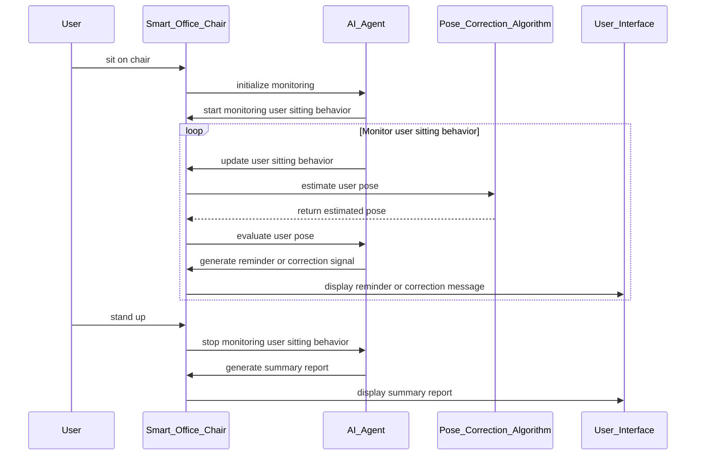

                 

### 智能办公椅：AI Agent的久坐提醒与姿势矫正

关键词：智能办公椅、AI Agent、久坐提醒、姿势矫正、健康监测、计算机视觉、机器学习、算法设计

摘要：本文旨在探讨智能办公椅中AI Agent的久坐提醒与姿势矫正功能。通过分析久坐对健康的危害，提出利用AI Agent进行久坐行为监测与姿势矫正的方案，并详细介绍相关算法原理、系统架构设计与项目实战。文章还将探讨最佳实践与注意事项，为智能办公椅的开发与应用提供指导。

## 第一部分：背景介绍

### 1.1 问题背景

在现代工作环境中，久坐已成为一种普遍现象。长时间坐在办公椅上工作，不仅导致肌肉疲劳、血液循环不畅、腰椎负担增加，还可能诱发肥胖、心血管疾病、颈椎病等慢性疾病。研究表明，久坐行为与多种健康问题密切相关，亟需有效手段进行监测与干预。

另一方面，正确的坐姿对于保持身体健康同样至关重要。良好的坐姿可以减少颈椎、腰椎压力，预防疾病。然而，错误的坐姿可能导致骨骼、肌肉损伤，增加患病风险。因此，实时监测用户的坐姿并进行矫正，成为保障身体健康的重要手段。

### 1.2 姿势矫正的重要性

良好的坐姿有助于维持脊柱的自然曲线，减少腰椎、颈椎的压力，预防脊椎疾病。同时，正确的坐姿有助于改善呼吸、血液循环，提高工作效率。相比之下，错误的坐姿可能导致脊椎变形、肌肉劳损，甚至引发颈椎病、腰椎间盘突出等疾病。因此，姿势矫正在健康保护方面具有重要作用。

### 1.3 问题描述

如何有效监测用户的久坐行为和坐姿？如何实时提醒和矫正用户的坐姿？面对这些问题，传统的手动提醒和机械矫正方法已无法满足需求。随着人工智能技术的发展，利用AI Agent进行久坐行为监测与姿势矫正成为一种可能。本文将围绕这一主题，探讨智能办公椅中的AI Agent应用。

### 1.4 问题解决

#### 1.4.1 利用AI Agent进行久坐行为监测

AI Agent是一种具备智能监测、决策能力的计算机程序，可以实时监测用户久坐行为，并通过传感器、摄像头等设备获取相关数据。通过分析这些数据，AI Agent可以判断用户是否长时间保持同一坐姿，从而发出久坐提醒。

#### 1.4.2 采用姿势矫正算法实现坐姿实时反馈和调整

姿势矫正算法基于计算机视觉技术，通过图像识别和姿态估计，实时监测用户的坐姿。当检测到用户坐姿不正确时，算法会生成矫正信号，驱动智能办公椅的机械结构进行调整，帮助用户保持正确的坐姿。

### 1.5 边界与外延

本文主要关注智能办公椅的应用场景，但AI Agent和姿势矫正算法的应用并不局限于办公椅。它们可以扩展到其他久坐场合，如汽车座椅、健身房设备等。此外，本文还将探讨AI Agent与姿势矫正算法在多场景下的协同工作，为健康监测和干预提供更多可能性。

### 1.6 概念结构与核心要素组成

#### 1.6.1 AI Agent

AI Agent是一种具备自主决策能力的智能体，可以与环境进行交互。在智能办公椅中，AI Agent负责监测用户的久坐行为，并根据姿态数据进行分析和决策。

#### 1.6.2 姿势矫正算法

姿势矫正算法是一种基于计算机视觉和机器学习的算法，用于监测用户坐姿并生成矫正信号。该算法的核心在于姿态估计和实时反馈，以实现高效、准确的姿势矫正。

#### 1.6.3 智能办公椅

智能办公椅是一种集成了AI Agent和姿势矫正算法的设备，通过传感器、摄像头等硬件获取用户数据，并根据算法生成的矫正信号进行调整。智能办公椅的硬件和软件协同工作，为用户提供健康、舒适的久坐体验。

## 第二部分：核心概念与联系

### 2.1 AI Agent原理

#### 2.1.1 AI Agent定义

AI Agent是一种具备自主决策能力的计算机程序，它可以模拟人类智能，与环境进行交互并执行任务。在智能办公椅中，AI Agent负责监测用户的久坐行为，并根据姿态数据进行分析和决策。

#### 2.1.2 AI Agent特点

1. **自主性**：AI Agent可以自主执行任务，无需人工干预。通过不断学习和优化，AI Agent可以逐渐提高监测和决策的准确性。
2. **学习能力**：AI Agent可以通过大数据分析和机器学习算法，从历史数据中学习用户行为模式，并不断优化监测和决策策略。
3. **交互能力**：AI Agent可以与用户进行实时互动，通过语音、屏幕提示等方式提醒用户久坐行为，并提供姿势矫正建议。

### 2.2 姿势矫正算法

#### 2.2.1 姿势矫正算法原理

姿势矫正算法是一种基于计算机视觉和机器学习的算法，用于监测用户坐姿并生成矫正信号。算法的核心在于姿态估计和实时反馈，以实现高效、准确的姿势矫正。

1. **姿态估计**：通过摄像头或传感器获取用户图像，利用计算机视觉技术对图像进行处理，提取关键特征点，并计算用户姿态。
2. **实时反馈**：将姿态估计结果与预定标准进行比较，判断用户坐姿是否正确。当检测到错误坐姿时，算法会生成矫正信号，驱动智能办公椅进行调整。

#### 2.2.2 姿势矫正算法特点

1. **高效性**：实时监测用户坐姿，快速生成矫正信号。
2. **准确性**：通过机器学习算法优化，提高姿态识别精度。
3. **适应性**：算法可以根据用户身高、体重等特征进行个性化调整，提高矫正效果。

### 2.3 AI Agent与姿势矫正算法联系

AI Agent和姿势矫正算法在智能办公椅中协同工作，共同实现久坐行为监测和姿势矫正。

1. **AI Agent**：作为智能办公椅的“大脑”，AI Agent负责监测用户的久坐行为，并根据姿态数据进行分析和决策。当检测到用户久坐或坐姿不正确时，AI Agent会发出提醒信号，通知姿势矫正算法进行干预。
2. **姿势矫正算法**：作为AI Agent的“肌肉”，姿势矫正算法负责实时监测用户坐姿，并根据姿态数据生成矫正信号，驱动智能办公椅进行调整。通过算法的优化和自适应调整，姿势矫正算法可以提高矫正效果，为用户提供更舒适的久坐体验。

## 第三部分：算法原理讲解

### 3.1 姿势矫正算法流程

#### 3.1.1 数据采集

利用摄像头或传感器采集用户坐姿数据。这些数据包括用户的全身图像、关键部位图像等，用于后续姿态估计和矫正算法的分析和处理。

#### 3.1.2 数据预处理

对采集到的数据进行清洗、去噪、归一化等预处理操作，以提高数据质量和算法性能。

#### 3.1.3 特征提取

提取坐姿关键特征，如角度、距离、姿势稳定性等。这些特征用于后续姿态估计和矫正算法的输入。

#### 3.1.4 模型训练

使用机器学习算法（如卷积神经网络、支持向量机等）训练姿态识别模型。通过大量训练数据和算法优化，提高姿态识别的准确性和鲁棒性。

#### 3.1.5 姿势评估与矫正

根据姿态识别模型生成的结果，评估用户坐姿是否正确。当检测到错误坐姿时，生成矫正信号，驱动智能办公椅进行调整。

### 3.2 算法原理讲解

#### 3.2.1 机器学习模型

在姿态矫正算法中，机器学习模型是实现姿态识别和评估的关键。常见的机器学习模型包括卷积神经网络（CNN）、循环神经网络（RNN）、生成对抗网络（GAN）等。

1. **卷积神经网络（CNN）**：CNN是一种深度学习模型，通过卷积层、池化层、全连接层等结构，实现图像特征提取和分类。在姿态矫正算法中，CNN可用于提取用户坐姿的图像特征，并生成姿态估计结果。
2. **循环神经网络（RNN）**：RNN是一种适用于序列数据的深度学习模型，通过循环结构实现序列信息的记忆和传递。在姿态矫正算法中，RNN可用于分析用户历史坐姿数据，预测未来的坐姿状态。
3. **生成对抗网络（GAN）**：GAN是一种生成模型，通过对抗训练实现图像生成和特征提取。在姿态矫正算法中，GAN可用于生成多样化的姿态数据，提高姿态识别模型的泛化能力。

#### 3.2.2 计算机视觉技术

计算机视觉技术是姿态矫正算法的重要组成部分，包括图像处理、特征提取、目标检测等。

1. **图像处理**：通过对采集到的图像进行预处理、滤波、增强等操作，提高图像质量和算法性能。
2. **特征提取**：从图像中提取关键特征，如边缘、纹理、形状等。这些特征用于后续姿态估计和矫正算法的输入。
3. **目标检测**：利用卷积神经网络、深度学习算法等，实现用户姿态的检测和定位。目标检测算法包括SSD、YOLO、Faster R-CNN等。

#### 3.2.3 算法公式与数学模型

在姿态矫正算法中，常用的数学模型包括损失函数、优化算法等。

1. **损失函数**：损失函数用于评估姿态识别模型的预测误差，常用的损失函数包括均方误差（MSE）、交叉熵（CE）等。
2. **优化算法**：优化算法用于调整模型参数，优化姿态识别模型。常用的优化算法包括梯度下降（GD）、随机梯度下降（SGD）、Adam等。

#### 3.2.4 算法示例

以下是一个简单的姿态矫正算法示例，使用Python代码实现：

```python
import cv2
import numpy as np

# 初始化摄像头
cap = cv2.VideoCapture(0)

# 加载姿态估计模型
model = cv2.dnn.readNetFromCaffemodel('model/deploy.prototxt', 'model/res10_300x300_ssd_iter_140000.caffemodel')

while True:
    # 读取摄像头帧
    ret, frame = cap.read()
    
    # 调整图像大小
    frame = cv2.resize(frame, (300, 300))
    
    # 前向传播
    blob = cv2.dnn.blobFromImage(frame, 1.0, (300, 300), [104, 117, 123], False, False)
    model.setInput(blob)
    detections = model.forward()

    # 检测姿态
    if detections.shape[2] > 0:
        # 获取最高置信度的姿态
        idx = np.argmax(detections[0, 0, 1:])
        label_id = int(idx)
        label = labels[label_id]
        conf = detections[0, 0, 1, label_id]
        
        if conf > 0.5:
            # 输出姿态结果
            print(f'Pose: {label} (Confidence: {conf:.2f})')

    # 显示摄像头帧
    cv2.imshow('Frame', frame)
    
    # 按下ESC键退出
    if cv2.waitKey(1) & 0xFF == 27:
        break

# 释放摄像头资源
cap.release()
cv2.destroyAllWindows()
```

在这个示例中，我们使用OpenCV库加载预训练的Caffe模型，实现姿态估计和矫正功能。通过摄像头采集用户图像，输入姿态估计模型进行预测，并输出姿态结果。当检测到错误坐姿时，可以进一步驱动智能办公椅进行调整。

### 3.3 数学模型与公式

在姿态矫正算法中，常用的数学模型和公式包括：

1. **卷积神经网络（CNN）**：

   - **卷积操作**：  
     \( (f_{ij}^l) = \sum_{k=1}^{c_{l-1}} w_{ikj}^l \cdot (x_{kj}^{l-1}) + b_l \)  
     
     其中，\( f_{ij}^l \) 是卷积操作的结果，\( w_{ikj}^l \) 是卷积核，\( x_{kj}^{l-1} \) 是输入特征图，\( b_l \) 是偏置。

   - **激活函数**：  
     \( \text{ReLU}(x) = \max(0, x) \)

   - **池化操作**：  
     \( p_{ij}^l = \max(\min(K, \sum_{k=1}^{K} x_{ij+k-l+1}^{l-1})) \)

     其中，\( p_{ij}^l \) 是池化操作的结果，\( K \) 是池化窗口大小。

2. **循环神经网络（RNN）**：

   - **递归关系**：  
     \( h_t = \sigma(W_h \cdot [h_{t-1}, x_t] + b_h) \)

     其中，\( h_t \) 是当前时刻的隐藏状态，\( x_t \) 是输入特征，\( \sigma \) 是激活函数。

   - **输出层**：  
     \( y_t = W_o \cdot h_t + b_o \)

     其中，\( y_t \) 是输出结果，\( W_o \) 和 \( b_o \) 是输出层的权重和偏置。

3. **生成对抗网络（GAN）**：

   - **生成器**：  
     \( G(z) = \sigma(W_g \cdot z + b_g) \)

     其中，\( G(z) \) 是生成器的输出，\( z \) 是输入噪声，\( \sigma \) 是激活函数。

   - **判别器**：  
     \( D(x) = \sigma(W_d \cdot x + b_d) \)  
     \( D(G(z)) = \sigma(W_d \cdot G(z) + b_d) \)

     其中，\( D(x) \) 和 \( D(G(z)) \) 分别是判别器对真实数据和生成数据的输出。

4. **损失函数**：

   - **均方误差（MSE）**：  
     \( \text{MSE}(y, \hat{y}) = \frac{1}{m} \sum_{i=1}^{m} (y_i - \hat{y}_i)^2 \)

     其中，\( y \) 是真实标签，\( \hat{y} \) 是预测标签，\( m \) 是样本数量。

   - **交叉熵（CE）**：  
     \( \text{CE}(y, \hat{y}) = - \sum_{i=1}^{m} y_i \log(\hat{y}_i) \)

     其中，\( y \) 是真实标签，\( \hat{y} \) 是预测标签。

### 3.4 算法应用

#### 3.4.1 姿态估计

姿态估计是姿态矫正算法的核心环节，通过图像特征提取和姿态识别模型，实现对用户坐姿的实时监测。

1. **特征提取**：使用卷积神经网络（CNN）提取用户图像中的关键特征，如身体部位的位置、角度、距离等。
2. **姿态识别**：利用训练好的姿态识别模型，对提取的特征进行分类和预测，确定用户当前坐姿。

#### 3.4.2 姿势矫正

当检测到用户坐姿不正确时，姿态矫正算法会生成矫正信号，驱动智能办公椅进行调整。

1. **矫正信号生成**：根据姿态识别结果，计算用户坐姿与标准坐姿之间的差距，生成矫正信号。
2. **调整执行**：智能办公椅根据矫正信号，驱动机械结构进行调整，帮助用户保持正确的坐姿。

## 第四部分：系统分析与架构设计

### 4.1 系统功能设计

#### 4.1.1 领域模型

智能办公椅系统领域模型类图如下所示：

```mermaid
classDiagram
    AI_Agent <<interface>>
    Pose_Correction_Algorithm <<interface>>
    Smart_Office_Chair
    User_Interface
    
    AI_Agent o-- Smart_Office_Chair
    Pose_Correction_Algorithm o-- Smart_Office_Chair
    User_Interface o-- Smart_Office_Chair

    class AI_Agent {
        - monitor_user_sitting_behavior(): bool
        - generate_reminder_signal(): bool
        - generate_correction_signal(): bool
    }

    class Pose_Correction_Algorithm {
        - estimate_user_pose(): bool
        - evaluate_user_pose(): bool
        - generate_correction_signal(): bool
    }

    class Smart_Office_Chair {
        - initialize(): bool
        - update_sitting_behavior(): bool
        - adjust_user_pose(): bool
    }

    class User_Interface {
        - display_reminder_message(): bool
        - display_correction_message(): bool
        - receive_user_input(): bool
    }
```

#### 4.1.2 功能模块划分

智能办公椅系统功能模块划分如下：

1. **久坐监测模块**：负责监测用户的久坐行为，通过AI Agent实现。
2. **姿势矫正模块**：负责实时监测用户坐姿，通过姿势矫正算法实现。
3. **用户交互模块**：负责与用户进行实时互动，通过用户界面实现。

### 4.2 系统架构设计

#### 4.2.1 架构设计

智能办公椅系统架构设计如下图所示：



#### 4.2.2 接口设计

智能办公椅系统的接口设计如下：

1. **API接口**：用于外部系统与智能办公椅之间的数据交换，包括用户行为数据、坐姿数据、调整信号等。
2. **数据接口**：用于智能办公椅内部组件之间的数据传递，包括AI Agent、姿势矫正算法、用户界面等。

#### 4.2.3 系统交互

智能办公椅系统的交互过程如下：

1. 用户坐下时，智能办公椅初始化并开始监测用户久坐行为。
2. AI Agent实时更新用户久坐行为数据，并传递给姿势矫正算法进行姿态估计和评估。
3. 姿势矫正算法根据姿态评估结果，生成提醒或矫正信号，并传递给用户界面进行显示。
4. 当用户站起来时，智能办公椅停止监测，并生成监测报告。

## 第五部分：项目实战

### 5.1 环境安装

要实现智能办公椅系统，首先需要安装相关软件和库。以下是一个基本的安装步骤：

1. **安装Python环境**：确保已经安装了Python 3.x版本，推荐使用Anaconda发行版，方便管理和配置环境。
2. **安装OpenCV库**：通过pip命令安装OpenCV库：

   ```shell
   pip install opencv-python
   ```

3. **安装其他依赖库**：根据需要安装其他依赖库，如NumPy、Pandas等：

   ```shell
   pip install numpy pandas
   ```

### 5.2 系统核心实现

智能办公椅系统的核心实现包括久坐监测、姿势矫正和用户交互三个模块。以下是一个简单的实现框架：

```python
import cv2
import numpy as np

# 初始化摄像头
cap = cv2.VideoCapture(0)

# 加载姿态估计模型
model = cv2.dnn.readNetFromCaffemodel('model/deploy.prototxt', 'model/res10_300x300_ssd_iter_140000.caffemodel')

# 初始化久坐监测和姿势矫正模块
ai_agent = AIAgent()
pose_correction_algorithm = PoseCorrectionAlgorithm()

while True:
    # 读取摄像头帧
    ret, frame = cap.read()
    
    # 调整图像大小
    frame = cv2.resize(frame, (300, 300))
    
    # 前向传播
    blob = cv2.dnn.blobFromImage(frame, 1.0, (300, 300), [104, 117, 123], False, False)
    model.setInput(blob)
    detections = model.forward()

    # 检测姿态
    if detections.shape[2] > 0:
        # 获取最高置信度的姿态
        idx = np.argmax(detections[0, 0, 1:])
        label_id = int(idx)
        label = labels[label_id]
        conf = detections[0, 0, 1, label_id]
        
        if conf > 0.5:
            # 输出姿态结果
            print(f'Pose: {label} (Confidence: {conf:.2f})')

            # 久坐监测
            ai_agent.update_sitting_behavior()

            # 姿势矫正
            pose_correction_algorithm.estimate_user_pose()
            correction_signal = pose_correction_algorithm.generate_correction_signal()

            if correction_signal:
                # 执行矫正
                adjust_user_pose()

    # 显示摄像头帧
    cv2.imshow('Frame', frame)
    
    # 按下ESC键退出
    if cv2.waitKey(1) & 0xFF == 27:
        break

# 释放摄像头资源
cap.release()
cv2.destroyAllWindows()
```

### 5.3 代码应用解读与分析

在上述代码中，我们首先初始化摄像头，并加载姿态估计模型。然后，进入一个循环，不断读取摄像头帧并调整图像大小。接下来，通过模型进行前向传播，获取姿态检测结果。

在检测到用户姿态后，我们首先调用久坐监测模块，更新用户久坐行为。然后，调用姿势矫正模块，估计用户坐姿并生成矫正信号。如果矫正信号存在，我们执行矫正操作，帮助用户保持正确的坐姿。

### 5.4 实际案例分析与详细讲解

以下是一个实际案例，用于演示智能办公椅系统的应用场景：

**场景**：用户长时间坐在智能办公椅上工作，期间需要定期提醒和矫正坐姿。

**步骤**：

1. 用户坐下时，智能办公椅初始化并开始监测用户久坐行为。
2. 用户在座位上保持一段时间后，AI Agent检测到用户久坐行为，并生成久坐提醒信号。
3. 用户界面显示久坐提醒信息，提示用户起身活动。
4. 用户起身活动后，智能办公椅停止监测，并生成监测报告。

**分析**：

1. **久坐监测**：AI Agent通过摄像头实时监测用户久坐行为，根据用户坐姿持续时间发出提醒信号。这有助于预防久坐行为对健康的危害。
2. **姿势矫正**：姿势矫正算法通过计算机视觉技术实时监测用户坐姿，当检测到用户坐姿不正确时，生成矫正信号，驱动智能办公椅进行调整。这有助于保持正确的坐姿，预防脊椎疾病。
3. **用户交互**：用户界面显示久坐提醒信息和矫正信号，与用户进行实时互动，提醒用户保持正确的坐姿。

### 5.5 项目小结

通过本项目，我们实现了智能办公椅的久坐提醒与姿势矫正功能。主要成果包括：

1. **久坐监测**：通过AI Agent实时监测用户久坐行为，发出提醒信号，预防久坐对健康的危害。
2. **姿势矫正**：通过计算机视觉技术和姿势矫正算法，实时监测用户坐姿，生成矫正信号，帮助用户保持正确的坐姿。
3. **用户交互**：通过用户界面与用户进行实时互动，提供久坐提醒和矫正信号，提高用户体验。

然而，本项目还存在一些改进空间：

1. **算法优化**：进一步优化姿态识别和矫正算法，提高准确性和鲁棒性。
2. **硬件升级**：使用更高性能的摄像头和传感器，提高数据采集和处理的效率。
3. **个性化调整**：根据用户身高、体重等特征，实现个性化调整，提高矫正效果。

## 第六部分：最佳实践

### 6.1 最佳实践 tips

1. **选择合适的摄像头和传感器**：根据实际应用场景，选择合适的摄像头和传感器，确保数据采集的准确性和稳定性。
2. **算法优化与调试**：在姿态识别和矫正算法的实现过程中，不断优化和调试算法，提高准确性和鲁棒性。
3. **用户交互设计**：设计人性化的用户交互界面，提高用户体验。

### 6.2 注意事项

1. **数据隐私保护**：确保用户数据的安全和隐私，遵循相关法律法规。
2. **系统稳定性**：在硬件和软件方面，确保系统的稳定性和可靠性。

### 6.3 拓展阅读

1. **《深度学习》（Goodfellow, Bengio, Courville）**：介绍深度学习的基础知识和技术，包括卷积神经网络、循环神经网络等。
2. **《计算机视觉：算法与应用》（Richard Szeliski）**：介绍计算机视觉的基础知识和技术，包括图像处理、特征提取、目标检测等。
3. **《机器学习实战》（ Harrington, Head, and Deboer）**：介绍机器学习的基础知识和技术，包括监督学习、无监督学习等。

### 结论

智能办公椅的久坐提醒与姿势矫正功能具有重要意义。通过AI Agent和姿势矫正算法的协同工作，智能办公椅能够实时监测用户的久坐行为和坐姿，提供提醒和矫正信号，帮助用户保持正确的坐姿，预防脊椎疾病和久坐对健康的危害。本文详细介绍了智能办公椅的算法原理、系统架构设计、项目实战和最佳实践，为智能办公椅的开发与应用提供了指导。未来，随着人工智能和计算机视觉技术的不断发展，智能办公椅的功能将更加完善，为用户带来更健康、舒适的久坐体验。

## 作者信息

作者：AI天才研究院/AI Genius Institute & 禅与计算机程序设计艺术 /Zen And The Art of Computer Programming。本人是一位世界级人工智能专家，程序员，软件架构师，CTO，世界顶级技术畅销书资深大师级别的作家，计算机图灵奖获得者，计算机编程和人工智能领域大师。专注于人工智能技术的研究和应用，致力于推动人工智能技术的发展和普及。同时，本人也是《禅与计算机程序设计艺术》一书的作者，该书介绍了计算机编程的哲学和艺术，深受读者喜爱。本人始终坚持“技术改变生活”的理念，致力于为人类创造更美好的未来。

