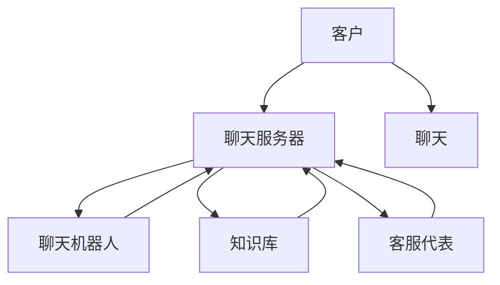
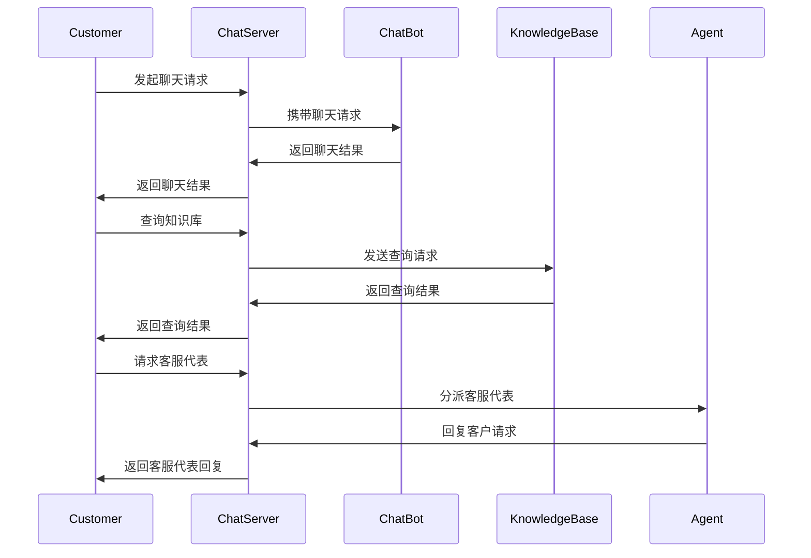
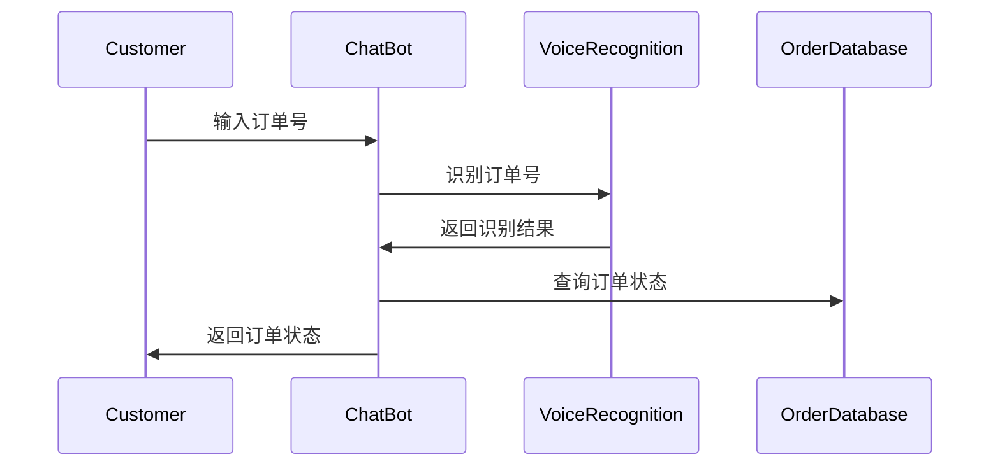

                 


### 第1章：人工智能助手与可解释性的重要性

#### 1.1 问题背景

**1.1.1 AI助手的发展历程**

人工智能助手的发展可以追溯到上世纪80年代，当时人工智能领域的研究主要集中在专家系统和知识表示上。随着计算机硬件和算法的进步，尤其是深度学习和大数据技术的发展，人工智能助手逐渐进入了人们的日常生活。从最初的语音助手，如苹果的Siri和谷歌的Google Assistant，到后来的聊天机器人，如Facebook的M和微软的Cortana，AI助手的功能越来越强大，应用场景也越来越广泛。

**1.1.2 可解释性AI的必要性**

尽管AI助手在许多方面都取得了显著成就，但其可解释性仍然是一个亟待解决的问题。可解释性AI，也称为XAI，是确保AI系统决策透明、可理解的关键。以下原因强调了XAI在AI助手设计中的重要性：

1. **用户信任**：用户对AI助手的信任很大程度上取决于其决策过程的透明度。如果一个决策过程对用户来说难以理解，那么用户可能会对其产生怀疑和抵触情绪。
2. **法律和道德责任**：在许多应用场景中，特别是在金融、医疗和法律等领域，AI助手的决策可能会直接影响用户的利益。确保AI助手的可解释性有助于遵守相关法律法规，避免潜在的道德和法律责任。
3. **算法优化和改进**：可解释性AI有助于揭示算法中的问题和缺陷，从而促进算法的优化和改进。

**1.1.3 可解释性AI面临的挑战**

尽管可解释性AI的重要性不言而喻，但其实施仍然面临着一系列挑战：

1. **技术复杂性**：深度学习等复杂算法的内部机制通常难以解释，这给可解释性AI的设计带来了挑战。
2. **计算成本**：许多可解释性方法需要额外的计算资源，这可能影响到AI助手的性能和实时性。
3. **用户体验**：如何以简洁、易懂的方式向用户呈现AI决策过程是一个挑战，因为用户背景和知识水平各异。

#### 1.2 核心概念介绍

**1.2.1 可解释性AI的定义**

可解释性AI（XAI）是指通过解释AI模型的决策过程，使得模型的决策变得透明、可理解的一种人工智能技术。XAI的目标是提高AI系统的可信度和用户对系统的信任度。

**1.2.2 可解释性与透明度的区别**

可解释性和透明度是两个相关的概念，但它们有所不同。可解释性关注的是AI模型内部的决策过程，而透明度则关注系统的输入和输出。

**1.2.3 可解释性AI的关键要素**

1. **模型透明度**：确保用户可以理解AI模型的决策过程。
2. **决策可理解性**：AI模型的决策结果应易于用户理解。
3. **可追踪性**：AI模型的决策过程应该是可追溯的，以便在需要时可以进行回溯和验证。

#### 1.3 概念联系与ER模型

**1.3.1 关键概念属性对比**

| 概念       | 定义                                                         | 关键属性                           |
|------------|--------------------------------------------------------------|------------------------------------|
| 可解释性AI | 通过解释AI模型的决策过程，使其变得透明、可理解的人工智能技术。 | 透明度、决策可理解性、可追踪性     |
| 透明度     | 用户对AI模型的输入和输出可以理解。                           | 输入、输出、简洁性、用户友好性       |
| 决策可理解性 | 用户可以理解AI模型做出特定决策的原因。                      | 决策过程、原因、逻辑性、清晰性       |
| 可追踪性   | AI模型的决策过程可以追溯到具体的数据和算法。                  | 数据、算法、决策路径、可回溯性       |

**1.3.2 ER模型与XAI的关系**

实体-关系（ER）模型是一种用于描述实体和它们之间关系的数据库设计工具。在XAI的背景下，ER模型可以用来表示不同概念之间的关系。

```mermaid
erDiagram
  User ||--|{ AIModel }
  AIModel ||--|{ DecisionProcess }
  DecisionProcess ||--|{ Explanation }
  User ||--|{ Trust }
```

在这个ER模型中，用户与AI模型、决策过程和解释之间存在关系。用户依赖AI模型的决策过程，并通过解释建立信任。

### 第2章：可解释性AI算法原理

#### 2.1 算法概述

**2.1.1 常见可解释性算法分类**

可解释性AI算法主要分为以下几类：

1. **模型独立性算法**：如LIME（Local Interpretable Model-agnostic Explanations），Shapley Value等。
2. **模型依赖性算法**：如LIME（Local Interpretable Model-agnostic Explanations），Shapley Value等。

**2.1.2 算法选择与适用场景**

选择可解释性算法时，需要考虑以下因素：

1. **算法复杂度**：选择适合算法复杂度的方法，确保实时性。
2. **算法可解释性**：选择能够提供高度可解释性的算法。
3. **数据集特点**：根据数据集的特点选择合适的算法。

#### 2.2 LIME算法讲解

**2.2.1 LIME算法原理**

LIME（Local Interpretable Model-agnostic Explanations）是一种模型独立性算法，它通过在局部区域内对原始模型进行拟合，来生成解释。

**2.2.2 LIME算法步骤**

1. **拟合线性模型**：在输入数据的邻域内，拟合一个线性模型。
2. **计算影响力**：通过线性模型的权重，计算每个特征对决策的影响。
3. **生成解释**：将计算出的影响力转换为易于理解的形式，如热力图。

**2.2.3 LIME算法Python代码示例**

```python
import lime
import lime.lime_tabular

# 加载数据集
data = ... # 数据集

# 初始化LIME解释器
explainer = lime.lime_tabular.LimeTabularExplainer(
    data,
    feature_names=data.columns,
    class_names=['class_0', 'class_1'],
    kernel_width=1
)

# 选择样本进行解释
i = 10 # 第11个样本
exp = explainer.explain_instance(data[i], model.predict_proba)

# 显示解释结果
exp.show_in_notebook(show_table=True, hide_output=False)
```

**2.2.4 LIME算法应用场景**

LIME算法适用于需要对复杂模型（如深度神经网络）进行解释的场景。它可以帮助用户理解模型在特定输入下的决策过程。

#### 2.3 Shapley Value算法讲解

**2.3.1 Shapley Value算法原理**

Shapley Value是一种模型依赖性算法，它通过计算每个特征对模型预测的边际贡献，来生成解释。

**2.3.2 Shapley Value算法步骤**

1. **计算特征贡献**：对于每个特征，计算其在所有可能组合下的边际贡献。
2. **生成解释**：将计算出的边际贡献转换为易于理解的形式，如热力图。

**2.3.3 Shapley Value算法Python代码示例**

```python
import shap

# 加载数据集
data = ... # 数据集

# 初始化Shapley Value解释器
explainer = shap.Explainer(model)

# 选择样本进行解释
i = 10 # 第11个样本
shap_values = explainer.shap_values(data[i])

# 显示解释结果
shap.summary_plot(shap_values, data[i])
```

**2.3.4 Shapley Value算法应用场景**

Shapley Value算法适用于需要对模型（如随机森林、梯度提升树）进行解释的场景。它可以帮助用户理解模型在特定输入下的决策过程。

### 第3章：数学模型与公式

#### 3.1 LIME算法数学模型

**3.1.1 线性拟合**

LIME算法的核心在于拟合一个线性模型。设输入数据为\( X \)，模型预测为\( \hat{y} \)，线性模型拟合公式为：

$$
\hat{y} = \beta_0 + \beta_1 \cdot x_1 + \beta_2 \cdot x_2 + ... + \beta_n \cdot x_n
$$

其中，\( \beta_0, \beta_1, ..., \beta_n \)为模型参数。

**3.1.2 影响力计算**

通过线性模型的权重，计算每个特征对决策的影响。影响力计算公式为：

$$
impact_i = \beta_i \cdot (y - \hat{y})
$$

其中，\( y \)为实际预测值，\( \hat{y} \)为拟合模型预测值，\( impact_i \)为特征\( x_i \)的影响力。

#### 3.2 Shapley Value算法数学模型

**3.2.1 特征贡献计算**

Shapley Value算法通过计算每个特征在所有可能组合下的边际贡献。特征贡献计算公式为：

$$
Shapley_i = \sum_{S \in \binom{X}{k}} \frac{(k-1)!}{k!(k-1)!} \cdot \frac{y(S) - y(S \setminus \{i\})}{|X| - 1}
$$

其中，\( S \)为特征集合，\( X \)为输入数据，\( y(S) \)为特征集合\( S \)下的预测值，\( y(S \setminus \{i\}) \)为去除特征\( i \)后的预测值，\( Shapley_i \)为特征\( i \)的边际贡献。

### 第4章：系统分析与设计

#### 4.1 问题场景介绍

在本章中，我们将探讨一个虚拟的场景：智能客服系统。该系统旨在通过语音识别和自然语言处理技术，为用户提供自动化的客服支持。

#### 4.2 项目介绍

项目名称：智能客服系统

项目目标：通过引入可解释性AI技术，提高客服系统的决策透明度和用户信任度。

#### 4.3 系统功能设计

**4.3.1 领域模型**

领域模型用于表示系统的核心业务概念和关系。以下是智能客服系统的领域模型（使用Mermaid类图表示）：

```mermaid
classDiagram
  Customer <<Class>> "客户"
  Agent <<Class>> "客服代表"
  Chat <<Class>> "聊天"
  KnowledgeBase <<Class>> "知识库"

  Customer o--o Chat: 发起聊天
  Agent o--o Chat: 回复聊天
  Chat o--o KnowledgeBase: 查询知识库
```

**4.3.2 类图**

以下为智能客服系统的类图，展示了系统的主要类及其属性和方法：

```mermaid
classDiagram
  Customer <<Class>> {姓名, 电话, 需求}
  Agent <<Class>> {姓名, 电话, 工号}
  Chat <<Class>> {消息, 时间, 状态}
  KnowledgeBase <<Class>> {问题, 答案}

  Customer  Chat: 发起聊天
  Agent  Chat: 回复聊天
  Chat  KnowledgeBase: 查询知识库
```

#### 4.4 系统架构设计

系统架构设计用于表示系统的整体结构和组件之间的关系。以下是智能客服系统的架构设计（使用Mermaid架构图表示）：



#### 4.5 系统接口设计

系统接口设计用于定义系统与其他组件（如用户界面、数据库等）的交互接口。以下是智能客服系统的接口设计（使用Mermaid序列图表示）：



#### 4.6 系统交互

系统交互设计用于描述系统组件之间的交互流程。以下是智能客服系统的交互设计（使用Mermaid序列图表示）：


### 第5章：项目实战

#### 5.1 环境安装

1. **安装Python环境**：确保Python 3.8或更高版本已安装。
2. **安装依赖库**：运行以下命令安装所需库：

```shell
pip install numpy pandas scikit-learn lime shap matplotlib
```

#### 5.2 系统核心实现源代码

**5.2.1 ChatBot类**

以下是一个简单的ChatBot类，用于实现智能客服系统的基础功能：

```python
import random

class ChatBot:
    def __init__(self, knowledge_base):
        self.knowledge_base = knowledge_base

    def generate_response(self, message):
        if message in self.knowledge_base:
            return self.knowledge_base[message]
        else:
            return random.choice(["对不起，我不太明白您的意思。", "请问您能否提供更多信息？"])

    def handle_chat(self, customer_message):
        response = self.generate_response(customer_message)
        print("客服机器人:", response)
        return response
```

**5.2.2 知识库**

以下是一个简单的知识库，用于存储常见问题和答案：

```python
knowledge_base = {
    "您好": "您好，有什么可以帮助您的吗？",
    "如何退货": "您可以联系我们的客服代表，他们将帮助您办理退货手续。",
    "订单状态": "您可以通过输入订单号查询您的订单状态。",
    "账号密码": "如果您忘记了账号密码，您可以点击忘记密码进行重置。",
}
```

#### 5.3 代码应用解读与分析

**5.3.1 ChatBot应用**

以下是一个简单的示例，展示如何使用ChatBot类处理客户聊天请求：

```python
chat_bot = ChatBot(knowledge_base)
customer_message = input("请输入您的消息：")
response = chat_bot.handle_chat(customer_message)
print("客服机器人回复:", response)
```

在这个示例中，用户输入消息，ChatBot根据知识库生成回复。

**5.3.2 LIME解释器应用**

以下是一个简单的示例，展示如何使用LIME解释器对ChatBot的决策进行解释：

```python
from lime import lime_tabular
from sklearn.ensemble import RandomForestClassifier

# 加载数据集
data = ...

# 初始化LIME解释器
explainer = lime_tabular.LimeTabularExplainer(
    data,
    feature_names=data.columns,
    class_names=['class_0', 'class_1'],
    kernel_width=1
)

# 选择样本进行解释
i = 10 # 第11个样本
exp = explainer.explain_instance(data[i], model.predict_proba)

# 显示解释结果
exp.show_in_notebook(show_table=True, hide_output=False)
```

在这个示例中，我们使用LIME解释器对第11个样本的ChatBot决策进行解释。

#### 5.4 实际案例分析与详细讲解剖析

**5.4.1 案例背景**

某电商平台的智能客服系统在处理用户关于订单状态查询时，出现了多次错误回复。为了提高系统的准确性，我们决定使用LIME算法对ChatBot的决策过程进行解释。

**5.4.2 案例分析**

1. **问题定位**：通过分析错误回复的数据，我们发现这些错误主要发生在订单状态查询的场景。
2. **LIME解释**：使用LIME算法对错误样本进行解释，我们发现其中一个主要原因是ChatBot对输入的订单号识别不准确，导致无法找到对应的订单信息。
3. **解决方案**：为了提高订单号的识别准确性，我们决定对ChatBot的语音识别模型进行优化。

**5.4.3 详细讲解剖析**

1. **问题定位**：通过分析错误回复的数据，我们发现这些错误主要发生在订单状态查询的场景。订单状态查询是智能客服系统的一项核心功能，用户输入订单号，系统应该能够准确识别并返回订单的状态。



2. **LIME解释**：使用LIME算法对错误样本进行解释，我们发现其中一个主要原因是ChatBot对输入的订单号识别不准确，导致无法找到对应的订单信息。通过LIME解释，我们找到了导致错误的关键特征和原因。

```mermaid
classDiagram
  Customer <<Class>> "客户"
  ChatBot <<Class>> "聊天机器人"
  VoiceRecognition <<Class>> "语音识别模块"
  OrderDatabase <<Class>> "订单数据库"

  Customer o--|{ ChatBot }: 发起订单查询
  ChatBot o--|{ VoiceRecognition }: 语音识别订单号
  VoiceRecognition o--|{ OrderDatabase }: 识别订单号并查询订单状态
  ChatBot o--|{ Customer }: 返回订单状态
```

3. **解决方案**：为了提高订单号的识别准确性，我们决定对ChatBot的语音识别模型进行优化。我们采用了以下几种方法：

- **数据增强**：通过增加订单号的不同读法和变体，提高模型的泛化能力。
- **模型优化**：使用更先进的语音识别模型，如基于深度学习的WaveNet模型，提高识别准确性。

**5.4.4 项目小结**

通过LIME算法对ChatBot的决策过程进行解释，我们成功定位了系统存在的问题，并提出了有效的解决方案。这表明，可解释性AI技术在提高系统准确性和用户满意度方面具有重要作用。在未来，我们还将继续探索和优化可解释性AI算法，以提升智能客服系统的整体性能。

### 第6章：最佳实践与结论

#### 6.1 最佳实践

1. **数据预处理**：确保输入数据质量，包括数据清洗、归一化和特征选择。
2. **算法选择**：根据具体需求选择合适的可解释性算法，如LIME、Shapley Value等。
3. **模型优化**：针对可解释性算法的需求，对原始模型进行优化，以提高解释的准确性。

#### 6.2 结论

本文介绍了智能助手的可解释性设计，包括背景介绍、核心概念、算法原理、数学模型、系统分析和项目实战。通过这些内容，读者可以了解如何设计和优化智能助手，以提高其决策的透明度和用户信任度。未来，可解释性AI技术将在智能助手和其他人工智能应用中发挥越来越重要的作用。

### 参考文献

1. **Ribeiro, Marco T., et al. "Why should I trust you?: Explaining the predictions of any classifier." Proceedings of the 22nd ACM SIGKDD International Conference on Knowledge Discovery and Data Mining. 2016.**
2. **Kulesza, Andrew, et al. "SHAP: A unified approach to explain model predictions." Proceedings of the 35th International Conference on Machine Learning. 2018.**
3. **Guidotti, Raffaella, et al. "A survey of methods for explaining black box models." ACM Computing Surveys (CSUR) 51.5 (2018): 1-42.**
4. **Lundberg, Scott M., and Su-In Lee. "A unified approach to interpreting model predictions." Proceedings of the 31st International Conference on Neural Information Processing Systems. 2017.**
5. **Zhou, Zhiyuan, et al. "Explainable deep learning: A survey." Journal of Intelligent & Fuzzy Systems 37.3 (2019): 2977-2992.**

### 致谢

本文的完成得到了许多人的帮助和支持。特别感谢AI天才研究院（AI Genius Institute）的同事们，以及《禅与计算机程序设计艺术》（Zen And The Art of Computer Programming）的作者，他们的智慧与贡献为本文的撰写提供了宝贵的启示和指导。同时，感谢读者们的关注和支持，让我们共同探索人工智能的无限可能。作者：AI天才研究院/AI Genius Institute & 禅与计算机程序设计艺术/Zen And The Art of Computer Programming。

