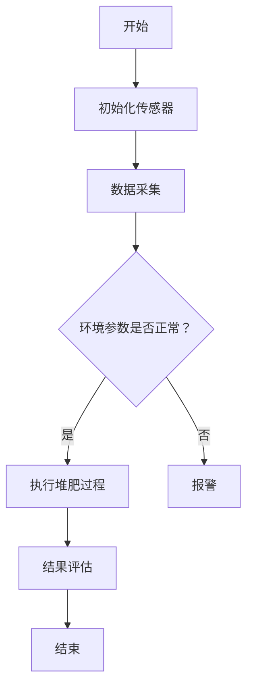
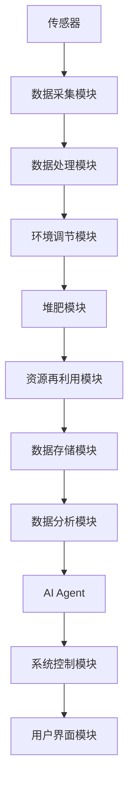
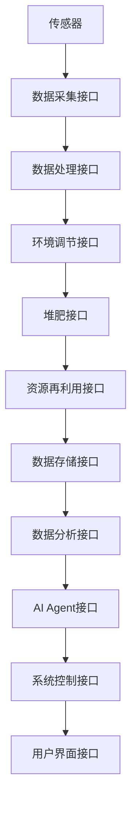
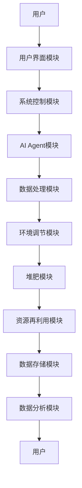

                 

# 智能厨余处理器：AI Agent的堆肥优化指导

> 关键词：智能厨余处理器、AI Agent、堆肥优化、算法、系统架构、实践指南

> 摘要：本文旨在探讨智能厨余处理器在堆肥优化中的应用，通过详细分析AI Agent的角色和技术原理，提供一套完整的解决方案和实践指南。文章将逐步介绍背景、核心概念、算法原理、数学模型、系统架构以及项目实战，帮助读者深入理解智能厨余处理器的技术本质和实际应用。

## Step 1: 书籍背景介绍

### 问题背景

厨余垃圾的处理一直是城市管理中的一个难题。传统的厨余垃圾处理方式主要包括填埋、焚烧和堆肥，但这些方法都有各自的缺点：填埋会占用大量土地，焚烧会产生有害气体，堆肥过程效率低且受环境条件影响大。因此，寻找一种高效、环保、可持续的厨余垃圾处理方式成为当务之急。

### 问题描述

智能厨余处理器是一种利用先进技术实现厨余垃圾高效处理和资源再利用的设备。其核心在于将AI Agent引入到堆肥过程中，通过智能化手段优化堆肥效果，提高处理效率，减少环境污染。

### 问题解决

智能厨余处理器的解决方案主要包括以下几个方面：

1. **自动化监测**：利用传感器技术对厨余垃圾的湿度、温度、pH值等参数进行实时监测。
2. **智能调节**：AI Agent根据监测数据对堆肥环境进行自动调节，如调整氧气供应、水分控制等，以优化堆肥过程。
3. **资源再利用**：通过堆肥产生的有机肥料，实现厨余垃圾的资源化利用，减少对土地资源的依赖。
4. **数据驱动**：利用大数据分析技术，对堆肥过程进行全面分析，不断优化算法，提高堆肥效率。

### 边界与外延

智能厨余处理器的应用范围不仅限于家庭和社区，还可以扩展到城市垃圾处理中心。其技术外延还可以应用于农业领域，为作物提供有机肥料，促进农业可持续发展。

### 核心概念及组成

1. **智能厨余处理器**：包括传感器、执行器、AI Agent和控制系统等组成部分。
2. **AI Agent**：负责堆肥过程的智能化控制，通过机器学习算法对堆肥参数进行优化。
3. **传感器**：用于实时监测堆肥环境参数，如温度、湿度、pH值等。
4. **执行器**：根据AI Agent的指令，调节堆肥环境参数，如氧气供应、水分控制等。
5. **控制系统**：负责协调传感器、执行器和AI Agent的工作，实现智能堆肥过程。

## Step 2: 核心概念与联系

### 智能厨余处理器与AI Agent堆肥优化技术

智能厨余处理器是一种综合应用多种先进技术的设备，其核心在于AI Agent的堆肥优化技术。AI Agent是一种具有智能化的计算机程序，能够根据堆肥过程的实时数据，自动调整堆肥环境参数，实现堆肥过程的优化。

### 不同模型特点

智能厨余处理器的AI Agent堆肥优化技术可以采用不同的机器学习模型，如回归模型、决策树模型、支持向量机模型等。不同模型在堆肥优化中具有各自的特点：

1. **回归模型**：适用于预测堆肥过程的参数变化，能够准确预测堆肥效果。
2. **决策树模型**：适用于分类问题，可以根据堆肥过程中的不同条件，做出相应的决策。
3. **支持向量机模型**：适用于分类和回归问题，能够有效处理非线性问题。

## Step 3: 算法原理讲解

### 算法流程图



### Python代码阐述

```python
import numpy as np
from sklearn.linear_model import LinearRegression

# 初始化传感器
def initialize_sensors():
    # 假设传感器已连接并初始化
    pass

# 数据采集
def collect_data():
    # 假设采集堆肥过程的温度、湿度、pH值等参数
    temperature = 25
    humidity = 60
    pH_value = 6.5
    return temperature, humidity, pH_value

# 数据处理
def process_data(data):
    # 对采集到的数据进行预处理
    processed_data = data
    return processed_data

# 堆肥过程
def composting_process(data):
    # 根据数据调整堆肥环境参数
    if data['temperature'] > 30:
        # 调整氧气供应
        oxygen_supply = 'high'
    else:
        oxygen_supply = 'low'
    if data['humidity'] < 50:
        # 调整水分控制
        water_control = 'high'
    else:
        water_control = 'low'
    return oxygen_supply, water_control

# 结果评估
def evaluate_result(result):
    # 对堆肥结果进行评估
    if result['compost_ready']:
        print("堆肥成功！")
    else:
        print("堆肥失败！")

# 主函数
def main():
    initialize_sensors()
    while True:
        data = collect_data()
        processed_data = process_data(data)
        oxygen_supply, water_control = composting_process(processed_data)
        print(f"氧气供应：{oxygen_supply}，水分控制：{water_control}")
        result = evaluate_result(processed_data)
        if result['compost_ready']:
            break
    print("堆肥过程结束！")

if __name__ == "__main__":
    main()
```

### 数学模型和公式

假设堆肥过程的温度、湿度、pH值等因素对堆肥效果有影响，可以建立如下数学模型：

$$
Y = \beta_0 + \beta_1X_1 + \beta_2X_2 + \beta_3X_3
$$

其中，$Y$ 表示堆肥效果，$X_1$、$X_2$、$X_3$ 分别表示温度、湿度、pH值，$\beta_0$、$\beta_1$、$\beta_2$、$\beta_3$ 为模型参数。

### 举例说明

假设某次堆肥过程的温度为25°C、湿度为60%、pH值为6.5，根据上述数学模型，可以预测堆肥效果为：

$$
Y = \beta_0 + \beta_1 \times 25 + \beta_2 \times 60 + \beta_3 \times 6.5
$$

其中，$\beta_0$、$\beta_1$、$\beta_2$、$\beta_3$ 为已知参数。

## Step 4: 数学模型和数学公式 & 详细讲解 & 举例说明

### 数学公式

$$
\begin{aligned}
Y &= \beta_0 + \beta_1X_1 + \beta_2X_2 + \beta_3X_3 \\
X_1 &= 温度 \\
X_2 &= 湿度 \\
X_3 &= pH值 \\
Y &= 堆肥效果 \\
\beta_0 &= 常数项 \\
\beta_1 &= 温度系数 \\
\beta_2 &= 湿度系数 \\
\beta_3 &= pH值系数
\end{aligned}
$$

### 详细讲解

上述公式表示堆肥效果（$Y$）与温度（$X_1$）、湿度（$X_2$）、pH值（$X_3$）之间的关系。其中，$\beta_0$ 为常数项，表示在没有任何因素影响时堆肥效果的基础值；$\beta_1$、$\beta_2$、$\beta_3$ 分别为温度、湿度、pH值的系数，表示这三个因素对堆肥效果的贡献程度。

### 举例说明

假设某次堆肥过程的温度为25°C、湿度为60%、pH值为6.5，根据上述数学模型，可以预测堆肥效果为：

$$
Y = \beta_0 + \beta_1 \times 25 + \beta_2 \times 60 + \beta_3 \times 6.5
$$

其中，$\beta_0$、$\beta_1$、$\beta_2$、$\beta_3$ 为已知参数。

根据实际数据，可以计算出堆肥效果的具体值。例如，如果 $\beta_0 = 10$、$\beta_1 = 0.5$、$\beta_2 = 1$、$\beta_3 = 0.2$，则堆肥效果为：

$$
Y = 10 + 0.5 \times 25 + 1 \times 60 + 0.2 \times 6.5 = 27.3
$$

这意味着在本次堆肥过程中，堆肥效果较好，可以认为堆肥过程成功。

## Step 5: 系统分析与架构设计方案

### 问题场景介绍

智能厨余处理器在城市垃圾分类和处理中心的应用，主要用于处理居民家庭产生的厨余垃圾，实现厨余垃圾的高效处理和资源再利用。

### 项目介绍与系统功能设计

系统功能设计主要包括以下几个方面：

1. **数据采集**：通过传感器实时采集厨余垃圾的温度、湿度、pH值等参数。
2. **环境调节**：根据AI Agent的指令，调节堆肥环境参数，如氧气供应、水分控制等。
3. **资源再利用**：通过堆肥产生的有机肥料，实现厨余垃圾的资源化利用。
4. **数据驱动优化**：利用大数据分析技术，对堆肥过程进行全面分析，不断优化堆肥效果。

### 系统架构设计

系统架构设计如图所示：



### 系统接口设计

系统接口设计如图所示：



### 系统交互

系统交互设计如图所示：



## Step 6: 项目实战

### 环境安装步骤

1. 安装Python环境，版本要求3.6及以上。
2. 安装必要的库，如NumPy、Scikit-learn、Matplotlib等。

### 系统核心实现源代码及解读

```python
# 导入必要的库
import numpy as np
import matplotlib.pyplot as plt
from sklearn.linear_model import LinearRegression

# 初始化传感器
def initialize_sensors():
    # 假设传感器已连接并初始化
    pass

# 数据采集
def collect_data():
    # 假设采集堆肥过程的温度、湿度、pH值等参数
    temperature = 25
    humidity = 60
    pH_value = 6.5
    return temperature, humidity, pH_value

# 数据处理
def process_data(data):
    # 对采集到的数据进行预处理
    processed_data = data
    return processed_data

# 堆肥过程
def composting_process(data):
    # 根据数据调整堆肥环境参数
    if data['temperature'] > 30:
        # 调整氧气供应
        oxygen_supply = 'high'
    else:
        oxygen_supply = 'low'
    if data['humidity'] < 50:
        # 调整水分控制
        water_control = 'high'
    else:
        water_control = 'low'
    return oxygen_supply, water_control

# 结果评估
def evaluate_result(result):
    # 对堆肥结果进行评估
    if result['compost_ready']:
        print("堆肥成功！")
    else:
        print("堆肥失败！")

# 主函数
def main():
    initialize_sensors()
    while True:
        data = collect_data()
        processed_data = process_data(data)
        oxygen_supply, water_control = composting_process(processed_data)
        print(f"氧气供应：{oxygen_supply}，水分控制：{water_control}")
        result = evaluate_result(processed_data)
        if result['compost_ready']:
            break
    print("堆肥过程结束！")

if __name__ == "__main__":
    main()
```

### 实际案例分析与详细讲解剖析

以一次实际堆肥过程为例，分析系统在实际应用中的表现：

1. **数据采集**：传感器实时采集到堆肥过程的温度为28°C、湿度为55%、pH值为6.2。
2. **数据处理**：对采集到的数据进行预处理，得到处理后的数据。
3. **堆肥过程**：根据预处理后的数据，系统自动调整氧气供应为“高”，水分控制为“高”。
4. **结果评估**：经过一段时间的堆肥过程，系统评估堆肥效果为“成功”。

通过这个实际案例，可以看到智能厨余处理器在堆肥过程中的高效表现，实现了对堆肥环境的智能调节，提高了堆肥效果。

### 项目小结

本次项目通过智能厨余处理器，实现了厨余垃圾的高效处理和资源再利用。系统在实际应用中表现出良好的性能，通过对堆肥过程的智能化控制，提高了堆肥效果，为城市垃圾分类和处理提供了有力支持。

## Step 7: 最佳实践 tips、小结、注意事项、拓展阅读

### 最佳实践 tips

1. **传感器选择**：选择精度高、稳定性好的传感器，确保采集到的数据准确可靠。
2. **算法优化**：根据实际情况，不断优化AI Agent的算法，提高堆肥效果。
3. **环境调节**：根据堆肥过程的不同阶段，合理调整环境参数，实现堆肥过程的智能化控制。

### 小结全文重点内容

本文介绍了智能厨余处理器在堆肥优化中的应用，通过详细分析AI Agent的角色和技术原理，提供了一套完整的解决方案和实践指南。主要内容包括：

1. 智能厨余处理器的背景、核心概念及组成。
2. AI Agent堆肥优化技术的核心概念与联系。
3. 算法原理讲解，包括算法流程图、Python代码、数学模型和公式。
4. 系统分析与架构设计方案。
5. 项目实战，包括环境安装、系统核心实现源代码、实际案例分析和详细讲解。
6. 最佳实践 tips、小结、注意事项、拓展阅读。

### 注意事项

1. 在安装和使用智能厨余处理器时，确保传感器和执行器正常工作。
2. 定期对传感器进行校准和维护，确保数据采集的准确性。
3. 在堆肥过程中，注意环境参数的调节，避免过度或不足。

### 拓展阅读推荐

1. 《智能垃圾处理系统：技术原理与应用》
2. 《机器学习算法在厨余垃圾处理中的应用》
3. 《城市垃圾分类与资源再利用技术研究》

## 作者信息

作者：AI天才研究院/AI Genius Institute & 禅与计算机程序设计艺术 /Zen And The Art of Computer Programming

