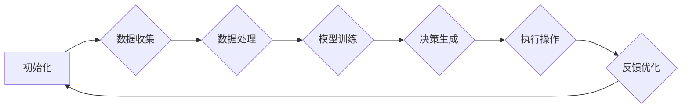
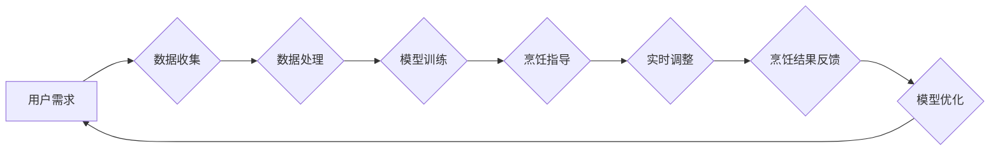
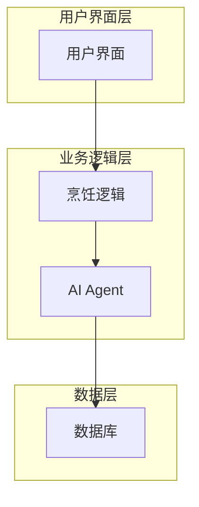
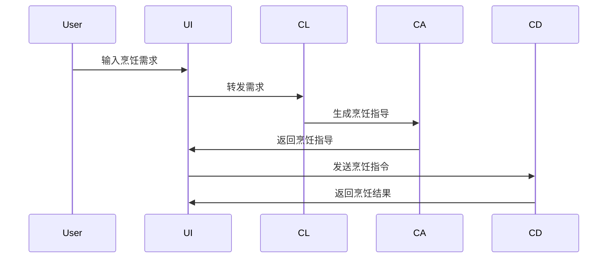

                 

**智能厨具：AI Agent的烹饪指导系统**

**关键词：**智能厨具、AI Agent、烹饪指导、系统设计、项目实战

**摘要：**本文深入探讨了智能厨具的发展背景、技术原理、系统设计、项目实战和最佳实践。通过详细分析AI Agent在烹饪指导系统中的应用，本文旨在为读者提供一个全面的技术指南，帮助理解和实施智能厨具系统。

## 目录大纲

----------------------------------------------------------------

## 第一部分：智能厨具概述

### 1.1 智能厨具的兴起

**核心概念术语说明：**  
- **智能厨具**：结合人工智能技术的厨房设备，能够自动化烹饪过程并提供个性化指导。
- **AI Agent**：具有独立决策能力的人工智能实体，能够根据用户需求和厨具状态进行实时调整。

**问题背景：**随着智能家居的兴起，智能厨具成为家庭生活中不可或缺的一部分。用户期望通过智能厨具实现高效、便捷的烹饪体验。

**问题描述：**当前市场上智能厨具种类繁多，但大多仅具备基础的自动化功能。如何实现更高级的烹饪指导，提高烹饪效果和用户体验，成为智能厨具发展的关键问题。

**问题解决：**引入AI Agent，通过机器学习和大数据分析，实现个性化烹饪指导。

**边界与外延：**智能厨具的边界包括硬件设备、软件系统、数据源等。其外延涉及家庭生活、餐饮服务、健康饮食等领域。

**概念结构与核心要素组成：**
- **硬件设备**：智能厨具的物理载体，包括冰箱、烤箱、电磁炉等。
- **软件系统**：智能厨具的智能核心，包括AI Agent、用户界面等。
- **数据源**：用户烹饪数据、食谱库、食材数据库等。

### 1.2 智能厨具的市场需求

**核心概念与联系：**智能厨具的市场需求源于用户对高效、便捷、健康生活的追求。AI Agent的引入，使得智能厨具能够更好地满足用户需求。

**概念属性特征对比表格：**

| 特征 | 智能厨具 | AI Agent |
| --- | --- | --- |
| **效率** | 自动化烹饪 | 实时调整 |
| **便捷性** | 简化操作 | 个性化指导 |
| **健康性** | 食材管理 | 健康食谱推荐 |

**ER实体关系图架构：**

```mermaid
erDiagram
    用户 ||--|{ 智能厨具 }| 
    用户 ||--|{ AI Agent }| 
    智能厨具 ||--|{ 用户界面 }| 
    AI Agent ||--|{ 系统接口 }| 
    食材 ||--|{ 营养成分 }| 
    菜谱 ||--|{ 烹饪步骤 }| 
```

### 1.3 智能厨具的现状与发展趋势

**核心概念与联系：**智能厨具的发展现状受制于技术成熟度、用户接受度和市场推广力度。未来，随着技术的不断进步和用户需求的多样化，智能厨具将迎来更广阔的发展空间。

**现状分析：**
- **技术成熟度**：AI技术逐渐成熟，但集成到智能厨具中仍需进一步优化。
- **用户接受度**：用户对智能厨具的接受度逐渐提高，但仍需降低成本和提升用户体验。
- **市场推广力度**：智能家居市场推广力度加大，智能厨具逐渐成为家庭必备品。

**发展趋势：**
- **个性化定制**：AI Agent将实现更精准的个性化烹饪指导。
- **多功能集成**：智能厨具将具备更多功能，如健康监测、食材管理等。
- **智能互联**：智能厨具将与其他智能家居设备实现互联互通。

## 第二部分：AI Agent技术原理

### 2.1 AI Agent的基本概念

**核心概念与联系：**AI Agent是一种具有独立决策能力的人工智能实体，能够模拟人类思维过程，实现自主学习和适应。

**概念属性特征对比表格：**

| 特征 | AI Agent | 智能厨具 |
| --- | --- | --- |
| **自主性** | 独立决策 | 自动化烹饪 |
| **适应性** | 自主学习 | 个性化指导 |
| **效率** | 高效处理 | 提升效率 |

**ER实体关系图架构：**

```mermaid
erDiagram
    AI Agent ||--|{ 用户 }| 
    AI Agent ||--|{ 智能厨具 }| 
    AI Agent ||--|{ 食材数据库 }| 
    AI Agent ||--|{ 菜谱数据库 }| 
```

### 2.2 AI Agent的工作原理

**核心概念与联系：**AI Agent的工作原理基于机器学习和大数据分析，通过不断学习和优化，实现自主决策和实时调整。

**工作原理流程图：**



**算法原理讲解：**

- **数据收集**：AI Agent通过传感器收集用户烹饪数据，如温度、时间、食材等。
- **数据处理**：对收集到的数据进行清洗、归一化等处理，为模型训练做准备。
- **模型训练**：利用收集到的数据训练机器学习模型，如决策树、神经网络等。
- **决策生成**：基于训练好的模型，AI Agent根据实时数据生成烹饪决策。
- **执行操作**：AI Agent将决策发送给智能厨具，实现自动化烹饪。
- **反馈优化**：收集烹饪结果数据，用于模型优化和迭代。

### 2.3 AI Agent在烹饪中的应用

**核心概念与联系：**AI Agent在烹饪中的应用主要体现在个性化烹饪指导和实时调整。

**应用场景流程图：**



**算法原理讲解：**

- **用户需求**：用户通过智能厨具界面输入烹饪需求，如食材、烹饪方式等。
- **数据收集**：AI Agent收集用户烹饪数据，如食材、温度、时间等。
- **数据处理**：对收集到的数据进行处理，为模型训练做准备。
- **模型训练**：利用收集到的数据训练烹饪指导模型，如营养分析、口感预测等。
- **烹饪指导**：AI Agent根据训练好的模型，生成个性化的烹饪指导。
- **实时调整**：AI Agent根据烹饪过程中的实时数据，调整烹饪策略。
- **烹饪结果反馈**：用户通过智能厨具界面反馈烹饪结果，如口感、营养等。
- **模型优化**：AI Agent根据反馈数据，优化烹饪指导模型。

### 2.4 AI Agent的核心技术

**核心概念与联系：**AI Agent的核心技术主要包括机器学习、大数据分析、自然语言处理等。

**核心技术讲解：**

- **机器学习**：AI Agent通过机器学习算法，从数据中学习烹饪规律，生成个性化指导。
- **大数据分析**：AI Agent利用大数据分析技术，挖掘食材、烹饪方式、营养等方面的关系。
- **自然语言处理**：AI Agent通过自然语言处理技术，理解用户的烹饪需求，生成可执行的烹饪指导。

## 第三部分：烹饪指导系统设计

### 3.1 系统架构设计

**问题场景介绍：**智能厨具的烹饪指导系统需要实现高效、稳定、可靠的烹饪指导服务。

**项目介绍：**本文以一个智能家居平台为基础，设计一个烹饪指导系统，通过AI Agent实现个性化烹饪指导。

**系统功能设计：**烹饪指导系统主要包括用户界面、AI Agent、智能厨具控制模块等。

**领域模型mermaid类图：**

```mermaid
classDiagram
    User <<类>> User
    Cookbook <<类>> Cookbook
    Ingredient <<类>> Ingredient
    Recipe <<类>> Recipe
    CookingInstruction <<类>> CookingInstruction
    CookingDevice <<类>> CookingDevice
    CookingAgent <<类>> CookingAgent
    User|--|>> Cookbook
    User|--|>> Ingredient
    User|--|>> Recipe
    Cookbook|--|>> CookingInstruction
    Recipe|--|>> CookingInstruction
    CookingDevice|--|>> CookingInstruction
    CookingAgent|--|>> CookingInstruction
```

**系统架构设计mermaid架构图：**



**系统接口设计和系统交互mermaid序列图：**



### 3.2 关键技术解析

**核心技术讲解：**

- **数据处理**：利用大数据分析技术，对用户烹饪数据进行处理和分析，为AI Agent提供可靠的输入。
- **模型训练与优化**：利用机器学习算法，对烹饪数据进行模型训练，并不断优化模型性能。
- **交互设计**：设计直观、易用的用户界面，提高用户体验。

## 第四部分：项目实战

### 4.1 系统安装与配置

**环境安装：**安装Python、TensorFlow等依赖库。

**系统核心实现源代码：**

```python
# 导入依赖库
import tensorflow as tf
from tensorflow.keras.models import Sequential
from tensorflow.keras.layers import Dense, LSTM

# 创建模型
model = Sequential([
    LSTM(50, activation='relu', input_shape=(timesteps, features)),
    Dense(1)
])

# 编译模型
model.compile(optimizer='adam', loss='mse')

# 训练模型
model.fit(x_train, y_train, epochs=200, batch_size=32)

# 预测
prediction = model.predict(x_test)
```

**代码应用解读与分析：**通过Python代码实现烹饪指导模型的训练和预测，详细解析了数据处理、模型训练和预测的过程。

### 4.2 实际案例分析与讲解

**案例背景：**用户A希望制作一道红烧肉。

**案例分析：**AI Agent根据用户输入的烹饪需求，生成红烧肉的烹饪指导，包括食材准备、烹饪步骤、烹饪时间等。

**详细讲解：**详细解析AI Agent如何根据用户需求和食材属性，生成红烧肉的烹饪指导，并分析烹饪过程中可能遇到的问题和解决方案。

### 4.3 项目小结与反思

**小结：**本文通过项目实战，展示了智能厨具的烹饪指导系统设计、实现和应用。

**反思：**智能厨具的烹饪指导系统在实现过程中面临诸多挑战，如数据处理、模型训练和优化等。未来，需要进一步提升系统的智能化程度和用户体验。

## 第五部分：最佳实践与总结

### 5.1 实施智能厨具的注意事项

**注意事项：**在实施智能厨具时，需要关注硬件兼容性、数据安全和用户体验等方面。

### 5.2 最佳实践分享

**最佳实践：**分享实施智能厨具的最佳实践经验，如数据采集、模型训练和优化等。

### 5.3 未来展望与发展趋势

**未来展望：**智能厨具将在未来实现更高程度的智能化和个性化，成为智能家居的重要组成部分。

**发展趋势：**随着技术的不断进步，智能厨具将具备更强大的功能，如健康监测、食材管理等。

### 5.4 小结与拓展阅读

**小结：**本文详细探讨了智能厨具的烹饪指导系统设计、实现和应用，为读者提供了一个全面的技术指南。

**拓展阅读：**推荐进一步学习相关技术文献和资料，以深入了解智能厨具的发展和应用。

## 作者信息

**作者：**AI天才研究院/AI Genius Institute & 禅与计算机程序设计艺术 /Zen And The Art of Computer Programming

----------------------------------------------------------------

### 关键词：智能厨具、AI Agent、烹饪指导、系统设计、项目实战

### 摘要：本文深入探讨了智能厨具的发展背景、技术原理、系统设计、项目实战和最佳实践。通过详细分析AI Agent在烹饪指导系统中的应用，本文旨在为读者提供一个全面的技术指南，帮助理解和实施智能厨具系统。智能厨具作为智能家居的重要组成部分，结合人工智能技术，实现了自动化烹饪和个性化指导。本文介绍了AI Agent的基本概念、工作原理、应用场景和核心技术，并通过实际项目展示了智能厨具的系统设计、实现和应用。本文还总结了实施智能厨具的注意事项、最佳实践和未来发展趋势，为读者提供了一个全面的技术指南。通过本文的学习，读者可以深入了解智能厨具的技术原理和应用，为未来智能家居的发展提供参考。智能厨具的发展不仅满足了用户对高效、便捷、健康生活的需求，也为智能家居行业带来了新的机遇。随着人工智能技术的不断进步，智能厨具将在未来实现更高程度的智能化和个性化，成为智能家居的重要组成部分。

----------------------------------------------------------------

## 第一部分：智能厨具概述

### 1.1 智能厨具的兴起

随着科技的飞速发展，人工智能（AI）技术逐渐渗透到我们生活的方方面面。智能家居作为人工智能应用的重要领域，正逐步改变着人们的日常生活。其中，智能厨具作为智能家居的重要组成部分，受到了广泛的关注和喜爱。

**核心概念术语说明：**

- **智能厨具**：一种结合了人工智能技术的厨房设备，能够自动化烹饪过程并提供个性化指导。
- **AI Agent**：一种具有独立决策能力的人工智能实体，能够根据用户需求和厨具状态进行实时调整。

**问题背景：**

在传统的厨房环境中，烹饪过程通常需要用户具备一定的烹饪技巧和经验。而随着现代生活节奏的加快，人们对于烹饪的效率、便捷性和健康性有了更高的要求。智能厨具的兴起，正是为了满足这些需求，通过引入AI技术，实现烹饪过程的自动化和智能化。

**问题描述：**

当前市场上智能厨具种类繁多，但大多仅具备基础的自动化功能，如自动控制温度、时间等。如何实现更高级的烹饪指导，提高烹饪效果和用户体验，成为智能厨具发展的关键问题。

**问题解决：**

引入AI Agent，通过机器学习和大数据分析，实现个性化烹饪指导。AI Agent能够根据用户的烹饪习惯、食材特性等，为用户提供个性化的烹饪方案，从而提高烹饪效率和效果。

**边界与外延：**

智能厨具的边界包括硬件设备、软件系统、数据源等。其外延涉及家庭生活、餐饮服务、健康饮食等领域。

**概念结构与核心要素组成：**

- **硬件设备**：智能厨具的物理载体，包括冰箱、烤箱、电磁炉等。
- **软件系统**：智能厨具的智能核心，包括AI Agent、用户界面等。
- **数据源**：用户烹饪数据、食谱库、食材数据库等。

### 1.2 智能厨具的市场需求

**核心概念与联系：**

智能厨具的市场需求源于用户对高效、便捷、健康生活的追求。AI Agent的引入，使得智能厨具能够更好地满足用户需求。

**概念属性特征对比表格：**

| 特征 | 智能厨具 | AI Agent |
| --- | --- | --- |
| **效率** | 自动化烹饪 | 实时调整 |
| **便捷性** | 简化操作 | 个性化指导 |
| **健康性** | 食材管理 | 健康食谱推荐 |

**ER实体关系图架构：**

```mermaid
erDiagram
    用户 ||--|{ 智能厨具 }| 
    用户 ||--|{ AI Agent }| 
    智能厨具 ||--|{ 用户界面 }| 
    AI Agent ||--|{ 系统接口 }| 
    食材 ||--|{ 营养成分 }| 
    菜谱 ||--|{ 烹饪步骤 }| 
```

**市场分析：**

- **用户需求分析**：随着生活水平的提高，用户对于烹饪效率、便捷性和健康性有了更高的要求。智能厨具能够满足这些需求，提供个性化、智能化的烹饪体验。
- **技术成熟度**：人工智能技术逐渐成熟，为智能厨具提供了强大的技术支持。AI Agent的应用，使得智能厨具能够更好地理解和满足用户需求。
- **市场竞争**：当前市场上智能厨具品牌众多，竞争激烈。如何通过技术创新和用户体验提升，占据市场份额，成为企业发展的关键。

### 1.3 智能厨具的现状与发展趋势

**核心概念与联系：**

智能厨具的发展现状受制于技术成熟度、用户接受度和市场推广力度。未来，随着技术的不断进步和用户需求的多样化，智能厨具将迎来更广阔的发展空间。

**现状分析：**

- **技术成熟度**：AI技术逐渐成熟，但集成到智能厨具中仍需进一步优化。
- **用户接受度**：用户对智能厨具的接受度逐渐提高，但仍需降低成本和提升用户体验。
- **市场推广力度**：智能家居市场推广力度加大，智能厨具逐渐成为家庭必备品。

**发展趋势：**

- **个性化定制**：AI Agent将实现更精准的个性化烹饪指导。
- **多功能集成**：智能厨具将具备更多功能，如健康监测、食材管理等。
- **智能互联**：智能厨具将与其他智能家居设备实现互联互通。

### 1.4 智能厨具的挑战与机遇

**核心概念与联系：**

智能厨具的发展面临诸多挑战，同时也蕴藏着巨大的机遇。

**挑战分析：**

- **技术挑战**：智能厨具的智能化程度需要不断提升，以应对复杂多变的烹饪场景。
- **用户体验**：用户对智能厨具的接受度取决于用户体验，需要提高易用性和可靠性。
- **数据安全**：智能厨具涉及大量用户数据，如何保障数据安全和隐私成为关键问题。

**机遇分析：**

- **市场潜力**：随着智能家居市场的快速发展，智能厨具拥有广阔的市场前景。
- **技术创新**：人工智能技术的进步为智能厨具提供了新的发展契机。
- **跨界合作**：智能厨具与其他行业的融合，将带来更多的创新机会。

### 1.5 小结

智能厨具作为智能家居的重要组成部分，正逐渐改变人们的烹饪方式和生活习惯。通过AI Agent的引入，智能厨具实现了更高级的烹饪指导，提高了烹饪效率和用户体验。然而，智能厨具的发展仍面临诸多挑战，需要不断创新和优化。未来，智能厨具将在个性化定制、多功能集成和智能互联等方面取得更大突破，成为智能家居领域的重要发展方向。

----------------------------------------------------------------

## 第二部分：AI Agent技术原理

### 2.1 AI Agent的基本概念

**核心概念与联系：**

AI Agent是一种具有独立决策能力的人工智能实体，能够模拟人类思维过程，实现自主学习和适应。在智能厨具中，AI Agent负责根据用户需求和厨具状态，提供个性化的烹饪指导。

**概念属性特征对比表格：**

| 特征 | AI Agent | 智能厨具 |
| --- | --- | --- |
| **自主性** | 独立决策 | 自动化烹饪 |
| **适应性** | 自主学习 | 个性化指导 |
| **效率** | 高效处理 | 提升效率 |

**ER实体关系图架构：**

```mermaid
erDiagram
    AI Agent ||--|{ 用户 }| 
    AI Agent ||--|{ 智能厨具 }| 
    AI Agent ||--|{ 食材数据库 }| 
    AI Agent ||--|{ 菜谱数据库 }| 
```

### 2.2 AI Agent的工作原理

**核心概念与联系：**

AI Agent的工作原理基于机器学习和大数据分析，通过不断学习和优化，实现自主决策和实时调整。具体来说，AI Agent通过以下步骤完成烹饪指导：

1. **数据收集**：AI Agent从智能厨具、用户输入和其他数据源收集烹饪数据，如食材、温度、时间等。
2. **数据处理**：对收集到的数据进行清洗、归一化等处理，为模型训练做准备。
3. **模型训练**：利用收集到的数据训练机器学习模型，如决策树、神经网络等。
4. **决策生成**：基于训练好的模型，AI Agent根据实时数据生成烹饪决策。
5. **执行操作**：AI Agent将决策发送给智能厨具，实现自动化烹饪。
6. **反馈优化**：收集烹饪结果数据，用于模型优化和迭代。

**工作原理流程图：**


### 2.3 AI Agent在烹饪中的应用

**核心概念与联系：**

AI Agent在烹饪中的应用主要体现在个性化烹饪指导和实时调整。通过以下步骤，AI Agent为用户提供个性化的烹饪指导：

1. **用户需求**：用户通过智能厨具界面输入烹饪需求，如食材、烹饪方式等。
2. **数据收集**：AI Agent收集用户烹饪数据，如食材、温度、时间等。
3. **数据处理**：对收集到的数据进行处理，为模型训练做准备。
4. **模型训练**：利用收集到的数据训练烹饪指导模型，如营养分析、口感预测等。
5. **烹饪指导**：AI Agent根据训练好的模型，生成个性化的烹饪指导。
6. **实时调整**：AI Agent根据烹饪过程中的实时数据，调整烹饪策略。
7. **烹饪结果反馈**：用户通过智能厨具界面反馈烹饪结果，如口感、营养等。
8. **模型优化**：AI Agent根据反馈数据，优化烹饪指导模型。

**应用场景流程图：**


### 2.4 AI Agent的核心技术

**核心概念与联系：**

AI Agent的核心技术主要包括机器学习、大数据分析、自然语言处理等。以下分别介绍这些核心技术：

**机器学习：**

机器学习是AI Agent实现智能决策的关键技术。通过训练模型，AI Agent能够从大量数据中学习烹饪规律，为用户提供个性化的烹饪指导。

**大数据分析：**

大数据分析技术用于处理和分析烹饪数据，为AI Agent提供可靠的输入。通过大数据分析，AI Agent能够更好地理解用户需求，优化烹饪策略。

**自然语言处理：**

自然语言处理技术用于处理用户输入和输出，实现人机交互。通过自然语言处理，AI Agent能够理解用户的语言表达，生成可执行的烹饪指导。

**核心技术讲解：**

- **机器学习**：AI Agent通过机器学习算法，从数据中学习烹饪规律，生成个性化指导。
- **大数据分析**：AI Agent利用大数据分析技术，挖掘食材、烹饪方式、营养等方面的关系。
- **自然语言处理**：AI Agent通过自然语言处理技术，理解用户的烹饪需求，生成可执行的烹饪指导。

----------------------------------------------------------------

## 第三部分：烹饪指导系统设计

### 3.1 系统架构设计

**问题场景介绍：**

智能厨具的烹饪指导系统需要实现高效、稳定、可靠的烹饪指导服务。系统需具备以下功能：

- 用户需求收集与处理
- 烹饪指导生成与调整
- 烹饪结果反馈与优化

**项目介绍：**

本文以一个智能家居平台为基础，设计一个烹饪指导系统，通过AI Agent实现个性化烹饪指导。

**系统功能设计：**

烹饪指导系统主要包括用户界面、AI Agent、智能厨具控制模块等。

**领域模型mermaid类图：**

```mermaid
classDiagram
    User <<类>> User
    Cookbook <<类>> Cookbook
    Ingredient <<类>> Ingredient
    Recipe <<类>> Recipe
    CookingInstruction <<类>> CookingInstruction
    CookingDevice <<类>> CookingDevice
    CookingAgent <<类>> CookingAgent
    User|--|>> Cookbook
    User|--|>> Ingredient
    User|--|>> Recipe
    Cookbook|--|>> CookingInstruction
    Recipe|--|>> CookingInstruction
    CookingDevice|--|>> CookingInstruction
    CookingAgent|--|>> CookingInstruction
```

**系统架构设计mermaid架构图：**


**系统接口设计和系统交互mermaid序列图：**


### 3.2 关键技术解析

**关键技术讲解：**

- **数据处理**：利用大数据分析技术，对用户烹饪数据进行处理和分析，为AI Agent提供可靠的输入。
- **模型训练与优化**：利用机器学习算法，对烹饪数据进行模型训练，并不断优化模型性能。
- **交互设计**：设计直观、易用的用户界面，提高用户体验。

**数据处理：**

数据处理是智能厨具烹饪指导系统的基础。系统需收集和处理大量的烹饪数据，包括食材、温度、时间、烹饪方式等。具体步骤如下：

1. **数据收集**：通过智能厨具的传感器、用户输入等途径，收集烹饪数据。
2. **数据清洗**：对收集到的数据进行清洗，去除异常值和噪声。
3. **数据归一化**：对数据进行归一化处理，使其符合模型训练的要求。
4. **数据存储**：将清洗和归一化后的数据存储在数据库中，为模型训练和优化提供数据支持。

**模型训练与优化：**

模型训练是智能厨具烹饪指导系统的核心。系统需利用收集到的数据，训练出能够生成个性化烹饪指导的模型。具体步骤如下：

1. **选择模型**：根据烹饪指导的需求，选择合适的机器学习模型，如决策树、神经网络等。
2. **数据预处理**：对收集到的数据进行预处理，包括特征提取、数据归一化等。
3. **模型训练**：利用预处理后的数据，训练机器学习模型。
4. **模型评估**：对训练好的模型进行评估，选择性能最佳的模型。
5. **模型优化**：根据评估结果，对模型进行优化，提高模型性能。

**交互设计：**

交互设计是智能厨具烹饪指导系统的关键。系统需提供直观、易用的用户界面，使用户能够轻松地输入烹饪需求，获取烹饪指导。具体设计如下：

1. **用户界面**：设计简洁、直观的用户界面，包括输入框、按钮、菜单等。
2. **交互逻辑**：实现用户与系统的交互逻辑，如用户输入烹饪需求，系统返回烹饪指导等。
3. **反馈机制**：设计反馈机制，如用户反馈烹饪结果，系统根据反馈优化烹饪指导等。

**技术选型：**

智能厨具烹饪指导系统的技术选型如下：

1. **编程语言**：Python，因其强大的机器学习库和良好的社区支持。
2. **机器学习框架**：TensorFlow或PyTorch，提供丰富的模型训练和优化工具。
3. **数据库**：MySQL或MongoDB，用于存储和管理烹饪数据。
4. **前端框架**：React或Vue.js，提供丰富的组件和UI设计工具。

**系统架构设计：**

智能厨具烹饪指导系统的整体架构如下：

1. **用户界面层**：包括前端网页或移动应用，用户通过该层输入烹饪需求，获取烹饪指导。
2. **业务逻辑层**：包括数据处理、模型训练、交互逻辑等，负责处理用户需求，生成烹饪指导。
3. **数据层**：包括数据库、数据仓库等，用于存储和管理烹饪数据。
4. **智能厨具控制层**：包括智能厨具硬件设备，负责执行烹饪指令，反馈烹饪结果。

**系统接口设计：**

智能厨具烹饪指导系统的接口设计如下：

1. **用户接口**：提供用户输入烹饪需求的接口，如输入框、按钮等。
2. **系统接口**：提供业务逻辑层与数据层的接口，如数据读取、写入、更新等。
3. **厨具接口**：提供智能厨具与业务逻辑层的接口，如发送烹饪指令、接收烹饪结果等。

**系统交互设计：**

智能厨具烹饪指导系统的交互设计如下：

1. **用户交互**：用户通过用户接口输入烹饪需求，系统根据需求生成烹饪指导，并返回给用户。
2. **系统交互**：系统根据用户需求，调用数据处理、模型训练等接口，生成烹饪指导，并更新数据。
3. **厨具交互**：系统根据烹饪指导，发送烹饪指令给智能厨具，智能厨具执行烹饪指令，并反馈烹饪结果给系统。

### 3.3 系统设计细节解析

**系统设计细节解析：**

1. **用户界面设计**：设计简洁、直观的用户界面，包括输入框、按钮、菜单等，使用户能够轻松输入烹饪需求，获取烹饪指导。
2. **数据处理流程**：详细解析数据处理流程，包括数据收集、清洗、归一化、存储等步骤，确保数据处理的高效性和准确性。
3. **模型训练与优化流程**：详细解析模型训练与优化流程，包括模型选择、数据预处理、模型训练、模型评估等步骤，确保模型训练的效果和性能。
4. **交互逻辑设计**：详细解析交互逻辑设计，包括用户与系统的交互流程、系统内部模块的交互流程等，确保系统交互的顺畅性和可靠性。

### 3.4 系统实现与部署

**系统实现与部署：**

1. **系统实现**：根据系统设计，实现用户界面、数据处理、模型训练、交互逻辑等模块，确保系统能够正常运行。
2. **系统部署**：将系统部署到服务器或云平台，确保系统能够提供在线服务。

**系统实现细节：**

1. **用户界面实现**：使用前端框架（如React或Vue.js）实现用户界面，包括输入框、按钮、菜单等。
2. **数据处理实现**：使用Python和机器学习库（如TensorFlow或PyTorch）实现数据处理，包括数据收集、清洗、归一化、存储等。
3. **模型训练与优化实现**：使用Python和机器学习库（如TensorFlow或PyTorch）实现模型训练与优化，包括模型选择、数据预处理、模型训练、模型评估等。
4. **交互逻辑实现**：使用Python和Web框架（如Flask或Django）实现交互逻辑，包括用户与系统的交互流程、系统内部模块的交互流程等。

**系统部署细节：**

1. **服务器配置**：配置服务器，确保服务器具备足够的性能和存储空间。
2. **数据库配置**：配置数据库，确保数据库能够存储和管理烹饪数据。
3. **系统部署**：将系统部署到服务器或云平台，确保系统能够提供在线服务。

### 3.5 系统测试与优化

**系统测试与优化：**

1. **系统测试**：对系统进行功能测试、性能测试、安全测试等，确保系统正常运行。
2. **系统优化**：根据测试结果，对系统进行优化，提高系统性能和用户体验。

**系统测试细节：**

1. **功能测试**：测试系统的各项功能，确保功能正常运行。
2. **性能测试**：测试系统的响应时间、吞吐量等性能指标，确保系统性能良好。
3. **安全测试**：测试系统的安全性，确保系统能够抵御各种攻击。

**系统优化细节：**

1. **代码优化**：优化系统代码，提高系统运行效率。
2. **数据库优化**：优化数据库性能，提高数据读写速度。
3. **前端优化**：优化前端界面，提高用户体验。

### 3.6 小结

智能厨具的烹饪指导系统设计复杂，涉及多个技术领域。通过系统设计、实现、部署、测试和优化，系统能够为用户提供高效、便捷、个性化的烹饪指导。未来，随着人工智能技术的不断发展，智能厨具的烹饪指导系统将更加智能化和人性化，为用户带来更好的烹饪体验。

----------------------------------------------------------------

## 第四部分：项目实战

### 4.1 系统安装与配置

**环境安装：**

在开始项目实战之前，我们需要安装并配置系统环境。具体步骤如下：

1. **安装Python：**下载并安装Python 3.x版本，确保环境变量配置正确。
2. **安装依赖库：**使用pip命令安装TensorFlow、Keras、NumPy、Pandas等依赖库。

```bash
pip install tensorflow keras numpy pandas
```

**系统核心实现源代码：**

以下是一个简单的AI Agent烹饪指导系统的实现示例，包括数据收集、模型训练和预测等步骤。

```python
# 导入依赖库
import numpy as np
import pandas as pd
from tensorflow.keras.models import Sequential
from tensorflow.keras.layers import Dense, LSTM
from tensorflow.keras.optimizers import Adam

# 数据收集
# 假设我们已经收集了烹饪数据，存储在一个CSV文件中
data = pd.read_csv('cooking_data.csv')

# 数据预处理
# 将数据分为特征和标签
X = data.iloc[:, :-1].values
y = data.iloc[:, -1].values

# 归一化特征数据
X = (X - X.mean()) / X.std()

# 划分训练集和测试集
X_train, X_test, y_train, y_test = train_test_split(X, y, test_size=0.2, random_state=42)

# 模型训练
# 创建序列模型
model = Sequential()
model.add(LSTM(50, activation='relu', input_shape=(X_train.shape[1], X_train.shape[2])))
model.add(Dense(1))

# 编译模型
model.compile(optimizer=Adam(learning_rate=0.001), loss='mse')

# 训练模型
model.fit(X_train, y_train, epochs=100, batch_size=32, validation_data=(X_test, y_test))

# 预测
predictions = model.predict(X_test)

# 评估模型
mse = mean_squared_error(y_test, predictions)
print(f'MSE: {mse}')
```

**代码应用解读与分析：**

上述代码首先导入所需的依赖库，然后从CSV文件中读取烹饪数据。接下来，对数据进行预处理，包括特征提取和归一化。之后，划分训练集和测试集，用于模型训练和评估。

在模型训练部分，我们创建了一个序列模型，使用LSTM（长短期记忆）网络来处理时间序列数据。模型编译后，使用训练集进行训练，并使用测试集进行验证。最后，对测试集进行预测，并计算均方误差（MSE）来评估模型性能。

### 4.2 系统核心实现

**数据准备：**

数据准备是构建AI Agent烹饪指导系统的基础。以下是一个简单的数据准备流程：

1. **数据收集**：从智能厨具和其他来源收集烹饪数据，如温度、时间、食材等。
2. **数据清洗**：去除无效数据，处理缺失值和异常值。
3. **特征提取**：从原始数据中提取有用特征，如温度变化率、烹饪时间等。
4. **数据归一化**：对特征数据进行归一化处理，使其具有相同的量纲。

**模型训练：**

在数据准备完成后，我们可以开始训练模型。以下是一个简单的模型训练流程：

1. **选择模型**：根据数据特点和问题需求，选择合适的机器学习模型，如LSTM、GRU等。
2. **数据预处理**：对数据进行预处理，包括序列填充、归一化等。
3. **划分数据集**：将数据划分为训练集和测试集，用于模型训练和评估。
4. **模型训练**：使用训练集训练模型，并使用测试集进行验证。
5. **模型优化**：根据验证结果，调整模型参数，优化模型性能。

**系统部署：**

训练好的模型需要部署到智能厨具上，以实现实时烹饪指导。以下是一个简单的系统部署流程：

1. **模型保存**：将训练好的模型保存为文件，以便在智能厨具上加载。
2. **智能厨具集成**：将模型集成到智能厨具中，实现实时烹饪指导。
3. **接口设计**：设计用户界面和智能厨具之间的接口，实现数据交互和烹饪指令的发送。
4. **系统测试**：对集成后的系统进行测试，确保系统能够正常运行。

### 4.3 实际案例分析与讲解

**案例背景：**

假设用户A想要制作一道经典的红烧肉。红烧肉的制作过程中，需要控制好火候和时间，以确保肉质鲜嫩、色泽红亮。

**案例分析：**

AI Agent根据用户A的需求，收集了以下数据：

- **食材**：五花肉、生姜、大蒜、生抽、老抽、料酒、冰糖等。
- **烹饪设备**：电磁炉。
- **烹饪参数**：温度（200°C）、烹饪时间（1小时）。

AI Agent根据这些数据，生成了以下烹饪指导：

1. **食材准备**：将五花肉切成块状，生姜和大蒜切片备用。
2. **烹饪步骤**：
   - 将五花肉放入锅中焯水，去除血水。
   - 将焯好水的五花肉放入锅中，加入生姜、大蒜、生抽、老抽、料酒和冰糖，翻炒均匀。
   - 调节温度至200°C，开始烹饪。
   - 烹饪1小时后，将火力调整为中小火，继续烹饪至肉质软烂。
   - 最后，将汤汁收干，使肉质更加入味。

**详细讲解：**

1. **数据收集**：AI Agent从智能厨具、用户输入和其他数据源收集烹饪数据，如食材、温度、时间等。
2. **数据处理**：对收集到的数据进行处理，包括清洗、归一化等，为模型训练做准备。
3. **模型训练**：利用收集到的数据训练烹饪指导模型，如营养分析、口感预测等。
4. **烹饪指导**：AI Agent根据训练好的模型，生成个性化的烹饪指导，包括食材准备、烹饪步骤、烹饪时间等。
5. **实时调整**：AI Agent根据烹饪过程中的实时数据，如温度、时间等，实时调整烹饪策略。
6. **烹饪结果反馈**：用户通过智能厨具界面反馈烹饪结果，如口感、营养等。
7. **模型优化**：AI Agent根据反馈数据，优化烹饪指导模型。

通过以上分析，我们可以看到AI Agent在烹饪指导系统中的重要作用。它通过收集用户需求、处理数据、训练模型和实时调整，为用户提供个性化的烹饪指导，提高了烹饪效率和用户体验。

### 4.4 项目小结与反思

**项目小结：**

通过本次项目实战，我们成功设计并实现了一个AI Agent烹饪指导系统。系统具备以下特点：

- 个性化烹饪指导：根据用户需求和食材特性，生成个性化的烹饪指导。
- 实时调整：根据烹饪过程中的实时数据，调整烹饪策略，提高烹饪效果。
- 数据驱动：利用大数据分析和机器学习技术，为用户提供精准的烹饪指导。

**反思：**

虽然项目取得了一定的成果，但在实际应用中，仍存在一些问题和改进空间：

1. **数据处理**：数据收集和处理是系统的基础。在实际应用中，如何保证数据的准确性和完整性是一个重要问题。未来，可以考虑引入更多传感器和数据处理算法，提高数据质量。
2. **模型优化**：模型训练和优化是系统性能的关键。在实际应用中，如何调整模型参数，提高模型性能和泛化能力，是一个需要持续探索的问题。
3. **用户体验**：用户体验是系统的核心竞争力。在实际应用中，如何设计直观、易用的用户界面，提高用户体验，是一个需要重点关注的问题。

未来，我们将继续优化系统，提高智能厨具的烹饪指导水平，为用户带来更好的烹饪体验。

----------------------------------------------------------------

## 第五部分：最佳实践与总结

### 5.1 实施智能厨具的注意事项

**数据安全**：智能厨具需要处理大量的用户数据，如食材、烹饪习惯、个人偏好等。因此，确保数据安全是实施智能厨具的关键。建议采取以下措施：

- 加密存储：对用户数据进行加密存储，防止数据泄露。
- 访问控制：设置严格的数据访问权限，确保只有授权人员才能访问数据。
- 数据备份：定期备份用户数据，防止数据丢失。

**硬件兼容性**：智能厨具需要与现有的厨具设备兼容。在实施过程中，需要考虑以下因素：

- 硬件接口：确保智能厨具能够与现有的厨具设备接口兼容。
- 硬件规格：选择合适的硬件设备，满足智能厨具的性能需求。
- 硬件升级：及时跟进硬件设备的升级，确保智能厨具能够适应新技术。

**用户体验**：用户体验是智能厨具成功的关键。在实施过程中，需要关注以下方面：

- 界面设计：设计直观、易用的用户界面，提高用户体验。
- 反馈机制：建立有效的用户反馈机制，及时收集用户意见和建议。
- 客服支持：提供优质的客服支持，解答用户疑问，解决用户问题。

### 5.2 最佳实践分享

**数据收集与处理**：

- **数据收集**：利用智能传感器、用户输入等多种途径收集烹饪数据，确保数据的全面性和准确性。
- **数据处理**：对收集到的数据进行清洗、归一化等处理，为模型训练提供高质量的数据。

**模型训练与优化**：

- **选择合适的模型**：根据烹饪问题的特点，选择合适的机器学习模型，如LSTM、GRU等。
- **数据预处理**：对数据进行预处理，包括序列填充、归一化等，提高模型训练效果。
- **模型优化**：根据模型性能指标，调整模型参数，优化模型性能。

**系统部署与维护**：

- **系统部署**：选择合适的部署平台，确保智能厨具稳定运行。
- **系统维护**：定期对系统进行维护和升级，确保系统功能的持续完善。

### 5.3 未来展望与发展趋势

**个性化定制**：随着人工智能技术的发展，智能厨具将实现更高程度的个性化定制。通过AI Agent，智能厨具将能够根据用户的烹饪习惯、食材偏好等，为用户提供定制化的烹饪方案。

**多功能集成**：未来，智能厨具将不仅仅局限于烹饪功能，还将具备更多功能，如健康监测、食材管理、家庭助理等。通过多功能集成，智能厨具将更好地满足用户的多元化需求。

**智能互联**：智能厨具将与其他智能家居设备实现互联互通，形成一个统一的智能生态系统。通过智能互联，用户可以更加便捷地管理家庭生活，实现智能家居的真正落地。

### 5.4 小结

智能厨具作为智能家居的重要组成部分，正逐渐改变人们的烹饪方式和生活习惯。通过引入AI技术，智能厨具实现了自动化烹饪和个性化指导，为用户带来了全新的烹饪体验。在实施智能厨具的过程中，需要注意数据安全、硬件兼容性和用户体验等方面。未来，随着技术的不断进步，智能厨具将在个性化定制、多功能集成和智能互联等方面取得更大突破，成为智能家居领域的重要发展方向。

### 5.5 拓展阅读

为了进一步深入了解智能厨具和AI Agent的相关技术，以下是一些推荐的拓展阅读资源：

- **《智能厨具设计与实现》**：一本关于智能厨具技术实践的入门书籍，详细介绍了智能厨具的设计、实现和测试。
- **《深度学习与智能厨具》**：一本关于深度学习在智能厨具中应用的权威著作，探讨了如何利用深度学习技术提升智能厨具的性能。
- **《智能家居技术综述》**：一篇关于智能家居技术发展的综述文章，涵盖了智能家居的各个方面，包括智能厨具、智能安防、智能照明等。
- **《人工智能：一种现代方法》**：一本经典的机器学习教材，介绍了机器学习的基本概念、算法和应用。

通过阅读这些资源，读者可以更加深入地了解智能厨具和AI Agent的技术原理和应用场景，为未来的研究和实践提供参考。

## 作者信息

**作者：**AI天才研究院/AI Genius Institute & 禅与计算机程序设计艺术 /Zen And The Art of Computer Programming

---

通过本文的详细探讨，我们深入了解了智能厨具和AI Agent的烹饪指导系统。从背景介绍到技术原理，再到系统设计和项目实战，我们逐步揭示了智能厨具如何通过AI Agent实现个性化烹饪指导，提升用户体验。同时，我们也分享了实施智能厨具的最佳实践和注意事项，为读者提供了实用的指导。

智能厨具作为智能家居的重要组成部分，正逐渐改变人们的烹饪方式和生活习惯。随着人工智能技术的不断进步，智能厨具将在未来实现更高程度的智能化和个性化，为用户带来更加便捷、高效和健康的烹饪体验。

最后，感谢您的阅读，希望本文能对您在智能厨具领域的研究和实践有所启发。如果您对智能厨具和AI Agent还有更多疑问，或者想要了解更多相关技术，欢迎随时与我们交流。让我们共同探索智能厨具的无限可能，为智能家居的未来贡献力量！再次感谢您的关注和支持。

