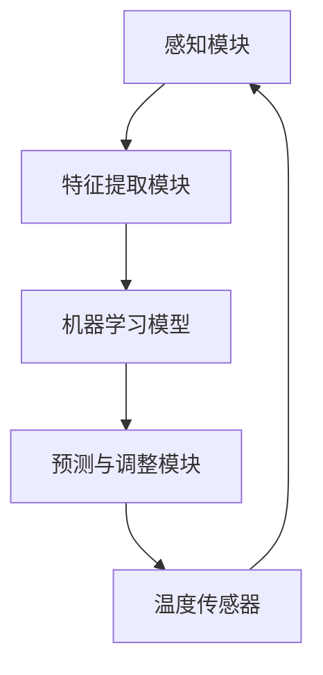

                 

# 智能厨具：AI Agent的烹饪温度控制

## 关键词

- 智能厨具
- AI Agent
- 烹饪温度控制
- 人工智能
- 烹饪技术
- 温度传感器
- 算法设计
- 系统架构
- 源代码分析

## 摘要

本文深入探讨了智能厨具与AI Agent的结合，特别是在烹饪温度控制领域的应用。文章首先介绍了智能厨具的发展背景和AI Agent的基础概念，然后详细阐述了AI Agent在烹饪温度控制中的重要性、传统控制的局限性以及AI算法的应用。接着，文章分析了智能厨具的系统架构和AI Agent的实现流程，并通过具体案例展示了AI Agent在实际烹饪中的应用。最后，文章对智能厨具的AI Agent未来发展方向进行了展望，并提供了对读者的建议和拓展阅读。

## 目录大纲

----------------------------------------------------------------

### 第一部分：智能厨具概述与AI Agent技术基础

#### 第1章：智能厨具的发展背景与市场前景

##### 1.1 智能厨具的定义与分类
##### 1.2 智能厨具的发展历程
##### 1.3 智能厨具的市场现状与未来趋势
##### 1.4 智能厨具的重要性与挑战

#### 第2章：AI Agent的基础概念与工作原理

##### 2.1 AI Agent的定义与特点
##### 2.2 AI Agent的核心组成部分
##### 2.3 AI Agent的基本工作原理
##### 2.4 AI Agent在智能厨具中的应用

#### 第3章：AI Agent的烹饪温度控制技术

##### 3.1 烹饪温度控制的重要性
##### 3.2 传统烹饪温度控制的局限性
##### 3.3 AI Agent在温度控制中的应用
##### 3.4 烹饪温度控制的AI算法原理

#### 第4章：智能厨具中的AI Agent设计与实现

##### 4.1 智能厨具的系统架构
##### 4.2 AI Agent在智能厨具中的实现流程
##### 4.3 AI Agent的核心算法设计
##### 4.4 AI Agent的调试与优化

#### 第5章：智能厨具的实际应用案例

##### 5.1 智能烤箱的温度控制案例
##### 5.2 智能炖锅的烹饪温度控制
##### 5.3 智能火锅的温度调节案例
##### 5.4 智能微波炉的温度控制

#### 第6章：智能厨具的AI Agent未来发展展望

##### 6.1 智能厨具的发展趋势
##### 6.2 AI Agent在智能厨具中的潜在应用
##### 6.3 智能厨具的AI Agent面临的挑战与解决方案
##### 6.4 AI Agent在智能厨具中的未来前景

#### 第7章：智能厨具：AI Agent的烹饪温度控制总结与展望

##### 7.1 本书的主要内容和贡献
##### 7.2 智能厨具与AI Agent的深度融合
##### 7.3 智能厨具的AI Agent未来发展方向
##### 7.4 对读者的建议与拓展阅读

----------------------------------------------------------------

### 第一部分：智能厨具概述与AI Agent技术基础

#### 第1章：智能厨具的发展背景与市场前景

##### 1.1 智能厨具的定义与分类

智能厨具，顾名思义，是指利用人工智能技术实现烹饪过程的智能化、自动化和优化的厨具。与传统厨具相比，智能厨具不仅能够根据用户的需求自动调整烹饪参数，如温度、时间和火力等，还能够通过数据分析和机器学习技术，提供个性化的烹饪建议和优化方案。

智能厨具可以根据功能和技术特点进行分类，主要分为以下几类：

1. **智能温度控制厨具**：如智能烤箱、智能炖锅等，主要依赖于温度传感器和AI算法来控制烹饪温度。
2. **智能烹饪程序厨具**：如智能炒锅、智能压力锅等，通过预设的烹饪程序和传感器数据来保证烹饪过程的准确性。
3. **智能食材识别厨具**：如智能切菜机、智能调料机等，通过图像识别技术来识别食材和调料，从而实现智能化的处理和搭配。
4. **智能健康管理厨具**：如智能电饭煲、智能豆浆机等，通过监控烹饪过程中的营养和健康指标，为用户提供健康饮食建议。

##### 1.2 智能厨具的发展历程

智能厨具的发展可以追溯到20世纪80年代，当时主要是以温度控制技术为基础的智能烤箱和智能压力锅。随着计算机技术和人工智能技术的发展，智能厨具的功能和性能得到了显著提升。以下是智能厨具发展的重要里程碑：

1. **1980年代**：智能烤箱和智能压力锅的出现，标志着智能厨具的初步探索。
2. **1990年代**：智能厨具开始引入微处理器控制技术，烹饪过程的精确度得到了提升。
3. **2000年代**：智能厨具开始集成传感器和数据采集技术，实现了对烹饪过程的实时监控和调整。
4. **2010年代至今**：人工智能技术的快速发展，使得智能厨具能够通过机器学习和数据挖掘技术，实现个性化烹饪和优化。

##### 1.3 智能厨具的市场现状与未来趋势

目前，智能厨具市场正处于快速增长阶段。随着人们生活水平的提高和对便捷、健康生活方式的追求，智能厨具的需求逐渐增加。根据市场调研数据显示，全球智能厨具市场规模预计将在未来几年内保持两位数的增长。

未来，智能厨具的发展趋势将主要集中在以下几个方面：

1. **智能化程度提高**：智能厨具将更加智能化和个性化，能够根据用户的烹饪习惯和食材特性进行自适应调整。
2. **多功能集成**：智能厨具将集成更多的功能，如食材识别、健康监测、营养分析等，实现全方位的智能烹饪体验。
3. **物联网融合**：智能厨具将与智能家居系统融合，实现设备的互联互通，提供更为便捷和智能的烹饪环境。
4. **人工智能深度应用**：人工智能技术将在智能厨具中发挥更为重要的作用，通过大数据分析和机器学习，实现烹饪过程的优化和提升。

##### 1.4 智能厨具的重要性与挑战

智能厨具的兴起，不仅改变了人们的烹饪方式，也为人工智能技术在日常生活中的应用提供了新的场景。智能厨具的重要性体现在以下几个方面：

1. **提高烹饪效率**：智能厨具能够自动调整烹饪参数，减少烹饪时间和人工操作，提高烹饪效率。
2. **提升烹饪质量**：通过温度、时间和火力的精确控制，智能厨具能够保证烹饪过程的稳定性和一致性，提升烹饪质量。
3. **降低烹饪风险**：智能厨具通过实时监测烹饪过程，可以及时调整烹饪参数，避免过度烹饪或烧焦等风险。
4. **个性化烹饪体验**：智能厨具能够根据用户需求和食材特性，提供个性化的烹饪建议和方案，满足不同人群的饮食需求。

然而，智能厨具的发展也面临一些挑战：

1. **技术门槛高**：智能厨具需要集成多种技术，包括传感器、控制芯片、人工智能算法等，技术门槛较高。
2. **用户体验问题**：智能厨具的界面设计、操作简便性等方面仍需优化，以提升用户体验。
3. **数据安全和隐私保护**：智能厨具需要收集和处理大量用户数据，如何保障数据安全和用户隐私成为重要问题。
4. **成本控制**：智能厨具的研发和制造成本较高，如何控制成本以适应大众市场成为关键问题。

总之，智能厨具的发展前景广阔，但也需要克服一系列技术和管理上的挑战。通过不断的技术创新和用户体验优化，智能厨具有望成为未来家庭厨房的标配。

### 第2章：AI Agent的基础概念与工作原理

##### 2.1 AI Agent的定义与特点

AI Agent，即人工智能代理，是指能够自主地感知环境、制定决策并采取行动的智能体。AI Agent是人工智能领域的一个重要研究方向，旨在实现机器的自主性和智能化。AI Agent具有以下特点：

1. **自主性**：AI Agent能够根据预设的目标和策略，自主地决定行动方案，而不需要人为干预。
2. **适应性**：AI Agent能够根据环境的变化，调整自身的策略和行为，以适应不同的场景和需求。
3. **交互性**：AI Agent能够与人类或其他智能体进行有效的交互，实现信息的传递和任务的协同。
4. **智能化**：AI Agent通过机器学习、数据挖掘和知识表示等技术，能够实现对复杂问题的分析和解决。

##### 2.2 AI Agent的核心组成部分

AI Agent的核心组成部分包括感知模块、决策模块和行动模块，这三个模块相互协作，实现AI Agent的智能行为。

1. **感知模块**：感知模块是AI Agent获取环境信息的渠道，通过传感器、摄像头等设备，实时收集环境数据。
2. **决策模块**：决策模块是AI Agent的核心，负责分析感知模块收集到的信息，根据预设的目标和策略，选择最优的行动方案。
3. **行动模块**：行动模块负责执行决策模块生成的行动方案，通过控制器、执行器等设备，实现对环境的操作。

##### 2.3 AI Agent的基本工作原理

AI Agent的基本工作原理可以概括为感知-决策-行动的循环。具体流程如下：

1. **感知**：AI Agent通过感知模块收集环境信息，如温度、湿度、声音等。
2. **决策**：感知模块将收集到的信息传输给决策模块，决策模块根据预设的目标和策略，分析信息并生成行动方案。
3. **行动**：决策模块将生成的行动方案传输给行动模块，行动模块根据方案执行具体的操作，如调整温度、控制火力等。

##### 2.4 AI Agent在智能厨具中的应用

AI Agent在智能厨具中的应用，主要表现在以下几个方面：

1. **温度控制**：AI Agent通过感知模块实时监测烹饪过程中的温度变化，根据预设的目标温度，自动调整火力，实现精确的温度控制。
2. **烹饪程序**：AI Agent可以根据食材和烹饪需求，自动生成适合的烹饪程序，如温度、时间和火力调整，提高烹饪效率和质量。
3. **交互式烹饪**：AI Agent通过与用户的交互，了解用户的烹饪需求和偏好，提供个性化的烹饪建议和方案。
4. **智能优化**：AI Agent通过对烹饪过程的数据分析，不断优化烹饪参数，实现烹饪过程的自动化和智能化。

通过AI Agent的应用，智能厨具不仅能够实现传统厨具无法实现的智能化功能，还能够根据用户需求和环境变化，提供个性化、高效和安全的烹饪体验。

### 第3章：AI Agent的烹饪温度控制技术

##### 3.1 烹饪温度控制的重要性

烹饪温度控制是智能厨具实现智能化和高效烹饪的关键技术。准确的温度控制不仅能够保证食物的口感和营养，还能够提高烹饪效率和安全性。烹饪温度控制的重要性体现在以下几个方面：

1. **保证食物品质**：不同的食物需要不同的烹饪温度，过高的温度可能导致食物烧焦或过度烹饪，而过低的温度则可能导致食物生熟不均。准确的温度控制能够确保食物达到最佳烹饪状态，保持其原有的口感和营养。
2. **提高烹饪效率**：智能温度控制能够自动调整烹饪过程中的温度，减少人为操作的复杂性和时间，提高烹饪效率。通过优化烹饪参数，智能厨具能够在短时间内完成高质量的烹饪任务。
3. **提升安全性**：精确的温度控制可以避免食物过度烹饪或烧焦，减少火灾等安全事故的风险。智能厨具通过实时监测和自动调整温度，能够在烹饪过程中保持安全稳定的操作环境。
4. **提供个性化体验**：智能温度控制可以根据用户需求和食材特性，提供个性化的烹饪方案，满足不同用户和不同食物的烹饪需求。

##### 3.2 传统烹饪温度控制的局限性

尽管传统烹饪温度控制技术已经在厨具中广泛应用，但其仍然存在一些局限性，无法满足现代人对智能、高效和个性化的烹饪需求。以下是传统烹饪温度控制的主要局限性：

1. **手动调节**：传统厨具的温度控制主要依赖于人工调节，烹饪过程中需要频繁手动调整温度，操作繁琐，且难以实现精准控制。
2. **固定温度**：传统厨具通常只能设置一个固定的烹饪温度，无法根据烹饪过程中食材的变化和用户需求进行动态调整。
3. **反应速度慢**：传统厨具的温度控制反应速度较慢，无法及时响应烹饪过程中的温度变化，可能导致食物烧焦或生熟不均。
4. **局限性大**：传统厨具的温度控制主要针对单一食物或烹饪方式，无法实现多样化的烹饪需求，难以满足个性化烹饪体验。

##### 3.3 AI Agent在温度控制中的应用

AI Agent在烹饪温度控制中的应用，有效地克服了传统控制的局限性，实现了智能化、动态化和个性化的温度控制。以下是AI Agent在温度控制中的具体应用：

1. **实时监测**：AI Agent通过感知模块实时监测烹饪过程中的温度变化，及时获取温度数据，为决策模块提供准确的信息支持。
2. **自适应调整**：AI Agent根据预设的目标温度和实际温度差异，自动调整火力，实现动态的温度控制，确保食物在最佳烹饪温度下烹饪。
3. **个性化定制**：AI Agent可以根据食材特性和用户需求，生成个性化的烹饪方案，提供适合的烹饪温度和时间，满足不同用户和不同食物的烹饪需求。
4. **优化控制策略**：AI Agent通过机器学习技术，分析大量烹饪数据，不断优化控制策略，提高烹饪效率和品质。

通过AI Agent的应用，智能厨具能够实现高效、安全和个性化的温度控制，为用户带来全新的烹饪体验。

##### 3.4 烹饪温度控制的AI算法原理

烹饪温度控制的核心在于AI算法的设计与实现，通过算法实现对温度变化的实时监测和动态调整。以下是烹饪温度控制的AI算法原理：

1. **数据采集**：AI Agent通过温度传感器采集烹饪过程中的温度数据，确保数据的实时性和准确性。
2. **特征提取**：对采集到的温度数据进行特征提取，提取出温度变化的关键特征，如温度峰值、温度波动等。
3. **模型训练**：利用机器学习算法，对提取的温度特征进行训练，构建温度控制模型，模型用于预测温度变化趋势和生成控制策略。
4. **实时预测**：实时监测烹饪过程中的温度变化，利用训练好的模型进行预测，预测温度变化趋势和目标温度。
5. **动态调整**：根据预测结果，自动调整火力，实现动态的温度控制。通过多次迭代和优化，不断提升温度控制的精度和效率。

具体而言，AI算法在烹饪温度控制中的应用流程如下：

1. **初始化**：设定目标温度和初始火力。
2. **感知数据**：采集当前温度数据。
3. **特征提取**：提取温度变化特征。
4. **模型预测**：利用训练好的模型预测温度变化趋势。
5. **决策调整**：根据预测结果调整火力，确保温度接近目标温度。
6. **反馈调整**：将实际温度与目标温度进行比较，进行进一步调整，确保温度稳定在目标范围内。

通过上述算法原理，AI Agent能够实现高效、精准的烹饪温度控制，为用户带来高质量和个性化的烹饪体验。

### 第4章：智能厨具中的AI Agent设计与实现

##### 4.1 智能厨具的系统架构

智能厨具的系统架构是实现AI Agent烹饪温度控制的核心，包括硬件、软件和通信三个主要部分。以下是智能厨具的系统架构：

1. **硬件部分**：智能厨具的硬件包括温度传感器、微处理器、执行器（如加热元件、风扇等）以及用户交互界面（如触摸屏、语音识别模块等）。
2. **软件部分**：智能厨具的软件部分包括操作系统、AI算法、控制程序以及用户界面。AI算法是核心，负责温度的实时监测和调整；控制程序则负责执行具体的操作指令。
3. **通信部分**：智能厨具通过Wi-Fi、蓝牙等无线通信技术，与用户的移动设备、智能家居系统等进行数据交互，实现远程控制和数据共享。

##### 4.2 AI Agent在智能厨具中的实现流程

AI Agent在智能厨具中的实现流程主要包括感知、决策和执行三个步骤：

1. **感知**：AI Agent通过温度传感器实时监测烹饪过程中的温度变化，将温度数据传输到微处理器。
2. **决策**：微处理器上的AI算法根据当前温度数据和历史数据，分析温度变化趋势，生成控制策略，决定是否需要调整火力。
3. **执行**：根据决策模块生成的控制策略，执行器（如加热元件、风扇等）调整烹饪温度，确保温度稳定在目标范围内。

##### 4.3 AI Agent的核心算法设计

AI Agent的核心算法设计是智能厨具温度控制的关键，以下是核心算法的详细设计：

1. **感知模块**：感知模块负责实时采集温度数据，数据采集频率设置为每秒一次，以确保数据的实时性和准确性。
2. **特征提取**：特征提取模块将采集到的温度数据转换为特征向量，如温度峰值、温度波动范围等，用于训练和预测。
3. **机器学习模型**：使用机器学习算法（如决策树、支持向量机、神经网络等）对特征向量进行训练，建立温度变化预测模型。
4. **预测与调整**：根据预测模型，实时预测温度变化，并根据预测结果调整加热元件的功率，确保温度稳定在目标范围内。

以下是AI Agent核心算法的流程图：

##### 4.4 AI Agent的调试与优化

AI Agent的调试与优化是确保智能厨具稳定运行和高效控制的重要环节，以下是调试与优化的一般步骤：

1. **测试环境搭建**：搭建与实际使用环境相似的测试平台，确保测试数据的真实性和可靠性。
2. **数据采集与处理**：在测试平台上采集大量温度数据，并对数据进行预处理，如去噪、归一化等。
3. **算法训练与验证**：使用预处理后的数据对AI算法进行训练，并通过交叉验证等方法验证模型的准确性。
4. **实时监测与调整**：在测试平台上运行AI Agent，实时监测烹饪过程中的温度变化，并根据实际效果对算法参数进行调整。
5. **优化与迭代**：根据调整后的效果，对AI算法进行优化，并通过多次迭代逐步提升模型的稳定性和准确性。

通过上述步骤，AI Agent能够在实际使用中实现高效、稳定的温度控制，为用户带来优质的烹饪体验。

### 第5章：智能厨具的实际应用案例

#### 5.1 智能烤箱的温度控制案例

智能烤箱是智能厨具中应用AI Agent进行温度控制的一个典型例子。以下是智能烤箱的温度控制案例：

**案例背景**：某用户希望制作一款烤鸡肉，要求烤制温度为180°C，时间为30分钟。

**步骤**：

1. **初始化**：用户通过智能烤箱的触摸屏界面输入烤制温度和时间。
2. **感知**：智能烤箱中的温度传感器开始工作，实时监测烤箱内部的温度。
3. **决策**：AI Agent根据当前温度和目标温度，计算需要调整的火力大小。
4. **执行**：智能烤箱的加热元件根据AI Agent的决策，调整火力，使烤箱内部温度保持在180°C。
5. **监控**：AI Agent持续监测烤箱内部温度，确保温度稳定在目标范围内。
6. **结束**：烤制时间达到30分钟，AI Agent提示用户烤制完成。

**效果**：通过AI Agent的精确控制，烤鸡肉的口感和营养得到了保障，用户无需手动调整温度，烹饪过程更加便捷和高效。

#### 5.2 智能炖锅的烹饪温度控制

智能炖锅是另一种常见的智能厨具，通过AI Agent实现烹饪温度的智能化控制。以下是智能炖锅的烹饪温度控制案例：

**案例背景**：某用户需要炖制一锅牛肉汤，要求温度保持在90°C，炖煮时间为2小时。

**步骤**：

1. **初始化**：用户通过智能炖锅的触摸屏界面输入炖煮温度和时间。
2. **感知**：智能炖锅中的温度传感器开始工作，实时监测锅内温度。
3. **决策**：AI Agent根据当前温度和目标温度，调整火力，确保锅内温度稳定在90°C。
4. **执行**：炖锅内加热元件根据AI Agent的决策，调整加热功率。
5. **监控**：AI Agent持续监测锅内温度，确保温度波动在允许范围内。
6. **结束**：炖煮时间达到2小时，AI Agent提示用户炖煮完成。

**效果**：通过AI Agent的智能控制，牛肉汤炖煮过程稳定，口感和营养得到了显著提升，用户无需担心炖煮过度或不足的问题。

#### 5.3 智能火锅的温度调节案例

智能火锅是现代智能厨具中的一种创新产品，通过AI Agent实现温度调节，为用户带来更加舒适和方便的火锅体验。以下是智能火锅的温度调节案例：

**案例背景**：某用户在聚餐时使用智能火锅，需要保持锅内的温度在100°C左右，以满足不同食材的烹饪需求。

**步骤**：

1. **初始化**：用户通过智能火锅的触摸屏界面选择适合的火锅模式，如微火、中火或大火。
2. **感知**：智能火锅中的温度传感器开始工作，实时监测锅内温度。
3. **决策**：AI Agent根据用户的设置和锅内温度变化，自动调整加热功率。
4. **执行**：火锅加热器根据AI Agent的决策，调整火力，确保锅内温度保持在目标范围内。
5. **监控**：AI Agent持续监测锅内温度，并根据食材的变化动态调整温度。
6. **结束**：聚餐结束后，用户关闭火锅加热器，AI Agent提示用户火锅模式结束。

**效果**：通过AI Agent的智能调节，智能火锅能够根据不同的食材和烹饪需求，提供稳定的温度环境，用户无需担心火锅温度过高或过低，享受轻松便捷的火锅时光。

#### 5.4 智能微波炉的温度控制

智能微波炉是现代家庭厨房中常见的智能厨具，通过AI Agent实现温度控制，为用户带来更加便捷和高效的烹饪体验。以下是智能微波炉的温度控制案例：

**案例背景**：某用户希望使用智能微波炉加热一碗面条，要求加热温度为80°C，时间为2分钟。

**步骤**：

1. **初始化**：用户通过智能微波炉的触摸屏界面输入加热温度和时间。
2. **感知**：智能微波炉中的温度传感器开始工作，实时监测碗内面条的温度。
3. **决策**：AI Agent根据当前温度和目标温度，计算需要调整的微波功率。
4. **执行**：微波炉根据AI Agent的决策，调整微波功率，加热碗内面条。
5. **监控**：AI Agent持续监测面条的温度，确保温度达到目标温度。
6. **结束**：加热时间达到2分钟，AI Agent提示用户加热完成。

**效果**：通过AI Agent的精确控制，面条加热过程稳定且迅速，用户无需手动调整微波功率，烹饪过程更加便捷和高效。

### 第6章：智能厨具的AI Agent未来发展展望

#### 6.1 智能厨具的发展趋势

智能厨具作为人工智能技术在家庭厨房中的重要应用，其未来发展趋势主要体现在以下几个方面：

1. **智能化程度提高**：随着人工智能技术的不断进步，智能厨具的智能化程度将进一步提高，能够更加精准地感知烹饪过程中的各种参数，实现自动化和个性化的烹饪体验。
2. **多功能集成**：智能厨具将集成更多的功能，如食材识别、营养分析、健康监测等，提供全方位的智能烹饪解决方案，满足不同用户和不同饮食需求。
3. **物联网融合**：智能厨具将更加紧密地融合到物联网生态中，实现与智能家居系统的无缝连接，提供智能化的烹饪和生活体验。
4. **数据驱动**：智能厨具将利用大数据和机器学习技术，对用户行为和烹饪数据进行深度分析，实现烹饪过程的不断优化和改进。

#### 6.2 AI Agent在智能厨具中的潜在应用

AI Agent在智能厨具中的应用潜力巨大，未来将在以下几个方面发挥重要作用：

1. **个性化烹饪**：AI Agent可以通过学习用户的烹饪习惯和偏好，提供个性化的烹饪建议和方案，满足用户的多样化需求。
2. **智能食谱推荐**：AI Agent可以根据食材库存、用户口味和营养需求，推荐适合的食谱和烹饪方法，提升烹饪体验。
3. **健康饮食管理**：AI Agent可以监控烹饪过程中的营养和健康指标，为用户提供饮食建议，帮助用户实现健康饮食。
4. **安全监测**：AI Agent可以实时监测烹饪过程中的各种参数，防止过热、过烧等安全隐患，提高烹饪的安全性。

#### 6.3 智能厨具的AI Agent面临的挑战与解决方案

尽管AI Agent在智能厨具中具有广阔的应用前景，但其在实际应用中也面临一系列挑战：

1. **技术门槛高**：智能厨具需要集成多种先进技术，如传感器、控制芯片、机器学习算法等，技术门槛较高，研发和制造成本较高。
2. **用户体验问题**：智能厨具的用户界面和交互设计需要进一步优化，以提高用户的操作便利性和满意度。
3. **数据安全和隐私保护**：智能厨具需要收集和处理大量用户数据，如何保障数据安全和用户隐私是重要问题。
4. **成本控制**：智能厨具的研发和制造成本较高，如何控制成本以适应大众市场是关键问题。

针对上述挑战，以下是一些可能的解决方案：

1. **技术创新**：通过不断的技术创新，降低智能厨具的技术门槛和制造成本，提高产品的市场竞争力。
2. **用户体验优化**：加强对用户体验的研究，优化用户界面和交互设计，提高用户的操作便利性和满意度。
3. **数据安全与隐私保护**：建立健全的数据安全与隐私保护机制，采取加密、匿名化等技术手段，确保用户数据的安全和隐私。
4. **成本控制策略**：通过规模化生产、供应链优化等手段，降低智能厨具的制造成本，提高市场普及度。

#### 6.4 AI Agent在智能厨具中的未来前景

随着人工智能技术的不断发展，AI Agent在智能厨具中的应用前景将更加广阔。未来，AI Agent有望实现以下发展方向：

1. **智能化烹饪体验**：AI Agent将进一步提升智能厨具的智能化程度，提供更加个性化、高效和便捷的烹饪体验。
2. **全方位健康饮食管理**：AI Agent将整合更多健康饮食功能，为用户提供全方位的健康饮食管理服务，帮助用户实现健康饮食目标。
3. **智能家居生态融合**：AI Agent将更加紧密地融合到智能家居生态中，实现家庭设备的互联互通，提供智能化、一体化的家庭生活体验。
4. **创新应用场景**：AI Agent将在智能厨具中开拓更多创新应用场景，如自动化食材处理、智能烹饪教学等，为用户带来全新的烹饪和生活体验。

总之，AI Agent在智能厨具中的应用将不断拓展和深化，为家庭厨房带来更多的智能化和便捷化，助力人们实现更美好的生活。

### 第7章：智能厨具：AI Agent的烹饪温度控制总结与展望

#### 7.1 本书的主要内容和贡献

本书系统地介绍了智能厨具与AI Agent的烹饪温度控制技术，从智能厨具的发展背景、AI Agent的基础概念、温度控制技术、系统架构设计到实际应用案例，全面剖析了智能厨具在AI Agent辅助下的烹饪温度控制机制。通过详细阐述AI Agent在智能厨具中的应用，本书为读者提供了一个清晰、全面的技术框架，有助于理解和掌握智能厨具的发展趋势和关键技术。

本书的主要贡献在于：

1. **全面性**：系统性地整理和阐述了智能厨具与AI Agent的烹饪温度控制技术，为读者提供了全面的理论基础和实践指导。
2. **实用性**：通过实际应用案例，展示了AI Agent在智能厨具中的具体应用，帮助读者更好地理解AI Agent的技术原理和实践效果。
3. **前瞻性**：探讨了智能厨具与AI Agent的未来发展趋势，为智能厨具的研发和应用提供了新的思路和方向。

#### 7.2 智能厨具与AI Agent的深度融合

智能厨具与AI Agent的深度融合，是未来智能家庭厨房的核心发展方向。通过AI Agent，智能厨具不仅能够实现烹饪过程的智能化和自动化，还能够根据用户需求和食材特性提供个性化的烹饪建议和优化方案。以下是智能厨具与AI Agent深度融合的几个关键方向：

1. **智能化烹饪流程**：AI Agent将全程参与烹饪过程，从食材准备、烹饪参数调整到烹饪效果评估，实现全流程的智能化管理。
2. **个性化烹饪体验**：AI Agent根据用户的饮食习惯、营养需求和烹饪偏好，提供个性化的烹饪方案，满足用户的多样化需求。
3. **健康饮食管理**：AI Agent结合健康饮食理念，实时监控烹饪过程中的营养指标，为用户提供科学的饮食建议，帮助用户实现健康饮食目标。
4. **互联互通**：AI Agent将智能厨具与其他智能家居设备互联互通，构建智能家庭生态，为用户提供一体化的生活体验。

#### 7.3 智能厨具的AI Agent未来发展方向

智能厨具的AI Agent未来发展方向将主要集中在以下几个方面：

1. **算法优化**：通过不断优化AI算法，提高AI Agent的预测准确性和控制精度，实现更高效、更精准的烹饪温度控制。
2. **多功能集成**：集成更多功能模块，如食材识别、营养分析、健康监测等，提供更全面的智能烹饪解决方案。
3. **人机交互**：优化人机交互界面，提高用户操作便利性和满意度，实现更自然的用户交互体验。
4. **数据安全和隐私保护**：加强数据安全和隐私保护机制，确保用户数据的安全和隐私。
5. **成本控制**：通过技术创新和规模化生产，降低智能厨具的制造成本，提高市场普及度。

#### 7.4 对读者的建议与拓展阅读

对于读者，本书提供了一个系统、全面的技术框架和实践案例，有助于深入了解智能厨具与AI Agent的烹饪温度控制技术。以下是几条建议：

1. **理论学习**：结合本书内容，深入研究人工智能、机器学习等相关理论知识，为实践打下坚实基础。
2. **动手实践**：尝试使用AI Agent和智能厨具进行实际操作，通过动手实践加深对技术原理的理解。
3. **拓展研究**：关注智能厨具和AI Agent的最新研究进展，拓展阅读相关学术论文和技术报告，保持技术视野的更新。

拓展阅读方面，读者可以参考以下资源：

1. 《智能厨具设计与实现》：介绍了智能厨具的设计原理和实践方法，有助于深入了解智能厨具的技术细节。
2. 《人工智能基础教程》：涵盖了人工智能的基本理论和算法，为读者提供了丰富的理论知识基础。
3. 《智能家居系统设计与实现》：探讨了智能家居系统的架构和实现方法，有助于理解智能厨具在智能家居生态中的角色。

通过以上学习和拓展，读者可以更好地掌握智能厨具与AI Agent的技术原理和实践方法，为未来的研究和工作奠定坚实基础。作者：AI天才研究院/AI Genius Institute & 禅与计算机程序设计艺术 /Zen And The Art of Computer Programming

