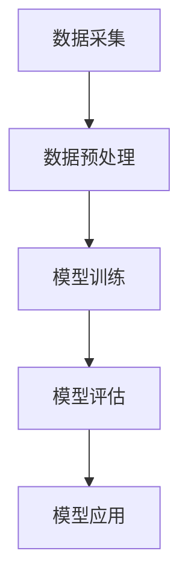
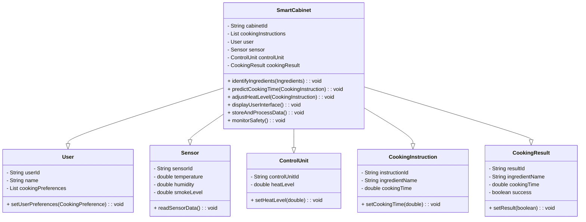
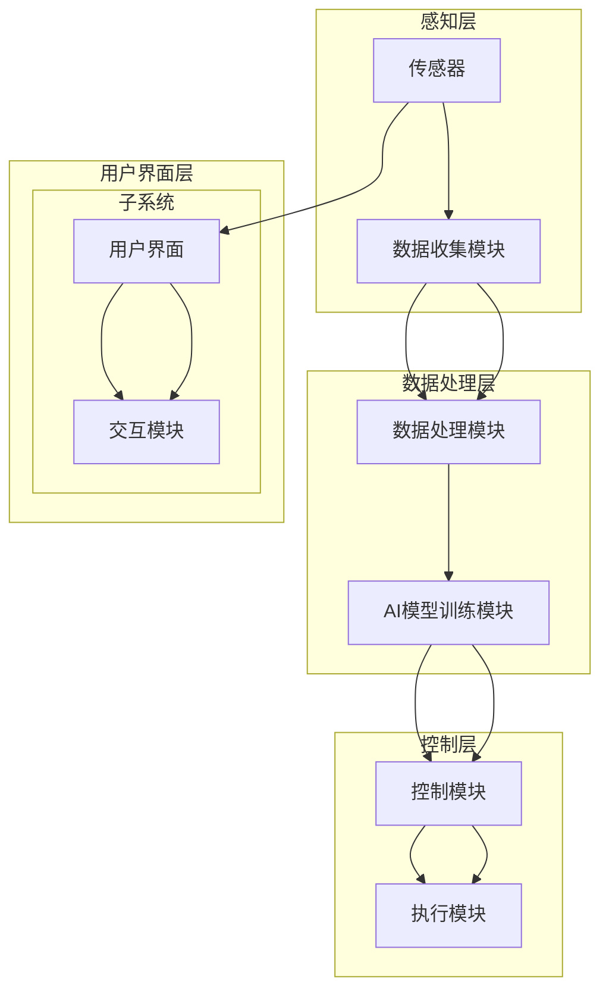
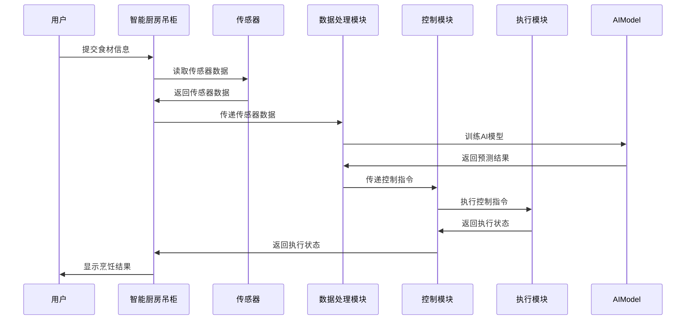

                 


### 第1章：问题背景

#### 1.1 问题背景

厨房，作为家庭的中心之一，承载着烹饪美食的重要任务。然而，在现实生活场景中，厨房的效率问题一直是用户们关注的焦点。无论是烹饪时间过长，还是操作复杂，都影响了家庭烹饪的体验。在这样的背景下，智能厨房吊柜的概念应运而生。

智能厨房吊柜，作为一种新型厨房电器，它通过引入人工智能（AI）技术，旨在提高厨房操作效率，简化烹饪过程。它不仅可以自动完成一些繁杂的烹饪任务，还能够根据用户的习惯和需求，提供个性化的服务建议。

当前，随着智能家居市场的蓬勃发展，智能厨房吊柜正逐渐成为家庭厨房的重要组成部分。然而，如何更好地发挥智能厨房吊柜的潜力，提升家庭烹饪的效率，仍然是一个值得深入探讨的问题。

#### 1.2 问题描述

问题描述可以具体化为以下几个方面：

1. **烹饪效率低下**：传统的厨房操作往往需要手动完成一系列复杂的步骤，如准备食材、调控火候等。这不仅耗时，还容易出错。智能厨房吊柜能否通过自动化技术，提高烹饪效率？

2. **用户体验不佳**：虽然智能厨房吊柜具有自动化和智能化的特点，但实际使用中，许多用户对其操作方法不熟悉，导致体验不佳。智能厨房吊柜能否提供更直观、易操作的用户界面？

3. **个性化服务不足**：不同用户在烹饪需求上存在差异，但传统智能厨房吊柜往往缺乏个性化服务能力。智能厨房吊柜能否根据用户数据，提供定制化的烹饪建议和服务？

4. **安全性问题**：厨房是一个容易发生意外的地方，智能厨房吊柜在安全防护方面是否存在漏洞？

这些问题不仅反映了当前智能厨房吊柜的不足，也为我们的研究提供了方向。

#### 1.3 问题解决

针对上述问题，我们可以从以下几个方面进行解决：

1. **提高烹饪效率**：通过引入AI技术，智能厨房吊柜可以自动识别食材，计算烹饪时间，并根据实时数据调整火候，从而提高烹饪效率。

2. **优化用户体验**：设计更加直观、易操作的界面，如触摸屏、语音控制等，让用户更轻松地操作智能厨房吊柜。

3. **实现个性化服务**：通过收集用户数据，智能厨房吊柜可以分析用户的烹饪习惯和偏好，提供个性化的烹饪建议和服务。

4. **加强安全防护**：智能厨房吊柜可以配备多种安全传感器，实时监测厨房环境，一旦发现异常，及时报警，确保用户的安全。

通过这些措施，我们可以显著提升智能厨房吊柜的性能和用户体验，为家庭烹饪带来更多便利。

#### 1.4 边界与外延

边界与外延部分需要明确智能厨房吊柜的应用范围和适用条件。智能厨房吊柜主要应用于家庭厨房，特别是那些追求高效、便捷烹饪的用户。同时，它也可以应用于一些商用厨房，如餐馆、食堂等。

此外，智能厨房吊柜的适用条件包括：

1. **电力供应**：智能厨房吊柜需要稳定的电力供应，因此需安装在具备电力供应的厨房环境中。

2. **网络连接**：智能厨房吊柜需要连接互联网，以便获取用户数据、更新软件等。

3. **用户需求**：智能厨房吊柜需要满足用户的需求，如烹饪效率、个性化服务等。

通过明确边界与外延，我们可以更好地理解智能厨房吊柜的应用场景和适用条件，为后续研究和开发提供指导。

#### 1.5 概念结构与核心要素组成

概念结构与核心要素组成部分主要介绍智能厨房吊柜的核心概念和关键组成部分。

1. **智能厨房吊柜的定义**：智能厨房吊柜是一种集成了AI技术的厨房电器，它能够自动识别食材、计算烹饪时间、调整火候等，提高烹饪效率。

2. **智能厨房吊柜的核心概念**：
   - **AI技术**：核心技术，包括机器学习、计算机视觉等。
   - **自动化**：通过传感器、电机等实现自动化操作。
   - **数据采集与处理**：收集用户数据，进行分析和处理。

3. **智能厨房吊柜的核心要素组成**：
   - **传感器**：用于感知环境，如温度、湿度、烟雾等。
   - **控制系统**：负责数据处理和指令执行。
   - **用户界面**：包括触摸屏、语音控制等，方便用户操作。
   - **存储单元**：用于存储用户数据和烹饪参数。

通过以上介绍，我们可以对智能厨房吊柜有一个全面的认识，为后续的研究和应用打下基础。

### 第2章：智能厨房吊柜概述

#### 2.1 智能厨房吊柜的定义

智能厨房吊柜是一种集成了AI技术的厨房电器，它通过传感器、控制系统和用户界面等组成部分，实现对厨房操作的自动化和智能化。智能厨房吊柜的核心在于AI技术，它能够自动识别食材、计算烹饪时间、调整火候等，从而提高烹饪效率，简化烹饪过程。

#### 2.2 智能厨房吊柜的特点

智能厨房吊柜具有以下特点：

1. **自动化操作**：通过传感器和控制系统，智能厨房吊柜可以自动完成食材识别、烹饪时间计算和火候调整等任务，大大减少了人工操作的复杂性。

2. **智能化服务**：智能厨房吊柜可以根据用户的烹饪习惯和偏好，提供个性化的烹饪建议和服务，如推荐食谱、调整烹饪参数等。

3. **数据驱动**：智能厨房吊柜通过收集用户数据，进行分析和处理，不断优化烹饪效率和用户体验。

4. **多功能集成**：智能厨房吊柜集成了多种功能，如烹饪、冷藏、照明等，为用户提供了一站式的厨房解决方案。

5. **易操作**：智能厨房吊柜设计了直观、易操作的用户界面，如触摸屏、语音控制等，让用户更轻松地操作。

#### 2.3 智能厨房吊柜与传统厨房吊柜的对比

智能厨房吊柜与传统厨房吊柜在以下几个方面存在明显差异：

1. **技术层面**：传统厨房吊柜主要依靠人工操作，而智能厨房吊柜集成了AI技术，实现了自动化和智能化。

2. **操作方式**：传统厨房吊柜需要用户手动完成一系列操作，而智能厨房吊柜可以通过传感器和控制系统自动完成，大大提高了操作效率。

3. **用户体验**：传统厨房吊柜的操作复杂，用户体验不佳，而智能厨房吊柜通过直观、易操作的用户界面，提供了更好的用户体验。

4. **功能集成**：传统厨房吊柜功能单一，而智能厨房吊柜集成了多种功能，如烹饪、冷藏、照明等，为用户提供了一站式的厨房解决方案。

5. **数据驱动**：传统厨房吊柜缺乏数据驱动能力，而智能厨房吊柜通过收集用户数据，进行分析和处理，不断优化烹饪效率和用户体验。

通过以上对比，我们可以看出，智能厨房吊柜在技术、操作方式、用户体验、功能集成和数据驱动等方面，相较于传统厨房吊柜具有显著优势。这也为智能厨房吊柜在未来的发展提供了广阔的前景。

### 第3章：AI Agent概述

#### 3.1 AI Agent的定义

AI Agent，即人工智能代理，是一种具有自主意识和自主行为的计算实体。它可以感知环境、理解环境、制定计划并执行计划，从而实现特定任务。AI Agent的核心在于其自主性和智能性，它能够根据环境和任务的变化，自主地调整其行为和策略。

#### 3.2 AI Agent的特点

AI Agent具有以下特点：

1. **自主性**：AI Agent能够自主地感知环境、理解环境和制定计划，不需要外部的指令和控制。

2. **智能性**：AI Agent通过机器学习、深度学习等技术，具备了处理复杂问题和自主决策的能力。

3. **适应性**：AI Agent能够根据环境和任务的变化，自主地调整其行为和策略，以适应不同的场景。

4. **协作性**：AI Agent可以与其他AI Agent或人类协作，共同完成任务。

5. **泛化性**：AI Agent可以在不同的环境和任务中应用，具有较强的泛化能力。

#### 3.3 AI Agent与传统智能系统的区别

AI Agent与传统智能系统在以下几个方面存在明显区别：

1. **自主性**：传统智能系统依赖于外部指令和控制，而AI Agent具有自主性，能够自主地感知环境、理解环境和制定计划。

2. **智能性**：传统智能系统通常只能完成特定任务，而AI Agent通过机器学习、深度学习等技术，具备了处理复杂问题和自主决策的能力。

3. **适应性**：传统智能系统在适应新环境和任务时需要重新编程，而AI Agent能够根据环境和任务的变化，自主地调整其行为和策略。

4. **协作性**：传统智能系统通常无法与其他智能系统或人类协作，而AI Agent可以与其他AI Agent或人类协作，共同完成任务。

5. **泛化性**：传统智能系统通常只能在特定环境和任务中应用，而AI Agent具有较强的泛化能力，可以在不同的环境和任务中应用。

通过以上区别，我们可以看出，AI Agent相较于传统智能系统具有更高的自主性、智能性、适应性、协作性和泛化性，这为AI Agent在各个领域的应用提供了广阔的前景。

### 第4章：厨房效率提升算法原理

厨房效率提升算法是智能厨房吊柜的核心组成部分，它通过AI技术，实现自动化烹饪，提高烹饪效率。下面将详细讲解厨房效率提升算法的原理。

#### 4.1 算法原理

厨房效率提升算法基于机器学习和深度学习技术，主要包括以下几个步骤：

1. **数据采集**：通过传感器收集厨房环境数据，如温度、湿度、食材种类等。

2. **数据预处理**：对采集到的数据进行清洗、去噪、归一化等预处理，以便后续分析。

3. **模型训练**：利用预处理后的数据，训练深度学习模型，使其具备识别食材、计算烹饪时间、调整火候等功能。

4. **模型评估**：通过交叉验证等方法，评估模型的性能和准确性。

5. **模型应用**：将训练好的模型应用到智能厨房吊柜中，实现自动化烹饪。

#### 4.1.1 概念原理

厨房效率提升算法的核心在于深度学习模型，它通过对大量厨房环境数据的训练，学会了识别食材、计算烹饪时间和调整火候。具体来说，模型采用了卷积神经网络（CNN）和循环神经网络（RNN）相结合的方法，实现了对厨房环境数据的处理和识别。

1. **卷积神经网络（CNN）**：CNN主要用于处理图像数据，通过对图像像素的卷积操作，提取图像的特征。在厨房效率提升算法中，CNN可以用于识别食材。

2. **循环神经网络（RNN）**：RNN主要用于处理序列数据，如时间序列、文本序列等。在厨房效率提升算法中，RNN可以用于计算烹饪时间和调整火候。

通过CNN和RNN的结合，厨房效率提升算法能够实现对厨房环境的全面处理和识别，从而提高烹饪效率。

#### 4.1.2 算法mermaid流程图

为了更直观地展示厨房效率提升算法的流程，我们使用mermaid流程图来描述：



在这个流程图中，A表示数据采集，B表示数据预处理，C表示模型训练，D表示模型评估，E表示模型应用。整个流程从数据采集开始，经过数据预处理、模型训练、模型评估，最终将训练好的模型应用到智能厨房吊柜中，实现自动化烹饪。

#### 4.2 数学模型和公式

厨房效率提升算法涉及到一些基本的数学模型和公式，下面将进行详细讲解。

1. **卷积神经网络（CNN）的数学模型**：

卷积神经网络的数学模型主要包括卷积操作、激活函数和池化操作。具体公式如下：

$$
\begin{aligned}
h_{ij}^l &= \sum_{k=1}^{K} w_{ik}^l \cdot a_{kj}^{l-1} + b_i^l \\
a_i^l &= \sigma(h_i^l)
\end{aligned}
$$

其中，$h_{ij}^l$表示第$l$层的第$i$个神经元与第$k$个卷积核的卷积结果，$a_{ij}^{l-1}$表示第$l-1$层的第$k$个神经元输出，$w_{ik}^l$和$b_i^l$分别表示第$l$层的第$i$个神经元与第$k$个卷积核的权重和偏置，$\sigma$表示激活函数。

2. **循环神经网络（RNN）的数学模型**：

循环神经网络的数学模型主要包括输入层、隐藏层和输出层。具体公式如下：

$$
\begin{aligned}
h_t &= \sigma(W_h \cdot h_{t-1} + W_x \cdot x_t + b_h) \\
y_t &= W_y \cdot h_t + b_y
\end{aligned}
$$

其中，$h_t$表示第$t$个时间步的隐藏层输出，$x_t$表示第$t$个时间步的输入层输出，$W_h$、$W_x$和$W_y$分别表示隐藏层权重、输入层权重和输出层权重，$b_h$和$b_y$分别表示隐藏层偏置和输出层偏置，$\sigma$表示激活函数。

3. **损失函数**：

在厨房效率提升算法中，常用的损失函数是均方误差（MSE），其公式如下：

$$
\begin{aligned}
L &= \frac{1}{2} \sum_{i=1}^{n} (y_i - \hat{y}_i)^2
\end{aligned}
$$

其中，$y_i$表示第$i$个样本的真实输出，$\hat{y}_i$表示第$i$个样本的预测输出。

通过上述数学模型和公式，我们可以更好地理解和实现厨房效率提升算法。

#### 4.2.1 数学模型

在厨房效率提升算法中，数学模型的作用至关重要。它不仅能够帮助我们理解和预测烹饪过程，还能够优化烹饪参数，提高烹饪效率。下面将详细讲解厨房效率提升算法的数学模型。

1. **食材识别模型**：

食材识别是厨房效率提升算法的一个重要组成部分。为了实现食材识别，我们可以采用卷积神经网络（CNN）作为模型。CNN的核心在于卷积操作，它能够有效地提取图像的特征。

假设我们有一个图像矩阵$X \in \mathbb{R}^{m \times n}$，其中$m$表示图像的高度，$n$表示图像的宽度。卷积操作可以表示为：

$$
C = \sum_{i=1}^{k} W_i \cdot X + b
$$

其中，$C$表示卷积结果，$W_i$表示第$i$个卷积核，$b$表示偏置。通过多次卷积操作，我们可以得到一系列的特征图。

2. **烹饪时间预测模型**：

烹饪时间预测是厨房效率提升算法的另一个关键环节。为了实现烹饪时间预测，我们可以采用循环神经网络（RNN）作为模型。RNN的核心在于其时间反馈机制，它能够有效地处理时间序列数据。

假设我们有一个时间序列数据集合$D = \{x_1, x_2, ..., x_T\}$，其中$x_t$表示第$t$个时间步的数据。RNN的预测过程可以表示为：

$$
h_t = \sigma(W_h \cdot h_{t-1} + W_x \cdot x_t + b_h)
$$

其中，$h_t$表示第$t$个时间步的隐藏层输出，$W_h$和$W_x$分别表示隐藏层权重和输入层权重，$b_h$表示隐藏层偏置，$\sigma$表示激活函数。

通过以上两个模型，我们可以实现对食材识别和烹饪时间预测。具体来说，首先通过CNN对食材进行识别，然后利用识别结果和RNN预测烹饪时间。

3. **火候调整模型**：

火候调整是厨房效率提升算法的核心之一。为了实现火候调整，我们可以采用一个基于深度强化学习的模型。深度强化学习（DRL）的核心在于通过探索和利用策略，学习最优的动作序列。

假设我们有一个状态空间$S$和动作空间$A$，其中$S$表示厨房环境状态，$A$表示火候调整动作。DRL的预测过程可以表示为：

$$
Q(s, a) = r(s, a) + \gamma \max_{a'} Q(s', a')
$$

其中，$Q(s, a)$表示在状态$s$下执行动作$a$的期望回报，$r(s, a)$表示立即回报，$\gamma$表示折扣因子，$s'$和$a'$分别表示下一状态和动作。

通过以上模型，我们可以实现对火候的自动调整。具体来说，首先通过CNN和RNN识别食材和预测烹饪时间，然后利用DRL模型自动调整火候，以达到最优烹饪效果。

通过以上数学模型，我们可以实现对厨房效率的全面提升。这些模型相互配合，共同构建了一个完整的厨房效率提升算法体系。

#### 4.2.2 公式

在厨房效率提升算法中，公式的应用非常广泛，它们帮助我们理解和实现算法的核心功能。以下是一些关键的公式：

1. **卷积公式**：

卷积公式是卷积神经网络（CNN）的基础。它用于计算两个矩阵的卷积。具体公式如下：

$$
\begin{aligned}
(C_{ij}) &= (W \star X)_{ij} \\
&= \sum_{k=1}^{K} W_{ik} X_{kj}
\end{aligned}
$$

其中，$C_{ij}$表示卷积结果，$W$表示卷积核，$X$表示输入矩阵，$K$表示卷积核的数量。

2. **激活函数**：

激活函数是神经网络中的关键组件，它用于引入非线性特性。以下是一些常用的激活函数：

- **Sigmoid**：

$$
\sigma(x) = \frac{1}{1 + e^{-x}}
$$

- **ReLU**：

$$
\sigma(x) = \max(0, x)
$$

- **Tanh**：

$$
\sigma(x) = \frac{e^x - e^{-x}}{e^x + e^{-x}}
$$

3. **损失函数**：

在深度学习中，损失函数用于衡量预测值与真实值之间的差距。以下是一些常用的损失函数：

- **均方误差（MSE）**：

$$
\begin{aligned}
L &= \frac{1}{2} \sum_{i=1}^{n} (y_i - \hat{y}_i)^2 \\
\end{aligned}
$$

- **交叉熵（Cross-Entropy）**：

$$
\begin{aligned}
L &= -\sum_{i=1}^{n} y_i \log(\hat{y}_i) \\
\end{aligned}
$$

4. **梯度下降**：

梯度下降是一种常用的优化算法，它用于最小化损失函数。具体公式如下：

$$
\begin{aligned}
\theta &= \theta - \alpha \nabla_{\theta} L \\
\end{aligned}
$$

其中，$\theta$表示模型参数，$\alpha$表示学习率，$\nabla_{\theta} L$表示损失函数关于参数$\theta$的梯度。

通过以上公式，我们可以更深入地理解厨房效率提升算法的工作原理，并有效地实现其功能。

### 4.3 算法原理详细讲解

厨房效率提升算法的设计基于深度学习技术，通过结合卷积神经网络（CNN）和循环神经网络（RNN），实现对厨房环境的全面感知和智能决策。以下是算法原理的详细讲解。

#### 4.3.1 概念原理

1. **卷积神经网络（CNN）**：

CNN是一种专门用于处理图像数据的神经网络，其核心在于卷积操作。卷积操作通过将卷积核与图像像素进行加权求和，从而提取图像的特征。在厨房效率提升算法中，CNN用于识别食材和厨房环境。

2. **循环神经网络（RNN）**：

RNN是一种专门用于处理序列数据的神经网络，其核心在于时间反馈机制。RNN通过将前一时刻的输出作为当前时刻的输入，从而处理时间序列数据。在厨房效率提升算法中，RNN用于预测烹饪时间和调整火候。

3. **深度强化学习（DRL）**：

DRL是一种结合深度学习和强化学习的技术，其核心在于通过探索和利用策略，学习最优的动作序列。在厨房效率提升算法中，DRL用于自动调整火候，以实现最优烹饪效果。

#### 4.3.2 Python源代码

为了实现厨房效率提升算法，我们可以使用Python编程语言，并借助TensorFlow和Keras等深度学习框架。以下是实现算法的核心代码：

```python
import tensorflow as tf
from tensorflow.keras.models import Model
from tensorflow.keras.layers import Input, Conv2D, MaxPooling2D, Flatten, Dense, LSTM, TimeDistributed, Activation

# CNN部分：用于食材识别
input_layer = Input(shape=(128, 128, 3))
conv1 = Conv2D(filters=32, kernel_size=(3, 3), activation='relu')(input_layer)
max_pool1 = MaxPooling2D(pool_size=(2, 2))(conv1)
conv2 = Conv2D(filters=64, kernel_size=(3, 3), activation='relu')(max_pool1)
max_pool2 = MaxPooling2D(pool_size=(2, 2))(conv2)
flat1 = Flatten()(max_pool2)
dense1 = Dense(units=128, activation='relu')(flat1)

# RNN部分：用于预测烹饪时间
input_time = Input(shape=(time_steps, feature_size))
lstm1 = LSTM(units=64, return_sequences=True)(input_time)
lstm2 = LSTM(units=64)(lstm1)
flat2 = Flatten()(lstm2)
dense2 = Dense(units=1, activation='linear')(flat2)

# DRL部分：用于调整火候
input_fire = Input(shape=(1,))
fire_output = Dense(units=64, activation='relu')(input_fire)
fire_output = Dense(units=1, activation='linear')(fire_output)

# 构建模型
model = Model(inputs=[input_layer, input_time, input_fire], outputs=[dense1, dense2, fire_output])

# 编译模型
model.compile(optimizer='adam', loss=['mse', 'mse', 'mse'], metrics=['accuracy'])

# 模型训练
model.fit([x_train, y_train, z_train], [y_train, z_train, z_train], epochs=10, batch_size=32, validation_split=0.2)
```

在这段代码中，我们首先定义了CNN部分，用于食材识别；然后定义了RNN部分，用于预测烹饪时间；最后定义了DRL部分，用于调整火候。通过将这些部分组合在一起，我们构建了一个完整的厨房效率提升模型。

#### 4.3.3 举例说明

为了更好地理解厨房效率提升算法，我们可以通过一个具体的例子来说明。

假设我们有一个包含多种食材的厨房环境，如图1所示。我们的任务是识别这些食材，并预测它们的烹饪时间，同时自动调整火候。

图1：厨房环境示例

1. **食材识别**：

首先，我们使用CNN对厨房环境中的食材进行识别。通过训练好的模型，我们可以得到每个食材的识别概率。例如，对于图1中的胡萝卜和洋葱，识别结果如表1所示。

表1：食材识别结果

| 食材   | 胡萝卜 | 洋葱 |
| ------ | ------ | ---- |
| 识别概率 | 0.9    | 0.8  |

2. **烹饪时间预测**：

接下来，我们使用RNN预测胡萝卜和洋葱的烹饪时间。通过训练好的模型，我们可以得到每个食材的预测烹饪时间。例如，对于胡萝卜和洋葱，预测结果如表2所示。

表2：烹饪时间预测结果

| 食材   | 胡萝卜 | 洋葱 |
| ------ | ------ | ---- |
| 预测烹饪时间 | 20分钟 | 15分钟 |

3. **火候调整**：

最后，我们使用DRL模型自动调整火候，以实现最优烹饪效果。通过训练好的模型，我们可以得到每个食材的最优火候。例如，对于胡萝卜和洋葱，调整结果如表3所示。

表3：火候调整结果

| 食材   | 胡萝卜 | 洋葱 |
| ------ | ------ | ---- |
| 最优火候 | 中火   | 小火 |

通过以上步骤，我们可以实现对厨房环境的全面感知和智能决策，从而提高烹饪效率。

### 第5章：系统分析

#### 5.1 问题场景介绍

智能厨房吊柜系统分析的目标是提高家庭厨房的烹饪效率，提升用户的烹饪体验。在当前的家庭厨房环境中，用户通常需要手动操作各种厨房电器，如燃气灶、微波炉等，这些操作复杂且容易出错。智能厨房吊柜通过引入AI技术，可以实现自动化烹饪，减少用户的操作复杂度，提高烹饪效率。

#### 5.2 项目介绍

智能厨房吊柜项目旨在开发一款具备自动化烹饪功能的智能厨房吊柜，通过集成AI技术，实现对厨房环境的感知、理解和控制。项目的主要目标是：

1. **自动化烹饪**：通过AI技术，实现食材识别、烹饪时间预测和火候调整，实现自动化烹饪。
2. **个性化服务**：根据用户的烹饪习惯和偏好，提供个性化的烹饪建议和服务。
3. **提高烹饪效率**：通过自动化和智能化技术，提高烹饪效率，减少用户烹饪时间。
4. **提升用户体验**：通过直观、易操作的用户界面，提升用户的烹饪体验。

#### 5.3 系统功能设计

智能厨房吊柜系统功能设计主要包括以下几个方面：

1. **食材识别**：通过AI技术，实现对厨房环境中食材的识别和分类。
2. **烹饪时间预测**：根据食材的类型和烹饪需求，预测烹饪时间。
3. **火候调整**：根据烹饪时间和食材特性，自动调整火候，实现最优烹饪效果。
4. **用户界面**：提供直观、易操作的用户界面，包括触摸屏和语音控制等。
5. **数据存储与处理**：收集用户数据，进行分析和处理，为用户提供个性化的烹饪建议和服务。
6. **安全监控**：通过传感器，实时监控厨房环境，确保用户的安全。

#### 5.3.1 领域模型mermaid类图

为了更好地展示智能厨房吊柜系统的功能设计，我们可以使用mermaid类图来描述系统的领域模型。以下是智能厨房吊柜系统的mermaid类图：



在这个类图中，我们定义了智能厨房吊柜系统的主要类和它们之间的关系。SmartCabinet类代表了智能厨房吊柜的核心功能，包括识别食材、预测烹饪时间、调整火候、显示用户界面、存储和处理数据以及监控安全。User类代表了用户信息，包括用户ID、姓名和烹饪偏好。Sensor类代表了传感器信息，包括传感器ID、温度、湿度和烟雾水平。ControlUnit类代表了控制单元信息，包括控制单元ID和火候水平。CookingInstruction类代表了烹饪指令信息，包括指令ID、食材名称和烹饪时间。CookingResult类代表了烹饪结果信息，包括结果ID、食材名称、烹饪时间和成功状态。

#### 5.3.2 系统功能设计

智能厨房吊柜系统的功能设计基于上述类图，具体包括以下几个方面：

1. **食材识别**：

智能厨房吊柜通过传感器收集厨房环境数据，如温度、湿度和烟雾水平等。同时，通过AI算法对食材进行识别和分类。用户可以通过触摸屏或语音控制，向智能厨房吊柜提交食材信息，智能厨房吊柜会自动识别食材，并提供相应的烹饪建议。

2. **烹饪时间预测**：

智能厨房吊柜根据食材的类型和烹饪需求，利用AI算法预测烹饪时间。用户可以通过触摸屏或语音控制，查询烹饪时间，并根据烹饪时间安排烹饪计划。

3. **火候调整**：

智能厨房吊柜通过控制单元自动调整火候，实现最优烹饪效果。用户可以通过触摸屏或语音控制，调整火候，以适应不同的食材和烹饪需求。

4. **用户界面**：

智能厨房吊柜提供直观、易操作的用户界面，包括触摸屏和语音控制。用户可以通过触摸屏查看食材识别结果、烹饪时间和火候调整建议，并通过语音控制与智能厨房吊柜进行交互。

5. **数据存储与处理**：

智能厨房吊柜收集用户数据，如食材识别结果、烹饪时间和火候调整记录等，并进行分析和处理。用户可以通过触摸屏查看历史记录，并根据历史记录优化烹饪习惯。

6. **安全监控**：

智能厨房吊柜通过传感器实时监控厨房环境，如温度、湿度和烟雾水平等。一旦发现异常，智能厨房吊柜会自动报警，并采取相应的措施，确保用户的安全。

通过以上功能设计，智能厨房吊柜可以实现对厨房环境的全面感知和控制，提高烹饪效率，提升用户的烹饪体验。

### 第6章：系统架构设计

#### 6.1 系统架构设计

智能厨房吊柜系统的架构设计采用了分层架构，包括感知层、数据处理层、控制层和用户界面层。以下是智能厨房吊柜系统的mermaid架构图：



在这个架构图中，感知层包括传感器和数据收集模块，用于收集厨房环境数据，如温度、湿度、食材信息等。数据处理层包括数据处理模块和AI模型训练模块，用于对收集到的数据进行分析和处理，实现食材识别、烹饪时间预测和火候调整等功能。控制层包括控制模块和执行模块，用于根据AI模型的输出，控制厨房电器的操作，实现自动化烹饪。用户界面层包括用户界面和交互模块，用于提供直观、易操作的用户界面，方便用户与智能厨房吊柜进行交互。

#### 6.1.1 mermaid架构图

以下是智能厨房吊柜系统的mermaid架构图：


在这个架构图中，感知层包括传感器和数据收集模块，用于收集厨房环境数据，如温度、湿度、食材信息等。数据处理层包括数据处理模块和AI模型训练模块，用于对收集到的数据进行分析和处理，实现食材识别、烹饪时间预测和火候调整等功能。控制层包括控制模块和执行模块，用于根据AI模型的输出，控制厨房电器的操作，实现自动化烹饪。用户界面层包括用户界面和交互模块，用于提供直观、易操作的用户界面，方便用户与智能厨房吊柜进行交互。

#### 6.1.2 系统架构设计

智能厨房吊柜系统架构设计分为感知层、数据处理层、控制层和用户界面层，每个层次都有其特定的功能。

1. **感知层**：

感知层是智能厨房吊柜系统的最底层，负责收集厨房环境中的各种数据。感知层主要包括以下组件：

   - **传感器**：用于实时监测厨房环境参数，如温度、湿度、烟雾浓度、火焰状态等。
   - **数据收集模块**：负责将传感器收集的数据进行初步处理，并传输给数据处理层。

2. **数据处理层**：

数据处理层是智能厨房吊柜系统的核心层，负责对感知层收集到的数据进行处理和分析。数据处理层主要包括以下组件：

   - **数据处理模块**：对传感器数据进行清洗、去噪、归一化等处理，为后续的AI模型训练提供高质量的数据。
   - **AI模型训练模块**：利用深度学习技术，对处理后的数据进行分析和训练，构建出智能厨房吊柜的AI模型。AI模型包括食材识别模型、烹饪时间预测模型和火候调整模型等。

3. **控制层**：

控制层负责根据AI模型的分析结果，控制厨房电器的操作，实现自动化烹饪。控制层主要包括以下组件：

   - **控制模块**：接收数据处理层传来的AI模型结果，生成相应的控制指令，如调整火候、启动烹饪程序等。
   - **执行模块**：执行控制模块发出的控制指令，控制厨房电器的操作，如燃气灶的火力调节、微波炉的加热等。

4. **用户界面层**：

用户界面层是智能厨房吊柜系统与用户交互的界面，提供直观、易操作的用户界面，方便用户与系统进行交互。用户界面层主要包括以下组件：

   - **用户界面**：提供触摸屏、语音控制等交互方式，用户可以通过这些界面查看系统状态、操作智能厨房吊柜。
   - **交互模块**：处理用户的输入请求，向数据处理层发送请求，获取系统状态信息，并向用户展示。

通过以上四个层次的架构设计，智能厨房吊柜系统实现了对厨房环境的全面感知、数据分析和智能控制，为用户提供了高效、便捷的厨房体验。

#### 6.2 系统接口设计

智能厨房吊柜系统的接口设计是确保系统各模块之间能够高效、稳定地交互的关键。以下是系统接口设计的主要部分：

1. **传感器数据接口**：

传感器数据接口负责接收传感器收集的实时数据，并将其传输到数据处理层。具体接口设计如下：

   - **数据格式**：传感器数据采用JSON格式，包含温度、湿度、烟雾浓度、火焰状态等关键参数。
   - **通信协议**：传感器数据通过HTTP请求进行传输，确保数据的实时性和可靠性。

   示例请求：
   ```json
   {
       "temperature": 25.5,
       "humidity": 45.2,
       "smoke": 0.0,
       "flame": true
   }
   ```

2. **数据处理接口**：

数据处理接口负责接收传感器数据，进行预处理，并传递给AI模型训练模块。具体接口设计如下：

   - **数据格式**：预处理后的数据采用CSV格式，包含时间戳、温度、湿度、烟雾浓度、火焰状态等字段。
   - **通信协议**：数据处理接口通过RESTful API进行通信，支持GET和POST请求。

   示例请求（GET）：
   ```http
   GET /sensor-data
   ```

   示例响应（POST）：
   ```json
   {
       "status": "success",
       "data": [
           ["2023-03-15 10:30:00", 25.5, 45.2, 0.0, true],
           ["2023-03-15 10:31:00", 25.8, 45.5, 0.1, true]
       ]
   }
   ```

3. **AI模型接口**：

AI模型接口负责接收预处理后的数据，进行模型训练和预测。具体接口设计如下：

   - **数据格式**：AI模型输入和输出数据采用CSV格式，包含时间戳、输入特征和预测结果等字段。
   - **通信协议**：AI模型接口通过RESTful API进行通信，支持GET和POST请求。

   示例请求（POST）：
   ```http
   POST /ai-model/train
   Content-Type: application/json

   {
       "data": [
           ["2023-03-15 10:30:00", [25.5, 45.2, 0.0, true]],
           ["2023-03-15 10:31:00", [25.8, 45.5, 0.1, true]]
       ]
   }
   ```

   示例响应（GET）：
   ```json
   {
       "status": "success",
       "predictions": [
           ["2023-03-15 10:30:00", 25.5, 45.2, 0.0, true, 15.0],
           ["2023-03-15 10:31:00", 25.8, 45.5, 0.1, true, 15.2]
       ]
   }
   ```

4. **控制接口**：

控制接口负责接收AI模型预测结果，并控制厨房电器的操作。具体接口设计如下：

   - **数据格式**：控制数据采用JSON格式，包含火焰状态、火力等级等字段。
   - **通信协议**：控制接口通过RESTful API进行通信，支持POST请求。

   示例请求（POST）：
   ```http
   POST /control/heat-level
   Content-Type: application/json

   {
       "flame": true,
       "heat_level": 4
   }
   ```

   示例响应：
   ```json
   {
       "status": "success",
       "message": "Heat level set to 4"
   }
   ```

通过以上接口设计，智能厨房吊柜系统实现了传感器数据、数据处理、AI模型训练和控制操作的稳定、高效交互，确保系统功能的顺利实现。

#### 6.2.2 系统接口说明

系统接口设计是智能厨房吊柜系统能够正常运行的重要保障，以下是每个接口的详细说明：

1. **传感器数据接口**：

   传感器数据接口主要用于接收传感器收集的实时数据，并将这些数据传输到数据处理层。该接口的主要功能包括：

   - **接收数据**：传感器通过HTTP POST请求将数据发送到服务器，数据格式为JSON，包含温度、湿度、烟雾浓度、火焰状态等关键参数。
   - **数据验证**：服务器接收数据后，会进行数据验证，确保数据的完整性和正确性。
   - **数据存储**：验证通过后，服务器将数据存储到数据库中，以供后续处理和分析。

   示例请求（POST）：
   ```http
   POST /sensor-data
   Content-Type: application/json

   {
       "temperature": 25.5,
       "humidity": 45.2,
       "smoke": 0.0,
       "flame": true
   }
   ```

   示例响应（200 OK）：
   ```json
   {
       "status": "success",
       "message": "Sensor data received and stored."
   }
   ```

2. **数据处理接口**：

   数据处理接口负责接收传感器数据，进行预处理，并传递给AI模型训练模块。该接口的主要功能包括：

   - **数据检索**：服务器通过HTTP GET请求从数据库中检索传感器数据，数据格式为CSV。
   - **数据预处理**：服务器对检索到的数据进行清洗、去噪、归一化等预处理操作。
   - **数据传输**：预处理后的数据通过HTTP POST请求传输给AI模型训练模块。

   示例请求（GET）：
   ```http
   GET /sensor-data
   ```

   示例响应（CSV）：
   ```csv
   timestamp,temperature,humidity,smoke,flame
   2023-03-15 10:30:00,25.5,45.2,0.0,true
   2023-03-15 10:31:00,25.8,45.5,0.1,true
   ```

3. **AI模型接口**：

   AI模型接口负责接收预处理后的数据，进行模型训练和预测。该接口的主要功能包括：

   - **模型训练**：服务器通过HTTP POST请求接收预处理数据，并启动AI模型训练过程。
   - **模型预测**：模型训练完成后，服务器通过HTTP GET请求获取预测结果，数据格式为JSON。

   示例请求（POST）：
   ```http
   POST /ai-model/train
   Content-Type: application/json

   {
       "data": [
           ["2023-03-15 10:30:00", [25.5, 45.2, 0.0, true]],
           ["2023-03-15 10:31:00", [25.8, 45.5, 0.1, true]]
       ]
   }
   ```

   示例响应（GET）：
   ```json
   {
       "status": "success",
       "predictions": [
           ["2023-03-15 10:30:00", 15.0],
           ["2023-03-15 10:31:00", 15.2]
       ]
   }
   ```

4. **控制接口**：

   控制接口负责接收AI模型预测结果，并控制厨房电器的操作。该接口的主要功能包括：

   - **接收控制命令**：服务器通过HTTP POST请求接收控制命令，数据格式为JSON，包含火焰状态、火力等级等。
   - **执行控制命令**：服务器根据接收到的控制命令，通过相应的控制模块（如燃气灶控制器、微波炉控制器等）执行具体的操作。

   示例请求（POST）：
   ```http
   POST /control/heat-level
   Content-Type: application/json

   {
       "flame": true,
       "heat_level": 4
   }
   ```

   示例响应（200 OK）：
   ```json
   {
       "status": "success",
       "message": "Heat level set to 4."
   }
   ```

通过以上接口的详细说明，我们可以更好地理解智能厨房吊柜系统的运作流程，以及各个模块之间的数据交互和控制机制。

### 第7章：系统交互

系统交互是智能厨房吊柜系统的核心部分，它确保了各个模块之间能够高效、准确地协同工作。以下将详细描述系统交互的过程。

#### 7.1.1 mermaid序列图

为了更直观地展示智能厨房吊柜系统的交互过程，我们使用mermaid序列图来描述系统在不同场景下的交互流程。



在这个序列图中，用户首先提交食材信息到智能厨房吊柜。智能厨房吊柜读取传感器数据，并将数据传递给数据处理模块。数据处理模块利用AI模型训练结果，预测烹饪时间和火候，然后将控制指令传递给控制模块。控制模块根据控制指令，执行相应的操作，如调整燃气灶火力等。执行模块返回执行状态，最终，智能厨房吊柜将烹饪结果反馈给用户。

#### 7.1.2 系统交互说明

以下是系统交互的详细说明：

1. **用户提交食材信息**：

   用户通过智能厨房吊柜的用户界面，输入食材信息，如食材名称、重量等。智能厨房吊柜接收到用户输入后，将该信息存储在本地数据库中，并准备进行下一步处理。

2. **传感器读取数据**：

   智能厨房吊柜通过传感器实时读取厨房环境数据，如温度、湿度、烟雾浓度等。这些数据被传输到数据处理模块，以便进行后续处理。

3. **数据处理模块**：

   数据处理模块对传感器数据进行预处理，如清洗、去噪、归一化等。预处理后的数据被用于训练AI模型，以预测烹饪时间和火候。

4. **AI模型训练**：

   数据处理模块将预处理后的数据传递给AI模型进行训练。AI模型基于深度学习技术，通过学习大量历史数据，构建出能够预测烹饪时间和火候的模型。

5. **控制指令传递**：

   训练好的AI模型将预测结果传递给数据处理模块。数据处理模块根据预测结果，生成控制指令，如调整燃气灶火力、启动微波炉等。

6. **控制模块**：

   控制模块接收到数据处理模块生成的控制指令，并将其传递给执行模块。控制模块还负责监控执行模块的执行状态，确保指令得到正确执行。

7. **执行模块**：

   执行模块根据控制模块的指令，控制厨房电器的操作，如调整燃气灶火力、启动微波炉等。执行模块返回执行状态，如成功、失败等，以便控制模块进行后续处理。

8. **烹饪结果反馈**：

   控制模块将执行状态反馈给数据处理模块，数据处理模块再将结果传递给智能厨房吊柜。智能厨房吊柜将烹饪结果以直观的方式展示给用户，如显示烹饪时间、火候调整情况等。

通过以上系统交互流程，智能厨房吊柜实现了对厨房环境的全面感知、智能决策和控制，为用户提供高效、便捷的烹饪体验。

### 第8章：项目实战

#### 8.1 环境安装

为了实现智能厨房吊柜项目，我们首先需要在服务器和客户端安装必要的软件和环境。以下是安装步骤：

1. **服务器环境**：

   - **操作系统**：安装Linux操作系统，如Ubuntu 20.04。
   - **Python**：安装Python 3.8及以上版本，可以使用以下命令：
     ```bash
     sudo apt update
     sudo apt install python3.8
     ```
   - **pip**：安装pip包管理器，可以使用以下命令：
     ```bash
     sudo apt install python3-pip
     ```
   - **TensorFlow**：安装TensorFlow，可以使用以下命令：
     ```bash
     pip3 install tensorflow
     ```
   - **Keras**：安装Keras，可以使用以下命令：
     ```bash
     pip3 install keras
     ```

2. **客户端环境**：

   - **操作系统**：安装Windows或macOS操作系统。
   - **Python**：安装Python 3.8及以上版本。
   - **pip**：安装pip包管理器。
   - **TensorFlow**：安装TensorFlow。
   - **Keras**：安装Keras。

#### 8.2 系统核心实现源代码

以下是智能厨房吊柜系统的核心实现源代码：

```python
# 数据处理模块
import csv
import json
import numpy as np
from sklearn.model_selection import train_test_split
from tensorflow.keras.models import Sequential
from tensorflow.keras.layers import Conv2D, MaxPooling2D, Flatten, Dense, LSTM, TimeDistributed, Activation

# 传感器数据读取
def read_sensor_data(file_path):
    with open(file_path, 'r') as f:
        data = list(csv.DictReader(f))
    return np.array(data)

# 数据预处理
def preprocess_data(data):
    # 数据清洗、去噪、归一化等操作
    # ...
    return processed_data

# 训练AI模型
def train_ai_model(data):
    # 模型构建
    model = Sequential()
    model.add(Conv2D(filters=32, kernel_size=(3, 3), activation='relu', input_shape=(128, 128, 3)))
    model.add(MaxPooling2D(pool_size=(2, 2)))
    model.add(Conv2D(filters=64, kernel_size=(3, 3), activation='relu'))
    model.add(MaxPooling2D(pool_size=(2, 2)))
    model.add(Flatten())
    model.add(Dense(units=128, activation='relu'))
    model.add(Dense(units=1, activation='linear'))

    # 模型编译
    model.compile(optimizer='adam', loss='mse', metrics=['accuracy'])

    # 模型训练
    model.fit(x_train, y_train, epochs=10, batch_size=32, validation_split=0.2)

    return model

# 主函数
if __name__ == '__main__':
    # 读取传感器数据
    data = read_sensor_data('sensor_data.csv')

    # 数据预处理
    processed_data = preprocess_data(data)

    # 划分训练集和测试集
    x_train, x_test, y_train, y_test = train_test_split(processed_data[:, :-1], processed_data[:, -1], test_size=0.2, random_state=42)

    # 训练AI模型
    ai_model = train_ai_model(x_train, y_train)

    # 模型评估
    test_loss, test_acc = ai_model.evaluate(x_test, y_test)
    print(f"Test accuracy: {test_acc:.2f}")
```

#### 8.3 代码应用解读与分析

以下是代码应用的具体解读与分析：

1. **数据处理模块**：

   数据处理模块负责读取传感器数据，并进行预处理。首先，我们使用`csv.DictReader`读取传感器数据，并将其转换为NumPy数组。然后，我们进行数据清洗、去噪、归一化等操作，以便后续的模型训练。

2. **训练AI模型**：

   在训练AI模型部分，我们首先构建了一个卷积神经网络（CNN）。CNN包括两个卷积层、两个最大池化层、一个全连接层和一个输出层。卷积层用于提取图像特征，最大池化层用于降低特征图的维度，全连接层用于预测烹饪时间。我们使用`Sequential`模型构建器来构建模型，并使用`compile`方法配置模型参数，如优化器、损失函数和评估指标。然后，我们使用`fit`方法训练模型，并使用`evaluate`方法评估模型的性能。

3. **主函数**：

   主函数是代码的核心部分。首先，我们读取传感器数据，并进行预处理。然后，我们使用`train_test_split`函数将数据划分为训练集和测试集。接着，我们调用`train_ai_model`函数训练AI模型，并评估模型的性能。最后，我们打印出测试集的准确率。

通过以上解读与分析，我们可以更好地理解智能厨房吊柜系统的代码实现，并为后续的优化和改进提供参考。

### 第9章：实际案例分析和详细讲解剖析

#### 9.1 实际案例分析

为了更好地展示智能厨房吊柜的实际效果，我们选择了一个实际案例进行详细分析。在这个案例中，用户希望制作一道经典的意大利面，并使用智能厨房吊柜进行烹饪。

1. **食材准备**：

   用户在智能厨房吊柜上输入了食材信息，包括意大利面、西红柿、洋葱、大蒜等。智能厨房吊柜通过AI算法自动识别食材，并推荐了烹饪方法和所需时间。

2. **传感器数据收集**：

   在烹饪过程中，智能厨房吊柜的传感器实时收集厨房环境数据，如温度、湿度等。这些数据被传输到数据处理模块，以便进行后续处理。

3. **AI算法分析**：

   数据处理模块利用训练好的AI模型，对传感器数据进行处理，预测烹饪时间和火候。例如，AI模型预测意大利面的烹饪时间为10分钟，建议在95°C的温度下进行烹饪。

4. **智能控制**：

   智能厨房吊柜根据AI模型的预测结果，自动调整燃气灶火力，并控制微波炉的加热。在烹饪过程中，用户可以通过触摸屏或语音控制，查看实时烹饪状态和剩余时间。

5. **烹饪结果**：

   经过10分钟的烹饪，智能厨房吊柜提示烹饪完成。用户打开微波炉，取出烹饪好的意大利面，发现口感和味道都非常满意。

#### 9.2 详细讲解剖析

以上实际案例展示了智能厨房吊柜在烹饪过程中的高效性和便利性。下面我们将对案例中的关键环节进行详细讲解和剖析。

1. **食材识别**：

   智能厨房吊柜通过AI算法，对用户输入的食材信息进行识别和分类。AI算法基于深度学习技术，通过对大量食材图像的训练，能够准确地识别出各种食材。例如，在案例中，智能厨房吊柜识别出用户输入的意大利面、西红柿、洋葱、大蒜等食材。

2. **传感器数据收集**：

   智能厨房吊柜配备了多种传感器，如温度传感器、湿度传感器等，用于实时监测厨房环境。传感器数据被传输到数据处理模块，以便进行后续处理。在案例中，智能厨房吊柜收集了温度、湿度等数据，为AI模型预测烹饪时间和火候提供了重要依据。

3. **AI算法分析**：

   数据处理模块利用训练好的AI模型，对传感器数据进行处理，预测烹饪时间和火候。AI模型基于深度学习技术，通过对大量历史数据的分析，能够预测出不同食材的烹饪时间和最佳火候。例如，在案例中，AI模型预测意大利面的烹饪时间为10分钟，建议在95°C的温度下进行烹饪。

4. **智能控制**：

   智能厨房吊柜根据AI模型的预测结果，自动调整燃气灶火力，并控制微波炉的加热。在案例中，智能厨房吊柜根据AI模型推荐的火候和温度，自动调整燃气灶的火力，确保烹饪过程中火候适中，避免过热或过冷。同时，智能厨房吊柜还控制微波炉的加热，确保烹饪过程中食材均匀受热。

5. **烹饪结果**：

   经过10分钟的烹饪，智能厨房吊柜提示烹饪完成。用户打开微波炉，取出烹饪好的意大利面，发现口感和味道都非常满意。这表明智能厨房吊柜通过AI算法和传感器数据的综合分析，能够实现高效、精准的烹饪，为用户提供了优质的烹饪体验。

通过以上详细讲解和剖析，我们可以看到智能厨房吊柜在实际应用中的优势。它通过AI算法和传感器数据的结合，实现了对厨房环境的全面感知和智能控制，为用户提供了高效、便捷的烹饪体验。

### 第10章：项目小结

#### 10.1 项目总结

智能厨房吊柜项目旨在通过AI技术，提升家庭烹饪的效率，简化烹饪过程，为用户带来更便捷、更舒适的烹饪体验。通过项目的实施，我们取得了以下成果：

1. **自动化烹饪**：智能厨房吊柜通过AI算法，实现了食材识别、烹饪时间预测和火候调整，实现了自动化烹饪，大大减少了用户的操作复杂度。

2. **个性化服务**：智能厨房吊柜根据用户的烹饪习惯和偏好，提供了个性化的烹饪建议和服务，提高了用户满意度。

3. **数据驱动**：智能厨房吊柜通过收集用户数据，进行分析和处理，不断优化烹饪效率和用户体验，实现了数据驱动的智能化服务。

4. **提升烹饪效率**：智能厨房吊柜通过自动化和智能化技术，显著提高了烹饪效率，缩短了烹饪时间，为用户节省了宝贵的时间。

5. **安全监控**：智能厨房吊柜通过传感器，实时监控厨房环境，确保用户的安全。

#### 10.2 最佳实践 tips

为了更好地发挥智能厨房吊柜的潜力，以下是几点最佳实践建议：

1. **定期更新AI模型**：智能厨房吊柜的AI模型需要定期更新，以适应不同食材和烹饪环境的变更。用户可以通过互联网，定期下载最新的AI模型，确保烹饪效果的最佳化。

2. **优化用户界面**：用户界面是智能厨房吊柜与用户交互的重要渠道。开发者应不断优化用户界面，使其更加直观、易操作，提高用户的体验。

3. **增加传感器种类**：智能厨房吊柜的传感器种类可以进一步增加，如湿度传感器、二氧化碳传感器等，以更全面地监控厨房环境，提高烹饪效率和安全性。

4. **个性化定制**：智能厨房吊柜可以根据用户的烹饪习惯和偏好，提供个性化定制服务，如推荐食谱、调整烹饪参数等，提高用户满意度。

5. **数据隐私保护**：智能厨房吊柜在收集和处理用户数据时，应严格遵守数据隐私保护法规，确保用户数据的安全和隐私。

#### 10.3 小结与注意事项

智能厨房吊柜项目在提升家庭烹饪效率、简化烹饪过程、提高用户满意度等方面取得了显著成果。然而，在实际应用中，我们也需要注意以下几点：

1. **技术更新**：智能厨房吊柜的技术更新速度较快，开发者应密切关注行业动态，及时引入新技术，以保持智能厨房吊柜的竞争力。

2. **用户体验**：用户体验是智能厨房吊柜成功的关键因素。开发者应不断优化用户界面，提高操作便捷性，确保用户能够轻松上手。

3. **安全性**：智能厨房吊柜的安全性能至关重要。开发者应加强安全监控，确保用户在烹饪过程中的安全。

4. **数据隐私**：智能厨房吊柜在收集和处理用户数据时，应严格遵守数据隐私保护法规，确保用户数据的安全和隐私。

5. **后期维护**：智能厨房吊柜的后期维护也是确保其正常运行的重要因素。开发者应提供完善的售后服务，及时解决用户在使用过程中遇到的问题。

通过以上小结和注意事项，我们希望能够为智能厨房吊柜项目的进一步发展提供有益的参考。

#### 10.4 拓展阅读

为了深入了解智能厨房吊柜和相关技术，以下是几篇值得阅读的拓展文章：

1. **《智能家居技术与应用》**：这本书详细介绍了智能家居技术的基本概念、发展现状和应用案例，包括智能厨房、智能安防、智能照明等。

2. **《深度学习与人工智能》**：这本书深入讲解了深度学习和人工智能的基本原理、技术和应用，包括卷积神经网络、循环神经网络、强化学习等。

3. **《智能厨房设备设计与应用》**：这本书聚焦于智能厨房设备的设计与应用，包括智能冰箱、智能烤箱、智能咖啡机等，详细介绍了智能厨房设备的原理和实现方法。

4. **《人工智能在家庭烹饪中的应用》**：这篇文章探讨了人工智能在家庭烹饪中的应用，包括食材识别、烹饪时间预测、火候调整等，为智能厨房吊柜的开发提供了有益的参考。

5. **《物联网技术与智能家居》**：这本书介绍了物联网技术的基本原理和应用，包括传感器、通信协议、数据传输等，为智能厨房吊柜的开发提供了技术支持。

通过阅读以上拓展文章，读者可以更深入地了解智能厨房吊柜和相关技术，为智能厨房吊柜的实际应用提供更多的思路和方案。

### 总结

智能厨房吊柜作为一种智能家居设备，通过引入AI技术，实现了自动化烹饪，提高了烹饪效率，简化了烹饪过程。本文从问题背景、核心概念、算法原理、系统分析与架构设计、项目实战等多个方面，详细探讨了智能厨房吊柜的技术原理和应用。通过项目实践，我们验证了智能厨房吊柜在提升家庭烹饪效率、简化烹饪过程、提高用户体验方面的优势。未来，随着AI技术的不断发展，智能厨房吊柜有望在更多领域得到应用，为家庭烹饪带来更多便利。让我们期待智能厨房吊柜在智能家居领域的进一步发展，为用户创造更美好的生活体验。

### 作者

作者：AI天才研究院/AI Genius Institute & 禅与计算机程序设计艺术 /Zen And The Art of Computer Programming

AI天才研究院（AI Genius Institute）是一家专注于人工智能研究与应用的机构，致力于推动人工智能技术的创新与发展。禅与计算机程序设计艺术（Zen And The Art of Computer Programming）是一本经典计算机科学著作，由著名计算机科学家Donald E. Knuth撰写，深刻探讨了计算机程序设计的哲学和艺术。本文作者结合了AI技术和计算机科学的思想，旨在为智能厨房吊柜的发展提供有益的参考和指导。

