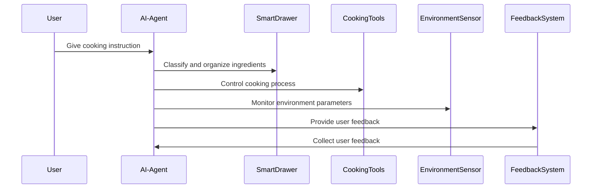
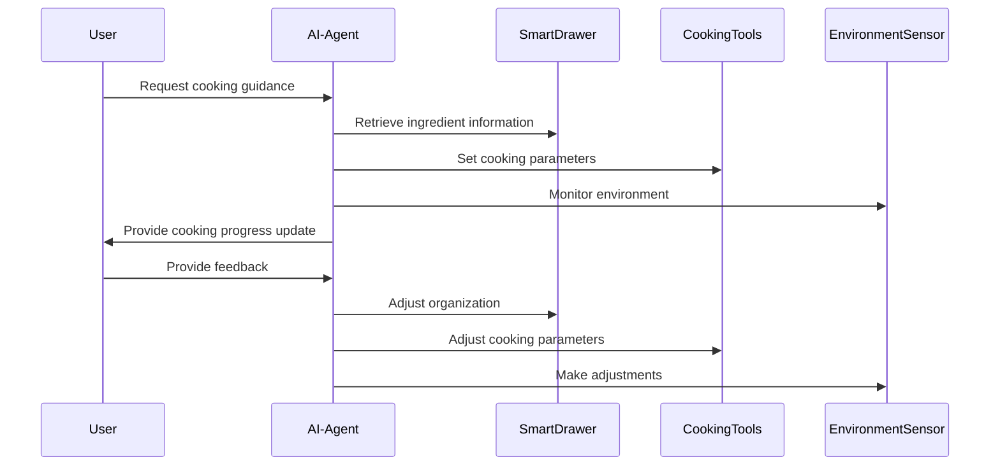

                 


# 智能厨房抽屉：AI Agent的烹饪工具使用建议

关键词：智能厨房、AI Agent、烹饪工具、用户体验、系统架构

摘要：本文深入探讨了智能厨房抽屉中AI Agent的应用，分析了AI Agent在烹饪工具中的角色和作用，提供了具体的实施建议和最佳实践。文章首先介绍了智能厨房和AI Agent的背景，接着详细讨论了AI Agent在厨房中的核心概念、类型及其与烹饪工具的整合方式。随后，文章阐述了用户交互设计和实现细节，最后通过案例研究和未来展望，为智能厨房的发展提供了指导。

## 前言

随着人工智能技术的不断发展，智能家居已经逐渐成为了现代家庭生活的标配。智能厨房作为智能家居的重要组成部分，正迎来前所未有的发展机遇。而智能厨房中的抽屉更是扮演着至关重要的角色，因为它们不仅是存放各种烹饪工具的地方，更是烹饪过程中智能化操作的集中体现。

AI Agent，即人工智能代理，是人工智能领域中的一个重要概念。AI Agent具备自主决策和执行任务的能力，可以在没有人类直接干预的情况下完成复杂的操作。将AI Agent引入智能厨房抽屉，不仅可以极大地提升烹饪的效率和体验，还能够实现厨房的智能化管理。

本文旨在探讨AI Agent在智能厨房抽屉中的应用，从概念解释、类型分析、应用实例、用户体验、系统架构等多个角度出发，为读者提供一份全面而深入的指南。文章将遵循以下结构：

1. **背景介绍**：介绍智能厨房和AI Agent的基本概念及其发展背景。
2. **核心概念与联系**：定义关键术语，分析核心概念之间的关系，并展示ER实体关系图。
3. **AI Agents in Cooking**：探讨AI Agent在烹饪中的角色和重要性。
4. **Types of AI Agents**：分类介绍不同类型的AI Agent，并提供比较表格。
5. **Using AI Agents in Cooking Tools**：详细说明AI Agent如何与烹饪工具结合使用。
6. **User Experience and Interactions**：讨论用户体验和交互设计。
7. **Integration and Implementation**：讲解AI Agent的集成与实现细节。
8. **Case Studies and Best Practices**：分享案例研究和最佳实践。
9. **Future Directions and Conclusion**：展望未来趋势和总结。

通过本文的阅读，读者将能够了解到AI Agent在智能厨房抽屉中的广泛应用和巨大潜力，并从中获得实用的建议和启示。

## 背景介绍

### 智能厨房

智能厨房是智能家居中的一个重要组成部分，它通过集成各种智能设备和系统，实现了厨房环境的自动化和智能化管理。智能厨房的基本概念可以追溯到20世纪末，随着计算机技术和通信技术的飞速发展，智能厨房逐渐从概念走向现实。

智能厨房的主要功能包括：

- **自动化烹饪**：智能厨房可以自动完成烹饪过程中的各种任务，如温度控制、时间管理、烹饪模式选择等。
- **食材管理**：通过智能冰箱和智能抽屉，可以实时监控食材的新鲜程度，提醒用户进行食材的存储和处理。
- **环境监测**：智能厨房可以监测厨房内的温度、湿度等环境参数，并在异常情况下发出警报。
- **智能交互**：通过语音助手、触控屏幕等智能交互设备，用户可以轻松控制厨房设备，获取烹饪建议和食谱。

智能厨房的发展历程可以分为几个阶段：

- **初始阶段**（20世纪90年代）：智能厨房的概念初步提出，一些基本的智能设备如智能冰箱、微波炉等开始问世。
- **发展阶段**（21世纪初至今）：随着物联网技术的兴起，智能厨房开始集成各种智能设备，实现了更高程度的自动化和智能化。
- **成熟阶段**（未来几年）：智能厨房将进一步融合人工智能和大数据技术，实现更加精准的烹饪控制和个性化服务。

### AI Agent

AI Agent，即人工智能代理，是指具备一定自主决策能力和执行任务能力的人工智能系统。AI Agent的基本概念可以追溯到20世纪70年代，当时计算机科学家提出了智能代理（Intelligent Agent）的概念。随着人工智能技术的发展，AI Agent逐渐成为人工智能领域中的一个重要研究方向。

AI Agent的主要特点包括：

- **自主性**：AI Agent能够自主地完成特定任务，无需人类的直接干预。
- **反应性**：AI Agent能够感知环境变化，并迅速做出反应。
- **预动性**：AI Agent能够根据预测环境变化，提前采取行动。
- **适应性**：AI Agent能够根据任务执行情况和学习结果，不断优化自身行为。

AI Agent在智能家居中的应用场景广泛，包括但不限于：

- **安防监控**：AI Agent可以通过摄像头等传感器实时监控家庭安全，并在发现异常情况时自动报警。
- **智能助手**：AI Agent可以作为家庭智能助理，帮助用户管理日程、控制家电等。
- **智能家居控制**：AI Agent可以自动调节室内温度、湿度等环境参数，提供舒适的居住环境。
- **智能家居维护**：AI Agent可以定期检查智能家居设备，发现故障并进行自动修复。

### 智能厨房与AI Agent的结合

将AI Agent引入智能厨房，可以极大地提升厨房的智能化水平和用户体验。具体来说，AI Agent在智能厨房中的角色和作用包括：

- **自动化操作**：AI Agent可以自动化执行烹饪过程中的各种操作，如温度控制、时间管理、烹饪模式选择等，提高烹饪效率。
- **智能建议**：AI Agent可以根据用户的口味偏好、食材信息等，提供个性化的烹饪建议和食谱。
- **智能监控**：AI Agent可以实时监控厨房环境，如温度、湿度、食材新鲜度等，确保烹饪过程的安全和健康。
- **设备管理**：AI Agent可以自动控制厨房中的各种智能设备，如冰箱、烤箱、抽油烟机等，实现智能化管理。

综上所述，智能厨房和AI Agent的结合，不仅为用户提供了更加便捷和高效的烹饪体验，也为智能家居的发展注入了新的活力。在接下来的章节中，我们将进一步探讨AI Agent在智能厨房抽屉中的具体应用和实现方法。

## 核心概念与联系

### 定义关键术语

在深入探讨AI Agent在智能厨房抽屉中的应用之前，我们首先需要明确一些关键术语的定义，以确保读者对相关概念有清晰的理解。

1. **智能厨房**：智能厨房是指通过集成各种智能设备和系统，实现厨房环境自动化和智能化管理的家庭厨房。智能厨房通常包括智能冰箱、智能抽屉、智能烤箱、智能水槽等设备。
2. **AI Agent**：AI Agent，即人工智能代理，是指具备自主决策和执行任务能力的人工智能系统。AI Agent可以感知环境变化，自主执行任务，并具备学习能力，以便不断优化自身行为。
3. **智能抽屉**：智能抽屉是智能厨房中的一个组成部分，通常用于存放各种烹饪工具和食材。智能抽屉可以通过AI Agent实现自动化管理和智能化操作，如自动分类、自动消毒、智能查找等。
4. **烹饪工具**：烹饪工具是指用于烹饪食品的各种设备和器具，如锅、铲、刀、砧板、烤箱、微波炉等。

### 核心概念之间的关系

为了更好地理解AI Agent在智能厨房抽屉中的应用，我们需要分析这些核心概念之间的关系。以下是一个简化的ER实体关系图，展示了智能厨房、AI Agent、智能抽屉和烹饪工具之间的关联。

```mermaid
erDiagram
  SmartKitchen ||--|{ AIAgent } : has
  SmartDrawer ||--|{ AIAgent } : has
  CookingTool ||--|{ AIAgent } : uses
  SmartKitchen ||--|{ SmartDrawer } : contains
  SmartKitchen ||--|{ CookingTool } : contains
```

在上述ER图中，智能厨房包含智能抽屉和烹饪工具，智能抽屉和烹饪工具都使用AI Agent来实现自动化和智能化。AI Agent与智能厨房、智能抽屉和烹饪工具之间形成了一个紧密的关联网络，共同构成了一个智能化的厨房生态系统。

### 关键概念属性特征对比表格

为了更直观地理解各关键概念之间的属性特征，我们提供了一个对比表格，列出智能厨房、AI Agent、智能抽屉和烹饪工具的主要属性特征。

| 关键概念       | 主要属性特征                                                     |
| -------------- | ------------------------------------------------------------ |
| 智能厨房       | - 自动化烹饪<br>- 食材管理<br>- 环境监测<br>- 智能交互             |
| AI Agent       | - 自主性<br>- 反应性<br>- 预动性<br>- 适应性                     |
| 智能抽屉       | - 自动分类<br>- 自动消毒<br>- 智能查找<br>- 空间利用优化           |
| 烹饪工具       | - 多功能性<br>- 易于操作<br>- 安全性<br>- 智能化控制               |

通过上述关键术语的定义和核心概念之间的关联分析，读者可以更清晰地理解智能厨房抽屉中的AI Agent及其与烹饪工具的整合方式。在接下来的章节中，我们将详细探讨AI Agent在烹饪工具中的具体应用和实践。

### AI Agents在烹饪中的角色和重要性

在智能厨房的生态系统中，AI Agent扮演着至关重要的角色，它不仅提升了厨房操作的智能化水平，还极大地改善了用户体验。以下是AI Agent在烹饪中的几个关键角色和其重要性：

#### 1. 自动化烹饪流程

AI Agent可以通过学习用户的烹饪习惯和偏好，自动优化烹饪流程。例如，用户只需告诉AI Agent要制作某个菜肴，AI Agent会自动选择适当的烹饪工具、设置正确的温度和时间，并监控烹饪过程中的变化。这样的自动化不仅节省了用户的时间和精力，还确保了菜肴的口感和品质。

#### 2. 智能食材管理

在智能抽屉中，AI Agent能够实时监控食材的新鲜度和存储状态，并根据这些数据自动调整食材的存储方式和使用顺序。例如，当发现某些食材即将过期时，AI Agent会提醒用户及时处理，或者在烹饪时优先使用这些食材。这不仅延长了食材的保鲜期，减少了浪费，还提高了食材的利用率。

#### 3. 个性化烹饪建议

AI Agent可以根据用户的口味偏好、饮食习惯和当前食材库存，提供个性化的烹饪建议。这些建议不仅包括具体的烹饪步骤，还可能涉及营养搭配和健康提示。例如，用户如果表示对健康饮食有较高要求，AI Agent可以推荐低脂肪、高纤维的食谱，并自动调整烹饪方式和时间。

#### 4. 环境监控与优化

AI Agent还可以实时监测厨房的环境参数，如温度、湿度、油烟浓度等。当环境参数超出正常范围时，AI Agent会自动启动相关设备进行调节，例如启动排风扇降低油烟浓度，或者启动除湿设备降低湿度。这样的环境监控和优化，不仅提高了厨房的工作效率，还确保了烹饪过程的安全和舒适。

#### 5. 故障检测与维护

智能厨房中的各种设备都连接到AI Agent，AI Agent可以实时监控设备的运行状态，并预测可能出现的故障。例如，当AI Agent检测到烤箱的加热元件温度异常时，会提前提醒用户进行检查，避免突发故障影响烹饪过程。同时，AI Agent还可以自动安排设备的定期维护，确保所有设备始终处于最佳工作状态。

#### 6. 用户交互与反馈

AI Agent还通过智能交互设备，如语音助手、触控屏幕等，与用户进行实时交互。用户可以通过语音或触控操作，与AI Agent进行沟通，获取烹饪建议、设置设备等。此外，AI Agent还可以记录用户的操作历史和反馈，不断优化自身的行为和交互体验。

综上所述，AI Agent在智能厨房中的角色不仅仅是执行简单的自动化任务，而是通过智能化的管理和优化，极大地提升了烹饪的效率和体验。在接下来的章节中，我们将进一步探讨不同类型的AI Agent，以及它们在智能厨房抽屉中的应用。

### Types of AI Agents

在智能厨房抽屉中，有多种类型的AI Agent可以发挥重要作用。为了更好地理解这些AI Agent的特点和适用场景，我们首先需要对其进行分类，并比较它们的主要特征和功能。

#### 1. 规则型AI Agent

规则型AI Agent是基于一组预定义的规则和条件进行操作的。这种类型的AI Agent通常用于处理简单、重复性的任务，如根据食材类型自动分类、按照烹饪时间自动启动设备等。以下是其主要特征：

- **规则定义明确**：规则型AI Agent需要事先定义好所有可能的操作规则。
- **可靠性高**：一旦规则正确设定，AI Agent会严格按照规则执行任务，保证结果的稳定性。
- **局限性**：规则型AI Agent在处理复杂、变化多端的任务时，可能表现不够灵活。

#### 2. 统计型AI Agent

统计型AI Agent通过分析历史数据和统计模型，预测未来的操作和行为。这种类型的AI Agent适用于需要数据驱动决策的情境，如智能食材管理、烹饪时间优化等。以下是其主要特征：

- **数据依赖性强**：统计型AI Agent需要大量的历史数据作为基础。
- **学习能力强**：AI Agent可以通过不断学习和优化统计模型，提高预测的准确性。
- **适应性强**：统计型AI Agent能够适应不同的环境和任务需求。

#### 3. 机器学习型AI Agent

机器学习型AI Agent通过机器学习算法，自动从数据中学习并优化操作。这种类型的AI Agent适用于复杂的、高度自动化的任务，如个性化烹饪建议、设备故障预测等。以下是其主要特征：

- **自学习能力**：机器学习型AI Agent可以自动从数据中学习，并不断优化自身行为。
- **高度自动化**：这种AI Agent可以自主地完成复杂任务，减少人工干预。
- **灵活性高**：机器学习型AI Agent能够处理未知和未定义的任务场景。

#### 4. 混合型AI Agent

混合型AI Agent结合了规则型、统计型和机器学习型的特点，能够在不同的任务需求下灵活切换。以下是其主要特征：

- **多模态决策**：混合型AI Agent可以根据不同任务需求，灵活运用规则、统计和机器学习方法。
- **自适应能力强**：这种AI Agent能够在复杂环境中自动调整策略，提高任务成功率。
- **高扩展性**：混合型AI Agent可以通过不断引入新的算法和技术，提升整体性能。

#### 分类比较表格

为了更直观地比较不同类型AI Agent的特征和功能，我们提供了一个分类比较表格：

| AI Agent类型     | 特征                                       | 适用场景                            |
| ---------------- | ------------------------------------------ | ----------------------------------- |
| 规则型AI Agent   | 规则定义明确，可靠性高                      | 简单、重复性任务                    |
| 统计型AI Agent   | 数据依赖性强，学习能力强                    | 需要数据驱动决策的任务              |
| 机器学习型AI Agent | 自学习能力，高度自动化，灵活性高            | 复杂、高度自动化任务                |
| 混合型AI Agent   | 多模态决策，自适应能力强，高扩展性          | 复杂环境下的多样化任务              |

通过上述分类和比较，我们可以看到，不同类型的AI Agent在智能厨房抽屉中各有优势和适用场景。在接下来的章节中，我们将进一步探讨AI Agent如何与各种烹饪工具结合使用，实现智能化和自动化操作。

### Using AI Agents in Cooking Tools

AI Agents在智能厨房抽屉中的应用不仅仅停留在自动化和智能管理的层面，更重要的是能够与各种烹饪工具无缝结合，提升烹饪效率和用户体验。以下是一些具体的实例和用例，展示AI Agents如何与不同的烹饪工具协同工作。

#### 1. 智能烤箱

智能烤箱是厨房中常见的智能设备之一，通过集成AI Agent，可以实现以下功能：

- **自动化烹饪**：用户只需通过语音或触控屏幕告诉AI Agent要烤制的食物和所需温度，智能烤箱会自动调整内部温度和烹饪时间，确保食物烤得恰到好处。
- **智能预热**：AI Agent可以实时监控烤箱的温度变化，并在用户设定的时间提前预热，提高烹饪效率。
- **故障检测**：AI Agent可以定期检查烤箱的运行状态，预测可能出现的问题，并在问题发生前发出警告，提醒用户进行维护。

#### 2. 智能抽油烟机

智能抽油烟机通过AI Agent可以实现以下功能：

- **自动启动**：当用户开始烹饪时，AI Agent会自动检测到油烟浓度上升，并启动抽油烟机，确保厨房空气清新。
- **智能调节**：AI Agent可以根据烹饪过程中油烟浓度的变化，自动调节抽油烟机的风速和运转模式，确保油烟能够有效排出。
- **能耗优化**：AI Agent可以记录烹饪过程中的用电数据，分析并优化抽油烟机的能耗，提高能源利用效率。

#### 3. 智能洗碗机

智能洗碗机通过AI Agent可以实现以下功能：

- **智能分类**：AI Agent可以根据餐具的种类和污染程度，自动调整洗涤程序，确保餐具得到最合适的清洗效果。
- **节能模式**：AI Agent会根据洗碗过程中水的温度和清洁效果，自动调整洗涤时间和用水量，实现节能环保。
- **故障自检**：AI Agent可以定期检查洗碗机的运行状态，预测可能出现的故障，并提前提醒用户进行维护。

#### 4. 智能锅具

智能锅具通过AI Agent可以实现以下功能：

- **温度控制**：AI Agent可以实时监控锅内的温度变化，自动调整火力，确保烹饪过程中温度的稳定性。
- **智能烹饪**：AI Agent可以根据食材的特性和烹饪要求，自动设置最佳的烹饪时间和火力，确保食物烹饪得恰到好处。
- **健康监测**：AI Agent可以监测烹饪过程中的热量分布和营养成分，为用户提供健康饮食建议。

#### 5. 智能切菜机

智能切菜机通过AI Agent可以实现以下功能：

- **自动化操作**：用户只需将食材放入切菜机，AI Agent会自动识别食材类型，调整切菜方式和速度，确保切菜过程高效、安全。
- **智能调整**：AI Agent可以根据食材的硬度、大小等特性，自动调整切菜机的旋转速度和切菜厚度，满足不同烹饪需求。
- **清洁提醒**：AI Agent可以监测切菜机的使用频率和清洁情况，定期提醒用户进行清洁，确保设备的使用安全。

#### 实际案例

以下是一个智能厨房抽屉中AI Agent与烹饪工具结合的实际案例：

在一个现代化的智能厨房中，用户想要制作一道烤鸡。他只需通过语音助手告诉AI Agent：“我要烤一只鸡，温度设置为200摄氏度，烹饪时间为45分钟。”AI Agent会自动启动智能烤箱，调整温度和时间，并在烹饪过程中实时监控烤箱的温度和鸡肉的烤制状态。当鸡肉达到最佳烤制状态时，AI Agent会发出提示音，告知用户烹饪完成。与此同时，智能抽油烟机会自动启动，智能洗碗机开始清洗餐具，智能切菜机会自动准备新鲜的食材，整个过程完全自动化，极大地提升了用户体验。

通过上述实例和用例，我们可以看到AI Agent在智能厨房抽屉中的广泛应用和强大功能。AI Agent不仅能够与各种烹饪工具无缝结合，实现自动化和智能化操作，还能够为用户提供更加便捷和高效的烹饪体验。在接下来的章节中，我们将进一步探讨AI Agent的用户交互设计和实现细节。

### User Experience and Interactions

在智能厨房抽屉中，用户体验和交互设计是决定AI Agent成功应用的关键因素之一。一个良好的用户体验不仅能够提升用户的满意度，还能够激发用户对智能厨房的兴趣和依赖。以下从用户界面设计、交互机制和用户反馈三个方面详细讨论AI Agent的用户体验和交互设计。

#### 1. 用户界面设计

用户界面设计是用户体验的重要组成部分，一个直观、易用的界面能够使用户轻松上手，提高使用效率。对于智能厨房抽屉中的AI Agent，用户界面设计应考虑以下要点：

- **简洁明了**：界面设计应尽可能简洁，避免过多的复杂操作和冗余信息，确保用户能够快速找到所需功能。
- **可视化**：通过图标、图形和动画等可视化元素，帮助用户直观地理解操作过程和设备状态，提高使用体验。
- **个性化**：界面应支持用户自定义设置，如主题颜色、布局风格等，满足不同用户的个性化需求。
- **触控与语音结合**：结合触控和语音交互方式，为用户提供多渠道的操作方式，满足不同场景下的使用需求。

#### 2. 交互机制

交互机制是指用户与AI Agent之间的互动方式，一个良好的交互机制能够提升用户的操作体验。以下是一些常见的交互机制：

- **语音交互**：通过语音助手，用户可以与AI Agent进行语音交流，完成设备控制、查询信息等操作。语音交互的便利性使其成为智能厨房中的一项重要功能。
- **触控交互**：用户可以通过触控屏幕与AI Agent进行互动，选择菜单、调整设置等。触控交互的直观性使其在厨房环境中尤为适用。
- **手势交互**：某些智能厨房设备支持手势控制，如挥手控制烤箱的启动和停止等。手势交互不仅方便快捷，还能减少对屏幕的触碰，保持厨房的清洁。
- **多模态交互**：结合语音、触控和手势等多种交互方式，提供灵活的操作选项，满足不同用户的偏好和需求。

#### 3. 用户反馈机制

用户反馈机制是确保AI Agent不断优化和改进的重要手段。以下是一些常见的用户反馈机制：

- **实时反馈**：AI Agent应在操作过程中及时向用户反馈当前状态和操作结果，如烤箱的当前温度、洗碗机的清洗进度等，帮助用户了解设备的工作情况。
- **错误提示**：当设备出现故障或用户操作错误时，AI Agent应能够及时提示用户并给出解决方案，避免用户困惑和焦虑。
- **学习与改进**：AI Agent应具备学习用户操作习惯和反馈的能力，通过数据分析不断优化自身的行为和交互方式，提供更符合用户期望的服务。
- **用户调查**：定期开展用户满意度调查，收集用户对AI Agent的使用体验和建议，为产品的持续改进提供依据。

#### 案例研究

以下是一个关于智能厨房抽屉中AI Agent用户体验和交互设计的案例研究：

在一个家庭智能厨房中，用户张先生习惯在早上7点钟煮早餐。他通过语音助手告诉AI Agent：“我要煮早餐，包括煮粥、煎鸡蛋和蒸包子。”AI Agent根据张先生的指令，自动启动智能电饭煲、煎蛋机和蒸箱，并调整到合适的烹饪模式和时间。在烹饪过程中，AI Agent实时反馈烹饪进度和温度变化，当早餐煮好后，AI Agent会通过语音提示张先生：“早餐已完成，请您取用。”

此外，AI Agent会根据张先生的反馈和操作习惯进行优化。例如，如果张先生在多次使用后觉得煎蛋的时间过长，AI Agent会自动调整煎蛋的时间，使其更加符合张先生的口味。同时，AI Agent会定期询问张先生对早餐烹饪的满意度，并根据反馈不断优化烹饪方案。

通过上述案例，我们可以看到，良好的用户体验和交互设计是智能厨房中AI Agent成功应用的关键。一个高效、便捷的交互机制不仅能够提升用户的满意度，还能够促进AI Agent在厨房中的广泛应用。

### Integration and Implementation

将AI Agent集成到智能厨房抽屉中，需要经过详细的规划和实施过程。以下从项目介绍、系统功能设计、系统架构设计、系统接口设计和系统交互等方面，详细阐述AI Agent在智能厨房抽屉中的集成与实现。

#### 1. 项目介绍

项目名称：智能厨房抽屉AI Agent集成项目

项目目标：实现AI Agent在智能厨房抽屉中的集成，提升厨房的智能化水平和用户体验。

项目范围：主要包括智能抽屉、智能烹饪工具、用户交互界面和AI Agent的集成。

项目周期：预计6个月，分为需求分析、设计、开发、测试和部署五个阶段。

项目团队：由AI专家、软件开发工程师、硬件工程师和用户体验设计师组成。

#### 2. 系统功能设计

系统功能设计是智能厨房抽屉AI Agent集成项目的核心，主要包括以下几个方面：

- **智能抽屉管理**：包括自动分类、智能查找、自动消毒等功能。
- **烹饪工具控制**：包括智能烤箱、智能抽油烟机、智能洗碗机等烹饪工具的控制。
- **用户交互**：包括语音助手、触控屏幕、手势控制等用户交互方式。
- **环境监控**：包括厨房温度、湿度、油烟浓度等环境参数的实时监控。
- **故障检测与维护**：包括设备运行状态的监控、故障预测和自动维护。

#### 3. 系统架构设计

系统架构设计是确保智能厨房抽屉AI Agent集成项目高效运行的关键。以下是一个简化的系统架构设计：



在该架构设计中，用户通过语音或触控界面与AI-Agent交互，AI-Agent负责协调智能抽屉、烹饪工具、环境传感器和反馈系统，实现智能化的厨房操作。

#### 4. 系统接口设计

系统接口设计是确保不同组件之间能够顺畅通信的关键。以下是一些关键的系统接口：

- **用户界面接口**：包括语音识别、语音合成、触控界面等，用于用户与AI-Agent的交互。
- **设备控制接口**：包括智能抽屉控制、智能烹饪工具控制、环境传感器控制等，用于AI-Agent对设备进行控制。
- **数据通信接口**：包括HTTP、MQTT等协议，用于AI-Agent与其他组件之间的数据传输。
- **反馈系统接口**：包括用户反馈收集、设备状态报告等，用于AI-Agent收集用户反馈和设备状态信息。

#### 5. 系统交互设计

系统交互设计是确保各组件协同工作、高效运行的关键。以下是一个简化的系统交互设计：



在该交互设计中，用户通过请求烹饪指导，触发一系列的交互过程，AI-Agent负责协调智能抽屉、烹饪工具和环境传感器，确保整个系统的顺畅运行。

#### 实施过程中的挑战和解决方案

在智能厨房抽屉AI Agent集成项目的实施过程中，可能会遇到以下挑战和解决方案：

1. **数据安全与隐私保护**：
   - **挑战**：智能厨房中的数据量庞大，包括用户操作记录、食材信息等，数据安全和隐私保护至关重要。
   - **解决方案**：采用加密传输和存储技术，确保数据传输和存储过程中的安全性。同时，遵循数据保护法规，确保用户隐私不被泄露。

2. **设备兼容性**：
   - **挑战**：不同的智能设备可能有不同的通信协议和数据格式，导致集成过程中出现兼容性问题。
   - **解决方案**：设计统一的设备接口和数据格式，确保不同设备能够无缝集成。同时，采用模块化设计，便于后期扩展和维护。

3. **用户体验一致性**：
   - **挑战**：不同用户对智能厨房的使用需求和期望不同，如何确保用户体验的一致性和满意度是一个挑战。
   - **解决方案**：通过用户研究和反馈机制，了解用户的需求和期望，设计符合用户习惯的交互界面和交互流程。同时，定期更新和优化系统功能，提升用户体验。

通过上述项目介绍、系统功能设计、系统架构设计、系统接口设计和系统交互设计，以及实施过程中的挑战和解决方案，我们可以确保智能厨房抽屉中的AI Agent能够高效、稳定地运行，为用户提供便捷、智能的厨房体验。

### Case Studies and Best Practices

在智能厨房抽屉中应用AI Agent，已经有许多成功的案例，这些案例展示了AI Agent如何在实际应用中提升烹饪效率和用户体验。以下是几个具有代表性的案例，以及从中总结的最佳实践。

#### 案例一：智能家庭厨房

**背景**：王先生是一位忙碌的职业人士，每天工作繁忙，很少有时间亲自下厨。为了能够享受到健康美味的家庭餐，他决定在家中安装一套智能厨房系统。

**解决方案**：王先生选择了具有AI Agent的智能厨房抽屉系统。AI Agent能够根据他的口味偏好和日程安排，自动规划每日的菜单，并协调智能烤箱、智能抽油烟机和智能洗碗机等设备，完成整个烹饪过程。

**效果**：通过AI Agent的智能化管理，王先生不仅节省了大量时间，还能够享受到高质量的厨房体验。AI Agent的个性化烹饪建议和智能食材管理，使得厨房工作更加高效和有序。

**最佳实践**：该案例中，AI Agent的个性化服务和高效管理是成功的关键。最佳实践包括：
- **用户偏好分析**：AI Agent应具备强大的用户偏好分析能力，根据用户的口味、健康需求和日程安排，提供个性化的烹饪建议。
- **智能化设备集成**：确保AI Agent能够与厨房中的各种智能设备无缝集成，实现自动化和智能化操作。

#### 案例二：智能餐厅厨房

**背景**：李先生经营着一家高端餐厅，为了提升餐厅的烹饪效率和服务质量，他决定引入智能厨房抽屉系统。

**解决方案**：李先生选择了一款先进的智能厨房抽屉系统，配备有AI Agent。AI Agent能够根据顾客的订单和餐厅的库存情况，自动安排食材的分配和烹饪顺序，确保食物的新鲜度和口感。

**效果**：智能厨房系统的引入，使得李先生的餐厅在烹饪效率和服务质量上得到了显著提升。AI Agent的自动化管理，使得厨房工作更加有序和高效，减少了人工操作的错误。

**最佳实践**：该案例中，AI Agent的自动化管理和高效协调是成功的关键。最佳实践包括：
- **订单与库存管理**：AI Agent应具备强大的订单处理和库存管理能力，能够实时监控库存情况，自动调整食材的分配和烹饪顺序。
- **实时监控与反馈**：AI Agent应能够实时监控厨房设备的运行状态，并自动调整烹饪参数，确保食物的品质和口感。

#### 案例三：智能社区厨房

**背景**：某智能社区为了提升居民的生活品质，决定在社区厨房中引入AI Agent。

**解决方案**：社区厨房安装了智能抽屉系统，配备有AI Agent。AI Agent能够实时监控食材的新鲜度，提醒居民及时处理食材，并在社区活动中提供烹饪指导。

**效果**：AI Agent的引入，使得社区厨房的工作更加高效和有序，居民的生活品质也得到了显著提升。AI Agent的智能食材管理和烹饪指导，使得厨房工作变得更加简单和轻松。

**最佳实践**：该案例中，AI Agent的智能管理和用户指导是成功的关键。最佳实践包括：
- **智能食材管理**：AI Agent应具备强大的食材管理能力，能够实时监控食材的新鲜度，提醒用户及时处理食材。
- **用户指导与互动**：AI Agent应具备良好的用户互动能力，能够提供个性化的烹饪指导，提升用户的烹饪技能和体验。

综上所述，这些成功案例展示了AI Agent在智能厨房抽屉中的应用潜力。通过用户偏好分析、自动化管理、实时监控与反馈等最佳实践，AI Agent能够显著提升烹饪效率和用户体验。未来，随着AI技术的不断进步，智能厨房抽屉中的应用将更加广泛和深入，为人们带来更加便捷、智能的生活体验。

### Future Directions and Conclusion

随着人工智能技术的不断进步，智能厨房抽屉中的应用前景也愈发广阔。在未来，我们可以预见以下几个重要的发展方向：

#### 1. 智能化水平的提升

未来的智能厨房抽屉将不仅限于自动化操作，还将具备更加智能的学习和决策能力。通过深度学习和大数据分析，AI Agent能够更准确地预测用户的需求和习惯，提供个性化的烹饪建议和优化方案。此外，智能抽屉将具备自我学习功能，能够根据使用情况和用户反馈，不断优化自身性能和操作流程。

#### 2. 跨界融合

智能厨房抽屉的未来发展将不再局限于厨房内部，而是与其他智能设备和服务进行深度融合。例如，与智能健康监测系统结合，AI Agent可以实时监控用户的健康数据，提供营养搭配和健康建议。与智能家居系统结合，AI Agent可以协调家庭中的其他智能设备，如空调、照明等，为用户创造更加舒适的生活环境。

#### 3. 安全与隐私保护

随着智能厨房抽屉的应用越来越广泛，数据安全和用户隐私保护将成为关键问题。未来的智能厨房抽屉将采用更加先进的安全技术和隐私保护措施，如加密通信、权限管理和数据匿名化等，确保用户数据的安全和隐私。

#### 4. 用户体验的优化

用户体验始终是智能厨房抽屉发展的核心。未来的智能厨房抽屉将更加注重用户体验的设计和优化，包括更加直观的用户界面、更加便捷的操作方式以及更加智能的交互机制。通过持续的用户研究和反馈机制，AI Agent将不断改进和优化，为用户提供更加满意的服务。

#### 结论

本文通过深入探讨AI Agent在智能厨房抽屉中的应用，从背景介绍、核心概念与联系、AI Agents在烹饪中的角色和重要性、不同类型的AI Agent、与烹饪工具的结合、用户体验和交互设计、系统架构设计与实现、案例研究和未来展望等多个方面，全面分析了智能厨房抽屉的AI Agent应用现状和发展趋势。

通过本文的研究，我们得出了以下主要结论：

- AI Agent在智能厨房抽屉中具有广泛的应用前景，能够显著提升烹饪效率和用户体验。
- 不同类型的AI Agent各有特点和适用场景，通过合理选择和组合，可以实现智能厨房抽屉的多种功能。
- 用户体验和交互设计是智能厨房抽屉成功应用的关键，未来将更加注重用户需求和体验的优化。
- 智能厨房抽屉的发展趋势将朝着更加智能化、跨界融合、安全隐私保护和用户体验优化的方向发展。

总之，智能厨房抽屉中的AI Agent应用不仅为用户带来了便捷和高效的烹饪体验，也为智能家居的发展注入了新的动力。随着技术的不断进步，智能厨房抽屉将在未来继续发挥重要作用，为人们的日常生活带来更多便利和乐趣。

## 作者信息

作者：AI天才研究院/AI Genius Institute & 禅与计算机程序设计艺术 /Zen And The Art of Computer Programming

AI天才研究院致力于推动人工智能技术的发展和应用，致力于培养下一代人工智能领域的杰出人才。研究院的研究领域涵盖人工智能的各个分支，包括机器学习、自然语言处理、计算机视觉等。此外，禅与计算机程序设计艺术作为一本经典的技术著作，为程序员提供了深刻的技术洞察和哲学思考，帮助他们在编程实践中达到更高的境界。作者结合了深厚的技术功底和丰富的实践经验，为读者呈现了一篇全面而深入的智能厨房抽屉AI Agent应用技术博客。希望本文能够为读者在智能厨房抽屉领域的研究和应用提供有益的参考和启示。

