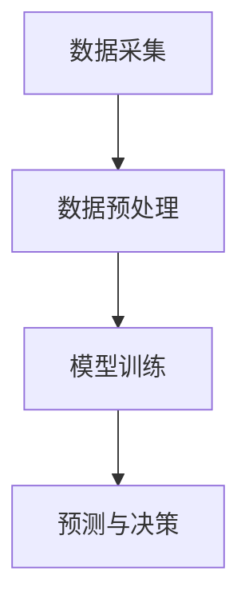
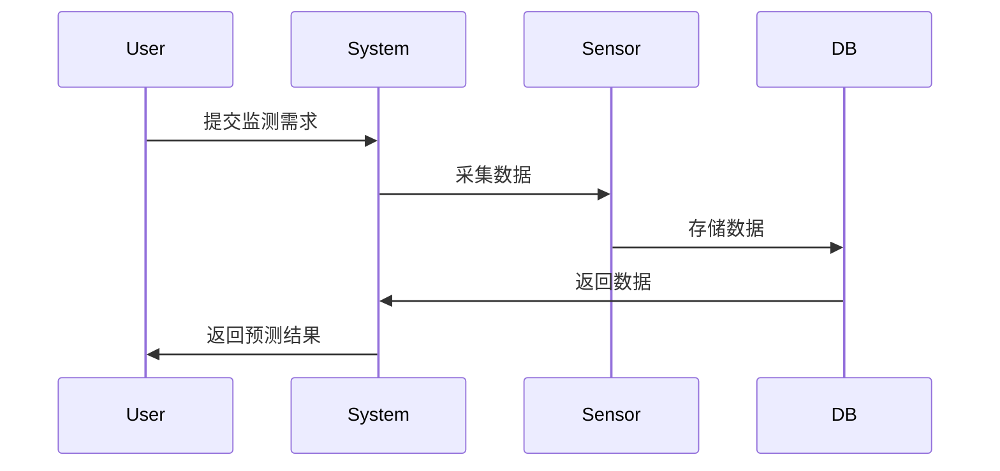

                 


## 设计《智能厨房案板：AI Agent的食品安全监测》目录大纲：逻辑清晰、结构紧凑、简单易懂的专业IT领域技术博客

### 背景介绍

#### 1.1 问题背景
- 食品安全是全球关注的重大问题，影响着人类的健康和社会的稳定。
- 传统食品安全监测方法存在局限性，如效率低、覆盖面窄、准确性差等。
- 人工智能技术的发展为食品安全监测提供了新的解决方案。

#### 1.2 问题描述
- 食品安全监测面临的挑战包括：数据来源多样性、实时性需求、检测准确性等。
- 食品安全监测的需求包括：全面监测、实时预警、自动化处理等。

#### 1.3 问题解决
- AI Agent是一种智能体，具备自主感知、决策和行动的能力。
- AI Agent在食品安全监测中的应用可以提升监测效率、提高准确性、实现自动化处理。

#### 1.4 边界与外延
- 食品安全监测的范围包括：食品生产、加工、运输、销售等环节。
- AI Agent的功能包括：数据采集、数据分析、异常检测、预警通知等。

### 核心概念与联系

#### 2.1 AI Agent的定义与类型
- AI Agent是指具备智能行为的计算机程序或机器人。
- AI Agent的类型包括：基于规则的Agent、基于知识的Agent、基于学习的Agent等。

#### 2.2 人工智能在食品安全监测中的核心概念
- 数据采集：通过传感器、扫描设备等获取食品安全相关的数据。
- 数据处理：对采集到的数据进行清洗、预处理和存储。
- 模型训练：利用机器学习算法对数据进行分析和建模。
- 预测与决策：根据模型预测结果进行食品安全监测和决策。

#### 2.3 概念属性特征对比表格
| AI Agent类型 | 特点 |
| :--- | :--- |
| 基于规则的Agent | 简单、效率高、可靠性高 |
| 基于知识的Agent | 智能化程度高、灵活性强 |
| 基于学习的Agent | 自适应性强、准确性高 |

#### 2.4 ER实体关系图架构
```mermaid
erDiagram
    Product ||--|{ Sensor }|
    Sensor ||--|{ DataProcessing }|
    DataProcessing ||--|{ ModelTraining }|
    ModelTraining ||--|{ PredictionAndDecision }|
```

### 算法原理讲解

#### 3.1 食品安全监测算法概述
- 食品安全监测算法包括：数据采集算法、数据处理算法、模型训练算法、预测与决策算法等。

#### 3.2 算法mermaid流程图


#### 3.3 Python源代码讲解
```python
# 数据采集
data = collect_data()

# 数据预处理
processed_data = preprocess_data(data)

# 模型训练
model = train_model(processed_data)

# 预测与决策
prediction = model.predict(processed_data)
decision = make_decision(prediction)
```

#### 3.4 数学模型与公式
$$
f(x) = \sum_{i=1}^{n} w_i * x_i
$$
- 其中，$w_i$为权重，$x_i$为特征值。

### 系统分析与架构设计

#### 4.1 问题场景介绍
- 食品安全监测系统的场景包括：食品工厂、农贸市场、餐饮企业等。

#### 4.2 系统功能设计
- 数据采集：实时采集食品质量、温度、湿度等数据。
- 数据处理：清洗、去噪、归一化等预处理操作。
- 模型训练：利用历史数据训练食品安全检测模型。
- 预测与决策：根据实时数据预测食品安全状况，并作出相应决策。

#### 4.3 系统架构设计
- 系统架构采用微服务架构，包括：数据采集模块、数据处理模块、模型训练模块、预测与决策模块等。

#### 4.4 系统接口设计
- 系统接口包括：API接口、MQ消息队列、数据库接口等。

#### 4.5 系统交互mermaid序列图


### 项目实战

#### 5.1 环境安装
- 配置操作系统、安装Python、安装必要的库等。

#### 5.2 系统核心实现源代码
- 实现数据采集、数据处理、模型训练、预测与决策等核心功能。

#### 5.3 代码应用解读与分析
- 分析代码实现细节，解读核心算法。

#### 5.4 实际案例分析和详细讲解剖析
- 通过实际案例展示系统应用效果，进行详细讲解。

#### 5.5 项目小结
- 总结项目经验，反思项目中的问题和不足。

### 最佳实践与小结

#### 6.1 最佳实践
- 提供食品安全监测系统的最佳实践。

#### 6.2 小结
- 对全书内容进行总结。

#### 6.3 注意事项
- 使用系统时需要注意的事项。

#### 6.4 拓展阅读
- 推荐进一步学习的资源。

### 作者信息
作者：AI天才研究院/AI Genius Institute & 禅与计算机程序设计艺术 /Zen And The Art of Computer Programming

---

### 总结
按照上述步骤，我们设计了《智能厨房案板：AI Agent的食品安全监测》这本书的目录大纲。每个章节都涵盖了核心概念、原理讲解、系统分析与项目实战等内容，旨在为广大读者提供一个系统、全面、易懂的食品安全监测解决方案。接下来，我们将逐步撰写每个章节的内容，确保文章的逻辑清晰、结构紧凑、简单易懂。

### 关键词
AI Agent、食品安全监测、数据采集、数据处理、模型训练、预测与决策、微服务架构、实际案例

### 摘要
本文详细介绍了基于AI Agent的食品安全监测系统，包括核心概念、算法原理、系统分析与架构设计、项目实战等内容。通过本文的阅读，读者将了解到如何利用人工智能技术提升食品安全监测的效率与准确性，从而保障公众的食品安全。

