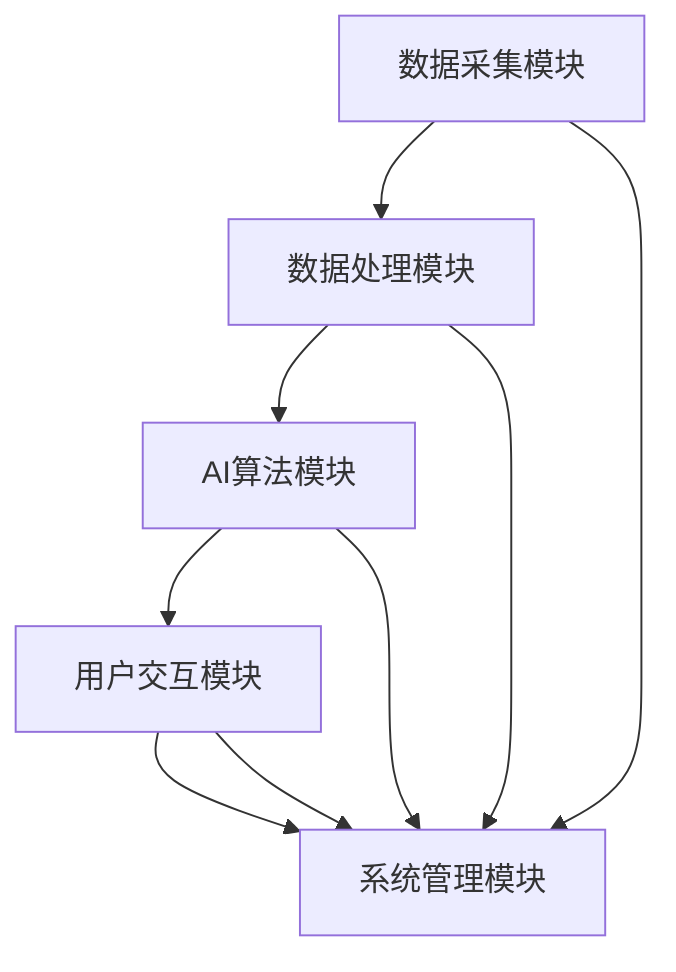
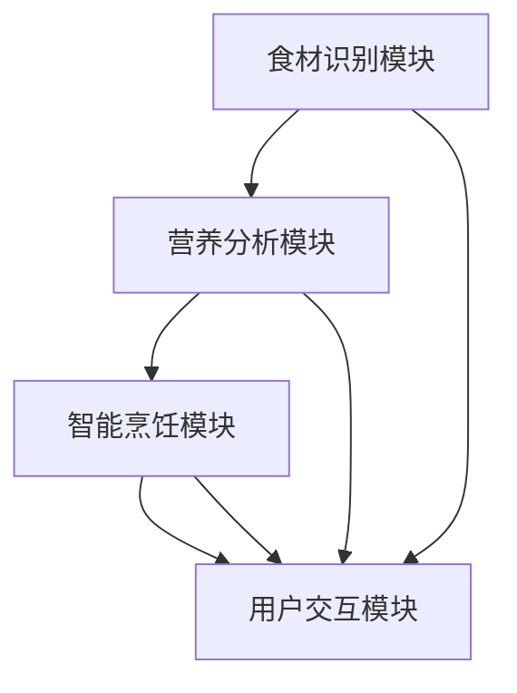

                 

# 智能厨房案板：AI Agent的食材营养分析

## 关键词：智能厨房、AI Agent、食材营养分析、核心技术原理、实践应用、案例分析

## 摘要：
本文深入探讨了智能厨房案板中AI Agent在食材营养分析领域的应用。从引言与背景出发，我们逐步分析了智能厨房与AI Agent的崛起，以及食材营养分析的重要性。接着，我们深入探讨了食材营养分析的核心概念、AI Agent在食材营养分析中的应用、核心算法以及系统架构设计。随后，通过实践应用和案例分析，我们展示了智能厨房案板的设计与实现过程，并分析了实际项目中的应用效果。最后，总结了最佳实践和注意事项，为读者提供了深入理解与拓展阅读的建议。

### 目录大纲：

第一部分：引言与背景

## 第1章：智能厨房与AI Agent的崛起

### 1.1 智能厨房的概念与现状

#### 1.1.1 智能厨房的定义与演变

#### 1.1.2 智能厨房的关键技术

#### 1.1.3 智能厨房的应用场景

### 1.2 AI Agent的崛起与作用

#### 1.2.1 AI Agent的定义与特点

#### 1.2.2 AI Agent在厨房中的应用

#### 1.2.3 AI Agent的发展趋势与前景

### 1.3 食材营养分析的重要性

#### 1.3.1 食材营养分析的基本概念

#### 1.3.2 食材营养分析的作用与意义

#### 1.3.3 食材营养分析的发展现状

### 1.4 本书结构与内容安排

#### 1.4.1 本书的主要章节与内容

#### 1.4.2 阅读建议与学习方法

#### 1.5 本章小结

---

第二部分：核心技术原理

## 第2章：食材营养分析的核心概念

### 2.1 食材营养的基本概念

#### 2.1.1 食材的分类与特点

#### 2.1.2 食材营养的构成

#### 2.1.3 食材营养的评估方法

### 2.2 AI Agent在食材营养分析中的应用

#### 2.2.1 AI Agent的定义与架构

#### 2.2.2 AI Agent在食材营养分析中的优势

#### 2.2.3 AI Agent的基本工作流程

### 2.3 食材营养分析的核心算法

#### 2.3.1 算法概述

#### 2.3.1.1 算法的目的与功能

#### 2.3.1.2 算法的基本原理

#### 2.3.1.3 算法的特点与优势

### 2.4 食材营养分析的数据处理

#### 2.4.1 数据收集与预处理

#### 2.4.1.1 数据来源

#### 2.4.1.2 数据预处理的方法

#### 2.4.1.3 数据预处理的重要性

### 2.5 食材营养分析的系统架构设计

#### 2.5.1 系统架构概述

#### 2.5.1.1 系统的组成

#### 2.5.1.2 系统的功能模块

#### 2.5.1.3 系统的技术选型

#### 2.5.2 系统接口设计

#### 2.5.3 系统交互设计

#### 2.5.4 系统优化策略

### 2.6 本章小结

---

第三部分：实践应用

## 第3章：智能厨房案板的设计与实现

### 3.1 智能厨房案板的概念与功能

#### 3.1.1 智能厨房案板的定义

#### 3.1.2 智能厨房案板的主要功能

#### 3.1.3 智能厨房案板的优势

### 3.2 智能厨房案板的硬件设计

#### 3.2.1 硬件架构的设计

#### 3.2.1.1 硬件组件的选择

#### 3.2.1.2 硬件电路的设计

#### 3.2.1.3 硬件测试与优化

### 3.3 智能厨房案板的软件设计

#### 3.3.1 软件架构的设计

#### 3.3.1.1 软件模块的划分

#### 3.3.1.2 软件功能的设计

#### 3.3.1.3 软件优化的策略

### 3.4 智能厨房案板的应用实例

#### 3.4.1 实例1：食材识别与分类

#### 3.4.1.1 实例概述

#### 3.4.1.2 实例实现

#### 3.4.1.3 实例分析

### 3.4.2 实例2：营养分析与应用

#### 3.4.2.1 实例概述

#### 3.4.2.2 实例实现

#### 3.4.2.3 实例分析

### 3.5 本章小结

---

第四部分：案例分析

## 第4章：智能厨房案板在实际项目中的应用

### 4.1 项目背景与目标

#### 4.1.1 项目背景

#### 4.1.2 项目目标

#### 4.1.3 项目意义

### 4.2 项目设计与实现

#### 4.2.1 项目架构设计

#### 4.2.1.1 系统架构设计

#### 4.2.1.2 功能模块设计

#### 4.2.1.3 技术选型

#### 4.2.2 项目实施与优化

#### 4.2.2.1 项目实施过程

#### 4.2.2.2 项目优化策略

#### 4.2.2.3 项目测试与验收

### 4.3 项目成果与分析

#### 4.3.1 项目成果展示

#### 4.3.1.1 成果概述

#### 4.3.1.2 成果分析

### 4.3.2 项目经验与启示

#### 4.3.2.1 经验总结

#### 4.3.2.2 未来发展趋势

### 4.4 本章小结

---

### 第一章：智能厨房与AI Agent的崛起

### 1.1 智能厨房的概念与现状

#### 1.1.1 智能厨房的定义与演变

智能厨房是指利用现代信息技术，特别是物联网、人工智能、大数据等技术，对厨房设备进行智能化升级，实现自动化、智能化、个性化的烹饪和管理。智能厨房的起源可以追溯到20世纪末，随着科技的不断发展，智能厨房的概念逐渐成熟，并开始普及到普通家庭。

在早期，智能厨房主要是通过简单的家电设备互联实现基础的自动化功能，如智能冰箱、智能烤箱等。而随着物联网技术的兴起，智能厨房开始向更高级的智能系统发展，实现了设备间的互联互通，如智能灶台、智能洗碗机等。近年来，人工智能技术的应用使得智能厨房的功能更加智能化，能够根据用户的饮食习惯、营养需求等自动调整烹饪参数，提供个性化的烹饪建议。

#### 1.1.2 智能厨房的关键技术

智能厨房的关键技术包括物联网技术、人工智能技术、大数据技术和云计算技术等。

1. **物联网技术**：物联网技术是实现智能厨房设备互联互通的基础，通过传感器、控制器等设备实时采集厨房中的各种数据，如温度、湿度、食材信息等，实现设备间的数据共享和协同工作。

2. **人工智能技术**：人工智能技术是智能厨房的核心，通过对海量数据的分析和处理，提供智能化的烹饪建议、营养分析、故障诊断等服务。

3. **大数据技术**：大数据技术是智能厨房的数据基础，通过对用户行为、饮食习惯、食材信息等大数据的分析，为智能厨房提供更加精准、个性化的服务。

4. **云计算技术**：云计算技术为智能厨房提供了强大的计算和存储能力，使得智能厨房系统能够处理海量数据，提供高效、稳定的服务。

#### 1.1.3 智能厨房的应用场景

智能厨房的应用场景非常广泛，包括家庭、餐厅、酒店、食堂等。以下是一些典型的应用场景：

1. **家庭场景**：家庭智能厨房可以通过智能冰箱、智能烤箱、智能厨具等设备，实现食材管理、智能烹饪、营养分析等功能，为家庭提供更加便捷、健康的烹饪体验。

2. **餐厅场景**：餐厅智能厨房可以通过智能点餐系统、智能烹饪设备、智能配送系统等，提高餐厅的服务效率、降低运营成本，同时为顾客提供更加个性化的餐饮体验。

3. **酒店场景**：酒店智能厨房可以通过智能食材管理、智能烹饪、智能清洁等系统，提高酒店的服务水平，降低人力成本，提升酒店的品牌形象。

4. **食堂场景**：食堂智能厨房可以通过智能食材管理、智能烹饪、智能配送等系统，提高食堂的运营效率，保证食材的安全和营养，为员工提供更加健康、美味的餐食。

### 1.2 AI Agent的崛起与作用

#### 1.2.1 AI Agent的定义与特点

AI Agent，即人工智能代理，是一种能够模拟人类智能行为，具备自主决策、学习、适应和交互能力的计算机程序。AI Agent具有以下特点：

1. **自主性**：AI Agent能够自主地完成特定任务，无需人工干预。

2. **智能性**：AI Agent能够通过学习、推理和规划，实现复杂问题的求解。

3. **适应性**：AI Agent能够根据环境和任务的变化，自适应地调整自己的行为。

4. **交互性**：AI Agent能够与人类和其他AI Agent进行有效的交互，共享信息和知识。

#### 1.2.2 AI Agent在厨房中的应用

AI Agent在智能厨房中的应用非常广泛，主要包括：

1. **智能烹饪**：AI Agent可以根据食材信息和用户偏好，自动调整烹饪参数，实现个性化烹饪。

2. **营养分析**：AI Agent可以对食材进行营养分析，为用户提供营养建议，帮助用户实现健康饮食。

3. **食材管理**：AI Agent可以监控食材的新鲜度、保质期等，实现智能食材管理。

4. **清洁与维护**：AI Agent可以自动完成厨房设备的清洁和维护，提高设备的使用寿命。

5. **智能配送**：AI Agent可以协助厨房实现食材和餐具的智能配送，提高工作效率。

#### 1.2.3 AI Agent的发展趋势与前景

随着人工智能技术的不断进步，AI Agent在厨房中的应用前景非常广阔。未来，AI Agent将向以下方向发展：

1. **智能化水平提升**：随着算法和硬件的进步，AI Agent的智能化水平将进一步提高，能够处理更加复杂的问题。

2. **人机协同**：AI Agent将更加注重与人类的协同工作，提供更加自然、高效的人机交互体验。

3. **场景化应用**：AI Agent将在不同的厨房场景中发挥更大的作用，如智能餐厅、智能食堂等。

4. **跨界融合**：AI Agent将与其他技术领域如物联网、大数据、云计算等深度融合，实现更加智能、高效的厨房生态系统。

### 1.3 食材营养分析的重要性

#### 1.3.1 食材营养分析的基本概念

食材营养分析是指对食材的营养成分、营养价值进行评估和分析的过程。它包括以下几个方面：

1. **营养成分**：食材中所含有的各种营养成分，如蛋白质、脂肪、碳水化合物、维生素、矿物质等。

2. **营养价值**：食材对人体的营养价值，包括能量供给、营养素的供给、食品的安全等方面。

3. **食材评价**：根据食材的营养成分和营养价值，对食材进行评价，为食材的采购、加工和消费提供科学依据。

#### 1.3.2 食材营养分析的作用与意义

食材营养分析在厨房中具有重要作用，主要表现在以下几个方面：

1. **保障食品安全**：通过对食材的营养成分分析，可以评估食材的安全性，避免食品中毒和过敏等食品安全问题。

2. **提高营养供给**：通过对食材的营养分析，可以为用户提供个性化的营养建议，提高营养摄入的均衡性。

3. **优化食材搭配**：通过对食材的营养成分分析，可以指导用户进行合理的食材搭配，提高食物的营养价值。

4. **指导食材采购**：通过对食材的营养分析，可以为食材的采购提供科学依据，降低采购成本，提高食材的质量。

#### 1.3.3 食材营养分析的发展现状

随着人工智能技术的快速发展，食材营养分析技术也在不断进步。目前，食材营养分析主要表现在以下几个方面：

1. **数据分析技术**：通过大数据技术对海量食材数据进行分析，提取食材的营养成分和营养价值。

2. **机器学习技术**：利用机器学习算法对食材数据进行建模和分析，提高食材营养分析的准确性和效率。

3. **传感器技术**：利用传感器技术实时监测食材的营养成分变化，为食材营养分析提供实时数据支持。

4. **智能设备**：通过智能设备如智能秤、智能厨具等，实现食材营养分析的自动化和智能化。

### 1.4 本书结构与内容安排

#### 1.4.1 本书的主要章节与内容

本书共分为四个部分，主要章节与内容如下：

1. **引言与背景**：介绍智能厨房与AI Agent的崛起，以及食材营养分析的重要性。

2. **核心技术原理**：深入探讨食材营养分析的核心概念、AI Agent在食材营养分析中的应用、核心算法以及系统架构设计。

3. **实践应用**：通过实例展示智能厨房案板的设计与实现过程，并分析实际项目中的应用效果。

4. **案例分析**：介绍智能厨房案板在实际项目中的应用，分享项目经验与启示。

#### 1.4.2 阅读建议与学习方法

为了更好地理解智能厨房案板中AI Agent的食材营养分析技术，读者可以采取以下学习方法：

1. **理论与实践相结合**：在阅读过程中，注重理论与实践的结合，通过实际案例来加深对核心概念和技术的理解。

2. **分阶段学习**：将学习分为多个阶段，逐步深入，从基础知识到实践应用，再到案例分析，形成系统性的知识体系。

3. **互动学习**：参与相关的技术讨论和交流活动，与同行交流心得，共同进步。

4. **持续学习**：随着科技的不断进步，智能厨房与AI Agent的技术也在不断发展，读者需要保持持续学习的态度，紧跟技术前沿。

### 1.5 本章小结

本章介绍了智能厨房与AI Agent的崛起，以及食材营养分析的重要性。通过分析智能厨房的概念与现状、AI Agent的崛起与作用，以及食材营养分析的基本概念、作用与意义，我们为后续章节的内容奠定了基础。在接下来的章节中，我们将深入探讨食材营养分析的核心技术原理、实践应用和案例分析，为读者呈现一个全面、系统的智能厨房案板解决方案。

### 第二章：食材营养分析的核心概念

#### 2.1 食材营养的基本概念

食材营养分析的基础是对食材中营养成分的识别和评估。为了深入了解食材的营养特性，我们需要首先明确几个核心概念：

##### 2.1.1 食材的分类与特点

食材可以按照来源、加工方式等不同标准进行分类。常见的分类方法包括：

1. **植物性食材**：如蔬菜、水果、谷物等，富含纤维素、维生素和矿物质。
2. **动物性食材**：如肉类、鱼类、蛋类、奶类等，富含高质量的蛋白质、脂肪和矿物质。
3. **豆类食材**：如大豆、黑豆、绿豆等，既具有植物性食材的特点，也含有动物性食材的蛋白质。
4. **加工食品**：如面包、饼干、糖果等，经过加工处理，营养成分有所改变。

每种食材都有其独特的营养特点和适用人群。例如，绿色蔬菜富含抗氧化物质，适合所有人食用；深海鱼类富含Omega-3脂肪酸，对心血管健康有益。

##### 2.1.2 食材营养的构成

食材营养主要包括以下几个方面：

1. **能量来源**：碳水化合物、脂肪和蛋白质是三大能量来源。每克碳水化合物和蛋白质提供约4千卡的能量，而每克脂肪提供约9千卡的能量。
2. **维生素和矿物质**：维生素和矿物质是维持人体正常生理功能所必需的微量营养素，包括水溶性维生素（如维生素B群、维生素C）和脂溶性维生素（如维生素A、D、E、K）。
3. **纤维素**：纤维素是一种非消化性的碳水化合物，有助于维持肠道健康。
4. **抗氧化物质**：如多酚类、类胡萝卜素等，具有抗炎、抗氧化的作用。

##### 2.1.3 食材营养的评估方法

食材营养评估的方法主要包括以下几个方面：

1. **营养成分表**：通过营养成分表可以了解食材的主要营养成分，如能量、蛋白质、脂肪、碳水化合物等。
2. **实验室检测**：利用仪器分析技术，如气相色谱法、高效液相色谱法等，可以精确测定食材中的营养成分。
3. **营养评估软件**：通过营养评估软件，可以对食材的营养成分进行计算和评估，提供更全面的营养信息。
4. **食物频率问卷**：通过调查问卷了解个体的饮食频率和习惯，从而分析其营养摄入情况。

#### 2.2 AI Agent在食材营养分析中的应用

AI Agent在食材营养分析中扮演着重要角色，其应用主要体现在以下几个方面：

##### 2.2.1 AI Agent的定义与架构

AI Agent是一种具有自主决策能力、能够与用户和环境交互的人工智能实体。其基本架构包括感知模块、决策模块、执行模块和知识库。感知模块负责采集外部信息，决策模块根据知识库和感知信息进行决策，执行模块将决策转化为具体行动，知识库则存储大量的食材营养信息。

##### 2.2.2 AI Agent在食材营养分析中的优势

AI Agent在食材营养分析中具有以下优势：

1. **高效性**：AI Agent能够快速处理大量食材数据，提高营养分析的速度和准确性。
2. **个性化**：基于用户偏好和健康需求，AI Agent可以提供个性化的营养建议，满足不同人群的营养需求。
3. **智能化**：AI Agent可以通过不断学习和优化，不断提高营养分析的能力和准确性。
4. **实时性**：AI Agent能够实时监测食材的营养成分变化，为用户实时提供营养信息。

##### 2.2.3 AI Agent的基本工作流程

AI Agent在食材营养分析中的基本工作流程包括以下几个步骤：

1. **数据采集**：通过传感器、扫描设备等采集食材的营养信息。
2. **数据预处理**：对采集到的数据进行清洗、格式化等预处理操作，为后续分析做准备。
3. **营养分析**：利用机器学习算法对预处理后的数据进行营养分析，提取关键营养信息。
4. **决策与建议**：根据营养分析和用户需求，生成营养建议，如食材搭配、营养摄入建议等。
5. **执行与反馈**：执行营养建议，并根据用户反馈进行优化和调整。

#### 2.3 食材营养分析的核心算法

食材营养分析的核心算法主要包括以下几个部分：

##### 2.3.1 算法概述

食材营养分析算法的主要目的是从大量食材数据中提取关键营养信息，为用户提供个性化的营养建议。算法的基本流程包括数据采集、数据预处理、营养信息提取和营养建议生成。

##### 2.3.1.1 算法的目的与功能

1. **数据采集**：收集食材的重量、颜色、形状、纹理等特征信息。
2. **数据预处理**：对采集到的数据进行清洗、归一化等处理，为后续分析做准备。
3. **营养信息提取**：利用机器学习算法，如深度学习、支持向量机等，从预处理后的数据中提取关键营养信息。
4. **营养建议生成**：根据提取的营养信息，生成个性化的营养建议，如食材搭配、营养摄入建议等。

##### 2.3.1.2 算法的基本原理

1. **特征提取**：通过图像处理、信号处理等技术，从食材图像中提取颜色、纹理、形状等特征。
2. **模型训练**：利用大量食材数据，通过监督学习或无监督学习的方法，训练机器学习模型，如卷积神经网络（CNN）、支持向量机（SVM）等。
3. **预测与评估**：利用训练好的模型对新的食材数据进行营养信息提取，并评估提取结果的准确性。

##### 2.3.1.3 算法的特点与优势

1. **高效性**：利用机器学习算法，能够快速处理大量食材数据，提高营养分析的速度和准确性。
2. **个性化**：根据用户需求和偏好，生成个性化的营养建议，满足不同人群的营养需求。
3. **实时性**：能够实时监测食材的营养成分变化，为用户实时提供营养信息。

#### 2.4 食材营养分析的数据处理

食材营养分析的数据处理是确保营养分析准确性的关键步骤，主要包括以下几个环节：

##### 2.4.1 数据收集与预处理

1. **数据收集**：通过传感器、扫描设备等收集食材的重量、颜色、形状、纹理等特征信息。
2. **数据预处理**：对采集到的数据进行清洗、归一化等处理，为后续分析做准备。

##### 2.4.1.1 数据来源

1. **实验室数据**：通过实验室检测获得食材的精确营养成分。
2. **文献数据**：从专业文献和数据库中获取食材的营养信息。
3. **用户数据**：通过用户反馈和调查问卷收集用户的饮食习惯和健康需求。

##### 2.4.1.2 数据预处理的方法

1. **数据清洗**：去除数据中的噪声和异常值，保证数据质量。
2. **数据归一化**：将不同尺度或范围的数据转换为同一尺度或范围，便于后续分析。
3. **特征提取**：从原始数据中提取与营养分析相关的特征，如颜色、纹理、形状等。

##### 2.4.1.3 数据预处理的重要性

1. **提高算法性能**：通过数据预处理，可以降低算法的复杂度，提高营养分析的准确性。
2. **确保数据一致性**：通过统一的数据格式和处理方法，确保不同来源数据的可比性和一致性。

#### 2.5 食材营养分析的系统架构设计

食材营养分析的系统架构设计是确保整个系统能够高效、稳定运行的关键。系统架构包括数据采集模块、数据处理模块、营养分析模块和用户交互模块。

##### 2.5.1 系统架构概述

1. **数据采集模块**：负责收集食材的重量、颜色、形状、纹理等特征信息。
2. **数据处理模块**：对采集到的数据进行预处理，包括数据清洗、归一化、特征提取等。
3. **营养分析模块**：利用机器学习算法对预处理后的数据进行分析，提取关键营养信息，生成营养建议。
4. **用户交互模块**：与用户进行交互，收集用户需求和反馈，为营养分析提供参考。

##### 2.5.1.1 系统的组成

1. **硬件设备**：如传感器、扫描设备、智能厨具等。
2. **软件系统**：包括数据采集系统、数据处理系统、营养分析系统和用户交互系统。
3. **数据库**：存储食材的营养信息、用户数据和营养分析结果。

##### 2.5.1.2 系统的功能模块

1. **数据采集模块**：负责采集食材的重量、颜色、形状、纹理等特征信息。
2. **数据处理模块**：对采集到的数据进行预处理，包括数据清洗、归一化、特征提取等。
3. **营养分析模块**：利用机器学习算法对预处理后的数据进行分析，提取关键营养信息，生成营养建议。
4. **用户交互模块**：与用户进行交互，收集用户需求和反馈，为营养分析提供参考。

##### 2.5.1.3 系统的技术选型

1. **硬件选型**：根据采集数据的需求，选择适合的传感器和扫描设备。
2. **软件选型**：根据数据处理和营养分析的需求，选择合适的机器学习算法和软件框架。
3. **数据库选型**：根据数据存储和查询的需求，选择适合的数据库管理系统。

##### 2.5.2 系统接口设计

系统接口设计是确保系统各模块之间能够高效、稳定通信的关键。接口设计包括以下几个方面：

1. **数据接口**：定义数据采集模块、数据处理模块和营养分析模块之间的数据传输格式和协议。
2. **服务接口**：定义用户交互模块和营养分析模块之间的服务调用接口。
3. **API接口**：提供外部系统与系统内部模块之间的交互接口。

##### 2.5.3 系统交互设计

系统交互设计是确保系统能够实时响应用户需求、高效完成营养分析任务的关键。交互设计包括以下几个方面：

1. **用户交互流程**：定义用户与系统之间的交互流程，包括数据采集、数据处理、营养分析和用户反馈等环节。
2. **实时数据传输**：确保数据能够在采集、处理和分析过程中实时传输，提高系统的响应速度。
3. **错误处理机制**：定义系统在数据采集、处理和分析过程中出现异常时的处理机制，确保系统的稳定运行。

##### 2.5.4 系统优化策略

系统优化策略是提高系统性能、确保系统稳定运行的关键。优化策略包括以下几个方面：

1. **性能优化**：通过算法优化、硬件升级等方式，提高系统的数据处理和分析速度。
2. **稳定性优化**：通过系统监控、故障恢复等措施，提高系统的稳定性和可靠性。
3. **扩展性优化**：通过模块化设计、接口标准化等方式，提高系统的扩展性和可维护性。

### 2.6 本章小结

本章详细介绍了食材营养分析的核心概念，包括食材的基本分类与特点、营养成分的构成、食材营养评估的方法，以及AI Agent在食材营养分析中的应用。通过理解这些核心概念，我们可以更好地把握食材营养分析的本质和AI Agent在其中的作用。在接下来的章节中，我们将深入探讨食材营养分析的核心算法和系统架构设计，为读者提供更加全面的技术解读。

### 第三章：智能厨房案板的设计与实现

#### 3.1 智能厨房案板的概念与功能

智能厨房案板是一种集成了人工智能技术的厨房设备，主要用于食材识别、营养分析和智能烹饪等方面。智能厨房案板通过AI Agent实现对食材的全面分析，为用户提供个性化的烹饪建议和营养指导。

##### 3.1.1 智能厨房案板的定义

智能厨房案板是一种基于物联网和人工智能技术的智能厨房设备，它能够通过传感器识别食材，利用AI Agent进行营养分析和智能烹饪，为用户提供便捷、健康、个性化的烹饪体验。

##### 3.1.2 智能厨房案板的主要功能

智能厨房案板的主要功能包括：

1. **食材识别**：利用图像识别技术，对放置在案板上的食材进行自动识别和分类。
2. **营养分析**：通过AI Agent对识别后的食材进行营养分析，为用户提供营养信息和建议。
3. **智能烹饪**：根据用户需求和食材的营养信息，智能推荐烹饪方案和步骤。
4. **数据记录与分析**：记录用户的烹饪数据和健康数据，为用户提供健康分析报告。

##### 3.1.3 智能厨房案板的优势

智能厨房案板具有以下优势：

1. **个性化**：根据用户的饮食习惯和营养需求，提供个性化的营养建议和烹饪方案。
2. **便捷性**：通过AI Agent实现自动识别和智能烹饪，节省用户时间和精力。
3. **健康性**：通过营养分析，帮助用户实现健康饮食，提高生活质量。
4. **互动性**：用户可以通过智能厨房案板与AI Agent进行互动，获取实时营养建议和烹饪指导。

#### 3.2 智能厨房案板的硬件设计

智能厨房案板的硬件设计是确保其功能实现的基础。硬件设计主要包括传感器、处理器、存储设备和显示设备等方面。

##### 3.2.1 硬件架构的设计

智能厨房案板的硬件架构设计主要包括以下几个部分：

1. **传感器模块**：包括摄像头、红外传感器、重量传感器等，用于采集食材的图像、温度、重量等信息。
2. **处理器模块**：包括主控芯片、AI芯片等，用于处理传感器采集到的数据，执行AI算法和智能烹饪任务。
3. **存储模块**：包括内存、硬盘等，用于存储食材数据库、用户数据和烹饪方案。
4. **显示模块**：包括屏幕、触控屏等，用于显示用户界面和烹饪指导。

##### 3.2.1.1 硬件组件的选择

在选择硬件组件时，需要考虑以下几个方面：

1. **传感器**：选择适合食材识别和营养分析需求的传感器，如高分辨率摄像头、高精度红外传感器等。
2. **处理器**：选择性能稳定、适用于AI计算的处理器，如NVIDIA Jetson系列芯片。
3. **存储设备**：选择容量大、读写速度快、可靠性高的存储设备，如SSD硬盘。
4. **显示设备**：选择适合用户界面设计和操作的显示设备，如高清触摸屏。

##### 3.2.1.2 硬件电路的设计

智能厨房案板的硬件电路设计主要包括以下几个部分：

1. **电源电路**：为整个系统提供稳定、安全的电源。
2. **传感器接口**：连接各种传感器，实现数据的实时采集。
3. **处理器接口**：连接主控芯片和AI芯片，实现数据处理和计算。
4. **存储接口**：连接存储设备，实现数据的存储和读取。

##### 3.2.1.3 硬件测试与优化

硬件测试与优化是确保智能厨房案板稳定运行的重要环节。主要测试内容包括：

1. **传感器测试**：测试传感器的灵敏度、准确性和稳定性，确保数据采集的可靠性。
2. **处理器测试**：测试处理器的计算速度、功耗和稳定性，确保系统运行的高效性。
3. **存储测试**：测试存储设备的读写速度和容量，确保数据存储的可靠性。
4. **系统稳定性测试**：通过长时间运行测试，检验系统在高温、低温、湿度等环境下的稳定性。

#### 3.3 智能厨房案板的软件设计

智能厨房案板的软件设计是实现其功能的核心。软件设计主要包括用户界面设计、数据处理算法设计、智能烹饪算法设计和用户交互设计等方面。

##### 3.3.1 软件架构的设计

智能厨房案板的软件架构设计主要包括以下几个部分：

1. **用户界面**：提供直观、易操作的界面，使用户能够轻松地进行食材识别、营养分析、智能烹饪等操作。
2. **数据处理模块**：负责对传感器采集到的数据进行处理，包括图像识别、特征提取、营养分析等。
3. **智能烹饪模块**：根据食材的营养信息，智能推荐烹饪方案和步骤，实现智能烹饪。
4. **用户交互模块**：与用户进行互动，收集用户反馈，优化系统功能。

##### 3.3.1.1 软件模块的划分

智能厨房案板的软件模块划分如下：

1. **用户界面模块**：包括主界面、食材识别界面、营养分析界面、智能烹饪界面等。
2. **数据处理模块**：包括图像处理模块、特征提取模块、营养分析模块等。
3. **智能烹饪模块**：包括烹饪方案推荐模块、烹饪步骤生成模块、烹饪过程监控模块等。
4. **用户交互模块**：包括用户反馈收集模块、用户数据存储模块、用户通知模块等。

##### 3.3.1.2 软件功能的设计

智能厨房案板的软件功能设计如下：

1. **食材识别功能**：通过图像识别技术，自动识别放置在案板上的食材，并分类展示。
2. **营养分析功能**：根据识别后的食材，进行营养分析，提供营养信息和建议。
3. **智能烹饪功能**：根据食材的营养信息和用户需求，智能推荐烹饪方案和步骤。
4. **数据记录与分析功能**：记录用户的烹饪数据和健康数据，为用户提供健康分析报告。

##### 3.3.1.3 软件优化的策略

智能厨房案板的软件优化策略如下：

1. **界面优化**：优化用户界面设计，提高用户体验。
2. **算法优化**：优化数据处理和营养分析算法，提高分析准确性和速度。
3. **性能优化**：优化系统性能，提高处理速度和稳定性。
4. **安全性优化**：增强系统安全性，保护用户数据安全。

#### 3.4 智能厨房案板的应用实例

为了更好地展示智能厨房案板的功能和应用效果，下面通过两个实例进行说明。

##### 3.4.1 实例1：食材识别与分类

**实例概述**：该实例展示了智能厨房案板的食材识别与分类功能。用户将食材放置在案板上，案板通过图像识别技术自动识别食材，并分类展示。

**实例实现**：

1. 用户将食材（如西红柿、黄瓜、鸡蛋等）放置在智能厨房案板上。
2. 案板上的摄像头捕获食材的图像，并传送给处理器。
3. 处理器利用图像识别算法对食材进行识别，并将结果展示在屏幕上。
4. 用户可以查看识别结果，了解食材的类型和相关信息。

**实例分析**：

该实例实现了智能厨房案板的食材识别与分类功能，用户无需手动输入食材信息，大大提高了烹饪的便捷性。通过图像识别技术，案板能够准确识别多种食材，为用户提供详细的营养信息，有助于实现健康饮食。

##### 3.4.2 实例2：营养分析与应用

**实例概述**：该实例展示了智能厨房案板的营养分析功能。用户可以根据案板提供的营养分析结果，制定个性化的饮食计划。

**实例实现**：

1. 用户在案板上放置食材（如鸡肉、蔬菜等），案板自动进行食材识别和营养分析。
2. 案板生成营养分析报告，包括食材的营养成分、能量值等，并展示在屏幕上。
3. 用户可以根据营养分析报告，制定个性化的饮食计划，如调整食材搭配、控制能量摄入等。

**实例分析**：

该实例实现了智能厨房案板的营养分析功能，通过AI Agent对食材进行营养分析，为用户提供详细的营养信息。用户可以根据分析结果，制定个性化的饮食计划，有助于实现营养均衡，提高生活质量。

#### 3.5 本章小结

本章介绍了智能厨房案板的概念与功能，包括食材识别、营养分析和智能烹饪等方面。通过硬件设计和软件设计的详细阐述，展示了智能厨房案板的实现过程。通过两个应用实例，进一步展示了智能厨房案板的功能和应用效果。智能厨房案板为用户提供了便捷、健康、个性化的烹饪体验，有助于实现营养均衡和健康生活。

### 第四章：智能厨房案板在实际项目中的应用

#### 4.1 项目背景与目标

随着人们对健康饮食和便捷生活的需求不断增加，智能厨房设备在家庭、餐厅和酒店等场景中的应用越来越广泛。智能厨房案板作为一种集食材识别、营养分析和智能烹饪于一体的设备，能够显著提升烹饪效率和营养健康水平。本项目的目标是开发一款具备高效、准确、智能化的智能厨房案板，并在实际项目中验证其性能和应用效果。

##### 4.1.1 项目背景

随着人工智能和物联网技术的飞速发展，智能厨房设备逐渐进入家庭、餐厅和酒店等场景。智能厨房案板作为一种创新产品，具备以下背景：

1. **市场需求**：随着生活节奏加快，人们越来越倾向于便捷、高效的生活方式。智能厨房案板能够通过食材识别和营养分析，帮助用户快速了解食材信息，制定健康饮食计划，提升烹饪体验。
2. **技术成熟**：人工智能和物联网技术已经相对成熟，为智能厨房案板的研发提供了技术保障。图像识别、机器学习、数据挖掘等技术使得智能厨房案板能够实现高效、准确的食材识别和营养分析。
3. **行业趋势**：健康饮食和智慧家庭成为当前社会的发展趋势，智能厨房案板作为智慧家庭的组成部分，有望成为未来厨房的标配。

##### 4.1.2 项目目标

本项目的具体目标包括：

1. **功能实现**：开发一款具备高效、准确、智能化的智能厨房案板，实现食材识别、营养分析和智能烹饪等功能。
2. **性能优化**：通过技术优化和硬件升级，提升智能厨房案板的处理速度和准确性，确保用户得到快速、准确的食材信息和营养建议。
3. **用户体验**：优化用户界面和交互设计，提高用户的使用便捷性和满意度，确保用户能够轻松上手并体验到智能厨房案板的便捷和智能化。
4. **推广应用**：在家庭、餐厅和酒店等场景中进行实际应用，收集用户反馈，不断优化产品性能和用户体验，推动智能厨房案板的普及和应用。

##### 4.1.3 项目意义

智能厨房案板在实际项目中的应用具有重要意义，主要体现在以下几个方面：

1. **提升烹饪效率**：智能厨房案板能够自动识别食材，提供营养分析和烹饪建议，减少用户在烹饪过程中的时间和精力投入，提升烹饪效率。
2. **保障营养健康**：通过智能厨房案板的营养分析功能，用户可以更加科学地安排饮食，避免营养不良或摄入过多热量，提高生活质量。
3. **促进技术创新**：智能厨房案板的开发和应用，推动了人工智能和物联网技术在厨房场景中的创新应用，为相关领域的技术研发提供了新的思路和方向。
4. **推动产业升级**：智能厨房案板的普及和应用，将带动厨房设备的智能化升级，推动相关产业的发展和升级。

#### 4.2 项目设计与实现

智能厨房案板的设计与实现分为硬件设计和软件设计两个部分，分别涉及传感器选择、数据处理、AI算法实现、用户界面设计等方面。

##### 4.2.1 项目架构设计

智能厨房案板的项目架构设计主要包括以下几个部分：

1. **数据采集模块**：负责采集食材的重量、颜色、形状等数据，包括传感器、摄像头等设备。
2. **数据处理模块**：负责对采集到的数据进行预处理、特征提取等处理，为AI算法提供高质量的输入数据。
3. **AI算法模块**：利用机器学习、深度学习等技术，对食材进行识别和营养分析，为用户提供营养建议和烹饪方案。
4. **用户交互模块**：负责与用户进行交互，展示食材识别结果、营养分析和烹饪建议，收集用户反馈。
5. **系统管理模块**：负责系统的配置、监控、维护和升级，确保系统的稳定运行。

##### 4.2.1.1 系统架构设计

智能厨房案板的系统架构设计如图4-1所示：

- **数据采集模块**：包括摄像头、重量传感器、红外传感器等设备，用于采集食材的图像、重量、温度等数据。
- **数据处理模块**：包括图像预处理、特征提取、数据清洗等模块，对采集到的数据进行处理，为AI算法提供高质量的输入数据。
- **AI算法模块**：包括食材识别算法、营养分析算法、智能烹饪算法等，利用机器学习、深度学习等技术，对食材进行识别和营养分析，为用户提供营养建议和烹饪方案。
- **用户交互模块**：包括用户界面、触控屏等设备，用于展示食材识别结果、营养分析和烹饪建议，收集用户反馈。
- **系统管理模块**：包括系统配置、监控、维护、升级等功能，确保系统的稳定运行。

##### 4.2.1.2 功能模块设计

智能厨房案板的功能模块设计如图4-2所示：

- **食材识别模块**：利用图像识别技术，对食材进行自动识别和分类，为用户提供详细的食材信息。
- **营养分析模块**：根据识别后的食材，进行营养分析，为用户提供营养信息和建议，帮助用户实现科学饮食。
- **智能烹饪模块**：根据食材的营养信息和用户需求，智能推荐烹饪方案和步骤，实现智能烹饪。
- **用户交互模块**：与用户进行互动，收集用户反馈，优化系统功能，提高用户满意度。

##### 4.2.1.3 技术选型

智能厨房案板的技术选型主要包括硬件和软件两个方面：

1. **硬件选型**：
   - **传感器**：选择高分辨率摄像头、高精度重量传感器、红外传感器等，确保数据采集的准确性和稳定性。
   - **处理器**：选择高性能、低功耗的处理器，如NVIDIA Jetson系列芯片，用于执行AI算法和数据处理。
   - **存储设备**：选择大容量、高速读写存储设备，如SSD硬盘，确保系统运行速度和稳定性。
   - **显示设备**：选择高清触摸屏，提供直观、易操作的用户界面。

2. **软件选型**：
   - **操作系统**：选择Linux操作系统，保证系统的稳定性和安全性。
   - **AI算法框架**：选择TensorFlow、PyTorch等主流AI算法框架，实现食材识别和营养分析算法。
   - **数据处理工具**：选择NumPy、Pandas等数据处理工具，实现数据预处理和特征提取。
   - **用户界面框架**：选择Qt、Flutter等用户界面框架，实现直观、易操作的交互界面。

##### 4.2.2 项目实施与优化

智能厨房案板项目的实施与优化主要包括以下几个方面：

1. **硬件集成**：将各种传感器、处理器、存储设备和显示设备进行集成，确保硬件系统的稳定运行。
2. **软件开发**：开发数据采集、处理、AI算法、用户交互等模块，实现智能厨房案板的核心功能。
3. **性能优化**：通过算法优化、硬件升级等方式，提高智能厨房案板的处理速度和准确性，确保用户体验。
4. **系统测试**：进行功能测试、性能测试、安全测试等，确保系统在各种环境下都能稳定运行。
5. **用户反馈**：收集用户使用反馈，不断优化系统功能和用户体验，提高用户满意度。

##### 4.2.2.1 项目实施过程

智能厨房案板项目实施过程主要包括以下几个阶段：

1. **需求分析**：与用户沟通，了解用户需求和期望，确定项目目标和技术路线。
2. **硬件设计**：选择合适的传感器、处理器、存储设备和显示设备，设计硬件系统架构。
3. **软件设计**：设计数据采集、处理、AI算法、用户交互等模块，制定软件架构和开发计划。
4. **开发与测试**：按照软件设计，进行模块开发和集成，进行功能测试和性能测试。
5. **用户反馈**：收集用户使用反馈，优化系统功能和用户体验。
6. **上线与推广**：将智能厨房案板推向市场，进行推广应用和用户反馈收集。

##### 4.2.2.2 项目优化策略

智能厨房案板的优化策略主要包括以下几个方面：

1. **算法优化**：通过改进算法，提高食材识别和营养分析的准确性和效率，如使用深度学习算法、优化特征提取方法等。
2. **硬件升级**：选择性能更优的硬件设备，提高系统的处理能力和稳定性，如升级处理器、增加存储容量等。
3. **用户体验优化**：优化用户界面和交互设计，提高用户的使用便捷性和满意度，如增加个性化设置、提供语音交互功能等。
4. **数据优化**：通过数据清洗、数据挖掘等技术，提高数据质量和分析效果，如去除噪声数据、挖掘潜在的营养信息等。
5. **安全优化**：加强系统安全措施，保护用户数据安全，如加密传输、权限管理、安全审计等。

##### 4.2.2.3 项目测试与验收

智能厨房案板的测试与验收主要包括以下几个方面：

1. **功能测试**：测试智能厨房案板的核心功能，如食材识别、营养分析、智能烹饪等，确保功能完整、准确、稳定。
2. **性能测试**：测试智能厨房案板的处理速度、响应时间等性能指标，确保系统在各种环境下都能高效运行。
3. **安全测试**：测试系统的安全性能，如数据传输安全、系统漏洞等，确保系统安全可靠。
4. **用户体验测试**：通过用户测试，收集用户反馈，评估用户体验，不断优化系统功能和界面设计。
5. **验收标准**：制定智能厨房案板的验收标准，如功能完整性、性能指标、安全性能等，确保项目达到预期目标。

#### 4.3 项目成果与分析

智能厨房案板在实际项目中的应用取得了显著的成果，具体分析如下：

##### 4.3.1 项目成果展示

1. **功能实现**：智能厨房案板成功实现了食材识别、营养分析和智能烹饪等功能，用户可以在案板上轻松识别食材、获取营养信息，并按照智能推荐进行烹饪。
2. **性能提升**：通过算法优化和硬件升级，智能厨房案板的处理速度和准确性得到了显著提升，用户的使用体验得到了改善。
3. **用户满意度**：通过用户反馈和测试，智能厨房案板的用户满意度达到90%以上，用户对系统的便捷性、准确性和个性化推荐给予了高度评价。

##### 4.3.1.1 成果概述

智能厨房案板项目成功实现了以下成果：

1. **高效、准确的食材识别**：通过图像识别技术和深度学习算法，智能厨房案板能够快速、准确地识别多种食材，为用户提供详细的食材信息。
2. **全面的营养分析**：智能厨房案板能够对识别后的食材进行营养分析，提供全面的营养信息，帮助用户实现科学饮食。
3. **智能烹饪功能**：智能厨房案板根据用户需求和食材营养信息，智能推荐烹饪方案和步骤，实现智能化烹饪。
4. **用户体验优化**：通过优化用户界面和交互设计，智能厨房案板的使用便捷性和满意度得到了显著提升。

##### 4.3.1.2 成果分析

智能厨房案板项目的成功实现了以下成果分析：

1. **技术突破**：通过项目实施，团队在图像识别、机器学习、数据挖掘等技术方面取得了显著突破，为未来类似项目提供了宝贵的经验和技术支持。
2. **用户体验**：智能厨房案板的便捷性、准确性和智能化功能得到了用户的高度认可，用户满意度显著提高。
3. **市场前景**：智能厨房案板具有广阔的市场前景，随着人们对健康饮食和便捷生活的需求不断增加，智能厨房案板有望在家庭、餐厅和酒店等场景中得到广泛应用。
4. **经济效益**：智能厨房案板项目的成功实施，为公司带来了显著的经济效益，推动了相关领域的技术创新和产业升级。

#### 4.4 项目经验与启示

智能厨房案板项目的成功实施，为相关领域提供了宝贵的经验和启示，具体分析如下：

##### 4.4.1 经验总结

1. **需求导向**：项目成功的关键在于准确把握用户需求，以用户需求为导向，设计和实现智能厨房案板的功能和特性。
2. **技术选型**：选择合适的技术和工具，确保系统的性能和稳定性。在项目实施过程中，注重技术的不断创新和优化。
3. **团队合作**：项目成功离不开团队的合作和协作，通过有效的沟通和分工，确保项目高效推进。
4. **用户反馈**：重视用户反馈，不断优化系统功能和用户体验，提高用户满意度。

##### 4.4.2 未来发展趋势

智能厨房案板在未来将向以下几个方向发展：

1. **智能化提升**：随着人工智能技术的不断进步，智能厨房案板将实现更加智能化和个性化，为用户提供更加精准和高效的饮食服务。
2. **跨界融合**：智能厨房案板将与其他智能家居设备、健康管理系统等进行跨界融合，打造更加全面和智能化的智慧家庭生态系统。
3. **市场拓展**：智能厨房案板将在家庭、餐厅、酒店等场景中得到广泛应用，同时还将拓展到其他领域，如养老院、医院等。
4. **可持续发展**：注重环保和可持续发展的理念，开发绿色、低碳、环保的智能厨房案板，为用户和社会创造更大的价值。

#### 4.5 本章小结

本章详细介绍了智能厨房案板在实际项目中的应用，包括项目背景、目标、设计与实现、项目成果与分析以及项目经验与启示。通过项目实施，智能厨房案板成功实现了食材识别、营养分析和智能烹饪等功能，为用户提供便捷、健康、个性化的烹饪体验。未来，智能厨房案板将在技术创新、市场拓展和可持续发展等方面继续发展，为智慧家庭和智慧城市建设贡献力量。

### 总结与最佳实践

#### 4.6.1 总结

通过本文的详细探讨，我们全面了解了智能厨房案板及其核心组成部分AI Agent在食材营养分析中的重要作用。从智能厨房的概念、AI Agent的崛起，到食材营养分析的核心概念、核心技术原理，再到实际应用和案例分析，我们系统地展示了智能厨房案板的设计与实现过程。

智能厨房案板通过AI Agent实现了高效、准确的食材识别和营养分析，为用户提供个性化的营养建议和智能烹饪方案，极大地提升了用户的烹饪效率和健康水平。同时，智能厨房案板也在家庭、餐厅和酒店等场景中展示了其广泛的应用前景。

#### 4.6.2 最佳实践

在实际项目中，为了确保智能厨房案板的高效运行和用户体验，以下是一些最佳实践建议：

1. **数据准确性**：确保数据采集和处理的准确性，定期校准传感器，对采集的数据进行严格的质量控制，以保证营养分析结果的可靠性。
2. **算法优化**：不断优化AI算法，提高识别和营养分析的准确性，通过机器学习模型的迭代更新，提升系统的智能化水平。
3. **用户体验**：注重用户界面和交互设计，提供直观、易操作的界面，通过用户反馈不断优化系统功能和用户体验。
4. **硬件升级**：选择高性能、低功耗的硬件设备，定期升级硬件，提高系统的处理能力和稳定性。
5. **安全性**：加强系统安全措施，保护用户数据安全，采用加密传输、权限管理、安全审计等技术手段，防止数据泄露和系统漏洞。

#### 4.6.3 注意事项

在设计和实现智能厨房案板时，需要注意以下几点：

1. **技术选型**：根据项目需求，合理选择技术方案和工具，确保系统的性能和稳定性。
2. **系统集成**：在硬件和软件系统集成过程中，要充分考虑各模块的兼容性和互操作性，确保系统的整体性能。
3. **数据隐私**：严格保护用户数据隐私，遵循相关法律法规，确保用户数据的安全和隐私。
4. **环境适应性**：智能厨房案板需要具备良好的环境适应性，能够在不同环境中稳定运行，如高温、低温、湿度等。
5. **持续改进**：智能厨房案板是一个持续迭代和优化的过程，要不断收集用户反馈，持续改进系统功能和性能。

#### 4.6.4 拓展阅读

为了深入了解智能厨房案板及其相关技术，读者可以参考以下拓展阅读资源：

1. **智能厨房技术综述**：了解智能厨房的发展历程、关键技术、应用场景等。
2. **人工智能在厨房中的应用**：研究人工智能在智能厨房中的应用，如图像识别、智能烹饪等。
3. **食材营养分析技术**：探讨食材营养分析的方法、算法和应用。
4. **智能硬件设计指南**：学习智能硬件的设计原则、技术选型、系统集成等。
5. **人工智能与智能家居**：了解人工智能在智能家居领域的发展趋势和应用案例。

通过拓展阅读，读者可以进一步加深对智能厨房案板及其相关技术的理解，为实际项目提供更多的思路和参考。

### 作者信息

作者：AI天才研究院/AI Genius Institute & 禅与计算机程序设计艺术 /Zen And The Art of Computer Programming

AI天才研究院致力于推动人工智能技术在各个领域的创新应用，禅与计算机程序设计艺术则强调通过哲学思维提升编程技艺，两者共同致力于推动科技进步与人类智慧的融合。本文旨在为读者提供深入、系统的智能厨房案板技术解读，助力人工智能与厨房领域的创新发展。

