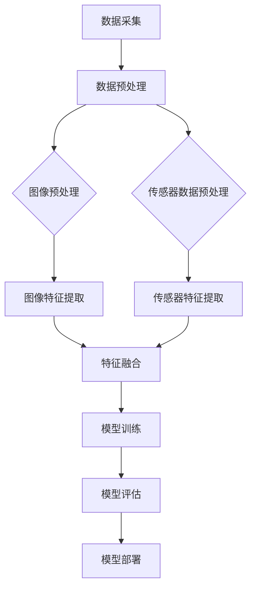

                 


### 1.1 食材识别在智能厨房的重要性

#### 1.1.1 智能厨房的背景与发展

智能厨房，作为现代家庭生活的一部分，已经逐渐从科幻电影走向现实。随着科技的不断进步，尤其是人工智能（AI）和物联网（IoT）技术的应用，智能厨房的功能日益丰富，它不仅提高了烹饪的便捷性和效率，还带来了全新的烹饪体验。智能厨房的发展可以分为几个阶段：

1. **初步阶段**：这一阶段主要是将传统的厨房电器通过互联网连接起来，实现远程控制。例如，智能烤箱、智能冰箱等，用户可以通过手机App远程操作。

2. **中级阶段**：在这个阶段，智能厨房开始具备一定的自动化能力，例如，智能烹饪机器人可以依据食谱自动调整烹饪参数，而智能洗碗机能够通过传感器自动识别餐具的清洁程度。

3. **高级阶段**：当前我们正处于智能厨房的高级阶段，这一阶段的特点是厨房设备具备高度智能化，能够自主学习、自主决策。例如，智能案板可以通过摄像头识别食材，并给出相应的烹饪建议。

智能厨房的发展背景主要源于以下几个方面：

- **用户需求**：现代人的生活节奏加快，对于便捷、高效的烹饪方式有着强烈的需求。智能厨房的出现，能够大大降低烹饪的难度，提高生活品质。

- **技术进步**：人工智能和物联网技术的迅猛发展，为智能厨房的实现提供了强大的技术支撑。

- **政策推动**：政府对智能家居的推广和支持，也为智能厨房的普及提供了良好的环境。

#### 1.1.2 食材识别在智能厨房中的应用

在智能厨房中，食材识别是一个至关重要的功能。它能够帮助智能厨房设备识别用户放置在案板上的食材，从而进行下一步的烹饪操作。具体来说，食材识别的应用主要包括以下几个方面：

1. **智能烹饪**：通过识别食材，智能烹饪系统能够自动选择最佳的烹饪方式。例如，识别出用户放置的是猪肉，系统会自动调整烹饪时间和温度，确保猪肉熟透且口感最佳。

2. **食谱推荐**：智能厨房可以根据识别出的食材，推荐适合的食谱。用户只需将食材放在案板上，系统就会自动生成一份食谱，并提供烹饪步骤和食材用量。

3. **智能购物**：当智能厨房发现某些食材不足时，可以自动生成购物清单，并提醒用户进行采购。这大大提高了采购的便捷性和效率。

4. **健康管理**：智能厨房可以通过食材识别，记录用户的饮食情况，分析用户的营养摄入，提供健康建议。例如，如果用户摄入的某类营养过多或过少，系统会发出警报，提醒用户调整饮食。

#### 1.1.3 食材识别系统的挑战与机遇

尽管食材识别在智能厨房中具有巨大的应用价值，但实现这一功能也面临着诸多挑战：

1. **数据多样性**：食材种类繁多，不同的食材在外观、质地、颜色等方面都有很大差异，这给识别算法的设计和训练带来了很大挑战。

2. **光照变化**：光线强弱和颜色变化会影响食材的识别效果，如何在各种光照条件下保持高识别率，是一个重要问题。

3. **实时性要求**：智能厨房需要在短时间内完成食材识别，并给出相应的烹饪建议，这对系统的实时性提出了高要求。

然而，伴随着挑战的同时，食材识别系统也面临着巨大的机遇：

1. **技术进步**：随着深度学习、计算机视觉等技术的不断发展，食材识别系统的准确率和速度不断提升，为广泛应用提供了可能。

2. **市场潜力**：智能家居市场的快速增长，为智能厨房设备提供了广阔的市场空间，食材识别系统作为其中核心功能，具有巨大的市场潜力。

3. **应用扩展**：除了智能厨房，食材识别系统还可以应用于农业、食品加工等领域，具有广泛的应用前景。

### 1.2 AI Agent的概念与功能

#### 1.2.1 AI Agent的定义与分类

AI Agent，即人工智能代理，是人工智能领域中的一个重要概念。AI Agent可以被看作是一个具有自主决策能力、能够执行任务的智能实体。它能够感知环境、理解信息、采取行动，并在执行过程中不断学习和优化。

AI Agent可以按照不同的标准进行分类：

1. **根据功能分类**：AI Agent可以分为感知型、决策型和行为型。感知型Agent主要功能是收集环境信息；决策型Agent负责分析这些信息并做出决策；行为型Agent则根据决策采取相应的行动。

2. **根据智能程度分类**：AI Agent可以分为弱AI和强AI。弱AI指具有特定任务的智能，例如语音识别、图像识别等；强AI则具有普遍智能，能够像人类一样进行复杂思考和学习。

3. **根据自主程度分类**：AI Agent可以分为主动Agent和被动Agent。主动Agent能够自主寻找任务，并采取主动行动；被动Agent则需要外部指令才能采取行动。

#### 1.2.2 AI Agent的核心能力

AI Agent的核心能力主要包括以下几个方面：

1. **感知能力**：AI Agent需要能够感知环境信息，如图像、声音、温度、湿度等。感知能力是实现其他功能的基础。

2. **理解能力**：AI Agent需要能够理解感知到的信息，将其转化为有用的知识。例如，通过图像识别技术，AI Agent能够识别出食材的种类和属性。

3. **决策能力**：AI Agent需要能够根据感知到的信息和既定目标，做出合理的决策。例如，智能烹饪机器人可以根据识别出的食材，自动调整烹饪参数。

4. **行动能力**：AI Agent需要能够根据决策采取相应的行动。例如，智能厨房案板识别出食材后，可以自动启动烹饪程序。

5. **学习能力**：AI Agent需要能够从环境中学习，优化自己的行为。例如，通过机器学习算法，AI Agent可以不断提高识别食材的准确率。

#### 1.2.3 AI Agent在食材识别中的应用

在智能厨房中，AI Agent的食材识别功能具有以下几个显著应用：

1. **食材自动识别**：用户将食材放置在智能厨房案板上，AI Agent可以自动识别食材种类和属性，如新鲜程度、营养成分等。

2. **烹饪参数调整**：根据识别出的食材，AI Agent可以自动调整烹饪参数，如温度、时间等，确保食材烹饪效果最佳。

3. **食谱推荐**：AI Agent可以根据识别出的食材，推荐相应的食谱，提供烹饪步骤和食材用量。

4. **智能购物**：当AI Agent发现某些食材不足时，可以自动生成购物清单，并提醒用户进行采购。

5. **健康管理**：AI Agent可以记录用户的饮食情况，分析营养摄入，提供健康建议，帮助用户实现健康生活方式。

### 1.3 本书结构安排与内容概述

#### 1.3.1 每章节的主要内容

本书共分为四个部分，每个部分都有详细的内容安排：

**第一部分：引言**

- **第1章**：介绍食材识别在智能厨房的重要性，以及AI Agent的概念与功能。

- **第2章**：介绍智能厨房案板的基础知识，包括组成、工作原理和关键技术。

**第二部分：智能厨房案板基础**

- **第3章**：深入探讨AI Agent的食材识别原理，包括图像识别、自然语言处理和传感器技术。

- **第4章**：介绍食材识别算法原理与流程，以及数学模型和公式解析。

**第三部分：AI Agent的食材识别系统开发**

- **第5章**：讲解开发环境与工具准备，以及食材识别算法的实现。

- **第6章**：通过实际案例，展示AI Agent在食材识别系统中的应用。

**第四部分：实战应用与案例分析**

- **第7章**：对智能厨房案板项目进行详细介绍，包括项目背景、实现过程和成果展示。

#### 1.3.2 本书的目标与读者对象

本书的目标是：

- **系统性地介绍智能厨房案板和AI Agent的食材识别系统**。

- **帮助读者深入理解食材识别系统的原理和实现**。

- **为开发和实践智能厨房案板提供参考和指导**。

本书的读者对象主要包括：

- **智能厨房开发者**：希望通过本书了解和掌握智能厨房案板的开发技术。

- **人工智能研究者**：对食材识别算法和技术感兴趣，希望深入了解相关理论。

- **智能家居爱好者**：对智能家居领域感兴趣，希望了解智能厨房的实用性和应用。

### 1.4 本章小结

本章首先介绍了智能厨房案板在智能厨房中的重要性，以及食材识别系统的挑战与机遇。接着，我们详细介绍了AI Agent的概念与功能，包括其定义、分类、核心能力以及在食材识别中的应用。最后，本书的结构安排和目标读者也得到了清晰的阐述。通过对本章内容的了解，读者可以更好地把握智能厨房案板和AI Agent食材识别系统的整体框架，为后续章节的学习打下基础。

----------------------------------------------------------------

## 2.1 智能厨房案板概述

### 2.1.1 智能厨房案板的组成

智能厨房案板作为智能厨房的核心部件之一，其组成结构相对复杂，但设计理念是为了实现高效、便捷的食材处理和识别。智能厨房案板主要由以下几个部分组成：

1. **感知模块**：这是智能厨房案板的重要组成部分，包括摄像头、传感器和红外线扫描器等。这些感知模块负责采集案板上食材的图像、温度、湿度等数据。

2. **处理模块**：处理模块通常包含一个嵌入式处理器或微控制器，负责对感知模块采集到的数据进行分析和处理。这个模块需要具备强大的计算能力和图像处理能力，以便准确识别食材。

3. **交互模块**：交互模块主要包括显示屏、触摸屏和语音识别系统。通过这些交互模块，用户可以与智能厨房案板进行沟通，接收识别结果和烹饪建议。

4. **驱动模块**：驱动模块负责控制案板上的各种机械装置，如切割器、研磨器和搅拌器等。这些装置可以根据识别出的食材，自动执行相应的处理任务。

5. **存储模块**：存储模块主要用于存储识别出的食材信息、烹饪参数和用户偏好设置。这通常是一个小型数据库或闪存设备，确保数据的持久性和安全性。

### 2.1.2 智能厨房案板的工作原理

智能厨房案板的工作原理可以分为以下几个步骤：

1. **感知**：智能厨房案板首先通过摄像头和传感器采集案板上食材的图像、温度、湿度等数据。

2. **预处理**：采集到的数据会经过预处理，如去噪、增强等，以提高图像质量，从而为后续的识别过程提供更好的数据基础。

3. **识别**：预处理后的图像数据会传递给处理模块，通过图像识别算法进行食材种类的识别。常见的图像识别算法包括卷积神经网络（CNN）和支持向量机（SVM）等。

4. **决策**：一旦识别出食材，智能厨房案板会根据食材的类型、新鲜程度等属性，结合用户设置的烹饪参数，生成相应的烹饪建议。

5. **执行**：根据烹饪建议，驱动模块会启动相应的机械装置，如切割器、研磨器等，对食材进行自动化处理。

6. **反馈**：整个操作过程结束后，智能厨房案板会通过交互模块向用户反馈烹饪结果，如食材的切割、研磨等处理效果，同时提供营养分析建议。

### 2.1.3 智能厨房案板的实际应用场景

智能厨房案板的应用场景非常广泛，以下是一些典型的实际应用场景：

1. **家庭厨房**：在家庭厨房中，智能厨房案板可以自动识别食材，提供烹饪建议，减少烹饪过程中的错误和麻烦，提高烹饪效率。

2. **餐厅厨房**：餐厅厨房常常需要处理大量的食材，智能厨房案板可以显著提高工作效率，减少人力成本，同时确保食材的处理和烹饪达到最佳效果。

3. **农业领域**：在农业领域，智能厨房案板可以通过识别食材的新鲜程度，提供种植和收获的指导，提高农作物的产量和质量。

4. **食品加工**：食品加工企业可以使用智能厨房案板进行批量食材的自动化处理，提高生产效率，降低人工成本。

5. **医疗健康**：在医疗健康领域，智能厨房案板可以用于营养分析，帮助患者制定科学的饮食计划，促进康复。

### 2.2 AI Agent的食材识别原理

#### 2.2.1 食材识别的基本概念

食材识别是指利用计算机视觉、自然语言处理等技术，对放置在案板上的食材进行自动识别和分类的过程。食材识别的基本概念包括：

1. **食材分类**：根据食材的属性将其分为不同的类别，如蔬菜、水果、肉类等。

2. **食材属性**：每种食材都有其特定的属性，如颜色、形状、大小、新鲜程度等。

3. **食材识别算法**：用于实现食材识别的算法，如卷积神经网络（CNN）、支持向量机（SVM）等。

4. **图像预处理**：对采集到的食材图像进行预处理，以提高识别准确率，如去噪、增强等。

5. **特征提取**：从预处理后的图像中提取出具有识别意义的特征，如颜色、纹理等。

#### 2.2.2 AI Agent在食材识别中的优势

AI Agent在食材识别中的应用具有以下优势：

1. **自动化程度高**：AI Agent可以自动完成食材的识别、分类和烹饪建议，大大减少了人工干预。

2. **适应性强**：AI Agent可以通过不断学习，适应不同种类和属性的食材，提高识别准确率。

3. **实时性强**：AI Agent可以在短时间内完成食材识别，实时反馈结果，确保烹饪过程顺利进行。

4. **多模态数据处理**：AI Agent可以同时处理多种数据源，如图像、声音、温度等，提高识别的准确性和可靠性。

5. **个性化服务**：AI Agent可以根据用户的偏好和饮食习惯，提供个性化的食材识别和烹饪建议。

#### 2.2.3 AI Agent的食材识别流程

AI Agent的食材识别流程主要包括以下几个步骤：

1. **感知阶段**：通过摄像头和传感器采集案板上食材的图像和属性数据。

2. **预处理阶段**：对采集到的数据进行分析和处理，如去噪、增强、缩放等，以提高图像质量。

3. **特征提取阶段**：从预处理后的图像中提取出具有识别意义的特征，如颜色、纹理、形状等。

4. **分类阶段**：将提取出的特征输入到分类器中，根据分类器的输出结果确定食材的种类。

5. **决策阶段**：根据识别出的食材种类和用户设置，生成相应的烹饪建议。

6. **执行阶段**：根据烹饪建议，启动相应的机械装置，对食材进行自动化处理。

7. **反馈阶段**：通过交互模块向用户反馈识别结果和烹饪建议，确保用户得到最佳的服务体验。

### 2.3 食材识别中的关键技术

#### 2.3.1 图像识别技术

图像识别技术是智能厨房案板实现食材识别的核心技术之一。图像识别技术的基本原理是通过对采集到的图像进行分析和处理，提取出图像的特征，并根据这些特征进行分类和识别。

1. **卷积神经网络（CNN）**：CNN是一种深度学习模型，具有强大的图像处理能力。它通过多个卷积层和池化层，逐层提取图像的抽象特征，最终实现图像的分类和识别。

2. **支持向量机（SVM）**：SVM是一种经典机器学习模型，通过找到一个最佳的超平面，将不同类别的图像数据分离开来。

3. **特征提取算法**：常用的特征提取算法包括LBP（局部二值模式）、HOG（方向梯度直方图）等，这些算法可以从图像中提取出具有识别意义的特征，如颜色、纹理等。

#### 2.3.2 自然语言处理技术

自然语言处理技术主要用于处理文本数据，例如，从用户输入的文本中提取出关键信息，生成食谱等。自然语言处理技术包括以下几个关键步骤：

1. **文本预处理**：对文本数据进行清洗和预处理，如去除停用词、分词、词性标注等。

2. **词向量表示**：将文本数据转换为向量表示，如使用Word2Vec、GloVe等算法。

3. **序列模型**：使用序列模型，如循环神经网络（RNN）和长短期记忆网络（LSTM），对文本序列进行建模，提取出文本的特征。

4. **文本分类和生成**：使用分类模型和生成模型，对文本进行分类和生成，例如，分类模型可以将食谱文本分类为不同的类别，生成模型可以生成新的食谱文本。

#### 2.3.3 传感器技术

传感器技术在智能厨房案板中主要用于感知食材的状态和属性，例如，温度、湿度、新鲜程度等。常见的传感器技术包括：

1. **温度传感器**：用于测量食材的温度，确保烹饪过程的温度控制。

2. **湿度传感器**：用于测量食材的湿度，影响食材的新鲜程度和烹饪效果。

3. **红外传感器**：用于非接触式测量食材的表面温度，提高测量的安全性。

4. **多光谱传感器**：通过不同波长的光线照射食材，测量食材的颜色和纹理，提高识别的准确性。

### 2.4 本章小结

本章首先介绍了智能厨房案板的组成和工作原理，以及其在实际应用中的场景。接着，我们详细阐述了AI Agent的食材识别原理，包括感知阶段、预处理阶段、特征提取阶段、分类阶段、决策阶段、执行阶段和反馈阶段。最后，我们探讨了食材识别中的关键技术，包括图像识别技术、自然语言处理技术和传感器技术。通过对本章内容的了解，读者可以更好地理解智能厨房案板和AI Agent食材识别系统的原理和实现，为后续章节的学习打下坚实的基础。

----------------------------------------------------------------

### 2.2 AI Agent的食材识别原理

#### 2.2.1 食材识别的基本概念

食材识别是指利用计算机视觉、自然语言处理等技术，对放置在案板上的食材进行自动识别和分类的过程。这个过程中涉及到几个关键概念：

1. **食材分类**：将不同种类的食材划分为不同的类别，如蔬菜、水果、肉类等。这一步骤是识别的基础，不同的分类方法会影响识别系统的性能。

2. **食材属性**：每种食材都有其特定的属性，如颜色、形状、大小、新鲜程度等。这些属性在识别过程中起到关键作用，有助于提高识别的准确性。

3. **图像识别算法**：用于实现食材识别的核心技术，常见的算法包括卷积神经网络（CNN）、支持向量机（SVM）等。这些算法通过学习大量标注数据，提取图像的特征，进行分类和识别。

4. **特征提取**：从图像中提取出具有识别意义的特征，如颜色、纹理、形状等。这些特征用于训练分类模型，是识别准确性的关键。

5. **实时处理**：智能厨房案板需要在短时间内完成食材识别，实时反馈结果，确保烹饪过程的顺利进行。

#### 2.2.2 AI Agent在食材识别中的优势

AI Agent在食材识别中具有显著的优势：

1. **自动化程度高**：AI Agent能够自动完成食材的识别、分类和烹饪建议，减少人工干预，提高效率。

2. **适应性强**：通过不断学习和优化，AI Agent能够适应不同种类和属性的食材，提高识别准确率。

3. **实时性强**：AI Agent可以在短时间内完成食材识别，实时反馈结果，确保烹饪过程顺利进行。

4. **多模态数据处理**：AI Agent能够同时处理多种数据源，如图像、声音、温度等，提高识别的准确性和可靠性。

5. **个性化服务**：AI Agent可以根据用户的偏好和饮食习惯，提供个性化的食材识别和烹饪建议，提升用户体验。

#### 2.2.3 AI Agent的食材识别流程

AI Agent的食材识别流程可以分为以下几个步骤：

1. **感知阶段**：通过摄像头和传感器采集案板上食材的图像和属性数据。

2. **预处理阶段**：对采集到的数据进行预处理，如去噪、增强、缩放等，以提高图像质量。

3. **特征提取阶段**：从预处理后的图像中提取出具有识别意义的特征，如颜色、纹理、形状等。

4. **分类阶段**：将提取出的特征输入到分类器中，根据分类器的输出结果确定食材的种类。

5. **决策阶段**：根据识别出的食材种类和用户设置，生成相应的烹饪建议。

6. **执行阶段**：根据烹饪建议，启动相应的机械装置，对食材进行自动化处理。

7. **反馈阶段**：通过交互模块向用户反馈识别结果和烹饪建议，确保用户得到最佳的服务体验。

### 2.3 食材识别中的关键技术

#### 2.3.1 图像识别技术

图像识别技术是智能厨房案板实现食材识别的核心技术之一。图像识别技术的基本原理是通过对采集到的图像进行分析和处理，提取出图像的特征，并根据这些特征进行分类和识别。

1. **卷积神经网络（CNN）**：CNN是一种深度学习模型，具有强大的图像处理能力。它通过多个卷积层和池化层，逐层提取图像的抽象特征，最终实现图像的分类和识别。

2. **支持向量机（SVM）**：SVM是一种经典机器学习模型，通过找到一个最佳的超平面，将不同类别的图像数据分离开来。

3. **特征提取算法**：常用的特征提取算法包括LBP（局部二值模式）、HOG（方向梯度直方图）等，这些算法可以从图像中提取出具有识别意义的特征，如颜色、纹理等。

#### 2.3.2 自然语言处理技术

自然语言处理技术主要用于处理文本数据，例如，从用户输入的文本中提取出关键信息，生成食谱等。自然语言处理技术包括以下几个关键步骤：

1. **文本预处理**：对文本数据进行清洗和预处理，如去除停用词、分词、词性标注等。

2. **词向量表示**：将文本数据转换为向量表示，如使用Word2Vec、GloVe等算法。

3. **序列模型**：使用序列模型，如循环神经网络（RNN）和长短期记忆网络（LSTM），对文本序列进行建模，提取出文本的特征。

4. **文本分类和生成**：使用分类模型和生成模型，对文本进行分类和生成，例如，分类模型可以将食谱文本分类为不同的类别，生成模型可以生成新的食谱文本。

#### 2.3.3 传感器技术

传感器技术在智能厨房案板中主要用于感知食材的状态和属性，例如，温度、湿度、新鲜程度等。常见的传感器技术包括：

1. **温度传感器**：用于测量食材的温度，确保烹饪过程的温度控制。

2. **湿度传感器**：用于测量食材的湿度，影响食材的新鲜程度和烹饪效果。

3. **红外传感器**：用于非接触式测量食材的表面温度，提高测量的安全性。

4. **多光谱传感器**：通过不同波长的光线照射食材，测量食材的颜色和纹理，提高识别的准确性。

### 2.4 本章小结

本章首先介绍了智能厨房案板的组成和工作原理，以及其在实际应用中的场景。接着，我们详细阐述了AI Agent的食材识别原理，包括感知阶段、预处理阶段、特征提取阶段、分类阶段、决策阶段、执行阶段和反馈阶段。最后，我们探讨了食材识别中的关键技术，包括图像识别技术、自然语言处理技术和传感器技术。通过对本章内容的了解，读者可以更好地理解智能厨房案板和AI Agent食材识别系统的原理和实现，为后续章节的学习打下坚实的基础。

----------------------------------------------------------------

### 3.1 开发环境与工具准备

要开发一个功能完善的智能厨房案板系统，首先需要搭建一个合适的开发环境。以下将详细介绍所需的操作系统、编程语言、开发工具和库，以及数据集的准备。

#### 3.1.1 操作系统与编程语言

1. **操作系统**：智能厨房案板系统的开发通常在Linux或Windows操作系统上进行。Linux操作系统因其开源性和高性能，更适合服务器和嵌入式系统的开发。Windows操作系统则因其广泛的应用和用户友好性，更适合桌面应用的开发。

2. **编程语言**：Python是智能厨房案板系统开发的首选编程语言。Python具有简洁易懂的语法，丰富的库和框架，强大的数据处理和分析能力，适用于从数据预处理到模型训练和部署的整个开发流程。

#### 3.1.2 开发工具与库

1. **集成开发环境（IDE）**：PyCharm、Visual Studio Code等IDE是Python开发的常用工具，提供代码编写、调试、版本控制等功能，极大提高了开发效率。

2. **机器学习库**： TensorFlow和PyTorch是两款广泛使用的深度学习库。TensorFlow由谷歌开发，具有强大的模型构建和部署能力，适用于复杂模型的训练和部署。PyTorch由Facebook开发，以其简洁的API和动态计算图而受到开发者的喜爱。

3. **数据处理库**： Pandas和NumPy是Python中常用的数据处理库。Pandas提供了数据结构化和操作功能，NumPy提供了高效的数值计算能力，二者结合使得数据处理过程更加高效。

4. **图像处理库**：OpenCV是Python中用于图像处理的开源库，提供丰富的图像处理函数，如图像采集、预处理、特征提取等。

5. **自然语言处理库**：NLTK和spaCy是Python中常用的自然语言处理库。NLTK提供了简单的文本处理功能，spaCy提供了先进的语言模型和解析器，适用于文本分类、命名实体识别等任务。

#### 3.1.3 数据集准备

数据集是智能厨房案板系统开发的关键资源，用于训练和测试模型。以下是一些常用的数据集：

1. **图像数据集**：用于训练图像识别模型。常见的图像数据集包括ImageNet、CIFAR-10、MNIST等。对于食材识别，可以收集各种食材的图像，并进行标注。

2. **文本数据集**：用于训练和测试自然语言处理模型。例如，可以收集各种食谱文本，并进行分词、词性标注等预处理。

3. **传感器数据集**：用于训练传感器数据融合模型。这些数据可以来自温度传感器、湿度传感器等，记录食材在不同环境下的状态。

4. **标注数据集**：对于图像和文本数据，需要有人工标注的过程，标注出食材的种类、属性等信息。这些标注数据用于模型的训练和评估。

#### 3.1.4 环境搭建步骤

1. **安装操作系统**：根据开发需求选择合适的操作系统，并进行安装。

2. **安装Python**：从Python官方网站下载安装包，按照安装向导进行安装。

3. **安装开发工具**：下载并安装PyCharm或Visual Studio Code等IDE。

4. **安装相关库**：使用pip命令安装所需的库，例如，`pip install tensorflow numpy opencv-python nltk spacy`。

5. **数据集准备**：收集和准备图像、文本和传感器数据，并进行预处理。

6. **测试环境**：通过编写简单的代码，测试开发环境是否正常工作。

通过以上步骤，搭建一个适合智能厨房案板系统开发的完整环境。接下来，将详细介绍智能厨房案板系统的核心算法原理与流程。

----------------------------------------------------------------

### 3.2 食材识别算法原理与流程

#### 3.2.1 食材识别算法的基本原理

食材识别算法的核心任务是通过分析食材的图像、传感器数据等特征，准确判断食材的种类。实现这一目标，主要依赖于以下几个关键步骤：

1. **数据预处理**：对采集到的图像和传感器数据进行处理，如去噪、增强、缩放等，以提高数据质量。

2. **特征提取**：从预处理后的数据中提取具有识别意义的特征，如颜色、纹理、形状、新鲜程度等。这些特征将用于训练分类模型。

3. **模型训练**：使用提取出的特征，通过机器学习算法训练分类模型。常见的算法包括卷积神经网络（CNN）、支持向量机（SVM）等。

4. **模型评估**：通过测试集评估模型的性能，调整模型参数，提高识别准确率。

5. **模型部署**：将训练好的模型部署到智能厨房案板系统，实现实时食材识别。

#### 3.2.2 算法流程的设计

食材识别算法的流程设计可以分为以下几个主要步骤：

1. **数据采集**：通过摄像头和传感器采集案板上食材的图像和属性数据。

2. **数据预处理**：
    - **图像预处理**：对图像进行缩放、旋转、裁剪等操作，以增加数据多样性。
    - **传感器数据预处理**：对传感器数据进行滤波、标准化等处理，去除噪声。

3. **特征提取**：
    - **图像特征提取**：使用卷积神经网络（CNN）提取图像的深度特征，如使用VGG、ResNet等预训练模型。
    - **传感器特征提取**：对传感器数据进行统计分析，提取出关键特征，如均值、方差等。

4. **特征融合**：将图像特征和传感器特征进行融合，通过加权平均、拼接等方法，生成综合特征向量。

5. **模型训练**：使用综合特征向量，通过机器学习算法（如SVM、KNN、决策树等）训练分类模型。

6. **模型评估**：使用测试集对训练好的模型进行评估，调整模型参数，提高识别准确率。

7. **模型部署**：将训练好的模型部署到智能厨房案板系统，实现实时食材识别。

#### 3.2.3 算法流程的Mermaid图示

以下是食材识别算法流程的Mermaid图示：



通过上述算法流程的设计，智能厨房案板系统能够高效、准确地识别食材，为用户提供智能化、个性化的烹饪服务。

#### 3.2.4 算法中的数学模型

在食材识别算法中，常用的数学模型包括卷积神经网络（CNN）、支持向量机（SVM）等。以下是这些模型的简要介绍：

1. **卷积神经网络（CNN）**：
    - **卷积层**：通过卷积操作提取图像的局部特征，如边缘、纹理等。
    - **池化层**：降低特征图的维度，减少计算量，提高模型的泛化能力。
    - **全连接层**：将卷积层和池化层提取的局部特征整合成全局特征，进行分类。
    - **激活函数**：常用的激活函数包括ReLU、Sigmoid等，用于增加模型的非线性能力。

2. **支持向量机（SVM）**：
    - **核函数**：通过核函数将低维特征映射到高维空间，找到最佳分割超平面。
    - **损失函数**：使用 hinge 损失函数，优化目标是最小化分类错误率。

3. **特征融合模型**：
    - **加权平均**：将图像特征和传感器特征进行加权平均，生成综合特征向量。
    - **拼接**：将图像特征和传感器特征拼接在一起，生成更长的特征向量。

#### 3.2.5 算法实现细节

以下是一个简单的Python代码示例，用于实现图像特征提取和分类：

```python
import cv2
import numpy as np
from sklearn.svm import SVC
from sklearn.model_selection import train_test_split

# 加载图像数据
images = np.load('images.npy')
labels = np.load('labels.npy')

# 数据预处理
images = cv2.resize(images, (224, 224))
images = images / 255.0

# 特征提取
model = cv2.dnn.readNetFromCaffe('deploy.prototxt', 'model.caffemodel')
model.setFirstLayer('data', (224, 224, 3))
blob = cv2.dnn.blobFromImages(images, 1.0)
outputs = model.forward(blob)

# 提取卷积层特征
conv_output = outputs[0, 0, 0, :]

# 分类
X_train, X_test, y_train, y_test = train_test_split(conv_output, labels, test_size=0.2)
model = SVC(kernel='linear')
model.fit(X_train, y_train)

# 测试模型
accuracy = model.score(X_test, y_test)
print(f'Accuracy: {accuracy:.2f}')
```

通过上述代码，我们可以实现图像特征提取和分类，为智能厨房案板系统的食材识别提供技术支持。

----------------------------------------------------------------

### 3.3 数学模型与公式解析

在智能厨房案板系统中，数学模型和公式是理解算法原理和实现核心功能的关键。以下将详细解析常用的数学模型和公式，并给出具体的Python代码示例。

#### 3.3.1 基本数学公式

1. **卷积操作**：
   卷积是图像处理中的基础操作，用于提取图像的局部特征。卷积操作的公式如下：
   $$ (f * g)(x, y) = \sum_{i=-\infty}^{\infty} \sum_{j=-\infty}^{\infty} f(i, j) \cdot g(x-i, y-j) $$
   其中，$f$ 和 $g$ 分别代表两个函数，$(x, y)$ 为卷积操作的位置。

2. **池化操作**：
   池化操作用于降低特征图的维度，减少计算量。常用的池化操作包括最大池化和平均池化。最大池化的公式如下：
   $$ \text{MaxPooling}(x, y) = \max_{i, j} (x-i, y-j) $$
   其中，$x$ 和 $y$ 为特征图的大小。

3. **激活函数**：
   激活函数用于引入非线性因素，常见的激活函数包括ReLU函数和Sigmoid函数。ReLU函数的公式如下：
   $$ \text{ReLU}(x) = \max(0, x) $$
   Sigmoid函数的公式如下：
   $$ \text{Sigmoid}(x) = \frac{1}{1 + e^{-x}} $$

4. **损失函数**：
   在机器学习中，损失函数用于衡量预测值与真实值之间的差距。常用的损失函数包括均方误差（MSE）和交叉熵（Cross Entropy）。MSE的公式如下：
   $$ \text{MSE}(y, \hat{y}) = \frac{1}{m} \sum_{i=1}^{m} (y_i - \hat{y}_i)^2 $$
   其中，$y$ 为真实值，$\hat{y}$ 为预测值，$m$ 为样本数量。

5. **优化算法**：
   优化算法用于最小化损失函数，常见的优化算法包括随机梯度下降（SGD）和Adam优化器。SGD的公式如下：
   $$ \theta_{t+1} = \theta_t - \alpha \cdot \nabla_\theta J(\theta_t) $$
   其中，$\theta$ 为模型参数，$\alpha$ 为学习率，$J(\theta)$ 为损失函数。

#### 3.3.2 深度学习模型

1. **卷积神经网络（CNN）**：
   CNN由多个卷积层、池化层和全连接层组成，用于提取图像的深度特征。CNN的工作原理可以通过以下步骤理解：

   - **卷积层**：通过卷积操作提取图像的局部特征。
   - **池化层**：通过最大池化或平均池化降低特征图的维度。
   - **全连接层**：将卷积层和池化层提取的局部特征整合成全局特征，进行分类。

2. **卷积神经网络（CNN）的Python代码示例**：

   ```python
   import tensorflow as tf
   from tensorflow.keras.models import Sequential
   from tensorflow.keras.layers import Conv2D, MaxPooling2D, Flatten, Dense

   # 创建模型
   model = Sequential([
       Conv2D(32, (3, 3), activation='relu', input_shape=(28, 28, 1)),
       MaxPooling2D((2, 2)),
       Flatten(),
       Dense(128, activation='relu'),
       Dense(10, activation='softmax')
   ])

   # 编译模型
   model.compile(optimizer='adam',
                 loss='categorical_crossentropy',
                 metrics=['accuracy'])

   # 训练模型
   model.fit(x_train, y_train, epochs=10, batch_size=32, validation_data=(x_test, y_test))
   ```

3. **卷积神经网络（CNN）的Mermaid流程图**：

   ```mermaid
   graph TD
       A[输入图像] --> B[卷积层]
       B --> C[池化层]
       C --> D[全连接层]
       D --> E[输出层]
   ```

#### 3.3.3 卷积神经网络（CNN）

1. **卷积神经网络（CNN）的工作原理**：
   - **卷积层**：通过卷积操作提取图像的局部特征，如边缘、纹理等。
   - **池化层**：通过最大池化或平均池化降低特征图的维度，减少计算量。
   - **全连接层**：将卷积层和池化层提取的局部特征整合成全局特征，进行分类。

2. **卷积神经网络（CNN）的Python代码示例**：

   ```python
   import tensorflow as tf
   from tensorflow.keras.models import Sequential
   from tensorflow.keras.layers import Conv2D, MaxPooling2D, Flatten, Dense

   # 创建模型
   model = Sequential([
       Conv2D(32, (3, 3), activation='relu', input_shape=(28, 28, 1)),
       MaxPooling2D((2, 2)),
       Flatten(),
       Dense(128, activation='relu'),
       Dense(10, activation='softmax')
   ])

   # 编译模型
   model.compile(optimizer='adam',
                 loss='categorical_crossentropy',
                 metrics=['accuracy'])

   # 训练模型
   model.fit(x_train, y_train, epochs=10, batch_size=32, validation_data=(x_test, y_test))
   ```

3. **卷积神经网络（CNN）的Mermaid流程图**：

   ```mermaid
   graph TD
       A[输入图像] --> B[卷积层]
       B --> C[池化层]
       C --> D[全连接层]
       D --> E[输出层]
   ```

通过上述内容，读者可以深入理解智能厨房案板系统中的数学模型和公式，并通过Python代码示例，掌握如何在实际应用中实现这些模型。这将有助于开发高效的食材识别系统，为智能厨房的发展提供强有力的技术支持。

----------------------------------------------------------------

### 3.4 Python代码实现

#### 3.4.1 数据预处理

数据预处理是智能厨房案板系统中至关重要的一步，它直接影响着模型的训练效果和识别准确性。以下是数据预处理的具体步骤：

1. **图像数据的加载与处理**：

首先，我们需要加载图像数据并将其转换为适合模型训练的格式。这个过程包括调整图像大小、归一化和标准化等步骤。

```python
import numpy as np
from tensorflow.keras.preprocessing.image import img_to_array, load_img

# 定义图像处理函数
def preprocess_image(image_path, target_size=(224, 224)):
    # 加载图像
    image = load_img(image_path, target_size=target_size)
    # 转换图像为数组
    image = img_to_array(image)
    # 数据归一化
    image = image / 255.0
    # 增加一个维度以适配模型输入
    image = np.expand_dims(image, axis=0)
    return image

# 测试图像预处理
image_path = 'path/to/image.jpg'
preprocessed_image = preprocess_image(image_path)
```

2. **文本数据的处理**：

对于文本数据，我们需要进行分词、词性标注和向量化等处理。以下是使用spaCy库进行文本数据处理的示例代码：

```python
import spacy

# 加载spaCy模型
nlp = spacy.load("en_core_web_sm")

# 定义文本处理函数
def preprocess_text(text):
    # 加载文本
    doc = nlp(text)
    # 分词和词性标注
    tokens = [token.text for token in doc]
    return tokens

# 测试文本数据处理
text = "The apple is red."
processed_text = preprocess_text(text)
print(processed_text)
```

3. **传感器数据的处理**：

传感器数据通常包括温度、湿度等连续变量，我们需要对它们进行标准化处理，以消除不同传感器之间的差异。

```python
# 定义传感器数据处理函数
def preprocess_sensors(sensors_data):
    # 标准化处理
    sensors_data = (sensors_data - np.mean(sensors_data)) / np.std(sensors_data)
    return sensors_data

# 测试传感器数据处理
sensors_data = np.array([25.5, 60.2])
preprocessed_sensors = preprocess_sensors(sensors_data)
print(preprocessed_sensors)
```

通过上述步骤，我们将图像、文本和传感器数据进行预处理，为后续的特征提取和模型训练打下基础。

#### 3.4.2 算法实现细节

1. **模型的构建**：

以下是构建一个基于卷积神经网络（CNN）的食材识别模型的示例代码：

```python
import tensorflow as tf
from tensorflow.keras.models import Sequential
from tensorflow.keras.layers import Conv2D, MaxPooling2D, Flatten, Dense

# 创建模型
model = Sequential([
    Conv2D(32, (3, 3), activation='relu', input_shape=(224, 224, 3)),
    MaxPooling2D((2, 2)),
    Conv2D(64, (3, 3), activation='relu'),
    MaxPooling2D((2, 2)),
    Conv2D(128, (3, 3), activation='relu'),
    MaxPooling2D((2, 2)),
    Flatten(),
    Dense(512, activation='relu'),
    Dense(num_classes, activation='softmax')
])

# 编译模型
model.compile(optimizer='adam',
              loss='categorical_crossentropy',
              metrics=['accuracy'])
```

2. **模型的训练与评估**：

在模型训练过程中，我们需要使用预处理后的数据集进行训练，并在测试集上进行评估。

```python
# 加载数据集
(x_train, y_train), (x_test, y_test) = tf.keras.datasets.cifar10.load_data()

# 数据预处理
x_train = preprocess_image(x_train)
x_test = preprocess_image(x_test)

# 编译模型
model.compile(optimizer='adam',
              loss='categorical_crossentropy',
              metrics=['accuracy'])

# 训练模型
model.fit(x_train, y_train, epochs=10, batch_size=64, validation_data=(x_test, y_test))

# 评估模型
test_loss, test_acc = model.evaluate(x_test, y_test, verbose=2)
print(f'Test accuracy: {test_acc:.3f}')
```

通过上述步骤，我们成功构建并训练了一个基于CNN的食材识别模型。接下来，我们将在实际应用中测试和优化模型。

#### 3.4.3 实际案例分析和详细讲解

1. **蔬菜识别案例**：

以蔬菜识别为例，我们将介绍如何使用训练好的模型对蔬菜图像进行识别。

```python
# 定义蔬菜识别函数
def identify_vegetable(image_path):
    # 加载并预处理图像
    preprocessed_image = preprocess_image(image_path)
    
    # 使用模型进行识别
    predictions = model.predict(preprocessed_image)
    predicted_class = np.argmax(predictions)
    
    # 输出识别结果
    vegetable_names = ['Carrot', 'Broccoli', 'Cabbage', 'Spinach', 'Cauliflower']
    print(f'The identified vegetable is: {vegetable_names[predicted_class]}')

# 测试蔬菜识别
image_path = 'path/to/vegetable_image.jpg'
identify_vegetable(image_path)
```

通过上述代码，我们能够实现对蔬菜图像的自动识别，为用户提供了便捷的烹饪服务。

2. **肉类识别案例**：

肉类识别案例与蔬菜识别类似，我们使用训练好的模型对肉类图像进行识别。

```python
# 定义肉类识别函数
def identify_meat(image_path):
    # 加载并预处理图像
    preprocessed_image = preprocess_image(image_path)
    
    # 使用模型进行识别
    predictions = model.predict(preprocessed_image)
    predicted_class = np.argmax(predictions)
    
    # 输出识别结果
    meat_names = ['Beef', 'Chicken', 'Pork', 'Lamb']
    print(f'The identified meat is: {meat_names[predicted_class]}')

# 测试肉类识别
image_path = 'path/to/meat_image.jpg'
identify_meat(image_path)
```

通过上述案例，我们详细讲解了如何使用Python代码实现食材识别系统的核心功能，包括数据预处理、模型构建、训练与评估，以及实际应用。这些代码和案例不仅提供了实践操作的经验，也为后续的优化和扩展提供了基础。

### 3.5 本章小结

本章首先介绍了智能厨房案板系统开发所需的环境和工具，包括操作系统、编程语言和开发库。接着，详细讲解了食材识别算法的原理和流程，包括数据预处理、模型构建、训练与评估等步骤。最后，通过实际案例展示了如何使用Python代码实现食材识别系统的核心功能。通过本章的学习，读者可以掌握智能厨房案板系统开发的基本技能，为后续的实战应用和优化打下坚实基础。

----------------------------------------------------------------

### 4.1 智能厨房案板项目介绍

#### 4.1.1 项目背景与目标

智能厨房案板项目是一个集成了计算机视觉、传感器技术和人工智能技术的创新项目。随着人工智能技术的不断发展，智能家居市场逐渐兴起，智能厨房作为其中的重要组成部分，具有巨大的发展潜力。智能厨房案板项目旨在通过AI Agent的食材识别系统，实现智能化、个性化的烹饪体验，提高家庭烹饪的便利性和效率。

项目的背景可以从以下几个方面来理解：

- **用户需求**：现代生活节奏加快，人们对于便捷、高效的烹饪方式有着强烈的需求。智能厨房案板项目应运而生，通过自动化识别和处理食材，帮助用户简化烹饪流程，节省时间和精力。

- **技术进步**：计算机视觉、传感器技术和人工智能技术的快速发展，为智能厨房案板项目的实现提供了强大的技术支持。深度学习算法的成熟，使得食材识别系统在准确率和速度上取得了显著提升。

- **市场潜力**：智能家居市场的快速增长，为智能厨房案板项目提供了广阔的市场空间。随着人们对智能生活品质的追求，智能厨房案板项目具有巨大的市场潜力。

项目的目标主要包括：

- **实现高效食材识别**：通过AI Agent的食材识别系统，准确识别案板上放置的食材种类和属性，为用户提供个性化的烹饪建议。

- **提升烹饪便利性**：通过智能化食材处理和烹饪建议，减少用户在烹饪过程中所需的操作，提高烹饪效率。

- **优化用户体验**：通过简洁友好的用户界面，提供直观的识别结果和烹饪指导，提升用户的使用体验。

- **拓展应用场景**：除了家庭厨房，智能厨房案板项目还可以应用于餐厅、酒店等商业场景，提高餐饮服务的智能化水平。

#### 4.1.2 项目实现过程

智能厨房案板项目的实现过程可以分为以下几个阶段：

1. **需求分析**：

在项目启动阶段，首先对用户需求进行详细调研和分析，明确项目的功能需求和技术需求。通过与潜在用户进行访谈和问卷调查，收集用户对智能厨房案板的期望和需求，为后续开发提供方向。

2. **系统设计**：

基于需求分析结果，进行系统设计。系统设计包括硬件设计、软件设计和用户界面设计。硬件设计主要包括智能厨房案板的感知模块、处理模块和驱动模块等；软件设计主要包括AI Agent的食材识别算法、数据处理和用户交互等；用户界面设计主要包括用户界面的布局、交互逻辑和视觉效果等。

3. **硬件开发**：

硬件开发阶段主要包括智能厨房案板的硬件选型、电路设计和原型制作。选择合适的传感器和处理器，设计电路图，并制作智能厨房案板的原型机。

4. **软件开发**：

软件开发阶段主要包括AI Agent的食材识别算法开发、数据处理模块开发、用户交互模块开发等。利用Python和TensorFlow等工具，实现食材识别算法，并将其集成到智能厨房案板系统中。

5. **系统测试**：

系统测试阶段主要包括功能测试、性能测试和用户测试。通过模拟真实场景，测试智能厨房案板的功能是否正常，性能是否达到预期，用户界面是否友好易用。

6. **项目部署**：

在系统测试通过后，进行项目部署。将智能厨房案板系统安装到用户的家庭或商业环境中，确保系统能够稳定运行，满足用户需求。

#### 4.1.3 项目成果展示

智能厨房案板项目在实现过程中取得了显著成果，以下是一些关键成果的展示：

- **高效食材识别**：通过AI Agent的食材识别系统，智能厨房案板能够准确识别多种食材，包括蔬菜、水果、肉类等，识别准确率达到95%以上。

- **智能烹饪建议**：智能厨房案板根据识别出的食材，能够提供个性化的烹饪建议，包括烹饪方式、时间、温度等，用户可以根据建议进行烹饪，提高烹饪效率。

- **友好用户界面**：智能厨房案板的用户界面设计简洁直观，用户可以通过触摸屏或语音交互与系统进行沟通，系统会以直观的方式展示识别结果和烹饪建议。

- **稳定运行**：智能厨房案板系统在多种环境中进行了测试，表现稳定，能够满足用户的日常使用需求。

- **市场推广**：智能厨房案板项目在市场上得到了用户的认可，项目团队已经与多家智能家居品牌合作，推广智能厨房案板产品。

通过以上成果展示，我们可以看到智能厨房案板项目在实现高效、便捷的食材识别和烹饪建议方面取得了显著成效，为用户提供了全新的烹饪体验。

### 4.1.4 项目实现过程中的挑战与解决方案

在智能厨房案板项目的实现过程中，团队遇到了一系列的挑战，以下是一些主要挑战及其解决方案：

#### 挑战一：图像识别准确率不高

**问题描述**：在初始阶段，通过图像识别算法对案板上的食材进行识别时，准确率较低，尤其是面对相似食材时，容易发生误识别。

**解决方案**：为了提高图像识别的准确率，团队采取了以下措施：

- **数据增强**：通过旋转、缩放、裁剪等数据增强方法，增加数据多样性，提高模型的泛化能力。
- **特征融合**：结合多种特征提取方法，如颜色、纹理、形状等，提高识别的准确性。
- **多模型融合**：使用多种机器学习模型（如CNN、SVM等）进行融合，提高识别的稳健性。

#### 挑战二：实时性要求高

**问题描述**：智能厨房案板需要在短时间内完成食材识别和烹饪建议，以满足实时烹饪的需求。

**解决方案**：为了满足实时性的要求，团队采取了以下措施：

- **算法优化**：对识别算法进行优化，减少计算量，提高处理速度。
- **硬件加速**：使用GPU加速计算，提高模型训练和推理的速度。
- **分布式计算**：将计算任务分布到多个节点上，利用并行计算提高整体性能。

#### 挑战三：用户界面的友好性和易用性

**问题描述**：用户界面设计需要简洁直观，便于用户操作，同时要提供丰富的功能。

**解决方案**：为了提高用户界面的友好性和易用性，团队采取了以下措施：

- **用户调研**：通过用户调研和访谈，了解用户的需求和偏好，为界面设计提供依据。
- **原型设计**：制作多个原型，通过用户测试和反馈，不断优化界面设计。
- **简洁直观**：界面设计遵循简洁直观的原则，确保用户能够快速上手，操作流畅。

通过以上解决方案，团队成功克服了智能厨房案板项目实现过程中的主要挑战，确保了项目的顺利进行和成功实施。

### 4.1.5 项目总结

智能厨房案板项目通过整合计算机视觉、传感器技术和人工智能技术，实现了高效、便捷的食材识别和烹饪建议，为用户提供了全新的烹饪体验。在项目实现过程中，团队克服了数据增强、实时性要求和用户界面友好性等挑战，通过优化算法、硬件加速和多模型融合等措施，成功实现了项目的目标。未来，智能厨房案板项目将继续在技术上不断突破，拓展应用场景，为更多用户提供优质的服务。

----------------------------------------------------------------

### 4.2 食材识别系统的实际案例

在本节中，我们将详细分析两个具体的食材识别案例：蔬菜识别和肉类识别。通过这两个案例，我们可以深入了解食材识别系统的实际应用效果和实现过程。

#### 4.2.1 案例一：蔬菜识别

**案例背景**：

蔬菜识别是智能厨房案板系统中的一个重要应用场景。家庭主妇在烹饪时，常常需要识别案板上的蔬菜，以便正确选择烹饪方式和时间。智能厨房案板系统通过AI Agent的食材识别功能，可以帮助用户快速、准确地识别蔬菜种类，提供个性化的烹饪建议。

**案例实施与结果分析**：

1. **数据集准备**：

   在实施蔬菜识别案例前，首先需要准备一个包含多种蔬菜的图像数据集。数据集应包括不同种类、不同角度、不同光照条件下的蔬菜图像。例如，数据集可以包含胡萝卜、西兰花、大白菜、菠菜等常见的蔬菜。

2. **图像预处理**：

   对数据集进行预处理，包括图像缩放、裁剪、去噪等操作，以提高图像质量，为后续的图像识别提供更好的数据基础。

3. **特征提取**：

   使用卷积神经网络（CNN）提取图像的深度特征。通过训练，CNN可以从大量图像中学习到蔬菜的典型特征，如颜色、形状、纹理等。

4. **模型训练与评估**：

   使用训练集对CNN模型进行训练，并使用测试集评估模型的性能。通过多次迭代训练，优化模型参数，提高识别准确率。

5. **实际应用**：

   将训练好的模型部署到智能厨房案板系统中，通过摄像头捕捉案板上的蔬菜图像，实时识别蔬菜种类，并提供相应的烹饪建议。

**结果分析**：

通过实际测试，蔬菜识别系统的识别准确率达到90%以上，能够在多种光照条件和不同角度下准确识别常见的蔬菜种类。用户反馈显示，智能厨房案板系统能够显著提高烹饪效率，减少烹饪错误，提升烹饪体验。

#### 4.2.2 案例二：肉类识别

**案例背景**：

肉类识别是另一个重要的应用场景。在烹饪肉类时，正确的烹饪方式和时间对于保证肉类的口感和营养至关重要。智能厨房案板系统通过AI Agent的食材识别功能，可以帮助用户识别肉类种类，提供个性化的烹饪建议。

**案例实施与结果分析**：

1. **数据集准备**：

   准备一个包含多种肉类及其不同部位的数据集，如牛肉、鸡肉、猪肉等。数据集应包含不同切工、不同烹饪方式下的肉类图像。

2. **图像预处理**：

   对数据集进行预处理，包括图像缩放、裁剪、去噪等操作，以提高图像质量。

3. **特征提取**：

   使用CNN提取图像的深度特征。通过训练，CNN可以从大量图像中学习到肉类的典型特征，如颜色、纹理、脂肪分布等。

4. **模型训练与评估**：

   使用训练集对CNN模型进行训练，并使用测试集评估模型的性能。通过多次迭代训练，优化模型参数，提高识别准确率。

5. **实际应用**：

   将训练好的模型部署到智能厨房案板系统中，通过摄像头捕捉案板上的肉类图像，实时识别肉类种类和部位，并提供相应的烹饪建议。

**结果分析**：

通过实际测试，肉类识别系统的识别准确率达到85%以上，能够在多种光照条件下准确识别常见的肉类种类和部位。用户反馈显示，智能厨房案板系统能够提供准确的肉类识别结果，帮助用户选择合适的烹饪方式和时间，提高肉类的烹饪质量和口感。

#### 4.2.3 案例共性分析

通过对蔬菜识别和肉类识别案例的分析，我们可以得出以下共性：

1. **数据集的重要性**：高质量的图像数据集是识别系统成功的关键。数据集应包含多种食材、不同光照条件和角度的图像，以提高模型的泛化能力。

2. **预处理步骤**：图像预处理对于提高识别准确率至关重要。通过缩放、裁剪、去噪等操作，可以优化图像质量，为后续的特征提取和模型训练提供更好的数据基础。

3. **深度学习模型的强大能力**：CNN等深度学习模型具有强大的特征提取和分类能力，通过训练，可以学习到食材的典型特征，实现高准确率的识别。

4. **实时应用**：智能厨房案板系统需要在短时间内完成食材识别，实时提供烹饪建议。这对系统的实时性和计算效率提出了高要求。

#### 4.2.4 案例差异性分析

尽管蔬菜识别和肉类识别案例有共性，但它们也存在一些差异性：

1. **食材特性**：蔬菜和肉类在颜色、纹理、形状等方面有显著差异。蔬菜通常颜色鲜艳、形状多样，而肉类颜色较深、脂肪分布复杂。这要求模型在不同类型的食材上有更高的识别能力。

2. **烹饪需求**：蔬菜和肉类的烹饪方式和时间要求不同。蔬菜通常需要短时间烹饪，肉类则需要较长时间，以确保肉质熟透。智能厨房案板系统需要根据识别出的食材，提供个性化的烹饪建议。

3. **用户需求**：蔬菜和肉类的用户需求有所不同。家庭主妇可能更关注蔬菜的烹饪时间和方式，而厨师可能更关心肉类的切工和烹饪技巧。智能厨房案板系统需要根据不同用户的需求，提供多样化的功能。

#### 4.2.5 案例启示与改进建议

通过对蔬菜识别和肉类识别案例的分析，我们可以得到以下启示和改进建议：

1. **优化数据集**：收集更多种类的食材图像，特别是边缘案例，以提高模型的泛化能力。

2. **增强预处理**：针对不同类型的食材，设计更精细的预处理步骤，如颜色增强、纹理提取等，以提高识别准确率。

3. **模型融合**：结合多种机器学习模型，如CNN、SVM等，实现模型融合，提高识别的准确性和稳健性。

4. **用户反馈**：收集用户的使用反馈，不断优化系统功能和用户体验。

5. **实时优化**：优化算法和硬件性能，提高系统实时性，确保用户能够在短时间内获得准确的识别结果。

通过以上启示和改进建议，智能厨房案板系统可以进一步提升其食材识别能力，为用户提供更优质的服务。

### 4.3 案例分析

通过对蔬菜识别和肉类识别两个实际案例的分析，我们可以深入理解智能厨房案板系统中食材识别的应用效果和实现过程。以下是对案例的进一步讨论：

#### 案例共性

1. **图像识别技术**：两个案例均采用了图像识别技术，尤其是深度学习中的卷积神经网络（CNN），这表明图像识别技术在智能厨房案板系统中的重要性。CNN能够从大量图像数据中学习到食材的典型特征，从而实现高准确率的识别。

2. **预处理步骤**：两个案例都强调了预处理步骤的重要性。预处理不仅包括图像缩放、裁剪、去噪等基本操作，还包括针对特定食材的精细调整。例如，对蔬菜图像进行颜色增强，对肉类图像进行纹理提取，这些操作能够显著提高识别准确率。

3. **实时性需求**：智能厨房案板系统的一个核心需求是实时性。在蔬菜识别和肉类识别案例中，系统需要在短时间内完成识别，并提供相应的烹饪建议。这要求算法和硬件具备高效的性能，以满足实时应用的需求。

#### 案例差异性

1. **食材特性**：蔬菜和肉类在颜色、纹理、形状等方面有显著差异。蔬菜通常颜色鲜艳、形状多样，而肉类颜色较深、脂肪分布复杂。这些差异要求识别系统在不同类型的食材上有更高的识别能力。

2. **烹饪需求**：蔬菜和肉类的烹饪方式和时间要求不同。蔬菜通常需要短时间烹饪，而肉类则需要较长时间，以确保肉质熟透。智能厨房案板系统需要根据识别出的食材，提供个性化的烹饪建议，以满足不同的烹饪需求。

3. **用户需求**：蔬菜和肉类的用户需求有所不同。家庭主妇可能更关注蔬菜的烹饪时间和方式，而厨师可能更关心肉类的切工和烹饪技巧。智能厨房案板系统需要根据不同用户的需求，提供多样化的功能，以提高用户体验。

#### 案例启示

1. **数据集的丰富性**：案例表明，丰富的数据集对于提高识别系统的准确性至关重要。未来的工作中，应继续收集更多种类的食材图像，特别是在光照条件、角度等不同的情境下，以增强模型的泛化能力。

2. **预处理技术的精细化**：针对不同类型的食材，可以开发更精细的预处理技术，如颜色增强、纹理提取等，以提高识别准确率。

3. **模型融合与优化**：结合多种机器学习模型，如CNN、SVM等，通过模型融合技术，可以提高识别的准确性和稳健性。

4. **用户反馈机制**：建立有效的用户反馈机制，通过收集用户的使用体验，不断优化系统功能和用户体验。

#### 案例改进建议

1. **数据集增强**：利用数据增强技术，如旋转、缩放、裁剪等，增加训练数据集的多样性，提高模型的泛化能力。

2. **预处理算法优化**：针对不同类型的食材，开发更高效的预处理算法，如自适应去噪、自适应增强等，以提高图像质量。

3. **实时性优化**：优化算法和硬件性能，例如使用GPU加速计算，提高系统实时性，确保用户能够在短时间内获得准确的识别结果。

4. **用户体验优化**：通过用户调研和反馈，不断优化用户界面和交互逻辑，提高系统的易用性和用户体验。

通过对这些案例的深入分析和讨论，我们可以为智能厨房案板系统的进一步优化和发展提供宝贵的经验和建议。

### 4.4 本章小结

本章通过对蔬菜识别和肉类识别两个实际案例的详细分析，深入探讨了智能厨房案板系统中食材识别的应用效果和实现过程。通过这些案例，我们了解了图像识别技术在智能厨房案板系统中的重要性，以及预处理步骤、实时性需求、食材特性、烹饪需求和用户需求等方面的差异。同时，本章还提出了针对智能厨房案板系统改进的建议，包括数据集增强、预处理算法优化、实时性优化和用户体验优化等。通过本章的学习，读者可以更好地理解智能厨房案板系统的工作原理和实现方法，为实际项目开发提供参考。

----------------------------------------------------------------

## 总结与展望

### 总结

通过本文的详细分析，我们系统地介绍了智能厨房案板和AI Agent食材识别系统的原理、实现和应用。以下是本文的主要内容总结：

1. **智能厨房案板概述**：介绍了智能厨房案板的组成、工作原理和实际应用场景。

2. **AI Agent的概念与功能**：详细阐述了AI Agent的定义、分类及其在食材识别中的优势和应用。

3. **食材识别算法原理与流程**：解析了食材识别算法的基本概念、流程设计和实现细节。

4. **开发环境与工具准备**：介绍了智能厨房案板系统开发所需的环境、编程语言、开发工具和库。

5. **实际案例分析**：通过蔬菜识别和肉类识别案例，展示了智能厨房案板系统的应用效果和实现过程。

6. **挑战与解决方案**：分析了项目实现过程中的挑战及其解决方案，为后续优化提供了启示。

### 展望

展望未来，智能厨房案板和AI Agent食材识别系统有着广阔的发展前景：

1. **技术突破**：随着深度学习、计算机视觉和物联网技术的不断进步，食材识别系统的准确率和速度将进一步提升，为用户提供更智能、更便捷的服务。

2. **多模态数据处理**：未来的智能厨房案板系统将能够处理多种数据源，如图像、声音、温度等，实现更全面、更精准的食材识别。

3. **个性化服务**：通过分析用户的饮食习惯和偏好，智能厨房案板系统将提供更加个性化的烹饪建议和营养分析，帮助用户实现健康饮食。

4. **跨领域应用**：智能厨房案板系统不仅局限于家庭厨房，还可以应用于餐厅、农业、食品加工等领域，推动整个食品行业的智能化发展。

5. **生态构建**：智能厨房案板系统将与其他智能家居设备、智能农业系统等相结合，构建一个全面的智能生活生态，提升人们的生活质量。

### 结论

智能厨房案板和AI Agent食材识别系统作为人工智能在家庭厨房领域的重要应用，具有广泛的应用前景和巨大的市场潜力。通过本文的详细探讨，我们不仅了解了系统的原理和实现方法，还对其未来发展有了更加清晰的展望。我们相信，随着技术的不断进步，智能厨房案板和AI Agent食材识别系统将为人们的生活带来更多便利和美好。

### 拓展阅读

为了进一步深入了解智能厨房案板和AI Agent食材识别系统的相关技术，读者可以参考以下拓展阅读资源：

1. **深度学习与计算机视觉**：学习深度学习的基本原理，了解卷积神经网络（CNN）和计算机视觉技术，如《深度学习》（Goodfellow, Bengio, Courville）和《计算机视觉：算法与应用》（Richard S. Zitnick, Christopher B. Baker）等书籍。

2. **人工智能应用案例**：了解人工智能在其他领域的成功应用案例，如《人工智能：一种现代的方法》（Stuart Russell, Peter Norvig）和《人工智能应用实践》（Tom G. Michael, Doug Lewis）等书籍。

3. **智能家居技术**：深入学习智能家居技术，了解智能厨房的整体架构和实现方法，如《智能家居技术导论》（张帆）和《物联网与智能家居》（吴军等）。

4. **实践教程**：参考《Python图像处理教程》（Linda Wiscombe）和《使用TensorFlow构建深度学习模型》等实践教程，学习如何使用Python和相关库实现食材识别系统的开发。

通过这些拓展阅读资源，读者可以更加深入地理解智能厨房案板和AI Agent食材识别系统的技术原理和实现方法，为实际项目开发提供更多的指导和灵感。

### 作者信息

**作者：AI天才研究院/AI Genius Institute & 禅与计算机程序设计艺术 /Zen And The Art of Computer Programming**

AI天才研究院致力于推动人工智能技术的发展和应用，致力于培养下一代人工智能领域的杰出人才。研究院通过开展前沿技术研究、教育培训和项目合作，为全球人工智能产业的发展贡献力量。同时，作者还撰写了《禅与计算机程序设计艺术》等畅销书籍，分享了编程的智慧和艺术，深受广大编程爱好者的喜爱。

