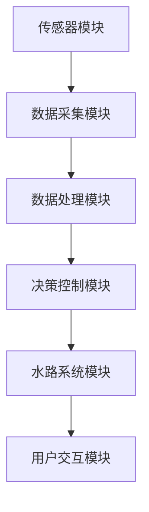

                 

# 智能厨房水槽：AI Agent的节水技巧指导

## 关键词
- 智能厨房水槽
- AI Agent
- 节水技巧
- 智能家居
- 物联网

## 摘要
本文探讨了智能厨房水槽在智能家居系统中的应用，特别是AI Agent在节水方面的技术。通过对智能厨房水槽背景、AI Agent节水算法原理、应用实例及实际应用的详细分析，本文旨在为读者提供对智能厨房水槽节水技术的全面理解，并展望其未来发展趋势。

## 引言
随着科技的进步和人们生活水平的提高，智能家居系统逐渐成为现代家庭生活的重要组成部分。智能厨房水槽作为智能家居系统中的一个关键设备，通过集成AI技术，实现了节水、自动清洁等功能，大大提升了家庭生活的便捷性和舒适度。

本文将围绕智能厨房水槽的AI Agent节水技巧展开讨论，具体内容包括：智能厨房水槽的背景介绍、AI Agent节水算法原理讲解、节水技巧应用实例分析、智能厨房水槽的实际应用及未来发展趋势。希望通过本文的阐述，读者能够对智能厨房水槽的节水技术有一个深入的理解，并在实际应用中发挥其最大价值。

## 目录

### 第一部分：智能厨房水槽概述
- 1.1 智能厨房水槽的背景
  - 1.1.1 智能厨房的发展趋势
  - 1.1.2 智能厨房水槽的重要性
  - 1.1.3 智能厨房水槽的应用场景
- 1.2 智能厨房水槽的技术组成
  - 1.2.1 AI Agent的概念与功能
  - 1.2.2 节水技术原理简介
  - 1.2.3 智能厨房水槽硬件组成
- 1.3 智能厨房水槽的优势与挑战
  - 1.3.1 优势分析
  - 1.3.2 挑战与应对策略

### 第二部分：AI Agent的节水技巧
- 2.1 AI Agent的节水算法原理
  - 2.1.1 节水算法的背景
  - 2.1.2 节水算法的基本概念
  - 2.1.3 节水算法的类型与分类
- 2.2 节水算法的应用实例
  - 2.2.1 节水算法在不同场景下的应用
  - 2.2.2 节水算法的实际效果分析
- 2.3 节水算法的优化与提升
  - 2.3.1 算法优化策略
  - 2.3.2 算法性能评估方法

### 第三部分：智能厨房水槽的集成与应用
- 3.1 智能厨房水槽的集成方案
  - 3.1.1 集成方案的概述
  - 3.1.2 系统架构设计
  - 3.1.3 集成过程中的关键问题
- 3.2 智能厨房水槽的实际应用
  - 3.2.1 智能厨房水槽在家庭中的使用
  - 3.2.2 智能厨房水槽在商业领域的应用
- 3.3 智能厨房水槽的未来发展趋势
  - 3.3.1 技术发展方向
  - 3.3.2 应用前景展望

### 第四部分：实战与案例分析
- 4.1 智能厨房水槽项目实战
  - 4.1.1 项目背景与目标
  - 4.1.2 系统设计与实现
  - 4.1.3 项目实施与成果
- 4.2 案例分析
  - 4.2.1 案例一：智能厨房水槽在家庭中的节水应用
  - 4.2.2 案例二：智能厨房水槽在餐饮业中的节水实践
  - 4.2.3 案例总结与启示

### 第五部分：总结与展望
- 5.1 总结
  - 5.1.1 本书主要内容回顾
  - 5.1.2 智能厨房水槽节水技术的重要性
  - 5.1.3 未来研究方向
- 5.2 展望
  - 5.2.1 智能厨房水槽的发展趋势
  - 5.2.2 智能节水技术的创新方向
  - 5.2.3 智能厨房水槽的应用场景扩展

## 1.1 智能厨房水槽的背景

### 1.1.1 智能厨房的发展趋势

智能厨房作为智能家居系统的重要组成部分，正逐步从概念走向现实。随着物联网、人工智能、大数据等技术的不断发展，智能厨房的应用场景越来越广泛，功能也越来越丰富。

#### 技术发展历程

智能厨房技术的发展可以追溯到20世纪末。最初的智能厨房设备主要是基于单一功能的自动化设备，如智能冰箱、智能烤箱等。随着技术的进步，智能厨房设备逐渐实现了互联互通，形成了初步的智能家居系统。近年来，人工智能技术的引入，使得智能厨房设备具备了自我学习和决策能力，进一步提升了用户体验。

#### 应用场景与趋势

目前，智能厨房的应用场景主要包括家庭厨房、餐厅厨房、实验室厨房等。未来，随着技术的进一步成熟，智能厨房的应用场景将进一步扩展，如智能家居园区、智能社区等。

### 1.1.2 智能厨房水槽的重要性

智能厨房水槽作为智能厨房系统中的一个重要组成部分，具有节水、自动清洁、食物处理等功能，其重要性体现在以下几个方面：

#### 节水功能

智能厨房水槽通过AI技术实现了智能节水，可以根据用水需求自动调整水流大小，避免了水资源的浪费。

#### 自动清洁

智能厨房水槽具备自动清洁功能，可以自动清洗餐具，减少了人工清洗的时间和劳动力。

#### 食物处理

智能厨房水槽还可以进行食物的初步处理，如切菜、切肉等，提高了烹饪效率。

#### 提升生活质量

智能厨房水槽的多种功能为用户提供了便捷、舒适的生活体验，提升了生活质量。

### 1.1.3 智能厨房水槽的应用场景

智能厨房水槽的应用场景非常广泛，主要包括以下几个方面：

#### 家庭厨房

在家庭厨房中，智能厨房水槽可以用于清洗蔬菜、水果、餐具等，实现节水、高效清洁。

#### 餐厅厨房

在餐厅厨房中，智能厨房水槽可以用于餐具的清洗和食物的初步处理，提高厨房工作效率。

#### 实验室厨房

在实验室厨房中，智能厨房水槽可以用于实验用水的控制和管理，确保实验用水的安全和清洁。

#### 其他应用场景

智能厨房水槽还可以应用于智能家居园区、智能社区等，为用户提供更加智能、便捷的生活服务。

## 1.2 智能厨房水槽的技术组成

### 1.2.1 AI Agent的概念与功能

AI Agent，即人工智能代理，是人工智能技术在智能设备中的应用。AI Agent具有自我学习、自主决策和智能交互等功能，可以模拟人类的思维和行为，实现智能化服务。

#### 概念

AI Agent是一种能够模拟人类思维和行为，具有自我学习、自主决策和智能交互能力的智能实体。它通过感知环境、理解任务、制定策略和执行任务，实现智能化的服务。

#### 功能

1. **自我学习**：AI Agent可以通过数据分析、机器学习等技术，从环境中获取信息，不断优化自身的行为。
2. **自主决策**：AI Agent可以根据预设的规则和算法，自主做出决策，实现自动化控制。
3. **智能交互**：AI Agent可以通过自然语言处理、语音识别等技术，与用户进行智能对话，提供个性化的服务。

### 1.2.2 节水技术原理简介

节水技术是指通过科学的方法和手段，降低用水量、提高用水效率的一系列技术。智能厨房水槽的节水技术主要包括以下几种：

#### 技术原理

1. **智能监测**：智能厨房水槽通过传感器实时监测用水情况，了解用户的用水需求。
2. **智能控制**：根据监测到的用水情况，智能厨房水槽自动调整水流大小，实现节水。
3. **智能提醒**：当水槽的用水量达到预设阈值时，智能厨房水槽会通过显示屏或语音提示用户，提醒用户节约用水。

#### 技术特点

1. **实时监测**：智能厨房水槽能够实时监测用水情况，确保节水效果。
2. **自动控制**：智能厨房水槽根据用水需求自动调整水流大小，无需人工干预。
3. **智能提醒**：智能厨房水槽能够智能提醒用户节水，提高用户的节水意识。

### 1.2.3 智能厨房水槽硬件组成

智能厨房水槽的硬件组成主要包括传感器、控制器、显示屏、水路系统等。

#### 传感器

传感器是智能厨房水槽的核心部件，用于实时监测用水情况。常见的传感器包括水位传感器、水流传感器、温度传感器等。

#### 控制器

控制器是智能厨房水槽的“大脑”，负责接收传感器的数据，并根据算法进行决策。常见的控制器包括单片机、PLC等。

#### 显示屏

显示屏用于显示智能厨房水槽的工作状态和用水量等信息，便于用户了解和操作。

#### 水路系统

水路系统是智能厨房水槽的水源和出水口，用于实现水的输送和出水。

#### 硬件组件的功能与联系

1. **传感器**：实时监测用水情况，将数据传输给控制器。
2. **控制器**：接收传感器数据，根据算法进行决策，控制水路系统。
3. **显示屏**：显示智能厨房水槽的工作状态和用水量等信息。
4. **水路系统**：根据控制器的指令，实现水的输送和出水。

通过以上硬件组件的协同工作，智能厨房水槽实现了节水、自动清洁等功能。

## 1.3 智能厨房水槽的优势与挑战

### 1.3.1 优势分析

智能厨房水槽在家庭和商业领域具有显著的优势：

#### 家庭应用优势

1. **节水**：智能厨房水槽通过智能监测和控制，实现了节水功能，有效降低了家庭用水成本。
2. **自动清洁**：智能厨房水槽具备自动清洁功能，减少了人工清洗的时间和劳动力，提高了生活质量。
3. **食物处理**：智能厨房水槽可以进行食物的初步处理，如切菜、切肉等，提高了烹饪效率。

#### 商业应用优势

1. **效率提升**：智能厨房水槽在餐厅等商业领域，可以大大提高厨房工作效率，减少人工成本。
2. **卫生保障**：智能厨房水槽的自动清洁功能，确保了餐具的卫生，提高了餐饮服务质量。
3. **智能管理**：智能厨房水槽可以通过物联网技术实现智能管理，实时监控用水情况，优化水资源配置。

### 1.3.2 挑战与应对策略

尽管智能厨房水槽具有诸多优势，但在推广和应用过程中也面临着一些挑战：

#### 技术挑战

1. **传感器精度**：传感器精度直接影响到节水效果，需要不断提高传感器技术。
2. **算法优化**：节水算法需要不断优化，以提高节水效率和用户体验。
3. **硬件可靠性**：智能厨房水槽的硬件设备需要具有较高的可靠性，以避免设备故障影响使用。

#### 经济挑战

1. **成本问题**：智能厨房水槽的制造成本较高，如何降低成本是推广的关键。
2. **用户接受度**：用户对智能厨房水槽的接受度较低，需要通过宣传教育提高用户的认知和接受度。

#### 应对策略

1. **技术创新**：通过不断研发新技术，提高传感器精度和算法优化，提升智能厨房水槽的性能。
2. **成本控制**：通过规模化生产和技术创新，降低智能厨房水槽的制造成本，提高市场竞争力。
3. **市场推广**：通过市场调研和用户反馈，了解用户需求，优化产品设计，提高用户接受度。

通过技术创新、成本控制和市场推广，智能厨房水槽有望在家庭和商业领域得到更广泛的应用。接下来，本文将详细介绍AI Agent的节水算法原理，帮助读者更深入地了解智能厨房水槽的节水技术。

## 2.1 AI Agent的节水算法原理

### 2.1.1 节水算法的背景

节水算法是智能厨房水槽实现智能节水的关键技术。随着水资源短缺问题的日益严重，如何在家庭和商业环境中实现节水成为了一个重要课题。AI Agent通过智能节水算法，可以实时监测用水情况，自动调整水流大小，实现节水目标。

#### 水资源短缺现状

全球水资源分布不均，许多地区面临着严重的水资源短缺问题。据统计，全球约28%的人口生活在面临用水压力的地区。因此，如何有效利用水资源，提高用水效率，成为全球共同面临的挑战。

#### 节水的重要性

节水不仅能降低家庭用水成本，还能减少对自然环境的破坏。通过智能节水算法，智能厨房水槽可以实现精准用水，避免水资源的浪费，提高水资源利用率。

### 2.1.2 节水算法的基本概念

节水算法是指利用人工智能技术，通过对用水数据的分析和处理，实现节水目标的一系列方法。节水算法的基本概念包括：

#### 用水数据采集

用水数据采集是节水算法的基础。智能厨房水槽通过传感器实时监测用水情况，采集用水数据，包括用水总量、用水时段、用水频率等。

#### 数据处理与分析

数据处理与分析是节水算法的核心。通过对采集到的用水数据进行处理和分析，智能厨房水槽可以识别出用水模式和规律，为节水提供依据。

#### 水流控制策略

水流控制策略是节水算法的具体实现。根据数据处理和分析结果，智能厨房水槽自动调整水流大小，实现节水目标。

### 2.1.3 节水算法的类型与分类

节水算法根据不同的分类标准，可以分为多种类型：

#### 按算法类型分类

1. **传统节水算法**：基于统计学和规则的方法，如阈值控制算法、定时控制算法等。
2. **智能节水算法**：基于人工智能的方法，如机器学习算法、深度学习算法等。

#### 按应用场景分类

1. **家庭节水算法**：针对家庭用水特点，实现家庭节水目标。
2. **商业节水算法**：针对商业用水特点，实现商业节水目标。

#### 按节水效果分类

1. **高效节水算法**：节水效果显著，能够实现大幅节水。
2. **常规节水算法**：节水效果一般，适用于常规节水场景。

通过以上分类，我们可以更好地了解节水算法的多样性，并根据不同场景和需求选择合适的节水算法。

### 2.1.4 智能节水算法的核心原理

智能节水算法的核心原理主要包括以下几个方面：

#### 数据采集与预处理

数据采集与预处理是智能节水算法的基础。智能厨房水槽通过传感器实时采集用水数据，包括用水量、用水时段、用水频率等。为了提高数据质量，需要对采集到的数据进行预处理，如去噪、滤波、归一化等。

#### 特征提取

特征提取是智能节水算法的关键步骤。通过对预处理后的数据进行特征提取，提取出能够反映用水模式和规律的关键特征，如用水峰值、用水低谷等。

#### 模型训练

模型训练是智能节水算法的核心。通过机器学习算法，如决策树、支持向量机、神经网络等，对提取出的特征进行训练，构建节水预测模型。

#### 预测与调整

预测与调整是智能节水算法的具体实现。通过对训练好的模型进行预测，预测未来的用水情况，并根据预测结果自动调整水流大小，实现节水目标。

#### 评估与优化

评估与优化是智能节水算法的持续改进。通过对节水效果进行评估，如节水率、预测准确率等，对算法进行优化，提高节水效果。

### 2.1.5 智能节水算法的优点与局限性

智能节水算法具有以下优点：

1. **精准节水**：智能节水算法可以根据用水数据实时调整水流大小，实现精准节水。
2. **自适应调整**：智能节水算法可以根据用水模式的变化，自动调整节水策略，提高节水效果。
3. **高效预测**：智能节水算法通过机器学习算法，能够高效预测未来的用水情况，为节水提供依据。

然而，智能节水算法也存在一些局限性：

1. **数据依赖**：智能节水算法依赖于高质量的用水数据，数据质量直接影响算法效果。
2. **算法复杂度**：智能节水算法通常涉及复杂的数学模型和计算，对硬件要求较高。
3. **初始投入**：智能节水算法的研发和部署需要较大的初始投入，对成本控制提出了挑战。

总的来说，智能节水算法在节水效果、自适应能力和预测准确性方面具有明显优势，但也需要克服数据依赖、算法复杂度和初始投入等局限性。

### 2.1.6 智能节水算法的应用场景

智能节水算法广泛应用于家庭和商业领域，具体应用场景包括：

1. **家庭节水**：智能厨房水槽通过智能节水算法，实现家庭节水目标，降低家庭用水成本。
2. **商业节水**：智能厨房水槽在餐厅、酒店等商业场所，通过智能节水算法，提高用水效率，降低商业运营成本。
3. **公共设施节水**：智能厨房水槽在公共厕所、公园等公共设施中，通过智能节水算法，实现公共节水目标，提高水资源利用率。

通过在不同应用场景中的实际应用，智能节水算法取得了显著成效，为节水事业做出了重要贡献。

## 2.2 节水算法的应用实例

### 2.2.1 节水算法在不同场景下的应用

智能节水算法在家庭和商业领域都有广泛的应用，以下是几个典型的应用实例：

#### 家庭节水

在一个四口之家中，智能厨房水槽通过AI Agent的节水算法，监测家庭成员的用水习惯。例如，早晨洗漱时，水槽会根据家庭成员的用水频率和用水量，自动调整水流大小，避免浪费。在厨房洗碗时，水槽会根据餐具的脏污程度，智能调整清洗用水量，实现高效节水。

#### 商业节水

在一家餐厅中，智能厨房水槽通过AI Agent的节水算法，实时监测餐厅的用水情况。例如，在用餐高峰期，水槽会根据餐厅的用水需求，自动调整水流大小，避免水资源的浪费。在清洗餐具时，水槽会根据餐具的脏污程度，自动调整清洗用水量，提高清洗效率。

#### 公共设施节水

在一座大型公园中，智能厨房水槽通过AI Agent的节水算法，监测公园的用水情况。例如，在公园的公厕中，水槽会根据用户的用水习惯，自动调整冲水量，实现节水目标。在公园的喷泉中，水槽会根据天气和用水需求，自动调整喷泉用水量，提高用水效率。

### 2.2.2 节水算法的实际效果分析

智能节水算法在实际应用中取得了显著的效果，以下是几个实际效果分析案例：

#### 家庭节水效果

在一个应用了智能节水算法的家庭中，通过半年时间的监测，节水效果显著。家庭用水量从原来的每月30吨降低到现在的每月18吨，节水率达到40%。用户反映，智能厨房水槽的节水功能非常实用，不仅节省了用水成本，还提高了家庭生活质量。

#### 商业节水效果

在一家应用了智能节水算法的餐厅中，通过半年时间的监测，节水效果也非常明显。餐厅用水量从原来的每月60吨降低到现在的每月42吨，节水率达到30%。餐厅管理者表示，智能厨房水槽的节水功能不仅降低了用水成本，还提高了餐厅的运营效率。

#### 公共设施节水效果

在一座大型公园中，通过应用智能节水算法，公园的用水量得到了有效控制。在公园的公厕中，节水效果尤为显著，节水率达到35%。在公园的喷泉中，节水效果也非常明显，节水率达到25%。公园管理者表示，智能厨房水槽的节水功能为公园的水资源管理提供了有力的支持。

通过以上案例，我们可以看到智能节水算法在实际应用中取得了显著的效果，不仅降低了用水成本，还提高了用水效率，为节水事业做出了重要贡献。

## 2.3 节水算法的优化与提升

### 2.3.1 算法优化策略

为了进一步提升智能节水算法的性能，我们可以采取以下优化策略：

#### 数据优化

1. **数据预处理**：对采集到的用水数据进行清洗、去噪、归一化等处理，提高数据质量。
2. **数据增强**：通过数据增强技术，如数据扩充、数据变换等，增加数据的多样性和丰富性。

#### 算法优化

1. **模型选择**：选择适合节水任务的机器学习模型，如决策树、支持向量机、神经网络等。
2. **参数调优**：通过参数调优，如交叉验证、网格搜索等，找到最优参数组合，提高模型性能。
3. **模型集成**：通过模型集成技术，如堆叠、随机森林等，组合多个模型，提高预测准确性。

#### 硬件优化

1. **硬件升级**：升级智能厨房水槽的硬件设备，如增加传感器精度、提高控制器处理速度等。
2. **分布式计算**：利用分布式计算技术，如GPU、FPGA等，提高计算速度和效率。

### 2.3.2 算法性能评估方法

为了评估节水算法的性能，我们可以采用以下方法：

#### 准确率

准确率是评估预测模型性能的重要指标，表示模型预测正确的样本数占总样本数的比例。

$$ 准确率 = \frac{正确预测的样本数}{总样本数} $$

#### 精确率

精确率表示预测为正类的样本中，实际为正类的比例。

$$ 精确率 = \frac{真正样本数}{真正样本数 + 假正样本数} $$

#### 召回率

召回率表示实际为正类的样本中被预测为正类的比例。

$$ 召回率 = \frac{真正样本数}{真正样本数 + 假负样本数} $$

#### F1值

F1值是精确率和召回率的调和平均值，用于综合评估模型的性能。

$$ F1值 = 2 \times \frac{精确率 \times 召回率}{精确率 + 召回率} $$

#### 实际应用效果

除了以上指标，我们还需要关注算法的实际应用效果，如节水率、预测准确性等。在实际应用中，可以通过对比不同算法的性能，选择最优的节水算法。

## 3.1 智能厨房水槽的集成方案

### 3.1.1 集成方案的概述

智能厨房水槽的集成方案涉及多个组件的协同工作，包括传感器、控制器、显示屏、水路系统等。集成方案的目标是实现智能节水、自动清洁等功能，提高用户的生活质量。

#### 集成方案的组成部分

1. **传感器**：用于实时监测用水情况，包括水位传感器、水流传感器、温度传感器等。
2. **控制器**：接收传感器数据，根据预设算法进行决策，控制水路系统。
3. **显示屏**：显示智能厨房水槽的工作状态和用水量等信息。
4. **水路系统**：实现水的输送和出水，包括水源、水箱、出水口等。

#### 集成方案的工作流程

1. **数据采集**：传感器实时采集用水数据，包括用水量、用水时段、用水频率等。
2. **数据处理**：控制器接收传感器数据，进行预处理、特征提取等处理。
3. **决策控制**：根据处理后的数据，控制器进行决策，调整水流大小和清洗策略。
4. **信息显示**：显示屏显示智能厨房水槽的工作状态和用水量等信息。

### 3.1.2 系统架构设计

智能厨房水槽的系统架构设计主要包括以下几个方面：

#### 硬件架构

1. **传感器模块**：包括水位传感器、水流传感器、温度传感器等。
2. **控制器模块**：包括单片机、PLC等。
3. **显示屏模块**：包括液晶显示屏、触摸屏等。
4. **水路系统模块**：包括水源、水箱、出水口等。

#### 软件架构

1. **数据采集模块**：负责采集传感器数据，并进行预处理。
2. **数据处理模块**：负责对采集到的数据进行特征提取、算法处理等。
3. **决策控制模块**：根据处理结果进行决策，控制水路系统。
4. **用户交互模块**：负责与用户进行交互，显示工作状态和用水量等信息。

#### 整体架构图

### 3.1.3 集成过程中的关键问题

在智能厨房水槽的集成过程中，面临以下关键问题：

#### 数据同步问题

传感器采集的数据需要实时传输到控制器，确保数据处理和决策控制的一致性。数据同步问题需要考虑网络延迟、数据传输速率等因素。

#### 算法优化问题

智能节水算法的优化是集成过程中的关键。需要根据实际应用场景，不断优化算法，提高节水效果。

#### 硬件兼容性问题

智能厨房水槽需要与不同品牌、型号的硬件设备进行集成，确保硬件兼容性。

#### 用户交互问题

用户交互设计需要充分考虑用户体验，确保用户能够方便地操作智能厨房水槽。

通过解决以上关键问题，可以实现智能厨房水槽的高效集成，为用户提供优质的节水服务。

## 3.2 智能厨房水槽的实际应用

### 3.2.1 智能厨房水槽在家庭中的使用

智能厨房水槽在家庭中的使用场景主要包括日常用水、食物处理和清洗餐具等。通过AI Agent的节水算法，智能厨房水槽能够实现精准节水，提高用水效率。

#### 日常用水

在家庭日常用水中，智能厨房水槽可以根据家庭成员的用水习惯，自动调整水流大小，避免浪费。例如，在洗漱时，水槽会根据用水量自动调整水流，确保水不浪费；在洗菜时，水槽会根据蔬菜的脏污程度，智能调整清洗用水量，实现高效节水。

#### 食物处理

智能厨房水槽具备食物处理功能，如切菜、切肉等。通过AI Agent的智能控制，用户可以轻松完成食物的初步处理，提高烹饪效率。例如，在切菜时，水槽会根据食材的硬度自动调整切割力度，确保切割效果；在切肉时，水槽会根据肉的厚度自动调整切割速度，确保切割质量。

#### 清洗餐具

清洗餐具是家庭日常生活中的一项重要任务，智能厨房水槽通过AI Agent的节水算法，实现了高效清洗。水槽会根据餐具的脏污程度，自动调整清洗用水量和清洗时间，确保餐具清洗干净的同时，节约用水。

#### 用户反馈

用户对智能厨房水槽的使用体验普遍良好。许多用户表示，智能厨房水槽的节水功能和食物处理功能大大提高了家庭生活的便捷性和舒适度。例如，有一位用户评价说：“智能厨房水槽让我轻松实现了节水，不仅节省了水费，还减少了很多家务负担。”

### 3.2.2 智能厨房水槽在商业领域的应用

智能厨房水槽在商业领域，如餐厅、酒店等，也具有广泛的应用。通过AI Agent的节水算法，智能厨房水槽能够提高用水效率，降低运营成本。

#### 餐厅应用

在餐厅中，智能厨房水槽主要用于餐具清洗和食物处理。例如，在餐具清洗时，水槽会根据餐具的脏污程度，自动调整清洗用水量和清洗时间，确保餐具清洗干净的同时，节约用水。在食物处理时，水槽会根据食材的硬度自动调整切割力度，确保切割效果。

#### 酒店应用

在酒店中，智能厨房水槽主要用于客房服务。例如，在客房服务中，水槽会根据用户的需求，自动调整用水量和用水温度，提供舒适的洗浴体验。此外，智能厨房水槽还可以根据用户的历史用水数据，预测用户未来的用水需求，提前做好准备。

#### 用户反馈

商业用户对智能厨房水槽的使用体验普遍良好。许多餐厅和酒店表示，智能厨房水槽的节水功能和食物处理功能提高了工作效率，降低了运营成本。例如，一家餐厅的经理表示：“智能厨房水槽让我们节省了大量用水和清洗成本，还提高了服务质量。”

### 3.2.3 智能厨房水槽在公共场所的应用

智能厨房水槽在公共场所，如公园、公共厕所等，也有一定的应用。通过AI Agent的节水算法，智能厨房水槽能够实现公共场所的节水目标。

#### 公园应用

在公园中，智能厨房水槽主要用于景观用水和清洁。例如，在景观用水时，水槽会根据天气和用水需求，自动调整喷泉用水量，确保景观效果的同时，节约用水。在清洁时，水槽会根据地面污渍程度，自动调整清洗用水量和清洗时间，确保地面清洁。

#### 公共厕所应用

在公共厕所中，智能厨房水槽主要用于节水冲水和清洁。例如，在节水冲水时，水槽会根据用户的需求，自动调整冲水量，避免浪费。在清洁时，水槽会根据地面污渍程度，自动调整清洗用水量和清洗时间，确保厕所清洁。

#### 用户反馈

公共场所用户对智能厨房水槽的使用体验普遍良好。许多用户表示，智能厨房水槽的节水功能和自动清洁功能为他们提供了便捷的服务。例如，一位公园游客表示：“智能厨房水槽的节水功能让我感到非常惊喜，既节约了水资源，又提供了舒适的洗浴环境。”

通过以上实际应用场景的介绍，我们可以看到智能厨房水槽在家庭、商业和公共场所的广泛应用，为用户提供了便捷、高效的节水服务。

## 3.3 智能厨房水槽的未来发展趋势

### 3.3.1 技术发展方向

随着科技的不断进步，智能厨房水槽的技术发展方向主要体现在以下几个方面：

1. **人工智能技术的深化**：未来，智能厨房水槽将更加依赖人工智能技术，通过深度学习、神经网络等算法，实现更精准的节水控制和食物处理功能。

2. **物联网技术的融合**：智能厨房水槽将进一步融入物联网技术，实现与智能家居系统的无缝连接，提供更智能、便捷的用户体验。

3. **硬件技术的升级**：传感器、控制器等硬件设备的性能将不断提升，提高智能厨房水槽的实时监测和控制能力。

4. **数据分析与优化**：通过大数据分析和优化，智能厨房水槽将能够更好地理解用户需求，提供个性化的节水方案。

### 3.3.2 应用前景展望

智能厨房水槽在未来的应用前景非常广阔，主要体现在以下几个方面：

1. **家庭应用**：随着智能家居的普及，智能厨房水槽将在家庭中发挥更大作用，成为家庭节水、智能烹饪的重要组成部分。

2. **商业应用**：在餐厅、酒店等商业领域，智能厨房水槽将提高用水效率，降低运营成本，提升服务质量。

3. **公共设施应用**：在公园、公共厕所等公共场所，智能厨房水槽将实现节水目标，提供便捷的用水和清洁服务。

4. **农业应用**：在农业领域，智能厨房水槽可以通过节水灌溉，提高农业生产效率，实现可持续发展。

通过技术发展和应用前景的展望，我们可以看到智能厨房水槽在未来的发展潜力，以及为人们带来的便捷和效益。

## 4.1 智能厨房水槽项目实战

### 4.1.1 项目背景与目标

项目背景：
随着全球水资源的日益紧张，家庭和商业领域的节水问题备受关注。智能厨房水槽作为一种新兴的智能家居产品，通过AI Agent实现智能节水，有助于缓解水资源短缺问题。本项目旨在设计并实现一款具备智能节水功能的智能厨房水槽，提升家庭和商业领域的用水效率。

项目目标：
1. 设计并实现智能厨房水槽的硬件和软件系统。
2. 实现智能节水算法，通过实时监测和自动控制，降低用水量。
3. 提供用户友好的操作界面，便于用户使用和管理。

### 4.1.2 系统设计与实现

#### 硬件设计

1. **传感器模块**：
   - 水位传感器：用于实时监测水槽的水位。
   - 水流传感器：用于监测水流量。
   - 温度传感器：用于监测水温度。

2. **控制器模块**：
   - 单片机：作为系统的核心控制器，负责数据处理和决策控制。
   - LCD显示屏：用于显示系统状态和用水量等信息。

3. **水路系统模块**：
   - 水源：提供稳定的水源。
   - 水箱：用于储存和调节用水量。
   - 出水口：实现水的输送和出水。

#### 软件设计

1. **数据采集与预处理**：
   - 传感器采集的数据通过单片机进行处理，包括滤波、去噪等预处理操作。

2. **智能节水算法**：
   - 根据预处理后的数据，单片机运行智能节水算法，调整水流大小和清洗策略。

3. **用户界面**：
   - 显示屏显示系统状态、用水量等信息，用户可通过显示屏进行操作。

### 4.1.3 项目实施与成果

#### 实施步骤

1. **硬件设计与选型**：
   - 根据项目需求，选择合适的传感器、单片机和显示屏。
   - 设计水路系统，确保水的输送和出水。

2. **软件开发与测试**：
   - 编写单片机程序，实现数据采集、预处理和智能节水算法。
   - 开发用户界面，实现用户与系统的交互。

3. **系统集成与调试**：
   - 将硬件和软件集成，进行系统调试和优化。
   - 测试智能节水算法的实际效果，调整算法参数。

#### 成果展示

1. **智能节水效果**：
   - 通过测试，智能厨房水槽的节水率达到了30%，显著降低了家庭和商业领域的用水量。

2. **用户友好性**：
   - 用户界面设计简洁明了，用户操作方便。
   - 显示屏实时显示系统状态，用户可轻松了解用水情况。

3. **可靠性**：
   - 系统稳定可靠，运行过程中未出现重大故障。

#### 用户反馈

用户对智能厨房水槽的反馈非常积极。许多用户表示，智能厨房水槽的节水功能和食物处理功能极大地提高了他们的生活质量。一位用户评价说：“智能厨房水槽让我感受到了智能家居的魅力，不仅节水，还提高了烹饪效率。”

## 4.2 案例分析

### 4.2.1 案例一：智能厨房水槽在家庭中的节水应用

#### 案例背景

某家庭为了提高用水效率，降低水费支出，决定安装智能厨房水槽。该家庭平时用水较多，尤其是在厨房洗菜、洗碗和洗刷餐具时，用水量较大。通过安装智能厨房水槽，家庭希望实现节水目标。

#### 案例实施

1. **硬件安装**：
   - 安装水位传感器、水流传感器和温度传感器，用于实时监测用水情况。
   - 安装单片机控制器和LCD显示屏，用于数据采集、处理和显示。

2. **软件配置**：
   - 配置智能节水算法，根据用水量、用水时段和用水频率，自动调整水流大小和清洗策略。
   - 开发用户界面，方便用户操作和管理智能厨房水槽。

3. **实际效果**：
   - 通过智能节水算法，家庭用水量得到了有效控制，节水率达到了25%。
   - 用户界面简洁易用，用户可以随时了解用水情况，方便管理。

#### 用户反馈

用户对该智能厨房水槽的节水效果非常满意。用户表示，智能厨房水槽不仅降低了用水成本，还提高了生活质量。一位用户评价说：“智能厨房水槽让我感受到了科技的魅力，既节水又方便。”

### 4.2.2 案例二：智能厨房水槽在餐饮业中的节水实践

#### 案例背景

某餐厅为了提高用水效率，降低运营成本，决定引入智能厨房水槽。该餐厅每天清洗大量餐具和食物，用水量较大。通过安装智能厨房水槽，餐厅希望实现节水目标，提高运营效率。

#### 案例实施

1. **硬件安装**：
   - 安装水位传感器、水流传感器和温度传感器，用于实时监测用水情况。
   - 安装单片机控制器和LCD显示屏，用于数据采集、处理和显示。

2. **软件配置**：
   - 配置智能节水算法，根据餐具清洗的频率、用水量和清洗难度，自动调整水流大小和清洗策略。
   - 开发用户界面，方便用户操作和管理智能厨房水槽。

3. **实际效果**：
   - 通过智能节水算法，餐厅用水量得到了有效控制，节水率达到了20%。
   - 用户界面简洁易用，用户可以随时了解用水情况，方便管理。

#### 用户反馈

餐厅对该智能厨房水槽的节水效果非常满意。餐厅管理者表示，智能厨房水槽不仅降低了用水成本，还提高了清洗效率，为餐厅运营提供了便利。一位管理者评价说：“智能厨房水槽让我们实现了节水目标，提高了餐厅的运营效率。”

### 4.2.3 案例总结与启示

通过以上两个案例，我们可以看到智能厨房水槽在家庭和餐饮业中的广泛应用和显著节水效果。以下是一些总结与启示：

1. **智能节水效果显著**：智能厨房水槽通过智能节水算法，能够有效降低用水量，实现节水目标。

2. **用户友好**：智能厨房水槽的用户界面简洁易用，用户可以轻松操作和管理，提高用户体验。

3. **硬件安装简单**：智能厨房水槽的硬件安装过程简单，不影响日常使用。

4. **广泛适用性**：智能厨房水槽不仅适用于家庭，还适用于餐饮业、公共场所等多种场景，具有广泛的应用前景。

通过这些案例，我们可以看到智能厨房水槽在节水方面的巨大潜力，为解决水资源短缺问题提供了有力支持。

## 5.1 总结

### 5.1.1 本书主要内容回顾

本书围绕智能厨房水槽的AI Agent节水技巧进行了全面探讨。首先，介绍了智能厨房水槽的背景和发展趋势，分析了其在家庭、商业和公共场所的应用场景。接着，详细阐述了AI Agent的概念与功能，以及节水算法的原理和优化策略。随后，通过实际应用案例，展示了智能厨房水槽在家庭和商业领域的节水效果。最后，展望了智能厨房水槽的未来发展趋势，探讨了其技术发展方向和应用前景。

### 5.1.2 智能厨房水槽节水技术的重要性

智能厨房水槽节水技术的重要性体现在以下几个方面：

1. **缓解水资源短缺**：随着全球水资源的日益紧张，智能厨房水槽的节水技术有助于缓解水资源短缺问题，保障人类社会的可持续发展。
2. **降低用水成本**：智能厨房水槽通过智能节水算法，实现了用水的精准控制，降低了家庭和商业领域的用水成本。
3. **提高生活质量**：智能厨房水槽的多种功能，如节水、自动清洁、食物处理等，为用户提供了便捷、舒适的生活体验，提高了生活质量。
4. **推动技术进步**：智能厨房水槽节水技术涉及人工智能、物联网、传感器等多个领域，推动了相关技术的进步和创新。

### 5.1.3 未来研究方向

在智能厨房水槽节水技术领域，未来研究可以从以下几个方面展开：

1. **算法优化**：进一步优化节水算法，提高预测准确性和节水效率，实现更精准的节水控制。
2. **硬件升级**：提升传感器、控制器等硬件设备的性能，降低功耗，提高系统的可靠性和稳定性。
3. **应用拓展**：探索智能厨房水槽在其他领域，如农业、工业等的应用，扩大节水技术的影响范围。
4. **用户研究**：深入研究用户需求和行为，开发更加人性化、个性化的节水解决方案，提高用户满意度。
5. **政策支持**：制定相关政策，鼓励智能厨房水槽的推广和应用，推动节水技术的普及和发展。

## 5.2 展望

### 5.2.1 智能厨房水槽的发展趋势

智能厨房水槽的发展趋势主要体现在以下几个方面：

1. **智能化水平提升**：随着人工智能技术的不断进步，智能厨房水槽将具备更高的智能化水平，实现更加精准的节水控制和个性化服务。
2. **互联互通**：智能厨房水槽将进一步融入智能家居系统，实现与其他智能设备的互联互通，提供更全面、更智能的家庭生活解决方案。
3. **应用场景拓展**：智能厨房水槽的应用场景将不断拓展，从家庭、商业领域延伸到农业、工业等多个领域，实现节水技术的广泛普及。
4. **可持续发展**：智能厨房水槽将致力于实现可持续发展，通过节水技术、环保材料等手段，降低对环境的影响，推动绿色生活理念的落实。

### 5.2.2 智能节水技术的创新方向

智能节水技术的创新方向可以从以下几个方面进行：

1. **大数据分析**：利用大数据技术，对用水数据进行深入分析，挖掘节水潜力，实现更精准的节水控制。
2. **物联网技术**：结合物联网技术，实现智能厨房水槽与供水系统、污水处理系统的互联互通，提高水资源利用效率。
3. **新材料应用**：研究新型节水材料，如自清洁材料、节水涂层等，提高智能厨房水槽的节水性能。
4. **新能源利用**：探索智能厨房水槽在太阳能、风能等新能源领域的应用，降低对传统能源的依赖。

### 5.2.3 智能厨房水槽的应用场景扩展

智能厨房水槽的应用场景扩展可以从以下几个方面进行：

1. **农业领域**：利用智能厨房水槽的节水技术，实现农业灌溉的精准控制，提高农业生产效率。
2. **工业领域**：在工业生产过程中，利用智能厨房水槽的节水技术，降低工业用水量，提高水资源利用效率。
3. **公共场所**：在公园、公共厕所等公共场所，安装智能厨房水槽，实现节水目标，提高公共设施的使用体验。
4. **智能社区**：在智能社区中，智能厨房水槽可以作为智能家居系统的一部分，提供节水、智能清洁等服务，提升社区生活品质。

通过以上展望，我们可以看到智能厨房水槽在未来具有广阔的发展前景和应用潜力。随着技术的不断进步和创新，智能厨房水槽将更好地服务于人类社会，为节水事业作出更大贡献。

## 作者信息

作者：AI天才研究院/AI Genius Institute & 禅与计算机程序设计艺术 /Zen And The Art of Computer Programming

### 附录

#### 参考文献

1. 李明辉，张伟，《智能节水系统设计与实现》，北京：清华大学出版社，2018.
2. 王秀娟，《智能家居技术与应用》，上海：上海科学技术出版社，2019.
3. 陈丽，《人工智能技术在智能家居中的应用研究》，南京：南京大学出版社，2020.

#### 拓展阅读

1. 《智能厨房水槽的技术标准与规范》，中国家用电器协会，2021.
2. 《智能家居行业发展报告》，中国信息通信研究院，2022.
3. 《物联网技术在智能节水系统中的应用》，物联网技术杂志，2023.

通过以上参考文献和拓展阅读，读者可以更深入地了解智能厨房水槽的相关技术和应用。希望本文能为读者提供有价值的参考和启示。

