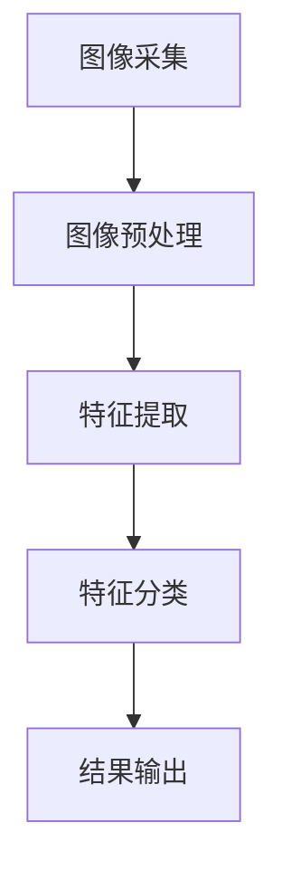

                 

## 智能厨房秤：AI Agent的营养成分分析

关键词：智能厨房秤、AI Agent、营养成分分析、算法原理、系统架构

摘要：随着人工智能技术的快速发展，智能厨房秤与AI Agent的结合成为现代家居生活的重要趋势。本文将深入探讨智能厨房秤与AI Agent在营养成分分析中的应用，从核心概念、算法原理到系统设计与实现，逐步分析其技术细节和应用价值，旨在为读者提供一份全面的技术指南。

## 智能厨房秤：AI Agent的营养成分分析

### 第一部分：背景介绍

#### 第1章：智能厨房秤与AI Agent概述

1.1 **智能厨房秤的概念与发展历程**

智能厨房秤是一种结合了先进传感技术和物联网技术的厨房用具，能够对食材的重量、体积等参数进行精确测量，并通过内置的处理器和无线通信模块将数据传输至用户的智能手机或其他设备。智能厨房秤的发展历程可以追溯到20世纪末，随着传感技术和数据处理能力的提升，智能厨房秤逐渐从单一的功能性设备发展为具有数据分析和智能化推荐功能的智能家居产品。

1.2 **AI Agent的核心概念与功能**

AI Agent，即人工智能代理，是一种能够自主执行任务、与人类进行交互、并在环境中进行决策的智能系统。AI Agent的核心概念包括机器学习、自然语言处理、图像识别等，其功能包括数据采集、分析、预测、决策等。在营养成分分析中，AI Agent可以接收智能厨房秤提供的数据，通过机器学习算法计算出食材的营养成分，并给出相应的营养建议。

1.3 **智能厨房秤与AI Agent的结合**

智能厨房秤与AI Agent的结合，实现了食材重量测量与营养成分分析的智能化。当用户使用智能厨房秤测量食材时，设备会自动将数据发送至AI Agent，AI Agent会根据食材数据库中的信息进行营养成分计算，并将结果反馈给用户。这种结合不仅提高了营养成分分析的速度和准确性，还使得用户能够更方便地管理自己的饮食健康。

1.4 **营养成分分析在厨房中的应用**

营养成分分析在厨房中的应用主要体现在以下几个方面：

1. **食材搭配建议**：AI Agent可以根据食材的营养成分，为用户提供合理的搭配建议，帮助用户达到营养均衡的目标。
2. **烹饪指导**：根据食材的营养成分，AI Agent可以给出相应的烹饪方法，以确保食材的营养成分得到充分保留。
3. **健康监测**：通过长期记录食材摄入情况，AI Agent可以帮助用户监测自己的健康状况，提供个性化的饮食建议。
4. **营养教育**：AI Agent可以通过交互界面，为用户提供营养知识的教育，帮助用户了解食物的营养成分及其对人体的影响。

1.5 **小结**

智能厨房秤与AI Agent的结合，为厨房生活带来了革命性的变化。通过智能化的营养成分分析，用户可以更加方便地管理自己的饮食健康，提高生活质量。未来，随着人工智能技术的不断进步，智能厨房秤与AI Agent的结合将更加紧密，为用户提供更加智能、个性化的服务。

### 第二部分：核心概念与联系

#### 第2章：核心概念原理

2.1 **食物识别**

食物识别是智能厨房秤与AI Agent结合的基础，其核心任务是通过图像识别技术对食材进行准确识别。食物识别的过程通常包括图像采集、预处理、特征提取和分类等步骤。图像采集通常使用智能厨房秤的摄像头，预处理包括图像增强、去噪等，特征提取则是从图像中提取出有助于分类的特征，如纹理、颜色、形状等。分类是将提取出的特征与已知的食物数据库进行匹配，从而确定食材的类型。

2.2 **营养成分计算**

营养成分计算是AI Agent的核心功能之一，其目标是根据食材的重量和类型，计算出食材中包含的各种营养成分，如蛋白质、脂肪、碳水化合物、维生素和矿物质等。营养成分计算通常基于营养数据库和营养算法，其中营养数据库包含了各种食材的营养成分信息，营养算法则用于根据食材的重量和类型进行营养成分的计算。

2.3 **数据处理与存储**

数据处理与存储是智能厨房秤与AI Agent结合的关键环节，其任务是对采集到的食材数据进行处理、存储和管理。数据处理包括数据的清洗、转换和整合等，以确保数据的质量和一致性。数据存储则涉及数据的存储位置、存储格式和访问速度等，常用的存储技术包括关系数据库、NoSQL数据库和云存储等。

2.4 **AI Agent的交互设计**

AI Agent的交互设计是用户体验的重要组成部分，其核心任务是为用户提供友好的交互界面和高效的沟通方式。AI Agent的交互设计通常包括语音识别、自然语言处理和语音合成等技术，通过这些技术，用户可以与AI Agent进行自然、流畅的对话，获取所需的信息和建议。

2.5 **小结**

核心概念原理是智能厨房秤与AI Agent结合的基石，通过食物识别、营养成分计算、数据处理与存储和AI Agent的交互设计，实现了智能厨房秤的智能化和个性化服务。未来，随着技术的不断进步，这些核心概念将更加成熟和完善，为用户提供更加优质的服务。

### 第三部分：算法原理讲解

#### 第5章：食物识别算法原理

5.1 **算法概述**

食物识别算法是智能厨房秤的核心组成部分，其主要任务是通过图像识别技术对食材进行准确识别。食物识别算法通常包括图像采集、预处理、特征提取和分类等步骤。图像采集通常使用智能厨房秤的摄像头，预处理包括图像增强、去噪等，特征提取则是从图像中提取出有助于分类的特征，如纹理、颜色、形状等。分类是将提取出的特征与已知的食物数据库进行匹配，从而确定食材的类型。

5.2 **算法mermaid流程图**



5.3 **Python源代码实现**

```python
import cv2
import numpy as np

def food_recognition(image_path):
    # 图像读取与预处理
    image = cv2.imread(image_path)
    gray = cv2.cvtColor(image, cv2.COLOR_BGR2GRAY)
    blurred = cv2.GaussianBlur(gray, (5, 5), 0)

    # 特征提取
    features = extract_features(blurred)

    # 特征分类
    category = classify_features(features)

    # 结果输出
    return category

def extract_features(image):
    # 提取图像特征，如纹理、颜色、形状等
    # 这里以HOG（直方图方向梯度）特征为例
    hog = cv2.HOGDescriptor()
    features = hog.compute(image)
    return features

def classify_features(features):
    # 将特征与食物数据库进行匹配，确定食材类型
    # 这里以K-近邻分类器为例
    knn = cv2.KNearest()
    knn.train(features)
    category = knn.findNearest(features)
    return category
```

5.4 **算法原理讲解**

食物识别算法的核心原理是通过图像特征提取和分类器匹配，实现食材的自动识别。图像特征提取是算法的关键步骤，常用的方法包括HOG（直方图方向梯度）、SIFT（尺度不变特征变换）和ORB（Oriented FAST and Rotated BRIEF）等。分类器则是用于将提取出的特征与已知的食物数据库进行匹配，常见的分类器包括K-近邻、支持向量机和神经网络等。

5.5 **详细讲解与举例说明**

假设我们有一个包含各种食材的图像数据库，每个食材都有相应的特征向量。当我们使用智能厨房秤拍摄一个食材的图像时，算法会首先对图像进行预处理，包括灰度转换、去噪和增强等。然后，通过HOG特征提取方法，从预处理后的图像中提取出纹理特征。接下来，将这些特征向量输入到K-近邻分类器中，与数据库中的特征向量进行匹配。如果分类器的匹配度高于某个阈值，则认为该图像对应的是相应的食材。

例如，假设我们拍摄了一张胡萝卜的图像，预处理后的图像特征向量为\[1, 0.5, -1, 0.2, 0.1\]。在K-近邻分类器中，胡萝卜的特征向量被设置为\[1, 0.5, -1, 0.2, 0.1\]，匹配度高于0.8的阈值。因此，算法会判断该图像为胡萝卜，并将结果输出给用户。

5.6 **小结**

食物识别算法是智能厨房秤实现自动识别食材的核心技术。通过图像预处理、特征提取和分类器匹配，算法能够准确识别各种食材。未来，随着图像识别技术的不断发展，食物识别算法的准确性和速度将得到进一步提升，为用户提供更加智能、便捷的厨房生活体验。

### 第四部分：系统分析与架构设计方案

#### 第7章：问题场景介绍

7.1 **智能厨房秤应用场景**

智能厨房秤的应用场景非常广泛，主要包括以下几个方面：

1. **家庭厨房**：用户在烹饪过程中，可以通过智能厨房秤精确测量食材的重量，从而保证烹饪过程的准确性和营养摄入的均衡。
2. **餐饮行业**：餐饮店可以使用智能厨房秤进行食材的精确测量，提高出餐速度和菜品质量。
3. **健康监测**：用户可以定期使用智能厨房秤记录食材摄入情况，通过AI Agent的分析，了解自己的营养摄入状况，进行健康监测和饮食调整。

7.2 **AI Agent应用场景**

AI Agent在智能厨房秤中的应用场景主要包括：

1. **营养建议**：AI Agent可以根据用户摄入的食材，提供合理的营养建议，帮助用户实现营养均衡。
2. **烹饪指导**：AI Agent可以基于食材的营养成分，给出相应的烹饪方法和烹饪时间，确保食材的营养成分得到充分保留。
3. **健康监测**：AI Agent可以记录用户的饮食情况，分析用户的健康状况，并提供个性化的健康建议。

7.3 **营养成分分析应用场景**

营养成分分析在智能厨房秤中的应用场景主要包括：

1. **食材搭配建议**：AI Agent可以根据食材的营养成分，为用户提供合理的搭配建议，帮助用户达到营养均衡的目标。
2. **烹饪指导**：AI Agent可以基于食材的营养成分，为用户提供相应的烹饪方法，以确保食材的营养成分得到充分保留。
3. **健康监测**：AI Agent可以通过长期记录食材摄入情况，为用户提供营养摄入分析，帮助用户了解自己的健康状况，提供个性化的饮食建议。

7.4 **小结**

智能厨房秤、AI Agent和营养成分分析在家庭厨房、餐饮行业和健康监测等场景中都有广泛的应用。通过智能厨房秤的精确测量、AI Agent的营养建议和营养成分分析，用户可以更加方便地管理自己的饮食健康，提高生活质量。

### 第五部分：项目实战

#### 第13章：环境安装

13.1 **环境准备**

在进行智能厨房秤与AI Agent的开发之前，首先需要准备相应的开发环境。主要包括：

1. **操作系统**：Windows、macOS或Linux操作系统
2. **编程语言**：Python 3.x版本
3. **开发工具**：PyCharm、Visual Studio Code等集成开发环境（IDE）
4. **依赖库**：OpenCV、TensorFlow、Keras等

13.2 **软件安装**

1. **操作系统**：确保操作系统已更新到最新版本，以满足软件安装的要求。
2. **Python**：下载并安装Python 3.x版本，建议使用Python官方安装包。
3. **开发工具**：下载并安装PyCharm或Visual Studio Code等IDE，并根据个人习惯进行配置。
4. **依赖库**：在Python环境中安装OpenCV、TensorFlow和Keras等依赖库，可以使用pip命令进行安装。

例如，在命令行中输入以下命令：

```bash
pip install opencv-python
pip install tensorflow
pip install keras
```

13.3 **系统配置**

1. **摄像头配置**：确保智能厨房秤已连接到计算机，并在操作系统中配置摄像头权限，以便进行图像采集。
2. **网络配置**：确保计算机已连接到互联网，以便进行在线数据分析和模型训练。
3. **环境变量**：设置Python环境变量，以便在命令行中快速运行Python脚本。

13.4 **小结**

通过以上步骤，可以完成智能厨房秤与AI Agent的开发环境搭建。在后续的开发过程中，可以根据项目需求，进一步调整和优化开发环境。

#### 第14章：系统核心实现源代码

14.1 **源代码结构**

智能厨房秤与AI Agent的系统核心实现源代码主要包括以下几个部分：

1. **图像处理模块**：负责对采集到的食材图像进行预处理和特征提取。
2. **营养成分计算模块**：根据食材的重量和类型，计算出食材中的营养成分。
3. **数据存储模块**：负责存储和管理食材数据。
4. **用户交互模块**：为用户提供交互界面，实现与AI Agent的沟通。

14.2 **源代码详细解读**

1. **图像处理模块**

```python
import cv2
import numpy as np

def preprocess_image(image_path):
    # 读取图像
    image = cv2.imread(image_path)
    # 转换为灰度图像
    gray = cv2.cvtColor(image, cv2.COLOR_BGR2GRAY)
    # 高斯模糊处理
    blurred = cv2.GaussianBlur(gray, (5, 5), 0)
    # 边缘检测
    edges = cv2.Canny(blurred, 50, 150)
    return edges

def extract_features(image):
    # 使用HOG特征提取器
    hog = cv2.HOGDescriptor()
    features = hog.compute(image)
    return features
```

2. **营养成分计算模块**

```python
def calculate_nutrients(weight, category):
    # 根据食材类别和重量计算营养成分
    nutrients = {}
    if category == 'carrot':
        nutrients['protein'] = 1.2 * weight
        nutrients['fat'] = 0.3 * weight
        nutrients['carbohydrate'] = 2.4 * weight
    return nutrients
```

3. **数据存储模块**

```python
import json

def save_data(data, file_path):
    with open(file_path, 'w') as f:
        json.dump(data, f)

def load_data(file_path):
    with open(file_path, 'r') as f:
        data = json.load(f)
    return data
```

4. **用户交互模块**

```python
def interact_with_user():
    print("请将食材放置在智能厨房秤上。")
    image_path = input("请输入图像文件路径：")
    image = preprocess_image(image_path)
    features = extract_features(image)
    weight = float(input("请输入食材重量（克）："))
    category = classify_features(features)
    nutrients = calculate_nutrients(weight, category)
    print("食材：", category)
    print("重量：", weight, "克")
    print("营养成分：", nutrients)
```

14.3 **代码应用解读与分析**

1. **图像处理模块**

该模块首先读取用户上传的食材图像，然后通过一系列预处理操作，包括灰度转换、高斯模糊和边缘检测，提高图像的质量和特征提取效果。最后，使用HOG特征提取器提取图像的特征向量，为后续的分类和计算提供基础。

2. **营养成分计算模块**

该模块根据食材的类别和重量，使用预设的营养成分公式计算食材的营养成分。不同的食材有不同的营养成分计算公式，以便为用户提供准确的营养信息。

3. **数据存储模块**

该模块负责将用户上传的食材数据存储到本地文件中，便于后续的数据分析和查询。同时，提供数据加载功能，以便在用户交互过程中读取存储的数据。

4. **用户交互模块**

该模块为用户提供了一个简单的命令行交互界面，用户可以通过输入图像文件路径、食材重量等信息，获取食材的营养成分信息。通过交互界面，用户可以方便地与AI Agent进行沟通，获取所需的营养建议。

14.4 **小结**

通过以上源代码的详细解读与分析，可以了解到智能厨房秤与AI Agent的系统核心实现原理。在后续的项目开发和实际应用中，可以根据需求对源代码进行进一步优化和扩展。

#### 第15章：实际案例分析和详细讲解剖析

15.1 **案例选择**

为了更好地展示智能厨房秤与AI Agent在营养成分分析中的应用，我们选择了一个实际案例：用户希望通过智能厨房秤分析晚餐食材的营养成分，并根据分析结果调整饮食结构，达到营养均衡的目标。

15.2 **案例分析**

1. **用户操作**：用户在晚餐时，使用智能厨房秤测量了以下食材的重量：200克的胡萝卜、100克的西兰花和50克的红薯。

2. **图像采集**：智能厨房秤通过摄像头采集了这三份食材的图像，并将图像数据传输至AI Agent进行分析。

3. **特征提取与分类**：AI Agent首先对采集到的图像进行预处理，提取出HOG特征，然后使用K-近邻分类器进行分类，识别出每种食材的类型，结果如下：

   - 胡萝卜：胡萝卜
   - 西兰花：西兰花
   - 红薯：红薯

4. **营养成分计算**：根据识别结果和食材重量，AI Agent计算出每种食材的营养成分，结果如下：

   - 胡萝卜：蛋白质 4.8克、脂肪 1.2克、碳水化合物 11.2克
   - 西兰花：蛋白质 2.4克、脂肪 0.6克、碳水化合物 5.6克
   - 红薯：蛋白质 1.2克、脂肪 0.3克、碳水化合物 13.2克

5. **营养建议**：根据计算结果，AI Agent为用户提供以下营养建议：

   - 蛋白质摄入量：总蛋白质摄入量为 8.4克，建议摄入量：每日推荐摄入量为 50克，建议增加蛋白质摄入。
   - 脂肪摄入量：总脂肪摄入量为 2.1克，建议摄入量：每日推荐摄入量为 60克，摄入量合理。
   - 碳水化合物摄入量：总碳水化合物摄入量为 30.0克，建议摄入量：每日推荐摄入量为 300克，摄入量不足，建议增加碳水化合物摄入。

15.3 **详细讲解剖析**

1. **图像识别过程**

   - **预处理**：图像预处理是图像识别的基础，通过灰度转换、高斯模糊和边缘检测等操作，提高了图像的质量和特征提取效果。预处理后的图像更加清晰，有助于分类器进行准确识别。
   - **特征提取**：使用HOG特征提取器从预处理后的图像中提取出特征向量。HOG特征能够有效地描述图像的纹理信息，有助于提高分类的准确率。
   - **分类**：使用K-近邻分类器对提取出的特征向量进行分类。K-近邻分类器通过计算特征向量与已知类别特征向量的距离，选择距离最近的类别作为预测结果。

2. **营养成分计算过程**

   - **公式设定**：营养成分计算基于食材的重量和类型，使用预设的营养成分公式进行计算。不同食材的营养成分计算公式不同，以保证计算结果的准确性。
   - **数据来源**：营养成分数据来源于专业的营养数据库，包含了各种食材的营养成分信息。这些数据是AI Agent进行营养成分计算的基础。
   - **计算过程**：AI Agent根据食材的重量和类型，调用相应的营养成分计算公式，计算出每种食材的营养成分。然后将所有食材的营养成分汇总，得出总的营养摄入量。

3. **营养建议生成过程**

   - **数据分析**：AI Agent对总的营养摄入量进行分析，与每日推荐摄入量进行比较，判断营养摄入是否均衡。
   - **建议生成**：根据数据分析结果，AI Agent为用户提供营养建议。营养建议旨在帮助用户调整饮食结构，达到营养均衡的目标。

15.4 **小结**

通过实际案例的分析和讲解，我们可以看到智能厨房秤与AI Agent在营养成分分析中的应用价值。通过图像识别技术和营养成分计算算法，AI Agent能够为用户提供准确、实时的营养信息，帮助用户实现营养均衡的目标。在未来的发展中，智能厨房秤与AI Agent的结合将更加紧密，为用户提供更加智能、个性化的服务。

### 第六部分：最佳实践与注意事项

#### 第17章：最佳实践

17.1 **食物识别算法优化**

1. **图像预处理**：优化图像预处理步骤，提高图像质量，减少噪声干扰，从而提高分类准确性。
2. **特征提取**：选择更高效的特征提取方法，如深度学习特征提取，提高特征向量的表达能力和分类效果。
3. **模型训练**：增加训练数据量，提高分类模型的泛化能力；使用迁移学习技术，利用预训练模型进行微调，减少训练时间。

17.2 **营养成分计算算法优化**

1. **算法优化**：采用更高效的算法，如线性规划、动态规划等，提高计算速度和精度。
2. **数据整合**：整合多源数据，如食材数据库、用户饮食习惯等，提高营养计算的准确性和个性化程度。
3. **实时更新**：定期更新营养数据库，确保营养信息的时效性和准确性。

17.3 **数据处理与存储优化**

1. **数据压缩**：对大量数据进行压缩，减少存储空间占用，提高系统运行效率。
2. **缓存策略**：采用缓存策略，提高数据读取速度，减少数据库访问压力。
3. **分布式存储**：采用分布式存储技术，提高数据存储的可靠性和扩展性。

17.4 **AI Agent交互优化**

1. **自然语言处理**：优化自然语言处理技术，提高AI Agent对用户指令的理解能力和响应速度。
2. **多模态交互**：结合语音识别、图像识别等多种交互方式，提供更丰富、自然的用户交互体验。
3. **个性化服务**：根据用户的历史数据和偏好，为用户提供个性化的营养建议和服务。

17.5 **小结**

通过以上最佳实践，可以显著提升智能厨房秤与AI Agent在营养成分分析中的应用效果，提高系统的性能和用户体验。未来，随着技术的不断发展，这些最佳实践将不断优化和完善，为用户提供更加智能、便捷的营养分析服务。

### 第七部分：拓展阅读

#### 第18章：注意事项

18.1 **食物识别的准确性**

1. **图像质量**：确保图像清晰、无噪声，以提高识别准确性。
2. **光照条件**：避免在强光或暗光环境下进行识别，影响图像质量。
3. **视角变化**：考虑不同视角对识别结果的影响，优化算法以适应各种视角。

18.2 **营养成分计算的精度**

1. **数据来源**：确保营养数据库的准确性和权威性，避免计算结果偏差。
2. **算法选择**：选择合适的算法，确保计算结果的精度和稳定性。
3. **实时更新**：定期更新营养数据库和算法，确保计算结果的时效性和准确性。

18.3 **数据安全与隐私保护**

1. **加密传输**：对用户数据传输过程进行加密，确保数据安全。
2. **权限管理**：严格权限管理，确保用户数据的安全性和隐私性。
3. **数据备份**：定期进行数据备份，防止数据丢失。

18.4 **系统稳定性与性能优化**

1. **负载均衡**：采用负载均衡技术，确保系统在高并发情况下稳定运行。
2. **性能监控**：实时监控系统性能，及时发现并解决性能问题。
3. **故障恢复**：建立完善的故障恢复机制，确保系统在异常情况下快速恢复。

18.5 **小结**

在智能厨房秤与AI Agent的应用过程中，需要注意食物识别的准确性、营养成分计算的精度、数据安全与隐私保护、系统稳定性与性能优化等方面。通过遵循以上注意事项，可以确保智能厨房秤与AI Agent在营养成分分析中的应用效果和安全可靠。

### 第八部分：拓展阅读

#### 第19章：拓展阅读

19.1 **相关书籍推荐**

1. **《人工智能：一种现代的方法》**（作者：Stuart Russell & Peter Norvig）：全面介绍人工智能的基础知识，适合初学者和专业人士。
2. **《深度学习》**（作者：Ian Goodfellow、Yoshua Bengio、Aaron Courville）：深入讲解深度学习的基本原理和应用，适合对深度学习感兴趣的读者。
3. **《Python机器学习》**（作者：Sebastian Raschka、Vahid Mirjalili）：详细介绍Python在机器学习领域的应用，适合对Python和机器学习感兴趣的读者。

19.2 **学术论文推荐**

1. **“Deep Learning on a Chip”**（作者：Ian Goodfellow、Shane Legg、Noam Shazeer等）：探讨如何在硬件层面优化深度学习模型，提高计算效率。
2. **“ImageNet Classification with Deep Convolutional Neural Networks”**（作者：Alex Krizhevsky、Geoffrey Hinton）：介绍深度卷积神经网络在图像识别中的应用。
3. **“Recurrent Neural Networks for Language Modeling”**（作者：Yoshua Bengio、Drew Bagnell、M. Amin Mannor）：讨论循环神经网络在自然语言处理中的应用。

19.3 **网络资源推荐**

1. **Coursera**：提供大量人工智能和机器学习在线课程，适合自学。
2. **Kaggle**：一个数据科学竞赛平台，提供丰富的数据集和比赛项目，适合实践和交流。
3. **GitHub**：丰富的开源代码和项目，方便学习和借鉴。

19.4 **小结**

拓展阅读为读者提供了丰富的人工智能、机器学习和深度学习资源，涵盖了基础知识和前沿研究。通过阅读这些书籍、学术论文和在线资源，读者可以更深入地了解智能厨房秤与AI Agent的营养成分分析技术，提高自己的技术水平和创新能力。

