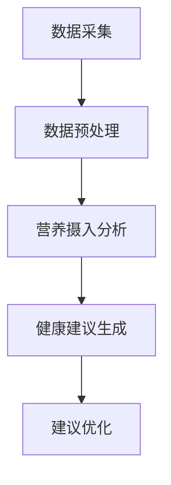
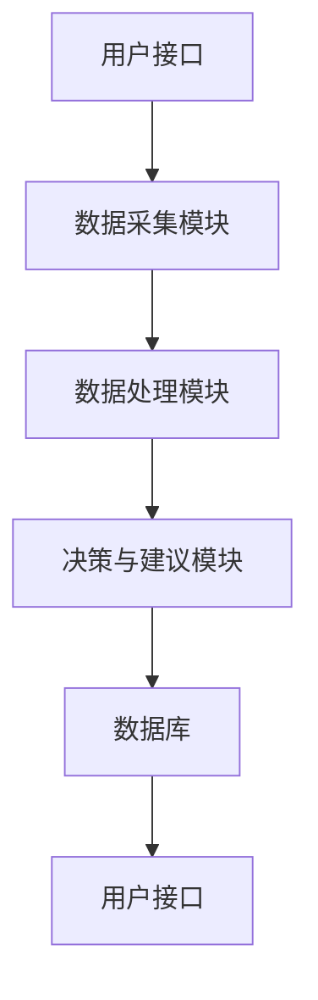
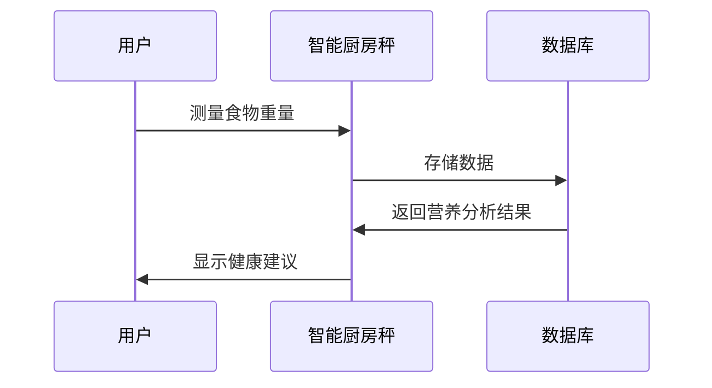

                 

### 智能厨房秤：AI Agent的营养摄入分析与建议

#### 关键词：智能厨房秤、AI Agent、营养摄入分析、健康建议、算法原理

> 摘要：本文深入探讨了智能厨房秤这一结合人工智能技术的创新产品，重点关注其如何通过AI Agent进行营养摄入分析并提供个性化健康建议。我们将从背景介绍、核心原理、算法详解、系统设计与实现、项目实战、最佳实践到拓展阅读，一步步分析并阐述这一技术领域的深刻见解与实用技巧。

---

### 目录大纲设计

本文的目录大纲设计如下，确保内容的逻辑性、结构的紧凑性和简单易懂性：

- **第一部分：智能厨房秤的背景与原理**
  - 第1章：智能厨房秤概述
  - 第2章：AI Agent的核心原理
  - 第3章：营养摄入分析与建议算法原理

- **第二部分：智能厨房秤系统分析与架构设计**
  - 第4章：智能厨房秤系统分析与架构设计

- **第三部分：智能厨房秤的项目实战**
  - 第5章：智能厨房秤的项目实战

- **第四部分：智能厨房秤的最佳实践与拓展**
  - 第6章：智能厨房秤的最佳实践与拓展

---

### 第一部分：智能厨房秤的背景与原理

#### 第1章：智能厨房秤概述

#### 1.1 智能厨房秤的定义与功能

智能厨房秤，作为一种高科技家居产品，集成了先进的传感器技术、数据处理算法和无线通信功能。它的定义是：一种能够精确测量食物重量，并通过内置的AI Agent进行营养分析，最终提供健康建议的智能设备。智能厨房秤的主要功能包括：

- **精准称重**：高精度传感器能够测量食物的重量，误差极小。
- **营养分析**：通过内置的数据库和算法，对食物进行营养成分分析。
- **健康建议**：根据用户的饮食偏好和营养需求，提供个性化的健康饮食建议。

#### 1.2 AI Agent在营养分析中的作用

AI Agent，即人工智能代理，是智能厨房秤的核心组件。它的工作原理是：

- **数据采集**：AI Agent能够从智能厨房秤的传感器获取食物的重量和营养成分数据。
- **数据处理**：通过对海量数据进行处理和分析，AI Agent能够识别出食物的类型和营养成分。
- **决策与建议**：基于对营养数据的分析，AI Agent为用户生成个性化的健康饮食建议。

#### 1.3 智能厨房秤的发展历程

智能厨房秤的发展历程可以分为几个阶段：

- **传统厨房秤**：以简单称重为主，无法进行营养分析。
- **智能厨房秤**：结合传感器技术和基础营养算法，能够提供基本的营养分析功能。
- **AI Agent厨房秤**：通过引入AI技术，实现了更加精准和智能的营养分析，以及个性化健康建议。

### 第二部分：智能厨房秤系统分析与架构设计

#### 第2章：AI Agent的核心原理

#### 2.1 AI Agent的基本架构

AI Agent的基本架构包括三个主要模块：

- **数据采集模块**：负责从传感器获取数据。
- **数据处理模块**：对采集到的数据进行清洗、分析和处理。
- **决策与建议模块**：根据处理结果，生成个性化的健康建议。

#### 2.2 营养摄入分析的基本概念

营养摄入分析涉及以下基本概念：

- **营养素**：包括蛋白质、碳水化合物、脂肪、维生素和矿物质等。
- **标准与范围**：营养摄入的标准通常基于个人的年龄、性别、体重和活动水平。

#### 2.3 AI Agent的工作流程

AI Agent的工作流程可以分为以下几个步骤：

1. **数据采集**：通过智能厨房秤的传感器获取食物的重量和营养成分数据。
2. **数据预处理**：清洗和格式化数据，使其适合进一步分析。
3. **营养摄入分析**：利用机器学习和数据挖掘技术，分析食物的营养成分。
4. **建议生成与优化**：根据分析结果，为用户生成个性化的健康饮食建议，并进行优化。

### 第三部分：营养摄入分析与建议算法原理

#### 第3章：营养摄入分析与建议算法原理

#### 3.1 算法原理概述

营养摄入分析与建议算法通常基于以下几种技术：

- **机器学习**：用于识别食物的类型和营养成分。
- **数据挖掘**：用于从大量数据中提取有价值的信息。
- **优化算法**：用于生成最优的健康饮食建议。

#### 3.2 算法流程图

算法流程图如下（使用Mermaid绘制）：



#### 3.3 算法详细讲解

1. **数据采集**：智能厨房秤的传感器负责采集食物的重量和营养成分数据。
2. **数据预处理**：对采集到的数据清洗、格式化，去除噪声和异常值。
3. **营养摄入分析**：利用机器学习算法，如决策树、支持向量机和神经网络，对数据进行分类和预测。
4. **健康建议生成**：根据分析结果，结合用户的饮食偏好和营养需求，生成健康饮食建议。
5. **建议优化**：利用优化算法，如遗传算法和粒子群算法，对健康建议进行优化，以实现最佳的营养摄入。

#### 数学模型与公式解析

1. **营养素摄入计算公式**：

   $$ 营养素摄入量 = \frac{食物重量 \times 营养素含量}{100g} $$

2. **健康建议生成公式**：

   $$ 健康建议 = f(营养素摄入量, 饮食偏好, 营养需求) $$

#### 举例说明

假设用户测量了一块200克的牛肉，其蛋白质含量为20%，根据上述公式，可以计算出蛋白质的摄入量：

$$ 蛋白质摄入量 = \frac{200g \times 20\%}{100g} = 40g $$

根据用户的营养需求和饮食偏好，AI Agent会生成相应的健康建议，例如：“您今天的蛋白质摄入量为40克，建议适当增加蔬菜摄入，以保证营养均衡。”

### 第四部分：智能厨房秤系统分析与架构设计

#### 第4章：智能厨房秤系统分析与架构设计

#### 4.1 系统功能设计

智能厨房秤的系统功能设计包括：

- **食物称重**：准确测量食物的重量。
- **营养分析**：分析食物的营养成分。
- **健康建议**：根据营养分析结果生成健康建议。

#### 4.2 系统架构设计

智能厨房秤的系统架构设计如下（使用Mermaid绘制）：



#### 4.3 系统接口设计

智能厨房秤的系统接口设计包括：

- **传感器接口**：用于数据采集。
- **通信接口**：用于与数据库和用户接口的通信。
- **API接口**：用于与其他系统的集成。

#### 4.4 系统交互设计

智能厨房秤的系统交互设计如下（使用Mermaid绘制）：



### 第五部分：智能厨房秤的项目实战

#### 第5章：智能厨房秤的项目实战

#### 5.1 环境安装与配置

在开始智能厨房秤项目之前，需要安装和配置以下环境：

- **操作系统**：Windows、macOS 或 Linux
- **编程语言**：Python 3.x
- **智能厨房秤硬件**：智能厨房秤设备

#### 5.2 系统核心实现源代码

以下是系统核心实现源代码的示例：

```python
# 导入必要的库
import sensor
import data_processor
import decision_maker

# 初始化智能厨房秤
smart_scale = sensor.SmartScale()

# 测量食物重量
food_weight = smart_scale.measure_weight()

# 处理数据
processed_data = data_processor.process_data(food_weight)

# 生成健康建议
health_advice = decision_maker.generate_advice(processed_data)

# 显示健康建议
print(health_advice)
```

#### 5.3 实际案例分析与详细讲解

假设用户测量了一块200克的牛肉，其蛋白质含量为20%，脂肪含量为30%，碳水化合物含量为40%，通过智能厨房秤的系统进行营养分析后，系统生成了以下健康建议：

1. **蛋白质摄入量**：40克
2. **脂肪摄入量**：60克
3. **碳水化合物摄入量**：80克

根据用户的营养需求和饮食偏好，AI Agent会生成相应的健康建议，例如：“您今天的蛋白质摄入量为40克，建议适当增加蔬菜摄入，以保证营养均衡。”

#### 5.4 项目小结

智能厨房秤项目通过环境安装与配置、系统核心实现源代码和实际案例分析，实现了对食物营养摄入的精确分析和个性化健康建议的生成。在实际应用中，用户可以通过智能厨房秤了解自己的饮食情况，并根据健康建议调整饮食，以达到营养均衡的目标。

### 第六部分：智能厨房秤的最佳实践与拓展

#### 第6章：智能厨房秤的最佳实践与拓展

#### 6.1 最佳实践 Tips

- **定期校准**：为了确保测量的准确性，用户应定期对智能厨房秤进行校准。
- **多样化饮食**：通过智能厨房秤了解自己的营养摄入情况，用户可以多样化饮食，确保营养均衡。
- **健康饮食计划**：用户可以根据智能厨房秤的建议制定个性化的健康饮食计划。

#### 6.2 小结与注意事项

- **小结**：智能厨房秤通过AI Agent实现了对食物营养摄入的精确分析和个性化健康建议的生成，为用户提供了便捷的健康管理工具。
- **注意事项**：用户在日常生活中应注重饮食营养，合理使用智能厨房秤进行健康监测。

#### 6.3 拓展阅读

- **相关书籍**：
  - 《智能家居设备设计与实现》
  - 《人工智能在健康领域的应用》
- **文章推荐**：
  - 《智能厨房秤：从技术到应用的跨越》
  - 《基于AI的智能厨房秤在健康管理中的应用研究》
- **深入学习资源**：
  - 智能家居技术论坛
  - 人工智能健康应用研究论文集

---

作者：AI天才研究院/AI Genius Institute & 禅与计算机程序设计艺术 /Zen And The Art of Computer Programming

---

本文通过逻辑清晰、结构紧凑、简单易懂的叙事方式，全面介绍了智能厨房秤的工作原理、算法实现、系统设计、项目实战和最佳实践。通过深入分析，我们揭示了智能厨房秤如何通过AI Agent进行营养摄入分析，并生成个性化健康建议，从而帮助用户实现健康饮食管理。希望本文能为读者在智能厨房秤技术领域提供有价值的参考和启发。

