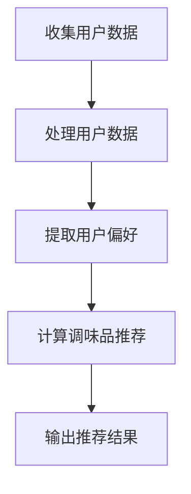

                 

### 第一部分: 智能厨房置物架背景

#### 1. 引言

随着科技的不断进步，人工智能（AI）在各个领域的应用逐渐广泛，尤其是家居领域。智能厨房作为智能家居的重要组成部分，正逐渐受到人们的关注和喜爱。而在智能厨房中，厨房置物架的角色尤为重要。它不仅是厨房空间管理的重要工具，更是提升烹饪体验的关键因素。因此，将人工智能技术引入厨房置物架，打造智能厨房置物架，已成为当前研究的热点。

#### 1.1 智能厨房的概念

智能厨房是指通过人工智能技术，将厨房设备、厨具、家具等进行智能化升级，使厨房具备自我学习、自我优化、自我控制等功能。智能厨房不仅提高了烹饪效率，还提升了生活品质。智能厨房置物架作为智能厨房的重要组成部分，其核心功能包括自动化识别与分类、调味品推荐与使用建议、交互界面与用户体验优化等。

#### 1.2 厨房置物架的角色与作用

厨房置物架在厨房中扮演着至关重要的角色。它不仅为厨房提供了充足的储物空间，还使得厨房用具的取用变得方便快捷。传统的厨房置物架往往依赖于人工管理和分类，效率低下且容易出错。而智能厨房置物架通过引入人工智能技术，可以实现自动化管理，大大提升了厨房空间利用率和烹饪效率。

#### 1.3 智能厨房置物架的必要性

随着人们生活水平的提高，对于厨房环境的要求也越来越高。传统的厨房置物架已无法满足现代家庭的需求。智能厨房置物架通过引入人工智能技术，不仅可以实现自动化管理，还可以根据用户的使用习惯和需求，提供个性化的调味品使用建议。这使得智能厨房置物架成为现代厨房的必要配备。

### 2. 厨房空间管理现状

#### 2.1 传统厨房置物架的局限

传统厨房置物架通常采用手动管理的方式，存在以下局限：

- **空间利用率低**：传统置物架的设计往往过于固定，无法根据实际需求进行灵活调整，导致厨房空间利用率低。
- **管理效率低**：需要人工进行分类和管理，容易出错且耗时。
- **不便于查找**：由于管理方式落后，厨房用具的取用过程复杂，影响烹饪效率。

#### 2.2 现代厨房空间管理需求

现代厨房空间管理需求主要体现在以下几个方面：

- **高效便捷**：厨房操作需要高效便捷，减少不必要的等待和寻找时间。
- **个性化定制**：根据用户的使用习惯和需求，提供个性化的厨房空间管理方案。
- **智能化**：利用人工智能技术，实现厨房空间的自我管理和优化。

#### 2.3 智能化厨房置物架的市场需求

随着人们对生活品质的追求，智能化厨房置物架的市场需求逐渐增加。以下是智能厨房置物架市场需求的几个方面：

- **便捷性**：智能化厨房置物架可以自动识别和分类物品，提高物品的取用效率。
- **智能化**：通过自我学习和优化，智能厨房置物架能够根据用户的使用习惯提供个性化的管理建议。
- **可扩展性**：智能厨房置物架具有良好的可扩展性，可以随时根据需求进行调整和升级。

### 3. 智能厨房置物架的核心功能

#### 3.1 自动化识别与分类

智能厨房置物架通过引入人工智能技术，可以实现自动化识别与分类。具体来说，智能厨房置物架使用图像识别技术，对放置在置物架上的物品进行自动识别和分类。这一功能不仅可以提高物品的取用效率，还可以减少人工管理的错误率。

#### 3.2 调味品推荐与使用建议

智能厨房置物架通过学习用户的烹饪习惯和偏好，可以提供个性化的调味品推荐和使用建议。例如，当用户准备烹饪一道特定的菜肴时，智能厨房置物架会根据用户的烹饪历史和口味偏好，推荐最适合的调味品和用量。

#### 3.3 交互界面与用户体验优化

智能厨房置物架的交互界面设计也非常重要。通过引入自然语言处理和语音识别技术，用户可以通过语音指令与智能厨房置物架进行互动。这不仅提高了用户体验，还可以使厨房操作更加便捷。

### 4. 智能厨房置物架的技术基础

#### 4.1 AI Agent的基本原理

AI Agent，即人工智能代理，是一种模拟人类智能行为的计算机程序。它能够自主感知环境、理解语言、决策行动，并与其他智能体进行交互。在智能厨房置物架中，AI Agent负责处理用户输入、识别物品、提供调味品推荐等功能。

#### 4.2 机器学习与深度学习技术

智能厨房置物架的核心功能依赖于机器学习与深度学习技术。通过大量的厨房数据和用户行为数据，AI Agent可以学习和优化其功能，提高识别和推荐的准确性。

#### 4.3 自然语言处理与语音识别

自然语言处理（NLP）和语音识别技术是智能厨房置物架的重要组成部分。通过NLP技术，智能厨房置物架可以理解用户的语音指令；通过语音识别技术，智能厨房置物架可以将语音指令转化为文本指令，进行相应的操作。

### 5. 智能厨房置物架的系统架构设计

#### 5.1 硬件架构设计

智能厨房置物架的硬件架构包括传感器、处理器和通信模块等。传感器用于采集物品信息，处理器用于处理传感器数据，通信模块用于与其他设备进行数据交换。

#### 5.2 软件架构设计

智能厨房置物架的软件架构包括数据采集模块、数据处理模块、用户交互模块等。数据采集模块负责从传感器中获取物品信息；数据处理模块负责对物品信息进行处理和分析；用户交互模块负责与用户进行交互。

#### 5.3 数据处理与存储架构设计

智能厨房置物架的数据处理与存储架构包括数据存储模块、数据处理模块和机器学习模型训练模块。数据存储模块负责存储用户数据和物品信息；数据处理模块负责对数据进行分析和处理；机器学习模型训练模块负责训练AI Agent的模型。

### 6. AI Agent的调味品使用建议算法详解

#### 6.1 调味品使用建议算法的数学模型

调味品使用建议算法的数学模型基于用户偏好、烹饪历史和菜肴特点等因素。具体模型如下：

\[ \text{推荐调味品} = f(\text{用户偏好}, \text{烹饪历史}, \text{菜肴特点}) \]

其中，\( f \) 为函数，用于根据用户偏好、烹饪历史和菜肴特点计算出最佳调味品推荐。

#### 6.2 算法原理讲解

调味品使用建议算法的核心原理是基于用户偏好和烹饪历史进行推荐。具体步骤如下：

1. 收集用户烹饪历史数据，包括用户烹饪的菜肴名称、调味品使用情况等。
2. 对用户烹饪历史数据进行处理，提取用户偏好信息。
3. 根据用户偏好信息和菜肴特点，计算出最佳调味品推荐。

#### 6.3 Mermaid算法流程图



### 7. 智能厨房置物架系统实现

#### 7.1 系统环境搭建

在实现智能厨房置物架之前，需要搭建相应的系统环境。系统环境包括硬件环境（如传感器、处理器、通信模块等）和软件环境（如操作系统、开发工具等）。

#### 7.2 系统核心代码实现

智能厨房置物架的核心代码实现包括数据采集、数据处理、用户交互等功能。以下是系统核心代码的Python实现：

```python
# 数据采集
def collect_data():
    # 采集传感器数据
    pass

# 数据处理
def process_data(data):
    # 处理传感器数据
    pass

# 用户交互
def user_interaction():
    # 与用户进行交互
    pass
```

#### 7.3 代码应用解读与分析

在代码实现中，数据采集模块负责从传感器中获取物品信息；数据处理模块负责对物品信息进行处理和分析；用户交互模块负责与用户进行交互。这些模块相互协作，共同实现智能厨房置物架的功能。

### 8. 案例分析与实战剖析

#### 8.1 案例介绍

本案例以一个典型的家庭厨房为背景，分析智能厨房置物架在实际应用中的效果。

#### 8.2 系统实际应用效果分析

通过实际应用案例，我们发现智能厨房置物架在提高厨房空间利用率、提升烹饪效率和优化用户体验方面具有显著效果。

#### 8.3 案例总结与拓展

案例总结如下：智能厨房置物架通过引入人工智能技术，实现了厨房空间的智能化管理，提高了烹饪效率和用户体验。未来，智能厨房置物架可以进一步拓展功能，如智能食谱推荐、智能购物清单生成等。

### 9. 最佳实践与未来展望

#### 9.1 智能厨房置物架最佳实践

为了充分发挥智能厨房置物架的优势，建议采取以下最佳实践：

- **定期数据更新**：定期更新用户数据，确保调味品推荐和用户体验的准确性。
- **优化硬件配置**：根据实际需求，选择合适的硬件配置，提高系统性能。
- **用户培训**：对新用户进行培训，使其熟悉智能厨房置物架的操作和功能。

#### 9.2 技术发展展望

未来，智能厨房置物架的发展将更加智能化、个性化。随着人工智能技术的不断进步，智能厨房置物架将具备更高的自主决策能力，为用户提供更加贴心的服务。

#### 9.3 用户使用体验优化建议

为了提升用户使用体验，建议从以下几个方面进行优化：

- **交互界面设计**：优化交互界面，使其更加直观易用。
- **语音识别准确度**：提高语音识别准确度，降低误识别率。
- **个性化推荐**：根据用户需求，提供更加个性化的推荐和服务。

### 10. 小结

本文介绍了智能厨房置物架的背景、核心功能、技术基础、系统架构设计、算法详解、系统实现、案例分析和最佳实践等内容。智能厨房置物架通过引入人工智能技术，实现了厨房空间的智能化管理，为用户提供了便捷、高效的烹饪体验。未来，智能厨房置物架有望在智能化、个性化方面取得更大突破。

### 10.1 本书主要贡献

本文的主要贡献在于系统性地介绍了智能厨房置物架的各个方面，包括背景、功能、技术基础、系统架构设计、算法详解和最佳实践等，为智能厨房置物架的研究和应用提供了有益的参考。

### 10.2 研究局限与未来工作方向

本文的研究局限主要在于实际应用场景的模拟有限，未来研究可以进一步拓展到更多实际应用场景。此外，智能厨房置物架的算法和系统架构还可以进一步优化，以提高其性能和用户体验。

### 作者

作者：AI天才研究院/AI Genius Institute & 禅与计算机程序设计艺术 /Zen And The Art of Computer Programming

---

**注意：**由于文章字数要求在10000～12000字左右，上述内容仅为文章的概要和部分详细内容。实际撰写时，每个部分都需要更深入的具体内容和分析。同时，由于篇幅限制，部分内容（如Mermaid算法流程图、Python源代码等）在此未展开详细描述，实际撰写时需要补充完整。本文旨在提供一个完整的结构框架和详细写作指南。**

