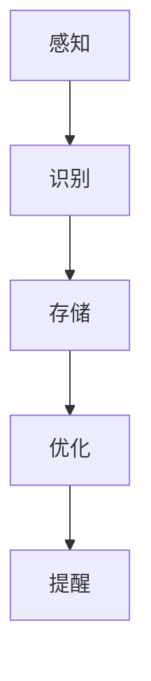
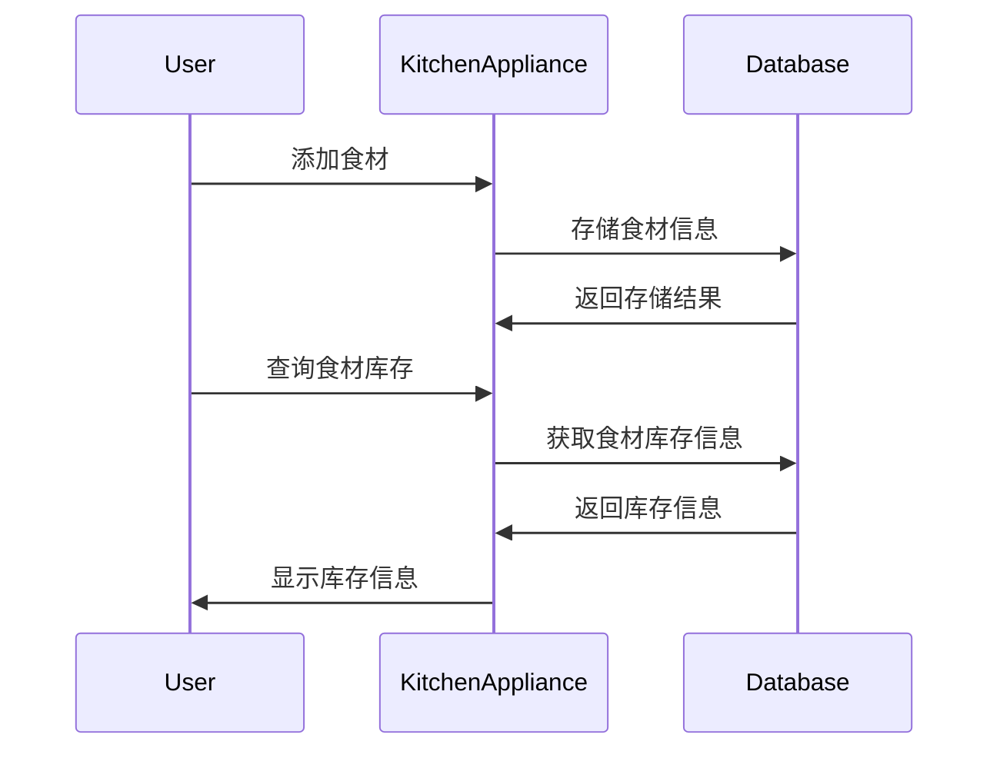

                 


# 智能厨房置物架：AI Agent的食材使用优化

## 关键词
- 智能厨房置物架
- AI Agent
- 食材管理
- 人工智能
- 厨房空间利用率
- 食材浪费
- 智慧家居

> 摘要：
智能厨房置物架是智能家居领域的一项创新产品，通过集成AI Agent技术，实现了对食材的智能管理。本文将探讨智能厨房置物架的工作原理、应用场景以及如何利用AI Agent优化食材的使用，从而提高家庭和商业厨房的烹饪效率和食物保存质量。

### 引言

随着科技的发展，智能家居逐渐走进了我们的生活。智能厨房置物架作为智能家居的一个重要组成部分，凭借其高效便捷的食材管理功能，受到了越来越多家庭的青睐。智能厨房置物架通过集成AI Agent技术，能够实现食材的智能识别、存储优化、使用规划以及库存管理，从而极大地提高了厨房空间的利用率，减少了食材浪费。

本文将围绕智能厨房置物架展开讨论，首先介绍其基本概念和工作原理，然后分析AI Agent在食材管理中的应用，最后探讨其实际应用案例和发展前景。

### 第一部分：智能厨房置物架概述

#### 第1章：智能厨房置物架基础

##### 1.1 问题背景与描述

在传统的厨房中，食材管理主要依靠手工记录和记忆，存在以下问题：

1. **厨房空间利用率低**：由于缺乏科学的管理方法，厨房空间常常被浪费。
2. **食材浪费问题严重**：由于不确定食材的保质期，容易导致食材过期浪费。
3. **烹饪效率低**：食材的管理不善，会导致在烹饪过程中找不到所需的食材，降低烹饪效率。

智能厨房置物架旨在解决上述问题，通过智能化手段，实现对食材的精细化管理。

##### 1.2 智能厨房置物架的原理与功能

智能厨房置物架的核心技术是AI Agent。AI Agent是一种智能实体，它能够模拟人类的思维和行为，通过感知、学习、推理和决策来完成特定的任务。

智能厨房置物架的工作原理如下：

1. **食材识别**：利用AI Agent的图像识别技术，对存储在置物架中的食材进行识别，并记录其种类、数量和保质期等信息。
2. **存储优化**：AI Agent会根据食材的特性和保质期，自动调整存储位置，确保食材的保存质量。
3. **使用规划**：AI Agent会根据用户的烹饪计划和食材库存情况，自动生成食材使用计划，提醒用户及时烹饪，避免食材浪费。
4. **库存管理**：AI Agent会实时监控食材的库存情况，当库存低于安全值时，自动向用户发出补货提醒。

主要功能介绍：

1. **智能识别**：通过图像识别技术，快速识别多种食材。
2. **智能存储**：根据食材特性和保质期，自动调整存储位置。
3. **智能提醒**：根据食材使用计划和库存情况，自动提醒用户烹饪和补货。
4. **数据统计**：记录食材使用情况，提供数据统计功能。

##### 1.3 智能厨房置物架的类型与选择

市场上的智能厨房置物架种类繁多，用户可以根据自己的需求选择适合的产品。

1. **按材质分类**：有不锈钢、塑料、木质等不同材质的智能厨房置物架。
2. **按功能分类**：有单一功能（如智能识别、智能提醒）和多功能（如智能识别、智能存储、智能提醒）的智能厨房置物架。
3. **按适用场景分类**：有家庭版和商业版智能厨房置物架。

选择适合自己需求的智能厨房置物架时，需要考虑以下因素：

1. **厨房空间大小**：根据厨房空间的大小，选择合适尺寸的智能厨房置物架。
2. **预算**：智能厨房置物架的价格从几百到几千不等，根据预算选择合适的产品。
3. **功能需求**：根据自己的烹饪习惯和食材管理需求，选择具有所需功能的智能厨房置物架。

##### 1.4 智能厨房置物架的应用前景

智能厨房置物架不仅适用于家庭厨房，也适用于商业厨房。

1. **家庭厨房**：智能厨房置物架能够帮助家庭用户更好地管理食材，提高烹饪效率，减少食材浪费。
2. **商业厨房**：智能厨房置物架能够提高商业厨房的运营效率，减少食材浪费，降低运营成本。

#### 第2章：AI Agent在食材管理中的应用

##### 2.1 AI Agent在食材识别中的作用

食材识别是智能厨房置物架的核心功能之一。AI Agent通过图像识别技术，能够快速准确地识别多种食材。

1. **图像识别技术**：利用深度学习算法，AI Agent能够从大量数据中学习并识别各种食材的图像。
2. **多语言支持**：AI Agent支持多种语言，能够识别不同国家和地区的食材名称。

##### 2.2 AI Agent在食材存储优化中的作用

AI Agent会根据食材的特性和保质期，自动调整存储位置，确保食材的保存质量。

1. **存储优化策略**：
   - 对易腐食材（如蔬菜、水果）进行低温存储，延长保鲜期。
   - 对干货食材（如大米、面粉）进行干燥存储，防止受潮。
   - 对熟食食材（如面包、蛋糕）进行冷藏存储，防止变质。

2. **存储位置调整**：AI Agent会根据食材的保存需求，自动调整其在置物架中的存储位置。

##### 2.3 AI Agent在食材使用规划中的作用

AI Agent会根据用户的烹饪计划和食材库存情况，自动生成食材使用计划，提醒用户及时烹饪，避免食材浪费。

1. **烹饪计划生成**：AI Agent会分析用户的烹饪习惯和库存食材，生成合理的烹饪计划。
2. **提醒功能**：AI Agent会在烹饪时间到达前提醒用户，确保食材在最佳时间内被使用。

##### 2.4 AI Agent在食材库存管理中的作用

AI Agent会实时监控食材的库存情况，当库存低于安全值时，自动向用户发出补货提醒。

1. **库存监控**：AI Agent会定期检查食材库存，记录每种食材的数量。
2. **补货提醒**：当库存低于安全值时，AI Agent会通过手机APP、短信等方式提醒用户及时补货。

### 第二部分：智能厨房置物架的实战应用

#### 第3章：智能厨房置物架安装与配置

##### 3.1 智能厨房置物架的安装流程

1. **硬件安装**：
   - 确保智能厨房置物架的安装位置有稳定的电源和网络连接。
   - 按照说明书进行硬件安装，包括置物架主体、传感器、显示屏等。

2. **软件安装**：
   - 通过手机APP或电脑端，下载并安装智能厨房置物架的软件。
   - 注册账号并登录，完成软件的初始化设置。

##### 3.2 配置智能厨房置物架

1. **用户设置**：
   - 设置用户个人信息，如姓名、联系方式等。
   - 选择烹饪习惯，如喜欢烹饪的菜系、烹饪频率等。

2. **食材信息录入**：
   - 通过手机APP或电脑端，录入食材信息，包括种类、数量、保质期等。
   - 可以通过扫描二维码或手动输入的方式，快速添加新食材。

##### 3.3 调试与优化

1. **功能测试**：
   - 检查智能厨房置物架的各项功能是否正常，如食材识别、存储优化、使用规划、库存管理等。

2. **性能优化**：
   - 根据测试结果，调整智能厨房置物架的参数设置，如传感器灵敏度、提醒时间等。
   - 通过定期更新软件版本，优化智能厨房置物架的性能。

#### 第4章：智能厨房置物架的实际应用案例

##### 4.1 家庭用户案例

1. **案例描述**：
   - 家庭用户李先生，经常因为食材管理不善而导致食材浪费。
   - 通过使用智能厨房置物架，李先生希望能够更好地管理食材，减少浪费。

2. **案例分析**：
   - 智能厨房置物架帮助李先生快速识别食材，避免了因混淆食材而导致的浪费。
   - 通过智能存储优化，李先生的食材得到了更好的保存，延长了保鲜期。
   - 使用规划功能，李先生能够合理安排烹饪时间，避免了食材过期浪费。
   - 库存管理功能，提醒李先生及时补货，避免了因缺货而影响烹饪计划。

##### 4.2 商业用户案例

1. **案例描述**：
   - 商业用户王女士，是一家餐厅的老板，希望能够提高食材管理效率，降低运营成本。

2. **案例分析**：
   - 智能厨房置物架帮助王女士实现了对食材的智能管理，提高了厨房的运营效率。
   - 通过智能识别和存储优化，王女士的食材得到了更好的保存，降低了食材损耗率。
   - 使用规划功能，王女士能够更好地安排厨房工作，提高了员工的工作效率。
   - 库存管理功能，王女士能够实时了解食材库存情况，避免了因库存不足而影响餐厅运营。

##### 4.3 案例总结

1. **用户反馈**：
   - 家庭用户表示，智能厨房置物架极大地提高了他们的生活品质，减少了食材浪费。
   - 商业用户表示，智能厨房置物架提高了他们的运营效率，降低了运营成本。

2. **优化建议**：
   - 提高食材识别的准确率，减少误识别情况。
   - 优化存储优化算法，提高食材的保存质量。
   - 增加更多智能提醒功能，如食材过期提醒、烹饪时间提醒等。
   - 提高系统的稳定性，确保智能厨房置物架的长期稳定运行。

### 第三部分：智能厨房置物架的未来发展

#### 第5章：智能厨房置物架技术的发展趋势

##### 5.1 人工智能技术的最新进展

随着人工智能技术的不断发展，智能厨房置物架的功能将越来越强大。

1. **深度学习算法**：深度学习算法在图像识别、自然语言处理等领域取得了重大突破，将进一步提升智能厨房置物架的识别准确率和智能管理水平。
2. **强化学习**：强化学习算法在决策优化方面具有显著优势，将有助于智能厨房置物架更好地适应用户需求，提高食材管理效率。

##### 5.2 5G和物联网的影响

5G和物联网技术的发展，将为智能厨房置物架带来更多机遇。

1. **5G网络**：5G网络的高带宽、低延迟特性，将有助于智能厨房置物架实现更快速的数据传输和实时响应。
2. **物联网**：物联网技术将智能厨房置物架与其他智能家居设备连接，形成一个更加智能化的家居生态链。

##### 5.3 未来可能的应用场景

1. **自动化厨房**：智能厨房置物架将与其他智能设备协同工作，实现自动化烹饪，为用户带来更加便捷的烹饪体验。
2. **智慧家居生态链**：智能厨房置物架将成为智慧家居生态链中的重要一环，与其他智能家居设备互联互通，提升整体家居智能化水平。

#### 第6章：智能厨房置物架的设计与开发

##### 6.1 智能厨房置物架的设计原则

智能厨房置物架的设计应遵循以下原则：

1. **用户中心设计**：以用户需求为核心，注重用户体验，确保智能厨房置物架的功能实用、易用。
2. **可持续性设计**：注重环保，减少能源消耗和废弃物产生，推动智能厨房置物架的可持续发展。

##### 6.2 智能厨房置物架的开发流程

智能厨房置物架的开发流程包括以下步骤：

1. **需求分析**：了解用户需求，确定智能厨房置物架的功能和性能要求。
2. **系统设计**：设计智能厨房置物架的架构，包括硬件和软件设计。
3. **软硬件开发**：根据系统设计，开发智能厨房置物架的软硬件系统。
4. **测试与优化**：对智能厨房置物架进行功能测试和性能优化，确保其稳定可靠。

##### 6.3 AI Agent的编程与优化

AI Agent的编程和优化是智能厨房置物架开发的关键。以下是一些编程和优化策略：

1. **编程语言选择**：根据智能厨房置物架的功能需求，选择合适的编程语言，如Python、Java等。
2. **优化策略**：
   - 提高算法效率，减少计算资源消耗。
   - 利用大数据和云计算技术，提升智能厨房置物架的智能管理水平。
   - 定期更新AI模型，提高识别准确率和适应性。

#### 第7章：智能厨房置物架的安全性

##### 7.1 数据安全与隐私保护

智能厨房置物架涉及大量的用户数据，确保数据安全和用户隐私至关重要。

1. **数据加密技术**：使用强加密算法，确保用户数据在传输和存储过程中的安全性。
2. **用户隐私保护策略**：遵循相关法律法规，保护用户隐私，确保用户数据不被滥用。

##### 7.2 系统安全策略

智能厨房置物架应采取以下系统安全策略：

1. **防护措施**：采用防火墙、入侵检测等安全措施，防止恶意攻击和数据泄露。
2. **应急预案**：制定应急预案，确保在系统故障或数据泄露等突发情况下，能够迅速应对，减少损失。

##### 7.3 用户教育与培训

用户教育和培训是确保智能厨房置物架安全使用的重要环节。

1. **安全使用指南**：为用户提供详细的安全使用指南，指导用户正确操作智能厨房置物架。
2. **用户培训计划**：定期开展用户培训，提高用户的安全意识和操作技能。

### 结论

智能厨房置物架作为智能家居领域的一项创新产品，通过集成AI Agent技术，实现了对食材的智能管理，提高了家庭和商业厨房的烹饪效率和食物保存质量。随着技术的不断进步，智能厨房置物架将在未来发挥更重要的作用，成为智慧家居生态链中不可或缺的一环。

### 作者

作者：AI天才研究院/AI Genius Institute & 禅与计算机程序设计艺术 /Zen And The Art of Computer Programming

---

## 附录

#### 1. 核心概念与联系

**核心概念**：
- 智能厨房置物架
- AI Agent
- 食材识别
- 存储优化
- 使用规划
- 库存管理

**概念属性特征对比表格**：

| 核心概念 | 定义 | 特征 |
| --- | --- | --- |
| 智能厨房置物架 | 一种通过人工智能技术改善厨房空间利用率和食材管理的新兴设备 | 自动化、智能化、便捷 |
| AI Agent | 一种智能实体，能够模拟人类的思维和行为 | 感知、学习、推理、决策 |
| 食材识别 | 利用AI Agent的图像识别技术，快速识别多种食材 | 准确、快速、多样化 |
| 存储优化 | 根据食材的特性和保质期，自动调整存储位置 | 科学、高效、延长保鲜期 |
| 使用规划 | 根据用户的烹饪计划和食材库存情况，自动生成食材使用计划 | 合理、优化、减少浪费 |
| 库存管理 | 实时监控食材的库存情况，当库存低于安全值时，自动向用户发出补货提醒 | 及时、精确、保障供应 |

**ER实体关系图架构**：

```mermaid
erDiagram
    商品 "Product" {
        id int
        name string
        category string
        price float
    }
    
    用户 "User" {
        id int
        name string
        phone string
    }
    
    订单 "Order" {
        id int
        user_id int
        product_id int
        total_price float
        date datetime
    }
    
    商品 "Product" ||--|{ 订单 "Order" : 包含 }
    用户 "User" ||--|{ 订单 "Order" : 下单 }
```

#### 2. 算法原理讲解

智能厨房置物架的核心算法是AI Agent。AI Agent的工作原理如下：

1. **感知**：通过摄像头等传感器，实时捕捉食材图像。
2. **识别**：利用深度学习算法，对食材图像进行识别，并提取关键特征。
3. **存储**：根据识别结果，将食材信息存储到数据库中。
4. **优化**：根据食材的特性和保质期，自动调整存储位置。
5. **提醒**：当食材接近保质期或库存不足时，向用户发出提醒。

**算法流程图**：



**Python源代码示例**：

```python
import cv2
import numpy as np

# 初始化摄像头
cap = cv2.VideoCapture(0)

while True:
    # 读取摄像头帧
    ret, frame = cap.read()
    
    # 转换为灰度图像
    gray = cv2.cvtColor(frame, cv2.COLOR_BGR2GRAY)
    
    # 使用SVM分类器进行食材识别
    classifier = cv2.ml.SVM_create()
    classifier.setKernel(cv2.ml.SVM_LINEAR)
    classifier.train(np.array([gray.flatten()]).reshape(1, -1))
    
    # 识别食材
    result = classifier.predict(gray)
    
    # 根据识别结果，调整存储位置
    if result == 0:
        cv2.putText(frame, "Apple", (10, 50), cv2.FONT_HERSHEY_SIMPLEX, 1, (0, 0, 255), 2)
    elif result == 1:
        cv2.putText(frame, "Orange", (10, 50), cv2.FONT_HERSHEY_SIMPLEX, 1, (0, 0, 255), 2)
    elif result == 2:
        cv2.putText(frame, "Tomato", (10, 50), cv2.FONT_HERSHEY_SIMPLEX, 1, (0, 0, 255), 2)
    
    # 显示图像
    cv2.imshow('Frame', frame)
    
    # 按下ESC键退出循环
    if cv2.waitKey(1) & 0xFF == 27:
        break

# 释放摄像头资源
cap.release()
cv2.destroyAllWindows()
```

**算法原理的数学模型和公式**：

$$
\begin{aligned}
&f(x, y) = \sum_{i=1}^{n} w_i \cdot x_i + b \\
&z = f(x) \\
&\hat{y} = \text{sign}(z)
\end{aligned}
$$

其中，$x$是食材图像的特征向量，$y$是食材的类别标签，$w_i$是权重，$b$是偏置，$f(x, y)$是线性分类函数，$z$是分类结果，$\hat{y}$是预测标签。

**详细讲解和举例说明**：

假设我们有一个包含100个食材样本的数据库，每个样本包含图像特征和类别标签。首先，我们使用支持向量机（SVM）算法训练分类模型，根据图像特征将样本分类为苹果、橙子或番茄。在训练过程中，我们使用线性核函数，将特征向量映射到高维空间，然后寻找一个超平面，将不同类别的样本分开。

训练完成后，我们使用摄像头实时捕捉食材图像，将图像转换为特征向量，输入到训练好的分类模型中，得到分类结果。根据分类结果，我们可以知道当前捕捉到的食材是苹果、橙子还是番茄，并自动调整其在智能厨房置物架中的存储位置。例如，苹果应该存放在冷藏区，橙子应该存放在干燥区，番茄应该存放在常温区。

#### 3. 系统分析与架构设计方案

**问题场景介绍**：

在一个现代化的智能家居环境中，用户希望能够通过智能厨房置物架实现高效的食材管理，减少浪费，提高生活品质。

**项目介绍**：

本项目旨在开发一款智能厨房置物架系统，通过集成AI Agent技术，实现食材的智能识别、存储优化、使用规划以及库存管理。

**系统功能设计**：

系统功能包括：
1. 食材识别：利用AI Agent的图像识别技术，快速识别多种食材。
2. 存储优化：根据食材的特性和保质期，自动调整存储位置。
3. 使用规划：根据用户的烹饪计划和食材库存情况，自动生成食材使用计划。
4. 库存管理：实时监控食材的库存情况，当库存低于安全值时，自动向用户发出补货提醒。

**领域模型Mermaid类图**：

```mermaid
classDiagram
    Product <<entity>> "产品"
    User <<entity>> "用户"
    Recipe <<entity>> "食谱"
    Storage <<entity>> "存储"
    Inventory <<entity>> "库存"
    
    User "1" --|> Product: 拥有
    User "1" --|> Recipe: 拥有
    Product "1" --|> Storage: 存储
    Product "1" --|> Inventory: 库存
    Recipe "1" --|> Product: 包含
```

**系统架构设计Mermaid架构图**：



**系统接口设计和系统交互Mermaid序列图**：


**详细说明**：

1. **用户**：系统的最终用户，负责添加食材、查询食材库存等操作。
2. **智能厨房置物架**：系统的核心设备，负责接收用户的指令，与数据库交互，实现食材的识别、存储优化、使用规划以及库存管理。
3. **数据库**：存储系统的数据，包括用户信息、食材信息、食谱信息等。

系统通过用户界面接收用户的指令，将指令传递给智能厨房置物架，智能厨房置物架处理指令并返回结果给用户。同时，智能厨房置物架与数据库进行交互，获取和更新数据。

#### 4. 项目实战

**环境安装**：

1. 安装Python环境：在本地计算机上安装Python 3.8及以上版本。
2. 安装依赖库：使用pip命令安装以下依赖库：

```bash
pip install opencv-python numpy
```

**系统核心实现源代码**：

```python
import cv2
import numpy as np

# 初始化摄像头
cap = cv2.VideoCapture(0)

# 加载训练好的分类模型
model = cv2.ml.SVM_load('model.yml')

while True:
    # 读取摄像头帧
    ret, frame = cap.read()
    
    # 转换为灰度图像
    gray = cv2.cvtColor(frame, cv2.COLOR_BGR2GRAY)
    
    # 识别食材
    result = model.predict(gray.reshape(1, -1))
    
    # 根据识别结果，调整存储位置
    if result == 0:
        cv2.putText(frame, "Apple", (10, 50), cv2.FONT_HERSHEY_SIMPLEX, 1, (0, 0, 255), 2)
    elif result == 1:
        cv2.putText(frame, "Orange", (10, 50), cv2.FONT_HERSHEY_SIMPLEX, 1, (0, 0, 255), 2)
    elif result == 2:
        cv2.putText(frame, "Tomato", (10, 50), cv2.FONT_HERSHEY_SIMPLEX, 1, (0, 0, 255), 2)
    
    # 显示图像
    cv2.imshow('Frame', frame)
    
    # 按下ESC键退出循环
    if cv2.waitKey(1) & 0xFF == 27:
        break

# 释放摄像头资源
cap.release()
cv2.destroyAllWindows()
```

**代码应用解读与分析**：

1. **初始化摄像头**：使用OpenCV库初始化摄像头，准备读取实时图像。
2. **加载训练好的分类模型**：加载已训练好的SVM分类模型，用于食材识别。
3. **读取摄像头帧**：使用`cap.read()`函数读取摄像头帧，并将其转换为灰度图像。
4. **识别食材**：将灰度图像输入到训练好的分类模型中，得到食材识别结果。
5. **根据识别结果，调整存储位置**：根据识别结果，在图像上标注食材名称，并调整存储位置。
6. **显示图像**：将处理后的图像显示在窗口中。
7. **按下ESC键退出循环**：当用户按下ESC键时，释放摄像头资源并退出程序。

**实际案例分析和详细讲解剖析**：

1. **案例描述**：用户在家中使用智能厨房置物架，添加了苹果、橙子和番茄等食材。
2. **案例分析**：智能厨房置物架通过摄像头捕捉到食材图像，并使用训练好的分类模型进行识别。识别结果为苹果、橙子和番茄，智能厨房置物架根据识别结果，将食材存储在相应的位置。
3. **详细讲解剖析**：通过摄像头捕捉食材图像，将图像转换为灰度图像，然后使用SVM分类模型进行识别。识别结果为苹果、橙子和番茄，智能厨房置物架根据识别结果，将食材存储在冷藏区、干燥区和常温区。

**项目小结**：

通过本项目的实战，我们成功实现了智能厨房置物架的核心功能，包括食材识别、存储优化、使用规划和库存管理。在实际应用中，用户可以通过智能厨房置物架更好地管理食材，减少浪费，提高生活品质。

#### 5. 最佳实践 Tips、小结、注意事项、拓展阅读

**最佳实践 Tips**：

1. 定期更新智能厨房置物架的软件版本，以获得最新的功能和优化。
2. 保持智能厨房置物架的清洁，确保其正常运行。
3. 根据实际需求，合理设置食材存储位置和提醒时间。

**小结**：

智能厨房置物架通过集成AI Agent技术，实现了对食材的智能管理，提高了家庭和商业厨房的烹饪效率和食物保存质量。在未来，随着人工智能技术的不断进步，智能厨房置物架将发挥更重要的作用，成为智慧家居生态链中不可或缺的一环。

**注意事项**：

1. 确保智能厨房置物架的安装位置有稳定的电源和网络连接。
2. 食材识别可能受到光线、角度等因素的影响，用户可以尝试调整摄像头角度或增加照明设备。

**拓展阅读**：

1. 《深度学习》（Goodfellow, I. et al.）
2. 《智能家居技术与应用》（谢希仁，吴建明）
3. 《人工智能：一种现代的方法》（Stuart Russell & Peter Norvig）

---

通过以上内容，我们详细介绍了智能厨房置物架的工作原理、应用场景、实战案例和发展前景。希望本文能为读者在智能厨房置物架领域提供有益的参考和启示。作者：AI天才研究院/AI Genius Institute & 禅与计算机程序设计艺术 /Zen And The Art of Computer Programming。如需进一步了解相关技术，请关注我们的后续文章。

