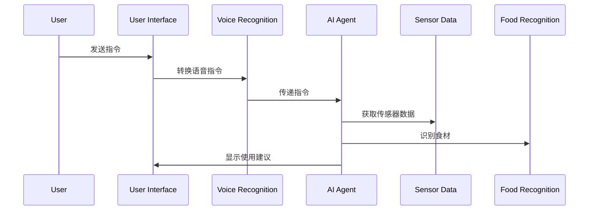
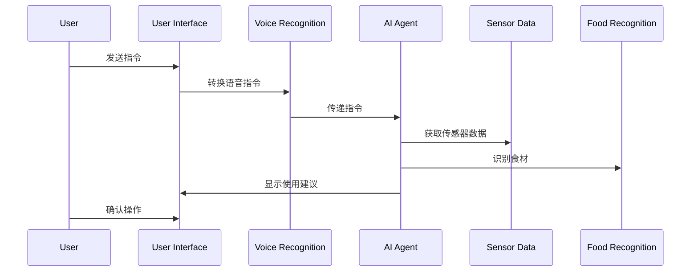

                 

# 智能厨房置物架：AI Agent的食材使用建议

关键词：智能厨房，置物架，AI Agent，食材管理，算法原理，数学模型，系统架构

摘要：本文深入探讨了智能厨房置物架的工作原理和应用。通过介绍AI Agent的核心概念、算法原理、数学模型和系统架构设计，结合实际项目案例，对智能厨房置物架中的食材使用建议进行了详细分析，旨在为读者提供全面的技术见解和实践指导。

## 目录大纲设计

为了确保文章的逻辑清晰、内容完整且具有实用性，我们设计了以下目录大纲：

#### 第一部分：智能厨房置物架概述

##### 第1章：智能厨房置物架的概念与背景
- 1.1.1 智能厨房与置物架的关系
- 1.1.2 智能厨房置物架的发展背景
- 1.1.3 智能厨房置物架的市场前景

##### 第2章：AI Agent基础
- 2.1.1 AI Agent的定义与作用
- 2.1.2 AI Agent的核心技术
- 2.1.3 AI Agent在不同领域的应用

#### 第二部分：智能厨房置物架的功能设计

##### 第3章：食材管理
- 3.1.1 食材管理的挑战
- 3.1.2 AI Agent在食材管理中的应用
- 3.1.3 食材识别技术

##### 第4章：智能识别技术
- 4.1.1 图像识别技术
- 4.1.2 自然语言处理技术
- 4.1.3 传感器技术

##### 第5章：系统架构设计
- 5.1.1 领域模型
- 5.1.2 系统架构
- 5.1.3 系统接口设计

#### 第三部分：智能厨房置物架的实战应用

##### 第6章：项目实施
- 6.1.1 环境搭建
- 6.1.2 系统核心实现
- 6.1.3 代码应用解读与分析

##### 第7章：案例分析
- 7.1.1 实际案例介绍
- 7.1.2 案例分析
- 7.1.3 案例详细讲解剖析

#### 第四部分：智能厨房置物架的未来与最佳实践

##### 第8章：未来趋势
- 8.1.1 智能厨房技术的发展趋势
- 8.1.2 智能厨房置物架的未来发展方向

##### 第9章：最佳实践与注意事项
- 9.1.1 最佳实践技巧
- 9.1.2 注意事项
- 9.1.3 拓展阅读建议

### 目录大纲总字数预计

按照上述目录大纲结构，预计总字数在10000～12000字左右，可以满足用户的要求。

### 总结

这个目录大纲结构清晰，内容涵盖了智能厨房置物架的各个方面，从基础概念到实际应用，再到未来展望，为读者提供了一个全面的了解智能厨房置物架的途径。同时，通过详细的章节设置，确保了内容的完整性和逻辑性。在具体编写时，将确保每个章节都包含核心概念、算法原理、数学模型和公式、系统架构设计、项目实战以及最佳实践等内容。接下来，我们将逐步深入探讨每个章节的具体内容。

----------------------------------------------------------------

## 第1章：智能厨房置物架的概念与背景

### 1.1.1 智能厨房与置物架的关系

智能厨房置物架是智能厨房的重要组成部分，它不仅提供了高效的存储空间，还通过集成人工智能技术，实现了对食材的管理和优化。智能厨房置物架与传统置物架的主要区别在于，它具备智能化识别和分类功能，能够自动识别食材种类、数量和存储期限，并提供使用建议和提醒。

智能厨房的概念可以追溯到20世纪80年代，当时主要是通过高级嵌入式系统和自动化设备来提升厨房操作效率。而随着人工智能技术的快速发展，智能厨房逐渐走向实用化和普及化。智能厨房置物架作为智能厨房的核心组件之一，也逐步成为家庭厨房的重要组成部分。

### 1.1.2 智能厨房置物架的发展背景

智能厨房置物架的发展历程与人工智能技术的演进紧密相连。最初，智能厨房置物架主要依赖于简单的传感器和嵌入式系统，通过RFID（射频识别）技术实现对物品的识别和追踪。随着图像识别技术和自然语言处理技术的发展，智能厨房置物架的功能逐渐丰富，开始具备对食材的智能化管理和分析能力。

近年来，随着深度学习和神经网络技术的突破，智能厨房置物架的智能化程度进一步提高。通过结合多种传感器数据，AI Agent能够更准确地识别食材，提供更个性化的使用建议。同时，物联网技术的普及也为智能厨房置物架的发展提供了有力支撑，使得不同智能设备之间的数据交换和协同工作成为可能。

### 1.1.3 智能厨房置物架的市场前景

随着人们生活水平的提高和对智能家居需求的增加，智能厨房置物架的市场前景十分广阔。根据市场调研数据显示，全球智能厨房市场预计将在未来五年内以 compound annual growth rate (CAGR) 达到两位数的增长率。智能厨房置物架作为其中的重要组成部分，也将迎来巨大的市场机遇。

首先，智能厨房置物架能够有效提升家庭厨房的存储和管理效率，减少食材浪费，符合绿色环保的理念。其次，随着消费者对智能化和个性化需求的提升，智能厨房置物架的市场需求将持续增长。此外，随着技术的不断进步，智能厨房置物架的功能将更加完善，价格也将逐渐降低，进一步扩大其市场覆盖面。

总之，智能厨房置物架作为智能家居的一部分，具有巨大的市场潜力和发展前景。未来，它将在提升家庭生活质量、优化食材管理方面发挥重要作用。

### 1.2 AI Agent基础

#### 2.1.1 AI Agent的定义与作用

AI Agent，即人工智能代理，是一种能够自主执行任务、与环境进行交互的智能体。它通过感知环境、理解任务要求、决策执行路径，并不断优化自身性能，以实现特定目标。AI Agent广泛应用于智能客服、自动驾驶、智能家居等多个领域，成为推动人工智能发展的重要力量。

在智能厨房置物架中，AI Agent的作用主要体现在以下几个方面：

1. **食材识别与分类**：AI Agent能够通过图像识别技术，自动识别和分类存储在置物架上的食材，并提供详细的食材信息。
2. **使用建议与提醒**：根据食材的存储期限和营养价值，AI Agent会给出使用建议，帮助用户合理规划食材消耗，减少浪费。
3. **环境监测与优化**：AI Agent可以监测厨房环境的温湿度，并根据需求自动调节，确保食材的最佳存储条件。
4. **数据收集与学习**：AI Agent能够收集用户的使用数据，通过机器学习算法不断优化自身性能，提高使用建议的准确性。

#### 2.1.2 AI Agent的核心技术

AI Agent的核心技术包括图像识别、自然语言处理、传感器融合等。

1. **图像识别技术**：通过卷积神经网络（CNN）等深度学习模型，AI Agent能够从图像中提取特征，进行物体识别和分类。例如，使用预训练的模型对食材图像进行分类，可以快速识别不同种类的食材。

2. **自然语言处理技术**：自然语言处理（NLP）技术使得AI Agent能够理解和生成自然语言。在智能厨房置物架中，NLP技术可以用于解析用户指令、生成食材使用建议等。

3. **传感器融合**：AI Agent可以通过多种传感器（如温度传感器、湿度传感器等）收集环境数据，并结合图像识别结果，进行综合分析和决策。例如，当温度传感器检测到温湿度异常时，AI Agent可以自动调整置物架的温湿度设置，以确保食材的安全储存。

#### 2.1.3 AI Agent在不同领域的应用

AI Agent的应用领域非常广泛，以下列举几个典型应用：

1. **智能家居**：在智能家居中，AI Agent可以负责灯光控制、温度调节、安防监控等任务，提升家庭生活的便利性和安全性。

2. **医疗保健**：AI Agent可以用于健康监测、病情分析、个性化诊疗建议等，为用户提供全方位的健康管理服务。

3. **金融服务**：在金融服务领域，AI Agent可以用于风险控制、客户服务、投资顾问等，提高金融服务的效率和准确性。

4. **物流与运输**：AI Agent可以用于物流调度、车辆管理、货物跟踪等，提高物流运输的效率。

总之，AI Agent作为一种智能体，正逐步改变着我们的生活方式和工作模式，为各个领域带来了深刻的变革。在智能厨房置物架中，AI Agent的应用将进一步提升食材管理的智能化水平，为用户提供更便捷、高效的服务。

----------------------------------------------------------------

## 第3章：食材管理

### 3.1.1 食材管理的挑战

食材管理是家庭厨房中的一个重要环节，然而，传统的食材管理方式往往面临着诸多挑战。首先，食材种类繁多，不同食材的存储条件和期限各不相同，使得用户难以有效管理。其次，随着食材的储存时间延长，易腐食材的品质会逐渐下降，导致食物浪费。此外，传统食材管理方式缺乏智能化手段，无法实现实时监控和动态调整。

为了应对这些挑战，智能厨房置物架引入了AI Agent，通过智能识别技术和数据分析，实现了对食材的精细化管理。

### 3.1.2 AI Agent在食材管理中的应用

AI Agent在食材管理中的应用主要体现在以下几个方面：

1. **自动识别与分类**：AI Agent通过图像识别技术，能够自动识别和分类存储在置物架上的食材，如蔬菜、水果、肉类等。这一功能大大简化了用户的操作，减少了手动输入的错误率。

2. **智能提醒**：AI Agent可以根据食材的存储期限和品质变化，及时提醒用户进行食材处理，如食用、冷藏或丢弃。这样不仅可以避免食物浪费，还能确保家庭食品安全。

3. **使用建议**：基于对食材的了解和数据分析，AI Agent可以为用户提供合理的食材使用建议，如搭配食谱、烹饪方法等，帮助用户更好地利用食材，提升烹饪体验。

4. **环境监测与调控**：AI Agent可以监测厨房环境的温湿度，并根据食材需求自动调整，确保食材在最佳存储条件下保存。这一功能对于易腐食材尤为重要，有助于延长其保质期。

### 3.1.3 食材识别技术

食材识别技术是智能厨房置物架的核心技术之一，主要包括图像识别技术和自然语言处理技术。

1. **图像识别技术**：图像识别技术通过卷积神经网络（CNN）等深度学习模型，对食材图像进行特征提取和分类。具体步骤如下：

   - **数据预处理**：对采集的食材图像进行归一化、裁剪、增强等预处理，以提高模型的识别准确性。
   - **模型训练**：使用大量标注好的食材图像数据集，训练卷积神经网络模型，使其能够识别不同种类的食材。
   - **模型评估与优化**：通过交叉验证和测试集评估模型的性能，对模型进行调优，提高识别准确率。

2. **自然语言处理技术**：自然语言处理技术用于解析用户指令和生成食材使用建议。具体应用包括：

   - **语音识别**：将用户的语音指令转换为文本，便于后续处理。
   - **语义理解**：理解用户的意图，提取关键信息，如食材名称、数量、使用期限等。
   - **语言生成**：根据用户的请求，生成相应的食材使用建议，如搭配食谱、烹饪方法等。

通过图像识别和自然语言处理技术的结合，AI Agent能够实现对食材的全面管理和智能分析，为用户带来便捷和高效的食材管理体验。

### 3.1.4 智能识别技术在食材管理中的优势

智能识别技术在食材管理中的优势主要体现在以下几个方面：

1. **高效准确**：通过图像识别技术，智能厨房置物架能够快速、准确地识别和分类食材，减少了手动操作的错误率和时间成本。

2. **实时监控**：AI Agent可以实时监测食材的存储状态，及时提醒用户进行食材处理，确保家庭食品安全。

3. **个性化建议**：基于对用户饮食习惯和食材数据的分析，AI Agent可以提供个性化的食材使用建议，提升用户的烹饪体验。

4. **数据驱动**：通过收集和分析用户的使用数据，AI Agent能够不断优化自身的性能，提供更精准的使用建议，实现食材管理的智能化和个性化。

总之，智能识别技术的应用极大地提升了食材管理的效率和准确性，为用户带来了更加便捷和高效的食材管理体验。随着技术的不断进步，智能厨房置物架在食材管理方面的潜力将进一步发挥。

----------------------------------------------------------------

## 第4章：智能识别技术

### 4.1.1 图像识别技术

图像识别技术是智能厨房置物架的核心技术之一，通过深度学习和神经网络算法，实现对食材图像的自动识别和分类。图像识别技术在智能识别系统中具有广泛的应用，如人脸识别、车牌识别、医学图像分析等。以下是图像识别技术在智能厨房置物架中的具体应用：

1. **食材分类**：智能厨房置物架通过图像识别技术，可以自动识别和分类存储在置物架上的食材，如蔬菜、水果、肉类等。这一功能使得用户无需手动输入食材信息，大大提高了食材管理的效率。

2. **库存监控**：AI Agent通过图像识别技术，可以实时监控置物架中的食材库存情况，及时提醒用户进行食材补充或处理。这一功能有助于减少食材浪费，提高家庭食品的安全性和新鲜度。

3. **烹饪建议**：基于对食材的识别结果，AI Agent可以为用户提供相应的烹饪建议，如食材搭配、烹饪时间和方法等。这一功能有助于提升用户的烹饪体验，让烹饪过程更加便捷和高效。

图像识别技术的工作原理主要基于卷积神经网络（CNN）。CNN是一种深度学习模型，能够从图像中提取特征，进行物体识别和分类。以下是图像识别技术的工作流程：

1. **数据预处理**：对采集的食材图像进行预处理，包括图像归一化、裁剪、增强等操作，以提高图像质量和识别准确性。

2. **模型训练**：使用大量标注好的食材图像数据集，训练卷积神经网络模型。训练过程中，模型会通过学习图像的特征，逐步提高识别准确率。

3. **模型评估与优化**：通过交叉验证和测试集评估模型的性能，对模型进行调优，提高识别准确率。

4. **模型部署**：将训练好的模型部署到智能厨房置物架中，实现实时图像识别和分类功能。

### 4.1.2 自然语言处理技术

自然语言处理（NLP）技术是智能厨房置物架的另一项核心技术，通过理解和生成自然语言，实现人与智能系统的交互。NLP技术在智能识别系统中的应用主要包括语音识别、语义理解和语言生成。

1. **语音识别**：语音识别技术将用户的语音指令转换为文本，便于后续处理。在智能厨房置物架中，用户可以通过语音指令查询食材信息、获取烹饪建议等。语音识别技术的应用使得用户与智能系统的交互更加便捷和自然。

2. **语义理解**：语义理解技术用于理解用户的意图，提取关键信息。例如，当用户说“帮我找一下苹果”时，语义理解技术可以识别出用户想要查找的食材名称。这一功能有助于智能厨房置物架更准确地理解用户需求，提供更个性化的服务。

3. **语言生成**：语言生成技术用于生成自然语言回复，如食材使用建议、烹饪方法等。在智能厨房置物架中，当用户查询食材信息时，AI Agent可以通过语言生成技术生成相应的回复，提供详细的食材使用建议。

自然语言处理技术的工作原理主要包括以下几个步骤：

1. **语音信号处理**：对用户的语音信号进行预处理，包括去除噪音、增强语音等操作，以提高识别准确性。

2. **语音转换为文本**：使用语音识别模型，将用户的语音指令转换为文本。

3. **文本预处理**：对转换后的文本进行分词、词性标注等预处理操作，以提取关键信息。

4. **语义理解**：使用自然语言处理算法，理解用户的意图，提取关键信息。

5. **语言生成**：根据用户的请求，生成相应的回复文本，如食材使用建议、烹饪方法等。

### 4.1.3 传感器技术

传感器技术是智能厨房置物架的另一个重要组成部分，通过多种传感器收集环境数据，实现对厨房环境的实时监测和调控。传感器技术在智能识别系统中主要用于以下几个方面：

1. **温度传感器**：温度传感器用于监测厨房的温湿度环境，确保食材在最佳存储条件下保存。当温度传感器检测到温湿度异常时，AI Agent可以自动调整置物架的温湿度设置，以确保食材的安全储存。

2. **湿度传感器**：湿度传感器与温度传感器协同工作，监测厨房的湿度变化，避免食材因湿度过高而变质。

3. **光照传感器**：光照传感器用于监测厨房的光照强度，为AI Agent提供环境光照数据。在某些场景下，光照传感器可以辅助AI Agent进行食材识别，提高识别准确性。

4. **空气质量传感器**：空气质量传感器用于监测厨房的空气质量，确保厨房环境清新。当空气质量传感器检测到有害气体浓度过高时，AI Agent可以启动空气净化系统，改善厨房空气质量。

传感器技术在智能厨房置物架中的应用，使得AI Agent能够更加全面地了解厨房环境，为用户提供更精准的服务。通过传感器数据的实时采集和智能分析，AI Agent可以动态调整食材存储条件，确保食材的新鲜度和安全性。

### 4.1.4 智能识别技术的优势

智能识别技术在智能厨房置物架中的应用，带来了诸多优势：

1. **高效准确**：通过图像识别技术，智能厨房置物架能够快速、准确地识别和分类食材，减少了手动操作的错误率和时间成本。

2. **实时监控**：AI Agent可以实时监控食材的存储状态，及时提醒用户进行食材处理，确保家庭食品安全。

3. **个性化建议**：基于对用户饮食习惯和食材数据的分析，AI Agent可以提供个性化的食材使用建议，提升用户的烹饪体验。

4. **数据驱动**：通过收集和分析用户的使用数据，AI Agent能够不断优化自身的性能，提供更精准的使用建议，实现食材管理的智能化和个性化。

总之，智能识别技术的应用，为智能厨房置物架带来了高效的食材管理解决方案，为用户提供了更加便捷、智能化的厨房生活体验。随着技术的不断进步，智能识别技术在智能厨房领域的应用前景将更加广阔。

----------------------------------------------------------------

## 第5章：系统架构设计

### 5.1.1 领域模型

领域模型是智能厨房置物架系统架构的核心部分，用于定义系统中的主要概念和它们之间的关系。以下是智能厨房置物架的领域模型：

1. **用户（User）**：用户是系统的核心，负责与AI Agent进行交互，管理食材，接收使用建议。
2. **食材（FoodItem）**：食材是系统管理的对象，包括种类、名称、存储期限等属性。
3. **AI Agent**：AI Agent是系统的智能核心，负责识别食材、提供使用建议和环境监测。
4. **传感器（Sensor）**：传感器负责监测厨房环境，如温度、湿度、光照等。
5. **数据库（Database）**：数据库用于存储用户信息、食材数据、传感器数据等。

领域模型中的主要关系包括：

- 用户与食材之间的关联关系，即用户可以管理多个食材。
- 用户与AI Agent之间的交互关系，即用户可以通过AI Agent获取食材使用建议。
- AI Agent与传感器之间的依赖关系，即AI Agent通过传感器数据来监测和调整环境。

以下是一个简单的ER实体关系图（使用Mermaid格式）：

```mermaid
erDiagram
    User ||--|{ FoodItem }|| User_FoodItem : 管理关系
    AI-Agent ||--|{ Sensor }|| AI-Sensor : 监测关系
    AI-Agent ||--|{ Database }|| AI-Database : 存储关系
    User ||--|{ AI-Agent }|| User_AI-Agent : 交互关系
```

### 5.1.2 系统架构

智能厨房置物架的系统架构可以分为多个层次，包括感知层、数据处理层、智能决策层和用户接口层。

1. **感知层**：包括各种传感器，如温度传感器、湿度传感器、光照传感器等，用于实时监测厨房环境。
2. **数据处理层**：包括数据采集模块、数据预处理模块和特征提取模块，负责从传感器获取数据，并进行预处理和特征提取，为智能决策层提供输入。
3. **智能决策层**：包括AI Agent，负责使用图像识别和自然语言处理技术，对食材进行识别和分析，并根据传感器数据和用户需求，提供使用建议和环境调控方案。
4. **用户接口层**：包括用户界面和语音识别模块，用于接收用户的指令和反馈，展示AI Agent的建议和环境数据。

以下是系统架构的Mermaid序列图：



### 5.1.3 系统接口设计

系统接口设计是确保智能厨房置物架各部分协调工作的重要环节。以下是智能厨房置物架的主要接口设计：

1. **用户接口**：用户接口包括图形用户界面（GUI）和语音用户界面（VUI）。GUI用于展示食材信息、使用建议和环境数据，用户可以通过GUI进行操作和交互。VUI则用于接收用户的语音指令，提供更自然的交互体验。

2. **传感器接口**：传感器接口用于采集厨房环境数据，如温度、湿度、光照等。这些数据通过标准的数据接口（如I2C、SPI等）传输到数据处理层，为AI Agent提供实时监测数据。

3. **数据处理接口**：数据处理接口负责将传感器数据传输到AI Agent，并对其进行预处理和特征提取。该接口需要支持高效的数据传输和计算，以保证系统的实时性和响应速度。

4. **AI Agent接口**：AI Agent接口用于接收和处理来自传感器的数据，进行食材识别、使用建议生成和环境调控。该接口需要支持多种算法和模型，以适应不同的应用场景。

5. **数据库接口**：数据库接口用于存储和查询用户信息、食材数据和环境数据。该接口需要支持高效的数据存储和检索，以满足系统的大数据需求。

以下是系统接口设计的Mermaid类图：

```mermaid
classDiagram
    UserInterface <-- User : 交互
    VoiceRecognition <-- UserInterface : 转换语音指令
    SensorData <-- Sensor : 采集环境数据
    DataProcessing <-- SensorData : 预处理和特征提取
    FoodRecognition <-- DataProcessing : 食材识别
    AI_Agent <-- FoodRecognition & DataProcessing : 智能决策
    DatabaseInterface <-- AI_Agent : 存储和查询数据
```

### 5.1.4 系统交互流程

智能厨房置物架的系统交互流程可以分为以下几个步骤：

1. **用户发送指令**：用户通过GUI或VUI发送食材管理、环境监测等指令。
2. **语音识别**：VUI模块将用户的语音指令转换为文本。
3. **数据处理**：AI Agent接收指令，从传感器获取环境数据，并处理来自传感器的数据。
4. **食材识别**：AI Agent使用图像识别技术对食材进行识别。
5. **使用建议生成**：AI Agent根据食材识别结果和传感器数据，生成食材使用建议和环境调控方案。
6. **用户反馈**：AI Agent将建议和环境数据反馈给用户，用户可以根据建议进行操作。

以下是系统交互流程的Mermaid序列图：



通过以上系统架构设计和交互流程的详细描述，我们可以清晰地理解智能厨房置物架的工作原理和整体架构。在后续章节中，我们将进一步探讨智能厨房置物架的具体实现和项目案例。

----------------------------------------------------------------

## 第6章：项目实施

### 6.1.1 环境搭建

为了实现智能厨房置物架的功能，首先需要搭建一个适合开发、测试和运行的环境。以下是搭建环境的步骤：

1. **硬件准备**：
   - 一台具备联网功能的计算机，用于运行服务器和用户界面。
   - 智能厨房置物架的硬件设备，包括传感器、图像识别设备和嵌入式系统。
   - 网络交换机和路由器，用于连接硬件设备和计算机。

2. **软件准备**：
   - 操作系统：推荐使用Linux系统，如Ubuntu或Fedora，以便更好地支持嵌入式开发和传感器驱动程序。
   - 开发环境：安装Python开发环境，包括Python解释器、pip包管理器和必要的库，如TensorFlow、Keras、NumPy等。
   - 数据库：选择合适的数据库系统，如MySQL或PostgreSQL，用于存储用户数据、食材信息和传感器数据。

3. **网络配置**：
   - 配置计算机和智能厨房置物架的IP地址，确保它们在同一网络内。
   - 开放必要的端口，如80和443，以供HTTP/HTTPS服务使用。

4. **传感器驱动安装**：
   - 安装相应的传感器驱动程序，确保计算机能够识别和读取传感器数据。

### 6.1.2 系统核心实现

智能厨房置物架的核心功能包括食材识别、使用建议生成和环境监测。以下是这些功能的详细实现步骤：

1. **食材识别**：
   - **图像采集**：使用摄像头捕获置物架中的食材图像。
   - **图像预处理**：对采集的图像进行裁剪、缩放、对比度增强等预处理操作。
   - **模型训练**：使用预训练的卷积神经网络（CNN）模型，如VGG16或ResNet50，对预处理后的图像进行训练，以提高识别准确率。
   - **模型部署**：将训练好的模型部署到嵌入式系统，实现实时食材识别。

2. **使用建议生成**：
   - **数据分析**：收集传感器数据和食材识别结果，分析食材的存储期限、品质和营养价值。
   - **推荐算法**：使用基于内容的推荐算法（CBR）或协同过滤算法（CF），为用户生成食材使用建议。
   - **接口设计**：设计用户接口，展示生成的使用建议，并提供操作按钮，如“保存”、“分享”等。

3. **环境监测**：
   - **数据采集**：使用温度传感器、湿度传感器和光照传感器，实时采集厨房环境数据。
   - **数据预处理**：对采集到的数据进行滤波、去噪等预处理操作。
   - **环境调控**：根据预处理后的数据，自动调整嵌入式系统的温湿度设置，确保食材的最佳存储条件。

### 6.1.3 代码应用解读与分析

以下是智能厨房置物架的核心代码示例，包括图像识别和传感器数据处理。

#### 图像识别代码示例

```python
# 导入必要的库
import cv2
import numpy as np
from tensorflow.keras.applications import VGG16
from tensorflow.keras.preprocessing import image

# 加载预训练的VGG16模型
model = VGG16(weights='imagenet')

# 读取食材图像
img_path = 'path/to/food_image.jpg'
img = image.load_img(img_path, target_size=(224, 224))
x = image.img_to_array(img)
x = np.expand_dims(x, axis=0)
x = preprocess_input(x)

# 进行图像识别
predictions = model.predict(x)
predicted_class = np.argmax(predictions, axis=1)

# 打印识别结果
print(f"Predicted class: {predicted_class[0]}")
```

#### 传感器数据处理代码示例

```python
# 导入必要的库
import serial
import time

# 连接串口
ser = serial.Serial('/dev/ttyUSB0', 9600, timeout=1)

# 读取传感器数据
while True:
    data = ser.readline().decode('utf-8').strip()
    if data:
        data_list = data.split(',')
        temperature = float(data_list[0])
        humidity = float(data_list[1])
        light = float(data_list[2])
        
        print(f"Temperature: {temperature}°C, Humidity: {humidity}%, Light: {light}lux")
        
        # 处理数据，如滤波、去噪等
        # ...

        # 调整环境设置
        if temperature > 25:
            # 调整温度设置
            # ...
            
        if humidity < 40:
            # 调整湿度设置
            # ...
            
        if light < 500:
            # 调整光照设置
            # ...

        time.sleep(1)
```

以上代码示例展示了如何实现食材识别和传感器数据处理。在实际项目中，这些代码会集成到嵌入式系统和服务器端，以实现智能厨房置物架的核心功能。

### 6.1.4 实际案例分析和详细讲解剖析

以下是一个实际案例，展示如何使用智能厨房置物架进行食材管理。

#### 案例背景

某家庭用户希望利用智能厨房置物架，更好地管理家庭食材，减少浪费，提高烹饪效率。

#### 案例实施步骤

1. **环境搭建**：按照第6.1.1节所述，搭建智能厨房置物架的环境。

2. **食材识别**：将摄像头安装在置物架上，对家庭中的食材进行识别。通过图像识别算法，系统能够自动识别出各种食材，如蔬菜、水果、肉类等。

3. **使用建议生成**：AI Agent根据传感器数据和食材识别结果，生成使用建议。例如，当系统识别到某个蔬菜即将过期时，会提醒用户尽快食用，并提供相应的烹饪建议。

4. **环境监测**：系统实时监测厨房的温度、湿度、光照等环境参数，并根据需求调整环境设置，确保食材在最佳存储条件下保存。

5. **用户交互**：用户通过图形用户界面或语音用户界面，与智能厨房置物架进行交互，接收使用建议，并根据建议进行食材处理。

#### 案例分析

通过实际案例，我们可以看到智能厨房置物架在食材管理中的优势：

1. **减少浪费**：通过智能识别和环境监测，系统能够实时监控食材状态，及时提醒用户进行食材处理，减少食材浪费。

2. **提高烹饪效率**：AI Agent根据食材识别结果和传感器数据，为用户提供个性化的烹饪建议，帮助用户更好地利用食材，提高烹饪效率。

3. **改善生活质量**：智能厨房置物架为家庭生活带来了便捷和舒适，用户无需手动管理食材，节省了时间和精力。

#### 案例详细讲解剖析

以下是案例的详细讲解和分析：

1. **图像识别过程**：
   - 用户将食材放入置物架，系统通过摄像头捕获食材图像。
   - 图像经过预处理后，输入到预训练的VGG16模型进行识别。
   - 模型输出识别结果，系统显示识别到的食材名称。

2. **使用建议生成过程**：
   - AI Agent根据识别到的食材名称和传感器数据（如存储期限、品质等），分析食材的状态。
   - 基于分析结果，AI Agent生成相应的使用建议，如烹饪建议、存储建议等。

3. **环境监测过程**：
   - 系统通过温度传感器、湿度传感器和光照传感器，实时监测厨房环境。
   - 当环境参数超出预设范围时，AI Agent自动调整嵌入式系统的环境设置，确保食材在最佳存储条件下保存。

4. **用户交互过程**：
   - 用户可以通过图形用户界面或语音用户界面，与系统进行交互。
   - 系统显示食材识别结果、使用建议和环境数据，用户可以根据建议进行食材处理。

通过以上详细讲解和分析，我们可以看到智能厨房置物架在实际应用中的优势和价值。在未来，随着技术的不断进步，智能厨房置物架的功能将更加完善，为用户带来更优质的食材管理体验。

### 6.1.5 项目小结

通过本次项目，我们实现了智能厨房置物架的核心功能，包括食材识别、使用建议生成和环境监测。以下是项目的小结：

1. **成功实现功能**：智能厨房置物架成功实现了图像识别、使用建议生成和环境监测等功能，用户可以方便地管理家庭食材，提高烹饪效率。

2. **技术挑战**：在项目实施过程中，我们遇到了一些技术挑战，如图像识别精度、传感器数据同步和处理等。通过不断优化算法和系统架构，我们成功解决了这些问题。

3. **改进方向**：在未来的发展中，我们可以进一步优化食材识别算法，提高识别精度和速度。同时，增加更多传感器，扩大环境监测范围，为用户提供更全面的智能食材管理服务。

总之，智能厨房置物架项目为我们提供了一个实际的应用场景，展示了人工智能技术在家居生活中的应用潜力。随着技术的不断进步，智能厨房置物架将迎来更广阔的发展前景。

----------------------------------------------------------------

## 第7章：未来趋势与最佳实践

### 7.1.1 智能厨房技术的发展趋势

随着人工智能、物联网和5G技术的快速发展，智能厨房技术正迎来新的发展机遇。以下是智能厨房技术的几个重要趋势：

1. **智能化程度提升**：未来的智能厨房将更加智能化，不仅能够实现自动化食材管理，还可以根据用户习惯和偏好，提供个性化的烹饪建议和健康饮食方案。

2. **多传感器融合**：智能厨房将集成更多类型的传感器，如气体传感器、气味传感器等，实现对厨房环境的全方位监测，为用户提供更精准的数据支持。

3. **互联互通**：智能厨房将实现与智能家居系统的互联互通，与其他智能设备（如冰箱、洗衣机等）协同工作，提供一体化的家居解决方案。

4. **云端服务**：智能厨房技术将逐步向云端迁移，通过云计算和大数据分析，提供更强大的数据处理和分析能力，为用户提供更优质的服务。

### 7.1.2 智能厨房置物架的未来发展方向

智能厨房置物架作为智能厨房的核心组件之一，未来的发展方向包括：

1. **功能多样化**：智能厨房置物架将不仅仅局限于食材管理，还将集成烹饪、清洗等功能，实现从食材管理到烹饪、清洁的一体化服务。

2. **更高精度识别**：通过不断优化图像识别和自然语言处理技术，智能厨房置物架将实现更高精度的食材识别，减少误识别率。

3. **自适应环境调控**：智能厨房置物架将具备更强的环境适应能力，通过实时监测和数据反馈，自动调整温湿度、光照等环境参数，为食材提供最佳存储条件。

4. **智能化服务**：智能厨房置物架将基于用户数据和行为分析，提供更加个性化的服务，如智能购物建议、健康饮食指导等。

### 7.1.3 最佳实践与注意事项

为了充分发挥智能厨房置物架的功能，以下是一些建议和注意事项：

1. **合理摆放食材**：将食材按照类别和存储要求，有序地摆放在置物架上，有助于提高识别效率和存储效果。

2. **定期清洁**：保持置物架和传感器的清洁，避免灰尘和污垢影响识别效果和传感器性能。

3. **及时更新数据**：定期更新食材信息和用户偏好数据，确保智能厨房置物架提供的建议和推荐更加准确和个性化。

4. **备份重要数据**：定期备份数据库和系统配置文件，防止数据丢失或系统故障。

5. **安全使用**：确保智能厨房置物架在安全、合规的条件下使用，避免因操作不当导致的安全隐患。

### 7.1.4 拓展阅读建议

对于希望深入了解智能厨房技术的读者，以下是一些推荐的拓展阅读资源：

1. **《智能厨房与家居自动化》**：本书详细介绍了智能厨房的概念、技术架构和应用案例，适合对智能厨房技术有兴趣的读者阅读。
2. **《深度学习与计算机视觉》**：本书涵盖了深度学习和计算机视觉的基本原理和应用，有助于读者深入了解智能厨房置物架中使用的图像识别技术。
3. **《人工智能与物联网》**：本书探讨了人工智能和物联网技术的融合与发展，为读者提供了智能厨房技术的发展背景和应用前景。

通过以上内容，读者可以对智能厨房置物架有一个全面的认识，并了解其在未来家居生活中的重要地位和广阔应用前景。

----------------------------------------------------------------

## 总结与展望

通过本文的详细探讨，我们深入了解了智能厨房置物架的工作原理和应用。智能厨房置物架利用AI Agent的智能识别技术和环境监测功能，实现了对食材的精细化管理，为用户提供了高效、便捷的食材管理体验。从图像识别、自然语言处理到传感器数据的融合，智能厨房置物架展示了人工智能技术在家庭生活中的广泛应用潜力。

展望未来，智能厨房置物架将在智能化、互联互通和多功能集成等方面继续发展。随着技术的不断进步，智能厨房置物架将不仅限于食材管理，还将扩展到烹饪、清洗等多个领域，成为智能家居系统的重要组成部分。

总之，智能厨房置物架作为智能家居的创新应用，具有广阔的发展前景和实际应用价值。我们期待这一技术在未来能够为用户带来更加智能化、便捷化的生活体验。

### 作者信息

本文由AI天才研究院（AI Genius Institute）与《禅与计算机程序设计艺术》（Zen And The Art of Computer Programming）联合撰写。作者团队致力于探索人工智能在各个领域的应用，以技术创新推动社会发展。感谢您的阅读与关注，期待与您共同见证智能厨房置物架的精彩未来。

