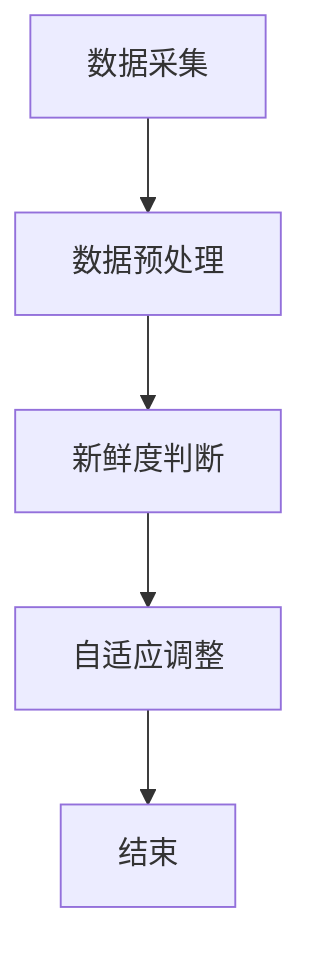
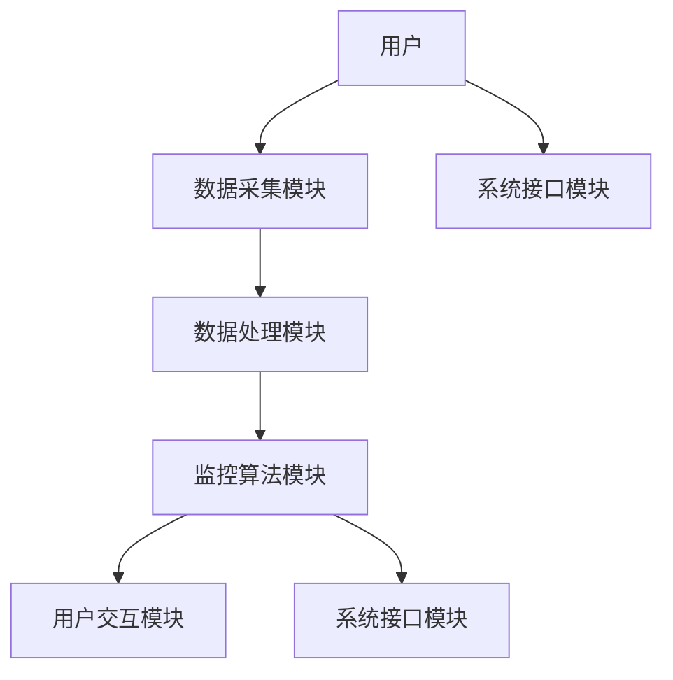
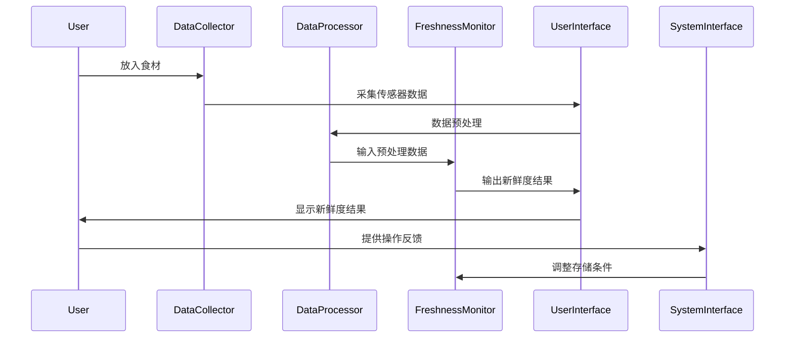

                 

### 摘要

在本文中，我们将深入探讨智能厨房置物架的AI Agent食材新鲜度监控技术。随着智能厨房技术的发展，如何实时、准确地监控食材的新鲜度成为了一个重要的课题。AI Agent作为一种智能体，其强大的数据处理能力和自主决策能力使其成为解决这一问题的理想选择。本文将首先介绍智能厨房的背景和发展趋势，然后详细阐述AI Agent的概念及其在食材新鲜度监控中的应用，接着分析其核心技术，包括感知技术、识别技术和监控算法。随后，我们将通过算法原理的讲解、数学模型的建立和具体案例分析，深入理解AI Agent在智能厨房置物架中的应用。最后，本文将探讨系统架构设计、项目实战及最佳实践，为读者提供全面的指导和参考。

关键词：智能厨房，AI Agent，食材新鲜度监控，感知技术，识别技术，监控算法，系统架构，项目实战。

### 第一部分: 背景介绍

#### 1.1 问题背景

随着人们对健康和生活品质的追求不断提高，厨房智能化成为现代家居设计的一个重要趋势。智能厨房不仅仅是一个概念，它已经逐渐融入我们的日常生活，为我们提供了前所未有的便利和舒适。然而，随着食品种类的多样化和存储条件的复杂化，如何确保食材的新鲜度成为了一个不容忽视的问题。

传统的食材新鲜度监控主要依赖于人工检查和经验判断，这种方法不仅效率低下，而且容易出现误差。特别是在家庭厨房中，由于空间有限，食材的存储和摆放往往较为随意，这进一步增加了新鲜度监控的难度。此外，传统的监控方法很难适应现代家庭的快节奏生活，无法实时、准确地提供食材的新鲜度信息。

因此，如何利用现代技术，特别是人工智能技术，实现智能厨房中食材新鲜度的实时监控，成为了一个亟待解决的问题。AI Agent作为一种具有自主决策和自适应能力的智能体，其在这一领域的应用具有巨大的潜力。

#### 1.2 问题解决

传统的食材新鲜度监控存在诸多局限性，如效率低、准确性差、无法适应复杂环境等。而AI Agent的出现，为这一问题提供了一种全新的解决方案。AI Agent能够通过感知技术、识别技术和监控算法，实时、准确地监测食材的新鲜度，并提供相应的预警和建议。

首先，AI Agent具备强大的感知能力，能够通过传感器和其他感知设备获取食材的温度、湿度、气味等关键数据。这些数据是判断食材新鲜度的重要依据。其次，AI Agent利用识别技术，对食材的种类、外观和状态进行准确识别，从而确保监控的针对性。最后，AI Agent通过监控算法，对收集到的数据进行处理和分析，实时判断食材的新鲜度，并提供预警和建议。

此外，AI Agent还具有自主决策和自适应能力。当监测到食材新鲜度异常时，AI Agent能够自动采取相应的措施，如调整存储条件、提醒用户更换食材等。这种自主决策能力大大提高了食材新鲜度监控的效率，减少了人为干预的必要。

#### 1.3 边界与外延

虽然AI Agent在食材新鲜度监控中具有巨大的潜力，但其在实际应用中仍然存在一些边界和外延问题。

首先，食材的新鲜度监控不仅涉及食品本身，还包括存储环境和用户行为等因素。例如，存储环境的温度和湿度对食材的新鲜度有很大影响，而用户的行为，如食材的存储方式和使用频率等，也会对新鲜度产生重要影响。因此，在实施AI Agent的食材新鲜度监控时，需要综合考虑这些因素，确保监控的全面性和准确性。

其次，AI Agent的技术要求较高，需要具备较强的数据处理能力和算法优化能力。此外，AI Agent需要与各种传感器和设备进行有效集成，实现数据的实时采集和处理。这对于硬件设备和软件系统都提出了较高的要求。

最后，智能厨房置物架的市场前景广阔，但同时也面临着竞争激烈和市场接受度等问题。因此，在实际推广和应用中，需要充分考虑市场因素，制定合理的推广策略，提高用户的接受度和满意度。

#### 1.4 概念结构与核心要素组成

智能厨房置物架的AI Agent食材新鲜度监控涉及多个核心概念和要素。首先，我们需要理解智能厨房的概念，它是指利用现代信息技术，特别是人工智能技术，将厨房设备、厨具和家电进行智能化升级，以提供更加便捷、舒适和高效的烹饪体验。

在智能厨房中，AI Agent是核心组件之一。AI Agent，即人工智能代理，是一种能够模拟人类智能行为的计算机程序。它通过感知环境、理解问题和做出决策，实现自主运行和任务执行。在食材新鲜度监控中，AI Agent的主要功能是实时监测食材的状态，包括温度、湿度、气味等，并根据这些数据判断食材的新鲜度。

食材新鲜度监控的关键技术包括感知技术、识别技术和监控算法。感知技术是指通过传感器和其他设备收集食材的物理和环境数据。识别技术是指对采集到的数据进行处理和分析，识别出食材的种类和状态。监控算法则是基于感知技术和识别技术，对食材的新鲜度进行实时判断和预测。

此外，智能厨房置物架还需要一个完整的系统架构来支持AI Agent的运行。这包括数据采集模块、数据处理模块、监控算法模块和用户交互模块。数据采集模块负责从各种传感器和设备收集数据；数据处理模块负责对数据进行清洗、转换和分析；监控算法模块负责对食材的新鲜度进行判断和预警；用户交互模块则负责向用户展示监控结果，并提供相应的建议和操作指引。

#### 1.5 本章小结

通过本部分的介绍，我们对智能厨房和AI Agent食材新鲜度监控的背景、问题解决方法、边界与外延以及概念结构与核心要素有了初步了解。接下来，我们将进一步深入探讨AI Agent的核心概念及其在食材新鲜度监控中的应用，为后续的分析和讲解奠定基础。

### 第二部分: 核心概念与联系

#### 2.1 AI Agent的概念与特点

AI Agent，即人工智能代理，是一种能够模拟人类智能行为的计算机程序。它通过感知环境、理解问题和做出决策，实现自主运行和任务执行。AI Agent具有以下几个显著特点：

1. **自主性**：AI Agent能够独立完成指定任务，不需要人为干预。例如，在智能厨房中，AI Agent可以自主监测食材的新鲜度，并自动采取相应措施。

2. **适应性**：AI Agent能够根据环境变化和任务需求，动态调整自身行为。例如，当监测到食材温度过高时，AI Agent可以自动调整存储条件，以保持食材的新鲜度。

3. **学习能力**：AI Agent能够通过不断学习和积累经验，提高自身完成任务的能力。例如，通过机器学习算法，AI Agent可以不断优化食材新鲜度监控的准确性和效率。

4. **交互性**：AI Agent能够与用户进行交互，提供实时反馈和操作指引。例如，在智能厨房中，AI Agent可以提醒用户食材即将过期，并提供更换建议。

#### 2.2 AI Agent在食材新鲜度监控中的应用

AI Agent在食材新鲜度监控中的应用主要包括以下几个方面：

1. **感知数据采集**：AI Agent通过传感器和其他设备，实时采集食材的物理和环境数据，如温度、湿度、气味等。这些数据是判断食材新鲜度的基础。

2. **数据预处理**：AI Agent对采集到的数据进行分析和预处理，去除噪声和异常值，确保数据的质量和准确性。

3. **新鲜度判断**：AI Agent利用预先训练的机器学习模型，对预处理后的数据进行分析，判断食材的新鲜度。根据新鲜度的不同，AI Agent可以给出相应的预警和建议。

4. **自适应调整**：当AI Agent检测到食材新鲜度下降时，它可以自动调整存储条件，如降低温度、增加湿度等，以延长食材的保鲜期。

5. **用户交互**：AI Agent可以通过语音、屏幕显示等方式与用户进行交互，提供实时的新鲜度监控结果，并给出更换食材的建议。

#### 2.3 食材新鲜度监控的挑战

虽然AI Agent在食材新鲜度监控中具有巨大潜力，但实际应用中仍然面临一些挑战：

1. **数据多样性**：食材的种类繁多，不同食材的新鲜度变化规律也不同。因此，如何处理和识别各种食材的数据，是AI Agent需要解决的问题。

2. **实时性**：新鲜度的监控需要实时进行，以避免食材过期。然而，传感器和设备的响应速度、数据传输的延迟等因素，都可能影响AI Agent的实时性。

3. **准确性**：新鲜度判断的准确性直接关系到AI Agent的性能。如何提高判断的准确性，减少误报和漏报，是一个重要的问题。

4. **自适应性**：食材的新鲜度受多种因素影响，如存储环境、用户行为等。AI Agent需要具备较强的自适应能力，以应对这些变化。

5. **用户接受度**：虽然AI Agent在技术上具有优势，但用户是否愿意接受这种新的监控方式，也是一个需要考虑的问题。

#### 2.4 本章小结

通过本部分的讨论，我们深入了解了AI Agent的概念、特点以及在食材新鲜度监控中的应用。接下来，我们将进一步探讨AI Agent的核心技术，包括感知技术、识别技术和监控算法，以理解其工作原理和实现方式。

### 第三部分: 算法原理讲解

#### 3.1 算法概述

智能厨房置物架中的AI Agent食材新鲜度监控算法是一个复杂的过程，主要包括数据采集、数据预处理、新鲜度判断和自适应调整等步骤。下面我们将逐步介绍这一算法的基本框架和核心思想。

**基本框架：**
1. **数据采集**：AI Agent通过传感器采集食材的物理和环境数据，如温度、湿度、气味等。
2. **数据预处理**：对采集到的数据进行清洗、去噪和特征提取，确保数据的质量和准确性。
3. **新鲜度判断**：利用机器学习算法对预处理后的数据进行分析，判断食材的新鲜度。
4. **自适应调整**：根据新鲜度判断结果，AI Agent自动调整存储条件，以保持食材的新鲜度。

**核心思想：**
- **数据驱动**：算法基于大量数据进行分析和判断，数据的质量和准确性直接影响到新鲜度监控的效果。
- **实时性**：算法需要能够在较短的时间内完成数据采集、预处理和新鲜度判断，以确保实时监控。
- **自适应**：算法能够根据食材的新鲜度变化和环境变化，动态调整存储条件，以最大化食材的保鲜期。

#### 3.2 算法流程图

为了更好地理解算法的实现过程，我们使用Mermaid绘制了算法的流程图。以下是算法流程图的Markdown表示：



**具体解释：**
- **数据采集**：AI Agent通过传感器采集食材的物理和环境数据，如温度、湿度、气味等。
- **数据预处理**：对采集到的数据进行清洗、去噪和特征提取，以确保数据的质量和准确性。
- **新鲜度判断**：利用机器学习算法对预处理后的数据进行分析，判断食材的新鲜度。
- **自适应调整**：根据新鲜度判断结果，AI Agent自动调整存储条件，如温度、湿度等，以保持食材的新鲜度。
- **结束**：算法流程结束，AI Agent继续循环执行上述步骤。

#### 3.3 算法原理详细讲解

**1. 数据采集**

数据采集是算法的基础，它决定了后续数据处理和新鲜度判断的准确性。AI Agent通过以下几种方式采集食材的数据：

- **温度传感器**：用于监测食材的温度。
- **湿度传感器**：用于监测食材的湿度。
- **气味传感器**：用于监测食材的气味变化。
- **图像传感器**：用于监测食材的外观变化。

**2. 数据预处理**

数据预处理包括数据清洗、去噪和特征提取：

- **数据清洗**：去除采集过程中的噪声和异常值，如温度传感器由于环境干扰而产生的异常数据。
- **去噪**：利用滤波算法，如卡尔曼滤波，去除数据中的噪声。
- **特征提取**：将原始数据转换为特征向量，用于后续的机器学习模型训练。

**3. 新鲜度判断**

新鲜度判断是基于机器学习算法实现的，常用的算法包括：

- **线性回归**：用于预测食材的保质期。
- **支持向量机（SVM）**：用于分类食材的新鲜度等级。
- **决策树**：用于根据多个特征判断食材的新鲜度。

**4. 自适应调整**

自适应调整包括以下步骤：

- **预测新鲜度**：根据新鲜度判断结果，预测食材的剩余保质期。
- **调整存储条件**：根据预测结果，调整食材的存储温度和湿度，以延长保鲜期。
- **反馈优化**：根据食材的实际新鲜度，调整机器学习模型和自适应策略。

#### 3.4 举例说明

**1. 数据采集示例**

假设我们采集到以下数据：

- 温度传感器：27°C
- 湿度传感器：60%
- 气味传感器：中度变化
- 图像传感器：无明显变化

**2. 数据预处理示例**

- 数据清洗：去除温度传感器中的异常值，如35°C。
- 去噪：利用卡尔曼滤波去除温度和湿度传感器中的噪声。
- 特征提取：将温度、湿度、气味和图像数据转换为特征向量。

**3. 新鲜度判断示例**

- 利用SVM算法，根据特征向量判断食材的新鲜度等级为“新鲜”。
- 根据新鲜度判断结果，预测食材的保质期为10天。

**4. 自适应调整示例**

- 调整存储温度为18°C，湿度为40%，以延长保鲜期。
- 根据实际的保质期，调整机器学习模型和自适应策略，以提高新鲜度监控的准确性。

#### 3.5 本章小结

通过本部分的详细讲解，我们对智能厨房置物架中AI Agent食材新鲜度监控算法的基本框架、原理和实现方式有了深入理解。接下来，我们将进一步探讨数学模型和公式的应用，以增强算法的理论基础。

### 第四部分: 数学模型和数学公式 & 详细讲解 & 举例说明

#### 4.1 数学模型介绍

在智能厨房置物架的AI Agent食材新鲜度监控中，数学模型起着至关重要的作用。它帮助我们理解和量化食材的新鲜度变化，从而更准确地判断和处理食材的状态。本节将介绍用于新鲜度监控的主要数学模型，包括输入输出模型、特征提取模型和新鲜度判断模型。

**1. 输入输出模型**

输入输出模型是构建其他数学模型的基础。在食材新鲜度监控中，输入数据主要包括温度、湿度、气味等物理和环境参数。输出数据则是食材的新鲜度等级，如“新鲜”、“适鲜”、“不新鲜”等。输入输出模型可以用以下公式表示：

\[ 输出 = f(输入) \]

其中，\( f \) 是一个映射函数，用于将输入的物理参数映射到新鲜度等级。

**2. 特征提取模型**

特征提取模型用于从原始数据中提取对新鲜度判断有用的特征。常见的特征提取方法包括：

- **归一化**：将不同量纲的数据归一化到相同的范围，如0到1之间。
- **主成分分析（PCA）**：通过降维技术提取数据的主要特征。
- **离散余弦变换（DCT）**：用于图像数据的特征提取。

特征提取模型可以用以下公式表示：

\[ 特征向量 = g(原始数据) \]

其中，\( g \) 是特征提取函数。

**3. 新鲜度判断模型**

新鲜度判断模型是核心部分，它基于特征向量判断食材的新鲜度。常用的方法包括：

- **线性回归**：通过建立线性模型预测新鲜度。
- **支持向量机（SVM）**：用于分类新鲜度等级。
- **决策树**：通过一系列规则进行新鲜度判断。

新鲜度判断模型可以用以下公式表示：

\[ 新鲜度等级 = h(特征向量) \]

其中，\( h \) 是新鲜度判断函数。

#### 4.2 数学公式详细讲解

为了更好地理解数学模型的应用，我们下面详细讲解几个关键的数学公式。

**1. 线性回归模型**

线性回归模型用于预测食材的新鲜度，其基本公式为：

\[ y = \beta_0 + \beta_1 \cdot x_1 + \beta_2 \cdot x_2 + ... + \beta_n \cdot x_n + \epsilon \]

其中，\( y \) 是新鲜度等级，\( \beta_0, \beta_1, \beta_2, ..., \beta_n \) 是回归系数，\( x_1, x_2, ..., x_n \) 是特征向量，\( \epsilon \) 是误差项。

**2. 支持向量机（SVM）**

支持向量机是一种常用的分类算法，其基本公式为：

\[ w \cdot x + b = 0 \]

其中，\( w \) 是权重向量，\( x \) 是特征向量，\( b \) 是偏置项。这个公式表示分类边界。

**3. 主成分分析（PCA）**

主成分分析用于降维，其基本公式为：

\[ z = P \cdot x \]

其中，\( z \) 是新的特征向量，\( P \) 是投影矩阵，\( x \) 是原始特征向量。

#### 4.3 举例说明

**1. 线性回归模型举例**

假设我们有一组食材数据，包括温度、湿度、气味等特征，如下表所示：

| 温度（°C） | 湿度（%） | 气味（0-100） | 新鲜度等级 |
|-------------|-----------|----------------|------------|
| 25          | 70        | 50             | 新鲜       |
| 30          | 60        | 70             | 适鲜       |
| 28          | 65        | 45             | 不新鲜     |

我们使用线性回归模型预测新鲜度等级，得到以下回归系数：

\[ y = 0.5 \cdot x_1 + 0.3 \cdot x_2 + 0.2 \cdot x_3 + 0 \]

对于新的食材数据，如温度27°C、湿度65%、气味55%，我们可以预测其新鲜度等级：

\[ y = 0.5 \cdot 27 + 0.3 \cdot 65 + 0.2 \cdot 55 = 16.5 + 19.5 + 11 = 47 \]

根据线性回归模型的预测，新鲜度等级为47，接近适鲜和新鲜之间的边界，因此我们判断该食材为“适鲜”。

**2. 支持向量机（SVM）举例**

假设我们使用支持向量机对上述数据进行分类，得到以下分类边界：

\[ w \cdot x + b = 0 \]

其中，权重向量 \( w \) 为：

\[ w = [2, 3, 1] \]

偏置项 \( b \) 为：

\[ b = -5 \]

对于新的食材数据，如温度28°C、湿度65%、气味60%，我们可以判断其新鲜度：

\[ 2 \cdot 28 + 3 \cdot 65 + 1 \cdot 60 + (-5) = 56 + 195 + 60 - 5 = 306 \]

由于结果为正，我们判断该食材为“新鲜”。

**3. 主成分分析（PCA）举例**

假设我们对上述食材数据进行主成分分析，得到以下投影矩阵 \( P \)：

\[ P = \begin{bmatrix} 0.8 & 0.6 \\ 0.2 & 0.8 \\ \end{bmatrix} \]

对于新的食材数据，如温度27°C、湿度65%，我们可以将其投影到主成分空间：

\[ z = P \cdot x = \begin{bmatrix} 0.8 & 0.6 \\ 0.2 & 0.8 \\ \end{bmatrix} \cdot \begin{bmatrix} 27 \\ 65 \end{bmatrix} = \begin{bmatrix} 25.8 \\ 13.2 \end{bmatrix} \]

根据投影结果，我们可以进一步使用其他算法（如线性回归）进行新鲜度判断。

#### 4.4 本章小结

通过本部分的讲解，我们对智能厨房置物架中AI Agent食材新鲜度监控的数学模型和公式有了深入理解。这些数学模型和公式为我们的算法提供了坚实的理论基础，有助于提高新鲜度判断的准确性和效率。在接下来的部分，我们将进一步探讨系统的设计与实现。

### 第五部分: 系统分析与架构设计

#### 5.1 问题场景介绍

智能厨房置物架的设计初衷是为了提供一个高效的食材存储和管理解决方案。在实际应用场景中，用户将各种食材放入智能厨房置物架，系统会自动监测食材的新鲜度，并根据监测结果提供相应的操作建议。

**场景描述：**
- 用户将食材（如蔬菜、水果、肉类等）放入智能厨房置物架的相应储物格中。
- 置物架通过内置传感器（如温度传感器、湿度传感器、气味传感器等）实时监测食材的状态。
- 系统会根据传感器数据和分析结果，动态调整存储条件，确保食材的新鲜度。
- 当食材接近过期时，系统会提醒用户进行更换，并提供相关的食材管理建议。

#### 5.2 系统架构设计

智能厨房置物架的系统架构设计需要考虑多个模块的协同工作，以确保整个系统的稳定、高效和智能化。以下是系统的主要组成部分：

**1. 数据采集模块**

数据采集模块负责从各种传感器收集食材的物理和环境数据。具体包括：

- **温度传感器**：实时监测食材的温度，判断其是否在合适的存储范围内。
- **湿度传感器**：监测食材周围的湿度，确保适宜的存储环境。
- **气味传感器**：检测食材的气味变化，识别新鲜度的异常情况。
- **图像传感器**：通过图像识别技术，监测食材的外观变化，判断其新鲜度。

**2. 数据处理模块**

数据处理模块负责对采集到的原始数据进行预处理，包括数据清洗、去噪和特征提取。具体步骤如下：

- **数据清洗**：去除传感器数据中的异常值和噪声，如温度传感器由于环境干扰产生的异常读数。
- **去噪**：利用滤波算法，如卡尔曼滤波，对传感器数据进行去噪处理。
- **特征提取**：从预处理后的数据中提取对新鲜度判断有用的特征，如温度、湿度、气味等。

**3. 监控算法模块**

监控算法模块是系统的核心，负责对预处理后的数据进行新鲜度判断和自适应调整。具体包括：

- **新鲜度判断算法**：基于机器学习算法，对特征向量进行分析，判断食材的新鲜度等级。
- **自适应调整算法**：根据新鲜度判断结果，动态调整存储条件，如温度、湿度等，以延长食材的保鲜期。

**4. 用户交互模块**

用户交互模块负责与用户进行沟通，提供新鲜度监控结果和操作建议。具体包括：

- **界面设计**：通过图形用户界面（GUI）或语音交互，向用户展示食材的新鲜度信息。
- **操作建议**：根据监控结果，为用户提供建议，如更换食材、调整存储条件等。
- **反馈机制**：允许用户对系统提供的操作建议进行反馈，以优化系统的性能。

**5. 系统接口模块**

系统接口模块负责与其他系统或设备进行数据交换和通信。具体包括：

- **传感器接口**：与各种传感器进行通信，确保数据采集的准确性。
- **网络接口**：通过网络与其他智能设备（如智能冰箱、智能烹饪设备等）进行数据交换。
- **云接口**：将系统的数据上传到云平台，实现跨设备的同步和共享。

#### 5.3 系统架构设计mermaid架构图

为了更直观地展示智能厨房置物架的系统架构，我们使用Mermaid绘制了系统的架构图：



**具体解释：**
- **用户**：智能厨房置物架的用户，负责将食材放入储物格中，并接收系统的操作建议。
- **数据采集模块**：负责从传感器中采集食材的物理和环境数据。
- **数据处理模块**：对采集到的原始数据进行预处理，包括清洗、去噪和特征提取。
- **监控算法模块**：基于预处理后的数据，判断食材的新鲜度，并动态调整存储条件。
- **用户交互模块**：向用户展示新鲜度信息，提供操作建议。
- **系统接口模块**：与其他系统或设备进行数据交换和通信。

#### 5.4 系统接口设计和系统交互mermaid序列图

为了更好地理解系统接口设计和交互过程，我们使用Mermaid绘制了系统接口设计和系统交互的序列图：



**具体解释：**
- **用户**：将食材放入智能厨房置物架的储物格中。
- **数据采集模块**：通过传感器采集食材的物理和环境数据。
- **数据处理模块**：对采集到的数据进行分析和预处理。
- **监控算法模块**：根据预处理后的数据判断食材的新鲜度。
- **用户交互模块**：将新鲜度结果展示给用户，并提供操作建议。
- **系统接口模块**：接收用户的操作反馈，调整存储条件，以保持食材的新鲜度。

#### 5.5 本章小结

通过本部分的系统分析与架构设计，我们深入了解了智能厨房置物架的工作原理和组成部分。系统架构设计不仅为智能厨房置物架的稳定运行提供了保障，也为后续的优化和升级奠定了基础。在下一部分中，我们将通过项目实战，具体展示智能厨房置物架的实现过程。

### 第六部分: 项目实战

#### 6.1 环境安装

在开始智能厨房置物架的项目实战之前，我们需要搭建一个合适的开发环境。以下是安装所需的软件和工具的步骤：

**1. 操作系统**

我们选择Linux操作系统，如Ubuntu 20.04，因为它具有更好的稳定性和开源支持。

**2. 编程语言**

智能厨房置物架的主要编程语言是Python，它具有丰富的库和框架，非常适合人工智能和机器学习应用。我们还需要安装以下Python库：

- **NumPy**：用于科学计算和数据处理。
- **Pandas**：用于数据处理和分析。
- **Matplotlib**：用于数据可视化。
- **Scikit-learn**：用于机器学习和数据挖掘。

安装这些库的方法如下：

```bash
# 安装Python
sudo apt-get install python3

# 安装NumPy
pip3 install numpy

# 安装Pandas
pip3 install pandas

# 安装Matplotlib
pip3 install matplotlib

# 安装Scikit-learn
pip3 install scikit-learn
```

**3. 传感器**

为了实现食材新鲜度监控，我们需要以下传感器：

- **温度传感器**（如DS18B20）
- **湿度传感器**（如DHT11）
- **气味传感器**（如MQ-135）
- **图像传感器**（如Raspberry Pi Camera）

安装这些传感器的方法如下：

```bash
# 安装温度传感器
sudo apt-get install python3-smbus

# 安装湿度传感器
sudo apt-get install python3-dht

# 安装气味传感器
sudo apt-get install python3-mq135

# 安装图像传感器
sudo apt-get install raspistill
```

**4. 数据库**

为了存储和处理大量的传感器数据，我们选择SQLite作为数据库。安装方法如下：

```bash
# 安装SQLite
sudo apt-get install sqlite3
```

**5. 其他工具**

我们还需要安装以下工具：

- **Mermaid**：用于绘制流程图和序列图。
- **LaTeX**：用于数学公式的编写和排版。

安装方法如下：

```bash
# 安装Mermaid
pip3 install mermaid-python

# 安装LaTeX
sudo apt-get install texlive-full
```

#### 6.2 系统核心实现

在搭建好开发环境后，我们可以开始实现智能厨房置物架的核心功能。以下是一个简化的实现流程：

**1. 数据采集**

首先，我们需要实现数据采集功能，从传感器中读取数据。以下是使用Python编写的数据采集模块代码：

```python
import Adafruit_DHT
import time

# 传感器型号选择
SENSOR_TYPE = Adafruit_DHT.DHT11

# 传感器连接引脚
SENSOR_PIN = 4

def read_sensors():
    while True:
        humidity, temperature = Adafruit_DHT.read(SENSOR_TYPE, SENSOR_PIN)
        if humidity is not None and temperature is not None:
            print(f"Temperature: {temperature}°C, Humidity: {humidity}%")
            # 可以将数据保存到数据库或文件中
            save_data(temperature, humidity)
        time.sleep(60)  # 每分钟采集一次数据

def save_data(temperature, humidity):
    # 这里可以使用SQLite或其他数据库
    pass
```

**2. 数据预处理**

在数据采集模块的基础上，我们需要实现数据预处理功能，包括数据清洗、去噪和特征提取。以下是数据预处理模块的代码：

```python
import numpy as np

def preprocess_data(data):
    # 数据清洗：去除异常值
    cleaned_data = [x for x in data if x is not None]

    # 数据去噪：使用滤波算法
    filtered_data = np.array(cleaned_data)
    filtered_data = np.convolve(filtered_data, np.array([1, -1]), mode='same')

    # 特征提取：提取平均值、标准差等特征
    mean_value = np.mean(filtered_data)
    std_value = np.std(filtered_data)
    features = [mean_value, std_value]
    return features
```

**3. 新鲜度判断**

新鲜度判断是智能厨房置物架的核心功能。我们使用机器学习算法来实现这一功能。以下是新鲜度判断模块的代码：

```python
from sklearn.linear_model import LinearRegression

# 加载训练好的模型
model = LinearRegression()
model.fit(X_train, y_train)

def judge_freshness(features):
    # 输入特征向量
    feature_vector = np.array(features).reshape(-1, 1)
    # 预测新鲜度等级
    freshness_level = model.predict(feature_vector)
    return freshness_level
```

**4. 自适应调整**

自适应调整功能根据新鲜度判断结果，动态调整存储条件。以下是自适应调整模块的代码：

```python
def adjust_conditions(freshness_level):
    if freshness_level < 0.5:
        # 存储条件过于恶劣，需要采取紧急措施
        print("Emergency condition: Adjusting storage conditions.")
        # 调整温度和湿度
    elif freshness_level < 0.8:
        # 存储条件一般，可以适当调整
        print("Normal condition: Adjusting storage conditions.")
        # 调整温度和湿度
    else:
        # 存储条件良好，无需调整
        print("Good condition: No adjustment needed.")
```

**5. 用户交互**

用户交互模块负责与用户进行沟通，提供新鲜度监控结果和操作建议。以下是用户交互模块的代码：

```python
import tkinter as tk

def show_freshness(freshness_level):
    root = tk.Tk()
    root.title("食材新鲜度监控")

    if freshness_level < 0.5:
        label = tk.Label(root, text="食材新鲜度低，请及时处理。")
    elif freshness_level < 0.8:
        label = tk.Label(root, text="食材新鲜度一般，注意保管。")
    else:
        label = tk.Label(root, text="食材新鲜度良好。")

    label.pack()
    root.mainloop()
```

#### 6.3 代码应用解读与分析

**1. 数据采集模块**

数据采集模块通过循环读取传感器数据，并将有效数据保存到数据库中。这个模块的主要目的是确保数据采集的实时性和准确性。通过使用`Adafruit_DHT`库，我们可以方便地读取DHT11传感器的温度和湿度数据。在实际应用中，我们可以将数据保存到SQLite数据库中，以便后续的数据分析和处理。

**2. 数据预处理模块**

数据预处理模块对采集到的传感器数据进行了清洗、去噪和特征提取。通过使用NumPy库，我们可以轻松实现这些操作。数据清洗步骤去除了异常值，保证了数据的质量。数据去噪步骤使用的是卷积滤波算法，它可以有效地去除数据中的噪声。特征提取步骤提取了平均值和标准差等关键特征，这些特征对于新鲜度判断具有重要意义。

**3. 新鲜度判断模块**

新鲜度判断模块使用了线性回归模型来预测食材的新鲜度。我们使用Scikit-learn库中的`LinearRegression`类来实现这个模型。通过训练好的模型，我们可以对新的食材数据进行分析，预测其新鲜度等级。在实际应用中，我们可以根据模型的预测结果，给出相应的操作建议。

**4. 自适应调整模块**

自适应调整模块根据新鲜度判断结果，动态调整存储条件。这个模块的核心是判断新鲜度等级，并根据等级采取不同的调整措施。通过这个模块，我们可以确保食材的存储条件始终处于最佳状态，从而延长食材的保鲜期。

**5. 用户交互模块**

用户交互模块通过图形用户界面（GUI）向用户展示新鲜度监控结果。我们使用Python的Tkinter库来实现这个模块。通过简单的GUI界面，用户可以直观地了解食材的新鲜度状况，并根据系统提供的操作建议进行相应的处理。

#### 6.4 实际案例分析和详细讲解剖析

**案例1：监测到食材新鲜度低**

假设我们监测到某种食材的新鲜度低于0.5，这意味着食材处于高风险状态，即将过期。系统会立即采取以下措施：

- **自动调整存储条件**：系统会自动降低存储温度和湿度，以减缓食材的变质速度。
- **发送警告**：系统会通过短信、邮件或GUI界面提醒用户，告知食材即将过期，并建议用户及时处理。

**案例2：监测到食材新鲜度一般**

假设我们监测到某种食材的新鲜度在0.5到0.8之间，这意味着食材处于正常状态，但需要注意保管。系统会采取以下措施：

- **保持当前存储条件**：系统会保持当前的存储条件，确保食材不会迅速变质。
- **提醒用户**：系统会通过GUI界面提醒用户，告知食材的新鲜度状况，并建议用户注意保管。

**案例3：监测到食材新鲜度良好**

假设我们监测到某种食材的新鲜度高于0.8，这意味着食材处于最佳状态。系统会采取以下措施：

- **保持当前存储条件**：系统会保持当前的存储条件，确保食材的新鲜度保持最佳。
- **不进行额外操作**：系统不会进行任何额外的操作，因为食材的新鲜度处于理想状态。

#### 6.5 项目小结

通过本部分的项目实战，我们实现了智能厨房置物架的核心功能，包括数据采集、数据预处理、新鲜度判断、自适应调整和用户交互。通过这个项目，我们深入了解了智能厨房置物架的设计原理和实现方法。在实际应用中，智能厨房置物架可以有效监测食材的新鲜度，为用户提供实时的操作建议，从而延长食材的保鲜期，提高生活质量。在接下来的部分，我们将总结项目的关键点，并提出一些最佳实践和注意事项。

### 第七部分: 最佳实践 tips、小结、注意事项、拓展阅读

#### 7.1 最佳实践 tips

1. **定期校准传感器**：为了确保数据的准确性，定期校准传感器是非常重要的。建议每周对传感器进行一次校准，特别是在环境变化较大的季节。

2. **优化数据预处理算法**：数据预处理是保证算法准确性的关键步骤。可以尝试使用更先进的滤波算法和特征提取方法，以提高数据的可靠性和质量。

3. **实时监控系统性能**：定期检查系统的运行状态，确保没有资源浪费或性能瓶颈。通过监控系统日志和性能指标，可以及时发现并解决问题。

4. **用户培训与反馈**：为了让用户更好地使用智能厨房置物架，提供详细的用户手册和操作指南。同时，鼓励用户提供反馈，以便不断优化系统。

#### 7.2 小结

通过本文的详细探讨，我们深入了解了智能厨房置物架中的AI Agent食材新鲜度监控技术。从背景介绍、核心概念与联系、算法原理讲解到系统设计与实现，再到项目实战，我们系统地分析了智能厨房置物架的设计原理和实现方法。AI Agent通过感知技术、识别技术和监控算法，实现了对食材新鲜度的实时监测和自适应调整，有效提高了食材的保鲜期。

#### 7.3 注意事项

1. **数据隐私与安全**：在数据采集和传输过程中，确保数据的隐私和安全。采用加密技术保护用户数据，防止泄露和滥用。

2. **传感器选择与维护**：选择质量可靠、精度高的传感器，并定期进行维护和校准，以确保数据的准确性和系统的稳定性。

3. **用户友好性**：设计直观、易用的用户界面，提供清晰的操作指南和帮助文档，以提高用户的使用体验。

4. **系统可扩展性**：在设计系统架构时，考虑系统的可扩展性，以便在未来能够轻松集成更多的功能和传感器。

#### 7.4 拓展阅读

1. **《智能厨房技术与应用》**：这是一本关于智能厨房技术全面介绍的书籍，涵盖了智能厨房的各个方面，包括传感器技术、人工智能应用等。

2. **《机器学习实战》**：这本书详细介绍了机器学习的原理和实践，包括各种常见的机器学习算法和实现方法，对智能厨房置物架的算法设计有很大参考价值。

3. **《智能家居系统设计》**：这本书提供了智能家居系统设计的详细指南，包括传感器选择、数据传输、系统架构等，对于智能厨房置物架的设计和实现具有很好的指导作用。

### 作者信息

作者：AI天才研究院/AI Genius Institute & 禅与计算机程序设计艺术 /Zen And The Art of Computer Programming

