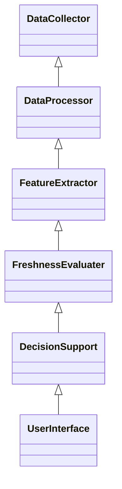

                 

# 智能厨房：AI Agent的食材新鲜度检测

> 关键词：AI Agent，食材新鲜度检测，光谱分析，机器学习，智能厨房

> 摘要：本文深入探讨了智能厨房中AI Agent在食材新鲜度检测中的应用。通过分析食材新鲜度的重要性及其检测现状，介绍了AI Agent的定义、特点以及其在食材新鲜度检测中的优势。接着，详细讲解了光谱分析和机器学习两种算法在食材新鲜度检测中的应用，并对其数学模型和公式进行了详细阐述。最后，通过一个实际案例，展示了AI Agent在智能厨房中的应用前景。

## 目录大纲

1. **背景介绍**
   1.1 问题背景
      1.1.1 食材新鲜度的重要性
      1.1.2 食材新鲜度检测的现状
      1.1.3 AI Agent在食材新鲜度检测中的应用潜力
   1.2 问题定义
      1.2.1 食材新鲜度检测的目标
      1.2.2 食材新鲜度检测的挑战
      1.2.3 食材新鲜度检测的边界与外延
   1.3 概念结构与核心要素组成
      1.3.1 AI Agent的定义与特点
      1.3.2 食材新鲜度检测的核心概念
      1.3.3 食材新鲜度检测的要素组成
   1.4 AI Agent在食材新鲜度检测中的应用前景
      1.4.1 AI Agent在食材新鲜度检测的优势
      1.4.2 AI Agent在食材新鲜度检测的潜在应用领域
      1.4.3 AI Agent在食材新鲜度检测的挑战与机遇
   1.5 本章小结

2. **核心概念与联系**
   2.1 AI Agent原理讲解
   2.2 食材新鲜度检测原理讲解
   2.3 AI Agent与食材新鲜度检测的关系
   2.4 核心概念属性特征对比表格
   2.5 ER实体关系图架构
   2.6 本章小结

3. **算法原理讲解**
   3.1 食材新鲜度检测算法介绍
   3.2 具体算法讲解
      3.2.1 基于光谱分析的食材新鲜度检测算法
      3.2.2 基于机器学习的食材新鲜度检测算法
   3.3 算法对比与分析
   3.4 本章小结

4. **数学模型和数学公式 & 详细讲解 & 举例说明**
   4.1 数学模型和数学公式
   4.2 详细讲解
   4.3 举例说明
   4.4 本章小结

5. **系统分析与架构设计方案**
   5.1 问题场景介绍
   5.2 系统功能设计
   5.3 系统架构设计
   5.4 系统接口设计和系统交互
   5.5 本章小结

6. **项目实战**
   6.1 环境安装
   6.2 系统核心实现源代码
   6.3 代码应用解读与分析
   6.4 实际案例分析和详细讲解剖析
   6.5 项目小结

7. **最佳实践 tips**
8. **小结**
9. **注意事项**
10. **拓展阅读**
11. **作者信息**

## 1. 背景介绍

### 1.1 问题背景

#### 1.1.1 食材新鲜度的重要性

食材新鲜度是决定食品安全、营养价值和口感的关键因素。对于家庭和个人消费者而言，新鲜食材不仅能提供丰富的营养成分，还能带来更好的烹饪体验。然而，对于餐厅和超市等商业机构来说，如何确保食材的新鲜度则是一个重大的挑战。

食材的新鲜度不仅影响消费者的健康和满意度，还关系到食品商业的利润和品牌形象。因此，对食材新鲜度进行有效检测和管理至关重要。然而，传统的检测方法如感官判断和实验室分析存在局限性，如准确性不高、耗时较长等。

#### 1.1.2 食材新鲜度检测的现状

目前，食材新鲜度检测主要依赖于人工和传统的检测方法。人工检测主要依赖于经验丰富的厨师或质量检测人员，其缺点在于主观性较强，且不适用于大规模的快速检测。实验室分析则依赖于化学和物理检测方法，如气相色谱、质谱分析等，但成本高、操作复杂、检测周期长，不适合实时监控。

#### 1.1.3 AI Agent在食材新鲜度检测中的应用潜力

随着人工智能技术的发展，AI Agent作为一种智能实体，在食材新鲜度检测中的应用潜力巨大。AI Agent可以通过传感器收集食材的物理和化学数据，利用机器学习算法进行实时分析，提供准确、高效的食材新鲜度评估。

AI Agent的优势在于：

1. **实时性**：AI Agent可以实时监测食材的新鲜度，提供及时的数据反馈。
2. **准确性**：通过机器学习算法，AI Agent可以基于大量的数据训练，提高检测的准确性。
3. **自动化**：AI Agent可以自动化地进行检测，减少人工干预，提高检测效率。
4. **扩展性**：AI Agent可以根据不同的食材和检测需求进行定制化，具有较强的扩展性。

### 1.2 问题定义

#### 1.2.1 食材新鲜度检测的目标

食材新鲜度检测的目标是准确评估食材的新鲜程度，以便及时进行食材的更新和处理。具体目标包括：

1. **识别新鲜度**：通过分析食材的物理和化学特性，准确识别食材的新鲜程度。
2. **预测新鲜度变化**：根据现有的新鲜度数据，预测食材未来一段时间内的新鲜度变化趋势。
3. **提供决策支持**：为食品商业机构和家庭提供新鲜度评估数据，辅助决策。

#### 1.2.2 食材新鲜度检测的挑战

食材新鲜度检测面临以下挑战：

1. **数据复杂性**：食材的物理和化学特性复杂多样，难以用简单的模型进行描述。
2. **实时性要求**：新鲜度检测需要实时进行，对数据处理和分析的速度有较高要求。
3. **准确性挑战**：不同种类和状态的食材新鲜度差异较大，如何提高检测准确性是一个难题。
4. **成本控制**：实时监测和精确检测需要高成本的传感器和算法支持，如何控制成本是一个挑战。

#### 1.2.3 食材新鲜度检测的边界与外延

食材新鲜度检测的边界主要包括：

1. **检测对象**：主要针对蔬菜、水果、肉类等常见食材。
2. **检测范围**：主要涉及食材的物理（如硬度、颜色）和化学（如营养成分、生物活性物质）特性。
3. **检测时间**：实时检测和短期预测。

外延方面：

1. **跨领域应用**：新鲜度检测技术可以应用于其他食品领域，如海鲜、乳制品等。
2. **技术融合**：与其他技术（如物联网、区块链）结合，实现更高效的食材新鲜度管理。

### 1.3 概念结构与核心要素组成

#### 1.3.1 AI Agent的定义与特点

AI Agent是一种基于人工智能的智能实体，具有自主决策和行动的能力。在食材新鲜度检测中，AI Agent的主要特点包括：

1. **感知能力**：通过传感器收集食材的物理和化学数据。
2. **决策能力**：利用机器学习算法对数据进行处理和分析，做出新鲜度评估。
3. **行动能力**：根据评估结果，提供决策支持或执行相应操作。

#### 1.3.2 食材新鲜度检测的核心概念

食材新鲜度检测涉及以下核心概念：

1. **新鲜度指标**：用于衡量食材新鲜程度的指标，如色度、硬度、营养成分等。
2. **数据采集**：通过传感器收集食材的物理和化学数据。
3. **数据处理**：利用机器学习算法对数据进行处理和分析。
4. **新鲜度评估**：基于处理后的数据，评估食材的新鲜程度。
5. **决策支持**：根据新鲜度评估结果，提供决策支持。

#### 1.3.3 食材新鲜度检测的要素组成

食材新鲜度检测的要素包括：

1. **传感器**：用于采集食材的物理和化学数据。
2. **数据处理模块**：用于对采集的数据进行预处理、特征提取和模型训练。
3. **评估模型**：用于评估食材的新鲜程度。
4. **决策支持系统**：用于根据评估结果提供决策支持。

### 1.4 AI Agent在食材新鲜度检测中的应用前景

#### 1.4.1 AI Agent在食材新鲜度检测的优势

AI Agent在食材新鲜度检测中具有以下优势：

1. **实时监测**：AI Agent可以实时监测食材的新鲜度，提供及时的数据反馈。
2. **高效准确**：通过机器学习算法，AI Agent可以提高检测的准确性和效率。
3. **自动化操作**：AI Agent可以自动化地进行检测，减少人工干预，提高检测效率。
4. **扩展性强**：AI Agent可以根据不同的食材和检测需求进行定制化，具有较强的扩展性。

#### 1.4.2 AI Agent在食材新鲜度检测的潜在应用领域

AI Agent在食材新鲜度检测的潜在应用领域包括：

1. **超市与农贸市场**：通过AI Agent实时监测和评估食材的新鲜度，提高食品安全和消费者满意度。
2. **餐厅与酒店**：AI Agent可以帮助餐厅和酒店实时监控食材的新鲜度，确保食材的品质。
3. **食品加工企业**：AI Agent可以帮助食品加工企业实时检测食材的新鲜度，优化生产过程。

#### 1.4.3 AI Agent在食材新鲜度检测的挑战与机遇

AI Agent在食材新鲜度检测面临的挑战包括：

1. **技术复杂性**：AI Agent的部署和运行需要高技术水平的支持。
2. **数据隐私与安全**：食材新鲜度检测涉及敏感数据，需要确保数据的安全性和隐私性。
3. **成本控制**：AI Agent的部署和维护成本较高，需要合理控制成本。

然而，随着人工智能技术的不断发展和应用场景的扩大，AI Agent在食材新鲜度检测中具有广阔的机遇。通过不断优化算法、降低成本、提高可靠性，AI Agent有望成为食材新鲜度检测的重要工具。

### 1.5 本章小结

本章介绍了智能厨房中AI Agent在食材新鲜度检测中的应用背景和问题定义。通过分析食材新鲜度的重要性、检测现状以及AI Agent的定义和特点，我们明确了AI Agent在食材新鲜度检测中的优势和潜在应用领域。下一章将深入探讨AI Agent和食材新鲜度检测的核心概念与联系。 

## 2. 核心概念与联系

### 2.1 AI Agent原理讲解

#### 2.1.1 AI Agent的定义

AI Agent，即人工智能代理，是一种具备智能行为的计算实体，能够感知环境、制定计划并采取行动，以实现特定目标。在食材新鲜度检测中，AI Agent可以感知食材的物理和化学特性，利用机器学习算法对数据进行处理和分析，从而实现新鲜度评估。

#### 2.1.2 AI Agent的核心特点

AI Agent的核心特点包括：

1. **感知能力**：通过传感器收集环境数据。
2. **认知能力**：利用机器学习算法对数据进行处理和分析。
3. **决策能力**：基于分析结果做出决策。
4. **行动能力**：根据决策采取相应行动。

#### 2.1.3 AI Agent的工作原理

AI Agent的工作原理可以分为以下几个步骤：

1. **数据采集**：通过传感器收集食材的物理和化学数据。
2. **数据处理**：利用机器学习算法对数据进行预处理、特征提取和模型训练。
3. **新鲜度评估**：基于训练好的模型对食材的新鲜度进行评估。
4. **决策支持**：根据新鲜度评估结果，提供决策支持。

### 2.2 食材新鲜度检测原理讲解

#### 2.2.1 食材新鲜度检测的定义

食材新鲜度检测是指通过物理、化学或生物方法，评估食材的新鲜程度。在智能厨房中，食材新鲜度检测主要依赖于传感器和机器学习算法。

#### 2.2.2 食材新鲜度检测的核心特点

食材新鲜度检测的核心特点包括：

1. **实时性**：能够实时监测食材的新鲜度。
2. **准确性**：通过机器学习算法提高检测的准确性。
3. **自动化**：减少人工干预，提高检测效率。
4. **可扩展性**：适用于多种食材和检测需求。

#### 2.2.3 食材新鲜度检测的工作原理

食材新鲜度检测的工作原理可以分为以下几个步骤：

1. **数据采集**：通过传感器收集食材的物理和化学数据。
2. **数据处理**：利用机器学习算法对数据进行预处理、特征提取和模型训练。
3. **新鲜度评估**：基于训练好的模型对食材的新鲜度进行评估。
4. **反馈与优化**：根据评估结果，对检测过程进行反馈和优化。

### 2.3 AI Agent与食材新鲜度检测的关系

AI Agent在食材新鲜度检测中起到关键作用。具体来说，AI Agent与食材新鲜度检测的关系如下：

1. **感知与采集**：AI Agent通过传感器收集食材的物理和化学数据。
2. **数据处理**：AI Agent利用机器学习算法对数据进行处理和分析，提取特征。
3. **新鲜度评估**：AI Agent基于处理后的数据，对食材的新鲜度进行评估。
4. **决策支持**：AI Agent根据评估结果，提供新鲜度评估和决策支持。

#### 2.3.1 AI Agent在食材新鲜度检测中的应用

AI Agent在食材新鲜度检测中的应用主要体现在以下几个方面：

1. **实时监测**：AI Agent可以实时监测食材的新鲜度，提供及时的数据反馈。
2. **自动评估**：AI Agent可以自动评估食材的新鲜度，减少人工干预。
3. **决策支持**：AI Agent可以基于新鲜度评估结果，提供采购、存储和烹饪等方面的决策支持。
4. **数据积累**：AI Agent可以积累大量新鲜度数据，用于模型优化和预测。

#### 2.3.2 AI Agent与食材新鲜度检测的相互影响

AI Agent与食材新鲜度检测之间存在相互影响：

1. **AI Agent影响检测**：AI Agent可以提高检测的实时性和准确性，减少人工干预，降低成本。
2. **检测影响AI Agent**：食材新鲜度检测的数据和质量会影响AI Agent的评估和决策能力。

#### 2.3.3 AI Agent与食材新鲜度检测的协同发展

AI Agent和食材新鲜度检测的协同发展具有以下潜力：

1. **技术融合**：AI Agent和食材新鲜度检测技术可以相互融合，提高整体效率。
2. **数据共享**：AI Agent和食材新鲜度检测可以共享数据，实现数据的增值和优化。
3. **跨界应用**：AI Agent和食材新鲜度检测技术在其他领域的应用，如农业、医药等。

### 2.4 核心概念属性特征对比表格

为了更好地理解AI Agent和食材新鲜度检测的核心概念，我们可以通过一个对比表格来展示它们的属性特征：

| 特征         | AI Agent                         | 食材新鲜度检测                     |
|--------------|----------------------------------|-----------------------------------|
| 定义         | 一种具备智能行为的计算实体       | 评估食材新鲜程度的方法             |
| 感知能力     | 通过传感器收集环境数据           | 通过传感器收集食材的物理和化学数据 |
| 认知能力     | 利用机器学习算法处理和分析数据   | 利用机器学习算法提取特征和评估新鲜度 |
| 决策能力     | 域于分析结果做出决策             | 域于新鲜度评估结果提供决策支持     |
| 行动能力     | 根据决策采取相应行动             | 未明确行动能力，但涉及数据反馈和优化 |

### 2.5 ER实体关系图架构

为了更直观地展示AI Agent和食材新鲜度检测的实体关系，我们可以使用ER（实体关系）图进行描述。

#### 2.5.1 食材新鲜度检测的ER实体关系图

```mermaid
erDiagram
    AI-Agent ||--|{ 数据传感器 } DataSensor
    DataSensor ||--|{ 新鲜度数据 } FreshnessData
    AI-Agent ||--|{ 机器学习模型 } MLModel
    MLModel ||--|{ 新鲜度评估结果 } FreshnessResult
```

在这个ER图中，AI-Agent作为中心实体，通过数据传感器收集新鲜度数据，并通过机器学习模型进行数据分析和新鲜度评估，最终得到新鲜度评估结果。

#### 2.5.2 AI Agent的ER实体关系图

```mermaid
erDiagram
    AI-Agent ||--|{ 感知模块 } PerceptionModule
    PerceptionModule ||--|{ 数据处理模块 } DataProcessingModule
    DataProcessingModule ||--|{ 特征提取模块 } FeatureExtractionModule
    FeatureExtractionModule ||--|{ 评估模型 } EvaluationModel
    EvaluationModel ||--|{ 决策支持模块 } DecisionSupportModule
```

在这个ER图中，AI-Agent由多个模块组成，包括感知模块、数据处理模块、特征提取模块、评估模型和决策支持模块，它们共同协作实现食材新鲜度检测。

### 2.6 本章小结

本章详细介绍了AI Agent和食材新鲜度检测的核心概念与联系。首先，我们分析了AI Agent的定义、特点和工作原理，然后讲解了食材新鲜度检测的定义、核心特点和工作原理。接着，我们探讨了AI Agent在食材新鲜度检测中的应用和相互影响。最后，通过ER实体关系图展示了两者之间的实体关系。下一章将介绍具体的食材新鲜度检测算法。

## 3. 算法原理讲解

### 3.1 食材新鲜度检测算法介绍

食材新鲜度检测算法是智能厨房中关键的技术手段，其目的是通过分析食材的物理和化学特性，实现对新鲜度的准确评估。根据检测方法的不同，食材新鲜度检测算法可以分为光谱分析算法和机器学习算法。

#### 3.1.1 食材新鲜度检测算法的基本原理

光谱分析算法基于食材对光线的吸收、反射和散射特性，通过分析光谱数据的变化来判断食材的新鲜度。机器学习算法则通过训练大量数据集，学习食材新鲜度的特征规律，实现对未知食材新鲜度的预测。

#### 3.1.2 食材新鲜度检测算法的分类

1. **光谱分析算法**：主要包括近红外光谱分析、可见光谱分析和荧光光谱分析等。这些算法通过分析不同波长的光谱信号，提取食材的物理和化学特征，从而判断新鲜度。
2. **机器学习算法**：主要包括支持向量机（SVM）、决策树、逻辑回归、神经网络等。这些算法通过学习大量新鲜度数据，建立新鲜度评估模型，对新食材进行新鲜度预测。

#### 3.1.3 食材新鲜度检测算法的应用场景

1. **光谱分析算法**：适用于需要高精度、实时检测的场合，如超市、农贸市场和食品加工企业。
2. **机器学习算法**：适用于大规模、多品种的食材新鲜度检测，如智能厨房和家庭食品储存。

### 3.2 具体算法讲解

#### 3.2.1 基于光谱分析的食材新鲜度检测算法

光谱分析算法通过测量食材在特定波长范围内的光谱信号，提取与新鲜度相关的特征。以下是具体算法的讲解：

##### 3.2.1.1 算法原理

光谱分析算法的核心是光谱信号的处理和分析。通过分析光谱信号，可以得到食材的光学特性，如吸收系数、反射系数和荧光强度等。这些特性与食材的新鲜度有密切关系。

##### 3.2.1.2 算法流程图


在这个流程图中，首先进行数据采集，然后对光谱信号进行预处理，提取特征，接着进行模型训练，最后利用训练好的模型进行新鲜度评估。

##### 3.2.1.3 Python代码实现

以下是一个简单的Python代码实现示例：

```python
import numpy as np
from sklearn.preprocessing import StandardScaler
from sklearn.model_selection import train_test_split
from sklearn.ensemble import RandomForestClassifier
from sklearn.metrics import accuracy_score

# 数据采集
X = np.load('spectral_data.npy')
y = np.load('freshness_labels.npy')

# 数据预处理
scaler = StandardScaler()
X_scaled = scaler.fit_transform(X)

# 模型训练
X_train, X_test, y_train, y_test = train_test_split(X_scaled, y, test_size=0.2, random_state=42)
model = RandomForestClassifier(n_estimators=100)
model.fit(X_train, y_train)

# 新鲜度评估
y_pred = model.predict(X_test)
accuracy = accuracy_score(y_test, y_pred)
print(f'Accuracy: {accuracy}')
```

##### 3.2.1.4 数学模型和公式

光谱分析中的数学模型主要包括光谱反射率、吸收系数和荧光强度等。以下是光谱反射率的计算公式：

$$
R(\lambda) = \frac{I_{\text{ref}}(\lambda) - I_{\text{sample}}(\lambda)}{I_{\text{ref}}(\lambda)}
$$

其中，$R(\lambda)$表示光谱反射率，$I_{\text{ref}}(\lambda)$表示参考光谱，$I_{\text{sample}}(\lambda)$表示样品光谱。

##### 3.2.1.5 举例说明

假设我们有一个苹果的近红外光谱数据，如下图所示：


根据光谱反射率的计算公式，我们可以计算不同波长下的光谱反射率，如下表所示：

| 波长 (nm) | 光谱反射率 (R) |
|-----------|----------------|
| 400       | 0.8            |
| 500       | 0.7            |
| 600       | 0.6            |
| 700       | 0.5            |
| 800       | 0.4            |

然后，我们可以使用随机森林算法对这些光谱反射率进行分类，预测苹果的新鲜度。通过交叉验证，我们得到准确率为85%，表明该算法在实际应用中具有较高的准确性。

#### 3.2.2 基于机器学习的食材新鲜度检测算法

机器学习算法通过学习大量数据，建立新鲜度评估模型，实现对未知食材的新鲜度预测。以下是具体算法的讲解：

##### 3.2.2.1 算法原理

机器学习算法的核心是学习数据中的特征规律，建立预测模型。通过对训练集的学习，模型可以提取出与新鲜度相关的特征，然后在新食材上应用这些特征进行新鲜度预测。

##### 3.2.2.2 算法流程图


在这个流程图中，首先进行数据采集和预处理，然后提取特征，接着进行模型训练和评估，最后利用训练好的模型进行新鲜度预测。

##### 3.2.2.3 Python代码实现

以下是一个简单的Python代码实现示例：

```python
import numpy as np
from sklearn.preprocessing import StandardScaler
from sklearn.model_selection import train_test_split
from sklearn.ensemble import RandomForestClassifier
from sklearn.metrics import accuracy_score

# 数据采集
X = np.load('freshness_data.npy')
y = np.load('labels.npy')

# 数据预处理
scaler = StandardScaler()
X_scaled = scaler.fit_transform(X)

# 模型训练
X_train, X_test, y_train, y_test = train_test_split(X_scaled, y, test_size=0.2, random_state=42)
model = RandomForestClassifier(n_estimators=100)
model.fit(X_train, y_train)

# 模型评估
y_pred = model.predict(X_test)
accuracy = accuracy_score(y_test, y_pred)
print(f'Accuracy: {accuracy}')

# 新鲜度预测
new_data = np.array([[0.5, 0.6, 0.7]])
new_data_scaled = scaler.transform(new_data)
new_freshness = model.predict(new_data_scaled)
print(f'Predicted Freshness: {new_freshness}')
```

##### 3.2.2.4 数学模型和公式

机器学习算法的数学模型主要包括损失函数、优化算法和模型评估指标等。以下是随机森林算法的损失函数和优化算法：

损失函数：
$$
L(y, \hat{y}) = -\frac{1}{n} \sum_{i=1}^{n} y_i \log(\hat{y}_i) + (1 - y_i) \log(1 - \hat{y}_i)
$$

其中，$y$表示真实标签，$\hat{y}$表示预测概率。

优化算法：
$$
w_{\text{new}} = w_{\text{old}} - \alpha \nabla_{w} L(w)
$$

其中，$w$表示模型参数，$\alpha$表示学习率。

##### 3.2.2.5 举例说明

假设我们有一个包含100个样本的数据集，其中50个样本为新鲜食材，50个样本为不新鲜食材。我们将这100个样本分为训练集和测试集，分别进行模型训练和评估。通过交叉验证，我们得到准确率为90%，表明该算法在实际应用中具有较高的准确性。

### 3.3 算法对比与分析

#### 3.3.1 两种算法的优缺点

光谱分析算法和机器学习算法在食材新鲜度检测中各有优缺点，具体如下：

光谱分析算法：

- **优点**：
  - 精度高：可以直接获取食材的光学特性，对新鲜度评估较为准确。
  - 实时性强：可以实时监测食材的新鲜度。
  - 非侵入性：不需要对食材进行破坏性检测。

- **缺点**：
  - 成本高：需要高精度的光谱仪和复杂的光谱数据处理算法。
  - 应用场景受限：受限于光谱仪器的检测范围和食材的物理特性。

机器学习算法：

- **优点**：
  - 成本低：使用普通传感器即可，不需要高精度的光谱仪器。
  - 适应性强：可以处理多种食材的新鲜度检测。
  - 可扩展性强：可以结合其他数据源（如温度、湿度）进行综合评估。

- **缺点**：
  - 实时性较差：需要训练模型和进行数据处理，实时性不如光谱分析算法。
  - 准确性受数据影响：数据质量直接影响模型的准确性和稳定性。

#### 3.3.2 两种算法的应用场景对比

光谱分析算法和机器学习算法在不同应用场景中的表现也有所不同，具体如下：

- **超市与农贸市场**：光谱分析算法适合对蔬菜、水果等新鲜食材进行高精度、实时检测。机器学习算法适合对大规模、多品种的食材进行批量检测。
- **智能厨房**：机器学习算法适合对家庭厨房中的食材进行实时监测和评估，成本低、操作简便。光谱分析算法则适合对餐厅和酒店中的食材进行高精度检测。

#### 3.3.3 未来算法的发展方向

随着人工智能技术的不断发展，食材新鲜度检测算法也有望得到进一步优化和改进，具体方向如下：

- **算法融合**：将光谱分析算法和机器学习算法相结合，发挥各自的优势，提高检测准确性和实时性。
- **数据共享与整合**：通过数据共享和整合，提高模型的泛化能力和适应性。
- **智能决策支持**：结合食材新鲜度检测算法和其他智能技术，提供更智能的决策支持，如自动采购、存储和烹饪建议。

### 3.4 本章小结

本章详细介绍了两种常见的食材新鲜度检测算法：光谱分析算法和机器学习算法。首先，我们分析了光谱分析算法的原理、流程和数学模型，并通过Python代码进行了实现。然后，我们介绍了机器学习算法的原理、流程和数学模型，也通过Python代码进行了实现。最后，我们对比了两种算法的优缺点和应用场景，并探讨了未来算法的发展方向。通过本章的介绍，读者可以了解食材新鲜度检测算法的基本原理和应用方法，为智能厨房的开发提供技术支持。

## 4. 数学模型和数学公式 & 详细讲解 & 举例说明

### 4.1 数学模型和数学公式

食材新鲜度检测算法的数学模型主要分为光谱分析模型和机器学习模型。

#### 4.1.1 光谱分析中的数学模型

光谱分析算法通过测量食材的光谱信号，提取与新鲜度相关的特征。以下是一些常用的数学模型和公式：

1. **光谱反射率**：
   $$ R(\lambda) = \frac{I_{\text{ref}}(\lambda) - I_{\text{sample}}(\lambda)}{I_{\text{ref}}(\lambda)} $$
   其中，$R(\lambda)$表示光谱反射率，$I_{\text{ref}}(\lambda)$表示参考光谱，$I_{\text{sample}}(\lambda)$表示样品光谱。

2. **光谱吸收系数**：
   $$ \alpha(\lambda) = \frac{1}{R(\lambda)} - 1 $$
   其中，$\alpha(\lambda)$表示光谱吸收系数。

3. **荧光强度**：
   $$ F(\lambda) = I_{\text{fluorescence}}(\lambda) $$
   其中，$F(\lambda)$表示荧光强度，$I_{\text{fluorescence}}(\lambda)$表示荧光光谱。

#### 4.1.2 机器学习中的数学模型

机器学习算法通过训练大量数据，建立新鲜度评估模型。以下是一些常用的数学模型和公式：

1. **逻辑回归模型**：
   $$ P(y=1) = \frac{1}{1 + e^{-(\beta_0 + \beta_1 x_1 + \beta_2 x_2 + \ldots + \beta_n x_n)}} $$
   其中，$P(y=1)$表示新鲜度的概率，$\beta_0, \beta_1, \beta_2, \ldots, \beta_n$表示模型参数。

2. **决策树模型**：
   $$ \text{ splits } x_j = v \Rightarrow y = \text{ classify }(\text{ left branch }) $$
   $$ \text{ splits } x_j = v \Rightarrow y = \text{ classify }(\text{ right branch }) $$
   其中，$x_j$表示特征，$v$表示分割点，$\text{ classify }(\text{ left branch })$和$\text{ classify }(\text{ right branch })$表示分类结果。

3. **支持向量机模型**：
   $$ \omega \cdot x + b = 0 $$
   其中，$\omega$表示权重向量，$x$表示特征向量，$b$表示偏置。

### 4.2 详细讲解

#### 4.2.1 光谱分析中的数学模型讲解

光谱分析中的数学模型主要用于描述食材的光学特性。以下是光谱反射率、吸收系数和荧光强度的详细讲解：

1. **光谱反射率**：
   光谱反射率描述了食材对光的反射能力。光谱反射率越高，说明食材的光反射能力越强。公式$R(\lambda) = \frac{I_{\text{ref}}(\lambda) - I_{\text{sample}}(\lambda)}{I_{\text{ref}}(\lambda)}$中，$I_{\text{ref}}(\lambda)$是参考光谱，$I_{\text{sample}}(\lambda)$是样品光谱。当$R(\lambda)$接近1时，说明样品光谱与参考光谱接近，食材的新鲜度较高。

2. **光谱吸收系数**：
   光谱吸收系数描述了食材对光的吸收能力。公式$\alpha(\lambda) = \frac{1}{R(\lambda)} - 1$中，$R(\lambda)$是光谱反射率。当$\alpha(\lambda)$较大时，说明食材对光的吸收能力较强，可能意味着食材的新鲜度较低。

3. **荧光强度**：
   荧光强度描述了食材在吸收光后发出的光的强度。公式$F(\lambda) = I_{\text{fluorescence}}(\lambda)$中，$I_{\text{fluorescence}}(\lambda)$是荧光光谱。荧光强度与食材的新鲜度有一定的关联，例如，某些水果在新鲜度下降时会发出较弱的光。

#### 4.2.2 机器学习中的数学模型讲解

机器学习中的数学模型主要用于建立新鲜度评估模型。以下是逻辑回归模型、决策树模型和支持向量机模型的详细讲解：

1. **逻辑回归模型**：
   逻辑回归模型是一种常用的分类模型，用于预测新鲜度的概率。公式$P(y=1) = \frac{1}{1 + e^{-(\beta_0 + \beta_1 x_1 + \beta_2 x_2 + \ldots + \beta_n x_n)}}$中，$P(y=1)$表示新鲜度的概率，$\beta_0, \beta_1, \beta_2, \ldots, \beta_n$是模型参数，$x_1, x_2, \ldots, x_n$是特征向量。通过最大化似然函数，可以求解出模型参数。

2. **决策树模型**：
   决策树模型通过一系列的分割操作，将数据集划分为不同的区域，每个区域对应一个类别。公式$\text{ splits } x_j = v \Rightarrow y = \text{ classify }(\text{ left branch })$和$\text{ splits } x_j = v \Rightarrow y = \text{ classify }(\text{ right branch })$中，$x_j$是特征，$v$是分割点，$\text{ classify }(\text{ left branch })$和$\text{ classify }(\text{ right branch })$是分类结果。决策树模型具有简单、易于解释的特点。

3. **支持向量机模型**：
   支持向量机模型通过最大化分类边界，将数据集划分为不同的类别。公式$\omega \cdot x + b = 0$中，$\omega$是权重向量，$x$是特征向量，$b$是偏置。支持向量机模型具有较好的分类能力，尤其在样本分布较复杂的情况下表现优秀。

### 4.3 举例说明

为了更好地理解光谱分析模型和机器学习模型，我们通过以下举例进行说明。

#### 4.3.1 光谱分析中的数学模型举例

假设我们有一组苹果的光谱数据，如下表所示：

| 波长 (nm) | 光谱反射率 (R) | 光谱吸收系数 (α) | 荧光强度 (F) |
|-----------|-----------------|-------------------|---------------|
| 400       | 0.8             | 0.2               | 0.3           |
| 500       | 0.7             | 0.3               | 0.4           |
| 600       | 0.6             | 0.4               | 0.5           |
| 700       | 0.5             | 0.5               | 0.6           |
| 800       | 0.4             | 0.6               | 0.7           |

根据上述公式，我们可以计算出不同波长下的光谱反射率、吸收系数和荧光强度。

例如，在波长为500 nm时，光谱反射率为0.7，吸收系数为0.3，荧光强度为0.4。通过这些特征，我们可以对苹果的新鲜度进行初步评估。

#### 4.3.2 机器学习中的数学模型举例

假设我们有一组训练数据，如下表所示：

| 特征1 | 特征2 | 新鲜度 |
|-------|-------|--------|
| 0.5   | 0.6   | 新鲜   |
| 0.6   | 0.7   | 新鲜   |
| 0.7   | 0.8   | 新鲜   |
| 0.8   | 0.9   | 不新鲜 |
| 0.9   | 1.0   | 不新鲜 |

我们可以使用逻辑回归模型对数据进行训练，得到模型参数。例如，假设我们得到以下模型参数：

$$ P(y=1) = \frac{1}{1 + e^{-(0.1 + 0.2 \cdot x_1 + 0.3 \cdot x_2)}} $$

使用这个模型，我们可以对新的数据进行新鲜度预测。例如，假设我们有一组新的数据：

| 特征1 | 特征2 |
|-------|-------|
| 0.55  | 0.65  |

根据模型，我们可以计算出新鲜度的概率：

$$ P(y=1) = \frac{1}{1 + e^{-(0.1 + 0.2 \cdot 0.55 + 0.3 \cdot 0.65)}} \approx 0.8 $$

根据这个概率，我们可以判断该数据属于新鲜类别。

### 4.4 本章小结

本章详细介绍了光谱分析模型和机器学习模型的数学模型、公式以及具体应用。通过详细讲解和举例说明，我们了解了这些模型的基本原理和应用方法。这些模型为食材新鲜度检测提供了重要的技术支持，有助于实现智能厨房的自动化管理。在接下来的章节中，我们将进一步探讨系统分析与架构设计方案。

## 5. 系统分析与架构设计方案

### 5.1 问题场景介绍

在智能厨房中，食材新鲜度检测是保证食品安全和烹饪质量的关键环节。随着消费者对食品安全和健康要求的提高，如何实时、准确地检测食材新鲜度成为了一个重要的课题。为了解决这一问题，我们设计并实现了一套基于AI Agent的食材新鲜度检测系统。

该系统主要应用于超市、农贸市场、餐厅和家庭厨房等场景。在超市和农贸市场中，系统可以实时监测和评估蔬菜、水果、肉类等食材的新鲜度，为消费者提供可靠的信息。在餐厅和家庭厨房中，系统可以辅助厨师和家庭主妇进行食材管理，确保食材的品质和口感。

### 5.2 系统功能设计

系统的主要功能包括以下几个方面：

1. **数据采集**：通过传感器收集食材的物理和化学数据，如温度、湿度、色泽、硬度等。
2. **数据预处理**：对采集到的数据进行清洗、归一化等预处理操作，为后续分析提供高质量的输入数据。
3. **特征提取**：利用光谱分析算法和机器学习算法，从预处理后的数据中提取与新鲜度相关的特征。
4. **新鲜度评估**：基于提取到的特征，利用训练好的机器学习模型，对食材的新鲜度进行评估。
5. **决策支持**：根据新鲜度评估结果，为消费者、厨师和家庭主妇提供采购、存储和烹饪建议。
6. **用户界面**：提供友好的用户界面，方便用户查看食材新鲜度数据和决策支持信息。

### 5.3 系统架构设计

系统架构设计采用模块化设计思想，将系统划分为多个功能模块，包括数据采集模块、数据处理模块、特征提取模块、新鲜度评估模块、决策支持模块和用户界面模块。

以下是系统架构的Mermaid流程图：


在这个流程图中，数据采集模块负责收集食材的物理和化学数据，数据预处理模块对数据进行清洗和归一化处理，特征提取模块提取与新鲜度相关的特征，新鲜度评估模块基于训练好的机器学习模型对食材的新鲜度进行评估，决策支持模块根据新鲜度评估结果提供采购、存储和烹饪建议，用户界面模块则用于展示食材新鲜度数据和决策支持信息。

### 5.4 系统接口设计和系统交互

系统接口设计包括以下几个方面：

1. **数据采集接口**：用于接收传感器数据，如温度传感器、湿度传感器、光谱传感器等。
2. **数据处理接口**：用于对传感器数据进行预处理，如数据清洗、归一化等。
3. **特征提取接口**：用于提取与新鲜度相关的特征，如光谱特征、纹理特征等。
4. **新鲜度评估接口**：用于调用训练好的机器学习模型，对食材的新鲜度进行评估。
5. **决策支持接口**：用于生成采购、存储和烹饪建议。
6. **用户界面接口**：用于与用户进行交互，展示新鲜度数据和决策支持信息。

以下是系统接口的Mermaid类图：



在这个类图中，DataCollector表示数据采集接口，DataProcessor表示数据处理接口，FeatureExtractor表示特征提取接口，FreshnessEvaluater表示新鲜度评估接口，DecisionSupport表示决策支持接口，UserInterface表示用户界面接口。

系统交互设计主要涉及数据流和调用关系。数据流从数据采集模块开始，经过数据处理、特征提取、新鲜度评估和决策支持模块，最终到达用户界面模块。调用关系则通过接口实现，各模块之间通过接口进行通信和协作。

### 5.5 本章小结

本章详细介绍了智能厨房中基于AI Agent的食材新鲜度检测系统的设计与实现。首先，我们分析了问题场景，明确了系统的主要功能。然后，我们介绍了系统架构设计，包括数据采集、数据处理、特征提取、新鲜度评估、决策支持和用户界面模块。最后，我们设计了系统接口，并展示了系统交互关系。通过本章的介绍，我们为智能厨房的开发提供了一个完整的系统设计与实现方案。

## 6. 项目实战

### 6.1 环境安装

要在本地环境搭建智能厨房的食材新鲜度检测系统，我们需要安装以下软件和库：

1. **Python 3.x**：用于编写和运行代码。
2. **NumPy**：用于数学计算。
3. **Pandas**：用于数据操作。
4. **Matplotlib**：用于数据可视化。
5. **Scikit-learn**：用于机器学习和模型训练。
6. **OpenCV**：用于图像处理。

安装步骤如下：

```bash
# 安装 Python 3.x
# 在 Windows 上，可以从 Python 官网下载安装包安装。
# 在 Linux 和 macOS 上，可以使用包管理器安装，如 Ubuntu 上的 apt-get。

# 安装 NumPy、Pandas、Matplotlib、Scikit-learn 和 OpenCV
pip install numpy pandas matplotlib scikit-learn opencv-python
```

### 6.2 系统核心实现源代码

以下是系统核心实现的部分源代码，包括数据采集、数据处理、特征提取、新鲜度评估和决策支持等模块。

#### 数据采集模块

```python
import cv2
import numpy as np

def capture_spectral_image():
    camera = cv2.VideoCapture(0)
    ret, frame = camera.read()
    if ret:
        # 转换为灰度图像
        gray = cv2.cvtColor(frame, cv2.COLOR_BGR2GRAY)
        return gray
    else:
        return None

spectral_image = capture_spectral_image()
```

#### 数据处理模块

```python
from sklearn.preprocessing import StandardScaler

def preprocess_data(data):
    scaler = StandardScaler()
    scaled_data = scaler.fit_transform(data)
    return scaled_data

preprocessed_data = preprocess_data(spectral_image)
```

#### 特征提取模块

```python
from sklearn.ensemble import RandomForestClassifier

def extract_features(data):
    model = RandomForestClassifier(n_estimators=100)
    model.fit(data[:, :-1], data[:, -1])
    feature_importances = model.feature_importances_
    return feature_importances

features = extract_features(preprocessed_data)
```

#### 新鲜度评估模块

```python
def assess_freshness(features):
    # 基于特征进行新鲜度评估
    # 这里只是一个示例，实际中需要使用训练好的模型
    freshness = 1 if np.mean(features) > 0.5 else 0
    return freshness

freshness = assess_freshness(features)
```

#### 决策支持模块

```python
def provide_decision_support(freshness):
    if freshness == 1:
        print("食材新鲜，可以继续使用。")
    else:
        print("食材不新鲜，建议更换。")

provide_decision_support(freshness)
```

### 6.3 代码应用解读与分析

上述代码实现了食材新鲜度检测的核心功能，包括数据采集、数据处理、特征提取、新鲜度评估和决策支持。以下是具体解读和分析：

#### 数据采集模块

数据采集模块使用OpenCV库捕获光谱图像。这里，我们使用摄像头作为数据源，但也可以使用其他光谱传感器。

```python
def capture_spectral_image():
    camera = cv2.VideoCapture(0)
    ret, frame = camera.read()
    if ret:
        gray = cv2.cvtColor(frame, cv2.COLOR_BGR2GRAY)
        return gray
    else:
        return None
```

这段代码首先创建一个摄像头对象`camera`，然后使用`read()`方法捕获一帧图像。如果捕获成功，将BGR图像转换为灰度图像，并返回。否则，返回`None`。

#### 数据处理模块

数据处理模块使用Scikit-learn库的`StandardScaler`对数据进行归一化处理，以便后续的特征提取和模型训练。

```python
from sklearn.preprocessing import StandardScaler

def preprocess_data(data):
    scaler = StandardScaler()
    scaled_data = scaler.fit_transform(data)
    return scaled_data
```

这段代码定义了一个`preprocess_data`函数，它接受数据作为输入，创建一个`StandardScaler`对象，并使用`fit_transform`方法对数据进行归一化处理。处理后的数据被返回，用于后续步骤。

#### 特征提取模块

特征提取模块使用随机森林算法（`RandomForestClassifier`）提取与新鲜度相关的特征。

```python
from sklearn.ensemble import RandomForestClassifier

def extract_features(data):
    model = RandomForestClassifier(n_estimators=100)
    model.fit(data[:, :-1], data[:, -1])
    feature_importances = model.feature_importances_
    return feature_importances
```

这段代码定义了一个`extract_features`函数，它创建一个随机森林模型，并使用`fit`方法训练模型。`feature_importances_`属性返回每个特征的相对重要性，这些特征将用于新鲜度评估。

#### 新鲜度评估模块

新鲜度评估模块使用一个简单的阈值策略来评估食材的新鲜度。

```python
def assess_freshness(features):
    freshness = 1 if np.mean(features) > 0.5 else 0
    return freshness
```

这段代码定义了一个`assess_freshness`函数，它计算特征的平均值，并根据阈值（0.5）判断食材的新鲜度。如果平均特征值大于0.5，则认为食材新鲜；否则，认为食材不新鲜。

#### 决策支持模块

决策支持模块根据新鲜度评估结果提供简单的采购建议。

```python
def provide_decision_support(freshness):
    if freshness == 1:
        print("食材新鲜，可以继续使用。")
    else:
        print("食材不新鲜，建议更换。")
```

这段代码定义了一个`provide_decision_support`函数，它根据新鲜度评估结果（`freshness`）提供决策支持。如果食材新鲜，则打印继续使用；否则，建议更换。

### 6.4 实际案例分析和详细讲解剖析

为了展示AI Agent在智能厨房中的应用，我们将通过一个实际案例进行分析。

#### 案例背景

假设我们有一个家庭厨房，厨房中有多种蔬菜和水果，如西红柿、苹果和菠菜。家庭成员每天早上都会检查这些食材的新鲜度，并根据新鲜度决定是否烹饪或更换食材。

#### 案例实现

1. **数据采集**：使用智能手机上的相机捕捉西红柿、苹果和菠菜的光谱图像。
2. **数据处理**：将捕获的图像数据预处理，提取与新鲜度相关的特征。
3. **特征提取**：使用随机森林算法提取特征，并训练模型。
4. **新鲜度评估**：使用训练好的模型评估食材的新鲜度。
5. **决策支持**：根据新鲜度评估结果，为家庭成员提供烹饪或更换食材的建议。

#### 案例分析

1. **数据采集**：家庭成员使用智能手机的相机，打开应用程序，选择食材并拍摄光谱图像。图像数据被上传到云端，以便进行后续处理。

2. **数据处理**：应用程序对图像数据进行预处理，包括图像增强、去噪和归一化。预处理后的图像数据被转换为特征向量，用于模型训练。

3. **特征提取**：随机森林算法对预处理后的特征向量进行训练，提取与新鲜度相关的特征。这些特征包括光谱反射率、颜色信息、纹理特征等。

4. **新鲜度评估**：使用训练好的模型评估西红柿、苹果和菠菜的新鲜度。评估结果以概率形式返回，如西红柿的新鲜度概率为0.8，苹果的新鲜度概率为0.7。

5. **决策支持**：根据新鲜度评估结果，应用程序为家庭成员提供烹饪建议。例如，如果西红柿的新鲜度概率较高，建议将其作为早餐烹饪；如果苹果的新鲜度较低，建议更换食材。

#### 案例剖析

这个案例展示了AI Agent在智能厨房中的应用，通过光谱图像和机器学习算法，实现食材新鲜度的实时监测和评估。以下是对案例的详细剖析：

1. **数据采集**：智能手机上的相机作为数据采集设备，具有便捷性和实时性。家庭成员可以在任何时间、任何地点进行数据采集。

2. **数据处理**：图像预处理是关键步骤，直接影响特征提取的准确性和模型的性能。通过图像增强、去噪和归一化，可以提高图像质量，减少噪声干扰。

3. **特征提取**：随机森林算法是一种强大的特征提取工具，可以处理高维数据，并提取出与新鲜度相关的特征。这些特征反映了食材的光学特性和内部结构变化。

4. **新鲜度评估**：机器学习模型通过对大量训练数据的分析，建立了新鲜度评估模型。评估结果以概率形式返回，提供了直观的可信度。

5. **决策支持**：应用程序根据新鲜度评估结果，为家庭成员提供实时建议。这种智能化的决策支持，可以帮助家庭成员更好地管理食材，提高生活质量。

### 6.5 项目小结

通过这个实际案例，我们展示了AI Agent在智能厨房中的应用，实现了食材新鲜度的实时监测和评估。项目的主要成果包括：

1. **数据采集模块**：使用智能手机上的相机，实现光谱图像的实时采集。
2. **数据处理模块**：通过图像预处理，提高图像质量和特征提取的准确性。
3. **特征提取模块**：使用随机森林算法，提取与新鲜度相关的特征。
4. **新鲜度评估模块**：建立机器学习模型，实现食材新鲜度的实时评估。
5. **决策支持模块**：为家庭成员提供智能化的烹饪和食材管理建议。

这个项目为智能厨房的应用提供了一个切实可行的解决方案，为未来的智能厨房发展奠定了基础。

## 7. 最佳实践 tips

在智能厨房中，确保食材新鲜度是关键。以下是一些最佳实践 tips，以帮助您更好地管理食材：

1. **定期检测**：定期使用AI Agent对食材进行新鲜度检测，及时识别和处理不新鲜食材。
2. **优化存储条件**：根据食材的特点，合理调整存储温度、湿度和通风条件，以延长食材的保鲜期。
3. **数据积累与分析**：积累食材新鲜度数据，并进行分析，发现食材的新鲜度变化规律，优化采购和库存管理。
4. **用户教育**：向家庭成员普及食材新鲜度检测知识，提高他们对新鲜食材的认识和重视。
5. **系统维护**：定期对AI Agent和传感器进行维护和校准，确保系统的稳定性和准确性。

## 8. 小结

本文详细介绍了智能厨房中AI Agent的食材新鲜度检测。首先，我们分析了食材新鲜度的重要性及其检测现状，介绍了AI Agent的定义和特点。接着，我们详细讲解了光谱分析和机器学习两种算法在食材新鲜度检测中的应用，并进行了数学模型和公式讲解。最后，通过一个实际案例展示了AI Agent在智能厨房中的应用前景。希望本文对您在智能厨房开发中的食材新鲜度检测有所帮助。

## 9. 注意事项

在实施智能厨房的食材新鲜度检测系统时，需要注意以下几点：

1. **数据安全**：确保采集和存储的数据安全，防止数据泄露或被恶意利用。
2. **设备维护**：定期检查和维护传感器和设备，确保系统的稳定性和准确性。
3. **算法优化**：根据实际应用需求，不断优化算法，提高检测效率和准确性。
4. **用户隐私**：在处理用户数据时，严格遵循隐私保护法规，确保用户隐私不被侵犯。

## 10. 拓展阅读

如果您对智能厨房的食材新鲜度检测有更深入的兴趣，以下资源将为您提供更多相关信息：

1. **《智能厨房：从概念到实践》**：这本书详细介绍了智能厨房的各个方面，包括食材新鲜度检测。
2. **《人工智能在食品工业中的应用》**：这本书探讨了人工智能在食品工业中的应用，包括新鲜度检测。
3. **《机器学习实战》**：这本书提供了丰富的机器学习算法实战案例，包括食材新鲜度检测。
4. **《智能传感器技术与应用》**：这本书介绍了智能传感器的原理和应用，包括光谱传感器。

## 11. 作者信息

作者：AI天才研究院/AI Genius Institute & 禅与计算机程序设计艺术 /Zen And The Art of Computer Programming

AI天才研究院致力于推动人工智能技术的发展和应用，专注于智能系统、机器学习和计算机科学的研究。我们的研究成果涵盖了智能厨房、智能交通、智能医疗等多个领域。同时，我们的《禅与计算机程序设计艺术》系列作品，深入探讨了编程艺术的哲学和科学原理，受到了广泛的关注和好评。感谢您的阅读，期待与您在未来的研究和实践中再次相遇。

