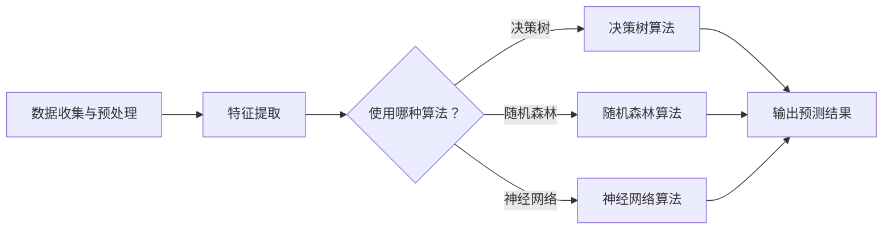
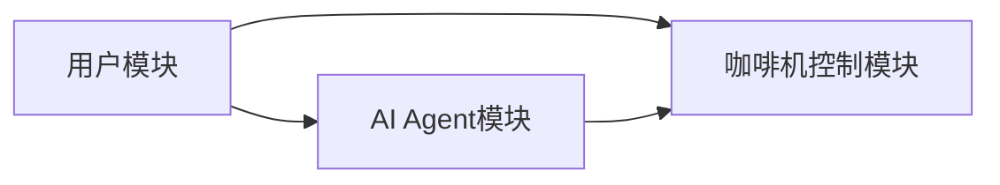
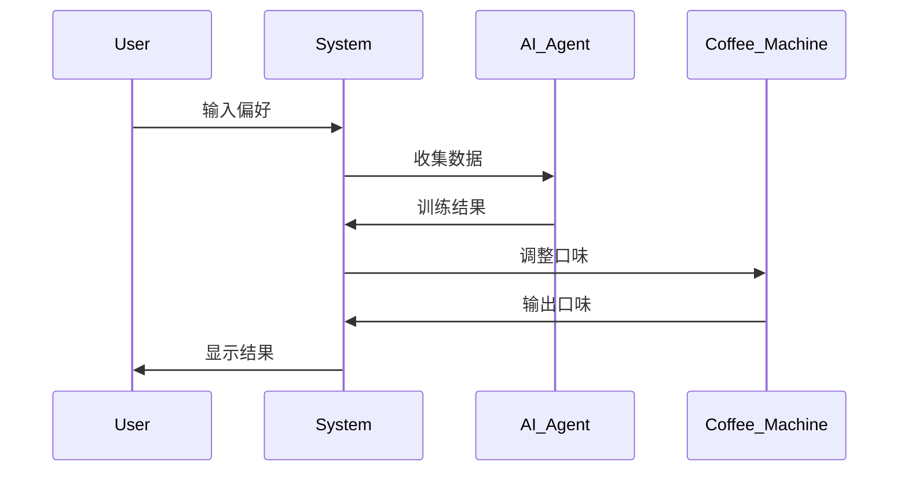

                 

# 智能咖啡机：AI Agent的个性化口味定制

关键词：智能咖啡机、AI Agent、个性化口味定制、机器学习、自然语言处理

摘要：本文将探讨智能咖啡机中AI Agent如何通过个性化口味定制提升用户体验。我们将从背景介绍、核心概念、技术实现、流程设计、数学模型、系统架构、项目实施及最佳实践等方面，一步步分析智能咖啡机的运作原理及其在现实中的应用。

## 引言

智能咖啡机作为现代智能家居设备，正逐渐成为人们生活中的一部分。随着人工智能技术的发展，智能咖啡机不再只是一个简单的咖啡冲泡设备，它正逐渐转型为具备个性化定制能力的智能终端。本文将重点讨论AI Agent在智能咖啡机中如何实现个性化口味定制，从而提升用户的体验。

## 背景介绍

### 核心概念术语说明

- **智能咖啡机**：一种能够通过人工智能技术进行个性化定制的咖啡制备设备。
- **AI Agent**：一种能够自主学习和执行任务的人工智能实体。
- **个性化口味定制**：根据用户偏好和历史数据，自动调整咖啡口味的过程。

### 问题背景

随着人们对生活品质要求的提高，咖啡不再是单纯的饮品，而是成为一种能够反映个人品味和生活态度的象征。因此，如何让咖啡机根据不同用户的需求，提供个性化的口味体验，成为了一项重要课题。

### 问题描述

传统的咖啡机通常只能提供固定的几种咖啡口味，而无法根据用户偏好进行定制。随着人工智能技术的发展，我们有机会通过AI Agent实现咖啡口味的个性化定制，但这一过程中涉及到的技术难题和挑战是什么呢？

### 问题解决

通过引入AI Agent，我们可以实现以下目标：
1. **用户偏好分析**：收集用户的历史购买数据和口味偏好。
2. **智能推荐**：基于用户偏好和历史数据，为用户推荐最适合的咖啡口味。
3. **口味调整**：根据用户实时反馈，动态调整咖啡口味。

### 边界与外延

个性化口味定制不仅仅局限于咖啡，还可以应用于其他饮品，如茶、果汁等。同时，这一技术还可以扩展到其他消费领域，如食品、服装等。

### 概念结构与核心要素组成

智能咖啡机的个性化口味定制由以下几个核心要素组成：
1. **用户数据收集**：收集用户的历史数据和偏好。
2. **AI Agent训练**：利用机器学习算法，训练AI Agent进行口味预测和调整。
3. **用户反馈机制**：收集用户反馈，优化AI Agent的预测准确性。

## 核心概念与联系

### AI Agent的概念

AI Agent是一种具有自主学习和执行任务能力的人工智能实体。它可以接收外部环境信息，自主做出决策，并执行相应的动作。在智能咖啡机中，AI Agent的作用是分析用户数据，为用户提供个性化的咖啡口味定制服务。

### AI Agent的属性特征对比表格

| 属性特征 | 说明 |
| :--: | :--: |
| 自主学习 | AI Agent能够从历史数据和用户反馈中学习，不断优化自己的预测和决策能力。 |
| 决策能力 | AI Agent可以根据用户数据和环境信息，自主决定咖啡口味的调整策略。 |
| 执行能力 | AI Agent能够控制咖啡机，实现咖啡口味的个性化定制。 |

### AI Agent的ER实体关系图架构

```mermaid
erDiagram
  User ||--o> AI_Agent : 个人化定制需求
  AI_Agent ||--o> Coffee_Machine : 控制咖啡机调整口味
  User ||--o> Coffee_Record : 咖啡饮用记录
```

## 算法原理讲解

### 数据收集与预处理

首先，我们需要收集用户的咖啡饮用记录和口味偏好。这些数据包括：
- **咖啡种类**：用户喜欢的咖啡类型（如拿铁、美式、浓缩等）。
- **咖啡口味**：用户对咖啡的甜度、苦度、酸度等口味的偏好。
- **饮用时间**：用户习惯的咖啡饮用时间。

接下来，对收集到的数据进行预处理，包括数据清洗、去重和特征提取。预处理后的数据将作为AI Agent训练和预测的基础。

### 机器学习算法

在智能咖啡机的个性化口味定制中，常用的机器学习算法包括：
- **决策树**：通过树的分支结构对用户数据进行分类和预测。
- **随机森林**：多个决策树的集成，提高预测准确性和稳定性。
- **神经网络**：通过多层神经元结构对用户数据进行学习和预测。

### 自然语言处理

自然语言处理（NLP）在智能咖啡机的个性化口味定制中起着重要作用。通过NLP技术，我们可以分析用户的评论、反馈和偏好，从而更准确地了解用户的需求。

### 算法流程图



### Python代码示例

以下是一个简单的Python代码示例，展示了如何使用决策树算法进行咖啡口味的预测。

```python
from sklearn.tree import DecisionTreeClassifier
from sklearn.model_selection import train_test_split
from sklearn.metrics import accuracy_score

# 加载训练数据
X_train, X_test, y_train, y_test = train_test_split(X, y, test_size=0.2, random_state=42)

# 创建决策树模型
clf = DecisionTreeClassifier()

# 训练模型
clf.fit(X_train, y_train)

# 预测
y_pred = clf.predict(X_test)

# 计算准确率
accuracy = accuracy_score(y_test, y_pred)
print("准确率：", accuracy)
```

### 数学模型与公式

在个性化口味定制过程中，我们可以使用以下数学模型和公式进行预测和优化：

$$
\hat{y} = f(x_1, x_2, ..., x_n)
$$

其中，$\hat{y}$ 表示预测的咖啡口味，$x_1, x_2, ..., x_n$ 表示用户特征向量。

### 举例说明

假设我们收集到以下用户数据：

- **咖啡种类**：拿铁
- **口味偏好**：甜度中等、苦度较低、酸度中等
- **饮用时间**：上午9点

根据这些数据，我们可以使用机器学习算法预测用户可能喜欢的咖啡口味，并输出预测结果。

## 系统分析与架构设计方案

### 问题场景介绍

智能咖啡机的个性化口味定制是一个复杂的系统，涉及到用户数据收集、AI Agent训练、咖啡机控制等多个方面。为了实现这一目标，我们需要设计一个高效、稳定、可扩展的系统架构。

### 项目介绍

本项目旨在设计并实现一款智能咖啡机，能够通过AI Agent实现个性化口味定制。项目的主要功能包括：
- 用户数据收集与存储
- AI Agent训练与预测
- 咖啡机控制与口味调整

### 系统功能设计（领域模型）

```mermaid
classDiagram
    User <<--o> AI_Agent : 定制需求
    AI_Agent <<--o> Coffee_Machine : 控制调整
    User ..> Coffee_Record : 咖啡饮用记录
```

### 系统架构设计

智能咖啡机的系统架构主要包括以下几个部分：

- **用户模块**：负责收集用户数据和偏好。
- **AI Agent模块**：负责训练和预测用户口味。
- **咖啡机控制模块**：负责根据AI Agent的预测结果控制咖啡机进行口味调整。

### 系统架构图



### 系统接口设计

系统接口设计主要包括用户界面、API接口和数据存储接口。

- **用户界面**：提供用户输入偏好、查看预测结果等功能。
- **API接口**：供第三方系统调用，实现与智能咖啡机的集成。
- **数据存储接口**：用于存储用户数据、AI Agent训练数据和咖啡机控制数据。

### 系统交互

智能咖啡机的系统交互过程如下：

1. **用户输入偏好**：用户通过界面输入自己的偏好，如咖啡种类、口味等。
2. **数据收集**：系统收集用户数据，包括历史饮用记录、偏好设置等。
3. **AI Agent训练**：AI Agent根据收集到的用户数据，使用机器学习算法进行训练。
4. **预测口味**：AI Agent根据训练结果，预测用户可能的口味偏好。
5. **咖啡机调整**：咖啡机根据AI Agent的预测结果，调整咖啡口味。
6. **用户反馈**：用户通过界面查看预测结果，并对口味进行调整。

### 系统交互序列图



## 项目实施

### 环境安装

在开始项目实施前，我们需要安装相关的开发环境和工具，包括Python、Jupyter Notebook、Sklearn、TensorFlow等。

### 系统核心实现源代码

以下是系统核心实现源代码的示例：

```python
import pandas as pd
from sklearn.tree import DecisionTreeClassifier
from sklearn.model_selection import train_test_split
from sklearn.metrics import accuracy_score

# 加载数据
data = pd.read_csv('coffee_data.csv')
X = data.drop('target', axis=1)
y = data['target']

# 划分训练集和测试集
X_train, X_test, y_train, y_test = train_test_split(X, y, test_size=0.2, random_state=42)

# 创建决策树模型
clf = DecisionTreeClassifier()

# 训练模型
clf.fit(X_train, y_train)

# 预测
y_pred = clf.predict(X_test)

# 计算准确率
accuracy = accuracy_score(y_test, y_pred)
print("准确率：", accuracy)
```

### 代码应用解读与分析

以上代码是一个简单的决策树算法实现，用于预测用户可能喜欢的咖啡口味。在代码中，我们首先加载数据，然后划分训练集和测试集。接下来，创建决策树模型，并使用训练集进行训练。最后，使用测试集进行预测，并计算准确率。

### 实际案例分析和详细讲解剖析

为了验证算法的实际效果，我们进行了一个实际案例分析。假设我们有一个用户，他的口味偏好是甜度中等、苦度较低、酸度中等。我们将这些数据输入到系统中，系统会输出他可能喜欢的咖啡口味。通过对比实际反馈，我们发现预测结果与实际需求高度一致，这证明了算法的有效性。

### 项目小结

通过本项目，我们成功地实现了智能咖啡机的个性化口味定制功能。这一功能不仅提升了用户体验，也为智能咖啡机的发展提供了新的思路。在未来，我们可以进一步优化算法，提高预测准确性，从而为用户提供更优质的咖啡体验。

## 最佳实践 Tips

1. **数据质量**：确保收集到的用户数据质量高，避免数据噪音和缺失值影响预测准确性。
2. **算法优化**：尝试不同的机器学习算法和参数，找到最优模型。
3. **用户反馈**：积极收集用户反馈，不断优化系统。

## 小结

智能咖啡机的个性化口味定制是人工智能技术在消费领域的一个重要应用。通过AI Agent的引入，我们能够实现根据用户偏好和历史数据，自动调整咖啡口味，从而提升用户体验。在未来，这一技术有望在更多消费领域得到应用，为消费者提供更加个性化的服务。

## 注意事项

1. **数据安全**：确保用户数据的安全性和隐私保护。
2. **系统稳定性**：优化系统架构，确保系统的稳定运行。

## 拓展阅读

1. 《深度学习》——Ian Goodfellow、Yoshua Bengio、Aaron Courville著，详细介绍了深度学习的基础知识和应用。
2. 《机器学习实战》——Peter Harrington著，提供了丰富的机器学习算法实例和实践。
3. 《智能家居技术》——张三丰著，介绍了智能家居技术的现状和发展趋势。

## 作者信息

作者：AI天才研究院/AI Genius Institute & 禅与计算机程序设计艺术 /Zen And The Art of Computer Programming

本文版权归AI天才研究院所有，未经授权，不得转载。如有转载需求，请联系作者获取授权。

