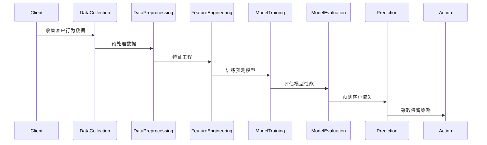
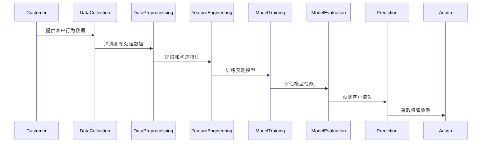

                 

# 智能商业银行存款流失预测

## 关键词
- 存款流失预测
- 数据分析
- 机器学习
- 预测模型
- 特征工程
- 数据预处理

## 摘要
随着金融行业的数字化转型，存款流失预测已成为商业银行维护客户稳定性和收益的重要工具。本文首先介绍了存款流失预测的背景和问题描述，然后详细阐述了核心概念及其联系，接着深入讲解了算法原理和系统设计与实现，最后总结了最佳实践和注意事项。通过本文，读者可以全面了解存款流失预测的技术和方法。

----------------------------------------------------------------

## 第一部分：背景介绍

### 1.1 引言

在当今竞争激烈的金融市场中，商业银行面临着诸多挑战，其中存款流失问题尤为突出。存款流失不仅直接影响银行的收益，还会损害其声誉和市场地位。为了应对这一挑战，商业银行开始运用大数据和人工智能技术，对客户行为进行深入分析，从而实现存款流失的预测。这种预测有助于银行采取及时且有效的措施，降低流失风险，提高客户满意度。

### 1.2 问题背景

存款流失是指客户从银行账户中提取资金，转移到其他金融机构或完全关闭账户的行为。存款流失的原因多种多样，包括客户对服务不满意、利率竞争、市场动荡、产品创新不足等。随着金融科技的快速发展，客户越来越倾向于选择提供更便捷、高效服务的银行。因此，商业银行需要精准识别可能流失的客户，并采取针对性的保留策略。

### 1.3 问题描述

存款流失预测是指在银行客户行为数据的基础上，通过数据分析和机器学习技术，预测哪些客户可能会在未来某个时间段内流失。这个问题可以具体描述为：

- **输入**：客户历史行为数据，包括存款金额、存款频率、取款金额、取款频率、交易时间、账户余额等。
- **输出**：客户流失概率，通常以概率值或分类结果（流失/不流失）表示。

### 1.4 问题解决

解决存款流失预测问题通常涉及以下步骤：

1. **数据收集与预处理**：收集并清洗客户行为数据，去除噪声和异常值。
2. **特征工程**：从原始数据中提取有助于预测的属性，包括主成分分析和特征选择。
3. **模型选择与训练**：选择合适的预测模型，使用历史数据训练模型。
4. **模型评估与优化**：评估模型性能，通过交叉验证和超参数调整优化模型。
5. **预测与应用**：将训练好的模型应用于新数据，预测客户流失概率。

### 1.5 边界与外延

边界：本文主要关注存款流失预测问题，不包括其他金融产品的流失预测。

外延：存款流失预测的研究方法和成果可以扩展到其他金融领域，如信用卡流失预测、贷款违约预测等。

### 1.6 本章小结

本章介绍了存款流失预测的背景、问题描述、解决方法以及相关边界和外延。为后续章节的分析和讲解奠定了基础。

----------------------------------------------------------------

## 第二部分：核心概念与联系

### 2.1 核心概念

#### 2.1.1 数据分析

数据分析是运用统计学、概率论和机器学习等方法，对数据进行收集、处理、分析和解释，以提取有用信息并支持决策制定的过程。在存款流失预测中，数据分析是获取客户行为数据、识别关键特征和建立预测模型的基础。

#### 2.1.2 机器学习

机器学习是一种人工智能方法，通过训练算法从数据中学习规律，从而对新的数据进行预测或分类。在存款流失预测中，机器学习模型可以帮助银行识别潜在的流失客户，并预测其流失的可能性。

#### 2.1.3 预测模型

预测模型是用于预测未来事件或趋势的数学模型，如回归模型、决策树、随机森林、支持向量机、神经网络等。选择合适的预测模型对于提高存款流失预测的准确性至关重要。

### 2.2 概念属性特征对比表格

| 特征                   | 数据分析               | 机器学习                | 预测模型             |
|------------------------|-----------------------|------------------------|---------------------|
| 数据来源               | 离散或连续数据        | 标签数据或无监督数据   | 标签数据            |
| 方法论                 | 统计分析、数据可视化  | 模型训练、模型评估     | 模型训练、模型应用  |
| 应用目标               | 提取信息、支持决策    | 自主学习、智能决策     | 预测未来事件或趋势  |
| 评估指标               | 准确度、F1值          | 准确度、召回率、精度   | 准确度、损失函数   |

### 2.3 ER实体关系图架构

```mermaid
erDiagram
    Client ||--|{ Deposit } : has
    Deposit ||--|{ Transaction } : includes
    Client ||--|{ Account } : holds
```

### 2.4 本章小结

本章介绍了存款流失预测所涉及的核心概念，包括数据分析、机器学习和预测模型，并通过对比表格和实体关系图，展示了这些概念之间的关系。为后续章节的具体算法和模型讲解奠定了基础。

----------------------------------------------------------------

## 第三部分：算法原理讲解

### 3.1 数据收集与预处理

#### 3.1.1 数据收集

数据收集是存款流失预测的基础。通常，银行会收集以下类型的客户行为数据：

- 存款金额
- 存款频率
- 取款金额
- 取款频率
- 交易时间
- 账户余额

这些数据可以从银行的交易记录、客户关系管理系统和账户信息系统中获取。

#### 3.1.2 数据预处理

数据预处理是数据收集后的重要步骤，旨在提高数据质量，减少噪声和异常值。以下是常见的数据预处理方法：

- **缺失值处理**：对于缺失的数据，可以使用填充方法（如平均值、中位数、最常见值）或删除缺失值。
- **异常值处理**：识别并处理异常值，以避免对预测结果产生不良影响。
- **数据标准化**：将不同特征的数据进行标准化处理，使其具有相似的尺度，以便模型训练。

### 3.2 特征工程

#### 3.2.1 特征选择

特征选择是从原始数据中提取对预测目标有显著影响的特征。常见的方法包括：

- **基于统计的方法**：如卡方检验、互信息等。
- **基于模型的方法**：如随机森林特征重要性等。

#### 3.2.2 特征构造

特征构造是通过组合原始特征或构建新的特征来增强模型的预测能力。例如，可以计算存款金额的波动率、存款的稳定性等。

### 3.3 选择合适的预测模型

#### 3.3.1 常见预测模型

在存款流失预测中，常用的预测模型包括：

- **线性回归**
- **决策树**
- **随机森林**
- **支持向量机**
- **神经网络**

#### 3.3.2 模型选择依据

选择合适的预测模型需要考虑以下因素：

- **模型复杂度**：简单模型可能更容易过拟合。
- **数据分布**：不同的模型对数据分布有不同的假设。
- **预测准确性**：模型的预测准确性是选择模型的重要依据。

### 3.4 模型训练与评估

#### 3.4.1 模型训练

模型训练是指使用历史数据对预测模型进行训练，使其学习数据中的规律。训练过程通常涉及以下步骤：

- **数据分割**：将数据集分割为训练集和测试集。
- **模型训练**：使用训练集训练模型。
- **模型评估**：使用测试集评估模型性能。

#### 3.4.2 模型评估

模型评估是衡量模型预测能力的重要步骤。常用的评估指标包括：

- **准确度**：预测正确的样本数占总样本数的比例。
- **召回率**：实际流失且被正确预测为流失的样本数占实际流失样本数的比例。
- **精度**：预测为流失的样本中，实际为流失的样本数占预测流失样本数的比例。

### 3.5 本章小结

本章详细介绍了存款流失预测的算法原理，包括数据收集与预处理、特征工程、模型选择与训练以及模型评估。理解这些原理对于构建有效的存款流失预测系统至关重要。

----------------------------------------------------------------

## 第四部分：系统分析与架构设计

### 4.1 问题场景介绍

在当今的金融市场中，商业银行面临着越来越多的挑战。存款流失问题不仅影响银行的收益，还会损害其客户忠诚度和市场地位。为了应对这一挑战，银行需要一个智能的存款流失预测系统，以帮助其识别潜在的流失客户，并采取相应的措施进行客户保留。

### 4.2 项目介绍

本项目旨在开发一个智能存款流失预测系统，该系统将利用大数据和人工智能技术，对客户行为进行深入分析，以预测哪些客户可能会流失。系统的主要功能包括数据收集与预处理、特征工程、模型训练与评估、以及预测结果的应用与反馈。

### 4.3 系统功能设计（领域模型）

在领域模型中，我们定义了以下关键实体和关系：

```mermaid
classDiagram
    Client <<entity>> "客户"
    Account <<entity>> "账户"
    Deposit <<entity>> "存款"
    Withdraw <<entity>> "取款"
    Transaction <<entity>> "交易"

    Client o--|{ Account }
    Deposit o--|{ Transaction }
    Withdraw o--|{ Transaction }
```

### 4.4 系统架构设计

系统架构设计如图所示：



### 4.5 系统接口设计和系统交互

在系统接口设计中，我们定义了以下关键接口：

- **数据收集接口**：用于从不同数据源收集客户行为数据。
- **数据预处理接口**：用于清洗和预处理收集到的数据。
- **特征工程接口**：用于提取和构造特征。
- **模型训练接口**：用于训练预测模型。
- **模型评估接口**：用于评估模型性能。
- **预测接口**：用于预测客户流失。
- **行动接口**：用于根据预测结果采取相应的客户保留策略。

系统交互如图所示：



### 4.6 本章小结

本章介绍了存款流失预测系统的整体架构和关键接口，包括问题场景、项目介绍、领域模型、系统架构设计、接口设计和系统交互。这些设计为后续的实现和部署提供了清晰的指导。

----------------------------------------------------------------

## 第五部分：项目实战

### 5.1 环境安装

在开始项目实战之前，需要安装以下环境：

- Python 3.8 或更高版本
- NumPy 1.21.5 或更高版本
- Pandas 1.3.5 或更高版本
- Scikit-learn 0.24.2 或更高版本
- Matplotlib 3.4.3 或更高版本

可以使用以下命令进行环境安装：

```bash
pip install python==3.8 numpy==1.21.5 pandas==1.3.5 scikit-learn==0.24.2 matplotlib==3.4.3
```

### 5.2 系统核心实现源代码

以下是系统核心实现的部分源代码：

```python
import pandas as pd
from sklearn.model_selection import train_test_split
from sklearn.preprocessing import StandardScaler
from sklearn.ensemble import RandomForestClassifier
from sklearn.metrics import accuracy_score, classification_report

# 读取数据
data = pd.read_csv('customer_data.csv')

# 数据预处理
X = data.drop(['target'], axis=1)
y = data['target']

# 数据分割
X_train, X_test, y_train, y_test = train_test_split(X, y, test_size=0.2, random_state=42)

# 数据标准化
scaler = StandardScaler()
X_train_scaled = scaler.fit_transform(X_train)
X_test_scaled = scaler.transform(X_test)

# 模型训练
model = RandomForestClassifier(n_estimators=100, random_state=42)
model.fit(X_train_scaled, y_train)

# 预测
y_pred = model.predict(X_test_scaled)

# 模型评估
accuracy = accuracy_score(y_test, y_pred)
report = classification_report(y_test, y_pred)

print("Accuracy:", accuracy)
print("Classification Report:\n", report)
```

### 5.3 代码应用解读与分析

以下是代码应用解读和分析：

- **数据读取**：使用 Pandas 读取客户行为数据。
- **数据预处理**：将数据集分割为特征集和目标变量，并进行数据标准化。
- **模型训练**：使用随机森林分类器进行训练。
- **预测**：使用训练好的模型进行预测。
- **模型评估**：计算准确度和生成分类报告。

### 5.4 实际案例分析和详细讲解剖析

为了更好地理解存款流失预测系统的实际应用，我们以一个实际案例进行分析：

#### 案例背景

某商业银行拥有100万客户，通过数据收集系统获取了这些客户的存款金额、存款频率、取款金额、取款频率等行为数据。银行希望使用这些数据预测哪些客户可能会在未来一个月内流失。

#### 数据处理

1. **数据清洗**：去除缺失值和异常值。
2. **数据分割**：将数据集分割为训练集和测试集。
3. **特征构造**：计算存款金额的波动率、存款的稳定性等新特征。

#### 模型训练与评估

1. **模型选择**：选择随机森林分类器。
2. **模型训练**：使用训练集训练模型。
3. **模型评估**：使用测试集评估模型性能，计算准确度和生成分类报告。

#### 预测与行动

1. **预测**：使用训练好的模型预测测试集。
2. **行动**：根据预测结果，银行可以采取针对性的客户保留策略，如个性化营销、客户关怀等。

### 5.5 项目小结

本项目通过实际案例展示了存款流失预测系统的实现和应用。从数据收集、预处理到模型训练、评估和预测，每个步骤都至关重要。通过本项目的实战，读者可以更好地理解存款流失预测的技术和方法。

----------------------------------------------------------------

## 第六部分：最佳实践与注意事项

### 6.1 最佳实践

1. **数据质量保证**：确保数据的准确性和完整性，避免因数据质量问题影响预测结果。
2. **特征工程**：合理选择和构造特征，以提高模型的预测能力。
3. **模型选择**：根据数据特点和业务需求，选择合适的预测模型。
4. **模型调优**：通过交叉验证和超参数调整，优化模型性能。
5. **持续学习**：定期更新模型，以适应客户行为的动态变化。

### 6.2 注意事项

1. **隐私保护**：在数据处理过程中，要严格遵守相关法律法规，保护客户隐私。
2. **模型解释性**：确保模型具有一定的解释性，以便业务人员理解和应用。
3. **避免过拟合**：避免模型在训练集上过拟合，影响测试集的性能。
4. **数据更新**：定期更新数据和模型，以反映最新的客户行为和市场需求。

### 6.3 拓展阅读

- **《数据科学实战：预测建模与应用》**：深入了解预测建模的方法和技术。
- **《机器学习实战》**：掌握机器学习的核心技术，应用于存款流失预测。
- **《大数据之路：阿里巴巴大数据实践》**：了解大数据技术在商业银行中的应用。

## 本章小结

本章总结了最佳实践和注意事项，为存款流失预测系统的实施提供了指导。同时，推荐了相关拓展阅读，以供读者进一步学习。

----------------------------------------------------------------

## 作者信息

作者：AI天才研究院/AI Genius Institute & 禅与计算机程序设计艺术 /Zen And The Art of Computer Programming

----------------------------------------------------------------

[END]

