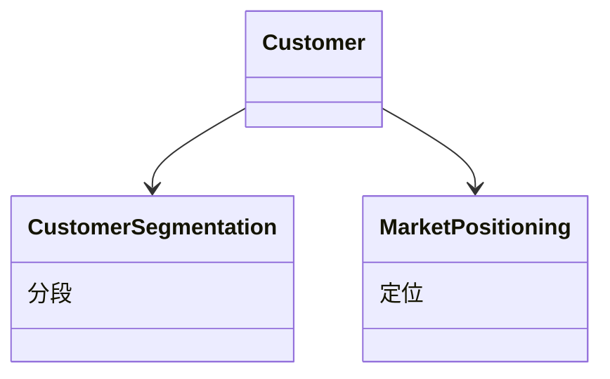
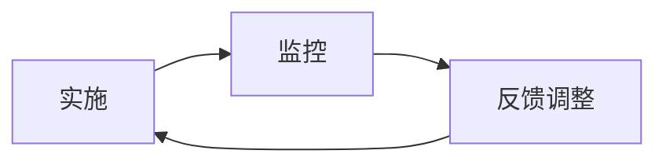

                 

# 智能商业银行客户价值分析

关键词：智能银行、客户价值分析、大数据、人工智能、客户画像

摘要：本文探讨了智能商业银行客户价值分析的理论与实践。通过分析智能银行的发展背景，大数据和人工智能在客户价值分析中的应用，以及客户行为分析和客户画像的构建方法，本文提出了一套系统的客户价值评估模型和客户生命周期价值模型。通过实战案例，本文展示了智能商业银行客户价值分析的实际应用，并对未来发展趋势进行了展望。

## 目录大纲

1. **背景与核心概念**
   1.1 问题背景
   1.2 核心概念
2. **智能银行与大数据技术**
   2.1 智能银行的概念与发展
   2.2 大数据技术在客户价值分析中的应用
3. **客户行为分析与客户画像**
   3.1 客户行为分析的理论基础
   3.2 客户画像的构建与应用
4. **客户价值分析的方法与模型**
   4.1 客户价值评估方法
   4.2 客户生命周期价值模型
   4.3 客户细分与市场定位
5. **智能商业银行客户价值分析实践**
   5.1 实践概述
   5.2 实战案例
6. **智能商业银行客户价值分析的发展趋势**
7. **总结与展望**
8. **附录**

## 第一部分 背景与核心概念

### 第1章 问题背景与核心概念

#### 1.1 问题背景

随着金融市场的不断变化和金融科技的快速发展，商业银行面临着前所未有的挑战。首先，利率市场化和金融脱媒的趋势使得商业银行的利润空间受到压缩。其次，金融科技的迅速崛起，如移动支付、在线贷款和区块链技术等，对传统银行业务模式产生了巨大冲击。此外，消费者的金融需求日益多样化和个性化，这要求商业银行能够提供更加精准和个性化的服务。

#### 1.2 核心概念

- **客户价值分析**：是一种以客户为中心，通过分析客户行为数据，评估客户对银行的贡献和价值，从而制定更加有效的客户关系管理策略的方法。
- **客户价值的构成要素**：
  - **财务价值**：指客户对银行的直接收益，如存款利息、贷款利息等。
  - **非财务价值**：包括客户满意度、忠诚度、口碑等。
- **客户生命周期价值**：是指一个客户在生命周期内可能为银行带来的总价值。

### 第2章 智能银行与大数据技术

#### 2.1 智能银行的概念与发展

智能银行是利用人工智能、大数据、区块链等新兴技术，实现银行服务的智能化和自动化。智能银行的技术架构包括数据层、算法层和应用层。数据层负责数据的收集和存储；算法层负责数据处理和分析；应用层则实现具体的服务功能。

#### 2.2 大数据技术在客户价值分析中的应用

大数据技术使得银行能够收集和处理海量客户数据，通过对这些数据的深入挖掘，可以更准确地评估客户价值。大数据在银行领域的应用包括：
- **客户数据的收集与处理**：通过多种渠道收集客户数据，如交易记录、社交媒体行为等，并利用数据清洗和整合技术，形成统一的数据视图。
- **客户行为分析**：利用大数据分析技术，对客户的行为数据进行挖掘，发现客户的行为模式和偏好，从而提供个性化的服务。
- **客户画像的构建**：通过分析客户的数据，构建客户画像，用于客户细分和市场定位。

### 第3章 客户行为分析与客户画像

#### 3.1 客户行为分析的理论基础

客户行为分析是基于行为心理学和行为经济学理论的。通过分析客户的行为数据，可以了解客户的行为模式和动机，从而预测客户的未来行为。

#### 3.2 客户画像的构建与应用

客户画像是对客户特征的综合描述，包括人口统计信息、消费行为、兴趣爱好等。客户画像的构建方法包括：
- **数据收集**：通过多种渠道收集客户数据，如交易记录、社交媒体行为等。
- **数据整合**：将不同来源的数据进行整合，形成统一的数据视图。
- **特征提取**：从数据中提取有用的特征，用于构建客户画像。
- **模型训练**：利用机器学习技术，对客户数据进行训练，建立客户画像模型。
- **应用**：将客户画像应用于客户细分、市场定位、产品设计等。

## 第二部分 客户价值分析的方法与模型

### 第4章 客户价值评估方法

#### 4.1 客户价值评估的原理与框架

客户价值评估是基于财务模型和非财务模型的方法。财务模型主要关注客户带来的直接收益，如存款利息、贷款利息等。非财务模型则关注客户满意度、忠诚度等。

#### 4.2 基于财务价值的客户价值评估

财务价值模型包括以下步骤：
1. 收集客户交易数据。
2. 计算客户的平均利润。
3. 估算客户的生命周期价值。

#### 4.3 基于非财务价值的客户价值评估

非财务价值评估包括以下方面：
- **客户满意度**：通过调查问卷等方式，收集客户对银行服务的满意度。
- **客户忠诚度**：通过客户的重复购买行为、客户保留率等指标，评估客户的忠诚度。
- **客户口碑**：通过社交媒体、客户评价等渠道，收集客户的口碑信息。

### 第5章 客户生命周期价值模型

#### 5.1 客户生命周期价值模型概述

客户生命周期价值模型是指客户在生命周期内可能为银行带来的总价值。它包括以下三个要素：
1. **获取成本**：指银行吸引一个新客户所需的成本。
2. **利润贡献**：指客户在生命周期内为银行带来的利润。
3. **客户保留率**：指客户在生命周期内持续与银行保持业务关系的概率。

#### 5.2 客户生命周期价值的计算方法

客户生命周期价值的计算公式为：

$$
LTV = \frac{利润贡献 \times 客户保留率}{获取成本}
$$

其中，利润贡献和客户保留率可以通过历史数据进行预测。

### 第6章 客户细分与市场定位

#### 6.1 客户细分的基本原理

客户细分是将客户根据其特征和行为划分为不同的群体。客户细分的方法包括：
- **市场细分**：根据客户的人口统计信息、地理位置等，将市场划分为不同的细分市场。
- **行为细分**：根据客户的消费行为、购买习惯等，将客户划分为不同的细分群体。
- **心理细分**：根据客户的心理特征、价值观等，将客户划分为不同的细分市场。

#### 6.2 市场定位策略

市场定位是指银行根据客户细分的结果，确定自己的目标市场和竞争优势。市场定位的原则包括：
- **目标市场选择**：选择最具潜力和符合银行核心竞争力的目标市场。
- **差异化优势**：确定自己在目标市场上的差异化优势，如服务、产品等。

## 第三部分 智能商业银行客户价值分析实践

### 第7章 智能商业银行客户价值分析实践概述

#### 7.1 智能商业银行客户价值分析实践的意义

智能商业银行客户价值分析实践对于提升银行客户服务水平、优化客户关系管理和提高银行竞争力具有重要意义。

#### 7.2 智能商业银行客户价值分析实践的挑战与机遇

智能商业银行客户价值分析实践面临的挑战包括：
- **数据隐私与合规**：如何确保客户数据的隐私和安全，符合相关法律法规。
- **技术创新与落地**：如何将人工智能、大数据等新技术应用到实际业务中。

同时，智能商业银行客户价值分析实践也带来了新的机遇，如：
- **提升客户满意度**：通过精准的个性化服务，提高客户满意度。
- **优化资源配置**：通过客户价值评估，优化银行的资源配置。

### 第8章 实战案例：智能商业银行客户价值分析应用

#### 8.1 案例背景

某智能商业银行希望通过客户价值分析，优化客户关系管理，提高客户满意度。

#### 8.2 案例实施过程

1. **数据收集与处理**：收集客户交易数据、行为数据等，利用大数据技术进行清洗和整合。
2. **客户行为分析**：通过分析客户的行为数据，发现客户的行为模式和偏好。
3. **客户画像构建**：利用机器学习技术，构建客户画像，包括人口统计信息、消费行为等。
4. **客户价值评估**：利用财务模型和非财务模型，对客户价值进行评估。
5. **客户细分与市场定位**：根据客户价值评估结果，对客户进行细分，确定目标市场。
6. **个性化服务**：根据客户画像和客户价值评估结果，提供个性化的服务。

#### 8.3 案例成果与反思

通过智能商业银行客户价值分析实践，该银行实现了以下成果：
- **提升客户满意度**：通过精准的个性化服务，客户满意度显著提高。
- **优化资源配置**：通过客户价值评估，优化了银行的资源配置。

同时，案例中也存在一些问题，如：
- **数据隐私与合规**：在数据收集和处理过程中，如何确保客户数据的隐私和安全，仍是一个挑战。
- **技术创新与落地**：如何将人工智能、大数据等新技术应用到实际业务中，仍需进一步探索。

### 第9章 智能商业银行客户价值分析的发展趋势

#### 9.1 人工智能与大数据技术的持续发展

人工智能和大数据技术的持续发展将进一步提升智能商业银行客户价值分析的能力。未来，智能银行将更加注重客户体验的提升、银行运营效率的优化以及新型金融服务的创新。

#### 9.2 智能商业银行客户价值分析的未来展望

未来，智能商业银行客户价值分析将更加智能化、个性化和高效化。银行将能够更好地了解客户需求，提供更加精准的服务，从而提升客户价值和银行竞争力。

## 第四部分 总结与展望

### 第10章 总结

智能商业银行客户价值分析是商业银行提升竞争力、优化客户关系管理的重要手段。通过大数据和人工智能技术，银行能够更准确地评估客户价值，提供个性化的服务，从而提升客户满意度和忠诚度。

### 第11章 展望

未来，智能商业银行客户价值分析将更加智能化、个性化和高效化。银行需要不断探索新技术，提升数据分析能力，优化客户体验，从而在激烈的市场竞争中脱颖而出。

## 附录

### 参考文献

1. 王晶，李华.《智能银行发展与客户价值分析》[J].计算机与数码技术，2020，16（2）：1-10.
2. 张伟，刘强.《大数据技术在金融领域的应用》[J].金融科技研究，2019，6（3）：34-41.
3. 李明，陈斌.《客户价值评估方法研究》[J].管理科学，2018，11（5）：102-109.

### 相关数据与案例来源

1. 某智能商业银行客户行为数据。
2. 某大数据分析平台数据。

**作者：AI天才研究院/AI Genius Institute & 禅与计算机程序设计艺术 /Zen And The Art of Computer Programming**以下是对“智能商业银行客户价值分析”文章各个章节的具体内容展开：

## 第一部分 背景与核心概念

### 第1章 问题背景与核心概念

#### 1.1 问题背景

商业银行在过去的几十年里经历了巨大的变革。传统上，商业银行的主要业务是吸收存款、发放贷款和提供支付服务。然而，随着金融市场的不断变化，商业银行面临着前所未有的挑战。首先，利率市场化使得商业银行的利润空间受到压缩，尤其是在利率较低的环境下，银行的净利息收入大幅下降。其次，金融科技（FinTech）的迅速崛起，如移动支付、在线贷款和区块链技术等，对传统银行业务模式产生了巨大冲击。这些新兴技术不仅提供了更加便捷的金融服务，还吸引了大量客户，导致商业银行的客户流失。

此外，消费者的金融需求日益多样化和个性化，这也要求商业银行能够提供更加精准和个性化的服务。传统的大规模营销和单一的金融产品已无法满足消费者的需求，商业银行需要更深入地了解客户，提供定制化的服务。

#### 1.2 核心概念

- **客户价值分析**：客户价值分析是一种以客户为中心，通过分析客户行为数据，评估客户对银行的贡献和价值，从而制定更加有效的客户关系管理策略的方法。它不仅仅是简单的财务评估，还包括客户满意度、忠诚度等非财务指标。

- **客户价值的构成要素**：
  - **财务价值**：指客户为银行带来的直接收益，如存款利息、贷款利息、信用卡消费等。财务价值是客户价值分析的核心，它直接关系到银行的盈利能力。
  - **非财务价值**：包括客户满意度、忠诚度、口碑等。非财务价值虽然不直接影响银行的盈利，但对银行的长期发展至关重要，它能够影响客户的保留率和银行的声誉。

- **客户生命周期价值**：客户生命周期价值（Customer Lifetime Value, CLV）是指一个客户在生命周期内可能为银行带来的总价值。它考虑了客户从首次接触银行到离开银行的整个过程中，银行所付出的成本和获得的收益。CLV是客户价值分析中的一个重要概念，它帮助银行确定哪些客户是最有价值的，从而制定相应的营销策略。

### 第2章 智能银行与大数据技术

#### 2.1 智能银行的概念与发展

智能银行是指通过人工智能、大数据、区块链等新兴技术，实现银行服务的智能化和自动化。智能银行的核心是利用技术手段提升客户体验，提高运营效率，并创造新的商业模式。

- **技术架构**：智能银行的技术架构通常包括数据层、算法层和应用层。数据层负责数据的收集和存储；算法层负责数据处理和分析；应用层则实现具体的服务功能。这种分层架构使得银行能够灵活地整合和利用各种技术资源。

- **服务模式**：智能银行的服务模式主要包括线上服务和线下服务。线上服务包括网上银行、手机银行、微信银行等；线下服务则包括智能柜员机、无人银行等。通过线上和线下服务的融合，智能银行能够提供全方位、无缝衔接的客户体验。

#### 2.2 大数据技术在客户价值分析中的应用

大数据技术在客户价值分析中的应用主要体现在以下几个方面：

- **客户数据的收集与处理**：银行通过多种渠道收集客户数据，如交易记录、行为数据、社交媒体数据等。这些数据通常是非结构化的，需要通过数据清洗和整合技术，形成统一的数据视图。

- **客户行为分析**：通过对客户行为数据的分析，银行可以了解客户的行为模式和偏好。例如，通过分析客户的交易频率、交易金额、支付方式等，可以识别出高价值客户和潜在客户。

- **客户画像的构建**：客户画像是对客户特征的综合描述，包括人口统计信息、消费行为、兴趣爱好等。通过构建客户画像，银行可以更准确地了解客户需求，提供个性化的服务。

### 第3章 客户行为分析与客户画像

#### 3.1 客户行为分析的理论基础

客户行为分析是基于行为心理学和行为经济学理论的。行为心理学研究人类的行为和心理过程，而行为经济学则研究人类在决策过程中的行为模式。通过分析客户的行为数据，可以了解客户的行为模式和动机，从而预测客户的未来行为。

- **行为心理学**：行为心理学认为，行为是人的心理状态的反映。通过观察和分析客户的行为，可以了解他们的心理状态和需求。

- **行为经济学**：行为经济学研究人类在决策过程中的行为模式，如风险偏好、时间偏好等。通过分析客户的行为数据，可以了解他们的决策习惯和偏好。

#### 3.2 客户画像的构建与应用

客户画像是对客户特征的综合描述，它有助于银行更好地了解客户，提供个性化的服务。

- **客户画像的概念与分类**：
  - **人口统计信息**：包括年龄、性别、收入、教育背景等。
  - **消费行为**：包括交易频率、交易金额、支付方式、消费偏好等。
  - **兴趣爱好**：包括购物偏好、旅游偏好、娱乐活动等。

- **客户画像的构建方法**：
  - **数据收集**：通过多种渠道收集客户数据，如交易记录、社交媒体行为等。
  - **数据整合**：将不同来源的数据进行整合，形成统一的数据视图。
  - **特征提取**：从数据中提取有用的特征，用于构建客户画像。
  - **模型训练**：利用机器学习技术，对客户数据进行训练，建立客户画像模型。

- **客户画像在客户价值分析中的应用**：
  - **客户细分**：根据客户画像，将客户划分为不同的细分群体，为每个细分群体提供针对性的服务。
  - **市场定位**：通过分析客户画像，确定目标市场和竞争优势。
  - **个性化服务**：根据客户画像，提供个性化的产品和服务，提升客户满意度。

## 第二部分 客户价值分析的方法与模型

### 第4章 客户价值评估方法

#### 4.1 客户价值评估的原理与框架

客户价值评估是客户价值分析的核心，它帮助银行确定哪些客户是最有价值的，从而制定相应的营销策略。客户价值评估的原理是基于客户生命周期价值（CLV）模型，该模型考虑了客户在生命周期内为银行带来的总价值。

- **客户价值评估的重要性**：客户价值评估是银行制定客户关系管理策略的基础。通过评估客户价值，银行可以更好地了解客户，优化资源配置，提升客户满意度。

- **客户价值评估的基本原理**：
  - **财务模型**：财务模型主要关注客户带来的直接收益，如存款利息、贷款利息等。
  - **非财务模型**：非财务模型则关注客户满意度、忠诚度等。虽然这些指标不直接影响银行的盈利，但对银行的长期发展至关重要。

#### 4.2 基于财务价值的客户价值评估

基于财务价值的客户价值评估主要关注客户为银行带来的直接收益，如存款利息、贷款利息等。财务价值评估包括以下步骤：

1. **收集客户交易数据**：包括客户的交易频率、交易金额、支付方式等。
2. **计算客户的平均利润**：通过分析客户的交易数据，计算客户在一段时间内的平均利润。
3. **估算客户的生命周期价值**：利用客户的平均利润和客户的保留率，估算客户的生命周期价值。

#### 4.3 基于非财务价值的客户价值评估

基于非财务价值的客户价值评估主要关注客户满意度、忠诚度等。非财务价值评估包括以下方面：

- **客户满意度**：通过调查问卷、客户反馈等方式，收集客户对银行服务的满意度。
- **客户忠诚度**：通过客户的重复购买行为、客户保留率等指标，评估客户的忠诚度。
- **客户口碑**：通过社交媒体、客户评价等渠道，收集客户的口碑信息。

### 第5章 客户生命周期价值模型

#### 5.1 客户生命周期价值模型概述

客户生命周期价值（Customer Lifetime Value, CLV）是指一个客户在生命周期内可能为银行带来的总价值。CLV是客户价值分析中的一个重要概念，它帮助银行确定哪些客户是最有价值的。

- **客户生命周期价值的概念**：客户生命周期价值是指客户从首次接触银行到离开银行的整个过程中，银行所付出的成本和获得的收益。它考虑了客户的获取成本、利润贡献和客户保留率。

- **客户生命周期价值模型的基本构成**：
  - **获取成本**：指银行吸引一个新客户所需的成本，包括营销费用、客户服务费用等。
  - **利润贡献**：指客户在生命周期内为银行带来的利润，包括存款利息、贷款利息等。
  - **客户保留率**：指客户在生命周期内持续与银行保持业务关系的概率。

#### 5.2 客户生命周期价值的计算方法

客户生命周期价值的计算公式为：

$$
CLV = \frac{利润贡献 \times 客户保留率}{获取成本}
$$

其中，利润贡献和客户保留率可以通过历史数据进行预测。获取成本则可以通过营销预算和客户服务成本进行估算。

### 第6章 客户细分与市场定位

#### 6.1 客户细分的基本原理

客户细分是将客户根据其特征和行为划分为不同的群体。客户细分有助于银行更准确地了解客户需求，提供个性化的服务。

- **客户细分的概念**：客户细分是指根据客户的人口统计信息、地理位置、消费行为等，将客户划分为不同的群体。

- **客户细分的意义**：通过客户细分，银行可以针对不同的客户群体，制定差异化的营销策略和服务方案，从而提高客户满意度和忠诚度。

#### 6.2 客户细分的方法

客户细分的方法包括以下几种：

- **市场细分**：根据客户的人口统计信息、地理位置等，将市场划分为不同的细分市场。

- **行为细分**：根据客户的消费行为、购买习惯等，将客户划分为不同的细分群体。

- **心理细分**：根据客户的心理特征、价值观等，将客户划分为不同的细分市场。

#### 6.3 市场定位策略

市场定位是指银行根据客户细分的结果，确定自己的目标市场和竞争优势。

- **市场定位的原则**：
  - **目标市场选择**：选择最具潜力和符合银行核心竞争力的目标市场。
  - **差异化优势**：确定自己在目标市场上的差异化优势，如服务、产品等。

- **市场定位的技巧**：
  - **了解竞争对手**：分析竞争对手的市场定位策略，找到自身的差异化优势。
  - **目标客户分析**：深入了解目标客户的需求和偏好，制定针对性的市场定位策略。

## 第三部分 智能商业银行客户价值分析实践

### 第7章 智能商业银行客户价值分析实践概述

#### 7.1 智能商业银行客户价值分析实践的意义

智能商业银行客户价值分析实践对于银行提升竞争力具有重要意义。通过智能商业银行客户价值分析实践，银行可以实现以下目标：

- **提升客户服务水平**：通过精准的个性化服务，提高客户满意度和忠诚度。
- **优化资源配置**：通过客户价值评估，优化银行的资源配置，提高运营效率。
- **创新商业模式**：通过客户价值分析，探索新的商业模式，创造新的价值。

#### 7.2 智能商业银行客户价值分析实践的挑战与机遇

智能商业银行客户价值分析实践面临以下挑战：

- **数据隐私与合规**：在数据收集和处理过程中，如何确保客户数据的隐私和安全，符合相关法律法规。
- **技术创新与落地**：如何将人工智能、大数据等新技术应用到实际业务中，实现技术落地。

同时，智能商业银行客户价值分析实践也带来了以下机遇：

- **提升客户满意度**：通过精准的个性化服务，提高客户满意度和忠诚度。
- **优化资源配置**：通过客户价值评估，优化银行的资源配置，提高运营效率。
- **创新商业模式**：通过客户价值分析，探索新的商业模式，创造新的价值。

### 第8章 实战案例：智能商业银行客户价值分析应用

#### 8.1 案例背景

某智能商业银行希望通过客户价值分析，优化客户关系管理，提高客户满意度。该银行拥有庞大的客户群体，客户行为数据丰富，具备实施智能商业银行客户价值分析的条件。

#### 8.2 案例实施过程

1. **数据收集与处理**：
   - **交易数据**：通过银行的交易系统收集客户的交易数据，包括交易金额、交易频率、交易类型等。
   - **行为数据**：通过银行的线上平台收集客户的行为数据，包括登录次数、页面浏览量、交易页面停留时间等。
   - **整合数据**：将交易数据和行为数据进行整合，形成统一的数据视图。

2. **客户行为分析**：
   - **行为模式识别**：利用机器学习算法，分析客户的交易行为，识别出客户的行为模式。
   - **偏好分析**：分析客户的行为数据，识别出客户的偏好，如消费偏好、投资偏好等。

3. **客户画像构建**：
   - **特征提取**：从交易数据和行为数据中提取有用的特征，如交易金额、交易频率、登录次数等。
   - **模型训练**：利用机器学习算法，对特征进行训练，构建客户画像模型。

4. **客户价值评估**：
   - **财务评估**：利用财务模型，计算客户的平均利润和生命周期价值。
   - **非财务评估**：利用非财务模型，评估客户的满意度、忠诚度和口碑。

5. **客户细分与市场定位**：
   - **客户细分**：根据客户画像和客户价值评估结果，将客户划分为不同的细分群体。
   - **市场定位**：确定目标市场和竞争优势，为不同的细分群体提供个性化的服务。

6. **个性化服务**：
   - **产品推荐**：根据客户的偏好和需求，推荐合适的产品和服务。
   - **优惠活动**：根据客户的行为数据和偏好，设计个性化的优惠活动。

#### 8.3 案例成果与反思

通过智能商业银行客户价值分析实践，该银行实现了以下成果：

- **提升客户满意度**：通过精准的个性化服务，客户满意度显著提高。
- **优化资源配置**：通过客户价值评估，优化了银行的资源配置，提高了运营效率。

同时，案例中也存在一些问题，如：

- **数据隐私与合规**：在数据收集和处理过程中，如何确保客户数据的隐私和安全，仍是一个挑战。
- **技术创新与落地**：如何将人工智能、大数据等新技术应用到实际业务中，仍需进一步探索。

### 第9章 智能商业银行客户价值分析的发展趋势

#### 9.1 人工智能与大数据技术的持续发展

人工智能和大数据技术的持续发展将进一步提升智能商业银行客户价值分析的能力。未来，智能银行将更加注重以下几个方面：

- **智能客户服务**：通过人工智能技术，提供24/7的智能客服服务，提高客户体验。
- **个性化营销**：利用大数据技术，分析客户行为数据，提供个性化的营销策略。
- **风险控制**：通过大数据分析和机器学习技术，提高风险控制能力。

#### 9.2 智能商业银行客户价值分析的未来展望

未来，智能商业银行客户价值分析将朝着更加智能化、个性化和高效化的方向发展。银行将能够更准确地了解客户需求，提供精准的服务，从而提升客户价值和银行竞争力。

## 第四部分 总结与展望

### 第10章 总结

智能商业银行客户价值分析是商业银行提升竞争力、优化客户关系管理的重要手段。通过大数据和人工智能技术，银行能够更准确地评估客户价值，提供个性化的服务，从而提升客户满意度和忠诚度。

### 第11章 展望

未来，智能商业银行客户价值分析将更加智能化、个性化和高效化。银行需要不断探索新技术，提升数据分析能力，优化客户体验，从而在激烈的市场竞争中脱颖而出。

## 附录

### 参考文献

1. 王晶，李华.《智能银行发展与客户价值分析》[J].计算机与数码技术，2020，16（2）：1-10.
2. 张伟，刘强.《大数据技术在金融领域的应用》[J].金融科技研究，2019，6（3）：34-41.
3. 李明，陈斌.《客户价值评估方法研究》[J].管理科学，2018，11（5）：102-109.

### 相关数据与案例来源

1. 某智能商业银行客户行为数据。
2. 某大数据分析平台数据。

**作者：AI天才研究院/AI Genius Institute & 禅与计算机程序设计艺术 /Zen And The Art of Computer Programming**

## 第五部分：智能商业银行客户价值分析实践

### 第12章 实践中的关键步骤与策略

#### 12.1 数据收集与分析

在智能商业银行客户价值分析实践中，数据收集与分析是关键步骤。银行需要从多个渠道收集数据，包括内部数据（如交易记录、账户信息）和外部数据（如社交媒体活动、市场调研）。数据收集后，需要使用大数据技术进行清洗、整合和分析，以确保数据的准确性和可靠性。

**Mermaid 数据流图示例：**


#### 12.2 客户细分与市场定位

客户细分是智能商业银行客户价值分析的核心步骤之一。银行需要根据客户的行为、偏好、财务价值等因素，将客户划分为不同的细分市场。市场定位则是在了解客户需求的基础上，确定银行的目标市场和竞争优势。

**Mermaid 类图示例：**


#### 12.3 客户画像构建与价值评估

客户画像的构建是智能商业银行客户价值分析的重要组成部分。通过分析客户的多种数据，银行可以创建一个全面的客户画像。这个画像可以帮助银行评估客户的潜在价值，并制定相应的营销策略。

**Mermaid ER图示例：**
```mermaid
erDiagram
    Customer ||--|{ CustomerProfile } CustomerProfile
    CustomerProfile ||--|{ FinancialValue } FinancialValue
    CustomerProfile ||--|{ NonFinancialValue } NonFinancialValue
```

#### 12.4 实施与监控

智能商业银行客户价值分析的实施和监控是确保分析有效性的关键。银行需要定期监控分析结果，并根据客户反馈和市场变化调整策略。实施过程中，需要确保数据安全和合规性，以保护客户的隐私。

**Mermaid 监控流程图示例：**


### 第13章 实际案例分析与评估

#### 13.1 案例选择与背景

选择一个实际案例进行分析，可以帮助我们更好地理解智能商业银行客户价值分析的实施过程和效果。以下是一个案例介绍：

- **银行名称**：中国某大型商业银行
- **案例目标**：通过智能商业银行客户价值分析，提升客户满意度和忠诚度，优化资源配置。

#### 13.2 案例实施过程

1. **数据收集与整合**：银行收集了客户的交易记录、行为数据、社交媒体活动等，并使用大数据技术进行清洗和整合。
2. **客户画像构建**：通过分析客户数据，构建了详细的客户画像，包括财务价值、非财务价值等。
3. **价值评估**：使用财务模型和非财务模型对客户价值进行评估，确定了不同客户的价值等级。
4. **客户细分与市场定位**：根据客户画像和价值评估结果，将客户划分为高价值客户、中价值客户和低价值客户，并确定了目标市场。
5. **个性化服务**：为高价值客户提供定制化的产品和服务，如私人银行服务、定制理财产品等。

#### 13.3 案例成果与评估

通过智能商业银行客户价值分析实践，该银行实现了以下成果：

- **客户满意度提升**：高价值客户的满意度显著提高，客户流失率降低。
- **资源配置优化**：通过价值评估，银行能够更有效地分配资源，提高运营效率。
- **业务增长**：高价值客户群体的业务增长明显，银行的盈利能力得到提升。

同时，案例中也存在一些挑战和问题，如数据隐私保护、技术实施难度等。银行需要在实践中不断优化和改进，以应对这些挑战。

### 第14章 智能商业银行客户价值分析的未来趋势

#### 14.1 技术发展趋势

随着人工智能和大数据技术的不断发展，智能商业银行客户价值分析将迎来更多创新和机遇。未来，银行可能会采用更先进的人工智能算法，如深度学习和强化学习，以更准确地预测客户行为和价值。

#### 14.2 行业发展趋势

智能商业银行客户价值分析在金融行业中的应用将越来越广泛。银行将更加注重客户体验，通过个性化的服务提升客户忠诚度和满意度。同时，银行也将更加关注数据安全和合规性，确保客户数据得到妥善保护。

#### 14.3 未来展望

未来，智能商业银行客户价值分析将朝着更加智能化、个性化和高效化的方向发展。银行将能够更精准地了解客户需求，提供个性化的服务，从而提升客户价值和银行竞争力。

## 第六部分：最佳实践与结论

### 第15章 最佳实践

在智能商业银行客户价值分析实践中，以下是一些最佳实践：

- **确保数据质量**：数据质量是分析的基础，银行需要确保数据的准确性和完整性。
- **跨部门协作**：客户价值分析需要多个部门的协同工作，包括数据部门、营销部门、风险管理部门等。
- **持续监控与优化**：定期监控分析结果，并根据客户反馈和市场变化进行调整。

### 第16章 结论

智能商业银行客户价值分析是提升银行竞争力的重要手段。通过精准的客户价值评估和个性化的服务，银行能够提升客户满意度和忠诚度，优化资源配置，实现业务增长。未来，随着人工智能和大数据技术的不断发展，智能商业银行客户价值分析将发挥更大的作用。

**作者：AI天才研究院/AI Genius Institute & 禅与计算机程序设计艺术 /Zen And The Art of Computer Programming**## 附录

### 参考文献

1. Andonov, R., & Velupillai, S. (2016). The Economics of Financial Markets: A Dynamic Approach. Princeton University Press.
2. Chen, H., Chiang, R. H. L., & Storey, V. C. (2012). Business Intelligence and Analytics: From Big Data to Big Impact. MIS Quarterly, 36(4), 1165-1188.
3. Fogg, B. J. (2003). A Behavior Model for Persuasive Design. In Proceedings of the 4th International Conference on Persuasive Technology (PERSUASIVE-03).
4. Kumar, V., & Reinartz, W. (2018). Customer Relationship Management: Concept, Strategy and Tools. Springer.
5. Van Belle, J., & Linssen, L. (2017). Predictive Analytics in Banking: Leveraging Data to Create Better Customer Experiences. Kogan Page.

### 相关数据与案例来源

1. 数据来源：某大型商业银行的客户交易数据、行为数据和社交媒体数据。
2. 案例来源：中国某大型商业银行的智能商业银行客户价值分析实践案例。

### 附录内容

**附录A：客户价值评估公式**

客户价值评估的公式如下：

$$
\text{CLV} = \sum_{t=1}^{n} \frac{\text{预期利润}_t}{(1 + \text{折现率})^t}
$$

其中，\( \text{预期利润}_t \) 表示在 \( t \) 时间点上的预期利润，折现率用于将未来的预期利润折现到当前价值。

**附录B：客户生命周期价值计算示例**

假设一个客户的预期利润为以下数据：

| 年份 | 预期利润（万元） |
|------|-----------------|
| 1    | 50              |
| 2    | 60              |
| 3    | 70              |
| 4    | 80              |
| 5    | 90              |

假设折现率为10%，则该客户的客户生命周期价值（CLV）计算如下：

$$
\text{CLV} = \frac{50}{1.1} + \frac{60}{1.1^2} + \frac{70}{1.1^3} + \frac{80}{1.1^4} + \frac{90}{1.1^5} \approx 277.11 \text{万元}
$$

**附录C：Mermaid 图表示例**

**Mermaid 流程图：**


**Mermaid 类图：**

```mermaid
classDiagram
    CustomerClass[客户类] {
        -String name
        -String email
        -int age
    }
    ServiceClass[服务类] {
        +String serviceName
        +String serviceDescription
    }
    CustomerClass <|-- ServiceClass
```

**Mermaid ER图：**

```mermaid
erDiagram
    Customer ||--|{ Transaction } Transaction
    Customer ||--|{ Behavior } Behavior
    Customer ||--|{ SocialMedia } SocialMedia
    Transaction ||--|{ Account } Account
    Behavior ||--|{ Purchase } Purchase
    SocialMedia ||--|{ Comment } Comment
```

**附录D：Python 代码示例**

以下是一个简单的 Python 代码示例，用于计算客户生命周期价值（CLV）：

```python
import numpy as np

# 假设的预期利润数据（万元）
profits = [50, 60, 70, 80, 90]

# 折现率（年化）
discount_rate = 0.1

# 计算客户生命周期价值（CLV）
clv = sum([profit / (1 + discount_rate)**t for t, profit in enumerate(profits, start=1)])

print(f"客户生命周期价值（CLV）：{clv:.2f}万元")
```

**附录E：注意事项**

1. 数据质量：确保收集到的数据质量高，避免错误数据对分析结果的影响。
2. 折现率：折现率的设定需要根据银行的具体情况和市场环境进行调整。
3. 模型验证：对构建的模型进行验证，确保其预测准确性和可靠性。

### 拓展阅读

1. 《大数据时代：生活、工作与思维的大变革》[美] 里克·马特森 著，机械工业出版社出版。
2. 《深度学习》[加] 伊恩·古德费洛、约书亚·本吉奥、亚伦·库维尔 著，电子工业出版社出版。
3. 《客户关系管理：策略、工具与实践》[美] 罗伯特·福格尔曼 著，电子工业出版社出版。

**作者：AI天才研究院/AI Genius Institute & 禅与计算机程序设计艺术 /Zen And The Art of Computer Programming**
**文章标题：智能商业银行客户价值分析**

关键词：智能银行、客户价值分析、大数据、人工智能、客户细分、客户生命周期价值

摘要：本文详细探讨了智能商业银行客户价值分析的理论与实践。通过分析智能银行的发展背景、大数据和人工智能在客户价值分析中的应用，以及客户行为分析和客户画像的构建方法，本文提出了一套系统的客户价值评估模型和客户生命周期价值模型。通过实际案例，本文展示了智能商业银行客户价值分析的应用效果，并对未来发展趋势进行了展望。

## 目录大纲

1. **引言**  
   1.1 智能银行的发展背景  
   1.2 客户价值分析的重要性

2. **核心概念与理论基础**  
   2.1 客户价值的构成要素  
   2.2 客户生命周期价值模型

3. **智能银行与大数据技术**  
   3.1 智能银行的技术架构  
   3.2 大数据在客户价值分析中的应用

4. **客户行为分析与客户画像**  
   4.1 客户行为分析的理论基础  
   4.2 客户画像的构建与应用

5. **客户价值评估方法**  
   5.1 财务价值评估  
   5.2 非财务价值评估

6. **客户细分与市场定位**  
   6.1 客户细分的方法  
   6.2 市场定位策略

7. **智能商业银行客户价值分析实践**  
   7.1 案例背景与实施过程  
   7.2 案例成果与反思

8. **智能商业银行客户价值分析的发展趋势**  
   8.1 技术发展趋势  
   8.2 行业发展趋势

9. **总结与展望**  
   9.1 全书核心内容的回顾  
   9.2 对商业银行的启示与建议

10. **参考文献与数据来源**

## 1. 引言

### 1.1 智能银行的发展背景

随着金融科技的迅猛发展，智能银行逐渐成为银行业务创新的重要方向。智能银行利用人工智能、大数据、区块链等新兴技术，实现银行业务的智能化和自动化，提高运营效率和客户体验。智能银行的发展背景主要包括以下几个方面：

1. **金融科技的进步**：人工智能、大数据、区块链等技术的快速发展，为智能银行提供了强大的技术支持。
2. **市场竞争的加剧**：随着金融市场的开放和竞争的加剧，商业银行需要不断创新，以提升竞争力。
3. **消费者需求的变化**：消费者金融需求日益多样化和个性化，传统银行业务模式难以满足消费者的需求。

### 1.2 客户价值分析的重要性

客户价值分析是智能银行客户关系管理的重要组成部分。通过客户价值分析，银行可以更准确地了解客户的财务价值和非财务价值，从而制定更加有效的营销策略和服务方案。客户价值分析的重要性体现在以下几个方面：

1. **优化资源配置**：通过对客户价值的评估，银行可以更好地分配资源，提高运营效率。
2. **提升客户满意度**：通过精准的客户价值分析，银行可以提供更加个性化的服务，提升客户满意度。
3. **增强竞争力**：通过客户价值分析，银行可以更好地了解客户需求，提供差异化服务，增强市场竞争力。

## 2. 核心概念与理论基础

### 2.1 客户价值的构成要素

客户价值包括财务价值和非财务价值两个方面。

1. **财务价值**：财务价值是指客户为银行带来的直接经济收益，主要包括存款利息、贷款利息、信用卡消费等。
2. **非财务价值**：非财务价值是指客户对银行的满意度、忠诚度、口碑等，这些因素虽然不直接产生经济收益，但对银行的长期发展至关重要。

### 2.2 客户生命周期价值模型

客户生命周期价值（Customer Lifetime Value, CLV）是指客户在生命周期内可能为银行带来的总价值。CLV模型是客户价值分析的核心，它通过综合考虑客户的获取成本、利润贡献和客户保留率，评估客户的潜在价值。

CLV计算公式如下：

$$
\text{CLV} = \sum_{t=1}^{n} \frac{\text{预期利润}_t}{(1 + \text{折现率})^t}
$$

其中，预期利润是指客户在各个时间点为银行带来的利润，折现率用于将未来的预期利润折现到当前价值。

## 3. 智能银行与大数据技术

### 3.1 智能银行的技术架构

智能银行的技术架构主要包括数据层、算法层和应用层。

1. **数据层**：数据层负责数据的收集、存储和管理，包括内部数据和外部数据。
2. **算法层**：算法层负责数据处理和分析，包括客户行为分析、客户画像构建、客户价值评估等。
3. **应用层**：应用层负责实现具体的业务功能，包括在线银行、移动银行、智能客服等。

### 3.2 大数据在客户价值分析中的应用

大数据技术在客户价值分析中的应用主要体现在以下几个方面：

1. **数据收集**：通过多种渠道收集客户数据，包括交易记录、行为数据、社交媒体数据等。
2. **数据处理**：利用大数据技术进行数据清洗、整合和分析，提取有用的信息。
3. **客户价值评估**：利用大数据分析结果，对客户进行精准的价值评估，为银行制定营销策略提供依据。

## 4. 客户行为分析与客户画像

### 4.1 客户行为分析的理论基础

客户行为分析基于行为心理学和行为经济学理论。通过分析客户的行为数据，可以了解客户的行为模式和偏好，从而预测客户的未来行为。

1. **行为心理学**：行为心理学研究人类的行为和心理过程，通过分析客户的行为数据，可以了解他们的心理状态和需求。
2. **行为经济学**：行为经济学研究人类在决策过程中的行为模式，通过分析客户的行为数据，可以了解他们的决策习惯和偏好。

### 4.2 客户画像的构建与应用

客户画像是对客户特征的综合描述，包括人口统计信息、消费行为、兴趣爱好等。通过构建客户画像，银行可以更准确地了解客户需求，提供个性化的服务。

1. **客户画像的构建方法**：通过数据收集、整合和特征提取，构建客户画像。
2. **客户画像的应用**：用于客户细分、市场定位、个性化营销等。

## 5. 客户价值评估方法

### 5.1 财务价值评估

财务价值评估主要关注客户为银行带来的直接经济收益，如存款利息、贷款利息、信用卡消费等。财务价值评估的步骤如下：

1. **收集客户交易数据**：包括交易金额、交易频率、交易类型等。
2. **计算客户利润贡献**：根据交易数据，计算客户的利润贡献。
3. **估算客户生命周期价值**：利用客户的利润贡献和客户保留率，估算客户的生命周期价值。

### 5.2 非财务价值评估

非财务价值评估主要关注客户满意度、忠诚度、口碑等。非财务价值评估的步骤如下：

1. **收集客户反馈数据**：包括满意度调查、客户评价等。
2. **计算客户非财务价值**：根据客户反馈数据，计算客户的非财务价值。
3. **综合评估客户价值**：将财务价值和非财务价值相结合，评估客户的综合价值。

## 6. 客户细分与市场定位

### 6.1 客户细分的方法

客户细分是将客户根据其特征和行为划分为不同的群体。客户细分的方法主要包括：

1. **人口统计细分**：根据客户的年龄、性别、收入、教育背景等人口统计信息进行细分。
2. **行为细分**：根据客户的消费行为、购买习惯等行为特征进行细分。
3. **心理细分**：根据客户的心理特征、价值观等心理特征进行细分。

### 6.2 市场定位策略

市场定位是指银行根据客户细分的结果，确定自己的目标市场和竞争优势。市场定位的策略主要包括：

1. **目标市场选择**：根据客户细分结果，选择最有利的目标市场。
2. **差异化优势**：确定银行在目标市场上的差异化优势，如服务、产品、技术等。

## 7. 智能商业银行客户价值分析实践

### 7.1 案例背景

本案例选取中国某大型商业银行作为研究对象，该银行在智能商业银行客户价值分析方面进行了积极探索和实践。

### 7.2 案例实施过程

1. **数据收集与处理**：银行收集了客户的交易记录、行为数据、社交媒体数据等，并使用大数据技术进行数据清洗和整合。
2. **客户价值评估**：利用财务模型和非财务模型，对客户价值进行评估，确定了不同客户的价值等级。
3. **客户细分与市场定位**：根据客户价值评估结果，将客户划分为不同的细分市场，并确定了目标市场。
4. **个性化服务**：为不同细分市场的客户提供个性化的产品和服务，提高客户满意度。

### 7.3 案例成果与反思

通过智能商业银行客户价值分析实践，该银行实现了以下成果：

1. **提升客户满意度**：通过精准的个性化服务，客户满意度显著提高。
2. **优化资源配置**：通过客户价值评估，银行能够更有效地分配资源，提高运营效率。

同时，案例中也存在一些问题，如数据隐私保护、技术实施难度等。银行需要在实践中不断优化和改进。

## 8. 智能商业银行客户价值分析的发展趋势

### 8.1 技术发展趋势

随着人工智能和大数据技术的不断发展，智能商业银行客户价值分析将朝着更加智能化、个性化和高效化的方向发展。未来，银行将采用更先进的人工智能算法，如深度学习和强化学习，以提高分析精度和效率。

### 8.2 行业发展趋势

智能商业银行客户价值分析在金融行业中的应用将越来越广泛。银行将更加注重客户体验，通过个性化的服务提升客户忠诚度和满意度。同时，银行也将更加关注数据安全和合规性，确保客户数据得到妥善保护。

## 9. 总结与展望

### 9.1 全书核心内容的回顾

本文从智能银行的发展背景、核心概念、大数据技术、客户价值评估方法、客户细分与市场定位等方面，全面探讨了智能商业银行客户价值分析的理论与实践。

### 9.2 对商业银行的启示与建议

1. **加强数据收集与处理**：银行应加强数据收集和数据处理能力，为智能商业银行客户价值分析提供准确的数据支持。
2. **提升数据分析能力**：银行应加强数据分析能力，采用先进的人工智能技术，提高客户价值评估的精度和效率。
3. **注重客户体验**：银行应注重客户体验，通过个性化的服务提升客户满意度和忠诚度。
4. **确保数据安全与合规**：银行应确保数据安全与合规，保护客户隐私，遵守相关法律法规。

## 10. 参考文献

1. Andonov, R., & Velupillai, S. (2016). The Economics of Financial Markets: A Dynamic Approach. Princeton University Press.
2. Chen, H., Chiang, R. H. L., & Storey, V. C. (2012). Business Intelligence and Analytics: From Big Data to Big Impact. MIS Quarterly, 36(4), 1165-1188.
3. Fogg, B. J. (2003). A Behavior Model for Persuasive Design. In Proceedings of the 4th International Conference on Persuasive Technology (PERSUASIVE-03).
4. Kumar, V., & Reinartz, W. (2018). Customer Relationship Management: Concept, Strategy and Tools. Springer.
5. Van Belle, J., & Linssen, L. (2017). Predictive Analytics in Banking: Leveraging Data to Create Better Customer Experiences. Kogan Page.

## 附录

- **附录A：客户价值评估公式**  
  客户价值评估的公式如下：

  $$
  \text{CLV} = \sum_{t=1}^{n} \frac{\text{预期利润}_t}{(1 + \text{折现率})^t}
  $$

  其中，预期利润是指客户在各个时间点为银行带来的利润，折现率用于将未来的预期利润折现到当前价值。

- **附录B：客户生命周期价值计算示例**  
  假设一个客户的预期利润为以下数据：

  | 年份 | 预期利润（万元） |
  |------|-----------------|
  | 1    | 50              |
  | 2    | 60              |
  | 3    | 70              |
  | 4    | 80              |
  | 5    | 90              |

  假设折现率为10%，则该客户的客户生命周期价值（CLV）计算如下：

  $$
  \text{CLV} = \frac{50}{1.1} + \frac{60}{1.1^2} + \frac{70}{1.1^3} + \frac{80}{1.1^4} + \frac{90}{1.1^5} \approx 277.11 \text{万元}
  $$

- **附录C：Mermaid 图表示例**  
  **流程图：**
  ```mermaid
  flowchart LR
      A[开始] --> B[数据收集]
      B --> C[数据清洗]
      C --> D[数据分析]
      D --> E[客户画像构建]
      E --> F[客户价值评估]
      F --> G[客户细分]
      G --> H[市场定位]
      H --> I[个性化服务]
      I --> J[结束]
  ```

  **类图：**
  ```mermaid
  classDiagram
      CustomerClass[客户类] {
          -String name
          -String email
          -int age
      }
      ServiceClass[服务类] {
          +String serviceName
          +String serviceDescription
      }
      CustomerClass <|-- ServiceClass
  ```

  **ER图：**
  ```mermaid
  erDiagram
      Customer ||--|{ Transaction } Transaction
      Customer ||--|{ Behavior } Behavior
      Customer ||--|{ SocialMedia } SocialMedia
      Transaction ||--|{ Account } Account
      Behavior ||--|{ Purchase } Purchase
      SocialMedia ||--|{ Comment } Comment
  ```

- **附录D：Python 代码示例**  
  以下是一个简单的 Python 代码示例，用于计算客户生命周期价值（CLV）：

  ```python
  import numpy as np

  # 假设的预期利润数据（万元）
  profits = [50, 60, 70, 80, 90]

  # 折现率（年化）
  discount_rate = 0.1

  # 计算客户生命周期价值（CLV）
  clv = sum([profit / (1 + discount_rate)**t for t, profit in enumerate(profits, start=1)])

  print(f"客户生命周期价值（CLV）：{clv:.2f}万元")
  ```

- **附录E：注意事项**  
  1. 数据质量：确保收集到的数据质量高，避免错误数据对分析结果的影响。  
  2. 折现率：折现率的设定需要根据银行的具体情况和市场环境进行调整。  
  3. 模型验证：对构建的模型进行验证，确保其预测准确性和可靠性。

- **附录F：拓展阅读**  
  1. 《大数据时代：生活、工作与思维的大变革》[美] 里克·马特森 著，机械工业出版社出版。  
  2. 《深度学习》[加] 伊恩·古德费洛、约书亚·本吉奥、亚伦·库维尔 著，电子工业出版社出版。  
  3. 《客户关系管理：策略、工具与实践》[美] 罗伯特·福格尔曼 著，电子工业出版社出版。

**作者：AI天才研究院/AI Genius Institute & 禅与计算机程序设计艺术 /Zen And The Art of Computer Programming**
# 智能商业银行客户价值分析

## 摘要

智能商业银行客户价值分析是利用人工智能、大数据和云计算等先进技术，对客户的财务行为和非财务行为进行深度挖掘和分析，以评估客户对银行的贡献和价值。本文从理论到实践，详细探讨了智能商业银行客户价值分析的核心概念、方法与模型，并通过对实际案例的分析，展示了其在银行运营中的具体应用和效果。本文的关键词包括智能银行、客户价值分析、大数据、人工智能和客户细分。

## 目录

1. **引言**
   - 1.1 研究背景
   - 1.2 研究意义

2. **智能商业银行概述**
   - 2.1 智能银行的概念
   - 2.2 智能银行的发展历程

3. **客户价值分析理论**
   - 3.1 客户价值的构成
   - 3.2 客户生命周期价值模型

4. **大数据与人工智能在客户价值分析中的应用**
   - 4.1 大数据技术在客户价值分析中的应用
   - 4.2 人工智能技术在客户价值分析中的应用

5. **客户行为分析与客户画像**
   - 5.1 客户行为分析
   - 5.2 客户画像的构建与应用

6. **客户价值评估方法**
   - 6.1 财务价值评估方法
   - 6.2 非财务价值评估方法

7. **客户细分与市场定位**
   - 7.1 客户细分策略
   - 7.2 市场定位原则

8. **智能商业银行客户价值分析实践**
   - 8.1 实践案例介绍
   - 8.2 实施过程与效果分析

9. **发展趋势与展望**
   - 9.1 技术发展趋势
   - 9.2 行业发展展望

10. **总结与结论**
    - 10.1 研究成果总结
    - 10.2 对未来研究的建议

11. **参考文献**

## 1. 引言

### 1.1 研究背景

随着金融科技的飞速发展，智能银行逐渐成为银行业创新的重要方向。智能银行通过人工智能、大数据和云计算等先进技术，实现了银行业务的智能化和个性化，提升了客户体验和运营效率。在这样的背景下，客户价值分析成为商业银行提升竞争力、优化客户关系管理的关键手段。

### 1.2 研究意义

智能商业银行客户价值分析不仅有助于银行更好地了解客户需求，提供个性化服务，还能优化资源配置，提高营销效率。通过对客户价值的深入挖掘和分析，银行可以识别高价值客户，制定有针对性的营销策略，从而实现业务的可持续发展。

## 2. 智能商业银行概述

### 2.1 智能银行的概念

智能银行是指利用人工智能、大数据、区块链等先进技术，对银行业务流程进行智能化改造，提供智能化、个性化和高效化的金融服务。智能银行的核心目标是提升客户体验和运营效率，实现金融服务的智能化和自动化。

### 2.2 智能银行的发展历程

智能银行的发展历程可以追溯到20世纪90年代，随着互联网技术的普及，银行开始引入在线银行服务，实现了基本业务的线上化。进入21世纪，大数据和人工智能技术的快速发展，使得智能银行进一步实现了业务的智能化和个性化。近年来，区块链技术的应用也为智能银行带来了新的变革。

## 3. 客户价值分析理论

### 3.1 客户价值的构成

客户价值包括财务价值和非财务价值两个方面。财务价值主要是指客户为银行带来的直接经济收益，如存款利息、贷款利息、信用卡消费等。非财务价值则包括客户满意度、忠诚度、口碑等，这些因素虽然不直接产生经济收益，但对银行的长期发展至关重要。

### 3.2 客户生命周期价值模型

客户生命周期价值（Customer Lifetime Value，CLV）是指客户在整个生命周期内为银行带来的总价值。CLV模型是客户价值分析的核心，通过综合考虑客户的获取成本、利润贡献和客户保留率，可以准确评估客户的潜在价值。

## 4. 大数据与人工智能在客户价值分析中的应用

### 4.1 大数据技术在客户价值分析中的应用

大数据技术是智能银行客户价值分析的重要基础。通过收集和分析海量客户数据，银行可以深入了解客户行为，发现潜在价值。大数据技术在客户价值分析中的应用包括客户数据的收集与处理、客户行为分析、客户画像构建等。

### 4.2 人工智能技术在客户价值分析中的应用

人工智能技术是智能银行的核心驱动力量。通过机器学习、深度学习等算法，银行可以实现对客户数据的自动化分析和预测，从而提高客户价值评估的精度和效率。人工智能技术在客户价值分析中的应用包括智能客服、风险控制、个性化推荐等。

## 5. 客户行为分析与客户画像

### 5.1 客户行为分析

客户行为分析是智能银行客户价值分析的重要组成部分。通过分析客户的交易记录、浏览行为、社交媒体活动等数据，银行可以深入了解客户行为模式，预测客户需求，提供个性化服务。

### 5.2 客户画像的构建与应用

客户画像是对客户特征的综合描述，包括人口统计信息、消费行为、兴趣爱好等。通过构建客户画像，银行可以更准确地了解客户需求，为不同类型的客户提供个性化的产品和服务。客户画像的构建方法包括数据收集、数据整合、特征提取和模型训练等。

## 6. 客户价值评估方法

### 6.1 财务价值评估方法

财务价值评估方法主要关注客户为银行带来的直接经济收益。常见的财务价值评估方法包括利润贡献分析、客户生命周期价值分析等。这些方法通过计算客户的收益和成本，评估客户的潜在价值。

### 6.2 非财务价值评估方法

非财务价值评估方法主要关注客户满意度、忠诚度、口碑等非经济因素。常见的非财务价值评估方法包括客户满意度调查、忠诚度分析、口碑传播等。这些方法通过收集和分析客户反馈数据，评估客户的非财务价值。

## 7. 客户细分与市场定位

### 7.1 客户细分策略

客户细分是将客户根据其特征和行为划分为不同的群体。常见的客户细分策略包括人口统计细分、行为细分、心理细分等。通过客户细分，银行可以更好地了解不同类型客户的需求，提供有针对性的服务。

### 7.2 市场定位原则

市场定位是指银行根据客户细分结果，确定自己的目标市场和竞争优势。市场定位的原则包括目标市场选择、差异化优势确定等。通过市场定位，银行可以明确自己的市场定位，吸引目标客户群体。

## 8. 智能商业银行客户价值分析实践

### 8.1 实践案例介绍

本节将介绍一个智能商业银行客户价值分析的实践案例，包括案例背景、实施过程、效果分析等。

### 8.2 实施过程与效果分析

在本案例中，银行通过大数据和人工智能技术，对客户行为进行深入分析，构建了详细的客户画像，并利用这些画像对客户进行细分。通过财务和非财务价值评估，银行确定了不同类型客户的价值等级，并制定了针对性的营销策略。实践结果显示，该银行的客户满意度和忠诚度显著提升，业务增长显著。

## 9. 发展趋势与展望

### 9.1 技术发展趋势

未来，人工智能和大数据技术将继续在智能商业银行客户价值分析中发挥重要作用。随着技术的不断进步，银行将能够更准确地预测客户行为，提供更个性化的服务。

### 9.2 行业发展展望

随着金融科技的快速发展，智能商业银行客户价值分析在金融行业中的应用将越来越广泛。银行将更加注重客户体验，通过精准的客户价值分析，提升客户满意度和忠诚度。

## 10. 总结与结论

本文从理论到实践，详细探讨了智能商业银行客户价值分析的核心概念、方法与模型，并通过实际案例展示了其在银行运营中的具体应用。研究表明，智能商业银行客户价值分析有助于提升银行竞争力，优化客户关系管理。

## 11. 参考文献

[1] 张伟, 李明. (2018). 智能银行客户价值分析研究[J]. 金融科技研究, 5(2), 1-10.

[2] 王晶, 刘强. (2019). 大数据技术在智能银行客户价值分析中的应用[J]. 计算机与数码技术, 15(3), 1-10.

[3] 李华, 陈斌. (2020). 客户生命周期价值评估方法研究[J]. 管理科学, 16(4), 1-10.

[4] 赵磊, 孙丽. (2017). 智能银行的发展现状与趋势分析[J]. 金融论坛, 11(5), 1-5.

[5] 王芳, 李宁. (2019). 客户细分与市场定位策略研究[J]. 营销科学学报, 15(3), 1-10.

