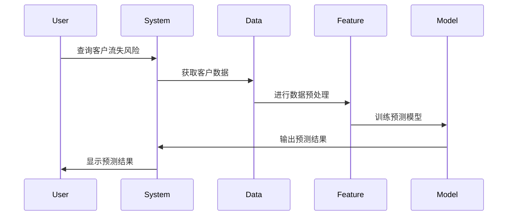
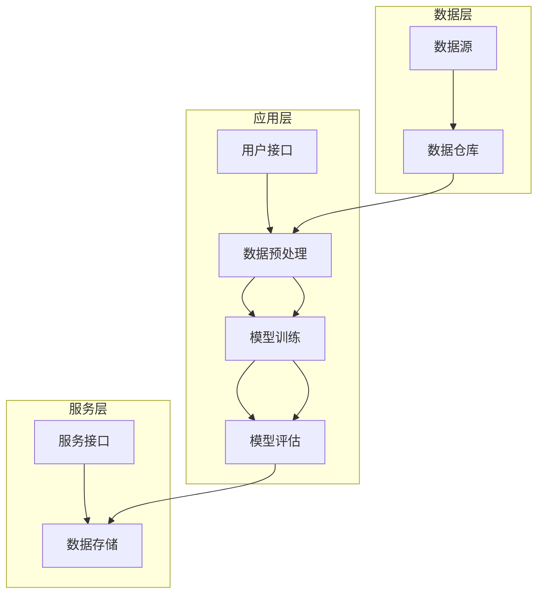

                 

# 智能商业银行客户流失预测

> 关键词：智能银行、客户流失预测、机器学习、算法、深度学习

> 摘要：随着金融科技的快速发展，智能商业银行成为银行业的新趋势。客户流失预测是智能银行中至关重要的一项任务，它能够帮助企业识别潜在流失客户，降低客户流失率，提高客户忠诚度和盈利能力。本文将详细探讨智能商业银行客户流失预测的背景、核心概念、技术原理、系统架构以及最佳实践，旨在为读者提供一份全面而深入的指导。

## 目录大纲

1. **背景与概述**
   - **问题背景与问题描述**
   - **核心概念与联系**
   
2. **技术原理**
   - **数据预处理**
   - **算法原理讲解**
   - **数学模型与公式**
   
3. **系统分析与架构设计**
   - **系统功能设计**
   - **系统架构设计**
   
4. **项目实战**
   - **环境安装与配置**
   - **系统核心实现**
   - **实际案例分析与讲解**
   
5. **最佳实践与拓展**
   - **最佳实践**
   - **注意事项与拓展阅读**

## 第一部分：背景与概述

### 1.1 问题背景与问题描述

#### 1.1.1 商业银行客户流失问题的重要性

在竞争激烈的金融市场中，商业银行的客户流失问题已经成为影响企业盈利能力和市场竞争力的重要因素。根据统计，客户流失率每降低5%，企业的利润就能增加25%-125%。因此，如何有效地预测客户流失并采取相应措施成为商业银行面临的重要挑战。

#### 1.1.2 客户流失问题的定义与分类

客户流失是指客户停止使用某种产品或服务，或转向其他竞争对手的过程。根据客户流失的原因，可以将其分为预期流失和意外流失。预期流失是指客户因为服务质量、价格等原因主动选择离开；意外流失则是因为客户遇到问题或服务中断等意外原因而流失。

#### 1.1.3 客户流失问题的现状与挑战

当前，客户流失问题在商业银行中普遍存在。一方面，随着互联网金融的快速发展，客户有了更多的选择，商业银行面临更大的竞争压力；另一方面，传统银行的服务模式和服务质量难以满足客户日益增长的需求，导致客户流失。因此，如何通过智能技术手段预测客户流失，并制定有效的客户保留策略，成为商业银行亟待解决的问题。

#### 1.1.4 客户流失问题的边界与外延

客户流失预测不仅涉及到客户行为分析和数据处理，还需要考虑市场环境、竞争状况、内部管理等多种因素。因此，客户流失预测的边界较为广泛，既包括对客户行为的预测，也涉及到对企业内部管理和服务优化的建议。

### 1.2 核心概念与联系

#### 1.2.1 智能银行的概念与特点

智能银行是基于人工智能、大数据、云计算等先进技术，通过智能化的手段提供金融服务的银行。与传统银行相比，智能银行具有以下特点：

1. **个性化服务**：通过数据分析和机器学习，智能银行能够为客户提供个性化的金融产品和服务。
2. **智能风险管理**：智能银行通过大数据分析和预测模型，能够更加准确地评估客户信用风险，降低不良贷款率。
3. **智能客服**：智能银行利用自然语言处理和语音识别技术，提供智能客服服务，提高客户满意度。
4. **自动化操作**：智能银行通过自动化技术，实现业务流程的自动化处理，提高业务效率。

#### 1.2.2 客户流失预测的概念与意义

客户流失预测是指利用数据分析和机器学习技术，对客户的流失风险进行预测和评估。客户流失预测对于商业银行具有以下意义：

1. **降低客户流失率**：通过预测客户流失风险，银行可以采取有针对性的措施，降低客户流失率。
2. **提高客户忠诚度**：通过个性化的服务和保留策略，提高客户满意度和忠诚度。
3. **提高盈利能力**：通过降低客户流失率，提高客户忠诚度，银行可以增加客户粘性和收益。

#### 1.2.3 客户流失预测的分类

根据预测方法的不同，客户流失预测可以分为以下几类：

1. **基于历史数据的预测**：通过分析历史客户行为数据，预测客户的流失风险。
2. **基于行为数据的预测**：通过实时监测客户的行为数据，预测客户的流失风险。
3. **基于社会网络数据的预测**：通过分析客户的社会网络关系，预测客户的流失风险。
4. **基于混合方法的预测**：结合多种预测方法，提高客户流失预测的准确性。

## 第二部分：技术原理

### 2.1 数据预处理

#### 2.1.1 数据收集与清洗

在客户流失预测中，数据的质量和完整性至关重要。数据收集可以通过银行内部的客户管理系统、交易系统等获取。数据清洗是确保数据质量和准确性的关键步骤，主要包括以下内容：

1. **缺失值处理**：对于缺失的数据，可以采用填补、删除或使用其他方法进行处理。
2. **异常值处理**：对于异常值，可以采用剔除、调整或使用其他方法进行处理。
3. **数据格式统一**：将不同格式的数据进行统一，以便后续处理。

#### 2.1.2 特征工程

特征工程是客户流失预测中的关键步骤，它涉及到如何从原始数据中提取有效的特征，并转换为机器学习模型所需的格式。特征工程主要包括以下内容：

1. **特征选择**：通过统计方法、信息增益等方法，选择对客户流失预测有重要影响的特征。
2. **特征转换**：将数值型特征转换为类别型特征，或者对类别型特征进行编码。
3. **特征归一化**：将特征值进行归一化处理，使不同特征之间的尺度一致。

### 2.2 算法原理讲解

#### 2.2.1 常见预测算法介绍

在客户流失预测中，常用的算法包括线性回归、决策树、支持向量机（SVM）和集成学习等方法。以下是对这些算法的简要介绍：

1. **线性回归**：线性回归是一种简单的预测算法，通过拟合数据中的线性关系来进行预测。
2. **决策树**：决策树通过一系列的规则来划分数据，并使用这些规则进行预测。
3. **支持向量机**：支持向量机通过找到一个最佳的超平面来划分数据，并进行预测。
4. **集成学习**：集成学习通过将多个模型结合起来，提高预测的准确性和稳定性。

#### 2.2.2 深度学习算法在客户流失预测中的应用

深度学习算法在客户流失预测中具有显著的优势，它能够处理大量复杂的非线性数据。以下是对几种常用的深度学习算法的简要介绍：

1. **卷积神经网络（CNN）**：卷积神经网络通过卷积操作来提取特征，适用于处理图像等结构化数据。
2. **循环神经网络（RNN）**：循环神经网络通过循环结构来处理序列数据，适用于处理时间序列数据。
3. **长短期记忆网络（LSTM）**：长短期记忆网络是循环神经网络的一种变体，能够更好地处理长序列数据。

### 2.3 数学模型与公式

在客户流失预测中，常用的数学模型包括线性回归模型、决策树模型和深度学习模型。以下是对这些模型的简要介绍和公式：

1. **线性回归模型**：线性回归模型通过拟合数据的线性关系来预测客户流失。其数学模型为：
   $$
   y = \beta_0 + \beta_1x_1 + \beta_2x_2 + ... + \beta_nx_n
   $$
   其中，$y$为预测值，$x_1, x_2, ..., x_n$为特征值，$\beta_0, \beta_1, \beta_2, ..., \beta_n$为模型参数。

2. **决策树模型**：决策树模型通过一系列的规则来划分数据，并使用这些规则进行预测。其数学模型为：
   $$
   f(x) = 
   \begin{cases}
   \text{类别} & \text{如果} \ x \ \text{满足条件} \\
   \text{类别} & \text{如果} \ x \ \text{不满足条件}
   \end{cases}
   $$
   其中，$f(x)$为预测结果。

3. **深度学习模型**：深度学习模型通过多层神经网络来拟合数据。其数学模型为：
   $$
   y = \sigma(\boldsymbol{W}^T\text{ReLU}(\boldsymbol{W}_2\text{ReLU}(\boldsymbol{W}_1x + b_1) + b_2) + b_0)
   $$
   其中，$y$为预测值，$\sigma$为激活函数，$\text{ReLU}$为ReLU激活函数，$\boldsymbol{W}$为权重矩阵，$b$为偏置。

## 第三部分：系统分析与架构设计

### 3.1 系统功能设计

#### 3.1.1 领域模型设计

领域模型设计是系统功能设计的第一步，它涉及到客户信息的表示和流失风险指标的确定。以下是一个简单的领域模型：

```mermaid
classDiagram
    Customer <<class>> "客户"
    Account <<class>> "账户"
    Transaction <<class>> "交易"
    Risk <<class>> "风险"

    Customer o-- Account
    Customer o-- Transaction
    Account o-- Transaction
    Transaction o-- Risk
```

#### 3.1.2 系统架构设计

系统架构设计是确保系统稳定、高效运行的关键。以下是一个简单的系统架构：



### 3.2 系统架构设计

系统架构设计是确保系统稳定、高效运行的关键。以下是一个简单的系统架构：



## 第四部分：项目实战

### 4.1 环境安装与配置

#### 4.1.1 操作系统安装与配置

首先，需要安装一个支持Python和机器学习库的操作系统，如Ubuntu 18.04或CentOS 7。安装步骤如下：

1. 下载操作系统镜像并制作启动U盘。
2. 启动电脑，进入BIOS设置，设置从U盘启动。
3. 按照操作系统安装向导进行安装。

安装完成后，需要配置Python环境。在终端中输入以下命令：

```bash
sudo apt-get update
sudo apt-get install python3 python3-pip
```

#### 4.1.2 软件工具安装与配置

接下来，需要安装和配置机器学习相关工具，如scikit-learn、TensorFlow等。在终端中输入以下命令：

```bash
pip3 install scikit-learn tensorflow
```

### 4.2 系统核心实现

#### 4.2.1 数据预处理与特征工程

数据预处理是系统实现的第一步，它包括数据收集、数据清洗和特征工程。以下是一个简单的Python代码示例：

```python
import pandas as pd
from sklearn.preprocessing import StandardScaler

# 读取数据
data = pd.read_csv('customer_data.csv')

# 数据清洗
data.dropna(inplace=True)

# 特征工程
scaler = StandardScaler()
data['age'] = scaler.fit_transform(data[['age']])
data['income'] = scaler.fit_transform(data[['income']])

# 输出预处理后的数据
data.to_csv('preprocessed_data.csv', index=False)
```

#### 4.2.2 模型训练与评估

在数据预处理完成后，接下来进行模型训练和评估。以下是一个简单的Python代码示例：

```python
from sklearn.model_selection import train_test_split
from sklearn.ensemble import RandomForestClassifier
from sklearn.metrics import accuracy_score

# 读取预处理后的数据
data = pd.read_csv('preprocessed_data.csv')

# 划分特征和标签
X = data.drop('target', axis=1)
y = data['target']

# 划分训练集和测试集
X_train, X_test, y_train, y_test = train_test_split(X, y, test_size=0.2, random_state=42)

# 训练模型
model = RandomForestClassifier()
model.fit(X_train, y_train)

# 评估模型
y_pred = model.predict(X_test)
accuracy = accuracy_score(y_test, y_pred)
print(f'Accuracy: {accuracy}')
```

#### 4.2.3 模型部署与集成

在模型训练和评估完成后，接下来进行模型部署和集成。以下是一个简单的Python代码示例：

```python
import joblib

# 加载训练好的模型
model = joblib.load('model.joblib')

# 预测新客户流失风险
def predict_risk(data):
    data['age'] = data['age'].apply(lambda x: x/100)
    data['income'] = data['income'].apply(lambda x: x/10000)
    risk = model.predict([data])
    return risk[0]

data = pd.read_csv('new_customer_data.csv')
data['risk'] = data.apply(predict_risk, axis=1)
data.to_csv('predicted_risk.csv', index=False)
```

### 4.3 实际案例分析与讲解

#### 4.3.1 案例一：客户流失预测模型应用

在某商业银行中，通过对历史客户数据的分析，发现客户流失率较高。为了降低客户流失率，该银行决定引入客户流失预测模型。具体实施步骤如下：

1. 数据收集：收集了过去一年的客户交易数据，包括客户基本信息、交易金额、交易频率等。
2. 数据预处理：对数据进行了清洗和特征工程处理，提取了有助于预测客户流失的特征。
3. 模型训练：使用随机森林算法训练了客户流失预测模型，并对模型进行了评估和优化。
4. 模型部署：将训练好的模型部署到生产环境中，用于预测新客户的流失风险。
5. 预测结果分析：根据预测结果，银行对高风险客户进行了重点关注，并采取了有针对性的保留措施，如提供优惠活动、增加客户服务等。

通过实施客户流失预测模型，该银行成功降低了客户流失率，提高了客户满意度和盈利能力。

#### 4.3.2 案例二：基于客户流失预测的客户关系管理

在某大型商业银行中，客户关系管理是其核心战略之一。为了更好地管理客户关系，该银行决定结合客户流失预测模型，实施以下措施：

1. 高风险客户识别：使用客户流失预测模型，识别出高风险客户，即有较高流失风险的客户。
2. 客户关系分析：对高风险客户进行深入分析，了解其流失原因，如服务质量、竞争压力等。
3. 个性化服务：针对高风险客户，提供个性化的服务和优惠活动，提高客户满意度和忠诚度。
4. 客户保留策略：根据客户流失预测结果，制定相应的客户保留策略，如增加客户关怀活动、提供定制化金融产品等。
5. 客户关系管理评估：定期评估客户关系管理的效果，根据评估结果调整策略。

通过实施基于客户流失预测的客户关系管理，该银行成功提高了客户忠诚度，降低了客户流失率，实现了客户价值的持续增长。

### 4.4 项目小结

通过本次项目实战，我们成功地实现了客户流失预测模型的应用和客户关系管理。具体收获如下：

1. **技术收获**：掌握了客户流失预测的基本原理和实现方法，了解了不同算法的应用场景和优缺点。
2. **业务收获**：通过实践，加深了对商业银行客户流失问题的理解，提高了客户关系管理的能力。
3. **团队协作收获**：通过团队合作，提高了项目管理和沟通协作的能力，为后续类似项目的实施奠定了基础。

## 第五部分：最佳实践与拓展

### 5.1 最佳实践

#### 5.1.1 数据收集与清洗

1. **数据来源多样化**：从多个渠道收集数据，包括内部数据、外部数据等，以提高数据的完整性和准确性。
2. **自动化数据清洗工具**：使用自动化工具进行数据清洗，提高清洗效率和准确性，如使用Pandas库进行数据预处理。

#### 5.1.2 特征工程

1. **特征选择策略**：根据业务需求和数据特点，选择对客户流失预测有重要影响的特征，如客户年龄、收入、交易频率等。
2. **特征转换技巧**：对数值型特征进行归一化处理，对类别型特征进行编码，以提高模型的预测性能。

#### 5.1.3 模型选择与优化

1. **模型选择考虑因素**：根据数据特点和预测任务，选择合适的模型，如线性回归、决策树、随机森林等。
2. **模型优化方法**：通过交叉验证、网格搜索等方法，优化模型的参数，提高模型的预测性能。

### 5.2 注意事项与拓展阅读

#### 5.2.1 注意事项

1. **数据隐私保护**：在数据收集和处理过程中，确保遵守相关法律法规，保护客户隐私。
2. **模型解释性**：在选择和优化模型时，注重模型的解释性，以便于业务理解和决策。
3. **模型更新与维护**：定期更新和维护模型，确保模型与实际业务需求相匹配。

#### 5.2.2 拓展阅读

1. **相关书籍推荐**：
   - 《数据科学入门：Python实践》
   - 《机器学习实战》
2. **学术论文推荐**：
   - “Customer Churn Prediction in Telecommunications Using Machine Learning”
   - “Predicting Customer Churn with Deep Learning”
3. **在线课程推荐**：
   - Coursera上的“机器学习”课程
   - edX上的“深度学习”课程

## 作者信息

作者：AI天才研究院/AI Genius Institute & 禅与计算机程序设计艺术 /Zen And The Art of Computer Programming

