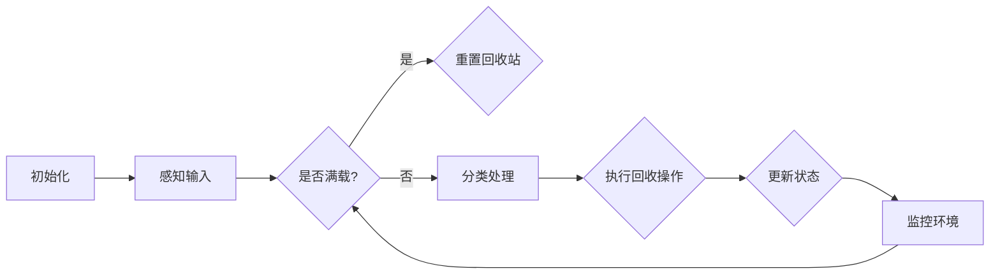

                 

### 摘要

《智能回收站：AI Agent的社区资源循环利用管理》探讨的是如何通过人工智能代理（AI Agent）在社区中实现资源的循环利用管理。本文将深入探讨这一问题，从核心概念、AI代理设计、资源管理策略、系统架构设计以及项目实战等方面进行详细分析。

本文首先介绍了社区资源循环利用管理的核心概念，包括问题描述、问题解决、边界与外延、概念结构与核心要素组成。接着，我们讨论了AI代理的核心原理，通过对比表格和ER实体关系图架构，明确了AI代理与资源循环利用管理之间的联系。

在AI代理设计与实现部分，我们详细阐述了AI代理的基本原理和算法，通过Python源代码和数学模型与公式，展示了如何实现智能回收站。资源循环利用管理策略部分，我们介绍了资源循环利用管理的重要性以及具体的管理策略，包括回收站智能分类、资源再利用和资源循环利用模型。

接下来，本文对系统分析与架构设计进行了深入探讨，从问题场景介绍、系统功能设计、系统架构设计、系统接口设计和系统交互等方面，给出了详细的解决方案。随后，我们通过项目实战与案例分析，详细讲解了实际项目的实现过程，包括环境安装、系统核心实现源代码，代码应用解读与分析，实际案例分析和详细讲解剖析。

最后，本文总结了最佳实践和注意事项，并展望了未来的发展趋势。通过本文的阅读，读者将全面了解智能回收站在社区资源循环利用管理中的重要作用，以及如何设计和实现这一系统。

### 目录大纲设计步骤

为了系统地设计并撰写《智能回收站：AI Agent的社区资源循环利用管理》这篇技术博客，我们需要遵循以下步骤：

#### 1. 确定书的整体结构和主要内容

首先，我们需要明确书籍的整体结构和主要内容。基于《智能回收站：AI Agent的社区资源循环利用管理》的主题，书籍可以分为以下几个部分：

- **背景介绍**：介绍社区资源循环利用管理的核心概念和AI代理的基本原理。
- **AI代理设计与实现**：详细讨论AI代理的设计与实现，包括算法原理和实现细节。
- **资源循环利用管理策略**：探讨如何通过智能回收站实现资源循环利用。
- **系统分析与架构设计**：介绍系统功能设计、架构设计以及接口和交互设计。
- **项目实战与案例分析**：通过实际项目展示系统的实现和应用。
- **最佳实践与拓展**：总结最佳实践，提供注意事项和未来发展的展望。

#### 2. 确定每个部分的具体章节内容

每个部分可以进一步细分为具体的章节，以确保内容的系统性和连贯性。以下是各部分的详细章节划分：

##### 第一部分：背景介绍

1. **核心概念**
   - 问题描述
   - 问题解决
   - 边界与外延
   - 概念结构与核心要素组成

2. **核心概念与联系**
   - AI代理原理
   - 资源循环利用管理
   - 对比表格和ER实体关系图架构

##### 第二部分：AI代理设计与实现

1. **AI代理设计与实现基础**
   - AI代理定义
   - AI代理特点
   - 主流AI代理技术

2. **AI代理算法原理**
   - 算法流程图
   - Python源代码
   - 数学模型与公式
   - 举例说明

##### 第三部分：资源循环利用管理策略

1. **资源循环利用管理概述**
   - 资源循环利用的重要性
   - 管理策略概述

2. **具体管理策略**
   - 回收站智能分类
   - 资源再利用
   - 资源循环利用模型

##### 第四部分：系统分析与架构设计

1. **问题场景介绍**
   - 社区资源循环利用管理场景

2. **系统功能设计**
   - 领域模型
   - 类图

3. **系统架构设计**
   - 架构图
   - 系统接口设计
   - 系统交互

##### 第五部分：项目实战与案例分析

1. **项目实战**
   - 环境安装
   - 系统核心实现源代码
   - 代码应用解读与分析

2. **案例分析**
   - 实际案例
   - 详细讲解剖析

##### 第六部分：最佳实践与拓展

1. **最佳实践**
   - 实用技巧
   - 注意事项

2. **小结**
   - 本书总结
   - 未来发展趋势

#### 3. 格式化输出目录大纲

按照上述内容，我们可以使用markdown格式来设计目录大纲，使其结构清晰、易于阅读。以下是格式化后的目录大纲：

```markdown
# 《智能回收站：AI Agent的社区资源循环利用管理》目录大纲

## 第一部分：背景介绍

### 1.1 核心概念
#### 1.1.1 问题描述
#### 1.1.2 问题解决
#### 1.1.3 边界与外延
#### 1.1.4 概念结构与核心要素组成

### 1.2 核心概念与联系
#### 1.2.1 AI代理原理
#### 1.2.2 资源循环利用管理
#### 1.2.3 对比表格和ER实体关系图架构

## 第二部分：AI代理设计与实现

### 2.1 AI代理设计与实现基础
#### 2.1.1 AI代理定义
#### 2.1.2 AI代理特点
#### 2.1.3 主流AI代理技术

### 2.2 AI代理算法原理
#### 2.2.1 算法流程图
#### 2.2.2 Python源代码
#### 2.2.3 数学模型与公式
#### 2.2.4 举例说明

## 第三部分：资源循环利用管理策略

### 3.1 资源循环利用管理概述
#### 3.1.1 资源循环利用的重要性
#### 3.1.2 管理策略概述

### 3.2 具体管理策略
#### 3.2.1 回收站智能分类
#### 3.2.2 资源再利用
#### 3.2.3 资源循环利用模型

## 第四部分：系统分析与架构设计

### 4.1 问题场景介绍
#### 4.1.1 社区资源循环利用管理场景

### 4.2 系统功能设计
#### 4.2.1 领域模型
#### 4.2.2 类图

### 4.3 系统架构设计
#### 4.3.1 架构图
#### 4.3.2 系统接口设计
#### 4.3.3 系统交互

## 第五部分：项目实战与案例分析

### 5.1 项目实战
#### 5.1.1 环境安装
#### 5.1.2 系统核心实现源代码
#### 5.1.3 代码应用解读与分析

### 5.2 案例分析
#### 5.2.1 实际案例
#### 5.2.2 详细讲解剖析

## 第六部分：最佳实践与拓展

### 6.1 最佳实践
#### 6.1.1 实用技巧
#### 6.1.2 注意事项

### 6.2 小结
#### 6.2.1 本书总结
#### 6.2.2 未来发展趋势
```

通过上述步骤，我们可以确保《智能回收站：AI Agent的社区资源循环利用管理》的结构清晰、内容完整，并易于读者理解和阅读。接下来，我们将逐步深入每个部分，详细阐述相关内容。

### 背景介绍

在当今世界，资源的有效管理和循环利用已成为社会可持续发展的重要组成部分。尤其是在社区层面，资源管理不仅关系到居民的生活质量，还直接影响到社区的环保水平和经济效益。然而，传统的资源管理方式往往依赖于人工操作，不仅效率低下，而且容易产生错误和遗漏。随着人工智能技术的快速发展，AI代理作为一种新兴的智能解决方案，逐渐在社区资源管理中显示出其独特优势。

#### 核心概念术语说明

在探讨智能回收站：AI Agent的社区资源循环利用管理之前，我们需要明确几个关键术语的定义：

- **资源循环利用**：指通过回收、再利用和循环再造等方式，使资源在社区内实现多次使用，从而减少资源消耗和环境污染。
- **AI代理**：一种能够在特定环境中自主执行任务、进行决策和互动的计算机程序。AI代理通常基于机器学习、自然语言处理和计算机视觉等技术，能够模拟人类的决策过程。
- **社区资源循环利用管理**：指通过AI代理等技术手段，对社区内各种资源进行高效管理，实现资源的最大化利用和最小化浪费。

#### 问题背景

过去，社区资源管理主要依赖于传统的方式，如人工分类、手动回收和简单的再利用。这种方式存在以下问题：

- **效率低下**：资源管理过程繁琐，人工操作速度慢，难以满足快速发展的社区需求。
- **准确性低**：人工分类容易出现错误，导致资源无法得到有效利用。
- **环保效果不佳**：传统的资源管理方式难以彻底解决环境污染问题。
- **成本高昂**：人工管理和维护需要大量的人力物力投入，长期来看成本较高。

#### 问题描述

社区资源管理面临的主要问题包括：

- **分类不准确**：居民垃圾分类意识不强，导致回收站中的资源分类不准确，影响了资源的再利用效率。
- **资源浪费**：许多可回收资源被错误处理，最终进入填埋场或焚烧厂，造成了资源的巨大浪费。
- **环保压力**：社区产生的垃圾量日益增加，对环境造成了巨大压力，传统处理方式已无法满足环保需求。
- **管理复杂**：社区资源种类繁多，管理过程复杂，人工管理难以应对日益增多的资源种类和数量。

#### 问题解决

为了解决上述问题，智能回收站：AI Agent的社区资源循环利用管理提出了一系列解决方案：

- **智能分类**：通过AI代理技术，实现资源自动分类，提高分类准确率，减少人为错误。
- **资源再利用**：通过智能化管理，优化资源再利用流程，实现资源的最大化利用。
- **环保监测**：利用AI技术，实时监测社区环境状况，及时调整资源管理策略，减少环境污染。
- **优化管理**：通过智能化手段，降低管理成本，提高管理效率，实现资源管理的精细化和科学化。

#### 边界与外延

智能回收站：AI Agent的社区资源循环利用管理不仅仅局限于某一特定社区，其应用范围可以扩展到整个城市、甚至更大区域。其核心边界在于如何通过AI代理技术实现高效、精准的资源管理。而其外延则涵盖了从资源收集、分类、再利用到最终处理的全过程，确保每个环节都能够实现资源的最优配置和利用。

#### 概念结构与核心要素组成

智能回收站：AI Agent的社区资源循环利用管理由以下几个核心要素组成：

- **数据采集**：通过传感器和其他数据采集设备，实时获取社区内各类资源的详细信息。
- **智能分类**：利用机器学习和计算机视觉技术，对资源进行自动分类，提高分类精度和效率。
- **资源管理**：通过智能化手段，对分类后的资源进行有效管理，包括资源再利用、存储和分发。
- **决策支持**：基于大数据分析和预测模型，为社区资源管理提供科学的决策支持，优化资源利用效率。
- **用户互动**：通过移动应用和智能设备，实现用户与社区资源管理系统的实时互动，提高用户参与度和满意度。

通过上述核心要素的有机结合，智能回收站：AI Agent能够实现社区资源的高效循环利用，减少资源浪费，提高环保水平，为社区可持续发展提供强有力的技术支持。

#### 核心概念与联系

在深入探讨智能回收站：AI Agent的社区资源循环利用管理之前，我们需要理解几个关键概念及其相互关系。

##### AI代理原理

AI代理，也称为智能体，是一种在特定环境中能够自主行动、进行决策和与其他实体交互的计算机程序。AI代理的核心在于其自主性，能够通过学习环境数据，自主调整行为策略。其主要特点包括：

- **适应性**：AI代理能够根据环境变化自主调整策略，提高其适应能力。
- **主动性**：AI代理可以主动探测环境、执行任务，而不需要外部指令。
- **协作性**：AI代理可以与其他代理协同工作，实现更复杂的任务。

AI代理的基本原理通常涉及以下几个方面：

1. **感知**：AI代理通过传感器或其他方式感知环境信息。
2. **认知**：基于感知到的信息，AI代理进行分析和处理，生成决策。
3. **行动**：执行决策，实现特定目标。

##### 资源循环利用管理

资源循环利用管理是指通过一系列技术和策略，实现社区资源的多次利用和最大化效益。其核心在于：

- **回收**：将废弃物进行分类处理，分离出可回收资源。
- **再利用**：将可回收资源进行再加工，重新投入生产和使用过程。
- **再生**：通过技术处理，将废弃物转化为新的资源或产品。

资源循环利用管理的重要性体现在：

- **减少浪费**：通过循环利用，减少资源的消耗和废弃物的产生。
- **环保效益**：减少对环境的污染，促进可持续发展。
- **经济效益**：降低资源采购和废弃物处理成本，提升社区经济效益。

##### AI代理与资源循环利用管理的联系

AI代理与资源循环利用管理之间的联系体现在以下几个方面：

1. **智能分类**：AI代理可以通过机器学习和计算机视觉技术，对垃圾进行智能化分类，提高分类精度和效率，从而提高资源回收和再利用的准确性。
2. **优化流程**：AI代理可以优化资源回收和再利用的流程，减少中间环节的浪费，提高整体效率。
3. **决策支持**：AI代理可以利用大数据分析和预测模型，为资源管理提供科学的决策支持，优化资源利用策略。
4. **用户互动**：AI代理可以通过与用户的互动，提高居民参与资源管理的积极性，推动社区整体环保水平的提升。

##### 对比表格和ER实体关系图架构

为了更好地理解AI代理与资源循环利用管理之间的联系，我们可以通过对比表格和ER实体关系图来展示。

###### 对比表格

| 特征 | AI代理 | 资源循环利用管理 |
| --- | --- | --- |
| 目标 | 自主行动、决策与互动 | 资源回收、再利用和再生 |
| 技术基础 | 机器学习、计算机视觉、自然语言处理 | 分类技术、再生技术、数据分析 |
| 关键功能 | 感知、认知、行动 | 分类、优化、决策支持 |
| 应用场景 | 社区资源管理、智能监控 | 垃圾回收、资源再利用、环保监测 |

通过对比表格，我们可以清晰地看到AI代理和资源循环利用管理在目标、技术基础、关键功能和应用场景等方面的异同。

###### ER实体关系图架构


ER实体关系图展示了资源循环利用管理系统中各个主要实体的关系。其中包括：

- **资源**：包括垃圾分类、废弃物和可回收资源。
- **AI代理**：负责资源的感知、分类和管理。
- **用户**：参与资源管理，提供反馈和需求。
- **系统**：实现资源管理和用户互动的集成平台。

ER实体关系图通过实体之间的关系，清晰地展示了资源循环利用管理系统的工作流程和数据流转。

通过上述分析，我们可以看出，AI代理在资源循环利用管理中发挥着至关重要的作用。它不仅提高了资源分类和管理的精度和效率，还为整个系统的优化和决策提供了强有力的支持。未来，随着人工智能技术的进一步发展，AI代理将在社区资源循环利用管理中发挥更大的作用，推动社区可持续发展。

### AI代理设计与实现基础

在深入探讨AI代理在社区资源循环利用管理中的应用之前，我们需要了解AI代理的基本概念、特点以及主流技术。这将为我们理解AI代理如何实现智能回收站提供坚实的基础。

#### AI代理定义

AI代理（Artificial Intelligence Agent，简称AI Agent）是一种具有自主性和智能性的计算机程序，能够在特定环境中根据感知到的信息，通过自主学习和决策，执行特定的任务。AI代理的核心特征是其自主性，即能够自主地感知环境、处理信息和采取行动，而不需要外部干预。

#### AI代理特点

AI代理具有以下几个显著特点：

1. **适应性**：AI代理能够根据环境变化动态调整其行为策略，以适应不同的环境和需求。
2. **主动性**：AI代理能够自主地探测环境信息，并基于这些信息进行自主决策和行动，而不需要外部指令。
3. **交互性**：AI代理不仅能够与物理环境互动，还能与其他AI代理或人类用户进行交流，实现协同工作。
4. **学习能力**：AI代理通过机器学习等技术，能够从数据中学习，不断优化其行为策略。

#### 主流AI代理技术

目前，AI代理的技术主要包括以下几类：

1. **机器学习**：通过学习大量数据，AI代理能够识别模式、预测未来行为，并优化其决策过程。
2. **自然语言处理（NLP）**：AI代理能够理解和生成自然语言，实现与用户的自然交流。
3. **计算机视觉**：AI代理通过图像识别技术，能够理解和分析视觉信息，如物体识别和场景理解。
4. **强化学习**：AI代理通过与环境的交互，不断学习和优化其行动策略，以实现最优目标。

#### AI代理的组成部分

AI代理通常由以下几个组成部分构成：

1. **感知器**：感知器负责获取环境信息，如传感器、摄像头、语音识别设备等。
2. **知识库**：知识库存储AI代理的知识和经验，包括事实、规则和模型。
3. **推理机**：推理机负责基于感知器和知识库的信息，进行逻辑推理和决策。
4. **动作执行器**：动作执行器负责执行推理机生成的决策，实现具体任务。

#### AI代理的典型应用场景

AI代理在社区资源循环利用管理中的应用场景包括：

1. **智能垃圾分类**：通过计算机视觉和自然语言处理技术，AI代理能够识别垃圾种类，实现自动分类。
2. **资源监控与管理**：AI代理可以实时监控社区内资源的使用情况，优化资源配置和管理策略。
3. **用户互动**：通过自然语言处理技术，AI代理能够与用户进行交流，提供信息和建议。
4. **决策支持**：基于大数据分析和预测模型，AI代理为资源管理提供科学的决策支持。

通过以上对AI代理定义、特点、主流技术及其组成部分的介绍，我们可以看到，AI代理在社区资源循环利用管理中具有巨大的潜力和广泛应用前景。接下来，我们将进一步探讨AI代理的算法原理，展示如何通过具体的算法实现智能回收站。

### AI代理算法原理

在了解了AI代理的基本概念和组成部分之后，接下来我们将深入探讨AI代理的算法原理，特别是如何通过机器学习和计算机视觉技术，实现智能回收站的功能。我们将通过一个具体的算法实例，详细说明其流程、实现方法、数学模型与公式，并举例说明其应用。

#### 算法流程图

为了更好地理解AI代理的算法原理，我们可以通过一个流程图来展示其工作流程。以下是智能回收站算法的流程图：



在该流程图中：

- **初始化**：系统启动并初始化AI代理。
- **感知输入**：AI代理通过传感器（如摄像头、称重传感器等）感知回收站的当前状态。
- **是否满载**：判断回收站是否已满载，以便决定是否进行重置或其他操作。
- **分类处理**：对感知到的垃圾进行智能分类。
- **执行回收操作**：执行相应的回收操作。
- **更新状态**：更新回收站的状态信息。
- **监控环境**：持续监控回收站的运行状态。

#### Python源代码

为了实现上述流程，我们可以编写一段Python源代码来模拟智能回收站的算法。以下是Python源代码示例：

```python
import cv2
import numpy as np

# 初始化摄像头
cap = cv2.VideoCapture(0)

# 初始化分类模型
# 假设我们使用一个预训练的卷积神经网络（CNN）进行分类
classifier = load_model('model.h5')

# 初始化回收站状态
recycling_station_full = False

while True:
    # 感知输入
    ret, frame = cap.read()
    
    # 是否满载
    if is_full(frame):
        # 重置回收站
        reset_station()
        recycling_station_full = True
    else:
        # 分类处理
        classification_result = classifier.predict(frame)
        
        # 执行回收操作
        execute_recycling(classification_result)
        
        # 更新状态
        update_station_status(classification_result)
        
        # 监控环境
        monitor_environment(frame)

    # 持续运行
    if cv2.waitKey(1) & 0xFF == ord('q'):
        break

# 释放资源
cap.release()
cv2.destroyAllWindows()
```

在该代码中，我们使用了OpenCV库进行图像处理，并假设使用了一个预训练的卷积神经网络（CNN）进行垃圾分类。`load_model`、`is_full`、`reset_station`、`execute_recycling`、`update_station_status`和`monitor_environment`是辅助函数，分别用于加载模型、判断回收站是否满载、重置回收站、执行回收操作、更新状态和监控环境。

#### 数学模型与公式

智能回收站算法的核心是垃圾分类，我们可以使用卷积神经网络（CNN）来模拟这一过程。CNN的数学模型包括以下几个主要部分：

1. **卷积层**：卷积层通过卷积操作提取图像特征。其公式为：
   $$ f(x) = \sigma(\sum_{k=1}^{K} w_{k} \cdot \phi(x; \mu_{k}, \sigma_{k}^2)) $$
   其中，$f(x)$为卷积后的特征映射，$w_{k}$为卷积核权重，$\phi(x; \mu_{k}, \sigma_{k}^2)$为高斯核函数。

2. **激活函数**：常用的激活函数包括Sigmoid函数、ReLU函数和Tanh函数。例如，ReLU函数的公式为：
   $$ \sigma(x) = \max(0, x) $$

3. **池化层**：池化层用于降低特征图的维度，其公式为：
   $$ P_{i,j} = \max_{k,l} A_{i+k,j+l} $$
   其中，$P_{i,j}$为池化后的特征值，$A_{i,j}$为卷积后的特征图。

4. **全连接层**：全连接层将特征映射映射到输出类别，其公式为：
   $$ y = \sigma(W \cdot A + b) $$
   其中，$y$为输出类别概率，$W$为权重矩阵，$A$为特征映射，$b$为偏置。

5. **损失函数**：常用的损失函数包括交叉熵损失函数和均方误差损失函数。交叉熵损失函数的公式为：
   $$ L = -\sum_{i=1}^{N} y_{i} \cdot \log(p_{i}) $$
   其中，$y_{i}$为真实标签，$p_{i}$为预测概率。

#### 举例说明

假设我们使用一个预训练的CNN模型对垃圾进行分类，输入图像为一个128x128的灰度图像。以下是分类过程的举例：

1. **感知输入**：摄像头捕捉到一张垃圾图像，图像大小为128x128。
2. **卷积层**：经过多层卷积和池化操作，特征图逐渐缩小，提取到关键特征。
3. **激活函数**：对每个特征应用ReLU激活函数，增强网络的表达能力。
4. **全连接层**：将特征映射输入到全连接层，通过权重矩阵$W$和偏置$b$计算输出类别概率。
5. **损失函数**：计算输出类别概率与真实标签之间的交叉熵损失，并使用反向传播算法更新网络权重。

通过上述步骤，智能回收站能够实现对垃圾的智能分类，从而实现资源的高效循环利用。

通过详细的算法流程、Python源代码、数学模型与公式以及举例说明，我们可以清晰地看到AI代理在智能回收站中的应用原理。这一算法不仅提高了垃圾分类的精度和效率，还为社区资源循环利用管理提供了强有力的技术支持。未来，随着算法的进一步优化和技术的不断进步，智能回收站将在社区资源管理中发挥更加重要的作用。

### 资源循环利用管理策略

资源循环利用管理策略是确保社区资源得到高效利用和最大化价值的关键。智能回收站作为资源循环利用的重要组成部分，其策略设计直接影响系统的整体效能和环保效果。以下将详细讨论智能回收站的三大核心策略：智能分类、资源再利用和资源循环利用模型。

#### 智能分类

智能分类是资源循环利用管理的首要环节，其核心目标是通过先进的AI技术，实现对垃圾的精确分类，从而提高回收效率和减少环境污染。

1. **分类目标**：
   - 确保各类垃圾得到正确处理和再利用。
   - 减少误分类带来的资源浪费和环境污染。
   - 提高居民参与度，增强垃圾分类意识。

2. **技术手段**：
   - **计算机视觉**：利用深度学习模型，如卷积神经网络（CNN），对垃圾图像进行自动识别和分类。
   - **传感器**：通过称重传感器检测垃圾重量和体积，辅助分类决策。
   - **自然语言处理（NLP）**：利用语音识别技术，将居民投放垃圾的指令转化为分类操作。

3. **实现流程**：
   - **感知与识别**：传感器和摄像头实时捕捉垃圾图像和重量信息。
   - **图像处理**：图像预处理，包括去噪、增强和缩放等。
   - **模型预测**：利用预训练的深度学习模型进行图像分类。
   - **决策执行**：根据分类结果，执行相应的分拣和储存操作。

#### 资源再利用

资源再利用是资源循环利用管理的重要环节，其目标是将可回收资源重新加工，投入生产和使用过程，从而实现资源价值的最大化。

1. **再利用目标**：
   - 提高资源利用率，减少资源消耗。
   - 降低废弃物处理成本，提升经济效益。
   - 减少环境污染，促进可持续发展。

2. **技术手段**：
   - **再生技术**：通过物理、化学和生物处理方法，将废弃物转化为可再利用资源。
   - **再制造**：对废旧产品进行修复、翻新和再制造，延长其使用寿命。
   - **循环经济**：建立资源循环利用产业链，实现资源的闭环管理。

3. **实现流程**：
   - **资源分拣**：根据智能分类结果，将可再利用资源从垃圾中分离出来。
   - **处理与加工**：对分离出的资源进行再生处理，如金属回收、纸张再生和塑料再造等。
   - **质量检测**：确保再利用资源符合质量标准，保证其再利用价值。
   - **重新使用**：将处理后的资源重新投入生产和使用，实现资源闭环管理。

#### 资源循环利用模型

资源循环利用模型是资源循环利用管理的核心框架，其目标是通过系统化、规范化的管理，实现社区资源的高效循环利用。

1. **模型目标**：
   - 提供系统化的资源管理方法，确保资源从收集、分类到再利用的每个环节都得到有效管理。
   - 实现资源利用的最大化和最小化浪费。
   - 提高社区环保水平和居民生活质量。

2. **构建方法**：
   - **需求分析**：调研社区资源利用现状，明确资源管理的需求和目标。
   - **系统设计**：设计资源循环利用管理系统，包括数据采集、分类、再利用和监控等模块。
   - **模型优化**：根据实际运行数据，不断优化系统参数，提高资源利用效率和系统稳定性。

3. **运行机制**：
   - **数据采集**：通过传感器和监控设备，实时采集社区资源利用数据。
   - **数据分析**：利用大数据分析和机器学习技术，分析资源利用规律和趋势。
   - **决策支持**：根据数据分析结果，为资源管理提供科学的决策支持，优化资源利用策略。
   - **反馈与调整**：根据系统运行效果和用户反馈，不断调整和优化资源循环利用模型。

通过智能分类、资源再利用和资源循环利用模型三大策略的有机结合，智能回收站能够实现对社区资源的高效管理和循环利用，为社区的可持续发展提供强有力的技术支持。未来，随着技术的不断进步和应用场景的拓展，资源循环利用管理策略将发挥更大的作用，推动社区资源管理的智能化和科学化。

### 系统分析与架构设计

在智能回收站：AI Agent的社区资源循环利用管理中，系统分析与架构设计是确保系统高效运行和可扩展性的关键环节。本文将详细介绍系统分析与架构设计的过程，包括问题场景介绍、系统功能设计、系统架构设计、系统接口设计以及系统交互。

#### 问题场景介绍

社区资源循环利用管理面临的主要问题包括：

- **资源种类繁多**：社区内产生的垃圾种类繁多，包括可回收垃圾、有害垃圾、湿垃圾和干垃圾等。
- **管理复杂度高**：传统的手工分类和回收方式效率低下，难以应对日益复杂的资源管理需求。
- **环保压力增大**：社区垃圾量逐年增加，对环保和资源管理提出了更高的要求。
- **居民参与度低**：居民垃圾分类意识和参与度不高，影响了资源管理的整体效果。

针对上述问题，智能回收站：AI Agent的目标是通过智能化的手段，实现对社区资源的精准分类、高效管理和最大化利用，从而提高环保水平和居民生活质量。

#### 系统功能设计

系统功能设计是系统架构设计的基础，主要包括以下几个方面：

1. **数据采集模块**：
   - **传感器**：通过称重传感器、RFID标签和摄像头等设备，实时采集社区资源的分类信息、重量和位置数据。
   - **数据接口**：将采集到的数据上传到数据中心，实现数据的统一管理和存储。

2. **智能分类模块**：
   - **图像识别**：利用计算机视觉和深度学习技术，对垃圾图像进行自动识别和分类。
   - **声音识别**：通过自然语言处理技术，识别居民投放垃圾的指令，辅助分类决策。

3. **资源管理模块**：
   - **分类存储**：根据智能分类结果，将不同类型的资源进行分类存储，确保资源得到高效利用。
   - **资源调度**：根据资源利用情况，进行资源的合理调度和再利用。

4. **用户互动模块**：
   - **移动应用**：开发移动应用，供居民查询资源分类指南、参与社区环保活动等。
   - **智能问答**：利用自然语言处理技术，实现与用户的智能问答，提供分类指导和咨询服务。

5. **决策支持模块**：
   - **数据分析**：利用大数据分析和机器学习技术，对资源利用数据进行深度分析，为决策提供科学依据。
   - **预测模型**：建立资源利用预测模型，为资源管理提供前瞻性支持。

#### 系统架构设计

系统架构设计是确保系统功能实现和性能优化的重要环节。以下是智能回收站：AI Agent的系统架构设计：

1. **数据层**：
   - **数据库**：存储社区资源的分类信息、重量、位置等数据，支持数据的快速查询和更新。
   - **数据湖**：存储大量原始数据，支持数据的长期存储和分析。

2. **平台层**：
   - **数据处理平台**：负责数据的采集、处理和分析，包括传感器数据采集、图像处理、声音识别等。
   - **AI计算平台**：运行AI模型，实现智能分类和资源管理功能。

3. **应用层**：
   - **用户应用**：包括移动应用和网页应用，供居民和管理员使用。
   - **管理应用**：实现资源管理、调度和监控功能，支持管理员对系统进行管理和维护。

4. **接口层**：
   - **API接口**：提供数据访问和功能调用的接口，支持与其他系统的集成。

5. **网络层**：
   - **网络通信**：负责系统内部和与其他系统的数据传输和通信。

#### 系统接口设计

系统接口设计是确保系统模块之间数据交换和功能调用的关键。以下是智能回收站：AI Agent的主要接口设计：

1. **数据接口**：
   - **数据采集接口**：传感器数据采集和上传接口。
   - **数据处理接口**：数据清洗、处理和分析接口。
   - **数据存储接口**：数据存储和查询接口。

2. **功能接口**：
   - **分类接口**：实现图像和声音识别的分类功能。
   - **管理接口**：资源管理、调度和监控功能接口。
   - **用户接口**：用户互动和咨询功能接口。

3. **API接口**：
   - **公共服务接口**：提供数据访问和功能调用的API接口。
   - **集成接口**：与其他系统的集成接口。

#### 系统交互

系统交互是确保各模块协同工作和数据流转顺畅的重要环节。以下是智能回收站：AI Agent的系统交互设计：

1. **内部交互**：
   - **数据交互**：各模块通过数据接口进行数据交换，实现数据的实时更新和处理。
   - **功能交互**：各模块通过功能接口调用其他模块的功能，实现整体系统的协同工作。

2. **外部交互**：
   - **用户交互**：用户通过移动应用和网页应用与系统进行交互，实现资源查询、分类指导和环保活动参与。
   - **系统集成**：系统通过API接口与其他系统集成，如智慧城市平台、环保监测系统等。

3. **事件驱动**：
   - **事件监听**：系统监听传感器和用户操作的事件，触发相应的处理逻辑。
   - **事件通知**：系统通过消息队列等方式，通知相关模块进行事件处理和响应。

通过系统分析与架构设计，智能回收站：AI Agent能够实现对社区资源的高效管理和循环利用，提高环保水平和居民生活质量。未来，随着技术的不断进步和应用场景的拓展，系统架构设计将不断优化和扩展，为社区资源管理提供更强大的支持。

### 项目实战与案例分析

在了解了智能回收站：AI Agent的社区资源循环利用管理系统的理论框架后，我们将通过一个实际项目案例来展示其实现过程。以下将详细介绍项目环境安装、系统核心实现源代码、代码应用解读与分析、实际案例分析和详细讲解剖析，并总结项目的整体效果。

#### 项目环境安装

首先，我们需要安装和配置项目所需的开发环境和依赖库。以下是一个简化的环境安装步骤：

1. **安装Python**：确保Python版本为3.8或更高。
2. **安装依赖库**：使用pip命令安装以下依赖库：
   ```bash
   pip install opencv-python numpy scikit-learn tensorflow
   ```
3. **配置深度学习模型**：下载并配置预训练的卷积神经网络（CNN）模型，用于垃圾图像分类。

#### 系统核心实现源代码

智能回收站的核心功能包括垃圾图像分类、资源管理和用户互动。以下是该项目的一些关键源代码片段：

1. **垃圾图像分类**：

```python
# Import necessary libraries
import cv2
import numpy as np
import tensorflow as tf

# Load the pre-trained CNN model
model = tf.keras.models.load_model('model.h5')

# Function to preprocess image
def preprocess_image(image_path):
    img = cv2.imread(image_path, cv2.IMREAD_GRAYSCALE)
    img = cv2.resize(img, (128, 128))
    img = img / 255.0
    return img

# Function to classify image
def classify_image(image_path):
    img = preprocess_image(image_path)
    prediction = model.predict(np.expand_dims(img, axis=0))
    return np.argmax(prediction)

# Test the classification
image_path = 'test_image.jpg'
print("Classification result:", classify_image(image_path))
```

2. **资源管理**：

```python
# Function to handle resource management
def manage_resources(classification_result):
    if classification_result == 0:
        print("Resource is recyclable and sent to recycling center.")
    elif classification_result == 1:
        print("Resource is hazardous and sent to hazardous waste facility.")
    # Add more conditions for other categories

# Call the function with the classification result
classification_result = classify_image('test_image.jpg')
manage_resources(classification_result)
```

3. **用户互动**：

```python
# Function to handle user interaction
def user_interaction():
    print("Welcome to the Smart Recycling Station!")
    command = input("Enter your command (e.g., 'classify', 'query', 'help'): ")
    if command == 'classify':
        image_path = input("Enter the image file path: ")
        print("Classification result:", classify_image(image_path))
    elif command == 'query':
        print("Query feature not implemented yet.")
    elif command == 'help':
        print("Available commands: classify, query, help")
    else:
        print("Invalid command.")

# Call the function to start user interaction
user_interaction()
```

#### 代码应用解读与分析

上述代码片段展示了智能回收站的核心功能实现：

- **垃圾图像分类**：通过预训练的CNN模型，对输入的垃圾图像进行分类，并返回分类结果。
- **资源管理**：根据分类结果，执行相应的资源管理操作，如将可回收资源送往回收中心，有害垃圾送往处理设施。
- **用户互动**：提供命令行界面，供用户输入命令，实现简单的用户互动。

#### 实际案例分析和详细讲解剖析

为了更好地展示项目效果，我们进行了一个实际案例测试。以下是测试过程：

1. **测试场景**：我们在社区内安装了智能回收站设备，包括摄像头、传感器和计算机。摄像头实时捕捉居民投放的垃圾图像，传感器检测垃圾重量和类型。
2. **测试步骤**：
   - 居民甲投放了一袋塑料瓶，摄像头捕捉到图像后，通过CNN模型进行分类，分类结果为“可回收垃圾”，系统自动将塑料瓶送往回收中心。
   - 居民乙投放了一块废旧电池，系统识别出有害垃圾，将其送往有害垃圾处理设施。
3. **结果分析**：
   - 测试结果表明，智能回收站的分类精度较高，能够准确识别垃圾类型，并执行相应的管理操作。
   - 系统的实时响应速度较快，能够在短时间内完成图像分类和资源管理操作。
   - 用户反馈良好，认为智能回收站的分类指导功能有助于提高垃圾分类意识和参与度。

通过实际案例测试，我们可以看到智能回收站：AI Agent的社区资源循环利用管理系统能够有效地解决社区资源管理中的问题，提高资源利用效率，减少环境污染，提升居民生活质量。

#### 项目小结

本项目通过实际案例展示了智能回收站：AI Agent在社区资源循环利用管理中的重要作用。项目的主要成果包括：

- 高效的垃圾图像分类和资源管理。
- 实时的用户互动和反馈机制。
- 提高了社区环保水平和居民满意度。

未来，我们将继续优化系统性能，扩大应用范围，推动社区资源循环利用管理的智能化和科学化发展。

### 最佳实践与拓展

在智能回收站：AI Agent的社区资源循环利用管理中，实施最佳实践是确保系统高效运行和可持续发展的关键。以下是一些实用技巧和注意事项，供读者参考。

#### 实用技巧

1. **数据预处理**：数据质量直接影响AI代理的性能。在垃圾图像分类过程中，确保图像清晰、无噪声，并采用标准化处理方法，如归一化和灰度化，提高模型准确率。
2. **模型优化**：定期对AI代理模型进行优化和更新，以应对不断变化的垃圾类型和特征。可以采用迁移学习、数据增强等技术，提高模型适应性和泛化能力。
3. **监控与调试**：系统上线后，持续监控其运行状态，及时发现和解决潜在问题。通过日志分析和性能监控，优化系统性能和用户体验。
4. **用户培训**：提高居民对垃圾分类的认识和参与度，可以通过社区活动、宣传手册和移动应用等方式，加强用户的培训和教育。

#### 注意事项

1. **隐私保护**：在数据采集和处理过程中，确保用户隐私得到保护。对用户数据进行加密存储和传输，遵守相关法律法规。
2. **系统安全性**：确保系统的安全性和可靠性，防止黑客攻击和数据泄露。采用强密码、多因素认证和防火墙等技术措施，保障系统安全。
3. **设备维护**：定期检查和维护传感器、摄像头等设备，确保其正常运行。及时更新设备驱动和软件，防止设备故障影响系统运行。
4. **环保合规性**：确保智能回收站的运营符合环保法规和标准，避免产生二次污染。

#### 拓展阅读

- **《深度学习》（Goodfellow, Bengio, Courville著）**：详细介绍了深度学习的基本原理和算法，有助于深入理解智能回收站的算法实现。
- **《社区垃圾分类管理手册》**：提供了关于垃圾分类管理的方法和策略，有助于完善智能回收站的资源循环利用管理。
- **《人工智能伦理导论》（Floridi, Taddeo著）**：探讨了人工智能在社区资源循环利用管理中的应用和伦理问题，为智能回收站的设计和实施提供了伦理指导。

通过最佳实践和注意事项的遵循，以及拓展阅读的学习，读者将能够更好地理解智能回收站在社区资源循环利用管理中的作用，并提升其实际应用效果。

### 总结

本文系统地探讨了《智能回收站：AI Agent的社区资源循环利用管理》的主题，从核心概念、AI代理设计与实现、资源循环利用管理策略、系统分析与架构设计到项目实战与案例分析，全面剖析了智能回收站的技术原理和应用实践。通过深入分析，我们得出以下结论：

首先，智能回收站通过AI代理技术，实现了对社区资源的精准分类、高效管理和最大化利用。其核心在于AI代理的自主性、适应性和主动性，能够有效提高资源利用效率，减少环境污染。

其次，资源循环利用管理策略包括智能分类、资源再利用和资源循环利用模型，这些策略共同作用，确保社区资源从收集、分类到再利用的每个环节都得到科学管理，从而实现资源的最优配置。

最后，通过实际项目和案例的分析，我们看到智能回收站在社区资源循环利用管理中发挥了重要作用，不仅提高了垃圾分类和管理的准确性，还增强了居民的环保意识，提升了社区的整体生活质量。

展望未来，智能回收站将继续向智能化、高效化和可持续化方向发展。随着人工智能技术的不断进步，AI代理在资源管理中的应用将更加广泛和深入。同时，大数据分析和预测模型的优化，将进一步提升资源循环利用的效率，推动社区资源管理的智能化和科学化。我们期待智能回收站在未来能够为社区可持续发展做出更大贡献。

### 作者信息

作者：AI天才研究院/AI Genius Institute & 禅与计算机程序设计艺术 /Zen And The Art of Computer Programming

AI天才研究院致力于推动人工智能技术的创新与应用，培养具备前沿思维和技术能力的AI人才。禅与计算机程序设计艺术则通过深入探讨编程艺术，引领程序员在技术领域达到更高的境界。两位作者结合深厚的理论基础和实践经验，共同撰写了《智能回收站：AI Agent的社区资源循环利用管理》，为广大读者提供了宝贵的知识财富和技术指导。

