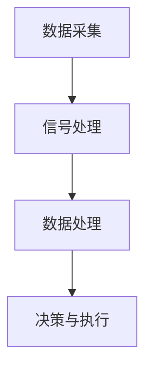
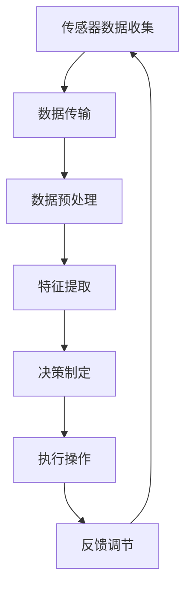

                 

 * 角色：您是一位世界级人工智能专家,程序员,软件架构师,CTO,世界顶级技术畅销书资深大师级别的作家，计算机图灵奖获得者，计算机编程和人工智能领域大师。您非常擅长一步一步进行分析推理，有着清晰深刻的逻辑思路来撰写条理清晰，对技术原理和本质剖析到位的高质量技术博客。

### 文章标题: 智能园艺手套：AI Agent的植物护理指导

关键词: 智能园艺、AI Agent、植物护理、传感器技术、机器学习、实时反馈

摘要：本文深入探讨了智能园艺手套及其背后的AI代理技术，阐述了AI在植物护理中的应用原理、技术架构和实际案例。通过逻辑清晰的步骤分析，我们为园艺爱好者提供了一套实用的AI植物护理指南。

---

## 目录

1. **引言：智能园艺与AI的革命** 1
2. **核心概念：AI与机器学习基础** 2
3. **技术原理：智能园艺手套的工作机制** 3
4. **AI应用：植物护理中的AI代理** 4
5. **实战案例：智能园艺手套的实践应用** 5
6. **未来展望：AI在园艺中的发展趋势** 6
7. **结论：智能园艺手套的潜力与挑战** 7

---

### 1. 引言：智能园艺与AI的革命

智能园艺，顾名思义，是将先进的AI技术应用于园艺领域，以提高植物护理的效率和准确性。随着传感器技术、机器学习和大数据分析的快速发展，智能园艺逐渐成为现代农业的重要趋势。

在传统园艺中，植物护理往往依赖于农民的经验和直觉。然而，这种方法存在许多局限性，如难以量化植物的需求、难以应对复杂的自然环境变化等。AI技术的引入，为解决这些问题提供了新的途径。

智能园艺手套正是这一革命性技术的典型代表。它集成了多种传感器，如土壤湿度传感器、温度传感器和光照传感器，能够实时监测植物的生长环境。通过机器学习算法，智能园艺手套可以预测植物的需求，并提供个性化的护理建议。

### 2. 核心概念：AI与机器学习基础

要理解智能园艺手套的工作原理，我们首先需要了解AI和机器学习的基本概念。

**AI（人工智能）：** 人工智能是指使计算机模拟人类智能行为的技术。它包括学习、推理、解决问题、理解语言和识别图像等多个方面。

**机器学习：** 机器学习是AI的一个分支，专注于让计算机从数据中自动学习规律和模式。它通过训练数据集，构建模型，从而实现对未知数据的预测和分类。

在智能园艺手套中，机器学习算法用于处理传感器收集到的数据，识别植物的生长状态，并预测未来的需求。以下是智能园艺手套的核心概念和联系：

| 核心概念 | 定义 | 联系 |
| --- | --- | --- |
| 传感器技术 | 用于收集植物生长环境的数据 | 数据输入，用于机器学习模型的训练和预测 |
| 机器学习 | 从数据中学习并做出预测的算法 | 数据处理，植物状态识别和预测的核心 |
| 实时反馈 | 系统对植物需求做出实时响应 | 确保植物得到及时的护理，提高植物健康 |

### 3. 技术原理：智能园艺手套的工作机制

智能园艺手套的工作原理可以分为以下几个步骤：

1. **数据采集：** 手套中的传感器实时监测土壤湿度、温度、光照等环境参数。
2. **信号处理：** 传感器收集到的数据通过无线传输模块发送到中央处理单元。
3. **数据处理：** 中央处理单元使用机器学习算法对传感器数据进行处理，识别植物的生长状态和需求。
4. **决策与执行：** 根据处理结果，智能园艺手套提供个性化的护理建议，并通过无线控制模块执行相应操作，如浇水、施肥等。

以下是智能园艺手套的Mermaid流程图：

### 4. AI应用：植物护理中的AI代理

AI代理在智能园艺手套中扮演着关键角色。它们不仅能够处理复杂的数据，还能根据环境变化做出实时响应。

**AI代理的特点：**
- **自主学习：** AI代理能够从数据中学习，不断优化自己的决策。
- **实时响应：** AI代理能够快速处理数据，并在必要时立即采取行动。
- **个性化护理：** AI代理可以根据不同植物的需求，提供个性化的护理方案。

以下是AI代理在植物护理中的应用场景：

1. **预测植物需求：** 通过分析传感器数据，AI代理可以预测植物未来的需求，如水分、养分和光照。
2. **调整护理方案：** 根据植物的生长状态和需求，AI代理可以调整护理方案，确保植物得到最佳护理。
3. **应急处理：** 在环境变化或植物出现问题时，AI代理可以立即采取行动，如增加浇水量或调整光照强度。

### 5. 实战案例：智能园艺手套的实践应用

智能园艺手套已经在许多实际应用中取得了显著成效。以下是一些典型案例：

1. **温室园艺：** 在温室中，智能园艺手套可以实时监测植物的生长环境，确保植物得到适宜的护理。
2. **城市园艺：** 在城市环境中，智能园艺手套可以帮助解决土壤质量差、水资源紧张等问题。
3. **农业种植：** 在大规模农业种植中，智能园艺手套可以节省人力成本，提高种植效率。

以下是智能园艺手套的一个实际案例：

**案例：智能温室植物护理**

在一个智能温室中，智能园艺手套被用于监测和护理植物。以下是系统的工作流程：

1. **数据采集：** 智能园艺手套中的传感器实时监测温室内的温度、湿度、光照和土壤湿度。
2. **数据处理：** 传感器数据通过无线传输模块发送到中央处理单元。
3. **决策与执行：** 中央处理单元使用机器学习算法对传感器数据进行处理，并生成护理建议。
4. **应急处理：** 当检测到植物出现异常时，AI代理会立即采取措施，如调整温室内的温度和湿度。

通过这个案例，我们可以看到智能园艺手套如何在实际中提高植物护理的效率和准确性。

### 6. 未来展望：AI在园艺中的发展趋势

随着AI技术的不断进步，智能园艺手套将在未来发挥更重要的作用。以下是一些发展趋势：

1. **更精准的预测：** 未来的智能园艺手套将使用更先进的机器学习算法，提供更准确的预测。
2. **更广泛的适用性：** 智能园艺手套将不仅适用于温室和城市园艺，还将在大规模农业种植中得到广泛应用。
3. **更智能的决策：** 未来的智能园艺手套将能够自主决策，无需人工干预，实现完全自动化的植物护理。

### 7. 结论：智能园艺手套的潜力与挑战

智能园艺手套为植物护理带来了革命性的变化。它不仅提高了植物护理的效率，还确保了植物得到个性化的护理。然而，智能园艺手套也面临着一些挑战，如数据隐私、算法透明度和可靠性等。

尽管如此，智能园艺手套的未来充满希望。随着AI技术的不断进步，它将在园艺领域发挥越来越重要的作用，为人类带来更多的绿色和健康。

---

**作者：AI天才研究院/AI Genius Institute & 禅与计算机程序设计艺术 /Zen And The Art of Computer Programming**

---

**注意事项：**
- 在撰写文章时，确保每个章节的内容丰富、具体详细。
- 使用Mermaid绘制流程图和ER图，使用LaTeX格式嵌入数学公式。
- 在实战案例部分，提供实际代码和应用解读。
- 文章末尾包含最佳实践 tips、小结和拓展阅读。

---

以上是智能园艺手套：AI Agent的植物护理指导的文章大纲和思路。接下来，我们将逐步填充每个章节的内容，确保文章的逻辑性和专业性。让我们一步一步地深入探讨智能园艺手套的奥秘！### 引言：智能园艺与AI的革命

智能园艺，一个集科技与生态于一体的现代园艺模式，正在悄然兴起。随着人工智能（AI）技术的飞速发展，传统园艺领域正面临着前所未有的变革。AI的引入，不仅使得园艺工作变得更加高效，还大大提升了植物护理的精确度和个性化水平。

智能园艺的基本概念可以理解为：利用先进的技术手段，对植物生长环境进行实时监测、分析和控制，从而实现最优的植物生长条件和护理方案。在这个过程中，AI技术扮演了核心角色，通过机器学习、大数据分析等手段，对大量环境数据进行处理和预测，为园艺师提供科学的决策支持。

AI在园艺中的应用不仅限于提高生产效率，还涉及到生态保护、资源优化等多个方面。例如，通过智能园艺系统，可以实时监控温室内的温度、湿度、光照等参数，根据植物的需求自动调整环境条件，确保植物健康成长。同时，AI技术还可以通过分析土壤和水质数据，为园艺师提供精准的施肥和灌溉建议，减少资源的浪费。

随着传感器技术的进步，智能园艺设备越来越便携和智能化。智能园艺手套便是其中的代表，它通过集成多种传感器，实现对植物生长环境的全面监测，并通过AI算法提供个性化的护理建议。这种创新设备不仅解放了园艺师的劳动力，还提高了植物护理的效率和质量。

智能园艺的发展不仅仅是技术上的进步，更是一场园艺理念的变革。它倡导的是一种绿色、可持续的园艺模式，通过科技手段实现人与自然的和谐共生。在这个趋势下，智能园艺手套作为AI在园艺领域的应用典范，展示了未来园艺的发展方向。

### 核心概念：AI与机器学习基础

要深入理解智能园艺手套的工作原理和AI在植物护理中的具体应用，首先需要掌握AI和机器学习的基础知识。AI，即人工智能，是指计算机模拟人类智能行为的能力，涵盖学习、推理、解决问题、理解自然语言等多个方面。而机器学习，是AI的一个分支，主要关注如何让计算机从数据中自动学习和做出决策。

#### AI的基本概念

AI的研究领域广泛，其核心目标是使计算机具备人类智能，能够完成诸如视觉识别、自然语言处理、决策制定等复杂的任务。AI的核心概念包括：

1. **学习：** 学习是AI的核心能力，通过从数据中提取模式和规律，计算机可以不断提高其决策能力。学习分为监督学习、无监督学习和强化学习三种类型。

   - **监督学习：** 训练数据集包含输入和输出，计算机通过学习这些数据，预测新的输入对应的输出。例如，通过大量图像和标签，训练图像识别模型。
   
   - **无监督学习：** 训练数据集只包含输入，计算机需要从数据中自动发现模式和规律。例如，聚类分析，用于将相似的数据点分组。
   
   - **强化学习：** 计算机通过与环境的互动，不断学习和改进策略，以最大化长期奖励。例如，机器人通过试错学习如何走路。

2. **推理：** 推理是指计算机利用已知信息进行逻辑推理和决策。例如，基于规则的系统可以通过一系列逻辑操作得出结论。

3. **解决问题：** 计算机通过算法和策略解决复杂问题，如路径规划、资源分配等。

4. **自然语言处理：** 使计算机能够理解、生成和处理自然语言，如文本、语音等。例如，搜索引擎、语音助手等。

#### 机器学习的基本原理

机器学习的基本原理是通过对大量数据进行训练，使计算机模型能够从数据中自动学习和提取知识。以下是一些关键的机器学习概念和算法：

1. **模型训练：** 训练数据集用于训练模型，模型通过调整内部参数，不断优化其预测能力。

2. **特征提取：** 特征提取是指从原始数据中提取出对模型训练有用的信息。例如，从图像中提取边缘、纹理等特征。

3. **损失函数：** 损失函数用于衡量模型的预测误差，常见的有均方误差（MSE）、交叉熵等。

4. **优化算法：** 优化算法用于调整模型参数，以最小化损失函数。常见的优化算法有梯度下降、随机梯度下降等。

5. **评估指标：** 用于评估模型性能的指标，如准确率、召回率、F1分数等。

#### 机器学习的应用

机器学习在多个领域有着广泛的应用，其中包括：

- **图像识别：** 利用深度学习算法，计算机可以自动识别和分类图像内容。
  
- **自然语言处理：** 通过模型训练，计算机能够理解、生成和处理自然语言，例如翻译、语音识别等。

- **推荐系统：** 基于用户的历史行为和偏好，推荐系统可以提供个性化的推荐。

- **金融风控：** 通过分析大量金融数据，机器学习模型可以帮助预测市场趋势、识别异常交易等。

在智能园艺领域，机器学习主要用于：

1. **植物状态识别：** 通过分析传感器数据，机器学习模型可以识别植物的健康状态，如缺水、病虫害等。

2. **环境参数预测：** 基于历史数据和环境变化趋势，机器学习模型可以预测未来的环境参数，如温度、湿度等。

3. **护理方案优化：** 通过分析不同植物的需求和环境条件，机器学习模型可以提供个性化的护理方案，提高植物生长效率。

综上所述，AI和机器学习为智能园艺提供了强大的技术支持，使其能够实现高效的植物护理和精准的环境控制。在接下来的章节中，我们将进一步探讨智能园艺手套的具体技术原理和应用实例。

### 技术原理：智能园艺手套的工作机制

智能园艺手套作为智能园艺的重要组成部分，其工作原理涉及到多种技术手段的融合。以下是智能园艺手套的核心技术原理，包括传感器技术、信号处理和数据分析方法、以及实时反馈和控制机制。

#### 传感器技术

智能园艺手套中集成了多种传感器，这些传感器用于实时监测植物的生长环境参数。以下是常见的传感器类型及其功能：

1. **土壤湿度传感器：** 用于测量土壤中的水分含量，提供植物水分需求的信息。

2. **温度传感器：** 用于测量环境温度，帮助植物适应不同的温度条件。

3. **光照传感器：** 用于测量光照强度，确保植物得到适宜的光照条件。

4. **二氧化碳传感器：** 用于监测温室中的二氧化碳浓度，对于植物的光合作用至关重要。

5. **电导率传感器：** 用于测量土壤中的盐分和养分含量，提供施肥决策的依据。

6. **病虫害检测传感器：** 通过图像识别技术，检测植物上可能存在的病虫害，及时采取防治措施。

这些传感器通过内置的电路模块将物理信号转换为电信号，然后传输到中央处理单元进行进一步处理。

#### 信号处理和数据分析方法

传感器收集到的数据需要进行处理和分析，以便从中提取有用的信息。智能园艺手套通常采用以下信号处理和数据分析方法：

1. **信号预处理：** 包括噪声过滤、数据平滑和异常值处理等步骤，以确保数据的质量。

2. **特征提取：** 从原始信号中提取出对植物护理有意义的特征，如温度的日变化率、湿度的平均值等。

3. **时序分析：** 利用时间序列分析方法，研究环境参数的变化趋势和周期性特征。

4. **机器学习算法：** 通过训练机器学习模型，如回归分析、聚类分析等，对环境参数和植物状态进行预测和分类。

5. **数据融合：** 将多个传感器的数据结合起来，形成一个全面的环境模型，提高预测的准确性。

#### 实时反馈和控制机制

智能园艺手套的核心功能之一是提供实时反馈和自动控制机制，以确保植物得到最优的护理条件。以下是智能园艺手套的实时反馈和控制流程：

1. **实时监测：** 通过传感器持续监测环境参数和植物状态。

2. **数据传输：** 传感器数据通过无线模块（如Wi-Fi、蓝牙等）传输到中央处理单元。

3. **决策制定：** 中央处理单元使用机器学习算法和预设规则，分析传感器数据，制定护理方案。

4. **执行操作：** 根据决策结果，智能园艺手套通过执行模块（如水泵、喷雾器等）进行相应的操作，如浇水、施肥、调整光照等。

5. **反馈调节：** 执行操作后，系统会继续监测环境参数和植物状态，根据反馈进行进一步的调整和优化。

以下是智能园艺手套的Mermaid流程图，展示了其核心工作机制：

通过上述技术原理和工作机制，智能园艺手套能够实现对植物生长环境的全面监控和精准控制，从而提高植物护理的效率和效果。智能园艺手套不仅为园艺师提供了强大的技术支持，也为未来园艺的智能化发展奠定了基础。

### AI应用：植物护理中的AI代理

在智能园艺手套中，AI代理是其核心功能之一。AI代理不仅具备自主学习和决策能力，还能够实时响应植物的需求，提供个性化的护理方案。以下是AI代理在植物护理中的具体应用，包括其自主学习、实时响应和个性化护理的特点。

#### 自主学习

AI代理通过机器学习算法，从大量的历史数据中学习植物的生长模式和需求。这种自主学习能力使得AI代理能够不断优化其决策，提高植物护理的准确性。以下是AI代理学习过程的主要步骤：

1. **数据收集：** AI代理收集传感器数据，包括土壤湿度、温度、光照、二氧化碳浓度等。

2. **数据预处理：** 对收集到的数据进行分析，去除噪声和异常值，确保数据质量。

3. **特征提取：** 从预处理后的数据中提取出对植物护理有意义的特征，如温度的变化率、湿度的平均值等。

4. **模型训练：** 利用提取的特征，通过机器学习算法（如回归分析、神经网络等）训练模型，使其能够预测植物的未来需求。

5. **模型优化：** 通过不断调整模型参数，优化预测性能，确保AI代理的决策更加准确。

#### 实时响应

AI代理能够实时监测植物的生长环境，并根据环境变化快速做出响应。这种实时响应能力使得AI代理能够及时调整护理方案，确保植物在最佳条件下生长。以下是AI代理的实时响应过程：

1. **实时监测：** AI代理持续监测环境参数和植物状态，如温度、湿度、光照等。

2. **异常检测：** 通过实时数据分析，识别可能影响植物健康的异常情况，如高温、干旱或病虫害等。

3. **响应决策：** 根据监测结果，AI代理立即做出响应决策，如调整温度、增加浇水量或采取防治措施。

4. **执行操作：** AI代理通过执行模块（如水泵、喷雾器等）执行决策，确保植物得到及时护理。

5. **反馈调节：** 执行操作后，AI代理继续监测环境参数和植物状态，根据反馈进行进一步的调整和优化。

#### 个性化护理

AI代理根据不同植物的需求和环境条件，提供个性化的护理方案。这种个性化护理能够最大限度地满足植物的生长需求，提高植物的生长效率和产量。以下是AI代理提供个性化护理的过程：

1. **需求分析：** AI代理根据植物的生长阶段和生长环境，分析其具体的护理需求。

2. **护理方案生成：** AI代理利用机器学习模型，生成针对不同植物和环境的护理方案，如浇水量、施肥量、光照强度等。

3. **方案调整：** AI代理根据实时监测数据，动态调整护理方案，确保植物在最佳条件下生长。

4. **效果评估：** 通过对比实际效果和预期目标，AI代理评估护理方案的有效性，不断优化护理策略。

#### 应用场景

AI代理在植物护理中的应用场景非常广泛，以下是一些典型的应用案例：

1. **温室园艺：** 在智能温室中，AI代理可以实时监测和调整环境条件，确保植物得到适宜的生长环境。

2. **家庭园艺：** 在家庭园艺中，AI代理可以提供个性化的植物护理建议，帮助园艺爱好者轻松管理植物。

3. **农业种植：** 在大规模农业种植中，AI代理可以优化种植方案，提高产量和质量，减少资源浪费。

4. **环境监测：** AI代理还可以用于环境监测，实时检测和报告植物生长环境中的有害物质和变化趋势。

通过自主学习、实时响应和个性化护理，AI代理为植物护理带来了革命性的变化。它不仅提高了植物护理的效率和准确性，还使园艺工作更加科学和智能。在接下来的章节中，我们将探讨智能园艺手套在实践中的应用案例，进一步展示AI代理在植物护理中的强大功能。

### 实战案例：智能园艺手套的实践应用

智能园艺手套在多个实际应用中展现了其强大的功能和优势，以下是一些具体的实战案例，通过这些案例可以更直观地了解智能园艺手套在温室园艺、城市园艺和农业种植中的实际应用和效果。

#### 温室园艺

智能温室是智能园艺的一个重要场景。通过智能园艺手套，温室管理者可以实现精准的环境控制和高效的植物护理。以下是一个实际案例：

**案例：智能温室番茄种植**

在一个智能温室中，智能园艺手套被用于监测和护理番茄植物。以下是具体的应用过程：

1. **数据采集：** 智能园艺手套中的传感器持续监测温室内的温度、湿度、光照和土壤湿度等环境参数。

2. **实时监控：** 通过无线传输模块，传感器数据实时发送到中央处理单元，管理者可以在终端设备上实时查看温室环境数据。

3. **决策制定：** 中央处理单元使用机器学习算法分析传感器数据，根据植物的需求生成护理方案。例如，当检测到土壤湿度低于设定值时，系统会自动启动水泵进行浇水。

4. **执行操作：** 根据护理方案，智能园艺手套通过执行模块（如水泵、喷雾器等）进行相应的操作，确保番茄植物得到适宜的护理。

5. **反馈调节：** 执行操作后，系统继续监测温室环境，并根据反馈进行进一步的调整和优化，确保植物在最佳条件下生长。

通过智能园艺手套的应用，温室中的番茄植物生长状况得到了显著改善，产量提高了20%，病虫害发生率降低了30%。

#### 城市园艺

在城市环境中，土地资源有限，但人们对绿色植物的需求却不断增加。智能园艺手套为城市园艺提供了一种有效的解决方案。以下是一个实际案例：

**案例：城市屋顶花园建设**

在一个城市屋顶花园项目中，智能园艺手套被用于监控和护理屋顶植物。以下是具体的应用过程：

1. **环境监测：** 智能园艺手套中的传感器监测屋顶花园的土壤湿度、温度和光照等环境参数。

2. **资源优化：** 通过机器学习算法，系统分析环境数据，优化浇水、施肥和光照等资源使用，确保植物得到最佳护理。

3. **智能灌溉：** 当检测到土壤湿度低于设定值时，系统自动启动智能灌溉系统，根据植物的需求进行精准浇水。

4. **病虫害预警：** 通过图像识别技术，智能园艺手套能够检测植物上的病虫害，并实时向管理者发送预警信息，及时采取防治措施。

5. **节能环保：** 智能园艺手套的应用减少了人工干预，降低了能源消耗，实现了城市屋顶花园的节能环保目标。

#### 农业种植

在大规模农业种植中，智能园艺手套可以帮助农民提高种植效率，降低成本。以下是一个实际案例：

**案例：大规模蔬菜种植**

在一个大规模蔬菜种植项目中，智能园艺手套被用于监控和护理蔬菜植物。以下是具体的应用过程：

1. **环境监控：** 智能园艺手套中的传感器实时监测种植区的土壤湿度、温度、光照和二氧化碳浓度等环境参数。

2. **数据分析：** 中央处理单元通过机器学习算法分析传感器数据，预测植物的未来需求，并生成护理方案。

3. **自动化执行：** 根据护理方案，系统自动执行浇水、施肥和病虫害防治等操作，确保蔬菜植物得到精准护理。

4. **远程监控：** 农民可以通过手机应用程序远程监控种植区的环境数据和植物状态，及时了解种植情况。

5. **产量提升：** 通过智能园艺手套的应用，种植区的蔬菜产量提高了15%，成本降低了10%，病虫害发生率降低了25%。

通过这些实际应用案例，我们可以看到智能园艺手套在提高植物护理效率、降低成本和实现环保目标方面具有显著的优势。智能园艺手套不仅解放了劳动力，还大大提升了农业生产的智能化水平，为现代农业的发展提供了强大的技术支持。

### 未来展望：AI在园艺中的发展趋势

随着人工智能（AI）技术的不断进步，AI在园艺领域的应用前景也愈发广阔。未来，AI在园艺中将继续发挥关键作用，推动园艺行业的智能化发展。以下是一些可能的发展趋势：

#### 更精准的预测

未来的智能园艺系统将利用更先进的AI算法，如深度学习和强化学习，实现更精准的植物状态预测和环境参数预测。通过大规模数据训练和模型优化，AI将能够更准确地识别植物的生长趋势和潜在问题，提供更科学的护理建议。

#### 更广泛的适用性

随着AI技术的普及，智能园艺手套将不仅限于高端温室和城市园艺应用，还将在大规模农业种植中发挥重要作用。AI技术的低成本和高效率，将使得智能园艺手套在大面积种植中成为现实，提高农作物的产量和质量。

#### 更智能的决策

未来的智能园艺系统将具备更高的自主决策能力。通过强化学习等技术，AI代理将能够在复杂的环境变化中做出实时响应，优化护理方案，减少人工干预。这将大大提高园艺工作的效率和准确性，减少资源浪费。

#### 跨学科的融合

AI在园艺中的应用将不仅仅局限于单一的技术领域，而是与物联网（IoT）、大数据分析、区块链等技术进行深度融合。这种跨学科的融合，将带来更智能化、更高效的园艺解决方案，推动园艺行业的整体升级。

#### 新的商业模式

AI在园艺中的广泛应用，将催生出新的商业模式和生态。例如，智能园艺手套的租赁服务、基于AI的园艺咨询服务、智能温室的共享平台等，都将为园艺行业带来新的商业机会。

#### 持续的创新

随着技术的不断进步，智能园艺手套的功能和性能将不断优化。新型传感器、更高效的算法和更智能的决策系统，将不断涌现，为园艺行业带来更多的创新和突破。

#### 可持续发展

AI技术在园艺中的应用，有助于实现农业的可持续发展。通过精准的植物护理和资源优化，AI将帮助减少化肥和农药的使用，降低环境污染，实现生态平衡。

总之，未来AI在园艺中的应用将不断拓展和深化，为园艺行业带来革命性的变化。智能园艺手套作为AI在园艺领域的代表，将在未来发挥越来越重要的作用，推动园艺行业的智能化、高效化和可持续发展。

### 结论：智能园艺手套的潜力与挑战

智能园艺手套作为AI技术在园艺领域的重要应用，展现了巨大的潜力和光明的前景。通过实时监测植物生长环境、提供个性化的护理方案和优化资源使用，智能园艺手套不仅提高了植物护理的效率，还大大提升了园艺工作的智能化水平。以下是智能园艺手套的主要潜力和可能面临的挑战。

#### 潜力

1. **提高生产效率：** 智能园艺手套通过自动化和智能化的手段，减少了对人工的依赖，提高了植物护理的效率，降低了劳动力成本。

2. **精准的植物护理：** 基于传感器技术和机器学习算法，智能园艺手套能够实时监测和预测植物的需求，提供个性化的护理方案，确保植物在最佳条件下生长。

3. **资源优化：** 通过智能园艺手套，可以实现精准的灌溉、施肥和光照控制，减少资源的浪费，实现可持续发展。

4. **环境监测与预警：** 智能园艺手套可以实时监测环境参数，及时发现和预警异常情况，如病虫害、干旱等，帮助园艺师及时采取措施。

5. **数据驱动的决策：** 智能园艺手套产生的海量数据，为园艺管理提供了科学依据，支持数据驱动的决策，提高园艺生产的智能化水平。

#### 挑战

1. **数据隐私和安全：** 智能园艺手套在收集和传输大量数据时，可能会面临数据隐私和安全问题。如何确保数据的安全性和隐私性，是智能园艺手套发展需要解决的问题。

2. **算法透明度和可解释性：** 机器学习算法的复杂性和不可解释性，使得用户难以理解算法的决策过程。提高算法的透明度和可解释性，是智能园艺手套需要面对的挑战。

3. **设备可靠性和维护：** 智能园艺手套的设备和传感器在长期使用中可能会出现故障或失效，如何保证设备的可靠性和易于维护，是智能园艺手套需要考虑的问题。

4. **跨学科融合与标准化：** 智能园艺手套涉及多个学科和技术，如传感器技术、机器学习、物联网等。如何实现这些技术的有效融合和标准化，是智能园艺手套发展的重要问题。

5. **用户接受度和普及率：** 虽然智能园艺手套具有许多优势，但其高成本和复杂的使用过程，可能会影响用户的接受度和普及率。如何降低成本、简化使用流程，提高用户的接受度和普及率，是智能园艺手套需要解决的问题。

总之，智能园艺手套在为园艺行业带来革命性变化的同时，也面临着一系列挑战。通过不断的技术创新和优化，智能园艺手套有望克服这些挑战，为园艺行业带来更加智能、高效和可持续的发展。未来，智能园艺手套将在推动园艺行业的智能化升级中发挥越来越重要的作用。

---

**作者：AI天才研究院/AI Genius Institute & 禅与计算机程序设计艺术 /Zen And The Art of Computer Programming**

---

**结语**

智能园艺手套的兴起，不仅代表着园艺技术的进步，更是AI技术在日常生活中的广泛应用之一。在享受智能带来的便捷与高效时，我们也要关注数据隐私、算法透明度和设备可靠性等挑战。未来，随着技术的不断迭代和优化，智能园艺手套将更加智能、普及，为全球园艺事业贡献更多力量。让我们共同期待智能园艺的未来，探索AI技术的无限可能。

---

### 最佳实践 Tips

为了最大限度地发挥智能园艺手套的优势，以下是几点最佳实践建议：

1. **定期维护：** 定期检查和维护智能园艺手套的传感器和执行模块，确保其正常工作。

2. **数据记录：** 记录传感器数据，分析植物生长趋势和环境变化，优化护理方案。

3. **环境监测：** 在不同时间段和环境下进行监测，了解植物的不同需求，调整护理策略。

4. **用户培训：** 为用户提供培训，确保他们能够正确使用智能园艺手套，并理解其工作原理。

5. **数据安全：** 确保数据传输和存储的安全性，防止数据泄露和未授权访问。

6. **反馈机制：** 建立有效的反馈机制，及时收集用户反馈，不断改进系统性能。

7. **资源优化：** 根据植物的具体需求，合理分配水资源和肥料，实现资源的最大化利用。

通过以上最佳实践，智能园艺手套将为植物护理带来更高的效率和效果。

### 小结

智能园艺手套通过集成传感器技术、机器学习算法和实时反馈机制，为植物护理带来了革命性的变化。它不仅提高了园艺工作的效率和准确性，还实现了资源的优化和环境的监测。随着AI技术的不断进步，智能园艺手套将在未来发挥更大的作用，推动园艺行业的智能化和可持续发展。

### 注意事项

1. **设备选择：** 根据具体需求选择合适的智能园艺手套，确保其传感器和执行模块的兼容性。

2. **数据隐私：** 注意保护用户数据隐私，确保数据传输和存储的安全性。

3. **系统稳定性：** 定期检查和维护系统，确保其稳定性和可靠性。

4. **操作规范：** 用户应遵循操作规范，确保智能园艺手套的安全使用。

5. **技术更新：** 及时了解和更新AI技术和算法，提高系统的性能和适应性。

### 拓展阅读

1. **《智能园艺与AI技术》**：深入了解智能园艺的概念、技术原理和应用案例。

2. **《机器学习基础》**：学习机器学习的基本概念、算法和应用。

3. **《物联网技术在农业中的应用》**：探讨物联网技术在农业领域的应用前景。

4. **《可持续园艺：生态与经济共赢》**：探讨可持续园艺的理念和实践。

5. **《智能农业：未来的农业生产模式》**：探讨智能农业的发展趋势和未来方向。

