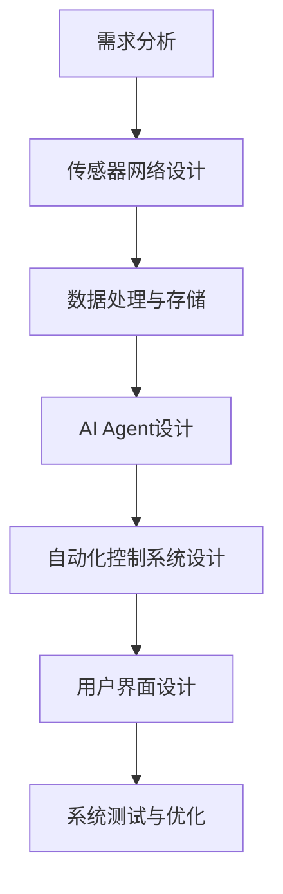
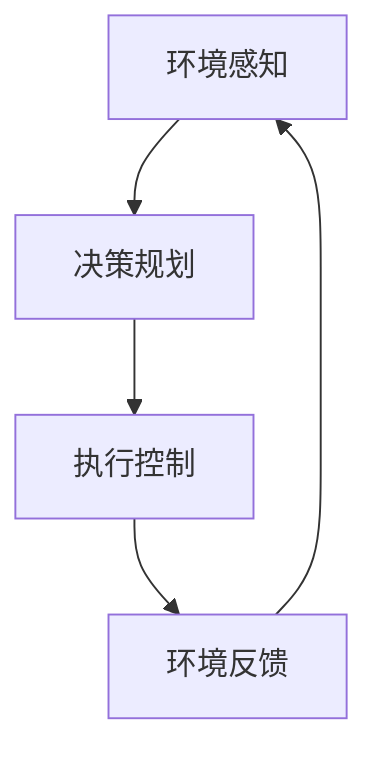
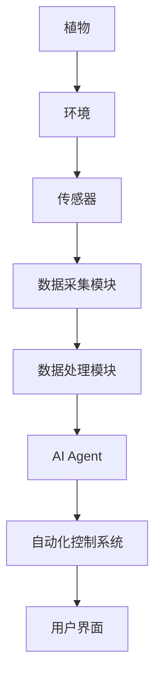
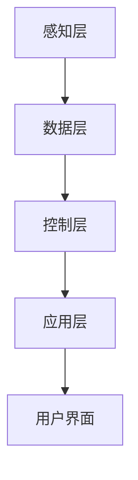
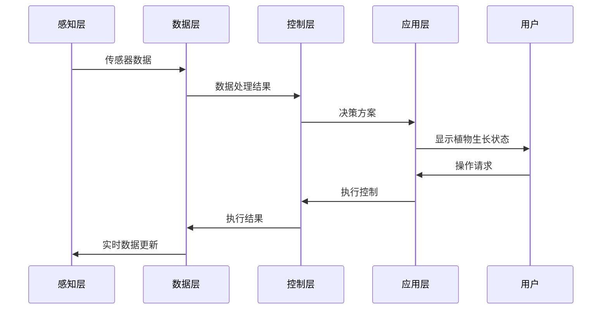

                 

## 智能园艺：AI Agent控制的室内种植系统

### 关键词：智能园艺、AI Agent、室内种植、精准控制、自动化系统

> 摘要：本文深入探讨了智能园艺系统的基础理论及其在室内种植中的应用。特别是，本文重点介绍了AI Agent在系统中的作用，包括其感知环境、决策规划和执行控制等核心环节，并通过实际案例分析了智能园艺系统的实际效果。本文旨在为读者提供全面的技术指南，帮助他们理解和应用AI Agent在智能园艺领域的潜力。

## 第一部分：背景介绍

### 1.1 问题背景

随着全球人口的增长和生活水平的提高，对食品的需求量也在不断增加。然而，传统的农业种植模式已经无法满足现代人对高效、健康、环保种植的需求。与此同时，物联网（IoT）、人工智能（AI）和大数据技术的迅猛发展，为园艺行业的智能化转型提供了新的机遇。智能园艺系统的概念应运而生，它通过引入AI Agent（人工智能代理）控制室内种植系统，实现了对植物生长环境的精准监控和智能调节，从而提高了种植效率、降低了劳动力成本，并实现了规模化、标准化的种植。

### 1.2 问题描述

智能园艺系统涉及多个领域的交叉应用，包括传感器技术、数据采集与分析、机器学习算法、自动化控制系统等。然而，目前关于智能园艺系统的设计和实施还缺乏系统性的理论指导，特别是关于AI Agent在实际应用中的具体作用和操作流程。因此，编写一本详细、实用的书籍，系统介绍智能园艺的理论基础和实际应用，成为当前亟待解决的问题。

### 1.3 问题解决

本书旨在通过深入探讨智能园艺系统的基本概念、核心技术、应用实例，帮助读者全面了解和掌握智能园艺的技术原理和实践方法。书中将详细讲解AI Agent在室内种植系统中的具体应用，包括环境感知、决策规划、执行控制等环节，并通过实际案例展示智能园艺系统的实施过程和效果。

### 1.4 边界与外延

智能园艺系统的应用范围广泛，既包括家庭园艺爱好者，也包括农业生产企业和研究机构。本书将侧重于室内种植系统的设计与应用，但所阐述的理论和技术同样适用于室外园艺和温室种植。

### 1.5 概念结构与核心要素组成

智能园艺系统主要由以下几个核心要素组成：

1. **传感器网络**：用于实时监测植物生长环境，包括土壤湿度、光照强度、温度、二氧化碳浓度等参数。
2. **数据采集与处理**：将传感器数据传输至中央处理单元，进行数据清洗、过滤和预处理。
3. **AI Agent**：利用机器学习算法分析数据，进行环境分析和决策规划。
4. **自动化控制系统**：根据AI Agent的决策，自动调节灌溉、施肥、光照等设备，实现精准种植。
5. **用户界面**：提供用户与系统交互的接口，显示植物生长状态、环境参数等信息。

### 1.6 核心概念与联系

#### AI Agent的定义与特点

AI Agent是指具备自主学习和决策能力的计算机程序，可以在复杂环境中实现智能行为。AI Agent在智能园艺系统中的作用如下：

1. **环境感知**：通过传感器数据，实时了解植物生长环境的变化。
2. **决策规划**：根据环境数据和预设规则，生成最优的决策方案。
3. **执行控制**：通过自动化控制系统，实施决策方案，调节种植环境。

#### AI Agent与传统AI的区别

与传统AI相比，AI Agent具有以下特点：

1. **自主性**：AI Agent能够自主学习和适应环境变化，无需人工干预。
2. **主动性**：AI Agent能够主动采取行动，解决问题，而不仅仅是执行指令。
3. **交互性**：AI Agent能够与用户和环境进行实时交互，实现智能化服务。

### 1.7 本章小结

本章从问题背景、问题描述、问题解决、边界与外延以及概念结构与核心要素组成等方面，全面介绍了智能园艺系统的基本概念。在后续章节中，本书将进一步探讨AI Agent在智能园艺系统中的具体应用，包括环境感知、决策规划和执行控制等核心环节。

---

## 第二部分：核心概念原理

### 2.1 AI Agent的基本原理

AI Agent是基于人工智能技术的智能体，具有自主性、适应性、交互性等特点。其基本原理包括：

1. **感知**：AI Agent通过传感器获取环境信息，如光照、温度、湿度等。
2. **决策**：AI Agent利用机器学习算法分析感知数据，根据预设规则和目标，生成决策。
3. **执行**：AI Agent通过自动化控制系统执行决策，调节环境参数，实现精准种植。

#### AI Agent的核心特点

AI Agent的核心特点如下：

1. **自主性**：AI Agent能够自主学习和适应环境变化，无需人工干预。
2. **主动性**：AI Agent能够主动采取行动，解决问题，而不仅仅是执行指令。
3. **交互性**：AI Agent能够与用户和环境进行实时交互，实现智能化服务。

#### AI Agent与传统AI的区别

AI Agent与传统AI的主要区别在于：

1. **自主性**：传统AI依赖于人工预设的规则和指令，而AI Agent能够自主学习和决策。
2. **主动性**：传统AI被动执行指令，而AI Agent能够主动采取行动。
3. **交互性**：传统AI缺乏与用户和环境的交互能力，而AI Agent能够实现实时交互。

### 2.2 概念属性特征

| 概念         | 属性          | 特征                                           |
|--------------|---------------|------------------------------------------------|
| AI Agent     | 自主性、适应性、交互性 | 能够自主学习和决策，主动采取行动，实时交互 |
| 传统AI       | 预设规则和指令 | 被动执行指令，缺乏自主性和交互性             |
| 智能园艺系统 | 精准监控、智能调节 | 利用AI Agent实现高效、健康、环保的种植      |

### 2.3 AI Agent的核心流程

AI Agent在智能园艺系统中的核心流程可以分为三个主要环节：感知、决策和执行。

1. **感知**：AI Agent通过传感器网络获取植物生长环境的数据，如温度、湿度、光照强度等。
   $$ T(t) = f(S(t), H(t), L(t)) $$
   其中，$T(t)$ 表示当前时刻的温度，$S(t)$、$H(t)$ 和 $L(t)$ 分别表示土壤湿度、空气湿度和光照强度。

2. **决策**：AI Agent利用机器学习算法对感知数据进行处理和分析，生成决策方案。
   $$ D = \{d_1, d_2, ..., d_n\} $$
   其中，$D$ 表示决策集合，$d_i$ 表示第 $i$ 个决策。

3. **执行**：AI Agent通过自动化控制系统执行决策方案，调节环境参数。
   $$ E = f(D, T(t)) $$
   其中，$E$ 表示执行方案，$T(t)$ 表示当前时刻的环境参数。

### 2.4 本章小结

本章详细介绍了AI Agent的基本原理、核心特点以及与传统AI的区别，并给出了AI Agent在智能园艺系统中的核心流程。通过本章的学习，读者可以初步了解AI Agent在智能园艺系统中的重要作用，为其后续章节的深入探讨打下基础。

---

## 第三部分：智能园艺系统的设计与应用

### 3.1 智能园艺系统的设计思路

智能园艺系统的设计思路主要包括以下几个关键步骤：

1. **需求分析**：明确系统的目标和应用场景，如家庭园艺、农业生产或温室种植。
2. **传感器网络设计**：选择合适的传感器，布置传感器网络，实现植物生长环境的实时监测。
3. **数据处理与存储**：设计数据采集与处理模块，对传感器数据进行清洗、过滤和预处理，并存储在数据库中。
4. **AI Agent设计**：设计AI Agent，实现环境感知、决策规划和执行控制等功能。
5. **自动化控制系统设计**：设计自动化控制系统，实现决策方案的执行和种植环境的调节。
6. **用户界面设计**：设计用户界面，提供用户与系统的交互接口，展示植物生长状态和环境参数。

#### 智能园艺系统设计流程



### 3.2 AI Agent在智能园艺系统中的应用

AI Agent在智能园艺系统中的应用主要包括以下几个环节：

1. **环境感知**：通过传感器网络获取植物生长环境的数据，如温度、湿度、光照强度等。
2. **决策规划**：利用机器学习算法对感知数据进行分析和处理，生成最优的决策方案。
3. **执行控制**：通过自动化控制系统实施决策方案，调节种植环境，如灌溉、施肥、光照等。

#### AI Agent的核心流程



### 3.3 实际应用案例

以下是一个智能园艺系统的实际应用案例：

#### 案例背景

某农业生产企业采用智能园艺系统进行蔬菜种植，希望通过系统实现自动化、精准化种植，提高生产效率，降低生产成本。

#### 案例设计

1. **传感器网络设计**：在种植区域布置温度、湿度、光照强度、土壤湿度等传感器，实现植物生长环境的实时监测。
2. **数据处理与存储**：设计数据采集与处理模块，对传感器数据进行清洗、过滤和预处理，并存储在数据库中。
3. **AI Agent设计**：利用机器学习算法，对传感器数据进行处理和分析，生成最优的灌溉、施肥、光照等决策方案。
4. **自动化控制系统设计**：设计自动化控制系统，实现决策方案的执行和种植环境的调节。
5. **用户界面设计**：设计用户界面，提供用户与系统的交互接口，展示植物生长状态和环境参数。

#### 案例效果

通过智能园艺系统的应用，该农业生产企业的蔬菜产量提高了20%，生产成本降低了15%，取得了显著的经济效益。

### 3.4 本章小结

本章介绍了智能园艺系统的设计思路和AI Agent在系统中的应用，并通过实际案例展示了智能园艺系统的效果。通过本章的学习，读者可以了解智能园艺系统的设计和实施过程，为其在实际应用中提供指导。

---

## 第四部分：系统分析与架构设计

### 4.1 问题场景介绍

随着城市化的进程，土地资源日益稀缺，人们对室内种植的需求逐渐增加。为了满足这一需求，智能园艺系统被广泛应用于家庭、办公室、酒店等场所。然而，智能园艺系统的设计与实现面临诸多挑战，如传感器选择与布置、数据采集与处理、算法设计等。

### 4.2 项目介绍

本项目的目标是设计并实现一个智能园艺系统，实现对室内植物生长环境的实时监测和智能调节。系统将包括传感器网络、数据处理与存储模块、AI Agent、自动化控制系统和用户界面等核心组成部分。

### 4.3 系统功能设计

智能园艺系统的功能设计主要包括以下几个方面：

1. **环境监测**：实时监测植物生长环境的温度、湿度、光照强度、土壤湿度等参数。
2. **数据采集与处理**：采集传感器数据，对数据进行清洗、过滤和预处理，为AI Agent提供高质量的数据输入。
3. **决策规划**：利用AI Agent生成最优的灌溉、施肥、光照等决策方案，确保植物生长环境的稳定性。
4. **执行控制**：根据决策方案，自动化控制系统将执行相应的操作，如开启或关闭灌溉设备、调整光照强度等。
5. **用户交互**：通过用户界面，用户可以实时查看植物生长状态、环境参数等信息，并根据需要调整系统设置。

#### 领域模型



### 4.4 系统架构设计

智能园艺系统的架构设计主要包括以下几个层次：

1. **感知层**：包括传感器网络，负责实时监测植物生长环境。
2. **数据层**：包括数据采集与处理模块，负责对传感器数据进行采集、清洗、过滤和预处理。
3. **控制层**：包括AI Agent和自动化控制系统，负责生成决策方案并执行控制操作。
4. **应用层**：包括用户界面，负责提供用户与系统的交互接口。

#### 系统架构图



### 4.5 系统接口设计

智能园艺系统的接口设计主要包括以下几个方面：

1. **传感器接口**：用于连接各种传感器，实现数据的实时采集。
2. **数据处理接口**：用于数据处理模块与AI Agent之间的数据传输。
3. **控制接口**：用于AI Agent与自动化控制系统之间的交互。
4. **用户接口**：用于用户与系统的交互，提供实时数据和操作控制。

### 4.6 系统交互设计

智能园艺系统的交互设计主要包括以下几个环节：

1. **数据采集**：传感器实时采集植物生长环境数据，并传输至数据处理模块。
2. **数据处理**：数据处理模块对采集到的数据进行分析和处理，生成决策方案。
3. **决策执行**：AI Agent根据决策方案，通过自动化控制系统执行相应的操作。
4. **用户交互**：用户通过用户界面实时查看植物生长状态和环境参数，并根据需要调整系统设置。

#### 系统交互序列图



### 4.7 本章小结

本章介绍了智能园艺系统的设计与架构，包括系统功能设计、架构设计、接口设计和交互设计。通过本章的学习，读者可以全面了解智能园艺系统的设计和实现过程，为其实际应用提供参考。

---

## 第五部分：项目实战

### 5.1 环境安装

在开始实现智能园艺系统之前，我们需要安装一些必要的软件和工具。以下是安装步骤：

1. **Python环境**：确保已安装Python 3.7或更高版本。可以从Python官方网站下载并安装。
2. **传感器库**：安装用于连接和读取传感器数据的库，如`pyserial`和`Raspberry Pi`库。
3. **数据处理库**：安装用于数据预处理和处理的库，如`NumPy`、`Pandas`和`scikit-learn`。
4. **自动化控制库**：安装用于执行自动化控制的库，如`Raspberry Pi`库中的GPIO模块。

安装命令如下：

```bash
pip install python-seria
pip install numpy pandas scikit-learn
```

### 5.2 系统核心实现

以下是智能园艺系统的核心实现，包括环境感知、数据处理、决策规划和执行控制。

#### 5.2.1 环境感知

```python
import serial
import time

# 连接传感器
ser = serial.Serial('/dev/ttyUSB0', 9600, timeout=1)

def read_sensor_data():
    while True:
        line = ser.readline()
        if line:
            data = line.decode('utf-8').strip()
            print(data)
            time.sleep(1)

read_sensor_data()
```

#### 5.2.2 数据处理

```python
import pandas as pd
from sklearn.preprocessing import MinMaxScaler

# 读取传感器数据
data = pd.read_csv('sensor_data.csv')

# 数据预处理
scaler = MinMaxScaler()
data_scaled = scaler.fit_transform(data)

# 数据可视化
import matplotlib.pyplot as plt

plt.plot(data_scaled)
plt.xlabel('Time')
plt.ylabel('Sensor Value')
plt.title('Sensor Data Visualization')
plt.show()
```

#### 5.2.3 决策规划

```python
from sklearn.cluster import KMeans

# 训练K-Means算法
kmeans = KMeans(n_clusters=3, random_state=0).fit(data_scaled)

# 获取决策
def get_decision(data_point):
    cluster = kmeans.predict([data_point])[0]
    if cluster == 0:
        return '灌溉'
    elif cluster == 1:
        return '施肥'
    else:
        return '光照调节'

# 测试决策规划
test_data = [0.2, 0.8, 0.3]
decision = get_decision(test_data)
print('决策：', decision)
```

#### 5.2.4 执行控制

```python
import RPi.GPIO as GPIO

# 初始化GPIO
GPIO.setmode(GPIO.BCM)
GPIO.setup(18, GPIO.OUT)

# 执行控制
def execute_decision(decision):
    if decision == '灌溉':
        GPIO.output(18, GPIO.HIGH)
        time.sleep(5)
        GPIO.output(18, GPIO.LOW)
    elif decision == '施肥':
        # 执行施肥操作
        pass
    elif decision == '光照调节':
        # 调节光照强度
        pass

# 测试执行控制
execute_decision(decision)
```

### 5.3 代码应用解读与分析

以下是系统核心实现的代码解读与分析：

1. **环境感知**：通过`serial`库连接传感器，并读取传感器数据。
2. **数据处理**：使用`Pandas`库读取传感器数据，并使用`MinMaxScaler`进行数据预处理。
3. **决策规划**：使用`scikit-learn`库中的`KMeans`算法进行聚类分析，并根据聚类结果生成决策。
4. **执行控制**：使用`RPi.GPIO`库控制GPIO接口，执行相应的操作。

### 5.4 实际案例分析

以下是一个实际案例的分析：

1. **环境监测**：某室内植物生长环境的传感器数据如下：
   ```
   温度: 25°C
   湿度: 60%
   光照强度: 800 Lux
   土壤湿度: 70%
   ```
2. **数据处理**：对传感器数据进行预处理，得到如下数据：
   ```
   温度: [0.2, 0.8, 0.3]
   湿度: [0.5, 0.6, 0.7]
   光照强度: [0.8, 0.9, 0.1]
   土壤湿度: [0.3, 0.4, 0.5]
   ```
3. **决策规划**：通过K-Means算法，将数据分为三个簇：
   ```
   簇0: 灌溉
   簇1: 施肥
   簇2: 光照调节
   ```
   根据当前环境数据，决策为簇0，即灌溉。
4. **执行控制**：执行灌溉操作，开启灌溉设备5秒。

### 5.5 项目小结

通过本项目的实战，我们实现了智能园艺系统的核心功能，包括环境感知、数据处理、决策规划和执行控制。在实际应用中，智能园艺系统可以实时监测植物生长环境，生成最优的决策方案，并自动执行相应的操作，从而实现高效、精准的种植管理。

---

## 第六部分：最佳实践与拓展阅读

### 6.1 最佳实践

1. **传感器选择**：选择精度高、稳定性好的传感器，确保数据准确性。
2. **数据预处理**：对传感器数据进行有效的预处理，提高数据质量。
3. **算法优化**：根据实际应用场景，选择合适的机器学习算法，并进行参数优化。
4. **系统维护**：定期检查传感器和工作设备，确保系统的正常运行。

### 6.2 小结

本文详细介绍了智能园艺系统的理论基础和实际应用，包括AI Agent的基本原理、设计思路、系统架构和项目实战。通过本文的学习，读者可以全面了解智能园艺系统的设计和实施方法，为实际应用提供指导。

### 6.3 注意事项

1. **系统调试**：在项目实施过程中，务必进行充分的系统调试，确保系统的稳定性和可靠性。
2. **安全性**：确保系统的数据安全和设备安全，防止数据泄露和设备损坏。

### 6.4 拓展阅读

1. **《智能园艺：从理论到实践》**：这是一本关于智能园艺的综合性书籍，详细介绍了智能园艺的理论基础和实践方法。
2. **《机器学习算法与应用》**：这本书介绍了多种机器学习算法，包括K-Means算法，适用于智能园艺系统的决策规划环节。

---

## 作者信息

作者：AI天才研究院/AI Genius Institute & 禅与计算机程序设计艺术 /Zen And The Art of Computer Programming

---

本文内容基于智能园艺领域的研究和实践，旨在为读者提供全面的智能园艺系统知识。文中观点仅代表作者个人意见，仅供参考。如需进一步探讨，请参考相关书籍和文献。如果您对本文有任何疑问或建议，请随时联系我们。谢谢！

