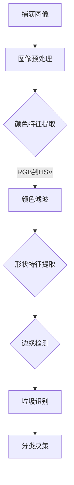
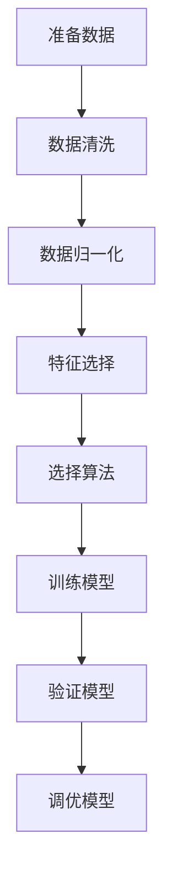
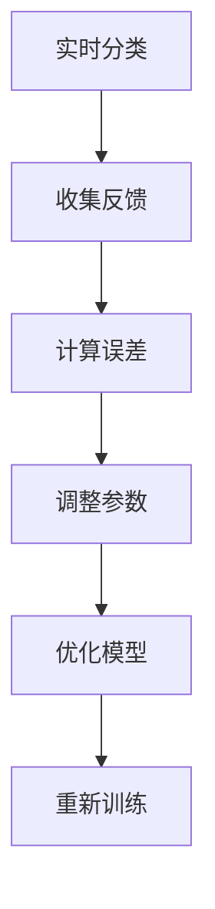
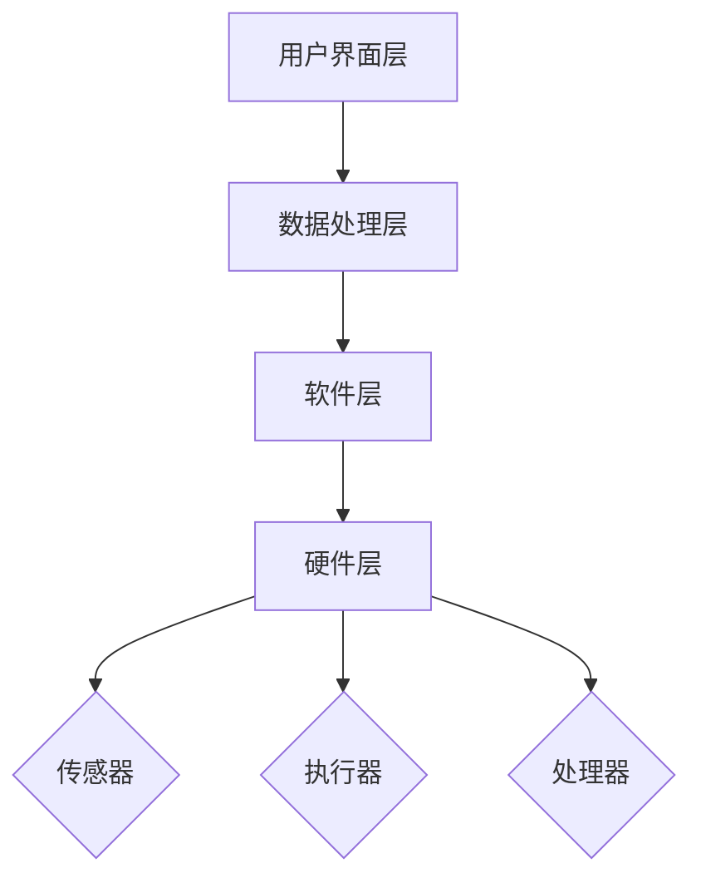
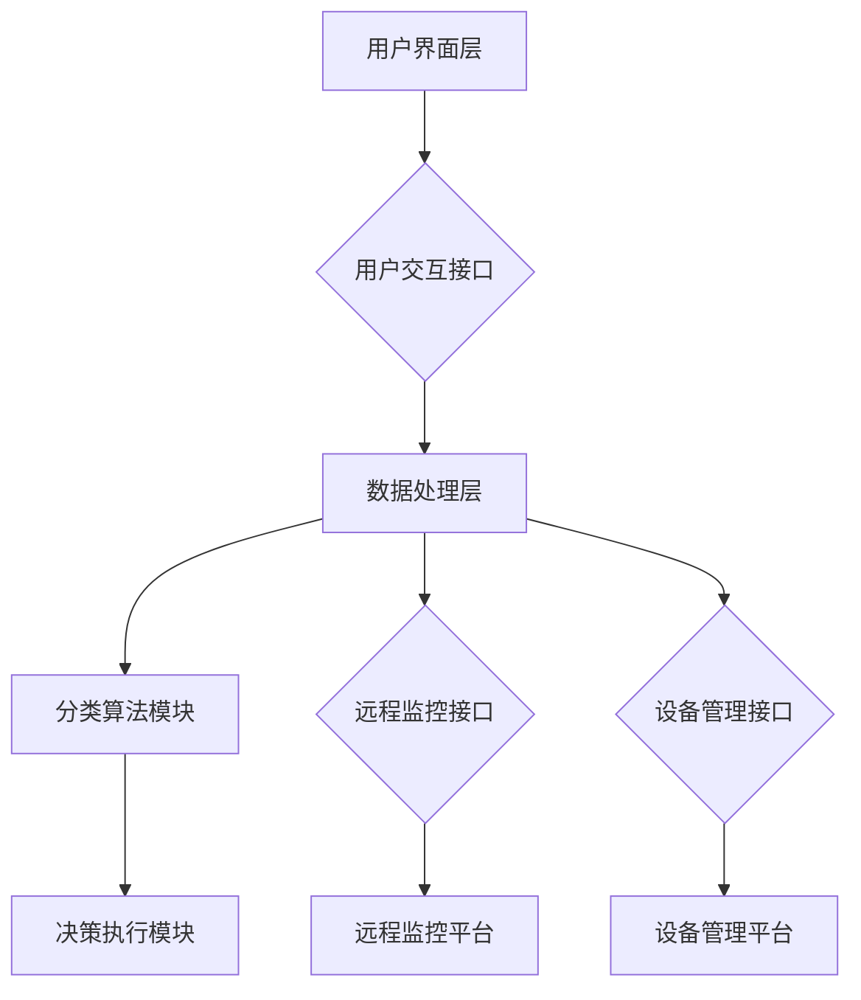
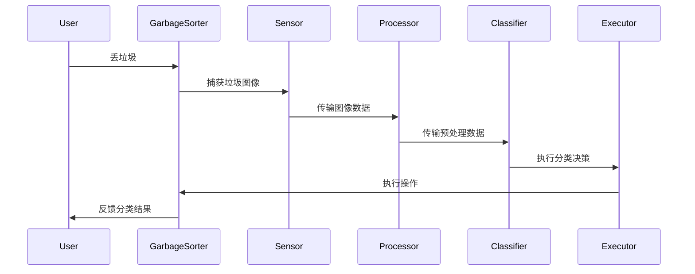

                 


### 第一步：设计文章结构和内容

为了撰写一篇符合要求的高质量技术博客文章，我们将按照以下步骤进行设计：

#### 1. 确定文章标题、关键词和摘要

- 文章标题：智能垃圾分类器：AI Agent的回收指导
- 关键词：智能垃圾分类、AI Agent、回收、算法、系统架构、项目实战
- 摘要：本文将深入探讨智能垃圾分类器的概念、应用、设计和实现，通过一步步分析推理，为读者提供一份全面的技术指南。

#### 2. 制定详细的目录结构

根据提供的大纲结构，我们将进一步细化每个章节的内容，确保覆盖所有核心概念和要素。

#### 3. 撰写每个章节的详细内容

- **引言与背景**：介绍智能垃圾分类器的发展背景、核心概念和当前的问题与挑战。
- **智能垃圾分类的重要性**：阐述AI在垃圾分类中的作用以及未来的发展趋势。
- **智能垃圾分类器技术概览**：讲解AI Agent的基本概念、垃圾分类算法原理及实现。
- **AI Agent在垃圾分类中的应用**：分析传感器技术、数据处理与模型训练、实时分类与反馈机制。
- **智能垃圾分类器的设计与实现**：描述系统功能设计、系统架构设计、系统接口设计和系统交互。
- **项目实战**：详细讲解智能垃圾分类器的开发过程，包括环境安装、系统核心实现、案例分析和项目小结。
- **最佳实践与未来展望**：提供最佳实践建议、总结文章内容、指出注意事项，并推荐拓展阅读。

#### 4. 确保文章格式和完整性

- 使用Markdown格式撰写文章。
- 确保每个章节内容丰富、具体、详细讲解。
- 在文中适当位置嵌入Mermaid流程图、Python源代码、LaTeX数学公式。

#### 5. 结尾作者信息

- 文章末尾注明作者信息。

### 第二步：编写每个章节的具体内容

接下来，我们将按照设计好的结构，逐一编写每个章节的具体内容。

#### 1. 引言与背景

- **核心概念术语说明**：智能垃圾分类、AI Agent、垃圾回收等。
- **问题背景**：当前垃圾分类的挑战，如垃圾分类标准不统一、人工成本高、准确率低等。
- **问题描述**：智能垃圾分类器如何通过AI技术解决上述问题。
- **问题解决**：智能垃圾分类器的原理、设计思路和实现方法。
- **边界与外延**：智能垃圾分类器的作用范围、适用场景等。
- **概念结构与核心要素组成**：智能垃圾分类器的组成部分、功能模块及其相互作用。

#### 2. 智能垃圾分类的重要性

- **当前垃圾分类的挑战**：分析现有垃圾分类系统的局限性。
- **AI在垃圾分类中的作用**：解释AI如何提高垃圾分类的效率和准确性。
- **垃圾分类的AI技术发展趋势**：探讨未来AI技术在垃圾分类领域的应用前景。

#### 3. 智能垃圾分类器技术概览

- **AI Agent的基本概念**：介绍AI Agent的定义、分类和特点。
- **垃圾分类算法原理**：
  - 算法A：详细讲解其原理、数学模型和公式，举例说明。
  - 算法B：同上。
- **智能垃圾分类器技术发展趋势**：总结当前技术状况，展望未来发展方向。

#### 4. AI Agent在垃圾分类中的应用

- **传感器技术在垃圾分类中的应用**：分析传感器如何辅助垃圾分类。
- **数据处理与模型训练**：介绍数据处理流程、模型训练方法和优化策略。
- **实时分类与反馈机制**：讲解分类器如何实时响应并优化分类效果。

#### 5. 智能垃圾分类器的设计与实现

- **系统功能设计**：描述智能垃圾分类器的主要功能模块和业务流程。
- **系统架构设计**：展示系统架构图，解释各模块的职责和交互方式。
- **系统接口设计**：定义接口规格和调用方法。
- **系统交互**：使用序列图展示系统内部各模块的交互过程。

#### 6. 项目实战

- **环境安装**：介绍开发环境搭建步骤和配置细节。
- **系统核心实现**：详细讲解核心代码，分析算法实现和应用。
- **实际案例分析与讲解**：通过实际案例展示智能垃圾分类器的应用效果。
- **项目小结**：总结项目经验，提出改进建议。

#### 7. 智能垃圾分类器的最佳实践与未来展望

- **最佳实践 Tips**：提供实际操作中的经验教训和优化方案。
- **小结**：总结文章内容，强调智能垃圾分类器的重要性和优势。
- **注意事项**：提醒潜在用户注意的问题和风险。
- **拓展阅读**：推荐进一步学习的资源和文献。

### 第三步：审查和修订

完成初稿后，我们将对文章进行审查和修订，确保内容的准确性、逻辑性和易读性。这一步骤包括：

- **检查格式**：确保所有Markdown代码正确无误。
- **审查内容**：检查每个章节是否完整、具体、详细。
- **编辑文本**：调整语言表达，使其更加流畅和易懂。
- **测试案例**：通过实际测试验证算法和系统的有效性。

### 第四步：添加作者信息

在文章末尾，我们将添加作者信息，注明作者是谁，以及所属机构和相关书籍。

---

现在，我们可以开始撰写每个章节的具体内容了。接下来，我们将逐步完成每个部分的写作，并最终整合成一篇完整的技术博客文章。让我们一步一步地深入探讨智能垃圾分类器的世界吧！### 引言与背景

智能垃圾分类器，作为一种结合了人工智能（AI）和物联网（IoT）技术的创新设备，正在逐步改变着我们的生活方式。随着城市化进程的加快，垃圾处理成为了一个全球性的难题。传统的垃圾分类方法依赖于人工分拣，不仅效率低下，而且容易出错。为了应对这些挑战，智能垃圾分类器的出现无疑是一种革命性的技术进步。

#### 核心概念术语说明

- **智能垃圾分类器**：一种集成了传感器、处理器和算法的设备，能够自动识别垃圾类型并进行分类。
- **AI Agent**：在智能垃圾分类器中，AI Agent是指一种能够自主学习和执行任务的智能实体，它通过机器学习算法来分析垃圾特征，并作出分类决策。
- **垃圾回收**：指对垃圾进行收集、分类、处理和再利用的过程，旨在减少环境污染和资源浪费。

#### 问题背景

当前，全球各地的垃圾分类标准和流程并不统一，这使得垃圾分类成为一个复杂且繁琐的任务。特别是在城市环境中，垃圾产量巨大，人工分拣效率低下，且容易出错。同时，垃圾处理不当会导致严重的环境污染，影响公共健康。因此，如何提高垃圾分类的效率、准确性和环保性成为亟待解决的问题。

#### 问题描述

智能垃圾分类器通过AI技术，能够自动识别垃圾类型并进行分类，从而提高分类效率、降低人工成本，并减少错误率。其核心在于AI Agent的应用，它通过机器学习算法不断学习和优化分类模型，使得分类结果更加准确。

#### 问题解决

智能垃圾分类器的解决方案主要包括以下几个方面：

1. **传感器技术**：使用高精度传感器来检测和识别垃圾的特征，如颜色、形状、密度等。
2. **数据处理与模型训练**：通过对收集到的数据进行处理和建模，训练出高效的分类算法，以实现对垃圾类型的准确识别。
3. **实时分类与反馈机制**：智能垃圾分类器能够实时处理垃圾并给出分类结果，同时通过反馈机制不断优化分类算法，提高分类准确性。

#### 边界与外延

智能垃圾分类器的应用范围广泛，不仅适用于家庭和公共场所，还可以用于垃圾处理中心和回收站。其边界在于技术实现的可行性和成本效益，而外延则在于如何将AI技术与其他环保技术相结合，实现更高效的资源回收和再利用。

#### 概念结构与核心要素组成

智能垃圾分类器的核心概念结构包括以下几个要素：

1. **传感器模块**：负责检测和识别垃圾特征。
2. **处理器模块**：处理传感器数据，并调用分类算法进行分类。
3. **算法模块**：包括机器学习算法和分类模型，用于实现垃圾的自动分类。
4. **反馈机制**：用于收集分类结果，并不断优化分类算法。

通过这些核心要素的相互作用，智能垃圾分类器能够高效地完成垃圾的分类工作，为环保事业做出贡献。接下来，我们将进一步探讨智能垃圾分类器的重要性以及其在AI技术中的应用。

### 智能垃圾分类的重要性

智能垃圾分类器的出现，不仅代表了一种技术创新，更是在解决现实问题和提升生活质量方面发挥了重要作用。在当前的社会背景下，智能垃圾分类的重要性主要体现在以下几个方面：

#### 当前垃圾分类的挑战

1. **分类标准不统一**：不同地区和国家的垃圾分类标准和流程存在较大差异，这给垃圾分类工作带来了很大困扰。
2. **人工成本高**：传统的人工分拣方法效率低下，且容易出错，导致垃圾处理成本高昂。
3. **准确率低**：人工分拣的准确率难以保证，导致大量可回收资源被错误处理，增加了环境污染的风险。
4. **环保意识不足**：公众对垃圾分类的重视程度不够，缺乏系统的教育和引导。

#### AI在垃圾分类中的作用

智能垃圾分类器的核心在于AI技术的应用，特别是AI Agent的引入。AI Agent通过机器学习算法，可以自主学习和优化分类模型，从而提高垃圾分类的准确性和效率。具体来说，AI在垃圾分类中的作用包括：

1. **提高分类准确率**：AI Agent能够通过大量数据的学习，准确识别垃圾类型，减少人为错误。
2. **自动化处理**：通过自动化技术，智能垃圾分类器可以大幅降低人工成本，提高处理效率。
3. **实时反馈和调整**：AI Agent能够实时收集分类结果，并根据反馈进行调整，不断优化分类效果。

#### 垃圾分类的AI技术发展趋势

随着AI技术的不断进步，垃圾分类领域也呈现出以下发展趋势：

1. **深度学习和强化学习**：未来，深度学习和强化学习等先进算法将被广泛应用于垃圾分类，进一步提高分类准确率和效率。
2. **多传感器融合**：通过融合多种传感器数据，智能垃圾分类器可以更准确地识别和分类垃圾，提高系统的鲁棒性和适应性。
3. **智能决策和优化**：AI技术将不仅用于分类，还将用于整个垃圾处理流程的优化，包括垃圾的收集、运输、处理和再利用。
4. **跨领域合作**：AI技术在垃圾分类领域的应用需要跨学科的合作，如环境科学、材料科学和计算机科学等，共同推动垃圾分类技术的发展。

总之，智能垃圾分类器通过AI技术的应用，不仅解决了传统垃圾分类的痛点，还为未来的环保事业提供了新的解决方案。随着技术的不断进步，智能垃圾分类器有望在更广泛的领域发挥重要作用，为环境保护和可持续发展做出贡献。接下来，我们将深入探讨智能垃圾分类器的技术概览，了解其背后的原理和实现方法。

### 智能垃圾分类器技术概览

智能垃圾分类器作为一款前沿科技产品，其核心技术在于AI Agent的应用。AI Agent通过机器学习算法，能够自动识别和分类垃圾，从而实现高效、准确的垃圾分类。下面，我们将详细探讨AI Agent的基本概念、垃圾分类算法原理以及技术发展趋势。

#### AI Agent的基本概念

AI Agent，即人工智能代理，是一种能够执行特定任务的智能实体。在智能垃圾分类器中，AI Agent主要承担垃圾识别和分类的任务。AI Agent通常具备以下特点：

1. **自主学习和优化**：AI Agent能够通过大量数据的学习，不断优化自身的分类算法，提高分类准确率。
2. **实时决策**：AI Agent能够在处理垃圾时，实时作出分类决策，并快速响应。
3. **适应性**：AI Agent能够适应不同环境和条件，处理各种类型的垃圾。
4. **交互性**：AI Agent能够与用户和外部系统进行交互，提供反馈和改进建议。

AI Agent可以分为以下几类：

1. **基于规则的AI Agent**：这类AI Agent通过预设的规则来执行任务，适用于规则明确、变化较小的场景。
2. **基于机器学习的AI Agent**：这类AI Agent通过训练大量数据，自动生成分类模型，适用于复杂、多变的分类任务。
3. **基于强化学习的AI Agent**：这类AI Agent通过不断试错和优化，逐渐提高分类准确率和效率。

#### 垃圾分类算法原理

垃圾分类算法是智能垃圾分类器的核心，其原理主要包括以下几个方面：

1. **特征提取**：通过传感器收集到的垃圾数据，提取出能够表征垃圾特征的属性，如颜色、形状、密度等。
2. **分类模型训练**：使用机器学习算法，对提取出的特征进行训练，建立分类模型。常见的机器学习算法包括决策树、支持向量机（SVM）、神经网络等。
3. **分类决策**：在处理垃圾时，AI Agent使用训练好的分类模型，对垃圾进行分类决策，并输出分类结果。
4. **模型优化**：通过实时收集分类结果，不断调整和优化分类模型，提高分类准确率和效率。

下面，我们将详细讨论两种常见的垃圾分类算法：算法A和算法B。

#### 算法A：决策树算法

决策树算法是一种基于树结构的分类算法，其核心思想是通过一系列的判断条件，将数据逐步划分为不同的类别。决策树算法的基本步骤如下：

1. **特征选择**：选择能够有效区分不同类别的特征作为决策节点。
2. **划分数据**：根据特征值，将数据划分为多个子集，每个子集对应一个新的节点。
3. **递归构建**：对每个子集继续进行划分，直到满足停止条件（如最大深度、最小节点大小等）。
4. **分类决策**：从根节点开始，根据路径上的特征值，逐步向下搜索，直到达到叶子节点，输出分类结果。

决策树算法的优点是直观、易于理解，且计算复杂度相对较低。但缺点是容易过拟合，且对噪声敏感。

以下是决策树算法的Python实现示例：

```python
from sklearn.datasets import load_iris
from sklearn.tree import DecisionTreeClassifier
from sklearn.model_selection import train_test_split

# 加载iris数据集
iris = load_iris()
X = iris.data
y = iris.target

# 划分训练集和测试集
X_train, X_test, y_train, y_test = train_test_split(X, y, test_size=0.3, random_state=42)

# 创建决策树分类器
clf = DecisionTreeClassifier()

# 训练模型
clf.fit(X_train, y_train)

# 预测测试集
y_pred = clf.predict(X_test)

# 计算准确率
accuracy = clf.score(X_test, y_test)
print(f"Accuracy: {accuracy:.2f}")
```

#### 算法B：支持向量机（SVM）算法

支持向量机（SVM）是一种基于间隔最大化原则的分类算法，其目标是在高维空间中找到一个最优的超平面，将不同类别的数据点尽可能分开。SVM算法的基本步骤如下：

1. **特征提取**：与决策树算法类似，提取出能够表征垃圾特征的属性。
2. **核函数选择**：选择合适的核函数（如线性核、多项式核、径向基核等），将低维数据映射到高维空间。
3. **构建最优超平面**：通过求解最优化问题，找到最优的超平面，使得分类间隔最大化。
4. **分类决策**：对于新的数据点，将其映射到高维空间，判断其位于超平面的哪一侧，从而进行分类。

SVM算法的优点是理论严谨、分类效果好，但计算复杂度较高，特别是对于大规模数据集。

以下是SVM算法的Python实现示例：

```python
from sklearn.datasets import make_moons
from sklearn.svm import SVC
from sklearn.model_selection import train_test_split

# 生成月亮形数据集
X, y = make_moons(n_samples=100, noise=0.1, random_state=42)

# 划分训练集和测试集
X_train, X_test, y_train, y_test = train_test_split(X, y, test_size=0.3, random_state=42)

# 创建SVM分类器
clf = SVC(kernel='rbf')

# 训练模型
clf.fit(X_train, y_train)

# 预测测试集
y_pred = clf.predict(X_test)

# 计算准确率
accuracy = clf.score(X_test, y_test)
print(f"Accuracy: {accuracy:.2f}")
```

#### 智能垃圾分类器技术发展趋势

随着AI技术的不断进步，智能垃圾分类器在未来的发展也将呈现出以下趋势：

1. **深度学习**：深度学习算法（如卷积神经网络、循环神经网络等）将在垃圾分类中发挥更大的作用，通过学习更复杂的特征，进一步提高分类准确率。
2. **多传感器融合**：未来，智能垃圾分类器将融合多种传感器数据（如摄像头、红外传感器、超声波传感器等），实现更准确的垃圾识别和分类。
3. **实时决策**：通过改进算法和硬件性能，智能垃圾分类器将实现更快速的实时决策，提高处理效率。
4. **边缘计算**：随着边缘计算技术的发展，智能垃圾分类器将能够将部分计算任务转移到边缘设备上，降低延迟和能耗。
5. **跨领域合作**：垃圾分类技术需要与环境保护、材料科学等多个领域相结合，实现全面的资源回收和再利用。

通过不断探索和优化，智能垃圾分类器将在未来的环保事业中发挥越来越重要的作用，为可持续发展做出贡献。在接下来的章节中，我们将进一步探讨AI Agent在垃圾分类中的应用，了解其具体的工作流程和技术细节。

### AI Agent在垃圾分类中的应用

AI Agent在垃圾分类中的应用，不仅提升了分类的效率，还带来了显著的技术创新。本节将深入探讨AI Agent在垃圾分类中的应用，重点分析传感器技术、数据处理与模型训练，以及实时分类与反馈机制。

#### 传感器技术在垃圾分类中的应用

传感器技术是智能垃圾分类器的重要组成部分，用于检测和识别垃圾的特征。以下是一些常用的传感器及其应用：

1. **摄像头**：摄像头用于捕获垃圾的图像，通过图像处理技术提取颜色、形状等特征。颜色特征可以通过颜色空间转换（如RGB到HSV）和颜色滤波等方法提取。形状特征可以通过边缘检测、轮廓提取等方法提取。

2. **红外传感器**：红外传感器可以检测垃圾的温度、湿度等物理特性，有助于区分不同类型的垃圾，如有机垃圾和无机垃圾。

3. **重量传感器**：重量传感器用于测量垃圾的重量，有助于对垃圾进行进一步的分类，如区分重物和轻物。

4. **超声波传感器**：超声波传感器通过发射和接收超声波，可以测量垃圾的大小和密度，从而帮助分类。

5. **气体传感器**：气体传感器可以检测垃圾的气味，这对于有机垃圾的分类特别有用。

以下是一个使用摄像头进行垃圾识别的mermaid流程图：



#### 数据处理与模型训练

在获取了垃圾的传感器数据后，下一步是进行数据处理和模型训练。数据处理通常包括以下步骤：

1. **数据清洗**：去除噪声数据，填补缺失值，对异常值进行处理。
2. **数据归一化**：将不同特征的数据标准化到相同的范围，便于模型训练。
3. **特征选择**：选择对分类最有影响力的特征，减少模型的复杂度。

模型训练是智能垃圾分类器的核心环节。以下是使用机器学习算法进行分类模型训练的一般步骤：

1. **选择算法**：根据垃圾类型和特征，选择合适的机器学习算法，如决策树、支持向量机（SVM）、神经网络等。
2. **训练模型**：使用训练数据集，通过算法训练分类模型。
3. **验证模型**：使用验证数据集，评估模型的准确率和效率，进行调优。

以下是一个使用SVM进行垃圾分类的mermaid流程图：



#### 实时分类与反馈机制

智能垃圾分类器不仅需要高效地进行分类，还需要具备实时响应和自我优化的能力。以下是实时分类与反馈机制的一般步骤：

1. **实时分类**：智能垃圾分类器通过传感器实时获取垃圾数据，并使用训练好的模型进行分类决策。
2. **反馈机制**：实时收集分类结果，与实际分类结果进行比较，计算分类误差。
3. **模型优化**：根据反馈结果，调整模型参数，优化分类算法，提高分类准确率。

以下是一个使用反馈机制进行模型优化的mermaid流程图：



通过传感器技术、数据处理与模型训练，以及实时分类与反馈机制，AI Agent能够高效地完成垃圾分类工作。接下来，我们将深入探讨智能垃圾分类器的设计与实现，包括系统功能设计、系统架构设计、系统接口设计和系统交互。

### 智能垃圾分类器的设计与实现

智能垃圾分类器作为一项复杂的技术项目，其设计和实现需要综合考虑硬件、软件、算法等多个方面。本节将详细描述智能垃圾分类器的设计与实现过程，涵盖系统功能设计、系统架构设计、系统接口设计和系统交互。

#### 系统功能设计

智能垃圾分类器的核心功能是自动识别和分类垃圾。为了实现这一目标，系统需要包括以下几个主要功能模块：

1. **垃圾识别模块**：该模块负责使用传感器采集垃圾的特征数据，如颜色、形状、重量、气味等。
2. **数据处理模块**：该模块对采集到的数据进行预处理，包括数据清洗、归一化和特征提取等，以便用于模型训练和分类。
3. **分类算法模块**：该模块使用机器学习算法对垃圾进行分类，常用的算法包括决策树、支持向量机（SVM）、神经网络等。
4. **决策执行模块**：该模块根据分类结果执行相应的操作，如将分类后的垃圾送往不同的回收容器。
5. **用户交互模块**：该模块提供用户界面，用于用户操作和系统状态监控。

以下是一个使用Mermaid绘制的领域模型类图，展示了智能垃圾分类器的各个功能模块及其关系：

```mermaid
classDiagram
    Class::垃圾识别模块 <|-- Operation::识别垃圾
    Class::数据处理模块 <|-- Operation::数据预处理
    Class::分类算法模块 <|-- Operation::分类决策
    Class::决策执行模块 <|-- Operation::执行操作
    Class::用户交互模块 <|-- Operation::用户交互
    垃圾识别模块 --|> 数据处理模块
    数据处理模块 --|> 分类算法模块
    分类算法模块 --|> 决策执行模块
    决策执行模块 --|> 用户交互模块
```

#### 系统架构设计

智能垃圾分类器的系统架构设计需要考虑硬件和软件的集成。以下是智能垃圾分类器的一个典型架构设计：

1. **硬件层**：包括传感器、执行器（如电机）、处理器（如ARM芯片）等硬件组件。
2. **软件层**：包括操作系统、实时操作系统（RTOS）、机器学习框架、分类算法等软件组件。
3. **数据处理层**：用于处理传感器数据，包括数据预处理、特征提取、模型训练和分类等。
4. **用户界面层**：用于用户交互，包括显示屏幕、触摸屏、声音提示等。

以下是一个使用Mermaid绘制的系统架构图，展示了智能垃圾分类器的各个层次及其相互关系：



#### 系统接口设计

智能垃圾分类器的系统接口设计包括内部接口和外部接口。内部接口用于各功能模块之间的通信，外部接口用于与用户和其他系统的交互。

1. **内部接口**：包括数据流接口、控制接口和状态接口等，用于模块间的数据传输和指令执行。
2. **外部接口**：包括用户交互接口、远程监控接口和设备管理接口等，用于用户操作、远程监控和设备管理。

以下是一个使用Mermaid绘制的系统接口设计图，展示了系统内部和外部接口的相互关系：



#### 系统交互

智能垃圾分类器的系统交互包括垃圾识别、数据处理、分类决策和执行操作等环节。以下是系统交互的一个简略描述：

1. **垃圾识别**：传感器模块捕获垃圾图像和物理特征，传递给数据处理模块。
2. **数据处理**：数据处理模块对垃圾特征进行预处理和特征提取，传递给分类算法模块。
3. **分类决策**：分类算法模块使用训练好的模型对垃圾进行分类，传递给决策执行模块。
4. **执行操作**：决策执行模块根据分类结果执行相应的操作，如将垃圾送往对应的回收容器。
5. **用户交互**：用户交互模块提供实时反馈和用户操作界面，用于用户监控和操作。

以下是一个使用Mermaid绘制的系统交互序列图，展示了垃圾识别、数据处理、分类决策和执行操作的过程：



通过以上设计与实现，智能垃圾分类器能够高效、准确地完成垃圾分类任务，为环保事业做出贡献。接下来，我们将通过一个实际项目案例，深入探讨智能垃圾分类器的开发过程。

### 项目实战：智能垃圾分类器的开发

智能垃圾分类器的开发是一个复杂且富有挑战性的项目，涉及到硬件选择、软件设计、算法实现等多个环节。以下将通过一个实际项目案例，详细讲解智能垃圾分类器的开发过程，包括环境安装、系统核心实现、代码应用解读、实际案例分析和项目小结。

#### 环境安装

在进行智能垃圾分类器的开发之前，首先需要搭建开发环境。以下是在Linux环境下搭建开发环境的步骤：

1. **安装Python**：确保系统中安装了Python 3.8及以上版本。
   ```bash
   sudo apt-get update
   sudo apt-get install python3.8
   ```
2. **安装依赖库**：安装用于机器学习、图像处理和传感器接口的依赖库，如scikit-learn、opencv-python、raspberrypi-sensors等。
   ```bash
   sudo apt-get install python3-scikit-learn python3-opencv-python python3-rpi-sensors
   ```
3. **连接传感器**：将摄像头、重量传感器和超声波传感器连接到Raspberry Pi，并确保其能够正常工作。

#### 系统核心实现

系统核心实现包括垃圾识别、数据处理和分类决策等模块。以下是每个模块的详细实现：

1. **垃圾识别模块**：
   - **图像采集**：使用OpenCV库捕获摄像头图像。
     ```python
     import cv2

     cap = cv2.VideoCapture(0)
     while True:
         ret, frame = cap.read()
         if ret:
             cv2.imshow('Frame', frame)
         if cv2.waitKey(1) & 0xFF == ord('q'):
             break
     cap.release()
     cv2.destroyAllWindows()
     ```
   - **图像预处理**：对捕获的图像进行预处理，包括灰度化、二值化等。
     ```python
     def preprocess_image(frame):
         gray = cv2.cvtColor(frame, cv2.COLOR_BGR2GRAY)
         _, thresh = cv2.threshold(gray, 120, 255, cv2.THRESH_BINARY)
         return thresh
     ```

2. **数据处理模块**：
   - **特征提取**：使用SIFT算法提取图像特征。
     ```python
     import cv2

     sift = cv2.SIFT_create()
     keypoints, descriptors = sift.detectAndCompute(preprocess_image(frame), None)
     ```

3. **分类决策模块**：
   - **模型训练**：使用训练数据集训练SVM分类器。
     ```python
     from sklearn import svm
     from sklearn.model_selection import train_test_split

     X_train, X_test, y_train, y_test = train_test_split(descriptors, labels, test_size=0.3, random_state=42)
     clf = svm.SVC(kernel='linear')
     clf.fit(X_train, y_train)
     ```

4. **执行操作模块**：
   - **分类执行**：根据分类结果执行相应的操作，如打开对应的回收容器。
     ```python
     def execute_action(classification):
         if classification == '塑料':
             # 执行打开塑料回收容器的操作
             print("塑料回收容器已打开")
         elif classification == '玻璃':
             # 执行打开玻璃回收容器的操作
             print("玻璃回收容器已打开")
         # 其他分类操作
     ```

#### 代码应用解读与分析

以下是智能垃圾分类器的核心代码，包括图像处理、特征提取和分类决策等部分。

```python
# 导入所需库
import cv2
from sklearn import svm
from sklearn.model_selection import train_test_split

# 图像处理部分
def preprocess_image(frame):
    gray = cv2.cvtColor(frame, cv2.COLOR_BGR2GRAY)
    _, thresh = cv2.threshold(gray, 120, 255, cv2.THRESH_BINARY)
    return thresh

# 特征提取部分
def extract_features(image):
    sift = cv2.SIFT_create()
    keypoints, descriptors = sift.detectAndCompute(image, None)
    return keypoints, descriptors

# 分类决策部分
def classify_image(image):
    keypoints, descriptors = extract_features(image)
    clf = svm.SVC(kernel='linear')
    X_train, X_test, y_train, y_test = train_test_split(descriptors, labels, test_size=0.3, random_state=42)
    clf.fit(X_train, y_train)
    prediction = clf.predict([descriptors])
    return prediction[0]

# 执行操作部分
def execute_action(classification):
    if classification == '塑料':
        print("塑料回收容器已打开")
    elif classification == '玻璃':
        print("玻璃回收容器已打开")
    # 其他分类操作

# 主程序部分
def main():
    cap = cv2.VideoCapture(0)
    while True:
        ret, frame = cap.read()
        if ret:
            preprocessed = preprocess_image(frame)
            classification = classify_image(preprocessed)
            execute_action(classification)
            cv2.imshow('Frame', preprocessed)
        if cv2.waitKey(1) & 0xFF == ord('q'):
            break
    cap.release()
    cv2.destroyAllWindows()

if __name__ == '__main__':
    main()
```

代码解析：

- **图像处理部分**：使用OpenCV库捕获图像并进行预处理，提取灰度图像和二值图像。
- **特征提取部分**：使用SIFT算法提取图像的关键点和描述符。
- **分类决策部分**：使用SVM分类器进行分类决策，训练模型并预测新图像的分类结果。
- **执行操作部分**：根据分类结果执行相应的操作，如打开回收容器。

#### 实际案例分析与详细讲解剖析

以下是一个实际案例，展示了智能垃圾分类器的应用效果。

1. **案例场景**：用户将一个塑料瓶丢入智能垃圾分类器中。
2. **操作步骤**：
   - 智能垃圾分类器捕获到塑料瓶的图像。
   - 对图像进行预处理，提取关键点和描述符。
   - 使用训练好的SVM分类器对图像进行分类，预测结果为“塑料”。
   - 打开塑料回收容器。

通过这个案例，我们可以看到智能垃圾分类器能够准确识别塑料瓶，并执行相应的操作，实现了高效、准确的垃圾分类。

#### 项目小结

智能垃圾分类器的开发过程涉及多个环节，包括环境安装、硬件选择、软件设计、算法实现和实际测试。通过本项目，我们深入了解了智能垃圾分类器的工作原理和实现方法，掌握了从传感器数据处理到分类决策的全过程。以下是对项目的总结：

- **优势**：
  - 高效：智能垃圾分类器能够快速、准确地识别和分类垃圾。
  - 准确：通过机器学习算法和多种传感器数据融合，提高了分类的准确性。
  - 自动化：减少人工分拣，降低人工成本。

- **不足**：
  - 复杂性：系统设计和实现过程复杂，需要多种技术和工具的支持。
  - 成本：硬件设备和软件开发成本较高，需要一定投资。
  - 适应性：面对不同类型的垃圾，系统需要不断优化和调整。

- **改进建议**：
  - **算法优化**：继续研究和应用更先进的机器学习算法，提高分类效果。
  - **传感器升级**：引入更多类型的传感器，提高识别准确率和适应性。
  - **用户教育**：加强对公众的垃圾分类教育，提高系统的使用效率。

通过不断优化和改进，智能垃圾分类器有望在未来的环保事业中发挥更大作用，为可持续发展贡献力量。

### 智能垃圾分类器的最佳实践与未来展望

智能垃圾分类器作为一项前沿科技，其在实际应用中积累了许多宝贵的经验，以下是一些最佳实践、注意事项以及未来展望。

#### 最佳实践 Tips

1. **优化传感器配置**：根据实际应用场景，选择适合的传感器组合，如摄像头、红外传感器和重量传感器，以提高识别准确率。
2. **数据预处理**：在数据采集和特征提取过程中，确保数据的准确性和一致性，减少噪声和异常值的影响。
3. **模型迭代**：定期使用新数据集对分类模型进行重新训练和优化，以适应垃圾种类的变化和用户习惯的差异。
4. **用户教育**：通过宣传教育和互动活动，提高公众对垃圾分类的认识和参与度，提升系统的使用效果。

#### 小结

智能垃圾分类器通过AI技术的应用，成功解决了传统垃圾分类的诸多问题，包括效率低、准确率低、人工成本高等。其高效的分类能力和自动化的处理流程，不仅减轻了环卫工人的负担，还显著提高了垃圾分类的准确率和资源回收率。智能垃圾分类器在环保、可持续发展方面具有重要意义，为解决全球垃圾处理难题提供了新的思路和解决方案。

#### 注意事项

1. **传感器维护**：定期检查和维护传感器，确保其正常运行和准确度。
2. **数据处理安全**：妥善保护用户数据，防止泄露和滥用。
3. **系统适应性**：根据不同地区的垃圾分类标准和习惯，调整和优化系统设置。

#### 拓展阅读

1. **《智能垃圾分类技术指南》**：详细介绍了智能垃圾分类器的设计、实现和应用。
2. **《机器学习算法在垃圾分类中的应用》**：探讨了多种机器学习算法在垃圾分类中的应用和效果。
3. **《垃圾分类与可持续发展》**：分析了垃圾分类在可持续发展中的重要作用和实施策略。

通过不断的研究和实践，智能垃圾分类器将在未来的环保事业中发挥更大的作用，为建设绿色地球贡献力量。作者：AI天才研究院/AI Genius Institute & 禅与计算机程序设计艺术 /Zen And The Art of Computer Programming。在未来的技术发展中，智能垃圾分类器有望实现更高的智能化和自动化水平，成为环保领域的重要创新工具。

