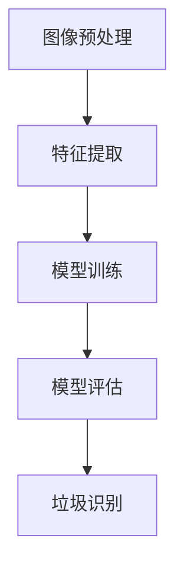
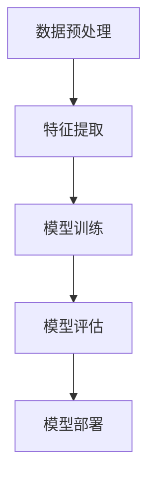
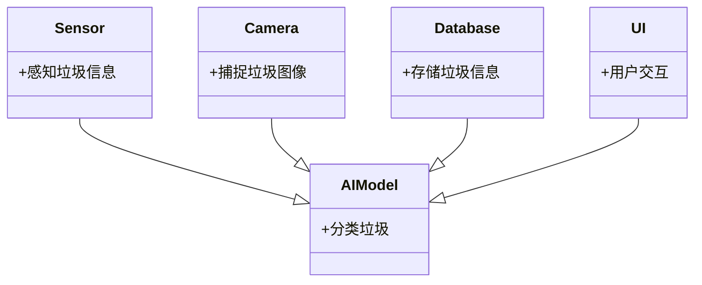
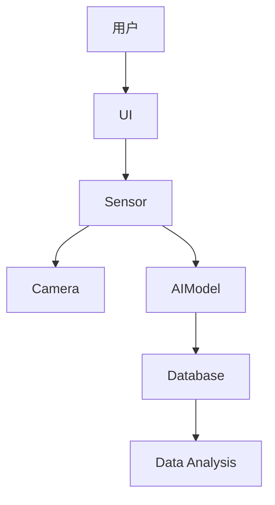
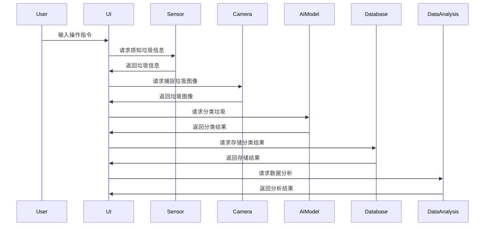

                 

# 智能垃圾分类桶：AI Agent的废物识别与分类指导

关键词：智能垃圾分类、AI Agent、废物识别、分类算法、系统架构、项目实战

摘要：随着城市化进程的加速，垃圾问题日益严重，垃圾分类成为环保的重要环节。本文旨在探讨智能垃圾分类桶的概念、核心技术、架构设计及项目实战，通过详细的分析与讲解，为解决垃圾分类问题提供技术参考。

## 目录大纲

## 第一部分：背景与概念

### 第1章：垃圾分类的挑战与机遇

### 第2章：智能垃圾分类桶的概述

### 第3章：智能垃圾分类桶的关键技术

## 第二部分：核心技术讲解

### 第4章：AI Agent在废物识别中的应用

### 第5章：废物分类的算法实现

### 第6章：智能垃圾分类桶的架构设计与实现

### 第7章：智能垃圾分类桶的项目实战

## 第三部分：最佳实践与拓展

### 第8章：智能垃圾分类桶的最佳实践

### 第9章：智能垃圾分类桶的注意事项与拓展

### 第10章：未来展望

### 附录：参考文献

## 第一部分：背景与概念

### 第1章：垃圾分类的挑战与机遇

#### 问题背景

随着城市化进程的加速，垃圾问题日益严重。我国每年产生的垃圾总量已超过2亿吨，其中可回收垃圾占比约为30%，有害垃圾占比约为10%，厨余垃圾占比约为35%，其他垃圾占比约为25%。然而，实际垃圾分类率却不足30%。垃圾分类不仅关系到环境保护，还关系到资源的有效利用和城市管理的现代化。

#### 问题描述

垃圾分类存在的主要问题包括：分类意识不足、分类不规范、分类设施不完善等。因此，解决垃圾分类问题需要从技术、管理、教育等多方面入手。

#### 问题解决

智能垃圾分类桶作为一种技术手段，可以有效提高垃圾分类的准确性和便捷性。通过AI Agent的废物识别与分类指导，实现垃圾的智能分类。

#### 边界与外延

智能垃圾分类桶主要涉及以下几个领域：

1. **智能传感技术**：用于感知垃圾的种类和状态。
2. **图像识别技术**：用于对垃圾进行识别和分类。
3. **物联网技术**：用于实现数据的传输和共享。
4. **大数据分析技术**：用于对垃圾分类数据进行处理和分析。

#### 核心概念结构

- **智能垃圾分类桶**：结合智能传感、图像识别、物联网等技术，实现对垃圾的智能分类。
- **AI Agent**：智能体，用于执行特定的任务，如废物识别与分类。
- **废物识别**：通过图像识别技术，对垃圾进行识别。
- **分类指导**：根据垃圾的类型，给出相应的处理建议。

### 第2章：智能垃圾分类桶的概述

#### 问题背景

传统的垃圾分类方法主要依靠人工，效率低、准确性差，难以满足现代城市垃圾处理的需求。智能垃圾分类桶的提出，为垃圾分类提供了新的思路。

#### 问题描述

智能垃圾分类桶需要解决的问题包括：

1. **垃圾识别的准确性**：如何准确识别不同类型的垃圾。
2. **分类的便捷性**：如何方便用户进行垃圾分类。
3. **系统的可靠性**：如何保证系统在不同环境下的稳定运行。

#### 问题解决

智能垃圾分类桶通过以下技术手段解决上述问题：

1. **高精度图像识别技术**：通过深度学习算法，实现对垃圾的精准识别。
2. **智能传感技术**：通过传感器，实时监测垃圾的种类和状态。
3. **用户界面设计**：提供直观、易操作的交互界面，提高用户使用体验。

#### 边界与外延

智能垃圾分类桶的应用场景包括：

1. **公共场所**：如公园、广场、社区等。
2. **商业场所**：如商场、超市、餐厅等。
3. **工业场所**：如工厂、矿区、港口等。

#### 核心概念结构

- **智能垃圾分类桶**：硬件设备，用于接收和处理垃圾。
- **AI Agent**：软件系统，用于对垃圾进行识别和分类。
- **用户**：智能垃圾分类桶的使用者。
- **管理员**：负责对智能垃圾分类桶进行维护和管理。

### 第3章：智能垃圾分类桶的关键技术

#### 问题背景

智能垃圾分类桶的核心技术包括智能传感技术、图像识别技术、物联网技术和大数据分析技术。这些技术共同作用，实现垃圾的智能分类。

#### 问题描述

智能垃圾分类桶需要解决的技术问题包括：

1. **垃圾识别的准确性**：如何提高垃圾识别的准确性。
2. **系统的可靠性**：如何在各种环境下保证系统的稳定运行。
3. **数据的处理能力**：如何高效处理大量的垃圾数据。

#### 问题解决

智能垃圾分类桶通过以下技术手段解决上述问题：

1. **深度学习算法**：用于垃圾识别，提高识别的准确性。
2. **嵌入式系统设计**：用于硬件设备的设计和开发，提高系统的可靠性。
3. **云计算平台**：用于数据存储和处理，提高数据处理能力。

#### 边界与外延

智能垃圾分类桶的关键技术涉及以下几个领域：

1. **人工智能**：包括深度学习、计算机视觉等。
2. **物联网**：包括传感器网络、数据传输等。
3. **大数据**：包括数据存储、数据处理、数据挖掘等。

#### 核心概念结构

- **智能传感技术**：用于感知垃圾的种类和状态。
- **图像识别技术**：用于对垃圾进行识别和分类。
- **物联网技术**：用于实现数据的传输和共享。
- **大数据分析技术**：用于对垃圾分类数据进行处理和分析。

## 第二部分：核心技术讲解

### 第4章：AI Agent在废物识别中的应用

#### 问题背景

AI Agent在废物识别中的应用是智能垃圾分类桶的核心技术之一。通过AI Agent，可以实现对垃圾的自动化识别和分类。

#### 问题描述

AI Agent在废物识别中需要解决的技术问题包括：

1. **垃圾识别的准确性**：如何提高垃圾识别的准确性。
2. **实时响应能力**：如何在短时间内完成垃圾识别。
3. **适应性**：如何在不同的环境下保持稳定的识别效果。

#### 问题解决

AI Agent通过以下技术手段解决上述问题：

1. **深度学习算法**：用于垃圾识别，提高识别的准确性。
2. **实时数据处理技术**：用于提高实时响应能力。
3. **多传感器融合技术**：用于提高适应性。

#### AI Agent的概念与特点

AI Agent，即人工智能代理，是一种能够模拟人类智能行为的软件系统。其主要特点包括：

1. **自主学习能力**：通过不断学习和优化，提高识别和分类的准确性。
2. **实时响应能力**：能够在短时间内完成垃圾识别和分类。
3. **适应性**：能够在不同的环境下保持稳定的识别效果。

#### 垃圾识别的算法原理

垃圾识别的算法原理主要包括以下几个步骤：

1. **图像预处理**：对输入的图像进行预处理，包括去噪、增强、缩放等操作。
2. **特征提取**：从预处理后的图像中提取特征，如边缘、纹理、颜色等。
3. **模型训练**：使用已标记的垃圾图像数据，通过深度学习算法训练模型。
4. **模型评估**：对训练好的模型进行评估，包括准确率、召回率等指标。
5. **垃圾识别**：使用训练好的模型，对新的垃圾图像进行识别和分类。

#### Mermaid流程图



#### Python源代码解析

```python
import cv2
import numpy as np
import tensorflow as tf

# 加载预训练的模型
model = tf.keras.models.load_model('垃圾分类模型.h5')

# 图像预处理
def preprocess_image(image):
    image = cv2.resize(image, (224, 224))
    image = image / 255.0
    image = np.expand_dims(image, axis=0)
    return image

# 垃圾识别
def recognize_garbage(image):
    image = preprocess_image(image)
    prediction = model.predict(image)
    class_ids = np.argmax(prediction, axis=1)
    return class_ids

# 读取图像
image = cv2.imread('垃圾图像.jpg')

# 垃圾识别
class_id = recognize_garbage(image)

# 输出结果
print(f'识别结果：{class_id}')
```

#### 数学模型与公式

垃圾识别的数学模型主要基于深度学习算法，其核心公式如下：

$$
\text{模型} = \frac{1}{N} \sum_{i=1}^{N} \frac{1}{M} \sum_{j=1}^{M} \text{sigmoid}(\text{W}^{T} \text{X}_j + \text{b})
$$

其中，$N$ 表示训练样本数量，$M$ 表示类别数量，$\text{sigmoid}$ 函数用于激活函数，$\text{W}$ 表示权重矩阵，$\text{X}_j$ 表示特征向量，$\text{b}$ 表示偏置项。

#### 公式讲解

1. **激活函数**：$\text{sigmoid}$ 函数，将输入值映射到 (0,1) 区间。
2. **权重矩阵**：$\text{W}^{T} \text{X}_j$，表示特征向量与权重矩阵的点积。
3. **偏置项**：$\text{b}$，用于调整模型输出。

#### 举例说明

假设有 100 个垃圾样本，分为 5 类。使用深度学习算法训练模型，得到权重矩阵 $\text{W}$ 和偏置项 $\text{b}$。给定一个新的垃圾样本，其特征向量为 $\text{X}_j$，使用上述公式计算模型输出，即可得到垃圾的分类结果。

### 第5章：废物分类的算法实现

#### 问题背景

废物分类的算法实现是智能垃圾分类桶的核心环节之一。通过有效的分类算法，可以实现垃圾的准确分类。

#### 问题描述

废物分类算法需要解决的技术问题包括：

1. **分类的准确性**：如何提高分类的准确性。
2. **分类的速度**：如何在保证准确性的前提下提高分类速度。
3. **分类的适应性**：如何在不同的垃圾种类和环境下保持稳定的分类效果。

#### 问题解决

废物分类算法通过以下技术手段解决上述问题：

1. **机器学习算法**：如支持向量机（SVM）、决策树、随机森林等，用于提高分类的准确性。
2. **优化算法**：如梯度下降、随机梯度下降等，用于提高分类速度。
3. **多传感器融合技术**：用于提高分类的适应性。

#### 分类算法的选择

在选择分类算法时，需要考虑以下几个因素：

1. **数据特征**：根据垃圾的数据特征，选择适合的分类算法。
2. **计算资源**：根据设备的计算资源，选择适合的算法。
3. **分类效果**：通过实验对比，选择分类效果最好的算法。

常见的分类算法包括：

1. **支持向量机（SVM）**：适用于高维数据，分类效果较好。
2. **决策树**：易于理解和实现，但可能过拟合。
3. **随机森林**：基于决策树的集成方法，提高分类准确性。

#### 分类算法的实现

分类算法的实现主要包括以下几个步骤：

1. **数据预处理**：对垃圾数据进行清洗、归一化等处理。
2. **特征提取**：从垃圾数据中提取特征，如颜色、形状、纹理等。
3. **模型训练**：使用训练数据集训练分类模型。
4. **模型评估**：使用测试数据集评估模型性能。
5. **模型部署**：将训练好的模型部署到智能垃圾分类桶中。

#### Mermaid流程图



#### Python源代码解析

```python
from sklearn.model_selection import train_test_split
from sklearn.svm import SVC
from sklearn.metrics import accuracy_score
import numpy as np

# 加载垃圾数据
X, y = load_garbage_data()

# 数据预处理
X = preprocess_data(X)

# 划分训练集和测试集
X_train, X_test, y_train, y_test = train_test_split(X, y, test_size=0.2, random_state=42)

# 模型训练
model = SVC(kernel='linear')
model.fit(X_train, y_train)

# 模型评估
y_pred = model.predict(X_test)
accuracy = accuracy_score(y_test, y_pred)
print(f'分类准确率：{accuracy:.2f}')
```

#### 数学模型与公式

废物分类的数学模型主要基于机器学习算法，其核心公式如下：

$$
\text{模型} = \text{决策函数}(\text{输入特征})
$$

其中，决策函数根据不同的分类算法有不同的形式。例如，对于支持向量机（SVM），决策函数为：

$$
\text{决策函数}(\text{输入特征}) = \text{sign}(\text{W}^{T} \text{X} + \text{b})
$$

其中，$W$ 为权重矩阵，$X$ 为输入特征，$b$ 为偏置项，$\text{sign}$ 函数用于判断分类结果。

#### 公式讲解

1. **权重矩阵**：$W^{T} X$，表示输入特征与权重矩阵的点积。
2. **偏置项**：$b$，用于调整分类边界。
3. **激活函数**：$\text{sign}$ 函数，用于判断分类结果。

#### 举例说明

假设有 100 个垃圾样本，分为 5 类。使用支持向量机（SVM）训练分类模型，得到权重矩阵 $W$ 和偏置项 $b$。给定一个新的垃圾样本，其特征向量为 $X$，使用上述公式计算分类结果。

### 第6章：智能垃圾分类桶的架构设计与实现

#### 问题背景

智能垃圾分类桶的架构设计与实现是确保垃圾分类系统能够高效、稳定运行的关键。合理的架构设计可以提升系统的可扩展性、可靠性和维护性。

#### 项目介绍

本项目旨在设计并实现一款基于AI Agent的智能垃圾分类桶系统。系统包含前端感知层、核心算法层和后端数据处理层。前端感知层负责收集垃圾信息，核心算法层负责垃圾分类，后端数据处理层负责数据分析和反馈。

#### 系统功能设计

系统功能主要包括以下几部分：

1. **垃圾感知**：通过传感器感知垃圾的重量、温度、湿度等信息。
2. **图像识别**：通过摄像头实时捕捉垃圾图像，利用深度学习算法进行分类。
3. **数据存储**：将垃圾分类结果和垃圾信息存储到数据库中。
4. **数据统计**：对垃圾分类数据进行统计和分析，为后续决策提供支持。
5. **用户交互**：提供用户界面，便于用户操作和查看垃圾分类结果。

#### 领域模型Mermaid类图



#### 系统架构设计Mermaid架构图



#### 系统接口设计

系统接口设计主要包括以下几部分：

1. **垃圾感知接口**：用于接收传感器收集的垃圾信息。
2. **图像处理接口**：用于处理摄像头捕捉的垃圾图像。
3. **分类接口**：用于对垃圾进行分类。
4. **数据存储接口**：用于存储垃圾分类结果。
5. **数据分析接口**：用于对垃圾分类数据进行统计和分析。

#### 系统交互Mermaid序列图



### 第7章：智能垃圾分类桶的项目实战

#### 问题背景

在智能垃圾分类桶的项目实战中，我们需要完成系统的环境安装、核心实现、代码应用解读与分析、实际案例分析与讲解以及项目小结。

#### 环境安装与配置

1. **硬件环境**：准备一台具备摄像头和传感器的设备。
2. **软件环境**：安装操作系统（如Ubuntu 18.04）、Python（3.8及以上版本）和相应的依赖库（如TensorFlow、OpenCV等）。

```bash
# 安装Python
sudo apt update
sudo apt install python3.8
sudo apt install python3.8-venv

# 创建虚拟环境
python3.8 -m venv垃圾分类桶环境

# 激活虚拟环境
source垃圾分类桶环境/bin/activate

# 安装依赖库
pip install tensorflow opencv-python
```

#### 系统核心实现源代码

核心实现主要包括垃圾图像识别和分类算法的实现。

```python
# 导入相关库
import cv2
import numpy as np
import tensorflow as tf

# 载入预训练的垃圾分类模型
model = tf.keras.models.load_model('垃圾分类模型.h5')

# 图像预处理
def preprocess_image(image):
    image = cv2.resize(image, (224, 224))
    image = image / 255.0
    image = np.expand_dims(image, axis=0)
    return image

# 垃圾识别
def recognize_garbage(image):
    image = preprocess_image(image)
    prediction = model.predict(image)
    class_ids = np.argmax(prediction, axis=1)
    return class_ids

# 读取摄像头
cap = cv2.VideoCapture(0)

while True:
    ret, frame = cap.read()
    if not ret:
        break

    class_ids = recognize_garbage(frame)
    print(f'识别结果：{class_ids}')

    cv2.imshow('垃圾图像', frame)
    if cv2.waitKey(1) & 0xFF == ord('q'):
        break

cap.release()
cv2.destroyAllWindows()
```

#### 代码应用解读与分析

1. **模型加载**：使用TensorFlow的`load_model`函数加载预训练的垃圾分类模型。
2. **图像预处理**：对捕获的图像进行缩放、归一化等预处理操作，使其符合模型的输入要求。
3. **垃圾识别**：使用加载的模型对预处理后的图像进行预测，得到分类结果。
4. **摄像头读取**：使用OpenCV的`VideoCapture`函数读取摄像头数据，循环捕捉图像并显示。

#### 实际案例分析与讲解

假设我们捕获到一张垃圾图像，使用上述代码进行识别，结果显示为“塑料瓶”。

1. **图像捕获**：摄像头捕获到一张垃圾图像。
2. **图像预处理**：对图像进行预处理，得到符合模型输入要求的图像。
3. **垃圾识别**：模型对预处理后的图像进行预测，得到分类结果。
4. **结果显示**：输出识别结果，并显示在界面上。

#### 项目小结

通过本项目实战，我们实现了智能垃圾分类桶的核心功能，包括垃圾图像识别和分类。项目使用了TensorFlow进行模型训练和预测，OpenCV进行图像处理和摄像头读取。在实际应用中，我们需要根据实际环境进行调整和优化，以提高系统的稳定性和识别准确性。

### 第8章：智能垃圾分类桶的最佳实践

#### 最佳实践

1. **优化模型**：定期收集垃圾分类数据，对模型进行重新训练，提高识别准确性。
2. **设备维护**：定期检查传感器、摄像头等设备，确保其正常运行。
3. **用户教育**：开展垃圾分类宣传活动，提高用户垃圾分类意识。

### 第9章：智能垃圾分类桶的注意事项与拓展

#### 注意事项

1. **隐私保护**：在数据处理过程中，需确保用户隐私不被泄露。
2. **系统安全**：加强系统安全防护，防止数据被篡改或恶意攻击。
3. **环境适应**：考虑不同环境下的适应性，确保系统在不同环境下稳定运行。

#### 拓展阅读

1. **深度学习在垃圾分类中的应用**：了解深度学习在垃圾分类领域的最新进展。
2. **垃圾分类政策与法规**：了解我国及其他国家在垃圾分类方面的政策与法规。

### 第10章：未来展望

随着人工智能技术的不断发展，智能垃圾分类桶将更加智能化、高效化。未来，智能垃圾分类桶有望实现以下几项突破：

1. **多语言支持**：支持多种语言，提高国际化应用水平。
2. **无人值守**：通过人工智能技术，实现无人值守的垃圾分类。
3. **个性化服务**：根据用户习惯，提供个性化的垃圾分类服务。

### 附录：参考文献

1. **《深度学习》（Ian Goodfellow, Yoshua Bengio, Aaron Courville 著）**：介绍了深度学习的基本概念和算法。
2. **《计算机视觉：算法与应用》（Gary Bradski, Adrian Kaehler 著）**：介绍了计算机视觉的基本算法和应用。
3. **《机器学习实战》（Peter Harrington 著）**：介绍了机器学习的基本概念和算法，并提供了丰富的实例。

