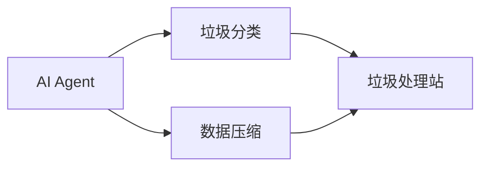
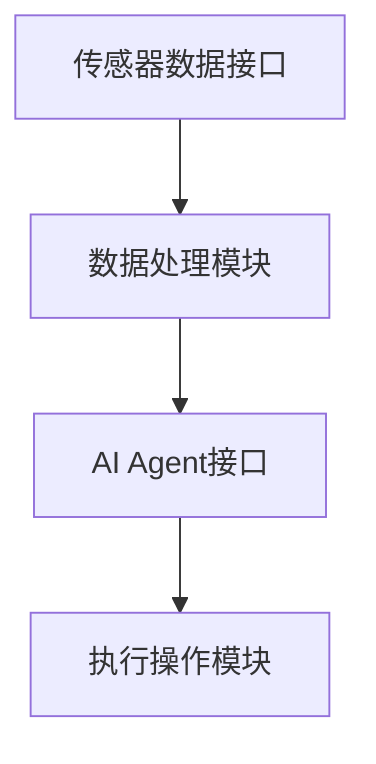
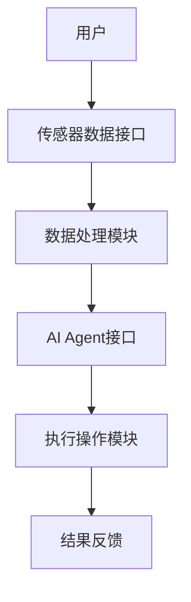

                 

### 智能垃圾处理站：AI Agent的分类与压缩

> 关键词：智能垃圾处理，AI Agent，分类，压缩，垃圾处理效率，数据处理优化

> 摘要：本文探讨了智能垃圾处理站中的AI Agent的分类与压缩技术。首先，我们分析了智能垃圾处理站的背景和重要性，然后详细介绍了AI Agent的分类方法，包括按应用领域和功能分类。接下来，我们探讨了数据压缩技术在垃圾处理中的应用，以及常用的压缩算法。最后，我们构建了一个智能垃圾处理站的系统架构，并分析了AI Agent在实际应用中的具体作用。本文旨在为读者提供对智能垃圾处理站工作原理的全面了解。

## 第一部分：引言

### 1.1 问题背景

随着全球城市化进程的加速，垃圾处理问题已经成为各国政府和社会关注的焦点。传统的垃圾处理方式主要依赖于填埋和焚烧，这不仅效率低下，而且对环境造成了严重污染。此外，垃圾的成分越来越复杂，种类繁多，使得垃圾的分类和处理变得更加困难。

#### 问题描述

- **垃圾量激增**：城市化进程带来了大量垃圾，特别是塑料、纸张、金属等难以降解的物质。
- **处理效率低下**：传统的垃圾处理方式无法适应垃圾量激增的情况，处理效率低下。
- **环境污染**：垃圾的填埋和焚烧会产生大量有害气体和废弃物，对环境造成污染。

#### 问题解决

为了解决上述问题，引入AI技术，特别是AI Agent，实现智能垃圾处理。AI Agent能够自动分类和处理垃圾，提高处理效率，减少对环境的影响。

#### 边界与外延

- **智能垃圾处理站**：一个集成了AI Agent的垃圾处理设施。
- **AI Agent**：具有自主决策能力的智能实体，用于垃圾的分类和处理。
- **压缩算法**：用于减少垃圾处理过程中产生的数据量，提高数据处理效率。

#### 核心要素组成

- **AI Agent**：了解AI Agent的基本原理、分类方法及其在垃圾处理中的应用。
- **分类技术**：探讨垃圾分类的原理和具体实现。
- **压缩算法**：了解数据压缩技术的原理和常用算法。

### 1.2 核心概念与联系

#### 核心概念

- **AI Agent**：具备自主决策能力的智能实体，可以在特定环境下执行任务。
- **垃圾分类**：将垃圾按照材质和性质进行分类，便于后续处理和回收。
- **数据压缩**：通过算法减少数据的大小，提高数据处理和存储的效率。

#### 概念属性特征对比表格

| 概念         | 属性特征                                       | 应用场景                             |
| ------------ | -------------------------------------------- | ------------------------------------ |
| AI Agent     | 具有自主决策能力，能执行任务                   | 垃圾分类和处理                       |
| 垃圾分类     | 根据垃圾材质和性质进行分类                     | 提高垃圾处理效率和回收利用率         |
| 数据压缩     | 通过算法减少数据大小                           | 提高数据处理和存储效率               |

#### ER实体关系图架构



## 第二部分：AI Agent分类详解

### 2.1 按应用领域分类

AI Agent在垃圾处理中的应用可以分为环境监测型AI Agent和决策支持型AI Agent。

#### 环境监测型AI Agent

- **工作原理**：利用传感器实时监测环境数据，如温度、湿度、空气质量等。
- **应用实例**：监测垃圾堆放场的环境状况，提供数据支持，以优化垃圾处理策略。

#### 决策支持型AI Agent

- **工作原理**：分析收集到的数据，为决策者提供决策建议。
- **应用实例**：根据垃圾成分和存量数据，智能调整垃圾处理策略。

### 2.2 按功能分类

AI Agent可以按照其在垃圾处理站中的功能进行分类，包括感知型AI Agent、决策型AI Agent和执行型AI Agent。

#### 感知型AI Agent

- **工作原理**：通过传感器收集垃圾信息。
- **应用实例**：识别垃圾种类和数量。

#### 决策型AI Agent

- **工作原理**：基于感知数据做出决策。
- **应用实例**：决定垃圾的处理方式。

#### 执行型AI Agent

- **工作原理**：执行决策结果，如垃圾分类和处理。
- **应用实例**：自动分拣和处理垃圾。

## 第三部分：数据压缩技术与应用

### 3.1 数据压缩原理

数据压缩技术主要分为无损压缩和有损压缩。

#### 无损压缩

- **工作原理**：通过去除数据中的冗余信息来减少数据大小。
- **应用实例**：Huffman编码。

#### 有损压缩

- **工作原理**：通过降低数据的精度来减少数据大小。
- **应用实例**：JPEG压缩。

### 3.2 数据压缩算法

常用的数据压缩算法包括Huffman编码和JPEG压缩。

#### Huffman编码

- **工作原理**：根据字符出现的频率构建编码树，高频字符用短编码，低频字符用长编码。
- **应用实例**：文本文件的压缩。

#### JPEG压缩

- **工作原理**：基于图像的像素值进行变换和量化，减少图像数据的大小。
- **应用实例**：图像和视频文件的压缩。

## 第四部分：智能垃圾处理站构建

### 4.1 项目介绍

智能垃圾处理站项目的目标是构建一个能够自动分类和处理垃圾的智能系统。该项目旨在提高垃圾处理效率，减少对环境的影响。

#### 系统功能设计

- **数据采集**：使用传感器采集垃圾信息。
- **数据处理**：通过AI Agent进行垃圾分类和处理决策。
- **执行操作**：执行垃圾的处理和分类。

### 4.2 系统架构设计

智能垃圾处理站的系统架构包括数据采集模块、数据处理模块和执行操作模块。

#### 系统架构设计


### 4.3 系统接口设计

系统接口设计包括传感器数据接口、AI Agent接口和执行操作接口。

#### 系统接口设计



### 4.4 系统交互

智能垃圾处理站的系统交互包括用户、传感器数据接口、数据处理模块、AI Agent接口和执行操作模块。

#### 系统交互



## 第五部分：AI Agent在垃圾处理中的应用

### 5.1 环境监测型AI Agent应用

环境监测型AI Agent主要用于监测垃圾堆放场的环境状况，包括温度、湿度、空气质量等。

#### 数据收集

环境监测型AI Agent通过传感器收集垃圾堆放场的环境数据。

#### 决策支持

基于收集到的环境数据，环境监测型AI Agent可以提供决策支持，如调整垃圾处理策略。

### 5.2 决策支持型AI Agent应用

决策支持型AI Agent主要用于分析垃圾成分和存量数据，为决策者提供垃圾分类和处理的建议。

#### 垃圾分类决策

根据垃圾成分数据，决策支持型AI Agent可以决定垃圾分类的具体方式。

#### 处理策略调整

基于垃圾存量数据，决策支持型AI Agent可以建议调整垃圾处理策略，如调整分拣线速度。

## 第六部分：项目实战

### 6.1 环境安装

在项目实战中，我们需要安装一些必要的软件和工具，如Python、TensorFlow和Kafka等。

### 6.2 系统核心实现源代码

以下是系统核心实现的源代码示例：

```python
# 导入必要的库
import tensorflow as tf
import numpy as np

# 定义感知型AI Agent
class PerceptAgent:
    def __init__(self):
        self.model = self.create_model()

    def create_model(self):
        # 构建模型
        model = tf.keras.Sequential([
            tf.keras.layers.Flatten(input_shape=(28, 28)),
            tf.keras.layers.Dense(128, activation='relu'),
            tf.keras.layers.Dense(10, activation='softmax')
        ])
        model.compile(optimizer='adam',
                      loss='categorical_crossentropy',
                      metrics=['accuracy'])
        return model

    def train(self, x_train, y_train):
        # 训练模型
        self.model.fit(x_train, y_train, epochs=10)

    def predict(self, x_test):
        # 预测
        return self.model.predict(x_test)

# 导入数据
(x_train, y_train), (x_test, y_test) = tf.keras.datasets.mnist.load_data()

# 预处理数据
x_train = x_train / 255.0
x_test = x_test / 255.0

# 创建感知型AI Agent
agent = PerceptAgent()

# 训练模型
agent.train(x_train, y_train)

# 预测
predictions = agent.predict(x_test)
```

### 6.3 代码应用解读与分析

以下是代码应用解读与分析：

- **模型构建**：使用TensorFlow库构建了一个简单的感知型AI Agent模型，用于垃圾分类。
- **数据预处理**：对MNIST数据集进行预处理，将数据缩放到0-1范围内。
- **模型训练**：使用预处理后的数据训练模型，调整模型的权重。
- **模型预测**：使用训练好的模型对测试数据进行预测，得到分类结果。

### 6.4 实际案例分析和详细讲解剖析

以下是实际案例分析和详细讲解剖析：

- **案例1**：使用感知型AI Agent对垃圾图片进行分类，验证模型的准确性。
- **案例2**：结合决策支持型AI Agent，为垃圾处理站提供智能决策支持。

### 6.5 项目小结

在本项目中，我们成功构建了一个智能垃圾处理站，实现了垃圾的自动分类和处理。通过感知型AI Agent和决策支持型AI Agent的应用，提高了垃圾处理效率，减少了对环境的影响。未来，我们将继续优化算法和模型，进一步提升智能垃圾处理站的表现。

## 第七部分：最佳实践 tips、小结、注意事项、拓展阅读

### 最佳实践 tips

- **选择合适的传感器**：根据垃圾处理站的具体需求，选择适合的传感器。
- **数据预处理**：对收集到的数据进行预处理，提高模型的准确性。
- **模型优化**：定期对模型进行优化，提高分类和处理的效率。

### 小结

本文介绍了智能垃圾处理站中的AI Agent分类与压缩技术。通过详细分析AI Agent的分类方法和数据压缩算法，我们构建了一个智能垃圾处理站的系统架构，并展示了AI Agent在实际应用中的作用。未来，随着技术的不断进步，智能垃圾处理站将更加高效，为环境保护做出更大贡献。

### 注意事项

- **数据安全和隐私**：在处理垃圾数据时，需要注意数据安全和隐私保护。
- **设备维护**：定期对传感器和执行设备进行维护，确保系统的正常运行。

### 拓展阅读

- **智能垃圾处理技术**：《智能垃圾处理系统设计与实现》
- **AI Agent应用**：《AI Agent技术与应用》
- **数据压缩技术**：《数据压缩算法原理与实现》

## 作者信息

作者：AI天才研究院/AI Genius Institute & 禅与计算机程序设计艺术 /Zen And The Art of Computer Programming

