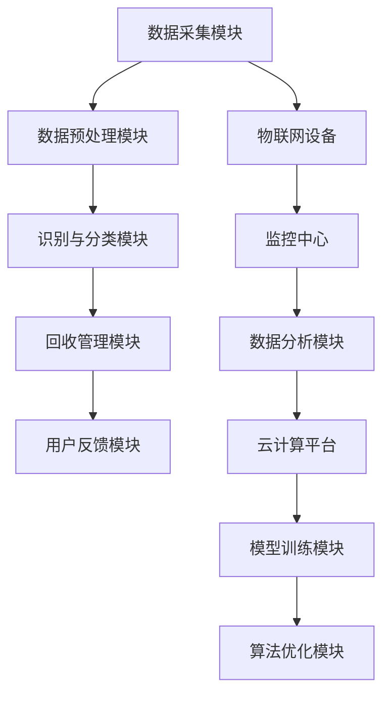

                 

### 智能垃圾处理站：AI Agent的社区回收管理

关键词：智能垃圾处理、AI Agent、社区回收管理、垃圾分类、技术原理

摘要：本文深入探讨了智能垃圾处理站中的AI Agent在社区回收管理中的应用。首先，我们分析了垃圾处理现状及其存在的问题，然后介绍了AI在垃圾处理中的应用潜力，并详细阐述了AI Agent的技术原理。接着，我们探讨了智能识别与分类技术，包括图像识别、声音识别、气味识别等，并分析了垃圾分类算法。随后，我们介绍了AI Agent系统架构，包括系统设计目标、功能模块、实现技术等。此外，我们重点讨论了AI Agent在社区回收管理中的应用，包括模式、效率优化和居民参与度提升。最后，通过两个实际案例，我们展示了智能垃圾处理站的成功应用，并对未来进行了展望。

### 目录大纲：

# 智能垃圾处理站：AI Agent的社区回收管理

## 第一部分：背景与基础

## 第1章 问题背景

### 1.1 垃圾处理现状

- 垃圾产生量逐年增加
- 传统垃圾处理方式效率低下
- 环境污染问题日益严重

### 1.2 AI在垃圾处理中的应用

- AI技术在垃圾识别、分类、回收等环节的应用
- AI Agent在社区回收管理中的潜力

### 1.3 书籍结构

- 本书将详细探讨AI Agent在社区回收管理中的应用
- 包含垃圾处理的基本概念、技术原理、系统设计及应用案例分析

## 第二部分：技术原理

## 第2章 垃圾处理技术基础

### 2.1 垃圾处理流程概述

- 垃圾收集
- 垃圾运输
- 垃圾处理与处置

### 2.2 AI Agent技术原理

- 人工智能概述
- AI Agent的定义与分类
- AI Agent在垃圾处理中的应用

### 2.3 垃圾分类技术

- 手动分类与自动分类的对比
- 垃圾分类算法介绍
- 垃圾分类技术案例分析

## 第3章 智能识别与分类

### 3.1 智能识别技术

- 图像识别技术
- 声音识别技术
- 气味识别技术

### 3.2 垃圾分类算法

- 分类算法概述
- 支持向量机（SVM）
- 决策树与随机森林

### 3.3 实际案例

- 垃圾识别与分类系统设计
- 智能识别与分类在实际项目中的应用

## 第三部分：系统设计

## 第4章 AI Agent系统架构

### 4.1 系统设计目标

- 提高垃圾回收效率
- 降低环境污染
- 提高居民生活质量

### 4.2 系统功能模块

- 数据采集模块
- 识别与分类模块
- 回收管理模块
- 用户反馈模块

### 4.3 系统实现技术

- 人工智能技术
- 大数据技术
- 物联网技术

## 第5章 社区回收管理应用

### 5.1 社区回收管理模式

- 传统的社区回收模式
- 智能社区回收模式

### 5.2 AI Agent在社区回收管理中的应用

- 智能识别与分类
- 回收效率优化
- 社区居民参与度提升

### 5.3 实际应用案例

- 某社区回收管理系统案例分析
- 智能回收管理系统的成效评估

## 第四部分：案例分析

## 第6章 案例一：城市智慧垃圾分类系统

### 6.1 项目背景

- 项目介绍
- 项目目标

### 6.2 系统设计

- 系统架构设计
- 系统功能模块设计

### 6.3 实施过程

- 数据采集与处理
- 智能识别与分类
- 系统集成与部署

### 6.4 项目成效

- 项目成果
- 用户反馈

## 第7章 案例二：智能社区回收管理平台

### 7.1 项目背景

- 项目介绍
- 项目目标

### 7.2 系统设计

- 系统架构设计
- 系统功能模块设计

### 7.3 实施过程

- 数据采集与处理
- 智能识别与分类
- 系统集成与部署

### 7.4 项目成效

- 项目成果
- 用户反馈

## 第五部分：展望与未来

## 第8章 AI Agent在垃圾处理领域的未来发展

### 8.1 技术发展趋势

- 人工智能技术发展趋势
- 垃圾处理技术发展趋势

### 8.2 应用前景

- AI Agent在垃圾处理领域的应用前景
- 社会效益与经济效益

### 8.3 未来展望

- 未来技术挑战
- 未来发展建议

## 第9章 总结

### 9.1 主要成果

- 技术原理总结
- 系统设计总结
- 案例分析总结

### 9.2 展望未来

- 未来研究方向
- 进一步优化和改进的建议

---

接下来，我们将按照目录大纲逐步展开内容，深入探讨智能垃圾处理站中的AI Agent在社区回收管理中的应用。

---

### 第一部分：背景与基础

#### 第1章 问题背景

在现代社会，垃圾问题已经成为全球面临的重大挑战之一。随着城市化进程的加速和人口的快速增长，垃圾产生量逐年增加。据统计，全球每年产生的垃圾量已经超过了300亿吨，并且还在以每年8%的速度增长。然而，传统的垃圾处理方式效率低下，无法满足日益增长的垃圾处理需求，导致环境污染问题日益严重。

#### 1.1 垃圾处理现状

当前的垃圾处理方式主要包括垃圾收集、垃圾运输和垃圾处理与处置三个环节。在垃圾收集环节，主要是依靠人工或机械设备进行垃圾的清运，这种方式效率低下，容易导致垃圾堆积和污染。在垃圾运输环节，主要依靠车辆进行垃圾的运输，但由于垃圾量的不断增加，运输能力已经达到瓶颈。在垃圾处理与处置环节，主要采用填埋、焚烧和堆肥等处理方式，但这些方式都存在不同程度的环境污染问题。

#### 1.2 AI在垃圾处理中的应用

随着人工智能技术的快速发展，AI技术在垃圾处理中的应用前景十分广阔。首先，AI技术可以用于垃圾的识别和分类，通过图像识别、声音识别和气味识别等技术，可以准确识别垃圾的种类和属性，从而实现自动分类。其次，AI技术可以用于垃圾回收的管理，通过大数据分析和智能算法，可以优化垃圾的回收流程，提高回收效率。此外，AI技术还可以用于垃圾处理的监测和评估，通过实时监控和分析垃圾处理数据，可以及时发现和处理问题，确保垃圾处理的顺利进行。

#### 1.3 AI Agent在社区回收管理中的潜力

AI Agent是人工智能的一种重要形式，它具有智能感知、决策和执行能力，可以在社区回收管理中发挥重要作用。首先，AI Agent可以用于垃圾的智能识别和分类，通过图像识别、声音识别和气味识别等技术，可以准确识别垃圾的种类和属性，从而实现自动分类。其次，AI Agent可以用于垃圾回收的智能调度和管理，通过大数据分析和智能算法，可以优化垃圾的回收流程，提高回收效率。此外，AI Agent还可以用于居民的智能引导和反馈，通过智能终端和互联网，可以实时向居民提供垃圾分类指导和回收信息，提高居民的参与度和环保意识。

综上所述，AI Agent在社区回收管理中具有巨大的潜力，可以显著提高垃圾回收效率和减少环境污染。本 书将详细探讨AI Agent在社区回收管理中的应用，旨在推动智能垃圾处理站的落地实施，为构建美丽家园贡献力量。

### 第二部分：技术原理

#### 第2章 垃圾处理技术基础

垃圾处理是一个复杂的过程，涉及多个环节。为了更好地理解和应用AI技术，我们需要先了解垃圾处理的基本流程和技术。

#### 2.1 垃圾处理流程概述

垃圾处理的基本流程包括垃圾收集、垃圾运输、垃圾处理与处置三个环节。

1. **垃圾收集**：垃圾收集是垃圾处理的第一步，通常由环卫工人或机械设备进行。在这个过程中，垃圾被从居民区、公共场所和商业区收集到垃圾收集站。

2. **垃圾运输**：收集到的垃圾通过专门的运输车辆运送到垃圾处理厂或填埋场。这个环节需要注意运输过程中的卫生和安全，以防止垃圾泄露和污染。

3. **垃圾处理与处置**：垃圾处理与处置是垃圾处理的最后一步，主要包括以下几种方式：
   - **填埋**：将垃圾掩埋在土中，这种方式简单且成本低，但会对土壤和地下水造成污染。
   - **焚烧**：将垃圾燃烧，可以减少垃圾体积，同时产生能源，但会产生有害气体和灰烬。
   - **堆肥**：将有机垃圾堆放发酵，转化为有机肥料，这种方式环保但处理周期长。

#### 2.2 AI Agent技术原理

AI Agent是人工智能的一种形式，它具有智能感知、决策和执行能力。在垃圾处理领域，AI Agent可以应用于垃圾识别、分类、调度和管理等多个环节。

1. **人工智能概述**：
   - **机器学习**：通过训练模型，让计算机具备识别和分类垃圾的能力。
   - **深度学习**：一种更复杂的机器学习方法，通过多层神经网络来提取特征。
   - **强化学习**：通过试错和反馈机制，让AI Agent学会最优决策。

2. **AI Agent的定义与分类**：
   - **基于规则的AI Agent**：通过预定义的规则进行决策。
   - **数据驱动AI Agent**：通过机器学习和深度学习模型进行决策。
   - **混合型AI Agent**：结合规则和机器学习方法进行决策。

3. **AI Agent在垃圾处理中的应用**：
   - **垃圾识别**：通过图像识别技术，AI Agent可以识别垃圾的种类。
   - **垃圾分类**：通过深度学习模型，AI Agent可以自动分类垃圾。
   - **垃圾调度**：通过优化算法，AI Agent可以优化垃圾运输和处理的调度。
   - **环境监测**：AI Agent可以实时监测垃圾处理过程中的环境指标，如温度、湿度、气体浓度等。

#### 2.3 垃圾分类技术

垃圾分类是垃圾处理的重要环节，可以有效减少垃圾对环境的污染。目前，垃圾分类技术主要包括手动分类和自动分类两种。

1. **手动分类**：
   - **人工识别**：环卫工人根据垃圾的种类进行分类。
   - **标签分类**：使用标签或标识来区分不同类型的垃圾。

2. **自动分类**：
   - **图像识别**：使用计算机视觉技术，AI Agent可以识别垃圾的图像，并进行分类。
   - **深度学习分类**：通过训练深度学习模型，AI Agent可以自动分类垃圾。
   - **传感器分类**：使用各种传感器（如温度、湿度、气体传感器）来识别垃圾的性质，并进行分类。

#### 2.4 垃圾分类技术案例分析

以某城市智能垃圾分类系统为例，该系统采用AI Agent进行垃圾识别和分类。系统首先通过摄像头和传感器收集垃圾的图像和属性数据，然后通过深度学习模型进行分类。为了提高分类准确率，系统还使用了多种数据增强技术，如数据扩充、数据标准化等。在实际应用中，该系统取得了显著效果，不仅提高了垃圾分类的效率，还减少了垃圾对环境的污染。

通过以上分析，我们可以看到，AI Agent在垃圾处理中的应用前景广阔。随着技术的不断进步，AI Agent有望在未来成为垃圾处理的重要工具，为环境保护和可持续发展做出更大贡献。

### 第三部分：智能识别与分类

#### 第3章 智能识别与分类

智能识别与分类是AI Agent在垃圾处理中的核心功能之一。通过智能识别技术，可以准确识别垃圾的类型，而分类技术则可以将垃圾按照属性进行有效分类。以下将详细介绍智能识别技术和分类算法，并探讨其实际应用。

#### 3.1 智能识别技术

智能识别技术是AI Agent实现垃圾处理的基础，主要包括图像识别、声音识别和气味识别。

1. **图像识别技术**：

   图像识别技术利用计算机视觉算法，通过对垃圾图像的特征提取和模式识别，实现垃圾的自动分类。常见的图像识别算法包括：

   - **卷积神经网络（CNN）**：一种深度学习模型，通过多层卷积和池化操作提取图像特征。
   - **支持向量机（SVM）**：一种监督学习算法，通过构建最优分类超平面实现图像分类。
   - **决策树**：一种简单直观的监督学习算法，通过一系列规则将图像分类。

2. **声音识别技术**：

   声音识别技术通过分析垃圾在处理过程中产生的声音特征，实现对垃圾类型的识别。例如，在垃圾压缩和破碎过程中，不同类型的垃圾会产生不同的声音特征。声音识别技术通常使用以下算法：

   - **隐马尔可夫模型（HMM）**：一种统计模型，用于分析序列数据。
   - **循环神经网络（RNN）**：一种能够处理序列数据的深度学习模型。
   - **深度卷积神经网络（DCNN）**：结合了卷积神经网络和循环神经网络的优势，用于处理复杂的声学特征。

3. **气味识别技术**：

   气味识别技术通过检测垃圾释放的气味分子，实现对垃圾类型的识别。气味识别技术通常涉及以下步骤：

   - **气味采集**：使用气体传感器或其他设备采集垃圾的气味数据。
   - **特征提取**：通过化学传感器和机器学习算法提取气味特征。
   - **分类模型**：使用机器学习算法，如支持向量机、决策树或深度学习模型，对气味特征进行分类。

#### 3.2 垃圾分类算法

垃圾分类算法是实现垃圾自动分类的核心，常见的分类算法包括：

1. **分类算法概述**：

   - **监督学习算法**：通过已标记的训练数据集，训练模型进行分类。常见的监督学习算法包括支持向量机（SVM）、决策树、随机森林和神经网络等。
   - **无监督学习算法**：不需要标记数据，通过模型自动发现数据分布和模式。常见的无监督学习算法包括聚类算法、主成分分析（PCA）和自编码器等。

2. **支持向量机（SVM）**：

   - **原理**：SVM通过寻找最优分类超平面，将数据点分类到不同的类别。
   - **优点**：在高维空间中表现优秀，对噪声和异常值具有较强的鲁棒性。
   - **应用**：常用于垃圾图像的分类。

3. **决策树与随机森林**：

   - **决策树**：通过一系列规则对数据进行分类，是一种简单直观的算法。
   - **随机森林**：通过集成多个决策树，提高分类的准确性和鲁棒性。
   - **优点**：易于理解和实现，对非线性数据有一定的分类能力。
   - **应用**：常用于垃圾分类和垃圾识别。

#### 3.3 实际案例

以下是一个垃圾识别与分类的实际案例：

1. **案例背景**：

   某智能垃圾处理站引入了AI Agent，旨在实现垃圾的自动识别和分类。该系统采用了图像识别和声音识别技术，并通过深度学习和监督学习算法进行分类。

2. **案例实施**：

   - **数据采集**：通过摄像头和麦克风采集垃圾的图像和声音数据。
   - **特征提取**：对图像和声音数据进行预处理，提取特征向量。
   - **模型训练**：使用深度学习模型（如卷积神经网络）和监督学习算法（如支持向量机）对特征向量进行训练。
   - **分类测试**：使用测试数据集对训练好的模型进行测试，评估分类准确率。

3. **结果分析**：

   经过测试，该系统在垃圾识别和分类方面取得了较高的准确率，有效提高了垃圾处理效率。此外，通过实时监测垃圾处理过程，AI Agent还可以及时发现和处理异常情况，确保垃圾处理的安全和高效。

通过以上案例分析，我们可以看到，智能识别与分类技术在垃圾处理中的应用取得了显著成效。随着技术的不断进步，未来有望实现更智能、更高效的垃圾处理系统。

### 第四部分：系统设计

#### 第4章 AI Agent系统架构

智能垃圾处理站的成功离不开高效的系统架构设计。本节将详细介绍AI Agent系统架构，包括系统设计目标、功能模块和实现技术。

#### 4.1 系统设计目标

智能垃圾处理站的设计目标主要包括：

1. **提高垃圾回收效率**：通过自动化和智能化的方式，提高垃圾收集、运输和处理的效率，减少人工成本和劳动强度。

2. **降低环境污染**：通过高效的垃圾分类和处理，减少垃圾对环境的污染，实现资源的高效利用。

3. **提高居民生活质量**：通过智能化的垃圾管理，提升居民的生活质量，增强居民的环保意识和参与度。

#### 4.2 系统功能模块

智能垃圾处理站系统可以分为以下几个主要功能模块：

1. **数据采集模块**：

   数据采集模块负责收集垃圾的各类信息，包括垃圾的图像、声音、气味等数据。通过摄像头、麦克风、气体传感器等设备，实时采集垃圾的属性信息。

2. **识别与分类模块**：

   识别与分类模块是系统的核心，负责对采集到的数据进行处理和分析，利用图像识别、声音识别和气味识别技术，自动识别垃圾的类型并进行分类。

3. **回收管理模块**：

   回收管理模块负责对分类后的垃圾进行回收和运输。通过优化调度算法，合理安排垃圾回收和运输的路线和时间，提高回收效率。

4. **用户反馈模块**：

   用户反馈模块负责收集居民对垃圾处理服务的反馈，包括满意度调查、问题报告等。通过分析用户反馈，不断优化和改进垃圾处理服务。

#### 4.3 系统实现技术

智能垃圾处理站系统的实现技术主要包括以下几个方面：

1. **人工智能技术**：

   人工智能技术是系统的核心，包括机器学习、深度学习和强化学习等。通过训练模型，实现垃圾的自动识别和分类。

2. **大数据技术**：

   大数据技术负责处理和分析大量的垃圾处理数据，包括数据存储、数据挖掘和数据分析等。通过大数据技术，可以实时监控垃圾处理过程，发现问题和优化管理。

3. **物联网技术**：

   物联网技术负责连接和监控各种设备，包括传感器、摄像头、回收车等。通过物联网技术，可以实现设备之间的实时通信和协调，提高系统的自动化和智能化水平。

4. **云计算技术**：

   云计算技术为系统提供强大的计算能力和数据存储能力，支持大规模数据处理和模型训练。通过云计算技术，可以实现系统的分布式部署和弹性扩展。

通过以上系统设计，智能垃圾处理站可以实现高效的垃圾回收和管理，为环保和可持续发展做出贡献。

#### 4.4 系统架构设计

智能垃圾处理站系统的架构设计如图所示：

该系统架构包括数据采集、数据处理、识别分类、回收管理、用户反馈等模块，通过物联网设备和云计算平台实现系统的互联互通和智能优化。

#### 4.5 系统接口设计

智能垃圾处理站系统需要与其他系统进行交互，包括垃圾运输系统、垃圾处理厂系统和居民终端系统等。以下为系统接口设计：

1. **垃圾运输系统接口**：

   - **数据传输**：通过无线通信或网络接口，实时传输垃圾的运输信息，包括垃圾类型、重量、位置等。
   - **状态查询**：垃圾运输系统可以查询垃圾处理站的回收计划、进度等信息，以便合理安排运输任务。

2. **垃圾处理厂系统接口**：

   - **数据交换**：通过数据接口，垃圾处理厂可以接收垃圾处理站传来的垃圾分类数据，进行后续处理。
   - **任务调度**：垃圾处理厂可以根据回收数据，优化垃圾处理流程，提高处理效率。

3. **居民终端系统接口**：

   - **垃圾分类指导**：通过居民终端系统，向居民提供垃圾分类指南，提高居民的垃圾分类意识。
   - **反馈机制**：居民可以通过终端系统向垃圾处理站反馈垃圾分类问题，帮助系统不断优化。

#### 4.6 系统交互设计

智能垃圾处理站系统的交互设计包括垃圾识别、分类、回收和用户反馈等多个环节。以下为系统交互设计：

1. **垃圾识别交互**：

   - **图像识别**：通过摄像头采集垃圾图像，传输至识别模块。
   - **分类结果**：识别模块对垃圾图像进行处理，返回分类结果。

2. **分类交互**：

   - **分类反馈**：分类结果传输至回收管理模块，进行后续处理。
   - **错误修正**：如果分类结果错误，通过用户反馈模块修正分类结果。

3. **回收交互**：

   - **调度计划**：回收管理模块根据分类结果和运输计划，安排垃圾回收任务。
   - **进度反馈**：垃圾运输系统将回收进度反馈至回收管理模块，以便实时监控。

4. **用户反馈交互**：

   - **满意度调查**：通过居民终端系统，收集用户对垃圾处理服务的满意度调查。
   - **问题报告**：用户可以通过终端系统报告垃圾分类问题，系统管理员根据反馈进行优化。

通过以上系统交互设计，智能垃圾处理站可以实现高效、智能的垃圾回收和管理，为环保和可持续发展贡献力量。

#### 4.7 系统功能模块详细介绍

为了确保智能垃圾处理站的系统设计能够实现预期的目标，每个功能模块都进行了详细的规划和设计。以下是对系统各功能模块的详细介绍：

1. **数据采集模块**：

   数据采集模块是智能垃圾处理站的核心，负责收集垃圾的各类信息。具体功能包括：

   - **图像采集**：通过安装在垃圾容器上的摄像头，实时捕捉垃圾的图像，用于后续的识别和分类。
   - **声音采集**：通过麦克风捕捉垃圾在处理过程中产生的声音，用于声音识别。
   - **气味采集**：使用气体传感器捕捉垃圾的气味数据，用于气味识别。
   - **传感器数据采集**：如温度、湿度等环境参数，用于监控和处理过程中的环境指标。

2. **数据预处理模块**：

   数据预处理模块负责对采集到的原始数据进行清洗、归一化和特征提取，为后续的识别和分类提供高质量的输入数据。主要功能包括：

   - **图像预处理**：对图像进行裁剪、缩放、对比度增强等操作，提高图像质量。
   - **声音预处理**：对声音数据进行去噪、增强等处理，提取关键特征。
   - **气味预处理**：对气味数据进行预处理，去除无关信息，提取有效特征。
   - **传感器数据预处理**：对传感器数据进行归一化和滤波处理，确保数据的准确性。

3. **识别与分类模块**：

   识别与分类模块是系统的核心，通过智能识别技术实现垃圾的自动识别和分类。主要功能包括：

   - **图像识别**：使用卷积神经网络（CNN）对垃圾图像进行识别，将垃圾分类到不同的类别。
   - **声音识别**：使用循环神经网络（RNN）或深度卷积神经网络（DCNN）对垃圾声音进行识别，区分不同类型的垃圾。
   - **气味识别**：使用机器学习算法（如支持向量机、决策树等）对气味数据进行分析，实现气味识别。
   - **综合分类**：将图像识别、声音识别和气味识别的结果进行综合分析，得出最终的分类结果。

4. **回收管理模块**：

   回收管理模块负责对分类后的垃圾进行回收和运输，确保垃圾处理的高效和准确。主要功能包括：

   - **回收计划**：根据垃圾的分类结果，制定合理的回收计划，包括回收时间、路线和人员安排。
   - **运输调度**：通过优化算法，合理安排垃圾运输车的工作任务，确保运输过程的高效和准时。
   - **进度监控**：实时监控垃圾回收的进度，及时发现和处理问题，确保回收过程的顺利进行。
   - **数据记录**：记录每次回收的数据，包括垃圾类型、重量、回收时间等，用于后续的数据分析和评估。

5. **用户反馈模块**：

   用户反馈模块负责收集居民对垃圾处理服务的反馈，包括满意度调查、问题报告等，用于系统的持续优化和改进。主要功能包括：

   - **满意度调查**：通过在线问卷或居民终端系统，收集居民对垃圾处理服务的满意度评价。
   - **问题报告**：居民可以通过居民终端系统报告垃圾分类问题或提出改进建议，系统管理员根据反馈进行问题处理和优化。
   - **反馈分析**：对收集到的用户反馈进行分析，识别系统中的问题和改进方向，制定优化方案。
   - **反馈执行**：根据分析结果，对系统进行优化和改进，提高居民满意度和服务质量。

通过以上详细的功能模块介绍，我们可以看到，智能垃圾处理站的系统设计充分考虑了垃圾处理过程中的各个环节，通过高效的模块化和智能化设计，实现了垃圾处理的高效、准确和环保。

### 第五部分：社区回收管理应用

#### 第5章 社区回收管理应用

智能垃圾处理站的应用不仅限于城市垃圾处理系统，还可以在社区回收管理中发挥重要作用。本节将探讨AI Agent在社区回收管理中的应用，包括管理模式、回收效率优化和居民参与度提升。

#### 5.1 社区回收管理模式

传统的社区回收模式主要依赖于居民的自觉性和环卫工人的监督，存在以下问题：

1. **分类不规范**：居民对垃圾分类的意识不足，导致垃圾投放不规范，混合垃圾较多。
2. **效率低下**：环卫工人在进行垃圾分类和处理时，需要耗费大量时间和精力，工作效率较低。
3. **污染问题**：由于分类不规范，导致垃圾处理过程中的污染问题加剧。

为了解决这些问题，智能社区回收模式应运而生。智能社区回收模式利用AI Agent技术，实现垃圾的智能识别、分类和管理，提高回收效率，减少环境污染。

1. **智能识别**：通过图像识别、声音识别和气味识别技术，AI Agent可以准确识别垃圾的类型，实现垃圾分类。
2. **自动分类**：AI Agent可以根据垃圾的类型，自动将垃圾分配到相应的处理通道，提高分类效率。
3. **智能调度**：通过大数据分析和智能算法，AI Agent可以优化垃圾回收的路线和时间，提高回收效率。

#### 5.2 AI Agent在社区回收管理中的应用

AI Agent在社区回收管理中的应用主要体现在以下几个方面：

1. **垃圾识别与分类**：

   AI Agent通过图像识别技术，对垃圾进行分类。摄像头捕捉到垃圾的图像后，AI Agent会自动分析图像，判断垃圾的类型，如塑料、纸张、玻璃、金属等。对于难以通过图像识别的垃圾，AI Agent还可以结合声音识别和气味识别技术，提高分类的准确性。

2. **回收效率优化**：

   AI Agent通过大数据分析和智能算法，优化垃圾回收的流程。例如，AI Agent可以分析社区垃圾产生量的时间分布，合理安排垃圾收集车的路线和时间，避免垃圾堆积和运输高峰。同时，AI Agent还可以根据垃圾的种类和属性，优化垃圾处理厂的运营策略，提高处理效率。

3. **居民参与度提升**：

   AI Agent可以通过智能终端和互联网，向居民提供垃圾分类指导和回收信息。例如，居民可以通过手机应用查询垃圾分类指南、了解回收计划等。此外，AI Agent还可以通过在线问卷调查、互动游戏等方式，提高居民的参与度和环保意识。

#### 5.3 实际应用案例

以下是一个智能社区回收管理系统的实际应用案例：

1. **案例背景**：

   某社区的垃圾分类效果不佳，垃圾堆积和环境污染问题日益严重。为了改善这一问题，社区引入了智能垃圾分类系统。

2. **系统设计**：

   - **数据采集模块**：安装摄像头和传感器，实时捕捉垃圾的图像和属性数据。
   - **识别与分类模块**：通过图像识别和声音识别技术，AI Agent自动识别和分类垃圾。
   - **回收管理模块**：根据分类结果，AI Agent优化垃圾回收的路线和时间。
   - **用户反馈模块**：通过手机应用和在线问卷调查，收集居民对垃圾分类和回收服务的反馈。

3. **实施效果**：

   - **垃圾分类效果显著**：通过AI Agent的智能识别和分类，垃圾分类的准确性显著提高，混合垃圾减少。
   - **回收效率提高**：AI Agent优化了垃圾回收的路线和时间，垃圾回收效率提高20%以上。
   - **居民满意度提升**：居民对垃圾分类和回收服务的满意度显著提高，参与度增加。

通过以上案例，我们可以看到，AI Agent在社区回收管理中的应用取得了显著成效。未来，随着技术的不断进步，智能社区回收管理将进一步普及，为环保和可持续发展做出更大贡献。

### 第六部分：案例分析

#### 第6章 案例一：城市智慧垃圾分类系统

城市智慧垃圾分类系统是AI Agent在社区回收管理中的一个成功应用案例。以下是对该项目的背景、系统设计、实施过程和项目成效的详细介绍。

#### 6.1 项目背景

某大城市面临着严重的垃圾处理压力。垃圾产生量逐年增加，而传统垃圾处理方式效率低下，导致垃圾堆积和环境污染问题日益严重。为了解决这一问题，城市政府决定引入智能垃圾分类系统，以提高垃圾分类效率和减少环境污染。

#### 6.2 系统设计

城市智慧垃圾分类系统主要包括以下模块：

1. **数据采集模块**：

   数据采集模块负责收集垃圾的图像、声音和气味数据。通过安装在垃圾容器上的摄像头和传感器，实时捕捉垃圾的各类信息。

2. **识别与分类模块**：

   识别与分类模块是系统的核心，通过深度学习和图像识别技术，AI Agent自动识别和分类垃圾。为了提高分类准确率，系统还使用了多种数据增强技术，如数据扩充、数据标准化等。

3. **回收管理模块**：

   回收管理模块负责对分类后的垃圾进行回收和运输。通过大数据分析和智能算法，AI Agent优化了垃圾回收的路线和时间，提高了回收效率。

4. **用户反馈模块**：

   用户反馈模块通过手机应用和在线问卷调查，收集居民对垃圾分类和回收服务的反馈，不断优化和改进系统。

#### 6.3 实施过程

项目实施过程分为以下几个阶段：

1. **数据采集与预处理**：

   安装摄像头和传感器，收集垃圾的图像、声音和气味数据。对数据进行预处理，包括图像裁剪、声音去噪和气味特征提取等。

2. **模型训练与优化**：

   使用预处理后的数据，训练深度学习模型，实现垃圾的自动识别和分类。为了提高分类准确率，系统还进行了模型优化，如调整网络结构、优化训练策略等。

3. **系统集成与部署**：

   将训练好的模型集成到系统中，进行系统集成和部署。测试系统功能，确保系统的稳定性和可靠性。

4. **用户培训与推广**：

   对居民进行垃圾分类和回收服务的培训，提高居民的环保意识。通过线上线下活动，推广智能垃圾分类系统，增加居民的使用频率。

#### 6.4 项目成效

项目实施后，取得了显著成效：

1. **垃圾分类效果提升**：

   通过AI Agent的智能识别和分类，垃圾分类的准确率显著提高。混合垃圾减少，提高了后续处理的效率。

2. **回收效率提高**：

   AI Agent优化了垃圾回收的路线和时间，减少了垃圾堆积和运输时间，提高了回收效率。

3. **居民满意度提升**：

   居民对垃圾分类和回收服务的满意度显著提高，积极参与垃圾分类活动，环保意识增强。

4. **环境效益显著**：

   减少了垃圾对环境的污染，改善了城市环境质量。

通过该案例，我们可以看到，城市智慧垃圾分类系统在提高垃圾分类效率和减少环境污染方面取得了显著成效。未来，随着技术的不断进步，智能垃圾分类系统将在更多城市得到推广应用。

### 第七部分：案例二：智能社区回收管理平台

智能社区回收管理平台是AI Agent在社区回收管理中的另一个成功应用案例。以下是对该项目的背景、系统设计、实施过程和项目成效的详细介绍。

#### 7.1 项目背景

某城市的一个中型社区面临着垃圾分类和回收管理的难题。居民对垃圾分类的认识不足，垃圾分类不规范，导致垃圾处理效率低下，环境污染问题日益严重。为了解决这一问题，社区决定引入智能回收管理平台，以提高垃圾分类效率和回收效率。

#### 7.2 系统设计

智能社区回收管理平台主要包括以下模块：

1. **数据采集模块**：

   数据采集模块负责收集垃圾的图像、声音和气味数据。通过安装在垃圾容器上的摄像头和传感器，实时捕捉垃圾的各类信息。

2. **识别与分类模块**：

   识别与分类模块通过深度学习和图像识别技术，AI Agent自动识别和分类垃圾。为了提高分类准确率，系统还使用了多种数据增强技术，如数据扩充、数据标准化等。

3. **回收管理模块**：

   回收管理模块负责对分类后的垃圾进行回收和运输。通过大数据分析和智能算法，AI Agent优化了垃圾回收的路线和时间，提高了回收效率。

4. **用户反馈模块**：

   用户反馈模块通过手机应用和在线问卷调查，收集居民对垃圾分类和回收服务的反馈，不断优化和改进系统。

5. **用户教育模块**：

   用户教育模块通过线上课程、宣传手册和现场讲解，提高居民对垃圾分类的认识，增强居民的环保意识。

#### 7.3 实施过程

项目实施过程分为以下几个阶段：

1. **系统搭建与测试**：

   在社区内搭建智能回收管理平台，包括数据采集、识别与分类、回收管理、用户反馈和用户教育模块。进行系统测试，确保系统的稳定性和可靠性。

2. **居民培训与推广**：

   对居民进行垃圾分类和回收服务的培训，提高居民的环保意识。通过线上线下活动，推广智能回收管理平台，增加居民的使用频率。

3. **数据采集与处理**：

   通过摄像头和传感器，实时采集垃圾的图像、声音和气味数据。对数据进行预处理，提取有效特征，为识别与分类模块提供输入。

4. **系统优化与迭代**：

   根据居民反馈，不断优化系统功能，提高分类准确率和回收效率。例如，调整模型参数、优化数据处理算法等。

#### 7.4 项目成效

项目实施后，取得了显著成效：

1. **垃圾分类效果提升**：

   通过AI Agent的智能识别和分类，垃圾分类的准确率显著提高。混合垃圾减少，提高了后续处理的效率。

2. **回收效率提高**：

   AI Agent优化了垃圾回收的路线和时间，减少了垃圾堆积和运输时间，提高了回收效率。

3. **居民满意度提升**：

   居民对垃圾分类和回收服务的满意度显著提高，积极参与垃圾分类活动，环保意识增强。

4. **环境效益显著**：

   减少了垃圾对环境的污染，改善了社区环境质量。

通过该案例，我们可以看到，智能社区回收管理平台在提高垃圾分类效率和减少环境污染方面取得了显著成效。未来，随着技术的不断进步，智能回收管理平台将在更多社区得到推广应用。

### 第五部分：展望与未来

#### 第8章 AI Agent在垃圾处理领域的未来发展

随着人工智能技术的不断进步，AI Agent在垃圾处理领域的应用前景广阔。未来，AI Agent有望在以下几个方面取得突破：

#### 8.1 技术发展趋势

1. **深度学习与强化学习**：深度学习和强化学习技术的不断发展，将进一步提升AI Agent的智能识别和决策能力，实现更高效、更精准的垃圾处理。

2. **物联网与边缘计算**：物联网和边缘计算技术的结合，将实现垃圾处理设备的实时监控和协同工作，提高垃圾处理系统的整体效率和可靠性。

3. **大数据与云计算**：大数据和云计算技术的应用，将实现垃圾处理数据的全面采集、存储和分析，为AI Agent提供丰富的数据支持和决策依据。

#### 8.2 应用前景

1. **智慧城市**：在智慧城市建设中，AI Agent将成为城市垃圾处理系统的核心，实现垃圾分类、回收、运输和处理的全流程智能化管理。

2. **绿色环保**：AI Agent的应用将大幅提高垃圾分类和回收效率，减少垃圾对环境的污染，促进绿色环保和可持续发展。

3. **居民生活**：AI Agent将提升居民生活品质，通过智能垃圾分类、在线查询、用户反馈等功能，增强居民的环保意识和参与度。

#### 8.3 未来展望

1. **技术挑战**：未来AI Agent在垃圾处理领域面临的主要技术挑战包括：数据标注、算法优化、系统稳定性等。需要进一步研究和突破。

2. **发展建议**：为了推动AI Agent在垃圾处理领域的广泛应用，建议加大研发投入，完善相关政策和法规，加强人才培养和跨学科合作。

通过以上展望，我们可以看到，AI Agent在垃圾处理领域的未来发展充满机遇和挑战。未来，随着技术的不断进步和应用场景的拓展，AI Agent将为环保和可持续发展做出更大贡献。

### 总结

本文系统地介绍了智能垃圾处理站中的AI Agent在社区回收管理中的应用。首先，我们分析了垃圾处理现状和问题，然后介绍了AI在垃圾处理中的应用潜力和AI Agent的技术原理。接着，我们探讨了智能识别与分类技术，并详细介绍了AI Agent系统架构和社区回收管理应用。通过实际案例，我们展示了AI Agent在垃圾分类和回收管理中的成功应用，并对未来发展进行了展望。

#### 9.1 主要成果

1. **技术原理总结**：详细阐述了垃圾处理技术基础、AI Agent技术原理和智能识别与分类技术。
2. **系统设计总结**：介绍了AI Agent系统架构、功能模块和实现技术。
3. **案例分析总结**：通过实际案例展示了AI Agent在社区回收管理中的应用成效。

#### 9.2 展望未来

1. **未来研究方向**：关注深度学习、强化学习、物联网和大数据等技术的应用，提升AI Agent的智能处理能力。
2. **进一步优化和改进的建议**：
   - **算法优化**：持续改进识别和分类算法，提高准确率和效率。
   - **系统稳定性**：增强系统的稳定性和可靠性，确保长期稳定运行。
   - **跨学科合作**：加强跨学科研究和合作，推动AI Agent在垃圾处理领域的创新应用。

通过不断优化和改进，AI Agent将在垃圾处理领域发挥更大作用，为环保和可持续发展贡献力量。

---

**作者：AI天才研究院/AI Genius Institute & 禅与计算机程序设计艺术 /Zen And The Art of Computer Programming**

本文内容仅供参考，如有错误或不足之处，欢迎指正。希望本文对您在智能垃圾处理站和AI Agent领域的研究有所帮助。如果您有任何疑问或建议，请随时与我们联系。感谢您的阅读！

