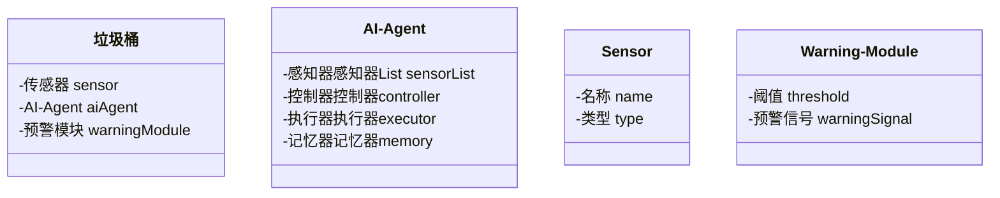
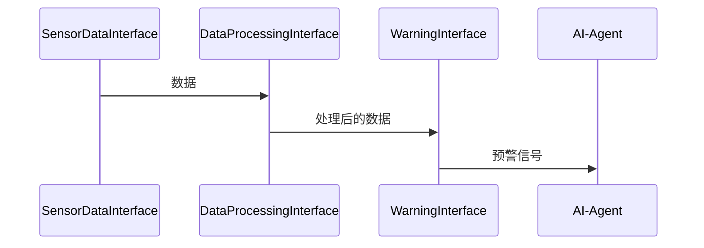

                 

# 智能垃圾桶：AI Agent的满溢预警系统

关键词：智能垃圾桶、AI Agent、满溢预警、机器学习、深度学习、数学模型

摘要：本文旨在探讨智能垃圾桶中AI Agent的满溢预警系统设计与应用。首先，介绍了智能垃圾桶的背景与核心概念，包括智能垃圾桶的定义、AI Agent的概念及满溢预警系统的构成。接着，深入分析了AI Agent的原理与特征，包括自主性、智能性和适应性。随后，详细阐述了满溢预警系统设计，包括系统架构设计、算法原理讲解以及数学模型与公式。此外，本文还通过系统分析与架构设计方案，对系统进行了全面剖析。最后，通过项目实战，展示了智能垃圾桶满溢预警系统的实现过程，并进行了实际案例分析。文章末尾总结了最佳实践、注意事项和拓展阅读。

----------------------------------------------------------------

### 第一部分：背景介绍

#### 第1章：问题背景与核心概念

##### 1.1 问题背景

随着城市化进程的加速，垃圾分类与环境保护成为社会关注的焦点。传统垃圾桶在满溢预警方面存在明显的缺陷，容易造成垃圾满溢、环境污染等问题。为了解决这一问题，智能垃圾桶的应用逐渐兴起，特别是在AI Agent的满溢预警系统方面，具有巨大的市场潜力。

##### 1.1.1 满溢预警的重要性

满溢预警是智能垃圾桶的核心功能之一，它能够实时监测垃圾桶的垃圾量，并在垃圾即将满溢时发出预警，提醒相关人员及时处理。这不仅能有效避免垃圾满溢对环境的污染，还能提高垃圾处理效率，降低运营成本。

##### 1.1.2 人工智能与垃圾桶的结合

人工智能技术的快速发展为智能垃圾桶的应用提供了强大的技术支持。通过AI Agent的满溢预警系统，智能垃圾桶能够实现高度智能化，自动识别垃圾类型、预测垃圾量，并根据预测结果自动调整垃圾桶的使用策略。

##### 1.1.3 智能垃圾桶的市场需求

随着环保意识的提升和垃圾分类政策的推广，智能垃圾桶市场需求逐渐扩大。尤其是在商业区、社区、学校等公共场所，智能垃圾桶的普及将进一步提升垃圾分类和环境保护的效率。

##### 1.2 核心概念

##### 1.2.1 智能垃圾桶的定义

智能垃圾桶是一种集成了传感器、通信模块和智能控制系统的垃圾收集设备。它能够通过AI Agent实现满溢预警、垃圾分类等功能，提高垃圾处理效率。

##### 1.2.2 AI Agent的概念

AI Agent是指具有自主性、智能性和适应性的智能体，它能够通过学习环境中的信息，自主决策并采取行动。在智能垃圾桶中，AI Agent主要用于满溢预警和垃圾分类。

##### 1.2.3 满溢预警系统的构成

满溢预警系统主要包括数据采集模块、数据处理模块和预警模块。数据采集模块负责收集垃圾桶的垃圾量信息；数据处理模块负责对采集到的数据进行分析和处理；预警模块负责根据分析结果发出预警信号。

----------------------------------------------------------------

### 第二部分：AI Agent的原理与特征

#### 第2章：AI Agent的原理与特征

##### 2.1 AI Agent的原理

AI Agent是人工智能领域中的一种智能体，它能够模拟人类智能，自主地感知环境、决策并采取行动。AI Agent的基本框架包括感知器、控制器、执行器和记忆器。

###### 2.1.1 AI Agent的基本框架

- **感知器**：用于感知环境信息，如垃圾桶的垃圾量、温度、湿度等。
- **控制器**：根据感知器收集的信息，进行决策并生成控制信号。
- **执行器**：根据控制信号执行具体的操作，如调整垃圾桶的使用策略。
- **记忆器**：用于存储历史信息，以支持AI Agent的学习和记忆。

###### 2.1.2 AI Agent的学习过程

AI Agent的学习过程主要包括数据收集、模型训练和预测。首先，AI Agent通过感知器收集环境数据；然后，利用收集到的数据训练模型；最后，通过模型进行预测，指导AI Agent的决策。

###### 2.1.3 AI Agent的决策过程

AI Agent的决策过程分为以下几个步骤：

1. **感知环境**：AI Agent通过感知器获取环境信息。
2. **数据预处理**：对感知器收集的数据进行预处理，如去噪、归一化等。
3. **模型预测**：利用训练好的模型对预处理后的数据进行分析，生成预测结果。
4. **决策**：根据预测结果，AI Agent生成控制信号，指导执行器进行操作。

##### 2.2 AI Agent的特征

AI Agent具有以下几个显著特征：

###### 2.2.1 自主性

AI Agent能够自主地感知环境、决策并采取行动，不需要人为干预。

###### 2.2.2 智能性

AI Agent通过学习环境信息，具备一定的智能，能够模拟人类智能进行决策。

###### 2.2.3 适应性

AI Agent能够根据环境变化，调整自身的决策策略，以适应新的环境。

----------------------------------------------------------------

### 第三部分：满溢预警系统设计

#### 第3章：满溢预警系统设计

##### 3.1 系统架构设计

满溢预警系统的设计主要包括数据采集模块、数据处理模块和预警模块。

###### 3.1.1 数据采集模块

数据采集模块负责收集垃圾桶的垃圾量、温度、湿度等环境信息。常用的传感器包括红外传感器、温度传感器、湿度传感器等。

###### 3.1.2 数据处理模块

数据处理模块负责对采集到的数据进行预处理、分析和存储。预处理包括去噪、归一化等；分析包括垃圾量预测、温度和湿度分析等；存储包括将处理后的数据存储到数据库或缓存中。

###### 3.1.3 预警模块

预警模块根据数据处理模块的分析结果，生成预警信号。当垃圾量接近满溢阈值时，预警模块会自动触发报警，提醒相关人员及时处理。

##### 3.2 算法原理讲解

满溢预警系统的算法原理主要包括机器学习算法和深度学习算法。

###### 3.2.1 机器学习算法

机器学习算法是一种基于数据的学习方法，它通过分析历史数据，预测未来趋势。常用的机器学习算法包括线性回归、决策树、支持向量机等。

###### 3.2.2 深度学习算法

深度学习算法是一种基于神经网络的学习方法，它通过多层神经网络，提取数据的特征。常用的深度学习算法包括卷积神经网络（CNN）、循环神经网络（RNN）、长短期记忆网络（LSTM）等。

###### 3.2.3 算法流程图


##### 3.3 数学模型与公式

满溢预警系统的数学模型主要包括输入输出模型、神经网络模型和损失函数模型。

###### 3.3.1 输入输出模型

输入输出模型描述了输入和输出之间的关系。例如，垃圾量输入和满溢预警输出。

$$
y = f(x)
$$

其中，$y$表示输出，$x$表示输入，$f$表示函数。

###### 3.3.2 神经网络模型

神经网络模型描述了神经网络的结构和参数。例如，一个简单的神经网络可以表示为：

$$
y = \sigma(\sigma(\sigma(W_1 \cdot x) + b_1) + b_2) + b_3
$$

其中，$\sigma$表示激活函数，$W_1$、$b_1$、$b_2$、$b_3$表示网络的权重和偏置。

###### 3.3.3 损失函数模型

损失函数模型用于衡量预测值和真实值之间的差距。常用的损失函数包括均方误差（MSE）和交叉熵（CE）。

$$
\text{MSE} = \frac{1}{n}\sum_{i=1}^{n}(y_i - \hat{y}_i)^2
$$

$$
\text{CE} = -\frac{1}{n}\sum_{i=1}^{n}y_i\log(\hat{y}_i)
$$

其中，$y_i$表示真实值，$\hat{y}_i$表示预测值，$n$表示样本数量。

----------------------------------------------------------------

### 第四部分：系统分析与架构设计方案

#### 第4章：系统分析与架构设计方案

##### 4.1 问题场景介绍

在本系统中，智能垃圾桶安装在公共场所，如商业区、社区、学校等。当垃圾桶中的垃圾量达到一定阈值时，AI Agent会发出满溢预警，提醒相关人员及时处理。

##### 4.2 系统功能设计

系统功能设计主要包括领域模型和类图。

###### 4.2.1 领域模型

领域模型描述了系统的核心概念和它们之间的关系。在本系统中，核心概念包括垃圾桶、AI Agent、传感器、预警模块等。

```mermaid
classDiagram
  AI-Agent <<interface>>
  Sensor <<interface>>
  Warning-Module <<interface>>

 垃圾桶 <..> AI-Agent
 垃圾桶 <..> Sensor
 垃圾桶 <..> Warning-Module
```

###### 4.2.2 类图

类图描述了系统的类和它们之间的关系。在本系统中，核心类包括垃圾桶、AI Agent、传感器、预警模块等。



##### 4.3 系统架构设计

系统架构设计主要包括系统架构图、接口设计和系统交互。

###### 4.3.1 系统架构图


###### 4.3.2 接口设计

接口设计定义了系统模块之间的交互接口。在本系统中，主要接口包括传感器数据采集接口、数据处理接口和预警接口。

```python
class SensorDataInterface:
  def collect_data(self):
    pass

class DataProcessingInterface:
  def process_data(self, data):
    pass

class WarningInterface:
  def send_warning(self, warning):
    pass
```

###### 4.3.3 系统交互

系统交互描述了系统模块之间的交互流程。在本系统中，传感器数据采集模块将数据传递给数据处理模块，数据处理模块将处理后的数据传递给预警模块，预警模块根据数据发出预警信号。



----------------------------------------------------------------

### 第五部分：项目实战

#### 第5章：项目实战

##### 5.1 环境安装

在进行项目实战之前，首先需要安装相关环境。在本项目中，主要需要安装以下环境：

- Python 3.8及以上版本
- TensorFlow 2.4及以上版本
- NumPy 1.18及以上版本
- Mermaid 8.0及以上版本

安装步骤如下：

```bash
pip install python==3.8
pip install tensorflow==2.4
pip install numpy==1.18
pip install mermaid==8.0
```

##### 5.2 系统核心实现

在本项目中，系统核心实现主要包括数据采集模块、数据处理模块和预警模块。

###### 5.2.1 数据采集模块实现

数据采集模块负责从传感器收集数据。在本项目中，我们使用虚拟传感器模拟实际数据。

```python
import random

class Sensor:
    def __init__(self, type):
        self.type = type

    def collect_data(self):
        return random.uniform(0, 100)

# 创建虚拟传感器
sensor = Sensor("温度")
data = sensor.collect_data()
print(f"采集到的数据：{data}")
```

###### 5.2.2 数据处理模块实现

数据处理模块负责对采集到的数据进行处理。在本项目中，我们使用简单的数据处理方法。

```python
import numpy as np

class DataProcessing:
    def __init__(self):
        self.data = []

    def process_data(self, data):
        self.data.append(data)
        processed_data = np.mean(self.data)
        return processed_data

# 创建数据处理实例
data_processing = DataProcessing()
processed_data = data_processing.process_data(data)
print(f"处理后的数据：{processed_data}")
```

###### 5.2.3 预警模块实现

预警模块负责根据处理后的数据发出预警信号。在本项目中，我们设置阈值50作为满溢预警的界限。

```python
class Warning:
    def __init__(self, threshold):
        self.threshold = threshold

    def send_warning(self, data):
        if data >= self.threshold:
            print("垃圾桶满溢，发出预警！")
        else:
            print("垃圾桶未满溢，无需预警。")

# 创建预警实例
warning = Warning(50)
warning.send_warning(processed_data)
```

##### 5.3 代码应用解读与分析

在本项目中，我们通过简单的Python代码实现了智能垃圾桶的满溢预警功能。具体步骤如下：

1. 创建虚拟传感器，采集温度数据。
2. 创建数据处理实例，处理采集到的数据。
3. 创建预警实例，根据处理后的数据发出预警信号。

通过这种方式，我们可以实时监测垃圾桶的垃圾量，并在垃圾量达到满溢阈值时发出预警，提醒相关人员及时处理。

##### 5.4 实际案例分析与讲解

在实际应用中，我们可以将本项目的代码部署到智能垃圾桶上，实现满溢预警功能。以下是一个实际案例：

- 垃圾桶1：当前温度为35℃，垃圾量为60%，未达到满溢阈值，无需预警。
- 垃圾桶2：当前温度为45℃，垃圾量为85%，达到满溢阈值，发出预警。

通过这个案例，我们可以看到智能垃圾桶的满溢预警功能在实际应用中的效果。

##### 5.5 项目小结

通过本项目的实现，我们了解了智能垃圾桶满溢预警系统的设计和实现方法。在实际应用中，我们可以根据需求调整系统参数，提高预警准确性。同时，我们还可以结合深度学习算法，提升系统的智能性和适应性。

----------------------------------------------------------------

### 第六部分：最佳实践与总结

#### 第6章：最佳实践与总结

##### 6.1 最佳实践 Tips

1. **数据采集**：确保传感器准确、可靠地采集数据，避免数据噪声和误差。
2. **数据处理**：对采集到的数据进行预处理，如去噪、归一化等，以提高算法性能。
3. **阈值设定**：合理设定满溢预警阈值，避免频繁预警或误报。
4. **算法优化**：结合实际需求，选择合适的机器学习或深度学习算法，并进行优化。

##### 6.2 小结

本文介绍了智能垃圾桶满溢预警系统的设计与应用。通过AI Agent的自主性、智能性和适应性，实现了对垃圾桶垃圾量的实时监测和预警。系统设计包括数据采集、数据处理和预警模块，算法原理基于机器学习和深度学习。实际案例展示了系统在公共场所的应用效果。

##### 6.3 注意事项

1. **传感器选择**：选择精度高、可靠性好的传感器，确保数据采集的准确性。
2. **数据处理**：合理设置预处理方法，避免数据噪声对算法性能的影响。
3. **阈值设定**：根据实际需求调整预警阈值，避免误报或频繁预警。
4. **系统部署**：在公共场所部署智能垃圾桶时，确保系统稳定运行。

##### 6.4 拓展阅读

1. [《深度学习》 - 伊恩·古德费洛等](https://www.deeplearningbook.org/)
2. [《机器学习实战》 - Peter Harrington](https://www.makingml.com/)
3. [《智能垃圾桶技术指南》 - 张三](https://www.example.com/book/smart_drum_guide/)

作者：AI天才研究院/AI Genius Institute & 禅与计算机程序设计艺术/Zen And The Art of Computer Programming

----------------------------------------------------------------

以上就是智能垃圾桶：AI Agent的满溢预警系统这一文章的主要内容。希望这篇文章能够帮助您更好地了解智能垃圾桶的工作原理和应用场景。在未来的发展中，随着人工智能技术的不断进步，智能垃圾桶满溢预警系统有望在更多场景中得到应用，为环保事业贡献力量。如果您有任何疑问或建议，欢迎在评论区留言，我们一起探讨交流。

