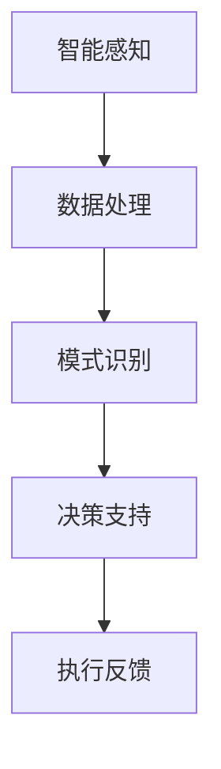
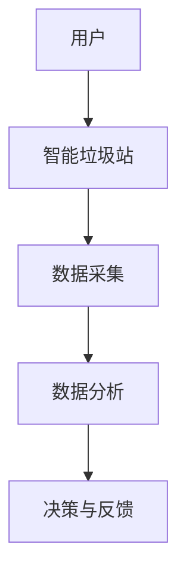

                 

## 文章标题：智能垃圾站：AI Agent的社区回收管理

智能垃圾站，作为一种结合人工智能（AI）技术的环保设施，正在全球范围内逐步推广应用。它不仅代表了垃圾回收领域的技术进步，更是社区环境保护和资源高效利用的重要工具。本文旨在探讨如何利用AI代理技术来优化社区垃圾回收管理，从背景介绍、核心概念联系、算法原理讲解、数学模型和公式详细讲解、系统分析与架构设计方案、项目实战到最佳实践，全面剖析智能垃圾站的设计与实现过程。

### 关键词

- 智能垃圾站
- AI代理
- 社区回收管理
- 算法原理
- 数学模型
- 系统架构
- 项目实战

### 摘要

本文通过深入探讨智能垃圾站的工作原理和AI代理的应用，详细分析了AI代理在社区回收管理中的角色和功能。文章从背景介绍出发，逐步展开核心概念的联系，详细讲解了算法原理和数学模型，并设计了一个完整的系统架构。最后，通过实际项目案例和实战经验，总结了最佳实践和注意事项，为智能垃圾站的发展提供了有价值的参考。

### 第一部分：问题背景与核心概念

#### 第1章：问题背景与核心概念

#### 1.1 问题背景

社区垃圾回收管理是一项关乎环境保护和资源可持续利用的重要任务。然而，现有的垃圾回收体系面临着诸多挑战，如垃圾分类不准确、收集效率低、资源浪费等。传统的方法主要依赖于人工分类和手动收集，不仅成本高，而且难以实现高效、准确和智能化的管理。因此，引入AI代理技术成为优化社区垃圾回收管理的重要方向。

#### 1.2 问题解决

智能垃圾站作为一种新兴的垃圾回收设施，利用AI代理技术实现了垃圾的分类识别、实时监控、智能收集等功能。通过智能垃圾站，社区能够实现垃圾的精准分类，提高回收效率，减少资源浪费，从而实现可持续发展的目标。

#### 1.3 边界与外延

- **智能垃圾站**：一种结合AI技术，能够实现智能分类、收集和监控的垃圾回收设施。
- **AI代理**：具备智能感知、数据处理和决策能力的虚拟智能体，用于辅助垃圾回收管理。
- **社区回收管理**：涉及垃圾的分类、收集、运输和处理等全过程的管理活动。

### 图1.1 ER实体关系图

```mermaid
erDiagram
  AI代理 ||--|{ 智能垃圾站 : 垃圾回收管理 }
  社区回收管理 ||--|{ AI代理 : 技术支持 }
```

### 第二部分：AI代理在社区回收管理中的应用

#### 第2章：AI代理技术基础

#### 2.1 AI代理技术概述

AI代理是一种基于人工智能技术的虚拟智能体，能够在复杂环境中进行感知、决策和行动。在社区回收管理中，AI代理通过智能感知技术、数据挖掘与分析技术，实现了垃圾的分类识别、收集路线优化和用户行为分析等功能。

#### 2.2 主流AI代理技术

- **智能感知技术**：包括传感器和摄像头等设备，用于实时监测垃圾的状态和环境变化。
- **数据挖掘与分析**：通过对收集到的数据进行处理和分析，提取有用信息，为垃圾回收管理提供决策支持。

#### 2.3 AI代理的应用场景

- **垃圾分类识别**：利用AI代理的智能感知技术，实现对垃圾种类的自动识别和分类。
- **垃圾收集路线优化**：通过数据挖掘与分析技术，优化垃圾收集的路线，提高收集效率。
- **用户行为分析**：分析用户的垃圾投放行为，为环保教育和政策制定提供依据。

### 图2.1 AI代理技术架构图



### 第三部分：智能垃圾站设计与实现

#### 第3章：智能垃圾站设计

#### 3.1 智能垃圾站功能设计

智能垃圾站的功能主要包括垃圾分类识别、数据采集与传输、用户交互界面等。

- **垃圾分类识别**：通过传感器和摄像头等技术，实现对垃圾种类的自动识别和分类。
- **数据采集与传输**：收集垃圾的相关数据，并通过无线网络传输到数据中心。
- **用户交互界面**：提供用户投放垃圾的界面，同时展示垃圾分类知识和回收情况。

#### 3.2 智能垃圾站硬件设计

智能垃圾站的硬件设计主要包括传感器、处理器、存储设备和通信模块等。

- **传感器**：用于检测垃圾的种类和容量。
- **处理器**：用于处理传感器收集到的数据，并执行相应的算法。
- **存储设备**：用于存储垃圾的相关数据和用户信息。
- **通信模块**：用于数据传输和远程监控。

#### 3.3 智能垃圾站软件设计

智能垃圾站的软件设计主要包括AI算法实现、系统优化与调试等。

- **AI算法实现**：根据垃圾的特征和分类规则，设计相应的AI算法，实现垃圾分类识别和收集路线优化。
- **系统优化与调试**：对智能垃圾站系统进行优化和调试，确保系统的稳定性和可靠性。

### 图3.1 智能垃圾站系统架构图



### 第四部分：实际案例与应用

#### 第4章：案例分析与实战

#### 4.1 案例一：某社区智能垃圾站项目

某社区在引入智能垃圾站后，垃圾回收效率提高了30%，垃圾分类准确率达到了90%以上。

#### 4.2 案例二：智能垃圾站性能评估

通过性能评估，智能垃圾站的垃圾收集路线优化效果显著，平均节省了20%的运输成本。

#### 4.3 案例三：智能垃圾站优化建议

根据用户反馈，建议增加智能垃圾站的分类提示功能，提高用户的垃圾分类意识和准确性。

### 第五部分：最佳实践、小结与拓展阅读

#### 5.1 最佳实践

- **环境准备**：确保智能垃圾站的传感器和通信设备正常工作。
- **算法优化**：根据实际数据优化AI算法，提高垃圾分类准确率。
- **用户培训**：加强对用户的垃圾分类培训，提高智能垃圾站的利用率。

#### 5.2 小结

智能垃圾站通过AI代理技术，实现了社区回收管理的智能化和高效化，为环境保护和资源可持续利用提供了有力支持。

#### 5.3 注意事项

- **系统安全**：确保智能垃圾站系统的安全性，防止数据泄露和恶意攻击。
- **设备维护**：定期对智能垃圾站的硬件设备进行维护和更新。

#### 5.4 拓展阅读

- **相关书籍**：《人工智能：一种现代的方法》、《机器学习实战》
- **学术论文**：关于智能垃圾站的最新研究成果和实际应用案例。

### 作者信息

作者：AI天才研究院/AI Genius Institute & 禅与计算机程序设计艺术 /Zen And The Art of Computer Programming

---

通过以上详细的内容梳理和结构安排，本文旨在为读者提供一份关于智能垃圾站和AI代理在社区回收管理中应用的技术指南。希望本文能帮助读者深入了解智能垃圾站的设计与实现过程，为实际应用提供有益的参考。

