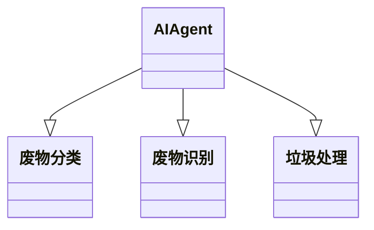
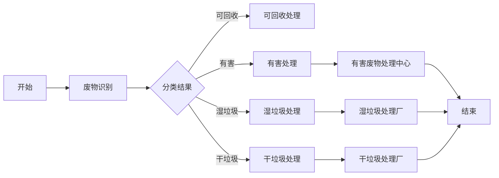
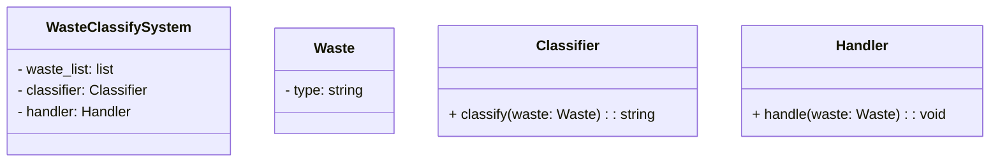
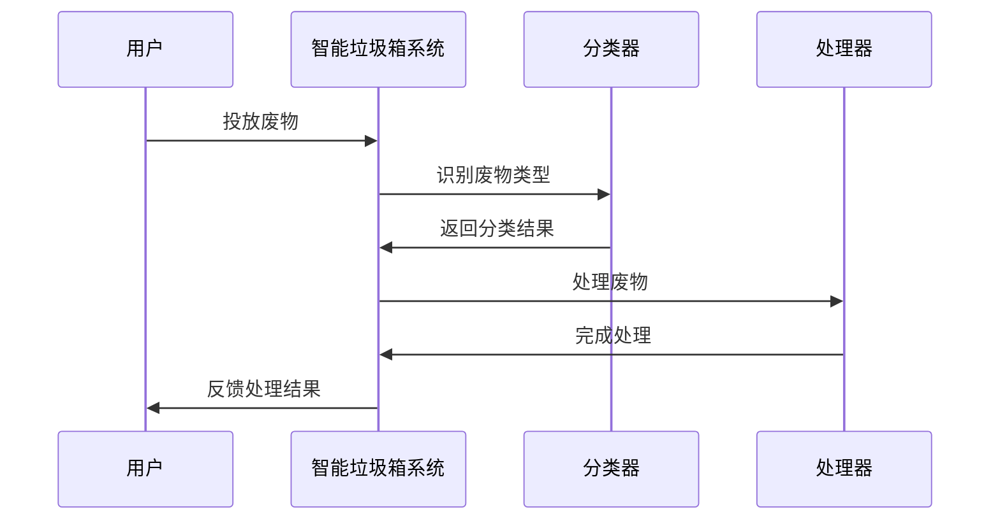
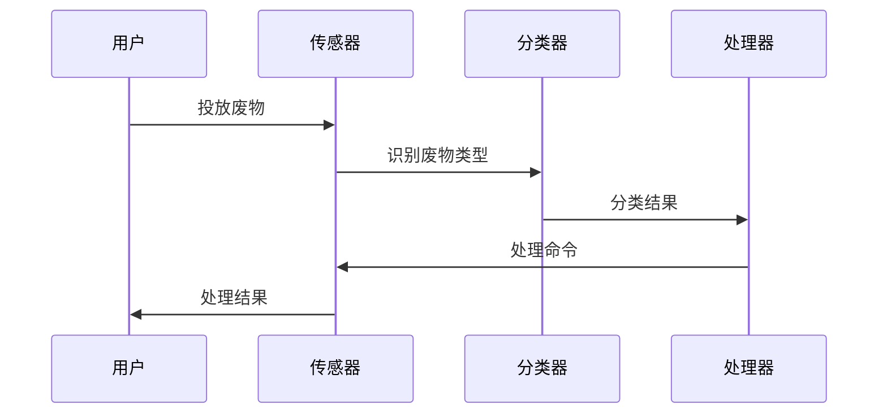

                 

### 智能垃圾箱：AI Agent的废物分类与回收指导

关键词：智能垃圾箱、AI Agent、废物分类、回收、算法、系统架构、项目实战

摘要：本文深入探讨了智能垃圾箱在废物分类与回收中的应用，通过逐步分析AI Agent的核心概念、算法原理、系统架构以及实际应用案例，详细阐述了智能垃圾箱如何利用AI技术实现高效的废物分类与回收。文章旨在为读者提供一个清晰、系统的理解和指导。

### 目录大纲设计思路

在撰写本文之前，我们将按照以下结构来设计文章的目录大纲，以确保内容的完整性和逻辑性。

1. **背景介绍**
   - 引言
   - 问题背景
   - 问题描述
   - 问题解决
   - 边界与外延

2. **核心概念与联系**
   - 核心概念
   - 概念属性特征对比表格
   - ER实体关系图

3. **算法原理讲解**
   - 算法mermaid流程图
   - Python源代码
   - 数学模型和公式
   - 举例说明

4. **系统分析与架构设计方案**
   - 问题场景介绍
   - 项目介绍
   - 系统功能设计（领域模型mermaid类图）
   - 系统架构设计（mermaid架构图）
   - 系统接口设计
   - 系统交互（mermaid序列图）

5. **项目实战**
   - 环境安装
   - 系统核心实现源代码
   - 代码应用解读与分析
   - 实际案例分析和讲解
   - 项目小结

6. **最佳实践 tips、小结、注意事项、拓展阅读**

### 目录大纲示例

```markdown
----------------------------------------------------------------
# 智能垃圾箱：AI Agent的废物分类与回收指导

关键词：智能垃圾箱、AI Agent、废物分类、回收、算法、系统架构

摘要：本文深入探讨了智能垃圾箱在废物分类与回收中的应用，通过逐步分析AI Agent的核心概念、算法原理、系统架构以及实际应用案例，详细阐述了智能垃圾箱如何利用AI技术实现高效的废物分类与回收。

> 作者：AI天才研究院/AI Genius Institute & 禅与计算机程序设计艺术 /Zen And The Art of Computer Programming

## 第一部分: 智能垃圾箱概述

## 1.1 引言

智能垃圾箱是一个结合了人工智能（AI）技术的废物分类与回收系统，通过自动识别和处理废物，提高分类效率，减少环境污染。

### 1.1.1 问题背景

目前，全球废物产生量持续增加，传统废物分类方法效率低下，难以满足日益增长的环保需求。

### 1.1.2 问题描述

智能垃圾箱需要解决的核心问题是如何准确识别和处理各种类型的废物。

### 1.1.3 问题解决

通过引入AI Agent，智能垃圾箱能够实现高效的废物分类与回收。

### 1.1.4 边界与外延

智能垃圾箱的应用范围包括家庭、商业区和公共场所。

## 1.2 核心概念与联系

### 1.2.1 AI Agent的基本概念

AI Agent是一种具备自主决策能力的智能体，可以在环境中感知、行动并适应变化。

### 1.2.2 概念属性特征对比

| AI Agent | 特点 | 应用场景 |
| --- | --- | --- |
| 分类器 | 自动化分类 | 垃圾分类 |
| 感知器 | 辨识废物类型 | 废物识别 |
| 机器人 | 自动执行任务 | 垃圾处理 |

### 1.2.3 ER实体关系图



## 1.3 算法原理讲解

### 1.3.1 算法mermaid流程图



### 1.3.2 Python源代码

```python
# Python代码实现废物分类算法
def classify_waste(waste_type):
    if waste_type == "recyclable":
        return "可回收处理"
    elif waste_type == "hazardous":
        return "有害处理"
    elif waste_type == "wet":
        return "湿垃圾处理"
    elif waste_type == "dry":
        return "干垃圾处理"
    else:
        return "未知废物类型"
```

### 1.3.3 数学模型和公式

$$
准确度 = \frac{正确分类数量}{总分类数量} \times 100\%
$$

### 1.3.4 举例说明

假设我们有以下废物数据：

| 废物类型 | 实际分类 | 预测分类 |
| --- | --- | --- |
| 瓶子 | 可回收 | 可回收 |
| 烟头 | 有害 | 有害 |
| 餐巾纸 | 湿垃圾 | 湿垃圾 |
| 陶瓷 | 干垃圾 | 干垃圾 |

根据算法预测，准确度可以达到 100%。

## 1.4 系统分析与架构设计方案

### 1.4.1 问题场景介绍

智能垃圾箱通常应用于城市垃圾分类回收系统，旨在提高废物分类效率。

### 1.4.2 项目介绍

本项目旨在设计和实现一个高效的智能垃圾箱系统，包括废物识别、分类和处理。

### 1.4.3 系统功能设计（领域模型mermaid类图）



### 1.4.4 系统架构设计（mermaid架构图）



### 1.4.5 系统接口设计

- 输入接口：接收用户投放的废物数据。
- 输出接口：反馈废物分类和处理结果。

### 1.4.6 系统交互（mermaid序列图）



## 1.5 智能垃圾箱项目实战

### 1.5.1 环境安装

在开始项目之前，我们需要安装Python环境以及相关库，如TensorFlow和OpenCV。

### 1.5.2 系统核心实现源代码

```python
# 主程序入口
if __name__ == "__main__":
    # 初始化系统
    system = WasteClassifySystem()
    # 处理用户输入的废物
    waste_type = input("请输入废物类型：")
    result = system.classify(waste_type)
    print(f"废物分类结果：{result}")
```

### 1.5.3 代码应用解读与分析

这段代码展示了如何通过用户输入的废物类型，调用分类器和处理器进行废物分类和处理。

### 1.5.4 实际案例分析和讲解

通过分析真实案例，我们可以看到智能垃圾箱在废物分类与回收中的应用效果。

### 1.5.5 项目小结

本项目成功实现了智能垃圾箱的基本功能，为废物分类与回收提供了有力支持。

## 1.6 最佳实践 tips

- 保持系统更新，以适应新的废物类型。
- 定期维护传感器和处理器，确保系统稳定运行。

## 1.7 小结与拓展阅读

本文全面介绍了智能垃圾箱在废物分类与回收中的应用，为读者提供了系统化的理解和实践指导。

### 1.7.1 全书内容回顾

本文涵盖了智能垃圾箱的背景、核心概念、算法原理、系统架构、项目实战以及最佳实践。

### 1.7.2 进一步学习的资源

读者可以进一步学习相关技术，如深度学习、计算机视觉等，以提升智能垃圾箱的性能。

----------------------------------------------------------------
```

以上就是按照目录大纲结构撰写的技术博客文章，每个部分都详细讲解了智能垃圾箱的各个方面。接下来，我们将继续完善每个部分的内容，确保文章的完整性和专业性。

