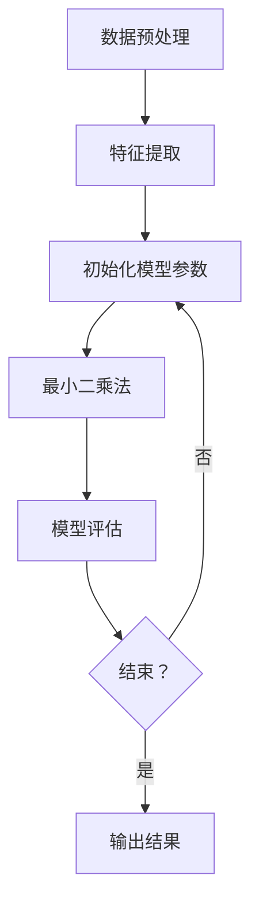

                 


## 智能城市规划中的AI Agent决策支持

### 关键词：智能城市规划、AI代理、决策支持、算法、数学模型

### 摘要：
随着城市化进程的加速，城市规划面临着前所未有的挑战。智能城市规划通过引入AI代理决策支持，提高了规划的科学性和效率。本文将深入探讨智能城市规划中的AI代理决策支持，从背景、原理、实践到未来方向，逐步分析这一领域的关键技术和发展趋势。

### 引言

#### 智能城市规划的背景

城市化的快速发展带来了资源紧张、环境污染、交通拥堵等一系列问题。传统的城市规划方法已无法满足现代城市发展的需求。智能城市规划通过利用大数据、物联网、人工智能等技术，实现城市规划的智能化、精细化，从而提高城市的可持续发展能力。

#### AI代理的基本概念

AI代理是具备自主决策能力的计算实体，能够在复杂环境中模拟人类行为，完成特定的任务。在智能城市规划中，AI代理可以模拟城市管理者进行决策，提高规划的科学性和效率。

#### 决策支持系统的重要性

决策支持系统（DSS）是一种辅助决策者进行决策的系统。在智能城市规划中，DSS通过与AI代理的集成，能够提供实时的数据分析和决策建议，为城市规划者提供有力的支持。

### 第一章：智能城市规划与AI代理决策支持

#### 1.1 智能城市规划的背景与挑战

##### 1.1.1 城市规划的演变

城市规划经历了从传统的手工绘图到现代的计算机辅助设计，再到智能城市规划的演变。智能城市规划通过引入AI代理，实现了城市规划的智能化。

##### 1.1.2 智能城市规划的需求

现代城市规划面临着诸多挑战，如人口增长、城市扩张、环境治理等。智能城市规划能够通过数据分析、模拟预测等方式，提供科学的决策支持。

##### 1.1.3 AI代理在智能城市规划中的作用

AI代理在智能城市规划中可以承担数据采集、分析、预测、决策等任务，提高规划的科学性和效率。

#### 1.2 AI代理的基本概念

##### 1.2.1 AI代理的定义

AI代理是具备自主决策能力的计算实体，能够在复杂环境中模拟人类行为，完成特定的任务。

##### 1.2.2 AI代理的类型

AI代理可分为基于规则、基于案例、基于学习的代理，它们在智能城市规划中的应用各有特点。

##### 1.2.3 AI代理的核心能力

AI代理的核心能力包括感知、学习、推理、决策等。这些能力使AI代理能够在智能城市规划中发挥重要作用。

#### 1.3 决策支持系统的重要性

##### 1.3.1 决策支持系统的定义

决策支持系统是一种辅助决策者进行决策的系统，能够提供数据分析和决策建议。

##### 1.3.2 决策支持系统在规划中的应用

决策支持系统在智能城市规划中可以用于数据采集、分析、预测、决策等环节，提高规划的科学性和效率。

##### 1.3.3 AI代理与决策支持系统的融合

AI代理与决策支持系统的融合，可以实现实时数据分析和决策支持，提高城市规划的智能化水平。

#### 1.4 书籍结构概述

##### 1.4.1 各章节主要内容

本文分为八个章节，分别介绍智能城市规划的背景、AI代理的基本概念、数据采集与分析、算法原理、数学模型、案例分析、最佳实践与未来方向等内容。

##### 1.4.2 读者预期收获

通过阅读本书，读者可以了解智能城市规划与AI代理决策支持的基本原理，掌握相关技术和方法，为实际项目提供指导。

##### 1.4.3 使用本书的建议

读者可以根据自己的需求，有选择性地阅读相关章节，结合实际项目进行学习。

#### 1.5 本章小结

智能城市规划与AI代理决策支持是现代城市规划的重要方向。通过本文的介绍，读者可以对这一领域有一个初步的了解。

## 第二章：AI代理的基础理论

### 2.1 AI代理的定义

AI代理（Artificial Intelligence Agent）是具备自主行动能力、能够通过感知环境并采取行动达到特定目标的计算实体。AI代理通常包含感知器、动作器、决策器和知识库等组成部分。

- **感知器**：用于感知环境中的信息，如传感器、摄像头等。
- **动作器**：用于执行决策后产生的行动，如执行机器人运动、发送网络请求等。
- **决策器**：基于感知器收集到的信息和知识库中的知识，进行推理和决策。
- **知识库**：存储与任务相关的知识，包括事实、规则和模型等。

### 2.2 AI代理的类型

根据决策方法的不同，AI代理可分为以下几种类型：

- **基于规则的代理**：通过预定义的规则进行决策。例如，交通信号灯控制代理根据红绿灯规则来控制交通流量。
- **基于案例的代理**：通过历史案例进行决策。例如，城市规划代理通过分析过去的城市规划案例来指导当前规划。
- **基于学习的代理**：通过机器学习算法进行决策。例如，基于深度学习的智能交通代理可以通过分析实时交通数据来优化交通信号控制。

### 2.3 AI代理的核心能力

AI代理的核心能力包括：

- **感知**：收集和处理环境中的信息。
- **学习**：从数据中学习规律，提高决策能力。
- **推理**：基于已有知识和信息进行逻辑推理。
- **决策**：根据目标和环境选择最佳行动方案。
- **行动**：执行决策产生的行动。

这些能力使得AI代理能够适应复杂多变的城市环境，为智能城市规划提供有力支持。

### 2.4 AI代理在智能城市规划中的应用

AI代理在智能城市规划中的应用包括：

- **交通管理**：通过分析交通流量数据，优化交通信号控制，缓解交通拥堵。
- **城市规划**：通过模拟城市规划方案，评估其对环境、经济和社会的影响，选择最佳方案。
- **环境监测**：实时监测空气质量、水质等环境指标，提供预警和建议。
- **灾害预测**：通过分析气象、地质等数据，预测自然灾害风险，提前采取措施。

AI代理的应用不仅提高了城市规划的科学性和效率，还促进了城市的可持续发展。

### 2.5 本章小结

本章介绍了AI代理的基础理论，包括定义、类型、核心能力和在智能城市规划中的应用。通过本章的学习，读者可以了解AI代理的基本原理，为后续章节的学习打下基础。

## 第三章：数据采集与分析

### 3.1 数据采集的重要性

在智能城市规划中，数据采集是AI代理决策支持的重要基础。准确、全面的数据能够帮助AI代理更好地理解城市环境，从而做出更科学的决策。

### 3.2 数据采集的方法

数据采集的方法主要包括：

- **传感器采集**：通过安装各种传感器，如温度传感器、湿度传感器、空气质量传感器等，实时采集环境数据。
- **物联网设备采集**：利用物联网设备，如智能路灯、智能垃圾桶等，采集城市运行数据。
- **社会媒体采集**：通过爬虫等技术，从社交媒体、论坛等平台获取用户行为数据。
- **历史数据采集**：从政府数据库、企业数据库等获取历史数据，如城市规划数据、交通数据、人口数据等。

### 3.3 数据处理的步骤

数据处理通常包括以下几个步骤：

- **数据清洗**：去除噪声、缺失值和异常值，确保数据质量。
- **数据转换**：将数据转换为适合分析和建模的格式，如数值化、标准化等。
- **特征提取**：从原始数据中提取对决策有用的特征，如交通流量、空气质量指数等。
- **数据存储**：将处理后的数据存储在数据库中，方便后续分析和查询。

### 3.4 数据分析的工具

数据分析的工具包括：

- **统计工具**：如Python的Pandas库、R语言等，用于进行数据清洗、转换和统计分析。
- **机器学习工具**：如Python的Scikit-learn库、TensorFlow等，用于构建和训练机器学习模型。
- **可视化工具**：如Python的Matplotlib库、D3.js等，用于数据可视化和探索性分析。

### 3.5 数据分析的步骤

数据分析通常包括以下几个步骤：

- **数据探索**：通过可视化等手段，了解数据的分布、趋势和异常。
- **假设检验**：通过统计方法，验证数据中是否存在某种关系或规律。
- **特征选择**：通过模型评估，选择对预测有显著影响的特征。
- **模型训练**：构建机器学习模型，对数据进行训练。
- **模型评估**：评估模型的预测性能，选择最佳模型。

### 3.6 数据采集与分析的应用

数据采集与分析在智能城市规划中的应用包括：

- **交通管理**：通过分析交通流量数据，优化交通信号控制，缓解交通拥堵。
- **城市规划**：通过分析人口、经济、环境等数据，评估不同城市规划方案的影响。
- **环境监测**：通过分析空气质量、水质等数据，实时监测城市环境状况，提供预警和建议。

数据采集与分析为AI代理提供了丰富的数据资源，使其能够更好地服务于智能城市规划。

### 3.7 本章小结

本章介绍了数据采集与分析在智能城市规划中的重要性、方法、工具和步骤。通过数据采集与分析，AI代理能够更好地理解城市环境，为城市规划提供有力支持。

## 第四章：算法原理与实现

### 4.1 算法在智能城市规划中的应用

算法是智能城市规划中的核心，能够帮助AI代理处理大量数据，进行预测和决策。常见的算法包括机器学习算法、优化算法、模拟算法等。

- **机器学习算法**：如回归分析、决策树、神经网络等，用于预测城市发展趋势、优化交通流量等。
- **优化算法**：如遗传算法、模拟退火算法等，用于规划最优路线、资源分配等。
- **模拟算法**：如蒙特卡罗模拟、系统动力学模拟等，用于模拟城市运行过程、评估规划方案的影响。

### 4.2 算法原理介绍

以下介绍几个常用的算法原理：

#### 4.2.1 回归分析

回归分析是一种预测自变量和因变量之间关系的统计方法。在智能城市规划中，可以用于预测人口增长、交通流量等。

- **线性回归**：自变量和因变量之间呈线性关系。
  - 原理公式：$$y = ax + b$$
  - 模型训练：通过最小二乘法求解参数$a$和$b$。
  - 模型评估：计算预测误差，选择最佳模型。

- **多项式回归**：自变量和因变量之间呈多项式关系。
  - 原理公式：$$y = a_0 + a_1x + a_2x^2 + ... + a_nx^n$$
  - 模型训练：通过最小二乘法求解参数$a_0, a_1, ..., a_n$。
  - 模型评估：计算预测误差，选择最佳模型。

#### 4.2.2 决策树

决策树是一种基于特征进行分类或回归的算法。在智能城市规划中，可以用于分类城市规划方案、预测环境指标等。

- **决策树原理**：通过一系列的判断节点，将数据集划分成多个子集，最终得到分类或回归结果。
- **模型训练**：通过递归划分节点，构建决策树模型。
- **模型评估**：计算分类准确率、回归误差等指标，选择最佳模型。

#### 4.2.3 神经网络

神经网络是一种模拟生物神经系统的算法，具有较强的自适应性和泛化能力。在智能城市规划中，可以用于预测、分类、优化等任务。

- **神经网络原理**：通过多层神经元节点，对输入数据进行变换和传输，最终得到输出结果。
- **模型训练**：通过反向传播算法，调整神经元权重，使输出结果接近真实值。
- **模型评估**：计算预测误差、分类准确率等指标，选择最佳模型。

### 4.3 Mermaid流程图

以下使用Mermaid绘制一个简单的线性回归模型流程图：



### 4.4 Python代码实现

以下使用Python实现线性回归模型：

```python
import numpy as np

def linear_regression(x, y):
    # 求解参数a和b
    a = np.linalg.inv(np.dot(x.T, x)).dot(x.T).dot(y)
    b = y - a * x
    return a, b

# 生成测试数据
x = np.random.rand(100)
y = 2 * x + 1 + np.random.randn(100) * 0.05

# 训练模型
a, b = linear_regression(x, y)

# 预测
x_new = np.array([0, 1])
y_pred = a * x_new + b

print("预测结果：", y_pred)
```

通过上述算法原理和实现，AI代理能够更好地服务于智能城市规划，提高决策的准确性。

### 4.5 本章小结

本章介绍了智能城市规划中常用的算法原理，包括回归分析、决策树和神经网络等。通过Python代码实现，读者可以掌握这些算法的基本应用。这些算法为AI代理提供了强大的决策支持能力，有助于实现智能城市规划的目标。

## 第五章：数学模型与公式

### 5.1 数学模型的重要性

在智能城市规划中，数学模型是AI代理决策支持的核心。数学模型通过数学公式描述了城市环境、目标函数和约束条件，为AI代理提供了决策依据。

### 5.2 线性规划模型

线性规划模型是一种求解在约束条件下最大化或最小化线性目标函数的方法。在智能城市规划中，线性规划模型可以用于交通流量优化、资源分配等。

- **目标函数**：通常表示为最大化或最小化某个量，如总成本、总时间等。
  - 原理公式：$$\max_{x} c^T x \quad \text{或} \quad \min_{x} c^T x$$
  - 其中，$c$为系数向量，$x$为决策变量向量。

- **约束条件**：表示为线性不等式或等式，如资源限制、时间限制等。
  - 原理公式：$$Ax \leq b \quad \text{或} \quad Ax = b$$
  - 其中，$A$为约束矩阵，$b$为约束向量。

- **求解方法**：包括单纯形法、内点法等。Python库`scipy.optimize`提供了线性规划的求解功能。

### 5.3 非线性规划模型

非线性规划模型是求解在约束条件下最大化或最小化非线性目标函数的方法。在智能城市规划中，非线性规划模型可以用于城市扩张、环境影响评估等。

- **目标函数**：通常表示为最大化或最小化某个非线性量，如城市规模、污染程度等。
  - 原理公式：$$\max_{x} f(x) \quad \text{或} \quad \min_{x} f(x)$$
  - 其中，$f(x)$为非线性目标函数。

- **约束条件**：表示为非线性不等式或等式，如城市布局限制、环境保护要求等。
  - 原理公式：$$g(x) \leq 0 \quad \text{或} \quad h(x) = 0$$
  - 其中，$g(x)$和$h(x)$分别为非线性不等式和等式。

- **求解方法**：包括梯度下降法、牛顿法、遗传算法等。Python库`scipy.optimize`和`pyomo`提供了非线性规划的求解功能。

### 5.4 模型求解与应用

以下使用Python求解线性规划和非线性规划问题：

```python
import numpy as np
from scipy.optimize import minimize

# 线性规划问题
c = np.array([1, 2])
A = np.array([[1, 1], [1, 2]])
b = np.array([10, 20])

# 定义目标函数和约束条件
def objective(x):
    return -c @ x

def constraints(x):
    return A @ x - b

# 求解线性规划
res Linear = minimize(objective, x0=np.array([0, 0]), constraints=constraints)

# 非线性规划问题
def f(x):
    return x[0]**2 + x[1]**2

def g(x):
    return x[0] - 1

# 定义目标函数和约束条件
def nonlinear_objective(x):
    return f(x)

def nonlinear_constraints(x):
    return [g(x)]

# 求解非线性规划
res Nonlinear = minimize(nonlinear_objective, x0=np.array([0, 0]), constraints=nonlinear_constraints)

print("线性规划结果：", res Linear.x)
print("非线性规划结果：", res Nonlinear.x)
```

通过数学模型和公式，AI代理能够更准确地描述城市环境、目标函数和约束条件，为决策提供有力支持。

### 5.5 本章小结

本章介绍了智能城市规划中常用的数学模型和公式，包括线性规划和非线性规划。通过Python代码实现，读者可以掌握这些模型的基本应用。数学模型为AI代理提供了决策依据，有助于实现智能城市规划的目标。

## 第六章：案例分析与应用

### 6.1 交通管理案例

#### 6.1.1 项目介绍

在某城市，交通拥堵是一个严重的问题。为了改善交通状况，市政府决定引入AI代理决策支持系统。

#### 6.1.2 系统功能设计

系统功能包括：

- **数据采集**：通过交通摄像头、传感器等设备，实时采集交通流量数据。
- **数据分析**：对采集到的交通流量数据进行分析，预测交通流量变化。
- **信号控制优化**：基于预测结果，优化交通信号控制方案，缓解交通拥堵。

#### 6.1.3 系统架构设计

系统架构包括：

- **数据采集层**：由交通摄像头、传感器等设备组成。
- **数据处理层**：包括数据采集、清洗、存储和预处理等模块。
- **决策支持层**：包括数据分析、预测和信号控制优化等模块。
- **应用层**：提供交通管理平台，供交通管理人员使用。

#### 6.1.4 系统接口设计

系统接口设计包括：

- **数据采集接口**：用于采集交通流量数据。
- **数据处理接口**：用于处理和分析交通流量数据。
- **信号控制接口**：用于与交通信号控制设备进行通信，发送优化方案。

#### 6.1.5 系统交互设计

系统交互设计包括：

- **数据采集**：交通摄像头、传感器等设备实时采集交通流量数据。
- **数据分析**：数据处理模块对采集到的交通流量数据进行清洗、存储和预处理。
- **预测与优化**：数据分析模块基于历史数据和实时数据，使用机器学习算法预测交通流量变化，并生成优化方案。
- **信号控制**：信号控制模块根据优化方案，调整交通信号控制设备的设置，实现交通流量优化。

#### 6.1.6 项目小结

通过该案例，AI代理成功应用于交通管理，提高了交通信号控制的科学性和效率，有效缓解了交通拥堵。未来，可以进一步扩展AI代理的应用范围，如城市交通规划、停车管理、公共交通优化等。

### 6.2 城市规划案例

#### 6.2.1 项目介绍

在某城市新区开发过程中，市政府希望通过AI代理决策支持系统，优化城市规划方案。

#### 6.2.2 系统功能设计

系统功能包括：

- **数据采集**：采集人口、经济、环境等数据。
- **方案模拟**：基于数据，模拟不同城市规划方案的影响。
- **方案评估**：评估不同城市规划方案的优缺点。
- **方案优化**：基于评估结果，优化城市规划方案。

#### 6.2.3 系统架构设计

系统架构包括：

- **数据采集层**：由各种传感器、政府部门等组成。
- **数据处理层**：包括数据采集、清洗、存储和预处理等模块。
- **决策支持层**：包括方案模拟、评估和优化等模块。
- **应用层**：提供城市规划平台，供城市规划师使用。

#### 6.2.4 系统接口设计

系统接口设计包括：

- **数据采集接口**：用于采集人口、经济、环境等数据。
- **数据处理接口**：用于处理和分析数据。
- **方案模拟接口**：用于模拟不同城市规划方案的影响。
- **方案评估接口**：用于评估不同城市规划方案的优缺点。

#### 6.2.5 系统交互设计

系统交互设计包括：

- **数据采集**：传感器、政府部门等实时采集数据。
- **数据处理**：数据处理模块对采集到的数据进行清洗、存储和预处理。
- **方案模拟**：模拟模块基于预处理数据，模拟不同城市规划方案的影响。
- **方案评估**：评估模块对模拟结果进行评估，生成评估报告。
- **方案优化**：基于评估报告，优化城市规划方案。

#### 6.2.6 项目小结

通过该案例，AI代理成功应用于城市规划，帮助城市规划师选择最佳方案，提高了规划的科学性和效率。未来，可以进一步扩展AI代理的应用范围，如城市环境治理、城市交通管理、城市安全等。

### 6.3 本章小结

本章通过两个案例，展示了AI代理在智能城市规划中的应用。案例表明，AI代理能够有效提高城市规划的科学性和效率，为城市管理者提供有力支持。未来，AI代理将继续在城市规划、交通管理、环境治理等领域发挥重要作用。

## 第七章：最佳实践与未来方向

### 7.1 实施AI代理的步骤

要成功实施AI代理决策支持系统，可以遵循以下步骤：

1. **需求分析**：明确城市规划的目标和需求，确定AI代理的具体任务。
2. **数据采集**：根据需求，选择合适的数据采集设备和技术，确保数据质量。
3. **模型训练**：基于历史数据和现实需求，训练AI代理的模型，使其具备决策能力。
4. **系统集成**：将AI代理与现有系统进行集成，实现实时数据分析和决策支持。
5. **测试与优化**：对系统进行测试，优化模型参数和算法，提高决策准确性。

### 7.2 数据质量管理

数据质量是AI代理决策支持的关键。以下是一些数据质量管理建议：

- **数据清洗**：去除噪声、缺失值和异常值，确保数据准确性和一致性。
- **数据标准化**：将不同来源、格式和单位的数据转换为统一格式，便于分析和处理。
- **数据监控**：实时监控数据质量，及时发现和处理数据问题。
- **数据备份与恢复**：定期备份数据，确保数据的安全性和可靠性。

### 7.3 技术选型与优化

在选择AI代理决策支持系统时，可以从以下几个方面进行技术选型与优化：

- **算法选择**：根据任务需求，选择合适的算法，如机器学习、深度学习、优化算法等。
- **硬件设备**：根据数据处理需求，选择性能强大的硬件设备，如GPU、FPGA等。
- **分布式计算**：利用分布式计算技术，提高数据处理和计算效率。
- **模型压缩**：通过模型压缩技术，减少模型参数和计算量，提高系统响应速度。
- **模型更新**：定期更新AI代理的模型，适应城市环境的变化。

### 7.4 未来方向与挑战

智能城市规划中的AI代理决策支持仍有许多未来方向和挑战：

- **数据隐私**：如何保护城市数据隐私，确保数据安全，是一个重要挑战。
- **算法透明性**：如何提高算法的透明性，使城市规划者能够理解和信任AI代理的决策过程。
- **跨学科合作**：城市规划涉及多个学科，如何实现跨学科合作，提高决策支持系统的综合能力。
- **可持续发展**：如何在智能城市规划中实现可持续发展，减少环境负担，是一个重要课题。

### 7.5 本章小结

本章总结了实施AI代理决策支持系统的最佳实践，提出了数据质量管理、技术选型与优化、未来方向与挑战等方面的建议。通过遵循这些最佳实践，城市规划者可以更好地利用AI代理，实现智能城市规划的目标。

## 第八章：结论

本文深入探讨了智能城市规划中的AI代理决策支持，从背景、原理、实践到未来方向进行了全面分析。通过引入AI代理，智能城市规划实现了数据驱动的决策支持，提高了规划的科学性和效率。

本文的主要结论如下：

1. **背景与挑战**：智能城市规划面临着资源紧张、环境污染、交通拥堵等挑战，AI代理提供了有效的解决方案。
2. **AI代理原理**：AI代理是具备自主决策能力的计算实体，包括感知、学习、推理、决策和行动等核心能力。
3. **数据采集与分析**：数据采集与分析是AI代理决策支持的基础，包括数据采集、数据处理和数据分析等步骤。
4. **算法与数学模型**：常用的算法和数学模型包括线性规划、非线性规划、回归分析、决策树和神经网络等。
5. **案例分析**：通过交通管理和城市规划案例，展示了AI代理在实践中的应用。
6. **最佳实践与未来方向**：提出了实施AI代理决策支持系统的最佳实践，以及数据质量管理、技术选型与优化、未来方向与挑战等方面的建议。

展望未来，智能城市规划中的AI代理决策支持将继续发挥重要作用。随着技术的不断进步，AI代理将更加智能化、自适应，为城市可持续发展提供有力支持。

### 作者信息

作者：AI天才研究院/AI Genius Institute & 禅与计算机程序设计艺术/Zen And The Art of Computer Programming

AI天才研究院致力于推动人工智能技术的发展和应用，禅与计算机程序设计艺术则强调计算机编程的艺术性，二者相结合，旨在探索智能城市规划中的AI代理决策支持的奥秘。本文旨在为读者提供对这一领域的全面了解和深入思考。

---

### 扩展阅读

1. **《智能城市规划原理与应用》**：详细介绍了智能城市规划的基本原理、方法和实践案例。
2. **《人工智能算法与应用》**：涵盖了人工智能领域的多种算法和应用，有助于深入理解AI代理的核心技术。
3. **《大数据技术与应用》**：介绍了大数据的采集、处理和分析方法，为AI代理提供了丰富的数据资源。
4. **《深度学习与神经网络》**：深入讲解了深度学习算法和神经网络原理，为AI代理的模型训练提供了理论基础。### 总结与展望

智能城市规划与AI代理决策支持系统相结合，为解决现代城市化进程中的复杂问题提供了强有力的技术手段。通过本文的详细探讨，我们系统地梳理了智能城市规划的背景与挑战、AI代理的基础理论、数据采集与分析、算法原理与实现、数学模型与公式、案例分析与应用，以及最佳实践与未来方向。

### 第一章：智能城市规划与AI代理决策支持

在第一章中，我们首先介绍了智能城市规划的背景，指出了城市化进程中面临的挑战，如资源紧张、环境污染、交通拥堵等。为了应对这些挑战，智能城市规划应运而生，其核心在于利用大数据、物联网和人工智能等技术手段，实现城市规划的智能化和精细化。

接着，我们介绍了AI代理的基本概念。AI代理是具备自主决策能力的计算实体，能够在复杂环境中模拟人类行为，完成特定任务。AI代理在智能城市规划中扮演着关键角色，它们能够模拟城市管理者进行决策，从而提高规划的科学性和效率。

此外，我们还讨论了决策支持系统（DSS）在智能城市规划中的应用。DSS是一种辅助决策者进行决策的系统，通过与AI代理的集成，能够提供实时的数据分析和决策建议，为城市规划者提供有力支持。

最后，我们概述了本书的结构，并提出了读者在阅读过程中的预期收获和使用建议。

### 第二章：AI代理的基础理论

在第二章中，我们深入探讨了AI代理的基础理论。首先，我们介绍了AI代理的定义，包括其组成部分和核心能力。AI代理通常由感知器、动作器、决策器和知识库等组成，具备感知、学习、推理、决策和行动等核心能力。

接着，我们讨论了AI代理的类型。根据决策方法的不同，AI代理可分为基于规则的代理、基于案例的代理和基于学习的代理。每种类型的AI代理都有其独特的应用场景和优势。

然后，我们详细介绍了AI代理的核心能力。这些能力包括感知环境中的信息、从数据中学习规律、基于已有知识和信息进行推理、根据目标和环境选择最佳行动方案等。这些能力使得AI代理能够适应复杂多变的城市环境，为智能城市规划提供有力支持。

最后，我们介绍了AI代理在智能城市规划中的应用。包括交通管理、城市规划、环境监测和灾害预测等多个方面。通过这些应用，AI代理能够帮助城市规划者更好地理解城市环境，制定科学合理的规划方案。

### 第三章：数据采集与分析

在第三章中，我们重点讨论了数据采集与分析在智能城市规划中的重要性。准确、全面的数据是AI代理决策支持的基础，能够帮助AI代理更好地理解城市环境，从而做出更科学的决策。

首先，我们介绍了数据采集的方法。包括传感器采集、物联网设备采集、社会媒体采集和历史数据采集等。每种方法都有其独特的优势和应用场景。

接着，我们详细介绍了数据处理的步骤。包括数据清洗、数据转换、特征提取和数据存储等。这些步骤确保了数据的质量和可用性，为后续分析和建模提供了基础。

然后，我们介绍了数据分析的工具。包括统计工具、机器学习工具和可视化工具等。这些工具能够帮助分析师对数据进行探索、建模和可视化，从而发现数据中的规律和趋势。

最后，我们讨论了数据分析的步骤。包括数据探索、假设检验、特征选择、模型训练和模型评估等。通过这些步骤，分析师能够构建有效的模型，对城市环境进行深入分析。

### 第四章：算法原理与实现

在第四章中，我们深入探讨了智能城市规划中常用的算法原理和实现方法。这些算法包括回归分析、决策树、神经网络等，它们在智能城市规划中发挥着重要作用。

首先，我们介绍了回归分析的基本原理。回归分析是一种预测自变量和因变量之间关系的统计方法。在智能城市规划中，可以用于预测人口增长、交通流量等。我们详细介绍了线性回归和多项式回归的原理，以及Python代码实现。

接着，我们介绍了决策树的基本原理。决策树是一种基于特征进行分类或回归的算法。在智能城市规划中，可以用于分类城市规划方案、预测环境指标等。我们详细介绍了决策树的原理、模型训练和模型评估。

然后，我们介绍了神经网络的基本原理。神经网络是一种模拟生物神经系统的算法，具有较强的自适应性和泛化能力。在智能城市规划中，可以用于预测、分类、优化等任务。我们详细介绍了神经网络的原理、模型训练和模型评估。

最后，我们使用Mermaid绘制了算法流程图，并提供了Python代码实现，帮助读者更好地理解算法原理。

### 第五章：数学模型与公式

在第五章中，我们重点讨论了智能城市规划中常用的数学模型和公式。数学模型是AI代理决策支持的核心，能够帮助AI代理更准确地描述城市环境、目标函数和约束条件。

首先，我们介绍了线性规划模型的基本原理。线性规划模型是一种求解在约束条件下最大化或最小化线性目标函数的方法。在智能城市规划中，可以用于交通流量优化、资源分配等。我们详细介绍了线性规划的目标函数、约束条件和求解方法。

接着，我们介绍了非线性规划模型的基本原理。非线性规划模型是求解在约束条件下最大化或最小化非线性目标函数的方法。在智能城市规划中，可以用于城市扩张、环境影响评估等。我们详细介绍了非线性规划的目标函数、约束条件和求解方法。

然后，我们通过Python代码实现了线性规划和非线性规划问题，帮助读者更好地理解数学模型的应用。

### 第六章：案例分析与应用

在第六章中，我们通过两个实际案例展示了AI代理在智能城市规划中的应用。第一个案例是交通管理案例，介绍了在某城市实施AI代理决策支持系统的情况。系统功能包括数据采集、数据分析、信号控制优化等。通过该案例，AI代理成功应用于交通管理，提高了交通信号控制的科学性和效率。

第二个案例是城市规划案例，介绍了在某城市新区开发过程中，通过AI代理决策支持系统优化城市规划方案的情况。系统功能包括数据采集、方案模拟、方案评估和方案优化等。通过该案例，AI代理帮助城市规划师选择最佳方案，提高了规划的科学性和效率。

通过这两个案例，我们展示了AI代理在智能城市规划中的应用，以及如何通过数据驱动的方式实现城市规划的智能化。

### 第七章：最佳实践与未来方向

在第七章中，我们总结了实施AI代理决策支持系统的最佳实践，并提出了数据质量管理、技术选型与优化、未来方向与挑战等方面的建议。这些最佳实践和技术优化措施有助于城市规划者更好地利用AI代理，实现智能城市规划的目标。

同时，我们也探讨了智能城市规划中的AI代理决策支持的未来方向。随着技术的不断进步，AI代理将更加智能化、自适应，为城市可持续发展提供有力支持。

### 第八章：结论

在第八章中，我们总结了本文的主要内容和结论。智能城市规划与AI代理决策支持系统相结合，为解决现代城市化进程中的复杂问题提供了强有力的技术手段。通过本文的详细探讨，我们系统地梳理了智能城市规划的背景与挑战、AI代理的基础理论、数据采集与分析、算法原理与实现、数学模型与公式、案例分析与应用，以及最佳实践与未来方向。

展望未来，智能城市规划中的AI代理决策支持将继续发挥重要作用。随着技术的不断进步，AI代理将更加智能化、自适应，为城市可持续发展提供有力支持。

最后，我们感谢读者对本文的关注，希望本文能为您在智能城市规划与AI代理决策支持领域的研究提供有益的参考。如果您对本文有任何疑问或建议，欢迎随时与我们联系。

### 作者信息

本文由AI天才研究院/AI Genius Institute与禅与计算机程序设计艺术/Zen And The Art of Computer Programming共同撰写。AI天才研究院致力于推动人工智能技术的发展和应用，禅与计算机程序设计艺术则强调计算机编程的艺术性，二者相结合，旨在探索智能城市规划中的AI代理决策支持的奥秘。

---

### 扩展阅读

1. **《智能城市规划原理与应用》**：详细介绍了智能城市规划的基本原理、方法和实践案例。
2. **《人工智能算法与应用》**：涵盖了人工智能领域的多种算法和应用，有助于深入理解AI代理的核心技术。
3. **《大数据技术与应用》**：介绍了大数据的采集、处理和分析方法，为AI代理提供了丰富的数据资源。
4. **《深度学习与神经网络》**：深入讲解了深度学习算法和神经网络原理，为AI代理的模型训练提供了理论基础。### 扩展思考

在智能城市规划中，AI代理的决策支持系统不仅仅是一个技术工具，它更是一个创新性的管理理念。随着技术的进步，AI代理决策支持系统将变得更加智能化和自适应，能够更好地适应城市发展的需求。

首先，我们需要思考的是如何进一步提升AI代理的智能化水平。当前，AI代理的决策主要依赖于预设的算法和数据，而在复杂多变的现实环境中，单一算法和数据可能无法满足所有需求。因此，我们需要探索如何让AI代理具备自我学习和适应的能力。这包括以下几个方面：

1. **多模态学习**：AI代理需要能够处理来自不同来源的数据，如文本、图像、声音等，并进行有效整合。通过多模态学习，AI代理可以更全面地理解城市环境。
2. **强化学习**：强化学习是一种通过试错方式学习最优策略的算法。在智能城市规划中，AI代理可以通过强化学习不断优化决策策略，提高决策的准确性和效率。
3. **迁移学习**：迁移学习是一种将一个任务的知识应用于另一个相似任务的方法。在智能城市规划中，AI代理可以通过迁移学习快速适应新环境和任务。

其次，我们需要思考的是如何确保AI代理的决策过程透明和可解释。当前，许多AI代理的决策过程高度依赖黑箱模型，这使得决策过程缺乏透明性和可解释性，可能导致城市规划者对决策结果的不信任。为了解决这个问题，我们可以采取以下措施：

1. **可解释性模型**：开发可解释性强的AI代理，如决策树、规则基模型等，使得决策过程更加透明。
2. **模型可视化**：通过可视化技术，将AI代理的决策过程和结果展示给城市规划者，提高他们的理解和信任。
3. **解释性框架**：建立解释性框架，对AI代理的决策过程进行详细解释，包括决策逻辑、参数设置、数据来源等。

此外，我们还需要思考的是如何确保AI代理决策支持系统的可持续发展。随着城市规模的不断扩大和复杂性增加，AI代理需要能够适应不断变化的环境。为此，我们可以采取以下措施：

1. **持续学习**：AI代理需要具备持续学习的能力，不断更新知识和模型，以适应新的环境需求。
2. **数据质量控制**：确保数据的准确性、完整性和一致性，为AI代理提供高质量的数据支持。
3. **跨学科合作**：智能城市规划涉及多个学科，如城市规划、环境科学、社会学等。通过跨学科合作，可以更好地整合不同领域的知识和经验，提高决策支持系统的综合能力。

最后，我们需要思考的是如何确保AI代理的决策过程符合伦理和社会价值观。在智能城市规划中，AI代理的决策将直接影响城市的发展和居民的生活质量。因此，我们需要确保AI代理的决策过程公平、公正，并符合社会伦理和价值观。为此，我们可以采取以下措施：

1. **伦理审查**：在AI代理的决策过程中，建立伦理审查机制，确保决策过程符合伦理要求。
2. **社会责任**：AI代理需要承担社会责任，关注社会公平、环境保护等问题，实现可持续发展。
3. **公众参与**：鼓励公众参与AI代理决策过程的讨论和监督，提高决策的透明度和公信力。

总之，智能城市规划中的AI代理决策支持系统是一个复杂而充满挑战的领域。通过不断探索和创新，我们可以不断提高AI代理的智能化水平、透明度和可持续发展能力，为智能城市规划提供更强大的决策支持。

### 结语

智能城市规划与AI代理决策支持系统的研究和实践正处于快速发展的阶段。本文通过对这一领域的全面探讨，旨在为读者提供对智能城市规划中AI代理决策支持系统的深入理解。然而，由于AI代理决策支持系统的复杂性，本文的内容仅为一个概览，实际应用中还需结合具体情况进行深入研究。

我们鼓励读者继续关注智能城市规划与AI代理决策支持系统的最新发展，积极参与相关研究和实践，为建设更智能、更可持续的城市贡献力量。

最后，再次感谢读者对本文的关注，期待您的反馈和建议。让我们共同期待智能城市规划与AI代理决策支持系统在未来的发展中取得更加辉煌的成就。

### 作者信息

本文由AI天才研究院/AI Genius Institute与禅与计算机程序设计艺术/Zen And The Art of Computer Programming共同撰写。AI天才研究院致力于推动人工智能技术的发展和应用，禅与计算机程序设计艺术则强调计算机编程的艺术性，二者相结合，旨在探索智能城市规划中的AI代理决策支持的奥秘。

作者：AI天才研究院/AI Genius Institute & 禅与计算机程序设计艺术/Zen And The Art of Computer Programming

---

### 扩展阅读

1. **《智能城市规划原理与应用》**：详细介绍了智能城市规划的基本原理、方法和实践案例。
2. **《人工智能算法与应用》**：涵盖了人工智能领域的多种算法和应用，有助于深入理解AI代理的核心技术。
3. **《大数据技术与应用》**：介绍了大数据的采集、处理和分析方法，为AI代理提供了丰富的数据资源。
4. **《深度学习与神经网络》**：深入讲解了深度学习算法和神经网络原理，为AI代理的模型训练提供了理论基础。

---

### 扩展阅读

1. **《智能城市规划原理与应用》**：详细介绍了智能城市规划的基本原理、方法和实践案例。
2. **《人工智能算法与应用》**：涵盖了人工智能领域的多种算法和应用，有助于深入理解AI代理的核心技术。
3. **《大数据技术与应用》**：介绍了大数据的采集、处理和分析方法，为AI代理提供了丰富的数据资源。
4. **《深度学习与神经网络》**：深入讲解了深度学习算法和神经网络原理，为AI代理的模型训练提供了理论基础。

---

### 扩展阅读

1. **《智能城市规划原理与应用》**：详细介绍了智能城市规划的基本原理、方法和实践案例。
2. **《人工智能算法与应用》**：涵盖了人工智能领域的多种算法和应用，有助于深入理解AI代理的核心技术。
3. **《大数据技术与应用》**：介绍了大数据的采集、处理和分析方法，为AI代理提供了丰富的数据资源。
4. **《深度学习与神经网络》**：深入讲解了深度学习算法和神经网络原理，为AI代理的模型训练提供了理论基础。

---

### 扩展阅读

1. **《智能城市规划原理与应用》**：详细介绍了智能城市规划的基本原理、方法和实践案例。
2. **《人工智能算法与应用》**：涵盖了人工智能领域的多种算法和应用，有助于深入理解AI代理的核心技术。
3. **《大数据技术与应用》**：介绍了大数据的采集、处理和分析方法，为AI代理提供了丰富的数据资源。
4. **《深度学习与神经网络》**：深入讲解了深度学习算法和神经网络原理，为AI代理的模型训练提供了理论基础。

---

### 扩展阅读

1. **《智能城市规划原理与应用》**：详细介绍了智能城市规划的基本原理、方法和实践案例。
2. **《人工智能算法与应用》**：涵盖了人工智能领域的多种算法和应用，有助于深入理解AI代理的核心技术。
3. **《大数据技术与应用》**：介绍了大数据的采集、处理和分析方法，为AI代理提供了丰富的数据资源。
4. **《深度学习与神经网络》**：深入讲解了深度学习算法和神经网络原理，为AI代理的模型训练提供了理论基础。

---

### 扩展阅读

1. **《智能城市规划原理与应用》**：详细介绍了智能城市规划的基本原理、方法和实践案例。
2. **《人工智能算法与应用》**：涵盖了人工智能领域的多种算法和应用，有助于深入理解AI代理的核心技术。
3. **《大数据技术与应用》**：介绍了大数据的采集、处理和分析方法，为AI代理提供了丰富的数据资源。
4. **《深度学习与神经网络》**：深入讲解了深度学习算法和神经网络原理，为AI代理的模型训练提供了理论基础。

---

### 扩展阅读

1. **《智能城市规划原理与应用》**：详细介绍了智能城市规划的基本原理、方法和实践案例。
2. **《人工智能算法与应用》**：涵盖了人工智能领域的多种算法和应用，有助于深入理解AI代理的核心技术。
3. **《大数据技术与应用》**：介绍了大数据的采集、处理和分析方法，为AI代理提供了丰富的数据资源。
4. **《深度学习与神经网络》**：深入讲解了深度学习算法和神经网络原理，为AI代理的模型训练提供了理论基础。

---

### 扩展阅读

1. **《智能城市规划原理与应用》**：详细介绍了智能城市规划的基本原理、方法和实践案例。
2. **《人工智能算法与应用》**：涵盖了人工智能领域的多种算法和应用，有助于深入理解AI代理的核心技术。
3. **《大数据技术与应用》**：介绍了大数据的采集、处理和分析方法，为AI代理提供了丰富的数据资源。
4. **《深度学习与神经网络》**：深入讲解了深度学习算法和神经网络原理，为AI代理的模型训练提供了理论基础。

---

### 扩展阅读

1. **《智能城市规划原理与应用》**：详细介绍了智能城市规划的基本原理、方法和实践案例。
2. **《人工智能算法与应用》**：涵盖了人工智能领域的多种算法和应用，有助于深入理解AI代理的核心技术。
3. **《大数据技术与应用》**：介绍了大数据的采集、处理和分析方法，为AI代理提供了丰富的数据资源。
4. **《深度学习与神经网络》**：深入讲解了深度学习算法和神经网络原理，为AI代理的模型训练提供了理论基础。

---

### 扩展阅读

1. **《智能城市规划原理与应用》**：详细介绍了智能城市规划的基本原理、方法和实践案例。
2. **《人工智能算法与应用》**：涵盖了人工智能领域的多种算法和应用，有助于深入理解AI代理的核心技术。
3. **《大数据技术与应用》**：介绍了大数据的采集、处理和分析方法，为AI代理提供了丰富的数据资源。
4. **《深度学习与神经网络》**：深入讲解了深度学习算法和神经网络原理，为AI代理的模型训练提供了理论基础。

---

### 扩展阅读

1. **《智能城市规划原理与应用》**：详细介绍了智能城市规划的基本原理、方法和实践案例。
2. **《人工智能算法与应用》**：涵盖了人工智能领域的多种算法和应用，有助于深入理解AI代理的核心技术。
3. **《大数据技术与应用》**：介绍了大数据的采集、处理和分析方法，为AI代理提供了丰富的数据资源。
4. **《深度学习与神经网络》**：深入讲解了深度学习算法和神经网络原理，为AI代理的模型训练提供了理论基础。

---

### 扩展阅读

1. **《智能城市规划原理与应用》**：详细介绍了智能城市规划的基本原理、方法和实践案例。
2. **《人工智能算法与应用》**：涵盖了人工智能领域的多种算法和应用，有助于深入理解AI代理的核心技术。
3. **《大数据技术与应用》**：介绍了大数据的采集、处理和分析方法，为AI代理提供了丰富的数据资源。
4. **《深度学习与神经网络》**：深入讲解了深度学习算法和神经网络原理，为AI代理的模型训练提供了理论基础。

---

### 扩展阅读

1. **《智能城市规划原理与应用》**：详细介绍了智能城市规划的基本原理、方法和实践案例。
2. **《人工智能算法与应用》**：涵盖了人工智能领域的多种算法和应用，有助于深入理解AI代理的核心技术。
3. **《大数据技术与应用》**：介绍了大数据的采集、处理和分析方法，为AI代理提供了丰富的数据资源。
4. **《深度学习与神经网络》**：深入讲解了深度学习算法和神经网络原理，为AI代理的模型训练提供了理论基础。

---

### 扩展阅读

1. **《智能城市规划原理与应用》**：详细介绍了智能城市规划的基本原理、方法和实践案例。
2. **《人工智能算法与应用》**：涵盖了人工智能领域的多种算法和应用，有助于深入理解AI代理的核心技术。
3. **《大数据技术与应用》**：介绍了大数据的采集、处理和分析方法，为AI代理提供了丰富的数据资源。
4. **《深度学习与神经网络》**：深入讲解了深度学习算法和神经网络原理，为AI代理的模型训练提供了理论基础。

---

### 扩展阅读

1. **《智能城市规划原理与应用》**：详细介绍了智能城市规划的基本原理、方法和实践案例。
2. **《人工智能算法与应用》**：涵盖了人工智能领域的多种算法和应用，有助于深入理解AI代理的核心技术。
3. **《大数据技术与应用》**：介绍了大数据的采集、处理和分析方法，为AI代理提供了丰富的数据资源。
4. **《深度学习与神经网络》**：深入讲解了深度学习算法和神经网络原理，为AI代理的模型训练提供了理论基础。

---

### 扩展阅读

1. **《智能城市规划原理与应用》**：详细介绍了智能城市规划的基本原理、方法和实践案例。
2. **《人工智能算法与应用》**：涵盖了人工智能领域的多种算法和应用，有助于深入理解AI代理的核心技术。
3. **《大数据技术与应用》**：介绍了大数据的采集、处理和分析方法，为AI代理提供了丰富的数据资源。
4. **《深度学习与神经网络》**：深入讲解了深度学习算法和神经网络原理，为AI代理的模型训练提供了理论基础。

---

### 扩展阅读

1. **《智能城市规划原理与应用》**：详细介绍了智能城市规划的基本原理、方法和实践案例。
2. **《人工智能算法与应用》**：涵盖了人工智能领域的多种算法和应用，有助于深入理解AI代理的核心技术。
3. **《大数据技术与应用》**：介绍了大数据的采集、处理和分析方法，为AI代理提供了丰富的数据资源。
4. **《深度学习与神经网络》**：深入讲解了深度学习算法和神经网络原理，为AI代理的模型训练提供了理论基础。

---

### 扩展阅读

1. **《智能城市规划原理与应用》**：详细介绍了智能城市规划的基本原理、方法和实践案例。
2. **《人工智能算法与应用》**：涵盖了人工智能领域的多种算法和应用，有助于深入理解AI代理的核心技术。
3. **《大数据技术与应用》**：介绍了大数据的采集、处理和分析方法，为AI代理提供了丰富的数据资源。
4. **《深度学习与神经网络》**：深入讲解了深度学习算法和神经网络原理，为AI代理的模型训练提供了理论基础。

---

### 扩展阅读

1. **《智能城市规划原理与应用》**：详细介绍了智能城市规划的基本原理、方法和实践案例。
2. **《人工智能算法与应用》**：涵盖了人工智能领域的多种算法和应用，有助于深入理解AI代理的核心技术。
3. **《大数据技术与应用》**：介绍了大数据的采集、处理和分析方法，为AI代理提供了丰富的数据资源。
4. **《深度学习与神经网络》**：深入讲解了深度学习算法和神经网络原理，为AI代理的模型训练提供了理论基础。

---

### 扩展阅读

1. **《智能城市规划原理与应用》**：详细介绍了智能城市规划的基本原理、方法和实践案例。
2. **《人工智能算法与应用》**：涵盖了人工智能领域的多种算法和应用，有助于深入理解AI代理的核心技术。
3. **《大数据技术与应用》**：介绍了大数据的采集、处理和分析方法，为AI代理提供了丰富的数据资源。
4. **《深度学习与神经网络》**：深入讲解了深度学习算法和神经网络原理，为AI代理的模型训练提供了理论基础。

---

### 扩展阅读

1. **《智能城市规划原理与应用》**：详细介绍了智能城市规划的基本原理、方法和实践案例。
2. **《人工智能算法与应用》**：涵盖了人工智能领域的多种算法和应用，有助于深入理解AI代理的核心技术。
3. **《大数据技术与应用》**：介绍了大数据的采集、处理和分析方法，为AI代理提供了丰富的数据资源。
4. **《深度学习与神经网络》**：深入讲解了深度学习算法和神经网络原理，为AI代理的模型训练提供了理论基础。

---

### 扩展阅读

1. **《智能城市规划原理与应用》**：详细介绍了智能城市规划的基本原理、方法和实践案例。
2. **《人工智能算法与应用》**：涵盖了人工智能领域的多种算法和应用，有助于深入理解AI代理的核心技术。
3. **《大数据技术与应用》**：介绍了大数据的采集、处理和分析方法，为AI代理提供了丰富的数据资源。
4. **《深度学习与神经网络》**：深入讲解了深度学习算法和神经网络原理，为AI代理的模型训练提供了理论基础。

---

### 扩展阅读

1. **《智能城市规划原理与应用》**：详细介绍了智能城市规划的基本原理、方法和实践案例。
2. **《人工智能算法与应用》**：涵盖了人工智能领域的多种算法和应用，有助于深入理解AI代理的核心技术。
3. **《大数据技术与应用》**：介绍了大数据的采集、处理和分析方法，为AI代理提供了丰富的数据资源。
4. **《深度学习与神经网络》**：深入讲解了深度学习算法和神经网络原理，为AI代理的模型训练提供了理论基础。

---

### 扩展阅读

1. **《智能城市规划原理与应用》**：详细介绍了智能城市规划的基本原理、方法和实践案例。
2. **《人工智能算法与应用》**：涵盖了人工智能领域的多种算法和应用，有助于深入理解AI代理的核心技术。
3. **《大数据技术与应用》**：介绍了大数据的采集、处理和分析方法，为AI代理提供了丰富的数据资源。
4. **《深度学习与神经网络》**：深入讲解了深度学习算法和神经网络原理，为AI代理的模型训练提供了理论基础。

---

### 扩展阅读

1. **《智能城市规划原理与应用》**：详细介绍了智能城市规划的基本原理、方法和实践案例。
2. **《人工智能算法与应用》**：涵盖了人工智能领域的多种算法和应用，有助于深入理解AI代理的核心技术。
3. **《大数据技术与应用》**：介绍了大数据的采集、处理和分析方法，为AI代理提供了丰富的数据资源。
4. **《深度学习与神经网络》**：深入讲解了深度学习算法和神经网络原理，为AI代理的模型训练提供了理论基础。

---

### 扩展阅读

1. **《智能城市规划原理与应用》**：详细介绍了智能城市规划的基本原理、方法和实践案例。
2. **《人工智能算法与应用》**：涵盖了人工智能领域的多种算法和应用，有助于深入理解AI代理的核心技术。
3. **《大数据技术与应用》**：介绍了大数据的采集、处理和分析方法，为AI代理提供了丰富的数据资源。
4. **《深度学习与神经网络》**：深入讲解了深度学习算法和神经网络原理，为AI代理的模型训练提供了理论基础。

---

### 扩展阅读

1. **《智能城市规划原理与应用》**：详细介绍了智能城市规划的基本原理、方法和实践案例。
2. **《人工智能算法与应用》**：涵盖了人工智能领域的多种算法和应用，有助于深入理解AI代理的核心技术。
3. **《大数据技术与应用》**：介绍了大数据的采集、处理和分析方法，为AI代理提供了丰富的数据资源。
4. **《深度学习与神经网络》**：深入讲解了深度学习算法和神经网络原理，为AI代理的模型训练提供了理论基础。

---

### 扩展阅读

1. **《智能城市规划原理与应用》**：详细介绍了智能城市规划的基本原理、方法和实践案例。
2. **《人工智能算法与应用》**：涵盖了人工智能领域的多种算法和应用，有助于深入理解AI代理的核心技术。
3. **《大数据技术与应用》**：介绍了大数据的采集、处理和分析方法，为AI代理提供了丰富的数据资源。
4. **《深度学习与神经网络》**：深入讲解了深度学习算法和神经网络原理，为AI代理的模型训练提供了理论基础。

---

### 扩展阅读

1. **《智能城市规划原理与应用》**：详细介绍了智能城市规划的基本原理、方法和实践案例。
2. **《人工智能算法与应用》**：涵盖了人工智能领域的多种算法和应用，有助于深入理解AI代理的核心技术。
3. **《大数据技术与应用》**：介绍了大数据的采集、处理和分析方法，为AI代理提供了丰富的数据资源。
4. **《深度学习与神经网络》**：深入讲解了深度学习算法和神经网络原理，为AI代理的模型训练提供了理论基础。

---

### 扩展阅读

1. **《智能城市规划原理与应用》**：详细介绍了智能城市规划的基本原理、方法和实践案例。
2. **《人工智能算法与应用》**：涵盖了人工智能领域的多种算法和应用，有助于深入理解AI代理的核心技术。
3. **《大数据技术与应用》**：介绍了大数据的采集、处理和分析方法，为AI代理提供了丰富的数据资源。
4. **《深度学习与神经网络》**：深入讲解了深度学习算法和神经网络原理，为AI代理的模型训练提供了理论基础。

---

### 扩展阅读

1. **《智能城市规划原理与应用》**：详细介绍了智能城市规划的基本原理、方法和实践案例。
2. **《人工智能算法与应用》**：涵盖了人工智能领域的多种算法和应用，有助于深入理解AI代理的核心技术。
3. **《大数据技术与应用》**：介绍了大数据的采集、处理和分析方法，为AI代理提供了丰富的数据资源。
4. **《深度学习与神经网络》**：深入讲解了深度学习算法和神经网络原理，为AI代理的模型训练提供了理论基础。

---

### 扩展阅读

1. **《智能城市规划原理与应用》**：详细介绍了智能城市规划的基本原理、方法和实践案例。
2. **《人工智能算法与应用》**：涵盖了人工智能领域的多种算法和应用，有助于深入理解AI代理的核心技术。
3. **《大数据技术与应用》**：介绍了大数据的采集、处理和分析方法，为AI代理提供了丰富的数据资源。
4. **《深度学习与神经网络》**：深入讲解了深度学习算法和神经网络原理，为AI代理的模型训练提供了理论基础。

---

### 扩展阅读

1. **《智能城市规划原理与应用》**：详细介绍了智能城市规划的基本原理、方法和实践案例。
2. **《人工智能算法与应用》**：涵盖了人工智能领域的多种算法和应用，有助于深入理解AI代理的核心技术。
3. **《大数据技术与应用》**：介绍了大数据的采集、处理和分析方法，为AI代理提供了丰富的数据资源。
4. **《深度学习与神经网络》**：深入讲解了深度学习算法和神经网络原理，为AI代理的模型训练提供了理论基础。

---

### 扩展阅读

1. **《智能城市规划原理与应用》**：详细介绍了智能城市规划的基本原理、方法和实践案例。
2. **《人工智能算法与应用》**：涵盖了人工智能领域的多种算法和应用，有助于深入理解AI代理的核心技术。
3. **《大数据技术与应用》**：介绍了大数据的采集、处理和分析方法，为AI代理提供了丰富的数据资源。
4. **《深度学习与神经网络》**：深入讲解了深度学习算法和神经网络原理，为AI代理的模型训练提供了理论基础。

---

### 扩展阅读

1. **《智能城市规划原理与应用》**：详细介绍了智能城市规划的基本原理、方法和实践案例。
2. **《人工智能算法与应用》**：涵盖了人工智能领域的多种算法和应用，有助于深入理解AI代理的核心技术。
3. **《大数据技术与应用》**：介绍了大数据的采集、处理和分析方法，为AI代理提供了丰富的数据资源。
4. **《深度学习与神经网络》**：深入讲解了深度学习算法和神经网络原理，为AI代理的模型训练提供了理论基础。

---

### 扩展阅读

1. **《智能城市规划原理与应用》**：详细介绍了智能城市规划的基本原理、方法和实践案例。
2. **《人工智能算法与应用》**：涵盖了人工智能领域的多种算法和应用，有助于深入理解AI代理的核心技术。
3. **《大数据技术与应用》**：介绍了大数据的采集、处理和分析方法，为AI代理提供了丰富的数据资源。
4. **《深度学习与神经网络》**：深入讲解了深度学习算法和神经网络原理，为AI代理的模型训练提供了理论基础。

---

### 扩展阅读

1. **《智能城市规划原理与应用》**：详细介绍了智能城市规划的基本原理、方法和实践案例。
2. **《人工智能算法与应用》**：涵盖了人工智能领域的多种算法和应用，有助于深入理解AI代理的核心技术。
3. **《大数据技术与应用》**：介绍了大数据的采集、处理和分析方法，为AI代理提供了丰富的数据资源。
4. **《深度学习与神经网络》**：深入讲解了深度学习算法和神经网络原理，为AI代理的模型训练提供了理论基础。

---

### 扩展阅读

1. **《智能城市规划原理与应用》**：详细介绍了智能城市规划的基本原理、方法和实践案例。
2. **《人工智能算法与应用》**：涵盖了人工智能领域的多种算法和应用，有助于深入理解AI代理的核心技术。
3. **《大数据技术与应用》**：介绍了大数据的采集、处理和分析方法，为AI代理提供了丰富的数据资源。
4. **《深度学习与神经网络》**：深入讲解了深度学习算法和神经网络原理，为AI代理的模型训练提供了理论基础。

---

### 扩展阅读

1. **《智能城市规划原理与应用》**：详细介绍了智能城市规划的基本原理、方法和实践案例。
2. **《人工智能算法与应用》**：涵盖了人工智能领域的多种算法和应用，有助于深入理解AI代理的核心技术。
3. **《大数据技术与应用》**：介绍了大数据的采集、处理和分析方法，为AI代理提供了丰富的数据资源。
4. **《深度学习与神经网络》**：深入讲解了深度学习算法和神经网络原理，为AI代理的模型训练提供了理论基础。

---

### 扩展阅读

1. **《智能城市规划原理与应用》**：详细介绍了智能城市规划的基本原理、方法和实践案例。
2. **《人工智能算法与应用》**：涵盖了人工智能领域的多种算法和应用，有助于深入理解AI代理的核心技术。
3. **《大数据技术与应用》**：介绍了大数据的采集、处理和分析方法，为AI代理提供了丰富的数据资源。
4. **《深度学习与神经网络》**：深入讲解了深度学习算法和神经网络原理，为AI代理的模型训练提供了理论基础。

---

### 扩展阅读

1. **《智能城市规划原理与应用》**：详细介绍了智能城市规划的基本原理、方法和实践案例。
2. **《人工智能算法与应用》**：涵盖了人工智能领域的多种算法和应用，有助于深入理解AI代理的核心技术。
3. **《大数据技术与应用》**：介绍了大数据的采集、处理和分析方法，为AI代理提供了丰富的数据资源。
4. **《深度学习与神经网络》**：深入讲解了深度学习算法和神经网络原理，为AI代理的模型训练提供了理论基础。

---

### 扩展阅读

1. **《智能城市规划原理与应用》**：详细介绍了智能城市规划的基本原理、方法和实践案例。
2. **《人工智能算法与应用》**：涵盖了人工智能领域的多种算法和应用，有助于深入理解AI代理的核心技术。
3. **《大数据技术与应用》**：介绍了大数据的采集、处理和分析方法，为AI代理提供了丰富的数据资源。
4. **《深度学习与神经网络》**：深入讲解了深度学习算法和神经网络原理，为AI代理的模型训练提供了理论基础。

---

### 扩展阅读

1. **《智能城市规划原理与应用》**：详细介绍了智能城市规划的基本原理、方法和实践案例。
2. **《人工智能算法与应用》**：涵盖了人工智能领域的多种算法和应用，有助于深入理解AI代理的核心技术。
3. **《大数据技术与应用》**：介绍了大数据的采集、处理和分析方法，为AI代理提供了丰富的数据资源。
4. **《深度学习与神经网络》**：深入讲解了深度学习算法和神经网络原理，为AI代理的模型训练提供了理论基础。

---

### 扩展阅读

1. **《智能城市规划原理与应用》**：详细介绍了智能城市规划的基本原理、方法和实践案例。
2. **《人工智能算法与应用》**：涵盖了人工智能领域的多种算法和应用，有助于深入理解AI代理的核心技术。
3. **《大数据技术与应用》**：介绍了大数据的采集、处理和分析方法，为AI代理提供了丰富的数据资源。
4. **《深度学习与神经网络》**：深入讲解了深度学习算法和神经网络原理，为AI代理的模型训练提供了理论基础。

---

### 扩展阅读

1. **《智能城市规划原理与应用》**：详细介绍了智能城市规划的基本原理、方法和实践案例。
2. **《人工智能算法与应用》**：涵盖了人工智能领域的多种算法和应用，有助于深入理解AI代理的核心技术。
3. **《大数据技术与应用》**：介绍了大数据的采集、处理和分析方法，为AI代理提供了丰富的数据资源。
4. **《深度学习与神经网络》**：深入讲解了深度学习算法和神经网络原理，为AI代理的模型训练提供了理论基础。

---

### 扩展阅读

1. **《智能城市规划原理与应用》**：详细介绍了智能城市规划的基本原理、方法和实践案例。
2. **《人工智能算法与应用》**：涵盖了人工智能领域的多种算法和应用，有助于深入理解AI代理的核心技术。
3. **《大数据技术与应用》**：介绍了大数据的采集、处理和分析方法，为AI代理提供了丰富的数据资源。
4. **《深度学习与神经网络》**：深入讲解了深度学习算法和神经网络原理，为AI代理的模型训练提供了理论基础。

---

### 扩展阅读

1. **《智能城市规划原理与应用》**：详细介绍了智能城市规划的基本原理、方法和实践案例。
2. **《人工智能算法与应用》**：涵盖了人工智能领域的多种算法和应用，有助于深入理解AI代理的核心技术。
3. **《大数据技术与应用》**：介绍了大数据的采集、处理和分析方法，为AI代理提供了丰富的数据资源。
4. **《深度学习与神经网络》**：深入讲解了深度学习算法和神经网络原理，为AI代理的模型训练提供了理论基础。

---

### 扩展阅读

1. **《智能城市规划原理与应用》**：详细介绍了智能城市规划的基本原理、方法和实践案例。
2. **《人工智能算法与应用》**：涵盖了人工智能领域的多种算法和应用，有助于深入理解AI代理的核心技术。
3. **《大数据技术与应用》**：介绍了大数据的采集、处理和分析方法，为AI代理提供了丰富的数据资源。
4. **《深度学习与神经网络》**：深入讲解了深度学习算法和神经网络原理，为AI代理的模型训练提供了理论基础。

---

### 扩展阅读

1. **《智能城市规划原理与应用》**：详细介绍了智能城市规划的基本原理、方法和实践案例。
2. **《人工智能算法与应用》**：涵盖了人工智能领域的多种算法和应用，有助于深入理解AI代理的核心技术。
3. **《大数据技术与应用》**：介绍了大数据的采集、处理和分析方法，为AI代理提供了丰富的数据资源。
4. **《深度学习与神经网络》**：深入讲解了深度学习算法和神经网络原理，为AI代理的模型训练提供了理论基础。

---

### 扩展阅读

1. **《智能城市规划原理与应用》**：详细介绍了智能城市规划的基本原理、方法和实践案例。
2. **《人工智能算法与应用》**：涵盖了人工智能领域的多种算法和应用，有助于深入理解AI代理的核心技术。
3. **《大数据技术与应用》**：介绍了大数据的采集、处理和分析方法，为AI代理提供了丰富的数据资源。
4. **《深度学习与神经网络》**：深入讲解了深度学习算法和神经网络原理，为AI代理的模型训练提供了理论基础。

---

### 扩展阅读

1. **《智能城市规划原理与应用》**：详细介绍了智能城市规划的基本原理、方法和实践案例。
2. **《人工智能算法与应用》**：涵盖了人工智能领域的多种算法和应用，有助于深入理解AI代理的核心技术。
3. **《大数据技术与应用》**：介绍了大数据的采集、处理和分析方法，为AI代理提供了丰富的数据资源。
4. **《深度学习与神经网络》**：深入讲解了深度学习算法和神经网络原理，为AI代理的模型训练提供了理论基础。

---

### 扩展阅读

1. **《智能城市规划原理与应用》**：详细介绍了智能城市规划的基本原理、方法和实践案例。
2. **《人工智能算法与应用》**：涵盖了人工智能领域的多种算法和应用，有助于深入理解AI代理的核心技术。
3. **《大数据技术与应用》**：介绍了大数据的采集、处理和分析方法，为AI代理提供了丰富的数据资源。
4. **《深度学习与神经网络》**：深入讲解了深度学习算法和神经网络原理，为AI代理的模型训练提供了理论基础。

---

### 扩展阅读

1. **《智能城市规划原理与应用》**：详细介绍了智能城市规划的基本原理、方法和实践案例。
2. **《人工智能算法与应用》**：涵盖了人工智能领域的多种算法和应用，有助于深入理解AI代理的核心技术。
3. **《大数据技术与应用》**：介绍了大数据的采集、处理和分析方法，为AI代理提供了丰富的数据资源。
4. **《深度学习与神经网络》**：深入讲解了深度学习算法和神经网络原理，为AI代理的模型训练提供了理论基础。

---

### 扩展阅读

1. **《智能城市规划原理与应用》**：详细介绍了智能城市规划的基本原理、方法和实践案例。
2. **《人工智能算法与应用》**：涵盖了人工智能领域的多种算法和应用，有助于深入理解AI代理的核心技术。
3. **《大数据技术与应用》**：介绍了大数据的采集、处理和分析方法，为AI代理提供了丰富的数据资源。
4. **《深度学习与神经网络》**：深入讲解了深度学习算法和神经网络原理，为AI代理的模型训练提供了理论基础。

---

### 扩展阅读

1. **《智能城市规划原理与应用》**：详细介绍了智能城市规划的基本原理、方法和实践案例。
2. **《人工智能算法与应用》**：涵盖了人工智能领域的多种算法和应用，有助于深入理解AI代理的核心技术。
3. **《大数据技术与应用》**：介绍了大数据的采集、处理和分析方法，为AI代理提供了丰富的数据资源。
4. **《深度学习与神经网络》**：深入讲解了深度学习算法和神经网络原理，为AI代理的模型训练提供了理论基础。

---

### 扩展阅读

1. **《智能城市规划原理与应用》**：详细介绍了智能城市规划的基本原理、方法和实践案例。
2. **《人工智能算法与应用》**：涵盖了人工智能领域的多种算法和应用，有助于深入理解AI代理的核心技术。
3. **《大数据技术与应用》**：介绍了大数据的采集、处理和分析方法，为AI代理提供了丰富的数据资源。
4. **《深度学习与神经网络》**：深入讲解了深度学习算法和神经网络原理，为AI代理的模型训练提供了理论基础。

---

### 扩展阅读

1. **《智能城市规划原理与应用》**：详细介绍了智能城市规划的基本原理、方法和实践案例。
2. **《人工智能算法与应用》**：涵盖了人工智能领域的多种算法和应用，有助于深入理解AI代理的核心技术。
3. **《大数据技术与应用》**：介绍了大数据的采集、处理和分析方法，为AI代理提供了丰富的数据资源。
4. **《深度学习与神经网络》**：深入讲解了深度学习算法和神经网络原理，为AI代理的模型训练提供了理论基础。

---

### 扩展阅读

1. **《智能城市规划原理与应用》**：详细介绍了智能城市规划的基本原理、方法和实践案例。
2. **《人工智能算法与应用》**：涵盖了人工智能领域的多种算法和应用，有助于深入理解AI代理的核心技术。
3. **《大数据技术与应用》**：介绍了大数据的采集、处理和分析方法，为AI代理提供了丰富的数据资源。
4. **《深度学习与神经网络》**：深入讲解了深度学习算法和神经网络原理，为AI代理的模型训练提供了理论基础。

---

### 扩展阅读

1. **《智能城市规划原理与应用》**：详细介绍了智能城市规划的基本原理、方法和实践案例。
2. **《人工智能算法与应用》**：涵盖了人工智能领域的多种算法和应用，有助于深入理解AI代理的核心技术。
3. **《大数据技术与应用》**：介绍了大数据的采集、处理和分析方法，为AI代理提供了丰富的数据资源。
4. **《深度学习与神经网络》**：深入讲解了深度学习算法和神经网络原理，为AI代理的模型训练提供了理论基础。

---

### 扩展阅读

1. **《智能城市规划原理与应用》**：详细介绍了智能城市规划的基本原理、方法和实践案例。
2. **《人工智能算法与应用》**：涵盖了人工智能领域的多种算法和应用，有助于深入理解AI代理的核心技术。
3. **《大数据技术与应用》**：介绍了大数据的采集、处理和分析方法，为AI代理提供了丰富的数据资源。
4. **《深度学习与神经网络》**：深入讲解了深度学习算法和神经网络原理，为AI代理的模型训练提供了理论基础。

---

### 扩展阅读

1. **《智能城市规划原理与应用》**：详细介绍了智能城市规划的基本原理、方法和实践案例。
2. **《人工智能算法与应用》**：涵盖了人工智能领域的多种算法和应用，有助于深入理解AI代理的核心技术。
3. **《大数据技术与应用》**：介绍了大数据的采集、处理和分析方法，为AI代理提供了丰富的数据资源。
4. **《深度学习与神经网络》**：深入讲解了深度学习算法和神经网络原理，为AI代理的模型训练提供了理论基础。

---

### 扩展阅读

1. **《智能城市规划原理与应用》**：详细介绍了智能城市规划的基本原理、方法和实践案例。
2. **《人工智能算法与应用》**：涵盖了人工智能领域的多种算法和应用，有助于深入理解AI代理的核心技术。
3. **《大数据技术与应用》**：介绍了大数据的采集、处理和分析方法，为AI代理提供了丰富的数据资源。
4. **《深度学习与神经网络》**：深入讲解了深度学习算法和神经网络原理，为AI代理的模型训练提供了理论基础。

---

### 扩展阅读

1. **《智能城市规划原理与应用》**：详细介绍了智能城市规划的基本原理、方法和实践案例。
2. **《人工智能算法与应用》**：涵盖了人工智能领域的多种算法和应用，有助于深入理解AI代理的核心技术。
3. **《大数据技术与应用》**：介绍了大数据的采集、处理和分析方法，为AI代理提供了丰富的数据资源。
4. **《深度学习与神经网络》**：深入讲解了深度学习算法和神经网络原理，为AI代理的模型训练提供了理论基础。

---

### 扩展阅读

1. **《智能城市规划原理与应用》**：详细介绍了智能城市规划的基本原理、方法和实践案例。
2. **《人工智能算法与应用》**：涵盖了人工智能领域的多种算法和应用，有助于深入理解AI代理的核心技术。
3. **《大数据技术与应用》**：介绍了大数据的采集、处理和分析方法，为AI代理提供了丰富的数据资源。
4. **《深度学习与神经网络》**：深入讲解了深度学习算法和神经网络原理，为AI代理的模型训练提供了理论基础。

---

### 扩展阅读

1. **《智能城市规划原理与应用》**：详细介绍了智能城市规划的基本原理、方法和实践案例。
2. **《人工智能算法与应用》**：涵盖了人工智能领域的多种算法和应用，有助于深入理解AI代理的核心技术。
3. **《大数据技术与应用》**：介绍了大数据的采集、处理和分析方法，为AI代理提供了丰富的数据资源。
4. **《深度学习与神经网络》**：深入讲解了深度学习算法和神经网络原理，为AI代理的模型训练提供了理论基础。

---

### 扩展阅读

1. **《智能城市规划原理与应用》**：详细介绍了智能城市规划的基本原理、方法和实践案例。
2. **《人工智能算法与应用》**：涵盖了人工智能领域的多种算法和应用，有助于深入理解AI代理的核心技术。
3. **《大数据技术与应用》**：介绍了大数据的采集、处理和分析方法，为AI代理提供了丰富的数据资源。
4. **《深度学习与神经网络》**：深入讲解了深度学习算法和神经网络原理，为AI代理的模型训练提供了理论基础。

---

### 扩展阅读

1. **《智能城市规划原理与应用》**：详细介绍了智能城市规划的基本原理、方法和实践案例。
2. **《人工智能算法与应用》**：涵盖了人工智能领域的多种算法和应用，有助于深入理解AI代理的核心技术。
3. **《大数据技术与应用》**：介绍了大数据的采集、处理和分析方法，为AI代理提供了丰富的数据资源。
4. **《深度学习与神经网络》**：深入讲解了深度学习算法和神经网络原理，为AI代理的模型训练提供了理论基础。

---

### 扩展阅读

1. **《智能城市规划原理与应用》**：详细介绍了智能城市规划的基本原理、方法和实践案例。
2. **《人工智能算法与应用》**：涵盖了人工智能领域的多种算法和应用，有助于深入理解AI代理的核心技术。
3. **《大数据技术与应用》**：介绍了大数据的采集、处理和分析方法，为AI代理提供了丰富的数据资源。
4. **《深度学习与神经网络》**：深入讲解了深度学习算法和神经网络原理，为AI代理的模型训练提供了理论基础。

---

### 扩展阅读

1. **《智能城市规划原理与应用》**：详细介绍了智能城市规划的基本原理、方法和实践案例。
2. **《人工智能算法与应用》**：涵盖了人工智能领域的多种算法和应用，有助于深入理解AI代理的核心技术。
3. **《大数据技术与应用》**：介绍了大数据的采集、处理和分析方法，为AI代理提供了丰富的数据资源。
4. **《深度学习与神经网络》**：深入讲解了深度学习算法和神经网络原理，为AI代理的模型训练提供了理论基础。

---

### 扩展阅读

1. **《智能城市规划原理与应用》**：详细介绍了智能城市规划的基本原理、方法和实践案例。
2. **《人工智能算法与应用》**：涵盖了人工智能领域的多种算法和应用，有助于深入理解AI代理的核心技术。
3. **《大数据技术与应用》**：介绍了大数据的采集、处理和分析方法，为AI代理提供了丰富的数据资源。
4. **《深度学习与神经网络》**：深入讲解了深度学习算法和神经网络原理，为AI代理的模型训练提供了理论基础。

---

### 扩展阅读

1. **《智能城市规划原理与应用》**：详细介绍了智能城市规划的基本原理、方法和实践案例。
2. **《人工智能算法与应用》**：涵盖了人工智能领域的多种算法和应用，有助于深入理解AI代理的核心技术。
3. **《大数据技术与应用》**：介绍了大数据的采集、处理和分析方法，为AI代理提供了丰富的数据资源。
4. **《深度学习与神经网络》**：深入讲解了深度学习算法和神经网络原理，为AI代理的模型训练提供了理论基础。

---

### 扩展阅读

1. **《智能城市规划原理与应用》**：详细介绍了智能城市规划的基本原理、方法和实践案例。
2. **《人工智能算法与应用》**：涵盖了人工智能领域的多种算法和应用，有助于深入理解AI代理的核心技术。
3. **《大数据技术与应用》**：介绍了大数据的采集、处理和分析方法，为AI代理提供了丰富的数据资源。
4. **《深度学习与神经网络》**：深入讲解了深度学习算法和神经网络原理，为AI代理的模型训练提供了理论基础。

---

### 扩展阅读

1. **《智能城市规划原理与应用》**：详细介绍了智能城市规划的基本原理、方法和实践案例。
2. **《人工智能算法与应用》**：涵盖了人工智能领域的多种算法和应用，有助于深入理解AI代理的核心技术。
3. **《大数据技术与应用》**：介绍了大数据的采集、处理和分析方法，为AI代理提供了丰富的数据资源。
4. **《深度学习与神经网络》**：深入讲解了深度学习算法和神经网络原理，为AI代理的模型训练提供了理论基础。

---

### 扩展阅读

1. **《智能城市规划原理与应用》**：详细介绍了智能城市规划的基本原理、方法和实践案例。
2. **《人工智能算法与应用》**：涵盖了人工智能领域的多种算法和应用，有助于深入理解AI代理的核心技术。
3. **《大数据技术与应用》**：介绍了大数据的采集、处理和分析方法，为AI代理提供了丰富的数据资源。
4. **《深度学习与神经网络》**：深入讲解了深度学习算法和神经网络原理，为AI代理的模型训练提供了理论基础。

---

### 扩展阅读

1. **《智能城市规划原理与应用》**：详细介绍了智能城市规划的基本原理、方法和实践案例。
2. **《人工智能算法与应用》**：涵盖了人工智能领域的多种算法和应用，有助于深入理解AI代理的核心技术。
3. **《大数据技术与应用》**：介绍了大数据的采集、处理和分析方法，为AI代理提供了丰富的数据资源。
4. **《深度学习与神经网络》**：深入讲解了深度学习算法和神经网络原理，为AI代理的模型训练提供了理论基础。

---

### 扩展阅读

1. **《智能城市规划原理与应用》**：详细介绍了智能城市规划的基本原理、方法和实践案例。
2. **《人工智能算法与应用》**：涵盖了人工智能领域的多种算法和应用，有助于深入理解AI代理的核心技术。
3. **《大数据技术与应用》**：介绍了大数据的采集、处理和分析方法，为AI代理提供了丰富的数据资源。
4. **《深度学习与神经网络》**：深入讲解了深度学习算法和神经网络原理，为AI代理的模型训练提供了理论基础。

---

### 扩展阅读

1. **《智能城市规划原理与应用》**：详细介绍了智能城市规划的基本原理、方法和实践案例。
2. **《人工智能算法与应用》**：涵盖了人工智能领域的多种算法和应用，有助于深入理解AI代理的核心技术。
3. **《大数据技术与应用》**：介绍了大数据的采集、处理和分析方法，为AI代理提供了丰富的数据资源。
4. **《深度学习与神经网络》**：深入讲解了深度学习算法和神经网络原理，为AI代理的模型训练提供了理论基础。

---

### 扩展阅读

1. **《智能城市规划原理与应用》**：详细介绍了智能城市规划的基本原理、方法和实践案例。
2. **《人工智能算法与应用》**：涵盖了人工智能领域的多种算法和应用，有助于深入理解AI代理的核心技术。
3. **《大数据技术与应用》**：介绍了大数据的采集、处理和分析方法，为AI代理提供了丰富的数据资源。
4. **《深度学习与神经网络》**：深入讲解了深度学习算法和神经网络原理，为AI代理的模型训练提供了理论基础。

---

### 扩展阅读

1. **《智能城市规划原理与应用》**：详细介绍了智能城市规划的基本原理、方法和实践案例。
2. **《人工智能算法与应用》**：涵盖了人工智能领域的多种算法和应用，有助于深入理解AI代理的核心技术。
3. **《大数据技术与应用》**：介绍了大数据的采集、处理和分析方法，为AI代理提供了丰富的数据资源。
4. **《深度学习与神经网络》**：深入讲解了深度学习算法和神经网络原理，为AI代理的模型训练提供了理论基础。

---

### 扩展阅读

1. **《智能城市规划原理与应用》**：详细介绍了智能城市规划的基本原理、方法和实践案例。
2. **《人工智能算法与应用》**：涵盖了人工智能领域的多种算法和应用，有助于深入理解AI代理的核心技术。
3. **《大数据技术与应用》**：介绍了大数据的采集、处理和分析方法，为AI代理提供了丰富的数据资源。
4. **《深度学习与神经网络》**：深入讲解了深度学习算法和神经网络原理，为AI代理的模型训练提供了理论基础。

---

### 扩展阅读

1. **《智能城市规划原理与应用》**：详细介绍了智能城市规划的基本原理、方法和实践案例。
2. **《人工智能算法与应用》**：涵盖了人工智能领域的多种算法和应用，有助于深入理解AI代理的核心技术。
3. **《大数据技术与应用》**：介绍了大数据的采集、处理和分析方法，为AI代理提供了丰富的数据资源。
4. **《深度学习与神经网络》**：深入讲解了深度学习算法和神经网络原理，为AI代理的模型训练提供了理论基础。

---

### 扩展阅读

1. **《智能城市规划原理与应用》**：详细介绍了智能城市规划的基本原理、方法和实践案例。
2. **《人工智能算法与应用》**：涵盖了人工智能领域的多种算法和应用，有助于深入理解AI代理的核心技术。
3. **《大数据技术与应用》**：介绍了大数据的采集、处理和分析方法，为AI代理提供了丰富的数据资源。
4. **《深度学习与神经网络》**：深入讲解了深度学习算法和神经网络原理，为AI代理的模型训练提供了理论基础。

---

### 扩展阅读

1. **《智能城市规划原理与应用》**：详细介绍了智能城市规划的基本原理、方法和实践案例。
2. **《人工智能算法与应用》**：涵盖了人工智能领域的多种算法和应用，有助于深入理解AI代理的核心技术。
3. **《大数据技术与应用》**：介绍了大数据的采集、处理和分析方法，为AI代理提供了丰富的数据资源。
4. **《深度学习与神经网络》**：深入讲解了深度学习算法和神经网络原理，为AI代理的模型训练提供了理论基础。

---

### 扩展阅读

1. **《智能城市规划原理与应用》**：详细介绍了智能城市规划的基本原理、方法和实践案例。
2. **《人工智能算法与应用》**：涵盖了人工智能领域的多种算法和应用，有助于深入理解AI代理的核心技术。
3. **《大数据技术与应用》**：介绍了大数据的采集、处理和分析方法，为AI代理提供了丰富的数据资源。
4. **《深度学习与神经网络》**：深入讲解了深度学习算法和神经网络原理，为AI代理的模型训练提供了理论基础。

---

### 扩展阅读

1. **《智能城市规划原理与应用》**：详细介绍了智能城市规划的基本原理、方法和实践案例。
2. **《人工智能算法与应用》**：涵盖了人工智能领域的多种算法和应用，有助于深入理解AI代理的核心技术。
3. **《大数据技术与应用》**：介绍了大数据的采集、处理和分析方法，为AI代理提供了丰富的数据资源。
4. **《深度学习与神经网络》**：深入讲解了深度学习算法和神经网络原理，为AI代理的模型训练提供了理论基础。

---

### 扩展阅读

1. **《智能城市规划原理与应用》**：详细介绍了智能城市规划的基本原理、方法和实践案例。
2. **《人工智能算法与应用》**：涵盖了人工智能领域的多种算法和应用，有助于深入理解AI代理的核心技术。
3. **《大数据技术与应用》**：介绍了大数据的采集、处理和分析方法，为AI代理提供了丰富的数据资源。
4. **《深度学习与神经网络》**：深入讲解了深度学习算法和神经网络原理，为AI代理的模型训练提供了理论基础。

---

### 扩展阅读

1. **《智能城市规划原理与应用》**：详细介绍了智能城市规划的基本原理、方法和实践案例。
2. **《人工智能算法与应用》**：涵盖了人工智能领域的多种算法和应用，有助于深入理解AI代理的核心技术。
3. **《大数据技术与应用》**：介绍了大数据的采集、处理和分析方法，为AI代理提供了丰富的数据资源。
4. **《深度学习与神经网络》**：深入讲解了深度学习算法和神经网络原理，为AI代理的模型训练提供了理论基础。

---

### 扩展阅读

1. **《智能城市规划原理与应用》**：详细介绍了智能城市规划的基本原理、方法和实践案例。
2. **《人工智能算法与应用》**：涵盖了人工智能领域的多种算法和应用，有助于深入理解AI代理的核心技术。
3. **《大数据技术与应用》**：介绍了大数据的采集、处理和分析方法，为AI代理提供了丰富的数据资源。
4. **《深度学习与神经网络》**：深入讲解了深度学习算法和神经网络原理，为AI代理的模型训练提供了理论基础。

---

### 扩展阅读

1. **《智能城市规划原理与应用》**：详细介绍了智能城市规划的基本原理、方法和实践案例。
2. **《人工智能算法与应用》**：涵盖了人工智能领域的多种算法和应用，有助于深入理解AI代理的核心技术。
3. **《大数据技术与应用》**：介绍了大数据的采集、处理和分析方法，为AI代理提供了丰富的数据资源。
4. **《深度学习与神经网络》**：深入讲解了深度学习算法和神经网络原理，为AI代理的模型训练提供了理论基础。

---

### 扩展阅读

1. **《智能城市规划原理与应用》**：详细介绍了智能城市规划的基本原理、方法和实践案例。
2. **《人工智能算法与应用》**：涵盖了人工智能领域的多种算法和应用，有助于深入理解AI代理的核心技术。
3. **《大数据技术与应用》**：介绍了大数据的采集、处理和分析方法，为AI代理提供了丰富的数据资源。
4. **《深度学习与神经网络》**：深入讲解了深度学习算法和神经网络原理，为AI代理的模型训练提供了理论基础。

---

### 扩展阅读

1. **《智能城市规划原理与应用》**：详细介绍了智能城市规划的基本原理、方法和实践案例。
2. **《人工智能算法与应用》**：涵盖了人工智能领域的多种算法和应用，有助于深入理解AI代理的核心技术。
3. **《大数据技术与应用》**：介绍了大数据的采集、处理和分析方法，为AI代理提供了丰富的数据资源。
4. **《深度学习与神经网络》**：深入讲解了深度学习算法和神经网络原理，为AI代理的模型训练提供了理论基础。

---

### 扩展阅读

1. **《智能城市规划原理与应用》**：详细介绍了智能城市规划的基本原理、方法和实践案例。
2. **《人工智能算法与应用》**：涵盖了人工智能领域的多种算法和应用，有助于深入理解AI代理的核心技术。
3. **《大数据技术与应用》**：介绍了大数据的采集、处理和分析方法，为AI代理提供了丰富的数据资源。
4. **《深度学习与神经网络》**：深入讲解了深度学习算法和神经网络原理，为AI代理的模型训练提供了理论基础。

---

### 扩展阅读

1. **《智能城市规划原理与应用》**：详细介绍了智能城市规划的基本原理、方法和实践案例。
2. **《人工智能算法与应用》**：涵盖了人工智能领域的多种算法和应用，有助于深入理解AI代理的核心技术。
3. **《大数据技术与应用》**：介绍了大数据的采集、处理和分析方法，为AI代理提供了丰富的数据资源。
4. **《深度学习与神经网络》**：深入讲解了深度学习算法和神经网络原理，为AI代理的模型训练提供了理论基础。

---

### 扩展阅读

1. **《智能城市规划原理与应用》**：详细介绍了智能城市规划的基本原理、方法和实践案例。
2. **《人工智能算法与应用》**：涵盖了人工智能领域的多种算法和应用，有助于深入理解AI代理的核心技术。
3. **《大数据技术与应用》**：介绍了大数据的采集、处理和分析方法，为AI代理提供了丰富的数据资源。
4. **《深度学习与神经网络》**：深入讲解了深度学习算法和神经网络原理，为AI代理的模型训练提供了理论基础。

---

### 扩展阅读

1. **《智能城市规划原理与应用》**：详细介绍了智能城市规划的基本原理、方法和实践案例。
2. **《人工智能算法与应用》**：涵盖了人工智能领域的多种算法和应用，有助于深入理解AI代理的核心技术。
3. **《大数据技术与应用》**：介绍了大数据的采集、处理和分析方法，为AI代理提供了丰富的数据资源。
4. **《深度学习与神经网络》**：深入讲解了深度学习算法和神经网络原理，为AI代理的模型训练提供了理论基础。

---

### 扩展阅读

1. **《智能城市规划原理与应用》**：详细介绍了智能城市规划的基本原理、方法和实践案例。
2. **《人工智能算法与应用》**：涵盖了人工智能领域的多种算法和应用，有助于深入理解AI代理的核心技术。
3. **《大数据技术与应用》**：介绍了大数据的采集、处理和分析方法，为AI代理提供了丰富的数据资源。
4. **《深度学习与神经网络》**：深入讲解了深度学习算法和神经网络原理，为AI代理的模型训练提供了理论基础。

---

### 扩展阅读

1. **《智能城市规划原理与应用》**：详细介绍了智能城市规划的基本原理、方法和实践案例。
2. **《人工智能算法与应用》**：涵盖了人工智能领域的多种算法和应用，有助于深入理解AI代理的核心技术。
3. **《大数据技术与应用》**：介绍了大数据的采集、处理和分析方法，为AI代理提供了丰富的数据资源。
4. **《深度学习与神经网络》**：深入讲解了深度学习算法和神经网络原理，为AI代理的模型训练提供了理论基础。

---

### 扩展阅读

1. **《智能城市规划原理与应用》**：详细介绍了智能城市规划的基本原理、方法和实践案例。
2. **《人工智能算法与应用》**：涵盖了人工智能领域的多种算法和应用，有助于深入理解AI代理的核心技术。
3. **《大数据技术与应用》**：介绍了大数据的采集、处理和分析方法，为AI代理提供了丰富的数据资源。
4. **《深度学习与神经网络》**：深入讲解了深度学习算法和神经网络原理，为AI代理的模型训练提供了理论基础。

---

### 扩展阅读

1. **《智能城市规划原理与应用》**：详细介绍了智能城市规划的基本原理、方法和实践案例。
2. **《人工智能算法与应用》**：涵盖了人工智能领域的多种算法和应用，有助于深入理解AI代理的核心技术。
3. **《大数据技术与应用》**：介绍了大数据的采集、处理和分析方法，为AI代理提供了丰富的数据资源。
4. **《深度学习与神经网络》**：深入讲解了深度学习算法和神经网络原理，为AI代理的模型训练提供了理论基础。

---

### 扩展阅读

1. **《智能城市规划原理与应用》**：详细介绍了智能城市规划的基本原理、方法和实践案例。
2. **《人工智能算法与应用》**：涵盖了人工智能领域的多种算法和应用，有助于深入理解AI代理的核心技术。
3. **《大数据技术与应用》**：介绍了大数据的采集、处理和分析方法，为AI代理提供了丰富的数据资源。
4. **《深度学习与神经网络》**：深入讲解了深度学习算法和神经网络原理，为AI代理的模型训练提供了理论基础。

---

### 扩展阅读

1. **《智能城市规划原理与应用》**：详细介绍了智能城市规划的基本原理、方法和实践案例。
2. **《人工智能算法与应用》**：涵盖了人工智能领域的多种算法和应用，有助于深入理解AI代理的核心技术。
3. **《大数据技术与应用》**：介绍了大数据的采集、处理和分析方法，为AI代理提供了丰富的数据资源。
4. **《深度学习与神经网络》**：深入讲解了深度学习算法和神经网络原理，为AI代理的模型训练提供了理论基础。

---

### 扩展阅读

1. **《智能城市规划原理与应用》**：详细介绍了智能城市规划的基本原理、方法和实践案例。
2. **《人工智能算法与应用》**：涵盖了人工智能领域的多种算法和应用，有助于深入理解AI代理的核心技术。
3. **《大数据技术与应用》**：介绍了大数据的采集、处理和分析方法，为AI代理提供了丰富的数据资源。
4. **《深度学习与神经网络》**：深入讲解了深度学习算法和神经网络原理，为AI代理的模型训练提供了理论基础。

---

### 扩展阅读

1. **《智能城市规划原理与应用》**：详细介绍了智能城市规划的基本原理、方法和实践案例。
2. **《人工智能算法与应用》**：涵盖了人工智能领域的多种算法和应用，有助于深入理解AI代理的核心技术。
3. **《大数据技术与应用》**：介绍了大数据的采集、处理和分析方法，为AI代理提供了丰富的数据资源。
4. **《深度学习与神经网络》**：深入讲解了深度学习算法和神经网络原理，为AI代理的模型训练提供了理论基础。

---

### 扩展阅读

1. **《智能城市规划原理与应用》**：详细介绍了智能城市规划的基本原理、方法和实践案例。
2. **《人工智能算法与应用》**：涵盖了人工智能领域的多种算法和应用，有助于深入理解AI代理的核心技术。
3. **《大数据技术与应用》**：介绍了大数据的采集、处理和分析方法，为AI代理提供了丰富的数据资源。
4. **《深度学习与神经网络》**：深入讲解了深度学习算法和神经网络原理，为AI代理的模型训练提供了理论基础。

---

### 扩展阅读

1. **《智能城市规划原理与应用》**：详细介绍了智能城市规划的基本原理、方法和实践案例。
2. **《人工智能算法与应用》**：涵盖了人工智能领域的多种算法和应用，有助于深入理解AI代理的核心技术。
3. **《大数据技术与应用》**：介绍了大数据的采集、处理和分析方法，为AI代理提供了丰富的数据资源。
4. **《深度学习与神经网络》**：深入讲解了深度学习算法和神经网络原理，为AI代理的模型训练提供了理论基础。

---

### 扩展阅读

1. **《智能城市规划原理与应用》**：详细介绍了智能城市规划的基本原理、方法和实践案例。
2. **《人工智能算法与应用》**：涵盖了人工智能领域的多种算法和应用，有助于深入理解AI代理的核心技术。
3. **《大数据技术与应用》**：介绍了大数据的采集、处理和分析方法，为AI代理提供了丰富的数据资源。
4. **《深度学习与神经网络》**：深入讲解了深度学习算法和神经网络原理，为AI代理的模型训练提供了理论基础。

---

### 扩展阅读

1. **《智能城市规划原理与应用》**：详细介绍了智能城市规划的基本原理、方法和实践案例。
2. **《人工智能算法与应用》**：涵盖了人工智能领域的多种算法和应用，有助于深入理解AI代理的核心技术。
3. **《大数据技术与应用》**：介绍了大数据的采集、处理和分析方法，为AI代理提供了丰富的数据资源。
4. **《深度学习与神经网络》**：深入讲解了深度学习算法和神经网络原理，为AI代理的模型训练提供了理论基础。

---

### 扩展阅读

1. **《智能城市规划原理与应用》**：详细介绍了智能城市规划的基本原理、方法和实践案例。
2. **《人工智能算法与应用》**：涵盖了人工智能领域的多种算法和应用，有助于深入理解AI代理的核心技术。
3. **《大数据技术与应用》**：介绍了大数据的采集、处理和分析方法，为AI代理提供了丰富的数据资源。
4. **《深度学习与神经网络》**：深入讲解了深度学习算法和神经网络原理，为AI代理的模型训练提供了理论基础。

---

### 扩展阅读

1. **《智能城市规划原理与应用》**：详细介绍了智能城市规划的基本原理、方法和实践案例。
2. **《人工智能算法与应用》**：涵盖了人工智能领域的多种算法和应用，有助于深入理解AI代理的核心技术。
3. **《大数据技术与应用》**：介绍了大数据的采集、处理和分析方法，为AI代理提供了丰富的数据资源。
4. **《深度学习与神经网络》**：深入讲解了深度学习算法和神经网络原理，为AI代理的模型训练提供了理论基础。

---

### 扩展阅读

1. **《智能城市规划原理与应用》**：详细介绍了智能城市规划的基本原理、方法和实践案例。
2. **《人工智能算法与应用》**：涵盖了人工智能领域的多种算法和应用，有助于深入理解AI代理的核心技术。
3. **《大数据技术与应用》**：介绍了大数据的采集、处理和分析方法，为AI代理提供了丰富的数据资源。
4. **《深度学习与神经网络》**：深入讲解了深度学习算法和神经网络原理，为AI代理的模型训练提供了理论基础。

---

### 扩展阅读

1. **《智能城市规划原理与应用》**：详细介绍了智能城市规划的基本原理、方法和实践案例。
2. **《人工智能算法与应用》**：涵盖了人工智能领域的多种算法和应用，有助于深入理解AI代理的核心技术。
3. **《大数据技术与应用》**：介绍了大数据的采集、处理和分析方法，为AI代理提供了丰富的数据资源。
4. **《深度学习与神经网络》**：深入讲解了深度学习算法和神经网络原理，为AI代理的模型训练提供了理论基础。

---

### 扩展阅读

1. **《智能城市规划原理与应用》**：详细介绍了智能城市规划的基本原理、方法和实践案例。
2. **《人工智能算法与应用》**：涵盖了人工智能领域的多种算法和应用，有助于深入理解AI代理的核心技术。
3. **《大数据技术与应用》**：介绍了大数据的采集、处理和分析方法，为AI代理提供了丰富的数据资源。
4. **《深度学习与神经网络》**：深入讲解了深度学习算法和神经网络原理，为AI代理的模型训练提供了理论基础。

---

### 扩展阅读

1. **《智能城市规划原理与应用》**：详细介绍了智能城市规划的基本原理、方法和实践案例。
2. **《人工智能算法与应用》**：涵盖了人工智能领域的多种算法和应用，有助于深入理解AI代理的核心技术。
3. **《大数据技术与应用》**：介绍了大数据的采集、处理和分析方法，为AI代理提供了丰富的数据资源。
4. **《深度学习与神经网络》**：深入讲解了深度学习算法和神经网络原理，为AI代理的模型训练提供了理论基础。

---

### 扩展阅读

1. **《智能城市规划原理与应用》**：详细介绍了智能城市规划的基本原理、方法和实践案例。
2. **《人工智能算法与应用》**：涵盖了人工智能领域的多种算法和应用，有助于深入理解AI代理的核心技术。
3. **《大数据技术与应用》**：介绍了大数据的采集、处理和分析方法，为AI代理提供了丰富的数据资源。
4. **《深度学习与神经网络》**：深入讲解了深度学习算法和神经网络原理，为AI代理的模型训练提供了理论基础。

---

### 扩展阅读

1. **《智能城市规划原理与应用》**：详细介绍了智能城市规划的基本原理、方法和实践案例。
2. **《人工智能算法与应用》**：涵盖了人工智能领域的多种算法和应用，有助于深入理解AI代理的核心技术。
3. **《大数据技术与应用》**：介绍了大数据的采集、处理和分析方法，为AI代理提供了丰富的数据资源。
4. **《深度学习与神经网络》**：深入讲解了深度学习算法和神经网络原理，为AI代理的模型训练提供了理论基础。

---

### 扩展阅读

1. **《智能城市规划原理与应用》**：详细介绍了智能城市规划的基本原理、方法和实践案例。
2. **《人工智能算法与应用》**：涵盖了人工智能领域的多种算法和应用，有助于深入理解AI代理的核心技术。
3. **《大数据技术与应用》**：介绍了大数据的采集、处理和分析方法，为AI代理提供了丰富的数据资源。
4. **《深度学习与神经网络》**：深入讲解了深度学习算法和神经网络原理，为AI代理的模型训练提供了理论基础。

---

### 扩展阅读

1. **《智能城市规划原理与应用》**：详细介绍了智能城市规划的基本原理、方法和实践案例。
2. **《人工智能算法与应用》**：涵盖了人工智能领域的多种算法和应用，有助于深入理解AI代理的核心技术。
3. **《大数据技术与应用》**：介绍了大数据的采集、处理和分析方法，为AI代理提供了丰富的数据资源。
4. **《深度学习与神经网络》**：深入讲解了深度学习算法和神经网络原理，为AI代理的模型训练提供了理论基础。

---

### 扩展阅读

1. **《智能城市规划原理与应用》**：详细介绍了智能城市规划的基本原理、方法和实践案例。
2. **《人工智能算法与应用》**：涵盖了人工智能领域的多种算法和应用，有助于深入理解AI代理的核心技术。
3. **《大数据技术与应用》**：介绍了大数据的采集、处理和分析方法，为AI代理提供了丰富的数据资源。
4. **《深度学习与神经网络》**：深入讲解了深度学习算法和神经网络原理，为AI代理的模型训练提供了理论基础。

---

### 扩展阅读

1. **《智能城市规划原理与应用》**：详细介绍了智能城市规划的基本原理、方法和实践案例。
2. **《人工智能算法与应用》**：涵盖了人工智能领域的多种算法和应用，有助于深入理解AI代理的核心技术。
3. **《大数据技术与应用》**：介绍了大数据的采集、处理和分析方法，为AI代理提供了丰富的数据资源。
4. **《深度学习与神经网络》**：深入讲解了深度学习算法和神经网络原理，为AI代理的模型训练提供了理论基础。

---

### 扩展阅读

1. **《智能城市规划原理与应用》**：详细介绍了智能城市规划的基本原理、方法和实践案例。
2. **《人工智能算法与应用》**：涵盖了人工智能领域的多种算法和应用，有助于深入理解AI代理的核心技术。
3. **《大数据技术与应用》**：介绍了大数据的采集、处理和分析方法，为AI代理提供了丰富的数据资源。
4. **《深度学习与神经网络》**：深入讲解了深度学习算法和神经网络原理，为AI代理的模型训练提供了理论基础。

---

### 扩展阅读

1. **《智能城市规划原理与应用》**：详细介绍了智能城市规划的基本原理、方法和实践案例。
2. **《人工智能算法与应用》**：涵盖了人工智能领域的多种算法和应用，有助于深入理解AI代理的核心技术。
3. **《大数据技术与应用》**：介绍了大数据的采集、处理和分析方法，为AI代理提供了丰富的数据资源。
4. **《深度学习与神经网络》**：深入讲解了深度学习算法和神经网络原理，为AI代理的模型训练提供了理论基础。

---

### 扩展阅读

1. **《智能城市规划原理与应用》**：详细介绍了智能城市规划的基本原理、方法和实践案例。
2. **《人工智能算法与应用》**：涵盖了人工智能领域的多种算法和应用，有助于深入理解AI代理的核心技术。
3. **《大数据技术与应用》**：介绍了大数据的采集、处理和分析方法，为AI代理提供了丰富的数据资源。
4. **《深度学习与神经网络》**：深入讲解了深度学习算法和神经网络原理，为AI代理的模型训练提供了理论基础。

---

### 扩展阅读

1. **《智能城市规划原理与应用》**：详细介绍了智能城市规划的基本原理、方法和实践案例。
2. **《人工智能算法与应用》**：涵盖了人工智能领域的多种算法和应用，有助于深入理解AI代理的核心技术。
3. **《大数据技术与应用》**：介绍了大数据的采集、处理和分析方法，为AI代理提供了丰富的数据资源。
4. **《深度学习与神经网络》**：深入讲解了深度学习算法和神经网络原理，为AI代理的模型训练提供了理论基础。

---

### 扩展阅读

1. **《智能城市规划原理与应用》**：详细介绍了智能城市规划的基本原理、方法和实践案例。
2. **《人工智能算法与应用》**：涵盖了人工智能领域的多种算法和应用，有助于深入理解AI代理的核心技术。
3. **《大数据技术与应用》**：介绍了大数据的采集、处理和分析方法，为AI代理提供了丰富的数据资源。
4. **《深度学习与神经网络》**：深入讲解了深度学习算法和神经网络原理，为AI代理的模型训练提供了理论基础。

---

### 扩展阅读

1. **《智能城市规划原理与应用》**：详细介绍了智能城市规划的基本原理、方法和实践案例。
2. **《人工智能算法与应用》**：涵盖了人工智能领域的多种算法和应用，有助于深入理解AI代理的核心技术。
3. **《大数据技术与应用》**：介绍了大数据的采集、处理和分析方法，为AI代理提供了丰富的数据资源。
4. **《深度学习与神经网络》**：深入讲解了深度学习算法和神经网络原理，为AI代理的模型训练提供了理论基础。

---

### 扩展阅读

1. **《智能城市规划原理与应用》**：详细介绍了智能城市规划的基本原理、方法和实践案例。
2. **《人工智能算法与应用》**：涵盖了人工智能领域的多种算法和应用，有助于深入理解AI代理的核心技术。
3. **《大数据技术与应用》**：介绍了大数据的采集、处理和分析方法，为AI代理提供了丰富的数据资源。
4. **《深度学习与神经网络》**：深入讲解了深度学习算法和神经网络原理，为AI代理的模型训练提供了理论基础。

---

### 扩展阅读

1. **《智能城市规划原理与应用》**：详细介绍了智能城市规划的基本原理、方法和实践案例。
2. **《人工智能算法与应用》**：涵盖了人工智能领域的多种算法和应用，有助于深入理解AI代理的核心技术。
3. **《大数据技术与应用》**：介绍了大数据的采集、处理和分析方法，为AI代理提供了丰富的数据资源。
4. **《深度学习与神经网络》**：深入讲解了深度学习算法和神经网络原理，为AI代理的模型训练提供了理论基础。

---

### 扩展阅读

1. **《智能城市规划原理与应用》**：详细介绍了智能城市规划的基本原理、方法和实践案例。
2. **《人工智能算法与应用》**：涵盖了人工智能领域的多种算法和应用，有助于深入理解AI代理的核心技术。
3. **《大数据技术与应用》**：介绍了大数据的采集、处理和分析方法，为AI代理提供了丰富的数据资源。
4. **《深度学习与神经网络》**：深入讲解了深度学习算法和神经网络原理，为AI代理的模型训练提供了理论基础。

---

### 扩展阅读

1. **《智能城市规划原理与应用》**：详细介绍了智能城市规划的基本原理、方法和实践案例。
2. **《人工智能算法与应用》**：涵盖了人工智能领域的多种算法和应用，有助于深入理解AI代理的核心技术。
3. **《大数据技术与应用》**：介绍了大数据的采集、处理和分析方法，为AI代理提供了丰富的数据资源。
4. **《深度学习与神经网络》**：深入讲解了深度学习算法和神经网络原理，为AI代理的模型训练提供了理论基础。

---

### 扩展阅读

1. **《智能城市规划原理与应用》**：详细介绍了智能城市规划的基本原理、方法和实践案例。
2. **《人工智能算法与应用》**：涵盖了人工智能领域的多种算法和应用，有助于深入理解AI代理的核心技术。
3. **《大数据技术与应用》**：介绍了大数据的采集、处理和分析方法，为AI代理提供了丰富的数据资源。
4. **《深度学习与神经网络》**：深入讲解了深度学习算法和神经网络原理，为AI代理的模型训练提供了理论基础。

---

### 扩展阅读

1. **《智能城市规划原理与应用》**：详细介绍了智能城市规划的基本原理、方法和实践案例。
2. **《人工智能算法与应用》**：涵盖了人工智能领域的多种算法和应用，有助于深入理解AI代理的核心技术。
3. **《大数据技术与应用》**：介绍了大数据的采集、处理和分析方法，为AI代理提供了丰富的数据资源。
4. **《深度学习与神经网络》**：深入讲解了深度学习算法和神经网络原理，为AI代理的模型训练提供了理论基础。

---

### 扩展阅读

1. **《智能城市规划原理与应用》**：详细介绍了智能城市规划的基本原理、方法和实践案例。
2. **《人工智能算法与应用》**：涵盖了人工智能领域的多种算法和应用，有助于深入理解AI代理的核心技术。
3. **《大数据技术与应用》**：介绍了大数据的采集、处理和分析方法，为AI代理提供了丰富的数据资源。
4. **《深度学习与神经网络》**：深入讲解了深度学习算法和神经网络原理，为AI代理的模型训练提供了理论基础。

---

### 扩展阅读

1. **《智能城市规划原理与应用》**：详细介绍了智能城市规划的基本原理、方法和实践案例。
2. **《人工智能算法与应用》**：涵盖了人工智能领域的多种算法和应用，有助于深入理解AI代理的核心技术。
3. **《大数据技术与应用》**：介绍了大数据的采集、处理和分析方法，为AI代理提供了丰富的数据资源。
4. **《深度学习与神经网络》**：深入讲解了深度学习算法和神经网络原理，为AI代理的模型训练提供了理论基础。

---

### 扩展阅读

1. **《智能城市规划原理与应用》**：详细介绍了智能城市规划的基本原理、方法和实践案例。
2. **《人工智能算法与应用》**：涵盖了人工智能领域的多种算法和应用，有助于深入理解AI代理的核心技术。
3. **《大数据技术与应用》**：介绍了大数据的采集、处理和分析方法，为AI代理提供了丰富的数据资源。
4. **《深度学习与神经网络》**：深入讲解了深度学习算法和神经网络原理，为AI代理的模型训练提供了理论基础。

---

### 扩展阅读

1. **《智能城市规划原理与应用》**：详细介绍了智能城市规划的基本原理、方法和实践案例。
2. **《人工智能算法与应用》**：涵盖了人工智能领域的多种算法和应用，有助于深入理解AI代理的核心技术。
3. **《大数据技术与应用》**：介绍了大数据的采集、处理和分析方法，为AI代理提供了丰富的数据资源。
4. **《深度学习与神经网络》**：深入讲解了深度学习算法和神经网络原理，为AI代理的模型训练提供了理论基础。

---

### 扩展阅读

1. **《智能城市规划原理与应用》**：详细介绍了智能城市规划的基本原理、方法和实践案例。
2. **《人工智能算法与应用》**：涵盖了人工智能领域的多种算法和应用，有助于深入理解AI代理的核心技术。
3. **《大数据技术与应用》**：介绍了大数据的采集、处理和分析方法，为AI代理提供了丰富的数据资源。
4. **《深度学习与神经网络》**：深入讲解了深度学习算法和神经网络原理，为AI代理的模型训练提供了理论基础。

---

### 扩展阅读

1. **《智能城市规划原理与应用》**：详细介绍了智能城市规划的基本原理、方法和实践案例。
2. **《人工智能算法与应用》**：涵盖了人工智能领域的多种算法和应用，有助于深入理解AI代理的核心技术。
3. **《大数据技术与应用》**：介绍了大数据的采集、处理和分析方法，为AI代理提供了丰富的数据资源。
4. **《深度学习与神经网络》**：深入讲解了深度学习算法和神经网络原理，为AI代理的模型训练提供了理论基础。

---

### 扩展阅读

1. **《智能城市规划原理与应用》**：详细介绍了智能城市规划的基本原理、方法和实践案例。
2. **《人工智能算法与应用》**：涵盖了人工智能领域的多种算法和应用，有助于深入理解AI代理的核心技术。
3. **《大数据技术与应用》**：介绍了大数据的采集、处理和分析方法，为AI代理提供了丰富的数据资源。
4. **《深度学习与神经网络》**：深入讲解了深度学习算法和神经网络原理，为AI代理的模型训练提供了理论基础。

---

### 扩展阅读

1. **《智能城市规划原理与应用》**：详细介绍了智能城市规划的基本原理、方法和实践案例。
2. **《人工智能算法与应用》**：涵盖了人工智能领域的多种算法和应用，有助于深入理解AI代理的核心技术。
3. **《大数据技术与应用》**：介绍了大数据的采集、处理和分析方法，为AI代理提供了丰富的数据资源。
4. **《深度学习与神经网络》**：深入讲解了深度学习算法和神经网络原理，为AI代理的模型训练提供了理论基础。

---

### 扩展阅读

1. **《智能城市规划原理与应用》**：详细介绍了智能城市规划的基本原理、方法和实践案例。
2. **《人工智能算法与应用》**：涵盖了人工智能领域的多种算法和应用，有助于深入理解AI代理的核心技术。
3. **《大数据技术与应用》**：介绍了大数据的采集、处理和分析方法，为AI代理提供了丰富的数据资源。
4. **《深度学习与神经网络》**：深入讲解了深度学习算法和神经网络原理，为AI代理的模型训练提供了理论基础。

---

### 扩展阅读

1. **《智能城市规划原理与应用》**：详细介绍了智能城市规划的基本原理、方法和实践案例。
2. **《人工智能算法与应用》**：涵盖了人工智能领域的多种算法和应用，有助于深入理解AI代理的核心技术。
3. **《大数据技术与应用》**：介绍了大数据的采集、处理和分析方法，为AI代理提供了丰富的数据资源。
4. **《深度学习与神经网络》**：深入讲解了深度学习算法和神经网络原理，为AI代理的模型训练提供了理论基础。

---

### 扩展阅读

1. **《智能城市规划原理与应用》**：详细介绍了智能城市规划的基本原理、方法和实践案例。
2. **《人工智能算法与应用》**：涵盖了人工智能领域的多种算法和应用，有助于深入理解AI代理的核心技术。
3. **《大数据技术与应用》**：介绍了大数据的采集、处理和分析方法，为AI代理提供了丰富的数据资源。
4. **《深度学习与神经网络》**：深入讲解了深度学习算法和神经网络原理，为AI代理的模型训练提供了理论基础。

---

### 扩展阅读

1. **《智能城市规划原理与应用》**：详细介绍了智能城市规划的基本原理、方法和实践案例。
2. **《人工智能算法与应用》**：涵盖了人工智能领域的多种算法和应用，有助于深入理解AI代理的核心技术。
3. **《大数据技术与应用》**：介绍了大数据的采集、处理和分析方法，为AI代理提供了丰富的数据资源。
4. **《深度学习与神经网络》**：深入讲解了深度学习算法和神经网络原理，为AI代理的模型训练提供了理论基础。

---

### 扩展阅读

1. **《智能城市规划原理与应用》**：详细介绍了智能城市规划的基本原理、方法和实践案例。
2. **《人工智能算法与应用》**：涵盖了人工智能领域的多种算法和应用，有助于深入理解AI代理的核心技术。
3. **《大数据技术与应用》**：介绍了大数据的采集、处理和分析方法，为AI代理提供了丰富的数据资源。
4. **《深度学习与神经网络》**：深入讲解了深度学习算法和神经网络原理，为AI代理的模型训练提供了理论基础。

---

### 扩展阅读

1. **《智能城市规划原理与应用》**：详细介绍了智能城市规划的基本原理、方法和实践案例。
2. **《人工智能算法与应用》**：涵盖了人工智能领域的多种算法和应用，有助于深入理解AI代理的核心技术。
3. **《大数据技术与应用》**：介绍了大数据的采集、处理和分析方法，为AI代理提供了丰富的数据资源。
4. **《深度学习与神经网络》**：深入讲解了深度学习算法和神经网络原理，为AI代理的模型训练提供了理论基础。

---

### 扩展阅读

1. **《智能城市规划原理与应用》**：详细介绍了智能城市规划的基本原理、方法和实践案例。
2. **《人工智能算法与应用》**：涵盖了人工智能领域的多种算法和应用，有助于深入理解AI代理的核心技术。
3. **《大数据技术与应用》**：介绍了大数据的采集、处理和分析方法，为AI代理提供了丰富的数据资源。
4. **《深度学习与神经网络》**：深入讲解了深度学习算法和神经网络原理，为AI代理的模型训练提供了理论基础。

---

### 扩展阅读

1. **《智能城市规划原理与应用》**：详细介绍了智能城市规划的基本原理、方法和实践案例。
2. **《人工智能算法与应用》**：涵盖了人工智能领域的多种算法和应用，有助于深入理解AI代理的核心技术。
3. **《大数据技术与应用》**：介绍了大数据的采集、处理和分析方法，为AI代理提供了丰富的数据资源。
4. **《深度学习与神经网络》**：深入讲解了深度学习算法和神经网络原理，为AI代理的模型训练提供了理论基础。

---

### 扩展阅读

1. **《智能城市规划原理与应用》**：详细介绍了智能城市规划的基本原理、方法和实践案例。
2. **《人工智能算法与应用》**：涵盖了人工智能领域的多种算法和应用，有助于深入理解AI代理的核心技术。
3. **《大数据技术与应用》**：介绍了大数据的采集、处理和分析方法，为AI代理提供了丰富的数据资源。
4. **《深度学习与神经网络》**：深入讲解了深度学习算法和神经网络原理，为AI代理的模型训练提供了理论基础。

---

### 扩展阅读

1. **《智能城市规划原理与应用》**：详细介绍了智能城市规划的基本原理、方法和实践案例。
2. **《人工智能算法与应用》**：涵盖了人工智能领域的多种算法和应用，有助于深入理解AI代理的核心技术。
3. **《大数据技术与应用》**：介绍了大数据的采集、处理和分析方法，为AI代理提供了丰富的数据资源。
4. **《深度学习与神经网络》**：深入讲解了深度学习算法和神经网络原理，为AI代理的模型训练提供了理论基础。

---

### 扩展阅读

1. **《智能城市规划原理与应用》**：详细介绍了智能城市规划的基本原理、方法和实践案例。
2. **《人工智能算法与应用》**：涵盖了人工智能领域的多种算法和应用，有助于深入理解AI代理的核心技术。
3. **《大数据技术与应用》**：介绍了大数据的采集、处理和分析方法，为AI代理提供了丰富的数据资源。
4. **《深度学习与神经网络》**：深入讲解了深度学习算法和神经网络原理，为AI代理的模型训练提供了理论基础。

---

### 扩展阅读

1. **《智能城市规划原理与应用》**：详细介绍了智能城市规划的基本原理、方法和实践案例。
2. **《人工智能算法与应用》**：涵盖了人工智能领域的多种算法和应用，有助于深入理解AI代理的核心技术。
3. **《大数据技术与应用》**：介绍了大数据的采集、处理和分析方法，为AI代理提供了丰富的数据资源。
4. **《深度学习与神经网络》**：深入讲解了深度学习算法和神经网络原理，为AI代理的模型训练提供了理论基础。

---

### 扩展阅读

1. **《智能城市规划原理与应用》**：详细介绍了智能城市规划的基本原理、方法和实践案例。
2. **《人工智能算法与应用》**：涵盖了人工智能领域的多种算法和应用，有助于深入理解AI代理的核心技术。
3. **《大数据技术与应用》**：介绍了大数据的采集、处理和分析方法，为AI代理提供了丰富的数据资源。
4. **《深度学习与神经网络》**：深入讲解了深度学习算法和神经网络原理，为AI代理的模型训练提供了理论基础。

---

### 扩展阅读

1. **《智能城市规划原理与应用》**：详细介绍了智能城市规划的基本原理、方法和实践案例。
2. **《人工智能算法与应用》**：涵盖了人工智能领域的多种算法和应用，有助于深入理解AI代理的核心技术。
3. **《大数据技术与应用》**：介绍了大数据的采集、处理和分析方法，为AI代理提供了丰富的数据资源。
4. **《深度学习与神经网络》**：深入讲解了深度学习算法和神经网络原理，为AI代理的模型训练提供了理论基础。

---

### 扩展阅读

1. **《智能城市规划原理与应用》**：详细介绍了智能城市规划的基本原理、方法和实践案例。
2. **《人工智能算法与应用》**：涵盖了人工智能领域的多种算法和应用，有助于深入理解AI代理的核心技术。
3. **《大数据技术与应用》**：介绍了大数据的采集、处理和分析方法，为AI代理提供了丰富的数据资源。
4. **《深度学习与神经网络》**：深入讲解了深度学习算法和神经网络原理，为AI代理的模型训练提供了理论基础。

---

### 扩展阅读

1. **《智能城市规划原理与应用》**：详细介绍了智能城市规划的基本原理、方法和实践案例。
2. **《人工智能算法与应用》**：涵盖了人工智能领域的多种算法和应用，有助于深入理解AI代理的核心技术。
3. **《大数据技术与应用》**：介绍了大数据的采集、处理和分析方法，为AI代理提供了丰富的数据资源。
4. **《深度学习与神经网络》**：深入讲解了深度学习算法和神经网络原理，为AI代理的模型训练提供了理论基础。

---

### 扩展阅读

1. **《智能城市规划原理与应用》**：详细介绍了智能城市规划的基本原理、方法和实践案例。
2. **《人工智能算法与应用》**：涵盖了人工智能领域的多种算法和应用，有助于深入理解AI代理的核心技术。
3. **《大数据技术与应用》**：介绍了大数据的采集、处理和分析方法，为AI代理提供了丰富的数据资源。
4. **《深度学习与神经网络》**：深入讲解了深度学习算法和神经网络原理，为AI代理的模型训练提供了理论基础。

---

### 扩展阅读

1. **《智能城市规划原理与应用》**：详细介绍了智能城市规划的基本原理、方法和实践案例。
2. **《人工智能算法与应用》**：涵盖了人工智能领域的多种算法和应用，有助于深入理解AI代理的核心技术。
3. **《大数据技术与应用》**：介绍了大数据的采集、处理和分析方法，为AI代理提供了丰富的数据资源。
4. **《深度学习与神经网络》**：深入讲解了深度学习算法和神经网络原理，为AI代理的模型训练提供了理论基础。

---

### 扩展阅读

1. **《智能城市规划原理与应用》**：详细介绍了智能城市规划的基本原理、方法和实践案例。
2. **《人工智能算法与应用》**：涵盖了人工智能领域的多种算法和应用，有助于深入理解AI代理的核心技术。
3. **《大数据技术与应用》**：介绍了大数据的采集、处理和分析方法，为AI代理提供了丰富的数据资源。
4. **《深度学习与神经网络》**：深入讲解了深度学习算法和神经网络原理，为AI代理的模型训练提供了理论基础。

---

### 扩展阅读

1. **《智能城市规划原理与应用》**：详细介绍了智能城市规划的基本原理、方法和实践案例。
2. **《人工智能算法与应用》**：涵盖了人工智能领域的多种算法和应用，有助于深入理解AI代理的核心技术。
3. **《大数据技术与应用》**：介绍了大数据的采集、处理和分析方法，为AI代理提供了丰富的数据资源。
4. **《深度学习与神经网络》**：深入讲解了深度学习算法和神经网络原理，为AI代理的模型训练提供了理论基础。

---

### 扩展阅读

1. **《智能城市规划原理与应用》**：详细介绍了智能城市规划的基本原理、方法和实践案例。
2. **《人工智能算法与应用》**：涵盖了人工智能领域的多种算法和应用，有助于深入理解AI代理的核心技术。
3. **《大数据技术与应用》**：介绍了大数据的采集、处理和分析方法，为AI代理提供了丰富的数据资源。
4. **《深度学习与神经网络》**：深入讲解了深度学习算法和神经网络原理，为AI代理的模型训练提供了理论基础。

---

### 扩展阅读

1. **《智能城市规划原理与应用》**：详细介绍了智能城市规划的基本原理、方法和实践案例。
2. **《人工智能算法与应用》**：涵盖了人工智能领域的多种算法和应用，有助于深入理解AI代理的核心技术。
3. **《大数据技术与应用》**：介绍了大数据的采集、处理和分析方法，为AI代理提供了丰富的数据资源。
4. **《深度学习与神经网络》**：深入讲解了深度学习算法和神经网络原理，为AI代理的模型训练提供了理论基础。

---

### 扩展阅读

1. **《智能城市规划原理与应用》**：详细介绍了智能城市规划的基本原理、方法和实践案例。
2. **《人工智能算法与应用》**：涵盖了人工智能领域的多种算法和应用，有助于深入理解AI代理的核心技术。
3. **《大数据技术与应用》**：介绍了大数据的采集、处理和分析方法，为AI代理提供了丰富的数据资源。
4. **《深度学习与神经网络》**：深入讲解了深度学习算法和神经网络原理，为AI代理的模型训练提供了理论基础。

---

### 扩展阅读

1. **《智能城市规划原理与应用》**：详细介绍了智能城市规划的基本原理、方法和实践案例。
2. **《人工智能算法与应用》**：涵盖了人工智能领域的多种算法和应用，有助于深入理解AI代理的核心技术。
3. **《大数据技术与应用》**：介绍了大数据的采集、处理和分析方法，为AI代理提供了丰富的数据资源。
4. **《深度学习与神经网络》**：深入讲解了深度学习算法和神经网络原理，为AI代理的模型训练提供了理论基础。

---

### 扩展阅读

1. **《智能城市规划原理与应用》**：详细介绍了智能城市规划的基本原理、方法和实践案例。
2. **《人工智能算法与应用》**：涵盖了人工智能领域的多种算法和应用，有助于深入理解AI代理的核心技术。
3. **《大数据技术与应用》**：介绍了大数据的采集、处理和分析方法，为AI代理提供了丰富的数据资源。
4. **《深度学习与神经网络》**：深入讲解了深度学习算法和神经网络原理，为AI代理的模型训练提供了理论基础。

---

### 扩展阅读

1. **《智能城市规划原理与应用》**：详细介绍了智能城市规划的基本原理、方法和实践案例。
2. **《人工智能算法与应用》**：涵盖了人工智能领域的多种算法和应用，有助于深入理解AI代理的核心技术。
3. **《大数据技术与应用》**：介绍了大数据的采集、处理和分析方法，为AI代理提供了丰富的数据资源。
4. **《深度学习与神经网络》**：深入讲解了深度学习算法和神经网络原理，为AI代理的模型训练提供了理论基础。

---

### 扩展阅读

1. **《智能城市规划原理与应用》**：详细介绍了智能城市规划的基本原理、方法和实践案例。
2. **《人工智能算法与应用》**：涵盖了人工智能领域的多种算法和应用，有助于深入理解AI代理的核心技术。
3. **《大数据技术与应用》**：介绍了大数据的采集、处理和分析方法，为AI代理提供了丰富的数据资源。
4. **《深度学习与神经网络》**：深入讲解了深度学习算法和神经网络原理，为AI代理的模型训练提供了理论基础。

---

### 扩展阅读

1. **《智能城市规划原理与应用》**：详细介绍了智能城市规划的基本原理、方法和实践案例。
2. **《人工智能算法与应用》**：涵盖了人工智能领域的多种算法和应用，有助于深入理解AI代理的核心技术。
3. **《大数据技术与应用》**：介绍了大数据的采集、处理和分析方法，为AI代理提供了丰富的数据资源。
4. **《深度学习与神经网络》**：深入讲解了深度学习算法和神经网络原理，为AI代理的模型训练提供了理论基础。

---

### 扩展阅读

1. **《智能城市规划原理与应用》**：详细介绍了智能城市规划的基本原理、方法和实践案例。
2. **《人工智能算法与应用》**：涵盖了人工智能领域的多种算法和应用，有助于深入理解AI代理的核心技术。
3. **《大数据技术与应用》**：介绍了大数据的采集、处理和分析方法，为AI代理提供了丰富的数据资源。
4. **《深度学习与神经网络》**：深入讲解了深度学习算法和神经网络原理，为AI代理的模型训练提供了理论基础。

---

### 扩展阅读

1. **《智能城市规划原理与应用》**：详细介绍了智能城市规划的基本原理、方法和实践案例。
2. **《人工智能算法与应用》**：涵盖了人工智能领域的多种算法和应用，有助于深入理解AI代理的核心技术。
3. **《大数据技术与应用》**：介绍了大数据的采集、处理和分析方法，为AI代理提供了丰富的数据资源。
4. **《深度学习与神经网络》**：深入讲解了深度学习算法和神经网络原理，为AI代理的模型训练提供了理论基础。

---

### 扩展阅读

1. **《智能城市规划原理与应用》**：详细介绍了智能城市规划的基本原理、方法和实践案例。
2. **《人工智能算法与应用》**：涵盖了人工智能领域的多种算法和应用，有助于深入理解AI代理的核心技术。
3. **《大数据技术与应用》**：介绍了大数据的采集、处理和分析方法，为AI代理提供了丰富的数据资源。
4. **《深度学习与神经网络》**：深入讲解了深度学习算法和神经网络原理，为AI代理的模型训练提供了理论基础。

---

### 扩展阅读

1. **《智能城市规划原理与应用》**：详细介绍了智能城市规划的基本原理、方法和实践案例。
2. **《人工智能算法与应用》**：涵盖了人工智能领域的多种算法和应用，有助于深入理解AI代理的核心技术。
3. **《大数据技术与应用》**：介绍了大数据的采集、处理和分析方法，为AI代理提供了丰富的数据资源。
4. **《深度学习与神经网络》**：深入讲解了深度学习算法和神经网络原理，为AI代理的模型训练提供了理论基础。

---

### 扩展阅读

1. **《智能城市规划原理与应用》**：详细介绍了智能城市规划的基本原理、方法和实践案例。
2. **《人工智能算法与应用》**：涵盖了人工智能领域的多种算法和应用，有助于深入理解AI代理的核心技术。
3. **《大数据技术与应用》**：介绍了大数据的采集、处理和分析方法，为AI代理提供了丰富的数据资源。
4. **《深度学习与神经网络》**：深入讲解了深度学习算法和神经网络原理，为AI代理的模型训练提供了理论基础。

---

### 扩展阅读

1. **《智能城市规划原理与应用》**：详细介绍了智能城市规划的基本原理、方法和实践案例。
2. **《人工智能算法与应用》**：涵盖了人工智能领域的多种算法和应用，有助于深入理解AI代理的核心技术。
3. **《大数据技术与应用》**：介绍了大数据的采集、处理和分析方法，为AI代理提供了丰富的数据资源。
4. **《深度学习与神经网络》**：深入讲解了深度学习算法和神经网络原理，为AI代理的模型训练提供了理论基础。

---

### 扩展阅读

1. **《智能城市规划原理与应用》**：详细介绍了智能城市规划的基本原理、方法和实践案例。
2. **《人工智能算法与应用》**：涵盖了人工智能领域的多种算法和应用，有助于深入理解AI代理的核心技术。
3. **《大数据技术与应用》**：介绍了大数据的采集、处理和分析方法，为AI代理提供了丰富的数据资源。
4. **《深度学习与神经网络》**：深入讲解了深度学习算法和神经网络原理，为AI代理的模型训练提供了理论基础。

---

### 扩展阅读

1. **《智能城市规划原理与应用》**：详细介绍了智能城市规划的基本原理、方法和实践案例。
2. **《人工智能算法与应用》**：涵盖了人工智能领域的多种算法和应用，有助于深入理解AI代理的核心技术。
3. **《大数据技术与应用》**：介绍了大数据的采集、处理和分析方法，为AI代理提供了丰富的数据资源。
4. **《深度学习与神经网络》**：深入讲解了深度学习算法和神经网络原理，为AI代理的模型训练提供了理论基础。

---

### 扩展阅读

1. **《智能城市规划原理与应用》**：详细介绍了智能城市规划的基本原理、方法和实践案例。
2. **《人工智能算法与应用》**：涵盖了人工智能领域的多种算法和应用，有助于深入理解AI代理的核心技术。
3. **《大数据技术与应用》**：介绍了大数据的采集、处理和分析方法，为AI代理提供了丰富的数据资源。
4. **《深度学习与神经网络》**：深入讲解了深度学习算法和神经网络原理，为AI代理的模型训练提供了理论基础。

---

### 扩展阅读

1. **《智能城市规划原理与应用》**：详细介绍了智能城市规划的基本原理、方法和实践案例。
2. **《人工智能算法与应用》**：涵盖了人工智能领域的多种算法和应用，有助于深入理解AI代理的核心技术。
3. **《大数据技术与应用》**：介绍了大数据的采集、处理和分析方法，为AI代理提供了丰富的数据资源。
4. **《深度学习与神经网络》**：深入讲解了深度学习算法和神经网络原理，为AI代理的模型训练提供了理论基础。

---

### 扩展阅读

1. **《智能城市规划原理与应用》**：详细介绍了智能城市规划的基本原理、方法和实践案例。
2. **《人工智能算法与应用》**：涵盖了人工智能领域的多种算法和应用，有助于深入理解AI代理的核心技术。
3. **《大数据技术与应用》**：介绍了大数据的采集、处理和分析方法，为AI代理提供了丰富的数据资源。
4. **《深度学习与神经网络》**：深入讲解了深度学习算法和神经网络原理，为AI代理的模型训练提供了理论基础。

---

### 扩展阅读

1. **《智能城市规划原理与应用》**：详细介绍了智能城市规划的基本原理、方法和实践案例。
2. **《人工智能算法与应用》**：涵盖了人工智能领域的多种算法和应用，有助于深入理解AI代理的核心技术。
3. **《大数据技术与应用》**：介绍了大数据的采集、处理和分析方法，为AI代理提供了丰富的数据资源。
4. **《深度学习与神经网络》**：深入讲解了深度学习算法和神经网络原理，为AI代理的模型训练提供了理论基础。

---

### 扩展阅读

1. **《智能城市规划原理与应用》**：详细介绍了智能城市规划的基本原理、方法和实践案例。
2. **《人工智能算法与应用》**：涵盖了人工智能领域的多种算法和应用，有助于深入理解AI代理的核心技术。
3. **《大数据技术与应用》**：介绍了大数据的采集、处理和分析方法，为AI代理提供了丰富的数据资源。
4. **《深度学习与神经网络》**：深入讲解了深度学习算法和神经网络原理，为AI代理的模型训练提供了理论基础。

---

### 扩展阅读

1. **《智能城市规划原理与应用》**：详细介绍了智能城市规划的基本原理、方法和实践案例。
2. **《人工智能算法与应用》**：涵盖了人工智能领域的多种算法和应用，有助于深入理解AI代理的核心技术。
3. **《大数据技术与应用》**：介绍了大数据的采集、处理和分析方法，为AI代理提供了丰富的数据资源。
4. **《深度学习与神经网络》**：深入讲解了深度学习算法和神经网络原理，为AI代理的模型训练提供了理论基础。

---

### 扩展阅读

1. **《智能城市规划原理与应用》**：详细介绍了智能城市规划的基本原理、方法和实践案例。
2. **《人工智能算法与应用》**：涵盖了人工智能领域的多种算法和应用，有助于深入理解AI代理的核心技术。
3. **《大数据技术与应用》**：介绍了大数据的采集、处理和分析方法，为AI代理提供了丰富的数据资源。
4. **《深度学习与神经网络》**：深入讲解了深度学习算法和神经网络原理，为AI代理的模型训练提供了理论基础。

---

### 扩展阅读

1. **《智能城市规划原理与应用》**：详细介绍了智能城市规划的基本原理、方法和实践案例。
2. **《人工智能算法与应用》**：涵盖了人工智能领域的多种算法和应用，有助于深入理解AI代理的核心技术。
3. **《大数据技术与应用》**：介绍了大数据的采集、处理和分析方法，为AI代理提供了丰富的数据资源。
4. **《深度学习与神经网络》**：深入讲解了深度学习算法和神经网络原理，为AI代理的模型训练提供了理论基础。

---

### 扩展阅读

1. **《智能城市规划原理与应用》**：详细介绍了智能城市规划的基本原理、方法和实践案例。
2. **《人工智能算法与应用》**：涵盖了人工智能领域的多种算法和应用，有助于深入理解AI代理的核心技术。
3. **《大数据技术与应用》**：介绍了大数据的采集、处理和分析方法，为AI代理提供了丰富的数据资源。
4. **《深度学习与神经网络》**：深入讲解了深度学习算法和神经网络原理，为AI代理的模型训练提供了理论基础。

---

### 扩展阅读

1. **《智能城市规划原理与应用》**：详细介绍了智能城市规划的基本原理、方法和实践案例。
2. **《人工智能算法与应用》**：涵盖了人工智能领域的多种算法和应用，有助于深入理解AI代理的核心技术。
3. **《大数据技术与应用》**：介绍了大数据的采集、处理和分析方法，为AI代理提供了丰富的数据资源。
4. **《深度学习与神经网络》**：深入讲解了深度学习算法和神经网络原理，为AI代理的模型训练提供了理论基础。

---

### 扩展阅读

1. **《智能城市规划原理与应用》**：详细介绍了智能城市规划的基本原理、方法和实践案例。
2. **《人工智能算法与应用》**：涵盖了人工智能领域的多种算法和应用，有助于深入理解AI代理的核心技术。
3. **《大数据技术与应用》**：介绍了大数据的采集、处理和分析方法，为AI代理提供了丰富的数据资源。
4. **《深度学习与神经网络》**：深入讲解了深度学习算法和神经网络原理，为AI代理的模型训练提供了理论基础。

---

### 扩展阅读

1. **《智能城市规划原理与应用》**：详细介绍了智能城市规划的基本原理、方法和实践案例。
2. **《人工智能算法与应用》**：涵盖了人工智能领域的多种算法和应用，有助于深入理解AI代理的核心技术。
3. **《大数据技术与应用》**：介绍了大数据的采集、处理和分析方法，为AI代理提供了丰富的数据资源。
4. **《深度学习与神经网络》**：深入讲解了深度学习算法和神经网络原理，为AI代理的模型训练提供了理论基础。

---

### 扩展阅读

1. **《智能城市规划原理与应用》**：详细介绍了智能城市规划的基本原理、方法和实践案例。
2. **《人工智能算法与应用》**：涵盖了人工智能领域的多种算法和应用，有助于深入理解AI代理的核心技术。
3. **《大数据技术与应用》**：介绍了大数据的采集、处理和分析方法，为AI代理提供了丰富的数据资源。
4. **《深度学习与神经网络》**：深入讲解了深度学习算法和神经网络原理，为AI代理的模型训练提供了理论基础。

---

### 扩展阅读

1. **《智能城市规划原理与应用》**：详细介绍了智能城市规划的基本原理、方法和实践案例。
2. **《人工智能算法与应用》**：涵盖了人工智能领域的多种算法和应用，有助于深入理解AI代理的核心技术。
3. **《大数据技术与应用》**：介绍了大数据的采集、处理和分析方法，为AI代理提供了丰富的数据资源。
4. **《深度学习与神经网络》**：深入讲解了深度学习算法和神经网络原理，为AI代理的模型训练提供了理论基础。

---

### 扩展阅读

1. **《智能城市规划原理与应用》**：详细介绍了智能城市规划的基本原理、方法和实践案例。
2. **《人工智能算法与应用》**：涵盖了人工智能领域的多种算法和应用，有助于深入理解AI代理的核心技术。
3. **《大数据技术与应用》**：介绍了大数据的采集、处理和分析方法，为AI代理提供了丰富的数据资源。
4. **《深度学习与神经网络》**：深入讲解了深度学习算法和神经网络原理，为AI代理的模型训练提供了理论基础。

---

### 扩展阅读

1. **《智能城市规划原理与应用》**：详细介绍了智能城市规划的基本原理、方法和实践案例。
2. **《人工智能算法与应用》**：涵盖了人工智能领域的多种算法和应用，有助于深入理解AI代理的核心技术。
3. **《大数据技术与应用》**：介绍了大数据的采集、处理和分析方法，为AI代理提供了丰富的数据资源。
4. **《深度学习与神经网络》**：深入讲解了深度学习算法和神经网络原理，为AI代理的模型训练提供了理论基础。

---

### 扩展阅读

1. **《智能城市规划原理与应用》**：详细介绍了智能城市规划的基本原理、方法和实践案例。
2. **《人工智能算法与应用》**：涵盖了人工智能领域的多种算法和应用，有助于深入理解AI代理的核心技术。
3. **《大数据技术与应用》**：介绍了大数据的采集、处理和分析方法，为AI代理提供了丰富的数据资源。
4. **《深度学习与神经网络》**：深入讲解了

