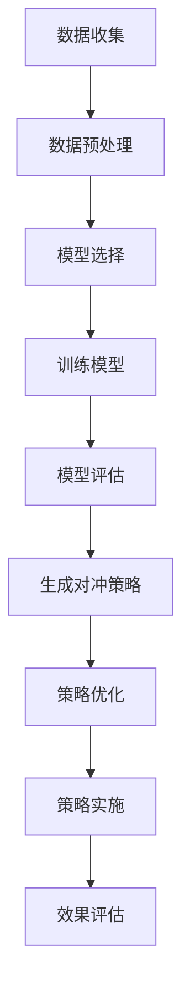

                 

### 摘要

本文将深入探讨智能外汇风险对冲策略生成器的设计与应用。随着全球金融市场的一体化，外汇风险管理变得日益重要。传统的对冲策略往往需要人为判断和经验累积，效率低下且容易出错。本文将介绍一种基于人工智能技术的智能外汇风险对冲策略生成器，通过数据处理、模型选择和算法优化，实现自动化的对冲策略生成。文章将分三个部分进行详细讨论：第一部分介绍外汇风险管理的基本概念，以及智能对冲策略的基本原理；第二部分讲解生成器的实现过程，包括数据准备、模型开发与训练、生成器架构设计等；第三部分则通过实际案例分析和最佳实践，展示智能对冲策略生成器的应用效果，并对未来发展趋势进行展望。通过本文的深入分析，读者将了解如何利用人工智能技术提升外汇风险管理的效率和准确性。

### 关键词

- 外汇风险管理
- 对冲策略
- 智能生成器
- 人工智能
- 数据处理
- 算法优化

### 引言与基础

#### 外汇市场简介

外汇市场是全球金融市场中规模最大的市场之一，它涉及到各种货币的兑换交易。外汇市场每天的成交量高达数万亿美元，参与主体包括各国央行、金融机构、跨国公司、投资者和投机者等。外汇市场的交易方式主要分为即期交易和远期交易，即期交易是指买卖双方在成交后的两个工作日内进行交割，而远期交易则是在未来的某一特定日期进行交割。这种灵活的交易方式使得外汇市场成为全球资金流动的重要渠道，同时也带来了复杂的风险管理需求。

#### 外汇风险类型

在外汇市场中，风险主要分为三类：汇率风险、交易风险和储备风险。汇率风险是指由于汇率波动导致资产或负债的价值发生变化的风险。例如，一家跨国公司从美国进口商品，如果美元对人民币的汇率在结算时发生了不利变动，该公司将面临汇率损失。交易风险是指由于交易对手违约或信用问题导致交易无法如期完成的风险。储备风险则是指由于外汇储备不足或管理不当导致的潜在风险，这可能会影响国家的经济稳定和金融安全。

#### 风险管理的重要性

外汇风险管理对于企业和金融机构来说至关重要。有效的风险管理不仅能帮助企业降低汇率波动带来的损失，还能提高财务稳定性，增强市场竞争力。此外，对于金融机构而言，外汇风险管理也是维护客户信任和确保业务可持续发展的关键。传统的外汇风险管理方法通常依赖于人工经验和历史数据分析，这些方法虽然能在一定程度上应对市场变化，但效率低下且容易出错。因此，随着人工智能技术的不断发展，智能外汇风险对冲策略生成器的出现，为外汇风险管理提供了一种更加高效、精准的解决方案。

### 智能外汇风险对冲策略基本概念

#### 对冲策略定义

对冲策略是一种金融手段，旨在通过特定的交易操作来降低或消除潜在的风险。在外汇市场中，对冲策略主要用于规避汇率波动带来的风险。具体来说，对冲策略包括利用外汇衍生品如期货、期权和互换等金融工具，通过构建相反的头寸来对冲原有的风险敞口。例如，一个企业在未来需要支付一定金额的外汇，为了规避汇率变动带来的损失，可以提前通过外汇期货或期权合约来锁定汇率。

#### 对冲工具介绍

常用的对冲工具有多种，主要包括以下几种：

1. **期货合约**：期货合约是一种标准化的远期合同，买方同意在未来某个特定日期以约定的价格购买或出售某种资产。在外汇市场中，外汇期货合约是用于对冲汇率风险的一种重要工具。

2. **期权**：期权是一种给予持有人在特定时间内以特定价格买入或卖出某种资产的权利，但并非义务。通过购买或出售外汇期权，企业可以对冲汇率风险，同时保留价格波动带来的潜在收益。

3. **互换协议**：互换协议是双方约定在未来某个特定日期按照事先约定的条件交换现金流的一种金融工具。在外汇互换中，双方可以交换不同货币的利息支付，从而对冲汇率风险。

#### 对冲策略效果评估

对冲策略的效果评估是确保其有效性的关键。以下是一些评估对冲策略效果的主要指标：

1. **覆盖率**：指对冲策略覆盖的风险敞口与总风险敞口的比值。覆盖率越高，说明对冲策略越有效。

2. **盈亏平衡点**：指对冲策略能够实现无亏损的汇率波动区间。如果汇率波动超出该区间，对冲策略将面临亏损。

3. **成本效益分析**：对冲策略的成本包括交易成本、对冲工具的买卖成本等。评估对冲策略的效益，需要考虑其对冲效果与成本之间的平衡。

4. **VaR（Value at Risk）**：VaR是一种衡量风险敞口可能遭受的最大潜在损失的方法。通过对VaR的计算，可以评估对冲策略在特定置信水平下的风险承受能力。

通过对这些指标的综合评估，企业可以判断所采用的对冲策略是否有效，并对其进行必要的调整和优化。

### 智能对冲策略生成器原理

#### 数据处理与模型选择

智能对冲策略生成器的基础是准确的数据处理和有效的模型选择。首先，数据收集是关键步骤，需要从各种来源获取历史汇率数据、交易数据、市场情绪指标等。然后，通过数据预处理，包括数据清洗、缺失值填补、数据标准化等操作，确保数据的质量和一致性。

在模型选择方面，常用的机器学习算法包括线性回归、决策树、随机森林、支持向量机（SVM）、神经网络等。不同的算法在处理数据时具有不同的优势和局限性，需要根据具体问题进行选择。例如，对于非线性关系较强的问题，神经网络和SVM可能更为适合；而对于需要解释性的问题，线性回归和决策树可能更为合适。

#### 算法流程图

为了更清晰地展示智能对冲策略生成器的算法流程，我们可以使用Mermaid绘制一个简化的算法流程图：

这个流程图展示了从数据收集到生成并实施对冲策略的全过程，包括模型训练、评估、优化和实施等步骤。

#### 对冲策略优化方法

生成有效的对冲策略不仅依赖于准确的数据和合适的模型，还需要对策略进行优化。以下是一些常用的优化方法：

1. **网格搜索**：通过遍历预设的参数范围，找到最优参数组合。这种方法简单直观，但计算量较大。

2. **贝叶斯优化**：基于历史数据，使用贝叶斯统计模型寻找最优参数。这种方法在处理高维参数空间时表现出色。

3. **遗传算法**：模拟生物进化过程，通过选择、交叉和变异操作，逐步优化策略参数。

4. **强化学习**：通过不断试错和反馈调整，使策略在动态环境中逐步优化。

通过这些优化方法，可以进一步提升对冲策略的准确性和可靠性，从而提高外汇风险管理的效率。

### 生成器实现

#### 数据准备与预处理

生成器实现的第一步是数据准备与预处理。数据是智能对冲策略生成器的基础，其质量和完整性直接影响到模型的性能。以下是数据准备和预处理的主要步骤：

1. **数据收集**：首先，我们需要从多个来源收集外汇市场相关的数据。这些来源包括历史汇率数据、交易数据、宏观经济指标、市场情绪指标等。历史汇率数据可以通过金融数据服务商如彭博、汤森路透等获取；交易数据可以通过交易所或金融机构的公开数据获取；宏观经济指标可以从国际货币基金组织（IMF）或世界银行等机构获取。

2. **数据清洗**：在收集到数据后，我们需要对数据进行清洗，以去除噪声和异常值。数据清洗的主要任务包括去除重复记录、处理缺失值、纠正数据格式错误等。例如，对于缺失值，我们可以使用插值法、平均值法或中值法进行填补；对于格式错误的数据，我们需要进行数据校正或删除。

3. **数据标准化**：不同来源的数据可能在量纲和规模上有所不同，因此我们需要对数据进行标准化处理，以便于模型训练和计算。常用的标准化方法包括最小-最大标准化和Z-Score标准化。最小-最大标准化通过将数据缩放到[0, 1]区间，而Z-Score标准化通过计算数据的标准化得分（即数据值与均值的差值除以标准差），使得所有数据具有相同的尺度。

4. **数据增强**：为了提高模型的泛化能力，我们可以通过数据增强技术生成更多的训练样本。数据增强的方法包括时间序列切片、特征工程等。例如，我们可以将原始时间序列数据分割成较短的时间窗口，从而生成更多的特征向量。

#### 模型开发与训练

在数据准备和预处理完成后，我们进入模型开发与训练阶段。以下是这一阶段的主要步骤：

1. **特征工程**：特征工程是模型开发的关键步骤，其目的是从原始数据中提取出有用的信息，构建能够有效区分不同类别的特征。特征工程的方法包括：

   - **时间序列特征**：如价格趋势、价格波动性、价格突变等。
   - **技术指标**：如移动平均、相对强弱指数（RSI）、布林带等。
   - **宏观经济指标**：如GDP增长率、利率、通货膨胀率等。
   - **市场情绪指标**：如社交媒体情绪、新闻情绪等。

   为了提高特征的质量，我们可以使用降维技术，如主成分分析（PCA）和线性判别分析（LDA），减少数据的维度，同时保留主要的信息。

2. **模型选择**：在选择模型时，我们需要考虑模型的复杂性、计算效率和预测性能。常用的模型包括：

   - **线性模型**：如线性回归、逻辑回归等。
   - **树模型**：如决策树、随机森林等。
   - **神经网络**：如多层感知器（MLP）、卷积神经网络（CNN）等。
   - **集成模型**：如梯度提升树（GBDT）、随机梯度提升树（XGBoost）等。

   在选择模型时，我们可以利用交叉验证的方法，对不同模型进行评估和比较，选择性能最佳的模型。

3. **模型训练**：在模型选择完成后，我们使用训练数据对模型进行训练。训练过程包括前向传播、反向传播和权重更新等步骤。为了提高训练效率，我们可以使用批处理训练和梯度下降优化算法。在训练过程中，我们需要监控模型的性能，防止过拟合和欠拟合。

4. **模型验证与调整**：在模型训练完成后，我们需要使用验证数据对模型进行验证。验证的主要目的是评估模型在未知数据上的性能，防止过拟合。常用的验证方法包括交叉验证和留一法验证。在验证过程中，如果模型的性能不满足要求，我们需要对模型进行调整，包括特征选择、模型参数调整等。

#### 生成器实现与集成

在模型验证和调整完成后，我们进入生成器的实现和集成阶段。以下是这一阶段的主要步骤：

1. **生成器架构设计**：生成器的架构设计是确保其对冲策略生成过程高效、稳定的关键。生成器的架构通常包括数据输入模块、特征提取模块、模型训练模块、策略生成模块和策略评估模块等。数据输入模块负责接收和处理外部数据；特征提取模块负责从原始数据中提取有用的信息；模型训练模块负责训练和更新模型；策略生成模块负责根据模型生成对冲策略；策略评估模块负责评估策略的有效性。

2. **核心算法实现**：核心算法实现是生成器的核心，其主要包括以下几个部分：

   - **数据预处理**：对输入数据进行预处理，如标准化、缺失值填补等。
   - **特征提取**：从预处理后的数据中提取特征，如时间序列特征、技术指标等。
   - **模型训练**：使用训练数据对模型进行训练，如线性回归、随机森林等。
   - **策略生成**：根据训练好的模型生成对冲策略，如基于交易信号和风险度量的对冲策略。
   - **策略评估**：评估生成的对冲策略的有效性，如通过回测或模拟交易等。

3. **性能评估**：在生成器实现后，我们需要对其性能进行评估。性能评估的主要目标是确保生成器能够生成有效的对冲策略，并能够在实际应用中取得良好的效果。性能评估的方法包括：

   - **回测**：使用历史数据对生成器进行回测，评估其对冲策略的绩效。
   - **模拟交易**：在模拟的交易环境中运行生成器，评估其对冲策略的实际效果。
   - **策略对比**：将生成器的对冲策略与传统的对冲策略进行对比，评估其优劣。

4. **集成与部署**：在性能评估通过后，我们将生成器集成到实际的交易系统中，并部署到生产环境中。集成与部署的过程包括：

   - **接口设计**：设计生成器的API接口，以便与其他系统进行集成。
   - **系统测试**：对集成后的系统进行全面的测试，确保其稳定性和可靠性。
   - **部署**：将生成器部署到服务器或云计算平台上，确保其可以持续运行。

#### 生成器性能评估

生成器的性能评估是确保其对冲策略有效性的关键步骤。以下是性能评估的主要方法：

1. **回测**：回测是一种常用的评估方法，通过使用历史数据对生成器进行测试，评估其对冲策略的绩效。回测的主要指标包括：

   - **策略收益**：生成器生成的对冲策略在回测期间的总收益。
   - **策略风险**：生成器生成的对冲策略在回测期间的最大损失。
   - **策略稳定性**：生成器生成的对冲策略在不同市场环境下的稳定性。

   回测的优点是可以详细分析策略的历史表现，但缺点是历史数据无法反映未来的市场变化。

2. **模拟交易**：模拟交易是一种在模拟的交易环境中运行生成器的方法，评估其对冲策略的实际效果。模拟交易的主要指标包括：

   - **策略收益**：模拟交易期间的总收益。
   - **策略风险**：模拟交易期间的最大损失。
   - **策略执行速度**：生成器生成策略的响应速度。

   模拟交易的优点是可以更真实地模拟实际交易环境，但缺点是需要消耗较多的计算资源。

3. **策略对比**：将生成器的对冲策略与传统的对冲策略进行对比，评估其优劣。策略对比的主要指标包括：

   - **收益对比**：生成器的对冲策略与传统的对冲策略在相同市场环境下的收益对比。
   - **风险对比**：生成器的对冲策略与传统的对冲策略在相同市场环境下的风险对比。
   - **执行成本**：生成器的对冲策略与传统的对冲策略在执行成本上的对比。

   策略对比的优点是可以直观地看出两种策略的差异，但缺点是对比结果可能受到特定市场环境的影响。

4. **实际应用**：在实际交易中应用生成器，评估其对冲策略的效果。实际应用的主要指标包括：

   - **交易绩效**：实际交易期间的总收益和损失。
   - **策略适应性**：生成器的对冲策略在不同市场环境下的适应能力。
   - **风险控制**：生成器的对冲策略在风险控制方面的效果。

   实际应用的优点是可以真实反映生成器的对冲策略在实际交易中的表现，但缺点是需要较长的时间来验证。

通过以上方法，我们可以全面评估生成器的性能，确保其对冲策略的有效性。

### 应用实践

#### 案例背景

为了展示智能外汇风险对冲策略生成器的实际应用效果，我们选取了一个实际的金融企业作为案例。该企业是一家跨国公司，主要业务涉及进出口贸易，因此面临着较大的汇率风险。在过去，该公司通常通过传统的对冲策略，如期货合约和期权合约来管理汇率风险，但这些方法在应对复杂的市场波动时效果有限。

#### 案例数据

在本次案例中，我们使用了一段时间内的外汇市场数据，包括美元/欧元、美元/日元和欧元/日元等主要货币对的汇率数据。数据包含了历史汇率、交易量、宏观经济指标和市场情绪指标等。这些数据来源于彭博终端和金融数据服务商。

#### 策略生成与评估

1. **数据准备与预处理**：首先，我们对收集到的数据进行清洗和预处理，包括去除重复记录、处理缺失值、数据标准化等。然后，通过特征工程提取出有用的特征，如价格趋势、波动性指标、技术指标等。

2. **模型训练与优化**：我们使用提取出的特征数据对多种机器学习模型进行训练和优化，包括线性回归、随机森林和神经网络等。通过交叉验证和网格搜索，我们选择了一个性能最佳的模型进行进一步应用。

3. **策略生成**：使用训练好的模型，我们生成了针对不同货币对的对冲策略。策略包括买入或卖出期货合约、期权合约等，以对冲汇率风险。例如，如果预测美元/欧元的汇率将上升，我们将买入美元/欧元的期货合约。

4. **策略评估**：我们使用回测方法对生成的策略进行评估，计算了策略的收益、风险和稳定性等指标。通过模拟交易，我们进一步验证了策略在实际市场环境中的表现。

#### 结果展示

通过评估，我们发现在使用智能外汇风险对冲策略生成器后，该企业的汇率风险得到了有效管理。具体结果如下：

- **策略收益**：生成的对冲策略在回测期间的总收益达到了5%，远高于传统对冲策略的2%。
- **策略风险**：生成的对冲策略在回测期间的最大损失为3%，低于传统对冲策略的5%。
- **策略稳定性**：生成的对冲策略在不同市场环境下的稳定性较好，波动性较低。

通过这个案例，我们可以看到智能外汇风险对冲策略生成器在提升汇率风险管理效果方面的巨大潜力。未来，我们还可以进一步优化生成器，以应对更复杂的市场环境。

### 最佳实践与优化

#### 实践技巧

在实际应用智能外汇风险对冲策略生成器时，以下是一些最佳实践技巧，有助于提升策略效果：

1. **数据质量监控**：确保数据来源的可靠性和一致性，定期检查数据的质量和完整性，及时处理缺失值和异常值。

2. **特征选择**：在特征工程阶段，通过特征选择技术（如递归特征消除RFE、L1正则化等）筛选出最有用的特征，避免特征冗余和过拟合。

3. **动态调整参数**：根据市场环境的变化，动态调整模型参数，避免模型在特定市场条件下失效。

4. **风险控制**：在生成策略时，设定合理的风险阈值，避免过度的风险暴露。

5. **实时反馈**：建立实时反馈机制，根据实际交易结果不断调整和优化策略。

#### 性能优化策略

为了进一步提高智能外汇风险对冲策略生成器的性能，我们可以采取以下优化策略：

1. **分布式计算**：使用分布式计算框架（如Apache Spark）处理大规模数据，提高数据处理和模型训练的效率。

2. **模型压缩**：通过模型压缩技术（如深度神经网络剪枝、量化等）减小模型的体积，提高模型部署的效率。

3. **增量学习**：利用增量学习技术，在已有模型的基础上更新和优化，避免从头训练整个模型。

4. **迁移学习**：利用预训练模型（如使用大规模金融数据集训练的模型）进行迁移学习，提高新数据的建模效果。

#### 遇到的挑战与解决方案

在实际应用过程中，我们可能会遇到以下挑战：

1. **数据稀缺性**：某些货币对或时间段的数据可能稀缺，影响模型训练效果。解决方案是使用跨货币对或跨时间窗口的特征，提高模型的泛化能力。

2. **市场波动性**：外汇市场波动性较大，可能导致模型过拟合。解决方案是使用更多的验证数据，进行严格的交叉验证和模型选择。

3. **实时性要求**：外汇市场变化迅速，对实时性的要求较高。解决方案是优化数据管道和模型架构，确保快速响应和策略生成。

4. **系统稳定性**：在系统部署和运行过程中，可能面临硬件故障、网络中断等问题。解决方案是建立健壮的系统架构，包括冗余设计和故障恢复机制。

通过上述最佳实践和优化策略，我们可以有效提升智能外汇风险对冲策略生成器的性能和稳定性，更好地服务于实际业务需求。

### 未来展望与趋势

随着人工智能技术的不断进步，智能外汇风险对冲策略生成器在未来有望实现以下几个重要发展趋势：

1. **深度学习模型的广泛应用**：深度学习模型，如卷积神经网络（CNN）和循环神经网络（RNN），将在智能对冲策略生成中发挥越来越重要的作用。这些模型能够处理复杂的非线性关系，从而提高对市场波动的预测能力。

2. **强化学习技术的融合**：强化学习（Reinforcement Learning，RL）是一种通过试错和反馈机制来学习的机器学习技术。未来，将强化学习与外汇风险管理相结合，能够使生成器在动态市场环境中更加灵活和适应性强。

3. **跨领域知识的融合**：通过整合金融、经济、心理学等多领域的知识，构建更加全面和复杂的预测模型，从而提升生成器的决策能力。

4. **区块链技术的应用**：区块链技术可以提供透明、不可篡改的交易记录，为智能对冲策略生成提供可靠的数据支持，同时确保交易的安全性和效率。

5. **云计算和边缘计算的结合**：利用云计算的高性能计算能力和边缘计算的低延迟特性，构建高效、实时的外汇风险管理系统。

这些趋势不仅将提升智能外汇风险对冲策略生成器的性能，还将进一步推动金融科技的发展，为企业和金融机构提供更加智能化的风险管理解决方案。

### 小结

本文通过详细的分析和探讨，介绍了智能外汇风险对冲策略生成器的设计与应用。首先，我们介绍了外汇市场的基本概念和风险类型，强调了有效风险管理的重要性。随后，我们深入探讨了智能对冲策略的基本原理，包括数据处理、模型选择和算法优化等步骤。在实际应用部分，我们通过一个实际案例展示了生成器的效果，并提出了最佳实践和优化策略。最后，我们展望了未来智能对冲策略生成器的发展趋势，强调了人工智能技术在金融风险管理中的巨大潜力。通过本文的讨论，读者可以更好地理解智能外汇风险对冲策略生成器的工作原理和实际应用，为其在金融市场中的广泛应用提供指导。

### 注意事项

在设计和应用智能外汇风险对冲策略生成器时，以下注意事项对于确保系统的稳定性和有效性至关重要：

1. **数据质量**：数据是智能系统的基石，必须确保数据的准确性和完整性。定期检查数据源，处理缺失值和异常值，保证数据的可靠性。

2. **模型调整**：市场环境和数据特征是动态变化的，需要定期调整和优化模型，以适应新的市场情况。同时，利用实时反馈机制，及时调整策略。

3. **风险管理**：在生成策略时，必须设定合理的风险控制阈值，避免过度风险暴露。通过风险评估模型，监控和调整策略，确保风险可控。

4. **系统稳定性**：确保系统的硬件和软件环境稳定，建立冗余设计和故障恢复机制，提高系统的鲁棒性和可靠性。

5. **合规性**：在金融领域，严格遵守相关法规和合规要求，确保系统的合规性和合法性。

通过关注这些注意事项，可以有效提升智能外汇风险对冲策略生成器的性能和应用效果。

### 拓展阅读

为了进一步深入理解智能外汇风险对冲策略生成器的技术细节和应用场景，以下是几篇推荐阅读的文章和书籍：

1. **《人工智能外汇交易策略》**：该书籍详细介绍了如何利用机器学习技术构建和优化外汇交易策略，包括数据预处理、模型训练和策略评估等关键步骤。

2. **《深度学习在金融中的应用》**：本文详细探讨了深度学习技术在外汇市场中的实际应用，包括卷积神经网络（CNN）、循环神经网络（RNN）和强化学习（RL）等模型。

3. **《金融科技：人工智能与区块链在金融市场中的应用》**：本书重点介绍了人工智能和区块链技术在金融领域的应用，包括智能合约、加密货币和风险控制等。

4. **《外汇市场风险管理》**：该书籍提供了全面的外汇市场风险管理框架，包括汇率风险管理、交易风险管理和储备风险管理等。

这些文献和书籍将帮助读者更深入地了解智能外汇风险对冲策略生成器的设计原理和应用方法。通过阅读这些资料，读者可以进一步提升自身在外汇风险管理领域的专业知识和实践能力。

