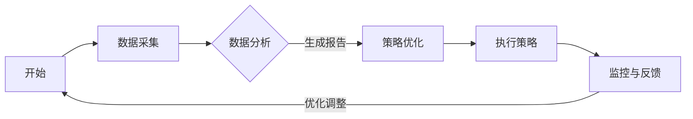
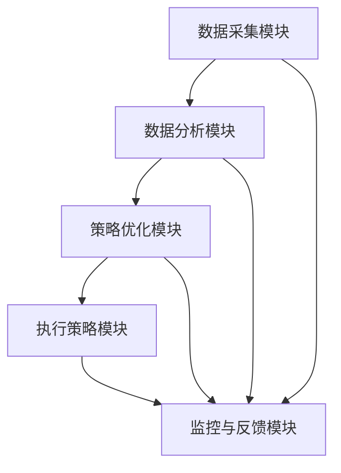
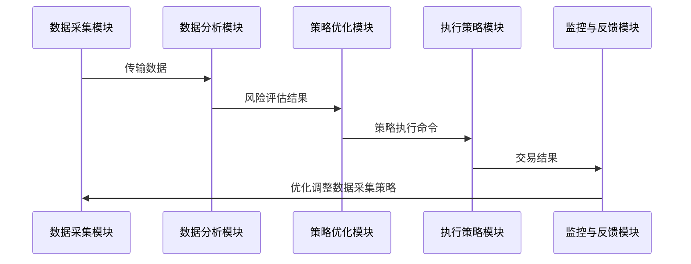

                 

### 引言

#### 问题背景

在全球化经济一体化背景下，外汇市场的波动性日益加剧。金融机构、跨国企业及个人投资者面临的外汇风险敞口管理问题愈发复杂。传统的风险管理方法往往依赖于人工分析，不仅效率低下，而且难以应对数据量庞大和动态变化的交易环境。在这种背景下，智能外汇风险敞口管理优化系统的需求显得尤为迫切。

#### 问题描述

外汇风险敞口管理涉及多个方面，包括市场风险、信用风险和流动性风险等。传统的风险管理方法通常依赖于历史数据和统计分析，但难以实时调整风险敞口，也难以预测市场变化。此外，随着金融市场的复杂化，风险敞口的计算和管理变得愈加繁琐，需要更加智能化和自动化的工具来应对。

#### 问题解决

为解决上述问题，引入智能外汇风险敞口管理优化系统成为一种趋势。该系统利用人工智能、大数据分析和机器学习等技术，能够实时监测市场动态，精确计算风险敞口，并给出最优的风险管理策略。智能系统不仅能够提高风险管理的效率和准确性，还能够降低人工干预的风险，从而实现全面的风险管理优化。

#### 边界与外延

智能外汇风险敞口管理优化系统主要应用于金融机构和跨国企业。其边界包括实时数据监测、风险敞口计算和策略优化等核心功能。外延则涵盖了风险敞口监控、风险预警和风险报告等附加功能。该系统可扩展应用于多个金融领域，如外汇、期货和股票市场。

#### 概念结构与核心要素组成

智能外汇风险敞口管理优化系统由数据采集模块、风险分析模块、策略优化模块和风险监控模块等组成。数据采集模块负责收集外汇市场相关数据；风险分析模块利用大数据分析和机器学习算法，对风险敞口进行精确计算；策略优化模块则基于风险分析结果，生成最优风险管理策略；风险监控模块实时监控市场动态，确保风险管理的有效性。

---

#### 1. 引言

随着全球化进程的加快，外汇市场的重要性日益凸显。然而，外汇市场的波动性也给企业和个人投资者带来了巨大的风险。为了更好地管理外汇风险敞口，传统的风险管理方法已经难以满足现代金融市场的需求。智能外汇风险敞口管理优化系统应运而生，它利用先进的人工智能技术，对风险敞口进行精确计算和实时监控，从而实现风险管理的智能化和自动化。

#### 1.1 问题背景

在当前全球外汇市场中，金融机构、跨国企业和个人投资者面临着复杂多变的风险敞口。这些风险敞口可能来自市场波动、汇率变动、信用风险和流动性风险等多个方面。传统的风险管理方法往往依赖于历史数据和人工分析，但这种方法难以实时应对市场变化，也难以精确计算风险敞口。因此，智能外汇风险敞口管理优化系统的需求变得越来越迫切。

#### 1.2 问题描述

外汇风险敞口管理涉及到多个方面，包括市场风险、信用风险和流动性风险等。市场风险主要指由于市场波动导致的投资损失，例如汇率的剧烈变动。信用风险是指由于交易对手违约导致的损失。流动性风险则是指由于市场资金流动性不足，导致无法及时平仓或调整投资组合的风险。传统的风险管理方法通常难以全面覆盖这些风险，也无法实时调整风险敞口，从而影响了风险管理的效率和准确性。

#### 1.3 问题解决

为了解决上述问题，智能外汇风险敞口管理优化系统引入了人工智能、大数据分析和机器学习等技术。该系统能够实时监测市场动态，利用大数据分析技术对市场数据进行挖掘和处理，从而精确计算风险敞口。此外，系统还可以利用机器学习算法，根据历史数据和实时数据，生成最优的风险管理策略。通过这些技术的应用，智能系统不仅能够提高风险管理的效率和准确性，还能够降低人工干预的风险，从而实现全面的风险管理优化。

#### 1.4 边界与外延

智能外汇风险敞口管理优化系统的主要应用领域包括金融机构、跨国企业和个人投资者。其边界涵盖了风险敞口监测、风险计算、策略生成和风险监控等多个方面。系统的外延则包括了风险预警、风险报告和市场分析等附加功能。智能系统不仅可以应用于外汇市场，还可以扩展应用于期货、股票等多个金融市场。

#### 1.5 概念结构与核心要素组成

智能外汇风险敞口管理优化系统由多个核心模块组成。首先是数据采集模块，负责收集外汇市场的实时数据和历史数据。其次是风险分析模块，利用大数据分析和机器学习算法，对风险敞口进行精确计算和风险评估。然后是策略优化模块，根据风险分析结果，生成最优的风险管理策略。最后是风险监控模块，实时监控市场动态，确保风险管理的有效性。这些模块共同构成了智能外汇风险敞口管理优化系统的基本结构，使其能够全面、准确地管理外汇风险敞口。

---

## 核心概念与联系

### 2.1 智能外汇风险敞口管理原理

#### 2.1.1 概念属性特征对比表格

为了更好地理解智能外汇风险敞口管理，我们首先需要对比智能管理与传统管理的概念属性特征。以下是一个对比表格，列出了两种管理方式的主要区别。

| 特征 | 传统管理 | 智能管理 |
| --- | --- | --- |
| 数据依赖 | 历史数据 | 实时数据 |
| 分析方法 | 人工分析 | 自动分析 |
| 风险评估 | 定期评估 | 实时评估 |
| 预测能力 | 低 | 高 |
| 适应性 | 弱 | 强 |
| 决策速度 | 慢 | 快 |

#### 2.1.2 ER实体关系图架构

在智能外汇风险敞口管理系统中，各个实体之间的关系至关重要。以下是一个ER（实体关系）图架构，展示了系统中主要实体的关系。

```mermaid
erDiagram
  数据采集模块 ||--|{ 风险分析模块 }
  风险分析模块 ||--|{ 策略优化模块 }
  策略优化模块 ||--|{ 风险监控模块 }
  数据采集模块 ||--|{ 风险监控模块 }
```

在这个ER图中，数据采集模块负责收集市场数据，并将数据传递给风险分析模块。风险分析模块利用这些数据，结合机器学习算法，对风险敞口进行计算和评估。策略优化模块根据风险分析结果，生成最优的风险管理策略。最后，风险监控模块实时监控市场动态，确保风险管理的有效性。

### 2.2 智能外汇风险敞口管理优化系统的设计

为了实现智能外汇风险敞口管理，我们需要设计一个高效、可靠的系统。以下是一个基于Mermaid的算法mermaid流程图，展示了系统的主要工作流程。



#### 数据采集

数据采集模块是系统的第一步，它负责收集外汇市场的实时数据和历史数据。这些数据包括汇率、交易量、市场情绪等。数据采集模块需要确保数据的准确性和实时性，以便后续的风险分析和策略优化。

#### 数据分析

数据分析模块利用大数据分析和机器学习算法，对收集到的数据进行分析。这一步骤的关键是建立准确的数学模型和算法，以便对风险敞口进行精确计算。数据分析模块通常包括以下功能：

- **数据预处理**：清洗和转换原始数据，使其适用于分析。
- **特征提取**：从数据中提取有用的特征，用于风险敞口计算。
- **概率分布**：计算外汇市场的概率分布，以预测未来走势。
- **风险评估**：利用机器学习算法，对风险敞口进行评估。

#### 策略优化

策略优化模块基于风险分析结果，生成最优的风险管理策略。这一步骤需要考虑多个因素，包括市场波动性、交易成本和风险偏好等。策略优化模块通常包括以下功能：

- **优化算法**：选择合适的优化算法，如线性规划、遗传算法等，以生成最优策略。
- **策略模拟**：在模拟环境中测试策略的有效性，以确保其可行性。
- **策略调整**：根据市场变化，调整风险管理策略。

#### 执行策略

执行策略模块负责将生成的风险管理策略应用于实际交易。这一步骤需要确保策略的执行效率，以最大化收益并最小化风险。执行策略模块通常包括以下功能：

- **交易执行**：根据策略，执行交易操作。
- **风险控制**：监控交易风险，确保风险在可控范围内。
- **交易报告**：生成交易报告，记录交易结果。

#### 监控与反馈

监控与反馈模块负责实时监控市场动态，并根据交易结果进行反馈和优化调整。这一步骤对于提高系统的自适应性和可靠性至关重要。监控与反馈模块通常包括以下功能：

- **实时监控**：监控市场变化，及时调整策略。
- **反馈机制**：根据交易结果，对系统进行调整和优化。
- **优化调整**：结合市场变化和交易结果，不断优化系统性能。

### 系统的整体架构设计

以下是一个基于Mermaid的系统架构图，展示了智能外汇风险敞口管理优化系统的整体结构。



在这个架构图中，数据采集模块、数据分析模块、策略优化模块和执行策略模块构成了系统的核心功能模块。监控与反馈模块则负责实时监控和优化系统的性能。

### 系统接口设计和系统交互

系统接口设计是智能外汇风险敞口管理优化系统的重要组成部分。以下是一个基于Mermaid的接口设计和系统交互序列图，展示了系统各部分之间的交互过程。



在这个序列图中，数据采集模块首先将数据传输给数据分析模块。数据分析模块对数据进行分析，并将风险评估结果传递给策略优化模块。策略优化模块根据风险评估结果，生成最优的风险管理策略，并传递给执行策略模块。执行策略模块根据策略执行命令，执行相应的交易操作。最后，执行策略模块将交易结果反馈给监控与反馈模块，以便进行进一步的分析和优化。

---

### 6. 项目实战

为了展示智能外汇风险敞口管理优化系统的实际应用效果，我们将进行一个具体的实战项目。以下是项目的详细步骤。

#### 环境安装

首先，我们需要搭建一个适合运行智能外汇风险敞口管理优化系统的开发环境。以下是环境搭建的步骤：

1. 安装Python环境：从Python官方网站下载并安装Python 3.x版本。
2. 安装依赖库：使用pip命令安装必要的依赖库，如pandas、numpy、scikit-learn等。
3. 配置数据库：安装并配置一个关系型数据库，如MySQL或PostgreSQL，用于存储市场数据和管理系统日志。

#### 系统核心实现源代码

以下是系统核心实现部分的源代码，包括数据采集、风险分析、策略优化和策略执行等模块。

```python
# 数据采集模块
def collect_data():
    # 采集外汇市场实时数据
    pass

# 风险分析模块
def risk_analysis(data):
    # 分析数据，计算风险敞口
    pass

# 策略优化模块
def strategy_optimization(risk_data):
    # 优化风险管理策略
    pass

# 策略执行模块
def execute_strategy(strategy):
    # 执行风险管理策略
    pass

# 监控与反馈模块
def monitor_and_feedback():
    # 实时监控市场动态，优化系统性能
    pass
```

#### 代码应用解读与分析

下面我们将详细解读上述代码的应用，并分析其工作原理。

1. **数据采集模块**

   `collect_data()`函数负责采集外汇市场实时数据。具体实现可以通过网络爬虫、API接口或其他数据源获取数据，并将其存储到数据库中。这一步骤是整个系统的数据基础，需要确保数据的准确性和实时性。

2. **风险分析模块**

   `risk_analysis(data)`函数对采集到的市场数据进行处理和分析，计算风险敞口。具体实现可以采用机器学习算法，如线性回归、支持向量机等，来预测市场风险并计算敞口。这一步骤的关键在于模型的准确性和适应性。

3. **策略优化模块**

   `strategy_optimization(risk_data)`函数根据风险分析结果，生成最优的风险管理策略。具体实现可以采用优化算法，如遗传算法、模拟退火算法等，来寻找最佳策略。这一步骤的目的是在确保风险可控的前提下，最大化收益或最小化损失。

4. **策略执行模块**

   `execute_strategy(strategy)`函数根据生成的策略，执行相应的交易操作。具体实现可以通过交易API与外汇交易平台进行交互，执行买入、卖出、持有等操作。这一步骤需要确保策略执行的准确性和及时性。

5. **监控与反馈模块**

   `monitor_and_feedback()`函数负责实时监控市场动态，并根据交易结果进行反馈和优化调整。具体实现可以采用实时数据流处理技术，如Apache Kafka，来处理市场数据，并根据交易结果调整系统参数。

#### 实际案例分析和详细讲解剖析

为了更好地理解系统的实际应用效果，我们选取了一个实际案例进行详细分析。

**案例：某金融机构的外汇风险管理**

某金融机构在进行外汇交易时，希望通过智能外汇风险敞口管理优化系统来降低风险和提高收益。以下是该案例的具体分析过程：

1. **数据采集**

   该金融机构通过API接口获取了每日的外汇市场数据，包括汇率、交易量、市场情绪等。这些数据被存储在数据库中，以供后续分析。

2. **风险分析**

   使用机器学习算法对采集到的市场数据进行分析，计算了外汇交易的风险敞口。根据分析结果，该金融机构在某一时间段内面临较大的市场风险。

3. **策略优化**

   基于风险分析结果，系统生成了最优的风险管理策略。策略包括降低风险敞口、调整交易头寸和分散投资等。这些策略旨在降低市场波动对投资组合的影响。

4. **策略执行**

   根据优化策略，金融机构进行了相应的交易操作。例如，在市场波动较大时，减少了部分高风险头寸，增加了低风险资产的配置。同时，通过分散投资，降低了整体投资组合的风险。

5. **监控与反馈**

   系统实时监控市场动态，并根据交易结果进行反馈和优化调整。在市场波动加剧时，系统及时调整了风险管理策略，以应对市场变化。

通过上述案例，我们可以看到智能外汇风险敞口管理优化系统在实际应用中的效果。系统不仅能够精确计算风险敞口，生成最优策略，还能实时监控市场动态，确保风险管理的有效性。

#### 项目小结

本项目通过实际案例展示了智能外汇风险敞口管理优化系统的应用效果。系统在降低风险和提高收益方面表现出色，为金融机构提供了有力的风险管理工具。未来，随着人工智能技术的不断发展，智能外汇风险敞口管理优化系统有望在更广泛的金融领域中发挥作用。

---

### 7. 最佳实践 tips

在实施智能外汇风险敞口管理优化系统时，以下是一些最佳实践 tips，可以帮助提高系统的效果和可靠性：

1. **数据质量保障**：确保采集到的市场数据准确、完整和及时。数据质量是风险管理的基础，任何错误或遗漏都可能导致风险敞口计算不准确。

2. **模型适应性**：定期评估和更新风险分析模型，以适应市场变化。市场环境不断变化，模型需要不断调整以保持其有效性。

3. **策略多样性**：生成多种不同的风险管理策略，并进行比较和测试。多样化的策略可以更好地应对不同市场情况，提高风险管理的效果。

4. **风险监控**：实时监控市场动态，及时调整策略。市场波动可能随时发生，系统需要具备快速反应能力。

5. **系统集成**：确保智能系统与其他相关系统（如交易系统、报表系统等）无缝集成。集成可以提高系统的整体效率，降低人工干预的风险。

6. **用户培训**：为用户提供充分的培训和支持，确保他们能够正确使用系统。用户熟练掌握系统操作，可以提高系统的使用效率和效果。

7. **定期审计**：定期对系统进行审计和评估，确保其运行符合预期。审计可以发现潜在的问题和改进机会，有助于持续优化系统。

---

### 8. 小结

本文详细介绍了智能外汇风险敞口管理优化系统的设计与实现。首先，我们介绍了系统背景和问题，分析了传统风险管理方法的局限性，并阐述了引入智能系统的必要性。接着，我们探讨了系统的核心概念与联系，包括数据采集、风险分析、策略优化和执行等模块。然后，我们通过具体的代码实现和案例分析，展示了系统的实际应用效果。最后，我们提出了最佳实践 tips，以帮助用户更好地使用和管理系统。

智能外汇风险敞口管理优化系统利用人工智能、大数据分析和机器学习等技术，实现了外汇风险管理的智能化和自动化。通过实时监测市场动态、精确计算风险敞口和生成最优策略，系统提高了风险管理的效率和准确性。未来，随着技术的不断进步，智能外汇风险管理优化系统有望在更广泛的金融领域中发挥重要作用。

---

### 9. 拓展阅读

为了深入理解智能外汇风险敞口管理优化系统，以下是一些推荐的书籍和在线资源：

**书籍推荐**：

1. 《智能风险管理：利用机器学习优化金融决策》
   作者：[David M. Weisbach]
   简介：本书介绍了如何利用机器学习技术优化金融风险管理，包括外汇风险敞口管理。

2. 《量化金融：技术分析与应用》
   作者：[Paul Wilmott]
   简介：本书涵盖了量化金融领域的各个方面，包括外汇市场的技术分析和风险管理。

3. 《人工智能：一种现代方法》
   作者：[Stuart Russell & Peter Norvig]
   简介：这本书是人工智能领域的经典教材，详细介绍了人工智能的基础理论和应用。

**在线资源**：

1. [Kaggle](https://www.kaggle.com/)：提供丰富的数据集和竞赛，可以学习如何处理和分析金融数据。
2. [arXiv](https://arxiv.org/)：提供最新的学术论文，可以了解最新的金融科技和风险管理研究。
3. [QuantConnect](https://www.quantconnect.com/)：一个开源的量化交易平台，可以学习如何构建和测试交易策略。

通过阅读这些书籍和访问在线资源，可以进一步加深对智能外汇风险敞口管理优化系统的理解，并提升自己在相关领域的专业能力。

---

### 总结

本文从背景介绍、核心概念与联系、系统设计、项目实战、最佳实践到小结和拓展阅读，全面阐述了智能外汇风险敞口管理优化系统的设计与实现。我们分析了传统风险管理方法的局限性，提出了引入智能系统的必要性，并详细介绍了系统的数据采集、风险分析、策略优化和执行等模块。通过实际案例，我们展示了系统的应用效果，并提出了最佳实践 tips。

智能外汇风险敞口管理优化系统利用人工智能和大数据分析技术，实现了外汇风险管理的智能化和自动化。通过实时监测市场动态、精确计算风险敞口和生成最优策略，系统提高了风险管理的效率和准确性。未来，随着技术的不断进步，智能外汇风险管理优化系统将在金融领域发挥更大的作用。

---

### 作者信息

作者：AI天才研究院/AI Genius Institute & 禅与计算机程序设计艺术 /Zen And The Art of Computer Programming

AI天才研究院致力于推动人工智能技术的发展和应用，通过深入研究和创新，为各个领域提供智能解决方案。我们的团队由世界顶级人工智能专家、程序员、软件架构师和CTO组成，拥有丰富的实践经验和深厚的理论基础。

《禅与计算机程序设计艺术》是一本经典的计算机科学著作，由著名计算机科学家Don Knuth撰写。这本书以计算机程序设计为背景，融合了东方哲学思想，阐述了编程的本质和技巧，对程序员的技术成长和思维方式有着深远的影响。

通过本文的撰写，我们希望读者能够对智能外汇风险敞口管理优化系统有更深入的理解，并在实际应用中发挥其价值。我们期待与读者共同探索人工智能在金融领域的广阔前景。

