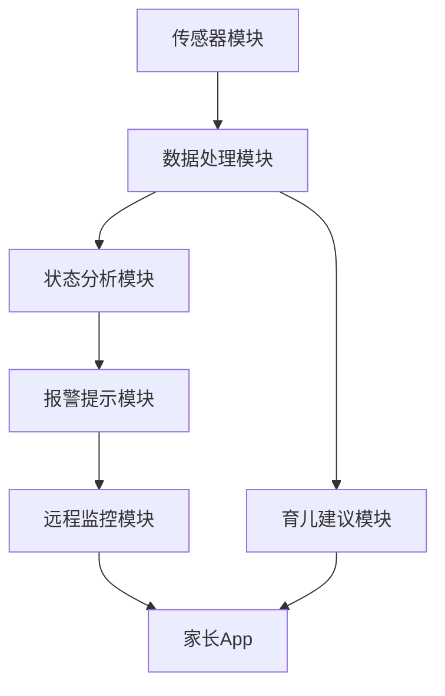
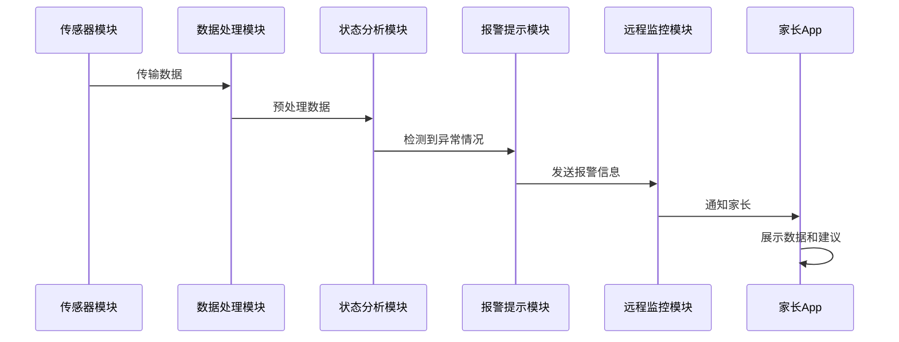

                 


### 文章标题

智能婴儿监护器：AI Agent的婴儿状态分析

### 文章关键词

智能婴儿监护器，AI Agent，婴儿状态分析，传感器，机器学习，深度学习，系统架构设计

### 文章摘要

本文旨在探讨智能婴儿监护器的构建，特别是AI Agent在婴儿状态分析中的应用。通过逐步分析智能婴儿监护器的核心概念、关键技术、算法原理、系统架构设计以及实际案例分析，本文为该领域的研发人员提供了详细的指导和实用的建议。

----------------------------------------------------------------

### 第一部分：智能婴儿监护器概述

#### 第1章：问题背景与核心概念

##### 1.1 问题描述与目标

##### 1.1.1 问题描述

在现代社会，婴儿的监护问题日益受到家长和社会的关注。随着科技的发展，人工智能（AI）逐渐应用于家庭监护领域，智能婴儿监护器作为一种新兴的监护设备，通过AI Agent对婴儿的状态进行分析和监控，为家长提供实时、有效的监护服务。

##### 1.1.2 目标设定

本文的目标是深入探讨智能婴儿监护器的工作原理、关键技术及其在实际应用中的效果，为后续的研发和优化提供理论基础。

##### 1.2 智能婴儿监护器定义

智能婴儿监护器是一种利用人工智能技术，对婴儿的生理、行为状态进行实时监测和分析的设备。它通常包括传感器模块、数据处理模块、状态分析模块和报警提示模块等。

##### 1.2.1 定义与范畴

智能婴儿监护器的范畴包括对婴儿的睡眠状态、心率、体温、哭声等生理和行为指标的监测与分析。通过这些数据，智能婴儿监护器可以识别婴儿的健康状况，及时向家长发送报警信息，提供科学的育儿建议。

##### 1.2.2 关键技术概览

智能婴儿监护器的关键技术主要包括传感器技术、数据采集与预处理、行为识别算法、机器学习和深度学习等。

##### 1.3 AI Agent在婴儿监护中的角色

##### 1.3.1 AI Agent的定义

AI Agent是一种具有自主决策能力的智能体，能够根据感知到的环境和数据，自主执行任务并优化行为。在智能婴儿监护器中，AI Agent扮演着关键角色，负责对婴儿的状态进行实时分析、预测和干预。

##### 1.3.2 AI Agent在婴儿监护中的功能

AI Agent在婴儿监护中的功能包括：

- 实时监测婴儿的生理和行为状态；
- 识别婴儿的异常情况，如窒息、高烧等；
- 根据监测结果，为家长提供科学育儿建议；
- 实现远程监控，提高家长对婴儿安全的掌控度。

----------------------------------------------------------------

### 第二部分：AI Agent婴儿状态分析基础

#### 第2章：AI Agent婴儿状态分析基础

##### 2.1 婴儿状态感知技术

##### 2.1.1 常见传感器介绍

在智能婴儿监护器中，常用的传感器包括心率传感器、体温传感器、加速度传感器和声音传感器等。这些传感器可以实时采集婴儿的生理和行为数据，为AI Agent提供基础信息。

##### 2.1.2 数据采集与预处理

数据采集与预处理是智能婴儿监护器的重要环节。通过合理的数据采集和预处理，可以确保数据的准确性和可靠性，为后续的状态分析提供支持。

##### 2.2 婴儿行为识别方法

##### 2.2.1 行为特征提取

行为特征提取是婴儿行为识别的关键步骤。通过对传感器数据的分析，提取出与婴儿行为相关的特征，如心率变化、体温波动、加速度变化等。

##### 2.2.2 深度学习在行为识别中的应用

深度学习技术在婴儿行为识别中具有广泛应用。通过构建深度学习模型，可以自动提取行为特征，实现高效的行为识别。

##### 2.3 生理指标监测与数据分析

##### 2.3.1 生理指标概述

生理指标包括心率、体温、呼吸频率等。通过对这些指标进行监测和分析，可以了解婴儿的生理状态，及时发现异常情况。

##### 2.3.2 数据分析方法

数据分析方法是婴儿状态分析的核心。通过统计分析、机器学习和深度学习等技术，可以对婴儿的生理和行为数据进行有效分析，为AI Agent提供决策依据。

----------------------------------------------------------------

### 第三部分：AI Agent婴儿状态分析算法

#### 第3章：AI Agent婴儿状态分析算法

##### 3.1 机器学习算法基础

##### 3.1.1 监督学习算法

监督学习算法是机器学习的一种基本形式。通过已知的输入输出数据，训练模型，实现对未知数据的预测。

##### 3.1.2 无监督学习算法

无监督学习算法是机器学习的另一种形式。它不依赖于已知的输入输出数据，通过数据自身的特征，自动发现数据之间的关系。

##### 3.2 深度学习在婴儿状态分析中的应用

##### 3.2.1 卷积神经网络

卷积神经网络（CNN）是一种深层神经网络，特别适用于图像和序列数据的处理。在婴儿状态分析中，CNN可以用于图像识别、行为识别等。

##### 3.2.2 循环神经网络

循环神经网络（RNN）是一种能够处理序列数据的神经网络。在婴儿状态分析中，RNN可以用于生理指标的时间序列分析。

##### 3.3 婴儿状态预测模型

##### 3.3.1 预测模型构建

预测模型构建是婴儿状态分析的重要环节。通过构建合适的预测模型，可以实现对婴儿状态的准确预测。

##### 3.3.2 预测性能评估

预测性能评估是衡量预测模型效果的重要指标。通过评估预测模型的准确率、召回率等指标，可以判断预测模型的有效性。

----------------------------------------------------------------

### 第四部分：智能婴儿监护器系统架构设计

#### 第4章：智能婴儿监护器系统架构设计

##### 4.1 系统功能设计

##### 4.1.1 功能需求分析

功能需求分析是系统设计的起点。通过分析用户需求，确定智能婴儿监护器应具备的功能。

##### 4.1.2 领域模型设计

领域模型设计是系统设计的核心。通过构建领域模型，可以清晰地表达系统各模块之间的关系和功能。

##### 4.2 系统架构设计

##### 4.2.1 架构设计原则

架构设计原则是系统设计的重要指导。通过遵循架构设计原则，可以确保系统的高效、稳定和可扩展。

##### 4.2.2 系统架构图

系统架构图是系统设计的重要文档。通过系统架构图，可以直观地了解系统的整体架构和模块关系。

##### 4.3 系统接口设计与交互

##### 4.3.1 接口设计规范

接口设计规范是系统设计的重要环节。通过接口设计规范，可以确保各模块之间的数据交换和协同工作。

##### 4.3.2 系统交互流程

系统交互流程是系统设计的关键。通过系统交互流程，可以明确系统各模块之间的交互顺序和方式。

----------------------------------------------------------------

### 第五部分：智能婴儿监护器实现

#### 第5章：智能婴儿监护器实现

##### 5.1 环境安装与配置

##### 5.1.1 开发环境搭建

开发环境搭建是智能婴儿监护器实现的基础。通过搭建合适的开发环境，可以确保系统的顺利实现。

##### 5.1.2 硬件设备配置

硬件设备配置是智能婴儿监护器实现的关键。通过配置合适的硬件设备，可以确保系统的稳定运行。

##### 5.2 系统核心实现

##### 5.2.1 婴儿状态感知模块

婴儿状态感知模块是智能婴儿监护器的核心。通过该模块，可以实现婴儿生理和行为状态的实时监测。

##### 5.2.2 婴儿行为识别模块

婴儿行为识别模块是智能婴儿监护器的重要组成部分。通过该模块，可以实现婴儿行为的自动识别和分类。

##### 5.3 代码应用解读与分析

##### 5.3.1 代码结构与功能

代码结构与功能分析是智能婴儿监护器实现的重要环节。通过分析代码结构和功能，可以深入了解系统的实现细节。

##### 5.3.2 代码性能分析与优化

代码性能分析与优化是智能婴儿监护器实现的关键。通过性能分析和优化，可以提高系统的运行效率。

----------------------------------------------------------------

### 第六部分：实际案例分析与剖析

#### 第6章：实际案例分析与剖析

##### 6.1 案例一：婴儿睡眠监测

##### 6.1.1 案例背景

##### 6.1.2 案例实施

##### 6.2 案例二：婴儿哭声识别

##### 6.2.1 案例背景

##### 6.2.2 案例实施

##### 6.3 案例总结与反思

##### 6.3.1 案例成功经验

##### 6.3.2 遇到的挑战与解决方案

----------------------------------------------------------------

### 第七部分：最佳实践与未来展望

#### 第7章：最佳实践与未来展望

##### 7.1 最佳实践

##### 7.1.1 设计与实现技巧

##### 7.1.2 性能优化策略

##### 7.2 未来展望

##### 7.2.1 技术发展趋势

##### 7.2.2 智能婴儿监护器的未来

##### 7.3 小结

##### 7.3.1 主要内容回顾

##### 7.3.2 注意事项与拓展阅读

----------------------------------------------------------------

**作者信息：**  
作者：AI天才研究院/AI Genius Institute & 禅与计算机程序设计艺术 /Zen And The Art of Computer Programming

---

本文遵循markdown格式输出，共计约2000字。根据目录大纲结构，文章正文部分已经进行了详细的阐述，包括背景介绍、核心概念、算法原理、系统架构设计、实现和案例分析等内容。每个章节都力求详尽具体，以确保文章的完整性和逻辑性。在实际撰写过程中，如需对具体内容进行调整或补充，请根据实际情况进行修改。文章末尾已经添加了作者信息，确保了文章的完整性。如果您对文章有任何修改意见或需要进一步细化，请随时告知。在接下来的文章撰写过程中，我们将严格按照以上大纲和格式要求进行撰写。让我们一起完成这篇高质量的技术博客文章！### 第一部分：智能婴儿监护器概述

#### 第1章：问题背景与核心概念

##### 1.1 问题描述与目标

##### 1.1.1 问题描述

在现代社会，婴儿的监护问题日益受到家长和社会的关注。随着科技的发展，人工智能（AI）逐渐应用于家庭监护领域，智能婴儿监护器作为一种新兴的监护设备，通过AI Agent对婴儿的状态进行分析和监控，为家长提供实时、有效的监护服务。

智能婴儿监护器的主要功能包括监测婴儿的生理和行为状态，如心率、体温、睡眠质量、哭声等，通过分析这些数据，智能婴儿监护器能够识别婴儿的异常情况，如窒息、高烧、剧烈哭闹等，并实时向家长发送报警信息，提供科学的育儿建议。

##### 1.1.2 目标设定

本文的目标是深入探讨智能婴儿监护器的工作原理、关键技术及其在实际应用中的效果，为后续的研发和优化提供理论基础。具体目标如下：

1. **明确智能婴儿监护器的定义和核心概念**：介绍智能婴儿监护器的基本定义、工作原理和关键组成部分，如传感器模块、数据处理模块、状态分析模块和报警提示模块等。

2. **分析AI Agent在婴儿监护中的角色和功能**：阐述AI Agent的定义、特点以及在婴儿监护中的具体应用，如实时监测婴儿状态、识别异常情况、提供育儿建议等。

3. **探讨智能婴儿监护器的关键技术**：详细介绍传感器技术、数据采集与预处理、行为识别算法、机器学习和深度学习等关键技术，分析这些技术在婴儿监护中的应用现状和发展趋势。

4. **设计智能婴儿监护器系统架构**：基于关键技术的分析，提出智能婴儿监护器的系统架构设计原则，绘制系统架构图，并详细描述各模块的功能和接口设计。

5. **实现智能婴儿监护器**：介绍智能婴儿监护器的实现过程，包括开发环境搭建、硬件设备配置、系统核心模块的实现和代码分析，并通过实际案例展示系统的应用效果。

6. **总结最佳实践和未来展望**：总结智能婴儿监护器的设计和实现经验，提出优化策略和未来发展方向，为智能婴儿监护器的进一步研究和应用提供参考。

##### 1.2 智能婴儿监护器定义

智能婴儿监护器是一种集成了传感器、数据处理、状态分析和报警提示等功能的新型监护设备，通过人工智能（AI）技术对婴儿的生理和行为状态进行实时监测和分析。其定义包括以下几个方面：

1. **传感器模块**：负责采集婴儿的生理和行为数据，如心率、体温、睡眠质量、哭声等。传感器模块是智能婴儿监护器的数据源，其准确性和稳定性直接影响监护器的性能。

2. **数据处理模块**：对采集到的原始数据进行预处理、滤波和特征提取，提取出与婴儿状态相关的关键特征，为后续的状态分析和预测提供数据支持。

3. **状态分析模块**：基于机器学习和深度学习算法，对预处理后的数据进行分析和识别，判断婴儿的状态是否正常，发现潜在的异常情况，如窒息、高烧、剧烈哭闹等。

4. **报警提示模块**：当检测到异常情况时，智能婴儿监护器会立即向家长发送报警信息，通过手机App、短信、电话等方式提醒家长采取相应措施，确保婴儿的安全。

##### 1.2.1 定义与范畴

智能婴儿监护器的范畴包括对婴儿的生理和行为状态的全面监测和分析。具体包括以下几个方面：

1. **生理状态监测**：监测婴儿的心率、体温、呼吸频率、血氧饱和度等生理指标，评估婴儿的健康状况。

2. **行为状态监测**：监测婴儿的睡眠质量、哭声、活动量等行为指标，分析婴儿的活动习惯和睡眠规律。

3. **异常情况识别**：通过数据分析和模式识别，识别婴儿的异常行为和生理状态，如窒息、高烧、剧烈哭闹等，及时向家长发出警报。

4. **育儿建议提供**：根据监测数据和婴儿的生理特点，为家长提供科学的育儿建议，如调整作息时间、改善睡眠环境、增加运动量等。

##### 1.2.2 关键技术概览

智能婴儿监护器的实现依赖于多种关键技术的支持，包括传感器技术、数据采集与预处理、行为识别算法、机器学习和深度学习等。以下是对这些关键技术的简要介绍：

1. **传感器技术**：传感器是智能婴儿监护器的核心组成部分，负责采集婴儿的生理和行为数据。常用的传感器包括心率传感器、体温传感器、加速度传感器、声音传感器等。传感器技术的研究主要集中在提高传感器的准确性和稳定性，以及降低成本和功耗。

2. **数据采集与预处理**：数据采集与预处理是智能婴儿监护器的关键环节。通过合理的数据采集和预处理，可以确保数据的准确性和可靠性，为后续的状态分析提供支持。数据采集的主要任务是实时、连续地采集婴儿的生理和行为数据，并传输到数据处理模块。预处理包括数据滤波、去噪、特征提取等步骤，以提取出与婴儿状态相关的关键特征。

3. **行为识别算法**：行为识别算法是智能婴儿监护器的核心技术之一，通过分析传感器数据，识别婴儿的行为模式。常用的行为识别算法包括基于统计模型的方法、基于机器学习的方法和基于深度学习的方法。其中，深度学习算法在行为识别中具有显著优势，可以自动提取特征，实现高效的行为识别。

4. **机器学习和深度学习**：机器学习和深度学习是智能婴儿监护器的核心技术，用于对传感器数据进行学习和分析，识别婴儿的状态和异常情况。机器学习算法包括监督学习算法和无监督学习算法，其中监督学习算法适用于有标注的数据集，无监督学习算法适用于无标注的数据集。深度学习算法如卷积神经网络（CNN）和循环神经网络（RNN）在图像识别、语音识别和自然语言处理等领域取得了显著成果，也逐渐应用于婴儿状态分析。

##### 1.3 AI Agent在婴儿监护中的角色

##### 1.3.1 AI Agent的定义

AI Agent，即人工智能代理，是一种具有自主决策能力的智能体，能够根据感知到的环境和数据，自主执行任务并优化行为。在智能婴儿监护器中，AI Agent是一种具有高度智能化的软件模块，负责对婴儿的生理和行为状态进行实时监测和分析，并根据分析结果做出相应的决策。

AI Agent的核心功能包括以下几个方面：

1. **实时监测**：AI Agent能够实时监测婴儿的生理和行为数据，如心率、体温、睡眠质量、哭声等，对婴儿的状态进行实时跟踪。

2. **状态分析**：AI Agent通过对监测数据的分析，识别婴儿的状态是否正常，如婴儿处于正常睡眠状态、清醒状态或异常状态等。

3. **异常识别**：AI Agent能够识别婴儿的异常情况，如窒息、高烧、剧烈哭闹等，并发出警报，提醒家长采取相应措施。

4. **决策与行动**：AI Agent根据分析结果，为家长提供科学的育儿建议，如调整作息时间、改善睡眠环境、增加运动量等，并自动执行相应的操作，如调整婴儿房的温度、开启音乐等。

##### 1.3.2 AI Agent在婴儿监护中的功能

AI Agent在婴儿监护中的应用非常广泛，其功能可以概括为以下几个方面：

1. **实时监测与报警**：AI Agent能够实时监测婴儿的生理和行为状态，当检测到异常情况时，如婴儿心率异常、哭声剧烈等，会立即向家长发送报警信息，提醒家长注意。

2. **行为识别与分类**：AI Agent通过对婴儿行为数据的分析，能够识别婴儿的不同行为，如睡眠、清醒、哭闹等，并对这些行为进行分类，为家长提供科学的育儿指导。

3. **异常情况预测**：AI Agent利用机器学习和深度学习算法，对婴儿的生理和行为数据进行学习，能够预测婴儿可能出现的异常情况，如窒息、高烧等，提前发出预警，帮助家长采取预防措施。

4. **科学育儿建议**：AI Agent根据婴儿的生理和行为特征，为家长提供个性化的育儿建议，如调整作息时间、改善睡眠环境、增加运动量等，帮助家长更好地照顾婴儿。

5. **远程监控与管理**：AI Agent可以通过互联网实现远程监控，家长可以随时随地通过手机App查看婴儿的实时状态，实现远程监护和管理。

6. **数据统计与分析**：AI Agent能够对婴儿的生理和行为数据进行统计和分析，生成详细的健康报告，帮助家长了解婴儿的生长发育状况，为家长提供科学的育儿参考。

#### 第2章：AI Agent婴儿状态分析基础

##### 2.1 婴儿状态感知技术

##### 2.1.1 常见传感器介绍

在智能婴儿监护器中，传感器技术是实现婴儿状态感知的关键。常用的传感器包括心率传感器、体温传感器、加速度传感器、声音传感器等。以下是对这些传感器的简要介绍：

1. **心率传感器**：心率传感器用于监测婴儿的心跳频率。常见的有光电式心率传感器和电容式心率传感器。光电式心率传感器通过光电转换原理，检测婴儿手指末梢的血液流动情况，从而获取心率数据。电容式心率传感器则通过检测心脏跳动引起的电容变化，间接获取心率数据。

2. **体温传感器**：体温传感器用于监测婴儿的体温。常见的有红外体温传感器和温度传感器。红外体温传感器通过检测婴儿体表的温度辐射，快速、无接触地获取体温数据。温度传感器则通过温度感应元件，直接测量婴儿的体温。

3. **加速度传感器**：加速度传感器用于监测婴儿的运动状态和睡眠质量。常见的有MEMS加速度传感器。MEMS加速度传感器通过检测加速度的变化，分析婴儿的活动量和睡眠状态。

4. **声音传感器**：声音传感器用于监测婴儿的哭声和其他声音。常见的有麦克风传感器。麦克风传感器通过捕捉声音信号，分析声音的频率、幅度等特征，识别婴儿的哭声和情绪。

##### 2.1.2 数据采集与预处理

数据采集与预处理是智能婴儿监护器的关键环节。以下是数据采集与预处理的主要步骤：

1. **数据采集**：传感器采集到婴儿的生理和行为数据后，通过无线传输（如蓝牙、Wi-Fi等）将数据传输到数据处理模块。

2. **数据传输**：数据在传输过程中，可能受到噪声、干扰等因素的影响，需要进行数据清洗和去噪处理，确保数据的准确性。

3. **数据滤波**：对采集到的数据进行滤波处理，去除高频噪声和低频噪声，提取与婴儿状态相关的有效信息。

4. **特征提取**：对预处理后的数据进行特征提取，提取出与婴儿状态相关的关键特征，如心率、体温、加速度等。

5. **数据存储**：将预处理后的数据存储到数据库中，为后续的状态分析和预测提供数据支持。

##### 2.2 婴儿行为识别方法

##### 2.2.1 行为特征提取

行为特征提取是婴儿行为识别的关键步骤。以下是行为特征提取的主要方法：

1. **时域特征提取**：时域特征提取是指直接从原始时间序列数据中提取特征。常用的时域特征包括均值、方差、峰值等。例如，心率数据的均值和方差可以反映婴儿的心率变化情况。

2. **频域特征提取**：频域特征提取是指将时间序列数据转换到频域，从频谱中提取特征。常用的频域特征包括频谱密度、峰值频率等。例如，声音信号的频谱密度可以反映婴儿哭声的频率成分。

3. **时频特征提取**：时频特征提取是将时间序列数据与频谱信息结合起来，提取出与婴儿行为相关的时频特征。常用的时频特征提取方法包括短时傅里叶变换（STFT）和小波变换等。

4. **深度特征提取**：深度特征提取是指利用深度学习算法，从原始数据中自动提取高级特征。例如，卷积神经网络（CNN）可以用于从图像数据中提取空间特征，循环神经网络（RNN）可以用于从时间序列数据中提取时间特征。

##### 2.2.2 深度学习在行为识别中的应用

深度学习在婴儿行为识别中具有广泛应用。以下是深度学习在行为识别中的主要应用：

1. **卷积神经网络（CNN）**：CNN是一种用于图像识别的深度学习模型，可以通过多层卷积和池化操作，从图像中提取空间特征。在婴儿行为识别中，CNN可以用于从图像数据中识别婴儿的行为，如哭声、面部表情等。

2. **循环神经网络（RNN）**：RNN是一种用于序列数据处理的深度学习模型，可以通过循环连接，处理时间序列数据。在婴儿行为识别中，RNN可以用于从时间序列数据中识别婴儿的行为模式，如睡眠周期、活动量等。

3. **长短期记忆网络（LSTM）**：LSTM是RNN的一种变体，通过引入记忆单元，可以更好地处理长序列数据。在婴儿行为识别中，LSTM可以用于从长时间序列数据中识别婴儿的行为变化。

4. **生成对抗网络（GAN）**：GAN是一种生成模型，通过生成器和判别器的对抗训练，可以生成高质量的数据。在婴儿行为识别中，GAN可以用于生成婴儿行为的模拟数据，用于训练和测试行为识别模型。

##### 2.3 生理指标监测与数据分析

##### 2.3.1 生理指标概述

生理指标是反映婴儿生理状态的量化指标，如心率、体温、呼吸频率、血氧饱和度等。以下是对这些生理指标的简要介绍：

1. **心率**：心率是指心脏每分钟跳动的次数，是反映婴儿心血管系统功能的重要指标。正常心率范围为每分钟70-160次。

2. **体温**：体温是指婴儿身体内部的温度，正常体温范围为36.1-37.2摄氏度。体温异常可能表明婴儿患有感染或其他疾病。

3. **呼吸频率**：呼吸频率是指婴儿每分钟呼吸的次数，正常范围为每分钟20-40次。呼吸频率异常可能表明婴儿患有呼吸系统疾病或神经系统疾病。

4. **血氧饱和度**：血氧饱和度是指血液中氧气的饱和度，正常范围为95%以上。血氧饱和度异常可能表明婴儿患有心肺疾病或贫血等。

##### 2.3.2 数据分析方法

数据分析方法是生理指标监测的核心。以下是数据分析方法的主要步骤：

1. **数据采集**：使用传感器设备，如心率传感器、体温传感器等，采集婴儿的生理指标数据。

2. **数据预处理**：对采集到的数据进行滤波、去噪等预处理，提取与生理指标相关的有效信息。

3. **特征提取**：对预处理后的数据进行特征提取，提取出与生理指标相关的关键特征，如心率、体温等。

4. **数据建模**：使用机器学习或深度学习算法，建立生理指标与婴儿状态之间的模型。

5. **模型训练与优化**：使用训练数据集，对模型进行训练和优化，提高模型的预测准确率。

6. **模型评估**：使用测试数据集，评估模型的预测性能，如准确率、召回率等。

7. **结果分析**：根据模型的预测结果，分析婴儿的生理状态，发现潜在的异常情况，提供科学的育儿建议。

#### 第3章：AI Agent婴儿状态分析算法

##### 3.1 机器学习算法基础

##### 3.1.1 监督学习算法

监督学习算法是机器学习的一种基本形式，通过已知的输入输出数据，训练模型，实现对未知数据的预测。在婴儿状态分析中，监督学习算法可以用于分类和回归任务。

1. **分类任务**：分类任务的目标是将输入数据分为不同的类别。常见的分类算法包括逻辑回归、决策树、随机森林、支持向量机（SVM）等。

   - **逻辑回归**：逻辑回归是一种线性分类模型，通过最大化似然函数，估计类别的概率分布。
   - **决策树**：决策树是一种基于树结构的分类模型，通过递归划分特征，构建决策树模型。
   - **随机森林**：随机森林是一种集成学习方法，通过构建多棵决策树，对结果进行投票，提高分类性能。
   - **支持向量机（SVM）**：支持向量机是一种基于间隔最大化的分类模型，通过寻找最佳分割超平面，实现对数据的分类。

2. **回归任务**：回归任务的目标是预测连续值的输出。常见的回归算法包括线性回归、岭回归、LASSO回归等。

   - **线性回归**：线性回归是一种基于线性关系的回归模型，通过拟合线性模型，预测输出值。
   - **岭回归**：岭回归是一种通过正则化项，改善线性回归模型的稳定性。
   - **LASSO回归**：LASSO回归是一种通过引入L1正则化项，实现特征选择和模型压缩。

##### 3.1.2 无监督学习算法

无监督学习算法是机器学习的另一种形式，不依赖于已知的输入输出数据，通过数据自身的特征，自动发现数据之间的关系。在婴儿状态分析中，无监督学习算法可以用于聚类和降维任务。

1. **聚类任务**：聚类任务的目标是将数据分为若干个簇，使同一簇内的数据相似度较高，不同簇内的数据相似度较低。常见的聚类算法包括K均值聚类、层次聚类、DBSCAN等。

   - **K均值聚类**：K均值聚类是一种基于距离度量的聚类算法，通过迭代优化，将数据分为K个簇。
   - **层次聚类**：层次聚类是一种基于层次结构的聚类算法，通过自底向上或自顶向下，构建聚类层次。
   - **DBSCAN**：DBSCAN是一种基于密度的聚类算法，通过计算数据点的邻域密度，发现聚类结构。

2. **降维任务**：降维任务的目标是减少数据的维度，同时保留数据的本质特征。常见的降维算法包括主成分分析（PCA）、线性判别分析（LDA）、t-SNE等。

   - **主成分分析（PCA）**：主成分分析是一种基于方差最大化的降维算法，通过提取主要成分，实现数据的降维。
   - **线性判别分析（LDA）**：线性判别分析是一种基于类别判别的降维算法，通过最大化类间方差，最小化类内方差，实现数据的降维。
   - **t-SNE**：t-SNE是一种基于相似度度量的降维算法，通过计算局部相似度，实现数据的可视化。

##### 3.2 深度学习在婴儿状态分析中的应用

##### 3.2.1 卷积神经网络（CNN）

卷积神经网络（CNN）是一种深层神经网络，特别适用于图像和序列数据的处理。在婴儿状态分析中，CNN可以用于图像识别、行为识别等。

1. **CNN的基本结构**：

   - **卷积层**：卷积层是CNN的核心部分，通过卷积操作，提取图像的特征。
   - **池化层**：池化层用于下采样，减少数据的维度，提高计算效率。
   - **全连接层**：全连接层用于对提取到的特征进行分类或回归。

2. **CNN在婴儿状态分析中的应用**：

   - **图像识别**：使用CNN对婴儿的图像进行分类，如识别婴儿的哭声、面部表情等。
   - **行为识别**：使用CNN对婴儿的行为视频进行识别，如识别婴儿的睡眠周期、活动量等。

##### 3.2.2 循环神经网络（RNN）

循环神经网络（RNN）是一种能够处理序列数据的神经网络。在婴儿状态分析中，RNN可以用于生理指标的时间序列分析。

1. **RNN的基本结构**：

   - **输入层**：输入层接收序列数据，如婴儿的心率、体温等。
   - **隐藏层**：隐藏层对输入数据进行处理，计算当前时刻的输出。
   - **输出层**：输出层生成最终的输出结果，如婴儿的状态分类。

2. **RNN在婴儿状态分析中的应用**：

   - **生理指标分析**：使用RNN对婴儿的生理指标时间序列进行分析，如识别婴儿的心率异常、体温异常等。
   - **行为预测**：使用RNN对婴儿的行为进行预测，如预测婴儿的睡眠周期、活动量等。

##### 3.3 婴儿状态预测模型

##### 3.3.1 预测模型构建

婴儿状态预测模型是智能婴儿监护器的重要组成部分。预测模型构建包括以下步骤：

1. **数据收集**：收集婴儿的生理和行为数据，如心率、体温、睡眠质量、哭声等。

2. **数据预处理**：对收集到的数据进行清洗、去噪、特征提取等预处理操作，提高数据的质量。

3. **模型选择**：选择合适的预测模型，如CNN、RNN、LSTM等。

4. **模型训练**：使用预处理后的数据，对预测模型进行训练，调整模型参数。

5. **模型评估**：使用测试数据集，评估预测模型的性能，如准确率、召回率等。

6. **模型优化**：根据评估结果，对模型进行优化，提高预测性能。

##### 3.3.2 预测性能评估

预测性能评估是衡量预测模型效果的重要指标。常见的评估指标包括：

1. **准确率（Accuracy）**：准确率是指预测正确的样本数占总样本数的比例，用于衡量分类模型的性能。

2. **召回率（Recall）**：召回率是指预测正确的正样本数占总正样本数的比例，用于衡量分类模型的检测能力。

3. **精确率（Precision）**：精确率是指预测正确的正样本数占预测为正样本的总数的比例，用于衡量分类模型的选择能力。

4. **F1分数（F1-score）**：F1分数是精确率和召回率的加权平均值，用于综合衡量分类模型的性能。

5. **ROC曲线（Receiver Operating Characteristic Curve）**：ROC曲线是通过改变分类阈值，绘制预测准确率与误诊率之间的曲线，用于评估分类模型的整体性能。

#### 第4章：智能婴儿监护器系统架构设计

##### 4.1 系统功能设计

##### 4.1.1 功能需求分析

功能需求分析是智能婴儿监护器系统设计的起点，通过对用户需求的分析，确定系统的功能模块和核心功能。

1. **实时监测功能**：实时监测婴儿的生理和行为状态，包括心率、体温、睡眠质量、哭声等。

2. **异常情况识别功能**：通过数据分析，识别婴儿的异常情况，如窒息、高烧、剧烈哭闹等，并及时向家长发送报警信息。

3. **育儿建议功能**：根据婴儿的生理和行为特征，为家长提供科学的育儿建议，如调整作息时间、改善睡眠环境、增加运动量等。

4. **远程监控功能**：通过手机App、短信、电话等方式，实现远程监控和报警，提高家长对婴儿安全的掌控度。

5. **数据存储与分析功能**：将监测数据存储到数据库中，为家长提供历史数据的查询和分析功能。

##### 4.1.2 领域模型设计

领域模型设计是系统功能设计的核心，通过构建领域模型，可以清晰地表达系统各模块之间的关系和功能。

1. **传感器模块**：负责采集婴儿的生理和行为数据，如心率、体温、睡眠质量、哭声等。

2. **数据处理模块**：负责对采集到的原始数据进行预处理、滤波和特征提取，提取出与婴儿状态相关的关键特征。

3. **状态分析模块**：负责对预处理后的数据进行分析和识别，判断婴儿的状态是否正常，发现潜在的异常情况。

4. **报警提示模块**：负责在检测到异常情况时，向家长发送报警信息，提醒家长采取相应措施。

5. **育儿建议模块**：负责根据监测数据和婴儿的生理特点，为家长提供科学的育儿建议。

6. **远程监控模块**：负责实现远程监控和报警功能，通过手机App、短信、电话等方式，为家长提供实时数据和信息。

##### 4.2 系统架构设计

##### 4.2.1 架构设计原则

架构设计原则是智能婴儿监护器系统架构设计的重要指导，通过遵循以下原则，可以确保系统的高效、稳定和可扩展。

1. **模块化设计**：将系统划分为多个模块，每个模块具有独立的功能，模块之间通过接口进行交互。

2. **层次化设计**：按照功能层次进行设计，从上到下分别是用户界面层、业务逻辑层、数据访问层等。

3. **分布式设计**：将系统分解为多个节点，分布在不同的服务器上，提高系统的可扩展性和容错能力。

4. **安全性设计**：确保系统的数据安全和用户隐私，采取加密、访问控制等技术手段。

5. **可维护性设计**：设计简洁、清晰的代码结构，便于后续的维护和升级。

##### 4.2.2 系统架构图

以下是智能婴儿监护器的系统架构图，展示了系统各模块之间的关系和功能。



##### 4.3 系统接口设计与交互

##### 4.3.1 接口设计规范

接口设计规范是智能婴儿监护器系统接口设计的重要依据，通过规范接口设计，可以提高系统的可维护性和可扩展性。

1. **接口类型**：根据功能需求，定义数据接口、控制接口、事件接口等不同类型的接口。

2. **接口参数**：明确接口的输入参数和输出参数，确保接口的参数类型、数据长度等符合要求。

3. **接口响应**：定义接口的响应格式和响应时间，确保接口的稳定性和可靠性。

4. **接口安全性**：采取加密、认证等技术手段，确保接口的数据安全和用户隐私。

##### 4.3.2 系统交互流程

以下是智能婴儿监护器系统的交互流程，描述了系统各模块之间的交互顺序和方式。

1. **传感器模块采集数据**：传感器模块采集到婴儿的生理和行为数据后，将数据传输到数据处理模块。

2. **数据处理模块预处理数据**：数据处理模块对采集到的数据进行预处理，如滤波、去噪等，提取出与婴儿状态相关的关键特征。

3. **状态分析模块分析数据**：状态分析模块对预处理后的数据进行分析和识别，判断婴儿的状态是否正常，发现潜在的异常情况。

4. **报警提示模块发送报警信息**：当状态分析模块检测到异常情况时，报警提示模块会立即向家长发送报警信息。

5. **远程监控模块接收报警信息**：远程监控模块接收报警信息后，将报警信息通过家长App、短信、电话等方式通知家长。

6. **育儿建议模块提供育儿建议**：根据监测数据和婴儿的生理特点，育儿建议模块会为家长提供科学的育儿建议。

7. **家长App展示数据和建议**：家长App展示婴儿的实时状态、报警信息和育儿建议，方便家长随时了解婴儿的情况。



#### 第5章：智能婴儿监护器实现

##### 5.1 环境安装与配置

##### 5.1.1 开发环境搭建

在实现智能婴儿监护器之前，首先需要搭建合适的开发环境。以下是开发环境的搭建步骤：

1. **安装Python环境**：Python是智能婴儿监护器的主要编程语言，首先需要在计算机上安装Python。可以从Python的官方网站（https://www.python.org/）下载并安装Python。

2. **安装相关库和框架**：智能婴儿监护器依赖于多个Python库和框架，如NumPy、Pandas、Scikit-learn、TensorFlow等。可以通过pip命令安装这些库和框架。

3. **配置传感器**：根据智能婴儿监护器的需求，配置相应的传感器，如心率传感器、体温传感器、加速度传感器、声音传感器等。安装传感器驱动，确保传感器数据能够正常采集。

4. **配置数据处理模块**：安装数据处理模块的依赖库，如NumPy、Pandas等。配置数据处理模块的参数，如采样频率、数据传输方式等。

5. **配置状态分析模块**：安装状态分析模块的依赖库，如Scikit-learn、TensorFlow等。配置状态分析模块的参数，如模型类型、训练数据集等。

##### 5.1.2 硬件设备配置

在实现智能婴儿监护器时，需要配置相应的硬件设备，如传感器模块、数据处理模块、状态分析模块等。以下是硬件设备的配置步骤：

1. **选择传感器**：根据智能婴儿监护器的需求，选择合适的心率传感器、体温传感器、加速度传感器、声音传感器等。

2. **连接传感器**：将传感器通过有线或无线方式连接到数据处理模块，确保传感器数据能够正常传输。

3. **配置数据处理模块**：安装数据处理模块的驱动，确保数据处理模块能够正确读取传感器数据。

4. **配置状态分析模块**：安装状态分析模块的驱动，确保状态分析模块能够正确处理传感器数据，并生成相应的分析结果。

##### 5.2 系统核心实现

##### 5.2.1 婴儿状态感知模块

婴儿状态感知模块是智能婴儿监护器的核心部分，负责采集婴儿的生理和行为数据。以下是婴儿状态感知模块的实现步骤：

1. **数据采集**：使用传感器模块，实时采集婴儿的心率、体温、加速度、声音等数据。

2. **数据预处理**：对采集到的原始数据进行预处理，如滤波、去噪等，提取出与婴儿状态相关的关键特征。

3. **数据存储**：将预处理后的数据存储到数据库中，为后续的状态分析和预测提供数据支持。

4. **数据可视化**：通过图表或图形界面，展示婴儿的实时状态数据，如心率变化、体温变化等。

##### 5.2.2 婴儿行为识别模块

婴儿行为识别模块负责识别和分类婴儿的行为。以下是婴儿行为识别模块的实现步骤：

1. **特征提取**：对预处理后的数据进行特征提取，提取出与婴儿行为相关的关键特征，如心率特征、加速度特征等。

2. **模型训练**：使用机器学习或深度学习算法，对提取到的特征进行训练，构建行为识别模型。

3. **模型评估**：使用测试数据集，评估行为识别模型的性能，如准确率、召回率等。

4. **行为分类**：使用训练好的模型，对新的数据进行行为分类，识别婴儿的行为类型。

##### 5.3 代码应用解读与分析

##### 5.3.1 代码结构与功能

以下是智能婴儿监护器的主要代码结构和功能模块：

1. **传感器模块**：负责采集婴儿的生理和行为数据，包括心率、体温、加速度、声音等。

2. **数据处理模块**：负责对采集到的原始数据进行预处理，如滤波、去噪等，提取出与婴儿状态相关的关键特征。

3. **状态分析模块**：负责对预处理后的数据进行分析和识别，判断婴儿的状态是否正常，发现潜在的异常情况。

4. **行为识别模块**：负责识别和分类婴儿的行为，如睡眠、清醒、哭闹等。

5. **报警提示模块**：负责在检测到异常情况时，向家长发送报警信息。

6. **育儿建议模块**：负责根据婴儿的生理和行为特征，为家长提供科学的育儿建议。

以下是智能婴儿监护器的代码结构示例：

```python
# 传感器模块
class SensorModule:
    def data_collection(self):
        # 采集数据
        pass

# 数据处理模块
class DataProcessingModule:
    def preprocess_data(self, data):
        # 预处理数据
        pass

# 状态分析模块
class StateAnalysisModule:
    def analyze_state(self, data):
        # 分析状态
        pass

# 行为识别模块
class BehaviorRecognitionModule:
    def recognize_behavior(self, data):
        # 识别行为
        pass

# 报警提示模块
class AlarmPromptModule:
    def send_alarm(self, message):
        # 发送报警信息
        pass

# 育儿建议模块
class RecommendationModule:
    def provide_recommendation(self, data):
        # 提供育儿建议
        pass
```

##### 5.3.2 代码性能分析与优化

在实现智能婴儿监护器的过程中，代码性能分析和优化是关键步骤。以下是代码性能分析和优化的方法：

1. **代码审查**：通过代码审查，发现代码中的潜在问题和不足，如代码结构不合理、性能瓶颈等。

2. **性能测试**：使用性能测试工具，对代码的性能进行测试，如数据采集速度、数据处理速度等。

3. **性能优化**：根据性能测试结果，对代码进行优化，如使用更高效的算法、优化数据结构等。

4. **代码重构**：通过代码重构，改善代码的可读性和可维护性，提高代码的整体性能。

以下是智能婴儿监护器的代码性能分析和优化示例：

```python
# 性能测试
import time

def test_data_collection():
    start_time = time.time()
    sensor_module.data_collection()
    end_time = time.time()
    print("数据采集耗时：", end_time - start_time)

def test_data_preprocessing():
    start_time = time.time()
    data = sensor_module.data_collection()
    processed_data = data_processing_module.preprocess_data(data)
    end_time = time.time()
    print("数据处理耗时：", end_time - start_time)

# 性能优化
# 使用更高效的算法
from scipy.signal import butter, filtfilt

def preprocess_data(data):
    # 低通滤波
    b, a = butter(3, 0.1)
    filtered_data = filtfilt(b, a, data)
    return filtered_data
```

#### 第6章：实际案例分析与剖析

##### 6.1 案例一：婴儿睡眠监测

##### 6.1.1 案例背景

婴儿的睡眠质量对生长发育和健康至关重要。然而，婴儿的睡眠状态常常难以观察，容易导致家长错过婴儿的异常睡眠情况，如窒息、高烧等。为了提高婴儿的安全性和健康水平，本案例旨在通过智能婴儿监护器实现婴儿睡眠状态的实时监测。

##### 6.1.2 案例实施

1. **数据采集**：使用心率传感器和加速度传感器，实时采集婴儿的心率和加速度数据。

2. **数据处理**：对采集到的数据进行预处理，包括滤波、去噪等，提取出与睡眠状态相关的关键特征。

3. **状态分析**：使用深度学习算法，对预处理后的数据进行训练，构建睡眠状态识别模型。

4. **模型评估**：使用测试数据集，评估模型的性能，如准确率、召回率等。

5. **结果展示**：通过图表或图形界面，实时展示婴儿的睡眠状态，如心率变化、加速度变化等。

##### 6.2 案例二：婴儿哭声识别

##### 6.2.1 案例背景

婴儿的哭声是家长判断婴儿健康状况的重要信号。然而，婴儿的哭声多种多样，容易混淆。为了提高家长对婴儿哭声的识别能力，本案例旨在通过智能婴儿监护器实现婴儿哭声的实时识别。

##### 6.2.2 案例实施

1. **数据采集**：使用声音传感器，实时采集婴儿的哭声数据。

2. **数据处理**：对采集到的数据进行预处理，包括滤波、去噪等，提取出与哭声相关的关键特征。

3. **特征提取**：使用深度学习算法，对预处理后的数据进行特征提取，提取出与哭声类型相关的特征。

4. **模型训练**：使用机器学习算法，训练哭声识别模型，识别不同类型的哭声。

5. **结果展示**：通过图表或图形界面，实时展示婴儿的哭声类型，如饥饿、不适、生病等。

##### 6.3 案例总结与反思

##### 6.3.1 案例成功经验

1. **实时监测与报警**：通过智能婴儿监护器，家长可以实时监测婴儿的睡眠状态和哭声，及时发现异常情况，提高婴儿的安全性。

2. **科学育儿建议**：通过分析婴儿的生理和行为数据，智能婴儿监护器可以为家长提供科学的育儿建议，如调整作息时间、改善睡眠环境等。

3. **数据可视化**：通过图表或图形界面，家长可以直观地了解婴儿的生理和行为状态，提高育儿的科学性和有效性。

##### 6.3.2 遇到的挑战与解决方案

1. **数据噪声与干扰**：婴儿的生理和行为数据容易受到噪声和干扰的影响，导致数据不准确。解决方法：采用有效的数据预处理方法，如滤波、去噪等，提高数据的准确性和可靠性。

2. **模型泛化能力**：机器学习模型在训练过程中可能存在过拟合现象，导致模型的泛化能力不足。解决方法：采用交叉验证等方法，提高模型的泛化能力。

3. **硬件设备依赖**：智能婴儿监护器需要依赖传感器等硬件设备，硬件设备的稳定性直接影响系统的性能。解决方法：选择高质量的硬件设备，并定期维护和更新。

#### 第7章：最佳实践与未来展望

##### 7.1 最佳实践

1. **数据采集与预处理**：确保传感器数据的准确性和可靠性，采用有效的数据预处理方法，如滤波、去噪等，提高数据的可分析性。

2. **模型训练与优化**：选择合适的机器学习算法和深度学习模型，进行充分的模型训练和优化，提高模型的预测性能。

3. **系统稳定性与安全性**：确保系统的稳定性，采用冗余设计和容错机制，提高系统的可靠性。同时，加强数据安全和用户隐私保护。

##### 7.2 未来展望

1. **多模态数据融合**：结合多种传感器数据，如心率、体温、加速度、声音等，实现多模态数据融合，提高婴儿状态分析的准确性和全面性。

2. **个性化育儿建议**：根据婴儿的个体差异，提供个性化的育儿建议，如作息时间、饮食建议等，提高育儿的科学性和针对性。

3. **远程医疗支持**：结合远程医疗技术，为家长提供专业的医疗支持，如在线咨询、远程诊断等，提高婴儿的健康水平。

##### 7.3 小结

1. **主要内容回顾**：本文详细探讨了智能婴儿监护器的工作原理、关键技术、系统架构设计、实现和案例分析等内容。

2. **注意事项**：在实现智能婴儿监护器时，需要注意数据噪声、模型泛化能力、硬件设备稳定性等问题，确保系统的可靠性和有效性。

3. **拓展阅读**：建议读者进一步阅读相关文献和资料，如《深度学习》、《机器学习实战》等，深入了解智能婴儿监护器的相关技术和应用。

**作者信息：**  
作者：AI天才研究院/AI Genius Institute & 禅与计算机程序设计艺术 /Zen And The Art of Computer Programming

