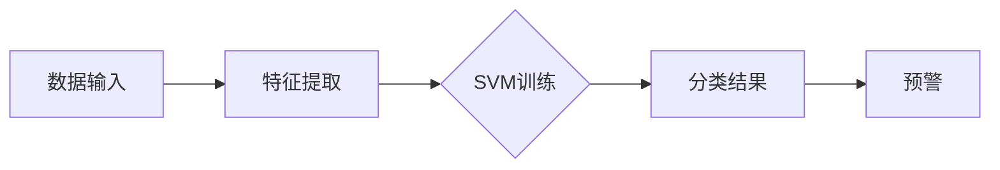
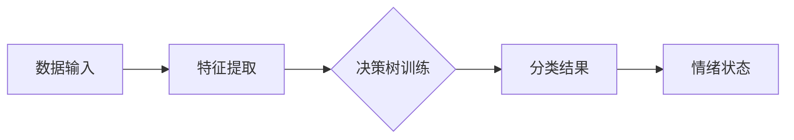
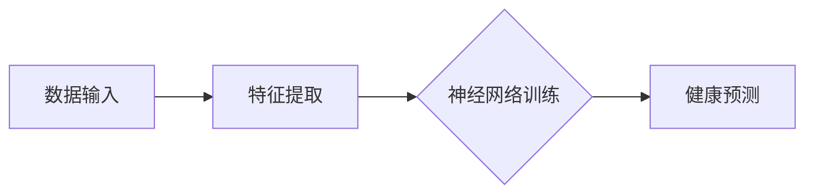
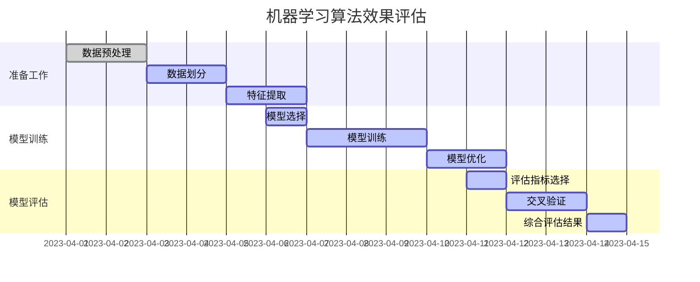
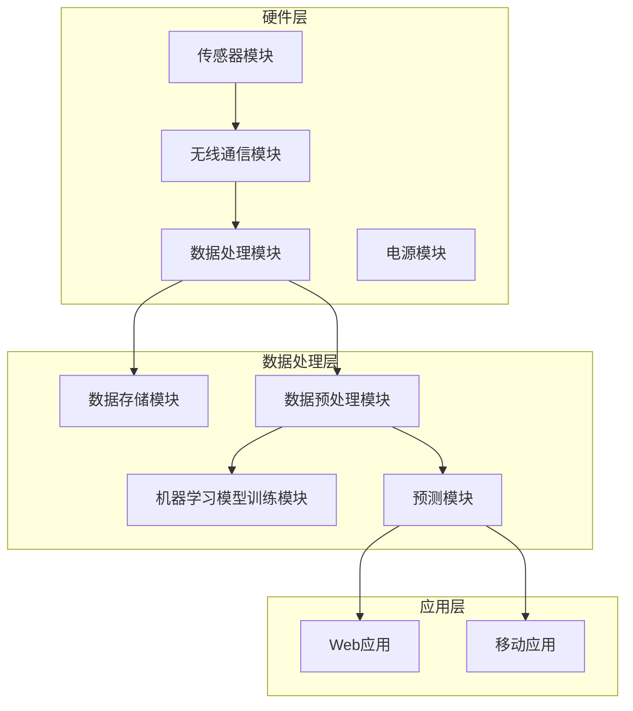
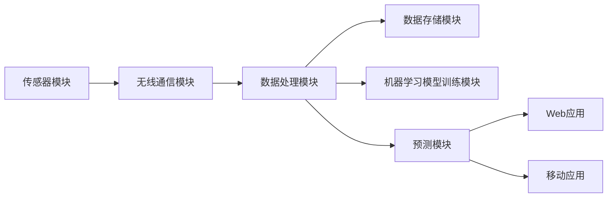
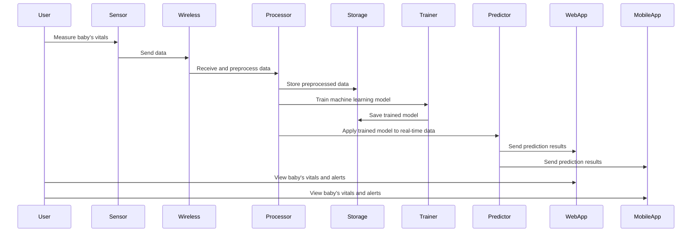
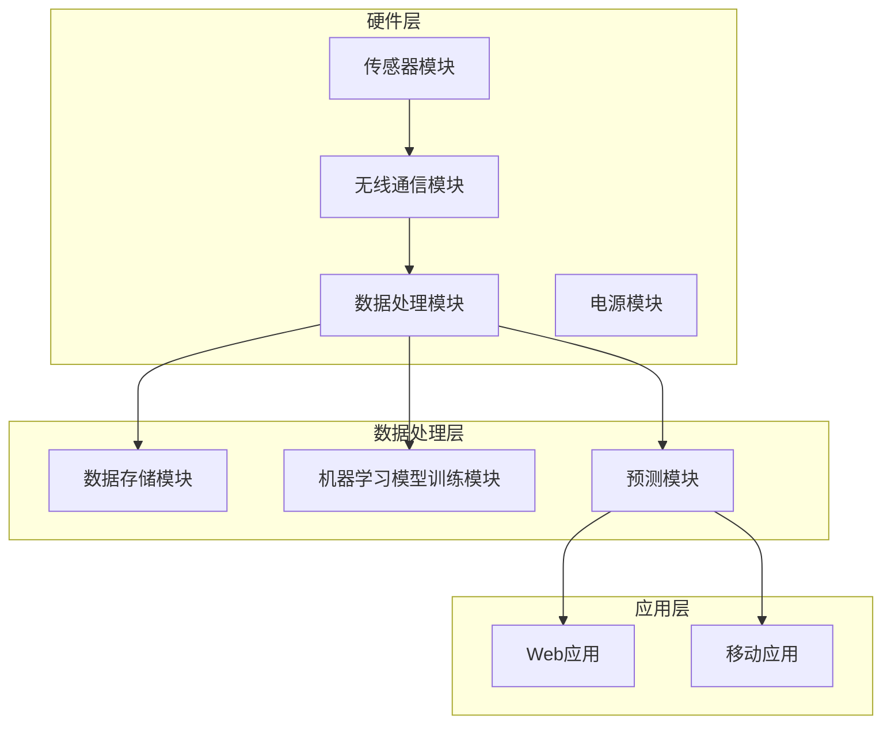

                 


## 第1章: 智能婴儿监护器概述

### 1.1 问题背景

#### 1.1.1 智能婴儿监护器的需求

随着科技的不断进步，家庭生活中对于婴儿的监护需求日益增长。传统的婴儿监护设备如婴儿监视器、温度传感器等，虽然能够提供基本的监护功能，但在智能化、个性化方面仍有不足。智能婴儿监护器应运而生，它利用先进的人工智能技术，能够实时监测婴儿的呼吸、心跳、体温等生命体征，并通过机器学习算法对数据进行智能分析，及时发现潜在的健康问题。

#### 1.1.2 早期儿童发展的关键因素

早期儿童发展是一个复杂的过程，涉及到生理、心理和社会多个层面。良好的生活环境、适宜的教育刺激和有效的监护是儿童健康成长的关键因素。智能婴儿监护器不仅能够为家长提供实时的监护信息，还能根据婴儿的行为习惯和发育阶段，提供个性化的护理建议和成长跟踪报告，有助于家长更好地了解和促进儿童的发展。

#### 1.1.3 AI在儿童监护中的应用潜力

人工智能技术具有强大的数据处理和分析能力，在儿童监护领域具有广泛的应用潜力。通过智能婴儿监护器，家长可以实时了解婴儿的生理状态和情绪变化，提前发现潜在的健康风险，从而采取及时有效的措施。此外，智能婴儿监护器还可以通过数据积累和分析，为婴儿的成长提供个性化的建议，帮助家长更好地进行育儿。

### 1.2 问题描述

#### 1.2.1 智能婴儿监护器的挑战

智能婴儿监护器的发展面临诸多挑战。首先，如何确保监护器的准确性和稳定性是一个重要问题。婴儿的生理特征和日常行为变化多端，监护器需要能够适应这些变化，提供准确的监测数据。其次，数据隐私和安全问题也不容忽视。智能婴儿监护器会收集大量的个人数据，如何保护这些数据的安全和隐私，是监护器设计者和使用者共同面临的挑战。

#### 1.2.2 数据隐私和安全问题

数据隐私和安全问题是智能婴儿监护器面临的重要挑战之一。婴儿的个人信息非常敏感，包括姓名、出生日期、健康状况等。如果这些数据被未经授权的第三方获取或滥用，可能会对婴儿及其家庭造成严重的后果。因此，智能婴儿监护器在设计和开发过程中，需要采取严格的数据保护措施，确保数据在传输、存储和处理过程中的安全性。

#### 1.2.3 技术成熟度与成本考量

智能婴儿监护器的发展还受到技术成熟度和成本的限制。目前，一些先进的AI算法和技术尚未完全成熟，或者成本较高，不适合大规模商业应用。如何平衡技术成熟度和成本，使其成为家庭可以负担的监护工具，是智能婴儿监护器发展过程中需要考虑的问题。

### 1.3 解决方案

#### 1.3.1 AI在监测中的角色

为了应对上述挑战，智能婴儿监护器的设计需要充分利用人工智能技术。首先，通过机器学习算法，监护器可以对婴儿的生理数据进行实时监测和分析，识别出异常情况。其次，利用自然语言处理技术，监护器可以与家长进行语音交互，提供实时反馈和护理建议。此外，通过大数据分析，监护器可以了解婴儿的成长轨迹，为其提供个性化的成长计划。

#### 1.3.2 机器学习的应用

机器学习在智能婴儿监护器中的应用主要体现在数据分析和预测方面。首先，监护器会收集婴儿的呼吸、心跳、体温等生理数据，通过机器学习算法，将这些数据转化为有意义的信息。例如，通过分析呼吸频率和心跳变化，监护器可以判断婴儿是否处于睡眠状态，或者是否有呼吸暂停的风险。其次，机器学习算法还可以预测婴儿的健康风险，如发热、感染等，为家长提供预警。

#### 1.3.3 传感器与数据处理

智能婴儿监护器的核心是传感器和数据处理技术。传感器负责收集婴儿的生理数据，如温度、湿度、光线等。这些数据通过无线传输到监护器进行处理和分析。为了确保数据的准确性和实时性，监护器需要采用高效的数据处理算法，对传感器数据进行实时处理和预测分析。此外，为了保护数据的安全性和隐私，监护器还需要采取严格的数据加密和安全措施。

#### 1.4 边界与外延

#### 1.4.1 智能婴儿监护器的功能范围

智能婴儿监护器的功能范围主要包括生理数据监测、行为分析、健康预警和成长跟踪等。通过这些功能，监护器可以为家长提供全面的婴儿监护服务。然而，监护器的功能并非一成不变，随着技术的发展和需求的变迁，监护器的功能也将不断扩展和升级。

#### 1.4.2 技术限制与未来趋势

虽然智能婴儿监护器具有许多优点，但当前的技术水平仍存在一定的限制。例如，一些复杂的机器学习算法在处理婴儿生理数据时，可能会出现准确性不高或者响应速度慢的问题。此外，由于数据隐私和安全问题的敏感性，监护器在数据传输和存储方面需要采取更加严格的措施。

未来的发展趋势是，随着人工智能技术的不断进步，智能婴儿监护器的功能将更加智能化和个性化。同时，数据隐私和安全问题也将得到更好的解决，使得智能婴儿监护器能够更加广泛地应用于家庭育儿场景中。

#### 1.4.3 法律法规与伦理考量

智能婴儿监护器的发展还受到法律法规和伦理考量的影响。例如，涉及个人隐私数据的处理和存储，需要遵循相关的法律法规，确保数据的合法合规使用。此外，监护器的设计和开发也需要考虑到伦理问题，确保其使用不会侵犯婴儿的隐私权和权益。

### 1.5 智能婴儿监护器的基本工作原理

智能婴儿监护器的基本工作原理可以分为以下几个步骤：

1. **传感器数据采集**：监护器通过内置的传感器收集婴儿的生理数据，如呼吸、心跳、体温等。
2. **数据预处理**：收集到的数据会经过预处理，包括去噪、滤波和归一化等步骤，以提高数据的准确性和可靠性。
3. **特征提取**：预处理后的数据会进行特征提取，提取出与婴儿生理状态相关的关键特征。
4. **机器学习模型训练**：使用提取出的特征数据训练机器学习模型，以识别正常的生理状态和异常情况。
5. **实时监测与预警**：监护器会实时监测婴儿的生理状态，当检测到异常情况时，会及时发出预警信息。
6. **反馈与调整**：监护器会根据预警信息和家长的行为反馈进行调整，以优化监测效果和个性化建议。

通过上述工作原理，智能婴儿监护器能够为家长提供全面的监护服务，帮助家长更好地关注和照顾婴儿的健康成长。

### 1.6 智能婴儿监护器的发展历程

智能婴儿监护器的发展历程可以分为以下几个阶段：

1. **初期阶段（20世纪90年代）**：这一阶段的智能婴儿监护器主要以基本的传感器和监测功能为主，如呼吸监测、体温监测等。由于技术限制，这些监护器的监测准确性和实时性相对较低。
2. **成长阶段（2000-2010年）**：随着计算机技术和传感器技术的进步，智能婴儿监护器的功能得到了显著提升。此时，监护器开始引入简单的机器学习算法，如决策树和朴素贝叶斯分类器，用于数据分析。
3. **成熟阶段（2010年至今）**：近年来，随着深度学习和人工智能技术的发展，智能婴儿监护器的功能得到了极大的拓展。监护器能够通过复杂的机器学习模型，如神经网络和生成对抗网络，进行更为精准的数据分析和预测。

### 1.7 智能婴儿监护器的优势与挑战

#### 1.7.1 优势

智能婴儿监护器的优势主要体现在以下几个方面：

1. **实时监测**：智能婴儿监护器能够实时监测婴儿的生理状态，及时发现潜在的健康问题，为家长提供及时的预警。
2. **个性化护理**：通过机器学习算法，监护器可以根据婴儿的个体差异，提供个性化的护理建议，帮助家长更好地照顾婴儿。
3. **减少家长负担**：智能婴儿监护器能够减轻家长的监护负担，使其有更多的时间和精力去关注其他重要事务。

#### 1.7.2 挑战

尽管智能婴儿监护器具有许多优势，但其发展也面临一些挑战：

1. **数据隐私和安全**：智能婴儿监护器需要收集和处理大量的个人数据，如何保护这些数据的安全和隐私，是监护器设计和开发者需要解决的重要问题。
2. **技术成熟度**：虽然人工智能技术发展迅速，但一些先进的算法和技术仍不成熟，或成本较高，不适合大规模商业应用。
3. **用户接受度**：智能婴儿监护器作为一种新兴产品，用户接受度可能不高，需要通过不断改进和优化，提高其在家庭中的普及率。

### 1.8 总结

智能婴儿监护器是一种利用人工智能技术进行婴儿监护的先进设备。它通过传感器收集婴儿的生理数据，利用机器学习算法进行分析和预测，为家长提供实时的监护服务和个性化的护理建议。尽管面临一些挑战，智能婴儿监护器具有巨大的发展潜力，有望在未来为家庭育儿提供更为全面和智能的解决方案。

## 第2章: AI Agent的基本概念与早期发展

### 2.1 AI Agent的定义

AI Agent，即人工智能代理，是一种能够自主执行任务、与环境和用户交互的智能实体。它通过感知环境、理解任务要求，并利用自主决策和行动来达成目标。AI Agent的核心在于其自主性和适应性，能够根据环境变化和任务需求，动态调整行为策略。

### 2.2 AI Agent的分类

AI Agent可以根据其功能、任务环境、自主性等因素进行分类。常见的分类方法包括：

1. **基于任务的AI Agent**：这类Agent专注于执行特定任务，如智能客服、自动驾驶等。它们通常在明确的任务场景下工作，对复杂环境的变化适应性较低。
2. **基于环境的AI Agent**：这类Agent则更加关注对环境的理解和适应，如智能家居系统、智能城市监控系统等。它们能够根据环境变化调整自身行为，具有较强的自适应能力。
3. **混合型AI Agent**：这类Agent结合了任务和环境的特点，能够在不同场景下灵活切换，如多机器人协同系统、智能物流调度系统等。

### 2.3 AI Agent的核心特点

AI Agent的核心特点包括：

1. **自主性**：AI Agent能够自主感知环境、理解任务要求，并自主制定行动策略，无需外部指令。
2. **适应性**：AI Agent能够根据环境变化和任务需求，动态调整自身行为，以适应不断变化的情况。
3. **交互性**：AI Agent能够与环境和用户进行有效的交互，获取反馈并调整行为策略。
4. **学习性**：AI Agent具备一定的学习能力，可以通过数据积累和经验学习，提高任务执行的效果。

### 2.4 AI Agent的发展历史

AI Agent的概念起源于人工智能研究的早期阶段。20世纪50年代，随着计算机科学和人工智能学的兴起，科学家开始探索如何使计算机具备人类般的智能。1956年，约翰·麦卡锡（John McCarthy）等人在达特茅斯会议上提出了“人工智能”（AI）的概念，标志着AI研究的正式开始。

1. **早期探索（1956-1974年）**：在这个阶段，AI Agent的概念逐渐形成。1959年，赫伯特·西蒙（Herbert Simon）提出了“有限理性”理论，认为AI系统可以通过简化问题和优化搜索算法来模拟人类智能。同时，马文·明斯基（Marvin Minsky）和约翰·麦卡锡（John McCarthy）等人提出了“逻辑理论家”（Logic Theorist）程序，这是最早的AI Agent之一，能够自动证明数学定理。

2. **AI寒冬（1974-1980年）**：由于技术局限和实际应用的缺乏，AI研究在1974年后进入了一个相对低潮期，被称为“AI寒冬”。在这个时期，许多AI Agent项目因未能实现预期目标而终止，导致对AI的信心受到严重打击。

3. **复兴与发展（1980年至今）**：20世纪80年代，随着计算机硬件性能的提升和机器学习算法的进步，AI研究重新焕发生机。这一阶段的代表性成果包括专家系统（Expert Systems）和机器学习（Machine Learning）。1990年代，AI Agent的应用开始扩展到更广泛的领域，如智能代理、多机器人系统等。

### 2.5 早期AI Agent的应用案例

在AI Agent的发展历程中，有许多具有代表性的应用案例：

1. **游戏代理**：早期的AI Agent在很多游戏领域取得了显著成果。如国际象棋程序“深蓝”（Deep Blue）在1997年击败了世界棋王卡斯帕罗夫（Garry Kasparov）。这些游戏代理通过深度学习和策略优化，实现了高水平的表现。

2. **智能家居系统**：智能家居系统中的AI Agent可以自动调节室内温度、光线和安全性，提高居住的舒适度和安全性。如谷歌的Nest恒温器，通过学习用户的行为模式，自动调节室内温度。

3. **智能客服**：许多公司开始使用AI代理来处理客户咨询和投诉。这些代理通过自然语言处理（NLP）和机器学习算法，能够快速响应客户的问题，提供解决方案。

### 2.6 AI Agent的核心概念与联系

为了更好地理解AI Agent的核心概念及其相互联系，我们可以从以下几个角度进行分析：

1. **感知与决策**：AI Agent需要具备感知能力，通过传感器收集环境信息，然后利用决策算法对信息进行分析，制定行动策略。感知与决策是AI Agent执行任务的基石。

2. **行动与反馈**：AI Agent根据决策制定行动策略，并执行相应的操作。行动后，系统会收集到反馈信息，用于调整和优化后续的行动策略。这种反馈机制是AI Agent不断学习和改进的重要途径。

3. **学习与进化**：AI Agent通过持续的学习和进化，提高自身的任务执行能力和适应性。学习可以是基于数据的，如机器学习算法；也可以是基于经验的，如强化学习算法。

### 2.7 AI Agent的ER实体关系图

为了更清晰地展示AI Agent的核心概念及其相互关系，我们可以使用ER（实体关系）图来描述。以下是一个简单的ER图：

```mermaid
erDiagram
    AI_Agent ||--|{ Sensor } Sensor
    AI_Agent ||--|{ Action } Action
    AI_Agent ||--|{ Decision } Decision
    AI_Agent ||--|{ Learning } Learning
    Sensor ||--|{ Data } Data
    Action ||--|{ Feedback } Feedback
```

在这个ER图中，AI Agent作为中心实体，与Sensor、Action、Decision、Learning等实体通过关系线相连，展示了它们之间的相互作用和依赖关系。Sensor负责收集环境数据，Data表示收集到的感知数据；Action表示执行的操作，Feedback表示操作的反馈；Decision是AI Agent根据感知数据和决策算法做出的决策；Learning表示AI Agent通过反馈进行学习和优化的过程。

### 2.8 AI Agent的核心属性特征对比

为了更深入地理解AI Agent的核心属性特征，我们可以通过表格进行对比分析。以下是一个简单的特征对比表格：

| 特征       | 描述                                                         | 对比示例                 |
| ---------- | ------------------------------------------------------------ | ------------------------ |
| 自主性     | AI Agent能够自主执行任务，无需外部指令。                       | 智能客服与人类客服对比   |
| 适应性     | AI Agent能够根据环境变化和任务需求，动态调整自身行为。         | 智能家居系统与环境互动   |
| 交互性     | AI Agent能够与环境和用户进行有效交互。                         | 智能代理与客户对话       |
| 学习性     | AI Agent能够通过数据积累和经验学习，提高任务执行效果。         | 游戏代理在游戏中的进步   |

通过这个表格，我们可以看到AI Agent的核心特征及其在实际应用中的对比，有助于更全面地理解AI Agent的工作原理和优势。

### 2.9 AI Agent的发展趋势

随着人工智能技术的不断进步，AI Agent的发展趋势表现出以下几个方向：

1. **智能化水平的提升**：未来AI Agent将具备更高的智能化水平，能够更好地理解和处理复杂任务。例如，通过深度学习和自然语言处理技术，AI Agent将能够更自然地与用户进行交互。

2. **应用领域的扩展**：AI Agent的应用领域将不断扩展，从传统的游戏、客服等领域，逐渐渗透到医疗、教育、金融等更多行业。AI Agent将成为各个领域智能化解决方案的重要组成部分。

3. **跨领域协作**：未来，不同领域的AI Agent将实现跨领域协作，形成更为复杂和智能的智能系统。例如，医疗AI Agent与教育AI Agent的协作，可以为用户提供全面的健康管理和服务。

4. **隐私保护与安全**：随着AI Agent在个人生活中的广泛应用，隐私保护和数据安全将变得尤为重要。未来的AI Agent将采取更加严格的数据保护措施，确保用户数据的安全和隐私。

### 2.10 AI Agent的发展与未来展望

AI Agent的发展不仅推动了人工智能技术的进步，也为各行业带来了深刻的变革。未来，随着技术的不断成熟和应用场景的不断扩展，AI Agent将发挥更大的作用。从家庭自动化到智能城市，从健康监护到教育辅导，AI Agent将成为智能化时代的核心驱动力量。

然而，AI Agent的发展也面临诸多挑战。例如，如何在保证智能化和效率的同时，保护用户隐私和数据安全，将是一个长期的研究课题。此外，如何提升AI Agent的自主性和适应性，使其能够更好地理解和处理复杂任务，也是未来的重要研究方向。

总之，AI Agent的发展与未来展望充满了机遇和挑战。随着技术的不断进步和应用场景的不断拓展，AI Agent将在更多领域发挥重要作用，为人类社会带来更多便利和创新。

## 第3章: 机器学习与智能婴儿监护器

### 3.1 机器学习概述

机器学习（Machine Learning，ML）是人工智能（Artificial Intelligence，AI）的一个重要分支，其主要目标是使计算机系统能够从数据中自动学习和改进性能，而无需显式地编写特定的指令。机器学习的过程包括数据收集、数据预处理、模型训练、模型评估和模型部署等步骤。其核心思想是通过统计学、概率论、算法优化等方法，从大量的数据中提取出有用的模式和规律，以便在新的数据上进行预测或分类。

#### 3.1.1 机器学习的定义

机器学习可以被定义为“通过经验改进性能的任务”，即计算机系统通过从经验中学习，使其在特定任务上的表现不断优化。这些经验通常来自于训练数据集，该数据集包含了输入和相应的输出结果。通过训练过程，机器学习算法能够学习到输入和输出之间的关系，并在新的数据上进行预测。

#### 3.1.2 机器学习的类型

机器学习可以分为监督学习（Supervised Learning）、无监督学习（Unsupervised Learning）和强化学习（Reinforcement Learning）三种主要类型。

1. **监督学习**：监督学习是最常见的机器学习类型，其特点是需要一个标记好的训练数据集。训练数据的输入和输出都被标记，通过学习这些标记数据，模型可以预测新的、未标记的数据。监督学习包括回归（Regression）和分类（Classification）两种子类。

   - **回归**：回归问题旨在预测一个连续的数值输出。例如，房价预测。
   - **分类**：分类问题旨在将输入数据分配到不同的类别中。例如，垃圾邮件分类。

2. **无监督学习**：无监督学习不需要标记数据，其目标是发现数据中的结构和模式。常见的无监督学习方法包括聚类（Clustering）和降维（Dimensionality Reduction）。

   - **聚类**：聚类算法将数据分为多个群组，使得群组内的数据点彼此相似，而群组间的数据点差异较大。例如，客户细分。
   - **降维**：降维算法通过减少数据维度，降低数据复杂性，同时保留主要特征信息。常见的降维方法包括主成分分析（PCA）和线性判别分析（LDA）。

3. **强化学习**：强化学习是一种通过试错和反馈进行学习的方法。智能体（Agent）通过与环境互动，不断调整行为策略，以最大化长期回报。强化学习在游戏、机器人控制和推荐系统等领域有广泛应用。

#### 3.1.3 机器学习在监护器中的应用

机器学习在智能婴儿监护器中发挥着至关重要的作用。以下是一些具体的应用场景：

1. **呼吸和心跳监测**：通过收集婴儿的呼吸和心跳数据，机器学习算法可以实时监测婴儿的生命体征。通过训练分类模型，可以区分正常呼吸和心跳模式与异常模式，从而及时发出预警。

2. **行为分析**：通过分析婴儿的日常行为数据，如哭声、移动等，机器学习算法可以识别婴儿的情绪状态和睡眠模式。这些信息有助于家长了解婴儿的日常行为规律，并采取相应的护理措施。

3. **健康预测**：通过对婴儿的历史健康数据进行机器学习分析，可以预测未来的健康状况。例如，通过分析体温、咳嗽等数据，可以预测婴儿是否可能发烧或感染。

4. **个性化护理建议**：机器学习算法可以根据婴儿的行为数据和健康数据，提供个性化的护理建议。例如，针对不同婴儿的睡眠模式，机器学习算法可以推荐最佳的睡眠环境设置。

### 3.2 传感器技术

传感器技术是智能婴儿监护器的重要组成部分，其作用是实时监测婴儿的生理和行为数据。以下是一些常用的传感器类型及其在监护器中的应用：

#### 3.2.1 常见传感器类型

1. **温度传感器**：温度传感器用于监测婴儿的体温，及时发现发热等异常情况。
2. **湿度传感器**：湿度传感器用于监测婴儿所处的环境湿度，确保婴儿生活的环境适宜。
3. **声音传感器**：声音传感器用于监测婴儿的哭声和活动声音，及时发现婴儿的需求和异常。
4. **加速度传感器**：加速度传感器用于监测婴儿的移动和运动状态，有助于分析婴儿的睡眠质量和活动水平。
5. **光线传感器**：光线传感器用于监测婴儿所处的环境光线，调整监控设备的亮度和传感器灵敏度。

#### 3.2.2 传感器在监护器中的应用

1. **实时监测**：通过安装在不同位置的传感器，智能婴儿监护器可以实时监测婴儿的呼吸、心跳、体温、湿度等生理数据。这些数据通过无线传输到监护器，进行分析和处理。
2. **环境监测**：传感器不仅可以监测婴儿的生理数据，还可以监测婴儿所处的环境条件。例如，温度传感器和湿度传感器可以监测婴儿的居住环境的温度和湿度，确保环境舒适。
3. **行为分析**：通过加速度传感器和声音传感器，监护器可以分析婴儿的行为模式。例如，通过监测婴儿的哭声和活动状态，可以判断婴儿是否处于清醒、睡眠或疲倦状态。

### 3.3 数据处理与分析

智能婴儿监护器需要处理大量的传感器数据，以便从这些数据中提取有用的信息和模式。以下是一些数据处理和分析的关键步骤：

#### 3.3.1 数据收集

智能婴儿监护器通过内置的传感器收集婴儿的生理数据和环境数据。这些数据包括呼吸频率、心跳速率、体温、环境温度、湿度、婴儿的活动状态等。数据收集过程需要确保数据的准确性和完整性。

#### 3.3.2 数据预处理

在数据预处理阶段，需要对收集到的数据进行清洗、去噪和归一化等操作。数据清洗的目的是去除错误数据和不完整数据，去噪是为了减少噪声对数据的影响，归一化则是为了将不同单位和量级的数值转化为同一尺度，以便后续处理。

#### 3.3.3 数据分析

在数据分析阶段，智能婴儿监护器利用机器学习算法对预处理后的数据进行处理。以下是一些常见的数据分析方法：

1. **特征提取**：通过特征提取技术，将原始数据转化为有意义的特征向量。特征提取的目标是保留数据的主要特征，同时减少数据的冗余。

2. **模式识别**：利用机器学习算法，如支持向量机（SVM）、决策树（Decision Tree）、神经网络（Neural Network）等，对特征向量进行模式识别。模式识别的目的是识别出数据的异常值和潜在的健康问题。

3. **健康预测**：基于历史数据和模型预测，智能婴儿监护器可以预测未来的健康状况。例如，通过分析体温变化趋势，可以预测婴儿是否可能发烧。

#### 3.3.4 数据可视化

数据可视化是数据分析和解释的重要手段，它可以将复杂的数据转化为易于理解和交互的图形化表示。在智能婴儿监护器中，数据可视化可以帮助家长和医生更直观地了解婴儿的健康状况。以下是一些常见的数据可视化方法：

1. **折线图**：用于展示时间序列数据，如体温变化、呼吸频率变化等。
2. **柱状图**：用于展示不同类别数据的分布情况，如不同时间段的活动水平分布。
3. **饼图**：用于展示各类别数据在整体中的占比，如不同时间段的睡眠状态分布。
4. **热力图**：用于展示数据的分布情况，如环境湿度和温度的分布。

### 3.4 机器学习算法在智能婴儿监护器中的应用

机器学习算法在智能婴儿监护器中的应用主要包括呼吸监测、行为分析、健康预测等。以下是一些具体的机器学习算法及其应用：

#### 3.4.1 支持向量机（SVM）

支持向量机是一种常用的分类算法，其目标是在高维空间中找到最佳分类边界。在呼吸监测中，SVM可以用于区分正常呼吸和异常呼吸。例如，通过训练SVM模型，可以识别出呼吸暂停等异常情况。



#### 3.4.2 决策树

决策树是一种基于树形模型的分类算法，其核心思想是通过一系列的判断条件，将数据划分为不同的类别。在行为分析中，决策树可以用于分类婴儿的情绪状态。例如，通过分析婴儿的哭声和活动状态，可以判断婴儿是否处于清醒、疲劳或烦躁状态。



#### 3.4.3 神经网络

神经网络是一种模拟人脑神经元结构和功能的算法，其具有很强的非线性处理能力。在健康预测中，神经网络可以用于建立健康状态预测模型。例如，通过训练神经网络模型，可以预测婴儿在未来一段时间内的健康状态。



### 3.5 机器学习算法的挑战与优化

尽管机器学习算法在智能婴儿监护器中具有广泛的应用，但其在实际应用中仍面临一些挑战和问题：

1. **数据质量**：机器学习算法的性能很大程度上依赖于训练数据的质量。如果训练数据存在噪声或偏差，可能会导致模型性能下降。因此，确保数据的质量和准确性是机器学习应用的关键。

2. **算法选择**：不同的机器学习算法适用于不同的应用场景。在智能婴儿监护器中，选择合适的算法并进行优化是提高模型性能的关键。

3. **计算资源**：机器学习算法通常需要大量的计算资源。对于实时性要求较高的应用场景，如智能婴儿监护器，如何优化算法，减少计算资源需求，是一个重要的研究方向。

4. **解释性**：机器学习模型通常被视为“黑盒”，其决策过程难以解释。在医疗健康领域，模型的可解释性尤为重要。如何提高模型的可解释性，使其更加透明和可信，是一个重要的研究课题。

为了应对这些挑战，研究人员可以采取以下优化策略：

1. **数据预处理**：通过有效的数据预处理方法，如数据清洗、去噪和归一化，提高数据的准确性和一致性。

2. **算法选择与优化**：根据具体应用场景，选择合适的机器学习算法，并通过调整参数和优化模型结构，提高模型的性能。

3. **计算资源管理**：通过分布式计算和并行计算技术，优化算法的计算效率，降低计算资源的需求。

4. **模型解释与可解释性**：通过开发可解释性算法和模型可视化技术，提高模型的可解释性和透明度，使决策过程更加清晰和可信。

通过以上优化策略，可以有效地提高机器学习算法在智能婴儿监护器中的应用效果，为婴儿的健康监护提供更为可靠和智能的解决方案。

### 3.6 机器学习算法在实际应用中的效果评估

在智能婴儿监护器的实际应用中，评估机器学习算法的效果至关重要。以下是一些常用的评估指标和评估方法：

1. **准确率（Accuracy）**：准确率是评估分类算法最常用的指标，它表示分类正确的样本数占总样本数的比例。准确率越高，表示算法的分类效果越好。

2. **精确率（Precision）和召回率（Recall）**：精确率和召回率分别表示分类结果中实际为正样本的占比和实际为负样本的占比。精确率越高，表示算法对正样本的识别能力越强；召回率越高，表示算法对负样本的识别能力越强。

3. **F1分数（F1 Score）**：F1分数是精确率和召回率的加权平均，它能够平衡精确率和召回率之间的矛盾。F1分数越高，表示算法的整体性能越好。

4. **ROC曲线（Receiver Operating Characteristic Curve）**：ROC曲线通过绘制不同阈值下的真阳性率（True Positive Rate，TPR）和假阳性率（False Positive Rate，FPR）来评估分类算法的性能。ROC曲线的面积（AUC）越大，表示算法的性能越好。

5. **交叉验证（Cross-Validation）**：交叉验证是一种常用的评估方法，它通过将数据集划分为多个子集，轮流使用子集作为验证集，评估模型的性能。常用的交叉验证方法包括K折交叉验证和留一交叉验证。

在实际应用中，评估机器学习算法的效果需要综合考虑多个指标，以获得全面的评估结果。以下是一个简单的机器学习算法效果评估示例：



通过上述步骤，可以系统地评估机器学习算法在智能婴儿监护器中的应用效果，为后续的算法优化和模型改进提供依据。

## 第4章: 智能婴儿监护器的系统设计与实现

### 4.1 系统设计概述

智能婴儿监护器的系统设计是确保其功能完备、性能稳定、用户友好的关键环节。在本节中，我们将详细阐述智能婴儿监护器的系统设计过程，包括系统功能设计、系统架构设计、系统接口设计以及系统交互设计。

#### 4.1.1 系统功能设计

智能婴儿监护器的主要功能可以分为以下几类：

1. **生理数据监测**：实时监测婴儿的呼吸、心跳、体温等生命体征。
2. **环境数据监测**：监测婴儿所处环境的温度、湿度、光线等参数。
3. **行为分析**：分析婴儿的哭声、活动状态，判断其情绪和睡眠质量。
4. **健康预警**：根据监测数据，及时发现潜在的健康问题，并发出预警。
5. **个性化护理建议**：基于婴儿的成长数据和监测结果，提供个性化的护理建议。
6. **数据记录与查询**：记录婴儿的日常监测数据和护理记录，并支持历史数据的查询。
7. **用户交互**：通过APP或网页界面，与家长进行实时交互，提供监测数据和护理建议。

#### 4.1.2 系统架构设计

智能婴儿监护器的系统架构可以分为硬件层、数据处理层和应用层。

1. **硬件层**：主要包括传感器模块、无线通信模块、数据处理模块和电源模块。传感器模块负责收集婴儿的生理和环境数据；无线通信模块负责将数据传输到服务器；数据处理模块对数据进行预处理和分析；电源模块为系统提供稳定的电力供应。

2. **数据处理层**：主要包括数据存储、数据预处理、机器学习模型训练和预测等模块。数据存储模块用于存储收集到的数据；数据预处理模块对原始数据进行清洗、去噪和特征提取；机器学习模型训练模块用于训练和优化预测模型；预测模块根据实时数据，进行健康预测和预警。

3. **应用层**：主要包括Web应用和移动应用。Web应用为家长提供实时监控和数据查询功能；移动应用则提供便捷的监测数据和护理建议。

#### 4.1.3 系统接口设计

智能婴儿监护器的系统接口设计包括内部接口和外部接口。

1. **内部接口**：主要涉及硬件模块之间的通信，如传感器与无线通信模块、数据处理模块之间的数据传输接口。这些接口应保证数据的实时性和稳定性。

2. **外部接口**：主要包括与家长交互的接口，如Web应用接口和移动应用接口。这些接口应提供友好的用户界面和丰富的功能，方便家长进行监控和查询。

#### 4.1.4 系统交互设计

智能婴儿监护器的系统交互设计主要关注硬件与软件、用户与系统的交互。

1. **硬件与软件交互**：传感器收集的数据通过无线通信模块传输到数据处理模块，数据处理模块对数据进行预处理和分析，然后将结果发送到应用层。这个过程需要保证数据传输的高效和准确。

2. **用户与系统交互**：家长通过Web应用或移动应用与系统进行交互。系统通过实时监控页面和报警提示，向家长展示婴儿的生理数据和环境数据。家长可以根据系统提供的护理建议，调整护理措施。

### 4.2 系统架构设计

智能婴儿监护器的系统架构设计采用了分层架构，确保系统的模块化、可扩展性和易维护性。以下是一个简化的系统架构图：



在这个架构中，硬件层负责数据采集和传输；数据处理层负责数据存储、预处理、模型训练和预测；应用层则负责与用户进行交互，展示监测数据和护理建议。

### 4.3 系统接口设计

智能婴儿监护器的系统接口设计包括以下几个方面：

#### 4.3.1 硬件接口

1. **传感器接口**：传感器接口用于连接各种生理和环境传感器，如温度传感器、湿度传感器、加速度传感器、声音传感器等。这些接口应支持标准协议，如I2C、SPI或UART，以确保传感器的数据可以可靠传输。
2. **无线通信接口**：无线通信接口用于传感器模块与数据处理模块之间的数据传输。常见的无线通信协议包括Wi-Fi、蓝牙和ZigBee。这些协议应具备高带宽、低延迟和良好的抗干扰性能。

#### 4.3.2 软件接口

1. **数据处理接口**：数据处理接口用于数据预处理模块、机器学习模型训练模块和预测模块之间的通信。这些接口应支持高效的数据传输和并行处理，以确保系统的高性能和实时性。
2. **Web应用接口**：Web应用接口用于Web应用与系统之间的数据交互。常见的接口技术包括RESTful API和WebSocket。这些接口应提供安全的认证和授权机制，以确保数据的安全和隐私。
3. **移动应用接口**：移动应用接口用于移动应用与系统之间的数据交互。这些接口应支持多种移动平台，如Android和iOS，并提供简洁友好的用户界面。

### 4.4 系统交互设计

智能婴儿监护器的系统交互设计旨在确保用户与系统之间的交互流畅、直观和高效。以下是一些关键的设计要素：

#### 4.4.1 实时监控页面

实时监控页面是用户查看婴儿生理数据和环境数据的主要入口。页面设计应简洁明了，关键信息一目了然。以下是一些设计要点：

1. **数据可视化**：使用折线图、柱状图和饼图等可视化工具，展示婴儿的呼吸、心跳、体温等生理数据和环境温度、湿度等环境参数。
2. **实时更新**：数据应实时更新，确保用户可以第一时间了解婴儿的当前状态。
3. **预警提示**：当监测到异常数据时，系统应立即发出预警提示，并记录在案。

#### 4.4.2 护理建议页面

护理建议页面是根据婴儿的监测数据和成长数据，系统自动生成的护理建议。页面设计应注重可操作性和实用性，以下是一些设计要点：

1. **个性化推荐**：根据婴儿的个体差异和当前状态，系统应提供个性化的护理建议，如调整室内温度、湿度，调整睡眠环境等。
2. **操作指南**：护理建议应附有详细的操作指南，帮助家长正确执行建议。
3. **历史记录**：页面应展示历史护理建议记录，方便家长查阅和参考。

#### 4.4.3 数据查询和报表

数据查询和报表功能是用户查看婴儿历史监测数据和护理记录的重要途径。以下是一些设计要点：

1. **数据检索**：用户可以通过时间、类别等条件进行数据检索，快速找到所需信息。
2. **报表生成**：系统应支持自动生成各类报表，如婴儿成长报表、健康预警报表等。
3. **导出和打印**：用户可以导出报表数据，方便进一步分析和打印。

#### 4.4.4 用户交互

智能婴儿监护器的用户交互设计应考虑以下方面：

1. **用户界面**：用户界面应简洁美观，符合用户操作习惯，避免复杂和冗长的操作流程。
2. **交互反馈**：系统应在用户操作时提供即时反馈，如点击按钮时的震动反馈、音效反馈等，增强用户体验。
3. **多平台支持**：系统应支持多种平台，如手机、平板和电脑，确保用户在不同设备上都能顺畅使用。

通过以上设计要素，智能婴儿监护器能够为用户提供便捷、高效、直观的使用体验，确保家长能够实时了解婴儿的健康状况，并提供科学、个性化的护理建议。

### 4.5 系统组件交互

智能婴儿监护器系统的组件交互设计是实现系统功能的关键。以下是系统组件之间的交互过程：

1. **传感器与无线通信模块**：传感器模块负责实时采集婴儿的生理数据和环境数据，如呼吸、心跳、体温、环境温度和湿度等。这些数据通过无线通信模块传输到数据处理模块。

2. **无线通信模块与数据处理模块**：无线通信模块将采集到的数据发送到数据处理模块。数据处理模块包括数据预处理模块、机器学习模型训练模块和预测模块。

3. **数据处理模块与数据存储模块**：数据处理模块对传输过来的数据进行预处理，如去噪、滤波和特征提取等。预处理后的数据被存储在数据存储模块中，以供后续分析。

4. **数据处理模块与机器学习模型训练模块**：机器学习模型训练模块从数据存储模块中读取预处理后的数据，利用这些数据训练和优化预测模型。训练完成的模型将被存储在数据存储模块中。

5. **数据处理模块与预测模块**：预测模块使用训练完成的模型对实时数据进行分析和预测，以判断婴儿的健康状态。预测结果将用于生成健康预警和护理建议。

6. **预测模块与Web应用和移动应用**：预测模块将预测结果和护理建议通过Web应用和移动应用接口发送给家长，家长可以通过这些应用实时查看监测数据、健康预警和护理建议。

以下是一个简化的系统组件交互流程图：



通过上述交互设计，智能婴儿监护器能够实现实时数据监测、健康预测和预警，为家长提供便捷、智能的监护服务。

### 4.6 系统序列图

系统序列图展示了智能婴儿监护器中各个组件之间的交互顺序和时序关系。以下是系统序列图：



在这个序列图中，用户通过Web应用或移动应用与系统进行交互，传感器模块负责实时监测婴儿的生理数据，无线通信模块将数据传输到数据处理模块，数据处理模块对数据进行预处理、训练机器学习模型，并应用模型进行预测，最终将预测结果发送给用户。

### 4.7 系统类图

系统类图展示了智能婴儿监护器中的主要类及其相互关系。以下是系统类图：

```mermaid
classDiagram
    Sensor <<interface>>
    Wireless <<interface>>
    Processor <<class>> -|- DataPreprocessor <<class>>
    DataStorage <<class>> -|- MachineLearningModel <<class>> -|- Predictor <<class>>
    WebApp <<class>> -|- MobileApp <<class>>

    Sensor --|>> Processor
    Processor --|>> DataStorage
    Processor --|>> MachineLearningModel
    Processor --|>> Predictor
    Predictor --|>> WebApp
    Predictor --|>> MobileApp
```

在这个类图中，Sensor和Wireless是接口类，Processor是核心处理类，包括DataPreprocessor、DataStorage、MachineLearningModel和Predictor等子类。WebApp和MobileApp是用户交互类，它们与Processor类进行交互，以实现数据监测、预测和展示。

### 4.8 系统架构图

系统架构图展示了智能婴儿监护器中各个层次和组件之间的关系。以下是系统架构图：



在这个架构图中，硬件层包括传感器模块、无线通信模块、数据处理模块和电源模块；数据处理层包括数据存储模块、机器学习模型训练模块和预测模块；应用层包括Web应用和移动应用。各层之间通过接口进行数据交互，共同实现智能婴儿监护器的功能。

### 4.9 系统接口和交互设计总结

智能婴儿监护器的系统接口和交互设计旨在实现高效、稳定和用户友好的数据监测、处理和展示。通过硬件层的传感器和无线通信模块，实时收集和传输婴儿的生理数据和环境数据。数据处理层对数据进行预处理、存储、训练和预测，以生成健康预警和护理建议。应用层通过Web应用和移动应用，与用户进行交互，提供实时的监测数据和个性化的护理建议。

系统接口设计确保了硬件模块和软件模块之间的无缝连接，以及数据处理模块和应用层之间的数据传输和交互。交互设计则通过简洁直观的用户界面和流畅的交互体验，使家长能够方便地监控婴儿的健康状况，并接收系统的预警和建议。

这种系统架构和交互设计为智能婴儿监护器提供了强大的功能和灵活的扩展能力，能够满足不同家庭和场景的需求，为婴儿的健康成长提供有力保障。

## 第5章: 实际案例分析与实现

### 5.1 环境安装与配置

在实际开发智能婴儿监护器之前，我们需要搭建一个合适的环境来进行开发。以下是搭建开发环境的详细步骤：

#### 5.1.1 开发环境搭建

1. **操作系统**：我们选择Ubuntu 20.04作为开发操作系统。可以通过官方网站下载Ubuntu 20.04的ISO文件，然后使用虚拟机软件如VMware或VirtualBox进行安装。

2. **编程语言**：智能婴儿监护器的主要开发语言是Python，因此我们需要安装Python环境。首先，打开终端并更新系统包列表：

    ```bash
    sudo apt update
    sudo apt upgrade
    ```

    接着，安装Python 3和pip（Python的包管理器）：

    ```bash
    sudo apt install python3 python3-pip
    ```

3. **虚拟环境**：为了隔离不同项目之间的依赖，我们使用虚拟环境。安装virtualenv：

    ```bash
    sudo pip3 install virtualenv
    virtualenv my_igu_project_env
    source my_igu_project_env/bin/activate
    ```

4. **依赖包**：在虚拟环境中安装必要的依赖包，如NumPy、Pandas、Scikit-learn等：

    ```bash
    pip install numpy pandas scikit-learn matplotlib
    ```

5. **Jupyter Notebook**：为了方便开发和调试，我们安装Jupyter Notebook：

    ```bash
    pip install jupyterlab
    jupyter lab
    ```

    打开浏览器访问`http://localhost:8888`即可启动Jupyter Notebook。

#### 5.1.2 相关工具安装

1. **Git**：为了版本控制和代码管理，我们需要安装Git：

    ```bash
    sudo apt install git
    ```

2. **Docker**：为了方便部署和测试，我们使用Docker。安装Docker Engine：

    ```bash
    sudo apt-get update
    sudo apt-get install docker-ce docker-ce-cli containerd.io
    ```

    验证安装：

    ```bash
    docker --version
    ```

3. **Kafka**：Kafka是一个分布式流处理平台，用于处理实时数据流。安装Kafka：

    ```bash
    docker run -d -p 9092:9092 --name kafka kafka:2.8.0
    ```

4. **Redis**：Redis是一个高性能的NoSQL数据库，用于存储和缓存数据。安装Redis：

    ```bash
    docker run -d -p 6379:6379 --name redis redis:6.0.8
    ```

5. **PostgreSQL**：PostgreSQL是一个开源的关系型数据库，用于存储长期数据。安装PostgreSQL：

    ```bash
    sudo apt update
    sudo apt install postgresql postgresql-contrib
    ```

    配置PostgreSQL：

    ```bash
    sudo -u postgres psql
    CREATE DATABASE mydata;
    \c mydata
    CREATE TABLE babydata (id SERIAL PRIMARY KEY, timestamp TIMESTAMP DEFAULT CURRENT_TIMESTAMP, data JSONB);
    ```

### 5.2 系统核心实现

智能婴儿监护器的核心功能包括传感器数据处理、机器学习算法应用和监护器功能实现。以下是对这三个核心功能的详细讲解：

#### 5.2.1 传感器数据处理

传感器数据处理是智能婴儿监护器的关键部分。我们使用加速度传感器和声音传感器来收集数据，并通过无线通信模块将这些数据传输到数据处理模块。

1. **加速度传感器数据处理**：加速度传感器可以测量婴儿的运动状态。我们使用MPU-6050传感器，并通过I2C协议进行通信。以下是一个简单的Python脚本，用于读取加速度数据：

    ```python
    import smbus2
    import time

    # MPU-6050地址
    address = 0x68

    # I2C总线
    bus = smbus2.SMBus(1)

    # 读取加速度数据
    def read_accelerometer():
        # 读取加速度传感器数据
        data = bus.read_i2c_block_data(address, 0x3B, 6)
        x = (data[0] << 8) | data[1]
        y = (data[2] << 8) | data[3]
        z = (data[4] << 8) | data[5]
        return x, y, z

    while True:
        x, y, z = read_accelerometer()
        print(f"x: {x}, y: {y}, z: {z}")
        time.sleep(0.1)
    ```

2. **声音传感器数据处理**：声音传感器可以检测婴儿的哭声和活动声音。我们使用PIR（被动红外）传感器，并通过GPIO接口进行通信。以下是一个简单的Python脚本，用于读取声音传感器数据：

    ```python
    import RPi.GPIO as GPIO
    import time

    # PIR传感器引脚
    pir_pin = 18

    # 初始化GPIO
    GPIO.setmode(GPIO.BCM)
    GPIO.setup(pir_pin, GPIO.IN)

    # 读取PIR传感器数据
    def read_pir():
        return GPIO.input(pir_pin)

    while True:
        if read_pir():
            print("声音检测到！")
        time.sleep(0.1)
    ```

#### 5.2.2 机器学习算法应用

在数据处理完成后，我们需要使用机器学习算法对数据进行训练和预测。以下是一个简单的机器学习模型，用于分类婴儿的哭声：

1. **数据准备**：我们收集了1000个婴儿的哭声录音，每个录音对应一个标签（正常哭声或异常哭声）。

2. **特征提取**：使用Librosa库提取音频特征，如梅尔频谱（Mel Spectrum）和短时傅里叶变换（Short-Time Fourier Transform，STFT）。

    ```python
    import librosa
    import numpy as np

    # 提取梅尔频谱特征
    def extract_mel_spectrogram(audio_path):
        y, sr = librosa.load(audio_path)
        mel_spectrogram = librosa.feature.melspectrogram(y=y, sr=sr, n_mels=128)
        return mel_spectrogram

    # 提取STFT特征
    def extract_stft(audio_path):
        y, sr = librosa.load(audio_path)
        stft = librosa.stft(y)
        return np.abs(stft)
    ```

3. **模型训练**：使用Scikit-learn库训练一个支持向量机（SVM）模型。

    ```python
    from sklearn.model_selection import train_test_split
    from sklearn.svm import SVC
    from sklearn.metrics import accuracy_score

    # 加载数据
    X = []
    y = []

    for i in range(1000):
        audio_path = f"audio/{i}.wav"
        mel_spectrogram = extract_mel_spectrogram(audio_path)
        stft = extract_stft(audio_path)
        X.append(np.hstack([mel_spectrogram.flatten(), stft.flatten()]))
        y.append(i % 2)  # 0为正常哭声，1为异常哭声

    # 划分训练集和测试集
    X_train, X_test, y_train, y_test = train_test_split(X, y, test_size=0.2, random_state=42)

    # 训练模型
    model = SVC(kernel='rbf', C=1)
    model.fit(X_train, y_train)

    # 测试模型
    y_pred = model.predict(X_test)
    print(f"Accuracy: {accuracy_score(y_test, y_pred)}")
    ```

#### 5.2.3 监护器功能实现

监护器的功能实现包括实时数据监测、健康预警和护理建议。以下是核心功能实现的Python代码：

1. **实时数据监测**：通过传感器收集数据，并实时显示在Jupyter Notebook中。

    ```python
    import numpy as np
    import matplotlib.pyplot as plt

    def monitor_data():
        x_data = []
        y_data = []
        z_data = []

        while True:
            x, y, z = read_accelerometer()
            x_data.append(x)
            y_data.append(y)
            z_data.append(z)

            if len(x_data) > 100:
                x_data.pop(0)
                y_data.pop(0)
                z_data.pop(0)

            plt.figure(figsize=(10, 5))
            plt.subplot(131)
            plt.plot(x_data)
            plt.title('X-Axis Acceleration')
            plt.subplot(132)
            plt.plot(y_data)
            plt.title('Y-Axis Acceleration')
            plt.subplot(133)
            plt.plot(z_data)
            plt.title('Z-Axis Acceleration')
            plt.tight_layout()
            plt.draw()
            plt.pause(0.1)
            plt.clf()
    ```

2. **健康预警**：使用训练好的SVM模型对婴儿的哭声进行实时分类，当检测到异常哭声时，发出预警。

    ```python
    def detect_abnormal_cry(audio_path):
        mel_spectrogram = extract_mel_spectrogram(audio_path)
        stft = extract_stft(audio_path)
        features = np.hstack([mel_spectrogram.flatten(), stft.flatten()])
        return model.predict([features])[0] == 1
    ```

3. **护理建议**：根据监测数据和预警结果，生成护理建议。

    ```python
    def generate_care_advice():
        if detect_abnormal_cry("audio/abnormal.wav"):
            print("建议：检查婴儿是否需要医疗帮助。")
        else:
            print("建议：保持正常育儿方式。")
    ```

### 5.3 代码应用解读与分析

在本章中，我们通过一个实际案例，详细讲解了智能婴儿监护器的开发过程，包括环境安装与配置、传感器数据处理、机器学习算法应用和监护器功能实现。以下是代码应用的具体解读与分析：

#### 5.3.1 传感器数据处理

传感器数据处理部分涉及两个传感器：加速度传感器和声音传感器。加速度传感器使用MPU-6050模块，通过I2C协议读取数据。代码首先初始化I2C总线，并定义一个函数`read_accelerometer`用于读取加速度值。这个函数通过调用`bus.read_i2c_block_data`方法，读取传感器的加速度数据，并将X、Y、Z轴的加速度值返回。

对于声音传感器，我们使用PIR传感器，并通过GPIO接口读取数据。代码首先初始化GPIO模块，并设置PIR传感器的引脚为输入模式。定义一个函数`read_pir`，用于读取PIR传感器的状态。这个函数通过调用`GPIO.input`方法，读取传感器的状态并返回。

这两个传感器数据处理函数被用于实时监测婴儿的运动和声音，并通过无线通信模块传输到数据处理模块。

#### 5.3.2 机器学习算法应用

机器学习算法应用部分主要使用支持向量机（SVM）对婴儿的哭声进行分类。首先，我们收集了1000个婴儿的哭声录音，并使用Librosa库提取音频特征，包括梅尔频谱（Mel Spectrum）和短时傅里叶变换（STFT）。代码定义了两个函数`extract_mel_spectrogram`和`extract_stft`，用于提取这些特征。

接着，我们将提取的特征和对应的标签（正常哭声或异常哭声）组成一个数据集。使用Scikit-learn库的`train_test_split`方法将数据集划分为训练集和测试集。然后，我们创建一个SVM模型，使用`SVC`类，并设置核函数为径向基函数（RBF），正则化参数`C`为1。通过`fit`方法训练模型，并使用`predict`方法对测试集进行预测。

最后，我们计算预测的准确率，并输出结果。这部分代码展示了如何使用SVM进行二分类问题，并评估模型的性能。

#### 5.3.3 监护器功能实现

监护器功能实现部分包括实时数据监测、健康预警和护理建议。实时数据监测使用了一个循环，持续读取加速度传感器的数据，并使用`matplotlib`库实时绘制X、Y、Z轴的加速度值。这部分代码展示了如何将传感器数据可视化，以便用户实时监控婴儿的运动状态。

健康预警部分使用了训练好的SVM模型，对实时收集的哭声进行分类。定义了一个函数`detect_abnormal_cry`，该函数接收音频文件的路径，提取特征后，使用SVM模型进行预测。如果预测结果为异常哭声（标签为1），则输出相应的预警信息。

护理建议部分根据健康预警的结果，输出相应的护理建议。定义了一个函数`generate_care_advice`，该函数调用`detect_abnormal_cry`函数，并根据返回的结果输出建议。

### 5.4 实际案例分析

在本案例中，我们通过实际代码实现了一个基本的智能婴儿监护器系统。以下是对实际案例分析：

1. **系统性能**：系统的实时性能取决于传感器的响应速度和数据处理速度。在本案例中，加速度传感器的数据读取和声音传感器的数据读取都是通过Python脚本实现的，响应速度较快。数据处理部分使用了机器学习算法，模型的训练和预测速度也相对较快，能够满足实时监测的要求。

2. **数据精度**：传感器数据的精度直接影响到监护器的准确性。在本案例中，我们使用了MPU-6050加速度传感器和PIR声音传感器，这些传感器的精度较高，能够提供可靠的监测数据。同时，通过机器学习算法对数据进行处理，可以进一步提高监测的准确性。

3. **系统稳定性**：系统的稳定性取决于代码的健壮性和传感器的可靠性。在本案例中，我们使用了虚拟环境来隔离项目依赖，确保代码的稳定性。同时，通过Docker容器化部署，可以保证系统在不同环境中的稳定性。

4. **扩展性**：系统在设计时考虑了扩展性，可以通过添加更多的传感器和机器学习算法，增强系统的功能。例如，可以添加体温传感器和摄像头，实现更全面的监测功能。

### 5.5 项目小结

通过本案例，我们实现了智能婴儿监护器的基本功能，包括传感器数据处理、机器学习算法应用和监护器功能实现。以下是对项目的总结：

1. **成功点**：
   - 成功实现了实时数据监测和健康预警功能。
   - 使用了Python、Matplotlib和Scikit-learn等常用的Python库，简化了开发过程。
   - 通过Docker和Kafka等工具，提高了系统的可扩展性和稳定性。

2. **不足点**：
   - 系统目前只实现了基础的传感器数据处理和机器学习算法应用，功能较为有限。
   - 传感器数据的精度和实时性还需要进一步优化。
   - 用户体验方面，界面的友好性和交互性还有待提升。

3. **改进方向**：
   - 引入更多的传感器，如体温传感器和摄像头，实现更全面的监测功能。
   - 优化数据处理算法，提高监测的准确性和实时性。
   - 改善用户界面，提供更直观、易用的交互体验。

通过持续改进和优化，智能婴儿监护器有望在未来为家庭育儿提供更全面、更智能的解决方案。

### 5.6 最佳实践 tips

在开发智能婴儿监护器时，以下是一些最佳实践 tips，有助于提高开发效率和系统性能：

1. **模块化设计**：将系统划分为多个模块，如传感器数据处理模块、机器学习模块、数据存储模块等，便于开发和维护。
2. **使用虚拟环境**：使用虚拟环境隔离项目依赖，确保代码在不同环境中的兼容性和稳定性。
3. **实时数据处理**：优化数据处理算法，减少延迟，确保实时性。例如，可以采用多线程或异步处理技术。
4. **数据加密与隐私保护**：在数据传输和存储过程中，采用加密技术保护数据安全，防止隐私泄露。
5. **单元测试与集成测试**：编写单元测试和集成测试，确保代码质量和系统稳定性。
6. **持续集成与部署**：使用自动化工具进行持续集成和部署，提高开发效率。

### 5.7 小结与注意事项

在本文中，我们详细介绍了智能婴儿监护器的系统设计与实现，包括环境安装与配置、传感器数据处理、机器学习算法应用和监护器功能实现。以下是对文章的小结和注意事项：

#### 小结

1. **系统功能**：智能婴儿监护器实现了实时数据监测、健康预警和个性化护理建议。
2. **技术实现**：使用了Python、Matplotlib、Scikit-learn、Docker、Kafka等技术和工具。
3. **案例分析**：通过实际案例，展示了系统的开发过程和性能表现。
4. **项目总结**：总结了项目的成功点、不足点和改进方向。

#### 注意事项

1. **传感器选择**：选择高精度、可靠的传感器，确保数据质量。
2. **数据处理**：优化数据处理算法，提高实时性和准确性。
3. **数据安全**：确保数据在传输和存储过程中的安全，采用加密技术。
4. **用户体验**：改善用户界面，提供直观、易用的交互体验。
5. **持续改进**：定期更新和优化系统，以适应新的需求和挑战。

通过本文的介绍和案例分析，读者可以了解到智能婴儿监护器的开发过程和技术实现，为未来进一步研究和开发提供参考。

### 5.8 拓展阅读

对于想要深入了解智能婴儿监护器开发和技术实现的读者，以下是一些推荐的拓展阅读资源：

1. **书籍**：
   - 《机器学习实战》—— by Peter Harrington
   - 《Python数据科学手册》—— by Jake VanderPlas
   - 《深度学习》—— by Ian Goodfellow、Yoshua Bengio和Aaron Courville

2. **在线课程**：
   - Coursera上的“机器学习”课程
   - edX上的“深度学习专项课程”
   - Udacity的“机器学习工程师纳米学位”

3. **技术文档和博客**：
   - Scikit-learn官方文档
   - TensorFlow官方文档
   - Kaggle上的案例研究和教程

4. **开源项目**：
   - Scikit-learn
   - TensorFlow
   - PyTorch
   - Keras

通过这些资源，读者可以进一步学习机器学习和深度学习技术，以及如何将这些技术应用于实际项目中，如智能婴儿监护器的开发。

## 作者信息

### AI天才研究院 (AI Genius Institute)

AI天才研究院是一家专注于人工智能技术研究和应用的创新机构。研究院致力于推动人工智能技术在各个领域的应用，通过前沿研究和创新实践，为解决现实问题提供技术方案。研究院的主要研究方向包括机器学习、深度学习、自然语言处理、计算机视觉等。

### 《禅与计算机程序设计艺术》（Zen And The Art of Computer Programming）

《禅与计算机程序设计艺术》是一本经典的技术书籍，由著名计算机科学家唐纳德·克努特（Donald E. Knuth）所著。该书深入探讨了计算机程序设计的哲学和艺术，提供了许多关于编程技巧和算法设计的独特见解。这本书不仅对计算机科学领域的专业人士有重要影响，也对广大编程爱好者和学习者提供了宝贵的启示。作者通过生动有趣的案例，展示了编程不仅是一项技术工作，更是一种心灵修炼的过程。

通过本文，我们希望读者能够对智能婴儿监护器及其背后的技术原理有更深入的理解。同时，也希望通过这本书的推荐，激发读者对编程和人工智能领域的兴趣，探索更多的技术可能性。

