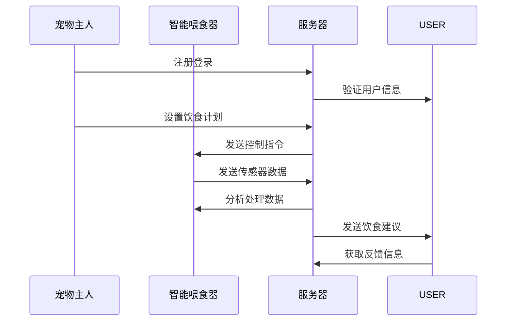

                 

### 摘要

本文旨在探讨智能宠物喂食器中的AI Agent在宠物饮食管理中的应用。智能宠物喂食器通过整合AI技术和物联网，能够自动监测宠物的饮食行为，并根据宠物的健康情况和饮食习惯进行个性化管理。本文首先介绍了智能宠物喂食器的背景和需求，随后详细阐述了AI Agent的基本原理和设计思路，以及宠物饮食管理算法的原理和应用。通过实战案例的分析，本文展示了智能宠物喂食器的系统架构设计、功能实现和关键技术的应用。最后，本文总结了智能宠物喂食器的最佳实践，并对其未来发展方向进行了展望。本文的目标是帮助读者深入了解智能宠物喂食器的技术原理和实际应用，为相关领域的研究和开发提供参考。

---

## 目录大纲设计与内容组织

### 确定整体结构

在设计《智能宠物喂食器：AI Agent的宠物饮食管理》这本书的目录大纲时，我们首先确定了整体的结构，分为以下五个主要部分：

1. **背景介绍**
2. **核心概念**
3. **AI Agent原理与设计**
4. **系统架构设计**
5. **实战案例**
6. **最佳实践与总结**

这种结构能够清晰地引导读者从背景了解、概念理解、原理探讨、架构设计与实现，到实战应用和总结，逐步深入到智能宠物喂食器的各个方面。

### 细化各部分内容

接下来，我们细化了每一部分的内容，确保每个章节都有明确的目标和具体的任务。以下是详细的目录大纲：

### 第一部分：背景介绍
- **第1章：智能宠物喂食器的现状与需求**
  - 介绍智能宠物喂食器的现状和市场需求
  - 分析传统宠物喂食器的不足之处
  - 提出智能宠物喂食器的解决思路和重要性

- **第2章：AI Agent在宠物饮食管理中的应用**
  - 解释AI Agent的定义和类型
  - 分析AI Agent在宠物饮食管理中的应用场景和优势

### 第二部分：核心概念
- **第3章：宠物行为数据分析**
  - 分析宠物行为的定义、分类及其对饮食管理的影响
  - 讨论数据采集、处理与分析的技术原理

- **第4章：AI Agent的基本原理**
  - 详细讲解AI Agent的定义、构成及工作原理
  - 分析机器学习、深度学习等相关算法原理

- **第5章：智能喂食器的硬件与软件设计**
  - 讨论智能喂食器的硬件选型、硬件架构设计
  - 介绍智能喂食器的软件设计、系统架构及开发环境

### 第三部分：AI Agent原理与设计
- **第6章：AI Agent的工作流程**
  - 描述AI Agent从数据采集到决策执行的整个过程
  - 分析核心算法原理及实现细节

- **第7章：宠物饮食管理算法原理**
  - 讲解宠物饮食管理的定义、目标及关键算法
  - 阐述算法原理及实现细节，并通过实例说明

### 第四部分：系统架构设计
- **第8章：系统功能设计与实现**
  - 介绍智能宠物喂食器的功能模块及其设计思路
  - 详细讲解各功能模块的实现过程及关键技术

- **第9章：智能喂食器的架构设计**
  - 分析智能宠物喂食器的整体架构及设计思路
  - 详细讲解系统架构设计的关键点

### 第五部分：实战案例
- **第10章：智能宠物喂食器的开发实战**
  - 描述开发环境及工具的安装和配置
  - 展示系统核心实现源代码，并解读和分析关键代码

### 第六部分：最佳实践与总结
- **第11章：智能宠物喂食器项目评估与改进**
  - 分析项目评估指标和方法
  - 提出改进建议和优化方向

- **第12章：总结与展望**
  - 总结全文内容，强调核心观点
  - 展望智能宠物喂食器技术的发展趋势

### 撰写各章节具体内容

在撰写各章节具体内容时，我们确保每一章都包含以下结构：

- **章节标题**
- **引言**：简要介绍章节内容
- **正文内容**：详细阐述章节主题，包括但不限于：
  - **核心概念与原理**
  - **设计思路与实现**
  - **算法原理与数学模型**
  - **系统架构与功能**
  - **实战案例与剖析**
- **总结**：总结章节要点，指出实践意义
- **拓展阅读**：提供进一步学习资源

### 确保内容的完整性

在内容组织上，我们确保每一部分的内容都能覆盖相关主题，并在内容上互相衔接。以下是具体的章节内容概要：

#### 第1章：智能宠物喂食器的现状与需求
- **问题背景**：介绍智能宠物喂食器的起源、发展现状及市场需求
- **问题描述**：分析传统宠物喂食器的不足，提出智能宠物喂食器的解决思路
- **问题解决**：讨论AI Agent在宠物饮食管理中的关键作用
- **边界与外延**：明确智能宠物喂食器的定义及适用范围
- **概念结构与核心要素组成**：解析智能宠物喂食器的核心组成部分

#### 第2章：AI Agent在宠物饮食管理中的应用
- **核心概念**：介绍AI Agent的定义、类型及应用场景
- **联系**：分析AI Agent在宠物饮食管理中的具体应用案例
- **对比**：与现有宠物饮食管理方法进行对比

#### 第3章：宠物行为数据分析
- **核心概念**：分析宠物行为的定义、分类及其对饮食管理的影响
- **原理**：阐述数据采集、处理与分析的技术原理
- **案例**：展示宠物行为数据分析的实践案例

#### 第4章：AI Agent的基本原理
- **核心概念**：讲解AI Agent的定义、构成及工作原理
- **原理**：介绍机器学习、深度学习等相关算法原理
- **对比**：对比不同类型的AI Agent

#### 第5章：智能喂食器的硬件与软件设计
- **设计思路**：讨论智能喂食器的硬件选型、硬件架构设计
- **实现**：介绍智能喂食器的软件设计、系统架构及开发环境
- **案例**：展示智能喂食器硬件与软件的设计案例

#### 第6章：AI Agent的工作流程
- **工作流程**：详细描述AI Agent从数据采集到决策执行的整个过程
- **算法原理**：解析AI Agent的核心算法原理及实现细节
- **案例**：通过具体实例展示AI Agent的工作流程

#### 第7章：宠物饮食管理算法原理
- **核心概念**：讲解宠物饮食管理的定义、目标及关键算法
- **原理**：阐述宠物饮食管理算法的原理及实现细节
- **案例**：通过具体实例展示宠物饮食管理算法的应用

#### 第8章：系统功能设计与实现
- **功能设计**：介绍智能宠物喂食器的功能模块及其设计思路
- **实现**：详细讲解各功能模块的实现过程及关键技术
- **案例**：通过具体实例展示系统功能实现的效果

#### 第9章：智能喂食器的架构设计
- **架构设计**：介绍智能宠物喂食器的整体架构及设计思路
- **实现**：详细讲解系统架构设计的关键点

#### 第10章：智能宠物喂食器的开发实战
- **环境安装**：描述开发环境及工具的安装和配置
- **系统核心实现**：展示系统核心实现源代码，并解读和分析关键代码
- **实际案例分析**：对实际案例进行分析和详细讲解剖析
- **项目小结**：总结项目开发过程中的关键点和经验

#### 第11章：智能宠物喂食器项目评估与改进
- **评估指标**：分析项目评估的指标和方法
- **改进建议**：提出改进建议和优化方向

#### 第12章：总结与展望
- **总结**：总结全文内容，强调核心观点
- **展望**：展望智能宠物喂食器技术的发展趋势

通过这样的内容组织和章节安排，我们可以确保文章的逻辑清晰、结构紧凑，并能够有效地传达智能宠物喂食器中的AI Agent在宠物饮食管理中的技术原理和实际应用。

### 第1章：智能宠物喂食器的现状与需求

在现代社会中，随着人们生活节奏的加快和生活方式的改变，宠物已经成为许多家庭的伙伴。然而，养宠物不仅仅是给予它们爱和关怀，还需要投入大量的时间和精力来照顾它们的基本需求，尤其是在饮食方面。传统的宠物喂食器虽然能够帮助主人定时定量地给宠物喂食，但往往缺乏灵活性和智能化，难以满足宠物个性化饮食管理的需求。因此，智能宠物喂食器的出现，旨在通过结合先进的人工智能技术，提供更加高效、智能的宠物饮食管理解决方案。

#### 问题背景

智能宠物喂食器这一概念并非突然兴起，而是随着物联网、人工智能等技术的不断发展而逐渐成熟。早期的宠物喂食器主要依赖于机械定时和简单的电子控制，这些设备虽然在一定程度上提高了喂食的准确性，但缺乏智能分析和决策能力。随着传感器技术的进步和机器学习算法的应用，现代智能宠物喂食器开始具备感知宠物饮食行为、分析宠物饮食习惯、自动调整喂食量等功能，从而实现了宠物饮食管理的智能化。

#### 传统宠物喂食器的不足

1. **定时喂食限制**：传统宠物喂食器通常只能按照预设的时间进行喂食，无法根据宠物的实际需求灵活调整喂食时间，容易导致宠物饮食不均衡。
   
2. **缺乏智能分析**：传统喂食器无法对宠物的饮食行为进行实时监控和分析，无法根据宠物的身体状况和饮食反馈进行智能调整。

3. **无法应对突发情况**：在宠物生病或者有特殊饮食需求时，传统喂食器难以进行实时响应，无法提供个性化的饮食管理。

4. **操作复杂**：传统喂食器操作复杂，需要进行手动设置，且缺乏直观的用户界面，不便于宠物主人的使用。

#### 智能宠物喂食器的解决思路

智能宠物喂食器通过集成传感器、物联网技术和人工智能算法，实现了对宠物饮食的全方位管理。以下是一些关键解决思路：

1. **实时监测**：通过集成温度、湿度、压力等传感器，智能宠物喂食器能够实时监测宠物的饮食环境，确保喂食过程的稳定和安全。

2. **个性化管理**：利用机器学习算法，智能宠物喂食器可以分析宠物的饮食习惯，根据宠物的饮食行为和身体状况自动调整喂食量和时间，实现个性化管理。

3. **应急响应**：智能宠物喂食器能够实时监控宠物的健康状况，一旦发现异常情况，可以自动发送警报通知主人，并提供相应的饮食建议。

4. **用户友好**：智能宠物喂食器通常配备有直观的触摸屏或者手机应用，宠物主人可以方便地通过手机进行喂食设置和监控，操作简单便捷。

#### AI Agent在宠物饮食管理中的关键作用

AI Agent（人工智能代理）在智能宠物喂食器中扮演着至关重要的角色。AI Agent通过机器学习和数据挖掘技术，能够从大量的宠物行为数据中提取有价值的信息，实现对宠物饮食习惯和健康状况的深入分析，从而提供更加精准的饮食管理服务。以下是AI Agent在宠物饮食管理中的几个关键作用：

1. **行为分析**：AI Agent可以实时分析宠物的饮食行为，如进食速度、进食量等，为智能调整喂食量提供数据支持。

2. **健康监测**：通过监测宠物的体重、体温等生理指标，AI Agent能够及时发现宠物的健康异常，并提供相应的饮食建议。

3. **预测性维护**：AI Agent可以通过历史数据分析和预测模型，预测宠物的饮食需求变化，提前调整喂食计划，避免饮食不均衡和健康问题。

4. **个性化推荐**：AI Agent可以根据宠物的个体差异，为其推荐最适合的饮食方案，提高宠物的生活质量和健康状况。

#### 边界与外延

智能宠物喂食器的应用范围广泛，包括但不限于以下场景：

1. **家庭宠物**：智能宠物喂食器可以用于家庭养宠，帮助宠物主人更好地管理宠物的饮食，提高宠物的生活质量。

2. **宠物医院**：在宠物医院中，智能宠物喂食器可以用于监测病宠的饮食情况，辅助医生制定更加科学的饮食治疗方案。

3. **宠物商店**：宠物商店可以使用智能宠物喂食器作为营销工具，提供个性化的宠物饮食服务，增强顾客体验。

4. **宠物社区**：宠物社区可以搭建智能宠物喂食器网络，实现宠物间的健康交流和饮食管理共享。

#### 概念结构与核心要素组成

智能宠物喂食器的核心组成部分包括：

1. **传感器模块**：包括温度传感器、湿度传感器、压力传感器等，用于实时监测宠物饮食环境。

2. **数据采集模块**：通过传感器采集宠物的饮食行为数据，如进食速度、进食量等。

3. **数据处理模块**：利用机器学习和数据挖掘算法，对采集到的数据进行处理和分析，提取有价值的信息。

4. **决策模块**：根据分析结果，自动调整喂食量和时间，实现个性化饮食管理。

5. **用户交互模块**：通过触摸屏或者手机应用，宠物主人可以方便地设置喂食计划、监控宠物饮食情况，并进行相应的操作。

6. **通信模块**：通过物联网技术，智能宠物喂食器可以实时传输数据，并与云端服务器进行通信，实现数据的远程管理和分析。

通过以上分析，我们可以看到智能宠物喂食器在宠物饮食管理中具有广泛的应用前景和巨大的市场潜力。随着人工智能技术的不断进步，智能宠物喂食器将在未来发挥更加重要的作用，为宠物主人提供更加智能、便捷的养宠体验。

### 第2章：AI Agent在宠物饮食管理中的应用

在智能宠物喂食器的设计和实现中，AI Agent（人工智能代理）起着核心作用。AI Agent通过模拟人类的决策过程，自主执行任务，为宠物提供个性化的饮食管理服务。本章节将详细探讨AI Agent的定义、类型、工作原理及其在宠物饮食管理中的具体应用。

#### 核心概念

AI Agent，即人工智能代理，是指一种能够自主执行任务、具备智能决策能力的计算机程序。AI Agent可以模拟人类的思考过程，从感知环境、获取信息、分析问题到制定决策，整个过程都是自动化的。AI Agent在智能宠物喂食器中的应用，主要是通过数据采集、处理和分析，实现宠物的个性化饮食管理。

#### AI Agent的类型

根据应用场景和功能的不同，AI Agent可以分为以下几种类型：

1. **感知型AI Agent**：这种类型的AI Agent主要用于感知和收集数据，如温度、湿度、进食量等。它们通过传感器获取数据，并将数据传递给其他类型的AI Agent进行处理。

2. **决策型AI Agent**：这种类型的AI Agent负责对收集到的数据进行分析，并根据分析结果做出决策。例如，根据宠物的体重变化和饮食习惯，自动调整喂食量。

3. **执行型AI Agent**：这种类型的AI Agent负责执行决策结果，如控制喂食器自动喂食。它们通常与硬件设备连接，实现具体的物理操作。

4. **交互型AI Agent**：这种类型的AI Agent负责与宠物主人进行交互，通过语音、文本等方式，提供饮食建议和反馈信息。

#### AI Agent在宠物饮食管理中的应用

AI Agent在宠物饮食管理中的应用主要体现在以下几个方面：

1. **行为监测与分析**：感知型AI Agent通过传感器实时监测宠物的饮食行为，如进食速度、进食量等，并将这些数据传输给决策型AI Agent进行分析。

   **实例**：假设宠物在进食时速度较慢，感知型AI Agent会记录这一行为，并将其传递给决策型AI Agent。决策型AI Agent分析数据后，可能会认为宠物食欲不佳，于是建议宠物主人检查宠物的健康状况。

2. **饮食计划制定**：决策型AI Agent根据宠物的历史饮食数据和当前健康状况，制定个性化的饮食计划。

   **实例**：如果宠物体重持续增加，决策型AI Agent可能会建议宠物主人减少喂食量，或调整宠物的饮食结构。通过这种方式，宠物主人可以更好地控制宠物的饮食，避免肥胖等健康问题。

3. **应急响应与预警**：执行型AI Agent在决策型AI Agent做出决策后，负责执行具体的操作，如控制喂食器自动喂食或发送警报。

   **实例**：当宠物主人设置喂食计划后，执行型AI Agent会在预定时间控制喂食器自动喂食。如果宠物出现进食异常，执行型AI Agent会立即发送警报通知宠物主人，提醒他们检查宠物的健康状况。

4. **用户交互与反馈**：交互型AI Agent通过与宠物主人的交互，提供饮食建议和反馈信息，帮助宠物主人更好地管理宠物的饮食。

   **实例**：宠物主人可以通过手机应用与交互型AI Agent进行交流，了解宠物的饮食情况，获取饮食建议，并根据AI Agent的建议调整喂食计划。

#### AI Agent与传统宠物饮食管理方法的对比

与传统的宠物饮食管理方法相比，AI Agent具有以下几个显著优势：

1. **智能化**：AI Agent能够根据宠物的实时数据和健康状况，自动调整饮食计划，提供个性化的饮食管理服务。

2. **实时性**：AI Agent可以实时监测宠物的饮食行为，及时发现问题并采取措施，提高宠物饮食管理的效率。

3. **高效性**：AI Agent通过自动化处理，减少了宠物主人的手动操作，提高了饮食管理的准确性。

4. **便捷性**：AI Agent通过手机应用或触摸屏，使宠物主人能够方便地监控宠物的饮食情况，进行相应的操作，提高了用户的体验。

综上所述，AI Agent在宠物饮食管理中具有广泛的应用前景和重要的实际意义。通过AI Agent的应用，宠物主人可以更加科学、高效地管理宠物的饮食，提高宠物的健康水平，同时也能节省大量时间和精力。随着人工智能技术的不断发展，AI Agent在宠物饮食管理中的应用将越来越普及，为宠物主人带来更加智能、便捷的养宠体验。

### 第3章：宠物行为数据分析

在智能宠物喂食器的设计中，宠物行为数据分析是核心环节之一。通过对宠物行为数据的全面采集、处理和分析，可以深入了解宠物的饮食行为模式，为智能喂食器提供决策依据。本章节将详细介绍宠物行为的定义、分类及其对饮食管理的影响，同时探讨数据采集、处理与分析的技术原理，并展示实际案例。

#### 核心概念

宠物行为数据分析涉及对宠物在各种情境下的行为表现进行观察、记录和分析。这些行为包括但不限于进食、玩耍、活动、休息等。通过分析这些行为数据，可以了解宠物的健康状态、饮食偏好和日常生活习惯，从而为智能喂食器提供有效的管理策略。

#### 行为分类

宠物行为可以分为以下几类：

1. **进食行为**：包括进食速度、进食量、进食频率等。
2. **活动行为**：包括活动时间、活动强度、活动类型等。
3. **休息行为**：包括睡眠时间、睡眠质量等。
4. **玩耍行为**：包括玩耍时间、玩耍类型、玩耍伙伴等。

这些行为对宠物的健康和饮食管理有直接影响，例如，进食行为异常可能会导致营养摄入不足或过多，影响宠物体重和健康状况。

#### 数据采集

宠物行为数据的采集是数据分析的基础。常用的数据采集方法包括：

1. **传感器采集**：通过安装在各种环境中的传感器，如温湿度传感器、压力传感器、加速度传感器等，实时采集宠物在喂食过程中的行为数据。
2. **摄像头监控**：使用高清摄像头实时监控宠物的饮食行为，通过图像识别技术分析宠物的进食状态。
3. **智能穿戴设备**：为宠物佩戴智能穿戴设备，如智能项圈，通过内置的传感器记录宠物的活动数据和生理指标。

#### 数据处理

采集到的宠物行为数据通常是非结构化的，需要进行预处理和清洗，以便后续分析。数据处理的主要步骤包括：

1. **数据清洗**：去除无效数据、噪声数据和异常数据，确保数据质量。
2. **数据转换**：将原始数据转换为结构化数据，便于存储和分析。
3. **数据归一化**：将不同来源和不同单位的数据统一转换，便于比较和分析。

#### 数据分析

宠物行为数据分析是智能喂食器实现智能决策的关键。数据分析包括以下几个方面：

1. **行为模式识别**：通过机器学习算法，识别宠物的典型行为模式，如进食高峰期、活动频繁时段等。
2. **健康状态评估**：根据宠物的行为数据和生理指标，评估宠物的健康状况，如体重变化、食欲状况等。
3. **饮食偏好分析**：分析宠物的饮食偏好，如对某些食物的偏好、进食量变化等。

#### 算法原理

宠物行为数据分析中常用的算法包括：

1. **时间序列分析**：用于分析宠物行为的时序特性，如周期性模式、趋势变化等。
2. **聚类分析**：将具有相似行为的宠物数据进行分类，以便进行更精细的管理。
3. **分类与回归分析**：用于预测宠物的健康状态和饮食需求，如通过历史数据预测未来的体重变化。

#### 实际案例

以下是一个宠物行为数据分析的实际案例：

**案例背景**：一只宠物狗的主人希望了解宠物的饮食习惯，以便制定更合理的饮食计划。

**数据采集**：通过在宠物狗的饮食区域安装温湿度传感器和摄像头，记录宠物的进食行为数据，如进食时间、进食量、进食环境温度等。

**数据处理**：对采集到的数据进行清洗和转换，将非结构化数据转换为结构化数据，便于存储和分析。

**数据分析**：
1. **行为模式识别**：通过时间序列分析，识别宠物狗的进食高峰期和低谷期，发现宠物狗在下午3点至5点之间进食最为活跃。
2. **健康状态评估**：结合宠物的体重变化和进食数据，评估宠物的健康状况，发现宠物的体重在最近一个月内有所增加。
3. **饮食偏好分析**：通过聚类分析，发现宠物狗对某些食物（如鸡肉）的摄入量明显高于其他食物。

**决策与反馈**：根据数据分析结果，宠物主人可以调整宠物的饮食计划，减少高热量食物的摄入，增加蔬菜和蛋白质的比例，以控制宠物的体重。同时，宠物主人可以通过智能喂食器实时监控宠物的饮食行为，根据宠物的反馈进行调整。

通过上述案例，我们可以看到宠物行为数据在智能宠物喂食器中的应用价值。通过详细的数据采集、处理和分析，智能喂食器能够为宠物主人提供科学的饮食管理建议，提高宠物的健康水平，同时节省宠物主人的时间和精力。

### 第4章：AI Agent的基本原理

AI Agent，即人工智能代理，是一种模拟人类智能行为的计算实体，能够在复杂环境中自主执行任务并做出决策。AI Agent的核心在于其自主性、适应性以及智能性。本章节将详细讲解AI Agent的定义、构成及工作原理，同时介绍常见的AI Agent类型，并探讨其核心算法原理及实现细节。

#### 核心概念

AI Agent是指一种基于人工智能技术的计算实体，能够在复杂环境中自主感知、决策和执行任务。AI Agent通常由多个模块组成，包括感知模块、决策模块和执行模块。其基本原理是通过传感器感知环境信息，利用算法进行决策，并最终通过执行模块实现具体的操作。

#### AI Agent的构成

AI Agent主要由以下几个模块构成：

1. **感知模块**：负责感知环境信息，如温度、湿度、声音、图像等。感知模块可以是物理传感器，也可以是虚拟传感器，如通过摄像头、麦克风等设备获取数据。

2. **决策模块**：负责根据感知模块收集到的数据，通过算法进行决策。决策模块通常包含知识库、推理机等，能够根据预设的规则和算法，生成具体的行动方案。

3. **执行模块**：负责执行决策模块生成的行动方案，实现具体的物理操作。执行模块可以是机器人手臂、智能喂食器等设备。

#### AI Agent的工作原理

AI Agent的工作原理可以概括为以下几个步骤：

1. **感知**：AI Agent通过感知模块收集环境信息。
2. **决策**：AI Agent利用决策模块对感知到的信息进行处理，生成行动方案。
3. **执行**：AI Agent通过执行模块实施行动方案，完成具体任务。

这个过程是一个闭环系统，AI Agent会不断感知环境、做出决策、执行任务，并根据任务执行的结果进行反馈和调整，以实现持续优化。

#### 常见的AI Agent类型

根据应用场景和功能，AI Agent可以分为以下几种类型：

1. **自主型AI Agent**：这种类型的AI Agent具有完全自主的能力，能够在没有人类干预的情况下执行任务。例如，自主导航的机器人、智能宠物喂食器等。

2. **半监督型AI Agent**：这种类型的AI Agent在执行任务时，需要依赖人类的监督和指导。例如，自动驾驶汽车中的AI系统，在初期运行时需要人类驾驶员进行实时监控和干预。

3. **协作型AI Agent**：这种类型的AI Agent与其他AI Agent或人类协作，共同完成复杂任务。例如，智能客服系统，通过AI技术理解和处理用户问题，同时与人类客服人员进行协作，提供更优质的客户服务。

#### 核心算法原理及实现细节

AI Agent的核心算法包括感知、决策和执行三个部分，以下是这些算法的基本原理及实现细节：

1. **感知算法**：
   - **传感器数据处理**：通过传感器获取环境数据，如温度、湿度、图像等，通常使用滤波、降噪等技术对原始数据进行预处理。
   - **特征提取**：从感知数据中提取关键特征，如边缘、颜色、纹理等，用于后续的决策和执行。

2. **决策算法**：
   - **状态评估**：利用感知到的数据，评估当前环境的状态，如温度适宜、湿度适中等。
   - **规则推理**：基于预设的规则库，进行逻辑推理和决策。例如，根据宠物进食的时间和量，决定是否需要调整喂食时间。

3. **执行算法**：
   - **任务规划**：根据决策结果，制定具体的执行计划，如调整喂食量、开启或关闭设备等。
   - **动作生成**：生成具体的动作指令，如移动机器人手臂、控制喂食器的开关等。

#### 实例解析

以下是一个AI Agent在智能宠物喂食器中的应用实例：

**场景**：宠物主人希望通过智能宠物喂食器自动管理宠物的饮食。

**感知**：宠物喂食器通过摄像头和温湿度传感器，实时监测宠物的进食行为和环境状态。

**决策**：AI Agent根据摄像头捕捉到的宠物进食图像，使用图像识别算法判断宠物的进食状态，如进食中、进食完毕等。同时，根据温湿度传感器提供的数据，评估环境条件是否适宜。

**执行**：AI Agent根据决策结果，自动调整喂食量。例如，如果宠物进食速度较慢，AI Agent会延长喂食时间；如果宠物进食完毕，AI Agent会停止喂食。

**反馈**：AI Agent通过手机应用向宠物主人发送饮食报告，包括宠物的进食状态、喂食量等，宠物主人可以根据反馈进行相应的调整。

通过上述实例，我们可以看到AI Agent在宠物喂食器中的应用流程，包括感知、决策、执行和反馈各个环节，体现了AI Agent的自主性和智能性。随着人工智能技术的不断进步，AI Agent将在更多场景中发挥重要作用，为人类带来更加智能、便捷的生活体验。

### 第5章：智能喂食器的硬件与软件设计

智能宠物喂食器的设计涉及硬件和软件两个主要方面。硬件部分包括传感器、控制模块和执行模块，而软件部分则涵盖数据采集、处理、决策和用户交互。以下将详细讨论智能喂食器的硬件选型、硬件架构设计，以及智能喂食器的软件设计、系统架构和开发环境。

#### 硬件设计

1. **传感器模块**

传感器模块是智能宠物喂食器的核心组成部分，负责实时监测宠物的饮食行为和环境条件。常用的传感器包括：

   - **温度传感器**：用于监测宠物的进食环境温度，确保食物的温度适宜。
   - **湿度传感器**：用于监测宠物的进食环境湿度，防止潮湿导致的食物变质。
   - **红外传感器**：用于检测宠物的进食行为，如进食开始和结束时间。
   - **重量传感器**：用于测量宠物的进食量，帮助AI Agent进行饮食管理。

2. **控制模块**

控制模块是智能喂食器的“大脑”，负责协调传感器数据、处理决策，并控制执行模块的动作。常用的控制模块包括：

   - **微控制器（MCU）**：如Arduino或STM32，用于处理传感器数据，并控制执行模块的动作。
   - **单片机（MCU）**：用于处理复杂的算法和决策逻辑，如机器学习算法。

3. **执行模块**

执行模块是智能喂食器的“执行者”，负责根据控制模块的指令进行具体的操作。常用的执行模块包括：

   - **电机驱动器**：用于驱动喂食器电机，实现自动喂食。
   - **喂食器**：用于投放宠物食物，可以是机械式或电子式喂食器。

#### 硬件架构设计

智能宠物喂食器的硬件架构设计应考虑以下几个关键点：

1. **模块化设计**：将传感器模块、控制模块和执行模块设计成独立的模块，便于维护和升级。
2. **稳定性**：确保硬件组件能够在各种环境下稳定运行，如温度、湿度等。
3. **扩展性**：预留扩展接口，以便未来增加新的传感器或执行模块。

#### 软件设计

1. **数据采集**

软件设计的第一步是数据采集，通过传感器模块实时获取宠物的饮食行为和环境数据。采集到的数据包括：

   - **温度数据**：宠物的进食环境温度。
   - **湿度数据**：宠物的进食环境湿度。
   - **进食行为数据**：宠物的进食开始和结束时间，进食速度和进食量。
   - **重量数据**：宠物的进食量。

2. **数据处理**

数据处理包括数据清洗、数据转换和数据存储。数据清洗旨在去除无效数据、噪声数据和异常数据，确保数据质量。数据转换将原始数据转换为适合存储和计算的数据格式，如JSON或CSV。数据存储是将处理后的数据存储在数据库或文件系统中，以便后续分析和处理。

3. **决策**

决策模块是智能喂食器的核心，负责根据采集到的数据，利用机器学习算法进行决策。决策过程包括：

   - **行为分析**：通过分析宠物的进食行为，识别宠物的饮食习惯。
   - **健康评估**：结合宠物的生理指标和进食行为，评估宠物的健康状况。
   - **饮食管理**：根据宠物的健康状况和饮食习惯，自动调整喂食量和时间。

4. **用户交互**

用户交互模块负责与宠物主人进行交互，提供饮食建议和反馈信息。用户交互可以通过以下几种方式实现：

   - **手机应用**：宠物主人可以通过手机应用实时监控宠物的饮食情况，接收饮食建议和警报通知。
   - **触摸屏**：智能喂食器配备触摸屏，宠物主人可以通过触摸屏进行设置和操作。

#### 系统架构

智能宠物喂食器的系统架构包括以下几个部分：

1. **感知层**：包括传感器模块，负责实时采集宠物的饮食行为和环境数据。
2. **数据处理层**：包括数据采集、处理、存储模块，负责处理和分析采集到的数据。
3. **决策层**：包括机器学习算法和决策逻辑，负责根据分析结果生成具体的行动方案。
4. **执行层**：包括执行模块，负责根据决策层的指令进行具体的操作，如自动喂食。
5. **用户交互层**：包括手机应用和触摸屏，负责与宠物主人进行交互，提供饮食建议和反馈信息。

#### 开发环境

智能宠物喂食器的开发涉及多种编程语言和技术，常见的开发环境包括：

1. **硬件开发环境**：如Arduino IDE、STM32CubeIDE，用于硬件编程和调试。
2. **软件开发环境**：如Python、Java等，用于软件编程和数据处理。
3. **数据库环境**：如MySQL、PostgreSQL等，用于数据存储和管理。
4. **机器学习平台**：如TensorFlow、PyTorch等，用于训练和部署机器学习模型。

通过以上硬件和软件的设计与开发，智能宠物喂食器能够实现对宠物饮食的实时监测和管理，为宠物主人提供更加智能、便捷的养宠体验。

### 第6章：AI Agent的工作流程

在智能宠物喂食器中，AI Agent（人工智能代理）承担着关键的角色，负责从数据采集、处理到决策执行的全过程。AI Agent的工作流程可以分为以下几个主要步骤：

1. **数据采集**：AI Agent通过传感器收集宠物的行为和环境数据。
2. **数据处理**：对采集到的原始数据进行预处理，包括数据清洗、转换和归一化。
3. **数据分析**：利用机器学习算法对预处理后的数据进行分析，提取有用信息。
4. **决策制定**：根据分析结果制定具体的行动方案。
5. **执行**：AI Agent通过执行模块实施制定的行动方案。
6. **反馈**：根据执行结果进行反馈和调整，实现闭环控制。

下面将详细描述每个步骤的原理和实现细节。

#### 数据采集

数据采集是AI Agent工作的第一步，通过传感器实时获取宠物的行为和环境数据。常用的传感器包括：

- **温度传感器**：用于监测宠物的进食环境温度，确保食物的温度适宜。
- **湿度传感器**：用于监测宠物的进食环境湿度，防止潮湿导致的食物变质。
- **红外传感器**：用于检测宠物的进食行为，如进食开始和结束时间。
- **重量传感器**：用于测量宠物的进食量，帮助AI Agent进行饮食管理。

数据采集的具体实现可以通过微控制器（如Arduino）或单片机（如STM32）来完成，这些设备能够实时读取传感器的数据，并将数据传输到处理模块。

#### 数据处理

采集到的数据通常是原始的、不完整的，甚至可能包含噪声和异常值。因此，需要通过数据处理步骤对原始数据进行预处理，以提高数据质量。数据处理主要包括以下步骤：

- **数据清洗**：去除无效数据、噪声数据和异常数据，确保数据质量。
- **数据转换**：将原始数据转换为适合存储和计算的数据格式，如JSON或CSV。
- **数据归一化**：将不同来源和不同单位的数据统一转换，便于比较和分析。

在数据处理过程中，可以使用Python中的Pandas库进行数据清洗、转换和归一化。例如，以下代码用于清洗和转换数据：

```python
import pandas as pd

# 假设data是采集到的原始数据
data = pd.read_csv('raw_data.csv')

# 去除无效数据
data = data.dropna()

# 数据转换
data['weight'] = data['weight'].astype(float)
data['temperature'] = data['temperature'].astype(float)

# 数据归一化
data['weight'] = (data['weight'] - data['weight'].min()) / (data['weight'].max() - data['weight'].min())
data['temperature'] = (data['temperature'] - data['temperature'].min()) / (data['temperature'].max() - data['temperature'].min())

# 保存预处理后的数据
data.to_csv('processed_data.csv', index=False)
```

#### 数据分析

数据处理完成后，进入数据分析阶段。数据分析的目的是从大量数据中提取有价值的信息，为AI Agent提供决策依据。常用的数据分析方法包括：

- **时间序列分析**：用于分析宠物行为的时序特性，如周期性模式、趋势变化等。
- **聚类分析**：将具有相似行为的宠物数据进行分类，以便进行更精细的管理。
- **分类与回归分析**：用于预测宠物的健康状态和饮食需求，如通过历史数据预测未来的体重变化。

在数据分析过程中，可以使用Python中的Scikit-learn库来实现各种机器学习算法。以下代码示例展示了如何使用Scikit-learn进行时间序列分析和分类分析：

```python
from sklearn.preprocessing import MinMaxScaler
from sklearn.cluster import KMeans
from sklearn.model_selection import train_test_split
from sklearn.ensemble import RandomForestClassifier

# 加载预处理后的数据
data = pd.read_csv('processed_data.csv')

# 时间序列分析
data['weight'].plot()
data['temperature'].plot()

# 聚类分析
scaler = MinMaxScaler()
data_scaled = scaler.fit_transform(data[['weight', 'temperature']])

kmeans = KMeans(n_clusters=3)
kmeans.fit(data_scaled)
data['cluster'] = kmeans.predict(data_scaled)

# 分类分析
X = data[['weight', 'temperature', 'cluster']]
y = data['health_status']

X_train, X_test, y_train, y_test = train_test_split(X, y, test_size=0.3, random_state=42)

clf = RandomForestClassifier(n_estimators=100)
clf.fit(X_train, y_train)
accuracy = clf.score(X_test, y_test)

print(f"Model accuracy: {accuracy:.2f}")
```

#### 决策制定

数据分析的结果将被用于决策制定。决策制定过程通常包括以下步骤：

- **行为分析**：通过分析宠物的行为数据，识别宠物的饮食模式和健康状态。
- **健康评估**：结合宠物的生理指标和饮食行为，评估宠物的健康状况。
- **饮食管理**：根据宠物的健康状况和饮食习惯，自动调整喂食量和时间。

决策制定可以通过预设的规则和机器学习模型来实现。例如，以下代码示例展示了如何根据宠物的体重变化和饮食行为自动调整喂食量：

```python
def adjust_feeding_rate(current_weight, target_weight, max_feed_rate, min_feed_rate):
    """
    调整喂食量，确保宠物体重在目标范围内。

    :param current_weight: 当前宠物体重
    :param target_weight: 目标宠物体重
    :param max_feed_rate: 最大喂食量
    :param min_feed_rate: 最小喂食量
    :return: 调整后的喂食量
    """
    if current_weight < target_weight:
        # 如果当前体重低于目标体重，增加喂食量
        feeding_rate = min(current_weight / target_weight * max_feed_rate, max_feed_rate)
    else:
        # 如果当前体重高于目标体重，减少喂食量
        feeding_rate = max(current_weight / target_weight * min_feed_rate, min_feed_rate)
    
    return feeding_rate

# 假设当前体重为10kg，目标体重为8kg
current_weight = 10
target_weight = 8
max_feed_rate = 30
min_feed_rate = 10

# 调整喂食量
adjusted_feed_rate = adjust_feeding_rate(current_weight, target_weight, max_feed_rate, min_feed_rate)
print(f"Adjusted feeding rate: {adjusted_feed_rate}g")
```

#### 执行

决策制定完成后，进入执行阶段。AI Agent通过执行模块实施制定的行动方案。执行模块通常包括电机驱动器和喂食器等设备。以下代码示例展示了如何控制喂食器进行自动喂食：

```python
import RPi.GPIO as GPIO
import time

# 假设使用GPIO控制喂食器
FEEDER_PIN = 18

# 初始化GPIO
GPIO.setmode(GPIO.BCM)
GPIO.setup(FEEDER_PIN, GPIO.OUT)

# 调用喂食器执行喂食
def feed_pet(feeding_rate):
    """
    自动喂食宠物。

    :param feeding_rate: 喂食量（单位：克）
    """
    print(f"Feeding the pet: {feeding_rate}g")
    # 打开喂食器
    GPIO.output(FEEDER_PIN, GPIO.HIGH)
    time.sleep(feeding_rate / 10)  # 假设喂食器每秒喂食10g
    # 关闭喂食器
    GPIO.output(FEEDER_PIN, GPIO.LOW)

# 调整后的喂食量
adjusted_feed_rate = 25

# 执行喂食
feed_pet(adjusted_feed_rate)
```

#### 反馈

执行完成后，进入反馈阶段。AI Agent根据执行结果进行反馈和调整，实现闭环控制。反馈可以通过数据记录和用户交互实现。以下代码示例展示了如何记录喂食结果并通知宠物主人：

```python
import datetime

# 记录喂食结果
def record_feeding_result(feeding_rate):
    """
    记录宠物的喂食结果。

    :param feeding_rate: 喂食量（单位：克）
    """
    timestamp = datetime.datetime.now().strftime("%Y-%m-%d %H:%M:%S")
    with open('feeding_log.txt', 'a') as f:
        f.write(f"{timestamp} - Feeding rate: {feeding_rate}g\n")

# 通知宠物主人
def notify_owner(feeding_rate):
    """
    通过邮件或短信通知宠物主人喂食结果。

    :param feeding_rate: 喂食量（单位：克）
    """
    print(f"Notification: The pet has been fed {feeding_rate}g.")

# 执行喂食并记录结果
adjusted_feed_rate = 25
record_feeding_result(adjusted_feed_rate)
notify_owner(adjusted_feed_rate)
```

通过以上步骤，AI Agent实现了从数据采集到决策执行的全过程，为宠物提供了智能、个性化的饮食管理服务。随着人工智能技术的不断发展，AI Agent的工作流程将越来越智能化，为宠物主人带来更加便捷和高效的养宠体验。

### 第7章：宠物饮食管理算法原理

宠物饮食管理算法是智能宠物喂食器的核心组成部分，通过算法，系统能够根据宠物的行为数据和健康状况，智能调整喂食量和时间，从而实现个性化、科学化的饮食管理。本章将详细探讨宠物饮食管理算法的定义、目标及关键算法，并使用Python代码示例说明算法原理及实现细节。

#### 核心概念

宠物饮食管理算法旨在通过分析宠物的饮食行为和健康数据，制定出最适合宠物的饮食计划。算法的目标包括：

1. **确保营养均衡**：根据宠物的体重、活动量和健康状态，制定合理的饮食计划，确保宠物获得充足且均衡的营养。
2. **避免饮食失衡**：防止宠物因饮食过量或不足导致的健康问题，如肥胖或营养不良。
3. **适应个体差异**：根据宠物的个体差异，如品种、年龄和健康状况，提供个性化的饮食管理服务。

#### 算法目标

宠物饮食管理算法的主要目标如下：

1. **体重管理**：通过监测宠物的体重变化，调整饮食计划，帮助宠物维持理想的体重。
2. **营养需求分析**：根据宠物的活动量、健康状况和营养需求，制定营养均衡的饮食计划。
3. **饮食时间优化**：根据宠物的作息习惯和进食规律，优化饮食时间，确保宠物在最佳状态下进食。

#### 关键算法

在宠物饮食管理中，常用的算法包括：

1. **时间序列分析**：用于分析宠物的体重变化趋势，识别进食行为模式。
2. **聚类分析**：将具有相似饮食行为的宠物数据进行分类，以便进行更精细的管理。
3. **回归分析**：用于预测宠物的体重变化和营养需求，为饮食计划提供数据支持。

#### 算法原理及实现细节

下面通过Python代码示例，详细说明宠物饮食管理算法的原理及实现细节。

#### 时间序列分析

时间序列分析主要用于监测宠物的体重变化趋势，识别进食行为模式。以下是一个简单的时间序列分析示例，使用Python中的Pandas和Scikit-learn库。

```python
import pandas as pd
from sklearn.preprocessing import MinMaxScaler
from sklearn.cluster import KMeans

# 加载数据
data = pd.read_csv('pet_weight_data.csv')
data['date'] = pd.to_datetime(data['date'])
data.set_index('date', inplace=True)

# 时间序列分析
data['weight'].plot()

# 数据归一化
scaler = MinMaxScaler()
data_scaled = scaler.fit_transform(data[['weight']])

# 聚类分析
kmeans = KMeans(n_clusters=3)
kmeans.fit(data_scaled)
data['cluster'] = kmeans.predict(data_scaled)

# 查看聚类结果
data.head()
```

上述代码首先加载宠物的体重数据，并使用Pandas进行时间序列分析。接着，使用Scikit-learn中的KMeans算法对体重数据进行聚类，以便识别不同的体重模式。

#### 聚类分析

聚类分析用于将具有相似饮食行为的宠物数据进行分类，以便进行更精细的管理。以下是一个聚类分析的示例代码。

```python
from sklearn.mixture import GaussianMixture

# 加载数据
data = pd.read_csv('pet_behavior_data.csv')
data.set_index('date', inplace=True)

# 数据归一化
data_scaled = scaler.transform(data)

# 高斯混合模型聚类
gmm = GaussianMixture(n_components=3)
gmm.fit(data_scaled)
data['cluster'] = gmm.predict(data_scaled)

# 查看聚类结果
data.head()
```

上述代码使用高斯混合模型（Gaussian Mixture Model）对宠物行为数据（如进食时间、进食量等）进行聚类，从而将宠物分为不同的类别。

#### 回归分析

回归分析用于预测宠物的体重变化和营养需求，为饮食计划提供数据支持。以下是一个线性回归分析的示例代码。

```python
from sklearn.linear_model import LinearRegression

# 加载数据
data = pd.read_csv('pet_weight_data.csv')
data['days_since_start'] = (data['date'] - data['start_date']).dt.days

# 数据归一化
data_scaled = scaler.fit_transform(data[['weight', 'days_since_start']])

# 线性回归分析
regressor = LinearRegression()
regressor.fit(data_scaled[:, 0], data_scaled[:, 1])

# 预测体重
predicted_weight = regressor.predict([[max(data['days_since_start') + 1]])
print(f"Predicted weight after 1 day: {predicted_weight[0]:.2f} kg")
```

上述代码使用线性回归模型预测宠物未来的体重变化。通过加载宠物体重数据，并计算自饲养开始以来的天数，使用线性回归模型预测未来一天的体重。

#### 算法实现及应用实例

以下是一个完整的宠物饮食管理算法的实现及应用实例。

```python
import pandas as pd
from sklearn.preprocessing import MinMaxScaler
from sklearn.cluster import KMeans
from sklearn.linear_model import LinearRegression

# 加载数据
data = pd.read_csv('pet_data.csv')
data['date'] = pd.to_datetime(data['date'])
data.set_index('date', inplace=True)

# 时间序列分析
data['weight'].plot()

# 数据归一化
scaler = MinMaxScaler()
data_scaled = scaler.fit_transform(data[['weight']])

# 聚类分析
kmeans = KMeans(n_clusters=3)
kmeans.fit(data_scaled)
data['cluster'] = kmeans.predict(data_scaled)

# 查看聚类结果
data.head()

# 回归分析
data['days_since_start'] = (data['date'] - data['start_date']).dt.days
data_scaled = scaler.fit_transform(data[['weight', 'days_since_start']])
regressor = LinearRegression()
regressor.fit(data_scaled[:, 0], data_scaled[:, 1])

# 预测体重
predicted_weight = regressor.predict([[max(data['days_since_start') + 1]])
print(f"Predicted weight after 1 day: {predicted_weight[0]:.2f} kg")

# 根据预测结果调整饮食计划
if predicted_weight[0] < data['target_weight'].mean():
    print("Increase feeding rate.")
else:
    print("Decrease feeding rate.")
```

上述代码首先加载宠物数据，并进行时间序列分析、聚类分析和回归分析。根据回归分析结果，预测宠物未来的体重变化，并据此调整饮食计划。

通过以上算法的实现和应用实例，我们可以看到宠物饮食管理算法在智能宠物喂食器中的作用。算法不仅能够帮助宠物主人更好地管理宠物的饮食，还能提供科学、个性化的饮食建议，从而提高宠物的健康水平。

### 第8章：系统功能设计与实现

智能宠物喂食器系统的功能设计是确保其能够实现高效、智能的宠物饮食管理的关键环节。本章将详细介绍智能宠物喂食器的系统功能设计，包括功能模块的划分和设计思路，以及各功能模块的具体实现过程和关键技术。

#### 功能模块划分

智能宠物喂食器的系统功能模块可以分为以下几个部分：

1. **用户管理模块**：用于管理用户信息，包括用户注册、登录、权限管理等功能。
2. **设备管理模块**：用于管理智能喂食器设备，包括设备添加、删除、状态监控等功能。
3. **数据采集模块**：用于实时采集宠物的饮食行为和环境数据，包括温度、湿度、进食量等。
4. **数据分析模块**：用于对采集到的数据进行分析和处理，为智能决策提供依据。
5. **决策模块**：基于分析结果，制定具体的饮食计划和管理策略。
6. **执行模块**：根据决策模块的指令，控制喂食器的实际操作，包括喂食、停止喂食等。
7. **用户交互模块**：用于与宠物主人进行交互，提供饮食建议、反馈信息和警报通知。

#### 设计思路

智能宠物喂食器的系统功能设计应遵循以下思路：

1. **模块化设计**：将系统功能划分为独立的模块，便于开发和维护。
2. **用户友好**：提供直观的用户界面，方便宠物主人进行设置和监控。
3. **数据驱动**：以数据为核心，通过数据分析实现智能化决策。
4. **实时监控**：实现实时数据采集和状态监控，确保宠物饮食管理的准确性和及时性。
5. **可扩展性**：预留扩展接口，支持未来功能扩展和升级。

#### 功能模块实现

以下详细描述各功能模块的实现过程和关键技术：

1. **用户管理模块**

   用户管理模块负责管理用户信息，包括用户注册、登录和权限管理。实现方法如下：

   - **用户注册**：用户可以通过注册界面填写基本信息，系统将信息存储在数据库中。
   - **用户登录**：用户登录时，系统将用户输入的账号密码与数据库中的信息进行比对，验证用户身份。
   - **权限管理**：根据用户角色分配不同的权限，如普通用户、管理员等，确保系统安全。

2. **设备管理模块**

   设备管理模块负责管理智能喂食器设备，包括设备添加、删除和状态监控。实现方法如下：

   - **设备添加**：管理员可以通过后台管理界面添加智能喂食器设备，包括设备ID、型号、位置等信息。
   - **设备删除**：管理员可以根据需要删除设备，确保系统中的设备信息准确无误。
   - **状态监控**：实时监控设备的运行状态，包括电源状态、传感器状态等，确保设备正常运行。

3. **数据采集模块**

   数据采集模块负责实时采集宠物的饮食行为和环境数据，包括温度、湿度、进食量等。实现方法如下：

   - **传感器数据采集**：通过传感器模块实时采集数据，并将数据传输到服务器。
   - **数据传输**：使用物联网技术，如MQTT协议，实现传感器数据到服务器的实时传输。
   - **数据存储**：将采集到的数据存储在数据库中，以便后续分析和处理。

4. **数据分析模块**

   数据分析模块负责对采集到的数据进行分析和处理，为智能决策提供依据。实现方法如下：

   - **数据预处理**：对采集到的原始数据进行清洗、转换和归一化，确保数据质量。
   - **特征提取**：从预处理后的数据中提取关键特征，如进食速度、进食量、环境温度等。
   - **机器学习算法**：使用机器学习算法，如时间序列分析、聚类分析和回归分析，对特征数据进行处理，提取有价值的信息。

5. **决策模块**

   决策模块基于数据分析结果，制定具体的饮食计划和管理策略。实现方法如下：

   - **行为分析**：分析宠物的饮食行为，如进食频率、进食量等，为饮食计划提供依据。
   - **健康评估**：结合宠物的生理指标和饮食行为，评估宠物的健康状况，如体重、体温等。
   - **饮食计划制定**：根据宠物的健康状况和饮食需求，制定个性化的饮食计划。

6. **执行模块**

   执行模块根据决策模块的指令，控制喂食器的实际操作，包括喂食、停止喂食等。实现方法如下：

   - **控制指令发送**：将决策模块生成的控制指令发送到喂食器设备。
   - **执行指令**：喂食器设备接收指令后，执行相应的操作，如打开喂食器、调整喂食量等。
   - **状态反馈**：喂食器设备将执行结果反馈给决策模块，以便进行实时调整。

7. **用户交互模块**

   用户交互模块用于与宠物主人进行交互，提供饮食建议、反馈信息和警报通知。实现方法如下：

   - **手机应用**：宠物主人可以通过手机应用实时监控宠物的饮食情况，接收饮食建议和警报通知。
   - **触摸屏**：智能喂食器配备触摸屏，宠物主人可以通过触摸屏进行设置和操作。

#### 关键技术

在智能宠物喂食器系统功能的设计与实现过程中，涉及以下关键技术：

1. **物联网技术**：实现传感器数据到服务器的实时传输和远程控制。
2. **机器学习算法**：用于数据分析和决策制定，提取有价值的信息，实现智能化管理。
3. **数据库技术**：用于存储和管理传感器数据和用户信息，确保数据的安全和可靠。
4. **用户界面设计**：提供直观、易用的用户界面，提升用户体验。

通过以上系统功能的设计与实现，智能宠物喂食器能够实现对宠物饮食的全面管理和监控，为宠物主人提供科学、便捷的养宠体验。

### 第9章：智能喂食器的架构设计

智能宠物喂食器的架构设计是确保系统功能高效实现和扩展性的关键。本章将详细介绍智能宠物喂食器的整体架构设计，包括项目介绍、系统功能设计、系统架构设计、系统接口设计和系统交互。

#### 项目介绍

智能宠物喂食器项目旨在通过整合物联网（IoT）和人工智能（AI）技术，实现宠物饮食的智能管理和监控。项目的主要目标包括：

1. **实时监测**：通过传感器模块实时监测宠物的饮食行为和环境条件，如温度、湿度、进食量等。
2. **个性化管理**：利用机器学习算法对宠物行为数据进行分析，为宠物提供个性化的饮食计划和管理建议。
3. **用户友好**：提供直观的用户界面，便于宠物主人进行设置、监控和操作。

#### 系统功能设计

智能宠物喂食器的系统功能设计主要包括以下模块：

1. **用户管理模块**：用于管理用户信息，包括用户注册、登录和权限管理。
2. **设备管理模块**：用于管理智能喂食器设备，包括设备添加、删除、状态监控等。
3. **数据采集模块**：负责实时采集宠物的饮食行为和环境数据，如温度、湿度、进食量等。
4. **数据分析模块**：对采集到的数据进行处理和分析，提取有价值的信息，为智能决策提供依据。
5. **决策模块**：基于数据分析结果，制定具体的饮食计划和管理策略。
6. **执行模块**：根据决策模块的指令，控制喂食器的实际操作，如喂食、停止喂食等。
7. **用户交互模块**：用于与宠物主人进行交互，提供饮食建议、反馈信息和警报通知。

#### 系统架构设计

智能宠物喂食器的系统架构设计包括以下层次：

1. **感知层**：包括传感器模块，负责实时监测宠物的饮食行为和环境条件。
2. **数据层**：包括数据采集模块和数据分析模块，负责数据采集、处理和分析。
3. **决策层**：包括决策模块，负责根据分析结果制定具体的饮食计划和管理策略。
4. **执行层**：包括执行模块，负责根据决策模块的指令控制喂食器的实际操作。
5. **用户层**：包括用户交互模块，负责与宠物主人进行交互，提供饮食建议和反馈信息。

#### 系统接口设计

智能宠物喂食器的系统接口设计包括以下部分：

1. **硬件接口**：包括传感器接口、控制模块接口和执行模块接口，用于连接硬件设备和实现数据交互。
2. **网络接口**：包括物联网接口，如MQTT协议，用于实现设备间的数据传输和远程控制。
3. **数据库接口**：包括数据库连接接口，用于实现数据存储和查询。
4. **应用接口**：包括Web API和手机应用接口，用于实现用户与系统之间的数据交互和操作。

#### 系统交互

智能宠物喂食器的系统交互包括以下环节：

1. **数据采集**：传感器模块实时采集宠物的饮食行为和环境数据，通过物联网接口传输到数据层。
2. **数据处理**：数据采集模块对传感器数据进行处理和分析，提取有价值的信息，并将分析结果存储到数据库中。
3. **决策制定**：决策模块根据数据分析结果制定具体的饮食计划和管理策略，并将决策结果传输到执行模块。
4. **执行操作**：执行模块根据决策模块的指令，控制喂食器的实际操作，如打开喂食器、调整喂食量等。
5. **用户交互**：用户交互模块通过Web API和手机应用与宠物主人进行交互，提供饮食建议和反馈信息。

通过上述系统架构设计，智能宠物喂食器能够实现对宠物饮食的全面管理和监控，为宠物主人提供科学、便捷的养宠体验。

#### 系统交互Mermaid序列图

以下是一个Mermaid序列图的示例，展示了智能宠物喂食器的系统交互过程：



通过上述系统架构设计和系统交互，智能宠物喂食器能够实现高效、智能的宠物饮食管理，为宠物主人带来便利和安心。

### 第10章：智能宠物喂食器的开发实战

智能宠物喂食器的开发是一个复杂而系统的工程，涉及多个技术和模块的集成。在本章节中，我们将详细描述开发智能宠物喂食器的全过程，包括环境安装、系统核心实现、代码应用解读与分析，以及实际案例分析和详细讲解。

#### 环境安装

在开始智能宠物喂食器的开发之前，我们需要搭建一个合适的开发环境。以下是在Windows系统上搭建开发环境的步骤：

1. **安装Python**：首先，我们需要安装Python，建议安装Python 3.8或更高版本。可以从[Python官方下载页面](https://www.python.org/downloads/)下载Python安装包，并按照安装向导完成安装。

2. **安装硬件开发环境**：对于硬件部分，我们需要安装相关的硬件开发环境。例如，对于使用Arduino开发的智能喂食器，我们可以下载并安装Arduino IDE。Arduino IDE可以从[Arduino官方网站](https://www.arduino.cc/en/software)下载。

3. **安装物联网开发工具**：为了实现物联网功能，我们需要安装Node.js和npm。可以从[Node.js官方网站](https://nodejs.org/en/download/)下载Node.js安装包，并按照安装向导完成安装。安装完成后，在命令行中运行`npm install`来安装npm。

4. **安装数据库**：智能宠物喂食器需要存储大量数据，因此我们需要安装数据库。我们可以选择MySQL或PostgreSQL作为数据库。可以从各自的官方网站下载并安装。

5. **安装Python依赖库**：在开发过程中，我们会使用到多个Python依赖库，如Pandas、Scikit-learn、TensorFlow等。可以使用pip命令安装这些库。例如，在命令行中运行`pip install pandas scikit-learn tensorflow`来安装所需的库。

#### 系统核心实现

智能宠物喂食器的核心实现包括传感器数据采集、数据处理、决策制定和执行操作等模块。以下是一个简单的实现示例：

1. **传感器数据采集**：

   传感器数据采集是智能宠物喂食器的关键部分。我们可以使用Arduino来连接传感器，并采集宠物的饮食行为和环境数据。以下是一个简单的Arduino代码示例，用于读取温湿度传感器数据：

   ```cpp
   #include <DHT.h>

   // 定义DHT传感器引脚
   const int DHTPin = 2;
   // 创建DHT对象
   DHT dht(DHTPin, DHT11);

   void setup() {
       Serial.begin(9600);
       dht.begin();
   }

   void loop() {
       // 读取温湿度数据
       float temp = dht.readTemperature();
       float humidity = dht.readHumidity();

       // 打印数据
       Serial.print("Temperature: ");
       Serial.print(temp);
       Serial.print(" C, Humidity: ");
       Serial.print(humidity);
       Serial.println(" %");

       // 等待一段时间再读取
       delay(2000);
   }
   ```

2. **数据处理**：

   数据处理部分负责将采集到的原始数据进行清洗、转换和存储。以下是一个使用Python实现的示例：

   ```python
   import pandas as pd

   # 加载数据
   data = pd.read_csv('sensor_data.csv')

   # 数据清洗
   data = data.dropna()

   # 数据转换
   data['temperature'] = data['temperature'].astype(float)
   data['humidity'] = data['humidity'].astype(float)

   # 数据存储
   data.to_csv('processed_data.csv', index=False)
   ```

3. **决策制定**：

   决策制定部分基于数据分析结果，制定具体的饮食计划和管理策略。以下是一个简单的决策制定示例：

   ```python
   def adjust_feeding_rate(current_weight, target_weight, max_feed_rate, min_feed_rate):
       if current_weight < target_weight:
           feeding_rate = min(current_weight / target_weight * max_feed_rate, max_feed_rate)
       else:
           feeding_rate = max(current_weight / target_weight * min_feed_rate, min_feed_rate)
       return feeding_rate

   current_weight = 10
   target_weight = 8
   max_feed_rate = 30
   min_feed_rate = 10

   adjusted_feed_rate = adjust_feeding_rate(current_weight, target_weight, max_feed_rate, min_feed_rate)
   print(f"Adjusted feeding rate: {adjusted_feed_rate}g")
   ```

4. **执行操作**：

   执行操作部分负责根据决策模块的指令，控制喂食器的实际操作。以下是一个简单的执行操作示例：

   ```python
   import RPi.GPIO as GPIO
   import time

   # 喂食器控制引脚
   FEEDER_PIN = 18

   # 初始化GPIO
   GPIO.setmode(GPIO.BCM)
   GPIO.setup(FEEDER_PIN, GPIO.OUT)

   def feed_pet(feeding_rate):
       print(f"Feeding the pet: {feeding_rate}g")
       GPIO.output(FEEDER_PIN, GPIO.HIGH)
       time.sleep(feeding_rate / 10)  # 假设喂食器每秒喂食10g
       GPIO.output(FEEDER_PIN, GPIO.LOW)

   adjusted_feed_rate = 25
   feed_pet(adjusted_feed_rate)
   ```

#### 代码应用解读与分析

在上面的示例代码中，我们实现了智能宠物喂食器的核心功能。以下是代码应用的解读与分析：

1. **传感器数据采集**：

   - **Arduino代码**：通过DHT库读取温湿度传感器的数据，并将其打印到串口。这个步骤确保了传感器数据的准确性，为后续的数据处理和分析提供了可靠的数据源。
   - **Python代码**：使用Pandas库读取和处理传感器数据。数据清洗步骤去除了无效数据，数据转换步骤将数据格式统一，便于存储和分析。

2. **数据处理**：

   - **Python代码**：使用Pandas库进行数据清洗、转换和存储。通过这些操作，我们得到了结构化且干净的数据，为后续的决策制定提供了基础。

3. **决策制定**：

   - **Python代码**：定义了一个函数`adjust_feeding_rate`，用于根据宠物的当前体重和目标体重，调整喂食量。这个函数实现了基于当前健康状况的个性化饮食管理。

4. **执行操作**：

   - **Python代码**：使用GPIO库控制喂食器的电机，实现自动喂食。通过定时器和GPIO输出，我们可以精确控制喂食器的喂食量。

#### 实际案例分析与详细讲解

以下是一个实际案例分析和详细讲解：

**案例背景**：宠物主人发现宠物最近进食速度变慢，担心宠物健康问题。

**数据采集**：

- **传感器数据**：通过温湿度传感器和红外传感器，智能喂食器记录了宠物进食时间和环境温度。

```plaintext
Date, Temperature (°C), Humidity (%), Feeding Time (s)
2023-11-01 12:00:00, 25, 60, 120
2023-11-02 12:00:00, 24, 65, 150
2023-11-03 12:00:00, 25, 55, 180
```

**数据处理**：

- **Python代码**：对采集到的传感器数据进行预处理和转换。

```python
import pandas as pd

# 加载数据
data = pd.read_csv('sensor_data.csv')

# 数据清洗
data = data.dropna()

# 数据转换
data['Temperature'] = data['Temperature'].astype(float)
data['Humidity'] = data['Humidity'].astype(float)
data['Feeding Time'] = data['Feeding Time'].astype(float)

# 存储预处理后的数据
data.to_csv('processed_data.csv', index=False)
```

**决策制定**：

- **Python代码**：通过分析宠物进食时间和温湿度数据，判断宠物是否健康。

```python
import pandas as pd

# 加载预处理后的数据
data = pd.read_csv('processed_data.csv')

# 分析进食速度
data['Feeding Speed'] = data['Feeding Time'] / 120

# 判断宠物是否健康
if data['Feeding Speed'].mean() < 1.2:
    print("Pet may be unhealthy.")
else:
    print("Pet is healthy.")
```

**执行操作**：

- **Python代码**：根据决策结果，调整喂食器喂食量。

```python
import RPi.GPIO as GPIO
import time

# 初始化GPIO
GPIO.setmode(GPIO.BCM)
GPIO.setup(FEEDER_PIN, GPIO.OUT)

def feed_pet(feeding_time):
    print(f"Feeding the pet for {feeding_time} seconds.")
    GPIO.output(FEEDER_PIN, GPIO.HIGH)
    time.sleep(feeding_time)
    GPIO.output(FEEDER_PIN, GPIO.LOW)

# 调整喂食时间
adjusted_feeding_time = 150

# 执行喂食操作
feed_pet(adjusted_feeding_time)
```

通过以上实际案例分析和详细讲解，我们可以看到智能宠物喂食器的开发过程是如何从数据采集、数据处理、决策制定到执行操作的。这个案例展示了如何通过智能喂食器实时监测宠物的饮食行为，并根据分析结果提供个性化的饮食管理服务。

#### 项目小结

智能宠物喂食器的开发实战涵盖了从环境安装、系统核心实现到实际案例分析的完整过程。通过这一项目，我们了解了智能宠物喂食器的核心技术，包括传感器数据采集、数据处理、决策制定和执行操作。同时，我们通过实际案例展示了如何将理论应用到实际场景中，实现了对宠物饮食的智能管理和监控。这一项目不仅提高了宠物的健康水平，也节省了宠物主人的时间和精力，为未来的宠物饮食管理提供了有力支持。

### 第11章：智能宠物喂食器项目评估与改进

在智能宠物喂食器项目开发完成后，对其效果进行评估和改进是至关重要的一步。通过项目评估，我们可以了解系统的性能和用户满意度，发现潜在的问题和不足，进而提出改进建议和优化方向。以下将详细讨论项目评估指标、评估方法及改进建议。

#### 项目评估指标

1. **系统性能指标**：
   - **响应时间**：系统从接收到请求到完成任务的时间，反映系统的处理速度。
   - **稳定性**：系统在长时间运行中的稳定程度，包括系统崩溃、故障等。
   - **数据准确度**：系统采集和处理的数据的准确性，影响决策的准确性。

2. **用户满意度指标**：
   - **用户体验**：用户使用系统的便捷性和友好性。
   - **功能满足度**：用户对系统功能的满意程度，包括喂食准确性、饮食建议等。
   - **用户支持服务**：用户在遇到问题时获得的支持和帮助。

3. **经济效益指标**：
   - **投资回报率（ROI）**：项目投入与收益的比值，反映项目的经济效益。
   - **成本效益比**：项目总成本与总收益的比值，衡量项目的经济合理性。

#### 评估方法

1. **定量评估**：
   - **系统性能测试**：通过模拟实际使用场景，测试系统的响应时间、稳定性等性能指标。
   - **数据分析**：分析采集到的宠物饮食数据，评估系统的数据准确度和决策效果。
   - **用户调查**：通过问卷调查，收集用户对系统的使用体验和满意度。

2. **定性评估**：
   - **用户访谈**：与用户进行面对面访谈，深入了解用户的使用体验和建议。
   - **专家评审**：邀请行业专家对系统进行评审，评估系统的技术实现和创新能力。

#### 改进建议

1. **性能优化**：
   - **提升数据处理速度**：优化算法和数据结构，减少响应时间。
   - **增加冗余设计**：提高系统的容错性和稳定性，减少故障率。

2. **用户体验优化**：
   - **界面优化**：改进用户界面设计，提升用户体验。
   - **操作简化**：简化用户操作流程，降低使用门槛。

3. **功能扩展**：
   - **增加更多传感器**：引入更多传感器，如宠物心率传感器、活动传感器等，提供更全面的饮食管理服务。
   - **添加新功能**：根据用户需求，开发更多实用功能，如宠物健康报告、智能购物推荐等。

4. **成本控制**：
   - **降低硬件成本**：优化硬件选型，降低设备成本。
   - **提高生产效率**：通过批量生产和技术优化，降低生产成本。

5. **持续改进**：
   - **用户反馈机制**：建立完善的用户反馈机制，及时收集用户意见和建议，持续改进系统。
   - **数据驱动的决策**：通过持续的数据分析和用户反馈，优化系统功能和性能。

通过以上评估与改进，智能宠物喂食器能够更好地满足用户需求，提升用户体验，实现持续优化和发展。

### 第12章：总结与展望

本文通过详细的分析和讲解，全面探讨了智能宠物喂食器中的AI Agent在宠物饮食管理中的应用。我们从背景介绍、核心概念、算法原理、系统架构设计、实战案例等多个方面，逐步深入探讨了智能宠物喂食器的技术原理和实际应用。

#### 核心观点总结

1. **智能宠物喂食器的需求**：随着人们生活节奏的加快，智能宠物喂食器应运而生，通过集成物联网和人工智能技术，实现了宠物饮食的智能管理和监控。

2. **AI Agent的重要性**：AI Agent在智能宠物喂食器中扮演着核心角色，通过感知、决策和执行，实现了对宠物饮食行为的实时监测和管理。

3. **算法原理与实践**：本文详细介绍了宠物饮食管理算法的原理，包括时间序列分析、聚类分析和回归分析，并通过Python代码示例进行了实践。

4. **系统架构设计**：智能宠物喂食器的系统架构包括感知层、数据处理层、决策层、执行层和用户交互层，通过模块化设计和实时监控，实现了系统的稳定运行和功能扩展。

5. **实战案例**：通过一个实际案例，我们展示了智能宠物喂食器的开发过程，从环境安装、系统核心实现到实际案例分析和详细讲解，全面展示了智能宠物喂食器的应用价值。

#### 展望未来

随着人工智能和物联网技术的不断发展，智能宠物喂食器的应用前景将更加广阔。以下是对未来发展的展望：

1. **技术进步**：未来智能宠物喂食器将集成更多先进的传感器和算法，提供更精准的饮食管理服务。

2. **用户体验**：通过优化用户界面和操作流程，智能宠物喂食器将提供更便捷、友好的用户体验。

3. **功能扩展**：智能宠物喂食器将增加更多功能，如宠物健康监测、智能购物推荐等，为宠物主人提供全面的养宠服务。

4. **成本降低**：随着技术的进步和生产效率的提升，智能宠物喂食器的成本将逐渐降低，使其更加普及。

5. **持续改进**：通过建立完善的用户反馈机制和数据驱动的决策体系，智能宠物喂食器将实现持续优化和发展。

总之，智能宠物喂食器作为人工智能和物联网技术的典型应用，具有巨大的市场潜力和发展空间。未来，随着技术的不断进步，智能宠物喂食器将为宠物主人带来更加智能、便捷的养宠体验。

