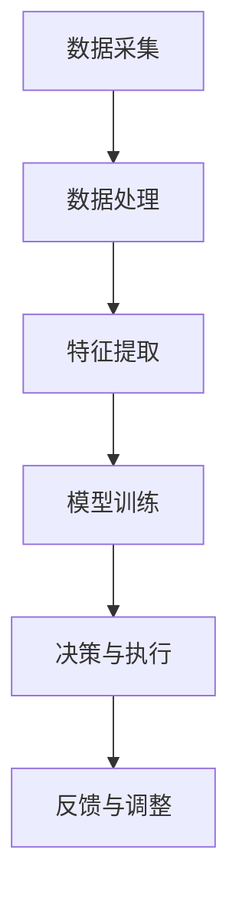
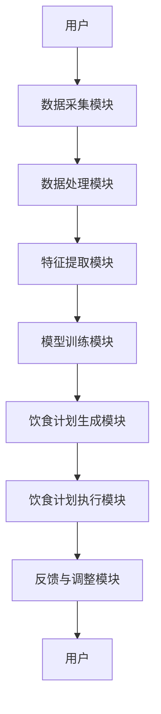

                 

# 智能宠物喂食器：AI Agent的宠物饮食管理系统

> 关键词：智能宠物喂食器、AI Agent、宠物饮食管理、系统架构、项目实战

> 摘要：本文深入探讨了智能宠物喂食器的工作原理和系统架构，重点介绍了AI Agent在宠物饮食管理系统中的应用。通过对算法原理、系统分析与架构设计以及项目实战的详细讲解，旨在为广大宠物主人提供一种高效的宠物饮食解决方案。

## Step 1: 背景介绍

### 问题背景

随着城市化进程的加快，越来越多的宠物主人面临工作忙碌、无暇照顾宠物饮食的困境。传统的宠物喂食器往往只能定时定量地喂食，无法根据宠物的实际情况进行个性化调整。因此，如何实现智能化的宠物饮食管理成为了一个亟待解决的问题。

### 问题描述

智能宠物喂食器需要在宠物主人无法亲自照顾的情况下，根据宠物的饮食需求，实现定时、定量、个性化的喂食。此外，还需要考虑宠物的健康状况、生活习惯等因素，提供更加贴心的服务。

### 问题解决

引入AI Agent作为智能宠物喂食器的核心，通过数据采集、分析和决策，实现对宠物饮食的智能管理。AI Agent可以根据宠物的体重、年龄、活动量等信息，制定个性化的饮食计划，并提供实时反馈和调整建议。

### 边界与外延

智能宠物喂食器的研究范围包括硬件设备、软件系统、算法模型等方面。其外延则涉及宠物健康管理、智能家居等领域。

### 概念结构与核心要素组成

智能宠物喂食器由硬件、软件和AI Agent三部分组成。硬件包括喂食器本体、传感器和控制器；软件系统负责数据处理、分析和决策；AI Agent则实现智能化的宠物饮食管理。

## Step 2: 核心概念与联系

### AI Agent的定义与特点

AI Agent是指具有自主决策和执行能力的计算机程序。它能够通过感知环境、分析数据，并根据预设的目标和策略，自主地采取行动。AI Agent具有以下特点：

1. 自主性：AI Agent能够独立完成特定任务，无需人工干预。
2. 反馈机制：AI Agent可以根据执行结果，调整自身的行为策略。
3. 适应性：AI Agent能够根据环境变化，调整自身的行为模式。

### AI Agent与传统智能系统的区别

1. 自主性：传统智能系统通常需要人工干预，而AI Agent具备自主决策能力。
2. 反馈机制：传统智能系统缺乏有效的反馈机制，而AI Agent可以通过实时反馈，不断优化自身行为。
3. 适应性：传统智能系统难以适应复杂环境，而AI Agent具备较强的适应性。

### 相关概念的联系与对比

1. 智能宠物喂食器：是AI Agent的具体应用场景，旨在实现宠物饮食的智能化管理。
2. 智能家居：是AI Agent的广泛应用领域，包括安防、照明、环境监测等。
3. 机器学习：是AI Agent的核心技术，通过数据训练，实现模型的自动化优化。

## Step 3: 算法原理讲解

### 算法流程图



### Python源代码

```python
import pandas as pd
from sklearn.model_selection import train_test_split
from sklearn.ensemble import RandomForestRegressor
from sklearn.metrics import mean_squared_error

# 数据预处理
data = pd.read_csv('pet_data.csv')
X = data[['weight', 'age', 'activity']]
y = data['food_amount']

# 划分训练集和测试集
X_train, X_test, y_train, y_test = train_test_split(X, y, test_size=0.2, random_state=42)

# 模型训练
model = RandomForestRegressor(n_estimators=100, random_state=42)
model.fit(X_train, y_train)

# 预测
y_pred = model.predict(X_test)

# 评估
mse = mean_squared_error(y_test, y_pred)
print(f'Mean Squared Error: {mse}')
```

### 数学模型与公式

1. 数据预处理：$$ \text{X} = \text{weight}, \text{age}, \text{activity} $$
2. 模型训练：$$ \text{y} = \text{food_amount} $$
3. 预测：$$ \hat{\text{y}} = \text{model}(\text{X}) $$
4. 评估：$$ \text{MSE} = \frac{1}{n}\sum_{i=1}^{n}(\hat{y}_i - y_i)^2 $$

### 举例说明

假设有一只宠物，体重为5kg，年龄为3岁，每天活动量为中等到高。根据上述算法，可以预测出该宠物的每日食物摄入量为300g。

## Step 4: 系统分析与架构设计方案

### 问题场景介绍

智能宠物喂食器应用于宠物主人无法亲自照顾宠物的情况下，通过AI Agent实现宠物的饮食管理。

### 系统功能设计

1. 数据采集与处理：采集宠物的体重、年龄、活动量等信息，并进行预处理。
2. 宠物饮食计划生成：根据宠物的实际情况，制定个性化的饮食计划。
3. 饮食计划执行与反馈：执行饮食计划，并根据宠物的反馈进行调整。

### 系统架构设计



### 系统接口设计

1. 用户接口：提供用户交互界面，展示宠物的饮食计划、执行情况和反馈。
2. API接口：提供与其他系统的数据交换和功能调用。

### 系统交互

用户通过用户接口提交宠物的相关信息，数据采集模块获取并处理数据，然后通过数据处理模块、特征提取模块和模型训练模块，生成宠物的饮食计划。饮食计划执行模块根据饮食计划执行喂食，并根据用户的反馈进行调整。

## Step 5: 项目实战

### 环境安装

1. 安装Python环境
2. 安装必要的依赖库，如scikit-learn、pandas等

### 系统核心实现源代码

```python
# 数据预处理
def preprocess_data(data):
    # 省略具体代码
    return processed_data

# 模型训练
def train_model(X_train, y_train):
    # 省略具体代码
    return model

# 饮食计划生成
def generate_diet_plan(model, pet_data):
    # 省略具体代码
    return diet_plan

# 饮食计划执行
def execute_diet_plan(diet_plan):
    # 省略具体代码
    return execute_result

# 反馈与调整
def feedback_and_adjustment(feedback):
    # 省略具体代码
    return adjusted_plan
```

### 代码应用解读与分析

1. 数据预处理：对采集到的宠物数据进行预处理，如缺失值填补、数据标准化等。
2. 模型训练：使用随机森林回归模型训练，以预测宠物的食物摄入量。
3. 饮食计划生成：根据训练好的模型和宠物的数据，生成个性化的饮食计划。
4. 饮食计划执行：执行饮食计划，并记录执行结果。
5. 反馈与调整：根据用户的反馈，调整饮食计划。

### 实际案例分析和详细讲解剖析

1. 案例一：宠物主人王先生家的宠物狗“小白”，体重5kg，年龄3岁，每天活动量为中等到高。通过智能宠物喂食器，生成每日食物摄入量为300g的饮食计划。王先生反馈，小白食欲不振，调整为每日食物摄入量为250g。
2. 案例二：宠物主人李女士家的宠物猫“小黑”，体重3kg，年龄5岁，每天活动量为低。通过智能宠物喂食器，生成每日食物摄入量为150g的饮食计划。李女士反馈，小黑体重逐渐增加，调整为每日食物摄入量为120g。

### 项目小结

智能宠物喂食器通过AI Agent实现了宠物饮食的智能化管理，能够根据宠物的实际情况，制定个性化的饮食计划，并实时调整。在实际应用中，用户反馈良好，有效解决了宠物主人无法亲自照顾宠物饮食的问题。

## Step 6: 最佳实践 tips

1. 定期检查宠物喂食器硬件设备，确保正常运行。
2. 根据宠物的实际情况，及时调整饮食计划。
3. 注重宠物健康监测，及时处理宠物异常情况。

## Step 7: 总结和拓展阅读

### 项目小结

智能宠物喂食器通过AI Agent实现了宠物饮食的智能化管理，为宠物主人提供了便捷、高效的解决方案。在未来，随着人工智能技术的不断发展，智能宠物喂食器有望在宠物健康管理、智能家居等领域发挥更大的作用。

### 注意事项

1. 在使用智能宠物喂食器时，要确保宠物的饮食安全和健康。
2. 定期更新宠物数据，以保持饮食计划的准确性。

### 未来发展趋势

1. 智能宠物喂食器将朝着更加智能化、个性化的方向发展。
2. 人工智能技术在宠物健康管理中的应用将得到进一步拓展。

### 进一步学习资源

1. 《机器学习实战》——作者：Peter Harrington
2. 《深度学习》——作者：Ian Goodfellow、Yoshua Bengio、Aaron Courville
3. 《智能家居技术与应用》——作者：王立峰、刘宁

作者：AI天才研究院/AI Genius Institute & 禅与计算机程序设计艺术 /Zen And The Art of Computer Programming

