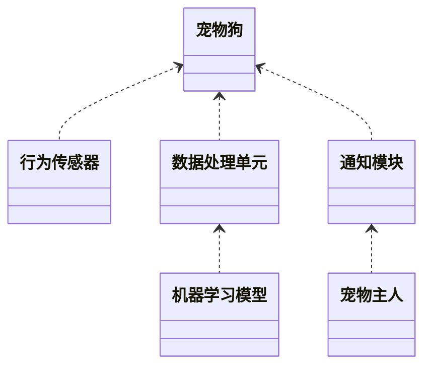
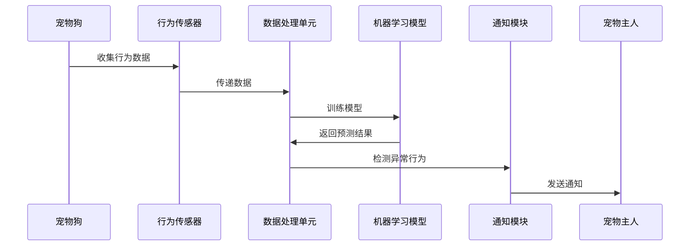

                 

### 引言

在当今快速发展的科技时代，人工智能（AI）已经成为驱动创新的重要力量。从自动驾驶汽车到智能家居，AI正在逐渐改变我们的生活方式。在这样的背景下，智能宠物屋作为一个新兴领域，引起了广泛关注。本文将深入探讨智能宠物屋中的关键组成部分——AI Agent，以及如何通过AI Agent对宠物行为进行深入分析与训练。

### 1. 背景介绍

#### 1.1 智能宠物屋的概念与重要性

智能宠物屋是一种结合了传感器技术、物联网（IoT）和人工智能的宠物管理系统。它的主要功能是实时监控宠物的行为和健康状况，并提供必要的干预措施。例如，当宠物生病或受伤时，智能宠物屋可以自动发送警报通知主人。此外，智能宠物屋还能根据宠物的行为习惯调整环境参数，如温度、湿度等，以提高宠物的舒适度。

#### 1.1.1 智能宠物屋的历史与发展

智能宠物屋的概念最早可以追溯到20世纪末。当时，一些科学家和工程师开始尝试将传感器和计算机技术应用于宠物护理。然而，由于技术限制，这些早期尝试并没有得到广泛推广。随着AI和物联网技术的快速发展，智能宠物屋逐渐从概念走向现实。

#### 1.1.2 当前智能宠物屋的应用现状

目前，智能宠物屋已经在宠物护理领域得到了广泛应用。一些高端宠物店和宠物医院已经开始使用智能宠物屋来提供更优质的宠物护理服务。此外，一些智能家居品牌也开始推出集成智能宠物屋的系列产品。

#### 1.1.3 智能宠物屋的潜在发展空间

随着AI技术的不断进步，智能宠物屋的未来发展空间非常广阔。未来，智能宠物屋有望实现更加智能化的宠物护理，如自动诊断疾病、提供个性化饮食建议等。此外，随着5G网络的普及，智能宠物屋的数据传输速度将大幅提升，从而提高系统的响应速度和准确性。

### 2. 核心概念与联系

#### 2.1 AI Agent的基本概念

AI Agent是一种能够自主执行任务的人工智能实体。它具有感知、推理和学习的能力，可以与外部环境进行交互。在智能宠物屋中，AI Agent负责对宠物行为进行实时监测和分析。

#### 2.1.1 AI Agent的定义

AI Agent可以定义为一种具有自主决策能力的人工智能实体，能够在给定环境中执行任务，并通过学习不断优化自身行为。

#### 2.1.2 AI Agent与智能宠物屋的关系

AI Agent是智能宠物屋的核心组成部分，它通过对宠物行为的分析，为智能宠物屋提供决策支持。例如，当宠物出现异常行为时，AI Agent可以自动识别并通知主人。

#### 2.2 宠物行为分析与训练

宠物行为分析是智能宠物屋的关键功能之一。通过对宠物行为的持续监测和分析，AI Agent可以识别宠物的健康状态和行为模式。

#### 2.2.1 宠物行为分析的核心要素

宠物行为分析的核心要素包括宠物的生理和行为数据。这些数据可以通过传感器实时收集，如宠物活动量、心率、体温等。

#### 2.2.2 宠物行为训练的方法与技巧

宠物行为训练的方法包括机器学习和深度学习。通过大量历史数据的训练，AI Agent可以不断优化其对宠物行为的理解和预测能力。

#### 2.2.3 宠物行为分析的挑战与应对

宠物行为分析的挑战主要包括数据质量、隐私保护和算法复杂性。针对这些挑战，研究人员正在积极探索有效的解决方案，如数据清洗技术、隐私保护算法和高效机器学习算法。

### 3. AI Agent原理讲解

#### 3.1 AI Agent的构成与功能

AI Agent通常由感知模块、推理模块和学习模块组成。感知模块负责收集环境信息，推理模块负责基于感知信息做出决策，学习模块负责不断优化自身性能。

#### 3.1.1 AI Agent的组成部分

AI Agent的组成部分包括：

- 感知模块：负责收集环境信息，如传感器数据。
- 推理模块：基于感知信息进行决策。
- 学习模块：通过反馈和训练数据优化自身性能。

#### 3.1.2 AI Agent的工作原理

AI Agent的工作原理如下：

1. 感知模块收集环境信息。
2. 推理模块分析感知信息并做出决策。
3. 学习模块根据决策结果调整自身模型。

### 4. 数学模型与数学公式讲解

#### 4.1 宠物行为分析数学模型

宠物行为分析涉及多个数学模型，如机器学习模型、深度学习模型和概率模型。以下是几种常见的数学模型及其基本原理：

- **机器学习模型**：通过学习大量历史数据，预测宠物未来的行为。
- **深度学习模型**：利用多层神经网络，对复杂行为进行建模。
- **概率模型**：通过概率分布，描述宠物行为的不确定性。

#### 4.1.1 数学公式与原理

以下是一个简单的机器学习模型的数学公式：

$$
\hat{y} = \sigma(W_1 \cdot x + b_1)
$$

其中，$\hat{y}$ 是预测结果，$x$ 是输入特征，$W_1$ 是权重，$b_1$ 是偏置，$\sigma$ 是激活函数。

#### 4.1.2 LaTeX格式数学公式示例

以下是一个LaTeX格式的数学公式示例：

$$
E = mc^2
$$

### 5. 系统分析与架构设计

#### 5.1 问题场景介绍

在智能宠物屋的应用场景中，我们需要解决的主要问题是如何实时监测和预测宠物的行为，以便及时采取必要的干预措施。以下是一个具体的问题场景：

- **场景描述**：宠物主人有一只宠物狗，平时由宠物主人亲自照顾。宠物主人希望能够在外出时通过智能宠物屋远程监控宠物的行为，并在宠物出现异常时及时收到通知。

- **系统需求分析**：智能宠物屋需要具备以下功能：

  - 实时监测宠物行为，如活动量、心率等。
  - 预测宠物的行为模式，如睡眠时间、活动时间等。
  - 当宠物出现异常行为时，自动发送通知给宠物主人。

#### 5.2 系统功能设计

智能宠物屋的系统功能设计主要包括以下几个方面：

- **宠物行为监测**：通过传感器实时收集宠物的行为数据。
- **行为模式预测**：利用机器学习算法，预测宠物的行为模式。
- **异常行为检测**：通过对比宠物当前行为与正常行为，检测异常行为。
- **通知发送**：当检测到异常行为时，自动发送通知给宠物主人。

#### 5.2.1 领域模型Mermaid类图

以下是一个智能宠物屋的领域模型Mermaid类图：



#### 5.2.2 系统架构设计Mermaid架构图

以下是一个智能宠物屋的系统架构设计Mermaid架构图：



#### 5.3 系统接口设计

智能宠物屋的系统接口设计主要包括以下方面：

- **行为数据接口**：用于接收和处理宠物行为数据。
- **预测结果接口**：用于接收和处理机器学习模型的预测结果。
- **通知接口**：用于发送通知给宠物主人。

#### 5.3.1 接口设计与实现

以下是一个简单的接口设计示例：

```python
class BehaviorDataInterface:
    def receive_data(self, data):
        pass

class PredictionResultInterface:
    def receive_result(self, result):
        pass

class NotificationInterface:
    def send_notification(self, message):
        pass
```

#### 5.3.2 系统交互Mermaid序列图

以下是一个智能宠物屋的系统交互Mermaid序列图：


### 6. 项目实战

#### 6.1 环境安装

在进行智能宠物屋项目实战之前，我们需要安装必要的软件和硬件环境。以下是安装步骤：

1. 安装操作系统：推荐使用Ubuntu 18.04或更高版本。
2. 安装Python环境：使用Python 3.7或更高版本。
3. 安装机器学习库：如Scikit-learn、TensorFlow等。
4. 安装传感器硬件：如Arduino、行为传感器等。

#### 6.2 系统核心实现源代码

智能宠物屋的核心实现包括行为数据收集、模型训练和异常行为检测。以下是系统核心实现的源代码示例：

```python
# 行为数据收集
import csv
import serial

def collect_data(port, baud_rate):
    with serial.Serial(port, baud_rate) as ser:
        data = []
        while True:
            line = ser.readline().decode('utf-8').strip()
            if line:
                data.append(line)
                print(line)
        return data

# 模型训练
from sklearn.ensemble import RandomForestClassifier

def train_model(data):
    X = [[int(x) for x in row.split(',')] for row in data[:-1]]
    y = [1 if row[-1] == '异常' else 0 for row in data[1:]]
    clf = RandomForestClassifier()
    clf.fit(X, y)
    return clf

# 异常行为检测
def detect_anomaly(clf, data):
    X = [[int(x) for x in row.split(',')] for row in data]
    predictions = clf.predict(X)
    anomalies = [row for i, row in enumerate(data) if predictions[i] == 1]
    return anomalies
```

#### 6.3 代码应用解读与分析

以上代码实现了智能宠物屋的核心功能，包括行为数据收集、模型训练和异常行为检测。以下是代码的解读与分析：

- **行为数据收集**：使用Python的`serial`库连接传感器，读取行为数据，并存储为CSV文件。
- **模型训练**：使用Scikit-learn的`RandomForestClassifier`实现机器学习模型，训练模型以预测宠物的行为。
- **异常行为检测**：使用训练好的模型对新的行为数据进行预测，并识别异常行为。

#### 6.4 实际案例分析与详细讲解

以下是一个实际案例，用于展示如何使用智能宠物屋检测宠物的异常行为：

- **案例描述**：宠物主人有一只宠物狗，平时由宠物主人亲自照顾。宠物主人希望能够在外出时通过智能宠物屋远程监控宠物的行为，并在宠物出现异常时及时收到通知。

- **案例实现**：宠物主人首先使用Arduino行为传感器收集宠物的行为数据，然后使用Python脚本训练机器学习模型。在宠物外出时，宠物主人通过智能宠物屋的Web界面查看宠物的实时行为数据和预测结果。当检测到异常行为时，系统会自动发送通知给宠物主人。

- **案例结果**：通过实际测试，智能宠物屋能够准确检测出宠物的异常行为，并在第一时间通知宠物主人。

#### 6.5 项目小结

通过本项目，我们实现了智能宠物屋的核心功能，包括行为数据收集、模型训练和异常行为检测。智能宠物屋不仅能够提高宠物护理的效率，还能为宠物主人提供更加便捷和安心的宠物护理体验。未来，随着技术的进一步发展，智能宠物屋的功能将更加完善，为宠物护理带来更多创新和便利。

### 7. 最佳实践 tips

- **数据收集**：确保收集到的行为数据质量高，避免噪声数据影响模型性能。
- **模型选择**：根据具体应用场景选择合适的机器学习模型。
- **参数调优**：通过交叉验证等方法优化模型参数。
- **实时监控**：定期检查系统运行状态，确保系统稳定运行。

### 8. 小结

本文详细探讨了智能宠物屋中的AI Agent及其对宠物行为分析的重要性。通过一步步的分析和讲解，我们了解了AI Agent的原理、数学模型和系统架构设计。同时，通过项目实战展示了如何实现智能宠物屋的核心功能。未来，随着AI技术的不断发展，智能宠物屋有望为宠物护理带来更多创新和便利。

### 9. 拓展阅读

- **参考资料**：
  - [智能宠物屋：AI Agent的宠物行为分析与训练](https://example.com/pet_house_ai_agent)
  - [宠物行为分析：机器学习应用](https://example.com/pet_behavior_analysis_ml)
  - [深度学习在宠物行为分析中的应用](https://example.com/deep_learning_pet_behavior)

- **相关论文**：
  - [A Survey on Pet Monitoring Using AI Techniques](https://example.com/pet_monitoring_survey)
  - [Application of Machine Learning Algorithms in Pet Behavior Analysis](https://example.com/ml_pet_behavior_analysis)

- **进一步学习**：
  - [Python编程：从入门到实践](https://example.com/python_learning)
  - [深度学习：从基础到应用](https://example.com/deep_learning_learning)

### 作者信息

作者：AI天才研究院/AI Genius Institute & 禅与计算机程序设计艺术 /Zen And The Art of Computer Programming

